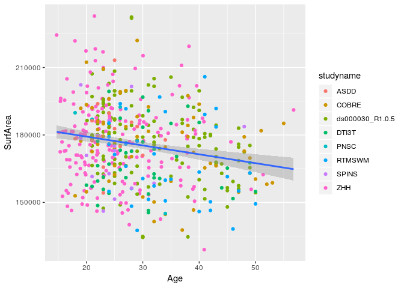

This is an [R Markdown](http://rmarkdown.rstudio.com) Notebook. When you execute code within the notebook, the results appear beneath the code. 

Try executing this chunk by clicking the *Run* button within the chunk or by placing your cursor inside it and pressing *Ctrl+Shift+Enter*. 


```r
library(tidyverse)
```

```
## ── Attaching packages ────────────────────────────────────────────────────────────────────────────────────────────── tidyverse 1.2.1 ──
```

```
## ✔ ggplot2 3.1.0       ✔ purrr   0.2.5  
## ✔ tibble  2.0.1       ✔ dplyr   0.8.0.1
## ✔ tidyr   0.8.2       ✔ stringr 1.3.1  
## ✔ readr   1.3.0       ✔ forcats 0.3.0
```

```
## ── Conflicts ───────────────────────────────────────────────────────────────────────────────────────────────── tidyverse_conflicts() ──
## ✖ dplyr::filter() masks stats::filter()
## ✖ dplyr::lag()    masks stats::lag()
```


```r
sub_projects = c("ZHH", "COBRE", "ASDD", "ASDD", "DTI3T" , "RTMSWM", "PNSC", "SPINS", "ds000030_R1.0.5")

read_mriqc_bold <- function(studyname) {
  bold <- read_csv(str_c("../data/ciftify_fmriprep/", studyname, "/out/mriqc/bold.csv")) %>%
    mutate(subject_id = as.character(subject_id))
  if ("session_id" %in% names(bold)) {
    bold <- bold %>% mutate(session_id = as.character(session_id))
  }
  return(bold)
}

all_the_bolds <- tibble(studyname = sub_projects) %>% 
    mutate(boldqc = map(studyname, function(x) {
        read_mriqc_bold(x)
    })) %>%
    unnest() %>%
  filter(task_id == "rest") 
```


```r
read_mriqc_t1w <- function(studyname) {
  bold <- read_csv(str_c("../data/ciftify_fmriprep/", studyname, "/out/mriqc/T1w.csv")) %>%
    mutate(subject_id = as.character(subject_id))
  if ("session_id" %in% names(bold)) {
    bold <- bold %>% mutate(session_id = as.character(session_id))
  }
  return(bold)
}

all_the_T1w <- tibble(studyname = sub_projects) %>% 
    mutate(t1wqc = map(studyname, function(x) {
        read_mriqc_t1w(x)
    })) %>%
    unnest() %>%
  group_by(studyname, subject_id) %>%
  summarise(num_t1w = n())
```


```r
usable_scans <- all_the_bolds %>%
  group_by(studyname, subject_id, task_id) %>%
  summarise(num_rest = n()) %>%
  full_join(all_the_T1w, by = c("subject_id", "studyname")) %>%
  mutate(num_scans = num_rest + num_t1w)
```


```r
usable_scans %>%
  ungroup() %>%
  select(subject_id, studyname, num_scans) %>%
  drop_na(num_scans) %>%
  distinct() %>%
  count()
```

```
## # A tibble: 1 x 1
##       n
##   <int>
## 1   704
```

```r
pint_summarys_wses <- Sys.glob("../data/ciftify_fmriprep/*/out/ciftify_PINT/sub*/ses*/*summary.csv")

pint_summarys_nses <- Sys.glob("../data/ciftify_fmriprep/*/out/ciftify_PINT/sub*/*summary.csv")

pintdf_nses <- tibble(filepath = pint_summarys_nses) %>%
  separate(filepath,
           into = c('1','2','3','dataset','4','5','subject', 'filename'),
           sep = .Platform$file.sep) %>%
  select(dataset, subject, filename)

pintdf_wses <- tibble(filepath = pint_summarys_wses) %>%
  separate(filepath,
           into = c('1','2','3','dataset','4','5','subject', 'session', 'filename'),
           sep = .Platform$file.sep) %>%
  select(dataset, subject, session, filename)

pintdf <- bind_rows(pintdf_wses, pintdf_nses)

rm(pint_summarys_nses, pint_summarys_wses, pintdf_nses, pintdf_wses)
```


```r
bolds_condensed <- all_the_bolds %>%
  select(studyname, ends_with('_id'), starts_with('fd_'), starts_with('size'), starts_with('spacing')) %>%
  rename(dataset = studyname) %>%
  mutate(subject = str_c("sub-", subject_id),
         session = str_c("ses-",session_id)) 
```


```r
# removing session id column because it is redundant
simple_pheno <- read_csv('../phenotypic/simple_pheno_201811.csv') 
```

```
## Parsed with column specification:
## cols(
##   subject = col_character(),
##   cmh_session_id = col_character(),
##   DX = col_character(),
##   Age = col_double(),
##   Sex = col_character(),
##   dataset = col_character(),
##   Site = col_character(),
##   Scanner = col_character(),
##   GRID = col_double(),
##   zhh_session_id = col_double(),
##   MRI_Date = col_double(),
##   Edu = col_double(),
##   isFEP = col_character(),
##   ghost_NoGhost = col_character()
## )
```

#### we see that the only people we have bold info but no phenotype for is that one VIPR participant in SPINS and the 5 people from ds00030 who don't have a T1w scan


```r
all_surfs <- Sys.glob('../data/ciftify_fmriprep/*/out/freesurfer/CorticalMeasuresENIGMA_SurfAvg.csv') %>%
  map_df(read_csv, col_types = cols(
  .default = col_double(),
  SubjID = col_character()
)) %>%
  select(SubjID, LSurfArea, RSurfArea) %>%
  mutate(SurfArea = LSurfArea + RSurfArea)
```


```r
usable_scans %>%
  mutate(subject = str_c("sub-", subject_id)) %>%
  anti_join(simple_pheno, by = "subject") %>%
  drop_na(num_scans)
```

```
## # A tibble: 1 x 7
## # Groups:   studyname, subject_id [1]
##   studyname subject_id task_id num_rest num_t1w num_scans subject      
##   <chr>     <chr>      <chr>      <int>   <int>     <int> <chr>        
## 1 SPINS     CMHAA2102  rest           1       1         2 sub-CMHAA2102
```

```r
simple_pheno %>%
  anti_join(usable_scans %>% mutate(subject = str_c("sub-", subject_id)), by = "subject") 
```

```
## # A tibble: 58 x 14
##    subject cmh_session_id DX      Age Sex   dataset Site  Scanner  GRID
##    <chr>   <chr>          <chr> <dbl> <chr> <chr>   <chr> <chr>   <dbl>
##  1 sub-CM… 02             CTRL     39 M     DTI3T   CMH   CMH        NA
##  2 sub-CM… 02             CTRL     41 F     DTI3T   CMH   CMH        NA
##  3 sub-CM… 02             CTRL     36 M     DTI3T   CMH   CMH        NA
##  4 sub-CM… 02             CTRL     50 F     DTI3T   CMH   CMH        NA
##  5 sub-CM… 02             SSD      35 F     DTI3T   CMH   CMH        NA
##  6 sub-CM… 01             SSD      27 M     DTI3T   CMH   CMH        NA
##  7 sub-CM… 01             SSD      42 M     RTMSWM  CMH   CMH        NA
##  8 sub-CM… 01             SSD      28 M     RTMSWM  CMH   CMH        NA
##  9 sub-CM… 01             SSD      47 F     RTMSWM  CMH   CMH        NA
## 10 sub-CM… 01             SSD      48 M     RTMSWM  CMH   CMH        NA
## # … with 48 more rows, and 5 more variables: zhh_session_id <dbl>,
## #   MRI_Date <dbl>, Edu <dbl>, isFEP <chr>, ghost_NoGhost <chr>
```


## Setting the motion threshold:

We have set the motion threshold to:
Mean FD < 0.5mm and
No more than 50% of the scan with motion > 0.2mm


```r
mean_fd_thres <- 0.5
perc_fd_thres <- 50

pre_qa <- bolds_condensed %>%
  inner_join(usable_scans %>% mutate(subject = str_c("sub-", subject_id)), by = "subject") %>%
  drop_na(num_scans) %>%
  inner_join(simple_pheno, by = c("subject", "dataset")) %>%
  inner_join(all_surfs, by = c("subject"="SubjID"))

pre_qa_counts <- pre_qa %>%
  select(subject, dataset, DX) %>%
  distinct() %>%
  count(DX)

qa_passes_pheno <- pre_qa %>%
  filter(fd_mean < 0.5, fd_perc < 50, size_t > 100) 

qa_passes_pheno %>%
  select(subject, dataset, DX) %>%
  distinct() %>%
  count(DX) %>%
  inner_join(pre_qa_counts, by = "DX", suffix = c("_after_qa", "_before_qa"))
```

```
## # A tibble: 3 x 3
##   DX    n_after_qa n_before_qa
##   <chr>      <int>       <int>
## 1 <NA>           2           9
## 2 CTRL         294         377
## 3 SSD          203         317
```

## who is still missing a PINT output?


```r
anti_join(qa_passes_pheno, pintdf,
          by = c("dataset", "subject", "session")) 
```

```
## # A tibble: 0 x 40
## # … with 40 variables: dataset <chr>, subject_id.x <chr>,
## #   session_id <chr>, task_id.x <chr>, run_id <chr>, acq_id <chr>,
## #   fd_mean <dbl>, fd_num <dbl>, fd_perc <dbl>, size_t <dbl>,
## #   size_x <dbl>, size_y <dbl>, size_z <dbl>, spacing_tr <dbl>,
## #   spacing_x <dbl>, spacing_y <dbl>, spacing_z <dbl>, subject <chr>,
## #   session <chr>, studyname <chr>, subject_id.y <chr>, task_id.y <chr>,
## #   num_rest <int>, num_t1w <int>, num_scans <int>, cmh_session_id <chr>,
## #   DX <chr>, Age <dbl>, Sex <chr>, Site <chr>, Scanner <chr>, GRID <dbl>,
## #   zhh_session_id <dbl>, MRI_Date <dbl>, Edu <dbl>, isFEP <chr>,
## #   ghost_NoGhost <chr>, LSurfArea <dbl>, RSurfArea <dbl>, SurfArea <dbl>
```

# read and mangle the phenotypic data

Note we are also selecting to use scan from each subject with the least motion (fd_perc)
We are also


```r
transform_to_normal <- function(X) {
  # calculate the best exponent using powerTransform:
  pT <- car::powerTransform(X)
  # apply the power transform and save the result to a new variable
  X_pT <- X^pT$lambda ## note ^ is exponent in r
  xout = scales::rescale(X_pT)
  return(X_pT)
}

# select the scan for each participant with the least motion
pheno <- qa_passes_pheno %>%
  select(-ends_with("_x"), -ends_with("_y")) %>%
  left_join(pintdf,
          by = c("dataset", "subject", "session")) %>%
  filter(!is.na(filename)) %>%
  group_by(subject) %>%
  arrange(fd_perc) %>%
  slice(1) %>%
  ungroup() 
```


```r
pheno %>%
  ggplot(aes(x = Age, y = SurfArea)) + 
  geom_point(aes(color = studyname)) + geom_smooth(method = "lm") 
```

<!-- -->


```r
# transform age and fd_mean to normality
pheno <- pheno %>%
  mutate(Age_pt = transform_to_normal(Age),
         fd_mean_pt = transform_to_normal(fd_mean),
         SurfArea_pt = transform_to_normal(SurfArea))
```


```r
pheno %>%
  select(subject, dataset, DX) %>%
  distinct() %>%
  count(DX) %>%
  inner_join(pre_qa_counts, by = "DX", suffix = c("_after_qa", "_before_qa"))
```

```
## # A tibble: 3 x 3
##   DX    n_after_qa n_before_qa
##   <chr>      <int>       <int>
## 1 <NA>           2           9
## 2 CTRL         292         377
## 3 SSD          202         317
```


```r
pheno %>%
  group_by(Site, DX) %>%
  summarise(n = n(),
            nMale = sum(Sex == "M"),
            perc_male = nMale/n()*100,
            age_mean = mean(Age, na.rm = T),
            age_sd = sd(Age, na.rm = T),
            age_min = min(Age, na.rm = T),
            age_max = max(Age, na.rm = T)) %>%
    mutate(age_report =sprintf("%0.1f(%0.1f) %0.0f - %0.0f", 
                               age_mean, age_sd, age_min, age_max),
           sex_report = str_c(nMale, '(', sprintf("%0.1f", perc_male), '%)')) %>%
  select(Site, DX, n, age_report, sex_report)
```

```
## # A tibble: 9 x 5
## # Groups:   Site [4]
##   Site     DX        n age_report         sex_report
##   <chr>    <chr> <int> <chr>              <chr>     
## 1 CMH      CTRL     41 26.4(6.7) 18 - 49  22(53.7%) 
## 2 CMH      SSD      67 32.2(8.5) 18 - 50  40(59.7%) 
## 3 COBRE    <NA>      2 40.0(2.8) 38 - 42  1(50.0%)  
## 4 COBRE    CTRL     35 33.2(9.0) 18 - 51  23(65.7%) 
## 5 COBRE    SSD      22 29.5(12.1) 19 - 55 19(86.4%) 
## 6 ds000030 CTRL    105 30.5(8.2) 21 - 50  55(52.4%) 
## 7 ds000030 SSD      31 35.2(9.3) 22 - 49  24(77.4%) 
## 8 ZHH      CTRL    111 25.1(6.6) 15 - 41  48(43.2%) 
## 9 ZHH      SSD      82 25.9(9.0) 15 - 57  63(76.8%)
```

```r
qa_passes_pheno %>%
  mutate(scan_length = size_t*2/60,
         spacing_x_round = round(spacing_x, 3),
         spacing_z_round = round(spacing_z,3)) %>%
  group_by(subject) %>%
  sample_n(1) %>%
  ungroup() %>%
  group_by(Site, DX, size_t, size_x, size_y, size_z, spacing_x_round, spacing_z_round, scan_length) %>%
  count()
```

```
## # A tibble: 35 x 10
## # Groups:   Site, DX, size_t, size_x, size_y, size_z, spacing_x_round,
## #   spacing_z_round, scan_length [35]
##    Site  DX    size_t size_x size_y size_z spacing_x_round spacing_z_round
##    <chr> <chr>  <dbl>  <dbl>  <dbl>  <dbl>           <dbl>           <dbl>
##  1 CMH   CTRL     204     64     64     40            3.12            4   
##  2 CMH   CTRL     207     64     64     40            3.12            4   
##  3 CMH   CTRL     208     64     64     39            3.12            4   
##  4 CMH   CTRL     208     64     64     40            3.12            4   
##  5 CMH   SSD      203     64     64     40            3.12            4   
##  6 CMH   SSD      208     64     64     39            3.12            4   
##  7 CMH   SSD      208     64     64     40            3.12            4   
##  8 COBRE <NA>     149     64     64     33            3.75            4.55
##  9 COBRE <NA>     150     64     64     33            3.75            4.55
## 10 COBRE CTRL     147     64     64     33            3.75            4.55
## # … with 25 more rows, and 2 more variables: scan_length <dbl>, n <int>
```


```r
write_csv(pheno, '../phenotypic/20190301_pheno_qapass.csv')
```

+ ASDD is done!
+ ZHH is done! (note that the TR for scans without a TR was set to 2s by Saba and Dayton)
+ RTMSWM is done!
+ PNSC is done
+ DTI3T is done!
+ SPINS has one extra bold (CMHAA2102 - from VIPR - disregard)
+ COBRE is done (enough) - but half of it never downloaded
+ ds00030 5 subjects need to rerun ciftify..


