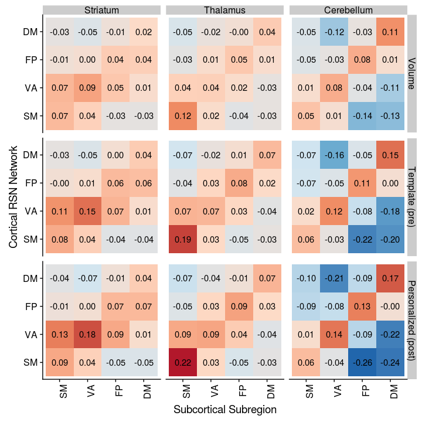
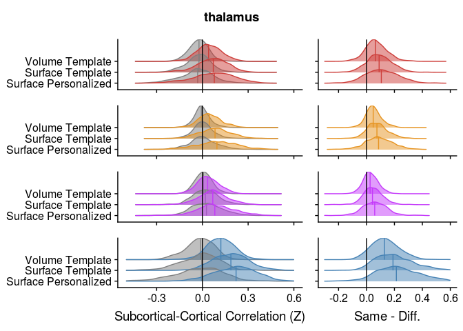
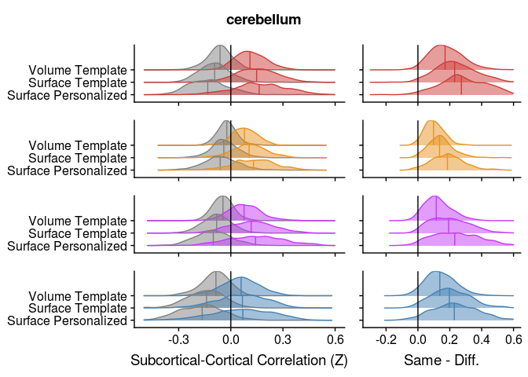

# Sub-cortical Cortical Stats Left and Right

This analysis tries to combine timeseries data from PINT outputs with subcortical timeseries to ask two questions

1. "External" validation of PINT. If PINT is indeed helping us better target meaningful resting state networks than we should see "cleaner" patterns of between the PINT output cortical ROIs and parcels of the subcortical structure that have been associated with these networks in literature.
   + i.e. connectivity of the cortical ROIS with "expected" subcortical parcel should increae and correlation with other parcels should decrease after PINT.
   
2. To interograte SSD related differences in Cortical-Subcortical connectivity - and to see if they persist after PINT.

Some work Ji (in prep) kinda suggests that there might be differences between left and right subcortical structures. AND spliting the left and right seemed to make more sense for whole brain correlations (because our cortical nodes have a hemisphere). So in this analysis have separate left and right ROIs


```r
library(tidyverse)
```

```
## ── Attaching packages ───────────────────────────────────────────────────────────────────────────────────────────── tidyverse 1.2.1 ──
```

```
## ✔ ggplot2 3.1.0       ✔ purrr   0.2.5  
## ✔ tibble  2.0.1       ✔ dplyr   0.8.0.1
## ✔ tidyr   0.8.2       ✔ stringr 1.3.1  
## ✔ readr   1.3.0       ✔ forcats 0.3.0
```

```
## ── Conflicts ──────────────────────────────────────────────────────────────────────────────────────────────── tidyverse_conflicts() ──
## ✖ dplyr::filter() masks stats::filter()
## ✖ dplyr::lag()    masks stats::lag()
```

```r
library(broom)
library(knitr)
library(tableone)
library(cowplot)
```

```
## 
## Attaching package: 'cowplot'
```

```
## The following object is masked from 'package:ggplot2':
## 
##     ggsave
```

```r
library(ggridges)
```

```
## 
## Attaching package: 'ggridges'
```

```
## The following object is masked from 'package:ggplot2':
## 
##     scale_discrete_manual
```


## The paths to data


```r
source('../R/file_reading_helpers.R')
source('../R/custom_plot_helpers.R')

pheno <- read_pheno_file()
```

```
## Parsed with column specification:
## cols(
##   .default = col_character(),
##   fd_mean = col_double(),
##   fd_num = col_double(),
##   fd_perc = col_double(),
##   size_t = col_double(),
##   size_z = col_double(),
##   spacing_tr = col_double(),
##   spacing_z = col_double(),
##   num_rest = col_double(),
##   num_t1w = col_double(),
##   num_scans = col_double(),
##   Age = col_double(),
##   GRID = col_double(),
##   zhh_session_id = col_double(),
##   MRI_Date = col_double(),
##   Edu = col_double(),
##   Age_pt = col_double(),
##   fd_mean_pt = col_double()
## )
```

```
## See spec(...) for full column specifications.
```

```r
YeoNet_colours <- define_Yeo7_colours()
Yeo7_2011_80verts <- read_Yeo72011_template()
```


This reads all files and generate PINT to subcortical correlation values for a given subject


### This reads all the subcortical files it can find

Write a func_base and outputprefix cols into the pheno file for the file reading step


```r
pheno <- pheno %>%
  mutate(func_base = get_func_base_from_pint_summary_filename(filename,subject, session), 
         outputprefix = construct_output_prefix(subject, session, func_base)) 
```

a litle chunck I use to test if test if the reader is working...


```r
run_read_all_subject_timeseries_and_subcortcort_corZ(pheno$outputprefix[1], pheno$dataset[1])
```


```r
all_subcort_results <- pheno %>%
  select(subject, outputprefix, dataset) %>%
  mutate(subcort_corrs = map2(outputprefix, dataset,
                              ~run_read_all_subject_timeseries_and_subcortcort_corZ(.x, .y)))
```

```
## Warning: Unknown or uninitialised column: 'combined_name'.

## Warning: Unknown or uninitialised column: 'combined_name'.

## Warning: Unknown or uninitialised column: 'combined_name'.

## Warning: Unknown or uninitialised column: 'combined_name'.

## Warning: Unknown or uninitialised column: 'combined_name'.

## Warning: Unknown or uninitialised column: 'combined_name'.

## Warning: Unknown or uninitialised column: 'combined_name'.

## Warning: Unknown or uninitialised column: 'combined_name'.

## Warning: Unknown or uninitialised column: 'combined_name'.

## Warning: Unknown or uninitialised column: 'combined_name'.

## Warning: Unknown or uninitialised column: 'combined_name'.

## Warning: Unknown or uninitialised column: 'combined_name'.

## Warning: Unknown or uninitialised column: 'combined_name'.

## Warning: Unknown or uninitialised column: 'combined_name'.

## Warning: Unknown or uninitialised column: 'combined_name'.

## Warning: Unknown or uninitialised column: 'combined_name'.

## Warning: Unknown or uninitialised column: 'combined_name'.

## Warning: Unknown or uninitialised column: 'combined_name'.

## Warning: Unknown or uninitialised column: 'combined_name'.

## Warning: Unknown or uninitialised column: 'combined_name'.

## Warning: Unknown or uninitialised column: 'combined_name'.

## Warning: Unknown or uninitialised column: 'combined_name'.

## Warning: Unknown or uninitialised column: 'combined_name'.

## Warning: Unknown or uninitialised column: 'combined_name'.

## Warning: Unknown or uninitialised column: 'combined_name'.

## Warning: Unknown or uninitialised column: 'combined_name'.

## Warning: Unknown or uninitialised column: 'combined_name'.

## Warning: Unknown or uninitialised column: 'combined_name'.

## Warning: Unknown or uninitialised column: 'combined_name'.

## Warning: Unknown or uninitialised column: 'combined_name'.

## Warning: Unknown or uninitialised column: 'combined_name'.

## Warning: Unknown or uninitialised column: 'combined_name'.

## Warning: Unknown or uninitialised column: 'combined_name'.

## Warning: Unknown or uninitialised column: 'combined_name'.

## Warning: Unknown or uninitialised column: 'combined_name'.

## Warning: Unknown or uninitialised column: 'combined_name'.

## Warning: Unknown or uninitialised column: 'combined_name'.

## Warning: Unknown or uninitialised column: 'combined_name'.

## Warning: Unknown or uninitialised column: 'combined_name'.

## Warning: Unknown or uninitialised column: 'combined_name'.

## Warning: Unknown or uninitialised column: 'combined_name'.

## Warning: Unknown or uninitialised column: 'combined_name'.

## Warning: Unknown or uninitialised column: 'combined_name'.

## Warning: Unknown or uninitialised column: 'combined_name'.

## Warning: Unknown or uninitialised column: 'combined_name'.

## Warning: Unknown or uninitialised column: 'combined_name'.

## Warning: Unknown or uninitialised column: 'combined_name'.

## Warning: Unknown or uninitialised column: 'combined_name'.

## Warning: Unknown or uninitialised column: 'combined_name'.

## Warning: Unknown or uninitialised column: 'combined_name'.

## Warning: Unknown or uninitialised column: 'combined_name'.

## Warning: Unknown or uninitialised column: 'combined_name'.

## Warning: Unknown or uninitialised column: 'combined_name'.

## Warning: Unknown or uninitialised column: 'combined_name'.

## Warning: Unknown or uninitialised column: 'combined_name'.

## Warning: Unknown or uninitialised column: 'combined_name'.

## Warning: Unknown or uninitialised column: 'combined_name'.

## Warning: Unknown or uninitialised column: 'combined_name'.

## Warning: Unknown or uninitialised column: 'combined_name'.

## Warning: Unknown or uninitialised column: 'combined_name'.

## Warning: Unknown or uninitialised column: 'combined_name'.

## Warning: Unknown or uninitialised column: 'combined_name'.

## Warning: Unknown or uninitialised column: 'combined_name'.

## Warning: Unknown or uninitialised column: 'combined_name'.

## Warning: Unknown or uninitialised column: 'combined_name'.

## Warning: Unknown or uninitialised column: 'combined_name'.

## Warning: Unknown or uninitialised column: 'combined_name'.

## Warning: Unknown or uninitialised column: 'combined_name'.

## Warning: Unknown or uninitialised column: 'combined_name'.

## Warning: Unknown or uninitialised column: 'combined_name'.

## Warning: Unknown or uninitialised column: 'combined_name'.

## Warning: Unknown or uninitialised column: 'combined_name'.

## Warning: Unknown or uninitialised column: 'combined_name'.

## Warning: Unknown or uninitialised column: 'combined_name'.

## Warning: Unknown or uninitialised column: 'combined_name'.

## Warning: Unknown or uninitialised column: 'combined_name'.

## Warning: Unknown or uninitialised column: 'combined_name'.

## Warning: Unknown or uninitialised column: 'combined_name'.

## Warning: Unknown or uninitialised column: 'combined_name'.

## Warning: Unknown or uninitialised column: 'combined_name'.

## Warning: Unknown or uninitialised column: 'combined_name'.

## Warning: Unknown or uninitialised column: 'combined_name'.

## Warning: Unknown or uninitialised column: 'combined_name'.

## Warning: Unknown or uninitialised column: 'combined_name'.

## Warning: Unknown or uninitialised column: 'combined_name'.

## Warning: Unknown or uninitialised column: 'combined_name'.

## Warning: Unknown or uninitialised column: 'combined_name'.

## Warning: Unknown or uninitialised column: 'combined_name'.

## Warning: Unknown or uninitialised column: 'combined_name'.

## Warning: Unknown or uninitialised column: 'combined_name'.

## Warning: Unknown or uninitialised column: 'combined_name'.

## Warning: Unknown or uninitialised column: 'combined_name'.

## Warning: Unknown or uninitialised column: 'combined_name'.

## Warning: Unknown or uninitialised column: 'combined_name'.

## Warning: Unknown or uninitialised column: 'combined_name'.

## Warning: Unknown or uninitialised column: 'combined_name'.

## Warning: Unknown or uninitialised column: 'combined_name'.

## Warning: Unknown or uninitialised column: 'combined_name'.

## Warning: Unknown or uninitialised column: 'combined_name'.

## Warning: Unknown or uninitialised column: 'combined_name'.

## Warning: Unknown or uninitialised column: 'combined_name'.

## Warning: Unknown or uninitialised column: 'combined_name'.

## Warning: Unknown or uninitialised column: 'combined_name'.

## Warning: Unknown or uninitialised column: 'combined_name'.

## Warning: Unknown or uninitialised column: 'combined_name'.

## Warning: Unknown or uninitialised column: 'combined_name'.

## Warning: Unknown or uninitialised column: 'combined_name'.

## Warning: Unknown or uninitialised column: 'combined_name'.

## Warning: Unknown or uninitialised column: 'combined_name'.

## Warning: Unknown or uninitialised column: 'combined_name'.

## Warning: Unknown or uninitialised column: 'combined_name'.

## Warning: Unknown or uninitialised column: 'combined_name'.

## Warning: Unknown or uninitialised column: 'combined_name'.

## Warning: Unknown or uninitialised column: 'combined_name'.

## Warning: Unknown or uninitialised column: 'combined_name'.

## Warning: Unknown or uninitialised column: 'combined_name'.

## Warning: Unknown or uninitialised column: 'combined_name'.

## Warning: Unknown or uninitialised column: 'combined_name'.

## Warning: Unknown or uninitialised column: 'combined_name'.

## Warning: Unknown or uninitialised column: 'combined_name'.

## Warning: Unknown or uninitialised column: 'combined_name'.

## Warning: Unknown or uninitialised column: 'combined_name'.

## Warning: Unknown or uninitialised column: 'combined_name'.

## Warning: Unknown or uninitialised column: 'combined_name'.

## Warning: Unknown or uninitialised column: 'combined_name'.

## Warning: Unknown or uninitialised column: 'combined_name'.

## Warning: Unknown or uninitialised column: 'combined_name'.

## Warning: Unknown or uninitialised column: 'combined_name'.

## Warning: Unknown or uninitialised column: 'combined_name'.

## Warning: Unknown or uninitialised column: 'combined_name'.

## Warning: Unknown or uninitialised column: 'combined_name'.

## Warning: Unknown or uninitialised column: 'combined_name'.

## Warning: Unknown or uninitialised column: 'combined_name'.

## Warning: Unknown or uninitialised column: 'combined_name'.

## Warning: Unknown or uninitialised column: 'combined_name'.

## Warning: Unknown or uninitialised column: 'combined_name'.

## Warning: Unknown or uninitialised column: 'combined_name'.

## Warning: Unknown or uninitialised column: 'combined_name'.

## Warning: Unknown or uninitialised column: 'combined_name'.

## Warning: Unknown or uninitialised column: 'combined_name'.

## Warning: Unknown or uninitialised column: 'combined_name'.

## Warning: Unknown or uninitialised column: 'combined_name'.

## Warning: Unknown or uninitialised column: 'combined_name'.

## Warning: Unknown or uninitialised column: 'combined_name'.

## Warning: Unknown or uninitialised column: 'combined_name'.

## Warning: Unknown or uninitialised column: 'combined_name'.

## Warning: Unknown or uninitialised column: 'combined_name'.

## Warning: Unknown or uninitialised column: 'combined_name'.

## Warning: Unknown or uninitialised column: 'combined_name'.

## Warning: Unknown or uninitialised column: 'combined_name'.

## Warning: Unknown or uninitialised column: 'combined_name'.

## Warning: Unknown or uninitialised column: 'combined_name'.

## Warning: Unknown or uninitialised column: 'combined_name'.

## Warning: Unknown or uninitialised column: 'combined_name'.

## Warning: Unknown or uninitialised column: 'combined_name'.

## Warning: Unknown or uninitialised column: 'combined_name'.

## Warning: Unknown or uninitialised column: 'combined_name'.

## Warning: Unknown or uninitialised column: 'combined_name'.

## Warning: Unknown or uninitialised column: 'combined_name'.

## Warning: Unknown or uninitialised column: 'combined_name'.

## Warning: Unknown or uninitialised column: 'combined_name'.

## Warning: Unknown or uninitialised column: 'combined_name'.

## Warning: Unknown or uninitialised column: 'combined_name'.

## Warning: Unknown or uninitialised column: 'combined_name'.

## Warning: Unknown or uninitialised column: 'combined_name'.

## Warning: Unknown or uninitialised column: 'combined_name'.

## Warning: Unknown or uninitialised column: 'combined_name'.

## Warning: Unknown or uninitialised column: 'combined_name'.

## Warning: Unknown or uninitialised column: 'combined_name'.

## Warning: Unknown or uninitialised column: 'combined_name'.

## Warning: Unknown or uninitialised column: 'combined_name'.

## Warning: Unknown or uninitialised column: 'combined_name'.

## Warning: Unknown or uninitialised column: 'combined_name'.

## Warning: Unknown or uninitialised column: 'combined_name'.

## Warning: Unknown or uninitialised column: 'combined_name'.

## Warning: Unknown or uninitialised column: 'combined_name'.

## Warning: Unknown or uninitialised column: 'combined_name'.

## Warning: Unknown or uninitialised column: 'combined_name'.

## Warning: Unknown or uninitialised column: 'combined_name'.

## Warning: Unknown or uninitialised column: 'combined_name'.

## Warning: Unknown or uninitialised column: 'combined_name'.

## Warning: Unknown or uninitialised column: 'combined_name'.

## Warning: Unknown or uninitialised column: 'combined_name'.

## Warning: Unknown or uninitialised column: 'combined_name'.

## Warning: Unknown or uninitialised column: 'combined_name'.

## Warning: Unknown or uninitialised column: 'combined_name'.

## Warning: Unknown or uninitialised column: 'combined_name'.

## Warning: Unknown or uninitialised column: 'combined_name'.

## Warning: Unknown or uninitialised column: 'combined_name'.

## Warning: Unknown or uninitialised column: 'combined_name'.

## Warning: Unknown or uninitialised column: 'combined_name'.

## Warning: Unknown or uninitialised column: 'combined_name'.

## Warning: Unknown or uninitialised column: 'combined_name'.

## Warning: Unknown or uninitialised column: 'combined_name'.

## Warning: Unknown or uninitialised column: 'combined_name'.

## Warning: Unknown or uninitialised column: 'combined_name'.

## Warning: Unknown or uninitialised column: 'combined_name'.

## Warning: Unknown or uninitialised column: 'combined_name'.

## Warning: Unknown or uninitialised column: 'combined_name'.

## Warning: Unknown or uninitialised column: 'combined_name'.

## Warning: Unknown or uninitialised column: 'combined_name'.

## Warning: Unknown or uninitialised column: 'combined_name'.

## Warning: Unknown or uninitialised column: 'combined_name'.

## Warning: Unknown or uninitialised column: 'combined_name'.

## Warning: Unknown or uninitialised column: 'combined_name'.

## Warning: Unknown or uninitialised column: 'combined_name'.

## Warning: Unknown or uninitialised column: 'combined_name'.

## Warning: Unknown or uninitialised column: 'combined_name'.

## Warning: Unknown or uninitialised column: 'combined_name'.

## Warning: Unknown or uninitialised column: 'combined_name'.

## Warning: Unknown or uninitialised column: 'combined_name'.

## Warning: Unknown or uninitialised column: 'combined_name'.

## Warning: Unknown or uninitialised column: 'combined_name'.

## Warning: Unknown or uninitialised column: 'combined_name'.

## Warning: Unknown or uninitialised column: 'combined_name'.

## Warning: Unknown or uninitialised column: 'combined_name'.

## Warning: Unknown or uninitialised column: 'combined_name'.

## Warning: Unknown or uninitialised column: 'combined_name'.

## Warning: Unknown or uninitialised column: 'combined_name'.

## Warning: Unknown or uninitialised column: 'combined_name'.

## Warning: Unknown or uninitialised column: 'combined_name'.

## Warning: Unknown or uninitialised column: 'combined_name'.

## Warning: Unknown or uninitialised column: 'combined_name'.

## Warning: Unknown or uninitialised column: 'combined_name'.

## Warning: Unknown or uninitialised column: 'combined_name'.

## Warning: Unknown or uninitialised column: 'combined_name'.

## Warning: Unknown or uninitialised column: 'combined_name'.

## Warning: Unknown or uninitialised column: 'combined_name'.

## Warning: Unknown or uninitialised column: 'combined_name'.

## Warning: Unknown or uninitialised column: 'combined_name'.

## Warning: Unknown or uninitialised column: 'combined_name'.

## Warning: Unknown or uninitialised column: 'combined_name'.

## Warning: Unknown or uninitialised column: 'combined_name'.

## Warning: Unknown or uninitialised column: 'combined_name'.

## Warning: Unknown or uninitialised column: 'combined_name'.

## Warning: Unknown or uninitialised column: 'combined_name'.

## Warning: Unknown or uninitialised column: 'combined_name'.

## Warning: Unknown or uninitialised column: 'combined_name'.

## Warning: Unknown or uninitialised column: 'combined_name'.

## Warning: Unknown or uninitialised column: 'combined_name'.

## Warning: Unknown or uninitialised column: 'combined_name'.

## Warning: Unknown or uninitialised column: 'combined_name'.

## Warning: Unknown or uninitialised column: 'combined_name'.

## Warning: Unknown or uninitialised column: 'combined_name'.

## Warning: Unknown or uninitialised column: 'combined_name'.

## Warning: Unknown or uninitialised column: 'combined_name'.

## Warning: Unknown or uninitialised column: 'combined_name'.

## Warning: Unknown or uninitialised column: 'combined_name'.

## Warning: Unknown or uninitialised column: 'combined_name'.

## Warning: Unknown or uninitialised column: 'combined_name'.

## Warning: Unknown or uninitialised column: 'combined_name'.

## Warning: Unknown or uninitialised column: 'combined_name'.

## Warning: Unknown or uninitialised column: 'combined_name'.

## Warning: Unknown or uninitialised column: 'combined_name'.

## Warning: Unknown or uninitialised column: 'combined_name'.

## Warning: Unknown or uninitialised column: 'combined_name'.

## Warning: Unknown or uninitialised column: 'combined_name'.

## Warning: Unknown or uninitialised column: 'combined_name'.

## Warning: Unknown or uninitialised column: 'combined_name'.

## Warning: Unknown or uninitialised column: 'combined_name'.

## Warning: Unknown or uninitialised column: 'combined_name'.

## Warning: Unknown or uninitialised column: 'combined_name'.

## Warning: Unknown or uninitialised column: 'combined_name'.

## Warning: Unknown or uninitialised column: 'combined_name'.

## Warning: Unknown or uninitialised column: 'combined_name'.

## Warning: Unknown or uninitialised column: 'combined_name'.

## Warning: Unknown or uninitialised column: 'combined_name'.

## Warning: Unknown or uninitialised column: 'combined_name'.

## Warning: Unknown or uninitialised column: 'combined_name'.

## Warning: Unknown or uninitialised column: 'combined_name'.

## Warning: Unknown or uninitialised column: 'combined_name'.

## Warning: Unknown or uninitialised column: 'combined_name'.

## Warning: Unknown or uninitialised column: 'combined_name'.

## Warning: Unknown or uninitialised column: 'combined_name'.

## Warning: Unknown or uninitialised column: 'combined_name'.

## Warning: Unknown or uninitialised column: 'combined_name'.

## Warning: Unknown or uninitialised column: 'combined_name'.

## Warning: Unknown or uninitialised column: 'combined_name'.

## Warning: Unknown or uninitialised column: 'combined_name'.

## Warning: Unknown or uninitialised column: 'combined_name'.

## Warning: Unknown or uninitialised column: 'combined_name'.

## Warning: Unknown or uninitialised column: 'combined_name'.

## Warning: Unknown or uninitialised column: 'combined_name'.

## Warning: Unknown or uninitialised column: 'combined_name'.

## Warning: Unknown or uninitialised column: 'combined_name'.

## Warning: Unknown or uninitialised column: 'combined_name'.

## Warning: Unknown or uninitialised column: 'combined_name'.

## Warning: Unknown or uninitialised column: 'combined_name'.

## Warning: Unknown or uninitialised column: 'combined_name'.

## Warning: Unknown or uninitialised column: 'combined_name'.

## Warning: Unknown or uninitialised column: 'combined_name'.

## Warning: Unknown or uninitialised column: 'combined_name'.

## Warning: Unknown or uninitialised column: 'combined_name'.

## Warning: Unknown or uninitialised column: 'combined_name'.

## Warning: Unknown or uninitialised column: 'combined_name'.

## Warning: Unknown or uninitialised column: 'combined_name'.

## Warning: Unknown or uninitialised column: 'combined_name'.

## Warning: Unknown or uninitialised column: 'combined_name'.

## Warning: Unknown or uninitialised column: 'combined_name'.

## Warning: Unknown or uninitialised column: 'combined_name'.

## Warning: Unknown or uninitialised column: 'combined_name'.

## Warning: Unknown or uninitialised column: 'combined_name'.

## Warning: Unknown or uninitialised column: 'combined_name'.

## Warning: Unknown or uninitialised column: 'combined_name'.

## Warning: Unknown or uninitialised column: 'combined_name'.

## Warning: Unknown or uninitialised column: 'combined_name'.

## Warning: Unknown or uninitialised column: 'combined_name'.

## Warning: Unknown or uninitialised column: 'combined_name'.

## Warning: Unknown or uninitialised column: 'combined_name'.

## Warning: Unknown or uninitialised column: 'combined_name'.

## Warning: Unknown or uninitialised column: 'combined_name'.

## Warning: Unknown or uninitialised column: 'combined_name'.

## Warning: Unknown or uninitialised column: 'combined_name'.

## Warning: Unknown or uninitialised column: 'combined_name'.

## Warning: Unknown or uninitialised column: 'combined_name'.

## Warning: Unknown or uninitialised column: 'combined_name'.

## Warning: Unknown or uninitialised column: 'combined_name'.

## Warning: Unknown or uninitialised column: 'combined_name'.

## Warning: Unknown or uninitialised column: 'combined_name'.

## Warning: Unknown or uninitialised column: 'combined_name'.

## Warning: Unknown or uninitialised column: 'combined_name'.

## Warning: Unknown or uninitialised column: 'combined_name'.

## Warning: Unknown or uninitialised column: 'combined_name'.

## Warning: Unknown or uninitialised column: 'combined_name'.

## Warning: Unknown or uninitialised column: 'combined_name'.

## Warning: Unknown or uninitialised column: 'combined_name'.

## Warning: Unknown or uninitialised column: 'combined_name'.

## Warning: Unknown or uninitialised column: 'combined_name'.

## Warning: Unknown or uninitialised column: 'combined_name'.

## Warning: Unknown or uninitialised column: 'combined_name'.

## Warning: Unknown or uninitialised column: 'combined_name'.

## Warning: Unknown or uninitialised column: 'combined_name'.

## Warning: Unknown or uninitialised column: 'combined_name'.

## Warning: Unknown or uninitialised column: 'combined_name'.

## Warning: Unknown or uninitialised column: 'combined_name'.

## Warning: Unknown or uninitialised column: 'combined_name'.

## Warning: Unknown or uninitialised column: 'combined_name'.

## Warning: Unknown or uninitialised column: 'combined_name'.

## Warning: Unknown or uninitialised column: 'combined_name'.

## Warning: Unknown or uninitialised column: 'combined_name'.

## Warning: Unknown or uninitialised column: 'combined_name'.

## Warning: Unknown or uninitialised column: 'combined_name'.

## Warning: Unknown or uninitialised column: 'combined_name'.

## Warning: Unknown or uninitialised column: 'combined_name'.

## Warning: Unknown or uninitialised column: 'combined_name'.

## Warning: Unknown or uninitialised column: 'combined_name'.

## Warning: Unknown or uninitialised column: 'combined_name'.

## Warning: Unknown or uninitialised column: 'combined_name'.

## Warning: Unknown or uninitialised column: 'combined_name'.

## Warning: Unknown or uninitialised column: 'combined_name'.

## Warning: Unknown or uninitialised column: 'combined_name'.

## Warning: Unknown or uninitialised column: 'combined_name'.

## Warning: Unknown or uninitialised column: 'combined_name'.

## Warning: Unknown or uninitialised column: 'combined_name'.

## Warning: Unknown or uninitialised column: 'combined_name'.

## Warning: Unknown or uninitialised column: 'combined_name'.

## Warning: Unknown or uninitialised column: 'combined_name'.

## Warning: Unknown or uninitialised column: 'combined_name'.

## Warning: Unknown or uninitialised column: 'combined_name'.

## Warning: Unknown or uninitialised column: 'combined_name'.

## Warning: Unknown or uninitialised column: 'combined_name'.

## Warning: Unknown or uninitialised column: 'combined_name'.

## Warning: Unknown or uninitialised column: 'combined_name'.

## Warning: Unknown or uninitialised column: 'combined_name'.

## Warning: Unknown or uninitialised column: 'combined_name'.

## Warning: Unknown or uninitialised column: 'combined_name'.

## Warning: Unknown or uninitialised column: 'combined_name'.

## Warning: Unknown or uninitialised column: 'combined_name'.

## Warning: Unknown or uninitialised column: 'combined_name'.

## Warning: Unknown or uninitialised column: 'combined_name'.

## Warning: Unknown or uninitialised column: 'combined_name'.

## Warning: Unknown or uninitialised column: 'combined_name'.

## Warning: Unknown or uninitialised column: 'combined_name'.

## Warning: Unknown or uninitialised column: 'combined_name'.

## Warning: Unknown or uninitialised column: 'combined_name'.

## Warning: Unknown or uninitialised column: 'combined_name'.

## Warning: Unknown or uninitialised column: 'combined_name'.

## Warning: Unknown or uninitialised column: 'combined_name'.

## Warning: Unknown or uninitialised column: 'combined_name'.

## Warning: Unknown or uninitialised column: 'combined_name'.

## Warning: Unknown or uninitialised column: 'combined_name'.

## Warning: Unknown or uninitialised column: 'combined_name'.

## Warning: Unknown or uninitialised column: 'combined_name'.

## Warning: Unknown or uninitialised column: 'combined_name'.

## Warning: Unknown or uninitialised column: 'combined_name'.

## Warning: Unknown or uninitialised column: 'combined_name'.

## Warning: Unknown or uninitialised column: 'combined_name'.

## Warning: Unknown or uninitialised column: 'combined_name'.

## Warning: Unknown or uninitialised column: 'combined_name'.

## Warning: Unknown or uninitialised column: 'combined_name'.

## Warning: Unknown or uninitialised column: 'combined_name'.

## Warning: Unknown or uninitialised column: 'combined_name'.

## Warning: Unknown or uninitialised column: 'combined_name'.

## Warning: Unknown or uninitialised column: 'combined_name'.

## Warning: Unknown or uninitialised column: 'combined_name'.

## Warning: Unknown or uninitialised column: 'combined_name'.

## Warning: Unknown or uninitialised column: 'combined_name'.

## Warning: Unknown or uninitialised column: 'combined_name'.

## Warning: Unknown or uninitialised column: 'combined_name'.

## Warning: Unknown or uninitialised column: 'combined_name'.

## Warning: Unknown or uninitialised column: 'combined_name'.

## Warning: Unknown or uninitialised column: 'combined_name'.

## Warning: Unknown or uninitialised column: 'combined_name'.

## Warning: Unknown or uninitialised column: 'combined_name'.

## Warning: Unknown or uninitialised column: 'combined_name'.

## Warning: Unknown or uninitialised column: 'combined_name'.

## Warning: Unknown or uninitialised column: 'combined_name'.

## Warning: Unknown or uninitialised column: 'combined_name'.

## Warning: Unknown or uninitialised column: 'combined_name'.

## Warning: Unknown or uninitialised column: 'combined_name'.

## Warning: Unknown or uninitialised column: 'combined_name'.

## Warning: Unknown or uninitialised column: 'combined_name'.

## Warning: Unknown or uninitialised column: 'combined_name'.

## Warning: Unknown or uninitialised column: 'combined_name'.

## Warning: Unknown or uninitialised column: 'combined_name'.

## Warning: Unknown or uninitialised column: 'combined_name'.

## Warning: Unknown or uninitialised column: 'combined_name'.

## Warning: Unknown or uninitialised column: 'combined_name'.

## Warning: Unknown or uninitialised column: 'combined_name'.

## Warning: Unknown or uninitialised column: 'combined_name'.

## Warning: Unknown or uninitialised column: 'combined_name'.

## Warning: Unknown or uninitialised column: 'combined_name'.

## Warning: Unknown or uninitialised column: 'combined_name'.

## Warning: Unknown or uninitialised column: 'combined_name'.

## Warning: Unknown or uninitialised column: 'combined_name'.

## Warning: Unknown or uninitialised column: 'combined_name'.

## Warning: Unknown or uninitialised column: 'combined_name'.

## Warning: Unknown or uninitialised column: 'combined_name'.

## Warning: Unknown or uninitialised column: 'combined_name'.

## Warning: Unknown or uninitialised column: 'combined_name'.

## Warning: Unknown or uninitialised column: 'combined_name'.

## Warning: Unknown or uninitialised column: 'combined_name'.

## Warning: Unknown or uninitialised column: 'combined_name'.

## Warning: Unknown or uninitialised column: 'combined_name'.

## Warning: Unknown or uninitialised column: 'combined_name'.

## Warning: Unknown or uninitialised column: 'combined_name'.

## Warning: Unknown or uninitialised column: 'combined_name'.

## Warning: Unknown or uninitialised column: 'combined_name'.

## Warning: Unknown or uninitialised column: 'combined_name'.

## Warning: Unknown or uninitialised column: 'combined_name'.

## Warning: Unknown or uninitialised column: 'combined_name'.

## Warning: Unknown or uninitialised column: 'combined_name'.

## Warning: Unknown or uninitialised column: 'combined_name'.

## Warning: Unknown or uninitialised column: 'combined_name'.

## Warning: Unknown or uninitialised column: 'combined_name'.

## Warning: Unknown or uninitialised column: 'combined_name'.

## Warning: Unknown or uninitialised column: 'combined_name'.

## Warning: Unknown or uninitialised column: 'combined_name'.

## Warning: Unknown or uninitialised column: 'combined_name'.

## Warning: Unknown or uninitialised column: 'combined_name'.

## Warning: Unknown or uninitialised column: 'combined_name'.

## Warning: Unknown or uninitialised column: 'combined_name'.

## Warning: Unknown or uninitialised column: 'combined_name'.

## Warning: Unknown or uninitialised column: 'combined_name'.

## Warning: Unknown or uninitialised column: 'combined_name'.

## Warning: Unknown or uninitialised column: 'combined_name'.

## Warning: Unknown or uninitialised column: 'combined_name'.

## Warning: Unknown or uninitialised column: 'combined_name'.

## Warning: Unknown or uninitialised column: 'combined_name'.

## Warning: Unknown or uninitialised column: 'combined_name'.

## Warning: Unknown or uninitialised column: 'combined_name'.

## Warning: Unknown or uninitialised column: 'combined_name'.

## Warning: Unknown or uninitialised column: 'combined_name'.

## Warning: Unknown or uninitialised column: 'combined_name'.

## Warning: Unknown or uninitialised column: 'combined_name'.

## Warning: Unknown or uninitialised column: 'combined_name'.

## Warning: Unknown or uninitialised column: 'combined_name'.

## Warning: Unknown or uninitialised column: 'combined_name'.

## Warning: Unknown or uninitialised column: 'combined_name'.

## Warning: Unknown or uninitialised column: 'combined_name'.

## Warning: Unknown or uninitialised column: 'combined_name'.

## Warning: Unknown or uninitialised column: 'combined_name'.

## Warning: Unknown or uninitialised column: 'combined_name'.

## Warning: Unknown or uninitialised column: 'combined_name'.

## Warning: Unknown or uninitialised column: 'combined_name'.

## Warning: Unknown or uninitialised column: 'combined_name'.

## Warning: Unknown or uninitialised column: 'combined_name'.

## Warning: Unknown or uninitialised column: 'combined_name'.

## Warning: Unknown or uninitialised column: 'combined_name'.

## Warning: Unknown or uninitialised column: 'combined_name'.

## Warning: Unknown or uninitialised column: 'combined_name'.

## Warning: Unknown or uninitialised column: 'combined_name'.

## Warning: Unknown or uninitialised column: 'combined_name'.

## Warning: Unknown or uninitialised column: 'combined_name'.

## Warning: Unknown or uninitialised column: 'combined_name'.

## Warning: Unknown or uninitialised column: 'combined_name'.

## Warning: Unknown or uninitialised column: 'combined_name'.

## Warning: Unknown or uninitialised column: 'combined_name'.

## Warning: Unknown or uninitialised column: 'combined_name'.

## Warning: Unknown or uninitialised column: 'combined_name'.

## Warning: Unknown or uninitialised column: 'combined_name'.

## Warning: Unknown or uninitialised column: 'combined_name'.

## Warning: Unknown or uninitialised column: 'combined_name'.

## Warning: Unknown or uninitialised column: 'combined_name'.
```


```r
save(all_subcort_results, file = "../intermediate/03_subcort_results_cache.Rdata")
```


```r
load("../intermediate/03_subcort_results_cache.Rdata")
```

### merge with the phenotypic data


```r
results_pheno <- all_subcort_results %>%
  inner_join(pheno, by = "subject") %>%
  unnest() %>%
  mutate(YeoNet = str_sub(PINT_ROI, 1,2),
         hemisphere = str_sub(PINT_ROI, 5,5)) %>%
  mutate(conn_type = if_else(YeoNet == subcort_NET, "same_net", "diff_net"),
         YeoNet = factor(YeoNet, levels = c("VI", "SM", "DA", "VA", "FP", "DM")),
         subcort_NET = factor(subcort_NET, levels = c("VI", "SM", "DA", "VA", "FP", "DM", "LI"))) %>%
  select(subject, PINT_ROI, subcort_ROI, subcort_NET,subcort_hemi, 
         pvertex_corr, tvertex_corr, tvolume_corr,
         DX, Sex, fd_mean, Age, Site, Scanner, Age_pt, fd_mean_pt,  
         YeoNet, hemisphere, conn_type) 
```


## make a subject table from resuts pheno


```r
library(tableone)
therealtable1 <- CreateTableOne(
  strata = c("DX", "Site"),
  vars = c("Age", "Sex", "fd_mean", "fd_perc"),
  data = filter(results_pheno, PINT_ROI=="DMP1L",subcort_ROI=="thalamus", subcort_NET=="VA", subcort_hemi == "L")
)
```

```
## Warning in ModuleReturnVarsExist(vars, data): The data frame does not have:
## fd_perc Dropped
```

```r
tabMat <- print(therealtable1, quote = FALSE, noSpaces = TRUE, printToggle = FALSE)
kable(tabMat)
```

                      CTRL:CMH       SSD:CMH        CTRL:COBRE     SSD:COBRE       CTRL:ds000030   SSD:ds000030   CTRL:ZHH       SSD:ZHH        p        test 
--------------------  -------------  -------------  -------------  --------------  --------------  -------------  -------------  -------------  -------  -----
n                     41             67             35             22              105             31             111            82                           
Age (mean (SD))       26.37 (6.67)   32.19 (8.47)   33.17 (9.01)   29.55 (12.14)   30.47 (8.19)    35.23 (9.32)   25.07 (6.55)   25.87 (9.02)   <0.001        
Sex = M (%)           22 (53.7)      40 (59.7)      23 (65.7)      19 (86.4)       55 (52.4)       24 (77.4)      48 (43.2)      63 (76.8)      <0.001        
fd_mean (mean (SD))   0.10 (0.04)    0.12 (0.06)    0.18 (0.04)    0.21 (0.08)     0.14 (0.07)     0.18 (0.07)    0.12 (0.04)    0.12 (0.06)    <0.001        


```r
library(tableone)
therealtable1 <- CreateTableOne(
  vars = c("Age", "Sex", "DX", "fd_mean", "fd_perc"),
  data = filter(results_pheno, PINT_ROI=="DMP1L",subcort_ROI=="thalamus", subcort_NET=="VA", subcort_hemi == "L")
)
```

```
## Warning in ModuleReturnVarsExist(vars, data): The data frame does not have:
## fd_perc Dropped
```

```r
tabMat <- print(therealtable1, quote = FALSE, noSpaces = TRUE, printToggle = FALSE)
kable(tabMat)
```

                      Overall      
--------------------  -------------
n                     494          
Age (mean (SD))       28.84 (8.87) 
Sex = M (%)           294 (59.5)   
DX = SSD (%)          202 (40.9)   
fd_mean (mean (SD))   0.14 (0.06)  


# Is PINT "focusing" cortical subcortical connectivity


```r
table1 <- results_pheno %>%
  mutate(corr_diff = pvertex_corr - tvertex_corr) %>%
  gather(corr_type, rval, pvertex_corr, tvertex_corr, tvolume_corr) %>%
  group_by(corr_type, YeoNet, subcort_ROI, subcort_NET) %>%
  summarise(n = n(),
            Mean = mean(rval),
            SD = sd(rval)) 
  
ggplot(table1, aes(y = YeoNet, x = subcort_NET, fill = Mean)) + 
  geom_tile() +
  scale_fill_distiller(breaks = c(-0.5,0.5), type = "div", palette = 5) +
  theme(axis.text.x = element_text(angle = 90, hjust = 1)) +
  facet_grid(subcort_ROI~corr_type) 
```

<!-- -->
functions to help re-annotated the function axes


```r
#' sets some the main variables to factors to more descriptive labels
add_corrtype_and_subcortROI_columns <- function(data) {
  result <- data %>%
    mutate(corrtype = factor(corr_type, levels = c('tvolume_corr','tvertex_corr','pvertex_corr'),
                           labels = c("Volume Template", "Surface Template", "Surface Personalized")),
         subcortROI = factor(subcort_ROI, 
                             levels = c("striatum", "thalamus", "cerebellum"),
                             labels = c("Striatum", "Thalamus", "Cerebellum"))) 
  return(result)
}

#'drop VI DA and LI network from resutls
drop_VI_DA_LI <- function(data) {
  result <- data %>%
    filter(subcort_NET != "VI",
         subcort_NET != "DA",
         subcort_NET != "LI",
         YeoNet != "VI",
         YeoNet != "DA") 
  return(result)
}
```


```r
table1 %>%
  drop_VI_DA_LI() %>%
  add_corrtype_and_subcortROI_columns() %>%
ggplot(aes(y = YeoNet, x = subcort_NET, fill = Mean)) + 
  geom_tile() +
  geom_text(aes(label = sprintf('%3.2f',Mean))) +
  scale_fill_distiller(breaks = c(-0.5,0.5), type = "div", palette = 5) +
  theme(axis.text.x = element_text(angle = 90, hjust = 1)) +
  facet_grid(corrtype~subcortROI) +
  labs(y = "Cortical RSN Network", x = "Subcortical Subregion")
```

<!-- -->


```r
table1 <- results_pheno %>%
  mutate(corr_diff = pvertex_corr - tvertex_corr) %>%
  gather(corr_type, rval, pvertex_corr, tvertex_corr, tvolume_corr) %>%
  group_by(corr_type, YeoNet, hemisphere, subcort_ROI, subcort_NET, subcort_hemi) %>%
  summarise(n = n(),
            Mean = mean(rval),
            SD = sd(rval)) 

table1 %>%
  drop_VI_DA_LI() %>%
  add_corrtype_and_subcortROI_columns() %>%
ggplot(aes(y = YeoNet, x = subcort_NET, fill = Mean)) + 
  geom_tile() +
  geom_text(aes(label = sprintf('%3.2f',Mean))) +
  scale_fill_distiller(breaks = c(-0.5,0.5), type = "div", palette = 5) +
  theme(axis.text.x = element_text(angle = 90, hjust = 1)) +
  facet_grid(subcortROI*subcort_hemi~corrtype*hemisphere) +
  labs(y = "Cortical RSN Network", x = "Subcortical Subregion")  
```

<!-- -->

We see in the above figure that the Yeo 7 Network connectivity strongly shows the expected pattern in the cerebeullum. 

Lower evidence is seen in the striatum and thalamus, although there is a faint increase across the diagonal for the SM, VA and DM especially


```r
net_means <- results_pheno %>%
  mutate(corr_diff = pvertex_corr - tvertex_corr) %>%
  group_by(YeoNet, subcort_ROI, subcort_NET, conn_type, subject) %>%
  summarise(netmean_pvertex = mean(pvertex_corr),
            netmean_tvertex = mean(tvertex_corr),
            netmean_tvolume = mean(tvolume_corr)) %>%
  ungroup()

net_means_pint_t <- net_means %>%
  group_by(YeoNet, subcort_ROI, subcort_NET) %>%
  do(tidy(t.test(.$netmean_pvertex, .$netmean_tvertex, paired = TRUE))) %>%
  ungroup() %>% mutate(p_FDR = p.adjust(p.value, method = "fdr"))

net_means_pint_t %>%
  ungroup() %>%
  mutate(sig = if_else(p_FDR < 0.05, '*', NA_character_) ) %>%
  drop_VI_DA_LI() %>%
  mutate(subcortROI = factor(subcort_ROI, 
                           levels = c("striatum", "thalamus", "cerebellum"),
                           labels = c("Striatum", "Thalamus", "Cerebellum"))) %>%
ggplot(aes(x = YeoNet, y = subcort_NET, fill = statistic)) + 
  geom_tile(color = "black", na.rm = TRUE) +
  geom_point(aes(shape = sig), na.rm = TRUE) +
  scale_fill_distiller(breaks = c(-10,10), type = "div", palette = 5) +
  theme(axis.text.x = element_text(angle = 90, hjust = 1)) +
  facet_wrap(~subcortROI)
```

<!-- -->
Here we plot the paired t-stat camparing personalized to template, we see a very strong increase in correlation along the diagonal (i.e. with the hypothesized regions) and decreases on the off-dignonal (i.e. decreased connectivity with the other network's parcels)


```r
net_means_vpint_t <- net_means %>%
  group_by(YeoNet, subcort_ROI, subcort_NET) %>%
  do(tidy(t.test(.$netmean_pvertex, .$netmean_tvolume, paired = TRUE))) %>%
  ungroup() %>% mutate(p_FDR = p.adjust(p.value, method = "fdr"))

net_means_vpint_t %>%
  ungroup() %>%
  mutate(sig = if_else(p_FDR < 0.05, '*', NA_character_) ) %>%
  drop_VI_DA_LI() %>%
  mutate(subcortROI = factor(subcort_ROI, 
                           levels = c("striatum", "thalamus", "cerebellum"),
                           labels = c("Striatum", "Thalamus", "Cerebellum"))) %>%
ggplot(aes(x = YeoNet, y = subcort_NET, fill = statistic)) + 
  geom_tile(color = "black", na.rm = TRUE) +
  geom_point(aes(shape = sig), na.rm = TRUE) +
  scale_fill_distiller(breaks = c(-10,10), type = "div", palette = 5) +
  theme(axis.text.x = element_text(angle = 90, hjust = 1)) +
  facet_wrap(~subcortROI)
```

<!-- -->

# trying to calculate an vs off diagonal term

In the above table to calcuculated the "focussing" effect as the change (in on person) between in connectivity with the expected parcel subtracted by the change in connectivity from other regions.

Below we plot these values against zero


```r
net_focus <- net_means %>%
  ungroup() %>%
  mutate(pint_diff = netmean_pvertex - netmean_tvertex,
         vpint_diff = netmean_pvertex - netmean_tvolume,
         surf_diff = netmean_tvertex - netmean_tvolume) %>%
  group_by(subject, subcort_ROI, YeoNet, conn_type) %>%
  summarise(nets_avg_pint_diff = mean(pint_diff),
            nets_avg_vpint_diff = mean(vpint_diff),
            nets_avg_surf_diff = mean(surf_diff)
            ) %>%
  ungroup() %>%
  gather(comparison, nets_avg, nets_avg_pint_diff, nets_avg_vpint_diff, nets_avg_surf_diff) %>%
  spread(conn_type, nets_avg) %>%
  mutate(focus_effect = same_net - diff_net)

net_focus %>%
  ungroup() %>%
  group_by(subcort_ROI, YeoNet, comparison) %>%
  do(tidy(t.test(.$focus_effect))) %>%
  kable()
```


subcort_ROI   YeoNet   comparison              estimate    statistic     p.value   parameter     conf.low   conf.high  method              alternative 
------------  -------  --------------------  ----------  -----------  ----------  ----------  -----------  ----------  ------------------  ------------
cerebellum    VI       nets_avg_pint_diff     0.0273878   11.6511509   0.0000000         493    0.0227692   0.0320063  One Sample t-test   two.sided   
cerebellum    VI       nets_avg_surf_diff     0.0413667   10.7771791   0.0000000         493    0.0338251   0.0489082  One Sample t-test   two.sided   
cerebellum    VI       nets_avg_vpint_diff    0.0687544   14.1217982   0.0000000         493    0.0591885   0.0783204  One Sample t-test   two.sided   
cerebellum    SM       nets_avg_pint_diff     0.0206163    9.5276494   0.0000000         493    0.0163648   0.0248678  One Sample t-test   two.sided   
cerebellum    SM       nets_avg_surf_diff     0.0515472   15.3437016   0.0000000         493    0.0449465   0.0581479  One Sample t-test   two.sided   
cerebellum    SM       nets_avg_vpint_diff    0.0721634   17.3599910   0.0000000         493    0.0639960   0.0803308  One Sample t-test   two.sided   
cerebellum    DA       nets_avg_pint_diff     0.0288066   12.8730578   0.0000000         493    0.0244099   0.0332033  One Sample t-test   two.sided   
cerebellum    DA       nets_avg_surf_diff     0.0419905   13.8211871   0.0000000         493    0.0360212   0.0479597  One Sample t-test   two.sided   
cerebellum    DA       nets_avg_vpint_diff    0.0707971   17.1795840   0.0000000         493    0.0627002   0.0788940  One Sample t-test   two.sided   
cerebellum    VA       nets_avg_pint_diff     0.0335690   16.9441237   0.0000000         493    0.0296764   0.0374615  One Sample t-test   two.sided   
cerebellum    VA       nets_avg_surf_diff     0.0561215   19.6916553   0.0000000         493    0.0505218   0.0617212  One Sample t-test   two.sided   
cerebellum    VA       nets_avg_vpint_diff    0.0896904   22.5843861   0.0000000         493    0.0818876   0.0974933  One Sample t-test   two.sided   
cerebellum    FP       nets_avg_pint_diff     0.0418283   18.7653751   0.0000000         493    0.0374488   0.0462079  One Sample t-test   two.sided   
cerebellum    FP       nets_avg_surf_diff     0.0369187   15.3712512   0.0000000         493    0.0321996   0.0416377  One Sample t-test   two.sided   
cerebellum    FP       nets_avg_vpint_diff    0.0787470   22.6599550   0.0000000         493    0.0719190   0.0855749  One Sample t-test   two.sided   
cerebellum    DM       nets_avg_pint_diff     0.0538687   21.1286004   0.0000000         493    0.0488593   0.0588780  One Sample t-test   two.sided   
cerebellum    DM       nets_avg_surf_diff     0.0608256   17.6744858   0.0000000         493    0.0540639   0.0675873  One Sample t-test   two.sided   
cerebellum    DM       nets_avg_vpint_diff    0.1146943   25.1630262   0.0000000         493    0.1057387   0.1236499  One Sample t-test   two.sided   
striatum      VI       nets_avg_pint_diff     0.0009603    0.4252126   0.6708673         493   -0.0034768   0.0053973  One Sample t-test   two.sided   
striatum      VI       nets_avg_surf_diff     0.0086583    2.4456580   0.0148075         493    0.0017024   0.0156142  One Sample t-test   two.sided   
striatum      VI       nets_avg_vpint_diff    0.0096186    2.1980421   0.0284102         493    0.0010207   0.0182164  One Sample t-test   two.sided   
striatum      SM       nets_avg_pint_diff     0.0094248    5.1120944   0.0000005         493    0.0058024   0.0130471  One Sample t-test   two.sided   
striatum      SM       nets_avg_surf_diff     0.0198960    7.2567562   0.0000000         493    0.0145091   0.0252829  One Sample t-test   two.sided   
striatum      SM       nets_avg_vpint_diff    0.0293208    8.3340089   0.0000000         493    0.0224082   0.0362333  One Sample t-test   two.sided   
striatum      DA       nets_avg_pint_diff     0.0051385    2.8866805   0.0040642         493    0.0016410   0.0086359  One Sample t-test   two.sided   
striatum      DA       nets_avg_surf_diff     0.0079657    3.6964174   0.0002432         493    0.0037316   0.0121998  One Sample t-test   two.sided   
striatum      DA       nets_avg_vpint_diff    0.0131042    4.2468560   0.0000259         493    0.0070416   0.0191668  One Sample t-test   two.sided   
striatum      VA       nets_avg_pint_diff     0.0213014   14.7548408   0.0000000         493    0.0184649   0.0241380  One Sample t-test   two.sided   
striatum      VA       nets_avg_surf_diff     0.0363073   17.2128324   0.0000000         493    0.0321629   0.0404516  One Sample t-test   two.sided   
striatum      VA       nets_avg_vpint_diff    0.0576087   20.8181226   0.0000000         493    0.0521717   0.0630457  One Sample t-test   two.sided   
striatum      FP       nets_avg_pint_diff     0.0091756    4.9854778   0.0000009         493    0.0055595   0.0127917  One Sample t-test   two.sided   
striatum      FP       nets_avg_surf_diff     0.0124343    6.4772151   0.0000000         493    0.0086625   0.0162061  One Sample t-test   two.sided   
striatum      FP       nets_avg_vpint_diff    0.0216099    7.6616834   0.0000000         493    0.0160682   0.0271516  One Sample t-test   two.sided   
striatum      DM       nets_avg_pint_diff     0.0097608    4.7046633   0.0000033         493    0.0056844   0.0138371  One Sample t-test   two.sided   
striatum      DM       nets_avg_surf_diff     0.0175683    7.1459801   0.0000000         493    0.0127379   0.0223987  One Sample t-test   two.sided   
striatum      DM       nets_avg_vpint_diff    0.0273290    8.0553957   0.0000000         493    0.0206632   0.0339948  One Sample t-test   two.sided   
thalamus      VI       nets_avg_pint_diff     0.0065020    3.9449275   0.0000914         493    0.0032637   0.0097404  One Sample t-test   two.sided   
thalamus      VI       nets_avg_surf_diff     0.0171912    7.4219876   0.0000000         493    0.0126403   0.0217422  One Sample t-test   two.sided   
thalamus      VI       nets_avg_vpint_diff    0.0236933    7.9163291   0.0000000         493    0.0178127   0.0295738  One Sample t-test   two.sided   
thalamus      SM       nets_avg_pint_diff     0.0286643   12.8480414   0.0000000         493    0.0242808   0.0330478  One Sample t-test   two.sided   
thalamus      SM       nets_avg_surf_diff     0.0604851   17.6745424   0.0000000         493    0.0537613   0.0672089  One Sample t-test   two.sided   
thalamus      SM       nets_avg_vpint_diff    0.0891494   20.4277496   0.0000000         493    0.0805748   0.0977240  One Sample t-test   two.sided   
thalamus      DA       nets_avg_pint_diff     0.0153820    8.0796878   0.0000000         493    0.0116415   0.0191226  One Sample t-test   two.sided   
thalamus      DA       nets_avg_surf_diff     0.0287988   11.1511639   0.0000000         493    0.0237245   0.0338730  One Sample t-test   two.sided   
thalamus      DA       nets_avg_vpint_diff    0.0441808   12.4209197   0.0000000         493    0.0371921   0.0511695  One Sample t-test   two.sided   
thalamus      VA       nets_avg_pint_diff     0.0114941    7.3490517   0.0000000         493    0.0084212   0.0145671  One Sample t-test   two.sided   
thalamus      VA       nets_avg_surf_diff     0.0152207    6.5814083   0.0000000         493    0.0106768   0.0197647  One Sample t-test   two.sided   
thalamus      VA       nets_avg_vpint_diff    0.0267149    8.6636642   0.0000000         493    0.0206563   0.0327734  One Sample t-test   two.sided   
thalamus      FP       nets_avg_pint_diff     0.0117804    6.4849960   0.0000000         493    0.0082112   0.0153495  One Sample t-test   two.sided   
thalamus      FP       nets_avg_surf_diff     0.0250501   11.1160739   0.0000000         493    0.0206225   0.0294778  One Sample t-test   two.sided   
thalamus      FP       nets_avg_vpint_diff    0.0368305   11.7467339   0.0000000         493    0.0306701   0.0429909  One Sample t-test   two.sided   
thalamus      DM       nets_avg_pint_diff     0.0159123    8.4280996   0.0000000         493    0.0122027   0.0196218  One Sample t-test   two.sided   
thalamus      DM       nets_avg_surf_diff     0.0223752    8.9847760   0.0000000         493    0.0174822   0.0272682  One Sample t-test   two.sided   
thalamus      DM       nets_avg_vpint_diff    0.0382875   11.3671226   0.0000000         493    0.0316696   0.0449054  One Sample t-test   two.sided   

Another (maybe better) way to test this is to show calculate the "focusing" value in individual subjects THAN compute how this number changes with PINT. Let try that..


```r
subject_focus <- net_means %>%
  drop_VI_DA_LI() %>%
  gather(vertex_type, nets_avg, netmean_pvertex, netmean_tvertex, netmean_tvolume) %>%
  ungroup(subcort_NET) %>%
  group_by(subject, subcort_ROI, YeoNet, vertex_type, conn_type) %>%
  summarise(nets_type_avg = mean(nets_avg)) %>%
  spread(conn_type, nets_type_avg) # %>%
  # ungroup() %>%
  # mutate(focus_effect = same_net - diff_net)

subject_focus %>%
  ungroup() %>%
  group_by(subcort_ROI, YeoNet, vertex_type) %>%
  do(tidy(t.test(.$same_net, .$diff_net, paired = TRUE))) %>%
  mutate(cohenD = statistic/sqrt(parameter + 1)) %>%
  kable()
```


subcort_ROI   YeoNet   vertex_type         estimate   statistic   p.value   parameter    conf.low   conf.high  method          alternative       cohenD
------------  -------  ----------------  ----------  ----------  --------  ----------  ----------  ----------  --------------  ------------  ----------
cerebellum    SM       netmean_pvertex    0.2399875    36.40214         0         493   0.2270343   0.2529407  Paired t-test   two.sided      1.6378098
cerebellum    SM       netmean_tvertex    0.2085132    37.32408         0         493   0.1975368   0.2194896  Paired t-test   two.sided      1.6792897
cerebellum    SM       netmean_tvolume    0.1433527    33.69253         0         493   0.1349930   0.1517123  Paired t-test   two.sided      1.5158985
cerebellum    VA       netmean_pvertex    0.2417421    36.41012         0         493   0.2286971   0.2547872  Paired t-test   two.sided      1.6381689
cerebellum    VA       netmean_tvertex    0.1987065    36.88745         0         493   0.1881225   0.2092905  Paired t-test   two.sided      1.6596449
cerebellum    VA       netmean_tvolume    0.1259644    33.69777         0         493   0.1186199   0.1333089  Paired t-test   two.sided      1.5161345
cerebellum    FP       netmean_pvertex    0.1873987    39.54751         0         493   0.1780884   0.1967089  Paired t-test   two.sided      1.7793268
cerebellum    FP       netmean_tvertex    0.1426566    40.55162         0         493   0.1357447   0.1495685  Paired t-test   two.sided      1.8245034
cerebellum    FP       netmean_tvolume    0.1025094    38.15136         0         493   0.0972302   0.1077886  Paired t-test   two.sided      1.7165107
cerebellum    DM       netmean_pvertex    0.2976756    41.71079         0         493   0.2836536   0.3116976  Paired t-test   two.sided      1.8766573
cerebellum    DM       netmean_tvertex    0.2403164    40.83891         0         493   0.2287546   0.2518782  Paired t-test   two.sided      1.8374296
cerebellum    DM       netmean_tvolume    0.1789514    38.54492         0         493   0.1698295   0.1880732  Paired t-test   two.sided      1.7342179
striatum      SM       netmean_pvertex    0.1078351    18.20039         0         493   0.0961939   0.1194762  Paired t-test   two.sided      0.8188742
striatum      SM       netmean_tvertex    0.0961789    19.42907         0         493   0.0864527   0.1059051  Paired t-test   two.sided      0.8741550
striatum      SM       netmean_tvolume    0.0726655    17.82476         0         493   0.0646557   0.0806752  Paired t-test   two.sided      0.8019740
striatum      VA       netmean_pvertex    0.0998734    27.39053         0         493   0.0927092   0.1070375  Paired t-test   two.sided      1.2323580
striatum      VA       netmean_tvertex    0.0801904    27.66423         0         493   0.0744950   0.0858857  Paired t-test   two.sided      1.2446727
striatum      VA       netmean_tvolume    0.0479140    21.52348         0         493   0.0435401   0.0522878  Paired t-test   two.sided      0.9683870
striatum      FP       netmean_pvertex    0.0490836    14.47103         0         493   0.0424193   0.0557479  Paired t-test   two.sided      0.6510823
striatum      FP       netmean_tvertex    0.0416107    16.83998         0         493   0.0367558   0.0464656  Paired t-test   two.sided      0.7576667
striatum      FP       netmean_tvolume    0.0312953    15.44038         0         493   0.0273129   0.0352776  Paired t-test   two.sided      0.6946954
striatum      DM       netmean_pvertex    0.0796495    15.27762         0         493   0.0694061   0.0898929  Paired t-test   two.sided      0.6873725
striatum      DM       netmean_tvertex    0.0706184    18.04677         0         493   0.0629300   0.0783067  Paired t-test   two.sided      0.8119626
striatum      DM       netmean_tvolume    0.0529574    14.68992         0         493   0.0458743   0.0600405  Paired t-test   two.sided      0.6609309
thalamus      SM       netmean_pvertex    0.2356623    32.22862         0         493   0.2212953   0.2500292  Paired t-test   two.sided      1.4500341
thalamus      SM       netmean_tvertex    0.2027217    32.83038         0         493   0.1905895   0.2148539  Paired t-test   two.sided      1.4771087
thalamus      SM       netmean_tvolume    0.1361627    30.43351         0         493   0.1273720   0.1449533  Paired t-test   two.sided      1.3692682
thalamus      VA       netmean_pvertex    0.0606616    15.04190         0         493   0.0527379   0.0685852  Paired t-test   two.sided      0.6767671
thalamus      VA       netmean_tvertex    0.0474123    14.90701         0         493   0.0411632   0.0536614  Paired t-test   two.sided      0.6706980
thalamus      VA       netmean_tvolume    0.0300644    12.35273         0         493   0.0252824   0.0348463  Paired t-test   two.sided      0.5557756
thalamus      FP       netmean_pvertex    0.0902630    21.06920         0         493   0.0818457   0.0986804  Paired t-test   two.sided      0.9479482
thalamus      FP       netmean_tvertex    0.0776315    23.63769         0         493   0.0711787   0.0840843  Paired t-test   two.sided      1.0635102
thalamus      FP       netmean_tvolume    0.0511767    20.48237         0         493   0.0462675   0.0560859  Paired t-test   two.sided      0.9215452
thalamus      DM       netmean_pvertex    0.1106966    21.40334         0         493   0.1005348   0.1208583  Paired t-test   two.sided      0.9629819
thalamus      DM       netmean_tvertex    0.0930425    23.47337         0         493   0.0852546   0.1008305  Paired t-test   two.sided      1.0561169
thalamus      DM       netmean_tvolume    0.0702292    20.12056         0         493   0.0633712   0.0770871  Paired t-test   two.sided      0.9052668


```r
subcortical_raincloud(subject_focus, "striatum")
```

```
## Picking joint bandwidth of 0.0269
```

```
## Picking joint bandwidth of 0.0239
```

```
## Picking joint bandwidth of 0.0236
```

```
## Picking joint bandwidth of 0.0142
```

```
## Picking joint bandwidth of 0.0253
```

```
## Picking joint bandwidth of 0.0157
```

```
## Picking joint bandwidth of 0.0335
```

```
## Warning: Removed 7 rows containing non-finite values (stat_density_ridges).
```

```
## Picking joint bandwidth of 0.0276
```

<!-- -->


```r
subcortical_raincloud(subject_focus, "thalamus")
```

```
## Picking joint bandwidth of 0.0237
## Picking joint bandwidth of 0.0237
```

```
## Picking joint bandwidth of 0.0207
```

```
## Picking joint bandwidth of 0.0185
```

```
## Picking joint bandwidth of 0.0221
```

```
## Picking joint bandwidth of 0.0179
```

```
## Picking joint bandwidth of 0.0308
```

```
## Warning: Removed 2 rows containing non-finite values (stat_density_ridges).
```

```
## Picking joint bandwidth of 0.0332
```

```
## Warning: Removed 15 rows containing non-finite values
## (stat_density_ridges).
```

<!-- -->

```r
subcortical_raincloud(subject_focus, "cerebellum")
```

```
## Picking joint bandwidth of 0.0265
```

```
## Warning: Removed 1 rows containing non-finite values (stat_density_ridges).
```

```
## Picking joint bandwidth of 0.0322
```

```
## Warning: Removed 24 rows containing non-finite values
## (stat_density_ridges).
```

```
## Picking joint bandwidth of 0.0218
```

```
## Picking joint bandwidth of 0.0201
```

```
## Warning: Removed 1 rows containing non-finite values (stat_density_ridges).
```

```
## Picking joint bandwidth of 0.0265
```

```
## Picking joint bandwidth of 0.0299
```

```
## Warning: Removed 5 rows containing non-finite values (stat_density_ridges).
```

```
## Picking joint bandwidth of 0.0312
```

```
## Warning: Removed 11 rows containing non-finite values
## (stat_density_ridges).
```

```
## Picking joint bandwidth of 0.0307
```

```
## Warning: Removed 9 rows containing non-finite values (stat_density_ridges).
```

<!-- -->


```r
subject_focus %>%
  ungroup() %>% 
  mutate(focus_effect = same_net - diff_net) %>%
  select(subject, YeoNet, vertex_type, subcort_ROI, focus_effect) %>%
  spread(vertex_type, focus_effect) %>%
  group_by(subcort_ROI, YeoNet) %>%
  do(tidy(t.test(.$netmean_pvertex, .$netmean_tvertex, paired = TRUE))) %>%
  mutate(cohenD = statistic/sqrt(parameter + 1)) %>%
  kable()
```


subcort_ROI   YeoNet     estimate   statistic    p.value   parameter    conf.low   conf.high  method          alternative       cohenD
------------  -------  ----------  ----------  ---------  ----------  ----------  ----------  --------------  ------------  ----------
cerebellum    SM        0.0314743   12.967374   0.00e+00         493   0.0267054   0.0362432  Paired t-test   two.sided      0.5834297
cerebellum    VA        0.0430356   19.033281   0.00e+00         493   0.0385931   0.0474782  Paired t-test   two.sided      0.8563478
cerebellum    FP        0.0447421   19.674998   0.00e+00         493   0.0402740   0.0492101  Paired t-test   two.sided      0.8852200
cerebellum    DM        0.0573591   21.413430   0.00e+00         493   0.0520962   0.0626221  Paired t-test   two.sided      0.9634358
striatum      SM        0.0116561    5.676108   0.00e+00         493   0.0076214   0.0156909  Paired t-test   two.sided      0.2553802
striatum      VA        0.0196830   14.295389   0.00e+00         493   0.0169778   0.0223883  Paired t-test   two.sided      0.6431799
striatum      FP        0.0074729    4.388307   1.40e-05         493   0.0041271   0.0108188  Paired t-test   two.sided      0.1974393
striatum      DM        0.0090311    4.031005   6.43e-05         493   0.0046292   0.0134331  Paired t-test   two.sided      0.1813635
thalamus      SM        0.0329405   13.022351   0.00e+00         493   0.0279705   0.0379106  Paired t-test   two.sided      0.5859033
thalamus      VA        0.0132493    8.249489   0.00e+00         493   0.0100937   0.0164049  Paired t-test   two.sided      0.3711621
thalamus      FP        0.0126316    6.449024   0.00e+00         493   0.0087832   0.0164799  Paired t-test   two.sided      0.2901553
thalamus      DM        0.0176540    8.300896   0.00e+00         493   0.0134754   0.0218327  Paired t-test   two.sided      0.3734750

```r
subject_focus %>%
  ungroup() %>% 
  mutate(focus_effect = same_net - diff_net) %>%
  select(subject, YeoNet, vertex_type, subcort_ROI, focus_effect) %>%
  spread(vertex_type, focus_effect) %>%
  group_by(subcort_ROI, YeoNet) %>%
  do(tidy(t.test(.$netmean_tvertex, .$netmean_tvolume, paired = TRUE))) %>%
  mutate(cohenD = statistic/sqrt(parameter + 1)) %>%
  kable()
```


subcort_ROI   YeoNet     estimate   statistic   p.value   parameter    conf.low   conf.high  method          alternative       cohenD
------------  -------  ----------  ----------  --------  ----------  ----------  ----------  --------------  ------------  ----------
cerebellum    SM        0.0651605   16.944651         0         493   0.0576050   0.0727161  Paired t-test   two.sided      0.7623759
cerebellum    VA        0.0727421   22.402298         0         493   0.0663623   0.0791219  Paired t-test   two.sided      1.0079270
cerebellum    FP        0.0401472   16.866314         0         493   0.0354704   0.0448240  Paired t-test   two.sided      0.7588513
cerebellum    DM        0.0613651   17.071441         0         493   0.0543024   0.0684277  Paired t-test   two.sided      0.7680805
striatum      SM        0.0235134    7.589271         0         493   0.0174260   0.0296008  Paired t-test   two.sided      0.3414574
striatum      VA        0.0322764   16.340959         0         493   0.0283956   0.0361572  Paired t-test   two.sided      0.7352145
striatum      FP        0.0103154    6.183623         0         493   0.0070378   0.0135930  Paired t-test   two.sided      0.2782144
striatum      DM        0.0176610    6.645135         0         493   0.0124391   0.0228829  Paired t-test   two.sided      0.2989787
thalamus      SM        0.0665590   17.218590         0         493   0.0589641   0.0741540  Paired t-test   two.sided      0.7747010
thalamus      VA        0.0173479    7.473987         0         493   0.0127874   0.0219084  Paired t-test   two.sided      0.3362706
thalamus      FP        0.0264548   11.243619         0         493   0.0218319   0.0310777  Paired t-test   two.sided      0.5058744
thalamus      DM        0.0228134    8.087172         0         493   0.0172708   0.0283559  Paired t-test   two.sided      0.3638591


Recreating the DM plot from the poster to double check


```r
net_means <- results_pheno %>%
  ungroup() %>%
  group_by(YeoNet, subcort_ROI, subcort_NET, subject) %>%
  summarise(netmean_pvertex = mean(pvertex_corr),
            netmean_tvertex = mean(tvertex_corr),
            pint_diff = netmean_pvertex - netmean_tvertex) 

pint_diff_sub_DM <- net_means %>%
  ungroup() %>% 
  filter(YeoNet == "DM", subcort_ROI == "cerebellum") %>%
  select(subject, subcort_NET, pint_diff) %>%
  spread(subcort_NET, pint_diff) %>%
  mutate(overall_pint_diff = DM - (SM + VA + FP + DA)/4,
         x_val = '') %>%
  select(subject, overall_pint_diff, x_val) %>%
  ggplot(aes(y = overall_pint_diff, x = x_val)) +
    geom_boxplot(outlier.shape = NA) +
    geom_jitter(alpha = 0.3, color = YeoNet_colours$DM, fill = "grey") +
    geom_hline(yintercept = 0) + 
    labs(y = "Change in correlation after PINT", x = "Cerebellum DM - Others") +
  scale_y_continuous(limits = c(-0.3, 0.3))

DM_submeans_plot <- net_means %>%
  mutate(is_DM = if_else(subcort_NET == 'DM', TRUE, FALSE),
         SubCortNET = factor(subcort_NET, levels = c("DM", "SM", "DA", "VA", "FP"))) %>%
  filter(subcort_ROI == "cerebellum", !is.na(SubCortNET), YeoNet == "DM") %>%
  ggplot(aes(y = pint_diff, x = SubCortNET, color = is_DM)) +
  geom_boxplot(color = "black", outlier.shape = NA) + 
  geom_jitter(alpha = 0.3) +
  geom_hline(yintercept = 0) +
  scale_color_manual(values = c('black',YeoNet_colours$DM)) +
  labs(y = "Change in correlation after PINT", color = NULL, x = "Subregion of Cerebellum") +
  theme(legend.position = "none") +
  scale_y_continuous(limits = c(-0.3, 0.3))

# DM_brain_pic <- ggdraw + draw_image('DM_striatum_pic.png')

plot_grid(pint_diff_sub_DM, DM_submeans_plot, rel_widths = c(1,2.5))
```


