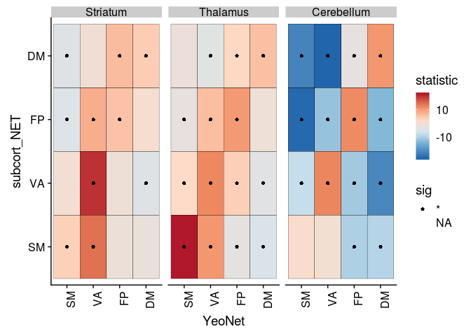
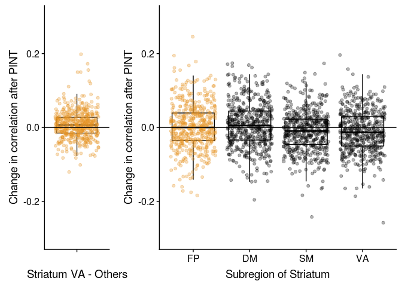
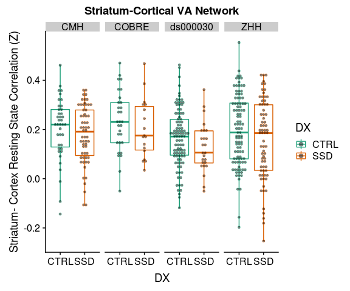
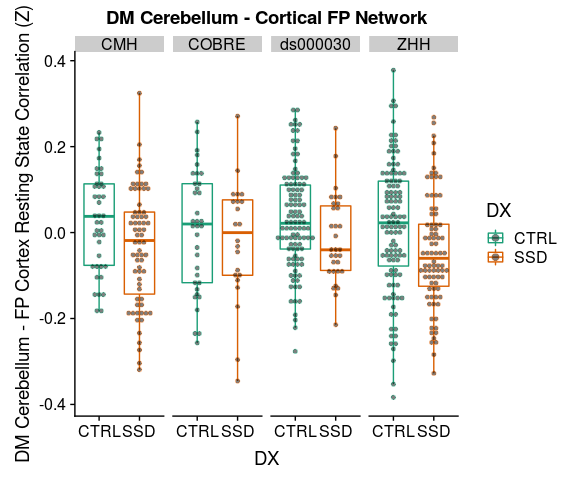
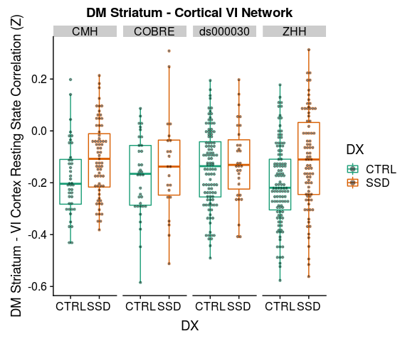

# Sub-cortical Cortical Stats Split by Hemisphere

# Sub-cortical Cortical Stats Left and Right

This analysis tries to combine timeseries data from PINT outputs with subcortical timeseries to ask two questions

1. "External" validation of PINT. If PINT is indeed helping us better target meaningful resting state networks than we should see "cleaner" patterns of between the PINT output cortical ROIs and parcels of the subcortical structure that have been associated with these networks in literature.
   + i.e. connectivity of the cortical ROIS with "expected" subcortical parcel should increae and correlation with other parcels should decrease after PINT.
   
2. To interograte SSD related differences in Cortical-Subcortical connectivity - and to see if they persist after PINT.

Some work Ji (in prep) kinda suggests that there might be differences between left and right subcortical structures. AND spliting the left and right seemed to make more sense for whole brain correlations (because our cortical nodes have a hemisphere). So in this analysis have separate left and right ROIs


```r
library(tidyverse)
library(broom)
library(knitr)
library(tableone)
library(cowplot)
```


## The paths to data


```r
output_base <- '../data/ciftify_fmriprep/'

Yeo7_2011_80verts <- read_csv("../templates/Yeo7_2011_80verts.csv",
                              col_types = c(
                                hemi = col_character(),
                                tvertex = col_integer(),
                                LRpairs = col_integer(),
                                roiidx = col_integer(),
                                NETWORK = col_integer(),
                                LOBE = col_character(),
                                SHORTNAME = col_character(),
                                x = col_integer(),
                                y = col_integer(),
                                z = col_integer()
                              ))

YeoNet_colours = list("VI" = "#781286",
                      "SM" = "#4682B4",
                      "DA" = "#00760E", 
                      "VA" = "#C43AFA",
                      "DM" = "#CD3E3A", 
                      "FP" = "#E69422")

pheno <- read_csv('../phenotypic/20181118_pheno_qapass.csv') %>%
  drop_na(DX)
```

```
## Parsed with column specification:
## cols(
##   .default = col_character(),
##   fd_mean = col_double(),
##   fd_num = col_integer(),
##   fd_perc = col_double(),
##   size_t = col_integer(),
##   size_z = col_integer(),
##   spacing_tr = col_integer(),
##   spacing_z = col_double(),
##   num_rest = col_integer(),
##   num_t1w = col_integer(),
##   num_scans = col_integer(),
##   Age = col_double(),
##   GRID = col_integer(),
##   zhh_session_id = col_integer(),
##   MRI_Date = col_double(),
##   Edu = col_integer(),
##   Age_pt = col_double(),
##   fd_mean_pt = col_double()
## )
```

```
## See spec(...) for full column specifications.
```


# Code for reading in all the timeseries..


A table that describes the current expected subortical files


```r
# a tibble table to specify the subcortical meants files that were generated
YeoNet_subcort_list <- c('VI','SM','DA','VA', 'LI','FP','DM')
```

These functions are for reading timeseries files


```r
#' read a meants file generated by PINT of ciftify_meants
#'
#' @param filepath the full path to the file
#'
#' @return a dataframe where rows are rois and colums are timepoints
read_meants_csv <- function(filepath) {
   meants <-read_csv(filepath, 
                     col_names = FALSE,
                     col_types = c(.default = col_double()))
   return(meants)
}

#' Read the contents of a csv generated by PINT
#'
#' @param outputprefix The prefix to the PINT outputs
#' @param vertex_type "pvertex" or "tvertex"
#' @param projectname the outputdir
#' @param output_dir the basepath of the pint outputs
#'
#' @return a dataframe of the _meants.csv contents
read_pint_meants <- function(outputprefix, vertex_type, projectname, output_dir) {
  expected_filepath <- file.path(output_dir, projectname, "out",'ciftify_PINT', 
                           str_c(outputprefix, '_desc-clean_bold_', 
                                 vertex_type, '_meants.csv'))
  meants = read_meants_csv(expected_filepath)
  return(meants)
}
#' Read the contents of a subcortical csv
#' expample file path is sub-CMHHEF011_ses-01_task-rest_acq-CMH_run-01_bold_desc-cleansm0_atlas-7RSN_roi-Lcerebellum_timeseries.csv
#'
#' @param outputprefix the prefix to the pint outputfile
#' @param hemi The hemisphere "L" or "R"
#' @param subregion region "thalamus", "stiatum", "cerebellum"
#' @param output_dir the basepath of the output data
#' @param projectname the project name inside the output dir
#'
#' @return a dataframe of the _meants.csv contents
read_subcortical_hemi_meants <- function(outputprefix, hemi, subregion, projectname, output_dir) {
  expected_filepath <- file.path(output_dir, projectname, "out",'ciftify_meants', 
                           str_c(outputprefix,
                                 '_desc-cleansm0_atlas-7RSN_roi-', 
                                 hemi, subregion, '_timeseries.csv'))
  meants = read_meants_csv(expected_filepath)
  return(meants)
}

#' Contructs the expected output prefix from subid session and func_base
#'
#' @param subid The subject identifier
#' @param sessid The session identifier (or null)
#' @param func_base The functional file prefix
#'
#' @return an output prefix string for the filenames
construct_output_prefix <- function(subid, sessid, func_base) {
  prefix <- if_else(is.na(sessid),
                    file.path(subid, str_c(subid, '_', func_base)),
                    file.path(subid, sessid, 
                      str_c(subid, '_', sessid, '_', func_base)))
  return(prefix)
}

#' get func_base from pint summary filename
#'
#' @param subid The subject identifier
#' @param sessid The session identifier (or null)
#' @param func_base The functional file prefix
#'
#' @return an output prefix string for the filenames
get_func_base_from_pint_summary_filename <- function(filename, subject, session) {
  func_base <- if_else(is.na(session), 
                       filename %>%
                         str_replace(str_c(subject, "_"), '') %>%
                         str_replace('_desc-clean_bold_summary.csv',''),
                       filename %>%
                         str_replace(subject, '') %>%
                         str_replace(session, '') %>% 
                         str_replace('__','') %>%
                         str_replace('_desc-clean_bold_summary.csv',''))
  return(func_base)
}
```


This reads all files and generate PINT to subcortical correlation values for a given subject


```r
the_subcortical_guide <- tribble(
 ~subcort_hemi, ~subcort_ROI, ~subcort_NET,
 "L", "thalamus", c('VI','SM','DA','VA', 'FP','DM'),
 "L", "striatum", c('SM','DA','VA', 'LI','FP','DM'),
 "L", "cerebellum", c('VI','SM','DA','VA', 'LI','FP','DM'),
 "R", "thalamus", c('VI','SM','DA','VA', 'LI','FP','DM'),
 "R", "striatum", c('VI','SM','DA','VA', 'LI','FP','DM'),
 "R", "cerebellum", c('VI','SM','DA','VA', 'LI','FP','DM')) %>%
  unnest()


#' read all fMRI timeseries data for one subject and correlates PINT ROIs with subcortex
#'
#' @param out_prefix the prefix to the pint outputfile
#' @param outputbase the path to the pint output directory
#' @param projectname the path to sub-study project (dataset)
#' @param Yeo7_2011_80verts as data frame describing the PINT ROIs 
#'
#' @return a dataframe (graph style) of PINT ROI to subcortical correlations
subject_subcort_corrs <- function(out_prefix, projectname, 
                                  outputbase, Yeo7_2011_80verts) {
  
  # read the pint meants files
  pvertex_meants <- read_pint_meants(out_prefix, 'pvertex', 
                                     projectname, outputbase)
  tvertex_meants <- read_pint_meants(out_prefix, 'tvertex',
                                     projectname, outputbase)
  
  # read the subcortical meants files
  thalamus_L_meants <- read_subcortical_hemi_meants(out_prefix,
                                                    "L","thalamus", 
                                                    projectname, outputbase)
  striatum_L_meants <- read_subcortical_hemi_meants(out_prefix,
                                                    "L","striatum",
                                                    projectname, outputbase)
  cerebellum_L_meants <- read_subcortical_hemi_meants(out_prefix,
                                                      "L", "cerebellum",
                                                      projectname, outputbase)
  thalamus_R_meants <- read_subcortical_hemi_meants(out_prefix,
                                                    "R","thalamus",
                                                    projectname, outputbase)
  striatum_R_meants <- read_subcortical_hemi_meants(out_prefix,
                                                    "R","striatum", 
                                                    projectname, outputbase)
  cerebellum_R_meants <- read_subcortical_hemi_meants(out_prefix,
                                                      "R", "cerebellum", 
                                                      projectname, outputbase)
  
  # prepare to bind
  subcort_meants <- bind_rows(thalamus_L_meants, striatum_L_meants, cerebellum_L_meants,
                              thalamus_R_meants, striatum_R_meants, cerebellum_R_meants)
  
  # correlate the pvertex timeseries with the subcortical data
  pvertex_subcortcorr <- as.data.frame(cor(t(subcort_meants), t(pvertex_meants)))
  names(pvertex_subcortcorr) <- Yeo7_2011_80verts$SHORTNAME
  pvertex_result <- the_subcortical_guide %>% 
    bind_cols(pvertex_subcortcorr) %>%
    gather(PINT_ROI, pvertex_corr, -subcort_ROI, -subcort_NET, -subcort_hemi)
  
  # correlated the tvertex timeseries with the subcortical data
  tvertex_subcortcorr <- as.data.frame(cor(t(subcort_meants), t(tvertex_meants)))
  names(tvertex_subcortcorr) <- Yeo7_2011_80verts$SHORTNAME
  tvertex_result <- the_subcortical_guide %>% 
    bind_cols(tvertex_subcortcorr) %>%
    gather(PINT_ROI, tvertex_corr, -subcort_ROI, -subcort_NET, -subcort_hemi)
  
  # combine pvertex and tvertex and return
  subresult <- pvertex_result %>%
    inner_join(tvertex_result, by = c("PINT_ROI", "subcort_ROI", "subcort_NET", "subcort_hemi"))
  return(subresult)
}

#' reads in all the timeseries files for one participant
#' note that Yeo&_2011_80verts and output_base are pulled from the global env
run_read_subject_subcort_corrs <- function(out_prefix, projectname) {
  df <-subject_subcort_corrs(out_prefix, projectname,
                             output_base, Yeo7_2011_80verts)
  return(df)
}

# run_read_subject_subcort_corrs(subcort_outputlist$subid[1])
```


### This reads all the subcortical files it can find

Write a func_base and outputprefix cols into the pheno file for the file reading step


```r
pheno <- pheno %>%
  mutate(func_base = get_func_base_from_pint_summary_filename(filename,subject, session), 
         outputprefix = construct_output_prefix(subject, session, func_base)) 
```


```r
all_subcort_results <- pheno %>%
  select(subject, outputprefix, dataset) %>%
  mutate(subcort_corrs = map2(outputprefix, dataset,
                              ~run_read_subject_subcort_corrs(.x, .y)))
```

### merge with the phenotypic data


```r
results_pheno <- all_subcort_results %>%
  inner_join(pheno, by = "subject") %>%
  unnest() %>%
  mutate(YeoNet = str_sub(PINT_ROI, 1,2),
         hemisphere = str_sub(PINT_ROI, 5,5)) %>%
  mutate(conn_type = if_else(YeoNet == subcort_NET, "same_net", "diff_net"),
         YeoNet = factor(YeoNet, levels = c("VI", "SM", "DA", "VA", "FP", "DM")),
         subcort_NET = factor(subcort_NET, levels = c("VI", "SM", "DA", "VA", "FP", "DM", "LI"))) %>%
  select(subject, PINT_ROI, subcort_ROI, subcort_NET,subcort_hemi, 
         pvertex_corr, tvertex_corr, 
         DX, Sex, fd_mean, Age, Site, Scanner, Age_pt, fd_mean_pt,  
         YeoNet, hemisphere, conn_type) 
```


## make a subject table from resuts pheno


```r
library(tableone)
therealtable1 <- CreateTableOne(
  strata = c("Site", "DX"),
  vars = c("Age", "Sex", "fd_mean", "fd_perc"),
  data = filter(results_pheno, PINT_ROI=="DMP1L",subcort_ROI=="thalamus", subcort_NET=="VA", subcort_hemi == "L")
)
```

```
## Warning in ModuleReturnVarsExist(vars, data): The data frame does not have:
## fd_perc Dropped
```

```r
tabMat <- print(therealtable1, quote = FALSE, noSpaces = TRUE, printToggle = FALSE)
kable(tabMat)
```

                      CMH:CTRL       COBRE:CTRL     ds000030:CTRL   ZHH:CTRL       CMH:SSD        COBRE:SSD       ds000030:SSD   ZHH:SSD        p        test 
--------------------  -------------  -------------  --------------  -------------  -------------  --------------  -------------  -------------  -------  -----
n                     41             35             105             111            67             22              31             82                           
Age (mean (sd))       26.37 (6.67)   33.17 (9.01)   30.47 (8.19)    25.07 (6.55)   32.19 (8.47)   29.55 (12.14)   35.23 (9.32)   25.87 (9.02)   <0.001        
Sex = M (%)           22 (53.7)      23 (65.7)      55 (52.4)       48 (43.2)      40 (59.7)      19 (86.4)       24 (77.4)      63 (76.8)      <0.001        
fd_mean (mean (sd))   0.10 (0.04)    0.18 (0.04)    0.14 (0.07)     0.12 (0.04)    0.12 (0.06)    0.21 (0.08)     0.18 (0.07)    0.12 (0.06)    <0.001        

# Is PINT "focusing" cortical subcortical connectivity


```r
table1 <- results_pheno %>%
  mutate(corr_diff = pvertex_corr - tvertex_corr) %>%
  gather(corr_type, rval, pvertex_corr, tvertex_corr) %>%
  group_by(corr_type, YeoNet, subcort_ROI, subcort_NET) %>%
  summarise(n = n(),
            Mean = mean(rval),
            SD = sd(rval)) 
  
ggplot(table1, aes(y = YeoNet, x = subcort_NET, fill = Mean)) + 
  geom_tile() +
  scale_fill_distiller(breaks = c(-0.5,0.5), type = "div", palette = 5) +
  theme(axis.text.x = element_text(angle = 90, hjust = 1)) +
  facet_grid(subcort_ROI~corr_type) 
```

<!-- -->


```r
table1 <- results_pheno %>%
  mutate(corr_diff = pvertex_corr - tvertex_corr) %>%
  gather(corr_type, rval, pvertex_corr, tvertex_corr) %>%
  group_by(corr_type, YeoNet, hemisphere, subcort_ROI, subcort_NET, subcort_hemi) %>%
  summarise(n = n(),
            Mean = mean(rval),
            SD = sd(rval)) 
  
ggplot(table1, aes(y = YeoNet, x = subcort_NET, fill = Mean)) + 
  geom_tile() +
  scale_fill_distiller(breaks = c(-0.5,0.5), type = "div", palette = 5) +
  theme(axis.text.x = element_text(angle = 90, hjust = 1)) +
  facet_grid(subcort_ROI*subcort_hemi~corr_type*hemisphere) 
```

<!-- -->

We see in the above figure that the Yeo 7 Network connectivity strongly shows the expected pattern in the cerebeullum. 

Lower evidence is seen in the striatum and thalamus, although there is a faint increase across the diagonal for the SM, VA and DM especially


```r
net_means <- results_pheno %>%
  mutate(corr_diff = pvertex_corr - tvertex_corr) %>%
  group_by(YeoNet, subcort_ROI, subcort_NET, conn_type, subject) %>%
  summarise(netmean_pvertex = mean(pvertex_corr),
            netmean_tvertex = mean(tvertex_corr)) %>%
  ungroup()

net_means_pint_t <- net_means %>%
  group_by(YeoNet, subcort_ROI, subcort_NET) %>%
  do(tidy(t.test(.$netmean_pvertex, .$netmean_tvertex, paired = TRUE))) %>%
  ungroup() %>% mutate(p_FDR = p.adjust(p.value, method = "fdr"))

net_means_pint_t %>%
  ungroup() %>%
  mutate(sig = if_else(p_FDR < 0.05, '*', NA_character_) ) %>%
ggplot(aes(x = YeoNet, y = subcort_NET, fill = statistic)) + 
  geom_tile(color = "black", na.rm = TRUE) +
  geom_point(aes(shape = sig), na.rm = TRUE) +
  scale_fill_gradient2(midpoint = 0) +
  theme(axis.text.x = element_text(angle = 90, hjust = 1)) +
  facet_wrap(~subcort_ROI)
```

<!-- -->
Here we plot the paired t-stat camparing personalized to template, we see a very strong increase in correlation along the diagonal (i.e. with the hypothesized regions) and decreases on the off-dignonal (i.e. decreased connectivity with the other network's parcels)


# trying to calculate an vs off diagonal term

In the above table to calcuculated the "focussing" effect as the change (in on person) between in connectivity with the expected parcel subtracted by the change in connectivity from other regions.

Below we plot these values against zero


```r
library(knitr)
net_focus <- net_means %>%
  ungroup() %>%
  mutate(pint_diff = netmean_pvertex - netmean_tvertex) %>%
  group_by(subject, subcort_ROI, YeoNet, conn_type) %>%
  summarise(nets_avg = mean(pint_diff)) %>%
  ungroup() %>%
  spread(conn_type, nets_avg) %>%
  mutate(focus_effect = same_net - diff_net)

net_focus %>%
  ungroup() %>%
  group_by(subcort_ROI, YeoNet) %>%
  do(tidy(t.test(.$focus_effect))) %>%
  kable()
```


subcort_ROI   YeoNet     estimate    statistic     p.value   parameter     conf.low   conf.high  method              alternative 
------------  -------  ----------  -----------  ----------  ----------  -----------  ----------  ------------------  ------------
cerebellum    VI        0.0273878   11.6511509   0.0000000         493    0.0227692   0.0320063  One Sample t-test   two.sided   
cerebellum    SM        0.0206163    9.5276494   0.0000000         493    0.0163648   0.0248678  One Sample t-test   two.sided   
cerebellum    DA        0.0288066   12.8730578   0.0000000         493    0.0244099   0.0332033  One Sample t-test   two.sided   
cerebellum    VA        0.0335690   16.9441237   0.0000000         493    0.0296764   0.0374615  One Sample t-test   two.sided   
cerebellum    FP        0.0418283   18.7653751   0.0000000         493    0.0374488   0.0462079  One Sample t-test   two.sided   
cerebellum    DM        0.0538687   21.1286004   0.0000000         493    0.0488593   0.0588780  One Sample t-test   two.sided   
striatum      VI        0.0009603    0.4252126   0.6708673         493   -0.0034768   0.0053973  One Sample t-test   two.sided   
striatum      SM        0.0094248    5.1120944   0.0000005         493    0.0058024   0.0130471  One Sample t-test   two.sided   
striatum      DA        0.0051385    2.8866805   0.0040642         493    0.0016410   0.0086359  One Sample t-test   two.sided   
striatum      VA        0.0213014   14.7548408   0.0000000         493    0.0184649   0.0241380  One Sample t-test   two.sided   
striatum      FP        0.0091756    4.9854778   0.0000009         493    0.0055595   0.0127917  One Sample t-test   two.sided   
striatum      DM        0.0097608    4.7046633   0.0000033         493    0.0056844   0.0138371  One Sample t-test   two.sided   
thalamus      VI        0.0065020    3.9449275   0.0000914         493    0.0032637   0.0097404  One Sample t-test   two.sided   
thalamus      SM        0.0286643   12.8480414   0.0000000         493    0.0242808   0.0330478  One Sample t-test   two.sided   
thalamus      DA        0.0153820    8.0796878   0.0000000         493    0.0116415   0.0191226  One Sample t-test   two.sided   
thalamus      VA        0.0114941    7.3490517   0.0000000         493    0.0084212   0.0145671  One Sample t-test   two.sided   
thalamus      FP        0.0117804    6.4849960   0.0000000         493    0.0082112   0.0153495  One Sample t-test   two.sided   
thalamus      DM        0.0159123    8.4280996   0.0000000         493    0.0122027   0.0196218  One Sample t-test   two.sided   

Another (maybe better) way to test this is to show calculate the "focusing" value in individual subjects THAN compute how this number changes with PINT. Let try that..


```r
subject_focus <- net_means %>%
  gather(vertex_type, nets_avg, netmean_pvertex, netmean_tvertex) %>%
  ungroup(subcort_NET) %>%
  group_by(subject, subcort_ROI, YeoNet, vertex_type, conn_type) %>%
  summarise(nets_type_avg = mean(nets_avg)) %>%
  spread(conn_type, nets_type_avg) %>%
  ungroup() %>%
  mutate(focus_effect = same_net - diff_net)

subject_focus %>%
  ungroup() %>%
  group_by(subcort_ROI, YeoNet, vertex_type) %>%
  do(tidy(t.test(.$focus_effect))) %>%
  kable()
```


subcort_ROI   YeoNet   vertex_type         estimate   statistic    p.value   parameter    conf.low   conf.high  method              alternative 
------------  -------  ----------------  ----------  ----------  ---------  ----------  ----------  ----------  ------------------  ------------
cerebellum    VI       netmean_pvertex    0.1552900   20.837986   0.00e+00         493   0.1406479   0.1699321  One Sample t-test   two.sided   
cerebellum    VI       netmean_tvertex    0.1279022   20.751010   0.00e+00         493   0.1157919   0.1400125  One Sample t-test   two.sided   
cerebellum    SM       netmean_pvertex    0.1817699   31.039174   0.00e+00         493   0.1702639   0.1932760  One Sample t-test   two.sided   
cerebellum    SM       netmean_tvertex    0.1611537   32.861720   0.00e+00         493   0.1515184   0.1707890  One Sample t-test   two.sided   
cerebellum    DA       netmean_pvertex    0.1364248   24.708306   0.00e+00         493   0.1255764   0.1472732  One Sample t-test   two.sided   
cerebellum    DA       netmean_tvertex    0.1076182   24.552734   0.00e+00         493   0.0990063   0.1162302  One Sample t-test   two.sided   
cerebellum    VA       netmean_pvertex    0.1905632   32.598527   0.00e+00         493   0.1790775   0.2020488  One Sample t-test   two.sided   
cerebellum    VA       netmean_tvertex    0.1569942   33.295170   0.00e+00         493   0.1477298   0.1662586  One Sample t-test   two.sided   
cerebellum    FP       netmean_pvertex    0.1730407   37.414824   0.00e+00         493   0.1639537   0.1821277  One Sample t-test   two.sided   
cerebellum    FP       netmean_tvertex    0.1312124   38.265534   0.00e+00         493   0.1244752   0.1379497  One Sample t-test   two.sided   
cerebellum    DM       netmean_pvertex    0.2868631   42.233339   0.00e+00         493   0.2735176   0.3002086  One Sample t-test   two.sided   
cerebellum    DM       netmean_tvertex    0.2329945   41.647150   0.00e+00         493   0.2220025   0.2439865  One Sample t-test   two.sided   
striatum      VI       netmean_pvertex    0.0244387    4.183947   3.39e-05         493   0.0129623   0.0359152  One Sample t-test   two.sided   
striatum      VI       netmean_tvertex    0.0234785    5.053644   6.00e-07         493   0.0143504   0.0326066  One Sample t-test   two.sided   
striatum      SM       netmean_pvertex    0.0929323   18.162306   0.00e+00         493   0.0828790   0.1029857  One Sample t-test   two.sided   
striatum      SM       netmean_tvertex    0.0835076   19.517208   0.00e+00         493   0.0751009   0.0919142  One Sample t-test   two.sided   
striatum      DA       netmean_pvertex    0.0300248    7.270300   0.00e+00         493   0.0219107   0.0381390  One Sample t-test   two.sided   
striatum      DA       netmean_tvertex    0.0248864    8.118104   0.00e+00         493   0.0188632   0.0309095  One Sample t-test   two.sided   
striatum      VA       netmean_pvertex    0.1113056   28.809402   0.00e+00         493   0.1037146   0.1188965  One Sample t-test   two.sided   
striatum      VA       netmean_tvertex    0.0900041   29.395164   0.00e+00         493   0.0839882   0.0960201  One Sample t-test   two.sided   
striatum      FP       netmean_pvertex    0.0561450   15.276586   0.00e+00         493   0.0489239   0.0633660  One Sample t-test   two.sided   
striatum      FP       netmean_tvertex    0.0469694   17.581000   0.00e+00         493   0.0417203   0.0522185  One Sample t-test   two.sided   
striatum      DM       netmean_pvertex    0.0716055   14.769802   0.00e+00         493   0.0620800   0.0811310  One Sample t-test   two.sided   
striatum      DM       netmean_tvertex    0.0618447   17.099022   0.00e+00         493   0.0547384   0.0689511  One Sample t-test   two.sided   
thalamus      VI       netmean_pvertex    0.0592448   13.747480   0.00e+00         493   0.0507775   0.0677121  One Sample t-test   two.sided   
thalamus      VI       netmean_tvertex    0.0527428   15.456212   0.00e+00         493   0.0460381   0.0594474  One Sample t-test   two.sided   
thalamus      SM       netmean_pvertex    0.2080083   33.067861   0.00e+00         493   0.1956491   0.2203675  One Sample t-test   two.sided   
thalamus      SM       netmean_tvertex    0.1793440   33.881387   0.00e+00         493   0.1689438   0.1897442  One Sample t-test   two.sided   
thalamus      DA       netmean_pvertex    0.0815147   16.868108   0.00e+00         493   0.0720199   0.0910095  One Sample t-test   two.sided   
thalamus      DA       netmean_tvertex    0.0661327   17.536160   0.00e+00         493   0.0587231   0.0735423  One Sample t-test   two.sided   
thalamus      VA       netmean_pvertex    0.0530121   13.277117   0.00e+00         493   0.0451672   0.0608570  One Sample t-test   two.sided   
thalamus      VA       netmean_tvertex    0.0415180   13.071857   0.00e+00         493   0.0352775   0.0477584  One Sample t-test   two.sided   
thalamus      FP       netmean_pvertex    0.0849359   20.716316   0.00e+00         493   0.0768804   0.0929914  One Sample t-test   two.sided   
thalamus      FP       netmean_tvertex    0.0731555   22.948859   0.00e+00         493   0.0668923   0.0794188  One Sample t-test   two.sided   
thalamus      DM       netmean_pvertex    0.1070447   22.952549   0.00e+00         493   0.0978814   0.1162079  One Sample t-test   two.sided   
thalamus      DM       netmean_tvertex    0.0911324   25.449273   0.00e+00         493   0.0840966   0.0981682  One Sample t-test   two.sided   

```r
subject_focus %>%
  ungroup() %>% group_by(subject, YeoNet, subcort_ROI) %>%
  select(subject, YeoNet, vertex_type, subcort_ROI, focus_effect) %>%
  spread(vertex_type, focus_effect) %>%
  group_by(subcort_ROI, YeoNet) %>%
  do(tidy(t.test(.$netmean_pvertex, .$netmean_tvertex, paired = TRUE))) %>%
  kable()
```


subcort_ROI   YeoNet     estimate    statistic     p.value   parameter     conf.low   conf.high  method          alternative 
------------  -------  ----------  -----------  ----------  ----------  -----------  ----------  --------------  ------------
cerebellum    VI        0.0273878   11.6511509   0.0000000         493    0.0227692   0.0320063  Paired t-test   two.sided   
cerebellum    SM        0.0206163    9.5276494   0.0000000         493    0.0163648   0.0248678  Paired t-test   two.sided   
cerebellum    DA        0.0288066   12.8730578   0.0000000         493    0.0244099   0.0332033  Paired t-test   two.sided   
cerebellum    VA        0.0335690   16.9441237   0.0000000         493    0.0296764   0.0374615  Paired t-test   two.sided   
cerebellum    FP        0.0418283   18.7653751   0.0000000         493    0.0374488   0.0462079  Paired t-test   two.sided   
cerebellum    DM        0.0538687   21.1286004   0.0000000         493    0.0488593   0.0588780  Paired t-test   two.sided   
striatum      VI        0.0009603    0.4252126   0.6708673         493   -0.0034768   0.0053973  Paired t-test   two.sided   
striatum      SM        0.0094248    5.1120944   0.0000005         493    0.0058024   0.0130471  Paired t-test   two.sided   
striatum      DA        0.0051385    2.8866805   0.0040642         493    0.0016410   0.0086359  Paired t-test   two.sided   
striatum      VA        0.0213014   14.7548408   0.0000000         493    0.0184649   0.0241380  Paired t-test   two.sided   
striatum      FP        0.0091756    4.9854778   0.0000009         493    0.0055595   0.0127917  Paired t-test   two.sided   
striatum      DM        0.0097608    4.7046633   0.0000033         493    0.0056844   0.0138371  Paired t-test   two.sided   
thalamus      VI        0.0065020    3.9449275   0.0000914         493    0.0032637   0.0097404  Paired t-test   two.sided   
thalamus      SM        0.0286643   12.8480414   0.0000000         493    0.0242808   0.0330478  Paired t-test   two.sided   
thalamus      DA        0.0153820    8.0796878   0.0000000         493    0.0116415   0.0191226  Paired t-test   two.sided   
thalamus      VA        0.0114941    7.3490517   0.0000000         493    0.0084212   0.0145671  Paired t-test   two.sided   
thalamus      FP        0.0117804    6.4849960   0.0000000         493    0.0082112   0.0153495  Paired t-test   two.sided   
thalamus      DM        0.0159123    8.4280996   0.0000000         493    0.0122027   0.0196218  Paired t-test   two.sided   


```r
subject_focus %>%
  ungroup() %>% 
  ggplot(aes(x = YeoNet, y = focus_effect)) +
  geom_boxplot(color = "blue", outlier.shape = NA) +
  geom_jitter(alpha = 0.05) +
  geom_hline(yintercept = 0) +
  facet_wrap(~ subcort_ROI, ncol = 1) + 
  coord_flip()
```

<!-- -->


Recreating the DM plot from the poster to double check


```r
net_means <- results_pheno %>%
  ungroup() %>%
  group_by(YeoNet, subcort_ROI, subcort_NET, subject) %>%
  summarise(netmean_pvertex = mean(pvertex_corr),
            netmean_tvertex = mean(tvertex_corr),
            pint_diff = netmean_pvertex - netmean_tvertex) 

pint_diff_sub_DM <- net_means %>%
  ungroup() %>% 
  filter(YeoNet == "DM", subcort_ROI == "cerebellum") %>%
  select(subject, subcort_NET, pint_diff) %>%
  spread(subcort_NET, pint_diff) %>%
  mutate(overall_pint_diff = DM - (SM + VA + FP + DA)/4,
         x_val = '') %>%
  select(subject, overall_pint_diff, x_val) %>%
  ggplot(aes(y = overall_pint_diff, x = x_val)) +
    geom_boxplot(outlier.shape = NA) +
    geom_jitter(alpha = 0.3, color = YeoNet_colours$DM, fill = "grey") +
    geom_hline(yintercept = 0) + 
    labs(y = "Change in correlation after PINT", x = "Cerebellum DM - Others") +
  scale_y_continuous(limits = c(-0.3, 0.3))

DM_submeans_plot <- net_means %>%
  mutate(is_DM = if_else(subcort_NET == 'DM', TRUE, FALSE),
         SubCortNET = factor(subcort_NET, levels = c("DM", "SM", "DA", "VA", "FP"))) %>%
  filter(subcort_ROI == "cerebellum", !is.na(SubCortNET), YeoNet == "DM") %>%
  ggplot(aes(y = pint_diff, x = SubCortNET, color = is_DM)) +
  geom_boxplot(color = "black", outlier.shape = NA) + 
  geom_jitter(alpha = 0.3) +
  geom_hline(yintercept = 0) +
  scale_color_manual(values = c('black',YeoNet_colours$DM)) +
  labs(y = "Change in correlation after PINT", color = NULL, x = "Subregion of Cerebellum") +
  theme(legend.position = "none") +
  scale_y_continuous(limits = c(-0.3, 0.3))

# DM_brain_pic <- ggdraw + draw_image('DM_striatum_pic.png')

plot_grid(pint_diff_sub_DM, DM_submeans_plot, rel_widths = c(1,2.5))
```

```
## Warning: Removed 1 rows containing non-finite values (stat_boxplot).
```

```
## Warning: Removed 1 rows containing missing values (geom_point).
```

<!-- -->

Also the VA Striatum one


```r
pint_diff_sub_VA <- net_means %>%
  ungroup %>% 
  filter(YeoNet == "VA", subcort_ROI == "cerebellum") %>%
  select(subject, subcort_NET, pint_diff) %>%
  spread(subcort_NET, pint_diff) %>%
  mutate(overall_pint_diff = VA - (SM + DM + FP + DA)/4,
         x_val = '') %>%
  select(subject, overall_pint_diff, x_val) %>%
  ggplot(aes(y = overall_pint_diff, x = x_val)) +
    geom_boxplot(outlier.shape = NA) +
    geom_jitter(alpha = 0.3, color = YeoNet_colours$VA, fill = "grey") +
    geom_hline(yintercept = 0) + 
    labs(y = "Change in correlation after PINT", x = "Cerebellum VA - Others") +
  scale_y_continuous(limits = c(-0.3, 0.3))

VA_submeans_plot <- net_means %>%
  mutate(is_VA = if_else(subcort_NET == 'VA', TRUE, FALSE),
          SubCort_ROI = factor(subcort_NET, 
                               levels = c("VA", "DA", 'SM', 'FP', "DM"))) %>%
  filter(YeoNet == "VA", 
         subcort_ROI == "cerebellum",
         subcort_NET %in% c('SM', "VA", "DM", 'FP', "DA")) %>%
  ggplot(aes(y = pint_diff, x = SubCort_ROI, color = is_VA)) +
  geom_boxplot(color = "black", outlier.shape = NA) + 
  geom_jitter(alpha = 0.3) +
  geom_hline(yintercept = 0) +
  scale_color_manual(values = c('black', YeoNet_colours$VA)) +
  labs(y = "Change in correlation after PINT", color = NULL, x = "Subregion of Cerebellum") +
  theme(legend.position = "none") +
  scale_y_continuous(limits = c(-0.3, 0.3))

# DM_brain_pic <- ggdraw + draw_image('DM_striatum_pic.png')

plot_grid(pint_diff_sub_VA, VA_submeans_plot, rel_widths = c(1,2.5))
```

<!-- -->


```r
pint_diff_sub_FP <- net_means %>%
  ungroup %>% 
  filter(YeoNet == "FP", subcort_ROI == "striatum") %>%
  select(subject, subcort_NET, pint_diff) %>%
  spread(subcort_NET, pint_diff) %>%
  mutate(overall_pint_diff = FP - (SM + DM + VA)/3,
         x_val = '') %>%
  select(subject, overall_pint_diff, x_val) %>%
  ggplot(aes(y = overall_pint_diff, x = x_val)) +
    geom_boxplot(outlier.shape = NA) +
    geom_jitter(alpha = 0.3, color = YeoNet_colours$FP, fill = "grey") +
    geom_hline(yintercept = 0) + 
    labs(y = "Change in correlation after PINT", x = "Striatum VA - Others") +
  scale_y_continuous(limits = c(-0.3, 0.3))

FP_submeans_plot <- net_means %>%
  mutate(is_FP = if_else(subcort_NET == 'FP', TRUE, FALSE),
          SubCort_ROI = factor(subcort_NET, 
                               levels = c('FP', "DM", 'SM', "VA"))) %>%
  filter(YeoNet == "FP", 
         subcort_ROI == "striatum",
         subcort_NET %in% c('SM', "VA", "DM", 'FP')) %>%
  ggplot(aes(y = pint_diff, x = SubCort_ROI, color = is_FP)) +
  geom_boxplot(color = "black", outlier.shape = NA) + 
  geom_jitter(alpha = 0.3) +
  geom_hline(yintercept = 0) +
  scale_color_manual(values = c('black', YeoNet_colours$FP)) +
  labs(y = "Change in correlation after PINT", color = NULL, x = "Subregion of Striatum") +
  theme(legend.position = "none") +
  scale_y_continuous(limits = c(-0.3, 0.3))

# DM_brain_pic <- ggdraw + draw_image('DM_striatum_pic.png')

plot_grid(pint_diff_sub_FP, FP_submeans_plot, rel_widths = c(1,2.5))
```

<!-- -->


```r
pint_diff_sub_VA <- net_means %>%
  ungroup %>% 
  filter(YeoNet == "VA", subcort_ROI == "striatum") %>%
  select(subject, subcort_NET, pint_diff) %>%
  spread(subcort_NET, pint_diff) %>%
  mutate(overall_pint_diff = VA - (SM + DM + FP)/3,
         x_val = '') %>%
  select(subject, overall_pint_diff, x_val) %>%
  ggplot(aes(y = overall_pint_diff, x = x_val)) +
    geom_boxplot(outlier.shape = NA) +
    geom_jitter(alpha = 0.3, color = YeoNet_colours$VA, fill = "grey") +
    geom_hline(yintercept = 0) + 
    labs(y = "Change in correlation after PINT", x = "Striatum VA - Others") +
  scale_y_continuous(limits = c(-0.3, 0.3))

VA_submeans_plot <- net_means %>%
  mutate(is_VA = if_else(subcort_NET == 'VA', TRUE, FALSE),
          SubCort_ROI = factor(subcort_NET, 
                               levels = c("VA", 'SM', 'FP', "DM"))) %>%
  filter(YeoNet == "VA", 
         subcort_ROI == "striatum",
         subcort_NET %in% c('SM', "VA", "DM", 'FP')) %>%
  ggplot(aes(y = pint_diff, x = SubCort_ROI, color = is_VA)) +
  geom_boxplot(color = "black", outlier.shape = NA) + 
  geom_jitter(alpha = 0.3) +
  geom_hline(yintercept = 0) +
  scale_color_manual(values = c('black', YeoNet_colours$VA)) +
  labs(y = "Change in correlation after PINT", color = NULL, x = "Subregion of Striatum") +
  theme(legend.position = "none") +
  scale_y_continuous(limits = c(-0.3, 0.3))

# DM_brain_pic <- ggdraw + draw_image('DM_striatum_pic.png')

plot_grid(pint_diff_sub_VA, VA_submeans_plot, rel_widths = c(1,2.5))
```

<!-- -->

```r
pint_diff_sub_SM <- net_means %>%
  ungroup %>% 
  filter(YeoNet == "SM", subcort_ROI == "thalamus") %>%
  select(subject, subcort_NET, pint_diff) %>%
  spread(subcort_NET, pint_diff) %>%
  mutate(overall_pint_diff = SM - (VA + DM + FP + DA)/4,
         x_val = '') %>%
  select(subject, overall_pint_diff, x_val) %>%
  ggplot(aes(y = overall_pint_diff, x = x_val)) +
    geom_boxplot(outlier.shape = NA) +
    geom_jitter(alpha = 0.3, color = YeoNet_colours$SM, fill = "grey") +
    geom_hline(yintercept = 0) + 
    labs(y = "Change in correlation after PINT", x = "Striatum VA - Others") +
  scale_y_continuous(limits = c(-0.3, 0.3))

SM_submeans_plot <- net_means %>%
  mutate(is_SM = if_else(subcort_NET == 'SM', TRUE, FALSE),
          SubCort_ROI = factor(subcort_NET, 
                               levels = c("SM", "VA", "DA",'FP', "DM"))) %>%
  filter(YeoNet == "SM", 
         subcort_ROI == "thalamus",
         subcort_NET %in% c('SM', "VA", "DA","DM", 'FP')) %>%
  ggplot(aes(y = pint_diff, x = SubCort_ROI, color = is_SM)) +
  geom_boxplot(color = "black", outlier.shape = NA) + 
  geom_jitter(alpha = 0.3) +
  geom_hline(yintercept = 0) +
  scale_color_manual(values = c('black', YeoNet_colours$SM)) +
  labs(y = "Change in correlation after PINT", color = NULL, x = "Subregion of Thalamus") +
  theme(legend.position = "none") +
  scale_y_continuous(limits = c(-0.3, 0.3))

# DM_brain_pic <- ggdraw + draw_image('DM_striatum_pic.png')

plot_grid(pint_diff_sub_SM, SM_submeans_plot, rel_widths = c(1,2.5))
```

```
## Warning: Removed 1 rows containing non-finite values (stat_boxplot).
```

```
## Warning: Removed 1 rows containing missing values (geom_point).
```

<!-- -->


## Plotting the PINT effect separately in SSD and controls

Note that the circle denotes an uncorrected p<0.05


```r
net_means_byDX <- results_pheno %>%
  mutate(corr_diff = pvertex_corr - tvertex_corr) %>%
  group_by(YeoNet, subcort_ROI, subcort_NET, subject, DX) %>%
  summarise(netmean_pvertex = mean(pvertex_corr),
            netmean_tvertex = mean(tvertex_corr)) %>%
  ungroup() %>%
  group_by(YeoNet, subcort_ROI, subcort_NET, DX) %>%
  do(tidy(t.test(.$netmean_pvertex, .$netmean_tvertex, paired = TRUE)))

net_means_byDX %>%
  ungroup() %>%
  mutate(sig = if_else(p.value < 0.005, '*', NA_character_) ) %>%
ggplot(aes(x = YeoNet, y = subcort_NET, fill = statistic)) + 
  geom_tile(color = "black", na.rm = TRUE) +
  geom_point(aes(shape = sig), na.rm = TRUE) +
  scale_fill_gradient2() +
  theme(axis.text.x = element_text(angle = 90, hjust = 1)) +
  facet_grid(subcort_ROI ~ DX)
```

<!-- -->


## running model again with sex interaction


```r
library(knitr)

DX_lm_model <- results_pheno %>%
  gather(vertex_type, corZ, pvertex_corr, tvertex_corr) %>%
  filter(Age > 17, Age < 51) %>%
  filter(subcort_ROI %in% c("cerebellum", "striatum")) %>%
  group_by(vertex_type, subcort_ROI, subcort_NET, PINT_ROI) %>%
  do(tidy(lm(corZ ~ DX + Sex + fd_mean_pt + Age_pt + Scanner,.))) %>%
  select(vertex_type, subcort_ROI, subcort_NET, PINT_ROI, term, statistic, p.value) %>%
  ungroup() %>%
  group_by(term) %>%
  mutate(p_FDR = p.adjust(p.value, method = "fdr")) %>%
  arrange(p.value)

DX_lm_model %>% 
  filter(term %in% c("DXSSD")) %>%
  filter(p_FDR < 0.1) %>%
  kable()
```


vertex_type    subcort_ROI   subcort_NET   PINT_ROI   term     statistic     p.value       p_FDR
-------------  ------------  ------------  ---------  ------  ----------  ----------  ----------
tvertex_corr   cerebellum    VA            SMT1L      DXSSD     7.394337   0.0000000   0.0000000
pvertex_corr   cerebellum    SM            VI04L      DXSSD     7.187960   0.0000000   0.0000000
tvertex_corr   cerebellum    SM            VI04R      DXSSD     6.905637   0.0000000   0.0000000
pvertex_corr   cerebellum    SM            VI05L      DXSSD     6.805258   0.0000000   0.0000000
tvertex_corr   cerebellum    DA            SMT1L      DXSSD     6.800394   0.0000000   0.0000000
tvertex_corr   cerebellum    SM            SMT1L      DXSSD     6.354471   0.0000000   0.0000001
pvertex_corr   cerebellum    SM            VI05R      DXSSD     6.275097   0.0000000   0.0000002
tvertex_corr   cerebellum    VA            SMT1R      DXSSD     6.238686   0.0000000   0.0000002
pvertex_corr   striatum      DM            VI02R      DXSSD     6.209654   0.0000000   0.0000002
pvertex_corr   cerebellum    DA            SMI1L      DXSSD     6.147336   0.0000000   0.0000002
pvertex_corr   striatum      FP            DMT1R      DXSSD     6.144726   0.0000000   0.0000002
pvertex_corr   cerebellum    SM            VI04R      DXSSD     6.003615   0.0000000   0.0000005
pvertex_corr   striatum      DM            DMT1R      DXSSD     5.956978   0.0000000   0.0000006
pvertex_corr   striatum      FP            VI02R      DXSSD     5.938332   0.0000000   0.0000006
tvertex_corr   cerebellum    SM            VI05L      DXSSD     5.928990   0.0000000   0.0000006
pvertex_corr   cerebellum    VA            SMT1L      DXSSD     5.876066   0.0000000   0.0000008
tvertex_corr   cerebellum    DA            SMT1R      DXSSD     5.825997   0.0000000   0.0000010
pvertex_corr   cerebellum    SM            VI01L      DXSSD     5.797315   0.0000000   0.0000011
pvertex_corr   striatum      SM            VAF2L      DXSSD    -5.759493   0.0000000   0.0000014
pvertex_corr   striatum      FP            VI05L      DXSSD     5.722023   0.0000000   0.0000016
tvertex_corr   cerebellum    SM            VI05R      DXSSD     5.694998   0.0000000   0.0000018
pvertex_corr   cerebellum    DM            DMF3L      DXSSD     5.636435   0.0000000   0.0000023
pvertex_corr   striatum      SM            VAF1R      DXSSD    -5.623368   0.0000000   0.0000024
pvertex_corr   cerebellum    DM            VAP2R      DXSSD    -5.612637   0.0000000   0.0000025
tvertex_corr   cerebellum    VA            VI04R      DXSSD     5.605170   0.0000000   0.0000025
pvertex_corr   striatum      FP            VI03R      DXSSD     5.565227   0.0000000   0.0000029
pvertex_corr   cerebellum    DM            DMF2L      DXSSD     5.480256   0.0000001   0.0000045
pvertex_corr   cerebellum    SM            SMT1L      DXSSD     5.421748   0.0000001   0.0000060
tvertex_corr   striatum      DM            VI02R      DXSSD     5.413238   0.0000001   0.0000060
tvertex_corr   cerebellum    DA            SMI1L      DXSSD     5.408867   0.0000001   0.0000060
pvertex_corr   cerebellum    DA            SMI1R      DXSSD     5.400883   0.0000001   0.0000060
pvertex_corr   cerebellum    VA            SMI1R      DXSSD     5.399033   0.0000001   0.0000060
pvertex_corr   striatum      FP            VI04R      DXSSD     5.330819   0.0000001   0.0000083
pvertex_corr   striatum      FP            DMT2R      DXSSD     5.319620   0.0000001   0.0000086
tvertex_corr   cerebellum    FP            SMT1L      DXSSD     5.308108   0.0000001   0.0000087
pvertex_corr   cerebellum    VA            VI04L      DXSSD     5.305639   0.0000001   0.0000087
pvertex_corr   cerebellum    SM            FPF1L      DXSSD    -5.235096   0.0000002   0.0000123
pvertex_corr   striatum      DM            VI04R      DXSSD     5.191169   0.0000003   0.0000151
tvertex_corr   striatum      FP            DMT1R      DXSSD     5.180473   0.0000003   0.0000156
pvertex_corr   cerebellum    VA            DMP2R      DXSSD    -5.051106   0.0000005   0.0000290
pvertex_corr   striatum      DM            VI05L      DXSSD     5.049924   0.0000005   0.0000290
pvertex_corr   cerebellum    FP            SMF1R      DXSSD     5.036973   0.0000006   0.0000303
tvertex_corr   cerebellum    DA            SMF1R      DXSSD     5.018693   0.0000006   0.0000325
tvertex_corr   striatum      SM            VAF2R      DXSSD    -5.011699   0.0000006   0.0000329
tvertex_corr   striatum      FP            VI02R      DXSSD     4.984666   0.0000007   0.0000368
pvertex_corr   cerebellum    VA            SMT1R      DXSSD     4.975025   0.0000008   0.0000374
tvertex_corr   cerebellum    SM            VI04L      DXSSD     4.972507   0.0000008   0.0000374
pvertex_corr   cerebellum    DA            SMF1R      DXSSD     4.964893   0.0000008   0.0000374
pvertex_corr   striatum      FP            VI05R      DXSSD     4.964757   0.0000008   0.0000374
pvertex_corr   striatum      DM            VI03R      DXSSD     4.959411   0.0000008   0.0000376
pvertex_corr   cerebellum    DA            SMF2R      DXSSD     4.938365   0.0000009   0.0000410
pvertex_corr   striatum      FP            VI03L      DXSSD     4.913230   0.0000011   0.0000456
pvertex_corr   cerebellum    DM            DMF2R      DXSSD     4.900227   0.0000011   0.0000472
tvertex_corr   cerebellum    LI            SMT1L      DXSSD     4.898569   0.0000011   0.0000472
pvertex_corr   cerebellum    LI            VAF5L      DXSSD    -4.886912   0.0000012   0.0000491
tvertex_corr   cerebellum    VA            SMI1R      DXSSD     4.882111   0.0000012   0.0000494
pvertex_corr   cerebellum    DA            SMT1L      DXSSD     4.869515   0.0000013   0.0000516
tvertex_corr   cerebellum    DM            FPF1R      DXSSD    -4.845144   0.0000015   0.0000564
pvertex_corr   cerebellum    DM            VAF5L      DXSSD    -4.844423   0.0000015   0.0000564
pvertex_corr   cerebellum    VA            VI04R      DXSSD     4.815692   0.0000017   0.0000639
tvertex_corr   cerebellum    DM            VI02L      DXSSD     4.765303   0.0000022   0.0000803
pvertex_corr   cerebellum    LI            VI04L      DXSSD     4.758713   0.0000023   0.0000816
pvertex_corr   striatum      DM            DMP1R      DXSSD     4.748162   0.0000024   0.0000845
tvertex_corr   cerebellum    DM            VAF4R      DXSSD    -4.729817   0.0000026   0.0000908
pvertex_corr   cerebellum    DM            DMT1R      DXSSD     4.722650   0.0000027   0.0000926
pvertex_corr   striatum      VA            VI05L      DXSSD     4.718510   0.0000027   0.0000930
tvertex_corr   striatum      DM            VI04L      DXSSD     4.707034   0.0000029   0.0000968
tvertex_corr   striatum      DM            VAP2L      DXSSD    -4.702403   0.0000030   0.0000975
pvertex_corr   cerebellum    DM            VAP1R      DXSSD    -4.698644   0.0000030   0.0000978
tvertex_corr   cerebellum    VA            DMP2R      DXSSD    -4.686524   0.0000032   0.0001018
pvertex_corr   striatum      FP            VI02L      DXSSD     4.684243   0.0000032   0.0001018
tvertex_corr   cerebellum    LI            VAF5L      DXSSD    -4.680997   0.0000033   0.0001018
tvertex_corr   cerebellum    LI            VAF2L      DXSSD    -4.678490   0.0000033   0.0001018
tvertex_corr   striatum      SM            VAF2L      DXSSD    -4.657058   0.0000037   0.0001112
pvertex_corr   cerebellum    VA            VI05L      DXSSD     4.652739   0.0000037   0.0001119
tvertex_corr   cerebellum    SM            VI02L      DXSSD     4.650138   0.0000038   0.0001119
tvertex_corr   cerebellum    DM            FPP2L      DXSSD    -4.646892   0.0000039   0.0001122
pvertex_corr   striatum      FP            VI04L      DXSSD     4.637038   0.0000040   0.0001160
tvertex_corr   cerebellum    DM            VAF5L      DXSSD    -4.617586   0.0000044   0.0001255
tvertex_corr   striatum      FP            VI05L      DXSSD     4.614056   0.0000045   0.0001260
pvertex_corr   striatum      SM            VAF4R      DXSSD    -4.605292   0.0000047   0.0001297
tvertex_corr   cerebellum    VA            VAF3L      DXSSD     4.599106   0.0000048   0.0001318
tvertex_corr   striatum      DM            DMT1R      DXSSD     4.596759   0.0000049   0.0001318
pvertex_corr   cerebellum    VA            SMI1L      DXSSD     4.593249   0.0000050   0.0001324
pvertex_corr   striatum      VA            VAF1R      DXSSD    -4.584567   0.0000052   0.0001362
pvertex_corr   striatum      FP            DMT2L      DXSSD     4.565416   0.0000057   0.0001471
tvertex_corr   cerebellum    VA            DAF1R      DXSSD     4.563150   0.0000057   0.0001471
tvertex_corr   cerebellum    DA            SMI1R      DXSSD     4.560060   0.0000058   0.0001475
pvertex_corr   cerebellum    VA            VI05R      DXSSD     4.554966   0.0000059   0.0001494
pvertex_corr   cerebellum    DM            DMP1L      DXSSD     4.544041   0.0000062   0.0001544
pvertex_corr   striatum      DM            VI05R      DXSSD     4.543042   0.0000063   0.0001544
pvertex_corr   striatum      DM            VI04L      DXSSD     4.521058   0.0000069   0.0001691
tvertex_corr   cerebellum    DM            FPF1L      DXSSD    -4.517604   0.0000071   0.0001700
pvertex_corr   cerebellum    SM            VI01R      DXSSD     4.501688   0.0000076   0.0001810
pvertex_corr   cerebellum    DM            VAF4R      DXSSD    -4.497580   0.0000077   0.0001825
tvertex_corr   cerebellum    VA            DMF1L      DXSSD    -4.492607   0.0000079   0.0001848
tvertex_corr   cerebellum    DM            DMP1R      DXSSD     4.461512   0.0000091   0.0002079
pvertex_corr   cerebellum    SM            FPF2R      DXSSD    -4.461438   0.0000091   0.0002079
tvertex_corr   striatum      VA            VI05R      DXSSD     4.460188   0.0000092   0.0002079
tvertex_corr   cerebellum    VA            DMP2L      DXSSD    -4.457955   0.0000093   0.0002079
pvertex_corr   striatum      DM            VI02L      DXSSD     4.453684   0.0000095   0.0002099
pvertex_corr   cerebellum    DM            DMP1R      DXSSD     4.447461   0.0000097   0.0002138
tvertex_corr   striatum      FP            VI05R      DXSSD     4.431635   0.0000105   0.0002276
pvertex_corr   cerebellum    DM            VAP2L      DXSSD    -4.428776   0.0000106   0.0002283
pvertex_corr   cerebellum    DM            VI02L      DXSSD     4.426227   0.0000107   0.0002288
pvertex_corr   cerebellum    LI            VAF5R      DXSSD    -4.417046   0.0000112   0.0002353
pvertex_corr   striatum      DM            VI03L      DXSSD     4.415856   0.0000112   0.0002353
pvertex_corr   striatum      VA            VAF2L      DXSSD    -4.397814   0.0000122   0.0002515
tvertex_corr   cerebellum    DA            VAT1R      DXSSD     4.397006   0.0000122   0.0002515
tvertex_corr   striatum      SM            DMT2L      DXSSD     4.392757   0.0000125   0.0002541
pvertex_corr   cerebellum    SM            VI02L      DXSSD     4.388759   0.0000127   0.0002552
tvertex_corr   cerebellum    DA            SMF1L      DXSSD     4.387758   0.0000128   0.0002552
tvertex_corr   cerebellum    DM            DMF2L      DXSSD     4.383323   0.0000130   0.0002581
tvertex_corr   cerebellum    VA            VI04L      DXSSD     4.378618   0.0000133   0.0002613
pvertex_corr   cerebellum    DM            VI02R      DXSSD     4.344673   0.0000155   0.0003015
pvertex_corr   cerebellum    DA            SMF3L      DXSSD     4.341097   0.0000157   0.0003038
pvertex_corr   cerebellum    DM            VAF5R      DXSSD    -4.338027   0.0000159   0.0003053
pvertex_corr   striatum      VA            DMT1R      DXSSD     4.326863   0.0000168   0.0003182
pvertex_corr   cerebellum    DM            DMF3R      DXSSD     4.312979   0.0000178   0.0003355
pvertex_corr   striatum      SM            VAF2R      DXSSD    -4.309663   0.0000181   0.0003377
pvertex_corr   striatum      FP            FPF2R      DXSSD    -4.302776   0.0000187   0.0003453
pvertex_corr   cerebellum    LI            DMF3L      DXSSD     4.291212   0.0000196   0.0003604
tvertex_corr   striatum      VA            VI05L      DXSSD     4.287142   0.0000200   0.0003639
tvertex_corr   cerebellum    DM            FPF4L      DXSSD    -4.284049   0.0000203   0.0003652
pvertex_corr   cerebellum    DA            SMT1R      DXSSD     4.282712   0.0000204   0.0003652
tvertex_corr   cerebellum    DM            VAF2L      DXSSD    -4.269376   0.0000216   0.0003842
tvertex_corr   cerebellum    LI            VI04R      DXSSD     4.258851   0.0000226   0.0003992
tvertex_corr   cerebellum    VA            DAF2L      DXSSD     4.253611   0.0000232   0.0004053
tvertex_corr   cerebellum    DM            VAP2R      DXSSD    -4.249129   0.0000236   0.0004101
tvertex_corr   striatum      FP            VI04L      DXSSD     4.234876   0.0000251   0.0004331
pvertex_corr   cerebellum    DA            VI04L      DXSSD     4.232786   0.0000254   0.0004338
pvertex_corr   cerebellum    VA            SMF2R      DXSSD     4.223455   0.0000264   0.0004484
pvertex_corr   cerebellum    DM            FPF1L      DXSSD    -4.216031   0.0000273   0.0004596
pvertex_corr   striatum      DA            VAP1R      DXSSD    -4.211693   0.0000278   0.0004648
pvertex_corr   striatum      FP            FPP1R      DXSSD    -4.204194   0.0000287   0.0004767
pvertex_corr   striatum      DM            DMP2L      DXSSD     4.202084   0.0000290   0.0004775
tvertex_corr   cerebellum    LI            VAF5R      DXSSD    -4.198098   0.0000295   0.0004823
pvertex_corr   striatum      VA            VAP1R      DXSSD    -4.192092   0.0000303   0.0004879
tvertex_corr   cerebellum    DA            VI04R      DXSSD     4.192069   0.0000303   0.0004879
tvertex_corr   cerebellum    DM            VAF1R      DXSSD    -4.189216   0.0000307   0.0004884
tvertex_corr   cerebellum    DM            DMF2R      DXSSD     4.187635   0.0000309   0.0004884
pvertex_corr   striatum      VA            VI05R      DXSSD     4.186899   0.0000310   0.0004884
tvertex_corr   cerebellum    VA            SMI1L      DXSSD     4.177269   0.0000323   0.0005029
pvertex_corr   cerebellum    DM            VAP1L      DXSSD    -4.176877   0.0000323   0.0005029
tvertex_corr   striatum      VA            DMT1R      DXSSD     4.174088   0.0000327   0.0005055
pvertex_corr   striatum      VA            DMT2R      DXSSD     4.163624   0.0000342   0.0005252
tvertex_corr   striatum      SM            VAF1R      DXSSD    -4.148688   0.0000365   0.0005562
tvertex_corr   striatum      FP            VI04R      DXSSD     4.146236   0.0000369   0.0005582
pvertex_corr   cerebellum    VA            VI01L      DXSSD     4.142581   0.0000375   0.0005632
tvertex_corr   striatum      DM            FPF1R      DXSSD    -4.135326   0.0000386   0.0005771
pvertex_corr   striatum      VA            DMP2R      DXSSD     4.113870   0.0000424   0.0006268
tvertex_corr   striatum      DM            DMP1R      DXSSD     4.112853   0.0000425   0.0006268
pvertex_corr   cerebellum    DM            FPP2L      DXSSD    -4.110056   0.0000430   0.0006302
tvertex_corr   cerebellum    SM            FPF3R      DXSSD    -4.107295   0.0000436   0.0006335
pvertex_corr   striatum      FP            VI01R      DXSSD     4.105006   0.0000440   0.0006356
pvertex_corr   cerebellum    VA            SMF1R      DXSSD     4.100820   0.0000448   0.0006428
pvertex_corr   striatum      SM            VAP1R      DXSSD    -4.092970   0.0000463   0.0006604
pvertex_corr   striatum      DM            DMP2R      DXSSD     4.081606   0.0000486   0.0006885
tvertex_corr   striatum      DA            VAP1R      DXSSD    -4.077974   0.0000493   0.0006948
pvertex_corr   cerebellum    DM            VAF1R      DXSSD    -4.068335   0.0000514   0.0007191
tvertex_corr   cerebellum    SM            FPP2L      DXSSD    -4.064011   0.0000523   0.0007277
pvertex_corr   cerebellum    LI            VI04R      DXSSD     4.051355   0.0000552   0.0007628
pvertex_corr   cerebellum    FP            SMF2R      DXSSD     4.034206   0.0000593   0.0008141
tvertex_corr   cerebellum    LI            FPP2L      DXSSD    -4.031750   0.0000599   0.0008141
tvertex_corr   cerebellum    SM            FPF3L      DXSSD    -4.031432   0.0000600   0.0008141
pvertex_corr   cerebellum    LI            VAF2L      DXSSD    -4.026573   0.0000612   0.0008258
tvertex_corr   striatum      FP            FPF1R      DXSSD    -4.022987   0.0000621   0.0008333
pvertex_corr   cerebellum    SM            FPF3R      DXSSD    -4.014963   0.0000642   0.0008565
tvertex_corr   striatum      DM            VI02L      DXSSD     4.010155   0.0000655   0.0008687
pvertex_corr   striatum      VA            VAF4R      DXSSD    -4.005047   0.0000669   0.0008821
tvertex_corr   cerebellum    LI            VI02L      DXSSD     3.995873   0.0000695   0.0009110
pvertex_corr   striatum      FP            DMF3R      DXSSD     3.986202   0.0000724   0.0009428
pvertex_corr   cerebellum    VA            VI03L      DXSSD     3.972599   0.0000766   0.0009885
tvertex_corr   striatum      FP            VI02L      DXSSD     3.971953   0.0000768   0.0009885
pvertex_corr   cerebellum    FP            SMI1L      DXSSD     3.969607   0.0000775   0.0009924
tvertex_corr   striatum      LI            VI02R      DXSSD     3.967578   0.0000782   0.0009951
pvertex_corr   cerebellum    DA            SMF2L      DXSSD     3.962354   0.0000799   0.0010110
pvertex_corr   cerebellum    SM            VI03L      DXSSD     3.954523   0.0000825   0.0010351
pvertex_corr   striatum      DM            DMT2R      DXSSD     3.953892   0.0000827   0.0010351
tvertex_corr   cerebellum    SM            SMT1R      DXSSD     3.952459   0.0000832   0.0010355
pvertex_corr   cerebellum    DM            FPF1R      DXSSD    -3.948859   0.0000844   0.0010451
pvertex_corr   striatum      LI            VI03L      DXSSD     3.943075   0.0000865   0.0010643
tvertex_corr   cerebellum    VA            VI05L      DXSSD     3.938588   0.0000881   0.0010730
tvertex_corr   cerebellum    VA            VI05R      DXSSD     3.938030   0.0000883   0.0010730
tvertex_corr   striatum      VA            VAF1R      DXSSD    -3.937098   0.0000886   0.0010730
pvertex_corr   cerebellum    SM            FPP2L      DXSSD    -3.935635   0.0000892   0.0010737
pvertex_corr   striatum      FP            DMP1L      DXSSD     3.933493   0.0000899   0.0010755
pvertex_corr   cerebellum    DM            SMF2R      DXSSD     3.931906   0.0000905   0.0010755
tvertex_corr   striatum      DM            VI03R      DXSSD     3.931318   0.0000907   0.0010755
tvertex_corr   striatum      LI            VI04L      DXSSD     3.923891   0.0000935   0.0010984
pvertex_corr   cerebellum    DA            SMF1L      DXSSD     3.923578   0.0000937   0.0010984
tvertex_corr   cerebellum    VA            SMF1R      DXSSD     3.920407   0.0000949   0.0011031
tvertex_corr   cerebellum    SM            VI01R      DXSSD     3.919984   0.0000950   0.0011031
tvertex_corr   striatum      DM            VI04R      DXSSD     3.918684   0.0000956   0.0011033
tvertex_corr   cerebellum    SM            FPF1L      DXSSD    -3.913994   0.0000974   0.0011188
pvertex_corr   striatum      FP            DMP1R      DXSSD     3.910104   0.0000990   0.0011309
tvertex_corr   cerebellum    SM            VI03L      DXSSD     3.906785   0.0001003   0.0011404
tvertex_corr   cerebellum    FP            VI04R      DXSSD     3.903213   0.0001018   0.0011456
tvertex_corr   cerebellum    FP            SMT1R      DXSSD     3.903184   0.0001018   0.0011456
pvertex_corr   cerebellum    LI            SMT1L      DXSSD     3.893867   0.0001057   0.0011792
pvertex_corr   cerebellum    SM            VI03R      DXSSD     3.892613   0.0001062   0.0011792
pvertex_corr   striatum      DM            FPP1R      DXSSD    -3.892384   0.0001063   0.0011792
pvertex_corr   cerebellum    DM            DMT1L      DXSSD     3.880460   0.0001116   0.0012315
pvertex_corr   cerebellum    VA            VI03R      DXSSD     3.865226   0.0001187   0.0013032
pvertex_corr   cerebellum    SM            VI02R      DXSSD     3.863132   0.0001197   0.0013079
pvertex_corr   cerebellum    VA            SMF3L      DXSSD     3.859602   0.0001214   0.0013202
pvertex_corr   striatum      DM            DMP1L      DXSSD     3.856298   0.0001230   0.0013314
pvertex_corr   striatum      SM            VI05L      DXSSD     3.854867   0.0001237   0.0013326
tvertex_corr   striatum      VA            VAP1R      DXSSD    -3.852714   0.0001248   0.0013378
tvertex_corr   cerebellum    FP            SMI1L      DXSSD     3.847441   0.0001275   0.0013599
tvertex_corr   cerebellum    VA            SMF1L      DXSSD     3.833295   0.0001349   0.0014325
pvertex_corr   cerebellum    VA            DAF1R      DXSSD     3.831969   0.0001357   0.0014333
tvertex_corr   cerebellum    DM            VAP1L      DXSSD    -3.818684   0.0001430   0.0015044
tvertex_corr   cerebellum    DM            VAF1L      DXSSD    -3.815530   0.0001449   0.0015163
pvertex_corr   cerebellum    VA            DMP2L      DXSSD    -3.813334   0.0001461   0.0015195
pvertex_corr   striatum      VA            VI04R      DXSSD     3.812674   0.0001465   0.0015195
tvertex_corr   cerebellum    SM            VI01L      DXSSD     3.808251   0.0001491   0.0015393
pvertex_corr   striatum      LI            VI02R      DXSSD     3.801141   0.0001534   0.0015762
pvertex_corr   striatum      DM            FPT1R      DXSSD    -3.783949   0.0001642   0.0016798
pvertex_corr   cerebellum    LI            VAP1R      DXSSD    -3.771113   0.0001728   0.0017591
tvertex_corr   cerebellum    VA            VAI1R      DXSSD     3.769219   0.0001741   0.0017643
pvertex_corr   cerebellum    DM            FPP1R      DXSSD    -3.764695   0.0001772   0.0017880
tvertex_corr   striatum      SM            VAI1R      DXSSD    -3.761651   0.0001793   0.0018014
tvertex_corr   cerebellum    SM            VAF5L      DXSSD    -3.760260   0.0001803   0.0018033
tvertex_corr   cerebellum    VI            VAT1R      DXSSD     3.756261   0.0001832   0.0018237
pvertex_corr   cerebellum    LI            VI05L      DXSSD     3.753685   0.0001851   0.0018290
tvertex_corr   cerebellum    DM            DMT1R      DXSSD     3.753280   0.0001853   0.0018290
pvertex_corr   cerebellum    LI            VI02L      DXSSD     3.743839   0.0001923   0.0018897
pvertex_corr   cerebellum    VA            DMF1L      DXSSD    -3.735016   0.0001991   0.0019420
tvertex_corr   cerebellum    FP            FPP2L      DXSSD    -3.734646   0.0001994   0.0019420
pvertex_corr   cerebellum    VA            SMF2L      DXSSD     3.732372   0.0002012   0.0019449
pvertex_corr   striatum      VA            VAF4L      DXSSD    -3.731129   0.0002022   0.0019449
pvertex_corr   cerebellum    DM            VI04R      DXSSD     3.729475   0.0002035   0.0019449
pvertex_corr   cerebellum    FP            SMT1L      DXSSD     3.728855   0.0002040   0.0019449
tvertex_corr   cerebellum    VA            VAF3R      DXSSD     3.728440   0.0002043   0.0019449
pvertex_corr   striatum      VA            DMF3R      DXSSD     3.727676   0.0002049   0.0019449
pvertex_corr   cerebellum    SM            FPF2L      DXSSD    -3.726122   0.0002062   0.0019485
pvertex_corr   striatum      DM            VI01R      DXSSD     3.720290   0.0002109   0.0019782
tvertex_corr   cerebellum    LI            SMI1L      DXSSD     3.720100   0.0002111   0.0019782
tvertex_corr   striatum      DM            FPF1L      DXSSD    -3.709061   0.0002203   0.0020565
pvertex_corr   striatum      DA            DMT2R      DXSSD     3.694990   0.0002327   0.0021435
pvertex_corr   striatum      VA            DMP1R      DXSSD     3.694701   0.0002330   0.0021435
tvertex_corr   cerebellum    VA            VI03L      DXSSD     3.693674   0.0002339   0.0021435
tvertex_corr   cerebellum    DM            VI04R      DXSSD     3.692637   0.0002349   0.0021435
tvertex_corr   striatum      SM            VAP1R      DXSSD    -3.692342   0.0002351   0.0021435
tvertex_corr   cerebellum    VA            VI02L      DXSSD     3.691137   0.0002362   0.0021435
pvertex_corr   striatum      DM            DMT2L      DXSSD     3.690989   0.0002364   0.0021435
tvertex_corr   cerebellum    DA            SMF2R      DXSSD     3.683683   0.0002431   0.0021961
pvertex_corr   cerebellum    FP            VI04L      DXSSD     3.677717   0.0002488   0.0022383
tvertex_corr   cerebellum    DM            VI02R      DXSSD     3.675929   0.0002505   0.0022448
tvertex_corr   striatum      FP            DMT2L      DXSSD     3.668157   0.0002582   0.0023012
pvertex_corr   striatum      DM            FPP2L      DXSSD    -3.667429   0.0002589   0.0023012
tvertex_corr   striatum      DM            FPP2L      DXSSD    -3.654957   0.0002716   0.0024048
pvertex_corr   striatum      FP            DMT1L      DXSSD     3.646371   0.0002807   0.0024665
tvertex_corr   striatum      DM            VI05L      DXSSD     3.646304   0.0002808   0.0024665
tvertex_corr   cerebellum    DM            DMT2R      DXSSD     3.639864   0.0002878   0.0025182
pvertex_corr   cerebellum    DM            VI04L      DXSSD     3.637763   0.0002901   0.0025287
tvertex_corr   cerebellum    DA            VAP2L      DXSSD     3.633114   0.0002953   0.0025641
pvertex_corr   striatum      LI            DMP2R      DXSSD     3.630063   0.0002988   0.0025841
tvertex_corr   cerebellum    DA            DMF1L      DXSSD    -3.613251   0.0003186   0.0027438
pvertex_corr   striatum      FP            VI01L      DXSSD     3.612319   0.0003197   0.0027438
tvertex_corr   striatum      LI            VI03L      DXSSD     3.610123   0.0003224   0.0027562
tvertex_corr   striatum      FP            FPP2L      DXSSD    -3.606553   0.0003268   0.0027812
pvertex_corr   striatum      LI            DMT1R      DXSSD     3.605752   0.0003278   0.0027812
pvertex_corr   cerebellum    VA            DAF2L      DXSSD     3.600062   0.0003349   0.0028311
pvertex_corr   cerebellum    DA            SMF3R      DXSSD     3.592276   0.0003450   0.0029005
tvertex_corr   striatum      VA            VAF1L      DXSSD    -3.591686   0.0003457   0.0029005
pvertex_corr   cerebellum    LI            VI01L      DXSSD     3.574027   0.0003696   0.0030890
pvertex_corr   cerebellum    VA            VAF2R      DXSSD     3.566062   0.0003808   0.0031646
pvertex_corr   striatum      SM            VAI1R      DXSSD    -3.565456   0.0003817   0.0031646
tvertex_corr   cerebellum    VA            DAF1L      DXSSD     3.564648   0.0003829   0.0031646
pvertex_corr   striatum      FP            VAT1R      DXSSD     3.553482   0.0003993   0.0032792
pvertex_corr   striatum      DA            VAF1R      DXSSD    -3.553224   0.0003996   0.0032792
tvertex_corr   cerebellum    DM            VAP2L      DXSSD    -3.549949   0.0004046   0.0033076
pvertex_corr   striatum      DM            VI01L      DXSSD     3.548515   0.0004068   0.0033133
pvertex_corr   cerebellum    DM            FPF3R      DXSSD    -3.535203   0.0004275   0.0034698
pvertex_corr   cerebellum    SM            VAF5R      DXSSD    -3.532253   0.0004323   0.0034956
pvertex_corr   cerebellum    DM            DMT2L      DXSSD     3.526606   0.0004415   0.0035571
tvertex_corr   striatum      DM            VI05R      DXSSD     3.525416   0.0004434   0.0035601
tvertex_corr   cerebellum    DM            DMT1L      DXSSD     3.522596   0.0004481   0.0035848
tvertex_corr   cerebellum    VA            VAI1L      DXSSD     3.519813   0.0004528   0.0036093
tvertex_corr   cerebellum    DM            FPF2L      DXSSD    -3.503658   0.0004808   0.0038188
pvertex_corr   cerebellum    LI            VI02R      DXSSD     3.501338   0.0004849   0.0038381
tvertex_corr   striatum      VA            SMT1R      DXSSD     3.500274   0.0004868   0.0038397
pvertex_corr   striatum      SM            DMT2R      DXSSD     3.493985   0.0004983   0.0039163
pvertex_corr   cerebellum    DM            FPF3L      DXSSD    -3.492586   0.0005009   0.0039174
tvertex_corr   cerebellum    DA            VI02L      DXSSD     3.492018   0.0005019   0.0039174
tvertex_corr   cerebellum    LI            SMT1R      DXSSD     3.489883   0.0005059   0.0039347
tvertex_corr   striatum      SM            VAF1L      DXSSD    -3.486479   0.0005123   0.0039706
pvertex_corr   cerebellum    DM            FPF4L      DXSSD    -3.485549   0.0005141   0.0039706
pvertex_corr   cerebellum    VA            SMF3R      DXSSD     3.482679   0.0005195   0.0039991
tvertex_corr   cerebellum    DM            FPP2R      DXSSD    -3.480002   0.0005247   0.0040249
pvertex_corr   cerebellum    FP            VI04R      DXSSD     3.474720   0.0005350   0.0040899
tvertex_corr   striatum      SM            VI05R      DXSSD     3.472705   0.0005390   0.0040935
tvertex_corr   striatum      LI            VAF1L      DXSSD    -3.472629   0.0005391   0.0040935
pvertex_corr   cerebellum    DM            VAF1L      DXSSD    -3.466577   0.0005512   0.0041644
tvertex_corr   cerebellum    SM            SMI1L      DXSSD     3.466120   0.0005522   0.0041644
pvertex_corr   cerebellum    DM            SMF1R      DXSSD     3.465140   0.0005541   0.0041654
pvertex_corr   striatum      VA            DMP1L      DXSSD     3.463059   0.0005584   0.0041833
tvertex_corr   striatum      SM            VI05L      DXSSD     3.457483   0.0005699   0.0042555
tvertex_corr   striatum      FP            VI03R      DXSSD     3.454675   0.0005758   0.0042852
pvertex_corr   cerebellum    VA            VAI1L      DXSSD     3.452616   0.0005802   0.0043033
tvertex_corr   striatum      VA            SMT1L      DXSSD     3.451169   0.0005833   0.0043119
pvertex_corr   cerebellum    LI            VAP2R      DXSSD    -3.446968   0.0005923   0.0043642
tvertex_corr   cerebellum    DM            DAF2L      DXSSD    -3.442761   0.0006015   0.0044172
tvertex_corr   cerebellum    DM            VAP1R      DXSSD    -3.441852   0.0006035   0.0044174
tvertex_corr   cerebellum    DM            VAF2R      DXSSD    -3.438715   0.0006104   0.0044537
tvertex_corr   striatum      VA            VAF2R      DXSSD    -3.436208   0.0006160   0.0044800
pvertex_corr   cerebellum    DM            DMP2L      DXSSD     3.434955   0.0006188   0.0044860
tvertex_corr   striatum      FP            VI01L      DXSSD     3.431872   0.0006258   0.0045220
pvertex_corr   striatum      DM            FPF1R      DXSSD    -3.428858   0.0006327   0.0045572
tvertex_corr   cerebellum    VI            SMT1L      DXSSD     3.426566   0.0006380   0.0045806
pvertex_corr   striatum      FP            DMP2L      DXSSD     3.425558   0.0006404   0.0045827
pvertex_corr   cerebellum    VA            VAT1R      DXSSD     3.424646   0.0006425   0.0045833
pvertex_corr   cerebellum    FP            SMT1R      DXSSD     3.415885   0.0006632   0.0047164
pvertex_corr   striatum      DM            FPT1L      DXSSD    -3.410055   0.0006774   0.0048018
pvertex_corr   striatum      SM            DMP1L      DXSSD     3.402502   0.0006962   0.0049162
pvertex_corr   cerebellum    VA            VI02L      DXSSD     3.401801   0.0006979   0.0049162
tvertex_corr   striatum      LI            VI03R      DXSSD     3.398985   0.0007051   0.0049509
pvertex_corr   striatum      SM            VAF1L      DXSSD    -3.386397   0.0007378   0.0051638
tvertex_corr   striatum      VA            DMP1R      DXSSD     3.385575   0.0007400   0.0051638
pvertex_corr   striatum      DM            FPF3L      DXSSD    -3.374242   0.0007707   0.0053617
pvertex_corr   cerebellum    LI            FPF1L      DXSSD    -3.371700   0.0007778   0.0053834
tvertex_corr   cerebellum    LI            VI05R      DXSSD     3.371129   0.0007794   0.0053834
pvertex_corr   striatum      LI            VAI1L      DXSSD    -3.370532   0.0007811   0.0053834
pvertex_corr   striatum      DM            DMF3R      DXSSD     3.367981   0.0007882   0.0054162
pvertex_corr   cerebellum    VA            VAF3L      DXSSD     3.366395   0.0007927   0.0054304
tvertex_corr   striatum      VA            DAP1R      DXSSD     3.362220   0.0008047   0.0054954
pvertex_corr   striatum      FP            FPF1R      DXSSD    -3.360026   0.0008110   0.0055218
pvertex_corr   cerebellum    VA            SMF1L      DXSSD     3.356410   0.0008216   0.0055767
pvertex_corr   striatum      VA            VI03R      DXSSD     3.353285   0.0008308   0.0056222
tvertex_corr   striatum      FP            DMT2R      DXSSD     3.350697   0.0008385   0.0056573
pvertex_corr   striatum      VA            DMT1L      DXSSD     3.347983   0.0008467   0.0056922
tvertex_corr   cerebellum    VI            VAF4L      DXSSD     3.347286   0.0008488   0.0056922
pvertex_corr   striatum      DA            DMT2L      DXSSD     3.329291   0.0009048   0.0060503
pvertex_corr   cerebellum    DM            VAF4L      DXSSD    -3.314163   0.0009546   0.0063611
pvertex_corr   cerebellum    DA            VI04R      DXSSD     3.313465   0.0009570   0.0063611
tvertex_corr   cerebellum    DM            VAF5R      DXSSD    -3.309021   0.0009721   0.0064219
pvertex_corr   cerebellum    SM            FPF3L      DXSSD    -3.308820   0.0009728   0.0064219
tvertex_corr   cerebellum    FP            VI02L      DXSSD     3.308260   0.0009748   0.0064219
tvertex_corr   cerebellum    VA            FPT1L      DXSSD    -3.305543   0.0009841   0.0064648
pvertex_corr   cerebellum    DM            VI03R      DXSSD     3.303198   0.0009923   0.0064805
tvertex_corr   striatum      FP            FPF2R      DXSSD    -3.302237   0.0009957   0.0064805
tvertex_corr   cerebellum    FP            SMF1R      DXSSD     3.301785   0.0009973   0.0064805
pvertex_corr   striatum      SM            DMP2L      DXSSD     3.301543   0.0009981   0.0064805
pvertex_corr   striatum      FP            FPT1R      DXSSD    -3.299672   0.0010047   0.0065045
pvertex_corr   cerebellum    VA            VI02R      DXSSD     3.298256   0.0010097   0.0065182
pvertex_corr   cerebellum    VA            DAF1L      DXSSD     3.297122   0.0010138   0.0065255
tvertex_corr   cerebellum    DM            DMT2L      DXSSD     3.294373   0.0010236   0.0065700
pvertex_corr   striatum      SM            VI04R      DXSSD     3.290652   0.0010371   0.0066375
pvertex_corr   striatum      SM            VI05R      DXSSD     3.289076   0.0010429   0.0066553
tvertex_corr   cerebellum    SM            SMI1R      DXSSD     3.284479   0.0010598   0.0067443
pvertex_corr   striatum      VA            DMP2L      DXSSD     3.283587   0.0010631   0.0067463
pvertex_corr   striatum      SM            VAF4L      DXSSD    -3.281792   0.0010699   0.0067697
tvertex_corr   striatum      FP            DMP1R      DXSSD     3.266481   0.0011287   0.0071221
pvertex_corr   striatum      SM            DMP1R      DXSSD     3.254219   0.0011780   0.0074122
tvertex_corr   cerebellum    DM            DMP1L      DXSSD     3.238506   0.0012441   0.0078061
pvertex_corr   striatum      SM            DMP2R      DXSSD     3.232181   0.0012716   0.0079173
pvertex_corr   striatum      DM            DMF3L      DXSSD     3.232118   0.0012719   0.0079173
pvertex_corr   striatum      DM            FPF2L      DXSSD    -3.230573   0.0012787   0.0079173
tvertex_corr   striatum      SM            DMT1R      DXSSD     3.230356   0.0012797   0.0079173
pvertex_corr   striatum      VA            VAF2R      DXSSD    -3.229894   0.0012817   0.0079173
pvertex_corr   cerebellum    SM            FPF4R      DXSSD    -3.229426   0.0012838   0.0079173
pvertex_corr   striatum      VA            VI02R      DXSSD     3.228734   0.0012869   0.0079173
tvertex_corr   cerebellum    VA            DMF1R      DXSSD    -3.228015   0.0012901   0.0079173
pvertex_corr   cerebellum    VA            DAP2L      DXSSD     3.225414   0.0013017   0.0079670
tvertex_corr   striatum      DA            DMT2R      DXSSD     3.222328   0.0013157   0.0080304
tvertex_corr   cerebellum    DM            DAF2R      DXSSD    -3.218827   0.0013317   0.0081059
pvertex_corr   striatum      DM            FPF2R      DXSSD    -3.217155   0.0013394   0.0081294
pvertex_corr   cerebellum    LI            VI05R      DXSSD     3.216413   0.0013428   0.0081294
tvertex_corr   cerebellum    VI            VAF1R      DXSSD    -3.215042   0.0013492   0.0081459
pvertex_corr   cerebellum    DM            DAF1L      DXSSD    -3.213716   0.0013553   0.0081612
tvertex_corr   striatum      FP            VI01R      DXSSD     3.212214   0.0013624   0.0081815
pvertex_corr   striatum      LI            DMP1R      DXSSD     3.204872   0.0013972   0.0083683
tvertex_corr   striatum      DM            VI03L      DXSSD     3.203484   0.0014039   0.0083859
pvertex_corr   striatum      FP            FPT1L      DXSSD    -3.192995   0.0014553   0.0086699
tvertex_corr   cerebellum    VA            SMF2L      DXSSD     3.189663   0.0014720   0.0087461
pvertex_corr   cerebellum    VA            VI01R      DXSSD     3.179485   0.0015241   0.0090317
tvertex_corr   striatum      VA            VAP2R      DXSSD    -3.178040   0.0015316   0.0090524
pvertex_corr   striatum      FP            DMF3L      DXSSD     3.177034   0.0015369   0.0090596
tvertex_corr   striatum      FP            SMF3R      DXSSD     3.169956   0.0015744   0.0092564
tvertex_corr   striatum      DA            VAF2R      DXSSD    -3.165519   0.0015984   0.0093727
pvertex_corr   striatum      FP            FPP2L      DXSSD    -3.164202   0.0016055   0.0093901
tvertex_corr   cerebellum    SM            VAF3L      DXSSD     3.155657   0.0016528   0.0096414
tvertex_corr   striatum      VA            DMT2L      DXSSD     3.150626   0.0016812   0.0097637
tvertex_corr   striatum      DM            VI01L      DXSSD     3.150405   0.0016825   0.0097637
pvertex_corr   striatum      VI            VI04R      DXSSD     3.157697   0.0016946   0.0097850
tvertex_corr   striatum      FP            VAP2L      DXSSD    -3.148235   0.0016949   0.0097850
tvertex_corr   cerebellum    DA            DAF1R      DXSSD     3.145527   0.0017105   0.0098497
tvertex_corr   cerebellum    VA            FPF3R      DXSSD    -3.141414   0.0017344   0.0099478
pvertex_corr   striatum      SM            DMT1R      DXSSD     3.141078   0.0017364   0.0099478
pvertex_corr   cerebellum    SM            FPF1R      DXSSD    -3.139496   0.0017457   0.0099756
tvertex_corr   striatum      SM            VAI1L      DXSSD    -3.135544   0.0017692   0.0100838
tvertex_corr   cerebellum    VI            VI05R      DXSSD     3.129811   0.0018037   0.0102545
pvertex_corr   cerebellum    SM            DAP2L      DXSSD     3.124622   0.0018355   0.0103873
pvertex_corr   cerebellum    DM            DAP3L      DXSSD    -3.124481   0.0018363   0.0103873
tvertex_corr   cerebellum    VA            SMF2R      DXSSD     3.122423   0.0018491   0.0104331
pvertex_corr   cerebellum    DM            VI03L      DXSSD     3.120621   0.0018603   0.0104701
pvertex_corr   cerebellum    FP            VI02L      DXSSD     3.117117   0.0018823   0.0105675
tvertex_corr   cerebellum    VA            SMF3R      DXSSD     3.115943   0.0018898   0.0105827
pvertex_corr   cerebellum    VI            SMT1R      DXSSD     3.109524   0.0019309   0.0107606
tvertex_corr   cerebellum    DA            DMF1R      DXSSD    -3.109481   0.0019312   0.0107606
tvertex_corr   striatum      LI            VI02L      DXSSD     3.106367   0.0019514   0.0108465
pvertex_corr   cerebellum    DM            DAP2R      DXSSD    -3.103786   0.0019683   0.0109135
tvertex_corr   striatum      VA            VAP1L      DXSSD    -3.101140   0.0019858   0.0109833
tvertex_corr   striatum      SM            DAT1R      DXSSD     3.099442   0.0019971   0.0110163
tvertex_corr   cerebellum    LI            VI05L      DXSSD     3.098645   0.0020024   0.0110163
tvertex_corr   cerebellum    LI            VI02R      DXSSD     3.098031   0.0020065   0.0110163
pvertex_corr   striatum      VI            FPF2R      DXSSD    -3.097343   0.0020718   0.0113468
tvertex_corr   striatum      VA            VAP2L      DXSSD    -3.086432   0.0020857   0.0113664
tvertex_corr   cerebellum    VI            SMI1R      DXSSD     3.085929   0.0020892   0.0113664
pvertex_corr   striatum      LI            VI04L      DXSSD     3.085722   0.0020906   0.0113664
tvertex_corr   cerebellum    VI            DMF3L      DXSSD     3.083468   0.0021063   0.0114242
pvertex_corr   striatum      FP            SMF3R      DXSSD     3.078681   0.0021401   0.0115794
pvertex_corr   striatum      SM            DMT2L      DXSSD     3.077418   0.0021491   0.0116001
tvertex_corr   cerebellum    FP            SMI1R      DXSSD     3.069187   0.0022086   0.0118925
tvertex_corr   cerebellum    DA            DAP3R      DXSSD     3.063278   0.0022522   0.0120940
pvertex_corr   striatum      DA            SMT1R      DXSSD     3.062664   0.0022568   0.0120940
tvertex_corr   striatum      DM            FPT1R      DXSSD    -3.054978   0.0023149   0.0123754
pvertex_corr   striatum      VA            DMT2L      DXSSD     3.053459   0.0023265   0.0124080
tvertex_corr   striatum      FP            VI03L      DXSSD     3.045412   0.0023890   0.0127112
tvertex_corr   cerebellum    LI            VI01L      DXSSD     3.044108   0.0023993   0.0127357
tvertex_corr   cerebellum    DA            VI04L      DXSSD     3.032428   0.0024932   0.0131987
pvertex_corr   cerebellum    FP            DMT1R      DXSSD     3.031799   0.0024983   0.0131987
tvertex_corr   cerebellum    VA            FPF3L      DXSSD    -3.030352   0.0025102   0.0132303
tvertex_corr   cerebellum    DA            SMF2L      DXSSD     3.024397   0.0025597   0.0134529
tvertex_corr   cerebellum    SM            VAF5R      DXSSD    -3.023823   0.0025645   0.0134529
tvertex_corr   cerebellum    LI            FPF1L      DXSSD    -3.010848   0.0026755   0.0139499
tvertex_corr   striatum      DM            VAF1L      DXSSD    -3.010586   0.0026778   0.0139499
tvertex_corr   cerebellum    FP            FPT1L      DXSSD    -3.010078   0.0026822   0.0139499
tvertex_corr   cerebellum    LI            VI04L      DXSSD     3.009254   0.0026895   0.0139499
pvertex_corr   striatum      SM            DAT1R      DXSSD     3.009152   0.0026903   0.0139499
tvertex_corr   striatum      SM            SMF1R      DXSSD    -3.005564   0.0027220   0.0140814
pvertex_corr   cerebellum    VA            VAF1L      DXSSD     3.004708   0.0027296   0.0140881
tvertex_corr   cerebellum    FP            SMF2R      DXSSD     3.000982   0.0027629   0.0142272
tvertex_corr   striatum      LI            FPF1L      DXSSD    -2.996918   0.0027996   0.0143833
tvertex_corr   cerebellum    VI            FPF5R      DXSSD     2.996185   0.0028063   0.0143846
tvertex_corr   striatum      SM            DMP1R      DXSSD     2.994262   0.0028239   0.0144416
tvertex_corr   striatum      SM            FPF1L      DXSSD    -2.992471   0.0028403   0.0144927
tvertex_corr   cerebellum    FP            VAI1L      DXSSD     2.991010   0.0028538   0.0145285
tvertex_corr   striatum      LI            VI04R      DXSSD     2.990283   0.0028605   0.0145298
pvertex_corr   striatum      FP            SMF3L      DXSSD     2.987027   0.0028909   0.0146507
pvertex_corr   cerebellum    LI            VAF1L      DXSSD    -2.978651   0.0029703   0.0150192
tvertex_corr   striatum      DM            DMF3R      DXSSD     2.973395   0.0030212   0.0152419
pvertex_corr   striatum      LI            VI05L      DXSSD     2.971542   0.0030393   0.0152989
pvertex_corr   cerebellum    FP            VI02R      DXSSD     2.968215   0.0030721   0.0154292
tvertex_corr   cerebellum    SM            DMF1L      DXSSD    -2.966592   0.0030882   0.0154684
pvertex_corr   cerebellum    FP            SMI1R      DXSSD     2.966038   0.0030937   0.0154684
tvertex_corr   striatum      SM            DMP2R      DXSSD     2.963359   0.0031205   0.0155677
pvertex_corr   cerebellum    DA            DAP2R      DXSSD     2.962010   0.0031341   0.0156006
pvertex_corr   cerebellum    VA            VAI1R      DXSSD     2.955796   0.0031973   0.0158801
pvertex_corr   cerebellum    DM            VI05L      DXSSD     2.949880   0.0032586   0.0161486
tvertex_corr   striatum      FP            SMF3L      DXSSD     2.947730   0.0032811   0.0162244
tvertex_corr   striatum      DA            FPP1L      DXSSD    -2.941370   0.0033486   0.0165216
tvertex_corr   striatum      FP            DMT1L      DXSSD     2.935585   0.0034111   0.0167617
pvertex_corr   cerebellum    SM            SMI1R      DXSSD     2.934819   0.0034194   0.0167617
pvertex_corr   striatum      LI            DMT2R      DXSSD     2.934794   0.0034197   0.0167617
pvertex_corr   cerebellum    VA            DAP2R      DXSSD     2.930662   0.0034651   0.0169471
pvertex_corr   striatum      FP            FPF3R      DXSSD    -2.929080   0.0034826   0.0169881
tvertex_corr   cerebellum    FP            DMT1R      DXSSD     2.927861   0.0034961   0.0169881
tvertex_corr   striatum      DA            VAF1R      DXSSD    -2.927770   0.0034972   0.0169881
pvertex_corr   cerebellum    DM            VI01R      DXSSD     2.926738   0.0035087   0.0169881
pvertex_corr   cerebellum    VI            SMT1L      DXSSD     2.926370   0.0035128   0.0169881
pvertex_corr   cerebellum    DA            DAF2R      DXSSD     2.925819   0.0035190   0.0169881
tvertex_corr   striatum      VI            VI03R      DXSSD     2.931416   0.0035420   0.0170513
pvertex_corr   striatum      FP            DMP2R      DXSSD     2.923301   0.0035473   0.0170513
pvertex_corr   striatum      VA            DAT1R      DXSSD     2.920985   0.0035735   0.0171407
tvertex_corr   cerebellum    SM            VI02R      DXSSD     2.919628   0.0035890   0.0171780
tvertex_corr   striatum      VA            VAI1R      DXSSD    -2.917878   0.0036090   0.0171865
pvertex_corr   cerebellum    SM            FPT1R      DXSSD    -2.917757   0.0036104   0.0171865
tvertex_corr   striatum      DM            DMP2L      DXSSD     2.917462   0.0036138   0.0171865
tvertex_corr   cerebellum    VA            DMT1L      DXSSD    -2.914652   0.0036462   0.0173038
pvertex_corr   cerebellum    DM            VAF3R      DXSSD    -2.912843   0.0036671   0.0173666
tvertex_corr   striatum      SM            VAF4R      DXSSD    -2.911429   0.0036836   0.0174079
tvertex_corr   striatum      FP            SMT1R      DXSSD     2.909164   0.0037102   0.0174964
pvertex_corr   cerebellum    DM            DAP1L      DXSSD    -2.907412   0.0037308   0.0175569
pvertex_corr   cerebellum    FP            VI05L      DXSSD     2.902774   0.0037860   0.0177792
pvertex_corr   cerebellum    DM            FPP1L      DXSSD    -2.894064   0.0038917   0.0182371
pvertex_corr   striatum      VA            VAF1L      DXSSD    -2.892527   0.0039106   0.0182875
pvertex_corr   cerebellum    VI            VI04L      DXSSD     2.889272   0.0039509   0.0184377
pvertex_corr   striatum      DA            VAF2L      DXSSD    -2.888522   0.0039603   0.0184429
pvertex_corr   striatum      LI            DMT2L      DXSSD     2.887507   0.0039730   0.0184636
pvertex_corr   cerebellum    VA            DAT1L      DXSSD     2.886849   0.0039812   0.0184636
tvertex_corr   cerebellum    VA            VAF2L      DXSSD     2.883503   0.0040234   0.0186205
tvertex_corr   cerebellum    VA            DAP3R      DXSSD     2.880091   0.0040668   0.0187826
pvertex_corr   striatum      SM            DMT1L      DXSSD     2.879076   0.0040798   0.0188039
pvertex_corr   striatum      VA            VI03L      DXSSD     2.877642   0.0040982   0.0188500
pvertex_corr   cerebellum    DA            DAP2L      DXSSD     2.875590   0.0041247   0.0189330
tvertex_corr   cerebellum    FP            VI04L      DXSSD     2.874327   0.0041411   0.0189693
pvertex_corr   cerebellum    DM            FPT1R      DXSSD    -2.871782   0.0041743   0.0190823
tvertex_corr   striatum      FP            FPT1R      DXSSD    -2.869207   0.0042081   0.0191978
pvertex_corr   cerebellum    DM            DAT1L      DXSSD    -2.867228   0.0042343   0.0192430
pvertex_corr   cerebellum    DA            DAF1R      DXSSD     2.867158   0.0042352   0.0192430
tvertex_corr   striatum      FP            FPP1R      DXSSD    -2.862832   0.0042929   0.0194659
tvertex_corr   striatum      FP            DMF3L      DXSSD     2.861842   0.0043062   0.0194745
pvertex_corr   cerebellum    SM            SMF2R      DXSSD     2.861399   0.0043122   0.0194745
pvertex_corr   cerebellum    VI            SMI1R      DXSSD     2.860600   0.0043230   0.0194839
pvertex_corr   cerebellum    SM            SMF1L      DXSSD     2.858372   0.0043532   0.0195806
pvertex_corr   cerebellum    DA            VI01L      DXSSD     2.854773   0.0044024   0.0197622
tvertex_corr   striatum      VA            DMP2R      DXSSD     2.852563   0.0044328   0.0198329
pvertex_corr   striatum      LI            VI03R      DXSSD     2.852346   0.0044358   0.0198329
tvertex_corr   striatum      LI            FPP2L      DXSSD    -2.851173   0.0044521   0.0198659
pvertex_corr   cerebellum    DA            DMP2R      DXSSD    -2.850317   0.0044640   0.0198794
pvertex_corr   striatum      SM            FPF2R      DXSSD    -2.840222   0.0046065   0.0204732
pvertex_corr   cerebellum    LI            FPP2L      DXSSD    -2.836762   0.0046562   0.0205868
tvertex_corr   cerebellum    VA            VAT1R      DXSSD     2.836569   0.0046590   0.0205868
tvertex_corr   cerebellum    LI            FPF2R      DXSSD    -2.836529   0.0046596   0.0205868
tvertex_corr   striatum      DM            DAP3L      DXSSD    -2.828795   0.0047727   0.0210450
pvertex_corr   cerebellum    LI            SMF2R      DXSSD     2.827737   0.0047884   0.0210726
tvertex_corr   cerebellum    VA            VI01R      DXSSD     2.826070   0.0048131   0.0211202
tvertex_corr   cerebellum    DM            SMF1R      DXSSD     2.825742   0.0048180   0.0211202
tvertex_corr   striatum      DM            DMT2L      DXSSD     2.822399   0.0048681   0.0212980
pvertex_corr   cerebellum    LI            VI01R      DXSSD     2.821241   0.0048856   0.0213327
pvertex_corr   striatum      VA            VAI1R      DXSSD    -2.819610   0.0049102   0.0213987
pvertex_corr   striatum      FP            FPF2L      DXSSD    -2.817294   0.0049455   0.0215105
tvertex_corr   cerebellum    DM            DMF3L      DXSSD     2.815550   0.0049722   0.0215847
pvertex_corr   cerebellum    FP            FPT1R      DXSSD    -2.811266   0.0050383   0.0218294
pvertex_corr   striatum      FP            SMT1R      DXSSD     2.809850   0.0050603   0.0218825
pvertex_corr   striatum      LI            VI02L      DXSSD     2.798988   0.0052322   0.0225505
pvertex_corr   cerebellum    VA            VAF3R      DXSSD     2.798820   0.0052349   0.0225505
pvertex_corr   cerebellum    VA            DAF2R      DXSSD     2.797621   0.0052542   0.0225902
tvertex_corr   cerebellum    DA            DMP2L      DXSSD    -2.795702   0.0052853   0.0226801
pvertex_corr   striatum      VA            DMF2L      DXSSD     2.793419   0.0053224   0.0227791
pvertex_corr   cerebellum    DM            VI01L      DXSSD     2.793034   0.0053287   0.0227791
tvertex_corr   cerebellum    LI            DMT2R      DXSSD     2.789978   0.0053788   0.0229496
tvertex_corr   striatum      FP            SMT1L      DXSSD     2.787975   0.0054119   0.0230469
tvertex_corr   striatum      FP            FPP2R      DXSSD    -2.786544   0.0054357   0.0231041
pvertex_corr   cerebellum    DM            FPP2R      DXSSD    -2.783323   0.0054895   0.0232653
tvertex_corr   striatum      VA            DMT1L      DXSSD     2.783032   0.0054944   0.0232653
tvertex_corr   cerebellum    VA            VI03R      DXSSD     2.781730   0.0055162   0.0233140
pvertex_corr   striatum      SM            VI03R      DXSSD     2.780035   0.0055449   0.0233657
pvertex_corr   striatum      VI            SMT1R      DXSSD     2.786414   0.0055493   0.0233657
tvertex_corr   striatum      SM            DMF3R      DXSSD     2.774533   0.0056388   0.0236976
tvertex_corr   cerebellum    SM            FPF1R      DXSSD    -2.761562   0.0058658   0.0245962
pvertex_corr   cerebellum    SM            FPT1L      DXSSD    -2.761070   0.0058745   0.0245962
pvertex_corr   striatum      SM            VI04L      DXSSD     2.752384   0.0060313   0.0252056
pvertex_corr   cerebellum    VA            VAF4L      DXSSD     2.751558   0.0060465   0.0252217
pvertex_corr   cerebellum    SM            SMI1L      DXSSD     2.743037   0.0062043   0.0258320
pvertex_corr   cerebellum    FP            VI03R      DXSSD     2.741713   0.0062291   0.0258874
tvertex_corr   striatum      LI            DMP1R      DXSSD     2.738091   0.0062976   0.0261234
pvertex_corr   striatum      FP            VAP1R      DXSSD    -2.733596   0.0063835   0.0264308
tvertex_corr   cerebellum    FP            SMF2L      DXSSD     2.730266   0.0064478   0.0266479
tvertex_corr   cerebellum    DA            DAP2L      DXSSD     2.727944   0.0064930   0.0267852
tvertex_corr   cerebellum    SM            VAT1R      DXSSD     2.724569   0.0065592   0.0270085
pvertex_corr   cerebellum    DM            DMT2R      DXSSD     2.722585   0.0065984   0.0271197
pvertex_corr   cerebellum    DA            VI01R      DXSSD     2.721979   0.0066104   0.0271197
tvertex_corr   cerebellum    SM            DMP2L      DXSSD    -2.720646   0.0066369   0.0271786
tvertex_corr   striatum      VA            DMF3R      DXSSD     2.715182   0.0067465   0.0275771
tvertex_corr   striatum      FP            FPP1L      DXSSD    -2.712434   0.0068023   0.0277543
pvertex_corr   cerebellum    LI            SMF1R      DXSSD     2.706055   0.0069333   0.0282047
pvertex_corr   striatum      FP            FPP1L      DXSSD    -2.705834   0.0069379   0.0282047
pvertex_corr   cerebellum    DA            VI02L      DXSSD     2.702151   0.0070146   0.0284361
tvertex_corr   striatum      SM            SMF1L      DXSSD    -2.701567   0.0070268   0.0284361
pvertex_corr   cerebellum    VA            VAF2L      DXSSD     2.701088   0.0070368   0.0284361
pvertex_corr   cerebellum    FP            FPP2L      DXSSD    -2.700674   0.0070455   0.0284361
pvertex_corr   striatum      VA            SMT1L      DXSSD     2.690996   0.0072516   0.0292150
pvertex_corr   cerebellum    FP            DMF3L      DXSSD     2.690249   0.0072677   0.0292274
tvertex_corr   cerebellum    LI            VAF1L      DXSSD    -2.688277   0.0073104   0.0293465
pvertex_corr   striatum      DM            FPP2R      DXSSD    -2.685078   0.0073802   0.0295737
tvertex_corr   striatum      DA            DMT2L      DXSSD     2.684307   0.0073971   0.0295885
pvertex_corr   cerebellum    DM            DMF1R      DXSSD     2.680512   0.0074809   0.0298701
tvertex_corr   cerebellum    LI            FPF3L      DXSSD    -2.679366   0.0075063   0.0298904
pvertex_corr   cerebellum    DA            VI05L      DXSSD     2.679083   0.0075126   0.0298904
tvertex_corr   cerebellum    VA            FPF2L      DXSSD     2.670592   0.0077038   0.0305966
pvertex_corr   cerebellum    FP            SMF2L      DXSSD     2.669322   0.0077328   0.0306573
pvertex_corr   striatum      DM            FPP1L      DXSSD    -2.668300   0.0077561   0.0306957
tvertex_corr   striatum      LI            DMT2R      DXSSD     2.667451   0.0077756   0.0307185
tvertex_corr   cerebellum    LI            VAP1L      DXSSD    -2.666718   0.0077925   0.0307308
tvertex_corr   cerebellum    LI            VI01R      DXSSD     2.663801   0.0078598   0.0309421
tvertex_corr   striatum      DA            VAI1R      DXSSD    -2.660501   0.0079367   0.0311897
tvertex_corr   striatum      VI            VI04R      DXSSD     2.665687   0.0079529   0.0311988
tvertex_corr   striatum      FP            DMF3R      DXSSD     2.658705   0.0079788   0.0312455
pvertex_corr   striatum      VA            VI04L      DXSSD     2.656817   0.0080232   0.0313649
pvertex_corr   cerebellum    LI            VAF1R      DXSSD    -2.654301   0.0080828   0.0315284
pvertex_corr   cerebellum    DA            DMF1L      DXSSD    -2.653865   0.0080932   0.0315284
tvertex_corr   cerebellum    VA            VAF4R      DXSSD     2.648531   0.0082211   0.0319708
tvertex_corr   striatum      DM            FPF2L      DXSSD    -2.645711   0.0082894   0.0321807
pvertex_corr   cerebellum    DA            DAP3L      DXSSD     2.643983   0.0083315   0.0322882
tvertex_corr   cerebellum    DM            FPP1L      DXSSD    -2.642175   0.0083758   0.0324037
pvertex_corr   striatum      VA            VAP1L      DXSSD    -2.639929   0.0084311   0.0325614
pvertex_corr   striatum      DM            FPF1L      DXSSD    -2.636039   0.0085276   0.0328579
tvertex_corr   cerebellum    DM            VI01R      DXSSD     2.635654   0.0085372   0.0328579
pvertex_corr   striatum      DA            VI03R      DXSSD     2.631681   0.0086369   0.0331847
pvertex_corr   cerebellum    DA            VI02R      DXSSD     2.629497   0.0086922   0.0332419
pvertex_corr   cerebellum    VI            VAP1R      DXSSD    -2.629359   0.0086957   0.0332419
pvertex_corr   striatum      FP            FPF3L      DXSSD    -2.629094   0.0087024   0.0332419
pvertex_corr   striatum      DA            VI05L      DXSSD     2.628749   0.0087112   0.0332419
pvertex_corr   cerebellum    VI            FPF5L      DXSSD     2.627730   0.0087371   0.0332776
pvertex_corr   striatum      DA            VAF5L      DXSSD    -2.626337   0.0087727   0.0332776
tvertex_corr   cerebellum    VA            FPF5L      DXSSD     2.626122   0.0087782   0.0332776
pvertex_corr   striatum      DA            DAF2L      DXSSD     2.625416   0.0087963   0.0332776
tvertex_corr   striatum      DM            DMT2R      DXSSD     2.625088   0.0088047   0.0332776
pvertex_corr   striatum      DM            FPF5L      DXSSD    -2.624824   0.0088114   0.0332776
pvertex_corr   cerebellum    DM            VI05R      DXSSD     2.624316   0.0088245   0.0332776
tvertex_corr   cerebellum    DM            SMF2R      DXSSD     2.623081   0.0088563   0.0333414
pvertex_corr   striatum      DA            FPP1R      DXSSD    -2.619844   0.0089402   0.0336007
pvertex_corr   cerebellum    SM            FPF4L      DXSSD    -2.616204   0.0090353   0.0339014
tvertex_corr   cerebellum    DM            VI03R      DXSSD     2.614248   0.0090869   0.0340377
pvertex_corr   striatum      VI            VI03R      DXSSD     2.613151   0.0092644   0.0346447
pvertex_corr   cerebellum    LI            VAP1L      DXSSD    -2.606715   0.0092877   0.0346740
tvertex_corr   cerebellum    VI            DAF2L      DXSSD     2.604833   0.0093385   0.0347856
pvertex_corr   cerebellum    FP            SMF1L      DXSSD     2.604089   0.0093586   0.0347856
pvertex_corr   cerebellum    LI            FPF3L      DXSSD    -2.603885   0.0093641   0.0347856
pvertex_corr   cerebellum    LI            SMT1R      DXSSD     2.603218   0.0093823   0.0347952
pvertex_corr   cerebellum    SM            SMT1R      DXSSD     2.598979   0.0094980   0.0351663
tvertex_corr   cerebellum    FP            VAT1R      DXSSD     2.597594   0.0095362   0.0352492
pvertex_corr   striatum      DM            DAP3L      DXSSD    -2.595101   0.0096051   0.0354348
pvertex_corr   striatum      LI            FPT1L      DXSSD    -2.593831   0.0096404   0.0354348
pvertex_corr   cerebellum    DM            VAF2R      DXSSD    -2.593288   0.0096555   0.0354348
pvertex_corr   striatum      DM            DMF2R      DXSSD     2.593069   0.0096616   0.0354348
pvertex_corr   striatum      VI            VI02R      DXSSD     2.598414   0.0096655   0.0354348
tvertex_corr   striatum      FP            FPF3R      DXSSD    -2.590126   0.0097440   0.0356643
tvertex_corr   cerebellum    VA            DMT2L      DXSSD    -2.589340   0.0097661   0.0356869
pvertex_corr   cerebellum    DM            DAF2L      DXSSD    -2.584437   0.0099050   0.0361356
pvertex_corr   striatum      SM            DMF3R      DXSSD     2.583010   0.0099458   0.0361816
tvertex_corr   cerebellum    DM            DAT1R      DXSSD    -2.582721   0.0099541   0.0361816
pvertex_corr   cerebellum    SM            DMP2R      DXSSD    -2.582020   0.0099742   0.0361816
tvertex_corr   striatum      DM            FPF2R      DXSSD    -2.581738   0.0099823   0.0361816
tvertex_corr   cerebellum    DM            VAF4L      DXSSD    -2.579649   0.0100424   0.0363408
tvertex_corr   cerebellum    VI            SMT1R      DXSSD     2.578767   0.0100679   0.0363743
pvertex_corr   striatum      VA            SMT1R      DXSSD     2.576710   0.0101276   0.0365310
tvertex_corr   cerebellum    DA            VI05L      DXSSD     2.574497   0.0101921   0.0367047
tvertex_corr   cerebellum    SM            DAF1R      DXSSD     2.568978   0.0103547   0.0372303
pvertex_corr   cerebellum    LI            DMF3R      DXSSD     2.568234   0.0103768   0.0372499
tvertex_corr   cerebellum    VI            VAI1L      DXSSD     2.567302   0.0104045   0.0372898
pvertex_corr   striatum      DM            FPF4L      DXSSD    -2.562559   0.0105466   0.0377388
tvertex_corr   cerebellum    VA            FPF5R      DXSSD     2.559417   0.0106418   0.0380023
tvertex_corr   cerebellum    DM            DAT1L      DXSSD    -2.559009   0.0106542   0.0380023
pvertex_corr   striatum      DA            DMP2L      DXSSD     2.555671   0.0107562   0.0383051
pvertex_corr   striatum      DM            FPF4R      DXSSD    -2.551698   0.0108787   0.0386800
tvertex_corr   cerebellum    LI            FPF4L      DXSSD    -2.548426   0.0109806   0.0389693
pvertex_corr   cerebellum    VA            VAF4R      DXSSD     2.547597   0.0110065   0.0389693
tvertex_corr   cerebellum    VI            VAP1R      DXSSD    -2.547413   0.0110123   0.0389693
pvertex_corr   cerebellum    VI            DAF2L      DXSSD     2.545261   0.0110799   0.0391467
pvertex_corr   cerebellum    SM            DMF1L      DXSSD    -2.536536   0.0113579   0.0400570
pvertex_corr   striatum      VA            VAP2L      DXSSD    -2.536057   0.0113733   0.0400570
tvertex_corr   striatum      SM            VAP2R      DXSSD    -2.531892   0.0115084   0.0404689
tvertex_corr   striatum      LI            VAF2R      DXSSD    -2.528736   0.0116116   0.0407681
pvertex_corr   striatum      DM            SMT1R      DXSSD     2.523539   0.0117835   0.0413067
tvertex_corr   striatum      LI            VAP1L      DXSSD    -2.522450   0.0118198   0.0413351
tvertex_corr   striatum      DA            DMF3L      DXSSD     2.522189   0.0118285   0.0413351
pvertex_corr   cerebellum    LI            SMF1L      DXSSD     2.521078   0.0118656   0.0413728
pvertex_corr   striatum      SM            VAF3L      DXSSD    -2.520762   0.0118762   0.0413728
tvertex_corr   cerebellum    FP            DAF1R      DXSSD     2.518529   0.0119513   0.0415131
pvertex_corr   cerebellum    SM            VAF5L      DXSSD    -2.518461   0.0119536   0.0415131
tvertex_corr   striatum      LI            VAF1R      DXSSD    -2.517476   0.0119868   0.0415641
pvertex_corr   striatum      SM            VI01R      DXSSD     2.516216   0.0120294   0.0416475
pvertex_corr   cerebellum    LI            FPP1L      DXSSD    -2.513825   0.0121107   0.0418642
tvertex_corr   striatum      VA            SMF1R      DXSSD    -2.507392   0.0123319   0.0425630
pvertex_corr   striatum      DA            VI04R      DXSSD     2.505599   0.0123942   0.0427122
tvertex_corr   striatum      DA            DMP1R      DXSSD     2.501870   0.0125245   0.0430952
tvertex_corr   cerebellum    VA            VAF4L      DXSSD     2.499918   0.0125933   0.0432653
pvertex_corr   striatum      DA            DMP1R      DXSSD     2.493008   0.0128394   0.0440431
tvertex_corr   cerebellum    VA            DMP1L      DXSSD    -2.490438   0.0129319   0.0442357
pvertex_corr   striatum      FP            SMT1L      DXSSD     2.490354   0.0129350   0.0442357
pvertex_corr   striatum      SM            VAI1L      DXSSD    -2.488384   0.0130064   0.0444120
tvertex_corr   cerebellum    DA            SMF3R      DXSSD     2.487251   0.0130476   0.0444849
tvertex_corr   cerebellum    DM            VI03L      DXSSD     2.486121   0.0130888   0.0445577
tvertex_corr   striatum      DM            FPP2R      DXSSD    -2.485573   0.0131089   0.0445582
pvertex_corr   striatum      SM            SMF1R      DXSSD    -2.484123   0.0131620   0.0446134
pvertex_corr   striatum      VA            VI01R      DXSSD     2.484043   0.0131649   0.0446134
tvertex_corr   striatum      VA            VAF4R      DXSSD    -2.482009   0.0132398   0.0447993
tvertex_corr   striatum      DM            FPP1L      DXSSD    -2.477950   0.0133904   0.0452404
pvertex_corr   striatum      DA            FPF2R      DXSSD    -2.475327   0.0134884   0.0455032
tvertex_corr   striatum      LI            FPF4R      DXSSD     2.474348   0.0135252   0.0455587
pvertex_corr   striatum      DM            SMF3R      DXSSD     2.470983   0.0136523   0.0459177
pvertex_corr   cerebellum    DA            VAT1R      DXSSD     2.469889   0.0136938   0.0459883
tvertex_corr   striatum      DA            DAP3R      DXSSD     2.466781   0.0138125   0.0463173
tvertex_corr   striatum      DA            VAP1L      DXSSD    -2.463445   0.0139408   0.0466415
pvertex_corr   striatum      DM            FPF3R      DXSSD    -2.463186   0.0139508   0.0466415
pvertex_corr   cerebellum    DM            FPF2R      DXSSD    -2.461360   0.0140215   0.0468082
pvertex_corr   cerebellum    DA            VI03L      DXSSD     2.460594   0.0140513   0.0468377
pvertex_corr   cerebellum    DA            DAF1L      DXSSD     2.459952   0.0140763   0.0468514
pvertex_corr   cerebellum    SM            DMP2L      DXSSD    -2.458495   0.0141332   0.0469708
tvertex_corr   cerebellum    VI            FPF5L      DXSSD     2.456113   0.0142266   0.0472113
tvertex_corr   cerebellum    FP            FPP1R      DXSSD    -2.453437   0.0143322   0.0474913
tvertex_corr   cerebellum    LI            VAF1R      DXSSD    -2.452629   0.0143642   0.0475271
pvertex_corr   striatum      LI            DMP1L      DXSSD     2.448686   0.0145214   0.0479762
pvertex_corr   striatum      LI            VI04R      DXSSD     2.445226   0.0146605   0.0483645
tvertex_corr   cerebellum    FP            DAP3R      DXSSD     2.442027   0.0147902   0.0487207
pvertex_corr   striatum      FP            DMF2R      DXSSD     2.439605   0.0148891   0.0489744
tvertex_corr   cerebellum    SM            SMF1L      DXSSD     2.438623   0.0149293   0.0490348
tvertex_corr   striatum      FP            DMF2L      DXSSD     2.436392   0.0150212   0.0491905
tvertex_corr   cerebellum    DA            VI05R      DXSSD     2.435915   0.0150408   0.0491905
pvertex_corr   striatum      FP            FPP2R      DXSSD    -2.435871   0.0150426   0.0491905
tvertex_corr   striatum      VA            VI02R      DXSSD     2.432077   0.0152001   0.0496330
tvertex_corr   cerebellum    DA            DAF2L      DXSSD     2.431199   0.0152368   0.0496803
pvertex_corr   striatum      SM            VAF5L      DXSSD    -2.428693   0.0153418   0.0499500
pvertex_corr   striatum      VA            VAP2R      DXSSD    -2.427230   0.0154034   0.0500779
tvertex_corr   cerebellum    DM            FPF2R      DXSSD    -2.423823   0.0155477   0.0504738
tvertex_corr   cerebellum    DA            VI02R      DXSSD     2.417201   0.0158316   0.0513211
tvertex_corr   cerebellum    DA            DMP2R      DXSSD    -2.412898   0.0160186   0.0518520
pvertex_corr   cerebellum    LI            FPP1R      DXSSD    -2.411871   0.0160635   0.0519224
pvertex_corr   cerebellum    DM            DAT1R      DXSSD    -2.406949   0.0162802   0.0525471
pvertex_corr   cerebellum    DM            DAP2L      DXSSD    -2.401055   0.0165431   0.0533040
tvertex_corr   cerebellum    FP            DMF1R      DXSSD    -2.400628   0.0165623   0.0533040
pvertex_corr   striatum      DA            SMT1L      DXSSD     2.399455   0.0166152   0.0533973
tvertex_corr   striatum      DM            SMT1L      DXSSD     2.398519   0.0166574   0.0534565
pvertex_corr   cerebellum    VI            VAT1R      DXSSD     2.395950   0.0167739   0.0537532
tvertex_corr   striatum      LI            VI05R      DXSSD     2.394200   0.0168536   0.0539316
pvertex_corr   cerebellum    LI            FPF2L      DXSSD    -2.393493   0.0168860   0.0539580
pvertex_corr   striatum      LI            VAI1R      DXSSD    -2.390890   0.0170054   0.0542622
tvertex_corr   cerebellum    SM            DMP2R      DXSSD    -2.388748   0.0171042   0.0545000
tvertex_corr   cerebellum    VA            VI01L      DXSSD     2.386898   0.0171900   0.0546954
pvertex_corr   cerebellum    DM            DAF2R      DXSSD    -2.384207   0.0173154   0.0550163
tvertex_corr   striatum      VI            SMT1L      DXSSD     2.386710   0.0174022   0.0552138
tvertex_corr   cerebellum    SM            VI03R      DXSSD     2.380960   0.0174678   0.0553436
tvertex_corr   cerebellum    LI            VAF2R      DXSSD    -2.376767   0.0176664   0.0558938
tvertex_corr   striatum      FP            DMP2L      DXSSD     2.374943   0.0177534   0.0560322
pvertex_corr   cerebellum    DM            FPF4R      DXSSD    -2.374801   0.0177602   0.0560322
tvertex_corr   cerebellum    SM            FPT1L      DXSSD    -2.372869   0.0178528   0.0562451
tvertex_corr   striatum      VI            VI02R      DXSSD     2.371243   0.0181384   0.0570648
pvertex_corr   striatum      VA            VI02L      DXSSD     2.364607   0.0182535   0.0573463
pvertex_corr   cerebellum    LI            DMF2L      DXSSD     2.362852   0.0183397   0.0575362
tvertex_corr   striatum      VA            DMT2R      DXSSD     2.361770   0.0183930   0.0576227
tvertex_corr   cerebellum    FP            VI02R      DXSSD     2.360622   0.0184496   0.0577195
pvertex_corr   striatum      DA            DMF3L      DXSSD     2.358835   0.0185382   0.0578730
pvertex_corr   cerebellum    VA            DMT2R      DXSSD    -2.358589   0.0185504   0.0578730
pvertex_corr   cerebellum    DM            VAF2L      DXSSD    -2.357725   0.0185934   0.0579208
pvertex_corr   striatum      VI            VI01R      DXSSD     2.361245   0.0186288   0.0579208
pvertex_corr   striatum      LI            DMP2L      DXSSD     2.356723   0.0186433   0.0579208
pvertex_corr   cerebellum    DM            SMF1L      DXSSD     2.346847   0.0191418   0.0593750
tvertex_corr   cerebellum    VI            VAI1R      DXSSD     2.346406   0.0191643   0.0593750
tvertex_corr   striatum      DA            FPP1R      DXSSD    -2.343526   0.0193120   0.0597499
tvertex_corr   cerebellum    VI            VI05L      DXSSD     2.340498   0.0194684   0.0601506
tvertex_corr   striatum      VA            SMF1L      DXSSD    -2.339690   0.0195103   0.0601970
pvertex_corr   cerebellum    SM            FPP1L      DXSSD    -2.336787   0.0196615   0.0605802
pvertex_corr   cerebellum    VA            FPT1L      DXSSD    -2.335285   0.0197402   0.0607390
tvertex_corr   striatum      VI            VI05L      DXSSD     2.338291   0.0197988   0.0608358
pvertex_corr   striatum      FP            FPF4R      DXSSD    -2.328680   0.0200893   0.0616439
tvertex_corr   cerebellum    LI            VAP2R      DXSSD    -2.327850   0.0201336   0.0616952
tvertex_corr   striatum      FP            VAT1L      DXSSD     2.324987   0.0202868   0.0620408
pvertex_corr   cerebellum    LI            SMI1L      DXSSD     2.323886   0.0203461   0.0620408
tvertex_corr   cerebellum    SM            DAF2L      DXSSD     2.323732   0.0203544   0.0620408
tvertex_corr   striatum      VI            VI03L      DXSSD     2.327754   0.0203571   0.0620408
pvertex_corr   cerebellum    DA            VI03R      DXSSD     2.320648   0.0205212   0.0623996
pvertex_corr   cerebellum    VA            FPF5L      DXSSD     2.320474   0.0205306   0.0623996
tvertex_corr   striatum      VI            VI04L      DXSSD     2.323310   0.0205966   0.0625156
pvertex_corr   cerebellum    LI            VAP2L      DXSSD    -2.317222   0.0207078   0.0627678
pvertex_corr   cerebellum    FP            FPP1L      DXSSD    -2.315778   0.0207869   0.0628325
tvertex_corr   striatum      DM            DMP2R      DXSSD     2.315608   0.0207962   0.0628325
pvertex_corr   striatum      LI            FPP2L      DXSSD    -2.315298   0.0208133   0.0628325
tvertex_corr   striatum      DM            FPF3R      DXSSD    -2.311276   0.0210352   0.0634171
pvertex_corr   cerebellum    LI            SMI1R      DXSSD     2.308310   0.0212002   0.0637897
tvertex_corr   striatum      FP            SMI1R      DXSSD     2.308032   0.0212158   0.0637897
tvertex_corr   striatum      FP            FPF2L      DXSSD    -2.305955   0.0213321   0.0640231
tvertex_corr   cerebellum    VA            DAP3L      DXSSD     2.305626   0.0213506   0.0640231
tvertex_corr   striatum      DA            VAP2R      DXSSD    -2.305035   0.0213838   0.0640370
tvertex_corr   cerebellum    DM            VI05L      DXSSD     2.304425   0.0214181   0.0640541
tvertex_corr   cerebellum    VI            FPT1L      DXSSD    -2.303619   0.0214635   0.0641044
pvertex_corr   striatum      SM            DMF1R      DXSSD     2.297447   0.0218143   0.0650654
tvertex_corr   striatum      DM            FPF5R      DXSSD    -2.292855   0.0220785   0.0656941
pvertex_corr   cerebellum    VI            VAF4L      DXSSD     2.292765   0.0220838   0.0656941
tvertex_corr   cerebellum    VI            VAT1L      DXSSD     2.289874   0.0222516   0.0661054
tvertex_corr   striatum      VA            DMP2L      DXSSD     2.289303   0.0222848   0.0661165
tvertex_corr   cerebellum    DA            FPF3R      DXSSD    -2.286177   0.0224677   0.0665711
pvertex_corr   cerebellum    FP            SMF3L      DXSSD     2.284484   0.0225674   0.0667780
pvertex_corr   striatum      SM            VAP1L      DXSSD    -2.282840   0.0226645   0.0669768
tvertex_corr   striatum      DA            DMF3R      DXSSD     2.277527   0.0229808   0.0678221
tvertex_corr   striatum      LI            FPT1L      DXSSD    -2.276366   0.0230504   0.0679381
tvertex_corr   cerebellum    FP            VI03R      DXSSD     2.275483   0.0231035   0.0680051
pvertex_corr   striatum      DM            FPF5R      DXSSD    -2.271060   0.0233710   0.0687021
tvertex_corr   striatum      LI            DMT1R      DXSSD     2.267726   0.0235744   0.0692092
tvertex_corr   cerebellum    VA            VAP1L      DXSSD     2.266291   0.0236624   0.0693766
tvertex_corr   striatum      LI            FPF4L      DXSSD    -2.265554   0.0237077   0.0694185
tvertex_corr   cerebellum    DM            VAT1L      DXSSD    -2.263214   0.0238521   0.0697501
pvertex_corr   cerebellum    FP            VI03L      DXSSD     2.258251   0.0241608   0.0704936
pvertex_corr   striatum      SM            DMF2L      DXSSD     2.257891   0.0241833   0.0704936
pvertex_corr   striatum      DM            DAF2L      DXSSD    -2.257614   0.0242007   0.0704936
tvertex_corr   striatum      VI            VAP1R      DXSSD    -2.255793   0.0245516   0.0714227
tvertex_corr   striatum      SM            DMP1L      DXSSD     2.250456   0.0246527   0.0716241
pvertex_corr   cerebellum    DA            DMP2L      DXSSD    -2.248217   0.0247956   0.0719458
tvertex_corr   striatum      FP            VAT1R      DXSSD     2.246671   0.0248947   0.0721103
pvertex_corr   cerebellum    LI            DMF1R      DXSSD     2.246329   0.0249167   0.0721103
tvertex_corr   cerebellum    DM            DAP3L      DXSSD    -2.244150   0.0250571   0.0723329
pvertex_corr   striatum      VA            VAT1R      DXSSD     2.244132   0.0250582   0.0723329
pvertex_corr   cerebellum    FP            FPF3L      DXSSD    -2.243005   0.0251311   0.0724499
pvertex_corr   striatum      FP            DMF2L      DXSSD     2.242005   0.0251958   0.0725433
tvertex_corr   striatum      DM            SMT1R      DXSSD     2.231917   0.0258577   0.0743535
tvertex_corr   cerebellum    VI            FPP1R      DXSSD    -2.228467   0.0260875   0.0748422
tvertex_corr   striatum      DA            VI05R      DXSSD     2.228362   0.0260945   0.0748422
tvertex_corr   striatum      DM            DAF2L      DXSSD    -2.224026   0.0263859   0.0755811
tvertex_corr   cerebellum    LI            FPF2L      DXSSD    -2.221323   0.0265689   0.0760082
tvertex_corr   striatum      DM            VI01R      DXSSD     2.214542   0.0270331   0.0772373
pvertex_corr   cerebellum    DA            DAP1R      DXSSD     2.212498   0.0271743   0.0775420
pvertex_corr   cerebellum    VA            DMP1R      DXSSD    -2.211780   0.0272240   0.0775851
tvertex_corr   striatum      FP            VAF2R      DXSSD    -2.209800   0.0273617   0.0778783
tvertex_corr   cerebellum    FP            VI05L      DXSSD     2.207648   0.0275120   0.0782067
tvertex_corr   cerebellum    VA            DMF2L      DXSSD    -2.205461   0.0276655   0.0784553
tvertex_corr   striatum      LI            VAP2L      DXSSD    -2.205404   0.0276695   0.0784553
pvertex_corr   striatum      SM            VAF5R      DXSSD    -2.204403   0.0277400   0.0785558
tvertex_corr   cerebellum    SM            VAF3R      DXSSD     2.203163   0.0278275   0.0786442
tvertex_corr   cerebellum    VI            VI04R      DXSSD     2.202966   0.0278415   0.0786442
pvertex_corr   cerebellum    SM            DAF1R      DXSSD     2.199966   0.0280544   0.0791458
pvertex_corr   striatum      DA            DMF3R      DXSSD     2.197923   0.0282002   0.0794571
tvertex_corr   striatum      SM            DMP2L      DXSSD     2.196034   0.0283355   0.0797381
tvertex_corr   cerebellum    FP            SMF1L      DXSSD     2.194457   0.0284490   0.0799569
tvertex_corr   cerebellum    VI            DAP3L      DXSSD     2.193931   0.0284869   0.0799632
tvertex_corr   striatum      VA            DMP1L      DXSSD     2.192455   0.0285936   0.0801621
pvertex_corr   striatum      SM            SMF1L      DXSSD    -2.189218   0.0288287   0.0807203
pvertex_corr   cerebellum    DM            DAP3R      DXSSD    -2.183989   0.0292120   0.0816460
tvertex_corr   cerebellum    DM            FPF3R      DXSSD    -2.183715   0.0292322   0.0816460
pvertex_corr   cerebellum    LI            FPF2R      DXSSD    -2.181295   0.0294112   0.0820437
tvertex_corr   striatum      SM            DMF3L      DXSSD     2.173450   0.0299979   0.0835762
pvertex_corr   cerebellum    FP            FPT1L      DXSSD    -2.172377   0.0300790   0.0836980
tvertex_corr   cerebellum    LI            DAP1R      DXSSD     2.170902   0.0301906   0.0838836
tvertex_corr   cerebellum    LI            FPF1R      DXSSD    -2.170508   0.0302205   0.0838836
tvertex_corr   striatum      SM            DMT1L      DXSSD     2.167925   0.0304171   0.0843247
tvertex_corr   striatum      DM            VAF1R      DXSSD    -2.165649   0.0305914   0.0847029
tvertex_corr   cerebellum    SM            DAT1L      DXSSD     2.164639   0.0306689   0.0847483
pvertex_corr   striatum      DA            VAF5R      DXSSD    -2.164450   0.0306834   0.0847483
tvertex_corr   striatum      SM            VAP2L      DXSSD    -2.163890   0.0307265   0.0847627
pvertex_corr   cerebellum    FP            DMP2R      DXSSD    -2.162815   0.0308094   0.0847844
pvertex_corr   cerebellum    LI            DMF2R      DXSSD     2.162806   0.0308101   0.0847844
tvertex_corr   striatum      SM            VAP1L      DXSSD    -2.159031   0.0311026   0.0854845
tvertex_corr   cerebellum    SM            DMT2R      DXSSD     2.156433   0.0313054   0.0859363
pvertex_corr   striatum      DA            DMF2L      DXSSD     2.154124   0.0314865   0.0863276
tvertex_corr   striatum      FP            VAP1R      DXSSD    -2.152639   0.0316035   0.0865425
tvertex_corr   striatum      SM            VAF3R      DXSSD    -2.151770   0.0316721   0.0866244
tvertex_corr   cerebellum    DA            DAP2R      DXSSD     2.144307   0.0322667   0.0881431
pvertex_corr   cerebellum    SM            FPP1R      DXSSD    -2.143470   0.0323339   0.0882192
pvertex_corr   striatum      DA            VAP1L      DXSSD    -2.141785   0.0324697   0.0884820
tvertex_corr   cerebellum    VA            VI02R      DXSSD     2.139991   0.0326149   0.0887695
pvertex_corr   cerebellum    DA            DAT1R      DXSSD     2.139490   0.0326555   0.0887723
pvertex_corr   striatum      VI            VI05L      DXSSD     2.141608   0.0327486   0.0889173
pvertex_corr   cerebellum    VA            DMF3R      DXSSD    -2.136042   0.0329363   0.0893187
tvertex_corr   striatum      SM            VAT1L      DXSSD     2.133517   0.0331432   0.0897711
tvertex_corr   cerebellum    VA            DAP2L      DXSSD     2.131582   0.0333026   0.0900939
tvertex_corr   cerebellum    VA            FPP2L      DXSSD    -2.130802   0.0333669   0.0901063
pvertex_corr   striatum      DM            DMF1R      DXSSD     2.130093   0.0334256   0.0901063
pvertex_corr   striatum      VA            DMF3L      DXSSD     2.129564   0.0334694   0.0901063
tvertex_corr   striatum      SM            DAP1R      DXSSD     2.129113   0.0335068   0.0901063
pvertex_corr   cerebellum    FP            FPP1R      DXSSD    -2.128926   0.0335223   0.0901063
tvertex_corr   striatum      DA            SMT1L      DXSSD     2.128611   0.0335485   0.0901063
pvertex_corr   striatum      LI            FPF2L      DXSSD    -2.126601   0.0337158   0.0904470
tvertex_corr   striatum      VA            DMF1R      DXSSD     2.123887   0.0339427   0.0909468
tvertex_corr   striatum      DA            VI04R      DXSSD     2.119657   0.0342991   0.0917623
tvertex_corr   striatum      LI            DMP2L      DXSSD     2.119304   0.0343289   0.0917623
tvertex_corr   cerebellum    LI            DMF2R      DXSSD     2.117319   0.0344974   0.0920241
tvertex_corr   striatum      SM            VI04R      DXSSD     2.117182   0.0345090   0.0920241
tvertex_corr   cerebellum    LI            SMF1R      DXSSD     2.115416   0.0346596   0.0923157
tvertex_corr   striatum      VA            SMF2L      DXSSD    -2.114477   0.0347398   0.0924194
tvertex_corr   striatum      FP            VAI1R      DXSSD    -2.113783   0.0347993   0.0924678
tvertex_corr   striatum      SM            VI01R      DXSSD     2.113253   0.0348447   0.0924788
pvertex_corr   cerebellum    LI            VAF2R      DXSSD    -2.111502   0.0349952   0.0927683
tvertex_corr   striatum      LI            DAP1R      DXSSD     2.109781   0.0351435   0.0930196
tvertex_corr   cerebellum    FP            DMF1L      DXSSD    -2.109440   0.0351730   0.0930196
pvertex_corr   striatum      DM            SMT1L      DXSSD     2.108949   0.0352155   0.0930221
tvertex_corr   striatum      VA            DAF2L      DXSSD     2.107382   0.0353513   0.0932709
tvertex_corr   cerebellum    SM            FPF4R      DXSSD    -2.103574   0.0356834   0.0940361
pvertex_corr   striatum      VI            VI02L      DXSSD     2.105605   0.0357789   0.0941348
pvertex_corr   cerebellum    VA            DMF1R      DXSSD    -2.101752   0.0358432   0.0941348
pvertex_corr   cerebellum    FP            FPF3R      DXSSD    -2.101710   0.0358469   0.0941348
pvertex_corr   striatum      DM            SMF3L      DXSSD     2.100738   0.0359324   0.0942489
pvertex_corr   striatum      VI            VAP1R      DXSSD    -2.103116   0.0359970   0.0942761
pvertex_corr   cerebellum    VI            DMP2R      DXSSD    -2.099665   0.0360270   0.0942761
tvertex_corr   cerebellum    FP            FPP2R      DXSSD    -2.098239   0.0361530   0.0944957
pvertex_corr   cerebellum    FP            FPF5L      DXSSD     2.097026   0.0362605   0.0946662
pvertex_corr   striatum      DA            VAI1R      DXSSD    -2.095023   0.0364387   0.0950205
tvertex_corr   cerebellum    FP            FPF3R      DXSSD    -2.093867   0.0365418   0.0951785
pvertex_corr   striatum      SM            VAF3R      DXSSD    -2.087749   0.0370918   0.0964991
tvertex_corr   striatum      DM            DAP1R      DXSSD     2.085823   0.0372664   0.0968408
tvertex_corr   striatum      DA            DMF2L      DXSSD     2.081974   0.0376175   0.0976399
pvertex_corr   striatum      DA            DMF1R      DXSSD     2.080562   0.0377469   0.0977478
tvertex_corr   striatum      VA            VAF4L      DXSSD    -2.080453   0.0377570   0.0977478
pvertex_corr   striatum      DA            DMT1R      DXSSD     2.080094   0.0377900   0.0977478
pvertex_corr   cerebellum    FP            VI01L      DXSSD     2.072273   0.0385148   0.0995076


```r
ggplot(pheno, aes(x = Age, fill = Scanner)) + geom_density(alpha = 0.2)
```

<!-- -->

```r
ggplot(pheno, aes(x = Age_pt, fill = Scanner)) + geom_density(alpha = 0.2)
```

<!-- -->


```r
ggplot(pheno, aes(x = fd_mean, fill = Site)) + geom_density(alpha = 0.2) + facet_wrap(~ DX, ncol = 1)
```

<!-- -->


```r
DX_lm_model %>% 
  mutate(pos_neg = if_else(statistic > 0, "pos", "neg")) %>%
  group_by(vertex_type, pos_neg) %>%
  filter(term %in% c("DXSSD")) %>%
  filter(p_FDR < 0.05) %>%
  count()
```

```
## # A tibble: 4 x 3
## # Groups:   vertex_type, pos_neg [4]
##    vertex_type pos_neg     n
##          <chr>   <chr> <int>
## 1 pvertex_corr     neg   125
## 2 pvertex_corr     pos   251
## 3 tvertex_corr     neg   115
## 4 tvertex_corr     pos   197
```

```r
DX_lm_model %>% 
  group_by(vertex_type) %>%
  filter(term %in% c("DXSSD")) %>%
  count()
```

```
## # A tibble: 2 x 2
## # Groups:   vertex_type [2]
##    vertex_type     n
##          <chr> <int>
## 1 pvertex_corr  1120
## 2 tvertex_corr  1120
```


```r
DX_lm_model %>%
  ungroup() %>%
  filter(term %in% c("DXSSD")) %>%
  select(vertex_type, subcort_ROI, subcort_NET, PINT_ROI, statistic) %>%
  spread(vertex_type, statistic) %>%
  ggplot(aes(x = pvertex_corr, y = tvertex_corr)) +
  geom_point() +
  geom_smooth(method = "lm", color = "blue") +
  geom_abline(slope = 1, intercept = 0) +
  labs(x = "Personalized (after)", y = "Template (before)",
       title = "Effect of SSD Diagnosis (t-tstat)")
```

<!-- -->


```r
DX_lm_model %>%
  filter(term %in% c("DXSSD")) %>%
  select(vertex_type, subcort_ROI, subcort_NET, PINT_ROI, statistic) %>%
  spread(vertex_type, statistic) %>%
  filter(abs(tvertex_corr) > 4.5) %>%
  mutate(abs_tstat_change = abs(pvertex_corr) - abs(tvertex_corr)) %>%
  ggplot(aes(x = abs_tstat_change)) + geom_density() + geom_vline(xintercept = 0)
```

```
## Adding missing grouping variables: `term`
```

<!-- -->

```r
DX_lm_model %>%
  filter(term %in% c("DXSSD")) %>%
  select(vertex_type, subcort_ROI, subcort_NET, PINT_ROI, statistic) %>%
  ggplot(aes(x = statistic, fill = vertex_type)) + geom_density(alpha = 0.2) + geom_vline(xintercept = 0)
```

```
## Adding missing grouping variables: `term`
```

<!-- -->

```r
DX_lm_model %>%
  filter(term %in% c("DXSSD")) %>%
  select(vertex_type, subcort_ROI, subcort_NET, PINT_ROI, statistic) %>%
  mutate(YeoNet = substr(PINT_ROI, 1,2)) %>%
  ggplot(aes(x = statistic, fill = vertex_type)) + geom_density(alpha = 0.2) + geom_vline(xintercept = 0) +
  facet_wrap(~ YeoNet)
```

```
## Adding missing grouping variables: `term`
```

<!-- -->

```r
DX_lm_model %>%
  filter(term %in% c("fd_mean_pt")) %>%
  select(vertex_type, subcort_ROI, subcort_NET, PINT_ROI, statistic) %>%
  mutate(YeoNet = substr(PINT_ROI, 1,2)) %>%
  ggplot(aes(x = statistic, fill = vertex_type)) + geom_density(alpha = 0.2) + geom_vline(xintercept = 0) +
  facet_wrap(~ YeoNet)
```

```
## Adding missing grouping variables: `term`
```

<!-- -->


```r
DX_lm_model %>%
  filter(term %in% c("DXSSD")) %>%
  select(vertex_type, subcort_ROI, subcort_NET, PINT_ROI, statistic) %>%
  spread(vertex_type, statistic) %>%
  mutate(YeoNet = substr(PINT_ROI, 1,2)) %>%
  ggplot(aes(x = pvertex_corr, y = tvertex_corr)) +
  geom_point(aes(color=subcort_NET)) +
  geom_smooth(method = "lm", color = "blue") +
  geom_abline(slope = 1, intercept = 0) +
#  scale_color_manual(values = YeoNet_colours) +
  facet_grid(subcort_NET~YeoNet)
```

```
## Adding missing grouping variables: `term`
```

<!-- -->


```r
DX_lm_model %>%
  filter(term %in% c("DXSSD")) %>%
  select(vertex_type, subcort_ROI, subcort_NET, PINT_ROI, statistic) %>%
  spread(vertex_type, statistic) %>%
  mutate(YeoNet = substr(PINT_ROI, 1,2)) %>%
  ggplot(aes(x = pvertex_corr, y = tvertex_corr)) +
  geom_point(aes(color=YeoNet)) +
  geom_smooth(method = "lm", color = "blue") +
  geom_abline(slope = 1, intercept = 0) +
#  scale_color_manual(values = YeoNet_colours) +
  facet_wrap(~subcort_NET)
```

```
## Adding missing grouping variables: `term`
```

<!-- -->


```r
DX_lm_net_model <- results_pheno %>%
  group_by(YeoNet, subcort_ROI, subcort_NET, hemisphere, subcort_hemi, 
           subject, DX, Age_pt, Sex, Scanner, fd_mean_pt, Age) %>%
  summarise(netmean_pvertex = mean(pvertex_corr),
            netmean_tvertex = mean(tvertex_corr)) %>%
  gather(vertex_type, netmean_corZ, netmean_pvertex, netmean_tvertex) %>%
  filter(Age > 17, Age < 51) %>%
  
  group_by(vertex_type, subcort_ROI, subcort_NET, YeoNet) %>%
  do(tidy(lm(netmean_corZ ~ DX + Sex + fd_mean_pt + poly(Age_pt,2) + Scanner,.))) %>%
  select(vertex_type, subcort_ROI, YeoNet, term, statistic, p.value) %>%
  ungroup() %>%
  group_by(term) %>%
  mutate(p_FDR = p.adjust(p.value, method = "fdr")) %>%
  arrange(p.value)
```

```
## Adding missing grouping variables: `subcort_NET`
```

```r
kable(DX_lm_net_model %>% filter(term %in% c("DXSSD"), subcort_ROI != "thalamus", p.value < 0.06))
```


subcort_NET   vertex_type       subcort_ROI   YeoNet   term     statistic     p.value       p_FDR
------------  ----------------  ------------  -------  ------  ----------  ----------  ----------
DA            netmean_tvertex   cerebellum    SM       DXSSD     8.549748   0.0000000   0.0000000
SM            netmean_pvertex   cerebellum    VI       DXSSD     8.292221   0.0000000   0.0000000
SM            netmean_tvertex   cerebellum    VI       DXSSD     8.252807   0.0000000   0.0000000
VA            netmean_tvertex   cerebellum    SM       DXSSD     7.940661   0.0000000   0.0000000
DA            netmean_pvertex   cerebellum    SM       DXSSD     7.837210   0.0000000   0.0000000
FP            netmean_pvertex   striatum      VI       DXSSD     7.363411   0.0000000   0.0000000
VA            netmean_pvertex   cerebellum    SM       DXSSD     7.203396   0.0000000   0.0000000
DM            netmean_pvertex   striatum      VI       DXSSD     7.053177   0.0000000   0.0000000
DM            netmean_pvertex   cerebellum    DM       DXSSD     7.018072   0.0000000   0.0000000
DM            netmean_tvertex   cerebellum    VA       DXSSD    -6.848422   0.0000000   0.0000000
FP            netmean_tvertex   striatum      VI       DXSSD     6.847100   0.0000000   0.0000000
DM            netmean_tvertex   striatum      VI       DXSSD     6.680460   0.0000000   0.0000000
VA            netmean_pvertex   cerebellum    VI       DXSSD     6.465596   0.0000000   0.0000000
DM            netmean_pvertex   cerebellum    VA       DXSSD    -6.426222   0.0000000   0.0000000
VA            netmean_tvertex   cerebellum    VI       DXSSD     6.393236   0.0000000   0.0000000
FP            netmean_pvertex   striatum      DM       DXSSD     6.278942   0.0000000   0.0000000
DM            netmean_tvertex   striatum      FP       DXSSD    -6.181540   0.0000000   0.0000000
DM            netmean_pvertex   striatum      DM       DXSSD     6.158904   0.0000000   0.0000000
DM            netmean_tvertex   cerebellum    DM       DXSSD     6.054456   0.0000000   0.0000000
DM            netmean_tvertex   cerebellum    FP       DXSSD    -5.928786   0.0000000   0.0000000
DM            netmean_pvertex   striatum      FP       DXSSD    -5.868547   0.0000000   0.0000000
DM            netmean_pvertex   cerebellum    FP       DXSSD    -5.789514   0.0000000   0.0000000
VA            netmean_tvertex   cerebellum    DA       DXSSD     5.761210   0.0000000   0.0000001
SM            netmean_pvertex   cerebellum    FP       DXSSD    -5.654749   0.0000000   0.0000001
SM            netmean_tvertex   striatum      VA       DXSSD    -5.412599   0.0000001   0.0000004
FP            netmean_tvertex   striatum      DM       DXSSD     5.371546   0.0000001   0.0000004
VA            netmean_pvertex   cerebellum    DA       DXSSD     5.359277   0.0000001   0.0000005
FP            netmean_pvertex   striatum      FP       DXSSD    -5.342097   0.0000001   0.0000005
FP            netmean_pvertex   cerebellum    SM       DXSSD     5.340209   0.0000001   0.0000005
DM            netmean_tvertex   striatum      DM       DXSSD     5.339769   0.0000001   0.0000005
SM            netmean_pvertex   striatum      VA       DXSSD    -5.326181   0.0000001   0.0000005
VA            netmean_pvertex   striatum      DM       DXSSD     5.274247   0.0000001   0.0000006
FP            netmean_tvertex   cerebellum    SM       DXSSD     5.243661   0.0000002   0.0000007
FP            netmean_tvertex   striatum      FP       DXSSD    -5.228952   0.0000002   0.0000008
LI            netmean_tvertex   striatum      VI       DXSSD     5.213949   0.0000002   0.0000008
SM            netmean_tvertex   cerebellum    SM       DXSSD     5.191980   0.0000002   0.0000009
SM            netmean_tvertex   striatum      DM       DXSSD     5.135261   0.0000003   0.0000012
VA            netmean_tvertex   cerebellum    DM       DXSSD    -4.974256   0.0000007   0.0000026
LI            netmean_tvertex   cerebellum    VI       DXSSD     4.972944   0.0000007   0.0000026
DA            netmean_tvertex   cerebellum    VI       DXSSD     4.970717   0.0000007   0.0000026
VA            netmean_tvertex   striatum      DM       DXSSD     4.960377   0.0000008   0.0000027
LI            netmean_pvertex   cerebellum    VI       DXSSD     4.929127   0.0000009   0.0000031
VA            netmean_tvertex   cerebellum    VA       DXSSD     4.912967   0.0000010   0.0000034
DM            netmean_pvertex   cerebellum    VI       DXSSD     4.836764   0.0000014   0.0000049
DM            netmean_pvertex   cerebellum    DA       DXSSD    -4.761443   0.0000021   0.0000070
SM            netmean_tvertex   cerebellum    FP       DXSSD    -4.747789   0.0000022   0.0000073
SM            netmean_pvertex   striatum      DM       DXSSD     4.703921   0.0000027   0.0000090
DA            netmean_pvertex   cerebellum    VI       DXSSD     4.693730   0.0000029   0.0000093
VA            netmean_pvertex   striatum      VA       DXSSD    -4.674414   0.0000032   0.0000101
VA            netmean_pvertex   striatum      VI       DXSSD     4.637441   0.0000038   0.0000119
SM            netmean_pvertex   cerebellum    SM       DXSSD     4.567337   0.0000053   0.0000162
DA            netmean_pvertex   cerebellum    DA       DXSSD     4.487678   0.0000076   0.0000232
DA            netmean_tvertex   cerebellum    DA       DXSSD     4.464647   0.0000085   0.0000255
DM            netmean_tvertex   cerebellum    DA       DXSSD    -4.425334   0.0000102   0.0000298
DA            netmean_tvertex   striatum      DM       DXSSD     4.367353   0.0000133   0.0000384
VA            netmean_tvertex   striatum      VA       DXSSD    -4.364334   0.0000134   0.0000385
LI            netmean_pvertex   cerebellum    VA       DXSSD    -4.340752   0.0000150   0.0000419
DM            netmean_tvertex   cerebellum    VI       DXSSD     4.329415   0.0000157   0.0000436
VA            netmean_pvertex   cerebellum    VA       DXSSD     4.269485   0.0000206   0.0000564
DA            netmean_pvertex   striatum      DM       DXSSD     4.242634   0.0000232   0.0000621
LI            netmean_tvertex   cerebellum    SM       DXSSD     4.225691   0.0000250   0.0000662
DA            netmean_tvertex   striatum      VA       DXSSD    -4.104582   0.0000422   0.0001098
LI            netmean_pvertex   striatum      VI       DXSSD     4.073919   0.0000482   0.0001238
FP            netmean_pvertex   cerebellum    VI       DXSSD     4.002115   0.0000652   0.0001660
FP            netmean_tvertex   cerebellum    VI       DXSSD     3.929717   0.0000881   0.0002178
VI            netmean_tvertex   striatum      VI       DXSSD     3.934727   0.0000895   0.0002190
VA            netmean_pvertex   cerebellum    DM       DXSSD    -3.923295   0.0000905   0.0002193
LI            netmean_pvertex   cerebellum    SM       DXSSD     3.868536   0.0001132   0.0002692
VA            netmean_tvertex   striatum      VI       DXSSD     3.802981   0.0001476   0.0003475
SM            netmean_tvertex   cerebellum    DA       DXSSD     3.704964   0.0002176   0.0005030
LI            netmean_tvertex   cerebellum    FP       DXSSD    -3.685562   0.0002347   0.0005377
LI            netmean_pvertex   striatum      DM       DXSSD     3.620527   0.0003018   0.0006616
LI            netmean_tvertex   cerebellum    VA       DXSSD    -3.619664   0.0003028   0.0006616
DM            netmean_tvertex   striatum      VA       DXSSD    -3.618199   0.0003045   0.0006616
DA            netmean_pvertex   striatum      VA       DXSSD    -3.573602   0.0003610   0.0007776
VI            netmean_pvertex   striatum      VI       DXSSD     3.417436   0.0006595   0.0013736
LI            netmean_pvertex   cerebellum    FP       DXSSD    -3.345099   0.0008388   0.0016910
LI            netmean_tvertex   striatum      VA       DXSSD    -3.280011   0.0010571   0.0021142
SM            netmean_pvertex   cerebellum    DA       DXSSD     3.206866   0.0013646   0.0027077
VI            netmean_tvertex   cerebellum    SM       DXSSD     3.202828   0.0013837   0.0027242
SM            netmean_pvertex   striatum      VI       DXSSD     3.120428   0.0018335   0.0035817
DA            netmean_tvertex   cerebellum    DM       DXSSD    -3.010627   0.0026420   0.0050823
VI            netmean_pvertex   cerebellum    SM       DXSSD     2.934355   0.0033831   0.0064587
FP            netmean_tvertex   cerebellum    FP       DXSSD    -2.880184   0.0040197   0.0076162
LI            netmean_tvertex   striatum      DM       DXSSD     2.840329   0.0045555   0.0085670
FP            netmean_tvertex   striatum      VA       DXSSD    -2.811529   0.0049821   0.0092999
LI            netmean_pvertex   cerebellum    DM       DXSSD     2.797119   0.0052088   0.0095812
DM            netmean_pvertex   cerebellum    SM       DXSSD     2.770073   0.0056598   0.0102609
LI            netmean_pvertex   striatum      VA       DXSSD    -2.651481   0.0080816   0.0145470
VA            netmean_tvertex   striatum      DA       DXSSD     2.484664   0.0130543   0.0225926
VI            netmean_pvertex   striatum      SM       DXSSD     2.486111   0.0130894   0.0225926
FP            netmean_pvertex   striatum      SM       DXSSD     2.365454   0.0181095   0.0308351
DA            netmean_tvertex   cerebellum    VA       DXSSD     2.342198   0.0192749   0.0325992
LI            netmean_tvertex   striatum      FP       DXSSD    -2.336282   0.0195817   0.0328973
DA            netmean_pvertex   striatum      VI       DXSSD     2.327078   0.0200674   0.0334899
SM            netmean_tvertex   striatum      VI       DXSSD     2.307912   0.0211127   0.0350026
VI            netmean_tvertex   cerebellum    VI       DXSSD     2.222507   0.0263683   0.0431481
DM            netmean_pvertex   striatum      VA       DXSSD    -2.167756   0.0303030   0.0489510
VI            netmean_pvertex   striatum      FP       DXSSD    -2.122546   0.0340556   0.0546625
DA            netmean_pvertex   cerebellum    DM       DXSSD    -2.105993   0.0353379   0.0559671
DA            netmean_pvertex   striatum      SM       DXSSD     2.103737   0.0355347   0.0559671
FP            netmean_pvertex   striatum      VA       DXSSD    -2.079609   0.0376973   0.0588100
VI            netmean_tvertex   striatum      FP       DXSSD    -2.077388   0.0380397   0.0588100
LI            netmean_pvertex   striatum      FP       DXSSD    -2.075897   0.0380398   0.0588100
VA            netmean_pvertex   striatum      DA       DXSSD     2.047986   0.0407008   0.0625402
FP            netmean_pvertex   cerebellum    FP       DXSSD    -2.045331   0.0409619   0.0625600
DM            netmean_tvertex   cerebellum    SM       DXSSD     2.041370   0.0413542   0.0627786
VI            netmean_tvertex   striatum      SM       DXSSD     2.011733   0.0445362   0.0672043
VI            netmean_tvertex   cerebellum    DA       DXSSD     1.966144   0.0494297   0.0741445
DA            netmean_tvertex   striatum      VI       DXSSD     1.956485   0.0505567   0.0753864
VI            netmean_pvertex   cerebellum    VI       DXSSD     1.948394   0.0515172   0.0763667
LI            netmean_tvertex   cerebellum    DA       DXSSD     1.900781   0.0574843   0.0847128

```r
DX_lm_net_model %>%
  ungroup() %>%
  filter(term %in% c("DXSSD")) %>%
  select(vertex_type, subcort_ROI, subcort_NET, YeoNet, statistic) %>%
  spread(vertex_type, statistic) %>%
  ggplot(aes(x = netmean_pvertex, y = netmean_tvertex)) +
  geom_point(aes(color=YeoNet)) +
  geom_abline(slope = 1, intercept = 0) 
```

<!-- -->


```r
DX_lm_model_bySite <- results_pheno %>%
  group_by(YeoNet, subcort_ROI, subcort_NET,  
           subject, DX, Age_pt, Scanner, Sex, Site, fd_mean_pt, Age) %>%
  summarise(netmean_pvertex = mean(pvertex_corr),
            netmean_tvertex = mean(tvertex_corr)) %>%
  gather(vertex_type, netmean_corZ, netmean_pvertex, netmean_tvertex) %>%
  filter(Age > 17, Age < 51) %>%
  group_by(vertex_type, subcort_ROI, subcort_NET, YeoNet, Site) %>%
  do(tidy(lm(netmean_corZ ~ DX + Sex + fd_mean_pt + poly(Age_pt,2),.))) %>%
  select(vertex_type, subcort_ROI, Site, YeoNet, term, statistic, p.value) %>%
  ungroup() %>%
  group_by(term) %>%
  mutate(p_FDR = p.adjust(p.value, method = "fdr")) %>%
  arrange(p.value)
```

```
## Adding missing grouping variables: `subcort_NET`
```

```r
kable(DX_lm_model_bySite %>% filter(term %in% c("DXSSD"), 
                                    subcort_NET == "SM", YeoNet == "SM",
                                    vertex_type == "netmean_pvertex") %>%
        arrange(subcort_ROI))
```


subcort_NET   vertex_type       subcort_ROI   Site       YeoNet   term      statistic     p.value       p_FDR
------------  ----------------  ------------  ---------  -------  ------  -----------  ----------  ----------
SM            netmean_pvertex   cerebellum    CMH        SM       DXSSD     1.8294835   0.0702483   0.3211317
SM            netmean_pvertex   cerebellum    COBRE      SM       DXSSD     1.4656127   0.1494123   0.4662775
SM            netmean_pvertex   cerebellum    ZHH        SM       DXSSD     1.3155273   0.1901360   0.5165069
SM            netmean_pvertex   cerebellum    ds000030   SM       DXSSD     0.0657854   0.9476497   0.9757211
SM            netmean_pvertex   striatum      ZHH        SM       DXSSD    -1.3689231   0.1728618   0.4964235
SM            netmean_pvertex   striatum      ds000030   SM       DXSSD    -0.2153392   0.8298403   0.9314190
SM            netmean_pvertex   striatum      CMH        SM       DXSSD    -0.0824939   0.9344157   0.9709892
SM            netmean_pvertex   striatum      COBRE      SM       DXSSD    -0.0157886   0.9874699   0.9942039
SM            netmean_pvertex   thalamus      CMH        SM       DXSSD     2.5399543   0.0125950   0.1698829
SM            netmean_pvertex   thalamus      ds000030   SM       DXSSD     1.0961597   0.2750354   0.5934651
SM            netmean_pvertex   thalamus      ZHH        SM       DXSSD     0.6978908   0.4862161   0.7381111
SM            netmean_pvertex   thalamus      COBRE      SM       DXSSD     0.2532836   0.8011537   0.9208243

```r
kable(DX_lm_model_bySite %>% 
        filter(term %in% c("DXSSD"), 
                                    subcort_NET == "VA", YeoNet == "VA",
                                    vertex_type == "netmean_pvertex") %>%
        arrange(subcort_ROI))
```


subcort_NET   vertex_type       subcort_ROI   Site       YeoNet   term      statistic     p.value       p_FDR
------------  ----------------  ------------  ---------  -------  ------  -----------  ----------  ----------
VA            netmean_pvertex   cerebellum    ZHH        VA       DXSSD     2.7161331   0.0073002   0.1226440
VA            netmean_pvertex   cerebellum    ds000030   VA       DXSSD     0.9233767   0.3575216   0.6396819
VA            netmean_pvertex   cerebellum    COBRE      VA       DXSSD     0.0738348   0.9414552   0.9741765
VA            netmean_pvertex   cerebellum    CMH        VA       DXSSD     0.0568175   0.9548017   0.9796524
VA            netmean_pvertex   striatum      ZHH        VA       DXSSD    -2.2877534   0.0234061   0.2222851
VA            netmean_pvertex   striatum      ds000030   VA       DXSSD    -1.3075739   0.1933256   0.5165069
VA            netmean_pvertex   striatum      COBRE      VA       DXSSD    -0.6863930   0.4958378   0.7461373
VA            netmean_pvertex   striatum      CMH        VA       DXSSD    -0.4887249   0.6260856   0.8325782
VA            netmean_pvertex   thalamus      ds000030   VA       DXSSD    -0.9613630   0.3381544   0.6292189
VA            netmean_pvertex   thalamus      COBRE      VA       DXSSD     0.9525161   0.3457084   0.6359016
VA            netmean_pvertex   thalamus      CMH        VA       DXSSD    -0.5019214   0.6168046   0.8259654
VA            netmean_pvertex   thalamus      ZHH        VA       DXSSD     0.4300796   0.6676922   0.8573678

```r
kable(DX_lm_model_bySite %>% filter(term %in% c("DXSSD"), 
                                    subcort_NET == "DM", YeoNet == "DM",
                                    vertex_type == "netmean_pvertex")%>%
        arrange(subcort_ROI))
```


subcort_NET   vertex_type       subcort_ROI   Site       YeoNet   term     statistic     p.value       p_FDR
------------  ----------------  ------------  ---------  -------  ------  ----------  ----------  ----------
DM            netmean_pvertex   cerebellum    ds000030   DM       DXSSD    2.3255790   0.0215894   0.2133545
DM            netmean_pvertex   cerebellum    COBRE      DM       DXSSD    2.1507663   0.0366683   0.2482941
DM            netmean_pvertex   cerebellum    ZHH        DM       DXSSD    2.0960988   0.0375809   0.2482941
DM            netmean_pvertex   cerebellum    CMH        DM       DXSSD    1.9214122   0.0574711   0.2880472
DM            netmean_pvertex   striatum      ds000030   DM       DXSSD    3.1833921   0.0018216   0.0820378
DM            netmean_pvertex   striatum      ZHH        DM       DXSSD    2.0728635   0.0397210   0.2518163
DM            netmean_pvertex   striatum      CMH        DM       DXSSD    1.2448197   0.2160505   0.5377258
DM            netmean_pvertex   striatum      COBRE      DM       DXSSD    0.4232235   0.6740626   0.8576901
DM            netmean_pvertex   thalamus      COBRE      DM       DXSSD    1.0429684   0.3022981   0.5990693
DM            netmean_pvertex   thalamus      ZHH        DM       DXSSD    0.8670055   0.3871830   0.6660076
DM            netmean_pvertex   thalamus      ds000030   DM       DXSSD    0.3664735   0.7146076   0.8746474
DM            netmean_pvertex   thalamus      CMH        DM       DXSSD    0.0061634   0.9950944   0.9970727


##################################### Edit from Here! ################################################################


```r
fig1 <- results_pheno %>%
  group_by(YeoNet, subcort_ROI, subcort_NET, 
           subject, DX, Age, Sex, Site, fd_mean) %>%
  filter(Age < 45, Age > 17) %>%
  summarise(Personalized = mean(pvertex_corr),
            Template = mean(tvertex_corr)) %>%
  filter(YeoNet == "VA", subcort_NET == "VA", subcort_ROI == "striatum") %>%
  ggplot(aes(y = Personalized, x = DX, color = DX)) + 
  geom_boxplot(outlier.shape = NA) + 
  geom_dotplot(binaxis = 'y', stackdir = 'center', binwidth = 0.01, alpha = 0.5) +
  scale_color_brewer(palette = "Dark2") +
  facet_wrap( ~ Site, ncol = 4) +
  labs(y = "Striatum- Cortex Resting State Correlation (Z)",
       title="Striatum-Cortical VA Network")

#ggsave(fig1, filename = 'VA_results.png',height = 8, width = 5)

fig1
```

<!-- -->

```r
fig1 <- results_pheno %>%
  group_by(YeoNet, subcort_ROI, subcort_NET, 
           subject, DX, Sex, Site, fd_mean) %>%
  summarise(Personalized = mean(pvertex_corr),
            Template = mean(tvertex_corr)) %>%
  filter(YeoNet == "SM", subcort_NET == "SM", subcort_ROI == "thalamus") %>%
  ggplot(aes(y = Personalized, x = DX, color = DX)) + 
  geom_boxplot(outlier.shape = NA) + 
  geom_dotplot(binaxis = 'y', stackdir = 'center', binwidth = 0.01, alpha = 0.5) +
  scale_color_brewer(palette = "Dark2") +
  facet_wrap( ~ Site, ncol = 4) +
  labs(y = "Thalamus- Cortex Resting State Correlation (Z)",
       title="Thalamus-Cortical SM Network")

#ggsave(fig1, filename = 'VA_results.png',height = 8, width = 5)

fig1
```

<!-- -->

```r
fig1 <- results_pheno %>%
  group_by(YeoNet, subcort_ROI, subcort_NET, 
           subject, DX, Site, fd_mean) %>%
  summarise(Personalized = mean(pvertex_corr),
            Template = mean(tvertex_corr)) %>%
  filter(YeoNet == "DM", subcort_NET == "DM", subcort_ROI == "cerebellum") %>%
  ggplot(aes(y = Personalized, x = DX, color = DX)) + 
  geom_boxplot(outlier.shape = NA) + 
  geom_dotplot(binaxis = 'y', stackdir = 'center', binwidth = 0.01, alpha = 0.5) +
  scale_color_brewer(palette = "Dark2") +
  facet_wrap( ~ Site, ncol = 4) +
  labs(y = "Cerebellum - Cortex Resting State Correlation (Z)",
       title="Cerebellum - Cortical DM Network")

#ggsave(fig1, filename = 'VA_results.png',height = 8, width = 5)

fig1
```

<!-- -->

```r
fig1 <- results_pheno %>%
  group_by(YeoNet, subcort_ROI, subcort_NET, 
           subject, DX, Age, Sex, Site, fd_mean) %>%
  summarise(Personalized = mean(pvertex_corr),
            Template = mean(tvertex_corr)) %>%
  filter(YeoNet == "VI", subcort_NET == "VI", subcort_ROI == "thalamus") %>%
  ggplot(aes(y = Personalized, x = DX, color = DX)) + 
  geom_boxplot(outlier.shape = NA) + 
  geom_dotplot(binaxis = 'y', stackdir = 'center', binwidth = 0.01, alpha = 0.5) +
  scale_color_brewer(palette = "Dark2") +
  facet_wrap( ~ Site, ncol = 4) +
  labs(y = "Thalamus - Cortex Resting State Correlation (Z)",
       title="Thalamus - Cortical VI Network")

#ggsave(fig1, filename = 'VA_results.png',height = 8, width = 5)

fig1
```

<!-- -->


```r
fig1 <- results_pheno %>%
  group_by(YeoNet, subcort_ROI, subcort_NET, 
           subject, DX, Age, Sex, Site, fd_mean) %>%
  summarise(Personalized = mean(pvertex_corr),
            Template = mean(tvertex_corr)) %>%
  filter(YeoNet == "FP", subcort_NET == "DM", subcort_ROI == "cerebellum") %>%
  ggplot(aes(y = Personalized, x = DX, color = DX)) + 
  geom_boxplot(outlier.shape = NA) + 
  geom_dotplot(binaxis = 'y', stackdir = 'center', binwidth = 0.01, alpha = 0.5) +
  scale_color_brewer(palette = "Dark2") +
  facet_wrap( ~ Site, ncol = 4) +
  labs(y = "DM Cerebellum - FP Cortex Resting State Correlation (Z)",
       title="DM Cerebellum - Cortical FP Network")

#ggsave(fig1, filename = 'VA_results.png',height = 8, width = 5)

fig1
```

<!-- -->

```r
fig1 <- results_pheno %>%
  group_by(YeoNet, subcort_ROI, subcort_NET, 
           subject, DX, Age, Sex, Site, fd_mean) %>%
  summarise(Personalized = mean(pvertex_corr),
            Template = mean(tvertex_corr)) %>%
  filter(YeoNet == "FP", subcort_NET == "DM", subcort_ROI == "striatum") %>%
  ggplot(aes(y = Personalized, x = DX, color = DX)) + 
  geom_boxplot(outlier.shape = NA) + 
  geom_dotplot(binaxis = 'y', stackdir = 'center', binwidth = 0.01, alpha = 0.5) +
  scale_color_brewer(palette = "Dark2") +
  facet_wrap( ~ Site, ncol = 4) +
  labs(y = "DM Striatum - FP Cortex Resting State Correlation (Z)",
       title="DM Striatum - Cortical FP Network")

#ggsave(fig1, filename = 'VA_results.png',height = 8, width = 5)

fig1
```

<!-- -->


```r
kable(DX_lm_model_bySite %>% filter(term %in% c("DXSSD"), 
                                    subcort_NET == "DM", YeoNet == "FP",
                                    vertex_type == "netmean_pvertex") %>%
        arrange(subcort_ROI))
```


subcort_NET   vertex_type       subcort_ROI   Site       YeoNet   term      statistic     p.value       p_FDR
------------  ----------------  ------------  ---------  -------  ------  -----------  ----------  ----------
DM            netmean_pvertex   cerebellum    ZHH        FP       DXSSD    -2.6565336   0.0086605   0.1355690
DM            netmean_pvertex   cerebellum    CMH        FP       DXSSD    -2.0759642   0.0404121   0.2545959
DM            netmean_pvertex   cerebellum    ds000030   FP       DXSSD    -1.3125856   0.1916352   0.5165069
DM            netmean_pvertex   cerebellum    COBRE      FP       DXSSD    -0.5701425   0.5712966   0.7964965
DM            netmean_pvertex   striatum      CMH        FP       DXSSD    -2.2870684   0.0242573   0.2222851
DM            netmean_pvertex   striatum      ZHH        FP       DXSSD    -1.9866458   0.0485974   0.2799208
DM            netmean_pvertex   striatum      COBRE      FP       DXSSD    -1.5036762   0.1393552   0.4527233
DM            netmean_pvertex   striatum      ds000030   FP       DXSSD    -1.1402285   0.2562875   0.5779369
DM            netmean_pvertex   thalamus      ZHH        FP       DXSSD    -2.4181116   0.0166766   0.1831248
DM            netmean_pvertex   thalamus      CMH        FP       DXSSD    -2.3942293   0.0184817   0.1961008
DM            netmean_pvertex   thalamus      ds000030   FP       DXSSD    -1.5772021   0.1171794   0.4101237
DM            netmean_pvertex   thalamus      COBRE      FP       DXSSD    -0.4450050   0.6583589   0.8486263

```r
kable(DX_lm_model_bySite %>% filter(term %in% c("DXSSD"), 
                                    subcort_NET == "DM", YeoNet == "VI",
                                    vertex_type == "netmean_pvertex") %>%
        arrange(subcort_ROI))
```


subcort_NET   vertex_type       subcort_ROI   Site       YeoNet   term     statistic     p.value       p_FDR
------------  ----------------  ------------  ---------  -------  ------  ----------  ----------  ----------
DM            netmean_pvertex   cerebellum    ZHH        VI       DXSSD    2.4099592   0.0170407   0.1838757
DM            netmean_pvertex   cerebellum    CMH        VI       DXSSD    1.3097168   0.1932339   0.5165069
DM            netmean_pvertex   cerebellum    ds000030   VI       DXSSD    0.8435179   0.4004883   0.6819125
DM            netmean_pvertex   cerebellum    COBRE      VI       DXSSD    0.2076304   0.8364146   0.9314190
DM            netmean_pvertex   striatum      ZHH        VI       DXSSD    3.2475399   0.0014071   0.0820378
DM            netmean_pvertex   striatum      CMH        VI       DXSSD    2.2974547   0.0236352   0.2222851
DM            netmean_pvertex   striatum      COBRE      VI       DXSSD    1.3635404   0.1792081   0.5088500
DM            netmean_pvertex   striatum      ds000030   VI       DXSSD    0.3349907   0.7381720   0.8847531
DM            netmean_pvertex   thalamus      ZHH        VI       DXSSD    4.2405346   0.0000368   0.0185665
DM            netmean_pvertex   thalamus      ds000030   VI       DXSSD    3.2043681   0.0017030   0.0820378
DM            netmean_pvertex   thalamus      COBRE      VI       DXSSD    2.1598911   0.0359141   0.2479551
DM            netmean_pvertex   thalamus      CMH        VI       DXSSD    1.8515137   0.0669885   0.3155346


```r
fig1 <- results_pheno %>%
  group_by(YeoNet, subcort_ROI, subcort_NET, 
           subject, DX, Age, Sex, Site, fd_mean) %>%
  summarise(Personalized = mean(pvertex_corr),
            Template = mean(tvertex_corr)) %>%
  filter(YeoNet == "VI", subcort_NET == "DM", subcort_ROI == "cerebellum") %>%
  ggplot(aes(y = Personalized, x = DX, color = DX)) + 
  geom_boxplot(outlier.shape = NA) + 
  geom_dotplot(binaxis = 'y', stackdir = 'center', binwidth = 0.01, alpha = 0.5) +
  scale_color_brewer(palette = "Dark2") +
  facet_wrap( ~ Site, ncol = 4) +
  labs(y = "DM Cerebellum - VI Cortex Resting State Correlation (Z)",
       title="DM Cerebellum - Cortical VI Network")

#ggsave(fig1, filename = 'VA_results.png',height = 8, width = 5)

fig1
```

<!-- -->


```r
fig1 <- results_pheno %>%
  group_by(YeoNet, subcort_ROI, subcort_NET, 
           subject, DX, Age, Sex, Site, fd_mean) %>%
  summarise(Personalized = mean(pvertex_corr),
            Template = mean(tvertex_corr)) %>%
  filter(YeoNet == "VI", subcort_NET == "DM", subcort_ROI == "striatum") %>%
  ggplot(aes(y = Personalized, x = DX, color = DX)) + 
  geom_boxplot(outlier.shape = NA) + 
  geom_dotplot(binaxis = 'y', stackdir = 'center', binwidth = 0.01, alpha = 0.5) +
  scale_color_brewer(palette = "Dark2") +
  facet_wrap( ~ Site, ncol = 4) +
  labs(y = "DM Striatum - VI Cortex Resting State Correlation (Z)",
       title="DM Striatum - Cortical VI Network")

#ggsave(fig1, filename = 'VA_results.png',height = 8, width = 5)

fig1
```

<!-- -->


```r
pheno %>%
  mutate(summary_path  = file.path(dataset, 'out', 'ciftify_PINT', str_c(outputprefix, '_desc-clean_bold_summary.csv'))) %>%
  select(summary_path) %>%
  write_csv('../data/ciftify_fmriprep/qa_passes_summary_filelist.csv')
```

