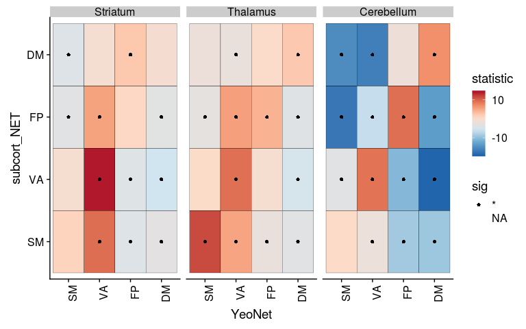
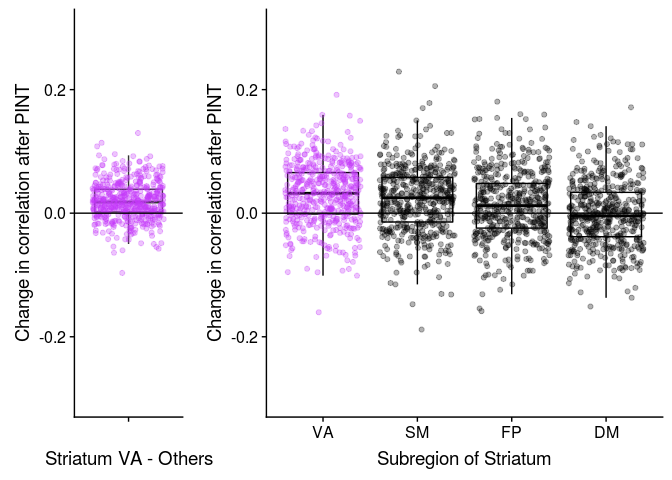
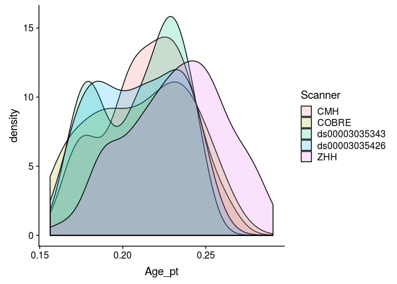
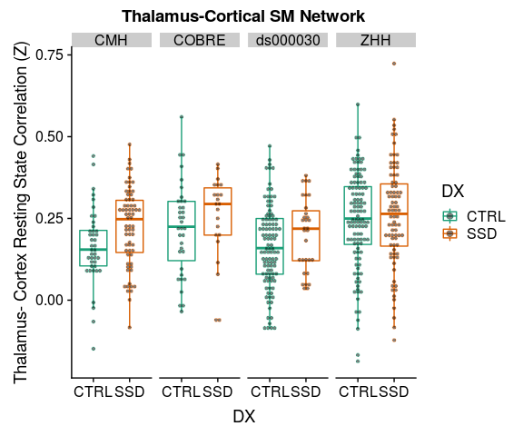
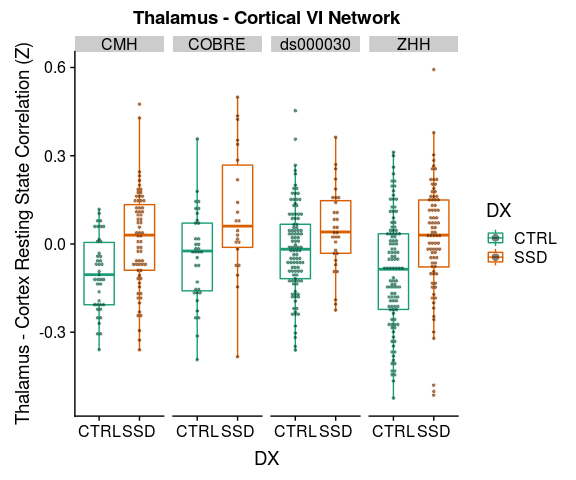

# Sub-cortical Cortical Stats Left and Right

This analysis tries to combine timeseries data from PINT outputs with subcortical timeseries to ask two questions

1. "External" validation of PINT. If PINT is indeed helping us better target meaningful resting state networks than we should see "cleaner" patterns of between the PINT output cortical ROIs and parcels of the subcortical structure that have been associated with these networks in literature.
   + i.e. connectivity of the cortical ROIS with "expected" subcortical parcel should increae and correlation with other parcels should decrease after PINT.
   
2. To interograte SSD related differences in Cortical-Subcortical connectivity - and to see if they persist after PINT.

Some work Ji (in prep) kinda suggests that there might be differences between left and right subcortical structures. AND spliting the left and right seemed to make more sense for whole brain correlations (because our cortical nodes have a hemisphere). So in this analysis have separate left and right ROIs


```r
library(tidyverse)
library(broom)
library(knitr)
library(tableone)
library(cowplot)
```


## The paths to data


```r
output_base <- '../data/ciftify_fmriprep/'

Yeo7_2011_80verts <- read_csv("../templates/Yeo7_2011_80verts.csv",
                              col_types = c(
                                hemi = col_character(),
                                tvertex = col_integer(),
                                LRpairs = col_integer(),
                                roiidx = col_integer(),
                                NETWORK = col_integer(),
                                LOBE = col_character(),
                                SHORTNAME = col_character(),
                                x = col_integer(),
                                y = col_integer(),
                                z = col_integer()
                              ))
```

# read and mangle the phenotypic data

Note we are also selecting to use scan from each subject with the least motion (fd_perc)


```r
## reading in the qced_sublists csv to get the sublists
pheno <- read_csv("../phenotypic/20180918_pheno_qapass.csv")
```

```
## Parsed with column specification:
## cols(
##   .default = col_character(),
##   fd_mean = col_double(),
##   fd_num = col_integer(),
##   fd_perc = col_double(),
##   size_t = col_integer(),
##   size_z = col_integer(),
##   spacing_tr = col_integer(),
##   spacing_z = col_double(),
##   age = col_double(),
##   GRID = col_integer(),
##   SessNo = col_integer(),
##   MRI_Date = col_double(),
##   Edu = col_integer(),
##   ScannerSerialNumber = col_integer()
## )
```

```
## See spec(...) for full column specifications.
```

```r
pheno <- pheno %>%
  filter(!is.na(filename)) %>%
  group_by(participant_id) %>%
  arrange(fd_perc) %>%
  slice(1) %>%
  ungroup()
```

## adding transformed variables 


```r
transform_to_normal <- function(X) {
  # calculate the best exponent using powerTransform:
  pT <- car::powerTransform(X)
  # apply the power transform and save the result to a new variable
  X_pT <- X^pT$lambda ## note ^ is exponent in r
  return(X_pT)
}

pheno <- pheno %>%
  mutate(Age_pt = transform_to_normal(age),
         fd_mean_pt = transform_to_normal(fd_mean))
```


# Code for reading in all the timeseries..


A table that describes the current expected subortical files


```r
# a tibble table to specify the subcortical meants files that were generated
YeoNet_subcort_list <- c('VI','SM','DA','VA', 'LI','FP','DM')
```

These functions are for reading timeseries files


```r
#' read a meants file generated by PINT of ciftify_meants
#'
#' @param filepath the full path to the file
#'
#' @return a dataframe where rows are rois and colums are timepoints
read_meants_csv <- function(filepath) {
   meants <-read_csv(filepath, 
                     col_names = FALSE,
                     col_types = c(.default = col_double()))
   return(meants)
}

#' Read the contents of a csv generated by PINT
#'
#' @param outputprefix The prefix to the PINT outputs
#' @param vertex_type "pvertex" or "tvertex"
#' @param projectname the outputdir
#' @param output_dir the basepath of the pint outputs
#'
#' @return a dataframe of the _meants.csv contents
read_pint_meants <- function(outputprefix, vertex_type, projectname, output_dir) {
  expected_filepath <- file.path(output_dir, projectname, "out",'ciftify_PINT', 
                           str_c(outputprefix, '_desc-clean_bold_', 
                                 vertex_type, '_meants.csv'))
  meants = read_meants_csv(expected_filepath)
  return(meants)
}
#' Read the contents of a subcortical csv
#' expample file path is sub-CMHHEF011_ses-01_task-rest_acq-CMH_run-01_bold_desc-cleansm0_atlas-7RSN_roi-Lcerebellum_timeseries.csv
#'
#' @param outputprefix the prefix to the pint outputfile
#' @param hemi The hemisphere "L" or "R"
#' @param subregion region "thalamus", "stiatum", "cerebellum"
#' @param output_dir the basepath of the output data
#' @param projectname the project name inside the output dir
#'
#' @return a dataframe of the _meants.csv contents
read_subcortical_hemi_meants <- function(outputprefix, hemi, subregion, projectname, output_dir) {
  expected_filepath <- file.path(output_dir, projectname, "out",'ciftify_meants', 
                           str_c(outputprefix,
                                 '_desc-cleansm0_atlas-7RSN_roi-', 
                                 hemi, subregion, '_timeseries.csv'))
  meants = read_meants_csv(expected_filepath)
  return(meants)
}

#' Contructs the expected output prefix from subid session and func_base
#'
#' @param subid The subject identifier
#' @param sessid The session identifier (or null)
#' @param func_base The functional file prefix
#'
#' @return an output prefix string for the filenames
construct_output_prefix <- function(subid, sessid, func_base) {
  prefix <- if_else(is.na(sessid),
                    file.path(subid, str_c(subid, '_', func_base)),
                    file.path(subid, sessid, 
                      str_c(subid, '_', sessid, '_', func_base)))
  return(prefix)
}

#' get func_base from pint summary filename
#'
#' @param subid The subject identifier
#' @param sessid The session identifier (or null)
#' @param func_base The functional file prefix
#'
#' @return an output prefix string for the filenames
get_func_base_from_pint_summary_filename <- function(filename, subject, session) {
  func_base <- if_else(is.na(session), 
                       filename %>%
                         str_replace(str_c(subject, "_"), '') %>%
                         str_replace('_desc-clean_bold_summary.csv',''),
                       filename %>%
                         str_replace(subject, '') %>%
                         str_replace(session, '') %>% 
                         str_replace('__','') %>%
                         str_replace('_desc-clean_bold_summary.csv',''))
  return(func_base)
}
```


This reads all files and generate PINT to subcortical correlation values for a given subject


```r
the_subcortical_guide <- tribble(
 ~subcort_hemi, ~subcort_ROI, ~subcort_NET,
 "L", "thalamus", c('VI','SM','DA','VA', 'FP','DM'),
 "L", "striatum", c('SM','DA','VA', 'LI','FP','DM'),
 "L", "cerebellum", c('VI','SM','DA','VA', 'LI','FP','DM'),
 "R", "thalamus", c('VI','SM','DA','VA', 'LI','FP','DM'),
 "R", "striatum", c('VI','SM','DA','VA', 'LI','FP','DM'),
 "R", "cerebellum", c('VI','SM','DA','VA', 'LI','FP','DM')) %>%
  unnest()


#' read all fMRI timeseries data for one subject and correlates PINT ROIs with subcortex
#'
#' @param out_prefix the prefix to the pint outputfile
#' @param outputbase the path to the pint output directory
#' @param projectname the path to sub-study project (dataset)
#' @param Yeo7_2011_80verts as data frame describing the PINT ROIs 
#'
#' @return a dataframe (graph style) of PINT ROI to subcortical correlations
subject_subcort_corrs <- function(out_prefix, projectname, 
                                  outputbase, Yeo7_2011_80verts) {
  
  # read the pint meants files
  pvertex_meants <- read_pint_meants(out_prefix, 'pvertex', 
                                     projectname, outputbase)
  tvertex_meants <- read_pint_meants(out_prefix, 'tvertex',
                                     projectname, outputbase)
  
  # read the subcortical meants files
  thalamus_L_meants <- read_subcortical_hemi_meants(out_prefix,
                                                    "L","thalamus", 
                                                    projectname, outputbase)
  striatum_L_meants <- read_subcortical_hemi_meants(out_prefix,
                                                    "L","striatum",
                                                    projectname, outputbase)
  cerebellum_L_meants <- read_subcortical_hemi_meants(out_prefix,
                                                      "L", "cerebellum",
                                                      projectname, outputbase)
  thalamus_R_meants <- read_subcortical_hemi_meants(out_prefix,
                                                    "R","thalamus",
                                                    projectname, outputbase)
  striatum_R_meants <- read_subcortical_hemi_meants(out_prefix,
                                                    "R","striatum", 
                                                    projectname, outputbase)
  cerebellum_R_meants <- read_subcortical_hemi_meants(out_prefix,
                                                      "R", "cerebellum", 
                                                      projectname, outputbase)
  
  # prepare to bind
  subcort_meants <- bind_rows(thalamus_L_meants, striatum_L_meants, cerebellum_L_meants,
                              thalamus_R_meants, striatum_R_meants, cerebellum_R_meants)
  
  # correlate the pvertex timeseries with the subcortical data
  pvertex_subcortcorr <- as.data.frame(cor(t(subcort_meants), t(pvertex_meants)))
  names(pvertex_subcortcorr) <- Yeo7_2011_80verts$SHORTNAME
  pvertex_result <- the_subcortical_guide %>% 
    bind_cols(pvertex_subcortcorr) %>%
    gather(PINT_ROI, pvertex_corr, -subcort_ROI, -subcort_NET, -subcort_hemi)
  
  # correlated the tvertex timeseries with the subcortical data
  tvertex_subcortcorr <- as.data.frame(cor(t(subcort_meants), t(tvertex_meants)))
  names(tvertex_subcortcorr) <- Yeo7_2011_80verts$SHORTNAME
  tvertex_result <- the_subcortical_guide %>% 
    bind_cols(tvertex_subcortcorr) %>%
    gather(PINT_ROI, tvertex_corr, -subcort_ROI, -subcort_NET, -subcort_hemi)
  
  # combine pvertex and tvertex and return
  subresult <- pvertex_result %>%
    inner_join(tvertex_result, by = c("PINT_ROI", "subcort_ROI", "subcort_NET", "subcort_hemi"))
  return(subresult)
}

#' reads in all the timeseries files for one participant
#' note that Yeo&_2011_80verts and output_base are pulled from the global env
run_read_subject_subcort_corrs <- function(out_prefix, projectname) {
  df <-subject_subcort_corrs(out_prefix, projectname,
                             output_base, Yeo7_2011_80verts)
  return(df)
}

# run_read_subject_subcort_corrs(subcort_outputlist$subid[1])
```


### This reads all the subcortical files it can find

Write a func_base and outputprefix cols into the pheno file for the file reading step


```r
pheno <- pheno %>%
  mutate(func_base = get_func_base_from_pint_summary_filename(filename,participant_id, sessid), 
         outputprefix = construct_output_prefix(participant_id, sessid, func_base)) 
```


```r
all_subcort_results <- pheno %>%
  select(participant_id, outputprefix, dataset) %>%
  mutate(subcort_corrs = map2(outputprefix, dataset,
                              ~run_read_subject_subcort_corrs(.x, .y)))
```

### merge with the phenotypic data


```r
results_pheno <- all_subcort_results %>%
  inner_join(pheno, by = "participant_id") %>%
  unnest() %>%
  mutate(YeoNet = str_sub(PINT_ROI, 1,2),
         hemisphere = str_sub(PINT_ROI, 5,5)) %>%
  mutate(conn_type = if_else(YeoNet == subcort_NET, "same_net", "diff_net"),
         YeoNet = factor(YeoNet, levels = c("VI", "SM", "DA", "VA", "FP", "DM")),
         subcort_NET = factor(subcort_NET, levels = c("VI", "SM", "DA", "VA", "FP", "DM", "LI"))) %>%
  #       ) %>%
  select(participant_id, PINT_ROI, subcort_ROI, subcort_NET,subcort_hemi, 
         pvertex_corr, tvertex_corr, 
         DX, Sex, fd_mean, age, site, Age_pt, fd_mean_pt,  
         YeoNet, hemisphere, conn_type) 
```


## make a subject table from resuts pheno


```r
library(tableone)
therealtable1 <- CreateTableOne(
  strata = c("site", "DX"),
  vars = c("age", "Sex", "fd_mean", "fd_perc"),
  data = filter(results_pheno, PINT_ROI=="DMP1L",subcort_ROI=="thalamus", subcort_NET=="VA", subcort_hemi == "L")
)
```

```
## Warning in ModuleReturnVarsExist(vars, data): The data frame does not have:
## fd_perc Dropped
```

```r
tabMat <- print(therealtable1, quote = FALSE, noSpaces = TRUE, printToggle = FALSE)
kable(tabMat)
```

                      CMH:CTRL       COBRE:CTRL     ds000030:CTRL   ZHH:CTRL       CMH:SCZ        COBRE:SCZ       ds000030:SCZ   ZHH:SCZ        p        test 
--------------------  -------------  -------------  --------------  -------------  -------------  --------------  -------------  -------------  -------  -----
n                     37             27             96              111            66             15              27             83                           
age (mean (sd))       26.95 (6.74)   31.15 (8.89)   30.80 (8.18)    25.07 (6.55)   32.27 (8.51)   30.20 (12.89)   34.89 (9.31)   26.20 (9.45)   <0.001        
Sex = M (%)           22 (59.5)      17 (63.0)      52 (54.2)       48 (43.2)      39 (59.1)      12 (80.0)       22 (81.5)      64 (77.1)      <0.001        
fd_mean (mean (sd))   0.10 (0.05)    0.18 (0.04)    0.14 (0.07)     0.12 (0.04)    0.12 (0.05)    0.22 (0.09)     0.19 (0.08)    0.12 (0.06)    <0.001        

# Is PINT "focusing" cortical subcortical connectivity


```r
table1 <- results_pheno %>%
  mutate(corr_diff = pvertex_corr - tvertex_corr) %>%
  gather(corr_type, rval, pvertex_corr, tvertex_corr) %>%
  group_by(corr_type, YeoNet, subcort_ROI, subcort_NET) %>%
  summarise(n = n(),
            Mean = mean(rval),
            SD = sd(rval)) 
  
ggplot(table1, aes(y = YeoNet, x = subcort_NET, fill = Mean)) + 
  geom_tile() +
  scale_fill_gradient2(breaks = c(-0.5,0.5)) +
  theme(axis.text.x = element_text(angle = 90, hjust = 1)) +
  facet_grid(subcort_ROI~corr_type) 
```

<!-- -->


```r
table1 <- results_pheno %>%
  mutate(corr_diff = pvertex_corr - tvertex_corr) %>%
  gather(corr_type, rval, pvertex_corr, tvertex_corr) %>%
  group_by(corr_type, YeoNet, hemisphere, subcort_ROI, subcort_NET, subcort_hemi) %>%
  summarise(n = n(),
            Mean = mean(rval),
            SD = sd(rval)) 
  
ggplot(table1, aes(y = YeoNet, x = subcort_NET, fill = Mean)) + 
  geom_tile() +
  scale_fill_gradient2(breaks = c(-0.5,0.5)) +
  theme(axis.text.x = element_text(angle = 90, hjust = 1)) +
  facet_grid(subcort_ROI*subcort_hemi~corr_type*hemisphere) 
```

<!-- -->

We see in the above figure that the Yeo 7 Network connectivity strongly shows the expected pattern in the cerebeullum. 

Lower evidence is seen in the striatum and thalamus, although there is a faint increase across the diagonal for the SM, VA and DM especially


```r
net_means <- results_pheno %>%
  mutate(corr_diff = pvertex_corr - tvertex_corr) %>%
  group_by(YeoNet, subcort_ROI, subcort_NET, conn_type, participant_id) %>%
  summarise(netmean_pvertex = mean(pvertex_corr),
            netmean_tvertex = mean(tvertex_corr)) %>%
  ungroup()

net_means_pint_t <- net_means %>%
  group_by(YeoNet, subcort_ROI, subcort_NET) %>%
  do(tidy(t.test(.$netmean_pvertex, .$netmean_tvertex, paired = TRUE)))

net_means_pint_t %>%
  ungroup() %>%
  mutate(sig = if_else(p.value < 0.005, '*', NA_character_) ) %>%
ggplot(aes(x = YeoNet, y = subcort_NET, fill = statistic)) + 
  geom_tile(color = "black", na.rm = TRUE) +
  geom_point(aes(shape = sig), na.rm = TRUE) +
  scale_fill_gradient2() +
  theme(axis.text.x = element_text(angle = 90, hjust = 1)) +
  facet_wrap(~subcort_ROI)
```

<!-- -->
Here we plot the paired t-stat camparing personalized to template, we see a very strong increase in correlation along the diagonal (i.e. with the hypothesized regions) and decreases on the off-dignonal (i.e. decreased connectivity with the other network's parcels)


# trying to calculate an vs off diagonal term

In the above table to calcuculated the "focussing" effect as the change (in on person) between in connectivity with the expected parcel subtracted by the change in connectivity from other regions.

Below we plot these values against zero


```r
library(knitr)
net_focus <- net_means %>%
  ungroup() %>%
  mutate(pint_diff = netmean_pvertex - netmean_tvertex) %>%
  group_by(participant_id, subcort_ROI, YeoNet, conn_type) %>%
  summarise(nets_avg = mean(pint_diff)) %>%
  ungroup() %>%
  spread(conn_type, nets_avg) %>%
  mutate(focus_effect = same_net - diff_net)

net_focus %>%
  ungroup() %>%
  group_by(subcort_ROI, YeoNet) %>%
  do(tidy(t.test(.$focus_effect))) %>%
  kable()
```


subcort_ROI   YeoNet     estimate    statistic     p.value   parameter     conf.low   conf.high  method              alternative 
------------  -------  ----------  -----------  ----------  ----------  -----------  ----------  ------------------  ------------
cerebellum    VI        0.0263229   10.7923448   0.0000000         461    0.0215299   0.0311159  One Sample t-test   two.sided   
cerebellum    SM        0.0200667    9.2196615   0.0000000         461    0.0157896   0.0243438  One Sample t-test   two.sided   
cerebellum    DA        0.0276991   12.0886180   0.0000000         461    0.0231963   0.0322019  One Sample t-test   two.sided   
cerebellum    VA        0.0332516   16.5983295   0.0000000         461    0.0293148   0.0371883  One Sample t-test   two.sided   
cerebellum    FP        0.0407051   17.3524683   0.0000000         461    0.0360954   0.0453149  One Sample t-test   two.sided   
cerebellum    DM        0.0534125   20.0231009   0.0000000         461    0.0481705   0.0586546  One Sample t-test   two.sided   
striatum      VI        0.0012480    0.5238484   0.6006357         461   -0.0034336   0.0059295  One Sample t-test   two.sided   
striatum      SM        0.0090846    4.6657187   0.0000040         461    0.0052583   0.0129108  One Sample t-test   two.sided   
striatum      DA        0.0048291    2.6312399   0.0087924         461    0.0012225   0.0084356  One Sample t-test   two.sided   
striatum      VA        0.0213913   14.2906019   0.0000000         461    0.0184498   0.0243329  One Sample t-test   two.sided   
striatum      FP        0.0091087    4.7764544   0.0000024         461    0.0053612   0.0128562  One Sample t-test   two.sided   
striatum      DM        0.0089564    4.1075197   0.0000473         461    0.0046714   0.0132413  One Sample t-test   two.sided   
thalamus      VI        0.0068602    4.0056028   0.0000721         461    0.0034946   0.0102258  One Sample t-test   two.sided   
thalamus      SM        0.0275417   12.2122840   0.0000000         461    0.0231098   0.0319735  One Sample t-test   two.sided   
thalamus      DA        0.0163251    8.2954009   0.0000000         461    0.0124578   0.0201924  One Sample t-test   two.sided   
thalamus      VA        0.0110484    7.0012057   0.0000000         461    0.0079473   0.0141495  One Sample t-test   two.sided   
thalamus      FP        0.0104822    5.5671451   0.0000000         461    0.0067821   0.0141822  One Sample t-test   two.sided   
thalamus      DM        0.0147925    7.6795570   0.0000000         461    0.0110072   0.0185777  One Sample t-test   two.sided   

Another (maybe better) way to test this is to show calculate the "focusing" value in individual subjects THAN compute how this number changes with PINT. Let try that..


```r
subject_focus <- net_means %>%
  gather(vertex_type, nets_avg, netmean_pvertex, netmean_tvertex) %>%
  ungroup(subcort_NET) %>%
  group_by(participant_id, subcort_ROI, YeoNet, vertex_type, conn_type) %>%
  summarise(nets_type_avg = mean(nets_avg)) %>%
  spread(conn_type, nets_type_avg) %>%
  ungroup() %>%
  mutate(focus_effect = same_net - diff_net)

subject_focus %>%
  ungroup() %>%
  group_by(subcort_ROI, YeoNet, vertex_type) %>%
  do(tidy(t.test(.$focus_effect))) %>%
  kable()
```


subcort_ROI   YeoNet   vertex_type         estimate   statistic     p.value   parameter    conf.low   conf.high  method              alternative 
------------  -------  ----------------  ----------  ----------  ----------  ----------  ----------  ----------  ------------------  ------------
cerebellum    VI       netmean_pvertex    0.1543371   19.917124   0.0000000         461   0.1391095   0.1695648  One Sample t-test   two.sided   
cerebellum    VI       netmean_tvertex    0.1280143   20.016536   0.0000000         461   0.1154465   0.1405821  One Sample t-test   two.sided   
cerebellum    SM       netmean_pvertex    0.1815199   30.345871   0.0000000         461   0.1697651   0.1932746  One Sample t-test   two.sided   
cerebellum    SM       netmean_tvertex    0.1614531   32.189557   0.0000000         461   0.1515967   0.1713096  One Sample t-test   two.sided   
cerebellum    DA       netmean_pvertex    0.1353388   23.645821   0.0000000         461   0.1240913   0.1465864  One Sample t-test   two.sided   
cerebellum    DA       netmean_tvertex    0.1076397   23.616170   0.0000000         461   0.0986829   0.1165965  One Sample t-test   two.sided   
cerebellum    VA       netmean_pvertex    0.1892448   31.193054   0.0000000         461   0.1773226   0.2011670  One Sample t-test   two.sided   
cerebellum    VA       netmean_tvertex    0.1559932   31.885238   0.0000000         461   0.1463792   0.1656073  One Sample t-test   two.sided   
cerebellum    FP       netmean_pvertex    0.1719878   35.990425   0.0000000         461   0.1625971   0.1813786  One Sample t-test   two.sided   
cerebellum    FP       netmean_tvertex    0.1312827   37.523019   0.0000000         461   0.1244072   0.1381581  One Sample t-test   two.sided   
cerebellum    DM       netmean_pvertex    0.2850619   40.486494   0.0000000         461   0.2712257   0.2988982  One Sample t-test   two.sided   
cerebellum    DM       netmean_tvertex    0.2316494   40.058652   0.0000000         461   0.2202856   0.2430132  One Sample t-test   two.sided   
striatum      VI       netmean_pvertex    0.0214253    3.554923   0.0004171         461   0.0095816   0.0332690  One Sample t-test   two.sided   
striatum      VI       netmean_tvertex    0.0201773    4.220389   0.0000294         461   0.0107822   0.0295724  One Sample t-test   two.sided   
striatum      SM       netmean_pvertex    0.0931224   17.180138   0.0000000         461   0.0824707   0.1037740  One Sample t-test   two.sided   
striatum      SM       netmean_tvertex    0.0840378   18.709195   0.0000000         461   0.0752109   0.0928647  One Sample t-test   two.sided   
striatum      DA       netmean_pvertex    0.0298730    6.986323   0.0000000         461   0.0214703   0.0382758  One Sample t-test   two.sided   
striatum      DA       netmean_tvertex    0.0250440    7.942148   0.0000000         461   0.0188473   0.0312406  One Sample t-test   two.sided   
striatum      VA       netmean_pvertex    0.1119458   27.806557   0.0000000         461   0.1040345   0.1198572  One Sample t-test   two.sided   
striatum      VA       netmean_tvertex    0.0905545   28.439630   0.0000000         461   0.0842974   0.0968116  One Sample t-test   two.sided   
striatum      FP       netmean_pvertex    0.0563955   14.873730   0.0000000         461   0.0489445   0.0638465  One Sample t-test   two.sided   
striatum      FP       netmean_tvertex    0.0472868   17.102388   0.0000000         461   0.0418534   0.0527202  One Sample t-test   two.sided   
striatum      DM       netmean_pvertex    0.0686665   13.523712   0.0000000         461   0.0586886   0.0786444  One Sample t-test   two.sided   
striatum      DM       netmean_tvertex    0.0597101   15.870856   0.0000000         461   0.0523168   0.0671034  One Sample t-test   two.sided   
thalamus      VI       netmean_pvertex    0.0593366   13.498808   0.0000000         461   0.0506985   0.0679747  One Sample t-test   two.sided   
thalamus      VI       netmean_tvertex    0.0524764   15.203252   0.0000000         461   0.0456935   0.0592593  One Sample t-test   two.sided   
thalamus      SM       netmean_pvertex    0.2055209   32.951925   0.0000000         461   0.1932645   0.2177774  One Sample t-test   two.sided   
thalamus      SM       netmean_tvertex    0.1779793   33.710266   0.0000000         461   0.1676040   0.1883545  One Sample t-test   two.sided   
thalamus      DA       netmean_pvertex    0.0833383   16.880277   0.0000000         461   0.0736364   0.0930401  One Sample t-test   two.sided   
thalamus      DA       netmean_tvertex    0.0670132   17.298886   0.0000000         461   0.0594006   0.0746257  One Sample t-test   two.sided   
thalamus      VA       netmean_pvertex    0.0522839   12.654135   0.0000000         461   0.0441645   0.0604033  One Sample t-test   two.sided   
thalamus      VA       netmean_tvertex    0.0412355   12.508127   0.0000000         461   0.0347571   0.0477139  One Sample t-test   two.sided   
thalamus      FP       netmean_pvertex    0.0826391   19.416207   0.0000000         461   0.0742752   0.0910030  One Sample t-test   two.sided   
thalamus      FP       netmean_tvertex    0.0721569   21.817668   0.0000000         461   0.0656578   0.0786561  One Sample t-test   two.sided   
thalamus      DM       netmean_pvertex    0.1053053   22.192322   0.0000000         461   0.0959806   0.1146301  One Sample t-test   two.sided   
thalamus      DM       netmean_tvertex    0.0905129   24.854910   0.0000000         461   0.0833566   0.0976691  One Sample t-test   two.sided   

```r
subject_focus %>%
  ungroup() %>% group_by(participant_id, YeoNet, subcort_ROI) %>%
  select(participant_id, YeoNet, vertex_type, subcort_ROI, focus_effect) %>%
  spread(vertex_type, focus_effect) %>%
  group_by(subcort_ROI, YeoNet) %>%
  do(tidy(t.test(.$netmean_pvertex, .$netmean_tvertex, paired = TRUE))) %>%
  kable()
```


subcort_ROI   YeoNet     estimate    statistic     p.value   parameter     conf.low   conf.high  method          alternative 
------------  -------  ----------  -----------  ----------  ----------  -----------  ----------  --------------  ------------
cerebellum    VI        0.0263229   10.7923448   0.0000000         461    0.0215299   0.0311159  Paired t-test   two.sided   
cerebellum    SM        0.0200667    9.2196615   0.0000000         461    0.0157896   0.0243438  Paired t-test   two.sided   
cerebellum    DA        0.0276991   12.0886180   0.0000000         461    0.0231963   0.0322019  Paired t-test   two.sided   
cerebellum    VA        0.0332516   16.5983295   0.0000000         461    0.0293148   0.0371883  Paired t-test   two.sided   
cerebellum    FP        0.0407051   17.3524683   0.0000000         461    0.0360954   0.0453149  Paired t-test   two.sided   
cerebellum    DM        0.0534125   20.0231009   0.0000000         461    0.0481705   0.0586546  Paired t-test   two.sided   
striatum      VI        0.0012480    0.5238484   0.6006357         461   -0.0034336   0.0059295  Paired t-test   two.sided   
striatum      SM        0.0090846    4.6657187   0.0000040         461    0.0052583   0.0129108  Paired t-test   two.sided   
striatum      DA        0.0048291    2.6312399   0.0087924         461    0.0012225   0.0084356  Paired t-test   two.sided   
striatum      VA        0.0213913   14.2906019   0.0000000         461    0.0184498   0.0243329  Paired t-test   two.sided   
striatum      FP        0.0091087    4.7764544   0.0000024         461    0.0053612   0.0128562  Paired t-test   two.sided   
striatum      DM        0.0089564    4.1075197   0.0000473         461    0.0046714   0.0132413  Paired t-test   two.sided   
thalamus      VI        0.0068602    4.0056028   0.0000721         461    0.0034946   0.0102258  Paired t-test   two.sided   
thalamus      SM        0.0275417   12.2122840   0.0000000         461    0.0231098   0.0319735  Paired t-test   two.sided   
thalamus      DA        0.0163251    8.2954009   0.0000000         461    0.0124578   0.0201924  Paired t-test   two.sided   
thalamus      VA        0.0110484    7.0012057   0.0000000         461    0.0079473   0.0141495  Paired t-test   two.sided   
thalamus      FP        0.0104822    5.5671451   0.0000000         461    0.0067821   0.0141822  Paired t-test   two.sided   
thalamus      DM        0.0147925    7.6795570   0.0000000         461    0.0110072   0.0185777  Paired t-test   two.sided   


```r
subject_focus %>%
  ungroup() %>% 
  ggplot(aes(x = YeoNet, y = focus_effect)) +
  geom_boxplot(color = "blue", outlier.shape = NA) +
  geom_jitter(alpha = 0.05) +
  geom_hline(yintercept = 0) +
  facet_wrap(~ subcort_ROI)
```

<!-- -->


```r
net_focus %>%
  ungroup() %>%
  ggplot(aes(x = YeoNet, y = focus_effect)) +
  geom_boxplot(color = "blue", outlier.shape = NA) +
  geom_jitter(alpha = 0.1) +
  geom_hline(yintercept = 0) +
  facet_wrap(~ subcort_ROI)
```

<!-- -->

Recreating the DM plot from the poster to double check


```r
net_means <- results_pheno %>%
  ungroup() %>%
  group_by(YeoNet, subcort_ROI, subcort_NET, participant_id) %>%
  summarise(netmean_pvertex = mean(pvertex_corr),
            netmean_tvertex = mean(tvertex_corr),
            pint_diff = netmean_pvertex - netmean_tvertex) 

pint_diff_sub_DM <- net_means %>%
  ungroup() %>% 
  filter(YeoNet == "DM", subcort_ROI == "cerebellum") %>%
  select(participant_id, subcort_NET, pint_diff) %>%
  spread(subcort_NET, pint_diff) %>%
  mutate(overall_pint_diff = DM - (SM + VA + FP + DA)/4,
         x_val = '') %>%
  select(participant_id, overall_pint_diff, x_val) %>%
  ggplot(aes(y = overall_pint_diff, x = x_val)) +
    geom_boxplot(outlier.shape = NA) +
    geom_jitter(alpha = 0.3, color = '#cd3e4e', fill = "grey") +
    geom_hline(yintercept = 0) + 
    labs(y = "Change in correlation after PINT", x = "Cerebellum DM - Others") +
  scale_y_continuous(limits = c(-0.3, 0.3))

DM_submeans_plot <- net_means %>%
  mutate(is_DM = if_else(subcort_NET == 'DM', TRUE, FALSE),
         SubCortNET = factor(subcort_NET, levels = c("DM", "SM", "DA", "VA", "FP"))) %>%
  filter(subcort_ROI == "cerebellum", !is.na(SubCortNET), YeoNet == "DM") %>%
  ggplot(aes(y = pint_diff, x = SubCortNET, color = is_DM)) +
  geom_boxplot(color = "black", outlier.shape = NA) + 
  geom_jitter(alpha = 0.3) +
  geom_hline(yintercept = 0) +
  scale_color_manual(values = c('black','#cd3e4e')) +
  labs(y = "Change in correlation after PINT", color = NULL, x = "Subregion of Cerebellum") +
  theme(legend.position = "none") +
  scale_y_continuous(limits = c(-0.3, 0.3))

# DM_brain_pic <- ggdraw + draw_image('DM_striatum_pic.png')

plot_grid(pint_diff_sub_DM, DM_submeans_plot, rel_widths = c(1,2.5))
```

```
## Warning: Removed 1 rows containing non-finite values (stat_boxplot).
```

```
## Warning: Removed 1 rows containing missing values (geom_point).
```

<!-- -->

Also the VA Striatum one


```r
pint_diff_sub_VA <- net_means %>%
  ungroup %>% 
  filter(YeoNet == "VA", subcort_ROI == "cerebellum") %>%
  select(participant_id, subcort_NET, pint_diff) %>%
  spread(subcort_NET, pint_diff) %>%
  mutate(overall_pint_diff = VA - (SM + DM + FP + DA)/4,
         x_val = '') %>%
  select(participant_id, overall_pint_diff, x_val) %>%
  ggplot(aes(y = overall_pint_diff, x = x_val)) +
    geom_boxplot(outlier.shape = NA) +
    geom_jitter(alpha = 0.3, color = '#c43afa', fill = "grey") +
    geom_hline(yintercept = 0) + 
    labs(y = "Change in correlation after PINT", x = "Cerebellum VA - Others") +
  scale_y_continuous(limits = c(-0.3, 0.3))

VA_submeans_plot <- net_means %>%
  mutate(is_VA = if_else(subcort_NET == 'VA', TRUE, FALSE),
          SubCort_ROI = factor(subcort_NET, 
                               levels = c("VA", "DA", 'SM', 'FP', "DM"))) %>%
  filter(YeoNet == "VA", 
         subcort_ROI == "cerebellum",
         subcort_NET %in% c('SM', "VA", "DM", 'FP', "DA")) %>%
  ggplot(aes(y = pint_diff, x = SubCort_ROI, color = is_VA)) +
  geom_boxplot(color = "black", outlier.shape = NA) + 
  geom_jitter(alpha = 0.3) +
  geom_hline(yintercept = 0) +
  scale_color_manual(values = c('black','#c43afa')) +
  labs(y = "Change in correlation after PINT", color = NULL, x = "Subregion of Cerebellum") +
  theme(legend.position = "none") +
  scale_y_continuous(limits = c(-0.3, 0.3))

# DM_brain_pic <- ggdraw + draw_image('DM_striatum_pic.png')

plot_grid(pint_diff_sub_VA, VA_submeans_plot, rel_widths = c(1,2.5))
```

<!-- -->


```r
pint_diff_sub_VA <- net_means %>%
  ungroup %>% 
  filter(YeoNet == "VA", subcort_ROI == "striatum") %>%
  select(participant_id, subcort_NET, pint_diff) %>%
  spread(subcort_NET, pint_diff) %>%
  mutate(overall_pint_diff = VA - (SM + DM + FP)/3,
         x_val = '') %>%
  select(participant_id, overall_pint_diff, x_val) %>%
  ggplot(aes(y = overall_pint_diff, x = x_val)) +
    geom_boxplot(outlier.shape = NA) +
    geom_jitter(alpha = 0.3, color = '#c43afa', fill = "grey") +
    geom_hline(yintercept = 0) + 
    labs(y = "Change in correlation after PINT", x = "Striatum VA - Others") +
  scale_y_continuous(limits = c(-0.3, 0.3))

VA_submeans_plot <- net_means %>%
  mutate(is_VA = if_else(subcort_NET == 'VA', TRUE, FALSE),
          SubCort_ROI = factor(subcort_NET, 
                               levels = c("VA", 'SM', 'FP', "DM"))) %>%
  filter(YeoNet == "VA", 
         subcort_ROI == "striatum",
         subcort_NET %in% c('SM', "VA", "DM", 'FP')) %>%
  ggplot(aes(y = pint_diff, x = SubCort_ROI, color = is_VA)) +
  geom_boxplot(color = "black", outlier.shape = NA) + 
  geom_jitter(alpha = 0.3) +
  geom_hline(yintercept = 0) +
  scale_color_manual(values = c('black','#c43afa')) +
  labs(y = "Change in correlation after PINT", color = NULL, x = "Subregion of Striatum") +
  theme(legend.position = "none") +
  scale_y_continuous(limits = c(-0.3, 0.3))

# DM_brain_pic <- ggdraw + draw_image('DM_striatum_pic.png')

plot_grid(pint_diff_sub_VA, VA_submeans_plot, rel_widths = c(1,2.5))
```

<!-- -->

```r
pint_diff_sub_SM <- net_means %>%
  ungroup %>% 
  filter(YeoNet == "SM", subcort_ROI == "thalamus") %>%
  select(participant_id, subcort_NET, pint_diff) %>%
  spread(subcort_NET, pint_diff) %>%
  mutate(overall_pint_diff = SM - (VA + DM + FP + DA)/4,
         x_val = '') %>%
  select(participant_id, overall_pint_diff, x_val) %>%
  ggplot(aes(y = overall_pint_diff, x = x_val)) +
    geom_boxplot(outlier.shape = NA) +
    geom_jitter(alpha = 0.3, color = 'blue', fill = "grey") +
    geom_hline(yintercept = 0) + 
    labs(y = "Change in correlation after PINT", x = "Striatum VA - Others") +
  scale_y_continuous(limits = c(-0.3, 0.3))

SM_submeans_plot <- net_means %>%
  mutate(is_SM = if_else(subcort_NET == 'SM', TRUE, FALSE),
          SubCort_ROI = factor(subcort_NET, 
                               levels = c("SM", "VA", "DA",'FP', "DM"))) %>%
  filter(YeoNet == "SM", 
         subcort_ROI == "thalamus",
         subcort_NET %in% c('SM', "VA", "DA","DM", 'FP')) %>%
  ggplot(aes(y = pint_diff, x = SubCort_ROI, color = is_SM)) +
  geom_boxplot(color = "black", outlier.shape = NA) + 
  geom_jitter(alpha = 0.3) +
  geom_hline(yintercept = 0) +
  scale_color_manual(values = c('black','blue')) +
  labs(y = "Change in correlation after PINT", color = NULL, x = "Subregion of Thalamus") +
  theme(legend.position = "none") +
  scale_y_continuous(limits = c(-0.3, 0.3))

# DM_brain_pic <- ggdraw + draw_image('DM_striatum_pic.png')

plot_grid(pint_diff_sub_SM, SM_submeans_plot, rel_widths = c(1,2.5))
```

```
## Warning: Removed 1 rows containing non-finite values (stat_boxplot).
```

```
## Warning: Removed 1 rows containing missing values (geom_point).
```

<!-- -->


## Plotting the PINT effect separately in SSD and controls

Note that the circle denotes an uncorrected p<0.05


```r
net_means_byDX <- results_pheno %>%
  mutate(corr_diff = pvertex_corr - tvertex_corr) %>%
  group_by(YeoNet, subcort_ROI, subcort_NET, participant_id, DX) %>%
  summarise(netmean_pvertex = mean(pvertex_corr),
            netmean_tvertex = mean(tvertex_corr)) %>%
  ungroup() %>%
  group_by(YeoNet, subcort_ROI, subcort_NET, DX) %>%
  do(tidy(t.test(.$netmean_pvertex, .$netmean_tvertex, paired = TRUE)))

net_means_byDX %>%
  ungroup() %>%
  mutate(sig = if_else(p.value < 0.005, '*', NA_character_) ) %>%
ggplot(aes(x = YeoNet, y = subcort_NET, fill = statistic)) + 
  geom_tile(color = "black", na.rm = TRUE) +
  geom_point(aes(shape = sig), na.rm = TRUE) +
  scale_fill_gradient2() +
  theme(axis.text.x = element_text(angle = 90, hjust = 1)) +
  facet_grid(subcort_ROI ~ DX)
```

<!-- -->


## running model again with sex interaction


```r
library(knitr)

DX_lm_model <- results_pheno %>%
  gather(vertex_type, corZ, pvertex_corr, tvertex_corr) %>%
  filter(age > 17, age < 51) %>%
  group_by(vertex_type, subcort_ROI, subcort_NET, PINT_ROI) %>%
  do(tidy(lm(corZ ~ DX + Sex + fd_mean_pt + poly(Age_pt,2) + site,.))) %>%
  select(vertex_type, subcort_ROI, subcort_NET, PINT_ROI, term, statistic, p.value) %>%
  ungroup() %>%
  group_by(term) %>%
  mutate(p_FDR = p.adjust(p.value, method = "fdr")) %>%
  arrange(p.value)

DX_lm_model %>% 
  filter(term %in% c("DXSCZ")) %>%
  filter(p_FDR < 0.1) %>%
  kable()
```


vertex_type    subcort_ROI   subcort_NET   PINT_ROI   term     statistic     p.value       p_FDR
-------------  ------------  ------------  ---------  ------  ----------  ----------  ----------
pvertex_corr   thalamus      FP            VI02R      DXSCZ     7.958316   0.0000000   0.0000000
tvertex_corr   thalamus      DM            VI02L      DXSCZ     7.630543   0.0000000   0.0000000
pvertex_corr   thalamus      DM            VI04L      DXSCZ     7.611037   0.0000000   0.0000000
pvertex_corr   thalamus      DM            VI02R      DXSCZ     7.494765   0.0000000   0.0000000
pvertex_corr   thalamus      VI            VI04L      DXSCZ     7.442290   0.0000000   0.0000000
pvertex_corr   thalamus      FP            VI04L      DXSCZ     7.394430   0.0000000   0.0000000
tvertex_corr   thalamus      DM            VI04R      DXSCZ     7.283192   0.0000000   0.0000000
pvertex_corr   thalamus      DM            VI04R      DXSCZ     7.202534   0.0000000   0.0000000
pvertex_corr   thalamus      FP            VI04R      DXSCZ     7.181823   0.0000000   0.0000000
tvertex_corr   thalamus      FP            VI02R      DXSCZ     7.171825   0.0000000   0.0000000
pvertex_corr   thalamus      VI            VI04R      DXSCZ     7.134499   0.0000000   0.0000000
tvertex_corr   thalamus      FP            VI02L      DXSCZ     7.019068   0.0000000   0.0000000
tvertex_corr   thalamus      FP            VI04R      DXSCZ     6.996992   0.0000000   0.0000000
tvertex_corr   cerebellum    SM            VI04R      DXSCZ     6.983614   0.0000000   0.0000000
tvertex_corr   thalamus      VI            VI02L      DXSCZ     6.923590   0.0000000   0.0000000
tvertex_corr   thalamus      DM            VI02R      DXSCZ     6.909458   0.0000000   0.0000000
pvertex_corr   thalamus      FP            VI02L      DXSCZ     6.861148   0.0000000   0.0000000
tvertex_corr   thalamus      VI            VI05R      DXSCZ     6.809970   0.0000000   0.0000000
pvertex_corr   thalamus      DM            VI02L      DXSCZ     6.804006   0.0000000   0.0000000
pvertex_corr   cerebellum    SM            VI04L      DXSCZ     6.680758   0.0000000   0.0000000
pvertex_corr   thalamus      DM            VI03L      DXSCZ     6.669565   0.0000000   0.0000000
pvertex_corr   thalamus      DM            VI03R      DXSCZ     6.666639   0.0000000   0.0000000
tvertex_corr   thalamus      FP            VI04L      DXSCZ     6.618633   0.0000000   0.0000000
tvertex_corr   thalamus      DM            VI04L      DXSCZ     6.594664   0.0000000   0.0000000
tvertex_corr   cerebellum    VA            SMT1L      DXSCZ     6.556424   0.0000000   0.0000000
pvertex_corr   thalamus      VI            VI05R      DXSCZ     6.546543   0.0000000   0.0000000
tvertex_corr   thalamus      DM            VI03L      DXSCZ     6.534999   0.0000000   0.0000000
pvertex_corr   thalamus      FP            VI03R      DXSCZ     6.523310   0.0000000   0.0000000
pvertex_corr   thalamus      VI            SMI1R      DXSCZ     6.520818   0.0000000   0.0000000
pvertex_corr   thalamus      VI            VI02R      DXSCZ     6.463204   0.0000000   0.0000000
pvertex_corr   thalamus      DM            VI05L      DXSCZ     6.439047   0.0000000   0.0000000
pvertex_corr   thalamus      FP            VI05L      DXSCZ     6.436730   0.0000000   0.0000000
tvertex_corr   thalamus      DM            VI03R      DXSCZ     6.396290   0.0000000   0.0000000
pvertex_corr   thalamus      FP            VI03L      DXSCZ     6.394419   0.0000000   0.0000000
tvertex_corr   thalamus      VI            VI04R      DXSCZ     6.347069   0.0000000   0.0000000
tvertex_corr   thalamus      VI            SMI1R      DXSCZ     6.276551   0.0000000   0.0000001
tvertex_corr   thalamus      VI            DAP3R      DXSCZ     6.255139   0.0000000   0.0000001
tvertex_corr   thalamus      VI            VI02R      DXSCZ     6.228658   0.0000000   0.0000001
pvertex_corr   cerebellum    DA            SMI1L      DXSCZ     6.221288   0.0000000   0.0000001
tvertex_corr   thalamus      VI            VI05L      DXSCZ     6.207663   0.0000000   0.0000001
pvertex_corr   cerebellum    SM            VI05L      DXSCZ     6.180883   0.0000000   0.0000001
tvertex_corr   cerebellum    SM            SMT1L      DXSCZ     6.180873   0.0000000   0.0000001
pvertex_corr   striatum      FP            DMT1R      DXSCZ     6.101090   0.0000000   0.0000001
pvertex_corr   thalamus      VI            VI05L      DXSCZ     6.062729   0.0000000   0.0000002
pvertex_corr   thalamus      VI            VI02L      DXSCZ     6.058508   0.0000000   0.0000002
pvertex_corr   thalamus      VI            SMF3R      DXSCZ     6.054181   0.0000000   0.0000002
tvertex_corr   thalamus      VI            DAT1R      DXSCZ     6.041779   0.0000000   0.0000002
pvertex_corr   thalamus      FP            SMF3R      DXSCZ     6.024874   0.0000000   0.0000002
tvertex_corr   cerebellum    DA            SMT1L      DXSCZ     6.000991   0.0000000   0.0000002
pvertex_corr   thalamus      VI            VI03R      DXSCZ     5.985462   0.0000000   0.0000002
pvertex_corr   thalamus      VI            VI03L      DXSCZ     5.952454   0.0000000   0.0000003
pvertex_corr   cerebellum    SM            VI04R      DXSCZ     5.942118   0.0000000   0.0000003
tvertex_corr   thalamus      VI            VI04L      DXSCZ     5.908493   0.0000000   0.0000003
pvertex_corr   cerebellum    SM            VI05R      DXSCZ     5.856821   0.0000000   0.0000004
pvertex_corr   thalamus      VA            VI04R      DXSCZ     5.844235   0.0000000   0.0000004
pvertex_corr   striatum      FP            VI02R      DXSCZ     5.775392   0.0000000   0.0000006
pvertex_corr   thalamus      FP            VI05R      DXSCZ     5.755283   0.0000000   0.0000007
tvertex_corr   thalamus      FP            VI05L      DXSCZ     5.753338   0.0000000   0.0000007
tvertex_corr   thalamus      VI            SMF1R      DXSCZ     5.729658   0.0000000   0.0000008
tvertex_corr   thalamus      FP            VI05R      DXSCZ     5.718879   0.0000000   0.0000008
tvertex_corr   thalamus      VA            VI02L      DXSCZ     5.689126   0.0000000   0.0000010
pvertex_corr   thalamus      VI            DAP2R      DXSCZ     5.681816   0.0000000   0.0000010
pvertex_corr   striatum      DM            VI02R      DXSCZ     5.666028   0.0000000   0.0000011
pvertex_corr   striatum      SM            VAF2L      DXSCZ    -5.639904   0.0000000   0.0000012
tvertex_corr   thalamus      FP            FPP2L      DXSCZ    -5.618978   0.0000000   0.0000013
pvertex_corr   thalamus      DM            VI05R      DXSCZ     5.613640   0.0000000   0.0000014
pvertex_corr   striatum      DM            DMT1R      DXSCZ     5.557086   0.0000000   0.0000018
tvertex_corr   cerebellum    SM            VI05R      DXSCZ     5.544416   0.0000000   0.0000019
tvertex_corr   thalamus      VI            SMI1L      DXSCZ     5.526508   0.0000000   0.0000021
tvertex_corr   cerebellum    DA            SMT1R      DXSCZ     5.522923   0.0000000   0.0000021
pvertex_corr   striatum      FP            VI05L      DXSCZ     5.513724   0.0000000   0.0000022
tvertex_corr   thalamus      VI            VAT1R      DXSCZ     5.494067   0.0000001   0.0000024
tvertex_corr   thalamus      DM            VI05L      DXSCZ     5.493058   0.0000001   0.0000024
tvertex_corr   cerebellum    SM            VI05L      DXSCZ     5.463764   0.0000001   0.0000028
pvertex_corr   cerebellum    VA            SMT1L      DXSCZ     5.437448   0.0000001   0.0000031
pvertex_corr   thalamus      VA            SMF3R      DXSCZ     5.430201   0.0000001   0.0000032
pvertex_corr   striatum      FP            DMT2R      DXSCZ     5.426267   0.0000001   0.0000033
pvertex_corr   thalamus      FP            SMI1R      DXSCZ     5.418052   0.0000001   0.0000034
pvertex_corr   thalamus      VA            VI02R      DXSCZ     5.404885   0.0000001   0.0000035
pvertex_corr   cerebellum    DA            SMF2R      DXSCZ     5.404450   0.0000001   0.0000035
tvertex_corr   thalamus      VI            SMF3R      DXSCZ     5.401400   0.0000001   0.0000035
tvertex_corr   thalamus      VI            SMT1L      DXSCZ     5.375776   0.0000001   0.0000040
tvertex_corr   cerebellum    DM            FPP2L      DXSCZ    -5.359183   0.0000001   0.0000043
pvertex_corr   striatum      SM            VAF1R      DXSCZ    -5.309648   0.0000001   0.0000056
pvertex_corr   thalamus      VI            DAF2R      DXSCZ     5.304589   0.0000001   0.0000057
tvertex_corr   cerebellum    VA            SMT1R      DXSCZ     5.300611   0.0000001   0.0000057
pvertex_corr   cerebellum    SM            SMT1L      DXSCZ     5.294261   0.0000002   0.0000058
pvertex_corr   thalamus      FP            VI01R      DXSCZ     5.293332   0.0000002   0.0000058
pvertex_corr   thalamus      VI            SMT1R      DXSCZ     5.283580   0.0000002   0.0000061
pvertex_corr   thalamus      VI            VI01R      DXSCZ     5.273793   0.0000002   0.0000063
pvertex_corr   thalamus      VI            SMF1R      DXSCZ     5.267480   0.0000002   0.0000064
pvertex_corr   striatum      FP            VI03R      DXSCZ     5.243519   0.0000002   0.0000072
pvertex_corr   thalamus      FP            VI01L      DXSCZ     5.231880   0.0000002   0.0000075
tvertex_corr   thalamus      FP            SMT1L      DXSCZ     5.231544   0.0000002   0.0000075
pvertex_corr   thalamus      VI            VI01L      DXSCZ     5.229044   0.0000002   0.0000076
pvertex_corr   thalamus      VA            VI03R      DXSCZ     5.220675   0.0000002   0.0000078
pvertex_corr   thalamus      VA            VI04L      DXSCZ     5.173845   0.0000003   0.0000099
tvertex_corr   cerebellum    LI            SMT1L      DXSCZ     5.166459   0.0000003   0.0000101
pvertex_corr   thalamus      FP            SMF2R      DXSCZ     5.135798   0.0000003   0.0000118
pvertex_corr   thalamus      FP            SMF3L      DXSCZ     5.113315   0.0000004   0.0000131
pvertex_corr   cerebellum    DM            FPF1L      DXSCZ    -5.105891   0.0000004   0.0000135
tvertex_corr   thalamus      VI            SMF1L      DXSCZ     5.096581   0.0000004   0.0000140
tvertex_corr   thalamus      VA            VAT1R      DXSCZ     5.094953   0.0000004   0.0000140
pvertex_corr   thalamus      VI            DAP1R      DXSCZ     5.073469   0.0000005   0.0000154
pvertex_corr   thalamus      VI            SMF3L      DXSCZ     5.070037   0.0000005   0.0000155
pvertex_corr   thalamus      VI            SMF1L      DXSCZ     5.068609   0.0000005   0.0000155
pvertex_corr   cerebellum    DM            DMF2L      DXSCZ     5.055053   0.0000005   0.0000165
pvertex_corr   cerebellum    DA            SMT1L      DXSCZ     5.041285   0.0000006   0.0000175
tvertex_corr   cerebellum    DA            SMI1L      DXSCZ     5.039338   0.0000006   0.0000175
pvertex_corr   thalamus      VA            VI03L      DXSCZ     5.030159   0.0000006   0.0000182
pvertex_corr   cerebellum    SM            VI01L      DXSCZ     4.996879   0.0000007   0.0000213
tvertex_corr   striatum      DM            VI02R      DXSCZ     4.977060   0.0000008   0.0000234
tvertex_corr   cerebellum    DM            FPF1R      DXSCZ    -4.969544   0.0000008   0.0000240
pvertex_corr   thalamus      FP            DMT1R      DXSCZ     4.963955   0.0000008   0.0000244
tvertex_corr   thalamus      VI            VAT1L      DXSCZ     4.963334   0.0000008   0.0000244
tvertex_corr   striatum      FP            DMT1R      DXSCZ     4.959464   0.0000009   0.0000246
tvertex_corr   cerebellum    VA            VI04R      DXSCZ     4.946079   0.0000009   0.0000261
pvertex_corr   cerebellum    DM            VAP1R      DXSCZ    -4.943995   0.0000009   0.0000262
pvertex_corr   thalamus      DA            VI05R      DXSCZ     4.929920   0.0000010   0.0000278
tvertex_corr   thalamus      VI            SMF3L      DXSCZ     4.915983   0.0000011   0.0000296
pvertex_corr   thalamus      VI            DAT1R      DXSCZ     4.900816   0.0000011   0.0000313
pvertex_corr   thalamus      FP            DMT2R      DXSCZ     4.900471   0.0000011   0.0000313
tvertex_corr   cerebellum    DM            VAF4R      DXSCZ    -4.899047   0.0000011   0.0000313
tvertex_corr   cerebellum    SM            VI04L      DXSCZ     4.897812   0.0000012   0.0000313
tvertex_corr   thalamus      FP            SMF3R      DXSCZ     4.892399   0.0000012   0.0000319
tvertex_corr   thalamus      DM            VAF5L      DXSCZ    -4.877803   0.0000013   0.0000340
pvertex_corr   cerebellum    DM            FPF1R      DXSCZ    -4.872469   0.0000013   0.0000346
tvertex_corr   thalamus      FP            DAP3R      DXSCZ     4.871096   0.0000013   0.0000346
tvertex_corr   striatum      DM            VAP2L      DXSCZ    -4.869509   0.0000013   0.0000346
pvertex_corr   striatum      FP            DMT2L      DXSCZ     4.859662   0.0000014   0.0000361
pvertex_corr   cerebellum    DM            VAP2R      DXSCZ    -4.851202   0.0000015   0.0000373
tvertex_corr   striatum      SM            VAF2L      DXSCZ    -4.839470   0.0000015   0.0000392
pvertex_corr   thalamus      VI            SMT1L      DXSCZ     4.827443   0.0000016   0.0000413
pvertex_corr   cerebellum    DA            SMI1R      DXSCZ     4.825081   0.0000017   0.0000414
pvertex_corr   cerebellum    VA            VI04L      DXSCZ     4.814110   0.0000017   0.0000434
tvertex_corr   striatum      SM            VAF2R      DXSCZ    -4.809753   0.0000018   0.0000437
tvertex_corr   cerebellum    DA            SMI1R      DXSCZ     4.808313   0.0000018   0.0000437
pvertex_corr   cerebellum    DM            FPP2L      DXSCZ    -4.807923   0.0000018   0.0000437
pvertex_corr   thalamus      VI            SMF2R      DXSCZ     4.797731   0.0000019   0.0000454
tvertex_corr   cerebellum    LI            VAF5L      DXSCZ    -4.797237   0.0000019   0.0000454
pvertex_corr   thalamus      VI            VAT1R      DXSCZ     4.795537   0.0000019   0.0000455
tvertex_corr   thalamus      DM            FPP2L      DXSCZ    -4.779924   0.0000021   0.0000487
pvertex_corr   thalamus      VI            DAP3R      DXSCZ     4.767699   0.0000022   0.0000513
pvertex_corr   cerebellum    DM            DMF3L      DXSCZ     4.765733   0.0000022   0.0000514
tvertex_corr   thalamus      DA            VI05R      DXSCZ     4.761768   0.0000022   0.0000521
pvertex_corr   cerebellum    VA            DMP2R      DXSCZ    -4.758383   0.0000023   0.0000526
tvertex_corr   cerebellum    FP            SMT1L      DXSCZ     4.749892   0.0000024   0.0000544
pvertex_corr   cerebellum    DM            VAF1R      DXSCZ    -4.748252   0.0000024   0.0000545
pvertex_corr   striatum      FP            VI04R      DXSCZ     4.745513   0.0000024   0.0000547
tvertex_corr   cerebellum    DM            FPF1L      DXSCZ    -4.744616   0.0000024   0.0000547
tvertex_corr   striatum      FP            VI02R      DXSCZ     4.741621   0.0000025   0.0000551
tvertex_corr   cerebellum    DM            VAF5L      DXSCZ    -4.728404   0.0000026   0.0000583
pvertex_corr   striatum      VA            VAF2L      DXSCZ    -4.713855   0.0000028   0.0000621
tvertex_corr   thalamus      VA            SMF3R      DXSCZ     4.709817   0.0000029   0.0000630
tvertex_corr   thalamus      DA            VI05L      DXSCZ     4.702740   0.0000030   0.0000647
tvertex_corr   cerebellum    VA            SMI1R      DXSCZ     4.677566   0.0000034   0.0000722
tvertex_corr   thalamus      DA            VI04R      DXSCZ     4.676385   0.0000034   0.0000722
tvertex_corr   thalamus      FP            VI03L      DXSCZ     4.675425   0.0000034   0.0000722
tvertex_corr   thalamus      FP            SMF3L      DXSCZ     4.674314   0.0000034   0.0000722
pvertex_corr   cerebellum    SM            FPF1L      DXSCZ    -4.664174   0.0000036   0.0000753
pvertex_corr   striatum      DM            VI05L      DXSCZ     4.645910   0.0000039   0.0000816
pvertex_corr   cerebellum    DM            VAP2L      DXSCZ    -4.630668   0.0000042   0.0000871
pvertex_corr   cerebellum    DM            FPF3R      DXSCZ    -4.617271   0.0000045   0.0000922
tvertex_corr   thalamus      VA            VI02R      DXSCZ     4.615041   0.0000045   0.0000926
pvertex_corr   striatum      DM            DMP1R      DXSCZ     4.613815   0.0000045   0.0000926
tvertex_corr   thalamus      FP            SMI1R      DXSCZ     4.609620   0.0000046   0.0000939
tvertex_corr   thalamus      VA            VI05R      DXSCZ     4.600799   0.0000048   0.0000973
tvertex_corr   thalamus      VA            SMI1R      DXSCZ     4.598129   0.0000049   0.0000979
tvertex_corr   thalamus      VA            SMT1L      DXSCZ     4.594096   0.0000050   0.0000992
tvertex_corr   thalamus      SM            VI05R      DXSCZ     4.589903   0.0000051   0.0001006
tvertex_corr   cerebellum    LI            FPP2L      DXSCZ    -4.588135   0.0000051   0.0001008
pvertex_corr   thalamus      VA            SMF3L      DXSCZ     4.584562   0.0000052   0.0001016
pvertex_corr   striatum      VA            DMT1R      DXSCZ     4.583862   0.0000052   0.0001016
pvertex_corr   thalamus      VA            SMI1R      DXSCZ     4.578542   0.0000054   0.0001036
pvertex_corr   cerebellum    DA            SMT1R      DXSCZ     4.574433   0.0000055   0.0001050
pvertex_corr   thalamus      VA            VI05L      DXSCZ     4.553896   0.0000060   0.0001143
tvertex_corr   thalamus      FP            VAT1R      DXSCZ     4.553808   0.0000060   0.0001143
pvertex_corr   striatum      DM            VI03R      DXSCZ     4.549933   0.0000061   0.0001157
tvertex_corr   cerebellum    DM            VAF1R      DXSCZ    -4.538212   0.0000065   0.0001215
pvertex_corr   cerebellum    DM            SMF2R      DXSCZ     4.528933   0.0000068   0.0001261
tvertex_corr   thalamus      VI            DAP1R      DXSCZ     4.525966   0.0000068   0.0001271
pvertex_corr   cerebellum    DA            SMF1R      DXSCZ     4.519489   0.0000071   0.0001303
pvertex_corr   thalamus      VA            VI02L      DXSCZ     4.497953   0.0000078   0.0001424
tvertex_corr   thalamus      VA            DAP3R      DXSCZ     4.497819   0.0000078   0.0001424
tvertex_corr   thalamus      VI            VI01R      DXSCZ     4.495094   0.0000079   0.0001434
pvertex_corr   striatum      FP            VI04L      DXSCZ     4.486302   0.0000082   0.0001485
tvertex_corr   striatum      FP            VI05L      DXSCZ     4.483935   0.0000083   0.0001493
tvertex_corr   cerebellum    DM            DMF2L      DXSCZ     4.474710   0.0000087   0.0001546
pvertex_corr   cerebellum    LI            VI04L      DXSCZ     4.474003   0.0000087   0.0001546
pvertex_corr   cerebellum    DM            VAF4R      DXSCZ    -4.471329   0.0000088   0.0001557
pvertex_corr   cerebellum    DM            DMT1R      DXSCZ     4.465346   0.0000090   0.0001592
pvertex_corr   cerebellum    SM            VI01R      DXSCZ     4.454781   0.0000095   0.0001652
pvertex_corr   thalamus      DA            VI04R      DXSCZ     4.452770   0.0000096   0.0001652
pvertex_corr   striatum      FP            FPF2R      DXSCZ    -4.450317   0.0000097   0.0001652
pvertex_corr   cerebellum    DM            VAF5L      DXSCZ    -4.450291   0.0000097   0.0001652
tvertex_corr   thalamus      VA            VI04R      DXSCZ     4.449414   0.0000097   0.0001652
tvertex_corr   cerebellum    DA            SMF1L      DXSCZ     4.448759   0.0000098   0.0001652
tvertex_corr   thalamus      VI            VI01L      DXSCZ     4.448352   0.0000098   0.0001652
tvertex_corr   thalamus      SM            VI05L      DXSCZ     4.448131   0.0000098   0.0001652
pvertex_corr   cerebellum    VA            SMI1R      DXSCZ     4.431685   0.0000105   0.0001772
pvertex_corr   striatum      VA            VAF1R      DXSCZ    -4.420072   0.0000111   0.0001858
pvertex_corr   thalamus      DM            SMF2R      DXSCZ     4.418680   0.0000112   0.0001860
tvertex_corr   thalamus      DA            VI02R      DXSCZ     4.414615   0.0000114   0.0001881
pvertex_corr   thalamus      FP            FPP2L      DXSCZ    -4.414031   0.0000114   0.0001881
tvertex_corr   cerebellum    VA            DMP2R      DXSCZ    -4.402767   0.0000120   0.0001965
tvertex_corr   thalamus      VA            SMF1R      DXSCZ     4.401776   0.0000121   0.0001965
pvertex_corr   thalamus      LI            VI02R      DXSCZ     4.427479   0.0000121   0.0001965
tvertex_corr   thalamus      VA            SMF1L      DXSCZ     4.398440   0.0000123   0.0001980
pvertex_corr   thalamus      SM            VI04L      DXSCZ     4.388567   0.0000128   0.0002060
tvertex_corr   thalamus      VI            DAP3L      DXSCZ     4.380474   0.0000133   0.0002125
tvertex_corr   cerebellum    DA            SMF1R      DXSCZ     4.379499   0.0000133   0.0002125
pvertex_corr   cerebellum    DA            SMF3L      DXSCZ     4.376622   0.0000135   0.0002143
pvertex_corr   striatum      FP            VI02L      DXSCZ     4.375248   0.0000136   0.0002146
tvertex_corr   thalamus      VI            DAF2R      DXSCZ     4.369092   0.0000140   0.0002176
tvertex_corr   cerebellum    DM            FPP2R      DXSCZ    -4.369027   0.0000140   0.0002176
pvertex_corr   cerebellum    DM            VAF5R      DXSCZ    -4.369017   0.0000140   0.0002176
tvertex_corr   cerebellum    LI            VAF2L      DXSCZ    -4.362136   0.0000144   0.0002234
pvertex_corr   thalamus      DM            VI01L      DXSCZ     4.359436   0.0000146   0.0002250
tvertex_corr   striatum      FP            VI05R      DXSCZ     4.352936   0.0000150   0.0002306
tvertex_corr   cerebellum    VA            DMF1L      DXSCZ    -4.345987   0.0000155   0.0002368
pvertex_corr   thalamus      DA            VI02R      DXSCZ     4.332241   0.0000165   0.0002506
pvertex_corr   thalamus      FP            SMT1L      DXSCZ     4.329307   0.0000167   0.0002527
pvertex_corr   thalamus      SM            VI05R      DXSCZ     4.327493   0.0000168   0.0002536
tvertex_corr   cerebellum    DM            VI04R      DXSCZ     4.320137   0.0000174   0.0002609
pvertex_corr   thalamus      DA            VI05L      DXSCZ     4.319031   0.0000175   0.0002610
tvertex_corr   cerebellum    VA            VAF3L      DXSCZ     4.314590   0.0000178   0.0002639
tvertex_corr   thalamus      VI            SMT1R      DXSCZ     4.314005   0.0000179   0.0002639
pvertex_corr   thalamus      FP            SMF1R      DXSCZ     4.313592   0.0000179   0.0002639
pvertex_corr   cerebellum    LI            VAF5L      DXSCZ    -4.306697   0.0000185   0.0002705
pvertex_corr   striatum      SM            VAF2R      DXSCZ    -4.305993   0.0000185   0.0002705
tvertex_corr   thalamus      DA            VAT1R      DXSCZ     4.304144   0.0000187   0.0002716
pvertex_corr   striatum      DM            DMT2R      DXSCZ     4.303078   0.0000188   0.0002717
tvertex_corr   thalamus      FP            VI03R      DXSCZ     4.293997   0.0000195   0.0002816
pvertex_corr   cerebellum    SM            FPF2R      DXSCZ    -4.292957   0.0000196   0.0002817
pvertex_corr   striatum      FP            VI05R      DXSCZ     4.269563   0.0000217   0.0003109
pvertex_corr   thalamus      FP            FPP1R      DXSCZ    -4.264299   0.0000223   0.0003164
pvertex_corr   cerebellum    DM            DMF3R      DXSCZ     4.263637   0.0000223   0.0003164
tvertex_corr   striatum      DM            VI04L      DXSCZ     4.254745   0.0000232   0.0003276
tvertex_corr   striatum      VA            DMT1R      DXSCZ     4.252906   0.0000234   0.0003288
tvertex_corr   cerebellum    SM            VI02L      DXSCZ     4.228850   0.0000260   0.0003637
pvertex_corr   cerebellum    VA            SMT1R      DXSCZ     4.225710   0.0000263   0.0003672
pvertex_corr   cerebellum    DA            VI04L      DXSCZ     4.224292   0.0000265   0.0003679
tvertex_corr   cerebellum    DM            FPF4L      DXSCZ    -4.220667   0.0000269   0.0003722
tvertex_corr   thalamus      SM            SMI1R      DXSCZ     4.219275   0.0000271   0.0003730
pvertex_corr   cerebellum    VA            SMI1L      DXSCZ     4.215702   0.0000275   0.0003759
tvertex_corr   cerebellum    DM            VAF2R      DXSCZ    -4.215559   0.0000275   0.0003759
pvertex_corr   cerebellum    SM            FPF3R      DXSCZ    -4.211164   0.0000281   0.0003816
pvertex_corr   thalamus      VI            DAT1L      DXSCZ     4.209363   0.0000283   0.0003831
pvertex_corr   cerebellum    FP            SMF1R      DXSCZ     4.204743   0.0000288   0.0003893
pvertex_corr   thalamus      DA            VI04L      DXSCZ     4.203497   0.0000290   0.0003898
pvertex_corr   thalamus      SM            VI04R      DXSCZ     4.200927   0.0000293   0.0003926
pvertex_corr   thalamus      DM            FPF2R      DXSCZ    -4.193258   0.0000303   0.0004042
pvertex_corr   thalamus      DA            VAT1R      DXSCZ     4.186961   0.0000312   0.0004137
tvertex_corr   striatum      FP            VI04L      DXSCZ     4.185481   0.0000314   0.0004147
pvertex_corr   striatum      DM            VI04R      DXSCZ     4.183113   0.0000317   0.0004173
pvertex_corr   thalamus      DM            FPP2L      DXSCZ    -4.180642   0.0000320   0.0004202
tvertex_corr   thalamus      DM            FPF1L      DXSCZ    -4.173900   0.0000330   0.0004309
tvertex_corr   striatum      DM            DMP1R      DXSCZ     4.171205   0.0000333   0.0004339
pvertex_corr   cerebellum    DM            VI02L      DXSCZ     4.170468   0.0000334   0.0004339
pvertex_corr   thalamus      VA            DAF2R      DXSCZ     4.169510   0.0000336   0.0004340
pvertex_corr   cerebellum    DM            FPP1R      DXSCZ    -4.168158   0.0000338   0.0004349
pvertex_corr   cerebellum    VA            VI04R      DXSCZ     4.164948   0.0000343   0.0004392
pvertex_corr   cerebellum    LI            SMT1L      DXSCZ     4.160506   0.0000349   0.0004451
pvertex_corr   striatum      DM            VI04L      DXSCZ     4.160103   0.0000350   0.0004451
tvertex_corr   cerebellum    LI            VAF5R      DXSCZ    -4.150253   0.0000365   0.0004625
tvertex_corr   cerebellum    FP            VI04R      DXSCZ     4.148324   0.0000368   0.0004646
tvertex_corr   thalamus      DM            FPF3R      DXSCZ    -4.144968   0.0000373   0.0004696
pvertex_corr   cerebellum    SM            VI02L      DXSCZ     4.141786   0.0000378   0.0004742
tvertex_corr   thalamus      FP            SMI1L      DXSCZ     4.139973   0.0000381   0.0004751
pvertex_corr   cerebellum    SM            FPP2L      DXSCZ    -4.139596   0.0000382   0.0004751
tvertex_corr   thalamus      DM            VI05R      DXSCZ     4.138658   0.0000383   0.0004753
pvertex_corr   striatum      DM            DMP2R      DXSCZ     4.135372   0.0000389   0.0004790
tvertex_corr   cerebellum    DA            DMF1L      DXSCZ    -4.135117   0.0000389   0.0004790
tvertex_corr   striatum      VA            VI05L      DXSCZ     4.131525   0.0000395   0.0004846
tvertex_corr   striatum      DM            DMT1R      DXSCZ     4.127255   0.0000402   0.0004917
tvertex_corr   cerebellum    DM            VAF2L      DXSCZ    -4.122578   0.0000411   0.0004998
pvertex_corr   thalamus      DM            VI01R      DXSCZ     4.111656   0.0000430   0.0005217
pvertex_corr   striatum      FP            VI03L      DXSCZ     4.107698   0.0000437   0.0005268
pvertex_corr   thalamus      FP            SMF2L      DXSCZ     4.106940   0.0000439   0.0005268
tvertex_corr   cerebellum    SM            FPF3R      DXSCZ    -4.106844   0.0000439   0.0005268
pvertex_corr   thalamus      FP            SMT1R      DXSCZ     4.097179   0.0000457   0.0005468
pvertex_corr   cerebellum    DM            DMT1L      DXSCZ     4.092003   0.0000467   0.0005570
tvertex_corr   striatum      DM            FPF1L      DXSCZ    -4.089211   0.0000473   0.0005609
tvertex_corr   cerebellum    LI            VI04R      DXSCZ     4.088669   0.0000474   0.0005609
tvertex_corr   thalamus      FP            DMT1R      DXSCZ     4.082295   0.0000487   0.0005742
pvertex_corr   cerebellum    VA            VI05R      DXSCZ     4.080492   0.0000491   0.0005766
pvertex_corr   thalamus      VA            VI05R      DXSCZ     4.064720   0.0000524   0.0006140
tvertex_corr   cerebellum    FP            FPP2L      DXSCZ    -4.063728   0.0000527   0.0006145
tvertex_corr   cerebellum    LI            SMT1R      DXSCZ     4.060207   0.0000535   0.0006215
tvertex_corr   cerebellum    SM            FPP2L      DXSCZ    -4.058042   0.0000539   0.0006249
tvertex_corr   cerebellum    VA            VI04L      DXSCZ     4.057274   0.0000541   0.0006249
pvertex_corr   cerebellum    LI            VAF5R      DXSCZ    -4.052147   0.0000553   0.0006363
tvertex_corr   thalamus      DA            SMF1R      DXSCZ     4.048679   0.0000561   0.0006414
tvertex_corr   thalamus      VI            DAF1R      DXSCZ     4.048608   0.0000561   0.0006414
tvertex_corr   thalamus      DA            VI04L      DXSCZ     4.046647   0.0000566   0.0006445
pvertex_corr   cerebellum    DM            VI02R      DXSCZ     4.045434   0.0000569   0.0006456
tvertex_corr   cerebellum    DM            DMF2R      DXSCZ     4.041689   0.0000578   0.0006531
tvertex_corr   striatum      SM            VAF1R      DXSCZ    -4.041066   0.0000579   0.0006531
tvertex_corr   cerebellum    DM            VAP2R      DXSCZ    -4.036126   0.0000591   0.0006645
pvertex_corr   cerebellum    DM            SMF1R      DXSCZ     4.033893   0.0000597   0.0006685
tvertex_corr   thalamus      DA            DAP3R      DXSCZ     4.024332   0.0000621   0.0006934
tvertex_corr   cerebellum    VA            DAF2L      DXSCZ     4.020836   0.0000630   0.0007013
pvertex_corr   striatum      FP            DMP1L      DXSCZ     4.013884   0.0000649   0.0007195
tvertex_corr   cerebellum    VA            DMP2L      DXSCZ    -4.011285   0.0000656   0.0007249
tvertex_corr   thalamus      VI            SMF2L      DXSCZ     4.007924   0.0000665   0.0007327
pvertex_corr   striatum      VA            VAP1R      DXSCZ    -3.999650   0.0000688   0.0007558
pvertex_corr   cerebellum    DM            DMF2R      DXSCZ     3.998634   0.0000691   0.0007565
pvertex_corr   thalamus      LI            VI03R      DXSCZ     4.015333   0.0000700   0.0007628
pvertex_corr   thalamus      VA            SMF1R      DXSCZ     3.995077   0.0000702   0.0007628
pvertex_corr   thalamus      FP            DMT2L      DXSCZ     3.987415   0.0000724   0.0007849
pvertex_corr   thalamus      DM            FPF1L      DXSCZ    -3.980019   0.0000747   0.0008062
pvertex_corr   striatum      DA            VAP1R      DXSCZ    -3.979237   0.0000749   0.0008062
tvertex_corr   cerebellum    VA            DMF1R      DXSCZ    -3.978597   0.0000751   0.0008062
tvertex_corr   cerebellum    DM            FPF2L      DXSCZ    -3.977642   0.0000754   0.0008068
pvertex_corr   thalamus      VI            SMI1L      DXSCZ     3.974589   0.0000764   0.0008137
pvertex_corr   cerebellum    VA            VI05L      DXSCZ     3.974045   0.0000765   0.0008137
tvertex_corr   cerebellum    LI            SMI1L      DXSCZ     3.964155   0.0000797   0.0008449
pvertex_corr   thalamus      DM            FPF3L      DXSCZ    -3.957118   0.0000821   0.0008669
tvertex_corr   striatum      VA            VAF1R      DXSCZ    -3.940658   0.0000878   0.0009246
pvertex_corr   cerebellum    DA            SMF3R      DXSCZ     3.939757   0.0000881   0.0009251
pvertex_corr   striatum      SM            VAP1R      DXSCZ    -3.938047   0.0000887   0.0009287
pvertex_corr   cerebellum    FP            SMF2R      DXSCZ     3.935685   0.0000896   0.0009348
pvertex_corr   striatum      DM            DMP2L      DXSCZ     3.930040   0.0000917   0.0009537
pvertex_corr   thalamus      FP            SMF1L      DXSCZ     3.926790   0.0000929   0.0009635
pvertex_corr   striatum      DM            DMT2L      DXSCZ     3.925935   0.0000932   0.0009638
pvertex_corr   striatum      SM            VAF4R      DXSCZ    -3.924121   0.0000939   0.0009680
tvertex_corr   cerebellum    VA            VAF3R      DXSCZ     3.919379   0.0000958   0.0009839
tvertex_corr   thalamus      VI            DAP2R      DXSCZ     3.918607   0.0000961   0.0009840
tvertex_corr   striatum      LI            VI04L      DXSCZ     3.913915   0.0000979   0.0009999
pvertex_corr   cerebellum    LI            FPF1L      DXSCZ    -3.909217   0.0000998   0.0010162
pvertex_corr   striatum      FP            DMF3R      DXSCZ     3.907991   0.0001003   0.0010182
tvertex_corr   cerebellum    VI            VAF4L      DXSCZ     3.905696   0.0001012   0.0010246
pvertex_corr   cerebellum    DM            DMP1L      DXSCZ     3.901923   0.0001028   0.0010372
pvertex_corr   cerebellum    DM            FPF4L      DXSCZ    -3.901108   0.0001031   0.0010372
tvertex_corr   striatum      DM            FPF1R      DXSCZ    -3.900473   0.0001034   0.0010372
pvertex_corr   cerebellum    DA            SMF2L      DXSCZ     3.894920   0.0001058   0.0010577
tvertex_corr   thalamus      VA            VI04L      DXSCZ     3.893323   0.0001065   0.0010614
tvertex_corr   striatum      VA            VAP1R      DXSCZ    -3.869930   0.0001170   0.0011632
pvertex_corr   striatum      DM            VI02L      DXSCZ     3.868185   0.0001178   0.0011680
tvertex_corr   thalamus      DA            VI02L      DXSCZ     3.858322   0.0001226   0.0012117
tvertex_corr   cerebellum    DM            VI02L      DXSCZ     3.850968   0.0001263   0.0012444
pvertex_corr   thalamus      VA            SMT1L      DXSCZ     3.847889   0.0001279   0.0012561
pvertex_corr   striatum      FP            DMP1R      DXSCZ     3.842688   0.0001306   0.0012789
pvertex_corr   striatum      DM            DMF3R      DXSCZ     3.839953   0.0001320   0.0012892
tvertex_corr   striatum      FP            FPF1R      DXSCZ    -3.838729   0.0001326   0.0012918
pvertex_corr   cerebellum    DM            DMP1R      DXSCZ     3.837785   0.0001331   0.0012929
pvertex_corr   thalamus      DA            VI02L      DXSCZ     3.833846   0.0001353   0.0013097
pvertex_corr   cerebellum    DM            VAF1L      DXSCZ    -3.831871   0.0001363   0.0013160
pvertex_corr   thalamus      VA            SMF2R      DXSCZ     3.831214   0.0001367   0.0013160
pvertex_corr   cerebellum    DM            VAF2R      DXSCZ    -3.826812   0.0001391   0.0013334
tvertex_corr   thalamus      FP            SMF1R      DXSCZ     3.826319   0.0001394   0.0013334
tvertex_corr   thalamus      FP            VI01R      DXSCZ     3.825783   0.0001397   0.0013334
tvertex_corr   cerebellum    SM            VAF5L      DXSCZ    -3.824954   0.0001401   0.0013340
tvertex_corr   thalamus      VI            DAP2L      DXSCZ     3.819115   0.0001435   0.0013616
tvertex_corr   cerebellum    DM            DMP1R      DXSCZ     3.818113   0.0001440   0.0013632
pvertex_corr   cerebellum    DM            VI04R      DXSCZ     3.811253   0.0001480   0.0013970
tvertex_corr   cerebellum    VA            DAF1R      DXSCZ     3.809962   0.0001488   0.0014002
pvertex_corr   thalamus      DA            VI03R      DXSCZ     3.809185   0.0001492   0.0014007
tvertex_corr   thalamus      VA            SMF3L      DXSCZ     3.799149   0.0001553   0.0014536
pvertex_corr   cerebellum    SM            VI03R      DXSCZ     3.795152   0.0001578   0.0014727
pvertex_corr   cerebellum    SM            FPF2L      DXSCZ    -3.789241   0.0001615   0.0015034
tvertex_corr   cerebellum    SM            SMT1R      DXSCZ     3.783330   0.0001653   0.0015347
pvertex_corr   thalamus      VI            VAT1L      DXSCZ     3.778329   0.0001686   0.0015611
tvertex_corr   thalamus      FP            VI01L      DXSCZ     3.773764   0.0001717   0.0015851
tvertex_corr   striatum      VA            VI05R      DXSCZ     3.768445   0.0001754   0.0016142
tvertex_corr   thalamus      SM            DAT1R      DXSCZ     3.764864   0.0001778   0.0016327
pvertex_corr   striatum      FP            DMT1L      DXSCZ     3.762994   0.0001792   0.0016397
tvertex_corr   striatum      LI            VAF1L      DXSCZ    -3.762397   0.0001796   0.0016397
pvertex_corr   thalamus      SM            VI03L      DXSCZ     3.756891   0.0001835   0.0016710
tvertex_corr   striatum      SM            DMT2L      DXSCZ     3.755242   0.0001847   0.0016735
pvertex_corr   cerebellum    VA            DAF2L      DXSCZ     3.755133   0.0001848   0.0016735
tvertex_corr   cerebellum    LI            FPF1L      DXSCZ    -3.754270   0.0001854   0.0016747
pvertex_corr   cerebellum    VA            DMF1L      DXSCZ    -3.750621   0.0001881   0.0016943
pvertex_corr   striatum      FP            FPP1R      DXSCZ    -3.748001   0.0001900   0.0017072
tvertex_corr   thalamus      LI            VI02L      DXSCZ     3.762658   0.0001914   0.0017152
tvertex_corr   cerebellum    VA            SMI1L      DXSCZ     3.738799   0.0001970   0.0017605
pvertex_corr   striatum      VA            VI05L      DXSCZ     3.738031   0.0001976   0.0017611
tvertex_corr   thalamus      FP            SMT1R      DXSCZ     3.731336   0.0002028   0.0018030
pvertex_corr   thalamus      DA            VI01R      DXSCZ     3.723078   0.0002095   0.0018572
tvertex_corr   striatum      DA            VAP1R      DXSCZ    -3.720571   0.0002115   0.0018705
tvertex_corr   cerebellum    DA            DMF1R      DXSCZ    -3.716553   0.0002149   0.0018946
tvertex_corr   cerebellum    VA            SMF3R      DXSCZ     3.715931   0.0002154   0.0018946
pvertex_corr   striatum      DM            FPP1R      DXSCZ    -3.714043   0.0002170   0.0019036
pvertex_corr   thalamus      SM            SMI1R      DXSCZ     3.711072   0.0002195   0.0019207
pvertex_corr   striatum      SM            DMP1L      DXSCZ     3.708100   0.0002221   0.0019380
pvertex_corr   cerebellum    DA            SMF1L      DXSCZ     3.707185   0.0002229   0.0019399
pvertex_corr   thalamus      DM            FPF5R      DXSCZ    -3.703485   0.0002261   0.0019629
tvertex_corr   cerebellum    DM            VAP2L      DXSCZ    -3.702342   0.0002271   0.0019665
tvertex_corr   thalamus      VA            VI05L      DXSCZ     3.693639   0.0002349   0.0020247
tvertex_corr   cerebellum    DM            DAF2L      DXSCZ    -3.693494   0.0002350   0.0020247
pvertex_corr   striatum      VA            DMP2R      DXSCZ     3.692589   0.0002358   0.0020266
tvertex_corr   striatum      DM            VI05L      DXSCZ     3.690456   0.0002378   0.0020382
pvertex_corr   cerebellum    FP            VI04R      DXSCZ     3.689434   0.0002387   0.0020401
tvertex_corr   thalamus      SM            VAT1L      DXSCZ     3.688270   0.0002398   0.0020401
tvertex_corr   striatum      VA            VAF1L      DXSCZ    -3.688251   0.0002398   0.0020401
pvertex_corr   cerebellum    LI            VI04R      DXSCZ     3.686807   0.0002412   0.0020407
tvertex_corr   cerebellum    FP            SMT1R      DXSCZ     3.685875   0.0002420   0.0020407
pvertex_corr   cerebellum    LI            VI05L      DXSCZ     3.685220   0.0002427   0.0020407
pvertex_corr   cerebellum    LI            FPP2L      DXSCZ    -3.684980   0.0002429   0.0020407
pvertex_corr   cerebellum    FP            VI04L      DXSCZ     3.684922   0.0002429   0.0020407
tvertex_corr   thalamus      SM            VI02L      DXSCZ     3.683977   0.0002438   0.0020430
pvertex_corr   cerebellum    VI            SMT1L      DXSCZ     3.681653   0.0002460   0.0020563
pvertex_corr   striatum      VA            DMF3R      DXSCZ     3.679756   0.0002478   0.0020663
pvertex_corr   striatum      DA            DMT2L      DXSCZ     3.678709   0.0002488   0.0020695
pvertex_corr   cerebellum    DM            DMT2L      DXSCZ     3.674890   0.0002525   0.0020951
pvertex_corr   thalamus      VA            SMF1L      DXSCZ     3.673098   0.0002543   0.0021044
pvertex_corr   thalamus      DM            DMT2L      DXSCZ     3.669597   0.0002577   0.0021277
pvertex_corr   cerebellum    DM            FPT1R      DXSCZ    -3.667921   0.0002594   0.0021358
pvertex_corr   cerebellum    DM            VAP1L      DXSCZ    -3.667346   0.0002600   0.0021358
tvertex_corr   striatum      VA            SMT1L      DXSCZ     3.664639   0.0002627   0.0021529
tvertex_corr   thalamus      SM            VI02R      DXSCZ     3.661370   0.0002660   0.0021696
tvertex_corr   striatum      FP            DMT2L      DXSCZ     3.661366   0.0002660   0.0021696
tvertex_corr   cerebellum    DA            SMF2R      DXSCZ     3.660535   0.0002669   0.0021712
pvertex_corr   thalamus      DM            FPF3R      DXSCZ    -3.657255   0.0002703   0.0021934
tvertex_corr   striatum      FP            VI04R      DXSCZ     3.655224   0.0002724   0.0022053
pvertex_corr   striatum      VA            DMP1L      DXSCZ     3.651758   0.0002760   0.0022294
pvertex_corr   striatum      DM            DMP1L      DXSCZ     3.648638   0.0002793   0.0022509
pvertex_corr   thalamus      VI            DAP3L      DXSCZ     3.646358   0.0002818   0.0022652
tvertex_corr   cerebellum    VI            SMT1L      DXSCZ     3.645719   0.0002825   0.0022653
tvertex_corr   thalamus      FP            FPF1R      DXSCZ    -3.642489   0.0002860   0.0022880
tvertex_corr   thalamus      DA            DMF3L      DXSCZ    -3.638988   0.0002899   0.0023132
pvertex_corr   cerebellum    SM            VI02R      DXSCZ     3.638390   0.0002905   0.0023132
tvertex_corr   thalamus      DM            SMF1R      DXSCZ     3.634437   0.0002949   0.0023428
tvertex_corr   cerebellum    DM            VI02R      DXSCZ     3.630873   0.0002990   0.0023575
pvertex_corr   thalamus      DM            VAF5L      DXSCZ    -3.630128   0.0002998   0.0023575
pvertex_corr   cerebellum    LI            VAF2L      DXSCZ    -3.629926   0.0003001   0.0023575
pvertex_corr   thalamus      VA            VAT1R      DXSCZ     3.629823   0.0003002   0.0023575
pvertex_corr   thalamus      SM            VI05L      DXSCZ     3.629726   0.0003003   0.0023575
pvertex_corr   thalamus      DA            VI03L      DXSCZ     3.626036   0.0003046   0.0023853
pvertex_corr   cerebellum    DM            VI04L      DXSCZ     3.624494   0.0003064   0.0023938
pvertex_corr   cerebellum    DM            FPP1L      DXSCZ    -3.623564   0.0003074   0.0023967
tvertex_corr   cerebellum    FP            SMI1L      DXSCZ     3.621258   0.0003102   0.0024123
tvertex_corr   thalamus      DA            VI01R      DXSCZ     3.619064   0.0003128   0.0024269
tvertex_corr   cerebellum    DM            VAP1L      DXSCZ    -3.615082   0.0003175   0.0024583
tvertex_corr   thalamus      DA            DAT1R      DXSCZ     3.608764   0.0003252   0.0025121
tvertex_corr   cerebellum    DA            VAT1R      DXSCZ     3.607673   0.0003266   0.0025121
pvertex_corr   thalamus      FP            DAP2R      DXSCZ     3.607563   0.0003267   0.0025121
tvertex_corr   cerebellum    VI            SMI1R      DXSCZ     3.605423   0.0003294   0.0025268
pvertex_corr   thalamus      SM            DAF2R      DXSCZ     3.604039   0.0003311   0.0025343
tvertex_corr   thalamus      SM            VI04R      DXSCZ     3.598100   0.0003387   0.0025861
pvertex_corr   striatum      FP            VI01R      DXSCZ     3.597271   0.0003397   0.0025884
pvertex_corr   thalamus      VI            DAF1R      DXSCZ     3.594871   0.0003428   0.0026061
pvertex_corr   cerebellum    FP            SMI1L      DXSCZ     3.585221   0.0003556   0.0026946
pvertex_corr   striatum      VI            FPF2R      DXSCZ    -3.599420   0.0003561   0.0026946
tvertex_corr   thalamus      DM            FPF4L      DXSCZ    -3.579248   0.0003637   0.0027459
tvertex_corr   cerebellum    SM            FPF3L      DXSCZ    -3.577012   0.0003667   0.0027629
tvertex_corr   striatum      LI            VI03R      DXSCZ     3.575463   0.0003689   0.0027715
tvertex_corr   cerebellum    VA            VI05R      DXSCZ     3.575001   0.0003695   0.0027715
tvertex_corr   striatum      DM            FPP2L      DXSCZ    -3.572475   0.0003731   0.0027905
pvertex_corr   cerebellum    SM            VI03L      DXSCZ     3.572008   0.0003737   0.0027905
pvertex_corr   cerebellum    SM            FPF1R      DXSCZ    -3.566323   0.0003818   0.0028444
pvertex_corr   striatum      VA            DMT2R      DXSCZ     3.565459   0.0003830   0.0028474
pvertex_corr   cerebellum    LI            SMT1R      DXSCZ     3.561903   0.0003882   0.0028793
pvertex_corr   cerebellum    VA            DMP2L      DXSCZ    -3.556217   0.0003966   0.0029298
pvertex_corr   cerebellum    VA            DAF1R      DXSCZ     3.556095   0.0003967   0.0029298
pvertex_corr   cerebellum    DM            DAF1L      DXSCZ    -3.549521   0.0004066   0.0029963
pvertex_corr   thalamus      VA            DMT1R      DXSCZ     3.548671   0.0004079   0.0029992
tvertex_corr   thalamus      DA            SMF3R      DXSCZ     3.547382   0.0004099   0.0030055
pvertex_corr   cerebellum    LI            VI02L      DXSCZ     3.546948   0.0004106   0.0030055
pvertex_corr   thalamus      DM            FPF5L      DXSCZ    -3.544129   0.0004149   0.0030307
tvertex_corr   thalamus      LI            VI04R      DXSCZ     3.551402   0.0004255   0.0031015
tvertex_corr   thalamus      VA            SMI1L      DXSCZ     3.534413   0.0004303   0.0031291
pvertex_corr   thalamus      DM            SMF1R      DXSCZ     3.530144   0.0004372   0.0031724
tvertex_corr   cerebellum    DM            VAF1L      DXSCZ    -3.529013   0.0004390   0.0031790
pvertex_corr   cerebellum    VA            SMF3L      DXSCZ     3.525496   0.0004448   0.0032139
tvertex_corr   cerebellum    DM            DMT1R      DXSCZ     3.524466   0.0004465   0.0032194
tvertex_corr   thalamus      VI            SMF2R      DXSCZ     3.523450   0.0004482   0.0032246
tvertex_corr   striatum      DM            VI03R      DXSCZ     3.522129   0.0004504   0.0032336
pvertex_corr   thalamus      VA            SMT1R      DXSCZ     3.520685   0.0004528   0.0032441
tvertex_corr   cerebellum    DM            FPF3R      DXSCZ    -3.519730   0.0004544   0.0032487
pvertex_corr   thalamus      LI            VI03L      DXSCZ     3.531510   0.0004579   0.0032616
tvertex_corr   cerebellum    VA            VI05L      DXSCZ     3.517516   0.0004582   0.0032616
tvertex_corr   thalamus      DM            VI01R      DXSCZ     3.516271   0.0004603   0.0032698
tvertex_corr   cerebellum    DM            VAF5R      DXSCZ    -3.509896   0.0004713   0.0033395
pvertex_corr   cerebellum    VA            VAF3L      DXSCZ     3.509448   0.0004721   0.0033395
pvertex_corr   thalamus      SM            SMT1R      DXSCZ     3.504924   0.0004801   0.0033889
pvertex_corr   thalamus      FP            SMI1L      DXSCZ     3.502719   0.0004840   0.0034095
pvertex_corr   cerebellum    LI            VAP1R      DXSCZ    -3.497855   0.0004928   0.0034641
tvertex_corr   cerebellum    DA            VI04L      DXSCZ     3.494937   0.0004982   0.0034943
tvertex_corr   striatum      VA            SMT1R      DXSCZ     3.493096   0.0005016   0.0035109
tvertex_corr   striatum      FP            SMT1R      DXSCZ     3.490685   0.0005060   0.0035349
pvertex_corr   thalamus      LI            VI02L      DXSCZ     3.499516   0.0005147   0.0035883
pvertex_corr   striatum      DM            VI05R      DXSCZ     3.476905   0.0005324   0.0037036
tvertex_corr   cerebellum    FP            DMF1R      DXSCZ    -3.472995   0.0005401   0.0037494
pvertex_corr   thalamus      VI            DAP2L      DXSCZ     3.472282   0.0005415   0.0037515
pvertex_corr   cerebellum    LI            DMF3L      DXSCZ     3.467656   0.0005508   0.0038079
pvertex_corr   striatum      DM            FPP2L      DXSCZ    -3.462232   0.0005619   0.0038765
tvertex_corr   thalamus      VI            VI03L      DXSCZ     3.460424   0.0005656   0.0038942
tvertex_corr   cerebellum    DM            DMT2R      DXSCZ     3.457914   0.0005708   0.0039222
tvertex_corr   cerebellum    SM            FPF1L      DXSCZ    -3.451931   0.0005834   0.0040008
tvertex_corr   thalamus      SM            VI03L      DXSCZ     3.450231   0.0005871   0.0040175
pvertex_corr   thalamus      FP            FPF2R      DXSCZ    -3.447993   0.0005919   0.0040384
tvertex_corr   thalamus      VA            SMT1R      DXSCZ     3.447698   0.0005925   0.0040384
tvertex_corr   striatum      VA            DAP1R      DXSCZ     3.445959   0.0005963   0.0040559
tvertex_corr   thalamus      SM            SMT1L      DXSCZ     3.443069   0.0006026   0.0040906
tvertex_corr   cerebellum    DA            VI04R      DXSCZ     3.441733   0.0006056   0.0040996
tvertex_corr   thalamus      FP            FPP1R      DXSCZ    -3.441360   0.0006064   0.0040996
tvertex_corr   thalamus      DA            DAP1R      DXSCZ     3.440689   0.0006079   0.0041014
pvertex_corr   striatum      SM            DAT1R      DXSCZ     3.437052   0.0006160   0.0041478
tvertex_corr   cerebellum    SM            VI01R      DXSCZ     3.434247   0.0006223   0.0041820
tvertex_corr   thalamus      VI            FPF3L      DXSCZ    -3.428351   0.0006358   0.0042615
pvertex_corr   thalamus      DA            SMF3R      DXSCZ     3.427971   0.0006367   0.0042615
pvertex_corr   thalamus      DA            VI01L      DXSCZ     3.426765   0.0006395   0.0042700
tvertex_corr   striatum      SM            VAF1L      DXSCZ    -3.426330   0.0006405   0.0042700
pvertex_corr   striatum      FP            DMP2L      DXSCZ     3.425640   0.0006421   0.0042722
pvertex_corr   thalamus      VI            FPP1R      DXSCZ    -3.423994   0.0006459   0.0042893
pvertex_corr   cerebellum    LI            FPF1R      DXSCZ    -3.422708   0.0006490   0.0043009
pvertex_corr   thalamus      VI            DAF1L      DXSCZ     3.417845   0.0006605   0.0043688
pvertex_corr   cerebellum    VA            SMF3R      DXSCZ     3.413403   0.0006712   0.0044308
pvertex_corr   striatum      DA            DMT2R      DXSCZ     3.412456   0.0006735   0.0044308
tvertex_corr   thalamus      FP            DAP2L      DXSCZ     3.412328   0.0006739   0.0044308
tvertex_corr   cerebellum    DA            DAF2L      DXSCZ     3.410769   0.0006777   0.0044472
tvertex_corr   thalamus      SM            VAT1R      DXSCZ     3.405610   0.0006904   0.0045221
tvertex_corr   thalamus      VA            VI03L      DXSCZ     3.394608   0.0007184   0.0046961
tvertex_corr   thalamus      VA            DMT2L      DXSCZ     3.393716   0.0007207   0.0047021
tvertex_corr   striatum      SM            VAI1L      DXSCZ    -3.391511   0.0007265   0.0047304
pvertex_corr   thalamus      DM            FPF4L      DXSCZ    -3.389994   0.0007304   0.0047471
tvertex_corr   striatum      LI            VI03L      DXSCZ     3.388861   0.0007334   0.0047573
pvertex_corr   cerebellum    DM            VAF4L      DXSCZ    -3.384547   0.0007449   0.0048221
pvertex_corr   striatum      VA            VAF4L      DXSCZ    -3.384027   0.0007463   0.0048221
pvertex_corr   thalamus      DM            VAF5R      DXSCZ    -3.383115   0.0007487   0.0048286
tvertex_corr   striatum      DM            VI04R      DXSCZ     3.380424   0.0007560   0.0048595
tvertex_corr   thalamus      FP            DAT1R      DXSCZ     3.380275   0.0007564   0.0048595
tvertex_corr   thalamus      FP            FPF3R      DXSCZ    -3.379283   0.0007591   0.0048675
pvertex_corr   cerebellum    DM            FPF2L      DXSCZ    -3.376033   0.0007680   0.0049088
pvertex_corr   thalamus      FP            FPF4R      DXSCZ    -3.375869   0.0007685   0.0049088
pvertex_corr   cerebellum    LI            VAF1R      DXSCZ    -3.374235   0.0007730   0.0049283
pvertex_corr   striatum      VA            VAF4R      DXSCZ    -3.372345   0.0007782   0.0049524
pvertex_corr   striatum      DM            FPT1L      DXSCZ    -3.370094   0.0007845   0.0049831
pvertex_corr   cerebellum    FP            SMT1L      DXSCZ     3.369027   0.0007875   0.0049927
tvertex_corr   thalamus      VI            VI03R      DXSCZ     3.368483   0.0007891   0.0049930
pvertex_corr   cerebellum    VA            SMF2R      DXSCZ     3.366827   0.0007938   0.0050095
tvertex_corr   cerebellum    SM            VI03L      DXSCZ     3.366510   0.0007947   0.0050095
pvertex_corr   cerebellum    LI            FPF2L      DXSCZ    -3.365460   0.0007977   0.0050190
tvertex_corr   cerebellum    LI            VI05R      DXSCZ     3.353884   0.0008313   0.0052211
tvertex_corr   cerebellum    VA            FPT1L      DXSCZ    -3.351796   0.0008375   0.0052503
tvertex_corr   cerebellum    DA            VAP2L      DXSCZ     3.350465   0.0008415   0.0052655
tvertex_corr   thalamus      DM            FPF1R      DXSCZ    -3.348318   0.0008480   0.0052960
tvertex_corr   striatum      SM            SMF1L      DXSCZ    -3.346738   0.0008528   0.0053160
pvertex_corr   striatum      DM            FPF1R      DXSCZ    -3.343477   0.0008627   0.0053681
tvertex_corr   striatum      DM            VAF1L      DXSCZ    -3.339342   0.0008755   0.0054358
tvertex_corr   thalamus      FP            SMF1L      DXSCZ     3.338912   0.0008769   0.0054358
pvertex_corr   cerebellum    VI            SMT1R      DXSCZ     3.336196   0.0008854   0.0054784
pvertex_corr   cerebellum    LI            VI05R      DXSCZ     3.335063   0.0008889   0.0054840
pvertex_corr   striatum      DM            VI03L      DXSCZ     3.334877   0.0008895   0.0054840
tvertex_corr   thalamus      DM            SMF2L      DXSCZ     3.333948   0.0008925   0.0054846
pvertex_corr   striatum      DM            VI01R      DXSCZ     3.333811   0.0008929   0.0054846
pvertex_corr   thalamus      VA            VI01R      DXSCZ     3.331243   0.0009011   0.0055247
pvertex_corr   thalamus      VI            SMF2L      DXSCZ     3.330465   0.0009035   0.0055299
tvertex_corr   striatum      SM            SMF1R      DXSCZ    -3.327990   0.0009115   0.0055662
tvertex_corr   cerebellum    VI            FPP1R      DXSCZ    -3.327593   0.0009128   0.0055662
tvertex_corr   cerebellum    VA            SMF1L      DXSCZ     3.320039   0.0009375   0.0056972
pvertex_corr   cerebellum    VA            VAT1R      DXSCZ     3.319998   0.0009377   0.0056972
pvertex_corr   striatum      LI            VAI1L      DXSCZ    -3.313918   0.0009580   0.0058104
pvertex_corr   cerebellum    DM            FPF3L      DXSCZ    -3.309224   0.0009740   0.0058969
tvertex_corr   striatum      SM            VAP1R      DXSCZ    -3.308110   0.0009779   0.0059094
pvertex_corr   thalamus      DA            VAT1L      DXSCZ     3.306276   0.0009842   0.0059371
tvertex_corr   cerebellum    SM            DMF1L      DXSCZ    -3.304514   0.0009903   0.0059633
tvertex_corr   cerebellum    LI            VI04L      DXSCZ     3.303050   0.0009955   0.0059830
pvertex_corr   striatum      DA            VAF1R      DXSCZ    -3.302566   0.0009972   0.0059830
pvertex_corr   striatum      FP            VAT1R      DXSCZ     3.297214   0.0010161   0.0060858
pvertex_corr   thalamus      VA            DAP1R      DXSCZ     3.290024   0.0010421   0.0062304
pvertex_corr   cerebellum    DM            DMP2L      DXSCZ     3.285199   0.0010599   0.0063132
pvertex_corr   thalamus      DA            DAP3R      DXSCZ     3.285165   0.0010600   0.0063132
pvertex_corr   cerebellum    FP            SMT1R      DXSCZ     3.284740   0.0010616   0.0063132
pvertex_corr   thalamus      DM            SMF2L      DXSCZ     3.281396   0.0010741   0.0063763
pvertex_corr   cerebellum    FP            VI05L      DXSCZ     3.280770   0.0010765   0.0063791
tvertex_corr   thalamus      FP            VAT1L      DXSCZ     3.275648   0.0010959   0.0064830
tvertex_corr   thalamus      VA            DMT1R      DXSCZ     3.272894   0.0011065   0.0065342
pvertex_corr   thalamus      DM            VAF1R      DXSCZ    -3.269943   0.0011180   0.0065903
pvertex_corr   striatum      VA            VI05R      DXSCZ     3.264574   0.0011391   0.0067032
pvertex_corr   striatum      DM            FPF2L      DXSCZ    -3.262478   0.0011475   0.0067405
pvertex_corr   thalamus      FP            VAT1R      DXSCZ     3.261740   0.0011505   0.0067461
tvertex_corr   cerebellum    LI            VI02L      DXSCZ     3.259650   0.0011589   0.0067835
tvertex_corr   striatum      FP            SMT1L      DXSCZ     3.258931   0.0011618   0.0067887
pvertex_corr   thalamus      DM            SMF3R      DXSCZ     3.256618   0.0011712   0.0068274
tvertex_corr   cerebellum    VI            VAT1R      DXSCZ     3.256301   0.0011724   0.0068274
pvertex_corr   cerebellum    VA            VI03R      DXSCZ     3.254503   0.0011798   0.0068584
pvertex_corr   striatum      FP            FPF1R      DXSCZ    -3.246113   0.0012147   0.0070450
pvertex_corr   striatum      VA            DMP1R      DXSCZ     3.245778   0.0012161   0.0070450
pvertex_corr   thalamus      VA            VI01L      DXSCZ     3.242610   0.0012295   0.0071012
pvertex_corr   cerebellum    DM            VI05L      DXSCZ     3.242496   0.0012300   0.0071012
pvertex_corr   thalamus      SM            VI02R      DXSCZ     3.237589   0.0012511   0.0072106
pvertex_corr   striatum      SM            VAF1L      DXSCZ    -3.230479   0.0012823   0.0073775
tvertex_corr   cerebellum    FP            DMF1L      DXSCZ    -3.228317   0.0012919   0.0074201
pvertex_corr   cerebellum    DM            FPF2R      DXSCZ    -3.226987   0.0012978   0.0074415
pvertex_corr   thalamus      DM            FPP1R      DXSCZ    -3.225948   0.0013025   0.0074556
pvertex_corr   striatum      VA            VI03R      DXSCZ     3.221967   0.0013205   0.0075458
pvertex_corr   striatum      DM            FPT1R      DXSCZ    -3.221366   0.0013233   0.0075486
tvertex_corr   thalamus      DM            FPF2R      DXSCZ    -3.219102   0.0013336   0.0075863
pvertex_corr   cerebellum    LI            SMI1L      DXSCZ     3.218940   0.0013344   0.0075863
pvertex_corr   cerebellum    DA            DAP2R      DXSCZ     3.216964   0.0013435   0.0076252
pvertex_corr   cerebellum    DM            DAP2R      DXSCZ    -3.215374   0.0013509   0.0076541
tvertex_corr   thalamus      FP            FPF4R      DXSCZ    -3.212741   0.0013632   0.0077108
tvertex_corr   thalamus      DA            DAP3L      DXSCZ     3.211992   0.0013667   0.0077177
tvertex_corr   striatum      DM            VI02L      DXSCZ     3.210503   0.0013737   0.0077443
tvertex_corr   thalamus      FP            DMT2R      DXSCZ     3.207781   0.0013866   0.0078040
pvertex_corr   cerebellum    VA            DAF1L      DXSCZ     3.206165   0.0013943   0.0078343
tvertex_corr   thalamus      SM            VAP1R      DXSCZ    -3.204927   0.0014003   0.0078545
tvertex_corr   cerebellum    DM            VAP1R      DXSCZ    -3.196053   0.0014435   0.0080837
pvertex_corr   thalamus      FP            FPF3R      DXSCZ    -3.193557   0.0014559   0.0081395
tvertex_corr   striatum      FP            FPF2R      DXSCZ    -3.191486   0.0014663   0.0081720
pvertex_corr   cerebellum    FP            FPT1R      DXSCZ    -3.191422   0.0014666   0.0081720
tvertex_corr   striatum      FP            VI03R      DXSCZ     3.190574   0.0014708   0.0081822
tvertex_corr   thalamus      FP            DMT2L      DXSCZ     3.186549   0.0014912   0.0082818
tvertex_corr   thalamus      VI            DMT2L      DXSCZ     3.185439   0.0014969   0.0082996
tvertex_corr   thalamus      SM            DAF2R      DXSCZ     3.184477   0.0015018   0.0083132
pvertex_corr   striatum      FP            FPT1L      DXSCZ    -3.182896   0.0015099   0.0083444
pvertex_corr   cerebellum    DA            DAF1R      DXSCZ     3.181813   0.0015155   0.0083560
pvertex_corr   striatum      VA            VAF2R      DXSCZ    -3.181529   0.0015170   0.0083560
pvertex_corr   striatum      VA            DAT1R      DXSCZ     3.178196   0.0015343   0.0084377
tvertex_corr   striatum      DA            VAF2R      DXSCZ    -3.177219   0.0015395   0.0084435
tvertex_corr   thalamus      DM            FPF2L      DXSCZ    -3.176840   0.0015415   0.0084435
pvertex_corr   thalamus      DA            DAP1R      DXSCZ     3.176556   0.0015429   0.0084435
pvertex_corr   striatum      VA            VI04R      DXSCZ     3.175541   0.0015483   0.0084590
tvertex_corr   thalamus      VI            VAF3L      DXSCZ     3.172031   0.0015669   0.0085468
pvertex_corr   cerebellum    SM            VAF5R      DXSCZ    -3.171325   0.0015707   0.0085535
pvertex_corr   thalamus      LI            VI04R      DXSCZ     3.175398   0.0016040   0.0087206
tvertex_corr   thalamus      DM            FPF5R      DXSCZ    -3.161701   0.0016229   0.0088093
tvertex_corr   thalamus      DA            VAT1L      DXSCZ     3.159795   0.0016334   0.0088522
pvertex_corr   thalamus      DM            FPF2L      DXSCZ    -3.159061   0.0016375   0.0088599
pvertex_corr   cerebellum    DM            VI01R      DXSCZ     3.158341   0.0016415   0.0088673
pvertex_corr   cerebellum    SM            FPF4R      DXSCZ    -3.157837   0.0016443   0.0088682
tvertex_corr   thalamus      DM            FPF3L      DXSCZ    -3.154632   0.0016623   0.0089440
tvertex_corr   thalamus      VA            DAF1R      DXSCZ     3.154381   0.0016637   0.0089440
tvertex_corr   striatum      SM            VAI1R      DXSCZ    -3.153773   0.0016671   0.0089481
tvertex_corr   cerebellum    VA            DAF1L      DXSCZ     3.152369   0.0016751   0.0089764
tvertex_corr   thalamus      DA            SMF3L      DXSCZ     3.151144   0.0016820   0.0089994
tvertex_corr   striatum      LI            VI02R      DXSCZ     3.141525   0.0017376   0.0092686
tvertex_corr   striatum      FP            VI03L      DXSCZ     3.141485   0.0017379   0.0092686
pvertex_corr   striatum      SM            SMF1R      DXSCZ    -3.139584   0.0017490   0.0093067
tvertex_corr   striatum      VA            VAF2R      DXSCZ    -3.139329   0.0017505   0.0093067
pvertex_corr   cerebellum    DM            FPP2R      DXSCZ    -3.134216   0.0017810   0.0094279
tvertex_corr   striatum      FP            VAP2L      DXSCZ    -3.134210   0.0017810   0.0094279
pvertex_corr   striatum      DM            FPF3L      DXSCZ    -3.134087   0.0017818   0.0094279
tvertex_corr   striatum      FP            DMT2R      DXSCZ     3.130168   0.0018054   0.0095381
pvertex_corr   cerebellum    VA            VAF2R      DXSCZ     3.128865   0.0018134   0.0095633
tvertex_corr   cerebellum    DM            DAF2R      DXSCZ    -3.128085   0.0018181   0.0095633
pvertex_corr   cerebellum    DM            DAP1L      DXSCZ    -3.127986   0.0018187   0.0095633
tvertex_corr   striatum      FP            VI02L      DXSCZ     3.127056   0.0018244   0.0095699
tvertex_corr   thalamus      LI            VI02R      DXSCZ     3.136401   0.0018278   0.0095699
pvertex_corr   cerebellum    DM            DAT1L      DXSCZ    -3.126389   0.0018285   0.0095699
tvertex_corr   cerebellum    VA            DMT1L      DXSCZ    -3.125199   0.0018359   0.0095933
pvertex_corr   thalamus      DM            VAI1L      DXSCZ    -3.119366   0.0018722   0.0097680
tvertex_corr   cerebellum    DM            DMT2L      DXSCZ     3.118063   0.0018804   0.0097955
tvertex_corr   cerebellum    FP            VI04L      DXSCZ     3.114879   0.0019006   0.0098853
tvertex_corr   cerebellum    DM            DMP1L      DXSCZ     3.114006   0.0019062   0.0098990
tvertex_corr   cerebellum    DM            DMT1L      DXSCZ     3.112357   0.0019167   0.0099385
pvertex_corr   thalamus      LI            FPF1R      DXSCZ    -3.121547   0.0019204   0.0099422
tvertex_corr   cerebellum    DA            DAP3R      DXSCZ     3.108661   0.0019406   0.0100313
pvertex_corr   cerebellum    VA            DMF1R      DXSCZ    -3.106058   0.0019575   0.0101035
tvertex_corr   thalamus      DA            DAF2R      DXSCZ     3.098527   0.0020074   0.0103450
pvertex_corr   striatum      VA            DMP2L      DXSCZ     3.095888   0.0020252   0.0104205
tvertex_corr   thalamus      DM            DAP2R      DXSCZ     3.094825   0.0020324   0.0104415
tvertex_corr   cerebellum    VA            VAI1R      DXSCZ     3.090621   0.0020610   0.0105656
tvertex_corr   thalamus      SM            DMT2L      DXSCZ     3.090364   0.0020628   0.0105656
pvertex_corr   thalamus      DM            VAP2L      DXSCZ    -3.089399   0.0020694   0.0105835
tvertex_corr   cerebellum    FP            SMI1R      DXSCZ     3.088701   0.0020743   0.0105920
tvertex_corr   cerebellum    FP            FPP1R      DXSCZ    -3.086904   0.0020867   0.0106267
pvertex_corr   cerebellum    VA            VI03L      DXSCZ     3.086806   0.0020874   0.0106267
tvertex_corr   striatum      LI            FPF1L      DXSCZ    -3.085112   0.0020992   0.0106706
tvertex_corr   thalamus      VI            FPF4R      DXSCZ    -3.082524   0.0021173   0.0107465
pvertex_corr   cerebellum    DM            VI05R      DXSCZ     3.080276   0.0021332   0.0107983
tvertex_corr   cerebellum    SM            SMI1R      DXSCZ     3.080167   0.0021340   0.0107983
tvertex_corr   thalamus      LI            VI03L      DXSCZ     3.086355   0.0021573   0.0108844
pvertex_corr   cerebellum    SM            DMF1L      DXSCZ    -3.076663   0.0021589   0.0108844
pvertex_corr   cerebellum    DM            DAP3L      DXSCZ    -3.076089   0.0021630   0.0108844
pvertex_corr   striatum      FP            FPF2L      DXSCZ    -3.075965   0.0021639   0.0108844
tvertex_corr   striatum      VA            SMF1R      DXSCZ    -3.073030   0.0021851   0.0109658
tvertex_corr   cerebellum    DA            SMF3R      DXSCZ     3.071963   0.0021928   0.0109658
pvertex_corr   cerebellum    LI            SMF2R      DXSCZ     3.071907   0.0021932   0.0109658
pvertex_corr   striatum      VA            DMT2L      DXSCZ     3.071701   0.0021947   0.0109658
pvertex_corr   striatum      DM            FPF5L      DXSCZ    -3.071470   0.0021964   0.0109658
tvertex_corr   thalamus      VA            VI03R      DXSCZ     3.069290   0.0022123   0.0110288
tvertex_corr   cerebellum    LI            VI05L      DXSCZ     3.067245   0.0022274   0.0110626
pvertex_corr   thalamus      SM            DMT2L      DXSCZ     3.067216   0.0022276   0.0110626
pvertex_corr   striatum      DM            SMT1R      DXSCZ     3.067025   0.0022290   0.0110626
tvertex_corr   striatum      SM            VI05L      DXSCZ     3.062802   0.0022603   0.0112016
tvertex_corr   cerebellum    DA            SMF2L      DXSCZ     3.060532   0.0022773   0.0112693
pvertex_corr   thalamus      SM            DAT1L      DXSCZ     3.056111   0.0023108   0.0114182
tvertex_corr   cerebellum    VA            VI03L      DXSCZ     3.052638   0.0023374   0.0115328
pvertex_corr   thalamus      FP            DAP1R      DXSCZ     3.050365   0.0023550   0.0115945
pvertex_corr   striatum      SM            DMP2L      DXSCZ     3.050129   0.0023569   0.0115945
tvertex_corr   thalamus      DA            SMI1R      DXSCZ     3.047588   0.0023767   0.0116748
tvertex_corr   striatum      FP            FPP2L      DXSCZ    -3.044396   0.0024018   0.0117672
tvertex_corr   thalamus      DA            VI01L      DXSCZ     3.044304   0.0024025   0.0117672
tvertex_corr   striatum      DM            VI05R      DXSCZ     3.043007   0.0024127   0.0118003
pvertex_corr   cerebellum    LI            DMF2L      DXSCZ     3.041523   0.0024245   0.0118408
pvertex_corr   cerebellum    DM            DAF2L      DXSCZ    -3.036392   0.0024657   0.0120245
tvertex_corr   thalamus      LI            FPF3R      DXSCZ    -3.044627   0.0024728   0.0120415
tvertex_corr   thalamus      SM            VI01L      DXSCZ     3.034720   0.0024793   0.0120557
pvertex_corr   striatum      DM            FPP1L      DXSCZ    -3.031051   0.0025093   0.0121839
pvertex_corr   thalamus      DA            DAF2R      DXSCZ     3.028526   0.0025302   0.0122674
tvertex_corr   thalamus      VI            FPF3R      DXSCZ    -3.026993   0.0025429   0.0123113
tvertex_corr   striatum      SM            DAT1R      DXSCZ     3.024878   0.0025605   0.0123790
pvertex_corr   striatum      SM            DMP1R      DXSCZ     3.020075   0.0026011   0.0125569
tvertex_corr   thalamus      LI            FPF1R      DXSCZ    -3.025785   0.0026287   0.0126722
pvertex_corr   thalamus      VI            FPF4R      DXSCZ    -3.016159   0.0026345   0.0126820
pvertex_corr   striatum      SM            VAI1R      DXSCZ    -3.014069   0.0026526   0.0127505
tvertex_corr   striatum      DA            DMT2R      DXSCZ     3.011599   0.0026740   0.0128353
pvertex_corr   thalamus      LI            VI04L      DXSCZ     3.019154   0.0026857   0.0128731
pvertex_corr   thalamus      FP            DAP3R      DXSCZ     3.009027   0.0026965   0.0129009
pvertex_corr   cerebellum    LI            FPP1R      DXSCZ    -3.008721   0.0026992   0.0129009
pvertex_corr   striatum      VA            VI02R      DXSCZ     3.007816   0.0027072   0.0129206
pvertex_corr   cerebellum    VA            VI01L      DXSCZ     3.004782   0.0027340   0.0130303
tvertex_corr   thalamus      SM            DMT1R      DXSCZ     3.004241   0.0027389   0.0130348
pvertex_corr   cerebellum    SM            SMI1L      DXSCZ     3.002453   0.0027548   0.0130922
pvertex_corr   cerebellum    LI            SMI1R      DXSCZ     2.997200   0.0028022   0.0132987
pvertex_corr   cerebellum    LI            VI01L      DXSCZ     2.996307   0.0028104   0.0133186
tvertex_corr   cerebellum    DA            VI05L      DXSCZ     2.995632   0.0028165   0.0133290
pvertex_corr   thalamus      DA            DAT1L      DXSCZ     2.994887   0.0028234   0.0133424
pvertex_corr   thalamus      FP            DMP1L      DXSCZ     2.993506   0.0028360   0.0133835
tvertex_corr   cerebellum    SM            VI01L      DXSCZ     2.992063   0.0028493   0.0134194
tvertex_corr   thalamus      VI            DMF3R      DXSCZ    -2.991407   0.0028554   0.0134194
tvertex_corr   striatum      FP            DMP1R      DXSCZ     2.991383   0.0028556   0.0134194
pvertex_corr   cerebellum    DM            DAF2R      DXSCZ    -2.988637   0.0028811   0.0135204
pvertex_corr   thalamus      DA            SMF3L      DXSCZ     2.987862   0.0028884   0.0135355
tvertex_corr   striatum      VA            VAP1L      DXSCZ    -2.982345   0.0029404   0.0137601
tvertex_corr   striatum      DM            VI03L      DXSCZ     2.977782   0.0029841   0.0139450
pvertex_corr   thalamus      SM            FPF1L      DXSCZ    -2.976903   0.0029926   0.0139652
pvertex_corr   striatum      FP            SMT1R      DXSCZ     2.975362   0.0030075   0.0140154
pvertex_corr   striatum      FP            DMP2R      DXSCZ     2.972816   0.0030323   0.0141114
pvertex_corr   cerebellum    DM            VAF2L      DXSCZ    -2.972312   0.0030372   0.0141148
tvertex_corr   striatum      FP            SMF3R      DXSCZ     2.970455   0.0030554   0.0141800
pvertex_corr   striatum      DA            FPF2R      DXSCZ    -2.966592   0.0030937   0.0143376
pvertex_corr   thalamus      DM            DAP2R      DXSCZ     2.963600   0.0031236   0.0144564
pvertex_corr   striatum      FP            VAP1R      DXSCZ    -2.959131   0.0031688   0.0146454
pvertex_corr   thalamus      DM            SMF3L      DXSCZ     2.955925   0.0032016   0.0147766
pvertex_corr   cerebellum    DA            DAF2R      DXSCZ     2.952850   0.0032333   0.0148952
tvertex_corr   thalamus      SM            FPF3L      DXSCZ    -2.952579   0.0032362   0.0148952
pvertex_corr   thalamus      SM            VI01L      DXSCZ     2.949571   0.0032675   0.0150008
pvertex_corr   cerebellum    LI            VI01R      DXSCZ     2.949521   0.0032680   0.0150008
pvertex_corr   cerebellum    VA            VAI1L      DXSCZ     2.946630   0.0032984   0.0151196
pvertex_corr   cerebellum    FP            FPP2L      DXSCZ    -2.945450   0.0033109   0.0151397
tvertex_corr   striatum      FP            DMT1L      DXSCZ     2.945365   0.0033118   0.0151397
tvertex_corr   cerebellum    LI            FPF2R      DXSCZ    -2.943087   0.0033360   0.0152297
pvertex_corr   striatum      FP            DMF3L      DXSCZ     2.942114   0.0033464   0.0152564
pvertex_corr   thalamus      DM            FPF1R      DXSCZ    -2.940957   0.0033588   0.0152922
tvertex_corr   striatum      DM            SMT1R      DXSCZ     2.939492   0.0033746   0.0153432
tvertex_corr   thalamus      VA            SMF2L      DXSCZ     2.936584   0.0034061   0.0154654
pvertex_corr   cerebellum    VA            DAF2R      DXSCZ     2.935481   0.0034181   0.0154990
pvertex_corr   striatum      SM            VAF4L      DXSCZ    -2.934930   0.0034241   0.0155053
tvertex_corr   striatum      DM            SMT1L      DXSCZ     2.931382   0.0034631   0.0156590
pvertex_corr   thalamus      SM            VI01R      DXSCZ     2.930992   0.0034674   0.0156590
pvertex_corr   cerebellum    LI            VAP2R      DXSCZ    -2.927286   0.0035085   0.0158237
pvertex_corr   cerebellum    LI            VAF1L      DXSCZ    -2.925516   0.0035284   0.0158918
pvertex_corr   thalamus      SM            VI02L      DXSCZ     2.920671   0.0035831   0.0161169
pvertex_corr   striatum      DM            DMF3L      DXSCZ     2.920137   0.0035892   0.0161227
tvertex_corr   cerebellum    VI            DMF3L      DXSCZ     2.919614   0.0035952   0.0161280
pvertex_corr   thalamus      SM            VI03R      DXSCZ     2.915753   0.0036395   0.0163052
pvertex_corr   striatum      DM            FPF2R      DXSCZ    -2.915047   0.0036477   0.0163199
tvertex_corr   striatum      VA            DMP1R      DXSCZ     2.914321   0.0036561   0.0163358
pvertex_corr   thalamus      FP            FPF1L      DXSCZ    -2.911259   0.0036918   0.0164614
pvertex_corr   striatum      FP            VI01L      DXSCZ     2.911069   0.0036940   0.0164614
pvertex_corr   striatum      VA            DMT1L      DXSCZ     2.908466   0.0037246   0.0165757
tvertex_corr   cerebellum    VI            VI05R      DXSCZ     2.906853   0.0037437   0.0166189
pvertex_corr   thalamus      LI            VI01R      DXSCZ     2.914875   0.0037442   0.0166189
tvertex_corr   thalamus      VI            DAT1L      DXSCZ     2.905391   0.0037610   0.0166716
pvertex_corr   cerebellum    VA            DAP2R      DXSCZ     2.901760   0.0038045   0.0168419
tvertex_corr   thalamus      VA            DAP1R      DXSCZ     2.897857   0.0038517   0.0170284
tvertex_corr   cerebellum    VA            SMF1R      DXSCZ     2.896772   0.0038649   0.0170644
tvertex_corr   striatum      DM            DMT2L      DXSCZ     2.892735   0.0039144   0.0172202
pvertex_corr   cerebellum    FP            DMT1R      DXSCZ     2.892703   0.0039148   0.0172202
pvertex_corr   cerebellum    SM            SMI1R      DXSCZ     2.892644   0.0039155   0.0172202
tvertex_corr   striatum      VA            DMT2L      DXSCZ     2.891041   0.0039354   0.0172570
tvertex_corr   thalamus      DM            DAP3R      DXSCZ     2.891016   0.0039357   0.0172570
pvertex_corr   striatum      FP            FPF3R      DXSCZ    -2.890722   0.0039393   0.0172570
tvertex_corr   striatum      VA            SMF1L      DXSCZ    -2.889933   0.0039491   0.0172774
tvertex_corr   striatum      VA            VAP2R      DXSCZ    -2.884532   0.0040168   0.0175509
pvertex_corr   cerebellum    DM            SMF1L      DXSCZ     2.883158   0.0040342   0.0176008
pvertex_corr   striatum      VA            VAP1L      DXSCZ    -2.882803   0.0040387   0.0176008
pvertex_corr   thalamus      VA            DMT2L      DXSCZ     2.876105   0.0041246   0.0179517
tvertex_corr   thalamus      DM            VAI1L      DXSCZ    -2.875480   0.0041327   0.0179636
tvertex_corr   thalamus      DA            DAT1L      DXSCZ     2.874409   0.0041466   0.0180008
tvertex_corr   striatum      SM            DMT1R      DXSCZ     2.873137   0.0041632   0.0180494
pvertex_corr   striatum      LI            VI02R      DXSCZ     2.868665   0.0042219   0.0182805
pvertex_corr   striatum      SM            DMT2R      DXSCZ     2.866676   0.0042483   0.0183710
tvertex_corr   cerebellum    LI            FPF1R      DXSCZ    -2.866088   0.0042561   0.0183812
pvertex_corr   thalamus      SM            DAP1R      DXSCZ     2.865552   0.0042633   0.0183884
pvertex_corr   striatum      DM            DMF1R      DXSCZ     2.864996   0.0042707   0.0183968
pvertex_corr   thalamus      VA            DAP2R      DXSCZ     2.864563   0.0042765   0.0183981
tvertex_corr   cerebellum    FP            FPP2R      DXSCZ    -2.863573   0.0042897   0.0184226
pvertex_corr   thalamus      SM            DAP2R      DXSCZ     2.863253   0.0042940   0.0184226
pvertex_corr   striatum      SM            DMT1R      DXSCZ     2.862912   0.0042986   0.0184226
tvertex_corr   thalamus      SM            SMI1L      DXSCZ     2.862155   0.0043088   0.0184427
pvertex_corr   thalamus      SM            VAT1L      DXSCZ     2.854147   0.0044179   0.0188664
tvertex_corr   thalamus      FP            VAF3L      DXSCZ     2.853730   0.0044236   0.0188664
pvertex_corr   cerebellum    SM            FPF4L      DXSCZ    -2.853657   0.0044246   0.0188664
tvertex_corr   striatum      DM            VAF1R      DXSCZ    -2.852584   0.0044394   0.0189056
pvertex_corr   cerebellum    DA            DMF1L      DXSCZ    -2.848765   0.0044926   0.0191076
tvertex_corr   striatum      DM            DMF3R      DXSCZ     2.847351   0.0045124   0.0191487
tvertex_corr   cerebellum    LI            FPF2L      DXSCZ    -2.847263   0.0045136   0.0191487
tvertex_corr   cerebellum    SM            SMI1L      DXSCZ     2.843896   0.0045611   0.0193259
pvertex_corr   striatum      SM            DMT2L      DXSCZ     2.840928   0.0046034   0.0194804
tvertex_corr   striatum      VA            VAP2L      DXSCZ    -2.837990   0.0046456   0.0196342
tvertex_corr   thalamus      VA            DMT2R      DXSCZ     2.836976   0.0046602   0.0196713
tvertex_corr   cerebellum    LI            DMT2R      DXSCZ     2.834570   0.0046951   0.0197938
pvertex_corr   cerebellum    DA            VI05L      DXSCZ     2.833729   0.0047074   0.0198206
pvertex_corr   thalamus      DM            DMT2R      DXSCZ     2.831217   0.0047442   0.0199345
tvertex_corr   striatum      VA            SMF2L      DXSCZ    -2.831073   0.0047463   0.0199345
pvertex_corr   thalamus      DA            SMF1R      DXSCZ     2.827713   0.0047959   0.0201178
pvertex_corr   cerebellum    LI            FPP1L      DXSCZ    -2.826868   0.0048085   0.0201218
pvertex_corr   cerebellum    VA            DMT2R      DXSCZ    -2.826843   0.0048089   0.0201218
pvertex_corr   cerebellum    LI            VI02R      DXSCZ     2.825161   0.0048340   0.0202016
pvertex_corr   striatum      VA            VAF1L      DXSCZ    -2.824129   0.0048494   0.0202410
pvertex_corr   thalamus      SM            DMT1R      DXSCZ     2.821375   0.0048908   0.0203886
pvertex_corr   striatum      LI            DMT2L      DXSCZ     2.818213   0.0049388   0.0205631
pvertex_corr   cerebellum    VA            VAF2L      DXSCZ     2.815834   0.0049752   0.0206889
pvertex_corr   thalamus      DA            FPP1R      DXSCZ    -2.814353   0.0049980   0.0207350
pvertex_corr   thalamus      DA            DAP2R      DXSCZ     2.814312   0.0049986   0.0207350
tvertex_corr   cerebellum    DA            DAF1R      DXSCZ     2.802555   0.0051828   0.0214409
pvertex_corr   cerebellum    LI            SMF1L      DXSCZ     2.802461   0.0051843   0.0214409
tvertex_corr   cerebellum    VA            FPF3R      DXSCZ    -2.802230   0.0051879   0.0214409
pvertex_corr   striatum      LI            VI03L      DXSCZ     2.800770   0.0052112   0.0215108
pvertex_corr   striatum      DA            SMT1R      DXSCZ     2.798870   0.0052417   0.0216101
pvertex_corr   striatum      VA            DMF2L      DXSCZ     2.794076   0.0053194   0.0219032
tvertex_corr   striatum      LI            VI04R      DXSCZ     2.793530   0.0053283   0.0219131
pvertex_corr   cerebellum    VI            SMI1R      DXSCZ     2.792491   0.0053453   0.0219561
tvertex_corr   striatum      DA            VAF1R      DXSCZ    -2.789758   0.0053902   0.0221135
pvertex_corr   striatum      DA            DMP2L      DXSCZ     2.789265   0.0053983   0.0221199
pvertex_corr   thalamus      DM            FPF4R      DXSCZ    -2.786091   0.0054510   0.0223085
tvertex_corr   striatum      FP            SMF3L      DXSCZ     2.780457   0.0055456   0.0226681
pvertex_corr   cerebellum    LI            FPF3R      DXSCZ    -2.778788   0.0055739   0.0227562
pvertex_corr   cerebellum    VA            SMF2L      DXSCZ     2.773358   0.0056669   0.0231079
tvertex_corr   striatum      DM            FPP1L      DXSCZ    -2.771149   0.0057052   0.0232357
tvertex_corr   cerebellum    LI            VAF2R      DXSCZ    -2.770640   0.0057140   0.0232435
pvertex_corr   cerebellum    FP            FPP1L      DXSCZ    -2.768854   0.0057452   0.0233353
tvertex_corr   striatum      FP            FPP1R      DXSCZ    -2.768549   0.0057505   0.0233353
pvertex_corr   thalamus      DA            DAT1R      DXSCZ     2.766056   0.0057943   0.0234846
pvertex_corr   thalamus      DA            SMI1R      DXSCZ     2.765649   0.0058014   0.0234853
tvertex_corr   cerebellum    FP            FPP1L      DXSCZ    -2.764681   0.0058185   0.0235261
pvertex_corr   cerebellum    DM            DMT2R      DXSCZ     2.762322   0.0058603   0.0236668
pvertex_corr   cerebellum    DA            DAF1L      DXSCZ     2.761731   0.0058709   0.0236808
tvertex_corr   striatum      DM            FPT1R      DXSCZ    -2.759099   0.0059179   0.0238421
tvertex_corr   striatum      DM            DMP2L      DXSCZ     2.756018   0.0059735   0.0240370
pvertex_corr   cerebellum    DA            DAP3L      DXSCZ     2.754867   0.0059943   0.0240921
tvertex_corr   striatum      LI            VAF2R      DXSCZ    -2.753981   0.0060105   0.0240963
pvertex_corr   striatum      DA            DAF2L      DXSCZ     2.753934   0.0060113   0.0240963
pvertex_corr   striatum      SM            DMF3R      DXSCZ     2.753568   0.0060180   0.0240963
tvertex_corr   striatum      DA            DAP3R      DXSCZ     2.753233   0.0060241   0.0240963
tvertex_corr   cerebellum    VI            VAF1R      DXSCZ    -2.751034   0.0060643   0.0242284
pvertex_corr   thalamus      DM            FPP1L      DXSCZ    -2.750420   0.0060756   0.0242446
tvertex_corr   cerebellum    VA            VAI1L      DXSCZ     2.748558   0.0061099   0.0243526
pvertex_corr   thalamus      FP            FPF3L      DXSCZ    -2.742459   0.0062235   0.0247761
pvertex_corr   thalamus      VA            SMF2L      DXSCZ     2.741980   0.0062325   0.0247826
pvertex_corr   striatum      VA            SMT1L      DXSCZ     2.739566   0.0062781   0.0249342
pvertex_corr   striatum      LI            VI03R      DXSCZ     2.739134   0.0062863   0.0249372
tvertex_corr   striatum      VA            DMT1L      DXSCZ     2.737662   0.0063142   0.0250187
pvertex_corr   striatum      FP            FPF3L      DXSCZ    -2.735886   0.0063481   0.0251233
pvertex_corr   thalamus      SM            SMT1L      DXSCZ     2.734752   0.0063698   0.0251795
pvertex_corr   cerebellum    VI            DAF2L      DXSCZ     2.734174   0.0063809   0.0251938
tvertex_corr   cerebellum    LI            FPF3L      DXSCZ    -2.732298   0.0064170   0.0253067
tvertex_corr   cerebellum    VI            SMT1R      DXSCZ     2.729785   0.0064657   0.0254688
pvertex_corr   thalamus      VA            DAP3R      DXSCZ     2.729046   0.0064801   0.0254955
tvertex_corr   cerebellum    VA            DMT2L      DXSCZ    -2.728248   0.0064957   0.0255015
pvertex_corr   cerebellum    VA            VAF4R      DXSCZ     2.727752   0.0065054   0.0255015
pvertex_corr   cerebellum    FP            VI02L      DXSCZ     2.727725   0.0065059   0.0255015
pvertex_corr   striatum      DM            VAI1L      DXSCZ    -2.727414   0.0065120   0.0255015
pvertex_corr   striatum      DM            FPF3R      DXSCZ    -2.725948   0.0065407   0.0255842
tvertex_corr   striatum      DA            DMF3L      DXSCZ     2.724283   0.0065735   0.0256825
tvertex_corr   cerebellum    DA            VI05R      DXSCZ     2.722481   0.0066092   0.0257918
pvertex_corr   thalamus      SM            DMT2R      DXSCZ     2.719677   0.0066650   0.0259795
pvertex_corr   thalamus      VI            FPF1L      DXSCZ    -2.713448   0.0067905   0.0264381
pvertex_corr   cerebellum    LI            SMF1R      DXSCZ     2.707125   0.0069201   0.0269113
tvertex_corr   thalamus      SM            VI04L      DXSCZ     2.706007   0.0069432   0.0269701
tvertex_corr   cerebellum    FP            DAF1R      DXSCZ     2.705130   0.0069614   0.0270096
pvertex_corr   thalamus      FP            DMF3L      DXSCZ     2.704332   0.0069780   0.0270428
tvertex_corr   thalamus      SM            SMT1R      DXSCZ     2.703897   0.0069871   0.0270467
tvertex_corr   cerebellum    DM            FPP1L      DXSCZ    -2.703117   0.0070034   0.0270597
tvertex_corr   cerebellum    SM            DMP2L      DXSCZ    -2.702965   0.0070065   0.0270597
pvertex_corr   cerebellum    VA            SMF1R      DXSCZ     2.702132   0.0070240   0.0270959
pvertex_corr   cerebellum    VA            VAF1L      DXSCZ     2.698506   0.0071003   0.0273588
pvertex_corr   striatum      LI            DMT1R      DXSCZ     2.695305   0.0071683   0.0275892
pvertex_corr   cerebellum    SM            FPF3L      DXSCZ    -2.694855   0.0071779   0.0275946
pvertex_corr   striatum      FP            SMF3R      DXSCZ     2.691392   0.0072522   0.0278025
pvertex_corr   cerebellum    DM            FPF4R      DXSCZ    -2.691236   0.0072556   0.0278025
tvertex_corr   cerebellum    DM            SMF2R      DXSCZ     2.691179   0.0072568   0.0278025
tvertex_corr   thalamus      SM            DAP3R      DXSCZ     2.689189   0.0072998   0.0279199
tvertex_corr   striatum      SM            DMP1R      DXSCZ     2.688995   0.0073040   0.0279199
tvertex_corr   striatum      LI            DMP1R      DXSCZ     2.685051   0.0073901   0.0282166
tvertex_corr   striatum      SM            FPF1L      DXSCZ    -2.682220   0.0074524   0.0284057
pvertex_corr   thalamus      SM            VAT1R      DXSCZ     2.682032   0.0074565   0.0284057
tvertex_corr   cerebellum    DM            DAT1R      DXSCZ    -2.680593   0.0074884   0.0284821
tvertex_corr   striatum      LI            FPP2L      DXSCZ    -2.680362   0.0074935   0.0284821
tvertex_corr   striatum      LI            VAF1R      DXSCZ    -2.677958   0.0075470   0.0286532
tvertex_corr   cerebellum    DM            SMF1R      DXSCZ     2.677088   0.0075665   0.0286947
tvertex_corr   striatum      FP            FPP1L      DXSCZ    -2.676020   0.0075905   0.0287530
pvertex_corr   striatum      VI            VI04R      DXSCZ     2.681704   0.0076068   0.0287825
pvertex_corr   thalamus      FP            VAF5L      DXSCZ    -2.674537   0.0076238   0.0288145
tvertex_corr   thalamus      VA            VAF3L      DXSCZ     2.673640   0.0076441   0.0288585
pvertex_corr   thalamus      VI            DAF2L      DXSCZ     2.668144   0.0077692   0.0292980
tvertex_corr   cerebellum    FP            VAI1L      DXSCZ     2.664714   0.0078482   0.0295628
tvertex_corr   thalamus      DM            VAF5R      DXSCZ    -2.663024   0.0078874   0.0296772
tvertex_corr   cerebellum    LI            FPF4L      DXSCZ    -2.659933   0.0079596   0.0299152
tvertex_corr   thalamus      VI            DAF2L      DXSCZ     2.654437   0.0080893   0.0303689
pvertex_corr   thalamus      VA            FPP1R      DXSCZ    -2.653252   0.0081176   0.0304409
pvertex_corr   cerebellum    DM            VAI1R      DXSCZ    -2.652133   0.0081443   0.0304870
tvertex_corr   cerebellum    VA            DAP3R      DXSCZ     2.651942   0.0081489   0.0304870
pvertex_corr   striatum      DM            SMF3R      DXSCZ     2.651598   0.0081571   0.0304870
tvertex_corr   thalamus      VI            DMT1R      DXSCZ     2.647400   0.0082582   0.0308307
tvertex_corr   striatum      DM            VAF5L      DXSCZ    -2.645899   0.0082947   0.0308990
pvertex_corr   striatum      LI            DMT2R      DXSCZ     2.645515   0.0083040   0.0308990
pvertex_corr   striatum      SM            FPF2R      DXSCZ    -2.645404   0.0083067   0.0308990
pvertex_corr   striatum      SM            VI04R      DXSCZ     2.645133   0.0083133   0.0308990
pvertex_corr   cerebellum    DA            DMP2R      DXSCZ    -2.644153   0.0083372   0.0309417
tvertex_corr   cerebellum    SM            FPF1R      DXSCZ    -2.643908   0.0083432   0.0309417
pvertex_corr   cerebellum    DM            VAF3L      DXSCZ    -2.643374   0.0083563   0.0309559
tvertex_corr   thalamus      SM            DMT2R      DXSCZ     2.641158   0.0084107   0.0311232
pvertex_corr   striatum      FP            FPT1R      DXSCZ    -2.639432   0.0084533   0.0312464
pvertex_corr   cerebellum    LI            FPF3L      DXSCZ    -2.639037   0.0084631   0.0312483
tvertex_corr   thalamus      LI            VAF4L      DXSCZ    -2.644134   0.0084896   0.0313119
pvertex_corr   striatum      FP            FPP1L      DXSCZ    -2.636422   0.0085280   0.0314191
tvertex_corr   thalamus      VA            VAT1L      DXSCZ     2.634065   0.0085870   0.0316016
tvertex_corr   thalamus      DA            VI03R      DXSCZ     2.633425   0.0086031   0.0316261
tvertex_corr   thalamus      FP            FPP1L      DXSCZ    -2.630615   0.0086739   0.0318518
pvertex_corr   cerebellum    LI            FPF2R      DXSCZ    -2.627684   0.0087484   0.0320902
pvertex_corr   thalamus      DM            SMF1L      DXSCZ     2.627050   0.0087646   0.0321146
pvertex_corr   cerebellum    SM            SMT1R      DXSCZ     2.623951   0.0088441   0.0323545
pvertex_corr   thalamus      VI            DMT2L      DXSCZ     2.623522   0.0088551   0.0323545
pvertex_corr   striatum      FP            FPP2L      DXSCZ    -2.623374   0.0088590   0.0323545
tvertex_corr   striatum      FP            VI01R      DXSCZ     2.621252   0.0089138   0.0325196
pvertex_corr   striatum      SM            DMP2R      DXSCZ     2.620324   0.0089380   0.0325722
pvertex_corr   striatum      DM            VI01L      DXSCZ     2.619675   0.0089548   0.0325983
pvertex_corr   cerebellum    VA            VI01R      DXSCZ     2.615910   0.0090534   0.0329214
tvertex_corr   cerebellum    VA            VI02L      DXSCZ     2.614855   0.0090812   0.0329868
tvertex_corr   cerebellum    LI            FPP1L      DXSCZ    -2.613276   0.0091229   0.0330981
pvertex_corr   cerebellum    SM            DMP2R      DXSCZ    -2.612951   0.0091315   0.0330981
tvertex_corr   striatum      SM            SMT1L      DXSCZ     2.612302   0.0091487   0.0331248
tvertex_corr   thalamus      DM            SMF1L      DXSCZ     2.611266   0.0091763   0.0331887
pvertex_corr   striatum      FP            SMF3L      DXSCZ     2.610326   0.0092013   0.0332435
pvertex_corr   striatum      SM            VAI1L      DXSCZ    -2.609680   0.0092186   0.0332701
tvertex_corr   cerebellum    VA            VAF4L      DXSCZ     2.606711   0.0092983   0.0335216
tvertex_corr   striatum      SM            VI05R      DXSCZ     2.605291   0.0093366   0.0336237
tvertex_corr   thalamus      DA            DAF2L      DXSCZ     2.602630   0.0094088   0.0338474
tvertex_corr   striatum      DM            FPP2R      DXSCZ    -2.600709   0.0094612   0.0339996
tvertex_corr   cerebellum    DM            FPF2R      DXSCZ    -2.598824   0.0095129   0.0341488
tvertex_corr   striatum      FP            VI01L      DXSCZ     2.596478   0.0095776   0.0343443
pvertex_corr   cerebellum    FP            VI05R      DXSCZ     2.594114   0.0096432   0.0345161
pvertex_corr   striatum      DA            DMF3R      DXSCZ     2.594012   0.0096460   0.0345161
pvertex_corr   thalamus      DA            DMT2R      DXSCZ     2.592597   0.0096855   0.0346204
tvertex_corr   thalamus      SM            VI03R      DXSCZ     2.591445   0.0097177   0.0346659
pvertex_corr   thalamus      FP            DMP2L      DXSCZ     2.591405   0.0097188   0.0346659
pvertex_corr   thalamus      DM            FPT1R      DXSCZ    -2.590889   0.0097333   0.0346807
pvertex_corr   striatum      DA            DMF3L      DXSCZ     2.589827   0.0097631   0.0347501
pvertex_corr   cerebellum    VA            DAP2L      DXSCZ     2.589352   0.0097765   0.0347609
pvertex_corr   cerebellum    DM            VAF3R      DXSCZ    -2.587983   0.0098151   0.0348614
pvertex_corr   cerebellum    DM            DAT1R      DXSCZ    -2.585635   0.0098817   0.0350609
tvertex_corr   cerebellum    FP            FPT1L      DXSCZ    -2.585147   0.0098956   0.0350731
pvertex_corr   cerebellum    FP            VI02R      DXSCZ     2.580628   0.0100251   0.0354944
tvertex_corr   thalamus      DM            VAT1R      DXSCZ     2.579299   0.0100634   0.0355927
pvertex_corr   cerebellum    VA            VAF4L      DXSCZ     2.577795   0.0101070   0.0357092
tvertex_corr   thalamus      DM            FPF4R      DXSCZ    -2.576162   0.0101545   0.0358318
pvertex_corr   thalamus      FP            DMT1L      DXSCZ     2.575869   0.0101630   0.0358318
pvertex_corr   striatum      LI            VI04L      DXSCZ     2.573360   0.0102364   0.0360528
tvertex_corr   cerebellum    LI            VI01R      DXSCZ     2.569940   0.0103372   0.0363698
tvertex_corr   striatum      LI            VAP1L      DXSCZ    -2.568726   0.0103732   0.0364582
pvertex_corr   striatum      DA            VAF2L      DXSCZ    -2.565769   0.0104614   0.0367171
pvertex_corr   thalamus      FP            DAT1R      DXSCZ     2.564790   0.0104907   0.0367171
tvertex_corr   striatum      FP            FPP2R      DXSCZ    -2.564566   0.0104975   0.0367171
tvertex_corr   thalamus      FP            SMF2L      DXSCZ     2.564486   0.0104998   0.0367171
tvertex_corr   cerebellum    DM            DAT1L      DXSCZ    -2.564095   0.0105116   0.0367171
pvertex_corr   cerebellum    VA            VI02L      DXSCZ     2.564040   0.0105133   0.0367171
tvertex_corr   thalamus      SM            FPF1L      DXSCZ    -2.563703   0.0105234   0.0367171
pvertex_corr   cerebellum    VA            SMF1L      DXSCZ     2.561542   0.0105886   0.0369063
tvertex_corr   striatum      DA            DMT2L      DXSCZ     2.560964   0.0106061   0.0369289
pvertex_corr   striatum      SM            VI05L      DXSCZ     2.558722   0.0106742   0.0371276
tvertex_corr   thalamus      DM            VAI1R      DXSCZ    -2.558221   0.0106895   0.0371422
tvertex_corr   striatum      VI            VI05L      DXSCZ     2.563137   0.0107124   0.0371834
pvertex_corr   cerebellum    SM            DAP2L      DXSCZ     2.555777   0.0107642   0.0373170
pvertex_corr   striatum      VA            VAP2L      DXSCZ    -2.555490   0.0107731   0.0373170
tvertex_corr   cerebellum    FP            DMT1R      DXSCZ     2.553103   0.0108466   0.0375331
tvertex_corr   striatum      SM            DMF3R      DXSCZ     2.551022   0.0109111   0.0377173
tvertex_corr   striatum      DA            FPP1L      DXSCZ    -2.549543   0.0109571   0.0378127
pvertex_corr   cerebellum    DA            DAF2L      DXSCZ     2.549414   0.0109612   0.0378127
tvertex_corr   thalamus      DM            SMF2R      DXSCZ     2.548378   0.0109935   0.0378854
pvertex_corr   cerebellum    DM            VI03R      DXSCZ     2.547490   0.0110213   0.0378992
tvertex_corr   cerebellum    VI            DAF2L      DXSCZ     2.547450   0.0110226   0.0378992
tvertex_corr   cerebellum    DA            DAP2L      DXSCZ     2.547170   0.0110314   0.0378992
tvertex_corr   cerebellum    DM            VI01R      DXSCZ     2.546505   0.0110522   0.0379321
tvertex_corr   striatum      SM            DAP1R      DXSCZ     2.544147   0.0111266   0.0381482
tvertex_corr   cerebellum    SM            VAF5R      DXSCZ    -2.541661   0.0112054   0.0383793
pvertex_corr   striatum      VA            VAI1R      DXSCZ    -2.539120   0.0112865   0.0386178
pvertex_corr   thalamus      DM            FPP2R      DXSCZ    -2.538522   0.0113057   0.0386440
pvertex_corr   striatum      FP            SMT1L      DXSCZ     2.535757   0.0113947   0.0389086
pvertex_corr   cerebellum    VA            DAT1L      DXSCZ     2.534719   0.0114282   0.0389835
pvertex_corr   cerebellum    SM            FPT1R      DXSCZ    -2.534164   0.0114462   0.0390053
pvertex_corr   cerebellum    SM            SMF1L      DXSCZ     2.531334   0.0115383   0.0392792
pvertex_corr   thalamus      SM            DAT1R      DXSCZ     2.530252   0.0115736   0.0393398
tvertex_corr   thalamus      VI            DMT2R      DXSCZ     2.529853   0.0115867   0.0393398
pvertex_corr   cerebellum    SM            VAF5L      DXSCZ    -2.529499   0.0115983   0.0393398
pvertex_corr   striatum      LI            DMP2R      DXSCZ     2.529248   0.0116066   0.0393398
tvertex_corr   cerebellum    LI            VI02R      DXSCZ     2.529003   0.0116146   0.0393398
pvertex_corr   cerebellum    SM            DMP2L      DXSCZ    -2.528457   0.0116326   0.0393609
tvertex_corr   striatum      DM            DMT2R      DXSCZ     2.527831   0.0116532   0.0393910
tvertex_corr   striatum      DA            VAP1L      DXSCZ    -2.527428   0.0116664   0.0393962
pvertex_corr   thalamus      FP            FPF4L      DXSCZ    -2.526586   0.0116942   0.0394504
tvertex_corr   cerebellum    SM            VAF3L      DXSCZ     2.524703   0.0117566   0.0396211
pvertex_corr   cerebellum    VI            VAF4L      DXSCZ     2.523674   0.0117908   0.0396965
tvertex_corr   thalamus      VI            DAP1L      DXSCZ     2.522011   0.0118463   0.0398433
pvertex_corr   striatum      SM            SMF1L      DXSCZ    -2.520962   0.0118814   0.0399215
pvertex_corr   cerebellum    DA            VI04R      DXSCZ     2.518455   0.0119657   0.0401644
tvertex_corr   thalamus      VA            VI01R      DXSCZ     2.517990   0.0119814   0.0401771
pvertex_corr   thalamus      DA            SMT1L      DXSCZ     2.516584   0.0120289   0.0402963
tvertex_corr   cerebellum    LI            DMF1L      DXSCZ    -2.515685   0.0120594   0.0403583
pvertex_corr   cerebellum    DM            VI01L      DXSCZ     2.515268   0.0120736   0.0403655
tvertex_corr   thalamus      SM            SMF3R      DXSCZ     2.513756   0.0121251   0.0404973
tvertex_corr   thalamus      VA            DAF2R      DXSCZ     2.511844   0.0121905   0.0406753
tvertex_corr   thalamus      SM            SMF2R      DXSCZ     2.508332   0.0123114   0.0410306
pvertex_corr   thalamus      SM            FPF5R      DXSCZ    -2.508044   0.0123214   0.0410306
pvertex_corr   cerebellum    FP            FPP2R      DXSCZ    -2.506388   0.0123788   0.0411810
pvertex_corr   thalamus      SM            FPF3L      DXSCZ    -2.505256   0.0124182   0.0412713
pvertex_corr   cerebellum    DM            FPF5L      DXSCZ    -2.502999   0.0124971   0.0414924
pvertex_corr   cerebellum    VI            SMF1L      DXSCZ     2.501948   0.0125340   0.0415739
pvertex_corr   striatum      LI            DMP1R      DXSCZ     2.500524   0.0125841   0.0416979
pvertex_corr   thalamus      LI            DAP3R      DXSCZ     2.505508   0.0125962   0.0416979
pvertex_corr   cerebellum    DA            DAP2L      DXSCZ     2.499712   0.0126128   0.0416987
pvertex_corr   thalamus      FP            FPF1R      DXSCZ    -2.499472   0.0126213   0.0416987
tvertex_corr   cerebellum    FP            SMF2R      DXSCZ     2.498915   0.0126410   0.0417227
pvertex_corr   thalamus      VI            FPF3L      DXSCZ    -2.498462   0.0126571   0.0417348
tvertex_corr   thalamus      FP            SMF2R      DXSCZ     2.497758   0.0126820   0.0417497
pvertex_corr   thalamus      LI            VAF4R      DXSCZ    -2.502945   0.0126864   0.0417497
tvertex_corr   cerebellum    DA            DMP2L      DXSCZ    -2.497085   0.0127060   0.0417730
tvertex_corr   cerebellum    VA            VAF2L      DXSCZ     2.496526   0.0127259   0.0417975
tvertex_corr   thalamus      SM            DAT1L      DXSCZ     2.496174   0.0127384   0.0417978
pvertex_corr   thalamus      FP            FPP2R      DXSCZ    -2.495402   0.0127659   0.0418474
pvertex_corr   thalamus      VI            VAF5R      DXSCZ    -2.490647   0.0129368   0.0423661
pvertex_corr   striatum      DM            FPP2R      DXSCZ    -2.489841   0.0129660   0.0424203
tvertex_corr   cerebellum    VI            DMF1R      DXSCZ    -2.486559   0.0130853   0.0427690
tvertex_corr   thalamus      DM            VAF2R      DXSCZ    -2.485581   0.0131210   0.0428442
pvertex_corr   cerebellum    DA            DAP1R      DXSCZ     2.484780   0.0131504   0.0428983
pvertex_corr   cerebellum    FP            FPF3R      DXSCZ    -2.482649   0.0132288   0.0431121
tvertex_corr   thalamus      VI            FPP1R      DXSCZ    -2.481749   0.0132620   0.0431335
pvertex_corr   cerebellum    DM            FPT1L      DXSCZ    -2.481547   0.0132694   0.0431335
tvertex_corr   striatum      DM            DAP1R      DXSCZ     2.481428   0.0132738   0.0431335
pvertex_corr   thalamus      FP            VAT1L      DXSCZ     2.477984   0.0134017   0.0435070
pvertex_corr   striatum      DM            DMF2R      DXSCZ     2.473388   0.0135741   0.0440240
tvertex_corr   striatum      FP            FPF3R      DXSCZ    -2.472521   0.0136068   0.0440450
pvertex_corr   thalamus      LI            VI01L      DXSCZ     2.477537   0.0136125   0.0440450
tvertex_corr   cerebellum    FP            SMF2L      DXSCZ     2.472176   0.0136199   0.0440450
tvertex_corr   cerebellum    VA            FPF5R      DXSCZ     2.471524   0.0136445   0.0440824
tvertex_corr   striatum      DM            VI01L      DXSCZ     2.469508   0.0137211   0.0442682
pvertex_corr   cerebellum    LI            DMT2L      DXSCZ     2.469231   0.0137317   0.0442682
pvertex_corr   thalamus      DM            DMT1R      DXSCZ     2.468971   0.0137416   0.0442682
tvertex_corr   thalamus      DA            SMI1L      DXSCZ     2.465649   0.0138687   0.0445848
tvertex_corr   cerebellum    VA            FPF2L      DXSCZ     2.465589   0.0138711   0.0445848
pvertex_corr   thalamus      DM            VAF1L      DXSCZ    -2.465365   0.0138797   0.0445848
pvertex_corr   cerebellum    VI            VAT1R      DXSCZ     2.464173   0.0139256   0.0446896
tvertex_corr   cerebellum    FP            DAP3R      DXSCZ     2.459523   0.0141060   0.0452253
tvertex_corr   cerebellum    VA            FPF5L      DXSCZ     2.457975   0.0141665   0.0453761
pvertex_corr   cerebellum    VI            DMP2R      DXSCZ    -2.456907   0.0142084   0.0454656
tvertex_corr   cerebellum    VA            VAP1L      DXSCZ     2.456319   0.0142315   0.0454656
pvertex_corr   cerebellum    VI            VAF4R      DXSCZ     2.456228   0.0142351   0.0454656
tvertex_corr   thalamus      DA            FPF4R      DXSCZ    -2.455836   0.0142505   0.0454717
pvertex_corr   striatum      VA            DAF2R      DXSCZ     2.454414   0.0143066   0.0456073
tvertex_corr   thalamus      FP            FPF1L      DXSCZ    -2.452366   0.0143877   0.0458225
tvertex_corr   striatum      FP            VAF1R      DXSCZ    -2.451953   0.0144041   0.0458313
pvertex_corr   cerebellum    FP            SMF2L      DXSCZ     2.450848   0.0144481   0.0459278
tvertex_corr   thalamus      LI            VI04L      DXSCZ     2.454383   0.0145081   0.0460747
pvertex_corr   thalamus      VA            SMI1L      DXSCZ     2.443432   0.0147464   0.0467873
pvertex_corr   striatum      LI            VAF1R      DXSCZ    -2.442688   0.0147766   0.0468389
tvertex_corr   cerebellum    FP            VI02L      DXSCZ     2.441517   0.0148242   0.0469391
pvertex_corr   thalamus      FP            VAP1R      DXSCZ    -2.441226   0.0148361   0.0469391
tvertex_corr   cerebellum    FP            SMF1R      DXSCZ     2.437019   0.0150086   0.0474403
pvertex_corr   striatum      FP            VAF1R      DXSCZ    -2.436432   0.0150328   0.0474720
tvertex_corr   striatum      FP            FPT1R      DXSCZ    -2.434898   0.0150962   0.0476276
tvertex_corr   striatum      DA            DMF3R      DXSCZ     2.434088   0.0151298   0.0476888
tvertex_corr   cerebellum    SM            VI02R      DXSCZ     2.433714   0.0151454   0.0476930
tvertex_corr   thalamus      FP            FPF2R      DXSCZ    -2.433264   0.0151641   0.0477073
tvertex_corr   cerebellum    SM            DAF1R      DXSCZ     2.432811   0.0151829   0.0477218
tvertex_corr   striatum      FP            VAT1R      DXSCZ     2.430915   0.0152621   0.0478979
pvertex_corr   striatum      VI            VI02R      DXSCZ     2.435721   0.0152674   0.0478979
pvertex_corr   striatum      DM            FPF4R      DXSCZ    -2.430351   0.0152857   0.0479104
pvertex_corr   cerebellum    FP            SMF3L      DXSCZ     2.429774   0.0153099   0.0479414
pvertex_corr   thalamus      SM            FPP1R      DXSCZ    -2.428805   0.0153506   0.0480242
tvertex_corr   thalamus      DM            VI01L      DXSCZ     2.422816   0.0156042   0.0487721
tvertex_corr   cerebellum    LI            VAF1R      DXSCZ    -2.416673   0.0158681   0.0495511
tvertex_corr   thalamus      FP            DMP1R      DXSCZ     2.416323   0.0158833   0.0495525
tvertex_corr   cerebellum    DA            VI02L      DXSCZ     2.415293   0.0159280   0.0496218
pvertex_corr   cerebellum    VI            VI04L      DXSCZ     2.415130   0.0159351   0.0496218
pvertex_corr   thalamus      FP            DAF2R      DXSCZ     2.412949   0.0160301   0.0498714
tvertex_corr   thalamus      FP            DAF1R      DXSCZ     2.412469   0.0160511   0.0498905
pvertex_corr   cerebellum    VA            VI02R      DXSCZ     2.412029   0.0160703   0.0499042
pvertex_corr   striatum      VA            VAP2R      DXSCZ    -2.408727   0.0162154   0.0502709
tvertex_corr   thalamus      DA            SMF1L      DXSCZ     2.408662   0.0162183   0.0502709
pvertex_corr   cerebellum    FP            SMI1R      DXSCZ     2.406718   0.0163043   0.0504908
tvertex_corr   thalamus      DM            SMF3R      DXSCZ     2.405461   0.0163601   0.0506170
tvertex_corr   thalamus      FP            FPP2R      DXSCZ    -2.404096   0.0164210   0.0507584
tvertex_corr   cerebellum    LI            FPT1L      DXSCZ    -2.402214   0.0165051   0.0509716
pvertex_corr   thalamus      VI            DAP1L      DXSCZ     2.401663   0.0165298   0.0510011
pvertex_corr   striatum      SM            VI05R      DXSCZ     2.401193   0.0165509   0.0510193
pvertex_corr   thalamus      LI            FPF1L      DXSCZ    -2.404515   0.0166159   0.0511726
pvertex_corr   thalamus      LI            VI05L      DXSCZ     2.403024   0.0166828   0.0513318
tvertex_corr   striatum      DA            DMP1R      DXSCZ     2.397056   0.0167377   0.0514535
tvertex_corr   thalamus      VA            FPP1R      DXSCZ    -2.396285   0.0167727   0.0514978
pvertex_corr   cerebellum    SM            SMF2R      DXSCZ     2.396064   0.0167828   0.0514978
pvertex_corr   thalamus      LI            FPF3L      DXSCZ    -2.400093   0.0168152   0.0515502
pvertex_corr   thalamus      FP            DMF3R      DXSCZ     2.394200   0.0168677   0.0516640
tvertex_corr   cerebellum    VA            VI03R      DXSCZ     2.393007   0.0169223   0.0517841
pvertex_corr   striatum      DM            FPF1L      DXSCZ    -2.392258   0.0169567   0.0518420
tvertex_corr   cerebellum    VI            VAI1L      DXSCZ     2.390249   0.0170491   0.0520772
pvertex_corr   thalamus      VI            FPF5R      DXSCZ    -2.388987   0.0171073   0.0522045
pvertex_corr   cerebellum    DM            DAP2L      DXSCZ    -2.388674   0.0171218   0.0522045
tvertex_corr   thalamus      SM            VI01R      DXSCZ     2.385744   0.0172579   0.0525717
pvertex_corr   striatum      VA            VAI1L      DXSCZ    -2.384747   0.0173045   0.0526657
pvertex_corr   striatum      DA            DMP1L      DXSCZ     2.382608   0.0174046   0.0529226
pvertex_corr   striatum      DA            DMP1R      DXSCZ     2.381123   0.0174745   0.0530871
tvertex_corr   cerebellum    SM            VI03R      DXSCZ     2.380250   0.0175157   0.0531641
tvertex_corr   striatum      DM            FPF3R      DXSCZ    -2.377300   0.0176554   0.0535399
tvertex_corr   cerebellum    DM            VAT1L      DXSCZ    -2.376593   0.0176891   0.0535545
tvertex_corr   striatum      DM            DAP3L      DXSCZ    -2.376530   0.0176921   0.0535545
tvertex_corr   cerebellum    VI            VAF3L      DXSCZ     2.375473   0.0177425   0.0536587
pvertex_corr   striatum      LI            VI05L      DXSCZ     2.374055   0.0178103   0.0538154
tvertex_corr   striatum      FP            SMF1L      DXSCZ    -2.373707   0.0178270   0.0538174
tvertex_corr   cerebellum    VI            VI05L      DXSCZ     2.370264   0.0179928   0.0542692
tvertex_corr   thalamus      VI            FPF1L      DXSCZ    -2.367024   0.0181501   0.0546944
tvertex_corr   cerebellum    DM            FPF3L      DXSCZ    -2.366663   0.0181676   0.0546983
tvertex_corr   thalamus      LI            VI03R      DXSCZ     2.369063   0.0182742   0.0549697
pvertex_corr   thalamus      DA            DAP3L      DXSCZ     2.363001   0.0183470   0.0551395
pvertex_corr   striatum      VA            SMF1L      DXSCZ    -2.361586   0.0184167   0.0552994
pvertex_corr   thalamus      SM            SMF3R      DXSCZ     2.358016   0.0185936   0.0557808
pvertex_corr   cerebellum    VA            VAI1R      DXSCZ     2.354683   0.0187601   0.0561939
pvertex_corr   cerebellum    DA            VI01L      DXSCZ     2.354590   0.0187648   0.0561939
tvertex_corr   striatum      FP            VAT1L      DXSCZ     2.353118   0.0188387   0.0563604
pvertex_corr   thalamus      DA            SMI1L      DXSCZ     2.352817   0.0188539   0.0563604
tvertex_corr   striatum      SM            DMP1L      DXSCZ     2.351541   0.0189182   0.0565025
pvertex_corr   striatum      FP            FPF4R      DXSCZ    -2.350046   0.0189939   0.0566781
pvertex_corr   striatum      VA            SMT1R      DXSCZ     2.348698   0.0190623   0.0568318
pvertex_corr   thalamus      DA            DMP2R      DXSCZ     2.344451   0.0192794   0.0574281
pvertex_corr   cerebellum    FP            VI03R      DXSCZ     2.342798   0.0193645   0.0576304
pvertex_corr   cerebellum    DA            VAT1R      DXSCZ     2.339842   0.0195175   0.0580342
pvertex_corr   striatum      DM            DAP3L      DXSCZ    -2.338896   0.0195666   0.0581290
tvertex_corr   cerebellum    VI            DMF1L      DXSCZ    -2.337087   0.0196609   0.0583575
tvertex_corr   cerebellum    FP            VAT1R      DXSCZ     2.336245   0.0197050   0.0584069
tvertex_corr   striatum      DM            DMP2R      DXSCZ     2.336104   0.0197123   0.0584069
tvertex_corr   cerebellum    DA            DAP2R      DXSCZ     2.333458   0.0198514   0.0587671
pvertex_corr   thalamus      LI            VI05R      DXSCZ     2.337014   0.0198966   0.0588492
tvertex_corr   cerebellum    VA            SMF2L      DXSCZ     2.331064   0.0199779   0.0590267
pvertex_corr   striatum      VI            VI03R      DXSCZ     2.335207   0.0199918   0.0590267
pvertex_corr   cerebellum    FP            DMP2R      DXSCZ    -2.327835   0.0201496   0.0594052
pvertex_corr   thalamus      FP            DMP1R      DXSCZ     2.327728   0.0201553   0.0594052
tvertex_corr   cerebellum    LI            FPF3R      DXSCZ    -2.326764   0.0202069   0.0595049
tvertex_corr   striatum      SM            VAF3R      DXSCZ    -2.324177   0.0203458   0.0598119
tvertex_corr   cerebellum    VI            FPT1L      DXSCZ    -2.324159   0.0203467   0.0598119
tvertex_corr   striatum      FP            DMF3R      DXSCZ     2.321534   0.0204885   0.0601429
pvertex_corr   cerebellum    FP            FPP1R      DXSCZ    -2.321411   0.0204951   0.0601429
tvertex_corr   cerebellum    LI            VAP1L      DXSCZ    -2.319588   0.0205941   0.0603806
tvertex_corr   cerebellum    VA            VAT1R      DXSCZ     2.319029   0.0206246   0.0603925
pvertex_corr   striatum      DA            DMF1R      DXSCZ     2.318793   0.0206374   0.0603925
tvertex_corr   thalamus      LI            VAI1R      DXSCZ    -2.322868   0.0206521   0.0603925
tvertex_corr   striatum      FP            VAF2R      DXSCZ    -2.317216   0.0207235   0.0605488
pvertex_corr   cerebellum    LI            VAP2L      DXSCZ    -2.316736   0.0207499   0.0605730
tvertex_corr   striatum      DA            VAF1L      DXSCZ    -2.315625   0.0208107   0.0606980
pvertex_corr   cerebellum    VI            SMF3R      DXSCZ     2.313102   0.0209497   0.0609988
tvertex_corr   striatum      FP            DMP2L      DXSCZ     2.313093   0.0209502   0.0609988
tvertex_corr   striatum      SM            FPF4R      DXSCZ     2.311756   0.0210242   0.0611149
tvertex_corr   thalamus      LI            DAP3R      DXSCZ     2.316025   0.0210264   0.0611149
pvertex_corr   striatum      DA            DMF2L      DXSCZ     2.310800   0.0210772   0.0612096
pvertex_corr   cerebellum    VA            DMF3R      DXSCZ    -2.308762   0.0211907   0.0614858
tvertex_corr   thalamus      FP            VAF1R      DXSCZ    -2.308007   0.0212328   0.0615550
tvertex_corr   cerebellum    DM            VI05L      DXSCZ     2.304579   0.0214251   0.0620590
tvertex_corr   cerebellum    VA            FPF3L      DXSCZ    -2.303429   0.0214900   0.0621932
pvertex_corr   thalamus      FP            FPP1L      DXSCZ    -2.301977   0.0215721   0.0623565
tvertex_corr   thalamus      FP            DAP2R      DXSCZ     2.301563   0.0215956   0.0623565
tvertex_corr   thalamus      DA            DMT2L      DXSCZ     2.301449   0.0216021   0.0623565
tvertex_corr   striatum      VA            VAI1R      DXSCZ    -2.301014   0.0216268   0.0623742
tvertex_corr   cerebellum    SM            SMF3R      DXSCZ     2.296881   0.0218626   0.0630002
tvertex_corr   striatum      SM            VAF4R      DXSCZ    -2.296314   0.0218951   0.0630026
pvertex_corr   striatum      SM            VI03R      DXSCZ     2.296213   0.0219009   0.0630026
pvertex_corr   cerebellum    LI            FPF4L      DXSCZ    -2.294547   0.0219967   0.0631939
tvertex_corr   striatum      VA            DMP2R      DXSCZ     2.294215   0.0220159   0.0631939
pvertex_corr   striatum      LI            FPP2L      DXSCZ    -2.294078   0.0220238   0.0631939
pvertex_corr   thalamus      VA            VAF5L      DXSCZ    -2.290552   0.0222281   0.0636855
pvertex_corr   striatum      FP            FPP2R      DXSCZ    -2.290217   0.0222475   0.0636855
pvertex_corr   thalamus      FP            VAF1R      DXSCZ    -2.290140   0.0222520   0.0636855
tvertex_corr   thalamus      DA            DAP2L      DXSCZ     2.288401   0.0223535   0.0639214
pvertex_corr   striatum      SM            VAF3L      DXSCZ    -2.282733   0.0226869   0.0647230
tvertex_corr   thalamus      VA            FPF1R      DXSCZ    -2.282730   0.0226871   0.0647230
tvertex_corr   cerebellum    SM            DMT1L      DXSCZ    -2.282654   0.0226916   0.0647230
pvertex_corr   cerebellum    FP            FPT1L      DXSCZ    -2.281308   0.0227714   0.0648956
tvertex_corr   striatum      VA            VAF2L      DXSCZ    -2.279793   0.0228616   0.0650750
tvertex_corr   cerebellum    SM            SMF1L      DXSCZ     2.279599   0.0228731   0.0650750
tvertex_corr   cerebellum    VI            VAT1L      DXSCZ     2.279253   0.0228938   0.0650787
pvertex_corr   thalamus      DM            SMI1R      DXSCZ     2.278430   0.0229429   0.0651633
tvertex_corr   cerebellum    DA            DMT2L      DXSCZ    -2.278070   0.0229644   0.0651694
tvertex_corr   thalamus      VA            VI01L      DXSCZ     2.277278   0.0230119   0.0652489
tvertex_corr   thalamus      DM            DAP2L      DXSCZ     2.276859   0.0230370   0.0652651
pvertex_corr   striatum      VI            SMT1R      DXSCZ     2.279567   0.0231225   0.0654106
tvertex_corr   cerebellum    VI            SMF3R      DXSCZ     2.275356   0.0231273   0.0654106
tvertex_corr   cerebellum    VI            FPF5R      DXSCZ     2.272464   0.0233020   0.0658492
tvertex_corr   thalamus      DM            DMT2L      DXSCZ     2.269815   0.0234630   0.0662485
tvertex_corr   cerebellum    DA            DMT2R      DXSCZ    -2.266944   0.0236387   0.0666884
pvertex_corr   cerebellum    DA            DMF1R      DXSCZ    -2.266480   0.0236671   0.0667127
pvertex_corr   thalamus      DA            SMT1R      DXSCZ     2.266083   0.0236915   0.0667255
tvertex_corr   striatum      DA            SMT1L      DXSCZ     2.263318   0.0238621   0.0671495
tvertex_corr   striatum      SM            VAP2R      DXSCZ    -2.260055   0.0240646   0.0676628
tvertex_corr   thalamus      VA            SMF2R      DXSCZ     2.259319   0.0241105   0.0677353
pvertex_corr   thalamus      LI            VAF5R      DXSCZ    -2.259441   0.0243558   0.0682704
pvertex_corr   cerebellum    VA            FPT1L      DXSCZ    -2.255395   0.0243566   0.0682704
pvertex_corr   striatum      SM            VAP1L      DXSCZ    -2.255309   0.0243620   0.0682704
tvertex_corr   cerebellum    LI            DMF2R      DXSCZ     2.253465   0.0244784   0.0685395
pvertex_corr   cerebellum    DA            VI02L      DXSCZ     2.252953   0.0245108   0.0685730
tvertex_corr   striatum      SM            SMF2L      DXSCZ    -2.251644   0.0245938   0.0687481
tvertex_corr   striatum      VI            VI04R      DXSCZ     2.254329   0.0246780   0.0689152
tvertex_corr   striatum      VA            DMP2L      DXSCZ     2.250060   0.0246946   0.0689152
tvertex_corr   striatum      DM            FPF2R      DXSCZ    -2.249604   0.0247236   0.0689389
pvertex_corr   striatum      VA            DAP1R      DXSCZ     2.248893   0.0247691   0.0690084
tvertex_corr   thalamus      DA            SMT1L      DXSCZ     2.248286   0.0248079   0.0690592
tvertex_corr   cerebellum    FP            FPF3R      DXSCZ    -2.246770   0.0249050   0.0692723
pvertex_corr   cerebellum    VA            DAP1R      DXSCZ     2.243712   0.0251020   0.0697151
pvertex_corr   thalamus      SM            FPF2R      DXSCZ    -2.243655   0.0251057   0.0697151
pvertex_corr   thalamus      FP            VAF5R      DXSCZ    -2.241450   0.0252487   0.0700541
pvertex_corr   striatum      DM            SMT1L      DXSCZ     2.240451   0.0253137   0.0701765
pvertex_corr   striatum      FP            DMF2L      DXSCZ     2.234893   0.0256778   0.0711273
pvertex_corr   cerebellum    VI            VAI1L      DXSCZ     2.230032   0.0260000   0.0719606
pvertex_corr   thalamus      SM            FPP1L      DXSCZ    -2.229621   0.0260275   0.0719652
tvertex_corr   striatum      VI            VAP1R      DXSCZ    -2.233275   0.0260446   0.0719652
pvertex_corr   striatum      SM            DAP2R      DXSCZ     2.228871   0.0260775   0.0719972
pvertex_corr   cerebellum    VA            DMP1R      DXSCZ    -2.226116   0.0262622   0.0724473
tvertex_corr   cerebellum    SM            FPF2R      DXSCZ    -2.225372   0.0263122   0.0725260
tvertex_corr   thalamus      DM            VAF1L      DXSCZ    -2.220836   0.0266192   0.0733120
pvertex_corr   cerebellum    LI            DMF2R      DXSCZ     2.218738   0.0267622   0.0736454
tvertex_corr   striatum      FP            VAP1L      DXSCZ    -2.217090   0.0268750   0.0738954
tvertex_corr   striatum      VA            VAI1L      DXSCZ    -2.211147   0.0272853   0.0749338
tvertex_corr   striatum      VA            DMP1L      DXSCZ     2.210974   0.0272973   0.0749338
tvertex_corr   cerebellum    SM            DMP2R      DXSCZ    -2.209964   0.0273676   0.0750655
pvertex_corr   thalamus      SM            FPF4R      DXSCZ    -2.208424   0.0274751   0.0752988
pvertex_corr   cerebellum    DM            SMF3L      DXSCZ     2.207384   0.0275479   0.0754367
tvertex_corr   striatum      DM            DMF1R      DXSCZ     2.206765   0.0275913   0.0754940
pvertex_corr   cerebellum    VI            VI05L      DXSCZ     2.203457   0.0278242   0.0760694
tvertex_corr   striatum      VI            SMT1L      DXSCZ     2.205845   0.0279231   0.0762777
pvertex_corr   striatum      LI            VAF2R      DXSCZ    -2.199845   0.0280805   0.0766318
tvertex_corr   cerebellum    LI            VAF1L      DXSCZ    -2.199594   0.0280983   0.0766318
tvertex_corr   thalamus      SM            DAP1R      DXSCZ     2.199052   0.0281370   0.0766751
pvertex_corr   striatum      FP            VAF2L      DXSCZ    -2.198680   0.0281636   0.0766854
pvertex_corr   cerebellum    DA            VI01R      DXSCZ     2.196869   0.0282932   0.0769758
pvertex_corr   cerebellum    VA            VAF3R      DXSCZ     2.196209   0.0283405   0.0770422
pvertex_corr   cerebellum    FP            FPF3L      DXSCZ    -2.194874   0.0284365   0.0772005
tvertex_corr   cerebellum    VI            SMF1L      DXSCZ     2.194760   0.0284447   0.0772005
pvertex_corr   striatum      SM            DMF2L      DXSCZ     2.193515   0.0285346   0.0773819
pvertex_corr   cerebellum    VI            FPF5L      DXSCZ     2.192966   0.0285742   0.0774269
tvertex_corr   striatum      LI            FPF3R      DXSCZ    -2.192104   0.0286366   0.0775173
tvertex_corr   cerebellum    DA            FPF3R      DXSCZ    -2.191868   0.0286537   0.0775173
pvertex_corr   striatum      DM            DMT1L      DXSCZ     2.190953   0.0287201   0.0776343
pvertex_corr   striatum      DM            SMF3L      DXSCZ     2.187573   0.0289665   0.0782375
tvertex_corr   cerebellum    VA            VI01R      DXSCZ     2.184484   0.0291933   0.0787245
tvertex_corr   striatum      LI            VAF2L      DXSCZ    -2.184479   0.0291937   0.0787245
tvertex_corr   cerebellum    LI            VI01L      DXSCZ     2.182577   0.0293341   0.0789719
pvertex_corr   thalamus      FP            FPT1R      DXSCZ    -2.182302   0.0293544   0.0789719
pvertex_corr   thalamus      LI            FPF2R      DXSCZ    -2.185976   0.0293559   0.0789719
tvertex_corr   thalamus      DM            VAF2L      DXSCZ    -2.181455   0.0294171   0.0790240
tvertex_corr   thalamus      DM            VAF1R      DXSCZ    -2.181212   0.0294352   0.0790240
tvertex_corr   cerebellum    FP            VI05L      DXSCZ     2.181068   0.0294458   0.0790240
tvertex_corr   striatum      DA            VAI1R      DXSCZ    -2.179620   0.0295534   0.0792151
tvertex_corr   cerebellum    LI            SMI1R      DXSCZ     2.179476   0.0295642   0.0792151
tvertex_corr   thalamus      FP            VAP1L      DXSCZ    -2.179145   0.0295889   0.0792180
pvertex_corr   thalamus      VI            FPF3R      DXSCZ    -2.177300   0.0297266   0.0795182
pvertex_corr   thalamus      LI            SMF2R      DXSCZ     2.180681   0.0297483   0.0795182
pvertex_corr   thalamus      VA            DMT2R      DXSCZ     2.175695   0.0298469   0.0797183
tvertex_corr   striatum      SM            DMF3L      DXSCZ     2.174466   0.0299393   0.0799015
pvertex_corr   cerebellum    LI            DMT1R      DXSCZ     2.173564   0.0300072   0.0800193
tvertex_corr   thalamus      LI            VAF5L      DXSCZ    -2.175106   0.0301664   0.0803799
tvertex_corr   striatum      FP            VAP1R      DXSCZ    -2.169901   0.0302847   0.0806311
tvertex_corr   cerebellum    VA            FPP1R      DXSCZ    -2.167392   0.0304759   0.0810761
tvertex_corr   striatum      DM            FPF2L      DXSCZ    -2.163843   0.0307483   0.0817360
tvertex_corr   striatum      DA            DMF2L      DXSCZ     2.162422   0.0308579   0.0819625
pvertex_corr   striatum      LI            FPP1L      DXSCZ    -2.162050   0.0308867   0.0819741
tvertex_corr   striatum      FP            SMF1R      DXSCZ    -2.161151   0.0309562   0.0820938
tvertex_corr   thalamus      DM            SMI1R      DXSCZ     2.158083   0.0311947   0.0826611
pvertex_corr   cerebellum    VI            VAP2L      DXSCZ     2.156941   0.0312839   0.0828320
pvertex_corr   striatum      VA            VI04L      DXSCZ     2.156262   0.0313370   0.0828525
pvertex_corr   striatum      DM            FPF4L      DXSCZ    -2.156061   0.0313527   0.0828525
tvertex_corr   thalamus      VA            DAP2R      DXSCZ     2.155897   0.0313656   0.0828525
tvertex_corr   thalamus      VA            FPF1L      DXSCZ    -2.152542   0.0316294   0.0834838
tvertex_corr   thalamus      DA            SMF2L      DXSCZ     2.151649   0.0317000   0.0836043
tvertex_corr   cerebellum    DM            VAF4L      DXSCZ    -2.150982   0.0317527   0.0836778
tvertex_corr   cerebellum    SM            FPF4L      DXSCZ    -2.150603   0.0317827   0.0836912
pvertex_corr   cerebellum    FP            SMF1L      DXSCZ     2.148587   0.0319429   0.0840470
tvertex_corr   thalamus      SM            DAF2L      DXSCZ     2.146437   0.0321144   0.0844323
pvertex_corr   striatum      VI            VI01R      DXSCZ     2.149434   0.0321574   0.0844791
tvertex_corr   cerebellum    FP            FPF3L      DXSCZ    -2.144141   0.0322985   0.0847835
tvertex_corr   striatum      LI            DAP1R      DXSCZ     2.143200   0.0323741   0.0849157
pvertex_corr   cerebellum    VA            FPF5L      DXSCZ     2.141345   0.0325238   0.0852417
pvertex_corr   cerebellum    LI            VAF2R      DXSCZ    -2.139124   0.0327038   0.0856466
tvertex_corr   cerebellum    DA            VAP1L      DXSCZ     2.137932   0.0328006   0.0858334
pvertex_corr   thalamus      VI            FPF4L      DXSCZ    -2.136643   0.0329057   0.0860414
pvertex_corr   striatum      LI            SMF3L      DXSCZ     2.135025   0.0330381   0.0863203
pvertex_corr   thalamus      SM            SMI1L      DXSCZ     2.133536   0.0331603   0.0865135
tvertex_corr   striatum      VA            SMF2R      DXSCZ    -2.133497   0.0331635   0.0865135
pvertex_corr   striatum      DA            SMT1L      DXSCZ     2.131968   0.0332893   0.0867259
pvertex_corr   cerebellum    VI            DAF1R      DXSCZ     2.131710   0.0333106   0.0867259
pvertex_corr   striatum      SM            VAP2L      DXSCZ    -2.131320   0.0333428   0.0867259
pvertex_corr   striatum      SM            DAP1R      DXSCZ     2.131255   0.0333482   0.0867259
tvertex_corr   striatum      SM            DMP2R      DXSCZ     2.130627   0.0334001   0.0867330
pvertex_corr   thalamus      VI            DMT2R      DXSCZ     2.130597   0.0334025   0.0867330
tvertex_corr   cerebellum    LI            VAP2R      DXSCZ    -2.127666   0.0336457   0.0872971
tvertex_corr   cerebellum    SM            DAF2L      DXSCZ     2.126201   0.0337679   0.0875464
pvertex_corr   cerebellum    DA            DMP2L      DXSCZ    -2.125144   0.0338562   0.0876980
pvertex_corr   thalamus      LI            SMF2L      DXSCZ     2.128320   0.0338786   0.0876980
tvertex_corr   thalamus      DM            SMF3L      DXSCZ     2.124483   0.0339115   0.0877157
pvertex_corr   cerebellum    FP            VAT1R      DXSCZ     2.123983   0.0339534   0.0877565
tvertex_corr   cerebellum    VA            DMP1L      DXSCZ    -2.121986   0.0341213   0.0881226
pvertex_corr   thalamus      FP            FPF2L      DXSCZ    -2.118832   0.0343878   0.0887428
pvertex_corr   thalamus      LI            DAP2R      DXSCZ     2.121757   0.0344294   0.0887820
pvertex_corr   striatum      VI            FPT1R      DXSCZ    -2.120895   0.0345024   0.0888494
pvertex_corr   thalamus      DM            VAF4R      DXSCZ    -2.117411   0.0345085   0.0888494
pvertex_corr   cerebellum    LI            DMF3R      DXSCZ     2.114928   0.0347202   0.0893261
tvertex_corr   thalamus      SM            SMF2L      DXSCZ     2.114081   0.0347926   0.0894439
tvertex_corr   thalamus      VA            DAT1R      DXSCZ     2.108154   0.0353035   0.0906878
tvertex_corr   cerebellum    VI            DAP3L      DXSCZ     2.106871   0.0354149   0.0909045
pvertex_corr   cerebellum    LI            FPT1L      DXSCZ    -2.105876   0.0355015   0.0910572
tvertex_corr   cerebellum    DM            DAF1L      DXSCZ    -2.105205   0.0355600   0.0911377
pvertex_corr   striatum      DM            VAP1R      DXSCZ    -2.102555   0.0357918   0.0916620
tvertex_corr   thalamus      DM            DAP1R      DXSCZ     2.101602   0.0358755   0.0918064
tvertex_corr   cerebellum    VI            DAP3R      DXSCZ     2.100239   0.0359955   0.0920434
tvertex_corr   cerebellum    LI            SMF1R      DXSCZ     2.097930   0.0361996   0.0924948
tvertex_corr   striatum      VA            SMF3L      DXSCZ     2.095923   0.0363778   0.0928794
pvertex_corr   striatum      LI            FPT1L      DXSCZ    -2.095526   0.0364131   0.0928990
pvertex_corr   cerebellum    SM            FPT1L      DXSCZ    -2.094680   0.0364885   0.0930208
tvertex_corr   thalamus      VA            DAP2L      DXSCZ     2.093222   0.0366187   0.0932819
tvertex_corr   striatum      LI            VAF3L      DXSCZ    -2.090459   0.0368667   0.0938424
tvertex_corr   thalamus      LI            FPF1L      DXSCZ    -2.092890   0.0369445   0.0939694
pvertex_corr   striatum      FP            DMF1R      DXSCZ     2.087162   0.0371643   0.0944569
tvertex_corr   striatum      VI            VI03R      DXSCZ     2.089722   0.0372298   0.0945519
pvertex_corr   cerebellum    VA            VAP1L      DXSCZ     2.085461   0.0373187   0.0946749
tvertex_corr   striatum      VI            VI04L      DXSCZ     2.088564   0.0373346   0.0946749
pvertex_corr   striatum      DA            DAF2R      DXSCZ     2.084900   0.0373698   0.0946926
tvertex_corr   striatum      FP            FPF2L      DXSCZ    -2.083149   0.0375295   0.0950257
pvertex_corr   striatum      DM            VAP2L      DXSCZ    -2.082493   0.0375894   0.0951058
tvertex_corr   cerebellum    SM            FPT1L      DXSCZ    -2.081914   0.0376424   0.0951681
pvertex_corr   striatum      SM            FPP2L      DXSCZ     2.080747   0.0377495   0.0953621
pvertex_corr   cerebellum    LI            VI03R      DXSCZ     2.080460   0.0377759   0.0953621
tvertex_corr   cerebellum    DA            DMP2R      DXSCZ    -2.078340   0.0379710   0.0957827
tvertex_corr   striatum      LI            FPP1L      DXSCZ    -2.077137   0.0380822   0.0959230
pvertex_corr   striatum      LI            VAI1R      DXSCZ    -2.077120   0.0380837   0.0959230
pvertex_corr   cerebellum    LI            SMF3R      DXSCZ     2.076297   0.0381600   0.0960430
pvertex_corr   cerebellum    FP            DAF1R      DXSCZ     2.074692   0.0383089   0.0963459
pvertex_corr   striatum      DA            DMT1R      DXSCZ     2.073788   0.0383931   0.0964852
tvertex_corr   striatum      FP            DAP3R      DXSCZ     2.073208   0.0384471   0.0965489
pvertex_corr   cerebellum    FP            SMF3R      DXSCZ     2.072087   0.0385517   0.0967392
tvertex_corr   thalamus      VI            FPP1L      DXSCZ    -2.071299   0.0386255   0.0968520
tvertex_corr   striatum      DM            FPP1R      DXSCZ    -2.070935   0.0386596   0.0968652
tvertex_corr   thalamus      VI            DMF3L      DXSCZ    -2.066573   0.0390701   0.0978209
pvertex_corr   striatum      VA            VI03L      DXSCZ     2.065380   0.0391831   0.0980306
tvertex_corr   thalamus      VA            FPF4R      DXSCZ    -2.065049   0.0392145   0.0980363
pvertex_corr   cerebellum    VI            SMI1L      DXSCZ     2.062468   0.0394599   0.0985764
pvertex_corr   thalamus      DM            VAF4L      DXSCZ    -2.060853   0.0396142   0.0988883
tvertex_corr   thalamus      FP            VAP2R      DXSCZ    -2.060103   0.0396859   0.0989939
pvertex_corr   cerebellum    SM            FPP2R      DXSCZ    -2.058381   0.0398513   0.0993326


```r
ggplot(pheno, aes(x = age, fill = site)) + geom_density(alpha = 0.2)
```

<!-- -->

```r
ggplot(pheno, aes(x = Age_pt, fill = site)) + geom_density(alpha = 0.2)
```

<!-- -->


```r
ggplot(pheno, aes(x = fd_mean, fill = site)) + geom_density(alpha = 0.2) + facet_wrap(~ DX)
```

<!-- -->


```r
DX_lm_model %>% 
  filter(term %in% c("DXSCZ"), vertex_type == "pvertex_corr") %>%
  filter(p_FDR < 0.05) %>%
  summarise(n())
```

```
## # A tibble: 1 x 2
##   term  `n()`
##   <chr> <int>
## 1 DXSCZ   585
```


```r
DX_lm_model %>% 
  filter(term %in% c("DXSCZ"), vertex_type == "tvertex_corr") %>%
  filter(p_FDR < 0.05) %>%
  summarise(n())
```

```
## # A tibble: 1 x 2
##   term  `n()`
##   <chr> <int>
## 1 DXSCZ   497
```


```r
DX_lm_model %>%
  filter(term %in% c("DXSCZ")) %>%
  select(vertex_type, subcort_ROI, subcort_NET, PINT_ROI, statistic) %>%
  spread(vertex_type, statistic) %>%
  ggplot(aes(x = pvertex_corr, y = tvertex_corr)) +
  geom_point() +
  geom_smooth(method = "lm", color = "blue") +
  geom_abline(slope = 1, intercept = 0) +
  labs(x = "Personalized (after)", y = "Template (before)",
       title = "Effect of SSD Diagnosis (t-tstat)")
```

```
## Adding missing grouping variables: `term`
```

<!-- -->

```r
DX_lm_model %>%
  filter(term %in% c("DXSCZ")) %>%
  select(vertex_type, subcort_ROI, subcort_NET, PINT_ROI, statistic) %>%
  spread(vertex_type, statistic) %>%
  mutate(YeoNet = substr(PINT_ROI, 1,2)) %>%
  ggplot(aes(x = pvertex_corr, y = tvertex_corr)) +
  geom_point(aes(color=subcort_NET)) +
  geom_smooth(method = "lm", color = "blue") +
  geom_abline(slope = 1, intercept = 0) +
  facet_wrap(~YeoNet)
```

```
## Adding missing grouping variables: `term`
```

<!-- -->


```r
DX_lm_model %>%
  filter(term %in% c("DXSCZ")) %>%
  select(vertex_type, subcort_ROI, subcort_NET, PINT_ROI, statistic) %>%
  spread(vertex_type, statistic) %>%
  mutate(YeoNet = substr(PINT_ROI, 1,2)) %>%
  ggplot(aes(x = pvertex_corr, y = tvertex_corr)) +
  geom_point(aes(color=YeoNet)) +
  geom_smooth(method = "lm", color = "blue") +
  geom_abline(slope = 1, intercept = 0) +
  facet_wrap(~subcort_NET)
```

```
## Adding missing grouping variables: `term`
```

<!-- -->


```r
DX_lm_net_model <- results_pheno %>%
  group_by(YeoNet, subcort_ROI, subcort_NET, hemisphere, subcort_hemi, 
           participant_id, DX, Age_pt, Sex, site, fd_mean_pt, age) %>%
  summarise(netmean_pvertex = mean(pvertex_corr),
            netmean_tvertex = mean(tvertex_corr)) %>%
  gather(vertex_type, netmean_corZ, netmean_pvertex, netmean_tvertex) %>%
  filter(age > 17, age < 51) %>%
  group_by(vertex_type, subcort_ROI, subcort_NET, YeoNet) %>%
  do(tidy(lm(netmean_corZ ~ DX + Sex + fd_mean_pt + poly(Age_pt,2) + site,.))) %>%
  select(vertex_type, subcort_ROI, YeoNet, term, statistic, p.value) %>%
  ungroup() %>%
  group_by(term) %>%
  mutate(p_FDR = p.adjust(p.value, method = "fdr")) %>%
  arrange(p.value)
```

```
## Adding missing grouping variables: `subcort_NET`
```

```r
kable(DX_lm_net_model %>% filter(term %in% c("DXSCZ"), p.value < 0.06))
```


subcort_NET   vertex_type       subcort_ROI   YeoNet   term     statistic     p.value       p_FDR
------------  ----------------  ------------  -------  ------  ----------  ----------  ----------
DM            netmean_tvertex   thalamus      VI       DXSCZ    11.342747   0.0000000   0.0000000
FP            netmean_tvertex   thalamus      VI       DXSCZ    10.727817   0.0000000   0.0000000
VI            netmean_tvertex   thalamus      VI       DXSCZ    10.695987   0.0000000   0.0000000
FP            netmean_pvertex   thalamus      VI       DXSCZ    10.553979   0.0000000   0.0000000
DM            netmean_pvertex   thalamus      VI       DXSCZ    10.434082   0.0000000   0.0000000
VI            netmean_pvertex   thalamus      VI       DXSCZ    10.242720   0.0000000   0.0000000
VI            netmean_tvertex   thalamus      SM       DXSCZ    10.238264   0.0000000   0.0000000
VI            netmean_pvertex   thalamus      SM       DXSCZ     8.726038   0.0000000   0.0000000
DA            netmean_tvertex   cerebellum    SM       DXSCZ     8.589436   0.0000000   0.0000000
VI            netmean_tvertex   thalamus      DA       DXSCZ     8.408468   0.0000000   0.0000000
DA            netmean_pvertex   cerebellum    SM       DXSCZ     8.351709   0.0000000   0.0000000
VA            netmean_tvertex   thalamus      SM       DXSCZ     8.146137   0.0000000   0.0000000
SM            netmean_pvertex   cerebellum    VI       DXSCZ     8.075710   0.0000000   0.0000000
SM            netmean_tvertex   cerebellum    VI       DXSCZ     7.970196   0.0000000   0.0000000
FP            netmean_pvertex   thalamus      SM       DXSCZ     7.768427   0.0000000   0.0000000
VA            netmean_pvertex   thalamus      VI       DXSCZ     7.661070   0.0000000   0.0000000
FP            netmean_tvertex   thalamus      SM       DXSCZ     7.578672   0.0000000   0.0000000
VA            netmean_tvertex   thalamus      VI       DXSCZ     7.486204   0.0000000   0.0000000
FP            netmean_pvertex   striatum      VI       DXSCZ     7.288762   0.0000000   0.0000000
DM            netmean_pvertex   cerebellum    FP       DXSCZ    -7.282661   0.0000000   0.0000000
VI            netmean_pvertex   thalamus      DA       DXSCZ     7.238673   0.0000000   0.0000000
DA            netmean_tvertex   thalamus      VI       DXSCZ     7.128120   0.0000000   0.0000000
DM            netmean_tvertex   cerebellum    FP       DXSCZ    -7.053512   0.0000000   0.0000000
VA            netmean_tvertex   cerebellum    SM       DXSCZ     7.044397   0.0000000   0.0000000
VA            netmean_pvertex   thalamus      SM       DXSCZ     6.893765   0.0000000   0.0000000
DM            netmean_tvertex   thalamus      FP       DXSCZ    -6.826834   0.0000000   0.0000000
FP            netmean_tvertex   striatum      VI       DXSCZ     6.820602   0.0000000   0.0000000
DM            netmean_tvertex   cerebellum    VA       DXSCZ    -6.794364   0.0000000   0.0000000
SM            netmean_tvertex   thalamus      VI       DXSCZ     6.656308   0.0000000   0.0000000
DA            netmean_pvertex   thalamus      VI       DXSCZ     6.619396   0.0000000   0.0000000
DM            netmean_pvertex   cerebellum    VA       DXSCZ    -6.601761   0.0000000   0.0000000
DM            netmean_pvertex   striatum      VI       DXSCZ     6.510967   0.0000000   0.0000000
DM            netmean_pvertex   thalamus      FP       DXSCZ    -6.417048   0.0000000   0.0000000
DM            netmean_tvertex   striatum      VI       DXSCZ     6.273330   0.0000000   0.0000000
VA            netmean_pvertex   cerebellum    SM       DXSCZ     6.224729   0.0000000   0.0000000
DM            netmean_pvertex   cerebellum    DM       DXSCZ     6.075845   0.0000000   0.0000000
FP            netmean_pvertex   striatum      DM       DXSCZ     6.026091   0.0000000   0.0000000
DM            netmean_tvertex   striatum      FP       DXSCZ    -5.914406   0.0000000   0.0000000
DM            netmean_pvertex   striatum      DM       DXSCZ     5.902941   0.0000000   0.0000000
SM            netmean_pvertex   thalamus      VI       DXSCZ     5.803492   0.0000000   0.0000000
DM            netmean_pvertex   striatum      FP       DXSCZ    -5.706232   0.0000000   0.0000001
SM            netmean_pvertex   cerebellum    FP       DXSCZ    -5.565567   0.0000000   0.0000002
DA            netmean_tvertex   thalamus      SM       DXSCZ     5.545679   0.0000000   0.0000002
DA            netmean_tvertex   thalamus      DA       DXSCZ     5.496244   0.0000000   0.0000003
VA            netmean_pvertex   cerebellum    VI       DXSCZ     5.487818   0.0000000   0.0000003
VA            netmean_tvertex   cerebellum    VI       DXSCZ     5.378135   0.0000001   0.0000005
SM            netmean_tvertex   thalamus      SM       DXSCZ     5.336413   0.0000001   0.0000006
FP            netmean_pvertex   cerebellum    SM       DXSCZ     5.335675   0.0000001   0.0000006
FP            netmean_tvertex   thalamus      FP       DXSCZ    -5.319657   0.0000001   0.0000006
DM            netmean_pvertex   cerebellum    VI       DXSCZ     5.292005   0.0000001   0.0000007
FP            netmean_tvertex   cerebellum    SM       DXSCZ     5.225608   0.0000002   0.0000010
LI            netmean_pvertex   thalamus      VI       DXSCZ     5.181079   0.0000003   0.0000013
FP            netmean_pvertex   thalamus      FP       DXSCZ    -5.136956   0.0000003   0.0000015
LI            netmean_tvertex   cerebellum    FP       DXSCZ    -5.110326   0.0000004   0.0000017
LI            netmean_pvertex   cerebellum    VI       DXSCZ     5.068371   0.0000004   0.0000020
SM            netmean_tvertex   striatum      VA       DXSCZ    -5.048279   0.0000005   0.0000022
DM            netmean_tvertex   cerebellum    DM       DXSCZ     5.046489   0.0000005   0.0000022
FP            netmean_pvertex   striatum      FP       DXSCZ    -5.003207   0.0000006   0.0000027
DM            netmean_pvertex   cerebellum    DA       DXSCZ    -4.978889   0.0000007   0.0000030
VA            netmean_pvertex   striatum      DM       DXSCZ     4.970472   0.0000007   0.0000031
LI            netmean_tvertex   cerebellum    SM       DXSCZ     4.968164   0.0000007   0.0000031
LI            netmean_tvertex   cerebellum    VI       DXSCZ     4.948571   0.0000008   0.0000033
VA            netmean_tvertex   cerebellum    DM       DXSCZ    -4.937634   0.0000009   0.0000035
SM            netmean_pvertex   striatum      VA       DXSCZ    -4.924153   0.0000009   0.0000037
LI            netmean_pvertex   cerebellum    SM       DXSCZ     4.891373   0.0000011   0.0000042
DM            netmean_tvertex   striatum      DM       DXSCZ     4.854108   0.0000013   0.0000050
DM            netmean_tvertex   cerebellum    VI       DXSCZ     4.798872   0.0000017   0.0000065
SM            netmean_tvertex   cerebellum    SM       DXSCZ     4.789102   0.0000018   0.0000067
SM            netmean_tvertex   cerebellum    FP       DXSCZ    -4.756865   0.0000021   0.0000078
FP            netmean_tvertex   striatum      DM       DXSCZ     4.747344   0.0000022   0.0000080
LI            netmean_pvertex   cerebellum    FP       DXSCZ    -4.727766   0.0000025   0.0000086
VA            netmean_tvertex   thalamus      DA       DXSCZ     4.726170   0.0000025   0.0000086
LI            netmean_tvertex   thalamus      VI       DXSCZ     4.737752   0.0000025   0.0000087
LI            netmean_tvertex   striatum      VI       DXSCZ     4.703355   0.0000028   0.0000094
FP            netmean_tvertex   striatum      FP       DXSCZ    -4.643719   0.0000037   0.0000124
VA            netmean_tvertex   cerebellum    DA       DXSCZ     4.634179   0.0000038   0.0000128
VA            netmean_pvertex   cerebellum    DA       DXSCZ     4.575985   0.0000051   0.0000166
DM            netmean_tvertex   thalamus      SM       DXSCZ     4.488693   0.0000076   0.0000247
FP            netmean_pvertex   thalamus      DM       DXSCZ     4.430072   0.0000100   0.0000316
VA            netmean_tvertex   striatum      DM       DXSCZ     4.429304   0.0000100   0.0000316
SM            netmean_tvertex   striatum      DM       DXSCZ     4.338859   0.0000151   0.0000471
LI            netmean_pvertex   cerebellum    VA       DXSCZ    -4.335523   0.0000154   0.0000472
DA            netmean_tvertex   cerebellum    DA       DXSCZ     4.319992   0.0000165   0.0000500
VA            netmean_tvertex   cerebellum    VA       DXSCZ     4.306392   0.0000175   0.0000522
DM            netmean_pvertex   thalamus      SM       DXSCZ     4.305405   0.0000176   0.0000522
DA            netmean_pvertex   cerebellum    DA       DXSCZ     4.302376   0.0000178   0.0000523
VA            netmean_pvertex   striatum      VA       DXSCZ    -4.291218   0.0000187   0.0000537
FP            netmean_pvertex   cerebellum    VI       DXSCZ     4.291012   0.0000188   0.0000537
FP            netmean_tvertex   thalamus      DA       DXSCZ     4.279123   0.0000198   0.0000560
DA            netmean_pvertex   thalamus      DA       DXSCZ     4.229510   0.0000246   0.0000690
DA            netmean_tvertex   cerebellum    VI       DXSCZ     4.200938   0.0000279   0.0000773
SM            netmean_pvertex   cerebellum    SM       DXSCZ     4.198014   0.0000283   0.0000775
DA            netmean_pvertex   thalamus      SM       DXSCZ     4.173868   0.0000314   0.0000851
VA            netmean_pvertex   cerebellum    DM       DXSCZ    -4.115321   0.0000405   0.0001085
DA            netmean_pvertex   striatum      DM       DXSCZ     4.081990   0.0000467   0.0001238
SM            netmean_pvertex   striatum      DM       DXSCZ     4.055626   0.0000522   0.0001370
VA            netmean_tvertex   striatum      VA       DXSCZ    -4.050993   0.0000532   0.0001380
VA            netmean_pvertex   striatum      VI       DXSCZ     4.049087   0.0000537   0.0001380
FP            netmean_tvertex   cerebellum    VI       DXSCZ     4.025563   0.0000593   0.0001509
DM            netmean_tvertex   cerebellum    DA       DXSCZ    -3.994212   0.0000676   0.0001704
FP            netmean_tvertex   cerebellum    FP       DXSCZ    -3.976824   0.0000727   0.0001814
VI            netmean_pvertex   cerebellum    SM       DXSCZ     3.914366   0.0000941   0.0002325
VI            netmean_tvertex   cerebellum    SM       DXSCZ     3.904572   0.0000980   0.0002397
SM            netmean_pvertex   thalamus      DA       DXSCZ     3.826366   0.0001346   0.0003262
DA            netmean_pvertex   cerebellum    VI       DXSCZ     3.818993   0.0001387   0.0003328
LI            netmean_tvertex   cerebellum    VA       DXSCZ    -3.767996   0.0001700   0.0004040
SM            netmean_pvertex   thalamus      SM       DXSCZ     3.765772   0.0001715   0.0004040
VI            netmean_tvertex   thalamus      FP       DXSCZ    -3.753062   0.0001804   0.0004209
DA            netmean_tvertex   striatum      DM       DXSCZ     3.749385   0.0001830   0.0004232
LI            netmean_tvertex   thalamus      FP       DXSCZ    -3.738852   0.0001970   0.0004512
VA            netmean_pvertex   cerebellum    VA       DXSCZ     3.724642   0.0002018   0.0004581
DM            netmean_pvertex   cerebellum    SM       DXSCZ     3.655938   0.0002638   0.0005936
SM            netmean_tvertex   thalamus      DA       DXSCZ     3.627457   0.0002944   0.0006566
VI            netmean_pvertex   thalamus      FP       DXSCZ    -3.527597   0.0004302   0.0009509
DM            netmean_tvertex   striatum      VA       DXSCZ    -3.516122   0.0004491   0.0009841
VI            netmean_tvertex   striatum      VI       DXSCZ     3.503484   0.0004827   0.0010485
VA            netmean_pvertex   thalamus      DA       DXSCZ     3.388803   0.0007176   0.0015456
DM            netmean_tvertex   thalamus      VA       DXSCZ    -3.385303   0.0007267   0.0015520
DA            netmean_tvertex   striatum      VA       DXSCZ    -3.362751   0.0007884   0.0016695
DA            netmean_tvertex   cerebellum    DM       DXSCZ    -3.358386   0.0008008   0.0016818
LI            netmean_tvertex   striatum      VA       DXSCZ    -3.322832   0.0009095   0.0018941
DM            netmean_pvertex   thalamus      VA       DXSCZ    -3.279579   0.0010601   0.0021896
LI            netmean_pvertex   striatum      VI       DXSCZ     3.232477   0.0012501   0.0025577
LI            netmean_pvertex   thalamus      FP       DXSCZ    -3.235884   0.0012585   0.0025577
FP            netmean_pvertex   cerebellum    FP       DXSCZ    -3.206758   0.0013667   0.0027552
VA            netmean_tvertex   striatum      VI       DXSCZ     3.194269   0.0014269   0.0028537
SM            netmean_pvertex   thalamus      FP       DXSCZ    -3.152813   0.0016445   0.0032632
FP            netmean_tvertex   thalamus      DM       DXSCZ     3.091109   0.0020256   0.0039879
VI            netmean_pvertex   striatum      VI       DXSCZ     3.014938   0.0026451   0.0051671
FP            netmean_pvertex   thalamus      DA       DXSCZ     2.952746   0.0031917   0.0061869
LI            netmean_pvertex   thalamus      SM       DXSCZ     2.921486   0.0035739   0.0068749
DA            netmean_pvertex   striatum      VA       DXSCZ    -2.841439   0.0045432   0.0086733
LI            netmean_pvertex   striatum      DM       DXSCZ     2.798574   0.0051892   0.0098323
SM            netmean_tvertex   cerebellum    DA       DXSCZ     2.786572   0.0053845   0.0101260
LI            netmean_pvertex   striatum      VA       DXSCZ    -2.765638   0.0057409   0.0107164
VA            netmean_tvertex   thalamus      FP       DXSCZ    -2.701342   0.0069728   0.0129201
LI            netmean_tvertex   thalamus      VA       DXSCZ    -2.694791   0.0071793   0.0132056
LI            netmean_tvertex   striatum      FP       DXSCZ    -2.670636   0.0076410   0.0139531
VA            netmean_pvertex   striatum      DA       DXSCZ     2.654318   0.0080190   0.0145381
VA            netmean_tvertex   striatum      DA       DXSCZ     2.640874   0.0083429   0.0150173
LI            netmean_pvertex   cerebellum    DM       DXSCZ     2.634283   0.0085060   0.0152022
SM            netmean_pvertex   striatum      VI       DXSCZ     2.608414   0.0091738   0.0162803
LI            netmean_tvertex   thalamus      SM       DXSCZ     2.602661   0.0094079   0.0165790
DM            netmean_pvertex   striatum      VA       DXSCZ    -2.498194   0.0125741   0.0220046
DM            netmean_tvertex   thalamus      DA       DXSCZ     2.433761   0.0150425   0.0259686
DA            netmean_pvertex   cerebellum    DM       DXSCZ    -2.433694   0.0150453   0.0259686
VA            netmean_pvertex   thalamus      FP       DXSCZ    -2.367540   0.0180152   0.0308832
DA            netmean_pvertex   striatum      DA       DXSCZ     2.332404   0.0197925   0.0337008
LI            netmean_pvertex   thalamus      VA       DXSCZ    -2.331423   0.0199589   0.0337559
DM            netmean_pvertex   thalamus      DM       DXSCZ     2.318492   0.0205375   0.0343800
LI            netmean_pvertex   striatum      FP       DXSCZ    -2.317333   0.0206007   0.0343800
VI            netmean_tvertex   cerebellum    VA       DXSCZ     2.307668   0.0211340   0.0350379
DM            netmean_tvertex   cerebellum    SM       DXSCZ     2.304561   0.0213080   0.0350955
VI            netmean_pvertex   striatum      FP       DXSCZ    -2.273276   0.0232528   0.0380501
SM            netmean_pvertex   striatum      DA       DXSCZ     2.241046   0.0251483   0.0406655
FP            netmean_pvertex   striatum      SM       DXSCZ     2.240652   0.0251739   0.0406655
DA            netmean_tvertex   cerebellum    VA       DXSCZ     2.225064   0.0262042   0.0420603
LI            netmean_tvertex   striatum      DM       DXSCZ     2.142239   0.0323121   0.0515358
VA            netmean_pvertex   thalamus      DM       DXSCZ     2.123198   0.0338775   0.0536926
DA            netmean_pvertex   striatum      VI       DXSCZ     2.096535   0.0361782   0.0569807
SM            netmean_pvertex   cerebellum    DA       DXSCZ     2.061490   0.0394039   0.0616757
FP            netmean_tvertex   striatum      VA       DXSCZ    -2.054004   0.0401238   0.0622876
SM            netmean_pvertex   thalamus      DM       DXSCZ     2.052300   0.0402892   0.0622876
VI            netmean_pvertex   striatum      SM       DXSCZ     2.003192   0.0454668   0.0698636
SM            netmean_tvertex   thalamus      FP       DXSCZ    -1.997746   0.0458990   0.0701003
SM            netmean_tvertex   striatum      DA       DXSCZ     1.936200   0.0530043   0.0804643
VI            netmean_tvertex   striatum      FP       DXSCZ    -1.933765   0.0534665   0.0806800
DM            netmean_pvertex   striatum      SM       DXSCZ     1.921430   0.0548400   0.0822601
DA            netmean_pvertex   striatum      SM       DXSCZ     1.900799   0.0574927   0.0857288
VI            netmean_pvertex   cerebellum    VA       DXSCZ     1.890919   0.0588004   0.0871630

```r
DX_lm_net_model %>%
  ungroup() %>%
  filter(term %in% c("DXSCZ")) %>%
  select(vertex_type, subcort_ROI, subcort_NET, YeoNet, statistic) %>%
  spread(vertex_type, statistic) %>%
  ggplot(aes(x = netmean_pvertex, y = netmean_tvertex)) +
  geom_point(aes(color=YeoNet)) +
  geom_abline(slope = 1, intercept = 0) 
```

<!-- -->


```r
DX_lm_model_bySite <- results_pheno %>%
  group_by(YeoNet, subcort_ROI, subcort_NET,  
           participant_id, DX, Age_pt, Sex, site, fd_mean_pt, age) %>%
  summarise(netmean_pvertex = mean(pvertex_corr),
            netmean_tvertex = mean(tvertex_corr)) %>%
  gather(vertex_type, netmean_corZ, netmean_pvertex, netmean_tvertex) %>%
  filter(age > 17, age < 51) %>%
  group_by(vertex_type, subcort_ROI, subcort_NET, YeoNet, site) %>%
  do(tidy(lm(netmean_corZ ~ DX + Sex + fd_mean_pt + poly(Age_pt,2),.))) %>%
  select(vertex_type, subcort_ROI, site, YeoNet, term, statistic, p.value) %>%
  ungroup() %>%
  group_by(term) %>%
  mutate(p_FDR = p.adjust(p.value, method = "fdr")) %>%
  arrange(p.value)
```

```
## Adding missing grouping variables: `subcort_NET`
```

```r
kable(DX_lm_model_bySite %>% filter(term %in% c("DXSCZ"), 
                                    subcort_NET == "SM", YeoNet == "SM",
                                    vertex_type == "netmean_pvertex") %>%
        arrange(subcort_ROI))
```


subcort_NET   vertex_type       subcort_ROI   site       YeoNet   term      statistic     p.value       p_FDR
------------  ----------------  ------------  ---------  -------  ------  -----------  ----------  ----------
SM            netmean_pvertex   cerebellum    CMH        SM       DXSCZ     1.8341612   0.0696958   0.3252471
SM            netmean_pvertex   cerebellum    ZHH        SM       DXSCZ     1.3105720   0.1918019   0.5239467
SM            netmean_pvertex   cerebellum    COBRE      SM       DXSCZ     1.0091185   0.3200458   0.6325612
SM            netmean_pvertex   cerebellum    ds000030   SM       DXSCZ     0.4334322   0.6654989   0.8457126
SM            netmean_pvertex   striatum      ZHH        SM       DXSCZ    -1.3678302   0.1732030   0.5002540
SM            netmean_pvertex   striatum      COBRE      SM       DXSCZ    -0.9261941   0.3608732   0.6662274
SM            netmean_pvertex   striatum      ds000030   SM       DXSCZ    -0.3650041   0.7157673   0.8696922
SM            netmean_pvertex   striatum      CMH        SM       DXSCZ    -0.0110127   0.9912359   0.9962139
SM            netmean_pvertex   thalamus      CMH        SM       DXSCZ     2.9268286   0.0042658   0.0999986
SM            netmean_pvertex   thalamus      ds000030   SM       DXSCZ     0.7568863   0.4506395   0.7250367
SM            netmean_pvertex   thalamus      ZHH        SM       DXSCZ     0.6999562   0.4849286   0.7541229
SM            netmean_pvertex   thalamus      COBRE      SM       DXSCZ    -0.0380906   0.9698383   0.9845675

```r
kable(DX_lm_model_bySite %>% 
        filter(term %in% c("DXSCZ"), 
                                    subcort_NET == "VA", YeoNet == "VA",
                                    vertex_type == "netmean_pvertex") %>%
        arrange(subcort_ROI))
```


subcort_NET   vertex_type       subcort_ROI   site       YeoNet   term      statistic     p.value       p_FDR
------------  ----------------  ------------  ---------  -------  ------  -----------  ----------  ----------
VA            netmean_pvertex   cerebellum    ZHH        VA       DXSCZ     2.7064269   0.0075077   0.1375951
VA            netmean_pvertex   cerebellum    CMH        VA       DXSCZ     0.6590785   0.5114070   0.7673612
VA            netmean_pvertex   cerebellum    COBRE      VA       DXSCZ    -0.0880087   0.9303861   0.9635933
VA            netmean_pvertex   cerebellum    ds000030   VA       DXSCZ     0.0854533   0.9320471   0.9635933
VA            netmean_pvertex   striatum      ZHH        VA       DXSCZ    -2.2899916   0.0232730   0.2168924
VA            netmean_pvertex   striatum      ds000030   VA       DXSCZ    -1.7210521   0.0878846   0.3589836
VA            netmean_pvertex   striatum      COBRE      VA       DXSCZ     0.3334222   0.7408632   0.8762836
VA            netmean_pvertex   striatum      CMH        VA       DXSCZ    -0.2191510   0.8269929   0.9197535
VA            netmean_pvertex   thalamus      COBRE      VA       DXSCZ     1.4224566   0.1640041   0.4946270
VA            netmean_pvertex   thalamus      ds000030   VA       DXSCZ    -0.8111286   0.4189388   0.6991562
VA            netmean_pvertex   thalamus      ZHH        VA       DXSCZ     0.4304179   0.6674467   0.8462720
VA            netmean_pvertex   thalamus      CMH        VA       DXSCZ    -0.3873703   0.6993307   0.8586180

```r
kable(DX_lm_model_bySite %>% filter(term %in% c("DXSCZ"), 
                                    subcort_NET == "DM", YeoNet == "DM",
                                    vertex_type == "netmean_pvertex")%>%
        arrange(subcort_ROI))
```


subcort_NET   vertex_type       subcort_ROI   site       YeoNet   term     statistic     p.value       p_FDR
------------  ----------------  ------------  ---------  -------  ------  ----------  ----------  ----------
DM            netmean_pvertex   cerebellum    ZHH        DM       DXSCZ    2.0896192   0.0381675   0.2549853
DM            netmean_pvertex   cerebellum    CMH        DM       DXSCZ    2.0054037   0.0477058   0.2828675
DM            netmean_pvertex   cerebellum    ds000030   DM       DXSCZ    1.7252017   0.0871315   0.3589836
DM            netmean_pvertex   cerebellum    COBRE      DM       DXSCZ    1.2748891   0.2109922   0.5467356
DM            netmean_pvertex   striatum      ds000030   DM       DXSCZ    3.0336869   0.0029767   0.0955860
DM            netmean_pvertex   striatum      ZHH        DM       DXSCZ    2.0757559   0.0394491   0.2582120
DM            netmean_pvertex   striatum      CMH        DM       DXSCZ    1.3384387   0.1838823   0.5162190
DM            netmean_pvertex   striatum      COBRE      DM       DXSCZ    0.1297922   0.8974957   0.9466439
DM            netmean_pvertex   thalamus      COBRE      DM       DXSCZ    1.0293388   0.3105878   0.6286597
DM            netmean_pvertex   thalamus      ZHH        DM       DXSCZ    0.8646162   0.3884897   0.6834165
DM            netmean_pvertex   thalamus      CMH        DM       DXSCZ    0.5175042   0.6059824   0.8166180
DM            netmean_pvertex   thalamus      ds000030   DM       DXSCZ    0.3177361   0.7512515   0.8815617


##################################### Edit from Here! ################################################################


```r
fig1 <- results_pheno %>%
  group_by(YeoNet, subcort_ROI, subcort_NET, 
           participant_id, DX, age, Sex, site, fd_mean) %>%
  filter(age < 45, age > 17) %>%
  summarise(Personalized = mean(pvertex_corr),
            Template = mean(tvertex_corr)) %>%
  filter(YeoNet == "VA", subcort_NET == "VA", subcort_ROI == "striatum") %>%
  ggplot(aes(y = Personalized, x = DX, color = DX)) + 
  geom_boxplot(outlier.shape = NA) + 
  geom_dotplot(binaxis = 'y', stackdir = 'center', binwidth = 0.01, alpha = 0.5) +
  scale_color_brewer(palette = "Dark2") +
  facet_wrap( ~ site, ncol = 4) +
  labs(y = "Striatum- Cortex Resting State Correlation (Z)",
       title="Striatum-Cortical VA Network")

#ggsave(fig1, filename = 'VA_results.png',height = 8, width = 5)

fig1
```

<!-- -->

```r
fig1 <- results_pheno %>%
  group_by(YeoNet, subcort_ROI, subcort_NET, 
           participant_id, DX, Sex, site, fd_mean) %>%
  summarise(Personalized = mean(pvertex_corr),
            Template = mean(tvertex_corr)) %>%
  filter(YeoNet == "SM", subcort_NET == "SM", subcort_ROI == "thalamus") %>%
  ggplot(aes(y = Personalized, x = DX, color = DX)) + 
  geom_boxplot(outlier.shape = NA) + 
  geom_dotplot(binaxis = 'y', stackdir = 'center', binwidth = 0.01, alpha = 0.5) +
  scale_color_brewer(palette = "Dark2") +
  facet_wrap( ~ site, ncol = 4) +
  labs(y = "Thalamus- Cortex Resting State Correlation (Z)",
       title="Thalamus-Cortical SM Network")

#ggsave(fig1, filename = 'VA_results.png',height = 8, width = 5)

fig1
```

<!-- -->

```r
fig1 <- results_pheno %>%
  group_by(YeoNet, subcort_ROI, subcort_NET, 
           participant_id, DX, age, Sex, site, fd_mean) %>%
  summarise(Personalized = mean(pvertex_corr),
            Template = mean(tvertex_corr)) %>%
  filter(YeoNet == "DM", subcort_NET == "DM", subcort_ROI == "cerebellum") %>%
  ggplot(aes(y = Personalized, x = DX, color = DX)) + 
  geom_boxplot(outlier.shape = NA) + 
  geom_dotplot(binaxis = 'y', stackdir = 'center', binwidth = 0.01, alpha = 0.5) +
  scale_color_brewer(palette = "Dark2") +
  facet_wrap( ~ site, ncol = 4) +
  labs(y = "Cerebellum - Cortex Resting State Correlation (Z)",
       title="Cerebellum - Cortical DM Network")

#ggsave(fig1, filename = 'VA_results.png',height = 8, width = 5)

fig1
```

<!-- -->

```r
fig1 <- results_pheno %>%
  group_by(YeoNet, subcort_ROI, subcort_NET, 
           participant_id, DX, age, Sex, site, fd_mean) %>%
  summarise(Personalized = mean(pvertex_corr),
            Template = mean(tvertex_corr)) %>%
  filter(YeoNet == "VI", subcort_NET == "VI", subcort_ROI == "thalamus") %>%
  ggplot(aes(y = Personalized, x = DX, color = DX)) + 
  geom_boxplot(outlier.shape = NA) + 
  geom_dotplot(binaxis = 'y', stackdir = 'center', binwidth = 0.01, alpha = 0.5) +
  scale_color_brewer(palette = "Dark2") +
  facet_wrap( ~ site, ncol = 4) +
  labs(y = "Thalamus - Cortex Resting State Correlation (Z)",
       title="Thalamus - Cortical VI Network")

#ggsave(fig1, filename = 'VA_results.png',height = 8, width = 5)

fig1
```

<!-- -->


```r
fig1 <- results_pheno %>%
  group_by(YeoNet, subcort_ROI, subcort_NET, 
           participant_id, DX, age, Sex, site, fd_mean) %>%
  summarise(Personalized = mean(pvertex_corr),
            Template = mean(tvertex_corr)) %>%
  filter(YeoNet == "FP", subcort_NET == "DM", subcort_ROI == "cerebellum") %>%
  ggplot(aes(y = Personalized, x = DX, color = DX)) + 
  geom_boxplot(outlier.shape = NA) + 
  geom_dotplot(binaxis = 'y', stackdir = 'center', binwidth = 0.01, alpha = 0.5) +
  scale_color_brewer(palette = "Dark2") +
  facet_wrap( ~ site, ncol = 4) +
  labs(y = "DM Cerebellum - FP Cortex Resting State Correlation (Z)",
       title="DM Cerebellum - Cortical FP Network")

#ggsave(fig1, filename = 'VA_results.png',height = 8, width = 5)

fig1
```

<!-- -->
