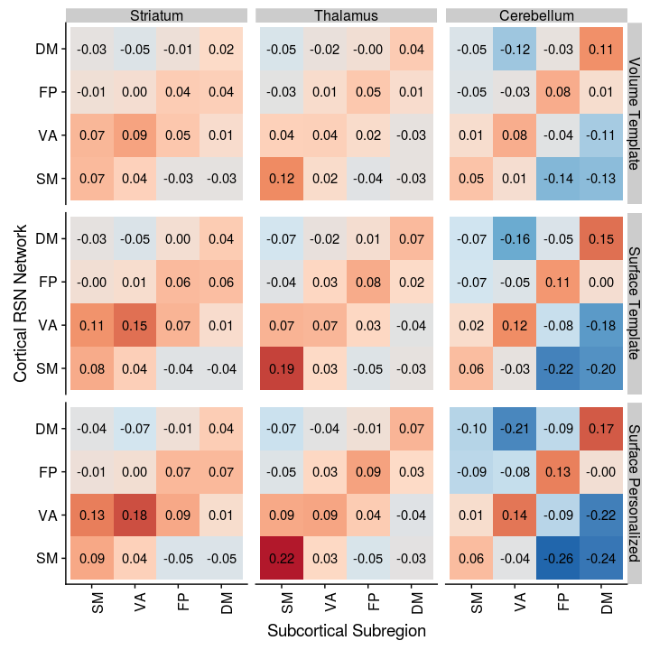
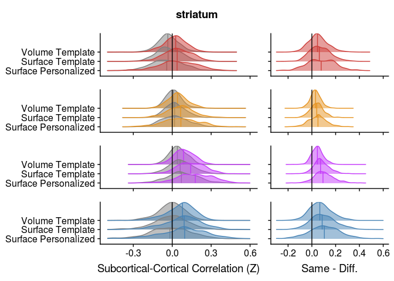
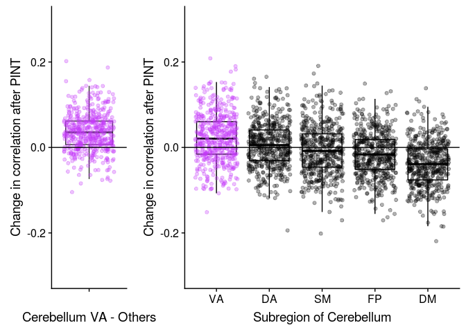
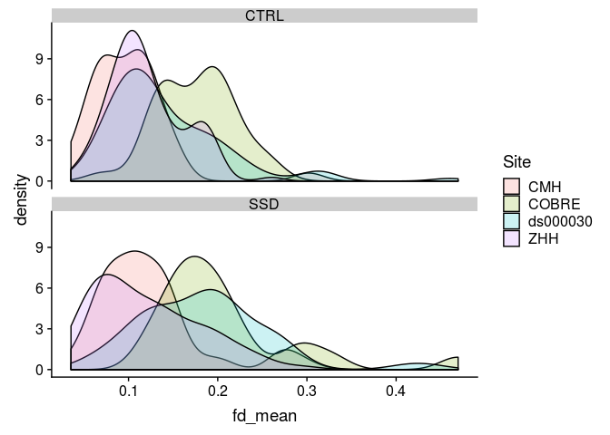
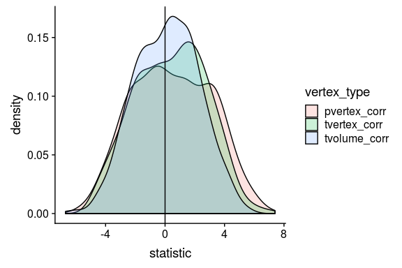
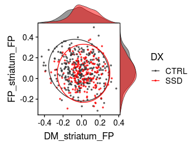

# Sub-cortical Cortical Stats Left and Right

This analysis tries to combine timeseries data from PINT outputs with subcortical timeseries to ask two questions

1. "External" validation of PINT. If PINT is indeed helping us better target meaningful resting state networks than we should see "cleaner" patterns of between the PINT output cortical ROIs and parcels of the subcortical structure that have been associated with these networks in literature.
   + i.e. connectivity of the cortical ROIS with "expected" subcortical parcel should increae and correlation with other parcels should decrease after PINT.
   
2. To interograte SSD related differences in Cortical-Subcortical connectivity - and to see if they persist after PINT.

Some work Ji (in prep) kinda suggests that there might be differences between left and right subcortical structures. AND spliting the left and right seemed to make more sense for whole brain correlations (because our cortical nodes have a hemisphere). So in this analysis have separate left and right ROIs


```r
library(tidyverse)
```

```
## ── Attaching packages ────────────────────────────────────────────────────────────────────────────────────────────── tidyverse 1.2.1 ──
```

```
## ✔ ggplot2 3.1.0       ✔ purrr   0.2.5  
## ✔ tibble  2.0.1       ✔ dplyr   0.8.0.1
## ✔ tidyr   0.8.2       ✔ stringr 1.3.1  
## ✔ readr   1.3.0       ✔ forcats 0.3.0
```

```
## ── Conflicts ───────────────────────────────────────────────────────────────────────────────────────────────── tidyverse_conflicts() ──
## ✖ dplyr::filter() masks stats::filter()
## ✖ dplyr::lag()    masks stats::lag()
```

```r
library(broom)
library(knitr)
library(tableone)
library(cowplot)
```

```
## 
## Attaching package: 'cowplot'
```

```
## The following object is masked from 'package:ggplot2':
## 
##     ggsave
```

```r
library(ggridges)
```

```
## 
## Attaching package: 'ggridges'
```

```
## The following object is masked from 'package:ggplot2':
## 
##     scale_discrete_manual
```


## The paths to data


```r
output_base <- '../data/ciftify_fmriprep/'

Yeo7_2011_80verts <- read_csv("../templates/Yeo7_2011_80verts.csv",
                              col_types = c(
                                hemi = col_character(),
                                tvertex = col_integer(),
                                LRpairs = col_integer(),
                                roiidx = col_integer(),
                                NETWORK = col_integer(),
                                LOBE = col_character(),
                                SHORTNAME = col_character(),
                                x = col_integer(),
                                y = col_integer(),
                                z = col_integer()
                              ))

YeoNet_colours = list("VI" = "#781286",
                      "SM" = "#4682B4",
                      "DA" = "#00760E", 
                      "VA" = "#C43AFA",
                      "DM" = "#CD3E3A", 
                      "FP" = "#E69422")

pheno <- read_csv('../phenotypic/20181118_pheno_qapass.csv') %>%
  drop_na(DX)
```

```
## Parsed with column specification:
## cols(
##   .default = col_character(),
##   fd_mean = col_double(),
##   fd_num = col_double(),
##   fd_perc = col_double(),
##   size_t = col_double(),
##   size_z = col_double(),
##   spacing_tr = col_double(),
##   spacing_z = col_double(),
##   num_rest = col_double(),
##   num_t1w = col_double(),
##   num_scans = col_double(),
##   Age = col_double(),
##   GRID = col_double(),
##   zhh_session_id = col_double(),
##   MRI_Date = col_double(),
##   Edu = col_double(),
##   Age_pt = col_double(),
##   fd_mean_pt = col_double()
## )
```

```
## See spec(...) for full column specifications.
```


# Code for reading in all the timeseries..


A table that describes the current expected subortical files


```r
# a tibble table to specify the subcortical meants files that were generated
YeoNet_subcort_list <- c('VI','SM','DA','VA', 'LI','FP','DM')
```

These functions are for reading timeseries files


```r
#' read a meants file generated by PINT of ciftify_meants
#'
#' @param filepath the full path to the file
#'
#' @return a dataframe where rows are rois and colums are timepoints
read_meants_csv <- function(filepath) {
   meants <-read_csv(filepath, 
                     col_names = FALSE,
                     col_types = c(.default = col_double()))
   return(meants)
}

#' Read the contents of a csv generated by PINT
#'
#' @param outputprefix The prefix to the PINT outputs
#' @param vertex_type "pvertex" or "tvertex"
#' @param projectname the outputdir
#' @param output_dir the basepath of the pint outputs
#'
#' @return a dataframe of the _meants.csv contents
read_pint_meants <- function(outputprefix, vertex_type, projectname, output_dir) {
  expected_filepath <- file.path(output_dir, projectname, "out",'ciftify_PINT', 
                           str_c(outputprefix, '_desc-clean_bold_', 
                                 vertex_type, '_meants.csv'))
  meants = read_meants_csv(expected_filepath)
  return(meants)
}

#' Read the contents of a csv generated by PINT coord volume spheres
#'
#' @param outputprefix The prefix to the PINT outputs
#' @param projectname the outputdir
#' @param output_dir the basepath of the pint outputs
#'
#' @return a dataframe of the _meants.csv contents
read_pint_volsphere_meants <- function(outputprefix, projectname, output_dir) {
  expected_filepath <- file.path(output_dir, projectname, "out",'ciftify_meants', 
                           str_c(outputprefix, '_desc-volcleansm8_atlas-6mmYeo780_timeseries.csv'))
  meants = read_meants_csv(expected_filepath) 
  return(meants)
}

#' Read the contents of a subcortical csv
#' expample file path is sub-CMHHEF011_ses-01_task-rest_acq-CMH_run-01_bold_desc-cleansm0_atlas-7RSN_roi-Lcerebellum_timeseries.csv
#'
#' @param outputprefix the prefix to the pint outputfile
#' @param hemi The hemisphere "L" or "R"
#' @param subregion region "thalamus", "stiatum", "cerebellum"
#' @param output_dir the basepath of the output data
#' @param projectname the project name inside the output dir
#'
#' @return a dataframe of the _meants.csv contents
read_subcortical_hemi_meants <- function(outputprefix, hemi, subregion, projectname, output_dir) {
  expected_filepath <- file.path(output_dir, projectname, "out",'ciftify_meants', 
                           str_c(outputprefix,
                                 '_desc-cleansm0_atlas-7RSN_roi-', 
                                 hemi, subregion, '_timeseries.csv'))
  meants = read_meants_csv(expected_filepath)
  return(meants)
}

#' Contructs the expected output prefix from subid session and func_base
#'
#' @param subid The subject identifier
#' @param sessid The session identifier (or null)
#' @param func_base The functional file prefix
#'
#' @return an output prefix string for the filenames
construct_output_prefix <- function(subid, sessid, func_base) {
  prefix <- if_else(is.na(sessid),
                    file.path(subid, str_c(subid, '_', func_base)),
                    file.path(subid, sessid, 
                      str_c(subid, '_', sessid, '_', func_base)))
  return(prefix)
}

#' get func_base from pint summary filename
#'
#' @param subid The subject identifier
#' @param sessid The session identifier (or null)
#' @param func_base The functional file prefix
#'
#' @return an output prefix string for the filenames
get_func_base_from_pint_summary_filename <- function(filename, subject, session) {
  func_base <- if_else(is.na(session), 
                       filename %>%
                         str_replace(str_c(subject, "_"), '') %>%
                         str_replace('_desc-clean_bold_summary.csv',''),
                       filename %>%
                         str_replace(subject, '') %>%
                         str_replace(session, '') %>% 
                         str_replace('__','') %>%
                         str_replace('_desc-clean_bold_summary.csv',''))
  return(func_base)
}
```


This reads all files and generate PINT to subcortical correlation values for a given subject


```r
the_subcortical_guide <- tribble(
 ~subcort_hemi, ~subcort_ROI, ~subcort_NET,
 "L", "thalamus", c('VI','SM','DA','VA', 'FP','DM'),
 "L", "striatum", c('SM','DA','VA', 'LI','FP','DM'),
 "L", "cerebellum", c('VI','SM','DA','VA', 'LI','FP','DM'),
 "R", "thalamus", c('VI','SM','DA','VA', 'LI','FP','DM'),
 "R", "striatum", c('VI','SM','DA','VA', 'LI','FP','DM'),
 "R", "cerebellum", c('VI','SM','DA','VA', 'LI','FP','DM')) %>%
  unnest()


#' read all fMRI timeseries data for one subject and correlates PINT ROIs with subcortex
#'
#' @param out_prefix the prefix to the pint outputfile
#' @param outputbase the path to the pint output directory
#' @param projectname the path to sub-study project (dataset)
#' @param Yeo7_2011_80verts as data frame describing the PINT ROIs 
#'
#' @return a dataframe (graph style) of PINT ROI to subcortical correlations
subject_subcort_corrs <- function(out_prefix, projectname, 
                                  outputbase, Yeo7_2011_80verts) {
  
  # read the pint meants files
  pvertex_meants <- read_pint_meants(out_prefix, 'pvertex', 
                                     projectname, outputbase)
  tvertex_meants <- read_pint_meants(out_prefix, 'tvertex',
                                     projectname, outputbase)
  volsphere_meants <- read_pint_volsphere_meants(out_prefix,
                                                 projectname, output_base)
  # read the subcortical meants files
  thalamus_L_meants <- read_subcortical_hemi_meants(out_prefix,
                                                    "L","thalamus", 
                                                    projectname, outputbase)
  striatum_L_meants <- read_subcortical_hemi_meants(out_prefix,
                                                    "L","striatum",
                                                    projectname, outputbase)
  cerebellum_L_meants <- read_subcortical_hemi_meants(out_prefix,
                                                      "L", "cerebellum",
                                                      projectname, outputbase)
  thalamus_R_meants <- read_subcortical_hemi_meants(out_prefix,
                                                    "R","thalamus",
                                                    projectname, outputbase)
  striatum_R_meants <- read_subcortical_hemi_meants(out_prefix,
                                                    "R","striatum", 
                                                    projectname, outputbase)
  cerebellum_R_meants <- read_subcortical_hemi_meants(out_prefix,
                                                      "R", "cerebellum", 
                                                      projectname, outputbase)
  
  # prepare to bind
  subcort_meants <- bind_rows(thalamus_L_meants, striatum_L_meants, cerebellum_L_meants,
                              thalamus_R_meants, striatum_R_meants, cerebellum_R_meants)
  
  # correlate the pvertex timeseries with the subcortical data
  pvertex_subcortcorr <- as.data.frame(cor(t(subcort_meants), t(pvertex_meants)))
  names(pvertex_subcortcorr) <- Yeo7_2011_80verts$SHORTNAME
  pvertex_result <- the_subcortical_guide %>% 
    bind_cols(pvertex_subcortcorr) %>%
    gather(PINT_ROI, pvertex_corr, -subcort_ROI, -subcort_NET, -subcort_hemi)
  
  # correlated the tvertex timeseries with the subcortical data
  tvertex_subcortcorr <- as.data.frame(cor(t(subcort_meants), t(tvertex_meants)))
  names(tvertex_subcortcorr) <- Yeo7_2011_80verts$SHORTNAME
  tvertex_result <- the_subcortical_guide %>% 
    bind_cols(tvertex_subcortcorr) %>%
    gather(PINT_ROI, tvertex_corr, -subcort_ROI, -subcort_NET, -subcort_hemi)
  
  # correlated the volume timeseries with the subcortical data
  tvolume_subcortcorr <- as.data.frame(cor(t(subcort_meants), t(volsphere_meants)))
  names(tvolume_subcortcorr) <- Yeo7_2011_80verts$SHORTNAME
  tvolume_result <- the_subcortical_guide %>% 
    bind_cols(tvolume_subcortcorr) %>%
    gather(PINT_ROI, tvolume_corr, -subcort_ROI, -subcort_NET, -subcort_hemi)
  
  # combine pvertex and tvertex and return
  subresult <- pvertex_result %>%
    inner_join(tvertex_result, by = c("PINT_ROI", "subcort_ROI", "subcort_NET", "subcort_hemi")) %>%
    inner_join(tvolume_result, by = c("PINT_ROI", "subcort_ROI", "subcort_NET", "subcort_hemi"))
  return(subresult)
}

#' reads in all the timeseries files for one participant
#' note that Yeo&_2011_80verts and output_base are pulled from the global env
run_read_subject_subcort_corrs <- function(out_prefix, projectname) {
  df <-subject_subcort_corrs(out_prefix, projectname,
                             output_base, Yeo7_2011_80verts)
  return(df)
}

# run_read_subject_subcort_corrs(subcort_outputlist$subid[1])
```


### This reads all the subcortical files it can find

Write a func_base and outputprefix cols into the pheno file for the file reading step


```r
pheno <- pheno %>%
  mutate(func_base = get_func_base_from_pint_summary_filename(filename,subject, session), 
         outputprefix = construct_output_prefix(subject, session, func_base)) 
```

a litle chunck I use to test if test if the reader is working...


```r
run_read_subject_subcort_corrs(pheno$outputprefix[1], pheno$dataset[1])
```


```r
all_subcort_results <- pheno %>%
  select(subject, outputprefix, dataset) %>%
  mutate(subcort_corrs = map2(outputprefix, dataset,
                              ~run_read_subject_subcort_corrs(.x, .y)))
```


```r
save(all_subcort_results, file = "03_subcort_results_cache.Rdata")
```


```r
load("03_subcort_results_cache.Rdata")
```

### merge with the phenotypic data


```r
results_pheno <- all_subcort_results %>%
  inner_join(pheno, by = "subject") %>%
  unnest() %>%
  mutate(YeoNet = str_sub(PINT_ROI, 1,2),
         hemisphere = str_sub(PINT_ROI, 5,5)) %>%
  mutate(conn_type = if_else(YeoNet == subcort_NET, "same_net", "diff_net"),
         YeoNet = factor(YeoNet, levels = c("VI", "SM", "DA", "VA", "FP", "DM")),
         subcort_NET = factor(subcort_NET, levels = c("VI", "SM", "DA", "VA", "FP", "DM", "LI"))) %>%
  select(subject, PINT_ROI, subcort_ROI, subcort_NET,subcort_hemi, 
         pvertex_corr, tvertex_corr, tvolume_corr,
         DX, Sex, fd_mean, Age, Site, Scanner, Age_pt, fd_mean_pt,  
         YeoNet, hemisphere, conn_type) 
```


## make a subject table from resuts pheno


```r
library(tableone)
therealtable1 <- CreateTableOne(
  strata = c("DX", "Site"),
  vars = c("Age", "Sex", "fd_mean", "fd_perc"),
  data = filter(results_pheno, PINT_ROI=="DMP1L",subcort_ROI=="thalamus", subcort_NET=="VA", subcort_hemi == "L")
)
```

```
## Warning in ModuleReturnVarsExist(vars, data): The data frame does not have:
## fd_perc Dropped
```

```r
tabMat <- print(therealtable1, quote = FALSE, noSpaces = TRUE, printToggle = FALSE)
kable(tabMat)
```

                      CTRL:CMH       SSD:CMH        CTRL:COBRE     SSD:COBRE       CTRL:ds000030   SSD:ds000030   CTRL:ZHH       SSD:ZHH        p        test 
--------------------  -------------  -------------  -------------  --------------  --------------  -------------  -------------  -------------  -------  -----
n                     41             67             35             22              105             31             111            82                           
Age (mean (SD))       26.37 (6.67)   32.19 (8.47)   33.17 (9.01)   29.55 (12.14)   30.47 (8.19)    35.23 (9.32)   25.07 (6.55)   25.87 (9.02)   <0.001        
Sex = M (%)           22 (53.7)      40 (59.7)      23 (65.7)      19 (86.4)       55 (52.4)       24 (77.4)      48 (43.2)      63 (76.8)      <0.001        
fd_mean (mean (SD))   0.10 (0.04)    0.12 (0.06)    0.18 (0.04)    0.21 (0.08)     0.14 (0.07)     0.18 (0.07)    0.12 (0.04)    0.12 (0.06)    <0.001        


```r
library(tableone)
therealtable1 <- CreateTableOne(
  vars = c("Age", "Sex", "DX", "fd_mean", "fd_perc"),
  data = filter(results_pheno, PINT_ROI=="DMP1L",subcort_ROI=="thalamus", subcort_NET=="VA", subcort_hemi == "L")
)
```

```
## Warning in ModuleReturnVarsExist(vars, data): The data frame does not have:
## fd_perc Dropped
```

```r
tabMat <- print(therealtable1, quote = FALSE, noSpaces = TRUE, printToggle = FALSE)
kable(tabMat)
```

                      Overall      
--------------------  -------------
n                     494          
Age (mean (SD))       28.84 (8.87) 
Sex = M (%)           294 (59.5)   
DX = SSD (%)          202 (40.9)   
fd_mean (mean (SD))   0.14 (0.06)  


# Is PINT "focusing" cortical subcortical connectivity


```r
table1 <- results_pheno %>%
  mutate(corr_diff = pvertex_corr - tvertex_corr) %>%
  gather(corr_type, rval, pvertex_corr, tvertex_corr, tvolume_corr) %>%
  group_by(corr_type, YeoNet, subcort_ROI, subcort_NET) %>%
  summarise(n = n(),
            Mean = mean(rval),
            SD = sd(rval)) 
  
ggplot(table1, aes(y = YeoNet, x = subcort_NET, fill = Mean)) + 
  geom_tile() +
  scale_fill_distiller(breaks = c(-0.5,0.5), type = "div", palette = 5) +
  theme(axis.text.x = element_text(angle = 90, hjust = 1)) +
  facet_grid(subcort_ROI~corr_type) 
```

<!-- -->
functions to help re-annotated the function axes


```r
#' sets some the main variables to factors to more descriptive labels
add_corrtype_and_subcortROI_columns <- function(data) {
  result <- data %>%
    mutate(corrtype = factor(corr_type, levels = c('tvolume_corr','tvertex_corr','pvertex_corr'),
                           labels = c("Volume Template", "Surface Template", "Surface Personalized")),
         subcortROI = factor(subcort_ROI, 
                             levels = c("striatum", "thalamus", "cerebellum"),
                             labels = c("Striatum", "Thalamus", "Cerebellum"))) 
  return(result)
}

#'drop VI DA and LI network from resutls
drop_VI_DA_LI <- function(data) {
  result <- data %>%
    filter(subcort_NET != "VI",
         subcort_NET != "DA",
         subcort_NET != "LI",
         YeoNet != "VI",
         YeoNet != "DA") 
  return(result)
}
```


```r
table1 %>%
  drop_VI_DA_LI() %>%
  add_corrtype_and_subcortROI_columns() %>%
ggplot(aes(y = YeoNet, x = subcort_NET, fill = Mean)) + 
  geom_tile() +
  geom_text(aes(label = sprintf('%3.2f',Mean))) +
  scale_fill_distiller(breaks = c(-0.5,0.5), type = "div", palette = 5) +
  theme(axis.text.x = element_text(angle = 90, hjust = 1)) +
  facet_grid(corrtype~subcortROI) +
  labs(y = "Cortical RSN Network", x = "Subcortical Subregion")
```

<!-- -->


```r
table1 <- results_pheno %>%
  mutate(corr_diff = pvertex_corr - tvertex_corr) %>%
  gather(corr_type, rval, pvertex_corr, tvertex_corr, tvolume_corr) %>%
  group_by(corr_type, YeoNet, hemisphere, subcort_ROI, subcort_NET, subcort_hemi) %>%
  summarise(n = n(),
            Mean = mean(rval),
            SD = sd(rval)) 

table1 %>%
  drop_VI_DA_LI() %>%
  add_corrtype_and_subcortROI_columns() %>%
ggplot(aes(y = YeoNet, x = subcort_NET, fill = Mean)) + 
  geom_tile() +
  geom_text(aes(label = sprintf('%3.2f',Mean))) +
  scale_fill_distiller(breaks = c(-0.5,0.5), type = "div", palette = 5) +
  theme(axis.text.x = element_text(angle = 90, hjust = 1)) +
  facet_grid(subcortROI*subcort_hemi~corrtype*hemisphere) +
  labs(y = "Cortical RSN Network", x = "Subcortical Subregion")  
```

<!-- -->

We see in the above figure that the Yeo 7 Network connectivity strongly shows the expected pattern in the cerebeullum. 

Lower evidence is seen in the striatum and thalamus, although there is a faint increase across the diagonal for the SM, VA and DM especially


```r
net_means <- results_pheno %>%
  mutate(corr_diff = pvertex_corr - tvertex_corr) %>%
  group_by(YeoNet, subcort_ROI, subcort_NET, conn_type, subject) %>%
  summarise(netmean_pvertex = mean(pvertex_corr),
            netmean_tvertex = mean(tvertex_corr),
            netmean_tvolume = mean(tvolume_corr)) %>%
  ungroup()

net_means_pint_t <- net_means %>%
  group_by(YeoNet, subcort_ROI, subcort_NET) %>%
  do(tidy(t.test(.$netmean_pvertex, .$netmean_tvertex, paired = TRUE))) %>%
  ungroup() %>% mutate(p_FDR = p.adjust(p.value, method = "fdr"))

net_means_pint_t %>%
  ungroup() %>%
  mutate(sig = if_else(p_FDR < 0.05, '*', NA_character_) ) %>%
  drop_VI_DA_LI() %>%
  mutate(subcortROI = factor(subcort_ROI, 
                           levels = c("striatum", "thalamus", "cerebellum"),
                           labels = c("Striatum", "Thalamus", "Cerebellum"))) %>%
ggplot(aes(x = YeoNet, y = subcort_NET, fill = statistic)) + 
  geom_tile(color = "black", na.rm = TRUE) +
  geom_point(aes(shape = sig), na.rm = TRUE) +
  scale_fill_distiller(breaks = c(-10,10), type = "div", palette = 5) +
  theme(axis.text.x = element_text(angle = 90, hjust = 1)) +
  facet_wrap(~subcortROI)
```

<!-- -->
Here we plot the paired t-stat camparing personalized to template, we see a very strong increase in correlation along the diagonal (i.e. with the hypothesized regions) and decreases on the off-dignonal (i.e. decreased connectivity with the other network's parcels)


```r
net_means_vpint_t <- net_means %>%
  group_by(YeoNet, subcort_ROI, subcort_NET) %>%
  do(tidy(t.test(.$netmean_pvertex, .$netmean_tvolume, paired = TRUE))) %>%
  ungroup() %>% mutate(p_FDR = p.adjust(p.value, method = "fdr"))

net_means_vpint_t %>%
  ungroup() %>%
  mutate(sig = if_else(p_FDR < 0.05, '*', NA_character_) ) %>%
  drop_VI_DA_LI() %>%
  mutate(subcortROI = factor(subcort_ROI, 
                           levels = c("striatum", "thalamus", "cerebellum"),
                           labels = c("Striatum", "Thalamus", "Cerebellum"))) %>%
ggplot(aes(x = YeoNet, y = subcort_NET, fill = statistic)) + 
  geom_tile(color = "black", na.rm = TRUE) +
  geom_point(aes(shape = sig), na.rm = TRUE) +
  scale_fill_distiller(breaks = c(-10,10), type = "div", palette = 5) +
  theme(axis.text.x = element_text(angle = 90, hjust = 1)) +
  facet_wrap(~subcortROI)
```

<!-- -->

# trying to calculate an vs off diagonal term

In the above table to calcuculated the "focussing" effect as the change (in on person) between in connectivity with the expected parcel subtracted by the change in connectivity from other regions.

Below we plot these values against zero


```r
net_focus <- net_means %>%
  ungroup() %>%
  mutate(pint_diff = netmean_pvertex - netmean_tvertex,
         vpint_diff = netmean_pvertex - netmean_tvolume,
         surf_diff = netmean_tvertex - netmean_tvolume) %>%
  group_by(subject, subcort_ROI, YeoNet, conn_type) %>%
  summarise(nets_avg_pint_diff = mean(pint_diff),
            nets_avg_vpint_diff = mean(vpint_diff),
            nets_avg_surf_diff = mean(surf_diff)
            ) %>%
  ungroup() %>%
  gather(comparison, nets_avg, nets_avg_pint_diff, nets_avg_vpint_diff, nets_avg_surf_diff) %>%
  spread(conn_type, nets_avg) %>%
  mutate(focus_effect = same_net - diff_net)

net_focus %>%
  ungroup() %>%
  group_by(subcort_ROI, YeoNet, comparison) %>%
  do(tidy(t.test(.$focus_effect))) %>%
  kable()
```


subcort_ROI   YeoNet   comparison              estimate    statistic     p.value   parameter     conf.low   conf.high  method              alternative 
------------  -------  --------------------  ----------  -----------  ----------  ----------  -----------  ----------  ------------------  ------------
cerebellum    VI       nets_avg_pint_diff     0.0273878   11.6511509   0.0000000         493    0.0227692   0.0320063  One Sample t-test   two.sided   
cerebellum    VI       nets_avg_surf_diff     0.0413667   10.7771791   0.0000000         493    0.0338251   0.0489082  One Sample t-test   two.sided   
cerebellum    VI       nets_avg_vpint_diff    0.0687544   14.1217982   0.0000000         493    0.0591885   0.0783204  One Sample t-test   two.sided   
cerebellum    SM       nets_avg_pint_diff     0.0206163    9.5276494   0.0000000         493    0.0163648   0.0248678  One Sample t-test   two.sided   
cerebellum    SM       nets_avg_surf_diff     0.0515472   15.3437016   0.0000000         493    0.0449465   0.0581479  One Sample t-test   two.sided   
cerebellum    SM       nets_avg_vpint_diff    0.0721634   17.3599910   0.0000000         493    0.0639960   0.0803308  One Sample t-test   two.sided   
cerebellum    DA       nets_avg_pint_diff     0.0288066   12.8730578   0.0000000         493    0.0244099   0.0332033  One Sample t-test   two.sided   
cerebellum    DA       nets_avg_surf_diff     0.0419905   13.8211871   0.0000000         493    0.0360212   0.0479597  One Sample t-test   two.sided   
cerebellum    DA       nets_avg_vpint_diff    0.0707971   17.1795840   0.0000000         493    0.0627002   0.0788940  One Sample t-test   two.sided   
cerebellum    VA       nets_avg_pint_diff     0.0335690   16.9441237   0.0000000         493    0.0296764   0.0374615  One Sample t-test   two.sided   
cerebellum    VA       nets_avg_surf_diff     0.0561215   19.6916553   0.0000000         493    0.0505218   0.0617212  One Sample t-test   two.sided   
cerebellum    VA       nets_avg_vpint_diff    0.0896904   22.5843861   0.0000000         493    0.0818876   0.0974933  One Sample t-test   two.sided   
cerebellum    FP       nets_avg_pint_diff     0.0418283   18.7653751   0.0000000         493    0.0374488   0.0462079  One Sample t-test   two.sided   
cerebellum    FP       nets_avg_surf_diff     0.0369187   15.3712512   0.0000000         493    0.0321996   0.0416377  One Sample t-test   two.sided   
cerebellum    FP       nets_avg_vpint_diff    0.0787470   22.6599550   0.0000000         493    0.0719190   0.0855749  One Sample t-test   two.sided   
cerebellum    DM       nets_avg_pint_diff     0.0538687   21.1286004   0.0000000         493    0.0488593   0.0588780  One Sample t-test   two.sided   
cerebellum    DM       nets_avg_surf_diff     0.0608256   17.6744858   0.0000000         493    0.0540639   0.0675873  One Sample t-test   two.sided   
cerebellum    DM       nets_avg_vpint_diff    0.1146943   25.1630262   0.0000000         493    0.1057387   0.1236499  One Sample t-test   two.sided   
striatum      VI       nets_avg_pint_diff     0.0009603    0.4252126   0.6708673         493   -0.0034768   0.0053973  One Sample t-test   two.sided   
striatum      VI       nets_avg_surf_diff     0.0086583    2.4456580   0.0148075         493    0.0017024   0.0156142  One Sample t-test   two.sided   
striatum      VI       nets_avg_vpint_diff    0.0096186    2.1980421   0.0284102         493    0.0010207   0.0182164  One Sample t-test   two.sided   
striatum      SM       nets_avg_pint_diff     0.0094248    5.1120944   0.0000005         493    0.0058024   0.0130471  One Sample t-test   two.sided   
striatum      SM       nets_avg_surf_diff     0.0198960    7.2567562   0.0000000         493    0.0145091   0.0252829  One Sample t-test   two.sided   
striatum      SM       nets_avg_vpint_diff    0.0293208    8.3340089   0.0000000         493    0.0224082   0.0362333  One Sample t-test   two.sided   
striatum      DA       nets_avg_pint_diff     0.0051385    2.8866805   0.0040642         493    0.0016410   0.0086359  One Sample t-test   two.sided   
striatum      DA       nets_avg_surf_diff     0.0079657    3.6964174   0.0002432         493    0.0037316   0.0121998  One Sample t-test   two.sided   
striatum      DA       nets_avg_vpint_diff    0.0131042    4.2468560   0.0000259         493    0.0070416   0.0191668  One Sample t-test   two.sided   
striatum      VA       nets_avg_pint_diff     0.0213014   14.7548408   0.0000000         493    0.0184649   0.0241380  One Sample t-test   two.sided   
striatum      VA       nets_avg_surf_diff     0.0363073   17.2128324   0.0000000         493    0.0321629   0.0404516  One Sample t-test   two.sided   
striatum      VA       nets_avg_vpint_diff    0.0576087   20.8181226   0.0000000         493    0.0521717   0.0630457  One Sample t-test   two.sided   
striatum      FP       nets_avg_pint_diff     0.0091756    4.9854778   0.0000009         493    0.0055595   0.0127917  One Sample t-test   two.sided   
striatum      FP       nets_avg_surf_diff     0.0124343    6.4772151   0.0000000         493    0.0086625   0.0162061  One Sample t-test   two.sided   
striatum      FP       nets_avg_vpint_diff    0.0216099    7.6616834   0.0000000         493    0.0160682   0.0271516  One Sample t-test   two.sided   
striatum      DM       nets_avg_pint_diff     0.0097608    4.7046633   0.0000033         493    0.0056844   0.0138371  One Sample t-test   two.sided   
striatum      DM       nets_avg_surf_diff     0.0175683    7.1459801   0.0000000         493    0.0127379   0.0223987  One Sample t-test   two.sided   
striatum      DM       nets_avg_vpint_diff    0.0273290    8.0553957   0.0000000         493    0.0206632   0.0339948  One Sample t-test   two.sided   
thalamus      VI       nets_avg_pint_diff     0.0065020    3.9449275   0.0000914         493    0.0032637   0.0097404  One Sample t-test   two.sided   
thalamus      VI       nets_avg_surf_diff     0.0171912    7.4219876   0.0000000         493    0.0126403   0.0217422  One Sample t-test   two.sided   
thalamus      VI       nets_avg_vpint_diff    0.0236933    7.9163291   0.0000000         493    0.0178127   0.0295738  One Sample t-test   two.sided   
thalamus      SM       nets_avg_pint_diff     0.0286643   12.8480414   0.0000000         493    0.0242808   0.0330478  One Sample t-test   two.sided   
thalamus      SM       nets_avg_surf_diff     0.0604851   17.6745424   0.0000000         493    0.0537613   0.0672089  One Sample t-test   two.sided   
thalamus      SM       nets_avg_vpint_diff    0.0891494   20.4277496   0.0000000         493    0.0805748   0.0977240  One Sample t-test   two.sided   
thalamus      DA       nets_avg_pint_diff     0.0153820    8.0796878   0.0000000         493    0.0116415   0.0191226  One Sample t-test   two.sided   
thalamus      DA       nets_avg_surf_diff     0.0287988   11.1511639   0.0000000         493    0.0237245   0.0338730  One Sample t-test   two.sided   
thalamus      DA       nets_avg_vpint_diff    0.0441808   12.4209197   0.0000000         493    0.0371921   0.0511695  One Sample t-test   two.sided   
thalamus      VA       nets_avg_pint_diff     0.0114941    7.3490517   0.0000000         493    0.0084212   0.0145671  One Sample t-test   two.sided   
thalamus      VA       nets_avg_surf_diff     0.0152207    6.5814083   0.0000000         493    0.0106768   0.0197647  One Sample t-test   two.sided   
thalamus      VA       nets_avg_vpint_diff    0.0267149    8.6636642   0.0000000         493    0.0206563   0.0327734  One Sample t-test   two.sided   
thalamus      FP       nets_avg_pint_diff     0.0117804    6.4849960   0.0000000         493    0.0082112   0.0153495  One Sample t-test   two.sided   
thalamus      FP       nets_avg_surf_diff     0.0250501   11.1160739   0.0000000         493    0.0206225   0.0294778  One Sample t-test   two.sided   
thalamus      FP       nets_avg_vpint_diff    0.0368305   11.7467339   0.0000000         493    0.0306701   0.0429909  One Sample t-test   two.sided   
thalamus      DM       nets_avg_pint_diff     0.0159123    8.4280996   0.0000000         493    0.0122027   0.0196218  One Sample t-test   two.sided   
thalamus      DM       nets_avg_surf_diff     0.0223752    8.9847760   0.0000000         493    0.0174822   0.0272682  One Sample t-test   two.sided   
thalamus      DM       nets_avg_vpint_diff    0.0382875   11.3671226   0.0000000         493    0.0316696   0.0449054  One Sample t-test   two.sided   

Another (maybe better) way to test this is to show calculate the "focusing" value in individual subjects THAN compute how this number changes with PINT. Let try that..


```r
subject_focus <- net_means %>%
  drop_VI_DA_LI() %>%
  gather(vertex_type, nets_avg, netmean_pvertex, netmean_tvertex, netmean_tvolume) %>%
  ungroup(subcort_NET) %>%
  group_by(subject, subcort_ROI, YeoNet, vertex_type, conn_type) %>%
  summarise(nets_type_avg = mean(nets_avg)) %>%
  spread(conn_type, nets_type_avg) # %>%
  # ungroup() %>%
  # mutate(focus_effect = same_net - diff_net)

subject_focus %>%
  ungroup() %>%
  group_by(subcort_ROI, YeoNet, vertex_type) %>%
  do(tidy(t.test(.$same_net, .$diff_net, paired = TRUE))) %>%
  mutate(cohenD = statistic/sqrt(parameter + 1)) %>%
  kable()
```


subcort_ROI   YeoNet   vertex_type         estimate   statistic   p.value   parameter    conf.low   conf.high  method          alternative       cohenD
------------  -------  ----------------  ----------  ----------  --------  ----------  ----------  ----------  --------------  ------------  ----------
cerebellum    SM       netmean_pvertex    0.2399875    36.40214         0         493   0.2270343   0.2529407  Paired t-test   two.sided      1.6378098
cerebellum    SM       netmean_tvertex    0.2085132    37.32408         0         493   0.1975368   0.2194896  Paired t-test   two.sided      1.6792897
cerebellum    SM       netmean_tvolume    0.1433527    33.69253         0         493   0.1349930   0.1517123  Paired t-test   two.sided      1.5158985
cerebellum    VA       netmean_pvertex    0.2417421    36.41012         0         493   0.2286971   0.2547872  Paired t-test   two.sided      1.6381689
cerebellum    VA       netmean_tvertex    0.1987065    36.88745         0         493   0.1881225   0.2092905  Paired t-test   two.sided      1.6596449
cerebellum    VA       netmean_tvolume    0.1259644    33.69777         0         493   0.1186199   0.1333089  Paired t-test   two.sided      1.5161345
cerebellum    FP       netmean_pvertex    0.1873987    39.54751         0         493   0.1780884   0.1967089  Paired t-test   two.sided      1.7793268
cerebellum    FP       netmean_tvertex    0.1426566    40.55162         0         493   0.1357447   0.1495685  Paired t-test   two.sided      1.8245034
cerebellum    FP       netmean_tvolume    0.1025094    38.15136         0         493   0.0972302   0.1077886  Paired t-test   two.sided      1.7165107
cerebellum    DM       netmean_pvertex    0.2976756    41.71079         0         493   0.2836536   0.3116976  Paired t-test   two.sided      1.8766573
cerebellum    DM       netmean_tvertex    0.2403164    40.83891         0         493   0.2287546   0.2518782  Paired t-test   two.sided      1.8374296
cerebellum    DM       netmean_tvolume    0.1789514    38.54492         0         493   0.1698295   0.1880732  Paired t-test   two.sided      1.7342179
striatum      SM       netmean_pvertex    0.1078351    18.20039         0         493   0.0961939   0.1194762  Paired t-test   two.sided      0.8188742
striatum      SM       netmean_tvertex    0.0961789    19.42907         0         493   0.0864527   0.1059051  Paired t-test   two.sided      0.8741550
striatum      SM       netmean_tvolume    0.0726655    17.82476         0         493   0.0646557   0.0806752  Paired t-test   two.sided      0.8019740
striatum      VA       netmean_pvertex    0.0998734    27.39053         0         493   0.0927092   0.1070375  Paired t-test   two.sided      1.2323580
striatum      VA       netmean_tvertex    0.0801904    27.66423         0         493   0.0744950   0.0858857  Paired t-test   two.sided      1.2446727
striatum      VA       netmean_tvolume    0.0479140    21.52348         0         493   0.0435401   0.0522878  Paired t-test   two.sided      0.9683870
striatum      FP       netmean_pvertex    0.0490836    14.47103         0         493   0.0424193   0.0557479  Paired t-test   two.sided      0.6510823
striatum      FP       netmean_tvertex    0.0416107    16.83998         0         493   0.0367558   0.0464656  Paired t-test   two.sided      0.7576667
striatum      FP       netmean_tvolume    0.0312953    15.44038         0         493   0.0273129   0.0352776  Paired t-test   two.sided      0.6946954
striatum      DM       netmean_pvertex    0.0796495    15.27762         0         493   0.0694061   0.0898929  Paired t-test   two.sided      0.6873725
striatum      DM       netmean_tvertex    0.0706184    18.04677         0         493   0.0629300   0.0783067  Paired t-test   two.sided      0.8119626
striatum      DM       netmean_tvolume    0.0529574    14.68992         0         493   0.0458743   0.0600405  Paired t-test   two.sided      0.6609309
thalamus      SM       netmean_pvertex    0.2356623    32.22862         0         493   0.2212953   0.2500292  Paired t-test   two.sided      1.4500341
thalamus      SM       netmean_tvertex    0.2027217    32.83038         0         493   0.1905895   0.2148539  Paired t-test   two.sided      1.4771087
thalamus      SM       netmean_tvolume    0.1361627    30.43351         0         493   0.1273720   0.1449533  Paired t-test   two.sided      1.3692682
thalamus      VA       netmean_pvertex    0.0606616    15.04190         0         493   0.0527379   0.0685852  Paired t-test   two.sided      0.6767671
thalamus      VA       netmean_tvertex    0.0474123    14.90701         0         493   0.0411632   0.0536614  Paired t-test   two.sided      0.6706980
thalamus      VA       netmean_tvolume    0.0300644    12.35273         0         493   0.0252824   0.0348463  Paired t-test   two.sided      0.5557756
thalamus      FP       netmean_pvertex    0.0902630    21.06920         0         493   0.0818457   0.0986804  Paired t-test   two.sided      0.9479482
thalamus      FP       netmean_tvertex    0.0776315    23.63769         0         493   0.0711787   0.0840843  Paired t-test   two.sided      1.0635102
thalamus      FP       netmean_tvolume    0.0511767    20.48237         0         493   0.0462675   0.0560859  Paired t-test   two.sided      0.9215452
thalamus      DM       netmean_pvertex    0.1106966    21.40334         0         493   0.1005348   0.1208583  Paired t-test   two.sided      0.9629819
thalamus      DM       netmean_tvertex    0.0930425    23.47337         0         493   0.0852546   0.1008305  Paired t-test   two.sided      1.0561169
thalamus      DM       netmean_tvolume    0.0702292    20.12056         0         493   0.0633712   0.0770871  Paired t-test   two.sided      0.9052668

```r
source('../R/R_rainclouds.R')
```

```r
subject_focus %>%
  gather(nettype, corZ, diff_net, same_net) %>%
  filter(subcort_ROI == "cerebellum", YeoNet == "VA") %>%
  ggplot(aes(x = vertex_type, y = corZ, fill = nettype)) +
  geom_flat_violin(aes(fill = nettype), position = position_nudge(x = .1, y = 0),
                   adjust = 1.5, trim = FALSE, alpha = .5, colour = NA) +
  geom_point(aes(x = as.numeric(vertex_type)-.15, y = corZ, colour = nettype),
             position = position_jitter(width = .05), size = 1, shape = 20) +
  geom_boxplot(aes(x = vertex_type, y = corZ, fill = nettype), outlier.shape = NA, alpha = .5, width = .1, colour = "black")+
  geom_hline(yintercept = 0) +
  scale_colour_brewer(palette = "Dark2")+
  scale_fill_brewer(palette = "Dark2")+
  coord_flip() +
  ggtitle(str_c("cerebellum to cortical VA"))
```

```r
# library(ggridges)
samediff_subcort_raincloud <- function(data, this_subcort_ROI, this_YeoNet, no_ticks = TRUE) {
plt <- data %>%
  mutate(corrtype = factor(vertex_type, levels = c('netmean_pvertex', 'netmean_tvertex', 'netmean_tvolume'),
                           labels = c("Surface Personalized", "Surface Template", "Volume Template"))) %>%
  gather(nettype, gvalue, diff_net, same_net) %>%
  filter(subcort_ROI == this_subcort_ROI, YeoNet == this_YeoNet) %>% 
  ungroup() %>%
  ggplot(aes(y = corrtype, x = gvalue, fill = nettype, colour = nettype)) +
  geom_density_ridges(
    #jittered_points = TRUE, position = "raincloud",
    alpha = 0.5, scale = 2,
    quantile_lines = TRUE, quantiles = 2
  ) +
  geom_vline(xintercept = 0) +
  scale_colour_manual(values = c("#808080", YeoNet_colours[[this_YeoNet]])) +
  scale_fill_manual(values = c("#808080", YeoNet_colours[[this_YeoNet]])) +
  scale_x_continuous(limits = c(-0.5, 0.6)) +
  labs(y = NULL,
       x = NULL) +
  theme(legend.position='none')
if (no_ticks==TRUE) {
  plt <- plt + theme(axis.title.x=element_blank(),
        axis.text.x=element_blank())
} else {
  plt <- plt + labs(x = "Subcortical-Cortical Correlation (Z)")
}
return(plt)
  
}

focus_subcort_raincloud <- function(data, this_subcort_ROI, this_YeoNet, no_ticks = TRUE) {
plt <- data %>%
  mutate(corrtype = factor(vertex_type, levels = c('netmean_pvertex', 'netmean_tvertex', 'netmean_tvolume'),
                           labels = c("Surface Personalized", "Surface Template", "Volume Template"))) %>%
  mutate(focus = same_net - diff_net) %>%
  filter(subcort_ROI == this_subcort_ROI, YeoNet == this_YeoNet) %>% 
  ungroup() %>%
  ggplot(aes(y = corrtype, x = focus)) +
  geom_density_ridges(
    # jittered_points = TRUE, position = "raincloud",
    alpha = 0.5, scale = 2,
    quantile_lines = TRUE, quantiles = 2,
    fill = YeoNet_colours[[this_YeoNet]],
    colour = YeoNet_colours[[this_YeoNet]]
  ) +
  geom_vline(xintercept = 0) +
  scale_x_continuous(limits = c(-0.3, 0.6)) +
  labs(y = NULL,
       x = NULL) +
  theme(legend.position='none', 
        axis.title.y=element_blank(),
        axis.text.y=element_blank()) 
if (no_ticks==TRUE) {
  plt <- plt + theme(axis.title.x=element_blank(),
        axis.text.x=element_blank())
} else {
  plt <- plt + labs(x = "Same - Diff.")
}
return(plt)
  
}

samediff_plus_focus_rainclouds <- function(subject_focus, this_subcort, this_YeoNet, no_ticks = TRUE) {
plt <- plot_grid(samediff_subcort_raincloud(subject_focus, this_subcort, this_YeoNet, no_ticks), 
                         focus_subcort_raincloud(subject_focus, this_subcort, this_YeoNet, no_ticks), 
                         rel_widths = c(2,1))
return(plt)
}

subcortical_raincloud <- function(subject_focus, this_subcort) {
DM <- samediff_plus_focus_rainclouds(subject_focus, this_subcort, "DM")
FP <- samediff_plus_focus_rainclouds(subject_focus,this_subcort, "FP")
VA <- samediff_plus_focus_rainclouds(subject_focus,this_subcort, "VA")
SM <- samediff_plus_focus_rainclouds(subject_focus,this_subcort, "SM", no_ticks = FALSE)
title <- ggdraw() + draw_label(this_subcort, fontface='bold')
plt <- plot_grid(title, DM, FP, VA, SM, ncol = 1, rel_heights = c(0.5, 1, 1, 1, 1.5))
return(plt)
}
```


```r
subcortical_raincloud(subject_focus, "striatum")
```

```
## Picking joint bandwidth of 0.0269
```

```
## Picking joint bandwidth of 0.0239
```

```
## Picking joint bandwidth of 0.0236
```

```
## Picking joint bandwidth of 0.0142
```

```
## Picking joint bandwidth of 0.0253
```

```
## Picking joint bandwidth of 0.0157
```

```
## Picking joint bandwidth of 0.0335
```

```
## Warning: Removed 7 rows containing non-finite values (stat_density_ridges).
```

```
## Picking joint bandwidth of 0.0276
```

<!-- -->


```r
subcortical_raincloud(subject_focus, "thalamus")
```

```
## Picking joint bandwidth of 0.0237
## Picking joint bandwidth of 0.0237
```

```
## Picking joint bandwidth of 0.0207
```

```
## Picking joint bandwidth of 0.0185
```

```
## Picking joint bandwidth of 0.0221
```

```
## Picking joint bandwidth of 0.0179
```

```
## Picking joint bandwidth of 0.0308
```

```
## Warning: Removed 2 rows containing non-finite values (stat_density_ridges).
```

```
## Picking joint bandwidth of 0.0332
```

```
## Warning: Removed 15 rows containing non-finite values
## (stat_density_ridges).
```

<!-- -->

```r
subcortical_raincloud(subject_focus, "cerebellum")
```

```
## Picking joint bandwidth of 0.0265
```

```
## Warning: Removed 1 rows containing non-finite values (stat_density_ridges).
```

```
## Picking joint bandwidth of 0.0322
```

```
## Warning: Removed 24 rows containing non-finite values
## (stat_density_ridges).
```

```
## Picking joint bandwidth of 0.0218
```

```
## Picking joint bandwidth of 0.0201
```

```
## Warning: Removed 1 rows containing non-finite values (stat_density_ridges).
```

```
## Picking joint bandwidth of 0.0265
```

```
## Picking joint bandwidth of 0.0299
```

```
## Warning: Removed 5 rows containing non-finite values (stat_density_ridges).
```

```
## Picking joint bandwidth of 0.0312
```

```
## Warning: Removed 11 rows containing non-finite values
## (stat_density_ridges).
```

```
## Picking joint bandwidth of 0.0307
```

```
## Warning: Removed 9 rows containing non-finite values (stat_density_ridges).
```

<!-- -->


```r
subject_focus %>%
  ungroup() %>% 
  mutate(focus_effect = same_net - diff_net) %>%
  select(subject, YeoNet, vertex_type, subcort_ROI, focus_effect) %>%
  spread(vertex_type, focus_effect) %>%
  group_by(subcort_ROI, YeoNet) %>%
  do(tidy(t.test(.$netmean_pvertex, .$netmean_tvertex, paired = TRUE))) %>%
  mutate(cohenD = statistic/sqrt(parameter + 1)) %>%
  kable()
```


subcort_ROI   YeoNet     estimate   statistic    p.value   parameter    conf.low   conf.high  method          alternative       cohenD
------------  -------  ----------  ----------  ---------  ----------  ----------  ----------  --------------  ------------  ----------
cerebellum    SM        0.0314743   12.967374   0.00e+00         493   0.0267054   0.0362432  Paired t-test   two.sided      0.5834297
cerebellum    VA        0.0430356   19.033281   0.00e+00         493   0.0385931   0.0474782  Paired t-test   two.sided      0.8563478
cerebellum    FP        0.0447421   19.674998   0.00e+00         493   0.0402740   0.0492101  Paired t-test   two.sided      0.8852200
cerebellum    DM        0.0573591   21.413430   0.00e+00         493   0.0520962   0.0626221  Paired t-test   two.sided      0.9634358
striatum      SM        0.0116561    5.676108   0.00e+00         493   0.0076214   0.0156909  Paired t-test   two.sided      0.2553802
striatum      VA        0.0196830   14.295389   0.00e+00         493   0.0169778   0.0223883  Paired t-test   two.sided      0.6431799
striatum      FP        0.0074729    4.388307   1.40e-05         493   0.0041271   0.0108188  Paired t-test   two.sided      0.1974393
striatum      DM        0.0090311    4.031005   6.43e-05         493   0.0046292   0.0134331  Paired t-test   two.sided      0.1813635
thalamus      SM        0.0329405   13.022351   0.00e+00         493   0.0279705   0.0379106  Paired t-test   two.sided      0.5859033
thalamus      VA        0.0132493    8.249489   0.00e+00         493   0.0100937   0.0164049  Paired t-test   two.sided      0.3711621
thalamus      FP        0.0126316    6.449024   0.00e+00         493   0.0087832   0.0164799  Paired t-test   two.sided      0.2901553
thalamus      DM        0.0176540    8.300896   0.00e+00         493   0.0134754   0.0218327  Paired t-test   two.sided      0.3734750

```r
subject_focus %>%
  ungroup() %>% 
  mutate(focus_effect = same_net - diff_net) %>%
  select(subject, YeoNet, vertex_type, subcort_ROI, focus_effect) %>%
  spread(vertex_type, focus_effect) %>%
  group_by(subcort_ROI, YeoNet) %>%
  do(tidy(t.test(.$netmean_tvertex, .$netmean_tvolume, paired = TRUE))) %>%
  mutate(cohenD = statistic/sqrt(parameter + 1)) %>%
  kable()
```


subcort_ROI   YeoNet     estimate   statistic   p.value   parameter    conf.low   conf.high  method          alternative       cohenD
------------  -------  ----------  ----------  --------  ----------  ----------  ----------  --------------  ------------  ----------
cerebellum    SM        0.0651605   16.944651         0         493   0.0576050   0.0727161  Paired t-test   two.sided      0.7623759
cerebellum    VA        0.0727421   22.402298         0         493   0.0663623   0.0791219  Paired t-test   two.sided      1.0079270
cerebellum    FP        0.0401472   16.866314         0         493   0.0354704   0.0448240  Paired t-test   two.sided      0.7588513
cerebellum    DM        0.0613651   17.071441         0         493   0.0543024   0.0684277  Paired t-test   two.sided      0.7680805
striatum      SM        0.0235134    7.589271         0         493   0.0174260   0.0296008  Paired t-test   two.sided      0.3414574
striatum      VA        0.0322764   16.340959         0         493   0.0283956   0.0361572  Paired t-test   two.sided      0.7352145
striatum      FP        0.0103154    6.183623         0         493   0.0070378   0.0135930  Paired t-test   two.sided      0.2782144
striatum      DM        0.0176610    6.645135         0         493   0.0124391   0.0228829  Paired t-test   two.sided      0.2989787
thalamus      SM        0.0665590   17.218590         0         493   0.0589641   0.0741540  Paired t-test   two.sided      0.7747010
thalamus      VA        0.0173479    7.473987         0         493   0.0127874   0.0219084  Paired t-test   two.sided      0.3362706
thalamus      FP        0.0264548   11.243619         0         493   0.0218319   0.0310777  Paired t-test   two.sided      0.5058744
thalamus      DM        0.0228134    8.087172         0         493   0.0172708   0.0283559  Paired t-test   two.sided      0.3638591


Recreating the DM plot from the poster to double check


```r
net_means <- results_pheno %>%
  ungroup() %>%
  group_by(YeoNet, subcort_ROI, subcort_NET, subject) %>%
  summarise(netmean_pvertex = mean(pvertex_corr),
            netmean_tvertex = mean(tvertex_corr),
            pint_diff = netmean_pvertex - netmean_tvertex) 

pint_diff_sub_DM <- net_means %>%
  ungroup() %>% 
  filter(YeoNet == "DM", subcort_ROI == "cerebellum") %>%
  select(subject, subcort_NET, pint_diff) %>%
  spread(subcort_NET, pint_diff) %>%
  mutate(overall_pint_diff = DM - (SM + VA + FP + DA)/4,
         x_val = '') %>%
  select(subject, overall_pint_diff, x_val) %>%
  ggplot(aes(y = overall_pint_diff, x = x_val)) +
    geom_boxplot(outlier.shape = NA) +
    geom_jitter(alpha = 0.3, color = YeoNet_colours$DM, fill = "grey") +
    geom_hline(yintercept = 0) + 
    labs(y = "Change in correlation after PINT", x = "Cerebellum DM - Others") +
  scale_y_continuous(limits = c(-0.3, 0.3))

DM_submeans_plot <- net_means %>%
  mutate(is_DM = if_else(subcort_NET == 'DM', TRUE, FALSE),
         SubCortNET = factor(subcort_NET, levels = c("DM", "SM", "DA", "VA", "FP"))) %>%
  filter(subcort_ROI == "cerebellum", !is.na(SubCortNET), YeoNet == "DM") %>%
  ggplot(aes(y = pint_diff, x = SubCortNET, color = is_DM)) +
  geom_boxplot(color = "black", outlier.shape = NA) + 
  geom_jitter(alpha = 0.3) +
  geom_hline(yintercept = 0) +
  scale_color_manual(values = c('black',YeoNet_colours$DM)) +
  labs(y = "Change in correlation after PINT", color = NULL, x = "Subregion of Cerebellum") +
  theme(legend.position = "none") +
  scale_y_continuous(limits = c(-0.3, 0.3))

# DM_brain_pic <- ggdraw + draw_image('DM_striatum_pic.png')

plot_grid(pint_diff_sub_DM, DM_submeans_plot, rel_widths = c(1,2.5))
```

```
## Warning: Removed 1 rows containing non-finite values (stat_boxplot).
```

```
## Warning: Removed 1 rows containing missing values (geom_point).
```

<!-- -->

Also the VA Striatum one


```r
pint_diff_sub_VA <- net_means %>%
  ungroup %>% 
  filter(YeoNet == "VA", subcort_ROI == "cerebellum") %>%
  select(subject, subcort_NET, pint_diff) %>%
  spread(subcort_NET, pint_diff) %>%
  mutate(overall_pint_diff = VA - (SM + DM + FP + DA)/4,
         x_val = '') %>%
  select(subject, overall_pint_diff, x_val) %>%
  ggplot(aes(y = overall_pint_diff, x = x_val)) +
    geom_boxplot(outlier.shape = NA) +
    geom_jitter(alpha = 0.3, color = YeoNet_colours$VA, fill = "grey") +
    geom_hline(yintercept = 0) + 
    labs(y = "Change in correlation after PINT", x = "Cerebellum VA - Others") +
  scale_y_continuous(limits = c(-0.3, 0.3))

VA_submeans_plot <- net_means %>%
  mutate(is_VA = if_else(subcort_NET == 'VA', TRUE, FALSE),
          SubCort_ROI = factor(subcort_NET, 
                               levels = c("VA", "DA", 'SM', 'FP', "DM"))) %>%
  filter(YeoNet == "VA", 
         subcort_ROI == "cerebellum",
         subcort_NET %in% c('SM', "VA", "DM", 'FP', "DA")) %>%
  ggplot(aes(y = pint_diff, x = SubCort_ROI, color = is_VA)) +
  geom_boxplot(color = "black", outlier.shape = NA) + 
  geom_jitter(alpha = 0.3) +
  geom_hline(yintercept = 0) +
  scale_color_manual(values = c('black', YeoNet_colours$VA)) +
  labs(y = "Change in correlation after PINT", color = NULL, x = "Subregion of Cerebellum") +
  theme(legend.position = "none") +
  scale_y_continuous(limits = c(-0.3, 0.3))

# DM_brain_pic <- ggdraw + draw_image('DM_striatum_pic.png')

plot_grid(pint_diff_sub_VA, VA_submeans_plot, rel_widths = c(1,2.5))
```

<!-- -->


```r
pint_diff_sub_FP <- net_means %>%
  ungroup %>% 
  filter(YeoNet == "FP", subcort_ROI == "striatum") %>%
  select(subject, subcort_NET, pint_diff) %>%
  spread(subcort_NET, pint_diff) %>%
  mutate(overall_pint_diff = FP - (SM + DM + VA)/3,
         x_val = '') %>%
  select(subject, overall_pint_diff, x_val) %>%
  ggplot(aes(y = overall_pint_diff, x = x_val)) +
    geom_boxplot(outlier.shape = NA) +
    geom_jitter(alpha = 0.3, color = YeoNet_colours$FP, fill = "grey") +
    geom_hline(yintercept = 0) + 
    labs(y = "Change in correlation after PINT", x = "Striatum VA - Others") +
  scale_y_continuous(limits = c(-0.3, 0.3))

FP_submeans_plot <- net_means %>%
  mutate(is_FP = if_else(subcort_NET == 'FP', TRUE, FALSE),
          SubCort_ROI = factor(subcort_NET, 
                               levels = c('FP', "DM", 'SM', "VA"))) %>%
  filter(YeoNet == "FP", 
         subcort_ROI == "striatum",
         subcort_NET %in% c('SM', "VA", "DM", 'FP')) %>%
  ggplot(aes(y = pint_diff, x = SubCort_ROI, color = is_FP)) +
  geom_boxplot(color = "black", outlier.shape = NA) + 
  geom_jitter(alpha = 0.3) +
  geom_hline(yintercept = 0) +
  scale_color_manual(values = c('black', YeoNet_colours$FP)) +
  labs(y = "Change in correlation after PINT", color = NULL, x = "Subregion of Striatum") +
  theme(legend.position = "none") +
  scale_y_continuous(limits = c(-0.3, 0.3))

# DM_brain_pic <- ggdraw + draw_image('DM_striatum_pic.png')

plot_grid(pint_diff_sub_FP, FP_submeans_plot, rel_widths = c(1,2.5))
```

<!-- -->


```r
pint_diff_sub_VA <- net_means %>%
  ungroup %>% 
  filter(YeoNet == "VA", subcort_ROI == "striatum") %>%
  select(subject, subcort_NET, pint_diff) %>%
  spread(subcort_NET, pint_diff) %>%
  mutate(overall_pint_diff = VA - (SM + DM + FP)/3,
         x_val = '') %>%
  select(subject, overall_pint_diff, x_val) %>%
  ggplot(aes(y = overall_pint_diff, x = x_val)) +
    geom_boxplot(outlier.shape = NA) +
    geom_jitter(alpha = 0.3, color = YeoNet_colours$VA, fill = "grey") +
    geom_hline(yintercept = 0) + 
    labs(y = "Change in correlation after PINT", x = "Striatum VA - Others") +
  scale_y_continuous(limits = c(-0.3, 0.3))

VA_submeans_plot <- net_means %>%
  mutate(is_VA = if_else(subcort_NET == 'VA', TRUE, FALSE),
          SubCort_ROI = factor(subcort_NET, 
                               levels = c("VA", 'SM', 'FP', "DM"))) %>%
  filter(YeoNet == "VA", 
         subcort_ROI == "striatum",
         subcort_NET %in% c('SM', "VA", "DM", 'FP')) %>%
  ggplot(aes(y = pint_diff, x = SubCort_ROI, color = is_VA)) +
  geom_boxplot(color = "black", outlier.shape = NA) + 
  geom_jitter(alpha = 0.3) +
  geom_hline(yintercept = 0) +
  scale_color_manual(values = c('black', YeoNet_colours$VA)) +
  labs(y = "Change in correlation after PINT", color = NULL, x = "Subregion of Striatum") +
  theme(legend.position = "none") +
  scale_y_continuous(limits = c(-0.3, 0.3))

# DM_brain_pic <- ggdraw + draw_image('DM_striatum_pic.png')

plot_grid(pint_diff_sub_VA, VA_submeans_plot, rel_widths = c(1,2.5))
```

<!-- -->

```r
pint_diff_sub_SM <- net_means %>%
  ungroup %>% 
  filter(YeoNet == "SM", subcort_ROI == "thalamus") %>%
  select(subject, subcort_NET, pint_diff) %>%
  spread(subcort_NET, pint_diff) %>%
  mutate(overall_pint_diff = SM - (VA + DM + FP + DA)/4,
         x_val = '') %>%
  select(subject, overall_pint_diff, x_val) %>%
  ggplot(aes(y = overall_pint_diff, x = x_val)) +
    geom_boxplot(outlier.shape = NA) +
    geom_jitter(alpha = 0.3, color = YeoNet_colours$SM, fill = "grey") +
    geom_hline(yintercept = 0) + 
    labs(y = "Change in correlation after PINT", x = "Striatum VA - Others") +
  scale_y_continuous(limits = c(-0.3, 0.3))

SM_submeans_plot <- net_means %>%
  mutate(is_SM = if_else(subcort_NET == 'SM', TRUE, FALSE),
          SubCort_ROI = factor(subcort_NET, 
                               levels = c("SM", "VA", "DA",'FP', "DM"))) %>%
  filter(YeoNet == "SM", 
         subcort_ROI == "thalamus",
         subcort_NET %in% c('SM', "VA", "DA","DM", 'FP')) %>%
  ggplot(aes(y = pint_diff, x = SubCort_ROI, color = is_SM)) +
  geom_boxplot(color = "black", outlier.shape = NA) + 
  geom_jitter(alpha = 0.3) +
  geom_hline(yintercept = 0) +
  scale_color_manual(values = c('black', YeoNet_colours$SM)) +
  labs(y = "Change in correlation after PINT", color = NULL, x = "Subregion of Thalamus") +
  theme(legend.position = "none") +
  scale_y_continuous(limits = c(-0.3, 0.3))

# DM_brain_pic <- ggdraw + draw_image('DM_striatum_pic.png')

plot_grid(pint_diff_sub_SM, SM_submeans_plot, rel_widths = c(1,2.5))
```

```
## Warning: Removed 1 rows containing non-finite values (stat_boxplot).
```

```
## Warning: Removed 1 rows containing missing values (geom_point).
```

<!-- -->


## Plotting the PINT effect separately in SSD and controls

Note that the circle denotes an uncorrected p<0.05


```r
net_means_byDX <- results_pheno %>%
  mutate(corr_diff = pvertex_corr - tvolume_corr) %>%
  group_by(YeoNet, subcort_ROI, subcort_NET, subject, DX) %>%
  summarise(netmean_pvertex = mean(pvertex_corr),
            netmean_tvertex = mean(tvertex_corr)) %>%
  ungroup() %>%
  group_by(YeoNet, subcort_ROI, subcort_NET, DX) %>%
  do(tidy(t.test(.$netmean_pvertex, .$netmean_tvertex, paired = TRUE)))

net_means_byDX %>%
  ungroup() %>%
  mutate(sig = if_else(p.value < 0.005, '*', NA_character_) ) %>%
ggplot(aes(x = YeoNet, y = subcort_NET, fill = statistic)) + 
  geom_tile(color = "black", na.rm = TRUE) +
  geom_point(aes(shape = sig), na.rm = TRUE) +
  scale_fill_gradient2() +
  theme(axis.text.x = element_text(angle = 90, hjust = 1)) +
  facet_grid(subcort_ROI ~ DX)
```

<!-- -->

```r
net_means_byDX <- results_pheno %>%
  mutate(corr_diff = pvertex_corr - tvolume_corr) %>%
  group_by(YeoNet, subcort_ROI, subcort_NET, subject, DX) %>%
  summarise(netmean_pvertex = mean(pvertex_corr),
            netmean_tvertex = mean(tvertex_corr)) %>%
  ungroup() %>%
  group_by(YeoNet, subcort_ROI, subcort_NET, DX) %>%
  do(tidy(t.test(.$netmean_pvertex, .$netmean_tvertex, paired = TRUE)))

net_means_byDX %>%
  ungroup() %>%
  mutate(sig = if_else(p.value < 0.005, '*', NA_character_) ) %>%
  filter(subcort_NET != "VI",
       subcort_NET != "DA",
       subcort_NET != "LI",
       YeoNet != "VI",
       YeoNet != "DA") %>%
  mutate(subcortROI = factor(subcort_ROI, 
                           levels = c("striatum", "thalamus", "cerebellum"),
                           labels = c("Striatum", "Thalamus", "Cerebellum"))) %>%
ggplot(aes(x = YeoNet, y = subcort_NET, fill = statistic)) + 
  geom_tile(color = "black", na.rm = TRUE) +
  geom_point(aes(shape = sig), na.rm = TRUE) +
  scale_fill_gradient2() +
  theme(axis.text.x = element_text(angle = 90, hjust = 1)) +
  facet_grid(DX ~ subcortROI)
```

<!-- -->


## running model again with sex interaction


```r
library(knitr)

DX_lm_model <- results_pheno %>%
  gather(vertex_type, corZ, pvertex_corr, tvertex_corr, tvolume_corr) %>%
  filter(Age > 17, Age < 51) %>%
  filter(subcort_ROI %in% c("cerebellum", "striatum")) %>%
  group_by(vertex_type, subcort_ROI, subcort_NET, PINT_ROI) %>%
  do(tidy(lm(corZ ~ DX + Sex + fd_mean_pt + Age_pt + Scanner,.))) %>%
  select(vertex_type, subcort_ROI, subcort_NET, PINT_ROI, term, statistic, p.value) %>%
  ungroup() %>%
  group_by(term) %>%
  mutate(p_FDR = p.adjust(p.value, method = "fdr")) %>%
  arrange(p.value)

DX_lm_model %>% 
  filter(term %in% c("DXSSD")) %>%
  filter(p_FDR < 0.05) %>%
  filter(vertex_type == "pvertex_corr") %>%
  arrange(subcort_NET) %>%
  kable()
```


vertex_type    subcort_ROI   subcort_NET   PINT_ROI   term     statistic     p.value       p_FDR
-------------  ------------  ------------  ---------  ------  ----------  ----------  ----------
pvertex_corr   striatum      VI            VI04R      DXSSD     3.157697   0.0016946   0.0114816
pvertex_corr   cerebellum    VI            SMT1R      DXSSD     3.109524   0.0019309   0.0126732
pvertex_corr   striatum      VI            FPF2R      DXSSD    -3.097343   0.0020718   0.0133614
pvertex_corr   cerebellum    VI            SMT1L      DXSSD     2.926370   0.0035128   0.0192967
pvertex_corr   cerebellum    VI            VI04L      DXSSD     2.889272   0.0039509   0.0208401
pvertex_corr   cerebellum    VI            SMI1R      DXSSD     2.860600   0.0043230   0.0221084
pvertex_corr   striatum      VI            SMT1R      DXSSD     2.786414   0.0055493   0.0263359
pvertex_corr   cerebellum    VI            VAP1R      DXSSD    -2.629359   0.0086957   0.0374290
pvertex_corr   cerebellum    VI            FPF5L      DXSSD     2.627730   0.0087371   0.0374925
pvertex_corr   striatum      VI            VI03R      DXSSD     2.613151   0.0092644   0.0389520
pvertex_corr   striatum      VI            VI02R      DXSSD     2.598414   0.0096655   0.0397018
pvertex_corr   cerebellum    VI            DAF2L      DXSSD     2.545261   0.0110799   0.0434913
pvertex_corr   cerebellum    SM            VI04L      DXSSD     7.187960   0.0000000   0.0000000
pvertex_corr   cerebellum    SM            VI05L      DXSSD     6.805258   0.0000000   0.0000000
pvertex_corr   cerebellum    SM            VI05R      DXSSD     6.275097   0.0000000   0.0000002
pvertex_corr   cerebellum    SM            VI04R      DXSSD     6.003615   0.0000000   0.0000007
pvertex_corr   cerebellum    SM            VI01L      DXSSD     5.797315   0.0000000   0.0000015
pvertex_corr   striatum      SM            VAF2L      DXSSD    -5.759493   0.0000000   0.0000017
pvertex_corr   striatum      SM            VAF1R      DXSSD    -5.623368   0.0000000   0.0000031
pvertex_corr   cerebellum    SM            SMT1L      DXSSD     5.421748   0.0000001   0.0000077
pvertex_corr   cerebellum    SM            FPF1L      DXSSD    -5.235096   0.0000002   0.0000163
pvertex_corr   striatum      SM            VAF4R      DXSSD    -4.605292   0.0000047   0.0001695
pvertex_corr   cerebellum    SM            VI01R      DXSSD     4.501688   0.0000076   0.0002320
pvertex_corr   cerebellum    SM            FPF2R      DXSSD    -4.461438   0.0000091   0.0002639
pvertex_corr   cerebellum    SM            VI02L      DXSSD     4.388759   0.0000127   0.0003200
pvertex_corr   striatum      SM            VAF2R      DXSSD    -4.309663   0.0000181   0.0004192
pvertex_corr   striatum      SM            VAP1R      DXSSD    -4.092970   0.0000463   0.0008058
pvertex_corr   cerebellum    SM            FPF3R      DXSSD    -4.014963   0.0000642   0.0010086
pvertex_corr   cerebellum    SM            VI03L      DXSSD     3.954523   0.0000825   0.0012137
pvertex_corr   cerebellum    SM            FPP2L      DXSSD    -3.935635   0.0000892   0.0012639
pvertex_corr   cerebellum    SM            VI03R      DXSSD     3.892613   0.0001062   0.0014067
pvertex_corr   cerebellum    SM            VI02R      DXSSD     3.863132   0.0001197   0.0015468
pvertex_corr   striatum      SM            VI05L      DXSSD     3.854867   0.0001237   0.0015809
pvertex_corr   cerebellum    SM            FPF2L      DXSSD    -3.726122   0.0002062   0.0023481
pvertex_corr   striatum      SM            VAI1R      DXSSD    -3.565456   0.0003817   0.0037836
pvertex_corr   cerebellum    SM            VAF5R      DXSSD    -3.532253   0.0004323   0.0041736
pvertex_corr   striatum      SM            DMT2R      DXSSD     3.493985   0.0004983   0.0046636
pvertex_corr   striatum      SM            DMP1L      DXSSD     3.402502   0.0006962   0.0057764
pvertex_corr   striatum      SM            VAF1L      DXSSD    -3.386397   0.0007378   0.0060612
pvertex_corr   cerebellum    SM            FPF3L      DXSSD    -3.308820   0.0009728   0.0074947
pvertex_corr   striatum      SM            DMP2L      DXSSD     3.301543   0.0009981   0.0075704
pvertex_corr   striatum      SM            VI04R      DXSSD     3.290652   0.0010371   0.0077609
pvertex_corr   striatum      SM            VI05R      DXSSD     3.289076   0.0010429   0.0077867
pvertex_corr   striatum      SM            VAF4L      DXSSD    -3.281792   0.0010699   0.0079353
pvertex_corr   striatum      SM            DMP1R      DXSSD     3.254219   0.0011780   0.0086422
pvertex_corr   striatum      SM            DMP2R      DXSSD     3.232181   0.0012716   0.0092369
pvertex_corr   cerebellum    SM            FPF4R      DXSSD    -3.229426   0.0012838   0.0092369
pvertex_corr   striatum      SM            DMT1R      DXSSD     3.141078   0.0017364   0.0116921
pvertex_corr   cerebellum    SM            FPF1R      DXSSD    -3.139496   0.0017457   0.0117313
pvertex_corr   cerebellum    SM            DAP2L      DXSSD     3.124622   0.0018355   0.0122180
pvertex_corr   striatum      SM            DMT2L      DXSSD     3.077418   0.0021491   0.0136246
pvertex_corr   striatum      SM            DAT1R      DXSSD     3.009152   0.0026903   0.0160560
pvertex_corr   cerebellum    SM            SMI1R      DXSSD     2.934819   0.0034194   0.0190234
pvertex_corr   cerebellum    SM            FPT1R      DXSSD    -2.917757   0.0036104   0.0194276
pvertex_corr   striatum      SM            DMT1L      DXSSD     2.879076   0.0040798   0.0212857
pvertex_corr   cerebellum    SM            SMF2R      DXSSD     2.861399   0.0043122   0.0220869
pvertex_corr   cerebellum    SM            SMF1L      DXSSD     2.858372   0.0043532   0.0221953
pvertex_corr   striatum      SM            FPF2R      DXSSD    -2.840222   0.0046065   0.0230666
pvertex_corr   striatum      SM            VI03R      DXSSD     2.780035   0.0055449   0.0263359
pvertex_corr   cerebellum    SM            FPT1L      DXSSD    -2.761070   0.0058745   0.0276836
pvertex_corr   striatum      SM            VI04L      DXSSD     2.752384   0.0060313   0.0282272
pvertex_corr   cerebellum    SM            SMI1L      DXSSD     2.743037   0.0062043   0.0289534
pvertex_corr   cerebellum    SM            FPF4L      DXSSD    -2.616204   0.0090353   0.0381871
pvertex_corr   cerebellum    SM            SMT1R      DXSSD     2.598979   0.0094980   0.0395221
pvertex_corr   striatum      SM            DMF3R      DXSSD     2.583010   0.0099458   0.0404912
pvertex_corr   cerebellum    SM            DMP2R      DXSSD    -2.582020   0.0099742   0.0405077
pvertex_corr   cerebellum    SM            DMF1L      DXSSD    -2.536536   0.0113579   0.0443234
pvertex_corr   striatum      SM            VAF3L      DXSSD    -2.520762   0.0118762   0.0457616
pvertex_corr   cerebellum    SM            VAF5L      DXSSD    -2.518461   0.0119536   0.0459542
pvertex_corr   striatum      SM            VI01R      DXSSD     2.516216   0.0120294   0.0461403
pvertex_corr   striatum      SM            VAI1L      DXSSD    -2.488384   0.0130064   0.0492133
pvertex_corr   striatum      SM            SMF1R      DXSSD    -2.484123   0.0131620   0.0494237
pvertex_corr   cerebellum    DA            SMI1L      DXSSD     6.147336   0.0000000   0.0000003
pvertex_corr   cerebellum    DA            SMI1R      DXSSD     5.400883   0.0000001   0.0000077
pvertex_corr   cerebellum    DA            SMF1R      DXSSD     4.964893   0.0000008   0.0000491
pvertex_corr   cerebellum    DA            SMF2R      DXSSD     4.938365   0.0000009   0.0000532
pvertex_corr   cerebellum    DA            SMT1L      DXSSD     4.869515   0.0000013   0.0000669
pvertex_corr   cerebellum    DA            SMF3L      DXSSD     4.341097   0.0000157   0.0003775
pvertex_corr   cerebellum    DA            SMT1R      DXSSD     4.282712   0.0000204   0.0004505
pvertex_corr   cerebellum    DA            VI04L      DXSSD     4.232786   0.0000254   0.0005361
pvertex_corr   striatum      DA            VAP1R      DXSSD    -4.211693   0.0000278   0.0005732
pvertex_corr   cerebellum    DA            SMF2L      DXSSD     3.962354   0.0000799   0.0011877
pvertex_corr   cerebellum    DA            SMF1L      DXSSD     3.923578   0.0000937   0.0013004
pvertex_corr   striatum      DA            DMT2R      DXSSD     3.694990   0.0002327   0.0025953
pvertex_corr   cerebellum    DA            SMF3R      DXSSD     3.592276   0.0003450   0.0034780
pvertex_corr   striatum      DA            VAF1R      DXSSD    -3.553224   0.0003996   0.0039251
pvertex_corr   striatum      DA            DMT2L      DXSSD     3.329291   0.0009048   0.0070704
pvertex_corr   cerebellum    DA            VI04R      DXSSD     3.313465   0.0009570   0.0074090
pvertex_corr   striatum      DA            SMT1R      DXSSD     3.062664   0.0022568   0.0141209
pvertex_corr   cerebellum    DA            DAP2R      DXSSD     2.962010   0.0031341   0.0178482
pvertex_corr   cerebellum    DA            DAF2R      DXSSD     2.925819   0.0035190   0.0192967
pvertex_corr   striatum      DA            VAF2L      DXSSD    -2.888522   0.0039603   0.0208567
pvertex_corr   cerebellum    DA            DAP2L      DXSSD     2.875590   0.0041247   0.0214535
pvertex_corr   cerebellum    DA            DAF1R      DXSSD     2.867158   0.0042352   0.0217921
pvertex_corr   cerebellum    DA            VI01L      DXSSD     2.854773   0.0044024   0.0223666
pvertex_corr   cerebellum    DA            DMP2R      DXSSD    -2.850317   0.0044640   0.0224873
pvertex_corr   cerebellum    DA            VI01R      DXSSD     2.721979   0.0066104   0.0302603
pvertex_corr   cerebellum    DA            VI02L      DXSSD     2.702151   0.0070146   0.0318070
pvertex_corr   cerebellum    DA            VI05L      DXSSD     2.679083   0.0075126   0.0335225
pvertex_corr   cerebellum    DA            DMF1L      DXSSD    -2.653865   0.0080932   0.0353618
pvertex_corr   cerebellum    DA            DAP3L      DXSSD     2.643983   0.0083315   0.0362615
pvertex_corr   striatum      DA            VI03R      DXSSD     2.631681   0.0086369   0.0373008
pvertex_corr   cerebellum    DA            VI02R      DXSSD     2.629497   0.0086922   0.0374290
pvertex_corr   striatum      DA            VI05L      DXSSD     2.628749   0.0087112   0.0374290
pvertex_corr   striatum      DA            VAF5L      DXSSD    -2.626337   0.0087727   0.0375716
pvertex_corr   striatum      DA            DAF2L      DXSSD     2.625416   0.0087963   0.0375716
pvertex_corr   striatum      DA            FPP1R      DXSSD    -2.619844   0.0089402   0.0378876
pvertex_corr   striatum      DA            DMP2L      DXSSD     2.555671   0.0107562   0.0427197
pvertex_corr   striatum      DA            VI04R      DXSSD     2.505599   0.0123942   0.0472694
pvertex_corr   striatum      DA            DMP1R      DXSSD     2.493008   0.0128394   0.0488012
pvertex_corr   cerebellum    VA            SMT1L      DXSSD     5.876066   0.0000000   0.0000011
pvertex_corr   cerebellum    VA            SMI1R      DXSSD     5.399033   0.0000001   0.0000077
pvertex_corr   cerebellum    VA            VI04L      DXSSD     5.305639   0.0000001   0.0000115
pvertex_corr   cerebellum    VA            DMP2R      DXSSD    -5.051106   0.0000005   0.0000372
pvertex_corr   cerebellum    VA            SMT1R      DXSSD     4.975025   0.0000008   0.0000490
pvertex_corr   cerebellum    VA            VI04R      DXSSD     4.815692   0.0000017   0.0000821
pvertex_corr   striatum      VA            VI05L      DXSSD     4.718510   0.0000027   0.0001196
pvertex_corr   cerebellum    VA            VI05L      DXSSD     4.652739   0.0000037   0.0001465
pvertex_corr   cerebellum    VA            SMI1L      DXSSD     4.593249   0.0000050   0.0001737
pvertex_corr   striatum      VA            VAF1R      DXSSD    -4.584567   0.0000052   0.0001791
pvertex_corr   cerebellum    VA            VI05R      DXSSD     4.554966   0.0000059   0.0001975
pvertex_corr   striatum      VA            VAF2L      DXSSD    -4.397814   0.0000122   0.0003140
pvertex_corr   striatum      VA            DMT1R      DXSSD     4.326863   0.0000168   0.0003938
pvertex_corr   cerebellum    VA            SMF2R      DXSSD     4.223455   0.0000264   0.0005514
pvertex_corr   striatum      VA            VAP1R      DXSSD    -4.192092   0.0000303   0.0006013
pvertex_corr   striatum      VA            VI05R      DXSSD     4.186899   0.0000310   0.0006013
pvertex_corr   striatum      VA            DMT2R      DXSSD     4.163624   0.0000342   0.0006498
pvertex_corr   cerebellum    VA            VI01L      DXSSD     4.142581   0.0000375   0.0006955
pvertex_corr   striatum      VA            DMP2R      DXSSD     4.113870   0.0000424   0.0007643
pvertex_corr   cerebellum    VA            SMF1R      DXSSD     4.100820   0.0000448   0.0007834
pvertex_corr   striatum      VA            VAF4R      DXSSD    -4.005047   0.0000669   0.0010396
pvertex_corr   cerebellum    VA            VI03L      DXSSD     3.972599   0.0000766   0.0011674
pvertex_corr   cerebellum    VA            VI03R      DXSSD     3.865226   0.0001187   0.0015397
pvertex_corr   cerebellum    VA            SMF3L      DXSSD     3.859602   0.0001214   0.0015630
pvertex_corr   cerebellum    VA            DAF1R      DXSSD     3.831969   0.0001357   0.0017071
pvertex_corr   cerebellum    VA            DMP2L      DXSSD    -3.813334   0.0001461   0.0018166
pvertex_corr   striatum      VA            VI04R      DXSSD     3.812674   0.0001465   0.0018166
pvertex_corr   cerebellum    VA            DMF1L      DXSSD    -3.735016   0.0001991   0.0023419
pvertex_corr   cerebellum    VA            SMF2L      DXSSD     3.732372   0.0002012   0.0023419
pvertex_corr   striatum      VA            VAF4L      DXSSD    -3.731129   0.0002022   0.0023419
pvertex_corr   striatum      VA            DMF3R      DXSSD     3.727676   0.0002049   0.0023419
pvertex_corr   striatum      VA            DMP1R      DXSSD     3.694701   0.0002330   0.0025953
pvertex_corr   cerebellum    VA            DAF2L      DXSSD     3.600062   0.0003349   0.0033999
pvertex_corr   cerebellum    VA            VAF2R      DXSSD     3.566062   0.0003808   0.0037836
pvertex_corr   cerebellum    VA            SMF3R      DXSSD     3.482679   0.0005195   0.0047694
pvertex_corr   striatum      VA            DMP1L      DXSSD     3.463059   0.0005584   0.0049650
pvertex_corr   cerebellum    VA            VAI1L      DXSSD     3.452616   0.0005802   0.0050844
pvertex_corr   cerebellum    VA            VAT1R      DXSSD     3.424646   0.0006425   0.0054103
pvertex_corr   cerebellum    VA            VI02L      DXSSD     3.401801   0.0006979   0.0057764
pvertex_corr   cerebellum    VA            VAF3L      DXSSD     3.366395   0.0007927   0.0063875
pvertex_corr   cerebellum    VA            SMF1L      DXSSD     3.356410   0.0008216   0.0065414
pvertex_corr   striatum      VA            VI03R      DXSSD     3.353285   0.0008308   0.0065992
pvertex_corr   striatum      VA            DMT1L      DXSSD     3.347983   0.0008467   0.0066622
pvertex_corr   cerebellum    VA            VI02R      DXSSD     3.298256   0.0010097   0.0076070
pvertex_corr   cerebellum    VA            DAF1L      DXSSD     3.297122   0.0010138   0.0076203
pvertex_corr   striatum      VA            DMP2L      DXSSD     3.283587   0.0010631   0.0079030
pvertex_corr   striatum      VA            VAF2R      DXSSD    -3.229894   0.0012817   0.0092369
pvertex_corr   striatum      VA            VI02R      DXSSD     3.228734   0.0012869   0.0092392
pvertex_corr   cerebellum    VA            DAP2L      DXSSD     3.225414   0.0013017   0.0093061
pvertex_corr   cerebellum    VA            VI01R      DXSSD     3.179485   0.0015241   0.0105588
pvertex_corr   striatum      VA            DMT2L      DXSSD     3.053459   0.0023265   0.0144493
pvertex_corr   cerebellum    VA            VAF1L      DXSSD     3.004708   0.0027296   0.0162038
pvertex_corr   cerebellum    VA            VAI1R      DXSSD     2.955796   0.0031973   0.0181774
pvertex_corr   cerebellum    VA            DAP2R      DXSSD     2.930662   0.0034651   0.0192440
pvertex_corr   striatum      VA            DAT1R      DXSSD     2.920985   0.0035735   0.0193594
pvertex_corr   striatum      VA            VAF1L      DXSSD    -2.892527   0.0039106   0.0206597
pvertex_corr   cerebellum    VA            DAT1L      DXSSD     2.886849   0.0039812   0.0209013
pvertex_corr   striatum      VA            VI03L      DXSSD     2.877642   0.0040982   0.0213487
pvertex_corr   striatum      VA            VAI1R      DXSSD    -2.819610   0.0049102   0.0240152
pvertex_corr   cerebellum    VA            VAF3R      DXSSD     2.798820   0.0052349   0.0253084
pvertex_corr   cerebellum    VA            DAF2R      DXSSD     2.797621   0.0052542   0.0253653
pvertex_corr   striatum      VA            DMF2L      DXSSD     2.793419   0.0053224   0.0255777
pvertex_corr   cerebellum    VA            VAF4L      DXSSD     2.751558   0.0060465   0.0282560
pvertex_corr   cerebellum    VA            VAF2L      DXSSD     2.701088   0.0070368   0.0318186
pvertex_corr   striatum      VA            SMT1L      DXSSD     2.690996   0.0072516   0.0327051
pvertex_corr   striatum      VA            VI04L      DXSSD     2.656817   0.0080232   0.0351475
pvertex_corr   striatum      VA            VAP1L      DXSSD    -2.639929   0.0084311   0.0365527
pvertex_corr   striatum      VA            SMT1R      DXSSD     2.576710   0.0101276   0.0409087
pvertex_corr   cerebellum    VA            VAF4R      DXSSD     2.547597   0.0110065   0.0433779
pvertex_corr   striatum      VA            VAP2L      DXSSD    -2.536057   0.0113733   0.0443322
pvertex_corr   striatum      VA            VI01R      DXSSD     2.484043   0.0131649   0.0494237
pvertex_corr   striatum      FP            DMT1R      DXSSD     6.144726   0.0000000   0.0000003
pvertex_corr   striatum      FP            VI02R      DXSSD     5.938332   0.0000000   0.0000008
pvertex_corr   striatum      FP            VI05L      DXSSD     5.722023   0.0000000   0.0000021
pvertex_corr   striatum      FP            VI03R      DXSSD     5.565227   0.0000000   0.0000038
pvertex_corr   striatum      FP            VI04R      DXSSD     5.330819   0.0000001   0.0000109
pvertex_corr   striatum      FP            DMT2R      DXSSD     5.319620   0.0000001   0.0000112
pvertex_corr   cerebellum    FP            SMF1R      DXSSD     5.036973   0.0000006   0.0000389
pvertex_corr   striatum      FP            VI05R      DXSSD     4.964757   0.0000008   0.0000491
pvertex_corr   striatum      FP            VI03L      DXSSD     4.913230   0.0000011   0.0000593
pvertex_corr   striatum      FP            VI02L      DXSSD     4.684243   0.0000032   0.0001323
pvertex_corr   striatum      FP            VI04L      DXSSD     4.637038   0.0000040   0.0001508
pvertex_corr   striatum      FP            DMT2L      DXSSD     4.565416   0.0000057   0.0001938
pvertex_corr   striatum      FP            FPF2R      DXSSD    -4.302776   0.0000187   0.0004263
pvertex_corr   striatum      FP            FPP1R      DXSSD    -4.204194   0.0000287   0.0005886
pvertex_corr   striatum      FP            VI01R      DXSSD     4.105006   0.0000440   0.0007769
pvertex_corr   cerebellum    FP            SMF2R      DXSSD     4.034206   0.0000593   0.0009664
pvertex_corr   striatum      FP            DMF3R      DXSSD     3.986202   0.0000724   0.0011107
pvertex_corr   cerebellum    FP            SMI1L      DXSSD     3.969607   0.0000775   0.0011735
pvertex_corr   striatum      FP            DMP1L      DXSSD     3.933493   0.0000899   0.0012697
pvertex_corr   striatum      FP            DMP1R      DXSSD     3.910104   0.0000990   0.0013406
pvertex_corr   cerebellum    FP            SMT1L      DXSSD     3.728855   0.0002040   0.0023419
pvertex_corr   cerebellum    FP            VI04L      DXSSD     3.677717   0.0002488   0.0026968
pvertex_corr   striatum      FP            DMT1L      DXSSD     3.646371   0.0002807   0.0029761
pvertex_corr   striatum      FP            VI01L      DXSSD     3.612319   0.0003197   0.0032850
pvertex_corr   striatum      FP            VAT1R      DXSSD     3.553482   0.0003993   0.0039251
pvertex_corr   cerebellum    FP            VI04R      DXSSD     3.474720   0.0005350   0.0048713
pvertex_corr   striatum      FP            DMP2L      DXSSD     3.425558   0.0006404   0.0054103
pvertex_corr   cerebellum    FP            SMT1R      DXSSD     3.415885   0.0006632   0.0055573
pvertex_corr   striatum      FP            FPF1R      DXSSD    -3.360026   0.0008110   0.0064881
pvertex_corr   striatum      FP            FPT1R      DXSSD    -3.299672   0.0010047   0.0075862
pvertex_corr   striatum      FP            FPT1L      DXSSD    -3.192995   0.0014553   0.0101449
pvertex_corr   striatum      FP            DMF3L      DXSSD     3.177034   0.0015369   0.0106037
pvertex_corr   striatum      FP            FPP2L      DXSSD    -3.164202   0.0016055   0.0110095
pvertex_corr   cerebellum    FP            VI02L      DXSSD     3.117117   0.0018823   0.0124256
pvertex_corr   striatum      FP            SMF3R      DXSSD     3.078681   0.0021401   0.0135932
pvertex_corr   cerebellum    FP            DMT1R      DXSSD     3.031799   0.0024983   0.0152903
pvertex_corr   striatum      FP            SMF3L      DXSSD     2.987027   0.0028909   0.0168928
pvertex_corr   cerebellum    FP            VI02R      DXSSD     2.968215   0.0030721   0.0177018
pvertex_corr   cerebellum    FP            SMI1R      DXSSD     2.966038   0.0030937   0.0177385
pvertex_corr   striatum      FP            FPF3R      DXSSD    -2.929080   0.0034826   0.0192823
pvertex_corr   striatum      FP            DMP2R      DXSSD     2.923301   0.0035473   0.0193161
pvertex_corr   cerebellum    FP            VI05L      DXSSD     2.902774   0.0037860   0.0200964
pvertex_corr   striatum      FP            FPF2L      DXSSD    -2.817294   0.0049455   0.0241524
pvertex_corr   cerebellum    FP            FPT1R      DXSSD    -2.811266   0.0050383   0.0245148
pvertex_corr   striatum      FP            SMT1R      DXSSD     2.809850   0.0050603   0.0245704
pvertex_corr   cerebellum    FP            VI03R      DXSSD     2.741713   0.0062291   0.0290290
pvertex_corr   striatum      FP            VAP1R      DXSSD    -2.733596   0.0063835   0.0296661
pvertex_corr   striatum      FP            FPP1L      DXSSD    -2.705834   0.0069379   0.0315016
pvertex_corr   cerebellum    FP            FPP2L      DXSSD    -2.700674   0.0070455   0.0318186
pvertex_corr   cerebellum    FP            DMF3L      DXSSD     2.690249   0.0072677   0.0327339
pvertex_corr   cerebellum    FP            SMF2L      DXSSD     2.669322   0.0077328   0.0343678
pvertex_corr   striatum      FP            FPF3L      DXSSD    -2.629094   0.0087024   0.0374290
pvertex_corr   cerebellum    FP            SMF1L      DXSSD     2.604089   0.0093586   0.0391337
pvertex_corr   striatum      FP            SMT1L      DXSSD     2.490354   0.0129350   0.0490537
pvertex_corr   striatum      DM            VI02R      DXSSD     6.209654   0.0000000   0.0000003
pvertex_corr   striatum      DM            DMT1R      DXSSD     5.956978   0.0000000   0.0000008
pvertex_corr   cerebellum    DM            DMF3L      DXSSD     5.636435   0.0000000   0.0000030
pvertex_corr   cerebellum    DM            VAP2R      DXSSD    -5.612637   0.0000000   0.0000032
pvertex_corr   cerebellum    DM            DMF2L      DXSSD     5.480256   0.0000001   0.0000057
pvertex_corr   striatum      DM            VI04R      DXSSD     5.191169   0.0000003   0.0000201
pvertex_corr   striatum      DM            VI05L      DXSSD     5.049924   0.0000005   0.0000372
pvertex_corr   striatum      DM            VI03R      DXSSD     4.959411   0.0000008   0.0000495
pvertex_corr   cerebellum    DM            DMF2R      DXSSD     4.900227   0.0000011   0.0000617
pvertex_corr   cerebellum    DM            VAF5L      DXSSD    -4.844423   0.0000015   0.0000724
pvertex_corr   striatum      DM            DMP1R      DXSSD     4.748162   0.0000024   0.0001079
pvertex_corr   cerebellum    DM            DMT1R      DXSSD     4.722650   0.0000027   0.0001188
pvertex_corr   cerebellum    DM            VAP1R      DXSSD    -4.698644   0.0000030   0.0001266
pvertex_corr   cerebellum    DM            DMP1L      DXSSD     4.544041   0.0000062   0.0002027
pvertex_corr   striatum      DM            VI05R      DXSSD     4.543042   0.0000063   0.0002027
pvertex_corr   striatum      DM            VI04L      DXSSD     4.521058   0.0000069   0.0002196
pvertex_corr   cerebellum    DM            VAF4R      DXSSD    -4.497580   0.0000077   0.0002343
pvertex_corr   striatum      DM            VI02L      DXSSD     4.453684   0.0000095   0.0002673
pvertex_corr   cerebellum    DM            DMP1R      DXSSD     4.447461   0.0000097   0.0002727
pvertex_corr   cerebellum    DM            VAP2L      DXSSD    -4.428776   0.0000106   0.0002920
pvertex_corr   cerebellum    DM            VI02L      DXSSD     4.426227   0.0000107   0.0002930
pvertex_corr   striatum      DM            VI03L      DXSSD     4.415856   0.0000112   0.0002998
pvertex_corr   cerebellum    DM            VI02R      DXSSD     4.344673   0.0000155   0.0003742
pvertex_corr   cerebellum    DM            VAF5R      DXSSD    -4.338027   0.0000159   0.0003800
pvertex_corr   cerebellum    DM            DMF3R      DXSSD     4.312979   0.0000178   0.0004159
pvertex_corr   cerebellum    DM            FPF1L      DXSSD    -4.216031   0.0000273   0.0005660
pvertex_corr   striatum      DM            DMP2L      DXSSD     4.202084   0.0000290   0.0005904
pvertex_corr   cerebellum    DM            VAP1L      DXSSD    -4.176877   0.0000323   0.0006208
pvertex_corr   cerebellum    DM            FPP2L      DXSSD    -4.110056   0.0000430   0.0007693
pvertex_corr   striatum      DM            DMP2R      DXSSD     4.081606   0.0000486   0.0008411
pvertex_corr   cerebellum    DM            VAF1R      DXSSD    -4.068335   0.0000514   0.0008716
pvertex_corr   striatum      DM            DMT2R      DXSSD     3.953892   0.0000827   0.0012137
pvertex_corr   cerebellum    DM            FPF1R      DXSSD    -3.948859   0.0000844   0.0012283
pvertex_corr   cerebellum    DM            SMF2R      DXSSD     3.931906   0.0000905   0.0012704
pvertex_corr   striatum      DM            FPP1R      DXSSD    -3.892384   0.0001063   0.0014067
pvertex_corr   cerebellum    DM            DMT1L      DXSSD     3.880460   0.0001116   0.0014648
pvertex_corr   striatum      DM            DMP1L      DXSSD     3.856298   0.0001230   0.0015778
pvertex_corr   striatum      DM            FPT1R      DXSSD    -3.783949   0.0001642   0.0020065
pvertex_corr   cerebellum    DM            FPP1R      DXSSD    -3.764695   0.0001772   0.0021417
pvertex_corr   cerebellum    DM            VI04R      DXSSD     3.729475   0.0002035   0.0023419
pvertex_corr   striatum      DM            VI01R      DXSSD     3.720290   0.0002109   0.0023878
pvertex_corr   striatum      DM            DMT2L      DXSSD     3.690989   0.0002364   0.0025953
pvertex_corr   striatum      DM            FPP2L      DXSSD    -3.667429   0.0002589   0.0027791
pvertex_corr   cerebellum    DM            VI04L      DXSSD     3.637763   0.0002901   0.0030463
pvertex_corr   striatum      DM            VI01L      DXSSD     3.548515   0.0004068   0.0039615
pvertex_corr   cerebellum    DM            FPF3R      DXSSD    -3.535203   0.0004275   0.0041398
pvertex_corr   cerebellum    DM            DMT2L      DXSSD     3.526606   0.0004415   0.0042502
pvertex_corr   cerebellum    DM            FPF3L      DXSSD    -3.492586   0.0005009   0.0046716
pvertex_corr   cerebellum    DM            FPF4L      DXSSD    -3.485549   0.0005141   0.0047321
pvertex_corr   cerebellum    DM            VAF1L      DXSSD    -3.466577   0.0005512   0.0049473
pvertex_corr   cerebellum    DM            SMF1R      DXSSD     3.465140   0.0005541   0.0049519
pvertex_corr   cerebellum    DM            DMP2L      DXSSD     3.434955   0.0006188   0.0052907
pvertex_corr   striatum      DM            FPF1R      DXSSD    -3.428858   0.0006327   0.0053821
pvertex_corr   striatum      DM            FPT1L      DXSSD    -3.410055   0.0006774   0.0056619
pvertex_corr   striatum      DM            FPF3L      DXSSD    -3.374242   0.0007707   0.0062991
pvertex_corr   striatum      DM            DMF3R      DXSSD     3.367981   0.0007882   0.0063666
pvertex_corr   cerebellum    DM            VAF4L      DXSSD    -3.314163   0.0009546   0.0074078
pvertex_corr   cerebellum    DM            VI03R      DXSSD     3.303198   0.0009923   0.0075704
pvertex_corr   striatum      DM            DMF3L      DXSSD     3.232118   0.0012719   0.0092369
pvertex_corr   striatum      DM            FPF2L      DXSSD    -3.230573   0.0012787   0.0092369
pvertex_corr   striatum      DM            FPF2R      DXSSD    -3.217155   0.0013394   0.0095144
pvertex_corr   cerebellum    DM            DAF1L      DXSSD    -3.213716   0.0013553   0.0095671
pvertex_corr   cerebellum    DM            DAP3L      DXSSD    -3.124481   0.0018363   0.0122180
pvertex_corr   cerebellum    DM            VI03L      DXSSD     3.120621   0.0018603   0.0123044
pvertex_corr   cerebellum    DM            DAP2R      DXSSD    -3.103786   0.0019683   0.0128669
pvertex_corr   cerebellum    DM            VI05L      DXSSD     2.949880   0.0032586   0.0183717
pvertex_corr   cerebellum    DM            VI01R      DXSSD     2.926738   0.0035087   0.0192967
pvertex_corr   cerebellum    DM            VAF3R      DXSSD    -2.912843   0.0036671   0.0196488
pvertex_corr   cerebellum    DM            DAP1L      DXSSD    -2.907412   0.0037308   0.0198348
pvertex_corr   cerebellum    DM            FPP1L      DXSSD    -2.894064   0.0038917   0.0206246
pvertex_corr   cerebellum    DM            FPT1R      DXSSD    -2.871782   0.0041743   0.0215777
pvertex_corr   cerebellum    DM            DAT1L      DXSSD    -2.867228   0.0042343   0.0217921
pvertex_corr   cerebellum    DM            VI01L      DXSSD     2.793034   0.0053287   0.0255777
pvertex_corr   cerebellum    DM            FPP2R      DXSSD    -2.783323   0.0054895   0.0261859
pvertex_corr   cerebellum    DM            DMT2R      DXSSD     2.722585   0.0065984   0.0302603
pvertex_corr   striatum      DM            FPP2R      DXSSD    -2.685078   0.0073802   0.0331075
pvertex_corr   cerebellum    DM            DMF1R      DXSSD     2.680512   0.0074809   0.0334697
pvertex_corr   striatum      DM            FPP1L      DXSSD    -2.668300   0.0077561   0.0344217
pvertex_corr   striatum      DM            FPF1L      DXSSD    -2.636039   0.0085276   0.0369176
pvertex_corr   striatum      DM            FPF5L      DXSSD    -2.624824   0.0088114   0.0375716
pvertex_corr   cerebellum    DM            VI05R      DXSSD     2.624316   0.0088245   0.0375797
pvertex_corr   striatum      DM            DAP3L      DXSSD    -2.595101   0.0096051   0.0396476
pvertex_corr   cerebellum    DM            VAF2R      DXSSD    -2.593288   0.0096555   0.0397018
pvertex_corr   striatum      DM            DMF2R      DXSSD     2.593069   0.0096616   0.0397018
pvertex_corr   cerebellum    DM            DAF2L      DXSSD    -2.584437   0.0099050   0.0403894
pvertex_corr   striatum      DM            FPF4L      DXSSD    -2.562559   0.0105466   0.0421364
pvertex_corr   striatum      DM            FPF4R      DXSSD    -2.551698   0.0108787   0.0430537
pvertex_corr   striatum      DM            SMT1R      DXSSD     2.523539   0.0117835   0.0456660
pvertex_corr   cerebellum    LI            VAF5L      DXSSD    -4.886912   0.0000012   0.0000643
pvertex_corr   cerebellum    LI            VI04L      DXSSD     4.758713   0.0000023   0.0001039
pvertex_corr   cerebellum    LI            VAF5R      DXSSD    -4.417046   0.0000112   0.0002998
pvertex_corr   cerebellum    LI            DMF3L      DXSSD     4.291212   0.0000196   0.0004456
pvertex_corr   cerebellum    LI            VI04R      DXSSD     4.051355   0.0000552   0.0009176
pvertex_corr   cerebellum    LI            VAF2L      DXSSD    -4.026573   0.0000612   0.0009792
pvertex_corr   striatum      LI            VI03L      DXSSD     3.943075   0.0000865   0.0012524
pvertex_corr   cerebellum    LI            SMT1L      DXSSD     3.893867   0.0001057   0.0014067
pvertex_corr   striatum      LI            VI02R      DXSSD     3.801141   0.0001534   0.0018811
pvertex_corr   cerebellum    LI            VAP1R      DXSSD    -3.771113   0.0001728   0.0021033
pvertex_corr   cerebellum    LI            VI05L      DXSSD     3.753685   0.0001851   0.0022006
pvertex_corr   cerebellum    LI            VI02L      DXSSD     3.743839   0.0001923   0.0022757
pvertex_corr   striatum      LI            DMP2R      DXSSD     3.630063   0.0002988   0.0031178
pvertex_corr   striatum      LI            DMT1R      DXSSD     3.605752   0.0003278   0.0033374
pvertex_corr   cerebellum    LI            VI01L      DXSSD     3.574027   0.0003696   0.0036958
pvertex_corr   cerebellum    LI            VI02R      DXSSD     3.501338   0.0004849   0.0045896
pvertex_corr   cerebellum    LI            VAP2R      DXSSD    -3.446968   0.0005923   0.0051423
pvertex_corr   cerebellum    LI            FPF1L      DXSSD    -3.371700   0.0007778   0.0063239
pvertex_corr   striatum      LI            VAI1L      DXSSD    -3.370532   0.0007811   0.0063239
pvertex_corr   cerebellum    LI            VI05R      DXSSD     3.216413   0.0013428   0.0095186
pvertex_corr   striatum      LI            DMP1R      DXSSD     3.204872   0.0013972   0.0098214
pvertex_corr   striatum      LI            VI04L      DXSSD     3.085722   0.0020906   0.0133799
pvertex_corr   cerebellum    LI            VAF1L      DXSSD    -2.978651   0.0029703   0.0172669
pvertex_corr   striatum      LI            VI05L      DXSSD     2.971542   0.0030393   0.0175766
pvertex_corr   striatum      LI            DMT2R      DXSSD     2.934794   0.0034197   0.0190234
pvertex_corr   striatum      LI            DMT2L      DXSSD     2.887507   0.0039730   0.0208907
pvertex_corr   striatum      LI            VI03R      DXSSD     2.852346   0.0044358   0.0224127
pvertex_corr   cerebellum    LI            FPP2L      DXSSD    -2.836762   0.0046562   0.0232289
pvertex_corr   cerebellum    LI            SMF2R      DXSSD     2.827737   0.0047884   0.0237300
pvertex_corr   cerebellum    LI            VI01R      DXSSD     2.821241   0.0048856   0.0239293
pvertex_corr   striatum      LI            VI02L      DXSSD     2.798988   0.0052322   0.0253084
pvertex_corr   cerebellum    LI            SMF1R      DXSSD     2.706055   0.0069333   0.0315016
pvertex_corr   cerebellum    LI            VAF1R      DXSSD    -2.654301   0.0080828   0.0353618
pvertex_corr   cerebellum    LI            VAP1L      DXSSD    -2.606715   0.0092877   0.0389596
pvertex_corr   cerebellum    LI            FPF3L      DXSSD    -2.603885   0.0093641   0.0391337
pvertex_corr   cerebellum    LI            SMT1R      DXSSD     2.603218   0.0093823   0.0391608
pvertex_corr   striatum      LI            FPT1L      DXSSD    -2.593831   0.0096404   0.0397018
pvertex_corr   cerebellum    LI            DMF3R      DXSSD     2.568234   0.0103768   0.0416558
pvertex_corr   cerebellum    LI            SMF1L      DXSSD     2.521078   0.0118656   0.0457616
pvertex_corr   cerebellum    LI            FPP1L      DXSSD    -2.513825   0.0121107   0.0463991


```r
ggplot(pheno, aes(x = Age, fill = Scanner)) + geom_density(alpha = 0.2)
```

<!-- -->

```r
ggplot(pheno, aes(x = Age_pt, fill = Scanner)) + geom_density(alpha = 0.2)
```

<!-- -->


```r
ggplot(pheno, aes(x = fd_mean, fill = Site)) + geom_density(alpha = 0.2) + facet_wrap(~ DX, ncol = 1)
```

<!-- -->


```r
DX_lm_model %>% 
  mutate(pos_neg = if_else(statistic > 0, "pos", "neg")) %>%
  filter(subcort_NET != "VI",
       subcort_NET != "DA",
       subcort_NET != "LI") %>%
  group_by(vertex_type, pos_neg) %>%
  filter(term %in% c("DXSSD")) %>%
  filter(p_FDR < 0.05) %>%
  count()
```

```
## # A tibble: 6 x 3
## # Groups:   vertex_type, pos_neg [6]
##   vertex_type  pos_neg     n
##   <chr>        <chr>   <int>
## 1 pvertex_corr neg        96
## 2 pvertex_corr pos       177
## 3 tvertex_corr neg        85
## 4 tvertex_corr pos       134
## 5 tvolume_corr neg        77
## 6 tvolume_corr pos        91
```

```r
DX_lm_model %>% 
  group_by(vertex_type) %>%
  filter(term %in% c("DXSSD")) %>%
  count()
```

```
## # A tibble: 3 x 2
## # Groups:   vertex_type [3]
##   vertex_type      n
##   <chr>        <int>
## 1 pvertex_corr  1120
## 2 tvertex_corr  1120
## 3 tvolume_corr  1120
```


```r
DX_lm_model %>%
  ungroup() %>%
  filter(term %in% c("DXSSD")) %>%  
  filter(subcort_NET != "VI",
       subcort_NET != "DA",
       subcort_NET != "LI") %>%
  select(vertex_type, subcort_ROI, subcort_NET, PINT_ROI, statistic) %>%
  spread(vertex_type, statistic) %>%
  ggplot(aes(x = pvertex_corr, y = tvolume_corr)) +
  geom_point() +
  geom_smooth(method = "lm", color = "blue") +
  geom_abline(slope = 1, intercept = 0) +
  labs(x = "Personalized (after)", y = "Volume Template",
       title = "Effect of SSD Diagnosis (t-tstat)")
```

<!-- -->


```r
DX_lm_model %>%
  filter(term %in% c("DXSSD")) %>%
  filter(subcort_NET != "VI",
       subcort_NET != "DA",
       subcort_NET != "LI") %>%
  select(vertex_type, subcort_ROI, subcort_NET, PINT_ROI, statistic) %>%
  spread(vertex_type, statistic) %>%
  filter(abs(pvertex_corr) > 3.0) %>%
  mutate(abs_tstat_change = abs(pvertex_corr) - abs(tvolume_corr)) %>%
  ggplot(aes(x = abs_tstat_change)) + geom_histogram() + geom_vline(xintercept = 0)
```

```
## Adding missing grouping variables: `term`
```

```
## `stat_bin()` using `bins = 30`. Pick better value with `binwidth`.
```

<!-- -->

```r
DX_lm_model %>%
  filter(term %in% c("DXSSD")) %>%
  filter(subcort_NET != "VI",
       subcort_NET != "DA",
       subcort_NET != "LI") %>%
  select(vertex_type, subcort_ROI, subcort_NET, PINT_ROI, statistic) %>%
  ggplot(aes(x = statistic, fill = vertex_type)) + geom_density(alpha = 0.2) + geom_vline(xintercept = 0)
```

```
## Adding missing grouping variables: `term`
```

<!-- -->

```r
DX_lm_model %>%
  filter(term %in% c("DXSSD")) %>%
  filter(subcort_NET != "VI",
       subcort_NET != "DA",
       subcort_NET != "LI") %>%
  select(vertex_type, subcort_ROI, subcort_NET, PINT_ROI, statistic) %>%
  mutate(YeoNet = substr(PINT_ROI, 1,2)) %>%
  ggplot(aes(x = statistic, fill = vertex_type)) + geom_density(alpha = 0.2) + geom_vline(xintercept = 0) +
  facet_wrap(~ YeoNet)
```

```
## Adding missing grouping variables: `term`
```

<!-- -->

```r
DX_lm_model %>%
  filter(term %in% c("fd_mean_pt")) %>%
  filter(subcort_NET != "VI",
       subcort_NET != "DA",
       subcort_NET != "LI") %>%
  select(vertex_type, subcort_ROI, subcort_NET, PINT_ROI, statistic) %>%
  mutate(YeoNet = substr(PINT_ROI, 1,2)) %>%
  ggplot(aes(x = statistic, fill = vertex_type)) + geom_density(alpha = 0.2) + geom_vline(xintercept = 0) +
  facet_wrap(~ YeoNet)
```

```
## Adding missing grouping variables: `term`
```

<!-- -->


```r
DX_lm_model %>%
  filter(term %in% c("DXSSD")) %>%
  filter(subcort_NET != "VI",
       subcort_NET != "DA",
       subcort_NET != "LI") %>%
  select(vertex_type, subcort_ROI, subcort_NET, PINT_ROI, statistic) %>%
  spread(vertex_type, statistic) %>%
  mutate(YeoNet = substr(PINT_ROI, 1,2)) %>%
  ggplot(aes(x = pvertex_corr, y = tvolume_corr)) +
  geom_point(aes(color=subcort_NET)) +
  geom_smooth(method = "lm", color = "blue") +
  geom_abline(slope = 1, intercept = 0) +
#  scale_color_manual(values = YeoNet_colours) +
  facet_grid(subcort_NET~YeoNet)
```

```
## Adding missing grouping variables: `term`
```

<!-- -->


```r
DX_lm_model %>%
  filter(term %in% c("DXSSD")) %>%
  filter(subcort_NET != "VI",
       subcort_NET != "DA",
       subcort_NET != "LI") %>%
  select(vertex_type, subcort_ROI, subcort_NET, PINT_ROI, statistic) %>%
  spread(vertex_type, statistic) %>%
  mutate(YeoNet = substr(PINT_ROI, 1,2)) %>%
  ggplot(aes(x = pvertex_corr, y = tvolume_corr)) +
  geom_point(aes(color=subcort_NET)) +
  geom_smooth(method = "lm", color = "blue") +
  geom_abline(slope = 1, intercept = 0) +
#  scale_color_manual(values = YeoNet_colours) +
  facet_wrap(~YeoNet)
```

```
## Adding missing grouping variables: `term`
```

<!-- -->


```r
DX_lm_net_model <- results_pheno %>%
  filter(subcort_NET != "VI",
       subcort_NET != "DA",
       subcort_NET != "LI") %>%
  group_by(YeoNet, subcort_ROI, subcort_NET, hemisphere, subcort_hemi, 
           subject, DX, Age_pt, Sex, Scanner, fd_mean_pt, Age) %>%
  summarise(netmean_pvertex = mean(pvertex_corr),
            netmean_tvertex = mean(tvertex_corr),
            netmean_tvolume = mean(tvolume_corr)) %>%
  gather(vertex_type, netmean_corZ, netmean_pvertex, netmean_tvertex, netmean_tvolume) %>%
  filter(Age > 17, Age < 51) %>%
  
  group_by(vertex_type, subcort_ROI, subcort_NET, YeoNet) %>%
  do(tidy(lm(netmean_corZ ~ DX + Sex + fd_mean_pt + Age_pt + Scanner,.))) %>%
  select(vertex_type, subcort_ROI, YeoNet, term, statistic, p.value) %>%
  ungroup() %>%
  group_by(term) %>%
  mutate(p_FDR = p.adjust(p.value, method = "fdr")) %>%
  arrange(p.value)
```

```
## Adding missing grouping variables: `subcort_NET`
```

```r
DX_lm_net_model %>%
  filter(term %in% c("DXSSD"), 
  p_FDR < 0.06,
  vertex_type == "netmean_pvertex") %>%
  arrange(subcort_NET, subcort_ROI) %>%
  kable()
```


subcort_NET   vertex_type       subcort_ROI   YeoNet   term     statistic     p.value       p_FDR
------------  ----------------  ------------  -------  ------  ----------  ----------  ----------
SM            netmean_pvertex   cerebellum    VI       DXSSD     8.618421   0.0000000   0.0000000
SM            netmean_pvertex   cerebellum    FP       DXSSD    -5.821892   0.0000000   0.0000000
SM            netmean_pvertex   cerebellum    SM       DXSSD     4.565302   0.0000053   0.0000137
SM            netmean_pvertex   cerebellum    DA       DXSSD     2.881144   0.0040075   0.0069249
SM            netmean_pvertex   striatum      VA       DXSSD    -5.299344   0.0000001   0.0000005
SM            netmean_pvertex   striatum      DM       DXSSD     4.684496   0.0000030   0.0000079
SM            netmean_pvertex   striatum      VI       DXSSD     3.862667   0.0001160   0.0002409
SM            netmean_pvertex   thalamus      VI       DXSSD     6.180496   0.0000000   0.0000000
SM            netmean_pvertex   thalamus      FP       DXSSD    -3.899052   0.0001000   0.0002160
SM            netmean_pvertex   thalamus      DA       DXSSD     3.889448   0.0001040   0.0002224
SM            netmean_pvertex   thalamus      SM       DXSSD     3.471585   0.0005291   0.0010115
SM            netmean_pvertex   thalamus      DM       DXSSD     2.596988   0.0094782   0.0152783
VA            netmean_pvertex   cerebellum    SM       DXSSD     7.440038   0.0000000   0.0000000
VA            netmean_pvertex   cerebellum    VI       DXSSD     6.640157   0.0000000   0.0000000
VA            netmean_pvertex   cerebellum    DA       DXSSD     4.943809   0.0000008   0.0000025
VA            netmean_pvertex   cerebellum    VA       DXSSD     4.018637   0.0000609   0.0001355
VA            netmean_pvertex   cerebellum    DM       DXSSD    -3.886720   0.0001051   0.0002227
VA            netmean_pvertex   striatum      DM       DXSSD     5.400757   0.0000001   0.0000003
VA            netmean_pvertex   striatum      VI       DXSSD     5.082929   0.0000004   0.0000013
VA            netmean_pvertex   striatum      VA       DXSSD    -4.529724   0.0000063   0.0000160
VA            netmean_pvertex   thalamus      VI       DXSSD     7.937498   0.0000000   0.0000000
VA            netmean_pvertex   thalamus      SM       DXSSD     7.426797   0.0000000   0.0000000
VA            netmean_pvertex   thalamus      DA       DXSSD     3.414298   0.0006531   0.0012375
VA            netmean_pvertex   thalamus      DM       DXSSD     3.401228   0.0006849   0.0012865
VA            netmean_pvertex   thalamus      FP       DXSSD    -2.400130   0.0164864   0.0259932
FP            netmean_pvertex   cerebellum    SM       DXSSD     5.777186   0.0000000   0.0000000
FP            netmean_pvertex   cerebellum    VI       DXSSD     4.399011   0.0000115   0.0000288
FP            netmean_pvertex   cerebellum    FP       DXSSD    -2.461239   0.0139355   0.0222968
FP            netmean_pvertex   striatum      VI       DXSSD     7.998826   0.0000000   0.0000000
FP            netmean_pvertex   striatum      DM       DXSSD     6.079331   0.0000000   0.0000000
FP            netmean_pvertex   striatum      FP       DXSSD    -5.266484   0.0000002   0.0000006
FP            netmean_pvertex   striatum      SM       DXSSD     2.846717   0.0044654   0.0075948
FP            netmean_pvertex   thalamus      VI       DXSSD    10.929332   0.0000000   0.0000000
FP            netmean_pvertex   thalamus      SM       DXSSD     8.756030   0.0000000   0.0000000
FP            netmean_pvertex   thalamus      FP       DXSSD    -5.336937   0.0000001   0.0000004
FP            netmean_pvertex   thalamus      DM       DXSSD     5.164877   0.0000003   0.0000009
FP            netmean_pvertex   thalamus      DA       DXSSD     2.132922   0.0330609   0.0492494
DM            netmean_pvertex   cerebellum    DM       DXSSD     6.868160   0.0000000   0.0000000
DM            netmean_pvertex   cerebellum    VA       DXSSD    -6.238404   0.0000000   0.0000000
DM            netmean_pvertex   cerebellum    FP       DXSSD    -5.945648   0.0000000   0.0000000
DM            netmean_pvertex   cerebellum    VI       DXSSD     5.586490   0.0000000   0.0000001
DM            netmean_pvertex   cerebellum    DA       DXSSD    -4.654124   0.0000035   0.0000091
DM            netmean_pvertex   cerebellum    SM       DXSSD     2.901569   0.0037564   0.0065434
DM            netmean_pvertex   striatum      VI       DXSSD     7.642261   0.0000000   0.0000000
DM            netmean_pvertex   striatum      FP       DXSSD    -5.936012   0.0000000   0.0000000
DM            netmean_pvertex   striatum      DM       DXSSD     5.891042   0.0000000   0.0000000
DM            netmean_pvertex   thalamus      VI       DXSSD    11.190046   0.0000000   0.0000000
DM            netmean_pvertex   thalamus      FP       DXSSD    -6.435661   0.0000000   0.0000000
DM            netmean_pvertex   thalamus      SM       DXSSD     4.370928   0.0000131   0.0000324
DM            netmean_pvertex   thalamus      VA       DXSSD    -3.216881   0.0013181   0.0023725
DM            netmean_pvertex   thalamus      DM       DXSSD     2.344883   0.0191371   0.0295888

```r
DX_lm_net_model %>%
  ungroup() %>%
  filter(term %in% c("DXSSD"),
         vertex_type == "netmean_pvertex") %>%
  select(YeoNet, subcort_NET, subcort_ROI, statistic) %>%
  ggplot(aes(x = subcort_ROI, y = subcort_NET, fill = statistic)) +
  geom_tile() +
  geom_text(aes(label = sprintf('%3.2f',statistic))) +
  scale_fill_distiller(breaks = c(-10,10), type = "div", palette = 5) +
  theme(axis.text.x = element_text(angle = 90, hjust = 1)) +
  facet_wrap(~ YeoNet, nrow = 1) 
```

<!-- -->


```r
DX_lm_net_model %>%
  ungroup() %>%
  filter(term %in% c("DXSSD")) %>%
  select(vertex_type, subcort_ROI, subcort_NET, YeoNet, statistic) %>%
  spread(vertex_type, statistic) %>%
  ggplot(aes(x = netmean_pvertex, y = netmean_tvolume)) +
  geom_point(aes(color=YeoNet)) +
  geom_abline(slope = 1, intercept = 0) 
```

<!-- -->


```r
sig_edges <- DX_lm_net_model %>%
  ungroup() %>%
  filter(term %in% c("DXSSD"), p_FDR < 0.1, vertex_type == "netmean_pvertex") %>%
  select(subcort_ROI, subcort_NET, YeoNet) %>% 
  unite(edgename, YeoNet, subcort_ROI, subcort_NET)

thing_cluster <- results_pheno %>%
  filter(DX == "SSD") %>%
  select(subject, YeoNet, subcort_ROI, subcort_NET, pvertex_corr) %>%
  group_by(subject, YeoNet, subcort_ROI, subcort_NET) %>%
  summarise(netmean_pvertex = mean(pvertex_corr)) %>%
  ungroup() %>%
  unite(edgename, YeoNet, subcort_ROI, subcort_NET) %>%
  filter(edgename %in% sig_edges$edgename) %>%
  spread(edgename, netmean_pvertex) %>%
  select(-subject) %>%
  cor(.)

library(corrplot)
```

```
## corrplot 0.84 loaded
```

```r
corrplot(thing_cluster, order = "hclust")
```

<!-- -->
## build super cools scatter elipse plots


```r
edgewise_cors_wide <- results_pheno %>%
  select(subject, DX, Site, YeoNet, subcort_ROI, subcort_NET, pvertex_corr) %>%
  group_by(subject, DX, Site, YeoNet, subcort_ROI, subcort_NET) %>%
  summarise(netmean_pvertex = mean(pvertex_corr)) %>%
  ungroup() %>%
  unite(edgename, YeoNet, subcort_ROI, subcort_NET) %>%
  spread(edgename, netmean_pvertex) 

plot_DX_scatter_elipse <- function(df, x, y, facet_by_site = FALSE) {
  xvar <- enquo(x)
  yvar <- enquo(y)
 plt <- ggplot(data = df, 
               aes(x = !!xvar, y = !!yvar, color = DX)) +
  geom_point() +
  stat_ellipse() +
  scale_color_manual(values = c("grey20","red"))
 if ( facet_by_site == TRUE ) {
   plt <- plt + facet_wrap(~Site, ncol = 4)
 }
 return(plt)
}

# Marginal densities along x axis
plot_DX_scatter_elipsed <- function(df, x, y) {
  #the tidy eval ness
  xvar <- enquo(x)
  yvar <- enquo(y)
  # make the main scatte bit using above
  main_scatter <-  ggplot(data = df, 
               aes(x = !!xvar, y = !!yvar, color = DX)) +
  geom_point(alpha = 0.7, size = 0.7) +
  stat_ellipse() +
  scale_color_manual(values = c("grey20","red"))

  xdens <- axis_canvas(main_scatter, axis = "x")+
    geom_density(data = df, aes(x = !!xvar, fill = DX),
              alpha = 0.5, size = 0.2) +
    scale_fill_manual(values = c("grey20","red"))

  ydens <- axis_canvas(main_scatter, axis = "y", coord_flip = TRUE)+
    geom_density(data = df, aes(x = !!yvar, fill = DX),
                alpha = 0.5, size = 0.2) +
  scale_fill_manual(values = c("grey20","red")) +
  coord_flip()
  
  #putting the peices together
  p1 <- insert_xaxis_grob(main_scatter, xdens, grid::unit(.2, "null"), position = "top")
  p2<- insert_yaxis_grob(p1, ydens, grid::unit(.2, "null"), position = "right")
  return(p2)
}
```


```r
plot_DX_scatter_elipse(edgewise_cors_wide, x = FP_cerebellum_DM, y = FP_thalamus_DM, facet_by_site = TRUE)
```

<!-- -->


```r
ggdraw(plot_DX_scatter_elipsed(edgewise_cors_wide, x = FP_cerebellum_DM, y = FP_thalamus_DM))
```

<!-- -->


```r
ggdraw(plot_DX_scatter_elipsed(edgewise_cors_wide, x = VI_thalamus_DM, y = FP_thalamus_DM))
```

<!-- -->

```r
ggdraw(plot_DX_scatter_elipsed(edgewise_cors_wide, x = VI_striatum_FP, y = FP_striatum_FP))
```

<!-- -->


```r
ggdraw(plot_DX_scatter_elipsed(edgewise_cors_wide, x = DM_striatum_FP, y = FP_striatum_FP))
```

<!-- -->

```r
plot_DX_scatter_elipse(edgewise_cors_wide, x = DM_striatum_FP, y = FP_striatum_FP, facet_by_site = TRUE)
```

<!-- -->

```r
ggdraw(plot_DX_scatter_elipsed(edgewise_cors_wide, x = DM_striatum_FP, y = VA_striatum_SM))
```

<!-- -->


```r
thing_cluster2 <- results_pheno %>%
  filter(Site == "CMH", DX == "SSD") %>%
  select(subject, YeoNet, subcort_ROI, subcort_NET, pvertex_corr) %>%
  group_by(subject, YeoNet, subcort_ROI, subcort_NET) %>%
  summarise(netmean_pvertex = mean(pvertex_corr)) %>%
  ungroup() %>%
  unite(edgename, YeoNet, subcort_ROI, subcort_NET) %>%
  filter(edgename %in% sig_edges$edgename) %>%
  spread(edgename, netmean_pvertex) %>%
  select(-subject) %>%
  t(.) %>%
  cor(.)

library(corrplot)

corrplot(thing_cluster2, order = "hclust")
```

<!-- -->


```r
DX_lm_model_bySite <- results_pheno %>%
  group_by(YeoNet, subcort_ROI, subcort_NET,  
           subject, DX, Age_pt, Scanner, Sex, Site, fd_mean_pt, Age) %>%
  summarise(netmean_pvertex = mean(pvertex_corr),
            netmean_tvertex = mean(tvertex_corr)) %>%
  gather(vertex_type, netmean_corZ, netmean_pvertex, netmean_tvertex) %>%
  filter(Age > 17, Age < 51) %>%
  group_by(vertex_type, subcort_ROI, subcort_NET, YeoNet, Site) %>%
  do(tidy(lm(netmean_corZ ~ DX + Sex + fd_mean_pt + poly(Age_pt,2),.))) %>%
  select(vertex_type, subcort_ROI, Site, YeoNet, term, statistic, p.value) %>%
  ungroup() %>%
  group_by(term) %>%
  mutate(p_FDR = p.adjust(p.value, method = "fdr")) %>%
  arrange(p.value)
```

```
## Adding missing grouping variables: `subcort_NET`
```

```r
kable(DX_lm_model_bySite %>% filter(term %in% c("DXSSD"), 
                                    subcort_NET == "SM", YeoNet == "SM",
                                    vertex_type == "netmean_pvertex") %>%
        arrange(subcort_ROI))
```


subcort_NET   vertex_type       subcort_ROI   Site       YeoNet   term      statistic     p.value       p_FDR
------------  ----------------  ------------  ---------  -------  ------  -----------  ----------  ----------
SM            netmean_pvertex   cerebellum    CMH        SM       DXSSD     1.8294835   0.0702483   0.3211317
SM            netmean_pvertex   cerebellum    COBRE      SM       DXSSD     1.4656127   0.1494123   0.4662775
SM            netmean_pvertex   cerebellum    ZHH        SM       DXSSD     1.3155273   0.1901360   0.5165069
SM            netmean_pvertex   cerebellum    ds000030   SM       DXSSD     0.0657854   0.9476497   0.9757211
SM            netmean_pvertex   striatum      ZHH        SM       DXSSD    -1.3689231   0.1728618   0.4964235
SM            netmean_pvertex   striatum      ds000030   SM       DXSSD    -0.2153392   0.8298403   0.9314190
SM            netmean_pvertex   striatum      CMH        SM       DXSSD    -0.0824939   0.9344157   0.9709892
SM            netmean_pvertex   striatum      COBRE      SM       DXSSD    -0.0157886   0.9874699   0.9942039
SM            netmean_pvertex   thalamus      CMH        SM       DXSSD     2.5399543   0.0125950   0.1698829
SM            netmean_pvertex   thalamus      ds000030   SM       DXSSD     1.0961597   0.2750354   0.5934651
SM            netmean_pvertex   thalamus      ZHH        SM       DXSSD     0.6978908   0.4862161   0.7381111
SM            netmean_pvertex   thalamus      COBRE      SM       DXSSD     0.2532836   0.8011537   0.9208243

```r
kable(DX_lm_model_bySite %>% 
        filter(term %in% c("DXSSD"), 
                                    subcort_NET == "VA", YeoNet == "VA",
                                    vertex_type == "netmean_pvertex") %>%
        arrange(subcort_ROI))
```


subcort_NET   vertex_type       subcort_ROI   Site       YeoNet   term      statistic     p.value       p_FDR
------------  ----------------  ------------  ---------  -------  ------  -----------  ----------  ----------
VA            netmean_pvertex   cerebellum    ZHH        VA       DXSSD     2.7161331   0.0073002   0.1226440
VA            netmean_pvertex   cerebellum    ds000030   VA       DXSSD     0.9233767   0.3575216   0.6396819
VA            netmean_pvertex   cerebellum    COBRE      VA       DXSSD     0.0738348   0.9414552   0.9741765
VA            netmean_pvertex   cerebellum    CMH        VA       DXSSD     0.0568175   0.9548017   0.9796524
VA            netmean_pvertex   striatum      ZHH        VA       DXSSD    -2.2877534   0.0234061   0.2222851
VA            netmean_pvertex   striatum      ds000030   VA       DXSSD    -1.3075739   0.1933256   0.5165069
VA            netmean_pvertex   striatum      COBRE      VA       DXSSD    -0.6863930   0.4958378   0.7461373
VA            netmean_pvertex   striatum      CMH        VA       DXSSD    -0.4887249   0.6260856   0.8325782
VA            netmean_pvertex   thalamus      ds000030   VA       DXSSD    -0.9613630   0.3381544   0.6292189
VA            netmean_pvertex   thalamus      COBRE      VA       DXSSD     0.9525161   0.3457084   0.6359016
VA            netmean_pvertex   thalamus      CMH        VA       DXSSD    -0.5019214   0.6168046   0.8259654
VA            netmean_pvertex   thalamus      ZHH        VA       DXSSD     0.4300796   0.6676922   0.8573678

```r
kable(DX_lm_model_bySite %>% filter(term %in% c("DXSSD"), 
                                    subcort_NET == "DM", YeoNet == "DM",
                                    vertex_type == "netmean_pvertex")%>%
        arrange(subcort_ROI))
```


subcort_NET   vertex_type       subcort_ROI   Site       YeoNet   term     statistic     p.value       p_FDR
------------  ----------------  ------------  ---------  -------  ------  ----------  ----------  ----------
DM            netmean_pvertex   cerebellum    ds000030   DM       DXSSD    2.3255790   0.0215894   0.2133545
DM            netmean_pvertex   cerebellum    COBRE      DM       DXSSD    2.1507663   0.0366683   0.2482941
DM            netmean_pvertex   cerebellum    ZHH        DM       DXSSD    2.0960988   0.0375809   0.2482941
DM            netmean_pvertex   cerebellum    CMH        DM       DXSSD    1.9214122   0.0574711   0.2880472
DM            netmean_pvertex   striatum      ds000030   DM       DXSSD    3.1833921   0.0018216   0.0820378
DM            netmean_pvertex   striatum      ZHH        DM       DXSSD    2.0728635   0.0397210   0.2518163
DM            netmean_pvertex   striatum      CMH        DM       DXSSD    1.2448197   0.2160505   0.5377258
DM            netmean_pvertex   striatum      COBRE      DM       DXSSD    0.4232235   0.6740626   0.8576901
DM            netmean_pvertex   thalamus      COBRE      DM       DXSSD    1.0429684   0.3022981   0.5990693
DM            netmean_pvertex   thalamus      ZHH        DM       DXSSD    0.8670055   0.3871830   0.6660076
DM            netmean_pvertex   thalamus      ds000030   DM       DXSSD    0.3664735   0.7146076   0.8746474
DM            netmean_pvertex   thalamus      CMH        DM       DXSSD    0.0061634   0.9950944   0.9970727


##################################### Edit from Here! ################################################################


```r
fig1 <- results_pheno %>%
  group_by(YeoNet, subcort_ROI, subcort_NET, 
           subject, DX, Age, Sex, Site, fd_mean) %>%
  filter(Age < 45, Age > 17) %>%
  summarise(Personalized = mean(pvertex_corr),
            Template = mean(tvertex_corr)) %>%
  filter(YeoNet == "VA", subcort_NET == "VA", subcort_ROI == "striatum") %>%
  ggplot(aes(y = Personalized, x = DX, color = DX)) + 
  geom_boxplot(outlier.shape = NA) + 
  geom_dotplot(binaxis = 'y', stackdir = 'center', binwidth = 0.01, alpha = 0.5) +
  scale_color_brewer(palette = "Dark2") +
  facet_wrap( ~ Site, ncol = 4) +
  labs(y = "Striatum- Cortex Resting State Correlation (Z)",
       title="Striatum-Cortical VA Network")

#ggsave(fig1, filename = 'VA_results.png',height = 8, width = 5)

fig1
```

<!-- -->

```r
fig1 <- results_pheno %>%
  group_by(YeoNet, subcort_ROI, subcort_NET, 
           subject, DX, Sex, Site, fd_mean) %>%
  summarise(Personalized = mean(pvertex_corr),
            Template = mean(tvertex_corr)) %>%
  filter(YeoNet == "SM", subcort_NET == "SM", subcort_ROI == "thalamus") %>%
  ggplot(aes(y = Personalized, x = DX, color = DX)) + 
  geom_boxplot(outlier.shape = NA) + 
  geom_dotplot(binaxis = 'y', stackdir = 'center', binwidth = 0.01, alpha = 0.5) +
  scale_color_brewer(palette = "Dark2") +
  facet_wrap( ~ Site, ncol = 4) +
  labs(y = "Thalamus- Cortex Resting State Correlation (Z)",
       title="Thalamus-Cortical SM Network")

#ggsave(fig1, filename = 'VA_results.png',height = 8, width = 5)

fig1
```

<!-- -->

```r
fig1 <- results_pheno %>%
  group_by(YeoNet, subcort_ROI, subcort_NET, 
           subject, DX, Site, fd_mean) %>%
  summarise(Personalized = mean(pvertex_corr),
            Template = mean(tvertex_corr)) %>%
  filter(YeoNet == "DM", subcort_NET == "DM", subcort_ROI == "cerebellum") %>%
  ggplot(aes(y = Personalized, x = DX, color = DX)) + 
  geom_boxplot(outlier.shape = NA) + 
  geom_dotplot(binaxis = 'y', stackdir = 'center', binwidth = 0.01, alpha = 0.5) +
  scale_color_brewer(palette = "Dark2") +
  facet_wrap( ~ Site, ncol = 4) +
  labs(y = "Cerebellum - Cortex Resting State Correlation (Z)",
       title="Cerebellum - Cortical DM Network")

#ggsave(fig1, filename = 'VA_results.png',height = 8, width = 5)

fig1
```

<!-- -->

```r
fig1 <- results_pheno %>%
  group_by(YeoNet, subcort_ROI, subcort_NET, 
           subject, DX, Age, Sex, Site, fd_mean) %>%
  summarise(Personalized = mean(pvertex_corr),
            Template = mean(tvertex_corr)) %>%
  filter(YeoNet == "VI", subcort_NET == "VI", subcort_ROI == "thalamus") %>%
  ggplot(aes(y = Personalized, x = DX, color = DX)) + 
  geom_boxplot(outlier.shape = NA) + 
  geom_dotplot(binaxis = 'y', stackdir = 'center', binwidth = 0.01, alpha = 0.5) +
  scale_color_brewer(palette = "Dark2") +
  facet_wrap( ~ Site, ncol = 4) +
  labs(y = "Thalamus - Cortex Resting State Correlation (Z)",
       title="Thalamus - Cortical VI Network")

#ggsave(fig1, filename = 'VA_results.png',height = 8, width = 5)

fig1
```

<!-- -->


```r
fig1 <- results_pheno %>%
  group_by(YeoNet, subcort_ROI, subcort_NET, 
           subject, DX, Age, Sex, Site, fd_mean) %>%
  summarise(Personalized = mean(pvertex_corr),
            Template = mean(tvertex_corr)) %>%
  filter(YeoNet == "FP", subcort_NET == "DM", subcort_ROI == "cerebellum") %>%
  ggplot(aes(y = Personalized, x = DX, color = DX)) + 
  geom_boxplot(outlier.shape = NA) + 
  geom_dotplot(binaxis = 'y', stackdir = 'center', binwidth = 0.01, alpha = 0.5) +
  scale_color_brewer(palette = "Dark2") +
  facet_wrap( ~ Site, ncol = 4) +
  labs(y = "DM Cerebellum - FP Cortex Resting State Correlation (Z)",
       title="DM Cerebellum - Cortical FP Network")

#ggsave(fig1, filename = 'VA_results.png',height = 8, width = 5)

fig1
```

<!-- -->

```r
fig1 <- results_pheno %>%
  group_by(YeoNet, subcort_ROI, subcort_NET, 
           subject, DX, Age, Sex, Site, fd_mean) %>%
  summarise(Personalized = mean(pvertex_corr),
            Template = mean(tvertex_corr)) %>%
  filter(YeoNet == "FP", subcort_NET == "DM", subcort_ROI == "striatum") %>%
  ggplot(aes(y = Personalized, x = DX, color = DX)) + 
  geom_boxplot(outlier.shape = NA) + 
  geom_dotplot(binaxis = 'y', stackdir = 'center', binwidth = 0.01, alpha = 0.5) +
  scale_color_brewer(palette = "Dark2") +
  facet_wrap( ~ Site, ncol = 4) +
  labs(y = "DM Striatum - FP Cortex Resting State Correlation (Z)",
       title="DM Striatum - Cortical FP Network")

#ggsave(fig1, filename = 'VA_results.png',height = 8, width = 5)

fig1
```

<!-- -->


```r
kable(DX_lm_model_bySite %>% filter(term %in% c("DXSSD"), 
                                    subcort_NET == "DM", YeoNet == "FP",
                                    vertex_type == "netmean_pvertex") %>%
        arrange(subcort_ROI))
```


subcort_NET   vertex_type       subcort_ROI   Site       YeoNet   term      statistic     p.value       p_FDR
------------  ----------------  ------------  ---------  -------  ------  -----------  ----------  ----------
DM            netmean_pvertex   cerebellum    ZHH        FP       DXSSD    -2.6565336   0.0086605   0.1355690
DM            netmean_pvertex   cerebellum    CMH        FP       DXSSD    -2.0759642   0.0404121   0.2545959
DM            netmean_pvertex   cerebellum    ds000030   FP       DXSSD    -1.3125856   0.1916352   0.5165069
DM            netmean_pvertex   cerebellum    COBRE      FP       DXSSD    -0.5701425   0.5712966   0.7964965
DM            netmean_pvertex   striatum      CMH        FP       DXSSD    -2.2870684   0.0242573   0.2222851
DM            netmean_pvertex   striatum      ZHH        FP       DXSSD    -1.9866458   0.0485974   0.2799208
DM            netmean_pvertex   striatum      COBRE      FP       DXSSD    -1.5036762   0.1393552   0.4527233
DM            netmean_pvertex   striatum      ds000030   FP       DXSSD    -1.1402285   0.2562875   0.5779369
DM            netmean_pvertex   thalamus      ZHH        FP       DXSSD    -2.4181116   0.0166766   0.1831248
DM            netmean_pvertex   thalamus      CMH        FP       DXSSD    -2.3942293   0.0184817   0.1961008
DM            netmean_pvertex   thalamus      ds000030   FP       DXSSD    -1.5772021   0.1171794   0.4101237
DM            netmean_pvertex   thalamus      COBRE      FP       DXSSD    -0.4450050   0.6583589   0.8486263

```r
kable(DX_lm_model_bySite %>% filter(term %in% c("DXSSD"), 
                                    subcort_NET == "DM", YeoNet == "VI",
                                    vertex_type == "netmean_pvertex") %>%
        arrange(subcort_ROI))
```


subcort_NET   vertex_type       subcort_ROI   Site       YeoNet   term     statistic     p.value       p_FDR
------------  ----------------  ------------  ---------  -------  ------  ----------  ----------  ----------
DM            netmean_pvertex   cerebellum    ZHH        VI       DXSSD    2.4099592   0.0170407   0.1838757
DM            netmean_pvertex   cerebellum    CMH        VI       DXSSD    1.3097168   0.1932339   0.5165069
DM            netmean_pvertex   cerebellum    ds000030   VI       DXSSD    0.8435179   0.4004883   0.6819125
DM            netmean_pvertex   cerebellum    COBRE      VI       DXSSD    0.2076304   0.8364146   0.9314190
DM            netmean_pvertex   striatum      ZHH        VI       DXSSD    3.2475399   0.0014071   0.0820378
DM            netmean_pvertex   striatum      CMH        VI       DXSSD    2.2974547   0.0236352   0.2222851
DM            netmean_pvertex   striatum      COBRE      VI       DXSSD    1.3635404   0.1792081   0.5088500
DM            netmean_pvertex   striatum      ds000030   VI       DXSSD    0.3349907   0.7381720   0.8847531
DM            netmean_pvertex   thalamus      ZHH        VI       DXSSD    4.2405346   0.0000368   0.0185665
DM            netmean_pvertex   thalamus      ds000030   VI       DXSSD    3.2043681   0.0017030   0.0820378
DM            netmean_pvertex   thalamus      COBRE      VI       DXSSD    2.1598911   0.0359141   0.2479551
DM            netmean_pvertex   thalamus      CMH        VI       DXSSD    1.8515137   0.0669885   0.3155346


```r
fig1 <- results_pheno %>%
  group_by(YeoNet, subcort_ROI, subcort_NET, 
           subject, DX, Age, Sex, Site, fd_mean) %>%
  summarise(Personalized = mean(pvertex_corr),
            Template = mean(tvertex_corr)) %>%
  filter(YeoNet == "VI", subcort_NET == "DM", subcort_ROI == "cerebellum") %>%
  ggplot(aes(y = Personalized, x = DX, color = DX)) + 
  geom_boxplot(outlier.shape = NA) + 
  geom_dotplot(binaxis = 'y', stackdir = 'center', binwidth = 0.01, alpha = 0.5) +
  scale_color_brewer(palette = "Dark2") +
  facet_wrap( ~ Site, ncol = 4) +
  labs(y = "DM Cerebellum - VI Cortex Resting State Correlation (Z)",
       title="DM Cerebellum - Cortical VI Network")

#ggsave(fig1, filename = 'VA_results.png',height = 8, width = 5)

fig1
```

<!-- -->


```r
fig1 <- results_pheno %>%
  group_by(YeoNet, subcort_ROI, subcort_NET, 
           subject, DX, Age, Sex, Site, fd_mean) %>%
  summarise(Personalized = mean(pvertex_corr),
            Template = mean(tvertex_corr)) %>%
  filter(YeoNet == "VI", subcort_NET == "DM", subcort_ROI == "striatum") %>%
  ggplot(aes(y = Personalized, x = DX, color = DX)) + 
  geom_boxplot(outlier.shape = NA) + 
  geom_dotplot(binaxis = 'y', stackdir = 'center', binwidth = 0.01, alpha = 0.5) +
  scale_color_brewer(palette = "Dark2") +
  facet_wrap( ~ Site, ncol = 4) +
  labs(y = "DM Striatum - VI Cortex Resting State Correlation (Z)",
       title="DM Striatum - Cortical VI Network")

#ggsave(fig1, filename = 'VA_results.png',height = 8, width = 5)

fig1
```

<!-- -->


```r
pheno %>%
  mutate(summary_path  = file.path(dataset, 'out', 'ciftify_PINT', str_c(outputprefix, '_desc-clean_bold_summary.csv'))) %>%
  select(summary_path) %>%
  write_csv('../data/ciftify_fmriprep/qa_passes_summary_filelist.csv')
```


```r
save(file = '../intermediate/03_intermediate_data.RData')
```

```
## Warning in save(file = "../intermediate/03_intermediate_data.RData"):
## nothing specified to be save()d
```

