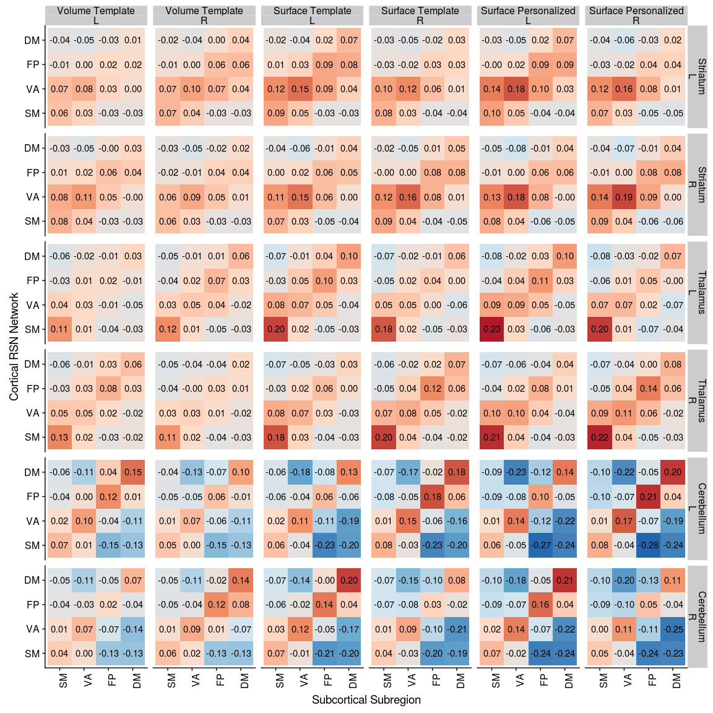
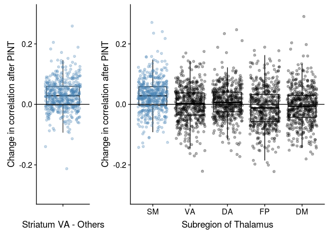
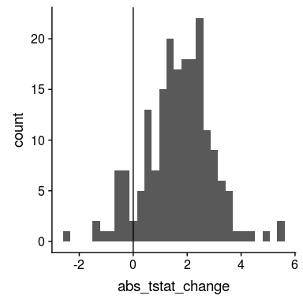
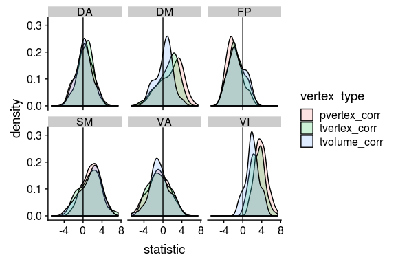
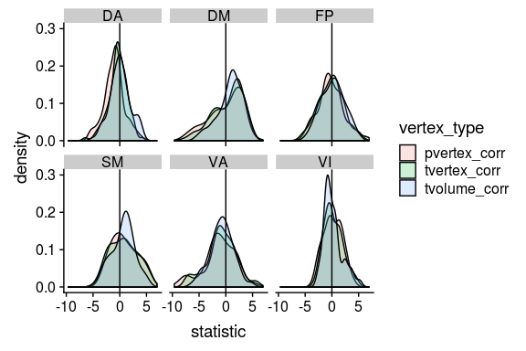
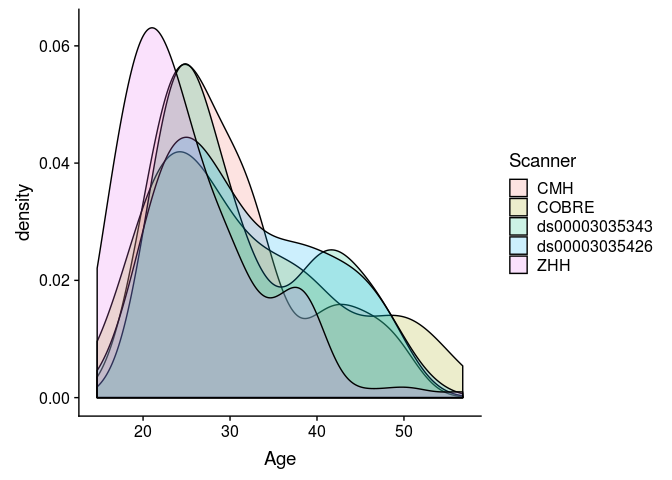

# Sub-cortical Cortical Stats Left and Right

This analysis tries to combine timeseries data from PINT outputs with subcortical timeseries to ask two questions

1. "External" validation of PINT. If PINT is indeed helping us better target meaningful resting state networks than we should see "cleaner" patterns of between the PINT output cortical ROIs and parcels of the subcortical structure that have been associated with these networks in literature.
   + i.e. connectivity of the cortical ROIS with "expected" subcortical parcel should increae and correlation with other parcels should decrease after PINT.
   
2. To interograte SSD related differences in Cortical-Subcortical connectivity - and to see if they persist after PINT.

Some work Ji (in prep) kinda suggests that there might be differences between left and right subcortical structures. AND spliting the left and right seemed to make more sense for whole brain correlations (because our cortical nodes have a hemisphere). So in this analysis have separate left and right ROIs


```r
library(tidyverse)
library(broom)
library(knitr)
library(tableone)
library(cowplot)
```


## The paths to data


```r
output_base <- '../data/ciftify_fmriprep/'

Yeo7_2011_80verts <- read_csv("../templates/Yeo7_2011_80verts.csv",
                              col_types = c(
                                hemi = col_character(),
                                tvertex = col_integer(),
                                LRpairs = col_integer(),
                                roiidx = col_integer(),
                                NETWORK = col_integer(),
                                LOBE = col_character(),
                                SHORTNAME = col_character(),
                                x = col_integer(),
                                y = col_integer(),
                                z = col_integer()
                              ))

YeoNet_colours = list("VI" = "#781286",
                      "SM" = "#4682B4",
                      "DA" = "#00760E", 
                      "VA" = "#C43AFA",
                      "DM" = "#CD3E3A", 
                      "FP" = "#E69422")

pheno <- read_csv('../phenotypic/20180918_pheno_qapass.csv')
```

```
## Parsed with column specification:
## cols(
##   .default = col_character(),
##   fd_mean = col_double(),
##   fd_num = col_integer(),
##   fd_perc = col_double(),
##   size_t = col_integer(),
##   size_z = col_integer(),
##   spacing_tr = col_integer(),
##   spacing_z = col_double(),
##   Age = col_double(),
##   GRID = col_integer(),
##   zhh_session_id = col_integer(),
##   MRI_Date = col_double(),
##   Edu = col_integer(),
##   Age_pt = col_double(),
##   fd_mean_pt = col_double()
## )
```

```
## See spec(...) for full column specifications.
```


# Code for reading in all the timeseries..


A table that describes the current expected subortical files


```r
# a tibble table to specify the subcortical meants files that were generated
YeoNet_subcort_list <- c('VI','SM','DA','VA', 'LI','FP','DM')
```

These functions are for reading timeseries files


```r
#' read a meants file generated by PINT of ciftify_meants
#'
#' @param filepath the full path to the file
#'
#' @return a dataframe where rows are rois and colums are timepoints
read_meants_csv <- function(filepath) {
   meants <-read_csv(filepath, 
                     col_names = FALSE,
                     col_types = c(.default = col_double()))
   return(meants)
}

#' Read the contents of a csv generated by PINT
#'
#' @param outputprefix The prefix to the PINT outputs
#' @param vertex_type "pvertex" or "tvertex"
#' @param projectname the outputdir
#' @param output_dir the basepath of the pint outputs
#'
#' @return a dataframe of the _meants.csv contents
read_pint_meants <- function(outputprefix, vertex_type, projectname, output_dir) {
  expected_filepath <- file.path(output_dir, projectname, "out",'ciftify_PINT', 
                           str_c(outputprefix, '_desc-clean_bold_', 
                                 vertex_type, '_meants.csv'))
  meants = read_meants_csv(expected_filepath)
  return(meants)
}
#' Read the contents of a subcortical csv
#' expample file path is sub-CMHHEF011_ses-01_task-rest_acq-CMH_run-01_bold_desc-cleansm0_atlas-7RSN_roi-Lcerebellum_timeseries.csv
#'
#' @param outputprefix the prefix to the pint outputfile
#' @param hemi The hemisphere "L" or "R"
#' @param subregion region "thalamus", "stiatum", "cerebellum"
#' @param output_dir the basepath of the output data
#' @param projectname the project name inside the output dir
#'
#' @return a dataframe of the _meants.csv contents
read_subcortical_hemi_meants <- function(outputprefix, hemi, subregion, projectname, output_dir) {
  expected_filepath <- file.path(output_dir, projectname, "out",'ciftify_meants', 
                           str_c(outputprefix,
                                 '_desc-cleansm0_atlas-7RSN_roi-', 
                                 hemi, subregion, '_timeseries.csv'))
  meants = read_meants_csv(expected_filepath)
  return(meants)
}

#' Contructs the expected output prefix from subid session and func_base
#'
#' @param subid The subject identifier
#' @param sessid The session identifier (or null)
#' @param func_base The functional file prefix
#'
#' @return an output prefix string for the filenames
construct_output_prefix <- function(subid, sessid, func_base) {
  prefix <- if_else(is.na(sessid),
                    file.path(subid, str_c(subid, '_', func_base)),
                    file.path(subid, sessid, 
                      str_c(subid, '_', sessid, '_', func_base)))
  return(prefix)
}

#' get func_base from pint summary filename
#'
#' @param subid The subject identifier
#' @param sessid The session identifier (or null)
#' @param func_base The functional file prefix
#'
#' @return an output prefix string for the filenames
get_func_base_from_pint_summary_filename <- function(filename, subject, session) {
  func_base <- if_else(is.na(session), 
                       filename %>%
                         str_replace(str_c(subject, "_"), '') %>%
                         str_replace('_desc-clean_bold_summary.csv',''),
                       filename %>%
                         str_replace(subject, '') %>%
                         str_replace(session, '') %>% 
                         str_replace('__','') %>%
                         str_replace('_desc-clean_bold_summary.csv',''))
  return(func_base)
}
```


This reads all files and generate PINT to subcortical correlation values for a given subject


```r
the_subcortical_guide <- tribble(
 ~subcort_hemi, ~subcort_ROI, ~subcort_NET,
 "L", "thalamus", c('VI','SM','DA','VA', 'FP','DM'),
 "L", "striatum", c('SM','DA','VA', 'LI','FP','DM'),
 "L", "cerebellum", c('VI','SM','DA','VA', 'LI','FP','DM'),
 "R", "thalamus", c('VI','SM','DA','VA', 'LI','FP','DM'),
 "R", "striatum", c('VI','SM','DA','VA', 'LI','FP','DM'),
 "R", "cerebellum", c('VI','SM','DA','VA', 'LI','FP','DM')) %>%
  unnest()


#' read all fMRI timeseries data for one subject and correlates PINT ROIs with subcortex
#'
#' @param out_prefix the prefix to the pint outputfile
#' @param outputbase the path to the pint output directory
#' @param projectname the path to sub-study project (dataset)
#' @param Yeo7_2011_80verts as data frame describing the PINT ROIs 
#'
#' @return a dataframe (graph style) of PINT ROI to subcortical correlations
subject_subcort_corrs <- function(out_prefix, projectname, 
                                  outputbase, Yeo7_2011_80verts) {
  
  # read the pint meants files
  pvertex_meants <- read_pint_meants(out_prefix, 'pvertex', 
                                     projectname, outputbase)
  tvertex_meants <- read_pint_meants(out_prefix, 'tvertex',
                                     projectname, outputbase)
  
  # read the subcortical meants files
  thalamus_L_meants <- read_subcortical_hemi_meants(out_prefix,
                                                    "L","thalamus", 
                                                    projectname, outputbase)
  striatum_L_meants <- read_subcortical_hemi_meants(out_prefix,
                                                    "L","striatum",
                                                    projectname, outputbase)
  cerebellum_L_meants <- read_subcortical_hemi_meants(out_prefix,
                                                      "L", "cerebellum",
                                                      projectname, outputbase)
  thalamus_R_meants <- read_subcortical_hemi_meants(out_prefix,
                                                    "R","thalamus",
                                                    projectname, outputbase)
  striatum_R_meants <- read_subcortical_hemi_meants(out_prefix,
                                                    "R","striatum", 
                                                    projectname, outputbase)
  cerebellum_R_meants <- read_subcortical_hemi_meants(out_prefix,
                                                      "R", "cerebellum", 
                                                      projectname, outputbase)
  
  # prepare to bind
  subcort_meants <- bind_rows(thalamus_L_meants, striatum_L_meants, cerebellum_L_meants,
                              thalamus_R_meants, striatum_R_meants, cerebellum_R_meants)
  
  # correlate the pvertex timeseries with the subcortical data
  pvertex_subcortcorr <- as.data.frame(cor(t(subcort_meants), t(pvertex_meants)))
  names(pvertex_subcortcorr) <- Yeo7_2011_80verts$SHORTNAME
  pvertex_result <- the_subcortical_guide %>% 
    bind_cols(pvertex_subcortcorr) %>%
    gather(PINT_ROI, pvertex_corr, -subcort_ROI, -subcort_NET, -subcort_hemi)
  
  # correlated the tvertex timeseries with the subcortical data
  tvertex_subcortcorr <- as.data.frame(cor(t(subcort_meants), t(tvertex_meants)))
  names(tvertex_subcortcorr) <- Yeo7_2011_80verts$SHORTNAME
  tvertex_result <- the_subcortical_guide %>% 
    bind_cols(tvertex_subcortcorr) %>%
    gather(PINT_ROI, tvertex_corr, -subcort_ROI, -subcort_NET, -subcort_hemi)
  
  # combine pvertex and tvertex and return
  subresult <- pvertex_result %>%
    inner_join(tvertex_result, by = c("PINT_ROI", "subcort_ROI", "subcort_NET", "subcort_hemi"))
  return(subresult)
}

#' reads in all the timeseries files for one participant
#' note that Yeo&_2011_80verts and output_base are pulled from the global env
run_read_subject_subcort_corrs <- function(out_prefix, projectname) {
  df <-subject_subcort_corrs(out_prefix, projectname,
                             output_base, Yeo7_2011_80verts)
  return(df)
}

# run_read_subject_subcort_corrs(subcort_outputlist$subid[1])
```


### This reads all the subcortical files it can find

Write a func_base and outputprefix cols into the pheno file for the file reading step


```r
pheno <- pheno %>%
  mutate(func_base = get_func_base_from_pint_summary_filename(filename,subject, session), 
         outputprefix = construct_output_prefix(subject, session, func_base)) 
```


```r
all_subcort_results <- pheno %>%
  select(subject, outputprefix, dataset) %>%
  mutate(subcort_corrs = map2(outputprefix, dataset,
                              ~run_read_subject_subcort_corrs(.x, .y)))
```

### merge with the phenotypic data


```r
results_pheno <- all_subcort_results %>%
  inner_join(pheno, by = "subject") %>%
  unnest() %>%
  mutate(YeoNet = str_sub(PINT_ROI, 1,2),
         hemisphere = str_sub(PINT_ROI, 5,5)) %>%
  mutate(conn_type = if_else(YeoNet == subcort_NET, "same_net", "diff_net"),
         YeoNet = factor(YeoNet, levels = c("VI", "SM", "DA", "VA", "FP", "DM")),
         subcort_NET = factor(subcort_NET, levels = c("VI", "SM", "DA", "VA", "FP", "DM", "LI"))) %>%
  select(subject, PINT_ROI, subcort_ROI, subcort_NET,subcort_hemi, 
         pvertex_corr, tvertex_corr, 
         DX, Sex, fd_mean, Age, Site, Scanner, Age_pt, fd_mean_pt,  
         YeoNet, hemisphere, conn_type) 
```


## make a subject table from resuts pheno


```r
library(tableone)
therealtable1 <- CreateTableOne(
  strata = c("Site", "DX"),
  vars = c("Age", "Sex", "fd_mean", "fd_perc"),
  data = filter(results_pheno, PINT_ROI=="DMP1L",subcort_ROI=="thalamus", subcort_NET=="VA", subcort_hemi == "L")
)
```

```
## Warning in ModuleReturnVarsExist(vars, data): The data frame does not have:
## fd_perc Dropped
```

```r
tabMat <- print(therealtable1, quote = FALSE, noSpaces = TRUE, printToggle = FALSE)
kable(tabMat)
```

                      CMH:CTRL       COBRE:CTRL     ds000030:CTRL   ZHH:CTRL       CMH:SSD        COBRE:SSD       ds000030:SSD   ZHH:SSD        p        test 
--------------------  -------------  -------------  --------------  -------------  -------------  --------------  -------------  -------------  -------  -----
n                     41             27             101             111            67             17              30             83                           
Age (mean (sd))       26.37 (6.67)   31.15 (8.89)   30.50 (8.11)    25.07 (6.55)   32.19 (8.47)   29.12 (12.46)   34.97 (9.36)   26.20 (9.45)   <0.001        
Sex = M (%)           22 (53.7)      17 (63.0)      54 (53.5)       48 (43.2)      40 (59.7)      14 (82.4)       23 (76.7)      64 (77.1)      <0.001        
fd_mean (mean (sd))   0.10 (0.04)    0.18 (0.04)    0.14 (0.07)     0.12 (0.04)    0.12 (0.06)    0.21 (0.09)     0.19 (0.07)    0.12 (0.06)    <0.001        

# Is PINT "focusing" cortical subcortical connectivity


```r
table1 <- results_pheno %>%
  mutate(corr_diff = pvertex_corr - tvertex_corr) %>%
  gather(corr_type, rval, pvertex_corr, tvertex_corr) %>%
  group_by(corr_type, YeoNet, subcort_ROI, subcort_NET) %>%
  summarise(n = n(),
            Mean = mean(rval),
            SD = sd(rval)) 
  
ggplot(table1, aes(y = YeoNet, x = subcort_NET, fill = Mean)) + 
  geom_tile() +
  scale_fill_distiller(breaks = c(-0.5,0.5), type = "div", palette = 5) +
  theme(axis.text.x = element_text(angle = 90, hjust = 1)) +
  facet_grid(subcort_ROI~corr_type) 
```

<!-- -->


```r
table1 <- results_pheno %>%
  mutate(corr_diff = pvertex_corr - tvertex_corr) %>%
  gather(corr_type, rval, pvertex_corr, tvertex_corr) %>%
  group_by(corr_type, YeoNet, hemisphere, subcort_ROI, subcort_NET, subcort_hemi) %>%
  summarise(n = n(),
            Mean = mean(rval),
            SD = sd(rval)) 
  
ggplot(table1, aes(y = YeoNet, x = subcort_NET, fill = Mean)) + 
  geom_tile() +
  scale_fill_distiller(breaks = c(-0.5,0.5), type = "div", palette = 5) +
  theme(axis.text.x = element_text(angle = 90, hjust = 1)) +
  facet_grid(subcort_ROI*subcort_hemi~corr_type*hemisphere) 
```

<!-- -->

We see in the above figure that the Yeo 7 Network connectivity strongly shows the expected pattern in the cerebeullum. 

Lower evidence is seen in the striatum and thalamus, although there is a faint increase across the diagonal for the SM, VA and DM especially


```r
net_means <- results_pheno %>%
  mutate(corr_diff = pvertex_corr - tvertex_corr) %>%
  group_by(YeoNet, subcort_ROI, subcort_NET, conn_type, subject) %>%
  summarise(netmean_pvertex = mean(pvertex_corr),
            netmean_tvertex = mean(tvertex_corr)) %>%
  ungroup()

net_means_pint_t <- net_means %>%
  group_by(YeoNet, subcort_ROI, subcort_NET) %>%
  do(tidy(t.test(.$netmean_pvertex, .$netmean_tvertex, paired = TRUE))) %>%
  ungroup() %>% mutate(p_FDR = p.adjust(p.value, method = "fdr"))

net_means_pint_t %>%
  ungroup() %>%
  mutate(sig = if_else(p_FDR < 0.05, '*', NA_character_) ) %>%
ggplot(aes(x = YeoNet, y = subcort_NET, fill = statistic)) + 
  geom_tile(color = "black", na.rm = TRUE) +
  geom_point(aes(shape = sig), na.rm = TRUE) +
  scale_fill_gradient2(midpoint = 0) +
  theme(axis.text.x = element_text(angle = 90, hjust = 1)) +
  facet_wrap(~subcort_ROI)
```

<!-- -->
Here we plot the paired t-stat camparing personalized to template, we see a very strong increase in correlation along the diagonal (i.e. with the hypothesized regions) and decreases on the off-dignonal (i.e. decreased connectivity with the other network's parcels)


# trying to calculate an vs off diagonal term

In the above table to calcuculated the "focussing" effect as the change (in on person) between in connectivity with the expected parcel subtracted by the change in connectivity from other regions.

Below we plot these values against zero


```r
library(knitr)
net_focus <- net_means %>%
  ungroup() %>%
  mutate(pint_diff = netmean_pvertex - netmean_tvertex) %>%
  group_by(subject, subcort_ROI, YeoNet, conn_type) %>%
  summarise(nets_avg = mean(pint_diff)) %>%
  ungroup() %>%
  spread(conn_type, nets_avg) %>%
  mutate(focus_effect = same_net - diff_net)

net_focus %>%
  ungroup() %>%
  group_by(subcort_ROI, YeoNet) %>%
  do(tidy(t.test(.$focus_effect))) %>%
  kable()
```


subcort_ROI   YeoNet     estimate   statistic     p.value   parameter     conf.low   conf.high  method              alternative 
------------  -------  ----------  ----------  ----------  ----------  -----------  ----------  ------------------  ------------
cerebellum    VI        0.0260727   10.866808   0.0000000         476    0.0213582   0.0307873  One Sample t-test   two.sided   
cerebellum    SM        0.0210925    9.644953   0.0000000         476    0.0167953   0.0253896  One Sample t-test   two.sided   
cerebellum    DA        0.0281731   12.431853   0.0000000         476    0.0237201   0.0326261  One Sample t-test   two.sided   
cerebellum    VA        0.0333626   16.632719   0.0000000         476    0.0294212   0.0373040  One Sample t-test   two.sided   
cerebellum    FP        0.0409528   17.812870   0.0000000         476    0.0364353   0.0454704  One Sample t-test   two.sided   
cerebellum    DM        0.0546599   20.696369   0.0000000         476    0.0494704   0.0598495  One Sample t-test   two.sided   
striatum      VI        0.0015262    0.655500   0.5124625         476   -0.0030489   0.0061014  One Sample t-test   two.sided   
striatum      SM        0.0094199    4.949935   0.0000010         476    0.0056805   0.0131593  One Sample t-test   two.sided   
striatum      DA        0.0048709    2.676416   0.0076982         476    0.0012948   0.0084470  One Sample t-test   two.sided   
striatum      VA        0.0213108   14.567047   0.0000000         476    0.0184362   0.0241854  One Sample t-test   two.sided   
striatum      FP        0.0091633    4.916158   0.0000012         476    0.0055008   0.0128257  One Sample t-test   two.sided   
striatum      DM        0.0091685    4.319699   0.0000190         476    0.0049979   0.0133391  One Sample t-test   two.sided   
thalamus      VI        0.0070511    4.176516   0.0000352         476    0.0037337   0.0103685  One Sample t-test   two.sided   
thalamus      SM        0.0279151   12.510370   0.0000000         476    0.0235306   0.0322997  One Sample t-test   two.sided   
thalamus      DA        0.0166856    8.614743   0.0000000         476    0.0128798   0.0204915  One Sample t-test   two.sided   
thalamus      VA        0.0111445    7.129852   0.0000000         476    0.0080732   0.0142159  One Sample t-test   two.sided   
thalamus      FP        0.0111516    6.041331   0.0000000         476    0.0075245   0.0147787  One Sample t-test   two.sided   
thalamus      DM        0.0154452    8.141479   0.0000000         476    0.0117175   0.0191730  One Sample t-test   two.sided   

Another (maybe better) way to test this is to show calculate the "focusing" value in individual subjects THAN compute how this number changes with PINT. Let try that..


```r
subject_focus <- net_means %>%
  gather(vertex_type, nets_avg, netmean_pvertex, netmean_tvertex) %>%
  ungroup(subcort_NET) %>%
  group_by(subject, subcort_ROI, YeoNet, vertex_type, conn_type) %>%
  summarise(nets_type_avg = mean(nets_avg)) %>%
  spread(conn_type, nets_type_avg) %>%
  ungroup() %>%
  mutate(focus_effect = same_net - diff_net)

subject_focus %>%
  ungroup() %>%
  group_by(subcort_ROI, YeoNet, vertex_type) %>%
  do(tidy(t.test(.$focus_effect))) %>%
  kable()
```


subcort_ROI   YeoNet   vertex_type         estimate   statistic    p.value   parameter    conf.low   conf.high  method              alternative 
------------  -------  ----------------  ----------  ----------  ---------  ----------  ----------  ----------  ------------------  ------------
cerebellum    VI       netmean_pvertex    0.1532944   20.176186   0.00e+00         476   0.1383651   0.1682238  One Sample t-test   two.sided   
cerebellum    VI       netmean_tvertex    0.1272217   20.349186   0.00e+00         476   0.1149369   0.1395065  One Sample t-test   two.sided   
cerebellum    SM       netmean_pvertex    0.1827986   30.621801   0.00e+00         476   0.1710687   0.1945286  One Sample t-test   two.sided   
cerebellum    SM       netmean_tvertex    0.1617062   32.265686   0.00e+00         476   0.1518584   0.1715540  One Sample t-test   two.sided   
cerebellum    DA       netmean_pvertex    0.1358385   24.284045   0.00e+00         476   0.1248470   0.1468300  One Sample t-test   two.sided   
cerebellum    DA       netmean_tvertex    0.1076654   24.141311   0.00e+00         476   0.0989021   0.1164288  One Sample t-test   two.sided   
cerebellum    VA       netmean_pvertex    0.1904320   31.870379   0.00e+00         476   0.1786909   0.2021730  One Sample t-test   two.sided   
cerebellum    VA       netmean_tvertex    0.1570694   32.672602   0.00e+00         476   0.1476231   0.1665157  One Sample t-test   two.sided   
cerebellum    FP       netmean_pvertex    0.1727377   36.304034   0.00e+00         476   0.1633883   0.1820872  One Sample t-test   two.sided   
cerebellum    FP       netmean_tvertex    0.1317849   37.753451   0.00e+00         476   0.1249259   0.1386440  One Sample t-test   two.sided   
cerebellum    DM       netmean_pvertex    0.2881837   41.320544   0.00e+00         476   0.2744794   0.3018880  One Sample t-test   two.sided   
cerebellum    DM       netmean_tvertex    0.2335238   40.991884   0.00e+00         476   0.2223297   0.2447178  One Sample t-test   two.sided   
striatum      VI       netmean_pvertex    0.0230768    3.893379   1.13e-04         476   0.0114301   0.0347234  One Sample t-test   two.sided   
striatum      VI       netmean_tvertex    0.0215505    4.582829   5.90e-06         476   0.0123104   0.0307906  One Sample t-test   two.sided   
striatum      SM       netmean_pvertex    0.0934841   17.704581   0.00e+00         476   0.0831087   0.1038595  One Sample t-test   two.sided   
striatum      SM       netmean_tvertex    0.0840642   19.169774   0.00e+00         476   0.0754474   0.0926810  One Sample t-test   two.sided   
striatum      DA       netmean_pvertex    0.0301939    7.206153   0.00e+00         476   0.0219607   0.0384272  One Sample t-test   two.sided   
striatum      DA       netmean_tvertex    0.0253231    8.238237   0.00e+00         476   0.0192831   0.0313630  One Sample t-test   two.sided   
striatum      VA       netmean_pvertex    0.1119536   28.457222   0.00e+00         476   0.1042232   0.1196839  One Sample t-test   two.sided   
striatum      VA       netmean_tvertex    0.0906428   29.094973   0.00e+00         476   0.0845211   0.0967644  One Sample t-test   two.sided   
striatum      FP       netmean_pvertex    0.0568016   15.316314   0.00e+00         476   0.0495144   0.0640888  One Sample t-test   two.sided   
striatum      FP       netmean_tvertex    0.0476384   17.625996   0.00e+00         476   0.0423276   0.0529492  One Sample t-test   two.sided   
striatum      DM       netmean_pvertex    0.0693609   14.018758   0.00e+00         476   0.0596388   0.0790830  One Sample t-test   two.sided   
striatum      DM       netmean_tvertex    0.0601924   16.415452   0.00e+00         476   0.0529873   0.0673975  One Sample t-test   two.sided   
thalamus      VI       netmean_pvertex    0.0593975   13.535524   0.00e+00         476   0.0507747   0.0680203  One Sample t-test   two.sided   
thalamus      VI       netmean_tvertex    0.0523464   15.175152   0.00e+00         476   0.0455683   0.0591245  One Sample t-test   two.sided   
thalamus      SM       netmean_pvertex    0.2053733   33.495086   0.00e+00         476   0.1933252   0.2174213  One Sample t-test   two.sided   
thalamus      SM       netmean_tvertex    0.1774581   34.323155   0.00e+00         476   0.1672989   0.1876174  One Sample t-test   two.sided   
thalamus      DA       netmean_pvertex    0.0835611   17.143211   0.00e+00         476   0.0739833   0.0931389  One Sample t-test   two.sided   
thalamus      DA       netmean_tvertex    0.0668754   17.516234   0.00e+00         476   0.0593734   0.0743775  One Sample t-test   two.sided   
thalamus      VA       netmean_pvertex    0.0526655   12.841898   0.00e+00         476   0.0446070   0.0607239  One Sample t-test   two.sided   
thalamus      VA       netmean_tvertex    0.0415209   12.735249   0.00e+00         476   0.0351145   0.0479273  One Sample t-test   two.sided   
thalamus      FP       netmean_pvertex    0.0835266   19.978531   0.00e+00         476   0.0753115   0.0917418  One Sample t-test   two.sided   
thalamus      FP       netmean_tvertex    0.0723750   22.291717   0.00e+00         476   0.0659954   0.0787547  One Sample t-test   two.sided   
thalamus      DM       netmean_pvertex    0.1071074   22.731393   0.00e+00         476   0.0978488   0.1163661  One Sample t-test   two.sided   
thalamus      DM       netmean_tvertex    0.0916622   25.336065   0.00e+00         476   0.0845532   0.0987711  One Sample t-test   two.sided   

```r
subject_focus %>%
  ungroup() %>% group_by(subject, YeoNet, subcort_ROI) %>%
  select(subject, YeoNet, vertex_type, subcort_ROI, focus_effect) %>%
  spread(vertex_type, focus_effect) %>%
  group_by(subcort_ROI, YeoNet) %>%
  do(tidy(t.test(.$netmean_pvertex, .$netmean_tvertex, paired = TRUE))) %>%
  kable()
```


subcort_ROI   YeoNet     estimate   statistic     p.value   parameter     conf.low   conf.high  method          alternative 
------------  -------  ----------  ----------  ----------  ----------  -----------  ----------  --------------  ------------
cerebellum    VI        0.0260727   10.866808   0.0000000         476    0.0213582   0.0307873  Paired t-test   two.sided   
cerebellum    SM        0.0210925    9.644953   0.0000000         476    0.0167953   0.0253896  Paired t-test   two.sided   
cerebellum    DA        0.0281731   12.431853   0.0000000         476    0.0237201   0.0326261  Paired t-test   two.sided   
cerebellum    VA        0.0333626   16.632719   0.0000000         476    0.0294212   0.0373040  Paired t-test   two.sided   
cerebellum    FP        0.0409528   17.812870   0.0000000         476    0.0364353   0.0454704  Paired t-test   two.sided   
cerebellum    DM        0.0546599   20.696369   0.0000000         476    0.0494704   0.0598495  Paired t-test   two.sided   
striatum      VI        0.0015262    0.655500   0.5124625         476   -0.0030489   0.0061014  Paired t-test   two.sided   
striatum      SM        0.0094199    4.949935   0.0000010         476    0.0056805   0.0131593  Paired t-test   two.sided   
striatum      DA        0.0048709    2.676416   0.0076982         476    0.0012948   0.0084470  Paired t-test   two.sided   
striatum      VA        0.0213108   14.567047   0.0000000         476    0.0184362   0.0241854  Paired t-test   two.sided   
striatum      FP        0.0091633    4.916158   0.0000012         476    0.0055008   0.0128257  Paired t-test   two.sided   
striatum      DM        0.0091685    4.319699   0.0000190         476    0.0049979   0.0133391  Paired t-test   two.sided   
thalamus      VI        0.0070511    4.176516   0.0000352         476    0.0037337   0.0103685  Paired t-test   two.sided   
thalamus      SM        0.0279151   12.510370   0.0000000         476    0.0235306   0.0322997  Paired t-test   two.sided   
thalamus      DA        0.0166856    8.614743   0.0000000         476    0.0128798   0.0204915  Paired t-test   two.sided   
thalamus      VA        0.0111445    7.129852   0.0000000         476    0.0080732   0.0142159  Paired t-test   two.sided   
thalamus      FP        0.0111516    6.041331   0.0000000         476    0.0075245   0.0147787  Paired t-test   two.sided   
thalamus      DM        0.0154452    8.141479   0.0000000         476    0.0117175   0.0191730  Paired t-test   two.sided   


```r
subject_focus %>%
  ungroup() %>% 
  ggplot(aes(x = YeoNet, y = focus_effect)) +
  geom_boxplot(color = "blue", outlier.shape = NA) +
  geom_jitter(alpha = 0.05) +
  geom_hline(yintercept = 0) +
  facet_wrap(~ subcort_ROI, ncol = 1) + 
  coord_flip()
```

<!-- -->


Recreating the DM plot from the poster to double check


```r
net_means <- results_pheno %>%
  ungroup() %>%
  group_by(YeoNet, subcort_ROI, subcort_NET, subject) %>%
  summarise(netmean_pvertex = mean(pvertex_corr),
            netmean_tvertex = mean(tvertex_corr),
            pint_diff = netmean_pvertex - netmean_tvertex) 

pint_diff_sub_DM <- net_means %>%
  ungroup() %>% 
  filter(YeoNet == "DM", subcort_ROI == "cerebellum") %>%
  select(subject, subcort_NET, pint_diff) %>%
  spread(subcort_NET, pint_diff) %>%
  mutate(overall_pint_diff = DM - (SM + VA + FP + DA)/4,
         x_val = '') %>%
  select(subject, overall_pint_diff, x_val) %>%
  ggplot(aes(y = overall_pint_diff, x = x_val)) +
    geom_boxplot(outlier.shape = NA) +
    geom_jitter(alpha = 0.3, color = YeoNet_colours$DM, fill = "grey") +
    geom_hline(yintercept = 0) + 
    labs(y = "Change in correlation after PINT", x = "Cerebellum DM - Others") +
  scale_y_continuous(limits = c(-0.3, 0.3))

DM_submeans_plot <- net_means %>%
  mutate(is_DM = if_else(subcort_NET == 'DM', TRUE, FALSE),
         SubCortNET = factor(subcort_NET, levels = c("DM", "SM", "DA", "VA", "FP"))) %>%
  filter(subcort_ROI == "cerebellum", !is.na(SubCortNET), YeoNet == "DM") %>%
  ggplot(aes(y = pint_diff, x = SubCortNET, color = is_DM)) +
  geom_boxplot(color = "black", outlier.shape = NA) + 
  geom_jitter(alpha = 0.3) +
  geom_hline(yintercept = 0) +
  scale_color_manual(values = c('black',YeoNet_colours$DM)) +
  labs(y = "Change in correlation after PINT", color = NULL, x = "Subregion of Cerebellum") +
  theme(legend.position = "none") +
  scale_y_continuous(limits = c(-0.3, 0.3))

# DM_brain_pic <- ggdraw + draw_image('DM_striatum_pic.png')

plot_grid(pint_diff_sub_DM, DM_submeans_plot, rel_widths = c(1,2.5))
```

```
## Warning: Removed 1 rows containing non-finite values (stat_boxplot).
```

```
## Warning: Removed 1 rows containing missing values (geom_point).
```

<!-- -->

Also the VA Striatum one


```r
pint_diff_sub_VA <- net_means %>%
  ungroup %>% 
  filter(YeoNet == "VA", subcort_ROI == "cerebellum") %>%
  select(subject, subcort_NET, pint_diff) %>%
  spread(subcort_NET, pint_diff) %>%
  mutate(overall_pint_diff = VA - (SM + DM + FP + DA)/4,
         x_val = '') %>%
  select(subject, overall_pint_diff, x_val) %>%
  ggplot(aes(y = overall_pint_diff, x = x_val)) +
    geom_boxplot(outlier.shape = NA) +
    geom_jitter(alpha = 0.3, color = YeoNet_colours$VA, fill = "grey") +
    geom_hline(yintercept = 0) + 
    labs(y = "Change in correlation after PINT", x = "Cerebellum VA - Others") +
  scale_y_continuous(limits = c(-0.3, 0.3))

VA_submeans_plot <- net_means %>%
  mutate(is_VA = if_else(subcort_NET == 'VA', TRUE, FALSE),
          SubCort_ROI = factor(subcort_NET, 
                               levels = c("VA", "DA", 'SM', 'FP', "DM"))) %>%
  filter(YeoNet == "VA", 
         subcort_ROI == "cerebellum",
         subcort_NET %in% c('SM', "VA", "DM", 'FP', "DA")) %>%
  ggplot(aes(y = pint_diff, x = SubCort_ROI, color = is_VA)) +
  geom_boxplot(color = "black", outlier.shape = NA) + 
  geom_jitter(alpha = 0.3) +
  geom_hline(yintercept = 0) +
  scale_color_manual(values = c('black', YeoNet_colours$VA)) +
  labs(y = "Change in correlation after PINT", color = NULL, x = "Subregion of Cerebellum") +
  theme(legend.position = "none") +
  scale_y_continuous(limits = c(-0.3, 0.3))

# DM_brain_pic <- ggdraw + draw_image('DM_striatum_pic.png')

plot_grid(pint_diff_sub_VA, VA_submeans_plot, rel_widths = c(1,2.5))
```

<!-- -->


```r
pint_diff_sub_FP <- net_means %>%
  ungroup %>% 
  filter(YeoNet == "FP", subcort_ROI == "striatum") %>%
  select(subject, subcort_NET, pint_diff) %>%
  spread(subcort_NET, pint_diff) %>%
  mutate(overall_pint_diff = FP - (SM + DM + VA)/3,
         x_val = '') %>%
  select(subject, overall_pint_diff, x_val) %>%
  ggplot(aes(y = overall_pint_diff, x = x_val)) +
    geom_boxplot(outlier.shape = NA) +
    geom_jitter(alpha = 0.3, color = YeoNet_colours$FP, fill = "grey") +
    geom_hline(yintercept = 0) + 
    labs(y = "Change in correlation after PINT", x = "Striatum VA - Others") +
  scale_y_continuous(limits = c(-0.3, 0.3))

FP_submeans_plot <- net_means %>%
  mutate(is_FP = if_else(subcort_NET == 'FP', TRUE, FALSE),
          SubCort_ROI = factor(subcort_NET, 
                               levels = c('FP', "DM", 'SM', "VA"))) %>%
  filter(YeoNet == "FP", 
         subcort_ROI == "striatum",
         subcort_NET %in% c('SM', "VA", "DM", 'FP')) %>%
  ggplot(aes(y = pint_diff, x = SubCort_ROI, color = is_FP)) +
  geom_boxplot(color = "black", outlier.shape = NA) + 
  geom_jitter(alpha = 0.3) +
  geom_hline(yintercept = 0) +
  scale_color_manual(values = c('black', YeoNet_colours$FP)) +
  labs(y = "Change in correlation after PINT", color = NULL, x = "Subregion of Striatum") +
  theme(legend.position = "none") +
  scale_y_continuous(limits = c(-0.3, 0.3))

# DM_brain_pic <- ggdraw + draw_image('DM_striatum_pic.png')

plot_grid(pint_diff_sub_FP, FP_submeans_plot, rel_widths = c(1,2.5))
```

<!-- -->


```r
pint_diff_sub_VA <- net_means %>%
  ungroup %>% 
  filter(YeoNet == "VA", subcort_ROI == "striatum") %>%
  select(subject, subcort_NET, pint_diff) %>%
  spread(subcort_NET, pint_diff) %>%
  mutate(overall_pint_diff = VA - (SM + DM + FP)/3,
         x_val = '') %>%
  select(subject, overall_pint_diff, x_val) %>%
  ggplot(aes(y = overall_pint_diff, x = x_val)) +
    geom_boxplot(outlier.shape = NA) +
    geom_jitter(alpha = 0.3, color = YeoNet_colours$VA, fill = "grey") +
    geom_hline(yintercept = 0) + 
    labs(y = "Change in correlation after PINT", x = "Striatum VA - Others") +
  scale_y_continuous(limits = c(-0.3, 0.3))

VA_submeans_plot <- net_means %>%
  mutate(is_VA = if_else(subcort_NET == 'VA', TRUE, FALSE),
          SubCort_ROI = factor(subcort_NET, 
                               levels = c("VA", 'SM', 'FP', "DM"))) %>%
  filter(YeoNet == "VA", 
         subcort_ROI == "striatum",
         subcort_NET %in% c('SM', "VA", "DM", 'FP')) %>%
  ggplot(aes(y = pint_diff, x = SubCort_ROI, color = is_VA)) +
  geom_boxplot(color = "black", outlier.shape = NA) + 
  geom_jitter(alpha = 0.3) +
  geom_hline(yintercept = 0) +
  scale_color_manual(values = c('black', YeoNet_colours$VA)) +
  labs(y = "Change in correlation after PINT", color = NULL, x = "Subregion of Striatum") +
  theme(legend.position = "none") +
  scale_y_continuous(limits = c(-0.3, 0.3))

# DM_brain_pic <- ggdraw + draw_image('DM_striatum_pic.png')

plot_grid(pint_diff_sub_VA, VA_submeans_plot, rel_widths = c(1,2.5))
```

<!-- -->

```r
pint_diff_sub_SM <- net_means %>%
  ungroup %>% 
  filter(YeoNet == "SM", subcort_ROI == "thalamus") %>%
  select(subject, subcort_NET, pint_diff) %>%
  spread(subcort_NET, pint_diff) %>%
  mutate(overall_pint_diff = SM - (VA + DM + FP + DA)/4,
         x_val = '') %>%
  select(subject, overall_pint_diff, x_val) %>%
  ggplot(aes(y = overall_pint_diff, x = x_val)) +
    geom_boxplot(outlier.shape = NA) +
    geom_jitter(alpha = 0.3, color = YeoNet_colours$SM, fill = "grey") +
    geom_hline(yintercept = 0) + 
    labs(y = "Change in correlation after PINT", x = "Striatum VA - Others") +
  scale_y_continuous(limits = c(-0.3, 0.3))

SM_submeans_plot <- net_means %>%
  mutate(is_SM = if_else(subcort_NET == 'SM', TRUE, FALSE),
          SubCort_ROI = factor(subcort_NET, 
                               levels = c("SM", "VA", "DA",'FP', "DM"))) %>%
  filter(YeoNet == "SM", 
         subcort_ROI == "thalamus",
         subcort_NET %in% c('SM', "VA", "DA","DM", 'FP')) %>%
  ggplot(aes(y = pint_diff, x = SubCort_ROI, color = is_SM)) +
  geom_boxplot(color = "black", outlier.shape = NA) + 
  geom_jitter(alpha = 0.3) +
  geom_hline(yintercept = 0) +
  scale_color_manual(values = c('black', YeoNet_colours$SM)) +
  labs(y = "Change in correlation after PINT", color = NULL, x = "Subregion of Thalamus") +
  theme(legend.position = "none") +
  scale_y_continuous(limits = c(-0.3, 0.3))

# DM_brain_pic <- ggdraw + draw_image('DM_striatum_pic.png')

plot_grid(pint_diff_sub_SM, SM_submeans_plot, rel_widths = c(1,2.5))
```

```
## Warning: Removed 1 rows containing non-finite values (stat_boxplot).
```

```
## Warning: Removed 1 rows containing missing values (geom_point).
```

<!-- -->


## Plotting the PINT effect separately in SSD and controls

Note that the circle denotes an uncorrected p<0.05


```r
net_means_byDX <- results_pheno %>%
  mutate(corr_diff = pvertex_corr - tvertex_corr) %>%
  group_by(YeoNet, subcort_ROI, subcort_NET, subject, DX) %>%
  summarise(netmean_pvertex = mean(pvertex_corr),
            netmean_tvertex = mean(tvertex_corr)) %>%
  ungroup() %>%
  group_by(YeoNet, subcort_ROI, subcort_NET, DX) %>%
  do(tidy(t.test(.$netmean_pvertex, .$netmean_tvertex, paired = TRUE)))

net_means_byDX %>%
  ungroup() %>%
  mutate(sig = if_else(p.value < 0.005, '*', NA_character_) ) %>%
ggplot(aes(x = YeoNet, y = subcort_NET, fill = statistic)) + 
  geom_tile(color = "black", na.rm = TRUE) +
  geom_point(aes(shape = sig), na.rm = TRUE) +
  scale_fill_gradient2() +
  theme(axis.text.x = element_text(angle = 90, hjust = 1)) +
  facet_grid(subcort_ROI ~ DX)
```

<!-- -->


## running model again with sex interaction


```r
library(knitr)

DX_lm_model <- results_pheno %>%
  gather(vertex_type, corZ, pvertex_corr, tvertex_corr) %>%
  filter(Age > 17, Age < 51) %>%
  group_by(vertex_type, subcort_ROI, subcort_NET, PINT_ROI) %>%
  do(tidy(lm(corZ ~ DX + Sex + fd_mean_pt + poly(Age_pt,2) + Scanner,.))) %>%
  select(vertex_type, subcort_ROI, subcort_NET, PINT_ROI, term, statistic, p.value) %>%
  ungroup() %>%
  group_by(term) %>%
  mutate(p_FDR = p.adjust(p.value, method = "fdr")) %>%
  arrange(p.value)

DX_lm_model %>% 
  filter(term %in% c("DXSSD")) %>%
  filter(p_FDR < 0.1) %>%
  kable()
```


vertex_type    subcort_ROI   subcort_NET   PINT_ROI   term     statistic     p.value       p_FDR
-------------  ------------  ------------  ---------  ------  ----------  ----------  ----------
tvertex_corr   thalamus      DM            VI04R      DXSSD     7.641032   0.0000000   0.0000000
pvertex_corr   thalamus      FP            VI02R      DXSSD     7.603535   0.0000000   0.0000000
pvertex_corr   thalamus      VI            VI04L      DXSSD     7.433112   0.0000000   0.0000000
pvertex_corr   thalamus      DM            VI02R      DXSSD     7.302780   0.0000000   0.0000000
pvertex_corr   thalamus      VI            VI04R      DXSSD     7.295553   0.0000000   0.0000000
tvertex_corr   thalamus      DM            VI02L      DXSSD     7.246686   0.0000000   0.0000000
pvertex_corr   thalamus      DM            VI04L      DXSSD     7.239664   0.0000000   0.0000000
tvertex_corr   thalamus      VI            VI05R      DXSSD     7.175318   0.0000000   0.0000000
pvertex_corr   thalamus      DM            VI04R      DXSSD     7.101598   0.0000000   0.0000000
tvertex_corr   cerebellum    VA            SMT1L      DXSSD     6.933287   0.0000000   0.0000000
tvertex_corr   thalamus      VI            VI04R      DXSSD     6.884760   0.0000000   0.0000000
pvertex_corr   thalamus      FP            VI04R      DXSSD     6.863111   0.0000000   0.0000000
tvertex_corr   thalamus      FP            VI04R      DXSSD     6.847986   0.0000000   0.0000000
tvertex_corr   thalamus      DM            VI02R      DXSSD     6.800878   0.0000000   0.0000000
pvertex_corr   thalamus      DM            VI03R      DXSSD     6.772528   0.0000000   0.0000000
pvertex_corr   thalamus      FP            VI04L      DXSSD     6.763971   0.0000000   0.0000000
tvertex_corr   thalamus      FP            VI02R      DXSSD     6.694808   0.0000000   0.0000000
pvertex_corr   thalamus      DM            VI03L      DXSSD     6.693397   0.0000000   0.0000000
tvertex_corr   thalamus      DM            VI03L      DXSSD     6.652599   0.0000000   0.0000000
tvertex_corr   thalamus      VI            VI02L      DXSSD     6.645320   0.0000000   0.0000000
tvertex_corr   thalamus      DM            VI04L      DXSSD     6.643564   0.0000000   0.0000000
tvertex_corr   thalamus      DM            VI03R      DXSSD     6.578568   0.0000000   0.0000000
tvertex_corr   thalamus      FP            VI02L      DXSSD     6.558736   0.0000000   0.0000000
tvertex_corr   thalamus      FP            VI04L      DXSSD     6.519536   0.0000000   0.0000000
pvertex_corr   thalamus      VI            VI02R      DXSSD     6.486552   0.0000000   0.0000000
pvertex_corr   cerebellum    SM            VI04L      DXSSD     6.480270   0.0000000   0.0000000
pvertex_corr   thalamus      FP            VI03L      DXSSD     6.469799   0.0000000   0.0000000
pvertex_corr   thalamus      VI            VI05R      DXSSD     6.446671   0.0000000   0.0000000
tvertex_corr   cerebellum    DA            SMT1L      DXSSD     6.406684   0.0000000   0.0000000
pvertex_corr   thalamus      DM            VI02L      DXSSD     6.357350   0.0000000   0.0000000
pvertex_corr   thalamus      FP            VI03R      DXSSD     6.339277   0.0000000   0.0000000
pvertex_corr   thalamus      FP            VI02L      DXSSD     6.298475   0.0000000   0.0000000
pvertex_corr   thalamus      VI            VI03L      DXSSD     6.244714   0.0000000   0.0000001
pvertex_corr   thalamus      VI            VI05L      DXSSD     6.192674   0.0000000   0.0000001
tvertex_corr   thalamus      VI            VI04L      DXSSD     6.185345   0.0000000   0.0000001
tvertex_corr   cerebellum    SM            VI04R      DXSSD     6.174239   0.0000000   0.0000001
pvertex_corr   cerebellum    DA            SMI1L      DXSSD     6.152194   0.0000000   0.0000001
pvertex_corr   thalamus      VI            SMI1R      DXSSD     6.097813   0.0000000   0.0000001
pvertex_corr   striatum      DM            VI02R      DXSSD     6.081615   0.0000000   0.0000002
tvertex_corr   thalamus      VI            VI05L      DXSSD     6.062627   0.0000000   0.0000002
pvertex_corr   thalamus      FP            VI05L      DXSSD     6.053822   0.0000000   0.0000002
pvertex_corr   thalamus      DM            VI05L      DXSSD     6.051443   0.0000000   0.0000002
tvertex_corr   thalamus      VI            VI02R      DXSSD     6.029169   0.0000000   0.0000002
tvertex_corr   cerebellum    SM            SMT1L      DXSSD     5.998857   0.0000000   0.0000002
pvertex_corr   cerebellum    SM            VI05L      DXSSD     5.994148   0.0000000   0.0000002
tvertex_corr   cerebellum    VA            SMT1R      DXSSD     5.920781   0.0000000   0.0000003
tvertex_corr   thalamus      VI            SMI1R      DXSSD     5.901013   0.0000000   0.0000004
pvertex_corr   thalamus      VI            VI02L      DXSSD     5.852413   0.0000000   0.0000005
pvertex_corr   striatum      FP            VI02R      DXSSD     5.837443   0.0000000   0.0000005
pvertex_corr   thalamus      VI            VI03R      DXSSD     5.812609   0.0000000   0.0000006
pvertex_corr   thalamus      VA            VI04R      DXSSD     5.777162   0.0000000   0.0000007
pvertex_corr   striatum      FP            DMT1R      DXSSD     5.762872   0.0000000   0.0000007
pvertex_corr   striatum      SM            VAF2L      DXSSD    -5.755491   0.0000000   0.0000008
tvertex_corr   thalamus      VI            SMF1R      DXSSD     5.720402   0.0000000   0.0000009
pvertex_corr   cerebellum    SM            VI05R      DXSSD     5.692188   0.0000000   0.0000010
pvertex_corr   cerebellum    VA            SMT1L      DXSSD     5.672752   0.0000000   0.0000011
pvertex_corr   thalamus      FP            SMF3R      DXSSD     5.664738   0.0000000   0.0000012
tvertex_corr   cerebellum    DA            SMT1R      DXSSD     5.655140   0.0000000   0.0000012
tvertex_corr   cerebellum    SM            VI05L      DXSSD     5.650753   0.0000000   0.0000012
tvertex_corr   thalamus      FP            VI05R      DXSSD     5.596629   0.0000000   0.0000016
pvertex_corr   striatum      FP            DMT2R      DXSSD     5.520228   0.0000000   0.0000024
tvertex_corr   thalamus      VI            SMI1L      DXSSD     5.497184   0.0000001   0.0000027
tvertex_corr   thalamus      FP            FPP2L      DXSSD    -5.494973   0.0000001   0.0000027
pvertex_corr   thalamus      DM            VI05R      DXSSD     5.483322   0.0000001   0.0000028
tvertex_corr   thalamus      VI            DAP3R      DXSSD     5.475937   0.0000001   0.0000029
pvertex_corr   thalamus      VI            VI01L      DXSSD     5.427973   0.0000001   0.0000037
tvertex_corr   thalamus      VI            VAT1R      DXSSD     5.410344   0.0000001   0.0000040
tvertex_corr   striatum      DM            VI02R      DXSSD     5.402693   0.0000001   0.0000042
pvertex_corr   striatum      FP            VI03R      DXSSD     5.395063   0.0000001   0.0000043
pvertex_corr   thalamus      FP            DMT2R      DXSSD     5.382881   0.0000001   0.0000045
tvertex_corr   cerebellum    DA            SMI1L      DXSSD     5.359667   0.0000001   0.0000050
tvertex_corr   thalamus      VA            VI02L      DXSSD     5.356130   0.0000001   0.0000050
pvertex_corr   thalamus      VA            SMF3R      DXSSD     5.351047   0.0000001   0.0000051
pvertex_corr   striatum      DM            DMT1R      DXSSD     5.350459   0.0000001   0.0000051
pvertex_corr   cerebellum    SM            VI04R      DXSSD     5.333177   0.0000001   0.0000055
tvertex_corr   cerebellum    SM            VI05R      DXSSD     5.327847   0.0000001   0.0000056
pvertex_corr   thalamus      FP            VI05R      DXSSD     5.311573   0.0000001   0.0000060
pvertex_corr   striatum      SM            VAF1R      DXSSD    -5.305093   0.0000001   0.0000061
pvertex_corr   striatum      FP            VI05L      DXSSD     5.298101   0.0000001   0.0000063
tvertex_corr   thalamus      VI            DAT1R      DXSSD     5.291644   0.0000002   0.0000064
pvertex_corr   thalamus      VA            VI03L      DXSSD     5.287930   0.0000002   0.0000064
pvertex_corr   thalamus      VA            VI03R      DXSSD     5.277758   0.0000002   0.0000067
pvertex_corr   cerebellum    SM            SMT1L      DXSSD     5.275875   0.0000002   0.0000067
pvertex_corr   thalamus      VI            SMF1R      DXSSD     5.265320   0.0000002   0.0000070
pvertex_corr   thalamus      FP            SMI1R      DXSSD     5.259853   0.0000002   0.0000071
pvertex_corr   thalamus      VI            SMF3R      DXSSD     5.254445   0.0000002   0.0000072
pvertex_corr   thalamus      VA            VI02R      DXSSD     5.248815   0.0000002   0.0000074
tvertex_corr   thalamus      FP            VI05L      DXSSD     5.232485   0.0000002   0.0000079
pvertex_corr   thalamus      VI            SMT1R      DXSSD     5.227209   0.0000002   0.0000079
pvertex_corr   thalamus      FP            SMF2R      DXSSD     5.226993   0.0000002   0.0000079
tvertex_corr   cerebellum    FP            SMT1L      DXSSD     5.226352   0.0000002   0.0000079
pvertex_corr   thalamus      FP            SMF3L      DXSSD     5.220294   0.0000002   0.0000081
pvertex_corr   thalamus      VI            DAP2R      DXSSD     5.205007   0.0000002   0.0000087
pvertex_corr   thalamus      VA            VI04L      DXSSD     5.202386   0.0000002   0.0000087
tvertex_corr   thalamus      VI            SMF1L      DXSSD     5.183984   0.0000003   0.0000095
tvertex_corr   thalamus      FP            SMT1L      DXSSD     5.154003   0.0000003   0.0000110
pvertex_corr   cerebellum    DM            VAP2R      DXSSD    -5.136153   0.0000003   0.0000119
pvertex_corr   thalamus      VI            DAF2R      DXSSD     5.134226   0.0000003   0.0000119
tvertex_corr   thalamus      VA            VAT1R      DXSSD     5.121901   0.0000004   0.0000126
tvertex_corr   thalamus      VI            SMT1L      DXSSD     5.115546   0.0000004   0.0000129
pvertex_corr   thalamus      FP            DMT1R      DXSSD     5.037472   0.0000006   0.0000190
tvertex_corr   cerebellum    DM            FPP2L      DXSSD    -4.995958   0.0000007   0.0000230
pvertex_corr   thalamus      VI            VI01R      DXSSD     4.995450   0.0000007   0.0000230
tvertex_corr   striatum      FP            VI02R      DXSSD     4.992085   0.0000007   0.0000232
tvertex_corr   thalamus      DM            VI05L      DXSSD     4.980606   0.0000008   0.0000243
pvertex_corr   cerebellum    VA            VI04L      DXSSD     4.977046   0.0000008   0.0000245
tvertex_corr   thalamus      FP            SMF3R      DXSSD     4.966746   0.0000008   0.0000255
tvertex_corr   thalamus      SM            VI05R      DXSSD     4.965247   0.0000008   0.0000255
tvertex_corr   thalamus      VI            SMF3R      DXSSD     4.960626   0.0000008   0.0000259
tvertex_corr   cerebellum    LI            SMT1L      DXSSD     4.952115   0.0000009   0.0000268
pvertex_corr   thalamus      FP            VI01L      DXSSD     4.939888   0.0000009   0.0000282
pvertex_corr   cerebellum    VA            DMP2R      DXSSD    -4.925766   0.0000010   0.0000299
tvertex_corr   striatum      SM            VAF2L      DXSSD    -4.923940   0.0000010   0.0000299
tvertex_corr   thalamus      VA            SMF3R      DXSSD     4.923097   0.0000010   0.0000299
pvertex_corr   cerebellum    DM            DMF2L      DXSSD     4.913194   0.0000011   0.0000311
pvertex_corr   striatum      FP            DMT2L      DXSSD     4.897206   0.0000012   0.0000334
pvertex_corr   thalamus      SM            VI04L      DXSSD     4.893669   0.0000012   0.0000337
pvertex_corr   striatum      DM            VI03R      DXSSD     4.887983   0.0000012   0.0000344
pvertex_corr   thalamus      VI            VAT1R      DXSSD     4.884469   0.0000012   0.0000347
pvertex_corr   striatum      DM            VI05L      DXSSD     4.871444   0.0000013   0.0000367
pvertex_corr   thalamus      VI            SMF3L      DXSSD     4.856160   0.0000014   0.0000392
tvertex_corr   cerebellum    VA            SMI1R      DXSSD     4.854686   0.0000014   0.0000392
pvertex_corr   thalamus      FP            SMF1R      DXSSD     4.837619   0.0000015   0.0000422
pvertex_corr   cerebellum    DM            DMF3L      DXSSD     4.827621   0.0000016   0.0000440
tvertex_corr   striatum      DM            VAP2L      DXSSD    -4.814841   0.0000017   0.0000465
tvertex_corr   thalamus      FP            SMF3L      DXSSD     4.797497   0.0000019   0.0000500
pvertex_corr   cerebellum    DA            SMI1R      DXSSD     4.796345   0.0000019   0.0000500
pvertex_corr   cerebellum    VA            SMI1R      DXSSD     4.783320   0.0000020   0.0000525
pvertex_corr   cerebellum    DA            SMT1L      DXSSD     4.783302   0.0000020   0.0000525
pvertex_corr   cerebellum    SM            FPF1L      DXSSD    -4.779064   0.0000021   0.0000532
pvertex_corr   thalamus      VI            SMF1L      DXSSD     4.775689   0.0000021   0.0000536
tvertex_corr   cerebellum    LI            VAF5L      DXSSD    -4.761394   0.0000022   0.0000570
tvertex_corr   striatum      SM            VAF2R      DXSSD    -4.755786   0.0000023   0.0000582
pvertex_corr   cerebellum    DM            VAF5L      DXSSD    -4.752334   0.0000023   0.0000587
pvertex_corr   cerebellum    SM            VI01L      DXSSD     4.741073   0.0000025   0.0000615
tvertex_corr   cerebellum    DM            VAF5L      DXSSD    -4.737423   0.0000025   0.0000618
tvertex_corr   thalamus      VI            SMF3L      DXSSD     4.737041   0.0000025   0.0000618
tvertex_corr   cerebellum    DM            VAF4R      DXSSD    -4.733738   0.0000026   0.0000623
tvertex_corr   thalamus      DA            VI04R      DXSSD     4.726622   0.0000026   0.0000640
tvertex_corr   thalamus      VI            VAT1L      DXSSD     4.716480   0.0000028   0.0000667
tvertex_corr   cerebellum    DM            FPF1R      DXSSD    -4.708461   0.0000029   0.0000687
pvertex_corr   striatum      FP            VI04R      DXSSD     4.707577   0.0000029   0.0000687
pvertex_corr   thalamus      VA            SMF3L      DXSSD     4.695532   0.0000031   0.0000719
tvertex_corr   cerebellum    DA            SMI1R      DXSSD     4.694861   0.0000031   0.0000719
pvertex_corr   striatum      VA            VAF2L      DXSSD    -4.693618   0.0000031   0.0000719
pvertex_corr   thalamus      DA            VI05R      DXSSD     4.689578   0.0000032   0.0000725
tvertex_corr   thalamus      VI            VI01L      DXSSD     4.688437   0.0000032   0.0000725
tvertex_corr   thalamus      DA            VI05R      DXSSD     4.687449   0.0000032   0.0000725
tvertex_corr   cerebellum    VA            VAF3L      DXSSD     4.685488   0.0000032   0.0000725
pvertex_corr   thalamus      FP            VI01R      DXSSD     4.684737   0.0000032   0.0000725
pvertex_corr   thalamus      SM            VI05R      DXSSD     4.669329   0.0000035   0.0000775
pvertex_corr   thalamus      VI            SMT1L      DXSSD     4.667398   0.0000035   0.0000777
tvertex_corr   cerebellum    VA            VI04R      DXSSD     4.647657   0.0000039   0.0000848
pvertex_corr   striatum      DM            VI04R      DXSSD     4.641393   0.0000040   0.0000867
pvertex_corr   thalamus      DA            VI04R      DXSSD     4.637237   0.0000041   0.0000879
pvertex_corr   cerebellum    DM            VAP1R      DXSSD    -4.631133   0.0000042   0.0000899
pvertex_corr   cerebellum    DA            SMF2R      DXSSD     4.625020   0.0000043   0.0000919
pvertex_corr   cerebellum    DM            FPF1L      DXSSD    -4.620289   0.0000044   0.0000934
tvertex_corr   thalamus      DM            VAF5L      DXSSD    -4.616049   0.0000045   0.0000947
pvertex_corr   cerebellum    DM            FPF1R      DXSSD    -4.594141   0.0000050   0.0001043
pvertex_corr   cerebellum    DM            FPP2L      DXSSD    -4.586214   0.0000052   0.0001076
tvertex_corr   thalamus      VI            DAF2R      DXSSD     4.584191   0.0000052   0.0001079
pvertex_corr   striatum      DM            DMP1R      DXSSD     4.582490   0.0000052   0.0001081
tvertex_corr   cerebellum    SM            VI04L      DXSSD     4.580457   0.0000053   0.0001085
tvertex_corr   thalamus      VA            VI05R      DXSSD     4.562595   0.0000058   0.0001167
tvertex_corr   cerebellum    VA            DMP2L      DXSSD    -4.562173   0.0000058   0.0001167
tvertex_corr   cerebellum    VA            DMF1L      DXSSD    -4.558871   0.0000059   0.0001178
tvertex_corr   thalamus      DM            FPP2L      DXSSD    -4.556449   0.0000059   0.0001184
pvertex_corr   thalamus      LI            VI02R      DXSSD     4.581122   0.0000060   0.0001196
pvertex_corr   thalamus      VI            SMF2R      DXSSD     4.550972   0.0000061   0.0001201
tvertex_corr   thalamus      VA            VI04R      DXSSD     4.549228   0.0000061   0.0001203
tvertex_corr   cerebellum    LI            VAF2L      DXSSD    -4.541417   0.0000063   0.0001238
tvertex_corr   thalamus      VA            SMF1R      DXSSD     4.540505   0.0000064   0.0001238
pvertex_corr   cerebellum    SM            FPF2R      DXSSD    -4.537125   0.0000065   0.0001251
tvertex_corr   cerebellum    LI            FPP2L      DXSSD    -4.522107   0.0000069   0.0001333
pvertex_corr   cerebellum    DM            VAP2L      DXSSD    -4.520964   0.0000070   0.0001333
tvertex_corr   cerebellum    VA            DMP2R      DXSSD    -4.518185   0.0000071   0.0001342
tvertex_corr   thalamus      FP            VI03L      DXSSD     4.511255   0.0000073   0.0001371
tvertex_corr   cerebellum    DM            VAF1R      DXSSD    -4.511062   0.0000073   0.0001371
tvertex_corr   striatum      FP            DMT1R      DXSSD     4.497183   0.0000078   0.0001440
pvertex_corr   cerebellum    VA            SMI1L      DXSSD     4.497127   0.0000078   0.0001440
pvertex_corr   cerebellum    DM            VAF4R      DXSSD    -4.496841   0.0000078   0.0001440
pvertex_corr   cerebellum    VA            SMT1R      DXSSD     4.488288   0.0000081   0.0001490
pvertex_corr   cerebellum    LI            VAF5L      DXSSD    -4.471832   0.0000087   0.0001597
pvertex_corr   thalamus      VA            VI05L      DXSSD     4.470717   0.0000088   0.0001597
tvertex_corr   cerebellum    DA            SMF1R      DXSSD     4.468188   0.0000089   0.0001607
pvertex_corr   thalamus      VA            SMI1R      DXSSD     4.463072   0.0000091   0.0001636
pvertex_corr   cerebellum    DM            DMT1R      DXSSD     4.454214   0.0000095   0.0001689
pvertex_corr   cerebellum    DM            VAF1R      DXSSD    -4.453838   0.0000095   0.0001689
pvertex_corr   thalamus      VI            DAT1R      DXSSD     4.444058   0.0000099   0.0001756
pvertex_corr   cerebellum    DA            SMF1R      DXSSD     4.441988   0.0000100   0.0001763
tvertex_corr   thalamus      FP            VAT1R      DXSSD     4.439301   0.0000101   0.0001769
tvertex_corr   thalamus      VI            VI01R      DXSSD     4.438975   0.0000102   0.0001769
pvertex_corr   thalamus      FP            FPP1R      DXSSD    -4.429602   0.0000106   0.0001837
tvertex_corr   cerebellum    SM            FPP2L      DXSSD    -4.422431   0.0000110   0.0001888
pvertex_corr   thalamus      SM            VI04R      DXSSD     4.413321   0.0000114   0.0001957
tvertex_corr   thalamus      VI            SMT1R      DXSSD     4.407781   0.0000117   0.0001997
pvertex_corr   striatum      FP            VI02L      DXSSD     4.377412   0.0000134   0.0002278
tvertex_corr   thalamus      VA            SMI1R      DXSSD     4.373382   0.0000137   0.0002308
tvertex_corr   striatum      FP            VI05L      DXSSD     4.366645   0.0000141   0.0002366
tvertex_corr   striatum      VA            VI05L      DXSSD     4.362937   0.0000143   0.0002394
pvertex_corr   thalamus      VA            VI02L      DXSSD     4.359456   0.0000145   0.0002420
pvertex_corr   cerebellum    DM            DMF3R      DXSSD     4.357652   0.0000147   0.0002427
tvertex_corr   cerebellum    DM            FPF1L      DXSSD    -4.340641   0.0000158   0.0002603
pvertex_corr   thalamus      FP            DMT2L      DXSSD     4.339792   0.0000159   0.0002603
tvertex_corr   thalamus      FP            DAP3R      DXSSD     4.338586   0.0000160   0.0002604
tvertex_corr   thalamus      SM            VI05L      DXSSD     4.336891   0.0000161   0.0002611
tvertex_corr   cerebellum    DA            SMF1L      DXSSD     4.329715   0.0000166   0.0002683
tvertex_corr   cerebellum    SM            FPF3R      DXSSD    -4.324984   0.0000170   0.0002727
tvertex_corr   thalamus      VA            SMF1L      DXSSD     4.314633   0.0000178   0.0002828
tvertex_corr   thalamus      FP            SMF1R      DXSSD     4.314429   0.0000178   0.0002828
pvertex_corr   striatum      FP            DMF3R      DXSSD     4.313608   0.0000178   0.0002828
pvertex_corr   thalamus      DA            VI02R      DXSSD     4.312014   0.0000180   0.0002834
pvertex_corr   cerebellum    FP            SMF1R      DXSSD     4.310685   0.0000181   0.0002838
tvertex_corr   thalamus      VA            VI02R      DXSSD     4.308909   0.0000182   0.0002847
pvertex_corr   thalamus      FP            SMT1L      DXSSD     4.307829   0.0000183   0.0002847
tvertex_corr   thalamus      DA            VI02R      DXSSD     4.306310   0.0000184   0.0002853
tvertex_corr   cerebellum    VA            DAF1R      DXSSD     4.301097   0.0000189   0.0002907
pvertex_corr   cerebellum    DM            VAF5R      DXSSD    -4.287814   0.0000200   0.0003068
tvertex_corr   striatum      DM            VI04L      DXSSD     4.284792   0.0000203   0.0003095
pvertex_corr   thalamus      DA            VI05L      DXSSD     4.283638   0.0000204   0.0003097
tvertex_corr   cerebellum    LI            VAF5R      DXSSD    -4.278179   0.0000209   0.0003158
tvertex_corr   striatum      FP            VI05R      DXSSD     4.275493   0.0000211   0.0003181
pvertex_corr   striatum      VA            VAF1R      DXSSD    -4.264793   0.0000221   0.0003309
tvertex_corr   thalamus      FP            SMI1R      DXSSD     4.264519   0.0000222   0.0003309
tvertex_corr   cerebellum    DM            DMF2L      DXSSD     4.263271   0.0000223   0.0003312
tvertex_corr   thalamus      DA            VAT1R      DXSSD     4.259884   0.0000226   0.0003347
tvertex_corr   thalamus      FP            VI03R      DXSSD     4.254417   0.0000232   0.0003413
pvertex_corr   striatum      FP            VI05R      DXSSD     4.253063   0.0000233   0.0003418
tvertex_corr   striatum      DM            DMP1R      DXSSD     4.243149   0.0000243   0.0003544
tvertex_corr   thalamus      VA            SMT1L      DXSSD     4.242820   0.0000244   0.0003544
pvertex_corr   thalamus      DA            VI04L      DXSSD     4.238071   0.0000249   0.0003603
pvertex_corr   striatum      DM            VI04L      DXSSD     4.236114   0.0000251   0.0003618
pvertex_corr   cerebellum    LI            VAF5R      DXSSD    -4.230721   0.0000257   0.0003688
pvertex_corr   thalamus      VI            DAP1R      DXSSD     4.224067   0.0000264   0.0003780
pvertex_corr   thalamus      SM            VI03L      DXSSD     4.219510   0.0000270   0.0003840
pvertex_corr   thalamus      VA            DAF2R      DXSSD     4.217506   0.0000272   0.0003855
pvertex_corr   striatum      FP            VI03L      DXSSD     4.216667   0.0000273   0.0003855
tvertex_corr   striatum      SM            VAF1R      DXSSD    -4.208781   0.0000283   0.0003966
tvertex_corr   thalamus      FP            DMT1R      DXSSD     4.208201   0.0000283   0.0003966
pvertex_corr   striatum      FP            VI04L      DXSSD     4.202390   0.0000291   0.0004050
tvertex_corr   thalamus      DA            VI05L      DXSSD     4.197380   0.0000297   0.0004122
tvertex_corr   striatum      VA            VI05R      DXSSD     4.192346   0.0000303   0.0004195
tvertex_corr   thalamus      VA            SMF3L      DXSSD     4.189307   0.0000307   0.0004233
pvertex_corr   striatum      DM            DMT2R      DXSSD     4.179495   0.0000321   0.0004399
pvertex_corr   cerebellum    LI            VI04L      DXSSD     4.170926   0.0000333   0.0004532
pvertex_corr   striatum      DM            VI02L      DXSSD     4.169344   0.0000335   0.0004532
pvertex_corr   cerebellum    DM            DMF2R      DXSSD     4.168845   0.0000336   0.0004532
pvertex_corr   thalamus      FP            FPP2L      DXSSD    -4.168796   0.0000336   0.0004532
pvertex_corr   cerebellum    SM            FPP2L      DXSSD    -4.158899   0.0000350   0.0004701
pvertex_corr   thalamus      FP            SMF2L      DXSSD     4.158421   0.0000351   0.0004701
tvertex_corr   cerebellum    DM            DMF2R      DXSSD     4.156738   0.0000354   0.0004716
tvertex_corr   cerebellum    DM            FPP2R      DXSSD    -4.151738   0.0000361   0.0004800
pvertex_corr   thalamus      DM            FPF2R      DXSSD    -4.147083   0.0000369   0.0004877
pvertex_corr   cerebellum    SM            VI01R      DXSSD     4.138776   0.0000382   0.0005034
pvertex_corr   thalamus      DM            FPP2L      DXSSD    -4.134822   0.0000389   0.0005099
tvertex_corr   cerebellum    DM            DMP1R      DXSSD     4.133309   0.0000391   0.0005112
pvertex_corr   striatum      FP            DMP1L      DXSSD     4.132403   0.0000393   0.0005112
pvertex_corr   cerebellum    VA            VI05R      DXSSD     4.130628   0.0000396   0.0005131
pvertex_corr   cerebellum    DA            SMT1R      DXSSD     4.127723   0.0000400   0.0005175
pvertex_corr   thalamus      VA            SMF1R      DXSSD     4.120330   0.0000413   0.0005321
tvertex_corr   thalamus      VI            DAP3L      DXSSD     4.116141   0.0000421   0.0005396
tvertex_corr   cerebellum    FP            FPP2L      DXSSD    -4.114372   0.0000424   0.0005416
tvertex_corr   cerebellum    LI            SMI1L      DXSSD     4.110501   0.0000431   0.0005485
tvertex_corr   thalamus      DA            VI04L      DXSSD     4.107197   0.0000437   0.0005541
tvertex_corr   cerebellum    VA            SMI1L      DXSSD     4.103942   0.0000443   0.0005597
pvertex_corr   cerebellum    VA            DAF1R      DXSSD     4.095337   0.0000460   0.0005759
tvertex_corr   thalamus      DM            VI05R      DXSSD     4.095197   0.0000460   0.0005759
pvertex_corr   thalamus      LI            VI03R      DXSSD     4.115257   0.0000461   0.0005759
pvertex_corr   cerebellum    DM            SMF2R      DXSSD     4.089906   0.0000470   0.0005831
pvertex_corr   cerebellum    DA            VI04L      DXSSD     4.089902   0.0000470   0.0005831
tvertex_corr   cerebellum    DM            FPF4L      DXSSD    -4.088370   0.0000473   0.0005847
pvertex_corr   striatum      SM            VAF2R      DXSSD    -4.084328   0.0000482   0.0005923
tvertex_corr   cerebellum    DA            DMF1L      DXSSD    -4.083023   0.0000484   0.0005923
pvertex_corr   striatum      VA            VI05L      DXSSD     4.082537   0.0000485   0.0005923
pvertex_corr   cerebellum    VA            VI04R      DXSSD     4.081893   0.0000487   0.0005923
tvertex_corr   striatum      SM            DMT2L      DXSSD     4.077485   0.0000496   0.0006012
pvertex_corr   thalamus      VI            DAP3R      DXSSD     4.073425   0.0000504   0.0006085
tvertex_corr   cerebellum    VA            VI04L      DXSSD     4.072931   0.0000505   0.0006085
pvertex_corr   thalamus      SM            VI05L      DXSSD     4.047070   0.0000563   0.0006760
pvertex_corr   striatum      DM            DMT2L      DXSSD     4.042763   0.0000574   0.0006858
pvertex_corr   thalamus      FP            SMF1L      DXSSD     4.039431   0.0000582   0.0006930
pvertex_corr   cerebellum    SM            FPF3R      DXSSD    -4.038333   0.0000584   0.0006937
tvertex_corr   thalamus      VI            SMF2L      DXSSD     4.028677   0.0000608   0.0007173
pvertex_corr   cerebellum    DM            FPP1R      DXSSD    -4.028669   0.0000608   0.0007173
pvertex_corr   striatum      SM            VAF4R      DXSSD    -4.025609   0.0000616   0.0007240
pvertex_corr   cerebellum    VA            VI05L      DXSSD     4.015304   0.0000643   0.0007531
pvertex_corr   striatum      DM            VI05R      DXSSD     4.011610   0.0000653   0.0007621
tvertex_corr   cerebellum    DM            VAP2R      DXSSD    -4.006935   0.0000666   0.0007744
pvertex_corr   cerebellum    DA            SMF3L      DXSSD     4.003887   0.0000675   0.0007776
pvertex_corr   striatum      DM            DMP2L      DXSSD     4.003491   0.0000676   0.0007776
tvertex_corr   striatum      VA            VAF1R      DXSSD    -4.003449   0.0000676   0.0007776
pvertex_corr   thalamus      DA            VAT1R      DXSSD     4.002591   0.0000678   0.0007777
tvertex_corr   cerebellum    SM            VI02L      DXSSD     3.999364   0.0000687   0.0007856
tvertex_corr   thalamus      VA            DAP3R      DXSSD     3.996864   0.0000695   0.0007911
pvertex_corr   cerebellum    VA            DMF1L      DXSSD    -3.995923   0.0000697   0.0007915
pvertex_corr   striatum      FP            FPF2R      DXSSD    -3.993988   0.0000703   0.0007952
pvertex_corr   thalamus      FP            SMT1R      DXSSD     3.992182   0.0000708   0.0007984
pvertex_corr   thalamus      VI            DAT1L      DXSSD     3.987858   0.0000721   0.0008102
tvertex_corr   thalamus      VA            VI04L      DXSSD     3.986809   0.0000724   0.0008110
pvertex_corr   cerebellum    SM            FPF2L      DXSSD    -3.969709   0.0000777   0.0008674
tvertex_corr   cerebellum    VA            VAF3R      DXSSD     3.959097   0.0000812   0.0009032
tvertex_corr   thalamus      LI            VI02L      DXSSD     3.975611   0.0000819   0.0009085
tvertex_corr   thalamus      FP            SMI1L      DXSSD     3.952299   0.0000835   0.0009227
tvertex_corr   striatum      DM            VI05L      DXSSD     3.947837   0.0000850   0.0009367
pvertex_corr   cerebellum    VA            DMP2L      DXSSD    -3.942292   0.0000870   0.0009551
pvertex_corr   striatum      DA            VAP1R      DXSSD    -3.937683   0.0000886   0.0009701
tvertex_corr   cerebellum    DM            VAF2L      DXSSD    -3.936695   0.0000890   0.0009709
pvertex_corr   thalamus      DM            VI01L      DXSSD     3.928843   0.0000919   0.0009993
tvertex_corr   thalamus      SM            VI04R      DXSSD     3.924131   0.0000937   0.0010155
pvertex_corr   striatum      DA            DMT2L      DXSSD     3.914071   0.0000976   0.0010546
pvertex_corr   thalamus      DM            SMF2R      DXSSD     3.907644   0.0001002   0.0010791
tvertex_corr   cerebellum    FP            SMT1R      DXSSD     3.904413   0.0001015   0.0010899
tvertex_corr   thalamus      SM            SMI1R      DXSSD     3.895398   0.0001053   0.0011269
tvertex_corr   thalamus      SM            VAT1L      DXSSD     3.893471   0.0001061   0.0011290
tvertex_corr   cerebellum    SM            FPF3L      DXSSD    -3.893008   0.0001063   0.0011290
tvertex_corr   cerebellum    DM            VAF2R      DXSSD    -3.892602   0.0001065   0.0011290
pvertex_corr   cerebellum    DM            DMP1L      DXSSD     3.890654   0.0001074   0.0011344
tvertex_corr   striatum      FP            VI04L      DXSSD     3.886840   0.0001090   0.0011458
tvertex_corr   striatum      FP            DMT2L      DXSSD     3.886637   0.0001091   0.0011458
pvertex_corr   striatum      FP            DMP1R      DXSSD     3.882902   0.0001108   0.0011596
tvertex_corr   striatum      DA            VAP1R      DXSSD    -3.880455   0.0001119   0.0011675
pvertex_corr   cerebellum    DM            DMT1L      DXSSD     3.877569   0.0001132   0.0011720
tvertex_corr   thalamus      DM            FPF1L      DXSSD    -3.877374   0.0001133   0.0011720
tvertex_corr   cerebellum    VI            VAF4L      DXSSD     3.877200   0.0001134   0.0011720
tvertex_corr   cerebellum    DA            VAT1R      DXSSD     3.869528   0.0001169   0.0012052
tvertex_corr   cerebellum    SM            VAF5L      DXSSD    -3.866260   0.0001185   0.0012174
tvertex_corr   cerebellum    VA            DAF2L      DXSSD     3.865343   0.0001189   0.0012182
pvertex_corr   cerebellum    LI            SMT1L      DXSSD     3.862118   0.0001205   0.0012304
pvertex_corr   thalamus      DM            FPF1L      DXSSD    -3.854520   0.0001242   0.0012611
tvertex_corr   thalamus      VI            DAP1R      DXSSD     3.854493   0.0001242   0.0012611
pvertex_corr   cerebellum    DM            VAP1L      DXSSD    -3.850497   0.0001262   0.0012776
pvertex_corr   striatum      VA            VAP1R      DXSSD    -3.843392   0.0001299   0.0013106
pvertex_corr   thalamus      VA            VI05R      DXSSD     3.837208   0.0001332   0.0013395
pvertex_corr   striatum      DM            DMP1L      DXSSD     3.830080   0.0001370   0.0013741
tvertex_corr   thalamus      DA            DMF3L      DXSSD    -3.827861   0.0001382   0.0013789
pvertex_corr   cerebellum    DM            DMP1R      DXSSD     3.827716   0.0001383   0.0013789
tvertex_corr   striatum      FP            FPF1R      DXSSD    -3.801564   0.0001535   0.0015219
tvertex_corr   thalamus      LI            VI04R      DXSSD     3.818179   0.0001536   0.0015219
tvertex_corr   striatum      DM            VI03R      DXSSD     3.798202   0.0001556   0.0015373
pvertex_corr   striatum      VA            DMT1R      DXSSD     3.790388   0.0001605   0.0015810
tvertex_corr   striatum      DM            DMT1R      DXSSD     3.783493   0.0001649   0.0016163
tvertex_corr   cerebellum    DM            VAF1L      DXSSD    -3.783334   0.0001650   0.0016163
pvertex_corr   cerebellum    DM            VI02R      DXSSD     3.779267   0.0001677   0.0016374
tvertex_corr   thalamus      SM            VI02L      DXSSD     3.778085   0.0001685   0.0016374
pvertex_corr   thalamus      DA            VI03R      DXSSD     3.777843   0.0001686   0.0016374
pvertex_corr   striatum      DM            VI03L      DXSSD     3.776999   0.0001692   0.0016382
pvertex_corr   striatum      VA            DMF3R      DXSSD     3.771339   0.0001730   0.0016704
tvertex_corr   cerebellum    SM            SMT1R      DXSSD     3.767510   0.0001756   0.0016853
pvertex_corr   cerebellum    FP            SMI1L      DXSSD     3.766975   0.0001760   0.0016853
pvertex_corr   thalamus      VA            SMF2R      DXSSD     3.766907   0.0001761   0.0016853
pvertex_corr   thalamus      VA            VAT1R      DXSSD     3.759121   0.0001815   0.0017328
pvertex_corr   cerebellum    FP            SMF2R      DXSSD     3.756300   0.0001836   0.0017472
pvertex_corr   thalamus      DM            FPF3R      DXSSD    -3.754484   0.0001849   0.0017547
tvertex_corr   thalamus      SM            VAT1R      DXSSD     3.752081   0.0001866   0.0017624
tvertex_corr   striatum      DM            FPF1L      DXSSD    -3.751936   0.0001867   0.0017624
tvertex_corr   cerebellum    LI            SMT1R      DXSSD     3.748899   0.0001890   0.0017786
pvertex_corr   thalamus      DM            FPF5L      DXSSD    -3.743944   0.0001927   0.0018084
tvertex_corr   cerebellum    SM            FPF1L      DXSSD    -3.742358   0.0001939   0.0018146
tvertex_corr   thalamus      VI            DAP2R      DXSSD     3.737968   0.0001972   0.0018410
tvertex_corr   cerebellum    VA            VAI1R      DXSSD     3.720112   0.0002115   0.0019685
pvertex_corr   cerebellum    VA            DAF2L      DXSSD     3.718951   0.0002125   0.0019720
tvertex_corr   striatum      DM            FPF1R      DXSSD    -3.718153   0.0002131   0.0019727
pvertex_corr   thalamus      DM            FPF3L      DXSSD    -3.713749   0.0002168   0.0020013
pvertex_corr   striatum      FP            VI01R      DXSSD     3.711156   0.0002190   0.0020161
pvertex_corr   striatum      VA            VAF4L      DXSSD    -3.705418   0.0002240   0.0020559
tvertex_corr   striatum      LI            VI04L      DXSSD     3.702857   0.0002262   0.0020708
pvertex_corr   cerebellum    DA            SMF1L      DXSSD     3.699310   0.0002293   0.0020938
pvertex_corr   cerebellum    SM            VI02L      DXSSD     3.698557   0.0002300   0.0020943
tvertex_corr   thalamus      DA            SMF1R      DXSSD     3.697658   0.0002308   0.0020959
pvertex_corr   thalamus      SM            SMI1R      DXSSD     3.693674   0.0002344   0.0021228
pvertex_corr   thalamus      DM            VI01R      DXSSD     3.691443   0.0002364   0.0021355
tvertex_corr   thalamus      DM            SMF1R      DXSSD     3.686385   0.0002411   0.0021719
pvertex_corr   thalamus      DA            VI03L      DXSSD     3.683007   0.0002443   0.0021945
pvertex_corr   striatum      DM            DMF3R      DXSSD     3.682153   0.0002451   0.0021959
tvertex_corr   striatum      VA            VAP1R      DXSSD    -3.679025   0.0002481   0.0022165
pvertex_corr   cerebellum    VA            SMF3L      DXSSD     3.678001   0.0002490   0.0022165
pvertex_corr   cerebellum    DM            VAF1L      DXSSD    -3.677676   0.0002494   0.0022165
tvertex_corr   cerebellum    VA            VI05L      DXSSD     3.676489   0.0002505   0.0022208
pvertex_corr   thalamus      VI            SMI1L      DXSSD     3.673932   0.0002530   0.0022369
pvertex_corr   thalamus      VA            SMF1L      DXSSD     3.673069   0.0002538   0.0022385
tvertex_corr   thalamus      DA            VI02L      DXSSD     3.670958   0.0002559   0.0022493
pvertex_corr   cerebellum    DM            FPF3R      DXSSD    -3.670463   0.0002564   0.0022493
pvertex_corr   striatum      DM            DMP2R      DXSSD     3.662377   0.0002645   0.0023144
pvertex_corr   thalamus      DA            VI02L      DXSSD     3.661173   0.0002657   0.0023191
tvertex_corr   striatum      DM            VI05R      DXSSD     3.656802   0.0002702   0.0023463
tvertex_corr   cerebellum    FP            VI04R      DXSSD     3.656791   0.0002702   0.0023463
tvertex_corr   thalamus      VA            SMI1L      DXSSD     3.655844   0.0002712   0.0023488
tvertex_corr   thalamus      SM            VI02R      DXSSD     3.654248   0.0002729   0.0023571
pvertex_corr   thalamus      FP            SMI1L      DXSSD     3.645663   0.0002820   0.0024298
pvertex_corr   thalamus      LI            VI03L      DXSSD     3.659421   0.0002832   0.0024334
tvertex_corr   cerebellum    DM            FPF2L      DXSSD    -3.640743   0.0002874   0.0024634
tvertex_corr   thalamus      FP            DMT2R      DXSSD     3.639103   0.0002892   0.0024696
tvertex_corr   thalamus      VI            DAP2L      DXSSD     3.638749   0.0002896   0.0024696
tvertex_corr   cerebellum    DM            VI02L      DXSSD     3.635095   0.0002937   0.0024981
pvertex_corr   striatum      VA            VAF4R      DXSSD    -3.634297   0.0002946   0.0024994
tvertex_corr   thalamus      SM            VI03L      DXSSD     3.633035   0.0002960   0.0025051
tvertex_corr   thalamus      FP            SMF1L      DXSSD     3.625435   0.0003047   0.0025724
pvertex_corr   cerebellum    DA            SMF2L      DXSSD     3.620752   0.0003102   0.0026121
pvertex_corr   thalamus      DM            DMT2L      DXSSD     3.615011   0.0003170   0.0026606
tvertex_corr   thalamus      VI            DAF1R      DXSSD     3.614609   0.0003175   0.0026606
tvertex_corr   thalamus      SM            DAT1R      DXSSD     3.612299   0.0003203   0.0026774
pvertex_corr   cerebellum    LI            VAF2L      DXSSD    -3.609624   0.0003236   0.0026895
tvertex_corr   striatum      DM            VI02L      DXSSD     3.609305   0.0003240   0.0026895
pvertex_corr   striatum      SM            VAP1R      DXSSD    -3.608940   0.0003244   0.0026895
pvertex_corr   thalamus      DA            VI01R      DXSSD     3.608325   0.0003252   0.0026895
pvertex_corr   cerebellum    DM            FPF4L      DXSSD    -3.607858   0.0003258   0.0026895
pvertex_corr   thalamus      VI            VAT1L      DXSSD     3.605152   0.0003291   0.0027106
pvertex_corr   thalamus      DM            VAF5L      DXSSD    -3.602519   0.0003325   0.0027311
pvertex_corr   cerebellum    DM            VI02L      DXSSD     3.594506   0.0003427   0.0028083
pvertex_corr   cerebellum    DM            VAF2R      DXSSD    -3.593875   0.0003435   0.0028083
tvertex_corr   cerebellum    VA            SMF1L      DXSSD     3.590802   0.0003475   0.0028343
tvertex_corr   thalamus      VA            VI05L      DXSSD     3.584480   0.0003559   0.0028958
tvertex_corr   cerebellum    DM            VAP2L      DXSSD    -3.579274   0.0003630   0.0029461
pvertex_corr   striatum      VA            DMP2R      DXSSD     3.576958   0.0003662   0.0029579
tvertex_corr   thalamus      FP            FPP1R      DXSSD    -3.576938   0.0003662   0.0029579
pvertex_corr   cerebellum    VA            SMF2R      DXSSD     3.573963   0.0003703   0.0029841
pvertex_corr   thalamus      SM            DAF2R      DXSSD     3.572761   0.0003720   0.0029905
pvertex_corr   thalamus      VA            SMT1L      DXSSD     3.568748   0.0003777   0.0030287
tvertex_corr   striatum      DM            FPP2L      DXSSD    -3.567937   0.0003788   0.0030307
tvertex_corr   cerebellum    DM            DMT1R      DXSSD     3.555548   0.0003969   0.0031676
tvertex_corr   cerebellum    DM            VI04R      DXSSD     3.554105   0.0003990   0.0031772
tvertex_corr   cerebellum    FP            SMI1L      DXSSD     3.553132   0.0004005   0.0031813
pvertex_corr   striatum      DM            VI01R      DXSSD     3.549576   0.0004059   0.0032095
tvertex_corr   cerebellum    VA            VI05R      DXSSD     3.549518   0.0004060   0.0032095
pvertex_corr   thalamus      VA            SMT1R      DXSSD     3.547812   0.0004086   0.0032225
tvertex_corr   thalamus      DA            DAF2R      DXSSD     3.545117   0.0004127   0.0032449
tvertex_corr   striatum      VA            DMT1R      DXSSD     3.544705   0.0004133   0.0032449
pvertex_corr   striatum      DA            DMT2R      DXSSD     3.541941   0.0004176   0.0032710
pvertex_corr   striatum      VA            VI05R      DXSSD     3.540998   0.0004191   0.0032749
tvertex_corr   cerebellum    VA            DMF1R      DXSSD    -3.534195   0.0004299   0.0033445
pvertex_corr   cerebellum    LI            FPP2L      DXSSD    -3.534121   0.0004300   0.0033445
tvertex_corr   striatum      VA            DAP1R      DXSSD     3.531951   0.0004335   0.0033622
pvertex_corr   thalamus      SM            SMT1R      DXSSD     3.530776   0.0004354   0.0033622
tvertex_corr   cerebellum    DA            SMF2R      DXSSD     3.530448   0.0004359   0.0033622
pvertex_corr   cerebellum    LI            VAP1R      DXSSD    -3.530236   0.0004363   0.0033622
tvertex_corr   thalamus      DA            DAP3R      DXSSD     3.522743   0.0004486   0.0034477
tvertex_corr   thalamus      FP            SMT1R      DXSSD     3.521698   0.0004504   0.0034477
tvertex_corr   striatum      DM            VI04R      DXSSD     3.521657   0.0004505   0.0034477
pvertex_corr   thalamus      LI            VI02L      DXSSD     3.532986   0.0004539   0.0034665
tvertex_corr   cerebellum    DA            VI04R      DXSSD     3.515468   0.0004609   0.0035100
pvertex_corr   striatum      DM            FPT1L      DXSSD    -3.515004   0.0004617   0.0035100
tvertex_corr   striatum      FP            VI04R      DXSSD     3.512349   0.0004663   0.0035367
tvertex_corr   thalamus      VA            DMT2L      DXSSD     3.510294   0.0004699   0.0035558
tvertex_corr   thalamus      VI            VI03L      DXSSD     3.498111   0.0004916   0.0037116
pvertex_corr   thalamus      FP            VAT1R      DXSSD     3.495335   0.0004966   0.0037415
pvertex_corr   striatum      LI            VI03L      DXSSD     3.492823   0.0005013   0.0037679
pvertex_corr   cerebellum    VA            VAF3L      DXSSD     3.491975   0.0005028   0.0037713
pvertex_corr   cerebellum    DM            DMT2L      DXSSD     3.490560   0.0005055   0.0037753
tvertex_corr   thalamus      SM            VI01L      DXSSD     3.490483   0.0005056   0.0037753
tvertex_corr   cerebellum    DM            DMT2R      DXSSD     3.487121   0.0005119   0.0038095
tvertex_corr   cerebellum    VI            VAT1R      DXSSD     3.486836   0.0005125   0.0038095
tvertex_corr   thalamus      VA            VI03L      DXSSD     3.483366   0.0005191   0.0038500
tvertex_corr   striatum      LI            VI03L      DXSSD     3.481188   0.0005232   0.0038725
tvertex_corr   striatum      VA            VAF1L      DXSSD    -3.476035   0.0005333   0.0039380
tvertex_corr   thalamus      DA            VI01R      DXSSD     3.473787   0.0005377   0.0039620
pvertex_corr   thalamus      SM            DAT1L      DXSSD     3.468628   0.0005480   0.0040240
pvertex_corr   thalamus      DM            FPF5R      DXSSD    -3.467983   0.0005493   0.0040240
tvertex_corr   thalamus      FP            DMT2L      DXSSD     3.467776   0.0005497   0.0040240
pvertex_corr   thalamus      VA            DMT1R      DXSSD     3.466291   0.0005527   0.0040372
tvertex_corr   striatum      FP            VI02L      DXSSD     3.461567   0.0005624   0.0040988
tvertex_corr   thalamus      FP            VI01R      DXSSD     3.460748   0.0005641   0.0041022
pvertex_corr   thalamus      DM            VAF1R      DXSSD    -3.457966   0.0005698   0.0041353
pvertex_corr   thalamus      SM            VI01L      DXSSD     3.453470   0.0005793   0.0041949
pvertex_corr   thalamus      VA            VI01L      DXSSD     3.449086   0.0005887   0.0042535
pvertex_corr   cerebellum    DM            SMF1R      DXSSD     3.447693   0.0005917   0.0042660
pvertex_corr   cerebellum    SM            VI02R      DXSSD     3.446081   0.0005952   0.0042820
pvertex_corr   cerebellum    VA            DAF1L      DXSSD     3.444659   0.0005983   0.0042951
tvertex_corr   thalamus      DM            FPF3R      DXSSD    -3.443182   0.0006015   0.0043011
tvertex_corr   cerebellum    DM            VAP1L      DXSSD    -3.443108   0.0006016   0.0043011
pvertex_corr   striatum      VA            DMP1L      DXSSD     3.441058   0.0006062   0.0043242
pvertex_corr   thalamus      FP            FPF4R      DXSSD    -3.439606   0.0006094   0.0043347
pvertex_corr   cerebellum    FP            VI04L      DXSSD     3.439236   0.0006102   0.0043347
tvertex_corr   thalamus      VA            DMT1R      DXSSD     3.438270   0.0006124   0.0043408
tvertex_corr   cerebellum    SM            VI01R      DXSSD     3.433104   0.0006240   0.0044139
pvertex_corr   striatum      FP            DMT1L      DXSSD     3.432291   0.0006258   0.0044177
tvertex_corr   striatum      DM            VAF1L      DXSSD    -3.430839   0.0006292   0.0044318
tvertex_corr   thalamus      LI            VI02R      DXSSD     3.442448   0.0006311   0.0044362
tvertex_corr   cerebellum    VA            SMF1R      DXSSD     3.428158   0.0006353   0.0044385
pvertex_corr   cerebellum    LI            DMF3L      DXSSD     3.428136   0.0006354   0.0044385
tvertex_corr   cerebellum    SM            SMI1R      DXSSD     3.428124   0.0006354   0.0044385
tvertex_corr   cerebellum    SM            SMI1L      DXSSD     3.425873   0.0006406   0.0044657
pvertex_corr   cerebellum    DM            VAF4L      DXSSD    -3.417882   0.0006595   0.0045876
tvertex_corr   thalamus      DM            FPF1R      DXSSD    -3.414903   0.0006666   0.0046212
pvertex_corr   cerebellum    FP            SMT1L      DXSSD     3.414508   0.0006676   0.0046212
tvertex_corr   striatum      LI            VI03R      DXSSD     3.414164   0.0006684   0.0046212
tvertex_corr   cerebellum    DM            DMT1L      DXSSD     3.410375   0.0006777   0.0046754
pvertex_corr   striatum      FP            FPP1R      DXSSD    -3.409471   0.0006799   0.0046811
pvertex_corr   striatum      VI            FPF2R      DXSSD    -3.420945   0.0006818   0.0046845
pvertex_corr   cerebellum    VA            VAT1R      DXSSD     3.404407   0.0006924   0.0047482
tvertex_corr   cerebellum    DM            VI02R      DXSSD     3.403554   0.0006946   0.0047531
tvertex_corr   cerebellum    DM            DAF2L      DXSSD    -3.400675   0.0007018   0.0047839
pvertex_corr   striatum      FP            VAT1R      DXSSD     3.400642   0.0007019   0.0047839
tvertex_corr   cerebellum    DM            VAF5R      DXSSD    -3.396883   0.0007115   0.0048310
pvertex_corr   cerebellum    LI            FPF1L      DXSSD    -3.396806   0.0007117   0.0048310
tvertex_corr   striatum      LI            VAF1L      DXSSD    -3.392409   0.0007231   0.0048890
tvertex_corr   cerebellum    VA            FPT1L      DXSSD    -3.392028   0.0007241   0.0048890
pvertex_corr   thalamus      VI            FPP1R      DXSSD    -3.391819   0.0007246   0.0048890
tvertex_corr   thalamus      VI            VI03R      DXSSD     3.388932   0.0007322   0.0049302
tvertex_corr   cerebellum    DA            VI04L      DXSSD     3.388205   0.0007341   0.0049332
tvertex_corr   cerebellum    VA            SMF3R      DXSSD     3.386433   0.0007388   0.0049549
tvertex_corr   thalamus      FP            DAP2L      DXSSD     3.384580   0.0007438   0.0049703
pvertex_corr   thalamus      SM            VI02R      DXSSD     3.384462   0.0007441   0.0049703
tvertex_corr   striatum      VA            SMT1R      DXSSD     3.382225   0.0007501   0.0050005
tvertex_corr   thalamus      FP            VI01L      DXSSD     3.378895   0.0007591   0.0050507
pvertex_corr   cerebellum    DM            DAT1L      DXSSD    -3.377773   0.0007622   0.0050610
tvertex_corr   thalamus      DM            VI01R      DXSSD     3.376834   0.0007647   0.0050681
tvertex_corr   thalamus      VI            FPF3L      DXSSD    -3.375934   0.0007672   0.0050745
tvertex_corr   thalamus      VA            SMT1R      DXSSD     3.373501   0.0007739   0.0051044
pvertex_corr   cerebellum    SM            FPF1R      DXSSD    -3.373201   0.0007748   0.0051044
tvertex_corr   cerebellum    VA            DMT1L      DXSSD    -3.362037   0.0008064   0.0053022
pvertex_corr   cerebellum    DA            SMF3R      DXSSD     3.349635   0.0008429   0.0055314
pvertex_corr   striatum      FP            DMP2L      DXSSD     3.348760   0.0008455   0.0055379
pvertex_corr   thalamus      DM            VAI1L      DXSSD    -3.343612   0.0008612   0.0056294
pvertex_corr   striatum      VA            DMT2R      DXSSD     3.341758   0.0008669   0.0056523
pvertex_corr   thalamus      FP            FPF3R      DXSSD    -3.341379   0.0008680   0.0056523
tvertex_corr   cerebellum    SM            VI03L      DXSSD     3.340491   0.0008708   0.0056592
pvertex_corr   thalamus      SM            FPF1L      DXSSD    -3.339948   0.0008725   0.0056592
tvertex_corr   cerebellum    VA            FPF3R      DXSSD    -3.338802   0.0008760   0.0056714
pvertex_corr   striatum      VA            VI04R      DXSSD     3.337063   0.0008815   0.0056956
tvertex_corr   striatum      SM            SMF1R      DXSSD    -3.333884   0.0008915   0.0057492
pvertex_corr   cerebellum    VA            VAI1L      DXSSD     3.329769   0.0009046   0.0058162
tvertex_corr   cerebellum    DA            DMF1R      DXSSD    -3.329537   0.0009053   0.0058162
tvertex_corr   striatum      FP            DMP1R      DXSSD     3.325805   0.0009174   0.0058778
tvertex_corr   thalamus      DA            DAP1R      DXSSD     3.325491   0.0009184   0.0058778
pvertex_corr   cerebellum    DM            VI04R      DXSSD     3.317539   0.0009446   0.0060228
pvertex_corr   cerebellum    SM            FPF4R      DXSSD    -3.317534   0.0009446   0.0060228
pvertex_corr   striatum      DM            FPP2L      DXSSD    -3.313444   0.0009584   0.0060976
pvertex_corr   cerebellum    VA            SMF1R      DXSSD     3.312966   0.0009600   0.0060976
tvertex_corr   cerebellum    DA            VAP2L      DXSSD     3.311472   0.0009651   0.0061080
tvertex_corr   thalamus      SM            FPF3L      DXSSD    -3.311415   0.0009653   0.0061080
tvertex_corr   cerebellum    VA            VAI1L      DXSSD     3.309748   0.0009710   0.0061178
pvertex_corr   thalamus      DM            VAP2L      DXSSD    -3.309532   0.0009717   0.0061178
tvertex_corr   thalamus      DM            FPF2R      DXSSD    -3.309365   0.0009723   0.0061178
pvertex_corr   thalamus      DA            VI01L      DXSSD     3.303963   0.0009910   0.0062238
pvertex_corr   cerebellum    SM            VAF5R      DXSSD    -3.296606   0.0010170   0.0063525
pvertex_corr   thalamus      VI            FPF4R      DXSSD    -3.296594   0.0010170   0.0063525
pvertex_corr   cerebellum    FP            VI04R      DXSSD     3.296561   0.0010172   0.0063525
tvertex_corr   cerebellum    VI            SMI1R      DXSSD     3.294518   0.0010245   0.0063864
pvertex_corr   cerebellum    DM            FPT1R      DXSSD    -3.293452   0.0010283   0.0063985
tvertex_corr   cerebellum    VA            DAF1L      DXSSD     3.290186   0.0010402   0.0064604
pvertex_corr   cerebellum    VA            VAF1L      DXSSD     3.289220   0.0010437   0.0064644
pvertex_corr   striatum      VA            DAT1R      DXSSD     3.288959   0.0010447   0.0064644
tvertex_corr   thalamus      FP            FPF3R      DXSSD    -3.286698   0.0010530   0.0065039
pvertex_corr   thalamus      SM            VAT1R      DXSSD     3.284173   0.0010624   0.0065497
pvertex_corr   cerebellum    VA            VI01L      DXSSD     3.283634   0.0010644   0.0065501
pvertex_corr   cerebellum    VA            VI03L      DXSSD     3.280867   0.0010748   0.0066005
tvertex_corr   cerebellum    LI            VI04R      DXSSD     3.280401   0.0010765   0.0066005
tvertex_corr   striatum      SM            VAP1R      DXSSD    -3.276224   0.0010924   0.0066855
tvertex_corr   thalamus      VA            DMT2R      DXSSD     3.271281   0.0011114   0.0067881
pvertex_corr   striatum      FP            DMF3L      DXSSD     3.270831   0.0011132   0.0067881
pvertex_corr   striatum      SM            DAT1R      DXSSD     3.267958   0.0011244   0.0068404
pvertex_corr   striatum      FP            VI01L      DXSSD     3.267593   0.0011258   0.0068404
pvertex_corr   thalamus      VI            DAF1R      DXSSD     3.266656   0.0011295   0.0068504
pvertex_corr   striatum      DA            VAF1R      DXSSD    -3.263877   0.0011405   0.0069047
pvertex_corr   striatum      SM            DMP1L      DXSSD     3.261689   0.0011492   0.0069451
pvertex_corr   cerebellum    LI            VI04R      DXSSD     3.260996   0.0011520   0.0069494
tvertex_corr   striatum      DA            DMT2R      DXSSD     3.259901   0.0011564   0.0069635
tvertex_corr   striatum      LI            VI02R      DXSSD     3.257543   0.0011660   0.0070083
pvertex_corr   cerebellum    DM            VI04L      DXSSD     3.246021   0.0012136   0.0072817
pvertex_corr   cerebellum    LI            VI05L      DXSSD     3.242379   0.0012291   0.0073612
tvertex_corr   striatum      VA            SMT1L      DXSSD     3.238704   0.0012448   0.0074423
pvertex_corr   cerebellum    DM            DAF1L      DXSSD    -3.236668   0.0012536   0.0074747
pvertex_corr   thalamus      DM            FPF4L      DXSSD    -3.236423   0.0012547   0.0074747
tvertex_corr   cerebellum    SM            DMF1L      DXSSD    -3.234869   0.0012615   0.0075018
pvertex_corr   striatum      VA            DMP1R      DXSSD     3.233511   0.0012674   0.0075238
tvertex_corr   thalamus      DA            SMF3R      DXSSD     3.232854   0.0012703   0.0075276
pvertex_corr   cerebellum    SM            VI03L      DXSSD     3.231298   0.0012771   0.0075549
pvertex_corr   thalamus      VI            SMF2L      DXSSD     3.228172   0.0012910   0.0076236
pvertex_corr   cerebellum    VA            SMF3R      DXSSD     3.224871   0.0013058   0.0076824
tvertex_corr   striatum      SM            VI05L      DXSSD     3.224593   0.0013071   0.0076824
tvertex_corr   striatum      SM            VAF1L      DXSSD    -3.224425   0.0013078   0.0076824
pvertex_corr   thalamus      VI            DAP3L      DXSSD     3.221635   0.0013205   0.0077330
tvertex_corr   striatum      FP            VI03R      DXSSD     3.221511   0.0013210   0.0077330
tvertex_corr   thalamus      DM            SMF2L      DXSSD     3.220272   0.0013267   0.0077526
pvertex_corr   cerebellum    DM            FPP2R      DXSSD    -3.218936   0.0013328   0.0077748
tvertex_corr   cerebellum    DM            VAP1R      DXSSD    -3.216510   0.0013440   0.0078265
tvertex_corr   striatum      SM            DAT1R      DXSSD     3.213871   0.0013563   0.0078843
tvertex_corr   striatum      FP            FPP2L      DXSSD    -3.200849   0.0014184   0.0082309
pvertex_corr   cerebellum    DM            FPP1L      DXSSD    -3.197012   0.0014371   0.0083255
pvertex_corr   thalamus      VI            DAP2L      DXSSD     3.191536   0.0014644   0.0084686
tvertex_corr   cerebellum    VI            SMT1L      DXSSD     3.190426   0.0014699   0.0084862
tvertex_corr   cerebellum    SM            VAF3L      DXSSD     3.189140   0.0014764   0.0084960
pvertex_corr   cerebellum    FP            SMT1R      DXSSD     3.189086   0.0014767   0.0084960
pvertex_corr   thalamus      DM            FPP1R      DXSSD    -3.186654   0.0014890   0.0085523
pvertex_corr   thalamus      SM            VI02L      DXSSD     3.185100   0.0014969   0.0085535
tvertex_corr   thalamus      SM            VAP1R      DXSSD    -3.185069   0.0014971   0.0085535
tvertex_corr   striatum      SM            SMF1L      DXSSD    -3.184270   0.0015012   0.0085535
tvertex_corr   thalamus      SM            DAF2R      DXSSD     3.183956   0.0015028   0.0085535
pvertex_corr   striatum      DM            FPP1R      DXSSD    -3.183694   0.0015041   0.0085535
tvertex_corr   striatum      FP            DMT2R      DXSSD     3.183627   0.0015045   0.0085535
tvertex_corr   striatum      FP            VAP2L      DXSSD    -3.182982   0.0015078   0.0085579
pvertex_corr   striatum      VA            VI03R      DXSSD     3.180859   0.0015188   0.0086056
tvertex_corr   cerebellum    DM            DMP1L      DXSSD     3.180354   0.0015214   0.0086059
pvertex_corr   striatum      SM            DMT2L      DXSSD     3.178378   0.0015317   0.0086495
pvertex_corr   thalamus      FP            DAP2R      DXSSD     3.175678   0.0015459   0.0087149
pvertex_corr   striatum      FP            FPT1L      DXSSD    -3.167909   0.0015873   0.0089335
tvertex_corr   thalamus      VI            SMF2R      DXSSD     3.167389   0.0015901   0.0089343
tvertex_corr   cerebellum    FP            SMI1R      DXSSD     3.164248   0.0016072   0.0090151
tvertex_corr   thalamus      DA            VAT1L      DXSSD     3.160783   0.0016262   0.0090953
pvertex_corr   cerebellum    SM            DMF1L      DXSSD    -3.160659   0.0016269   0.0090953
pvertex_corr   thalamus      DM            SMF1R      DXSSD     3.159160   0.0016352   0.0091265
tvertex_corr   thalamus      VA            SMF2L      DXSSD     3.156979   0.0016473   0.0091705
pvertex_corr   thalamus      LI            VI04R      DXSSD     3.166531   0.0016490   0.0091705
tvertex_corr   striatum      SM            VAI1R      DXSSD    -3.155910   0.0016533   0.0091705
pvertex_corr   striatum      VA            DMT2L      DXSSD     3.155792   0.0016540   0.0091705
pvertex_corr   cerebellum    SM            FPF3L      DXSSD    -3.150411   0.0016844   0.0093238
tvertex_corr   cerebellum    LI            FPF1L      DXSSD    -3.148787   0.0016937   0.0093598
pvertex_corr   striatum      LI            VAI1L      DXSSD    -3.146617   0.0017061   0.0094132
pvertex_corr   thalamus      VA            VI01R      DXSSD     3.139409   0.0017482   0.0096295
pvertex_corr   thalamus      VA            DMT2L      DXSSD     3.138451   0.0017539   0.0096449
tvertex_corr   thalamus      DA            DAP3L      DXSSD     3.126277   0.0018273   0.0100202
tvertex_corr   striatum      DM            DMT2L      DXSSD     3.125793   0.0018303   0.0100202
pvertex_corr   striatum      DM            VI01L      DXSSD     3.125664   0.0018311   0.0100202
pvertex_corr   cerebellum    VI            SMT1R      DXSSD     3.124256   0.0018398   0.0100437
tvertex_corr   cerebellum    LI            VI05L      DXSSD     3.123206   0.0018463   0.0100437
tvertex_corr   cerebellum    FP            DMF1R      DXSSD    -3.122848   0.0018485   0.0100437
tvertex_corr   thalamus      DA            DAT1R      DXSSD     3.122686   0.0018495   0.0100437
tvertex_corr   thalamus      DM            FPF4L      DXSSD    -3.122557   0.0018503   0.0100437
tvertex_corr   thalamus      DA            VI01L      DXSSD     3.121823   0.0018549   0.0100522
pvertex_corr   thalamus      FP            DMP1L      DXSSD     3.120625   0.0018624   0.0100765
pvertex_corr   cerebellum    SM            SMI1R      DXSSD     3.117884   0.0018796   0.0101533
tvertex_corr   cerebellum    DM            DAF2R      DXSSD    -3.117167   0.0018841   0.0101614
tvertex_corr   thalamus      VA            VI03R      DXSSD     3.116476   0.0018885   0.0101625
pvertex_corr   cerebellum    LI            VI05R      DXSSD     3.116180   0.0018903   0.0101625
pvertex_corr   cerebellum    DM            DAP3L      DXSSD    -3.113395   0.0019081   0.0102415
tvertex_corr   cerebellum    DA            DAP3R      DXSSD     3.111739   0.0019187   0.0102683
pvertex_corr   cerebellum    DM            DMP2L      DXSSD     3.111662   0.0019192   0.0102683
pvertex_corr   cerebellum    VA            VAF2R      DXSSD     3.106640   0.0019517   0.0104258
pvertex_corr   cerebellum    LI            VAP2R      DXSSD    -3.105518   0.0019591   0.0104470
pvertex_corr   cerebellum    VA            SMF2L      DXSSD     3.105084   0.0019619   0.0104470
pvertex_corr   thalamus      SM            VI01R      DXSSD     3.098987   0.0020023   0.0106452
tvertex_corr   cerebellum    LI            VI05R      DXSSD     3.095069   0.0020287   0.0107521
tvertex_corr   cerebellum    VA            DAP3R      DXSSD     3.095046   0.0020288   0.0107521
pvertex_corr   striatum      FP            FPF1R      DXSSD    -3.089965   0.0020635   0.0109185
pvertex_corr   thalamus      SM            DMT2L      DXSSD     3.088055   0.0020766   0.0109709
tvertex_corr   thalamus      VI            DMT2L      DXSSD     3.087126   0.0020831   0.0109840
pvertex_corr   thalamus      SM            FPF3L      DXSSD    -3.086753   0.0020857   0.0109840
pvertex_corr   cerebellum    SM            SMI1L      DXSSD     3.086050   0.0020905   0.0109925
pvertex_corr   striatum      LI            VI02R      DXSSD     3.083485   0.0021085   0.0110694
tvertex_corr   striatum      VA            DMP1R      DXSSD     3.081447   0.0021228   0.0111272
pvertex_corr   striatum      DM            FPT1R      DXSSD    -3.080202   0.0021316   0.0111299
pvertex_corr   striatum      VA            VI02R      DXSSD     3.079691   0.0021352   0.0111299
pvertex_corr   thalamus      DA            VAT1L      DXSSD     3.079634   0.0021356   0.0111299
tvertex_corr   striatum      SM            VAI1L      DXSSD    -3.079503   0.0021365   0.0111299
pvertex_corr   thalamus      DM            VAF5R      DXSSD    -3.075621   0.0021643   0.0112568
tvertex_corr   thalamus      DM            DAP2R      DXSSD     3.074876   0.0021696   0.0112672
pvertex_corr   cerebellum    SM            VI03R      DXSSD     3.072937   0.0021836   0.0113049
pvertex_corr   striatum      SM            VAI1R      DXSSD    -3.072673   0.0021855   0.0113049
pvertex_corr   cerebellum    DM            DAP2R      DXSSD    -3.072475   0.0021870   0.0113049
tvertex_corr   striatum      VA            DMT2L      DXSSD     3.069814   0.0022063   0.0113875
tvertex_corr   striatum      FP            SMT1R      DXSSD     3.069344   0.0022098   0.0113877
tvertex_corr   striatum      DA            VAF2R      DXSSD    -3.068614   0.0022151   0.0113978
pvertex_corr   striatum      VA            DMP2L      DXSSD     3.066609   0.0022299   0.0114562
tvertex_corr   cerebellum    DM            DMT2L      DXSSD     3.059084   0.0022860   0.0117269
pvertex_corr   cerebellum    SM            FPT1L      DXSSD    -3.056432   0.0023062   0.0118120
pvertex_corr   thalamus      DA            DAP1R      DXSSD     3.054842   0.0023183   0.0118561
tvertex_corr   cerebellum    SM            VI01L      DXSSD     3.052353   0.0023374   0.0119357
pvertex_corr   striatum      DM            FPF1R      DXSSD    -3.049254   0.0023614   0.0120241
pvertex_corr   thalamus      LI            VI04L      DXSSD     3.058129   0.0023619   0.0120241
pvertex_corr   cerebellum    VA            DAP2R      DXSSD     3.045813   0.0023883   0.0121402
pvertex_corr   striatum      DM            FPF3L      DXSSD    -3.044149   0.0024014   0.0121884
tvertex_corr   thalamus      SM            DMT2R      DXSSD     3.038302   0.0024480   0.0124033
tvertex_corr   thalamus      FP            SMF2L      DXSSD     3.037916   0.0024511   0.0124033
tvertex_corr   thalamus      VI            FPF4R      DXSSD    -3.034850   0.0024759   0.0125099
tvertex_corr   cerebellum    LI            VI04L      DXSSD     3.033875   0.0024839   0.0125132
tvertex_corr   thalamus      VI            DMF3R      DXSSD    -3.033855   0.0024840   0.0125132
pvertex_corr   cerebellum    VA            VAI1R      DXSSD     3.032816   0.0024925   0.0125371
tvertex_corr   striatum      DM            VI03L      DXSSD     3.029872   0.0025167   0.0126356
pvertex_corr   thalamus      FP            FPF2R      DXSSD    -3.029174   0.0025224   0.0126356
pvertex_corr   thalamus      SM            VI03R      DXSSD     3.029061   0.0025234   0.0126356
tvertex_corr   thalamus      FP            FPF1R      DXSSD    -3.021784   0.0025842   0.0129209
tvertex_corr   cerebellum    VA            VI03L      DXSSD     3.018259   0.0026141   0.0130512
tvertex_corr   thalamus      LI            VI03L      DXSSD     3.023750   0.0026413   0.0131674
pvertex_corr   thalamus      SM            DMT2R      DXSSD     3.012840   0.0026608   0.0132448
tvertex_corr   thalamus      DM            FPF5R      DXSSD    -3.010194   0.0026838   0.0133179
pvertex_corr   cerebellum    VA            VI03R      DXSSD     3.009814   0.0026872   0.0133179
tvertex_corr   striatum      VA            VAF2R      DXSSD    -3.009790   0.0026874   0.0133179
tvertex_corr   striatum      LI            FPF1L      DXSSD    -3.002161   0.0027549   0.0136327
pvertex_corr   cerebellum    VA            VAF4R      DXSSD     2.993552   0.0028331   0.0139987
pvertex_corr   striatum      SM            DMP2L      DXSSD     2.992419   0.0028435   0.0140285
tvertex_corr   striatum      DM            FPT1R      DXSSD    -2.991990   0.0028475   0.0140285
pvertex_corr   thalamus      DM            DMT2R      DXSSD     2.991322   0.0028536   0.0140383
tvertex_corr   cerebellum    LI            VI02L      DXSSD     2.989198   0.0028733   0.0141147
pvertex_corr   cerebellum    VA            DAT1L      DXSSD     2.986266   0.0029008   0.0142285
pvertex_corr   thalamus      SM            DAP2R      DXSSD     2.979186   0.0029680   0.0145195
pvertex_corr   striatum      SM            DMP1R      DXSSD     2.979106   0.0029687   0.0145195
pvertex_corr   cerebellum    DM            FPF2R      DXSSD    -2.977766   0.0029816   0.0145613
pvertex_corr   cerebellum    SM            FPT1R      DXSSD    -2.971259   0.0030449   0.0148487
pvertex_corr   cerebellum    LI            VI02L      DXSSD     2.969170   0.0030655   0.0149274
tvertex_corr   thalamus      FP            FPF4R      DXSSD    -2.967566   0.0030813   0.0149790
tvertex_corr   cerebellum    VI            FPP1R      DXSSD    -2.966744   0.0030895   0.0149790
tvertex_corr   striatum      DA            VAF1R      DXSSD    -2.966542   0.0030915   0.0149790
tvertex_corr   thalamus      SM            VI04L      DXSSD     2.965910   0.0030978   0.0149790
pvertex_corr   cerebellum    DM            FPF3L      DXSSD    -2.965857   0.0030983   0.0149790
pvertex_corr   cerebellum    FP            FPT1R      DXSSD    -2.961805   0.0031390   0.0151538
pvertex_corr   striatum      SM            VAF4L      DXSSD    -2.961358   0.0031435   0.0151538
tvertex_corr   thalamus      DM            FPF4R      DXSSD    -2.958544   0.0031721   0.0152696
pvertex_corr   striatum      SM            VAF1L      DXSSD    -2.956074   0.0031973   0.0153692
pvertex_corr   thalamus      VA            FPP1R      DXSSD    -2.954874   0.0032097   0.0154064
pvertex_corr   cerebellum    VI            SMT1L      DXSSD     2.952521   0.0032340   0.0155011
pvertex_corr   cerebellum    SM            FPF4L      DXSSD    -2.952037   0.0032390   0.0155030
tvertex_corr   cerebellum    VI            VI05R      DXSSD     2.947674   0.0032846   0.0156990
pvertex_corr   cerebellum    DA            DAF1R      DXSSD     2.946885   0.0032929   0.0157163
pvertex_corr   cerebellum    VA            DMF1R      DXSSD    -2.945357   0.0033091   0.0157710
tvertex_corr   striatum      SM            VI05R      DXSSD     2.944429   0.0033189   0.0157955
tvertex_corr   striatum      FP            VI01L      DXSSD     2.942707   0.0033373   0.0158330
tvertex_corr   striatum      DA            FPP1L      DXSSD    -2.942415   0.0033404   0.0158330
pvertex_corr   striatum      SM            VI05L      DXSSD     2.942362   0.0033410   0.0158330
pvertex_corr   cerebellum    DA            DAF2R      DXSSD     2.937303   0.0033954   0.0160684
pvertex_corr   thalamus      VA            SMF2L      DXSSD     2.936079   0.0034087   0.0161087
tvertex_corr   thalamus      SM            DAT1L      DXSSD     2.930514   0.0034698   0.0163742
pvertex_corr   thalamus      DM            FPF1R      DXSSD    -2.925793   0.0035223   0.0165968
tvertex_corr   cerebellum    FP            VI04L      DXSSD     2.925395   0.0035268   0.0165968
tvertex_corr   thalamus      SM            SMT1L      DXSSD     2.923871   0.0035440   0.0166541
pvertex_corr   thalamus      FP            DMF3L      DXSSD     2.921043   0.0035760   0.0167811
pvertex_corr   cerebellum    DA            DMF1L      DXSSD    -2.920218   0.0035854   0.0168017
pvertex_corr   thalamus      DA            DAF2R      DXSSD     2.919759   0.0035906   0.0168028
pvertex_corr   thalamus      DM            SMF2L      DXSSD     2.918620   0.0036036   0.0168403
pvertex_corr   cerebellum    LI            FPP1R      DXSSD    -2.916202   0.0036314   0.0169465
tvertex_corr   thalamus      DM            FPF2L      DXSSD    -2.915327   0.0036415   0.0169701
pvertex_corr   cerebellum    SM            SMF1L      DXSSD     2.914566   0.0036503   0.0169875
tvertex_corr   thalamus      SM            SMT1R      DXSSD     2.913886   0.0036582   0.0170007
tvertex_corr   striatum      DM            DMF3R      DXSSD     2.910269   0.0037004   0.0171731
pvertex_corr   striatum      SM            DMT2R      DXSSD     2.909279   0.0037120   0.0172033
tvertex_corr   striatum      SM            FPF1L      DXSSD    -2.907990   0.0037272   0.0172499
pvertex_corr   cerebellum    LI            VAF1R      DXSSD    -2.906890   0.0037402   0.0172863
pvertex_corr   striatum      LI            DMT2L      DXSSD     2.906191   0.0037485   0.0173008
tvertex_corr   cerebellum    DA            DMP2L      DXSSD    -2.901809   0.0038008   0.0175182
pvertex_corr   cerebellum    VA            DAF2R      DXSSD     2.898926   0.0038356   0.0176326
tvertex_corr   striatum      FP            SMF3R      DXSSD     2.898882   0.0038361   0.0176326
tvertex_corr   thalamus      SM            SMI1L      DXSSD     2.898008   0.0038468   0.0176380
pvertex_corr   cerebellum    DM            DAP1L      DXSSD    -2.897922   0.0038478   0.0176380
pvertex_corr   cerebellum    LI            SMI1L      DXSSD     2.895834   0.0038733   0.0177305
pvertex_corr   striatum      VA            VAF2R      DXSSD    -2.894551   0.0038890   0.0177781
tvertex_corr   thalamus      SM            DMT2L      DXSSD     2.893207   0.0039055   0.0178294
tvertex_corr   striatum      DM            VAF1R      DXSSD    -2.891975   0.0039207   0.0178745
tvertex_corr   striatum      DM            VI01L      DXSSD     2.891047   0.0039322   0.0179027
tvertex_corr   thalamus      VI            FPF3R      DXSSD    -2.887552   0.0039757   0.0180764
tvertex_corr   thalamus      DM            VAI1L      DXSSD    -2.884836   0.0040099   0.0182069
tvertex_corr   thalamus      SM            DMT1R      DXSSD     2.884069   0.0040195   0.0182263
pvertex_corr   thalamus      DA            DAP3R      DXSSD     2.882173   0.0040436   0.0183106
pvertex_corr   striatum      DM            DMF3L      DXSSD     2.879328   0.0040799   0.0184502
tvertex_corr   striatum      FP            FPF2R      DXSSD    -2.877085   0.0041088   0.0185557
tvertex_corr   striatum      FP            VI03L      DXSSD     2.871338   0.0041835   0.0188679
pvertex_corr   cerebellum    VA            SMF1L      DXSSD     2.870545   0.0041939   0.0188864
pvertex_corr   cerebellum    DA            DAP2R      DXSSD     2.869880   0.0042027   0.0188864
tvertex_corr   thalamus      SM            FPF1L      DXSSD    -2.869743   0.0042045   0.0188864
tvertex_corr   striatum      FP            VI01R      DXSSD     2.866352   0.0042494   0.0190625
tvertex_corr   striatum      VA            VAP2L      DXSSD    -2.865497   0.0042607   0.0190692
pvertex_corr   striatum      DA            DMP2L      DXSSD     2.865191   0.0042648   0.0190692
pvertex_corr   cerebellum    VA            VI01R      DXSSD     2.864962   0.0042679   0.0190692
tvertex_corr   striatum      VA            SMF1R      DXSSD    -2.860920   0.0043222   0.0192861
tvertex_corr   thalamus      VI            DMT2R      DXSSD     2.855671   0.0043936   0.0195486
pvertex_corr   thalamus      DM            FPF4R      DXSSD    -2.855484   0.0043962   0.0195486
tvertex_corr   striatum      DA            DMT2L      DXSSD     2.855318   0.0043984   0.0195486
tvertex_corr   cerebellum    VI            DMF3L      DXSSD     2.854630   0.0044079   0.0195648
pvertex_corr   cerebellum    DM            DAF2L      DXSSD    -2.854169   0.0044142   0.0195670
pvertex_corr   cerebellum    FP            VI05L      DXSSD     2.849526   0.0044786   0.0198205
pvertex_corr   cerebellum    VI            DAF2L      DXSSD     2.849195   0.0044832   0.0198205
pvertex_corr   cerebellum    DM            VI05L      DXSSD     2.841896   0.0045862   0.0202422
tvertex_corr   thalamus      DA            SMF3L      DXSSD     2.841584   0.0045906   0.0202422
tvertex_corr   cerebellum    DM            FPF3R      DXSSD    -2.840274   0.0046094   0.0202981
pvertex_corr   thalamus      DA            SMF3R      DXSSD     2.838997   0.0046277   0.0203521
pvertex_corr   striatum      FP            FPF3R      DXSSD    -2.838103   0.0046405   0.0203820
tvertex_corr   striatum      SM            DMT1R      DXSSD     2.836448   0.0046644   0.0204506
tvertex_corr   cerebellum    SM            VAF5R      DXSSD    -2.836178   0.0046683   0.0204506
pvertex_corr   cerebellum    LI            FPF2L      DXSSD    -2.832696   0.0047190   0.0206430
pvertex_corr   cerebellum    LI            SMF1L      DXSSD     2.832320   0.0047245   0.0206430
tvertex_corr   cerebellum    FP            FPP1R      DXSSD    -2.831465   0.0047371   0.0206709
tvertex_corr   thalamus      VI            DAT1L      DXSSD     2.823962   0.0048484   0.0211291
pvertex_corr   cerebellum    LI            SMT1R      DXSSD     2.818679   0.0049282   0.0214490
pvertex_corr   cerebellum    FP            FPP2L      DXSSD    -2.816136   0.0049670   0.0215900
tvertex_corr   thalamus      FP            FPP1L      DXSSD    -2.815420   0.0049780   0.0216099
pvertex_corr   cerebellum    LI            VI02R      DXSSD     2.813358   0.0050097   0.0217094
tvertex_corr   cerebellum    DA            SMF2L      DXSSD     2.813093   0.0050138   0.0217094
pvertex_corr   striatum      SM            FPF2R      DXSSD    -2.808466   0.0050858   0.0219927
tvertex_corr   thalamus      LI            FPF3R      DXSSD    -2.815075   0.0050935   0.0219977
tvertex_corr   cerebellum    DM            FPP1L      DXSSD    -2.806942   0.0051097   0.0220393
tvertex_corr   thalamus      DA            DAF2L      DXSSD     2.806525   0.0051163   0.0220393
tvertex_corr   cerebellum    DA            DAF1R      DXSSD     2.805956   0.0051252   0.0220497
tvertex_corr   cerebellum    SM            DAF1R      DXSSD     2.804618   0.0051464   0.0221123
pvertex_corr   cerebellum    DA            DMP2R      DXSSD    -2.803444   0.0051650   0.0221444
pvertex_corr   thalamus      SM            VAT1L      DXSSD     2.803315   0.0051670   0.0221444
tvertex_corr   cerebellum    SM            DMP2L      DXSSD    -2.802870   0.0051741   0.0221464
pvertex_corr   striatum      FP            DMP2R      DXSSD     2.802244   0.0051840   0.0221608
pvertex_corr   cerebellum    DM            DMT2R      DXSSD     2.801440   0.0051969   0.0221874
tvertex_corr   cerebellum    FP            DMF1L      DXSSD    -2.800807   0.0052070   0.0222024
pvertex_corr   thalamus      LI            FPF1R      DXSSD    -2.805627   0.0052425   0.0223014
pvertex_corr   striatum      DA            DMF3L      DXSSD     2.798532   0.0052435   0.0223014
pvertex_corr   thalamus      VI            DAF1L      DXSSD     2.793796   0.0053202   0.0225782
pvertex_corr   cerebellum    VA            VAF4L      DXSSD     2.793446   0.0053259   0.0225782
tvertex_corr   thalamus      LI            VI04L      DXSSD     2.800274   0.0053287   0.0225782
pvertex_corr   striatum      VA            DMT1L      DXSSD     2.789657   0.0053881   0.0227928
pvertex_corr   cerebellum    DM            VI05R      DXSSD     2.789362   0.0053930   0.0227928
tvertex_corr   striatum      DA            DMF3L      DXSSD     2.784718   0.0054701   0.0230899
tvertex_corr   striatum      SM            DMP1R      DXSSD     2.782484   0.0055076   0.0232189
pvertex_corr   striatum      LI            VI05L      DXSSD     2.780416   0.0055425   0.0233368
pvertex_corr   cerebellum    VA            DAP2L      DXSSD     2.777705   0.0055885   0.0235012
pvertex_corr   cerebellum    SM            DAP2L      DXSSD     2.775075   0.0056335   0.0236502
tvertex_corr   striatum      VA            VAP2R      DXSSD    -2.774812   0.0056380   0.0236502
tvertex_corr   striatum      VA            VAP1L      DXSSD    -2.774170   0.0056491   0.0236670
pvertex_corr   cerebellum    LI            VAF1L      DXSSD    -2.767200   0.0057702   0.0241445
pvertex_corr   striatum      DA            VAF2L      DXSSD    -2.765401   0.0058019   0.0242467
pvertex_corr   cerebellum    DM            SMF1L      DXSSD     2.762533   0.0058527   0.0244285
tvertex_corr   thalamus      FP            DAT1R      DXSSD     2.761793   0.0058658   0.0244531
pvertex_corr   striatum      DM            FPF2L      DXSSD    -2.759173   0.0059127   0.0246178
pvertex_corr   cerebellum    LI            FPF1R      DXSSD    -2.754303   0.0060006   0.0249530
tvertex_corr   thalamus      DA            DAT1L      DXSSD     2.751600   0.0060499   0.0251270
tvertex_corr   striatum      LI            VAF1R      DXSSD    -2.749164   0.0060947   0.0252817
pvertex_corr   striatum      FP            SMF3L      DXSSD     2.746523   0.0061436   0.0254530
pvertex_corr   thalamus      DM            FPF2L      DXSSD    -2.745920   0.0061548   0.0254665
tvertex_corr   cerebellum    FP            VAI1L      DXSSD     2.745533   0.0061620   0.0254665
tvertex_corr   thalamus      DA            SMI1R      DXSSD     2.744431   0.0061825   0.0254954
tvertex_corr   cerebellum    DA            DAF2L      DXSSD     2.744344   0.0061841   0.0254954
pvertex_corr   thalamus      LI            VI01R      DXSSD     2.747285   0.0062536   0.0257502
tvertex_corr   thalamus      VA            DAF2R      DXSSD     2.737920   0.0063052   0.0259308
pvertex_corr   cerebellum    LI            SMI1R      DXSSD     2.737262   0.0063177   0.0259345
tvertex_corr   striatum      FP            SMT1L      DXSSD     2.737062   0.0063215   0.0259345
tvertex_corr   cerebellum    VI            VAF1R      DXSSD    -2.736633   0.0063297   0.0259364
pvertex_corr   cerebellum    DM            VAF3R      DXSSD    -2.730851   0.0064409   0.0263598
pvertex_corr   striatum      LI            VI04L      DXSSD     2.729470   0.0064677   0.0264374
tvertex_corr   thalamus      DA            VI03R      DXSSD     2.727246   0.0065111   0.0265824
pvertex_corr   striatum      SM            DMP2R      DXSSD     2.726563   0.0065245   0.0266047
pvertex_corr   thalamus      VI            VAF5R      DXSSD    -2.725964   0.0065362   0.0266203
tvertex_corr   striatum      FP            FPF3R      DXSSD    -2.725032   0.0065545   0.0266608
tvertex_corr   cerebellum    VA            FPF3L      DXSSD    -2.724652   0.0065620   0.0266608
pvertex_corr   thalamus      DM            DAP2R      DXSSD     2.723206   0.0065906   0.0267444
pvertex_corr   thalamus      DA            DAT1L      DXSSD     2.722307   0.0066084   0.0267843
pvertex_corr   cerebellum    SM            VAF5L      DXSSD    -2.717880   0.0066967   0.0271096
tvertex_corr   cerebellum    VA            VAF4L      DXSSD     2.716056   0.0067334   0.0272254
tvertex_corr   striatum      SM            DMF3R      DXSSD     2.715063   0.0067535   0.0272736
pvertex_corr   cerebellum    FP            DMP2R      DXSSD    -2.713388   0.0067874   0.0273779
tvertex_corr   cerebellum    DM            DAT1L      DXSSD    -2.712152   0.0068126   0.0274463
tvertex_corr   cerebellum    FP            DMT1R      DXSSD     2.708103   0.0068956   0.0277271
pvertex_corr   thalamus      DA            SMF1R      DXSSD     2.707714   0.0069036   0.0277271
pvertex_corr   cerebellum    LI            SMF2R      DXSSD     2.707152   0.0069152   0.0277271
tvertex_corr   cerebellum    FP            FPP2R      DXSSD    -2.707095   0.0069164   0.0277271
pvertex_corr   striatum      DA            SMT1R      DXSSD     2.706749   0.0069235   0.0277271
tvertex_corr   thalamus      FP            FPP2R      DXSSD    -2.704985   0.0069601   0.0278403
tvertex_corr   thalamus      LI            FPF1R      DXSSD    -2.709234   0.0070047   0.0279694
pvertex_corr   striatum      SM            SMF1L      DXSSD    -2.702417   0.0070136   0.0279694
tvertex_corr   cerebellum    LI            FPF2R      DXSSD    -2.702073   0.0070208   0.0279694
tvertex_corr   thalamus      VI            DAF2L      DXSSD     2.701843   0.0070256   0.0279694
tvertex_corr   cerebellum    VA            FPF5R      DXSSD     2.700160   0.0070610   0.0280769
pvertex_corr   cerebellum    SM            SMF2R      DXSSD     2.698401   0.0070981   0.0281911
tvertex_corr   cerebellum    LI            DMT2R      DXSSD     2.697296   0.0071215   0.0282507
pvertex_corr   thalamus      SM            DAP1R      DXSSD     2.694448   0.0071822   0.0284576
pvertex_corr   thalamus      FP            DAP3R      DXSSD     2.692496   0.0072240   0.0285628
tvertex_corr   striatum      DA            DMF3R      DXSSD     2.692417   0.0072257   0.0285628
tvertex_corr   cerebellum    VA            SMF2L      DXSSD     2.690765   0.0072613   0.0286477
pvertex_corr   cerebellum    VA            VAF2L      DXSSD     2.690263   0.0072721   0.0286477
pvertex_corr   striatum      SM            SMF1R      DXSSD    -2.690030   0.0072772   0.0286477
pvertex_corr   striatum      SM            DMT1R      DXSSD     2.689646   0.0072855   0.0286477
tvertex_corr   striatum      VA            SMF2L      DXSSD    -2.689445   0.0072898   0.0286477
tvertex_corr   cerebellum    LI            VAF2R      DXSSD    -2.684855   0.0073899   0.0290070
pvertex_corr   cerebellum    VA            FPT1L      DXSSD    -2.682837   0.0074342   0.0291471
tvertex_corr   cerebellum    VA            VI02L      DXSSD     2.679311   0.0075124   0.0293969
pvertex_corr   cerebellum    LI            DMF2L      DXSSD     2.679171   0.0075155   0.0293969
tvertex_corr   cerebellum    FP            SMF1R      DXSSD     2.677090   0.0075619   0.0295442
pvertex_corr   cerebellum    VA            DAP1R      DXSSD     2.674100   0.0076291   0.0297658
pvertex_corr   cerebellum    LI            FPP1L      DXSSD    -2.673780   0.0076364   0.0297658
pvertex_corr   thalamus      DA            DAP2R      DXSSD     2.672602   0.0076630   0.0298178
pvertex_corr   cerebellum    SM            DMP2R      DXSSD    -2.672407   0.0076674   0.0298178
pvertex_corr   striatum      LI            DMP2R      DXSSD     2.671587   0.0076860   0.0298555
pvertex_corr   thalamus      DM            FPP1L      DXSSD    -2.669219   0.0077400   0.0300305
pvertex_corr   cerebellum    DM            VAF2L      DXSSD    -2.668267   0.0077618   0.0300577
pvertex_corr   thalamus      VA            SMI1L      DXSSD     2.668131   0.0077649   0.0300577
pvertex_corr   striatum      LI            DMT2R      DXSSD     2.667148   0.0077875   0.0301103
tvertex_corr   striatum      FP            SMF3L      DXSSD     2.666392   0.0078049   0.0301413
pvertex_corr   striatum      VA            SMT1L      DXSSD     2.666021   0.0078134   0.0301413
tvertex_corr   cerebellum    VA            VAP1L      DXSSD     2.665602   0.0078231   0.0301440
pvertex_corr   striatum      LI            VI03R      DXSSD     2.664844   0.0078406   0.0301769
tvertex_corr   thalamus      DM            VAF5R      DXSSD    -2.663524   0.0078712   0.0302599
tvertex_corr   cerebellum    FP            DAP3R      DXSSD     2.663014   0.0078830   0.0302708
pvertex_corr   striatum      DM            SMT1R      DXSSD     2.662482   0.0078954   0.0302837
pvertex_corr   thalamus      DA            SMF3L      DXSSD     2.657846   0.0080040   0.0306651
pvertex_corr   cerebellum    DA            DAF1L      DXSSD     2.657280   0.0080173   0.0306812
tvertex_corr   cerebellum    VI            VI05L      DXSSD     2.654548   0.0080820   0.0308936
pvertex_corr   cerebellum    DA            VI04R      DXSSD     2.652172   0.0081386   0.0310747
pvertex_corr   cerebellum    VA            DMF3R      DXSSD    -2.651686   0.0081503   0.0310812
tvertex_corr   cerebellum    DM            SMF1R      DXSSD     2.651328   0.0081588   0.0310812
pvertex_corr   striatum      DM            FPF3R      DXSSD    -2.649421   0.0082046   0.0312204
pvertex_corr   striatum      DM            FPF2R      DXSSD    -2.646303   0.0082801   0.0314615
tvertex_corr   cerebellum    LI            FPF3L      DXSSD    -2.646028   0.0082867   0.0314615
pvertex_corr   thalamus      FP            DMT1L      DXSSD     2.643618   0.0083455   0.0316489
tvertex_corr   cerebellum    VI            VAT1L      DXSSD     2.642630   0.0083697   0.0317049
pvertex_corr   cerebellum    VI            VI04L      DXSSD     2.641954   0.0083863   0.0317319
tvertex_corr   striatum      FP            DMT1L      DXSSD     2.640480   0.0084226   0.0318334
tvertex_corr   cerebellum    VA            DMT2L      DXSSD    -2.639717   0.0084414   0.0318355
pvertex_corr   thalamus      SM            DMT1R      DXSSD     2.639671   0.0084425   0.0318355
pvertex_corr   cerebellum    VI            VAF4R      DXSSD     2.639306   0.0084516   0.0318355
pvertex_corr   striatum      FP            FPF2L      DXSSD    -2.637831   0.0084881   0.0319374
pvertex_corr   cerebellum    DM            VI01R      DXSSD     2.635600   0.0085437   0.0321105
pvertex_corr   striatum      VA            VAF1L      DXSSD    -2.634909   0.0085610   0.0321395
pvertex_corr   striatum      SM            DMF3R      DXSSD     2.634145   0.0085801   0.0321754
pvertex_corr   thalamus      FP            VAF5L      DXSSD    -2.633710   0.0085910   0.0321804
pvertex_corr   cerebellum    FP            DMT1R      DXSSD     2.632980   0.0086094   0.0322132
pvertex_corr   striatum      DM            FPF5L      DXSSD    -2.626496   0.0087738   0.0327921
tvertex_corr   thalamus      SM            VI01R      DXSSD     2.625159   0.0088081   0.0328835
tvertex_corr   striatum      LI            VI04R      DXSSD     2.624750   0.0088186   0.0328862
pvertex_corr   striatum      FP            SMT1R      DXSSD     2.623761   0.0088440   0.0329299
pvertex_corr   thalamus      DM            SMF3L      DXSSD     2.623427   0.0088527   0.0329299
pvertex_corr   cerebellum    DM            VI03R      DXSSD     2.623153   0.0088597   0.0329299
pvertex_corr   thalamus      DA            SMT1L      DXSSD     2.622371   0.0088799   0.0329685
tvertex_corr   thalamus      DM            FPF3L      DXSSD    -2.621135   0.0089119   0.0330509
tvertex_corr   striatum      LI            FPP2L      DXSSD    -2.620085   0.0089392   0.0331100
pvertex_corr   cerebellum    DM            DAF2R      DXSSD    -2.619763   0.0089476   0.0331100
tvertex_corr   cerebellum    LI            VAF1R      DXSSD    -2.616652   0.0090289   0.0333741
tvertex_corr   thalamus      DM            VAI1R      DXSSD    -2.615559   0.0090576   0.0334436
pvertex_corr   striatum      LI            DMT1R      DXSSD     2.614101   0.0090961   0.0335486
pvertex_corr   striatum      DM            DAP3L      DXSSD    -2.612242   0.0091453   0.0336932
pvertex_corr   striatum      LI            FPT1L      DXSSD    -2.611160   0.0091741   0.0337621
tvertex_corr   striatum      DM            DAP3L      DXSSD    -2.609551   0.0092170   0.0338829
tvertex_corr   striatum      DM            DMP2L      DXSSD     2.608887   0.0092347   0.0339077
tvertex_corr   striatum      VA            SMF1L      DXSSD    -2.608545   0.0092439   0.0339077
tvertex_corr   cerebellum    VI            DAF2L      DXSSD     2.607644   0.0092681   0.0339594
tvertex_corr   cerebellum    LI            FPF2L      DXSSD    -2.605835   0.0093168   0.0340906
pvertex_corr   thalamus      DM            FPT1R      DXSSD    -2.605561   0.0093242   0.0340906
tvertex_corr   thalamus      VA            DAF1R      DXSSD     2.603503   0.0093799   0.0342571
pvertex_corr   thalamus      VI            FPF1L      DXSSD    -2.603011   0.0093933   0.0342687
tvertex_corr   cerebellum    VA            VI01R      DXSSD     2.602583   0.0094050   0.0342740
tvertex_corr   thalamus      LI            VAF4L      DXSSD    -2.607936   0.0094160   0.0342770
tvertex_corr   thalamus      FP            VAF3L      DXSSD     2.596974   0.0095587   0.0347077
tvertex_corr   thalamus      SM            VI03R      DXSSD     2.596883   0.0095612   0.0347077
pvertex_corr   striatum      VA            DMF2L      DXSSD     2.596737   0.0095653   0.0347077
pvertex_corr   thalamus      SM            DAT1R      DXSSD     2.596007   0.0095854   0.0347434
pvertex_corr   thalamus      FP            FPF1L      DXSSD    -2.593944   0.0096427   0.0349134
tvertex_corr   thalamus      VI            VAF3L      DXSSD     2.592592   0.0096804   0.0350121
pvertex_corr   cerebellum    DM            DAT1R      DXSSD    -2.591909   0.0096995   0.0350434
tvertex_corr   thalamus      DM            SMF1L      DXSSD     2.590391   0.0097421   0.0351594
pvertex_corr   striatum      DA            DAF2L      DXSSD     2.589346   0.0097715   0.0352277
tvertex_corr   thalamus      FP            VAT1L      DXSSD     2.587297   0.0098293   0.0353982
pvertex_corr   cerebellum    DA            DAP3L      DXSSD     2.584051   0.0099216   0.0356719
tvertex_corr   striatum      FP            FPP2R      DXSSD    -2.583878   0.0099266   0.0356719
pvertex_corr   striatum      DA            FPF2R      DXSSD    -2.582373   0.0099696   0.0357805
pvertex_corr   thalamus      FP            DMP2L      DXSSD     2.582078   0.0099781   0.0357805
tvertex_corr   cerebellum    DA            VI05L      DXSSD     2.580304   0.0100291   0.0359117
tvertex_corr   cerebellum    SM            FPF1R      DXSSD    -2.580064   0.0100360   0.0359117
pvertex_corr   thalamus      FP            DAF2R      DXSSD     2.578501   0.0100812   0.0360349
tvertex_corr   cerebellum    DM            FPF2R      DXSSD    -2.573946   0.0102139   0.0364704
pvertex_corr   thalamus      SM            SMT1L      DXSSD     2.570588   0.0103127   0.0367674
tvertex_corr   cerebellum    VA            VAT1R      DXSSD     2.570377   0.0103189   0.0367674
tvertex_corr   striatum      DM            SMT1L      DXSSD     2.568595   0.0103718   0.0369164
pvertex_corr   cerebellum    VA            VI02R      DXSSD     2.566980   0.0104198   0.0370482
pvertex_corr   cerebellum    SM            DMP2L      DXSSD    -2.564231   0.0105021   0.0373013
pvertex_corr   cerebellum    DM            FPF4R      DXSSD    -2.563197   0.0105332   0.0373587
pvertex_corr   cerebellum    SM            SMT1R      DXSSD     2.562955   0.0105405   0.0373587
pvertex_corr   thalamus      FP            DMF3R      DXSSD     2.562345   0.0105589   0.0373844
pvertex_corr   cerebellum    VI            SMI1R      DXSSD     2.560831   0.0106046   0.0375070
pvertex_corr   thalamus      VI            FPF3L      DXSSD    -2.560135   0.0106258   0.0375097
pvertex_corr   striatum      SM            VI05R      DXSSD     2.560069   0.0106278   0.0375097
tvertex_corr   cerebellum    DA            SMF3R      DXSSD     2.556391   0.0107399   0.0378659
pvertex_corr   striatum      FP            FPF3L      DXSSD    -2.553569   0.0108267   0.0381319
pvertex_corr   thalamus      SM            FPF4R      DXSSD    -2.551831   0.0108805   0.0382810
pvertex_corr   striatum      DM            DMF1R      DXSSD     2.547294   0.0110219   0.0387381
pvertex_corr   thalamus      VA            VAF5L      DXSSD    -2.546909   0.0110340   0.0387401
pvertex_corr   striatum      FP            SMT1L      DXSSD     2.545657   0.0110734   0.0388377
pvertex_corr   cerebellum    VA            VI02L      DXSSD     2.545164   0.0110889   0.0388516
pvertex_corr   cerebellum    DM            FPF2L      DXSSD    -2.544542   0.0111085   0.0388798
pvertex_corr   striatum      FP            FPP2L      DXSSD    -2.543896   0.0111289   0.0389107
tvertex_corr   striatum      FP            FPT1R      DXSSD    -2.541867   0.0111933   0.0390704
tvertex_corr   striatum      LI            VAF2R      DXSSD    -2.541722   0.0111979   0.0390704
tvertex_corr   thalamus      VI            DMT1R      DXSSD     2.536799   0.0113554   0.0395790
pvertex_corr   cerebellum    VI            DMP2R      DXSSD    -2.533558   0.0114602   0.0399028
tvertex_corr   cerebellum    FP            SMF2R      DXSSD     2.532883   0.0114821   0.0399378
pvertex_corr   striatum      VA            VAP1L      DXSSD    -2.527339   0.0116637   0.0405273
tvertex_corr   striatum      DA            DMP1R      DXSSD     2.525945   0.0117097   0.0406453
pvertex_corr   striatum      VI            VI02R      DXSSD     2.530652   0.0117295   0.0406479
tvertex_corr   cerebellum    VI            FPT1L      DXSSD    -2.525191   0.0117347   0.0406479
tvertex_corr   cerebellum    DM            DAT1R      DXSSD    -2.523735   0.0117830   0.0407734
pvertex_corr   striatum      SM            VI04R      DXSSD     2.522586   0.0118213   0.0408639
pvertex_corr   striatum      LI            DMP1R      DXSSD     2.520089   0.0119049   0.0411105
pvertex_corr   striatum      FP            SMF3R      DXSSD     2.519511   0.0119243   0.0411353
tvertex_corr   striatum      LI            DMP1R      DXSSD     2.516153   0.0120377   0.0414740
tvertex_corr   striatum      SM            DMP2R      DXSSD     2.515853   0.0120479   0.0414740
pvertex_corr   thalamus      DM            FPP2R      DXSSD    -2.515510   0.0120596   0.0414740
pvertex_corr   thalamus      VI            FPF3R      DXSSD    -2.514473   0.0120948   0.0415528
pvertex_corr   striatum      VA            SMF1L      DXSSD    -2.513183   0.0121388   0.0416115
tvertex_corr   striatum      FP            VAF1R      DXSSD    -2.512889   0.0121489   0.0416115
pvertex_corr   cerebellum    VI            VAT1R      DXSSD     2.512883   0.0121491   0.0416115
pvertex_corr   cerebellum    VI            VAF4L      DXSSD     2.511329   0.0122023   0.0417348
tvertex_corr   cerebellum    SM            SMF1L      DXSSD     2.511107   0.0122099   0.0417348
tvertex_corr   cerebellum    VI            SMT1R      DXSSD     2.510605   0.0122272   0.0417514
pvertex_corr   striatum      VI            VI04R      DXSSD     2.515369   0.0122428   0.0417623
tvertex_corr   thalamus      VA            VAF3L      DXSSD     2.509058   0.0122805   0.0418483
tvertex_corr   cerebellum    VI            FPF5R      DXSSD     2.508215   0.0123096   0.0418644
tvertex_corr   cerebellum    DA            FPF3R      DXSSD    -2.508200   0.0123101   0.0418644
pvertex_corr   striatum      DA            FPP1R      DXSSD    -2.505298   0.0124109   0.0421643
pvertex_corr   striatum      FP            VAF1R      DXSSD    -2.503734   0.0124655   0.0423071
pvertex_corr   thalamus      VI            DMT2L      DXSSD     2.502991   0.0124915   0.0423527
pvertex_corr   thalamus      VA            DAP1R      DXSSD     2.498699   0.0126427   0.0427936
pvertex_corr   thalamus      LI            VI05L      DXSSD     2.503730   0.0126470   0.0427936
pvertex_corr   cerebellum    LI            SMF1R      DXSSD     2.497987   0.0126680   0.0428213
tvertex_corr   striatum      FP            DMF3R      DXSSD     2.496267   0.0127291   0.0429848
pvertex_corr   thalamus      FP            FPP2R      DXSSD    -2.495428   0.0127590   0.0430426
tvertex_corr   striatum      DM            SMT1R      DXSSD     2.494155   0.0128046   0.0431528
pvertex_corr   thalamus      VA            DMT2R      DXSSD     2.492999   0.0128460   0.0432492
pvertex_corr   thalamus      DA            DAT1R      DXSSD     2.488766   0.0129989   0.0437201
tvertex_corr   cerebellum    DM            VAT1L      DXSSD    -2.487328   0.0130512   0.0438281
pvertex_corr   cerebellum    FP            VI02R      DXSSD     2.487166   0.0130571   0.0438281
tvertex_corr   striatum      LI            FPT1L      DXSSD    -2.482319   0.0132348   0.0443803
pvertex_corr   cerebellum    FP            SMI1R      DXSSD     2.481366   0.0132700   0.0444539
pvertex_corr   cerebellum    DM            DAP2L      DXSSD    -2.478765   0.0133665   0.0447182
pvertex_corr   thalamus      SM            FPF2R      DXSSD    -2.478490   0.0133767   0.0447182
pvertex_corr   cerebellum    LI            FPF2R      DXSSD    -2.478165   0.0133888   0.0447182
pvertex_corr   thalamus      VI            DAF2L      DXSSD     2.477015   0.0134318   0.0448170
tvertex_corr   striatum      DM            FPF3R      DXSSD    -2.474617   0.0135216   0.0450721
tvertex_corr   thalamus      FP            VAP1L      DXSSD    -2.472735   0.0135926   0.0452462
tvertex_corr   cerebellum    LI            VAF1L      DXSSD    -2.472517   0.0136008   0.0452462
pvertex_corr   striatum      VA            VAP2L      DXSSD    -2.465644   0.0138627   0.0460719
pvertex_corr   cerebellum    VA            VAF3R      DXSSD     2.464533   0.0139055   0.0461684
tvertex_corr   striatum      FP            DMF3L      DXSSD     2.464074   0.0139232   0.0461709
pvertex_corr   cerebellum    LI            VI01L      DXSSD     2.463800   0.0139337   0.0461709
tvertex_corr   thalamus      VA            VAT1L      DXSSD     2.456082   0.0142345   0.0470950
pvertex_corr   striatum      FP            FPT1R      DXSSD    -2.455927   0.0142406   0.0470950
pvertex_corr   thalamus      LI            VAF4R      DXSSD    -2.460058   0.0142714   0.0471505
tvertex_corr   thalamus      VI            FPF1L      DXSSD    -2.452508   0.0143757   0.0474483
pvertex_corr   striatum      FP            VAP1R      DXSSD    -2.451081   0.0144324   0.0475888
tvertex_corr   thalamus      FP            SMF2R      DXSSD     2.449080   0.0145123   0.0478053
tvertex_corr   thalamus      VA            FPP1R      DXSSD    -2.447531   0.0145745   0.0479630
pvertex_corr   thalamus      DA            SMI1R      DXSSD     2.446600   0.0146119   0.0480392
tvertex_corr   thalamus      VA            VI01L      DXSSD     2.445811   0.0146437   0.0480966
tvertex_corr   cerebellum    VA            SMF2R      DXSSD     2.444670   0.0146898   0.0482008
pvertex_corr   thalamus      DA            SMT1R      DXSSD     2.443032   0.0147562   0.0483323
tvertex_corr   striatum      FP            VAT1R      DXSSD     2.442631   0.0147724   0.0483323
pvertex_corr   thalamus      SM            FPF1R      DXSSD    -2.442618   0.0147730   0.0483323
pvertex_corr   thalamus      FP            FPF3L      DXSSD    -2.442077   0.0147950   0.0483557
tvertex_corr   cerebellum    LI            DMF2R      DXSSD     2.441631   0.0148132   0.0483557
pvertex_corr   thalamus      DM            VAF1L      DXSSD    -2.441382   0.0148233   0.0483557
tvertex_corr   striatum      FP            FPP1L      DXSSD    -2.439875   0.0148849   0.0485094
pvertex_corr   cerebellum    LI            VI01R      DXSSD     2.438147   0.0149557   0.0486931
tvertex_corr   cerebellum    FP            FPT1L      DXSSD    -2.436581   0.0150202   0.0488556
pvertex_corr   striatum      DA            DMP1R      DXSSD     2.435478   0.0150658   0.0489565
pvertex_corr   cerebellum    LI            DMT2L      DXSSD     2.435015   0.0150849   0.0489714
tvertex_corr   cerebellum    FP            VAT1R      DXSSD     2.432877   0.0151737   0.0492119
tvertex_corr   striatum      SM            VAF3R      DXSSD    -2.427450   0.0154011   0.0498568
pvertex_corr   thalamus      FP            VAF5R      DXSSD    -2.427424   0.0154022   0.0498568
tvertex_corr   cerebellum    VI            DAP3R      DXSSD     2.423557   0.0155660   0.0503386
tvertex_corr   cerebellum    LI            VI02R      DXSSD     2.421368   0.0156595   0.0505537
tvertex_corr   cerebellum    SM            FPT1L      DXSSD    -2.421090   0.0156714   0.0505537
pvertex_corr   thalamus      SM            FPP1R      DXSSD    -2.420943   0.0156777   0.0505537
pvertex_corr   thalamus      DM            DMT1R      DXSSD     2.418389   0.0157874   0.0508588
pvertex_corr   thalamus      LI            VI01L      DXSSD     2.421018   0.0158772   0.0510989
pvertex_corr   striatum      DA            DMF3R      DXSSD     2.415442   0.0159149   0.0511532
tvertex_corr   thalamus      LI            VAI1R      DXSSD    -2.419921   0.0159245   0.0511532
tvertex_corr   cerebellum    LI            VAP1L      DXSSD    -2.414379   0.0159611   0.0512219
tvertex_corr   cerebellum    VA            FPF2L      DXSSD     2.411951   0.0160671   0.0514695
tvertex_corr   striatum      LI            VI05R      DXSSD     2.411909   0.0160689   0.0514695
pvertex_corr   striatum      DM            VAI1L      DXSSD    -2.410606   0.0161260   0.0516033
tvertex_corr   cerebellum    FP            FPF3R      DXSSD    -2.409828   0.0161603   0.0516637
tvertex_corr   cerebellum    DM            VAF4L      DXSSD    -2.406956   0.0162870   0.0520194
tvertex_corr   cerebellum    DM            VI03L      DXSSD     2.406235   0.0163190   0.0520721
tvertex_corr   striatum      SM            FPF4R      DXSSD     2.404985   0.0163746   0.0521373
tvertex_corr   striatum      DA            DAP3R      DXSSD     2.404981   0.0163748   0.0521373
tvertex_corr   thalamus      VA            VI01R      DXSSD     2.404441   0.0163988   0.0521373
tvertex_corr   thalamus      FP            FPF2R      DXSSD    -2.404380   0.0164015   0.0521373
pvertex_corr   cerebellum    FP            FPP1L      DXSSD    -2.403593   0.0164366   0.0521995
pvertex_corr   cerebellum    FP            FPP2R      DXSSD    -2.402366   0.0164915   0.0523243
tvertex_corr   cerebellum    LI            DMF1L      DXSSD    -2.401240   0.0165420   0.0524151
pvertex_corr   cerebellum    SM            FPP1R      DXSSD    -2.400848   0.0165596   0.0524151
tvertex_corr   cerebellum    VA            DAP3L      DXSSD     2.400686   0.0165669   0.0524151
pvertex_corr   cerebellum    SM            DAF2L      DXSSD     2.398868   0.0166489   0.0526248
pvertex_corr   striatum      VA            VAI1R      DXSSD    -2.394674   0.0168392   0.0531765
tvertex_corr   striatum      SM            VAF4R      DXSSD    -2.393371   0.0168988   0.0533144
tvertex_corr   striatum      VA            DMP2R      DXSSD     2.389113   0.0170946   0.0538818
pvertex_corr   striatum      DM            DMF2R      DXSSD     2.387342   0.0171767   0.0540896
pvertex_corr   cerebellum    VA            DMT2R      DXSSD    -2.386532   0.0172143   0.0541230
pvertex_corr   thalamus      FP            VAF1R      DXSSD    -2.386421   0.0172195   0.0541230
pvertex_corr   thalamus      VA            DAP2R      DXSSD     2.385251   0.0172740   0.0542436
tvertex_corr   thalamus      LI            VAF5L      DXSSD    -2.387597   0.0173763   0.0545138
pvertex_corr   striatum      DM            FPP1L      DXSSD    -2.381977   0.0174273   0.0546230
pvertex_corr   striatum      VI            SMT1R      DXSSD     2.384023   0.0175437   0.0549366
pvertex_corr   cerebellum    LI            FPF3L      DXSSD    -2.378231   0.0176043   0.0550386
tvertex_corr   striatum      VI            VI03R      DXSSD     2.382637   0.0176091   0.0550386
pvertex_corr   thalamus      FP            FPP1L      DXSSD    -2.376958   0.0176647   0.0551613
tvertex_corr   thalamus      LI            VI03R      DXSSD     2.380193   0.0177247   0.0552973
tvertex_corr   thalamus      FP            DMP1R      DXSSD     2.372114   0.0178965   0.0557814
tvertex_corr   cerebellum    LI            FPP1L      DXSSD    -2.371121   0.0179444   0.0558787
tvertex_corr   cerebellum    VI            DMF1R      DXSSD    -2.368135   0.0180889   0.0562767
tvertex_corr   striatum      VI            VAP1R      DXSSD    -2.370265   0.0182017   0.0565471
pvertex_corr   cerebellum    FP            VI05R      DXSSD     2.365560   0.0182144   0.0565471
pvertex_corr   thalamus      LI            FPF1L      DXSSD    -2.369758   0.0182264   0.0565471
pvertex_corr   striatum      DA            DMF1R      DXSSD     2.363947   0.0182934   0.0567029
pvertex_corr   cerebellum    FP            VI02L      DXSSD     2.362587   0.0183603   0.0568564
pvertex_corr   cerebellum    FP            VI03R      DXSSD     2.362251   0.0183768   0.0568564
pvertex_corr   striatum      DM            SMF3R      DXSSD     2.360332   0.0184715   0.0570969
pvertex_corr   thalamus      FP            FPF4L      DXSSD    -2.359659   0.0185049   0.0571475
tvertex_corr   striatum      DM            VAF5L      DXSSD    -2.356547   0.0186597   0.0575725
tvertex_corr   cerebellum    DA            DMP2R      DXSSD    -2.355669   0.0187035   0.0576135
pvertex_corr   striatum      VA            SMT1R      DXSSD     2.355595   0.0187073   0.0576135
pvertex_corr   cerebellum    LI            DMF3R      DXSSD     2.354799   0.0187471   0.0576833
pvertex_corr   cerebellum    FP            FPP1R      DXSSD    -2.352654   0.0188549   0.0579620
tvertex_corr   cerebellum    VA            FPP2L      DXSSD    -2.350970   0.0189399   0.0581701
tvertex_corr   thalamus      VA            DAP1R      DXSSD     2.349780   0.0190002   0.0583020
pvertex_corr   thalamus      DA            DMT2R      DXSSD     2.348797   0.0190501   0.0583964
tvertex_corr   cerebellum    LI            VAP2R      DXSSD    -2.348490   0.0190657   0.0583964
pvertex_corr   thalamus      VI            DMT2R      DXSSD     2.347697   0.0191061   0.0584543
tvertex_corr   cerebellum    DM            VI01R      DXSSD     2.347436   0.0191194   0.0584543
tvertex_corr   striatum      DA            VAP1L      DXSSD    -2.345039   0.0192420   0.0587755
pvertex_corr   cerebellum    DA            DAP1R      DXSSD     2.344301   0.0192799   0.0588378
pvertex_corr   cerebellum    DM            VAI1R      DXSSD    -2.342687   0.0193630   0.0590378
tvertex_corr   cerebellum    DM            SMF2R      DXSSD     2.340953   0.0194526   0.0592172
pvertex_corr   striatum      DM            FPP2R      DXSSD    -2.340865   0.0194571   0.0592172
pvertex_corr   thalamus      SM            FPF5R      DXSSD    -2.338743   0.0195673   0.0594987
tvertex_corr   cerebellum    VI            DMF1L      DXSSD    -2.335249   0.0197498   0.0599995
tvertex_corr   striatum      DM            DMT2R      DXSSD     2.331374   0.0199541   0.0605652
tvertex_corr   cerebellum    DM            VI05L      DXSSD     2.330302   0.0200109   0.0606829
pvertex_corr   striatum      SM            VAF3L      DXSSD    -2.326681   0.0202039   0.0612129
tvertex_corr   cerebellum    VI            VAI1L      DXSSD     2.324185   0.0203379   0.0615373
tvertex_corr   thalamus      DM            FPP1L      DXSSD    -2.324005   0.0203476   0.0615373
tvertex_corr   striatum      FP            FPP1R      DXSSD    -2.323160   0.0203931   0.0616176
pvertex_corr   striatum      DA            DMF2L      DXSSD     2.322832   0.0204108   0.0616176
tvertex_corr   thalamus      VI            FPP1R      DXSSD    -2.321982   0.0204567   0.0617008
pvertex_corr   striatum      FP            FPP1L      DXSSD    -2.318382   0.0206524   0.0622349
tvertex_corr   cerebellum    DA            VI05R      DXSSD     2.311237   0.0210454   0.0633626
tvertex_corr   striatum      VA            DAT1R      DXSSD     2.306988   0.0212822   0.0640182
tvertex_corr   striatum      DM            FPP1L      DXSSD    -2.304663   0.0214128   0.0643202
pvertex_corr   cerebellum    DA            VI05L      DXSSD     2.304519   0.0214209   0.0643202
pvertex_corr   cerebellum    LI            FPT1L      DXSSD    -2.303641   0.0214704   0.0643882
tvertex_corr   thalamus      FP            VAP2R      DXSSD    -2.303317   0.0214887   0.0643882
tvertex_corr   striatum      LI            FPF4R      DXSSD     2.303098   0.0215011   0.0643882
pvertex_corr   thalamus      FP            DAP1R      DXSSD     2.302317   0.0215452   0.0644630
pvertex_corr   cerebellum    VA            FPF5L      DXSSD     2.301300   0.0216029   0.0645780
pvertex_corr   striatum      VA            DAP1R      DXSSD     2.300724   0.0216356   0.0646182
pvertex_corr   striatum      DM            FPF1L      DXSSD    -2.299772   0.0216898   0.0647225
tvertex_corr   thalamus      SM            SMF3R      DXSSD     2.298258   0.0217761   0.0649226
pvertex_corr   cerebellum    DA            DAP2L      DXSSD     2.296859   0.0218562   0.0651035
tvertex_corr   cerebellum    DA            VI02L      DXSSD     2.296513   0.0218760   0.0651048
pvertex_corr   thalamus      DA            FPP1R      DXSSD    -2.293035   0.0220763   0.0656018
pvertex_corr   striatum      VA            VI04L      DXSSD     2.292936   0.0220820   0.0656018
pvertex_corr   thalamus      DM            SMF3R      DXSSD     2.286837   0.0224373   0.0665983
tvertex_corr   cerebellum    SM            DMT1L      DXSSD    -2.286281   0.0224699   0.0666363
pvertex_corr   cerebellum    SM            DAP1R      DXSSD     2.284145   0.0225957   0.0669501
pvertex_corr   thalamus      LI            SMF2L      DXSSD     2.287379   0.0226433   0.0670321
pvertex_corr   thalamus      LI            VI05R      DXSSD     2.286214   0.0227119   0.0671760
tvertex_corr   striatum      SM            DMF3L      DXSSD     2.279602   0.0228651   0.0675697
tvertex_corr   cerebellum    FP            SMF2L      DXSSD     2.279203   0.0228889   0.0675806
tvertex_corr   cerebellum    VA            FPF5L      DXSSD     2.278208   0.0229483   0.0676345
tvertex_corr   thalamus      DM            DAP3R      DXSSD     2.277923   0.0229654   0.0676345
tvertex_corr   thalamus      FP            DAF1R      DXSSD     2.277766   0.0229748   0.0676345
pvertex_corr   thalamus      LI            DMF3L      DXSSD     2.281555   0.0229882   0.0676345
tvertex_corr   thalamus      DA            SMF1L      DXSSD     2.277215   0.0230078   0.0676345
pvertex_corr   striatum      VA            VI01R      DXSSD     2.274198   0.0231893   0.0681083
tvertex_corr   cerebellum    FP            DAF1R      DXSSD     2.269726   0.0234605   0.0688449
tvertex_corr   striatum      LI            DAP1R      DXSSD     2.267584   0.0235915   0.0691650
pvertex_corr   striatum      LI            SMF3L      DXSSD     2.267269   0.0236108   0.0691650
pvertex_corr   cerebellum    DA            VI01R      DXSSD     2.266805   0.0236392   0.0691880
tvertex_corr   striatum      FP            VAF2R      DXSSD    -2.266249   0.0236734   0.0692276
tvertex_corr   thalamus      VI            DAP1L      DXSSD     2.262501   0.0239047   0.0698432
pvertex_corr   striatum      FP            FPP2R      DXSSD    -2.261829   0.0239464   0.0699039
pvertex_corr   thalamus      DA            DAP3L      DXSSD     2.261495   0.0239671   0.0699039
pvertex_corr   striatum      DM            FPF4R      DXSSD    -2.258700   0.0241412   0.0703509
tvertex_corr   striatum      DA            VAF1L      DXSSD    -2.257622   0.0242087   0.0704539
tvertex_corr   thalamus      SM            SMF2R      DXSSD     2.257465   0.0242185   0.0704539
pvertex_corr   thalamus      DA            VAI1L      DXSSD    -2.256530   0.0242772   0.0705600
pvertex_corr   striatum      DA            DMP1L      DXSSD     2.256215   0.0242970   0.0705600
pvertex_corr   striatum      VA            VAI1L      DXSSD    -2.254599   0.0243987   0.0707943
tvertex_corr   thalamus      VA            SMF2R      DXSSD     2.253526   0.0244665   0.0708962
tvertex_corr   cerebellum    SM            FPP2R      DXSSD    -2.253375   0.0244761   0.0708962
tvertex_corr   cerebellum    VI            DAP3L      DXSSD     2.250231   0.0246756   0.0713889
tvertex_corr   cerebellum    SM            VAF3R      DXSSD     2.250026   0.0246887   0.0713889
tvertex_corr   cerebellum    LI            DAP1R      DXSSD     2.247239   0.0248669   0.0718424
tvertex_corr   striatum      DM            FPP2R      DXSSD    -2.245226   0.0249963   0.0721541
tvertex_corr   striatum      VA            VAF2L      DXSSD    -2.243900   0.0250818   0.0723389
tvertex_corr   cerebellum    SM            FPF2R      DXSSD    -2.240902   0.0252761   0.0728369
pvertex_corr   striatum      DA            DMF2R      DXSSD     2.238963   0.0254025   0.0731384
pvertex_corr   cerebellum    SM            FPP2R      DXSSD    -2.236319   0.0255758   0.0735742
tvertex_corr   striatum      SM            SMT1L      DXSSD     2.235764   0.0256123   0.0736161
tvertex_corr   thalamus      FP            FPF5L      DXSSD     2.234244   0.0257124   0.0738409
pvertex_corr   striatum      VI            VI03R      DXSSD     2.237070   0.0257773   0.0739640
tvertex_corr   thalamus      SM            SMF2L      DXSSD     2.232588   0.0258220   0.0740289
pvertex_corr   cerebellum    VI            VI05L      DXSSD     2.231819   0.0258730   0.0741118
tvertex_corr   thalamus      SM            DAP3R      DXSSD     2.227247   0.0261780   0.0749216
pvertex_corr   striatum      DM            SMT1L      DXSSD     2.226195   0.0262486   0.0750350
tvertex_corr   thalamus      DM            SMF2R      DXSSD     2.225992   0.0262622   0.0750350
tvertex_corr   striatum      VA            VAI1R      DXSSD    -2.225217   0.0263144   0.0751202
pvertex_corr   cerebellum    VA            DMP1R      DXSSD    -2.224012   0.0263957   0.0752792
pvertex_corr   striatum      SM            VAI1L      DXSSD    -2.223726   0.0264149   0.0752792
pvertex_corr   cerebellum    FP            FPF5L      DXSSD     2.220921   0.0266051   0.0757570
pvertex_corr   striatum      DM            SMF3L      DXSSD     2.219614   0.0266941   0.0759460
tvertex_corr   thalamus      DM            VAF1L      DXSSD    -2.217772   0.0268200   0.0762395
pvertex_corr   cerebellum    DA            DMP2L      DXSSD    -2.217191   0.0268598   0.0762671
tvertex_corr   cerebellum    DM            DAP3L      DXSSD    -2.216968   0.0268751   0.0762671
pvertex_corr   thalamus      LI            SMF2R      DXSSD     2.216283   0.0271783   0.0770626
tvertex_corr   cerebellum    FP            VI02L      DXSSD     2.212025   0.0272160   0.0771043
tvertex_corr   cerebellum    VA            VAF2L      DXSSD     2.210530   0.0273198   0.0773334
tvertex_corr   striatum      DM            DMF1R      DXSSD     2.209848   0.0273673   0.0773644
pvertex_corr   striatum      VI            VI01R      DXSSD     2.213413   0.0273769   0.0773644
tvertex_corr   cerebellum    VA            DMP1L      DXSSD    -2.208362   0.0274710   0.0775651
pvertex_corr   cerebellum    DM            VI03L      DXSSD     2.206645   0.0275913   0.0778394
pvertex_corr   cerebellum    DM            VAF3L      DXSSD    -2.206190   0.0276232   0.0778641
pvertex_corr   cerebellum    LI            DMF2R      DXSSD     2.205177   0.0276945   0.0779995
tvertex_corr   thalamus      SM            DAF2L      DXSSD     2.203478   0.0278143   0.0782301
pvertex_corr   cerebellum    DM            FPT1L      DXSSD    -2.203115   0.0278399   0.0782301
pvertex_corr   striatum      FP            DMF2L      DXSSD     2.202672   0.0278713   0.0782301
pvertex_corr   cerebellum    FP            SMF2L      DXSSD     2.201952   0.0279223   0.0782301
tvertex_corr   cerebellum    FP            FPP1L      DXSSD    -2.201927   0.0279240   0.0782301
pvertex_corr   striatum      DA            SMT1L      DXSSD     2.201801   0.0279330   0.0782301
tvertex_corr   cerebellum    VA            VAF4R      DXSSD     2.201384   0.0279626   0.0782301
pvertex_corr   striatum      DM            FPF4L      DXSSD    -2.201363   0.0279641   0.0782301
tvertex_corr   striatum      VA            VI02R      DXSSD     2.200954   0.0279931   0.0782301
tvertex_corr   cerebellum    LI            FPF4L      DXSSD    -2.200728   0.0280092   0.0782301
tvertex_corr   striatum      VI            SMT1L      DXSSD     2.203972   0.0280388   0.0782477
tvertex_corr   thalamus      DA            SMI1L      DXSSD     2.198127   0.0281946   0.0786174
tvertex_corr   striatum      DA            DMF2L      DXSSD     2.197288   0.0282546   0.0787193
tvertex_corr   cerebellum    SM            DAF2L      DXSSD     2.196318   0.0283242   0.0788478
pvertex_corr   striatum      SM            FPF2L      DXSSD    -2.195581   0.0283771   0.0789165
tvertex_corr   striatum      LI            VAP1L      DXSSD    -2.195321   0.0283958   0.0789165
pvertex_corr   thalamus      FP            VAP1R      DXSSD    -2.194272   0.0284714   0.0790610
pvertex_corr   cerebellum    LI            VAP2L      DXSSD    -2.193458   0.0285301   0.0791586
tvertex_corr   thalamus      DM            VAF2R      DXSSD    -2.192319   0.0286125   0.0793217
pvertex_corr   cerebellum    FP            SMF1L      DXSSD     2.190942   0.0287123   0.0795330
pvertex_corr   thalamus      VI            FPF5R      DXSSD    -2.190307   0.0287585   0.0795951
pvertex_corr   cerebellum    VI            FPF5L      DXSSD     2.188764   0.0288709   0.0798405
tvertex_corr   striatum      LI            VI05L      DXSSD     2.187776   0.0289430   0.0799742
pvertex_corr   striatum      VA            VAP2R      DXSSD    -2.186927   0.0290052   0.0800800
pvertex_corr   thalamus      FP            VAT1L      DXSSD     2.185989   0.0290740   0.0802042
tvertex_corr   striatum      SM            VAP2R      DXSSD    -2.184860   0.0291569   0.0803670
tvertex_corr   cerebellum    FP            VI03R      DXSSD     2.184067   0.0292154   0.0804621
tvertex_corr   cerebellum    VI            VAF4R      DXSSD     2.182342   0.0293428   0.0807213
tvertex_corr   cerebellum    SM            VAT1R      DXSSD     2.182142   0.0293576   0.0807213
tvertex_corr   cerebellum    LI            SMF1R      DXSSD     2.178568   0.0296232   0.0813852
pvertex_corr   cerebellum    SM            DAF1R      DXSSD     2.177455   0.0297063   0.0815468
pvertex_corr   thalamus      LI            DAP3R      DXSSD     2.180368   0.0297546   0.0816126
pvertex_corr   cerebellum    VI            FPP1L      DXSSD    -2.174349   0.0299394   0.0820524
pvertex_corr   thalamus      FP            FPF1R      DXSSD    -2.170319   0.0302442   0.0828202
tvertex_corr   cerebellum    VI            DMT1L      DXSSD    -2.169603   0.0302986   0.0828376
tvertex_corr   striatum      DA            VAF2L      DXSSD    -2.169324   0.0303198   0.0828376
pvertex_corr   cerebellum    SM            FPP1L      DXSSD    -2.169263   0.0303245   0.0828376
pvertex_corr   cerebellum    VI            VAP1R      DXSSD    -2.164327   0.0307023   0.0838014
tvertex_corr   thalamus      VA            FPF1L      DXSSD    -2.163642   0.0307549   0.0838771
pvertex_corr   striatum      SM            DMF2L      DXSSD     2.160979   0.0309608   0.0843700
pvertex_corr   striatum      DM            VAP2L      DXSSD    -2.160120   0.0310273   0.0844829
pvertex_corr   cerebellum    FP            SMF3L      DXSSD     2.159101   0.0311066   0.0846301
tvertex_corr   striatum      VA            DMF3R      DXSSD     2.158754   0.0311336   0.0846351
tvertex_corr   cerebellum    SM            VI02R      DXSSD     2.156154   0.0313366   0.0851179
pvertex_corr   cerebellum    DA            VAT1R      DXSSD     2.155133   0.0314166   0.0852664
pvertex_corr   cerebellum    VI            DMF1R      DXSSD    -2.153803   0.0315212   0.0854763
tvertex_corr   striatum      LI            VI02L      DXSSD     2.153502   0.0315448   0.0854763
pvertex_corr   thalamus      DM            SMF1L      DXSSD     2.152411   0.0316309   0.0856405
pvertex_corr   striatum      FP            VAF2L      DXSSD    -2.149670   0.0318479   0.0861585
tvertex_corr   thalamus      DA            SMT1L      DXSSD     2.149281   0.0318788   0.0861727
tvertex_corr   thalamus      LI            DAP3R      DXSSD     2.152099   0.0319280   0.0862363
tvertex_corr   striatum      DA            VAI1R      DXSSD    -2.145353   0.0321923   0.0868803
tvertex_corr   striatum      VA            DMT1L      DXSSD     2.144704   0.0322443   0.0869473
tvertex_corr   striatum      DA            FPP1R      DXSSD    -2.144398   0.0322688   0.0869473
pvertex_corr   thalamus      FP            DMP1R      DXSSD     2.142726   0.0324033   0.0872397
tvertex_corr   striatum      SM            SMF2L      DXSSD    -2.140659   0.0325703   0.0876191
tvertex_corr   thalamus      FP            DAP2R      DXSSD     2.140216   0.0326062   0.0876454
tvertex_corr   thalamus      FP            VAF1R      DXSSD    -2.139051   0.0327007   0.0878101
tvertex_corr   thalamus      DA            DAP2L      DXSSD     2.138817   0.0327197   0.0878101
pvertex_corr   thalamus      DM            VAF4L      DXSSD    -2.137345   0.0328395   0.0880611
tvertex_corr   thalamus      DA            FPF4R      DXSSD    -2.136780   0.0328855   0.0881144
tvertex_corr   striatum      VA            VAI1L      DXSSD    -2.134420   0.0330787   0.0884696
tvertex_corr   cerebellum    FP            VI05L      DXSSD     2.134306   0.0330880   0.0884696
tvertex_corr   striatum      DM            DMP2R      DXSSD     2.134088   0.0331059   0.0884696
pvertex_corr   thalamus      DM            DAF2L      DXSSD    -2.133875   0.0331234   0.0884696
pvertex_corr   thalamus      SM            FPP1L      DXSSD    -2.133118   0.0331856   0.0885652
tvertex_corr   thalamus      DM            VI01L      DXSSD     2.130392   0.0334105   0.0890947
tvertex_corr   cerebellum    LI            VI01R      DXSSD     2.129766   0.0334623   0.0891620
tvertex_corr   striatum      VI            VI04R      DXSSD     2.131139   0.0336264   0.0895283
pvertex_corr   striatum      FP            DMF2R      DXSSD     2.127307   0.0336665   0.0895482
pvertex_corr   striatum      VA            VI03L      DXSSD     2.127060   0.0336872   0.0895482
tvertex_corr   cerebellum    FP            DMP2L      DXSSD    -2.126209   0.0337581   0.0896657
pvertex_corr   cerebellum    VI            VAP2L      DXSSD     2.124989   0.0338600   0.0898270
pvertex_corr   thalamus      FP            DMF2R      DXSSD     2.124843   0.0338723   0.0898270
tvertex_corr   cerebellum    DA            DAP2L      DXSSD     2.123994   0.0339434   0.0898493
pvertex_corr   cerebellum    VA            FPT1R      DXSSD    -2.123979   0.0339447   0.0898493
pvertex_corr   cerebellum    DA            DAF2L      DXSSD     2.123647   0.0339725   0.0898493
tvertex_corr   thalamus      DM            SMF3L      DXSSD     2.123467   0.0339876   0.0898493
pvertex_corr   striatum      SM            VI04L      DXSSD     2.121557   0.0341483   0.0902032
pvertex_corr   cerebellum    FP            FPT1L      DXSSD    -2.121031   0.0341927   0.0902493
pvertex_corr   thalamus      VA            DAP3R      DXSSD     2.119387   0.0343316   0.0904929
pvertex_corr   striatum      LI            VAP2L      DXSSD    -2.118923   0.0343710   0.0904929
tvertex_corr   thalamus      VI            DMF3L      DXSSD    -2.118755   0.0343852   0.0904929
pvertex_corr   cerebellum    DM            FPF5L      DXSSD    -2.118425   0.0344132   0.0904929
tvertex_corr   cerebellum    DM            VAF3R      DXSSD    -2.118349   0.0344196   0.0904929
tvertex_corr   cerebellum    DM            VI03R      DXSSD     2.112147   0.0349495   0.0918141
pvertex_corr   cerebellum    DA            VI01L      DXSSD     2.111781   0.0349809   0.0918248
tvertex_corr   thalamus      VA            DAP2L      DXSSD     2.108957   0.0352247   0.0923926
tvertex_corr   thalamus      DA            DMF3R      DXSSD    -2.106147   0.0354686   0.0929598
tvertex_corr   cerebellum    VI            SMI1L      DXSSD     2.101958   0.0358349   0.0938467
pvertex_corr   cerebellum    DM            DAP3R      DXSSD    -2.101236   0.0358984   0.0939399
tvertex_corr   cerebellum    LI            SMI1R      DXSSD     2.100444   0.0359682   0.0939786
pvertex_corr   cerebellum    DA            VI03L      DXSSD     2.100432   0.0359692   0.0939786
tvertex_corr   thalamus      VI            FPP2L      DXSSD    -2.097681   0.0362124   0.0945405
pvertex_corr   cerebellum    VA            VAP1L      DXSSD     2.096840   0.0362869   0.0946615
tvertex_corr   cerebellum    VI            VAF3L      DXSSD     2.091957   0.0367228   0.0957242
pvertex_corr   thalamus      DM            VAI1R      DXSSD    -2.089435   0.0369495   0.0962406
tvertex_corr   cerebellum    SM            DMP2R      DXSSD    -2.088673   0.0370183   0.0963450
tvertex_corr   cerebellum    LI            FPT1L      DXSSD    -2.085960   0.0372640   0.0969095
pvertex_corr   striatum      VA            VAT1R      DXSSD     2.084818   0.0373678   0.0971042
pvertex_corr   cerebellum    VA            DAP3L      DXSSD     2.084117   0.0374317   0.0971951
tvertex_corr   thalamus      VI            FPP1L      DXSSD    -2.082188   0.0376079   0.0975772
pvertex_corr   striatum      SM            VI03R      DXSSD     2.080904   0.0377256   0.0978072
pvertex_corr   striatum      LI            FPP2L      DXSSD    -2.077811   0.0380104   0.0984694
pvertex_corr   thalamus      LI            VAF5R      DXSSD    -2.080418   0.0380600   0.0985221
pvertex_corr   thalamus      SM            FPF2L      DXSSD    -2.075988   0.0381791   0.0987544
pvertex_corr   striatum      FP            FPF4R      DXSSD    -2.075351   0.0382382   0.0988310
pvertex_corr   cerebellum    VI            SMF1L      DXSSD     2.074270   0.0383387   0.0990146
tvertex_corr   cerebellum    VA            DAP1L      DXSSD     2.073294   0.0384296   0.0991731
tvertex_corr   thalamus      DM            FPP2R      DXSSD    -2.072875   0.0384687   0.0991978
tvertex_corr   striatum      FP            SMF1L      DXSSD    -2.071287   0.0386171   0.0995041


```r
ggplot(pheno, aes(x = Age, fill = Scanner)) + geom_density(alpha = 0.2)
```

<!-- -->

```r
ggplot(pheno, aes(x = Age_pt, fill = Scanner)) + geom_density(alpha = 0.2)
```

<!-- -->


```r
ggplot(pheno, aes(x = fd_mean, fill = Site)) + geom_density(alpha = 0.2) + facet_wrap(~ DX, ncol = 1)
```

<!-- -->


```r
DX_lm_model %>% 
  group_by(vertex_type) %>%
  filter(term %in% c("DXSSD")) %>%
  filter(p_FDR < 0.05) %>%
  count()
```

```
## # A tibble: 2 x 2
## # Groups:   vertex_type [2]
##   vertex_type      n
##   <chr>        <int>
## 1 pvertex_corr   563
## 2 tvertex_corr   475
```


```r
DX_lm_model %>%
  ungroup() %>%
  filter(term %in% c("DXSSD")) %>%
  select(vertex_type, subcort_ROI, subcort_NET, PINT_ROI, statistic) %>%
  spread(vertex_type, statistic) %>%
  ggplot(aes(x = pvertex_corr, y = tvertex_corr)) +
  geom_point() +
  geom_smooth(method = "lm", color = "blue") +
  geom_abline(slope = 1, intercept = 0) +
  labs(x = "Personalized (after)", y = "Template (before)",
       title = "Effect of SSD Diagnosis (t-tstat)")
```

<!-- -->


```r
DX_lm_model %>%
  filter(term %in% c("DXSSD")) %>%
  select(vertex_type, subcort_ROI, subcort_NET, PINT_ROI, statistic) %>%
  spread(vertex_type, statistic) %>%
  filter(abs(tvertex_corr) > 4.5) %>%
  mutate(abs_tstat_change = abs(pvertex_corr) - abs(tvertex_corr)) %>%
  ggplot(aes(x = abs_tstat_change)) + geom_density() + geom_vline(xintercept = 0)
```

```
## Adding missing grouping variables: `term`
```

<!-- -->

```r
DX_lm_model %>%
  filter(term %in% c("DXSSD")) %>%
  select(vertex_type, subcort_ROI, subcort_NET, PINT_ROI, statistic) %>%
  ggplot(aes(x = statistic, fill = vertex_type)) + geom_density(alpha = 0.2) + geom_vline(xintercept = 0)
```

```
## Adding missing grouping variables: `term`
```

<!-- -->

```r
DX_lm_model %>%
  filter(term %in% c("DXSSD")) %>%
  select(vertex_type, subcort_ROI, subcort_NET, PINT_ROI, statistic) %>%
  mutate(YeoNet = substr(PINT_ROI, 1,2)) %>%
  ggplot(aes(x = statistic, fill = vertex_type)) + geom_density(alpha = 0.2) + geom_vline(xintercept = 0) +
  facet_wrap(~ YeoNet)
```

```
## Adding missing grouping variables: `term`
```

<!-- -->

```r
DX_lm_model %>%
  filter(term %in% c("fd_mean_pt")) %>%
  select(vertex_type, subcort_ROI, subcort_NET, PINT_ROI, statistic) %>%
  mutate(YeoNet = substr(PINT_ROI, 1,2)) %>%
  ggplot(aes(x = statistic, fill = vertex_type)) + geom_density(alpha = 0.2) + geom_vline(xintercept = 0) +
  facet_wrap(~ YeoNet)
```

```
## Adding missing grouping variables: `term`
```

<!-- -->


```r
DX_lm_model %>%
  filter(term %in% c("DXSSD")) %>%
  select(vertex_type, subcort_ROI, subcort_NET, PINT_ROI, statistic) %>%
  spread(vertex_type, statistic) %>%
  mutate(YeoNet = substr(PINT_ROI, 1,2)) %>%
  ggplot(aes(x = pvertex_corr, y = tvertex_corr)) +
  geom_point(aes(color=subcort_NET)) +
  geom_smooth(method = "lm", color = "blue") +
  geom_abline(slope = 1, intercept = 0) +
#  scale_color_manual(values = YeoNet_colours) +
  facet_wrap(~YeoNet)
```

```
## Adding missing grouping variables: `term`
```

<!-- -->


```r
DX_lm_model %>%
  filter(term %in% c("DXSSD")) %>%
  select(vertex_type, subcort_ROI, subcort_NET, PINT_ROI, statistic) %>%
  spread(vertex_type, statistic) %>%
  mutate(YeoNet = substr(PINT_ROI, 1,2)) %>%
  ggplot(aes(x = pvertex_corr, y = tvertex_corr)) +
  geom_point(aes(color=YeoNet)) +
  geom_smooth(method = "lm", color = "blue") +
  geom_abline(slope = 1, intercept = 0) +
#  scale_color_manual(values = YeoNet_colours) +
  facet_wrap(~subcort_NET)
```

```
## Adding missing grouping variables: `term`
```

<!-- -->


```r
DX_lm_net_model <- results_pheno %>%
  group_by(YeoNet, subcort_ROI, subcort_NET, hemisphere, subcort_hemi, 
           subject, DX, Age_pt, Sex, Scanner, fd_mean_pt, Age) %>%
  summarise(netmean_pvertex = mean(pvertex_corr),
            netmean_tvertex = mean(tvertex_corr)) %>%
  gather(vertex_type, netmean_corZ, netmean_pvertex, netmean_tvertex) %>%
  filter(Age > 17, Age < 51) %>%
  group_by(vertex_type, subcort_ROI, subcort_NET, YeoNet) %>%
  do(tidy(lm(netmean_corZ ~ DX + Sex + fd_mean_pt + poly(Age_pt,2) + Scanner,.))) %>%
  select(vertex_type, subcort_ROI, YeoNet, term, statistic, p.value) %>%
  ungroup() %>%
  group_by(term) %>%
  mutate(p_FDR = p.adjust(p.value, method = "fdr")) %>%
  arrange(p.value)
```

```
## Adding missing grouping variables: `subcort_NET`
```

```r
kable(DX_lm_net_model %>% filter(term %in% c("DXSSD"), subcort_ROI != "thalamus", p.value < 0.06))
```


subcort_NET   vertex_type       subcort_ROI   YeoNet   term     statistic     p.value       p_FDR
------------  ----------------  ------------  -------  ------  ----------  ----------  ----------
DA            netmean_tvertex   cerebellum    SM       DXSSD     8.554103   0.0000000   0.0000000
DA            netmean_pvertex   cerebellum    SM       DXSSD     7.852948   0.0000000   0.0000000
VA            netmean_tvertex   cerebellum    SM       DXSSD     7.604266   0.0000000   0.0000000
SM            netmean_pvertex   cerebellum    VI       DXSSD     7.506964   0.0000000   0.0000000
SM            netmean_tvertex   cerebellum    VI       DXSSD     7.491117   0.0000000   0.0000000
FP            netmean_pvertex   striatum      VI       DXSSD     7.312520   0.0000000   0.0000000
DM            netmean_pvertex   striatum      VI       DXSSD     7.085655   0.0000000   0.0000000
FP            netmean_tvertex   striatum      VI       DXSSD     6.857863   0.0000000   0.0000000
DM            netmean_tvertex   striatum      VI       DXSSD     6.856385   0.0000000   0.0000000
DM            netmean_tvertex   cerebellum    VA       DXSSD    -6.789406   0.0000000   0.0000000
VA            netmean_pvertex   cerebellum    SM       DXSSD     6.676258   0.0000000   0.0000000
DM            netmean_pvertex   cerebellum    FP       DXSSD    -6.597562   0.0000000   0.0000000
DM            netmean_tvertex   cerebellum    FP       DXSSD    -6.543211   0.0000000   0.0000000
DM            netmean_pvertex   cerebellum    VA       DXSSD    -6.506547   0.0000000   0.0000000
DM            netmean_pvertex   cerebellum    DM       DXSSD     6.048176   0.0000000   0.0000000
FP            netmean_pvertex   striatum      DM       DXSSD     6.005960   0.0000000   0.0000000
SM            netmean_pvertex   cerebellum    FP       DXSSD    -5.991307   0.0000000   0.0000000
DM            netmean_pvertex   striatum      DM       DXSSD     5.713694   0.0000000   0.0000001
VA            netmean_pvertex   cerebellum    VI       DXSSD     5.626395   0.0000000   0.0000001
DM            netmean_tvertex   striatum      FP       DXSSD    -5.604767   0.0000000   0.0000001
VA            netmean_tvertex   cerebellum    VI       DXSSD     5.415100   0.0000001   0.0000004
DM            netmean_pvertex   striatum      FP       DXSSD    -5.289366   0.0000001   0.0000008
DM            netmean_tvertex   cerebellum    DM       DXSSD     5.251643   0.0000002   0.0000009
FP            netmean_pvertex   cerebellum    SM       DXSSD     5.241998   0.0000002   0.0000010
VA            netmean_tvertex   cerebellum    DA       DXSSD     5.230282   0.0000002   0.0000010
FP            netmean_tvertex   cerebellum    SM       DXSSD     5.180258   0.0000002   0.0000012
SM            netmean_tvertex   cerebellum    FP       DXSSD    -5.118255   0.0000003   0.0000017
VA            netmean_pvertex   cerebellum    DA       DXSSD     5.106163   0.0000004   0.0000017
SM            netmean_tvertex   cerebellum    SM       DXSSD     5.082296   0.0000004   0.0000019
SM            netmean_tvertex   striatum      VA       DXSSD    -5.004227   0.0000006   0.0000027
LI            netmean_tvertex   striatum      VI       DXSSD     4.993871   0.0000006   0.0000028
VA            netmean_tvertex   cerebellum    DM       DXSSD    -4.974720   0.0000007   0.0000031
FP            netmean_tvertex   striatum      DM       DXSSD     4.948214   0.0000008   0.0000034
DM            netmean_pvertex   cerebellum    DA       DXSSD    -4.910919   0.0000010   0.0000040
DM            netmean_tvertex   striatum      DM       DXSSD     4.871723   0.0000012   0.0000047
DM            netmean_pvertex   cerebellum    VI       DXSSD     4.757397   0.0000021   0.0000082
SM            netmean_pvertex   striatum      VA       DXSSD    -4.753527   0.0000022   0.0000082
VA            netmean_pvertex   striatum      DM       DXSSD     4.738982   0.0000023   0.0000087
SM            netmean_tvertex   striatum      DM       DXSSD     4.686200   0.0000030   0.0000109
FP            netmean_pvertex   striatum      FP       DXSSD    -4.628366   0.0000039   0.0000142
VA            netmean_tvertex   cerebellum    VA       DXSSD     4.616440   0.0000042   0.0000148
FP            netmean_tvertex   striatum      FP       DXSSD    -4.572695   0.0000051   0.0000180
LI            netmean_tvertex   cerebellum    SM       DXSSD     4.520523   0.0000066   0.0000227
SM            netmean_pvertex   cerebellum    SM       DXSSD     4.494641   0.0000074   0.0000249
LI            netmean_pvertex   cerebellum    VI       DXSSD     4.492819   0.0000075   0.0000249
LI            netmean_tvertex   cerebellum    VI       DXSSD     4.492032   0.0000075   0.0000249
DM            netmean_tvertex   cerebellum    VI       DXSSD     4.456008   0.0000089   0.0000290
VA            netmean_tvertex   striatum      DM       DXSSD     4.438669   0.0000096   0.0000310
VA            netmean_pvertex   striatum      VI       DXSSD     4.376055   0.0000128   0.0000408
LI            netmean_tvertex   cerebellum    FP       DXSSD    -4.331498   0.0000156   0.0000492
VA            netmean_pvertex   cerebellum    DM       DXSSD    -4.309063   0.0000173   0.0000538
LI            netmean_pvertex   cerebellum    VA       DXSSD    -4.270895   0.0000205   0.0000629
DA            netmean_tvertex   striatum      DM       DXSSD     4.256528   0.0000218   0.0000663
VA            netmean_pvertex   striatum      VA       DXSSD    -4.218883   0.0000258   0.0000773
DA            netmean_pvertex   striatum      DM       DXSSD     4.193215   0.0000288   0.0000855
LI            netmean_pvertex   cerebellum    SM       DXSSD     4.181324   0.0000304   0.0000890
LI            netmean_pvertex   cerebellum    FP       DXSSD    -4.120952   0.0000394   0.0001129
DM            netmean_tvertex   cerebellum    DA       DXSSD    -4.081891   0.0000466   0.0001320
VA            netmean_tvertex   striatum      VA       DXSSD    -4.059787   0.0000512   0.0001418
DA            netmean_pvertex   cerebellum    DA       DXSSD     4.041677   0.0000553   0.0001515
VA            netmean_pvertex   cerebellum    VA       DXSSD     4.034417   0.0000570   0.0001545
SM            netmean_pvertex   striatum      DM       DXSSD     4.017829   0.0000611   0.0001639
FP            netmean_pvertex   cerebellum    VI       DXSSD     3.950523   0.0000810   0.0002148
DA            netmean_tvertex   cerebellum    VI       DXSSD     3.914337   0.0000940   0.0002468
DA            netmean_tvertex   cerebellum    DA       DXSSD     3.893683   0.0001023   0.0002658
LI            netmean_tvertex   cerebellum    VA       DXSSD    -3.874415   0.0001107   0.0002818
FP            netmean_tvertex   cerebellum    VI       DXSSD     3.793471   0.0001534   0.0003829
LI            netmean_pvertex   striatum      VI       DXSSD     3.728274   0.0001987   0.0004816
DA            netmean_pvertex   cerebellum    VI       DXSSD     3.683076   0.0002372   0.0005640
VA            netmean_tvertex   striatum      VI       DXSSD     3.592521   0.0003363   0.0007774
DA            netmean_tvertex   striatum      VA       DXSSD    -3.556343   0.0003857   0.0008679
DM            netmean_tvertex   striatum      VA       DXSSD    -3.427833   0.0006221   0.0013285
FP            netmean_tvertex   cerebellum    FP       DXSSD    -3.418752   0.0006431   0.0013618
VI            netmean_tvertex   striatum      VI       DXSSD     3.399073   0.0007059   0.0014824
VI            netmean_tvertex   cerebellum    SM       DXSSD     3.388920   0.0007168   0.0014928
SM            netmean_tvertex   cerebellum    DA       DXSSD     3.349673   0.0008257   0.0017056
VI            netmean_pvertex   cerebellum    SM       DXSSD     3.238816   0.0012221   0.0025037
DA            netmean_tvertex   cerebellum    DM       DXSSD    -3.121357   0.0018287   0.0036867
DM            netmean_pvertex   cerebellum    SM       DXSSD     3.052276   0.0023042   0.0046085
VI            netmean_pvertex   striatum      VI       DXSSD     2.932465   0.0034483   0.0068185
LI            netmean_tvertex   striatum      VA       DXSSD    -2.927171   0.0034634   0.0068185
VA            netmean_tvertex   striatum      DA       DXSSD     2.842609   0.0045249   0.0086875
DA            netmean_pvertex   striatum      VA       DXSSD    -2.815100   0.0049291   0.0092697
SM            netmean_pvertex   cerebellum    DA       DXSSD     2.765139   0.0057477   0.0106502
VA            netmean_pvertex   striatum      DA       DXSSD     2.760809   0.0058241   0.0107130
SM            netmean_pvertex   striatum      VI       DXSSD     2.731504   0.0063659   0.0116248
FP            netmean_pvertex   cerebellum    FP       DXSSD    -2.610296   0.0091212   0.0165363
LI            netmean_pvertex   striatum      DM       DXSSD     2.585503   0.0098014   0.0176425
LI            netmean_pvertex   cerebellum    DM       DXSSD     2.479969   0.0132299   0.0234672
LI            netmean_pvertex   striatum      VA       DXSSD    -2.434186   0.0150217   0.0261066
FP            netmean_tvertex   striatum      VA       DXSSD    -2.367570   0.0180102   0.0306660
FP            netmean_pvertex   striatum      SM       DXSSD     2.320579   0.0204205   0.0345367
DA            netmean_pvertex   cerebellum    DM       DXSSD    -2.303666   0.0213545   0.0358756
VI            netmean_pvertex   striatum      FP       DXSSD    -2.232210   0.0258470   0.0425715
DM            netmean_pvertex   striatum      VA       DXSSD    -2.168238   0.0302708   0.0495340
LI            netmean_tvertex   striatum      FP       DXSSD    -2.145690   0.0320306   0.0520756
VI            netmean_pvertex   striatum      SM       DXSSD     2.123296   0.0340020   0.0549263
VI            netmean_tvertex   cerebellum    VA       DXSSD     2.095629   0.0362540   0.0581911
DA            netmean_pvertex   striatum      VI       DXSSD     2.023630   0.0431552   0.0683969
DA            netmean_tvertex   cerebellum    VA       DXSSD     2.005156   0.0450953   0.0710251
VI            netmean_tvertex   cerebellum    VI       DXSSD     1.980093   0.0478447   0.0748873
SM            netmean_tvertex   striatum      VI       DXSSD     1.970838   0.0488949   0.0760588
DM            netmean_tvertex   cerebellum    SM       DXSSD     1.968189   0.0491991   0.0760623
LI            netmean_tvertex   striatum      DM       DXSSD     1.964141   0.0496670   0.0763175
VI            netmean_tvertex   striatum      FP       DXSSD    -1.932136   0.0536570   0.0819489
VI            netmean_tvertex   cerebellum    DA       DXSSD     1.920941   0.0548964   0.0833367

```r
DX_lm_net_model %>%
  ungroup() %>%
  filter(term %in% c("DXSSD")) %>%
  select(vertex_type, subcort_ROI, subcort_NET, YeoNet, statistic) %>%
  spread(vertex_type, statistic) %>%
  ggplot(aes(x = netmean_pvertex, y = netmean_tvertex)) +
  geom_point(aes(color=YeoNet)) +
  geom_abline(slope = 1, intercept = 0) 
```

<!-- -->


```r
DX_lm_model_bySite <- results_pheno %>%
  group_by(YeoNet, subcort_ROI, subcort_NET,  
           subject, DX, Age_pt, Scanner, Sex, Site, fd_mean_pt, Age) %>%
  summarise(netmean_pvertex = mean(pvertex_corr),
            netmean_tvertex = mean(tvertex_corr)) %>%
  gather(vertex_type, netmean_corZ, netmean_pvertex, netmean_tvertex) %>%
  filter(Age > 17, Age < 51) %>%
  group_by(vertex_type, subcort_ROI, subcort_NET, YeoNet, Site) %>%
  do(tidy(lm(netmean_corZ ~ DX + Sex + fd_mean_pt + poly(Age_pt,2),.))) %>%
  select(vertex_type, subcort_ROI, Site, YeoNet, term, statistic, p.value) %>%
  ungroup() %>%
  group_by(term) %>%
  mutate(p_FDR = p.adjust(p.value, method = "fdr")) %>%
  arrange(p.value)
```

```
## Adding missing grouping variables: `subcort_NET`
```

```r
kable(DX_lm_model_bySite %>% filter(term %in% c("DXSSD"), 
                                    subcort_NET == "SM", YeoNet == "SM",
                                    vertex_type == "netmean_pvertex") %>%
        arrange(subcort_ROI))
```


subcort_NET   vertex_type       subcort_ROI   Site       YeoNet   term      statistic     p.value       p_FDR
------------  ----------------  ------------  ---------  -------  ------  -----------  ----------  ----------
SM            netmean_pvertex   cerebellum    CMH        SM       DXSSD     1.8340551   0.0695612   0.3513555
SM            netmean_pvertex   cerebellum    COBRE      SM       DXSSD     1.4409661   0.1582362   0.5043138
SM            netmean_pvertex   cerebellum    ZHH        SM       DXSSD     1.3151835   0.1902512   0.5433551
SM            netmean_pvertex   cerebellum    ds000030   SM       DXSSD     0.1077829   0.9143407   0.9615853
SM            netmean_pvertex   striatum      ZHH        SM       DXSSD    -1.3655165   0.1739272   0.5264824
SM            netmean_pvertex   striatum      COBRE      SM       DXSSD    -0.4833313   0.6317873   0.8457392
SM            netmean_pvertex   striatum      ds000030   SM       DXSSD    -0.2453901   0.8065568   0.9238742
SM            netmean_pvertex   striatum      CMH        SM       DXSSD    -0.0784092   0.9376562   0.9697775
SM            netmean_pvertex   thalamus      CMH        SM       DXSSD     2.5408464   0.0125648   0.1767200
SM            netmean_pvertex   thalamus      ds000030   SM       DXSSD     0.9402689   0.3488931   0.6674375
SM            netmean_pvertex   thalamus      ZHH        SM       DXSSD     0.6963449   0.4871809   0.7578369
SM            netmean_pvertex   thalamus      COBRE      SM       DXSSD     0.0412115   0.9673550   0.9839494

```r
kable(DX_lm_model_bySite %>% 
        filter(term %in% c("DXSSD"), 
                                    subcort_NET == "VA", YeoNet == "VA",
                                    vertex_type == "netmean_pvertex") %>%
        arrange(subcort_ROI))
```


subcort_NET   vertex_type       subcort_ROI   Site       YeoNet   term      statistic     p.value       p_FDR
------------  ----------------  ------------  ---------  -------  ------  -----------  ----------  ----------
VA            netmean_pvertex   cerebellum    ZHH        VA       DXSSD     2.7076717   0.0074808   0.1346539
VA            netmean_pvertex   cerebellum    ds000030   VA       DXSSD     0.4746664   0.6358530   0.8466840
VA            netmean_pvertex   cerebellum    CMH        VA       DXSSD     0.0589563   0.9531023   0.9753575
VA            netmean_pvertex   cerebellum    COBRE      VA       DXSSD     0.0256119   0.9797084   0.9895251
VA            netmean_pvertex   striatum      ZHH        VA       DXSSD    -2.2877120   0.0234086   0.2286509
VA            netmean_pvertex   striatum      ds000030   VA       DXSSD    -1.6518550   0.1010740   0.4140996
VA            netmean_pvertex   striatum      CMH        VA       DXSSD    -0.4832463   0.6299565   0.8446317
VA            netmean_pvertex   striatum      COBRE      VA       DXSSD     0.3922776   0.6971660   0.8773325
VA            netmean_pvertex   thalamus      COBRE      VA       DXSSD     1.4805595   0.1474236   0.4904388
VA            netmean_pvertex   thalamus      ds000030   VA       DXSSD    -0.8519373   0.3958782   0.6994752
VA            netmean_pvertex   thalamus      CMH        VA       DXSSD    -0.5008490   0.6175565   0.8372687
VA            netmean_pvertex   thalamus      ZHH        VA       DXSSD     0.4336480   0.6651037   0.8659047

```r
kable(DX_lm_model_bySite %>% filter(term %in% c("DXSSD"), 
                                    subcort_NET == "DM", YeoNet == "DM",
                                    vertex_type == "netmean_pvertex")%>%
        arrange(subcort_ROI))
```


subcort_NET   vertex_type       subcort_ROI   Site       YeoNet   term     statistic     p.value       p_FDR
------------  ----------------  ------------  ---------  -------  ------  ----------  ----------  ----------
DM            netmean_pvertex   cerebellum    ZHH        DM       DXSSD    2.0870203   0.0384050   0.2660885
DM            netmean_pvertex   cerebellum    ds000030   DM       DXSSD    2.0719483   0.0403265   0.2691993
DM            netmean_pvertex   cerebellum    CMH        DM       DXSSD    1.9171095   0.0580220   0.3178599
DM            netmean_pvertex   cerebellum    COBRE      DM       DXSSD    1.2906528   0.2050519   0.5541348
DM            netmean_pvertex   striatum      ds000030   DM       DXSSD    2.9445589   0.0038576   0.1064393
DM            netmean_pvertex   striatum      ZHH        DM       DXSSD    2.0768831   0.0393435   0.2661627
DM            netmean_pvertex   striatum      CMH        DM       DXSSD    1.2440676   0.2163260   0.5635959
DM            netmean_pvertex   striatum      COBRE      DM       DXSSD    0.1218197   0.9037193   0.9615853
DM            netmean_pvertex   thalamus      COBRE      DM       DXSSD    0.9553099   0.3457924   0.6674375
DM            netmean_pvertex   thalamus      ZHH        DM       DXSSD    0.8657964   0.3878440   0.6943991
DM            netmean_pvertex   thalamus      ds000030   DM       DXSSD    0.2609261   0.7945789   0.9174519
DM            netmean_pvertex   thalamus      CMH        DM       DXSSD    0.0072585   0.9942228   0.9966436


##################################### Edit from Here! ################################################################


```r
fig1 <- results_pheno %>%
  group_by(YeoNet, subcort_ROI, subcort_NET, 
           subject, DX, Age, Sex, Site, fd_mean) %>%
  filter(Age < 45, Age > 17) %>%
  summarise(Personalized = mean(pvertex_corr),
            Template = mean(tvertex_corr)) %>%
  filter(YeoNet == "VA", subcort_NET == "VA", subcort_ROI == "striatum") %>%
  ggplot(aes(y = Personalized, x = DX, color = DX)) + 
  geom_boxplot(outlier.shape = NA) + 
  geom_dotplot(binaxis = 'y', stackdir = 'center', binwidth = 0.01, alpha = 0.5) +
  scale_color_brewer(palette = "Dark2") +
  facet_wrap( ~ Site, ncol = 4) +
  labs(y = "Striatum- Cortex Resting State Correlation (Z)",
       title="Striatum-Cortical VA Network")

#ggsave(fig1, filename = 'VA_results.png',height = 8, width = 5)

fig1
```

<!-- -->

```r
fig1 <- results_pheno %>%
  group_by(YeoNet, subcort_ROI, subcort_NET, 
           subject, DX, Sex, Site, fd_mean) %>%
  summarise(Personalized = mean(pvertex_corr),
            Template = mean(tvertex_corr)) %>%
  filter(YeoNet == "SM", subcort_NET == "SM", subcort_ROI == "thalamus") %>%
  ggplot(aes(y = Personalized, x = DX, color = DX)) + 
  geom_boxplot(outlier.shape = NA) + 
  geom_dotplot(binaxis = 'y', stackdir = 'center', binwidth = 0.01, alpha = 0.5) +
  scale_color_brewer(palette = "Dark2") +
  facet_wrap( ~ Site, ncol = 4) +
  labs(y = "Thalamus- Cortex Resting State Correlation (Z)",
       title="Thalamus-Cortical SM Network")

#ggsave(fig1, filename = 'VA_results.png',height = 8, width = 5)

fig1
```

<!-- -->

```r
fig1 <- results_pheno %>%
  group_by(YeoNet, subcort_ROI, subcort_NET, 
           subject, DX, Site, fd_mean) %>%
  summarise(Personalized = mean(pvertex_corr),
            Template = mean(tvertex_corr)) %>%
  filter(YeoNet == "DM", subcort_NET == "DM", subcort_ROI == "cerebellum") %>%
  ggplot(aes(y = Personalized, x = DX, color = DX)) + 
  geom_boxplot(outlier.shape = NA) + 
  geom_dotplot(binaxis = 'y', stackdir = 'center', binwidth = 0.01, alpha = 0.5) +
  scale_color_brewer(palette = "Dark2") +
  facet_wrap( ~ Site, ncol = 4) +
  labs(y = "Cerebellum - Cortex Resting State Correlation (Z)",
       title="Cerebellum - Cortical DM Network")

#ggsave(fig1, filename = 'VA_results.png',height = 8, width = 5)

fig1
```

<!-- -->

```r
fig1 <- results_pheno %>%
  group_by(YeoNet, subcort_ROI, subcort_NET, 
           subject, DX, Age, Sex, Site, fd_mean) %>%
  summarise(Personalized = mean(pvertex_corr),
            Template = mean(tvertex_corr)) %>%
  filter(YeoNet == "VI", subcort_NET == "VI", subcort_ROI == "thalamus") %>%
  ggplot(aes(y = Personalized, x = DX, color = DX)) + 
  geom_boxplot(outlier.shape = NA) + 
  geom_dotplot(binaxis = 'y', stackdir = 'center', binwidth = 0.01, alpha = 0.5) +
  scale_color_brewer(palette = "Dark2") +
  facet_wrap( ~ Site, ncol = 4) +
  labs(y = "Thalamus - Cortex Resting State Correlation (Z)",
       title="Thalamus - Cortical VI Network")

#ggsave(fig1, filename = 'VA_results.png',height = 8, width = 5)

fig1
```

<!-- -->


```r
fig1 <- results_pheno %>%
  group_by(YeoNet, subcort_ROI, subcort_NET, 
           subject, DX, Age, Sex, Site, fd_mean) %>%
  summarise(Personalized = mean(pvertex_corr),
            Template = mean(tvertex_corr)) %>%
  filter(YeoNet == "FP", subcort_NET == "DM", subcort_ROI == "cerebellum") %>%
  ggplot(aes(y = Personalized, x = DX, color = DX)) + 
  geom_boxplot(outlier.shape = NA) + 
  geom_dotplot(binaxis = 'y', stackdir = 'center', binwidth = 0.01, alpha = 0.5) +
  scale_color_brewer(palette = "Dark2") +
  facet_wrap( ~ Site, ncol = 4) +
  labs(y = "DM Cerebellum - FP Cortex Resting State Correlation (Z)",
       title="DM Cerebellum - Cortical FP Network")

#ggsave(fig1, filename = 'VA_results.png',height = 8, width = 5)

fig1
```

<!-- -->

```r
fig1 <- results_pheno %>%
  group_by(YeoNet, subcort_ROI, subcort_NET, 
           subject, DX, Age, Sex, Site, fd_mean) %>%
  summarise(Personalized = mean(pvertex_corr),
            Template = mean(tvertex_corr)) %>%
  filter(YeoNet == "FP", subcort_NET == "DM", subcort_ROI == "striatum") %>%
  ggplot(aes(y = Personalized, x = DX, color = DX)) + 
  geom_boxplot(outlier.shape = NA) + 
  geom_dotplot(binaxis = 'y', stackdir = 'center', binwidth = 0.01, alpha = 0.5) +
  scale_color_brewer(palette = "Dark2") +
  facet_wrap( ~ Site, ncol = 4) +
  labs(y = "DM Striatum - FP Cortex Resting State Correlation (Z)",
       title="DM Striatum - Cortical FP Network")

#ggsave(fig1, filename = 'VA_results.png',height = 8, width = 5)

fig1
```

<!-- -->


```r
kable(DX_lm_model_bySite %>% filter(term %in% c("DXSSD"), 
                                    subcort_NET == "DM", YeoNet == "FP",
                                    vertex_type == "netmean_pvertex") %>%
        arrange(subcort_ROI))
```


subcort_NET   vertex_type       subcort_ROI   Site       YeoNet   term      statistic     p.value       p_FDR
------------  ----------------  ------------  ---------  -------  ------  -----------  ----------  ----------
DM            netmean_pvertex   cerebellum    ZHH        FP       DXSSD    -2.6606757   0.0085590   0.1425594
DM            netmean_pvertex   cerebellum    CMH        FP       DXSSD    -2.0787771   0.0401471   0.2691993
DM            netmean_pvertex   cerebellum    COBRE      FP       DXSSD    -1.4379158   0.1590946   0.5043138
DM            netmean_pvertex   cerebellum    ds000030   FP       DXSSD    -1.3611565   0.1759130   0.5276929
DM            netmean_pvertex   striatum      CMH        FP       DXSSD    -2.2868346   0.0242715   0.2286509
DM            netmean_pvertex   striatum      ZHH        FP       DXSSD    -1.9902551   0.0481946   0.3017401
DM            netmean_pvertex   striatum      ds000030   FP       DXSSD    -0.8589871   0.3919919   0.6974737
DM            netmean_pvertex   striatum      COBRE      FP       DXSSD    -0.7778063   0.4417652   0.7347893
DM            netmean_pvertex   thalamus      ZHH        FP       DXSSD    -2.4176876   0.0166954   0.1878831
DM            netmean_pvertex   thalamus      CMH        FP       DXSSD    -2.3916994   0.0186026   0.1994831
DM            netmean_pvertex   thalamus      ds000030   FP       DXSSD    -1.3105607   0.1924091   0.5433551
DM            netmean_pvertex   thalamus      COBRE      FP       DXSSD    -1.0367824   0.3067515   0.6467578

```r
kable(DX_lm_model_bySite %>% filter(term %in% c("DXSSD"), 
                                    subcort_NET == "DM", YeoNet == "VI",
                                    vertex_type == "netmean_pvertex") %>%
        arrange(subcort_ROI))
```


subcort_NET   vertex_type       subcort_ROI   Site       YeoNet   term      statistic     p.value       p_FDR
------------  ----------------  ------------  ---------  -------  ------  -----------  ----------  ----------
DM            netmean_pvertex   cerebellum    ZHH        VI       DXSSD     2.4128498   0.0169108   0.1878831
DM            netmean_pvertex   cerebellum    CMH        VI       DXSSD     1.3057537   0.1945737   0.5478499
DM            netmean_pvertex   cerebellum    ds000030   VI       DXSSD     0.8826668   0.3791106   0.6878535
DM            netmean_pvertex   cerebellum    COBRE      VI       DXSSD    -0.1201679   0.9050183   0.9615853
DM            netmean_pvertex   striatum      ZHH        VI       DXSSD     3.2509865   0.0013912   0.0874411
DM            netmean_pvertex   striatum      CMH        VI       DXSSD     2.2940884   0.0238353   0.2286509
DM            netmean_pvertex   striatum      COBRE      VI       DXSSD     1.1206392   0.2698618   0.6141674
DM            netmean_pvertex   striatum      ds000030   VI       DXSSD     0.5107598   0.6104202   0.8348759
DM            netmean_pvertex   thalamus      ZHH        VI       DXSSD     4.2393852   0.0000370   0.0186525
DM            netmean_pvertex   thalamus      ds000030   VI       DXSSD     3.2282594   0.0015909   0.0874411
DM            netmean_pvertex   thalamus      CMH        VI       DXSSD     1.8468637   0.0676658   0.3479957
DM            netmean_pvertex   thalamus      COBRE      VI       DXSSD     1.8148571   0.0778851   0.3634640


```r
fig1 <- results_pheno %>%
  group_by(YeoNet, subcort_ROI, subcort_NET, 
           subject, DX, Age, Sex, Site, fd_mean) %>%
  summarise(Personalized = mean(pvertex_corr),
            Template = mean(tvertex_corr)) %>%
  filter(YeoNet == "VI", subcort_NET == "DM", subcort_ROI == "cerebellum") %>%
  ggplot(aes(y = Personalized, x = DX, color = DX)) + 
  geom_boxplot(outlier.shape = NA) + 
  geom_dotplot(binaxis = 'y', stackdir = 'center', binwidth = 0.01, alpha = 0.5) +
  scale_color_brewer(palette = "Dark2") +
  facet_wrap( ~ Site, ncol = 4) +
  labs(y = "DM Cerebellum - VI Cortex Resting State Correlation (Z)",
       title="DM Cerebellum - Cortical VI Network")

#ggsave(fig1, filename = 'VA_results.png',height = 8, width = 5)

fig1
```

<!-- -->


```r
fig1 <- results_pheno %>%
  group_by(YeoNet, subcort_ROI, subcort_NET, 
           subject, DX, Age, Sex, Site, fd_mean) %>%
  summarise(Personalized = mean(pvertex_corr),
            Template = mean(tvertex_corr)) %>%
  filter(YeoNet == "VI", subcort_NET == "DM", subcort_ROI == "striatum") %>%
  ggplot(aes(y = Personalized, x = DX, color = DX)) + 
  geom_boxplot(outlier.shape = NA) + 
  geom_dotplot(binaxis = 'y', stackdir = 'center', binwidth = 0.01, alpha = 0.5) +
  scale_color_brewer(palette = "Dark2") +
  facet_wrap( ~ Site, ncol = 4) +
  labs(y = "DM Striatum - VI Cortex Resting State Correlation (Z)",
       title="DM Striatum - Cortical VI Network")

#ggsave(fig1, filename = 'VA_results.png',height = 8, width = 5)

fig1
```

<!-- -->


```r
pheno %>%
  mutate(summary_path  = file.path(dataset, 'out', 'ciftify_PINT', str_c(outputprefix, '_desc-clean_bold_summary.csv'))) %>%
  select(summary_path) %>%
  write_csv('../data/ciftify_fmriprep/qa_passes_summary_filelist.csv')
```

