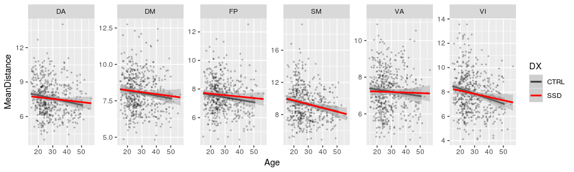

# 04 PINT displacement stats

# Stats on the PINT summary displacement values


```r
library(tidyverse)
```

```
## ── Attaching packages ──────────────────────────────────────────────────────────────── tidyverse 1.2.1 ──
```

```
## ✔ ggplot2 2.2.1     ✔ purrr   0.2.4
## ✔ tibble  1.3.4     ✔ dplyr   0.7.4
## ✔ tidyr   0.7.2     ✔ stringr 1.2.0
## ✔ readr   1.1.1     ✔ forcats 0.2.0
```

```
## ── Conflicts ─────────────────────────────────────────────────────────────────── tidyverse_conflicts() ──
## ✖ dplyr::filter() masks stats::filter()
## ✖ dplyr::lag()    masks stats::lag()
```

```r
library(broom)
```


## The paths to data


```r
output_base <- '../data/ciftify_fmriprep/'

Yeo7_2011_80verts <- read_csv("../templates/Yeo7_2011_80verts.csv",
                              col_types = c(
                                hemi = col_character(),
                                tvertex = col_integer(),
                                LRpairs = col_integer(),
                                roiidx = col_integer(),
                                NETWORK = col_integer(),
                                LOBE = col_character(),
                                SHORTNAME = col_character(),
                                x = col_integer(),
                                y = col_integer(),
                                z = col_integer()
                              ))

YeoNet_colours = list("VI" = "#781286",
                      "SM" = "#4682B4",
                      "DA" = "#00760E", 
                      "VA" = "#C43AFA",
                      "DM" = "#CD3E3A", 
                      "FP" = "#E69422")

## adding a subid that matches what the concatenation script adds..
pheno <- read_csv('../phenotypic/20181118_pheno_qapass.csv') %>%
  mutate(subid = str_replace(filename, '_summary.csv','')) %>%
  drop_na(DX)
```

```
## Parsed with column specification:
## cols(
##   .default = col_character(),
##   fd_mean = col_double(),
##   fd_num = col_integer(),
##   fd_perc = col_double(),
##   size_t = col_integer(),
##   size_z = col_integer(),
##   spacing_tr = col_integer(),
##   spacing_z = col_double(),
##   num_rest = col_integer(),
##   num_t1w = col_integer(),
##   num_scans = col_integer(),
##   Age = col_double(),
##   GRID = col_integer(),
##   zhh_session_id = col_integer(),
##   MRI_Date = col_double(),
##   Edu = col_integer(),
##   Age_pt = col_double(),
##   fd_mean_pt = col_double()
## )
```

```
## See spec(...) for full column specifications.
```

```r
pint_concat <- read_csv('../data/ciftify_fmriprep/postPINT1_concat_all_qa_passes.csv')
```

```
## Parsed with column specification:
## cols(
##   subid = col_character(),
##   hemi = col_character(),
##   NETWORK = col_integer(),
##   roiidx = col_integer(),
##   tvertex = col_integer(),
##   pvertex = col_integer(),
##   dist_49 = col_double(),
##   vertex_48 = col_integer(),
##   std_distance = col_double()
## )
```

```r
pheno %>%  
  select(subject) %>%
  distinct() %>%
  count()
```

```
## # A tibble: 1 x 1
##       n
##   <int>
## 1   494
```

```r
ana_data <- pheno %>%
  inner_join(pint_concat, by = "subid") %>%
  inner_join(Yeo7_2011_80verts, by = "roiidx") %>%
  mutate(network = str_sub(SHORTNAME, 1,2))
```

## run for the whole head


```r
dist_by_total <- pint_concat %>%
  group_by(subid) %>%
  summarise(MeanDistance = mean(std_distance)) %>%
  ungroup() %>%
  inner_join(pheno, by = "subid")  

dist_by_total %>%
  ungroup() %>%
  do(tidy(lm(MeanDistance ~ DX+ Age_pt + Sex + fd_mean_pt + Scanner,.))) %>%
  mutate(p_bonf = p.value*6) %>%
  knitr::kable()
```


term                      estimate   std.error    statistic     p.value      p_bonf
---------------------  -----------  ----------  -----------  ----------  ----------
(Intercept)              6.1176236   1.5255051    4.0102282   0.0000702   0.0004213
DXSSD                   -0.1123855   0.0625583   -1.7964927   0.0730383   0.4382300
Age_pt                   3.4580880   1.0694480    3.2335262   0.0013061   0.0078364
SexM                    -0.0553767   0.0605780   -0.9141382   0.3610984   2.1665906
fd_mean_pt               1.3388151   1.6391802    0.8167589   0.4144672   2.4868032
ScannerCOBRE            -0.3570844   0.1117676   -3.1948819   0.0014900   0.0089399
Scannerds00003035343    -0.5897447   0.0948378   -6.2184554   0.0000000   0.0000000
Scannerds00003035426    -0.5485983   0.1237347   -4.4336661   0.0000115   0.0000688
ScannerZHH               0.0538056   0.0792113    0.6792660   0.4972934   2.9837601


```r
dist_by_total %>%
  ggplot(aes(y = MeanDistance, x = Age)) +
  geom_point(aes(color = Site)) + 
  geom_smooth(method = "lm")+
  facet_wrap(~DX) +
  theme_bw()
```

<!-- -->


```r
dist_by_network <- pint_concat %>%
  inner_join(Yeo7_2011_80verts, by = "roiidx") %>%
  mutate(network = str_sub(SHORTNAME, 1,2)) %>%
  group_by(subid, network) %>%
  summarise(MeanDistance = mean(std_distance)) %>%
  ungroup() %>%
  inner_join(pheno, by = "subid")  

dist_by_network %>%
  ungroup() %>% group_by(network) %>%
  do(tidy(aov(lm(MeanDistance ~ DX + Age_pt + Sex + fd_mean_pt + Scanner,.)))) %>%
  mutate(p_bonf = p.value*6) %>%
  filter(!(term %in% c('Intercept', 'ScannerCOBRE', 'Scannerds00003035343', 'ScannerZHH', 'Scannerds00003035426'))) %>%
  select(network, term, df, statistic, p.value, p_bonf) %>%
  knitr::kable()
```


network   term           df    statistic     p.value      p_bonf
--------  -----------  ----  -----------  ----------  ----------
DA        DX              1    0.3527117   0.5528590   3.3171540
DA        Age_pt          1   11.9866257   0.0005832   0.0034994
DA        Sex             1    0.0000741   0.9931348   5.9588088
DA        fd_mean_pt      1    0.3412489   0.5593808   3.3562850
DA        Scanner         4    5.5630798   0.0002195   0.0013170
DA        Residuals     485           NA          NA          NA
DM        DX              1    0.1061573   0.7447027   4.4682163
DM        Age_pt          1    5.1601676   0.0235479   0.1412875
DM        Sex             1    6.0387759   0.0143439   0.0860636
DM        fd_mean_pt      1    3.0454951   0.0815948   0.4895685
DM        Scanner         4    5.7893129   0.0001475   0.0008851
DM        Residuals     485           NA          NA          NA
FP        DX              1    1.1969817   0.2744688   1.6468130
FP        Age_pt          1    4.1133349   0.0430924   0.2585546
FP        Sex             1    0.9958371   0.3188175   1.9129051
FP        fd_mean_pt      1    3.5102063   0.0615930   0.3695579
FP        Scanner         4    1.4778892   0.2076771   1.2460624
FP        Residuals     485           NA          NA          NA
SM        DX              1    0.0870410   0.7680994   4.6085964
SM        Age_pt          1   16.5581777   0.0000551   0.0003304
SM        Sex             1    0.0125229   0.9109444   5.4656663
SM        fd_mean_pt      1    1.8367485   0.1759633   1.0557801
SM        Scanner         4    5.0183350   0.0005699   0.0034192
SM        Residuals     485           NA          NA          NA
VA        DX              1    0.1435940   0.7048997   4.2293984
VA        Age_pt          1    1.8885688   0.1699981   1.0199888
VA        Sex             1    0.4092336   0.5226608   3.1359650
VA        fd_mean_pt      1    0.1003438   0.7515538   4.5093227
VA        Scanner         4    6.6579047   0.0000319   0.0001917
VA        Residuals     485           NA          NA          NA
VI        DX              1    0.3137956   0.5756190   3.4537139
VI        Age_pt          1   16.3722390   0.0000605   0.0003633
VI        Sex             1    1.3564658   0.2447235   1.4683408
VI        fd_mean_pt      1    0.8482317   0.3575109   2.1450656
VI        Scanner         4    6.0904838   0.0000868   0.0005211
VI        Residuals     485           NA          NA          NA


```r
dist_by_network %>%
  ggplot(aes(y = MeanDistance, x = Age)) +
  geom_point(alpha = 0.5) + 
  geom_smooth(aes(color = DX), method = "lm") +
  facet_wrap(~network, scales = "free")
```

<!-- -->


## run linear model per edge


```r
roi_dx_lm <- ana_data %>%
  ungroup() %>% group_by(SHORTNAME) %>%
  do(tidy(lm(std_distance ~ DX + Sex + fd_mean_pt + Age_pt + Scanner,.))) %>%
  ungroup() %>% group_by(term) %>%
  mutate(p_fdr  = p.adjust(p.value, method = 'fdr'))

roi_dx_lm %>%
  filter(term != "(Intercept)") %>%
  filter(p_fdr < 0.1)
```

```
## # A tibble: 8 x 7
## # Groups:   term [3]
##   SHORTNAME                 term  estimate std.error statistic
##       <chr>                <chr>     <dbl>     <dbl>     <dbl>
## 1     DAT1L Scannerds00003035343 -1.277533 0.4469386 -2.858407
## 2     DMF3L Scannerds00003035343 -2.280694 0.8296400 -2.749016
## 3     DMP1L           ScannerZHH -1.692721 0.5042788 -3.356717
## 4     SMF3L Scannerds00003035343 -3.043261 0.9213660 -3.302988
## 5     VAF1L Scannerds00003035343 -1.700004 0.5889422 -2.886538
## 6     VAF4L           ScannerZHH  1.973605 0.5305342  3.720035
## 7     VI01L Scannerds00003035343 -2.014350 0.6027273 -3.342058
## 8     VI03L               Age_pt 34.322464 8.5298992  4.023783
## # ... with 2 more variables: p.value <dbl>, p_fdr <dbl>
```
