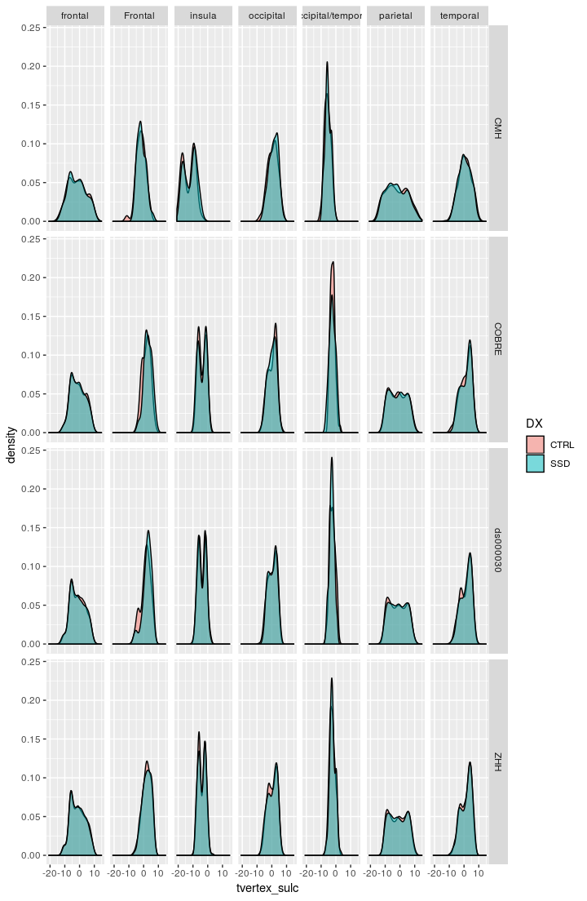
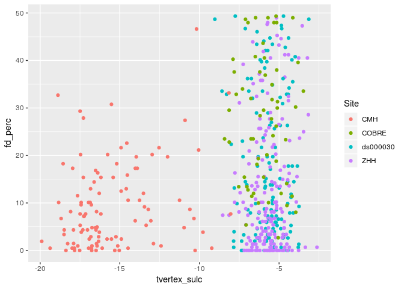
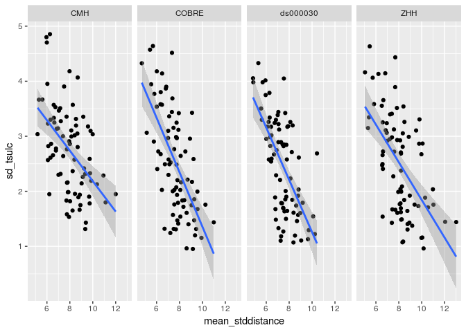
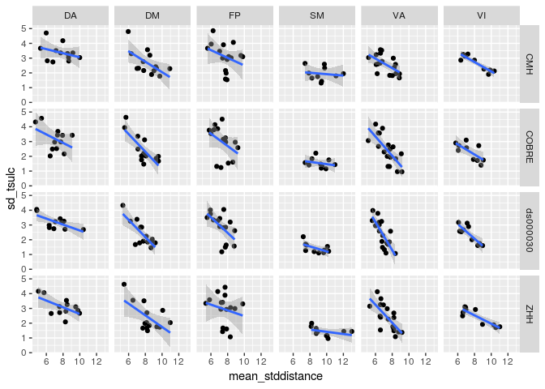
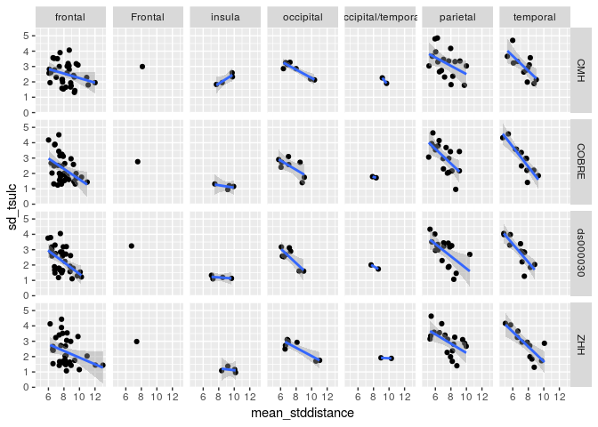
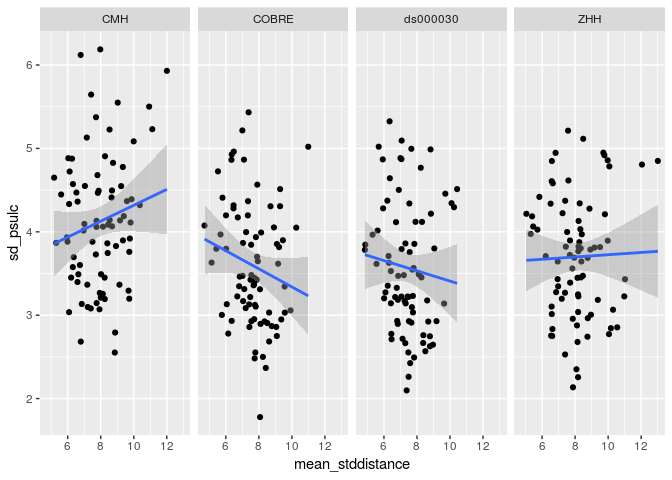
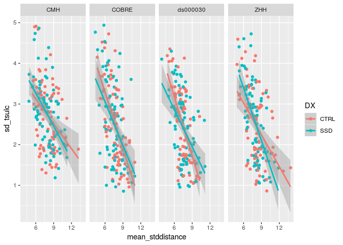
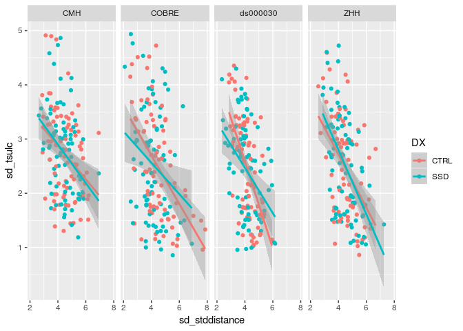
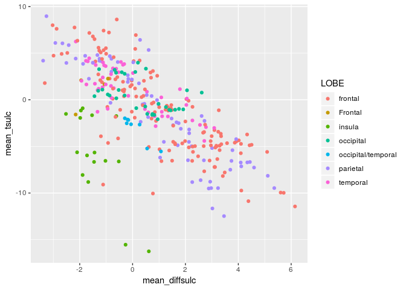
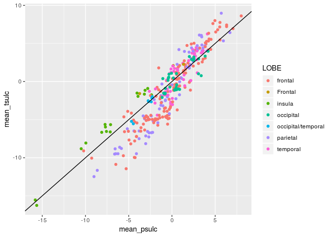

# Sulcal Depth Results


```r
library(tidyverse)
```

```
## ── Attaching packages ────────────────────────────────────────────────────────────────────────────────────────────── tidyverse 1.2.1 ──
```

```
## ✔ ggplot2 3.1.0       ✔ purrr   0.2.5  
## ✔ tibble  2.0.1       ✔ dplyr   0.8.0.1
## ✔ tidyr   0.8.2       ✔ stringr 1.3.1  
## ✔ readr   1.3.0       ✔ forcats 0.3.0
```

```
## ── Conflicts ───────────────────────────────────────────────────────────────────────────────────────────────── tidyverse_conflicts() ──
## ✖ dplyr::filter() masks stats::filter()
## ✖ dplyr::lag()    masks stats::lag()
```

```r
library(broom)
```

## The paths to data


```r
output_base <- '../data/ciftify_fmriprep/'

Yeo7_2011_80verts <- read_csv("../templates/Yeo7_2011_80verts.csv",
                              col_types = c(
                                hemi = col_character(),
                                tvertex = col_integer(),
                                LRpairs = col_integer(),
                                roiidx = col_integer(),
                                NETWORK = col_integer(),
                                LOBE = col_character(),
                                SHORTNAME = col_character(),
                                x = col_integer(),
                                y = col_integer(),
                                z = col_integer()
                              ))

YeoNet_colours = list("VI" = "#781286",
                      "SM" = "#4682B4",
                      "DA" = "#00760E", 
                      "VA" = "#C43AFA",
                      "DM" = "#CD3E3A", 
                      "FP" = "#E69422")

pheno <- read_csv('../phenotypic/20190301_pheno_qapass.csv') 
```

```
## Parsed with column specification:
## cols(
##   .default = col_double(),
##   dataset = col_character(),
##   subject_id.x = col_character(),
##   session_id = col_character(),
##   task_id.x = col_character(),
##   run_id = col_character(),
##   acq_id = col_character(),
##   subject = col_character(),
##   session = col_character(),
##   studyname = col_character(),
##   subject_id.y = col_character(),
##   task_id.y = col_character(),
##   cmh_session_id = col_character(),
##   DX = col_character(),
##   Sex = col_character(),
##   Site = col_character(),
##   Scanner = col_character(),
##   isFEP = col_character(),
##   ghost_NoGhost = col_character(),
##   filename = col_character()
## )
```

```
## See spec(...) for full column specifications.
```

```r
pint_concat <- read_csv('../data/ciftify_fmriprep/postPINT1_concat_all_qa_passes.csv')
```

```
## Parsed with column specification:
## cols(
##   subid = col_character(),
##   hemi = col_character(),
##   NETWORK = col_double(),
##   roiidx = col_double(),
##   tvertex = col_double(),
##   pvertex = col_double(),
##   dist_49 = col_double(),
##   vertex_48 = col_double(),
##   std_distance = col_double()
## )
```


These functions are for reading timeseries files


```r
#' read a meants file generated by PINT of ciftify_meants
#'
#' @param filepath the full path to the file
#'
#' @return a dataframe where rows are rois and colums are timepoints
read_meants_csv <- function(filepath) {
   meants <-read_csv(filepath, 
                     col_names = FALSE,
                     col_types = c(.default = col_double()))
   return(meants)
}


#' Contructs the expected output prefix from subid session and func_base
#'
#' @param subid The subject identifier
#' @param sessid The session identifier (or null)
#' @param func_base The functional file prefix
#'
#' @return an output prefix string for the filenames
construct_output_prefix <- function(subid, sessid, func_base) {
  prefix <- if_else(is.na(sessid),
                    file.path(subid, str_c(subid, '_', func_base)),
                    file.path(subid, sessid, 
                      str_c(subid, '_', sessid, '_', func_base)))
  return(prefix)
}

#' get func_base from pint summary filename
#'
#' @param subid The subject identifier
#' @param sessid The session identifier (or null)
#' @param func_base The functional file prefix
#'
#' @return an output prefix string for the filenames
get_func_base_from_pint_summary_filename <- function(filename, subject, session) {
  func_base <- if_else(is.na(session), 
                       filename %>%
                         str_replace(str_c(subject, "_"), '') %>%
                         str_replace('_desc-clean_bold_summary.csv',''),
                       filename %>%
                         str_replace(subject, '') %>%
                         str_replace(session, '') %>% 
                         str_replace('__','') %>%
                         str_replace('_desc-clean_bold_summary.csv',''))
  return(func_base)
}
```

Write a func_base and outputprefix cols into the pheno file for the file reading step


```r
pheno <- pheno %>%
  mutate(func_base = get_func_base_from_pint_summary_filename(filename,subject, session), 
         outputprefix = construct_output_prefix(subject, session, func_base)) 
```


## check that sulcal depth has been calculated in all participants


```r
sulc_summarys_wses <- Sys.glob("../data/ciftify_fmriprep/*/out/ciftify_PINT/sub*/ses*/*pvertexROI_morph.csv")

sulc_summarys_nses <- Sys.glob("../data/ciftify_fmriprep/*/out/ciftify_PINT/sub*/*pvertexROI_morph.csv")

sulcdf_nses <- tibble(filepath = sulc_summarys_nses) %>%
  separate(filepath,
           into = c('1','2','3','dataset','4','5','subject', 'sfilename'),
           sep = .Platform$file.sep) %>%
  select(dataset, subject, sfilename)

sulcdf_wses <- tibble(filepath = sulc_summarys_wses) %>%
  separate(filepath,
           into = c('1','2','3','dataset','4','5','subject', 'session', 'sfilename'),
           sep = .Platform$file.sep) %>%
  select(dataset, subject, session, sfilename)

sulcdf <- bind_rows(sulcdf_wses, sulcdf_nses) %>%
  mutate(filename = str_replace(sfilename, 'desc-sulc_atlas-pvertexROI_morph','desc-clean_bold_summary'))

rm(sulc_summarys_nses, sulc_summarys_wses, sulcdf_nses, sulcdf_wses)
```


```r
pheno %>%
  anti_join(sulcdf, by="filename")
```

<div data-pagedtable="false">
  <script data-pagedtable-source type="application/json">
{"columns":[{"label":["dataset"],"name":[1],"type":["chr"],"align":["left"]},{"label":["subject_id.x"],"name":[2],"type":["chr"],"align":["left"]},{"label":["session_id"],"name":[3],"type":["chr"],"align":["left"]},{"label":["task_id.x"],"name":[4],"type":["chr"],"align":["left"]},{"label":["run_id"],"name":[5],"type":["chr"],"align":["left"]},{"label":["acq_id"],"name":[6],"type":["chr"],"align":["left"]},{"label":["fd_mean"],"name":[7],"type":["dbl"],"align":["right"]},{"label":["fd_num"],"name":[8],"type":["dbl"],"align":["right"]},{"label":["fd_perc"],"name":[9],"type":["dbl"],"align":["right"]},{"label":["size_t"],"name":[10],"type":["dbl"],"align":["right"]},{"label":["size_z"],"name":[11],"type":["dbl"],"align":["right"]},{"label":["spacing_tr"],"name":[12],"type":["dbl"],"align":["right"]},{"label":["spacing_z"],"name":[13],"type":["dbl"],"align":["right"]},{"label":["subject"],"name":[14],"type":["chr"],"align":["left"]},{"label":["session"],"name":[15],"type":["chr"],"align":["left"]},{"label":["studyname"],"name":[16],"type":["chr"],"align":["left"]},{"label":["subject_id.y"],"name":[17],"type":["chr"],"align":["left"]},{"label":["task_id.y"],"name":[18],"type":["chr"],"align":["left"]},{"label":["num_rest"],"name":[19],"type":["dbl"],"align":["right"]},{"label":["num_t1w"],"name":[20],"type":["dbl"],"align":["right"]},{"label":["num_scans"],"name":[21],"type":["dbl"],"align":["right"]},{"label":["cmh_session_id"],"name":[22],"type":["chr"],"align":["left"]},{"label":["DX"],"name":[23],"type":["chr"],"align":["left"]},{"label":["Age"],"name":[24],"type":["dbl"],"align":["right"]},{"label":["Sex"],"name":[25],"type":["chr"],"align":["left"]},{"label":["Site"],"name":[26],"type":["chr"],"align":["left"]},{"label":["Scanner"],"name":[27],"type":["chr"],"align":["left"]},{"label":["GRID"],"name":[28],"type":["dbl"],"align":["right"]},{"label":["zhh_session_id"],"name":[29],"type":["dbl"],"align":["right"]},{"label":["MRI_Date"],"name":[30],"type":["dbl"],"align":["right"]},{"label":["Edu"],"name":[31],"type":["dbl"],"align":["right"]},{"label":["isFEP"],"name":[32],"type":["chr"],"align":["left"]},{"label":["ghost_NoGhost"],"name":[33],"type":["chr"],"align":["left"]},{"label":["LSurfArea"],"name":[34],"type":["dbl"],"align":["right"]},{"label":["RSurfArea"],"name":[35],"type":["dbl"],"align":["right"]},{"label":["SurfArea"],"name":[36],"type":["dbl"],"align":["right"]},{"label":["filename"],"name":[37],"type":["chr"],"align":["left"]},{"label":["Age_pt"],"name":[38],"type":["dbl"],"align":["right"]},{"label":["fd_mean_pt"],"name":[39],"type":["dbl"],"align":["right"]},{"label":["SurfArea_pt"],"name":[40],"type":["dbl"],"align":["right"]},{"label":["func_base"],"name":[41],"type":["chr"],"align":["left"]},{"label":["outputprefix"],"name":[42],"type":["chr"],"align":["left"]}],"data":[],"options":{"columns":{"min":{},"max":[10]},"rows":{"min":[10],"max":[10]},"pages":{}}}
  </script>
</div>

## Known issues

one of the RTMSWM failed when Jerry reprossed them all..so now it is missing surface..urg..will exclude for now


```r
pheno <- pheno %>% filter(subject != "sub-CMHWM040")
```


```r
read_sulc_depth <- function(dataset, outputprefix) {
  pvertex_path <- file.path(output_base, dataset, 'out','ciftify_PINT',
                                  str_c(outputprefix, '_desc-sulc_atlas-pvertexROI_morph.csv'))
  pvertex_sulc <- read_meants_csv(pvertex_path) %>% rename(pvertex_sulc = X1)
  tvertex_path <- str_replace(pvertex_path, 'pvertexROI','tvertexROI')
  tvertex_sulc <- read_meants_csv(tvertex_path) %>% rename(tvertex_sulc = X1)
  results <- bind_cols(roiidx = 1:80, pvertex_sulc, tvertex_sulc)
}

all_sulcs <- pheno %>%
  select(dataset, subject, fd_mean_pt, fd_perc, DX, Age, Age_pt, Sex, Site, Scanner, outputprefix, filename) %>%
  mutate(sulcs = map2(dataset, outputprefix, ~read_sulc_depth(.x,.y))) %>%
  unnest()
```


```r
all_sulcs %>%
  drop_na(DX) %>%
  group_by(roiidx, Site) %>%
  do(tidy(lm(tvertex_sulc ~ DX + Sex + fd_mean_pt + poly(Age_pt,2),.))) %>%
  ungroup() %>% group_by(term) %>%
  mutate(p_FDR = p.adjust(p.value, method = "fdr")) %>%
  inner_join(Yeo7_2011_80verts, by = "roiidx") %>%
  filter(term != "(Intercept)", p_FDR < 0.1) %>%
  arrange(p.value)
```

<div data-pagedtable="false">
  <script data-pagedtable-source type="application/json">
{"columns":[{"label":["roiidx"],"name":[1],"type":["dbl"],"align":["right"]},{"label":["Site"],"name":[2],"type":["chr"],"align":["left"]},{"label":["term"],"name":[3],"type":["chr"],"align":["left"]},{"label":["estimate"],"name":[4],"type":["dbl"],"align":["right"]},{"label":["std.error"],"name":[5],"type":["dbl"],"align":["right"]},{"label":["statistic"],"name":[6],"type":["dbl"],"align":["right"]},{"label":["p.value"],"name":[7],"type":["dbl"],"align":["right"]},{"label":["p_FDR"],"name":[8],"type":["dbl"],"align":["right"]},{"label":["hemi"],"name":[9],"type":["chr"],"align":["left"]},{"label":["tvertex"],"name":[10],"type":["dbl"],"align":["right"]},{"label":["LRpairs"],"name":[11],"type":["dbl"],"align":["right"]},{"label":["NETWORK"],"name":[12],"type":["dbl"],"align":["right"]},{"label":["LOBE"],"name":[13],"type":["chr"],"align":["left"]},{"label":["SHORTNAME"],"name":[14],"type":["chr"],"align":["left"]},{"label":["x"],"name":[15],"type":["dbl"],"align":["right"]},{"label":["y"],"name":[16],"type":["dbl"],"align":["right"]},{"label":["z"],"name":[17],"type":["dbl"],"align":["right"]}],"data":[{"1":"49","2":"CMH","3":"SexM","4":"1.546319","5":"0.3671411","6":"4.211785","7":"5.512902e-05","8":"0.01764129","9":"L","10":"18804","11":"25","12":"4","13":"frontal","14":"VAF4L","15":"-53","16":"8","17":"1"},{"1":"4","2":"ds000030","3":"fd_mean_pt","4":"49.296420","5":"12.7952587","6":"3.852710","7":"1.826221e-04","8":"0.05843906","9":"R","10":"19537","11":"2","12":"3","13":"frontal","14":"DAF2R","15":"49","16":"6","17":"28"},{"1":"18","2":"CMH","3":"SexM","4":"-1.754717","5":"0.4519813","6":"-3.882279","7":"1.848033e-04","8":"0.02956853","9":"R","10":"28175","11":"9","12":"7","13":"frontal","14":"DMF3R","15":"9","16":"44","17":"-5"},{"1":"53","2":"CMH","3":"SexM","4":"1.392928","5":"0.3734294","6":"3.730096","7":"3.162855e-04","8":"0.03373712","9":"L","10":"10782","11":"27","12":"4","13":"insula","14":"VAI1L","15":"-37","16":"9","17":"-1"},{"1":"50","2":"CMH","3":"SexM","4":"1.719576","5":"0.5098762","6":"3.372537","7":"1.056876e-03","8":"0.08455008","9":"R","10":"18804","11":"25","12":"4","13":"frontal","14":"VAF4R","15":"55","16":"9","17":"3"}],"options":{"columns":{"min":{},"max":[10]},"rows":{"min":[10],"max":[10]},"pages":{}}}
  </script>
</div>

```r
all_sulcs %>%
  drop_na(DX) %>%
  inner_join(Yeo7_2011_80verts, by = "roiidx") %>%
  ggplot(aes(x = tvertex_sulc, fill = DX)) + geom_density(alpha = 0.5) + facet_grid(Site~LOBE) 
```

<!-- -->


```r
all_sulcs %>%
  drop_na(DX) %>%
  filter(roiidx == 68) %>%
  ggplot(aes(x = tvertex_sulc, y = fd_perc, color = Site)) + geom_point()
```

<!-- -->


```r
concat_plus_sulc <- all_sulcs %>% 
  mutate(subid = str_replace(filename, '_summary.csv','')) %>%
  inner_join(pint_concat, by = c("subid", "roiidx"))
```


```r
dist_plus_sulc_by_net <- concat_plus_sulc %>%
  mutate(diff_sulc = pvertex_sulc - tvertex_sulc) %>%
  group_by(roiidx, Site) %>%
  summarise(mean_tsulc = mean(tvertex_sulc),
    mean_psulc = mean(pvertex_sulc),
    sd_tsulc = sd(tvertex_sulc),
            sd_psulc = sd(pvertex_sulc),
            sd_diffsulc = sd(diff_sulc),
            mean_diffsulc = mean(diff_sulc),
            mean_stddistance = mean(std_distance),
            sd_stddistance = sd(std_distance)) %>%
  inner_join(Yeo7_2011_80verts, by = "roiidx") %>%
  mutate(network = str_sub(SHORTNAME, 1,2))
```


```r
dist_plus_sulc_by_net %>%
  ggplot(aes(x = mean_stddistance, y = sd_tsulc)) +
  geom_point() +
  geom_smooth(method = "lm") +
  facet_wrap(~Site, ncol = 4)
```

<!-- -->

```r
dist_plus_sulc_by_net %>%
  ggplot(aes(x = mean_stddistance, y = sd_tsulc)) +
  geom_point() +
  geom_smooth(method = "lm") +
  facet_grid(Site~network)
```

<!-- -->

```r
dist_plus_sulc_by_net %>%
  ggplot(aes(x = mean_stddistance, y = sd_tsulc)) +
  geom_point() +
  geom_smooth(method = "lm") +
  facet_grid(Site~LOBE)
```

```
## Warning in qt((1 - level)/2, df): NaNs produced

## Warning in qt((1 - level)/2, df): NaNs produced

## Warning in qt((1 - level)/2, df): NaNs produced

## Warning in qt((1 - level)/2, df): NaNs produced
```

<!-- -->

```r
dist_plus_sulc_by_net %>%
  ggplot(aes(x = mean_stddistance, y = sd_psulc)) +
  geom_point() +
  geom_smooth(method = "lm") +
  facet_wrap(~Site, ncol = 4)
```

<!-- -->


```r
dist_plus_sulc_by_net_dx <- concat_plus_sulc %>%
  mutate(diff_sulc = pvertex_sulc - tvertex_sulc) %>%
  group_by(roiidx, Site, DX) %>%
  summarise(sd_tsulc = sd(tvertex_sulc),
            sd_psulc = sd(pvertex_sulc),
            sd_diffsulc = sd(diff_sulc),
            mean_diffsulc = mean(diff_sulc),
            mean_stddistance = mean(std_distance),
            sd_stddistance = sd(std_distance)) %>%
  inner_join(Yeo7_2011_80verts, by = "roiidx") %>%
  mutate(network = str_sub(SHORTNAME, 1,2))
```


```r
dist_plus_sulc_by_net_dx %>%
  ggplot(aes(x = mean_stddistance, y = sd_tsulc, color = DX)) +
  geom_point() +
  geom_smooth(method = "lm") +
  facet_grid(~Site)
```

<!-- -->


```r
dist_plus_sulc_by_net_dx %>%
  ggplot(aes(x = sd_stddistance, y = sd_tsulc, color = DX)) +
  geom_point() +
  geom_smooth(method = "lm") +
  facet_wrap(~Site, ncol = 4)
```

<!-- -->


```r
dist_plus_sulc_by_net %>%
  ungroup() %>%
  select(mean_tsulc:sd_stddistance) %>%
  cor()
```

```
##                    mean_tsulc  mean_psulc    sd_tsulc    sd_psulc
## mean_tsulc        1.000000000  0.91361100  0.14558617 -0.10541499
## mean_psulc        0.913610996  1.00000000  0.23051894 -0.04876484
## sd_tsulc          0.145586173  0.23051894  1.00000000  0.39245584
## sd_psulc         -0.105414995 -0.04876484  0.39245584  1.00000000
## sd_diffsulc       0.007357708  0.08109419  0.60238373  0.89809156
## mean_diffsulc    -0.697021163 -0.34526104  0.07048914  0.15732289
## mean_stddistance -0.317715412 -0.31123115 -0.55425750  0.02427686
## sd_stddistance   -0.153480572 -0.24217014 -0.49750757  0.01068584
##                   sd_diffsulc mean_diffsulc mean_stddistance
## mean_tsulc        0.007357708   -0.69702116      -0.31771541
## mean_psulc        0.081094189   -0.34526104      -0.31123115
## sd_tsulc          0.602383733    0.07048914      -0.55425750
## sd_psulc          0.898091558    0.15732289       0.02427686
## sd_diffsulc       1.000000000    0.12603224      -0.06493111
## mean_diffsulc     0.126032241    1.00000000       0.18448482
## mean_stddistance -0.064931110    0.18448482       1.00000000
## sd_stddistance   -0.071753297   -0.07281471       0.78516975
##                  sd_stddistance
## mean_tsulc          -0.15348057
## mean_psulc          -0.24217014
## sd_tsulc            -0.49750757
## sd_psulc             0.01068584
## sd_diffsulc         -0.07175330
## mean_diffsulc       -0.07281471
## mean_stddistance     0.78516975
## sd_stddistance       1.00000000
```


```r
dist_plus_sulc_by_net %>%
  ggplot(aes(x = mean_diffsulc, y = mean_tsulc, color = LOBE)) + geom_point()
```

<!-- -->


```r
dist_plus_sulc_by_net %>%
  ggplot(aes(x = mean_psulc, y = mean_tsulc, color = LOBE)) + geom_point() +
  geom_abline(slope = 1, intercept = 0)
```

<!-- -->
