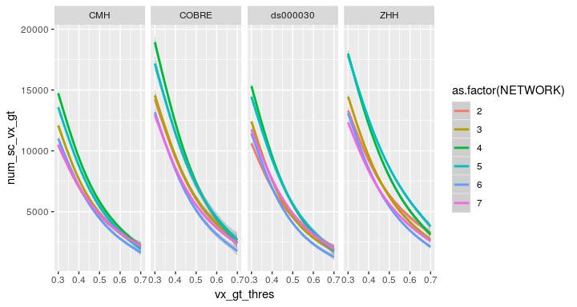
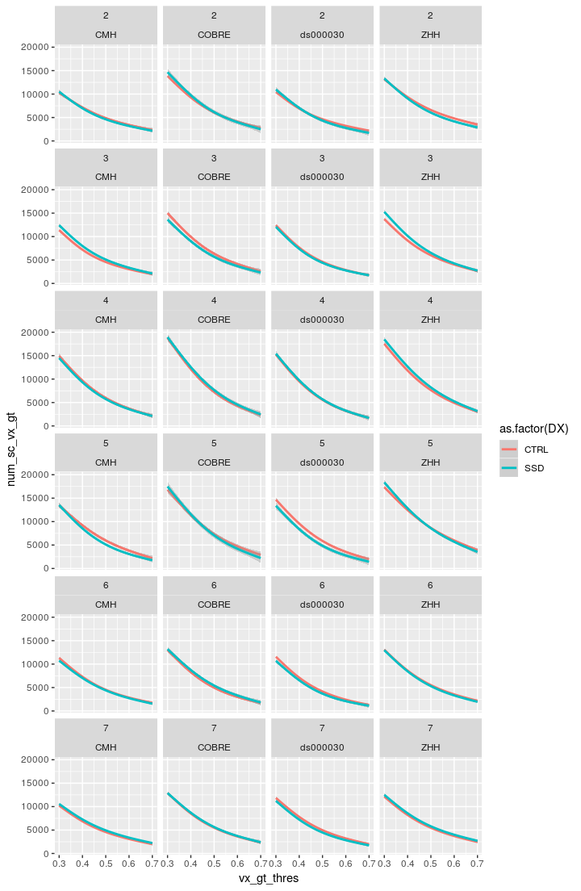
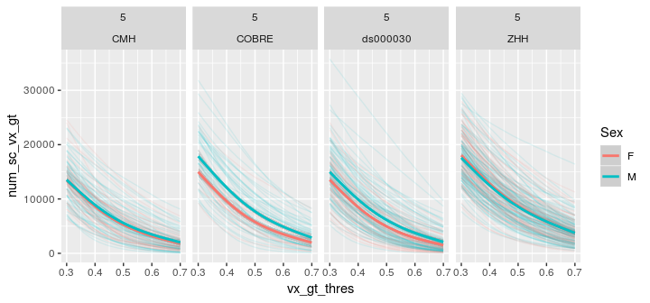
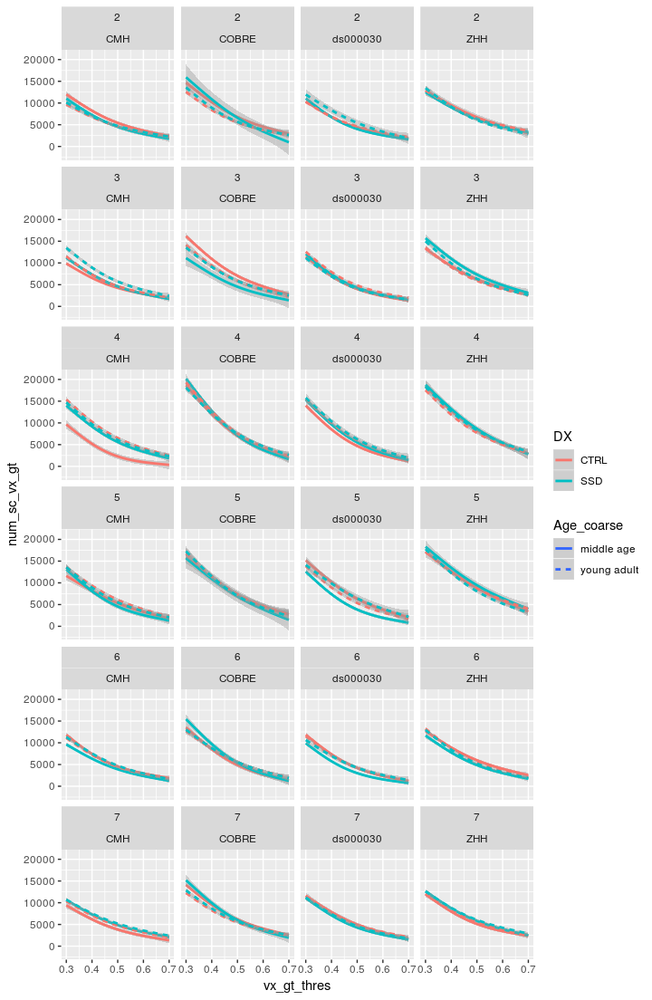
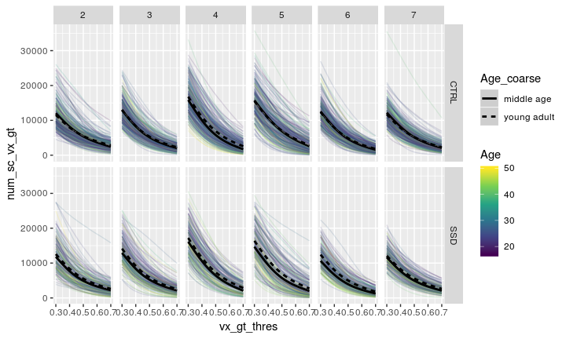
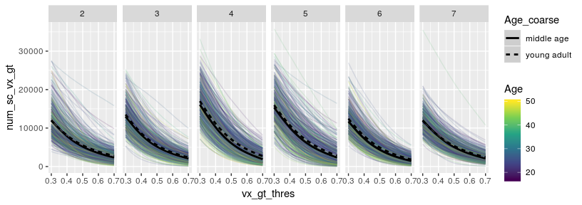
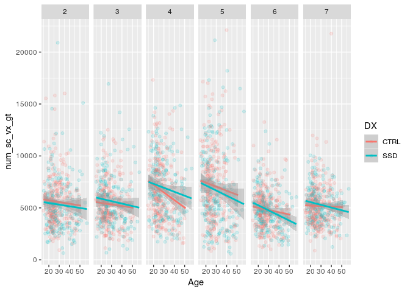

# Seedcorr Area Stats


```r
library(tidyverse)
```

```
## ── Attaching packages ────────────────────────────────────────────────────────────────────────────────────────────── tidyverse 1.2.1 ──
```

```
## ✔ ggplot2 3.1.0       ✔ purrr   0.2.5  
## ✔ tibble  2.0.1       ✔ dplyr   0.8.0.1
## ✔ tidyr   0.8.2       ✔ stringr 1.3.1  
## ✔ readr   1.3.0       ✔ forcats 0.3.0
```

```
## ── Conflicts ───────────────────────────────────────────────────────────────────────────────────────────────── tidyverse_conflicts() ──
## ✖ dplyr::filter() masks stats::filter()
## ✖ dplyr::lag()    masks stats::lag()
```

```r
library(broom)
```

## The paths to data


```r
output_base <- '../data/ciftify_fmriprep/'

Yeo7_2011_80verts <- read_csv("../templates/Yeo7_2011_80verts.csv",
                              col_types = c(
                                hemi = col_character(),
                                tvertex = col_integer(),
                                LRpairs = col_integer(),
                                roiidx = col_integer(),
                                NETWORK = col_integer(),
                                LOBE = col_character(),
                                SHORTNAME = col_character(),
                                x = col_integer(),
                                y = col_integer(),
                                z = col_integer()
                              ))

YeoNet_colours = list("VI" = "#781286",
                      "SM" = "#4682B4",
                      "DA" = "#00760E", 
                      "VA" = "#C43AFA",
                      "DM" = "#CD3E3A", 
                      "FP" = "#E69422")

pheno <- read_csv('../phenotypic/20190301_pheno_qapass.csv') %>% drop_na(DX) 
```

```
## Parsed with column specification:
## cols(
##   .default = col_double(),
##   dataset = col_character(),
##   subject_id.x = col_character(),
##   session_id = col_character(),
##   task_id.x = col_character(),
##   run_id = col_character(),
##   acq_id = col_character(),
##   subject = col_character(),
##   session = col_character(),
##   studyname = col_character(),
##   subject_id.y = col_character(),
##   task_id.y = col_character(),
##   cmh_session_id = col_character(),
##   DX = col_character(),
##   Sex = col_character(),
##   Site = col_character(),
##   Scanner = col_character(),
##   isFEP = col_character(),
##   ghost_NoGhost = col_character(),
##   filename = col_character()
## )
```

```
## See spec(...) for full column specifications.
```

```r
pint_sc <- read_csv('../data/ciftify_fmriprep/qa_passes_seedcor_counts_20181116.csv')
```

```
## Warning: Missing column names filled in: 'X1' [1]
```

```
## Warning: Duplicated column names deduplicated: 'index' => 'index_1' [7]
```

```
## Parsed with column specification:
## cols(
##   .default = col_double(),
##   dataset = col_character(),
##   subject = col_character(),
##   session = col_character(),
##   filename = col_character()
## )
## See spec(...) for full column specifications.
```


Write a func_base and outputprefix cols into the pheno file for the file reading step


```r
combined_df <- pheno %>%
  inner_join(pint_sc, by = c("dataset", "subject", "session")) %>%
  gather(gt_name, num_sc_vx_gt, starts_with('gt_')) %>%
  mutate(vx_gt_thres = gt_name %>% str_replace('gt_','') %>% parse_double()) %>%
  drop_na(num_sc_vx_gt)

combined_df %>% count(subject) %>% nrow()
```

```
## [1] 492
```

## Known issues

Looks like two people might need to be reprocessed if this works out.


```r
combined_df %>%
  drop_na(DX) %>%
  group_by(NETWORK, vx_gt_thres) %>%
  filter(Age > 17, Age < 51) %>%
  filter(vx_gt_thres < 0.6) %>%
  do(tidy(aov(lm(num_sc_vx_gt ~ DX*Age_pt + Sex + fd_mean_pt + Scanner + SurfArea_pt,.)))) %>%
  ungroup() %>% group_by(term) %>%
  mutate(p_FDR = p.adjust(p.value, method = "fdr")) %>%
  filter(term != "(Intercept)", term != "Scanner", p_FDR < 0.06) %>%
  arrange(NETWORK, term) 
```

<div data-pagedtable="false">
  <script data-pagedtable-source type="application/json">
{"columns":[{"label":["NETWORK"],"name":[1],"type":["dbl"],"align":["right"]},{"label":["vx_gt_thres"],"name":[2],"type":["dbl"],"align":["right"]},{"label":["term"],"name":[3],"type":["chr"],"align":["left"]},{"label":["df"],"name":[4],"type":["dbl"],"align":["right"]},{"label":["sumsq"],"name":[5],"type":["dbl"],"align":["right"]},{"label":["meansq"],"name":[6],"type":["dbl"],"align":["right"]},{"label":["statistic"],"name":[7],"type":["dbl"],"align":["right"]},{"label":["p.value"],"name":[8],"type":["dbl"],"align":["right"]},{"label":["p_FDR"],"name":[9],"type":["dbl"],"align":["right"]}],"data":[{"1":"4","2":"0.30","3":"Age_pt","4":"1","5":"152531218","6":"152531218","7":"8.859567","8":"3.070317e-03","9":"1.105314e-02"},{"1":"4","2":"0.32","3":"Age_pt","4":"1","5":"160358978","6":"160358978","7":"9.964085","8":"1.701779e-03","9":"8.061058e-03"},{"1":"4","2":"0.34","3":"Age_pt","4":"1","5":"168064298","6":"168064298","7":"11.245103","8":"8.647409e-04","9":"5.188446e-03"},{"1":"4","2":"0.36","3":"Age_pt","4":"1","5":"171594902","6":"171594902","7":"12.453913","8":"4.593534e-04","9":"3.445150e-03"},{"1":"4","2":"0.38","3":"Age_pt","4":"1","5":"173924564","6":"173924564","7":"13.789575","8":"2.297309e-04","9":"1.879617e-03"},{"1":"4","2":"0.40","3":"Age_pt","4":"1","5":"175888483","6":"175888483","7":"15.337990","8":"1.036095e-04","9":"9.324855e-04"},{"1":"4","2":"0.42","3":"Age_pt","4":"1","5":"174345377","6":"174345377","7":"16.833054","8":"4.833222e-05","9":"4.833222e-04"},{"1":"4","2":"0.44","3":"Age_pt","4":"1","5":"171696856","6":"171696856","7":"18.455926","8":"2.125642e-05","9":"2.391347e-04"},{"1":"4","2":"0.46","3":"Age_pt","4":"1","5":"167571097","6":"167571097","7":"20.129999","8":"9.166033e-06","9":"1.178490e-04"},{"1":"4","2":"0.48","3":"Age_pt","4":"1","5":"162344183","6":"162344183","7":"21.922878","8":"3.747295e-06","9":"5.620943e-05"},{"1":"4","2":"0.50","3":"Age_pt","4":"1","5":"157014096","6":"157014096","7":"23.917124","8":"1.395471e-06","9":"2.511848e-05"},{"1":"4","2":"0.52","3":"Age_pt","4":"1","5":"150255535","6":"150255535","7":"25.935083","8":"5.172464e-07","9":"1.163804e-05"},{"1":"4","2":"0.54","3":"Age_pt","4":"1","5":"141267761","6":"141267761","7":"27.654335","8":"2.232343e-07","9":"6.697028e-06"},{"1":"4","2":"0.56","3":"Age_pt","4":"1","5":"132613664","6":"132613664","7":"29.539669","8":"8.930079e-08","9":"4.018535e-06"},{"1":"4","2":"0.58","3":"Age_pt","4":"1","5":"122860987","6":"122860987","7":"31.236842","8":"3.931981e-08","9":"3.538783e-06"},{"1":"5","2":"0.38","3":"Age_pt","4":"1","5":"84146319","6":"84146319","7":"5.234230","8":"2.260253e-02","9":"4.961532e-02"},{"1":"5","2":"0.40","3":"Age_pt","4":"1","5":"86426525","6":"86426525","7":"5.685756","8":"1.751016e-02","9":"4.040806e-02"},{"1":"5","2":"0.42","3":"Age_pt","4":"1","5":"86742723","6":"86742723","7":"6.066621","8":"1.414365e-02","9":"3.440347e-02"},{"1":"5","2":"0.44","3":"Age_pt","4":"1","5":"87347390","6":"87347390","7":"6.523439","8":"1.096955e-02","9":"2.820742e-02"},{"1":"5","2":"0.46","3":"Age_pt","4":"1","5":"87383331","6":"87383331","7":"7.004388","8":"8.411678e-03","9":"2.294094e-02"},{"1":"5","2":"0.48","3":"Age_pt","4":"1","5":"84971931","6":"84971931","7":"7.343732","8":"6.982771e-03","9":"1.963904e-02"},{"1":"5","2":"0.50","3":"Age_pt","4":"1","5":"83521776","6":"83521776","7":"7.802853","8":"5.435468e-03","9":"1.630640e-02"},{"1":"5","2":"0.52","3":"Age_pt","4":"1","5":"81116566","6":"81116566","7":"8.223159","8":"4.327177e-03","9":"1.390878e-02"},{"1":"5","2":"0.54","3":"Age_pt","4":"1","5":"77915656","6":"77915656","7":"8.603773","8":"3.523318e-03","9":"1.200398e-02"},{"1":"5","2":"0.56","3":"Age_pt","4":"1","5":"73780796","6":"73780796","7":"8.917825","8":"2.975733e-03","9":"1.105314e-02"},{"1":"5","2":"0.58","3":"Age_pt","4":"1","5":"68644544","6":"68644544","7":"9.099797","8":"2.698987e-03","9":"1.104131e-02"},{"1":"6","2":"0.30","3":"Age_pt","4":"1","5":"51252027","6":"51252027","7":"5.018603","8":"2.555625e-02","9":"5.348984e-02"},{"1":"6","2":"0.32","3":"Age_pt","4":"1","5":"52587167","6":"52587167","7":"5.704974","8":"1.732187e-02","9":"4.040806e-02"},{"1":"6","2":"0.34","3":"Age_pt","4":"1","5":"52388784","6":"52388784","7":"6.311841","8":"1.233686e-02","9":"3.084214e-02"},{"1":"6","2":"0.36","3":"Age_pt","4":"1","5":"50979175","6":"50979175","7":"6.865081","8":"9.082226e-03","9":"2.404119e-02"},{"1":"6","2":"0.38","3":"Age_pt","4":"1","5":"49162871","6":"49162871","7":"7.422828","8":"6.687093e-03","9":"1.941414e-02"},{"1":"6","2":"0.40","3":"Age_pt","4":"1","5":"46624061","6":"46624061","7":"7.926543","8":"5.082059e-03","9":"1.577191e-02"},{"1":"6","2":"0.42","3":"Age_pt","4":"1","5":"44590351","6":"44590351","7":"8.563205","8":"3.601193e-03","9":"1.200398e-02"},{"1":"6","2":"0.44","3":"Age_pt","4":"1","5":"41144538","6":"41144538","7":"8.940212","8":"2.940182e-03","9":"1.105314e-02"},{"1":"6","2":"0.46","3":"Age_pt","4":"1","5":"37845575","6":"37845575","7":"9.313319","8":"2.407460e-03","9":"1.031769e-02"},{"1":"6","2":"0.48","3":"Age_pt","4":"1","5":"34859016","6":"34859016","7":"9.748240","8":"1.908838e-03","9":"8.589770e-03"},{"1":"6","2":"0.50","3":"Age_pt","4":"1","5":"31750066","6":"31750066","7":"10.097632","8":"1.585257e-03","9":"7.926285e-03"},{"1":"6","2":"0.52","3":"Age_pt","4":"1","5":"29248180","6":"29248180","7":"10.594862","8":"1.218234e-03","9":"6.449475e-03"},{"1":"6","2":"0.54","3":"Age_pt","4":"1","5":"26582675","6":"26582675","7":"10.971861","8":"9.984756e-04","9":"5.616425e-03"},{"1":"6","2":"0.56","3":"Age_pt","4":"1","5":"24208412","6":"24208412","7":"11.415058","8":"7.908776e-04","9":"5.084213e-03"},{"1":"6","2":"0.58","3":"Age_pt","4":"1","5":"21926286","6":"21926286","7":"11.754052","8":"6.620858e-04","9":"4.583671e-03"},{"1":"7","2":"0.56","3":"Age_pt","4":"1","5":"13528612","6":"13528612","7":"5.030954","8":"2.537666e-02","9":"5.348984e-02"},{"1":"7","2":"0.58","3":"Age_pt","4":"1","5":"13501816","6":"13501816","7":"5.544666","8":"1.895915e-02","9":"4.265810e-02"}],"options":{"columns":{"min":{},"max":[10]},"rows":{"min":[10],"max":[10]},"pages":{}}}
  </script>
</div>

```r
combined_df %>%
  drop_na(DX) %>%
ggplot(aes(y = num_sc_vx_gt, x = vx_gt_thres, color = as.factor(NETWORK))) +
  # geom_line(aes(group = subject), alpha = 0.1) + 
  geom_smooth() +
  facet_wrap(~Site, ncol = 4)
```

```
## `geom_smooth()` using method = 'gam' and formula 'y ~ s(x, bs = "cs")'
```

<!-- -->


```r
combined_df %>%
  drop_na(DX) %>%
ggplot(aes(y = num_sc_vx_gt, x = vx_gt_thres, color = as.factor(DX))) +
  # geom_line(aes(group = subject), alpha = 0.1) + 
  geom_smooth() +
  facet_wrap(~NETWORK*Site, ncol = 4)
```

```
## `geom_smooth()` using method = 'gam' and formula 'y ~ s(x, bs = "cs")'
```

<!-- -->


```r
combined_df %>%
  drop_na(DX) %>%
  filter(NETWORK == 5) %>%
ggplot(aes(y = num_sc_vx_gt, x = vx_gt_thres, color = Sex)) +
  geom_line(aes(group = subject), alpha = 0.1) + 
  geom_smooth() +
  facet_wrap(~NETWORK*Site, ncol = 4)
```

```
## `geom_smooth()` using method = 'gam' and formula 'y ~ s(x, bs = "cs")'
```

<!-- -->

```r
combined_df %>% 
  filter(Age > 17, Age < 51) %>%
  mutate(Age_decade = case_when(Age < 20 ~ '17-20',
                               Age >= 20 & Age < 30 ~ '20-30',
                               Age >= 30 & Age < 40 ~ '30-40',
                               Age >= 40 & Age < 50 ~ '40-50',
                               Age > 50 ~ "50 above")) %>%
  mutate(Age_coarse = case_when(Age < 30 ~ "young adult",
                                Age > 35 ~ "middle age")) %>%
  drop_na(DX, Age_coarse) %>%
ggplot(aes(y = num_sc_vx_gt, x = vx_gt_thres, color = DX)) +
  #geom_line(aes(group = subject), alpha = 0.1) + 
  geom_smooth(aes(linetype = Age_coarse)) +
  facet_wrap(~NETWORK*Site, ncol = 4)  
```

```
## `geom_smooth()` using method = 'gam' and formula 'y ~ s(x, bs = "cs")'
```

<!-- -->

```r
combined_df %>% 
  filter(Age > 17, Age < 51) %>%
  mutate(Age_decade = case_when(Age < 20 ~ '17-20',
                               Age >= 20 & Age < 30 ~ '20-30',
                               Age >= 30 & Age < 40 ~ '30-40',
                               Age >= 40 & Age < 50 ~ '40-50',
                               Age > 50 ~ "50 above")) %>%
  mutate(Age_coarse = case_when(Age < 30 ~ "young adult",
                                Age > 35 ~ "middle age")) %>%
  drop_na(DX, Age_coarse) %>%
ggplot(aes(y = num_sc_vx_gt, x = vx_gt_thres)) +
  geom_line(aes(group = subject, color = Age), alpha = 0.15) + 
  geom_smooth(aes(linetype = Age_coarse), color = "black") +
  scale_color_viridis_c(option = "D") +
  facet_grid(DX~NETWORK)  
```

```
## `geom_smooth()` using method = 'gam' and formula 'y ~ s(x, bs = "cs")'
```

<!-- -->

```r
combined_df %>% 
  filter(Age > 17, Age < 51) %>%
  mutate(Age_decade = case_when(Age < 20 ~ '17-20',
                               Age >= 20 & Age < 30 ~ '20-30',
                               Age >= 30 & Age < 40 ~ '30-40',
                               Age >= 40 & Age < 50 ~ '40-50',
                               Age > 50 ~ "50 above")) %>%
  mutate(Age_coarse = case_when(Age < 30 ~ "young adult",
                                Age > 35 ~ "middle age")) %>%
  drop_na(DX, Age_coarse) %>%
ggplot(aes(y = num_sc_vx_gt, x = vx_gt_thres)) +
  geom_line(aes(group = subject, color = Age), alpha = 0.15) + 
  geom_smooth(aes(linetype = Age_coarse), color = "black") +
  scale_color_viridis_c(option = "D") +
  facet_grid(~NETWORK)  
```

```
## `geom_smooth()` using method = 'gam' and formula 'y ~ s(x, bs = "cs")'
```

<!-- -->


```r
combined_df %>% 
  filter(vx_gt_thres == "0.5") %>%
  mutate(Age_decade = case_when(Age < 20 ~ '17-20',
                               Age >= 20 & Age < 30 ~ '20-30',
                               Age >= 30 & Age < 40 ~ '30-40',
                               Age >= 40 & Age < 50 ~ '40-50',
                               Age > 50 ~ "50 above")) %>%
  mutate(Age_coarse = case_when(Age < 30 ~ "young adult",
                                Age > 35 ~ "middle age")) %>%
  drop_na(DX) %>%
ggplot(aes(y = num_sc_vx_gt, x = Age, color = DX)) +
  geom_point(alpha = 0.15) + 
  geom_smooth(method = lm) +
  facet_grid(~NETWORK) 
```

<!-- -->


```r
combined_df %>% 
  filter(Age > 17, Age < 51) %>%
  mutate(Age_decade = case_when(Age < 20 ~ '17-20',
                               Age >= 20 & Age < 30 ~ '20-30',
                               Age >= 30 & Age < 40 ~ '30-40',
                               Age >= 40 & Age < 50 ~ '40-50',
                               Age > 50 ~ "50 above")) %>%
  mutate(Age_coarse = case_when(Age < 30 ~ "young adult",
                                Age > 35 ~ "middle age")) %>%
  filter(NETWORK == 5, vx_gt_thres ==0.5) %>%
  count(DX, Site, Age_coarse)
```

<div data-pagedtable="false">
  <script data-pagedtable-source type="application/json">
{"columns":[{"label":["DX"],"name":[1],"type":["chr"],"align":["left"]},{"label":["Site"],"name":[2],"type":["chr"],"align":["left"]},{"label":["Age_coarse"],"name":[3],"type":["chr"],"align":["left"]},{"label":["n"],"name":[4],"type":["int"],"align":["right"]}],"data":[{"1":"CTRL","2":"CMH","3":"NA","4":"7"},{"1":"CTRL","2":"CMH","3":"middle age","4":"3"},{"1":"CTRL","2":"CMH","3":"young adult","4":"30"},{"1":"CTRL","2":"COBRE","3":"NA","4":"7"},{"1":"CTRL","2":"COBRE","3":"middle age","4":"13"},{"1":"CTRL","2":"COBRE","3":"young adult","4":"14"},{"1":"CTRL","2":"ds000030","3":"NA","4":"14"},{"1":"CTRL","2":"ds000030","3":"middle age","4":"30"},{"1":"CTRL","2":"ds000030","3":"young adult","4":"61"},{"1":"CTRL","2":"ZHH","3":"NA","4":"12"},{"1":"CTRL","2":"ZHH","3":"middle age","4":"12"},{"1":"CTRL","2":"ZHH","3":"young adult","4":"76"},{"1":"SSD","2":"CMH","3":"NA","4":"17"},{"1":"SSD","2":"CMH","3":"middle age","4":"19"},{"1":"SSD","2":"CMH","3":"young adult","4":"30"},{"1":"SSD","2":"COBRE","3":"NA","4":"1"},{"1":"SSD","2":"COBRE","3":"middle age","4":"2"},{"1":"SSD","2":"COBRE","3":"young adult","4":"16"},{"1":"SSD","2":"ds000030","3":"NA","4":"5"},{"1":"SSD","2":"ds000030","3":"middle age","4":"15"},{"1":"SSD","2":"ds000030","3":"young adult","4":"11"},{"1":"SSD","2":"ZHH","3":"NA","4":"5"},{"1":"SSD","2":"ZHH","3":"middle age","4":"14"},{"1":"SSD","2":"ZHH","3":"young adult","4":"54"}],"options":{"columns":{"min":{},"max":[10]},"rows":{"min":[10],"max":[10]},"pages":{}}}
  </script>
</div>

