This is an [R Markdown](http://rmarkdown.rstudio.com) Notebook. When you execute code within the notebook, the results appear beneath the code. 

Try executing this chunk by clicking the *Run* button within the chunk or by placing your cursor inside it and pressing *Ctrl+Shift+Enter*. 


```r
library(tidygraph)
library(tidyverse)
library(broom)
library(knitr)
library(igraph)
library(ggraph)
```


```r
load("../intermediate/intermediate_201904.RData")
```


```r
YeoNet7 <- tribble(
  ~network, ~hexcode,
  "VI", "#781286",
  "SM", "#4682B4",
  "DA", "#00760E",
  "VA", "#C43AFA",
  "FP", "#E69422",
  "DM", "#CD3E3A",
  "LI", "#dcf8a4")
```


```r
the_subcortical_guide
```

```
## # A tibble: 40 x 6
##    combined_name subcort_hemi subcort_ROI subcort_NET numvx size_is_ok
##    <chr>         <chr>        <chr>       <chr>       <int> <chr>     
##  1 L_thalamus_VI L            thalamus    VI            550 yes       
##  2 L_thalamus_SM L            thalamus    SM            137 yes       
##  3 L_thalamus_DA L            thalamus    DA             32 no        
##  4 L_thalamus_VA L            thalamus    VA             21 no        
##  5 L_thalamus_FP L            thalamus    FP            506 yes       
##  6 L_thalamus_DM L            thalamus    DM             42 yes       
##  7 L_striatum_SM L            striatum    SM            246 yes       
##  8 L_striatum_DA L            striatum    DA              1 no        
##  9 L_striatum_VA L            striatum    VA            338 yes       
## 10 L_striatum_LI L            striatum    LI            205 yes       
## # ... with 30 more rows
```

```r
subcort_vxcounts <- read_csv("../templates/subcort_vxcounts.csv") %>%
  unite(combined_name, subcort_hemi, subcort_ROI, network, sep = "_") %>%
  mutate(size_is_ok  = if_else(numvx > 34, "yes", "no"))

the_subcortical_guide <- the_subcortical_guide %>%
  inner_join(subcort_vxcounts, by = "combined_name")
```


```r
node_annotations <- tibble(node_name = c(Yeo7_2011_80verts$SHORTNAME,
                                         the_subcortical_guide$combined_name)) %>%
  left_join(the_subcortical_guide, by = c("node_name" = "combined_name")) %>%
  mutate_if(is.character, funs(replace(., is.na(.), ''))) %>%
  mutate(etype = if_else(str_sub(node_name,2,2)=="_","SubCort", "Cort")) %>%
  mutate(cort_NET = if_else(etype == "Cort", str_sub(.$node_name, 1,2), ""),
         cort_hemi = if_else(etype == "Cort", str_sub(.$node_name, 5,5), ""),
         cort_lobe = if_else(etype == "Cort", str_sub(.$node_name, 3,3), ""),
         network = if_else(etype == "Cort", cort_NET, subcort_NET),
         network = factor(network, levels = rev(YeoNet7$network)),
         hemi = if_else(etype == "Cort", cort_hemi, subcort_hemi),
         size_is_ok = if_else(etype == "Cort", "yes", size_is_ok),
         subregion = if_else(etype == "Cort", cort_lobe, subcort_ROI),
         subregion = recode(subregion,
                            F = "Fron", P = "Pari", I = "Insul", T = "Tempo", O = "Occip",
                            thalamus = "Thal", cerebellum = "Cblm", striatum = "Stria"),
         subcort_ROI = factor(subcort_ROI, levels = c("striatum", "thalamus", "cerebellum"))) 

node_annotations
```


```r
node_annotations <- node_annotations %>%
  filter(size_is_ok == "yes") %>%
  arrange(etype, subcort_ROI, network, subregion, hemi) %>%
  mutate(basic_rank = c(1:n()),
         etype_rank = (dense_rank(etype) - 1),
         subcort_rank =  dense_rank(subcort_ROI) %>% replace_na(0),
         custom_order = basic_rank  + etype_rank*10 + subcort_rank*5,
         custom_order = max(custom_order) - custom_order) %>%
  select(-basic_rank, -etype_rank, -subcort_rank)
```


```r
DX_lm_model <- results_pheno %>%
  semi_join(node_annotations, by = c("to"="node_name")) %>%
  semi_join(node_annotations, by = c("from"="node_name")) %>%
  mutate(corZ = weight) %>%
  group_by(vertex_type, to, from) %>%
  do(tidy(lm(corZ ~ DX + Age_pt + Sex + fd_mean_pt + Scanner,.))) %>%
  select(vertex_type, to, from, term, statistic, p.value) %>%
  ungroup() %>%
  group_by(term) %>%
  mutate(p_FDR = p.adjust(p.value, method = "fdr")) %>%
  arrange(p.value)
```


```r
DX_forgraph <- DX_lm_model %>%
  filter(term == "DXSSD") %>%
  filter(vertex_type == "pvertex")
```

```
## Warning: Detecting old grouped_df format, replacing `vars` attribute by
## `groups`
```

```r
make_super_cools_plot <- function(lm_df, pos_label, neg_label, plot_title) {
  lm_df <- lm_df %>%
    mutate(effect_cat = case_when(p_FDR < 0.05 & statistic < 0 ~ "neg",
                              p_FDR < 0.05 & statistic > 0 ~ "pos",
                              p_FDR > 0.05 ~ "ns")) 

tg_lm <- as_tbl_graph(lm_df) %>%
  activate(nodes) %>%
  left_join(node_annotations, by = c("name" = "node_name")) %>%
  filter(size_is_ok == "yes") %>%
  activate(edges) %>%
  filter(effect_cat != "ns") %>%
  mutate(effect_cat = factor(effect_cat, 
                               levels = c("pos","neg"),
                               labels = c(pos_label, neg_label)))

plt <- ggraph(tg_lm, layout = 'linear', circular = FALSE, 
       sort.by = "custom_order", use.numeric = TRUE,
       offset = pi) +
  geom_edge_arc(aes(color = effect_cat, 
                    width = abs(statistic), 
                    alpha = abs(statistic))) +
  geom_node_point(aes(color = network), size = 2) +
  scale_color_manual(values = rev(YeoNet7$hexcode)) +
  coord_flip() +
  theme_minimal() +
  theme(panel.border = element_blank(), 
        panel.grid.major = element_blank(),
        panel.grid.minor = element_blank(), 
        axis.line = element_blank(),
        axis.text.x  = element_blank(),
        axis.text.y  = element_blank()) +
  labs(title = plot_title, x = NULL, y = NULL, 
       color = "RSN Network", edge_color = "p < 0.05")
  return(plt)
}
```


```r
#' convert from three col graph df to adjacency matrix
uppertri_df_to_agjmat <- function(graph_df) {
  
names(graph_df) <- c('to', 'from', 'myattr')
matrix_out <- graph_df %>%
  graph_from_data_frame(.,directed = F) %>%
  get.adjacency(., type = "both", attr = "myattr") %>%
  as.matrix() 
return(matrix_out)
}

#' go uppertri data to full dataframe for geom_tile
uppertri_df_to_full <- function(graph_df) {
result <- graph_df %>%
  uppertri_df_to_agjmat() %>%
  as.data.frame() %>%
  mutate(to = row.names(.)) %>%
  gather(from, value, -to) 
return(result)
}
```


```r
current_cortcort <- DX_lm_model %>%
  ungroup() %>%
  select(to, from) %>%
  inner_join(node_annotations, by = c("to"="node_name")) %>%
  inner_join(node_annotations, by = c("from"="node_name")) %>%
  filter(etype.x == "Cort", etype.y == "Cort") %>%
  select(network.x, network.y) %>%
  distinct() 

new_mat <- current_cortcort %>%
  mutate(val = 1) %>%
  uppertri_df_to_agjmat() 

ym <- YeoNet7$network[2:7]
new_mat <- new_mat[order(ym),order(ym)]
gm<- graph_from_adjacency_matrix(new_mat, mode = "upper") 
new_order <- as_data_frame(gm)

flipping_guide <- left_join(current_cortcort, mutate(new_order, thing = 1), by = c("network.x" = "from", "network.y" = "to")) %>%
  mutate(flip_order = if_else(is.na(thing), "yes", "no"),
         etype.x = "Cort",
         etype.y = "Cort") %>%
  select(-thing)
```

```
## Warning: Column `network.x`/`from` joining factor and character vector,
## coercing into character vector
```

```
## Warning: Column `network.y`/`to` joining factor and character vector,
## coercing into character vector
```

```r
flipping_guide
```

```
## # A tibble: 21 x 5
##    network.x network.y flip_order etype.x etype.y
##    <chr>     <chr>     <chr>      <chr>   <chr>  
##  1 DM        DM        no         Cort    Cort   
##  2 SM        SM        no         Cort    Cort   
##  3 FP        FP        no         Cort    Cort   
##  4 VA        VA        no         Cort    Cort   
##  5 VI        VA        no         Cort    Cort   
##  6 VI        VI        no         Cort    Cort   
##  7 VA        DM        no         Cort    Cort   
##  8 SM        VA        no         Cort    Cort   
##  9 VI        DA        no         Cort    Cort   
## 10 VA        FP        no         Cort    Cort   
## # ... with 11 more rows
```


```r
flipping_guide$flip_order[flipping_guide$network.x=="VA" & flipping_guide$network.y == "DM"] <- "yes"
flipping_guide$flip_order[flipping_guide$network.x=="VA" & flipping_guide$network.y == "DA"] <- "no"
flipping_guide$flip_order[flipping_guide$network.x=="VI" & flipping_guide$network.y == "SM"] <- "no"
flipping_guide$flip_order[flipping_guide$network.x=="SM" & flipping_guide$network.y == "VA"] <- "yes"
flipping_guide$flip_order[flipping_guide$network.x=="VI" & flipping_guide$network.y == "VA"] <- "yes"
flipping_guide$flip_order[flipping_guide$network.x=="DM" & flipping_guide$network.y == "DA"] <- "no"
flipping_guide$flip_order[flipping_guide$network.x=="SM" & flipping_guide$network.y == "DM"] <- "yes"
flipping_guide$flip_order[flipping_guide$network.x=="SM" & flipping_guide$network.y == "DA"] <- "yes"
flipping_guide$flip_order[flipping_guide$network.x=="VI" & flipping_guide$network.y == "FP"] <- "yes"
flipping_guide$flip_order[flipping_guide$network.x=="VI" & flipping_guide$network.y == "DM"] <- "yes"
flipping_guide$flip_order[flipping_guide$network.x=="SM" & flipping_guide$network.y == "FP"] <- "yes"
flipping_guide$flip_order[flipping_guide$network.x=="FP" & flipping_guide$network.y == "DM"] <- "yes"
flipping_guide$flip_order[flipping_guide$network.x=="FP" & flipping_guide$network.y == "DA"] <- "no"
flipping_guide$flip_order[flipping_guide$network.x=="VA" & flipping_guide$network.y == "FP"] <- "yes"
flipping_guide
```

```
## # A tibble: 21 x 5
##    network.x network.y flip_order etype.x etype.y
##    <chr>     <chr>     <chr>      <chr>   <chr>  
##  1 DM        DM        no         Cort    Cort   
##  2 SM        SM        no         Cort    Cort   
##  3 FP        FP        no         Cort    Cort   
##  4 VA        VA        no         Cort    Cort   
##  5 VI        VA        yes        Cort    Cort   
##  6 VI        VI        no         Cort    Cort   
##  7 VA        DM        yes        Cort    Cort   
##  8 SM        VA        yes        Cort    Cort   
##  9 VI        DA        no         Cort    Cort   
## 10 VA        FP        yes        Cort    Cort   
## # ... with 11 more rows
```


```r
flip_subcort <- DX_lm_model %>%
  ungroup() %>%
  select(to, from) %>%
  inner_join(node_annotations, by = c("to"="node_name")) %>%
  inner_join(node_annotations, by = c("from"="node_name")) %>%
  filter(etype.x == "SubCort", etype.y == "SubCort") %>%
  select(hemi.x, hemi.y, subcort_ROI.x, subcort_ROI.y) %>%
  distinct() %>%
  mutate(drop_rows = if_else(subcort_ROI.x == subcort_ROI.y, "drop", "keep"),
         flip_order2 = if_else(subcort_ROI.x == "cerebellum" & subcort_ROI.y == "thalamus", "yes", "no"),
         flip_order2 = if_else(subcort_ROI.x == "cerebellum" & subcort_ROI.y == "striatum", "yes", flip_order2),
         flip_order2 = if_else(subcort_ROI.x == "thalamus" & subcort_ROI.y == "striatum", "yes", flip_order2))
```


```r
flip_subcort %>% filter(drop_rows == "keep")
```

```
## # A tibble: 12 x 6
##    hemi.x hemi.y subcort_ROI.x subcort_ROI.y drop_rows flip_order2
##    <chr>  <chr>  <fct>         <fct>         <chr>     <chr>      
##  1 R      L      cerebellum    thalamus      keep      yes        
##  2 L      L      cerebellum    thalamus      keep      yes        
##  3 R      R      cerebellum    thalamus      keep      yes        
##  4 L      L      cerebellum    striatum      keep      yes        
##  5 R      L      striatum      cerebellum    keep      no         
##  6 R      L      thalamus      cerebellum    keep      no         
##  7 R      R      striatum      thalamus      keep      no         
##  8 R      L      striatum      thalamus      keep      no         
##  9 R      L      cerebellum    striatum      keep      yes        
## 10 L      L      striatum      thalamus      keep      no         
## 11 R      L      thalamus      striatum      keep      yes        
## 12 R      R      cerebellum    striatum      keep      yes
```


```r
flip_DX_model <- DX_lm_model %>%
  ungroup() %>%
  inner_join(node_annotations, by = c("to"="node_name")) %>%
  inner_join(node_annotations, by = c("from"="node_name")) %>%
  mutate(network.x = as.character(network.x),
         network.y = as.character(network.y)) %>%
  left_join(flipping_guide, by = c("network.x", "network.y", 'etype.x', 'etype.y')) %>%
  mutate(flip_order = replace_na(flip_order, "no")) %>%
  left_join(flip_subcort, by = c('hemi.x', 'hemi.y','subcort_ROI.x','subcort_ROI.y')) %>%
  mutate(flip_order2 = replace_na(flip_order2, "no"),
         drop_rows = replace_na(drop_rows, "no"),
         flip_order = if_else(flip_order2 == "yes", "yes", flip_order)) %>%
  mutate(nto = if_else(flip_order == "yes", from, to),
         nfrom = if_else(flip_order == "yes", to, from)) %>%
  select(-to, -from) %>%
  rename(to = nto, from = nfrom) %>%
  filter(drop_rows != "drop") %>%
  select(to, from, term, vertex_type, statistic, p_FDR)
```


```r
flip_DX_model %>%
  filter(term == "DXSSD") %>%
  filter(vertex_type == "pvertex") %>%
  make_super_cools_plot(pos_label = "SSD > HC", 
                      neg_label = "HC > SSD",
                      plot_title = "Personalized")
```

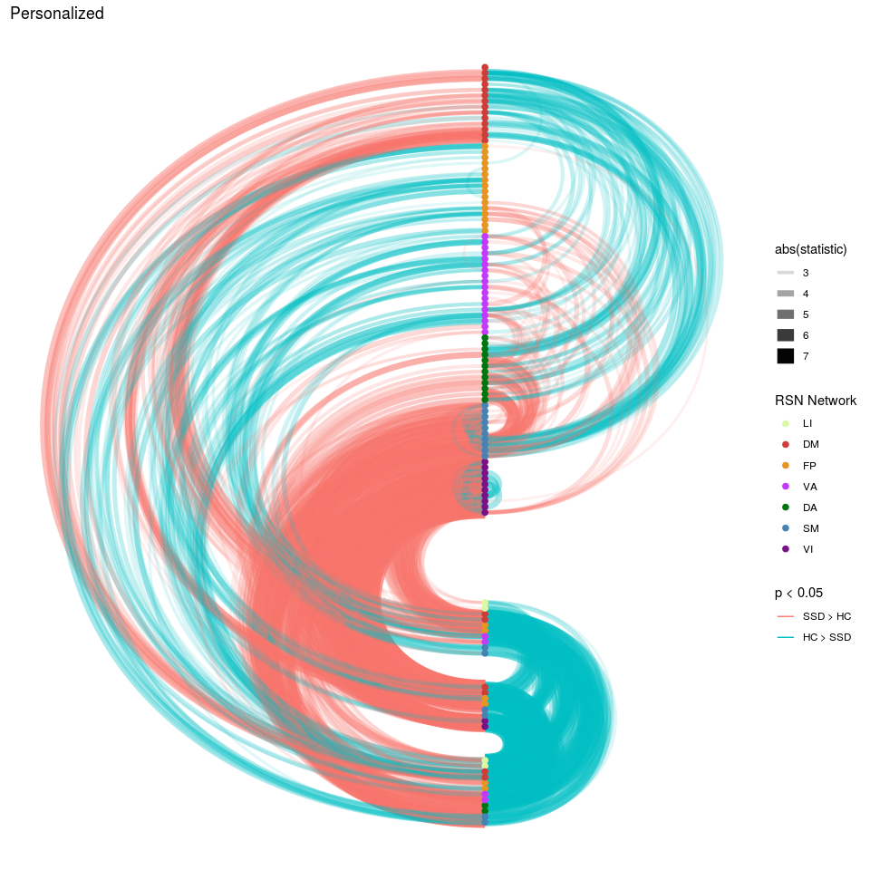<!-- -->

```r
flip_DX_model %>%
  filter(term == "DXSSD") %>%
  filter(vertex_type == "tvertex") %>%
  make_super_cools_plot(pos_label = "SSD > HC", 
                      neg_label = "HC > SSD",
                      plot_title = "Template")
```

<!-- -->

```r
flip_DX_model %>%
  filter(term == "DXSSD") %>%
  filter(vertex_type == "tvolume") %>%
  make_super_cools_plot(pos_label = "SSD > HC", 
                      neg_label = "HC > SSD",
                      plot_title = "Volume")
```

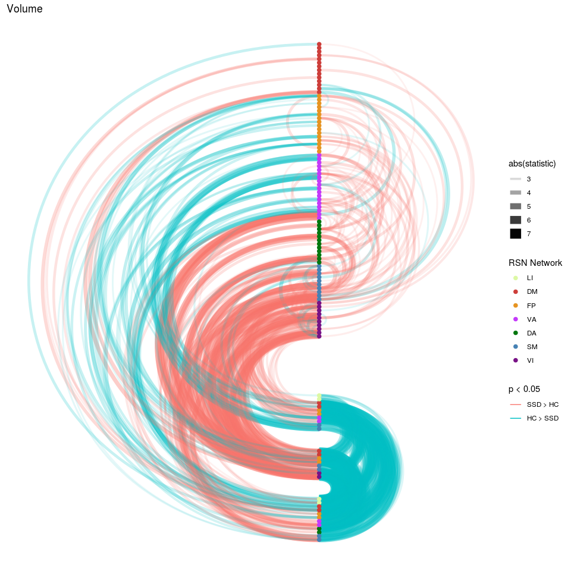<!-- -->

# so the interesting edges are:

subcortical with itself
allsubcortical with VI/SM (hyper)
subcortical with DM
subcortical with hypo cortical
DM with cortical ()
hyper cortico


```r
full_DX_mat <- DX_lm_model %>%
  filter(term == "DXSSD", vertex_type == "pvertex") %>%
  ungroup() %>%
  select(to, from, statistic) %>%
  uppertri_df_to_full() 

full_DX_mat %>%
  mutate(to_lab = factor(to, levels = node_annotations$node_name), 
         from_lab = factor(from, levels = rev(node_annotations$node_name))) %>%
  ggplot(aes(x=to_lab, y=from_lab, fill=value)) + 
  geom_tile(color = "white") +
  scale_fill_gradient2(high = "#b2182b", mid = "white", low = "#2166ac") +
  theme(axis.text.x = element_text(angle = 90, hjust = 1)) +
  labs(title = "T statistic for effect of DX",
       x = NULL, y = NULL, fill = "T statistic for DX")
```

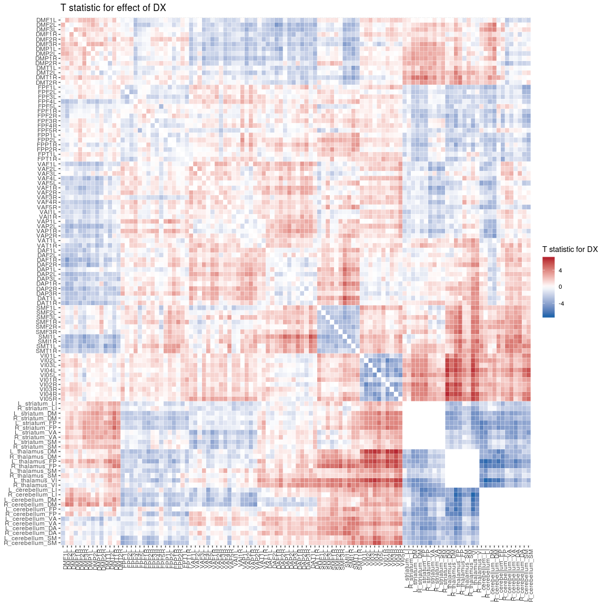<!-- -->
subcortical with itself
allsubcortical with VI/SM (hyper)
subcortical with DM
subcortical with hypo cortical
DM with cortical ()
hyper cortico


```r
hypo_cerebullum_to_striatum <- full_DX_mat %>%
    inner_join(node_annotations, by = c("to"="node_name")) %>%
    inner_join(node_annotations, by = c("from"="node_name")) %>%
    filter(subcort_ROI.x == "cerebellum") %>%
    filter(subcort_ROI.y == "striatum") %>%
    filter(value < -2) %>%
    select(to, from, value)

hyper_subcort_to_SMVI <- full_DX_mat %>%
    inner_join(node_annotations, by = c("to"="node_name")) %>%
    inner_join(node_annotations, by = c("from"="node_name")) %>%
    filter(etype.x == "SubCort") %>%
    filter(etype.y == "Cort") %>%
    filter(as.character(network.y) %in% c("VI", "SM")) %>%
    filter(value > 2) %>%
    select(to, from, value)

hyper_subcort_to_DM <- full_DX_mat %>%
    inner_join(node_annotations, by = c("to"="node_name")) %>%
    inner_join(node_annotations, by = c("from"="node_name")) %>%
    filter(etype.x == "SubCort") %>%
    filter(etype.y == "Cort") %>%
    filter(as.character(network.y) %in% c("DM")) %>%
    filter(value > 2) %>%
    select(to, from, value)

hypo_subcort_to_FPVA <- full_DX_mat %>%
    inner_join(node_annotations, by = c("to"="node_name")) %>%
    inner_join(node_annotations, by = c("from"="node_name")) %>%
    filter(etype.x == "SubCort") %>%
    filter(etype.y == "Cort") %>%
    filter(as.character(network.y) %in% c("FP","VA")) %>%
    filter(value < -2) %>%
    select(to, from, value)

hyper_cortSM_to_FPDA <- full_DX_mat %>%
    inner_join(node_annotations, by = c("to"="node_name")) %>%
    inner_join(node_annotations, by = c("from"="node_name")) %>%
    filter(etype.x == "Cort") %>%
    filter(etype.y == "Cort") %>%
    filter(as.character(network.x) %in% c("SM")) %>%
    filter(as.character(network.y) %in% c("FP","DA")) %>%
    filter(value > 2) %>%
    select(to, from, value)

hyper_cortVA_to_DAVI <- full_DX_mat %>%
    inner_join(node_annotations, by = c("to"="node_name")) %>%
    inner_join(node_annotations, by = c("from"="node_name")) %>%
    filter(etype.x == "Cort") %>%
    filter(etype.y == "Cort") %>%
    filter(as.character(network.x) %in% c("SM")) %>%
    filter(as.character(network.y) %in% c("FP","VA")) %>%
    filter(value > 2) %>%
    select(to, from, value)

hyper_cortVADA_to_SMVI <- bind_rows(hyper_cortSM_to_FPDA,
                                    hyper_cortVA_to_DAVI)

hypo_cortDM_to_DAVA <- full_DX_mat %>%
    inner_join(node_annotations, by = c("to"="node_name")) %>%
    inner_join(node_annotations, by = c("from"="node_name")) %>%
    filter(etype.x == "Cort") %>%
    filter(etype.y == "Cort") %>%
    filter(as.character(network.x) %in% c("DM")) %>%
    filter(as.character(network.y) %in% c("DA","VA")) %>%
    filter(value < -2) %>%
    select(to, from, value)

hypo_cortDM_to_SM <- full_DX_mat %>%
    inner_join(node_annotations, by = c("to"="node_name")) %>%
    inner_join(node_annotations, by = c("from"="node_name")) %>%
    filter(etype.x == "Cort") %>%
    filter(etype.y == "Cort") %>%
    filter(as.character(network.x) %in% c("SM")) %>%
    filter(as.character(network.y) %in% c("DM")) %>%
    filter(value < -2) %>%
    select(to, from, value)

hypo_cortDM_to_DAVASM <- bind_rows(hypo_cortDM_to_DAVA, hypo_cortDM_to_SM)

Fz_weigths <-bind_rows(hypo_cortDM_to_DAVASM = hypo_cortDM_to_DAVASM,
                       hyper_cortVADA_to_SMVI = hyper_cortVADA_to_SMVI,
                       hyper_subcort_to_DM = hyper_subcort_to_DM,
                       hypo_subcort_to_FPVA = hypo_subcort_to_FPVA,
                       hyper_subcort_to_SMVI = hyper_subcort_to_SMVI,
                       hypo_cerebullum_to_striatum = hypo_cerebullum_to_striatum,
                       .id = "weigthFc") %>%
  rename(DX_weight = value)
```


```r
Fz_weigths %>%
  group_by(weigthFc) %>%
  summarize(n = n(),
           mean_DX = mean(DX_weight))
```

```
## # A tibble: 6 x 3
##   weigthFc                        n mean_DX
##   <chr>                       <int>   <dbl>
## 1 hyper_cortVADA_to_SMVI        124    2.84
## 2 hyper_subcort_to_DM           127    2.82
## 3 hyper_subcort_to_SMVI         377    3.47
## 4 hypo_cerebullum_to_striatum    96   -3.50
## 5 hypo_cortDM_to_DAVASM         200   -2.68
## 6 hypo_subcort_to_FPVA          229   -2.70
```

```r
FC_weighted <- Fz_weigths %>%
  inner_join(results_pheno, by = c("to", "from"))  %>%
  filter(vertex_type == "pvertex") %>%
  group_by(subject, Age, Sex, Site, DX, Age_pt, fd_mean_pt, weigthFc) %>%
  mutate(wcorZ = abs(DX_weight) * weight) %>%
  summarise(mwcorZ = sum(wcorZ)/sum(abs(DX_weight))) %>%
  ungroup()
```


```r
FC_weighted %>%
  ungroup() %>%
  group_by(weigthFc) %>%
  do(tidy(lm(mwcorZ ~ DX + Age_pt + Sex + fd_mean_pt + Site,.))) %>%
  select(weigthFc, term, statistic, p.value) %>%
  knitr::kable()
```


weigthFc                      term             statistic     p.value
----------------------------  -------------  -----------  ----------
hyper_cortVADA_to_SMVI        (Intercept)      1.7950643   0.0732647
hyper_cortVADA_to_SMVI        DXSSD            7.8850039   0.0000000
hyper_cortVADA_to_SMVI        Age_pt          -1.4648893   0.1435977
hyper_cortVADA_to_SMVI        SexM            -0.0656937   0.9476487
hyper_cortVADA_to_SMVI        fd_mean_pt      -1.9929625   0.0468243
hyper_cortVADA_to_SMVI        SiteCOBRE        2.3994448   0.0167955
hyper_cortVADA_to_SMVI        Siteds000030     1.8370396   0.0668145
hyper_cortVADA_to_SMVI        SiteZHH          1.5990312   0.1104635
hyper_subcort_to_DM           (Intercept)      1.2877945   0.1984304
hyper_subcort_to_DM           DXSSD            6.2689733   0.0000000
hyper_subcort_to_DM           Age_pt          -2.1714723   0.0303785
hyper_subcort_to_DM           SexM            -0.5162778   0.6058952
hyper_subcort_to_DM           fd_mean_pt      -1.0684842   0.2858326
hyper_subcort_to_DM           SiteCOBRE        2.0751589   0.0384973
hyper_subcort_to_DM           Siteds000030     2.1570660   0.0314901
hyper_subcort_to_DM           SiteZHH         -1.2829796   0.2001107
hyper_subcort_to_SMVI         (Intercept)     -1.5470110   0.1225115
hyper_subcort_to_SMVI         DXSSD            8.6333803   0.0000000
hyper_subcort_to_SMVI         Age_pt          -0.4377400   0.6617693
hyper_subcort_to_SMVI         SexM            -1.3684488   0.1718039
hyper_subcort_to_SMVI         fd_mean_pt       1.1942847   0.2329492
hyper_subcort_to_SMVI         SiteCOBRE        1.3201288   0.1874134
hyper_subcort_to_SMVI         Siteds000030     1.5325413   0.1260396
hyper_subcort_to_SMVI         SiteZHH         -1.5750070   0.1159055
hypo_cerebullum_to_striatum   (Intercept)      2.0034669   0.0456819
hypo_cerebullum_to_striatum   DXSSD           -5.9153228   0.0000000
hypo_cerebullum_to_striatum   Age_pt          -0.2556296   0.7983450
hypo_cerebullum_to_striatum   SexM             1.0768087   0.2820999
hypo_cerebullum_to_striatum   fd_mean_pt      -1.8252760   0.0685730
hypo_cerebullum_to_striatum   SiteCOBRE       -0.1798206   0.8573683
hypo_cerebullum_to_striatum   Siteds000030     1.8589792   0.0636343
hypo_cerebullum_to_striatum   SiteZHH          2.9365175   0.0034766
hypo_cortDM_to_DAVASM         (Intercept)     -7.0761410   0.0000000
hypo_cortDM_to_DAVASM         DXSSD           -6.5589231   0.0000000
hypo_cortDM_to_DAVASM         Age_pt           2.0945591   0.0367274
hypo_cortDM_to_DAVASM         SexM             1.2713825   0.2042007
hypo_cortDM_to_DAVASM         fd_mean_pt       6.5098622   0.0000000
hypo_cortDM_to_DAVASM         SiteCOBRE       -0.9602925   0.3373855
hypo_cortDM_to_DAVASM         Siteds000030    -1.7829843   0.0752129
hypo_cortDM_to_DAVASM         SiteZHH         -1.4534304   0.1467497
hypo_subcort_to_FPVA          (Intercept)      0.6886813   0.4913525
hypo_subcort_to_FPVA          DXSSD           -8.7751428   0.0000000
hypo_subcort_to_FPVA          Age_pt           0.9939324   0.3207504
hypo_subcort_to_FPVA          SexM             1.3612670   0.1740601
hypo_subcort_to_FPVA          fd_mean_pt      -0.6692169   0.5036749
hypo_subcort_to_FPVA          SiteCOBRE       -0.2428282   0.8082409
hypo_subcort_to_FPVA          Siteds000030    -1.7182276   0.0863920
hypo_subcort_to_FPVA          SiteZHH         -1.4977946   0.1348358

```r
SSD_cors <- FC_weighted %>%
  filter(DX == "SSD") %>%
  select(subject, weigthFc, mwcorZ) %>%
  spread(weigthFc, mwcorZ) %>%
  select(-subject) %>%
  cor(.) 
```


```r
HC_cors <- FC_weighted %>%
  filter(DX == "CTRL") %>%
  select(subject, weigthFc, mwcorZ) %>%
  spread(weigthFc, mwcorZ) %>%
  select(-subject) %>%
  cor(.) 

HC_cors %>%
  as.data.frame() %>%
  mutate(from = row.names(.)) %>%
  gather(to, hc_cor, -from) %>%
  ggplot(aes(x = to, y = from, fill = hc_cor)) +
  geom_tile() +
  geom_text(aes(label = sprintf('%3.2f',hc_cor))) +
  scale_fill_distiller(breaks = c(-0.5,0.5), type = "div", palette = 5) +
  theme(axis.text.x = element_text(angle = 90, hjust = 1)) 
```

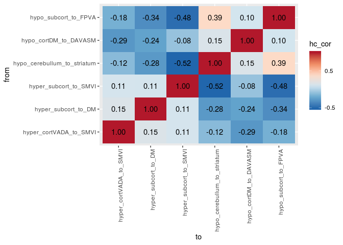<!-- -->

```r
SSD_cors %>%
  as.data.frame() %>%
  mutate(from = row.names(.)) %>%
  gather(to, hc_cor, -from) %>%
  ggplot(aes(x = to, y = from, fill = hc_cor)) +
  geom_tile() +
  geom_text(aes(label = sprintf('%3.2f',hc_cor))) +
  scale_fill_distiller(breaks = c(-0.5,0.5), type = "div", palette = 5) +
  theme(axis.text.x = element_text(angle = 90, hjust = 1)) 
```

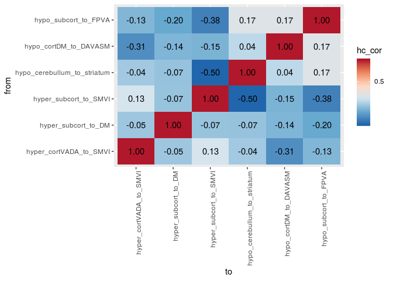<!-- -->


```r
# Marginal densities along x axis
plot_DX_scatter_elipsed <- function(df, x, y) {
  #the tidy eval ness
  xvar <- enquo(x)
  yvar <- enquo(y)
  # make the main scatte bit using above
  main_scatter <-  ggplot(data = df, 
               aes(x = !!xvar, y = !!yvar, color = DX)) +
  geom_point(alpha = 0.7, size = 0.7) +
  stat_ellipse() +
  scale_color_manual(values = c("grey20","red"))

  xdens <- axis_canvas(main_scatter, axis = "x")+
    geom_density(data = df, aes(x = !!xvar, fill = DX),
              alpha = 0.5, size = 0.2) +
    scale_fill_manual(values = c("grey20","red"))

  ydens <- axis_canvas(main_scatter, axis = "y", coord_flip = TRUE)+
    geom_density(data = df, aes(x = !!yvar, fill = DX),
                alpha = 0.5, size = 0.2) +
  scale_fill_manual(values = c("grey20","red")) +
  coord_flip()
  
  #putting the peices together
  p1 <- insert_xaxis_grob(main_scatter, xdens, grid::unit(.2, "null"), position = "top")
  p2<- insert_yaxis_grob(p1, ydens, grid::unit(.2, "null"), position = "right")
  return(p2)
}
```


```r
library(cowplot)
```

```
## Warning: package 'cowplot' was built under R version 3.4.4
```

```
## 
## Attaching package: 'cowplot'
```

```
## The following object is masked from 'package:ggplot2':
## 
##     ggsave
```

```r
fplot <- FC_weighted %>%
  spread(weigthFc, mwcorZ) 

ggdraw(plot_DX_scatter_elipsed(fplot, x = hyper_subcort_to_DM, y = hypo_cerebullum_to_striatum))
```

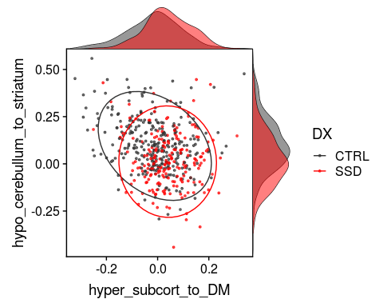<!-- -->


```r
ggdraw(plot_DX_scatter_elipsed(fplot, x = hyper_subcort_to_SMVI, y = hypo_cerebullum_to_striatum))
```

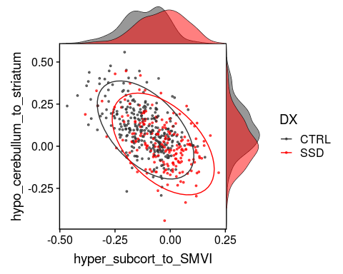<!-- -->

```r
ggdraw(plot_DX_scatter_elipsed(fplot, x = hyper_subcort_to_SMVI, y = hypo_subcort_to_FPVA))
```

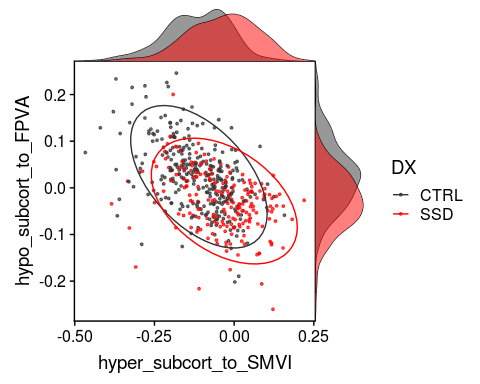<!-- -->


```r
ggdraw(plot_DX_scatter_elipsed(fplot, x = hyper_cortVADA_to_SMVI, y = hypo_cortDM_to_DAVASM))
```

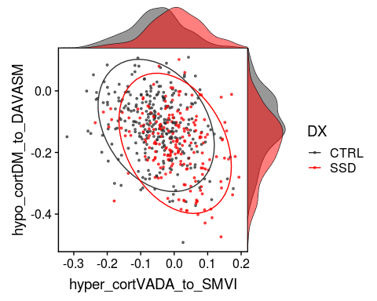<!-- -->

```r
ggdraw(plot_DX_scatter_elipsed(fplot, 
                               x = hypo_cerebullum_to_striatum, 
                               y = hypo_cortDM_to_DAVASM))
```

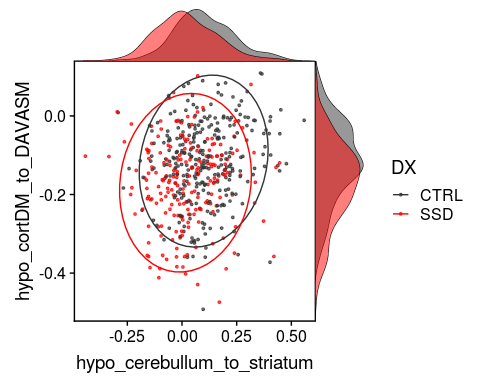<!-- -->

```r
ggdraw(plot_DX_scatter_elipsed(fplot, 
                               x = hyper_subcort_to_SMVI, 
                               y = hypo_cortDM_to_DAVASM))
```

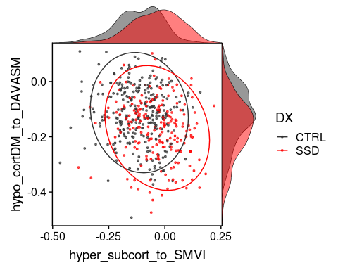<!-- -->

```r
fig1 <- fplot %>%
  ggplot(aes(y = hypo_cortDM_to_DAVASM, x = DX, color = DX)) + 
  geom_boxplot(outlier.shape = NA) + 
  geom_dotplot(binaxis = 'y', stackdir = 'center', binwidth = 0.01, alpha = 0.5) +
  scale_color_manual(values = c("grey20","red")) +
  facet_wrap( ~ Site, ncol = 4) +
  labs(x = NULL)

#ggsave(fig1, filename = 'VA_results.png',height = 8, width = 5)

fig1
```

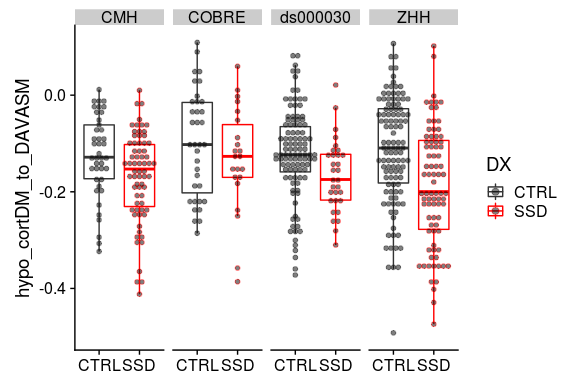<!-- -->


```r
fig1 <- fplot %>%
  ggplot(aes(y = hypo_subcort_to_FPVA, x = DX, color = DX)) + 
  geom_boxplot(outlier.shape = NA) + 
  geom_dotplot(binaxis = 'y', stackdir = 'center', binwidth = 0.008, alpha = 0.5) +
  scale_color_manual(values = c("grey20","red")) +
  facet_wrap( ~ Site, ncol = 4) +
  labs(x = NULL)

#ggsave(fig1, filename = 'VA_results.png',height = 8, width = 5)

fig1
```

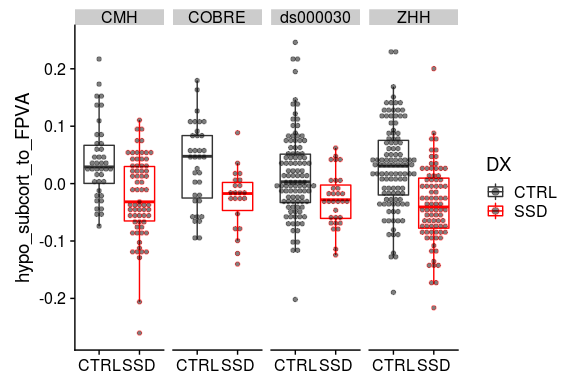<!-- -->


```r
fig1 <- fplot %>%
  ggplot(aes(y = hyper_subcort_to_SMVI, x = DX, color = DX)) + 
  geom_boxplot(outlier.shape = NA) + 
  geom_dotplot(binaxis = 'y', stackdir = 'center', binwidth = 0.01, alpha = 0.5) +
  scale_color_manual(values = c("grey20","red")) +
  facet_wrap( ~ Site, ncol = 4) +
  labs(x = NULL)

#ggsave(fig1, filename = 'VA_results.png',height = 8, width = 5)

fig1
```

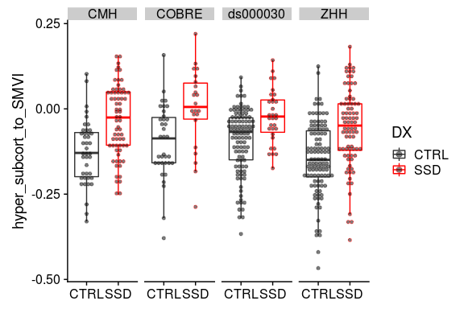<!-- -->
## Extra bits.. getting representative and group correlation matrixes

### starting with group one's

```r
hgrid_beaks <- node_annotations %>%
  filter(etype == "Cort") %>%
  mutate(diffnet = as.numeric(network) %>% diff()*1:80) %>%
  filter(diffnet > 0) %>%
  pull(diffnet)
```

```
## Warning in as.numeric(network) %>% diff() * 1:80: longer object length is
## not a multiple of shorter object length
```


```r
# figure out where the white lines goes
hgrid_beaks <- node_annotations %>%
  filter(etype == "Cort") %>%
  mutate(diffnet = as.numeric(network) %>% diff()*1:80) %>%
  filter(diffnet > 0) %>%
  pull(diffnet)
```

```
## Warning in as.numeric(network) %>% diff() * 1:80: longer object length is
## not a multiple of shorter object length
```

```r
# make the Yeo 6 network color bar for the axis
network_bar <- node_annotations %>%
  filter(etype == "Cort") %>%
  mutate(to_lab = factor(node_name, levels = rev(node_annotations$node_name))) %>%
  ggplot(aes(x=1, y=to_lab, fill = network)) +
  geom_tile() +
  geom_hline(yintercept= 80.5-hgrid_beaks, color='white', size=1) +
  scale_fill_manual(values = rev(YeoNet7$hexcode[1:6])) +
  coord_fixed(ratio = 0.75)

network_top_bar <- node_annotations %>%
  filter(etype == "Cort") %>%
  mutate(from_lab = factor(node_name, levels = node_annotations$node_name)) %>%
  ggplot(aes(x=from_lab, y=1, fill = network)) +
  geom_tile() +
  geom_vline(xintercept= hgrid_beaks + 0.5, color='white', size=1) +
  scale_fill_manual(values = rev(YeoNet7$hexcode[1:6])) +
  coord_fixed(ratio = 0.75)

# build the full heatmap plot object
withincortical_heatmap <- function(data, plt_title = "", fillvar = "weight") {
  fillvar <- enquo(fillvar)
  max_fill <- 1.15
  plt <- data %>%
  inner_join(annotated_graph_edges, by = c("from", "to")) %>%
  filter(from_to_type == "Cort_Cort") %>%
  ungroup() %>%
  select(to, from, !!fillvar) %>%
  uppertri_df_to_full() %>%
    mutate(to_lab = factor(to, levels = node_annotations$node_name), 
         from_lab = factor(from, levels = rev(node_annotations$node_name)),
         value = if_else(value > max_fill, max_fill, value)) %>%
  ggplot(aes(x=to_lab, y=from_lab, fill=value)) + 
  geom_tile() +
  geom_hline(yintercept= 80.5-hgrid_beaks, color='white', size=1) +
  geom_vline(xintercept= hgrid_beaks + 0.5, color='white', size=1) +
  scale_fill_gradient2(high = "#b2182b", mid = "white", low = "#2166ac", 
                       midpoint = 0, limits = c(-(max_fill), max_fill)) +
  theme(axis.text.x = element_text(angle = 90, hjust = 1, size = 5),
        axis.text = element_text(size = 5),
        panel.border = element_rect(linetype = "solid", color = "black")) +
  coord_fixed() +
  labs(title = plt_title,
       x = NULL, y = NULL, fill = "Correlation (Z)")
  #p1<- insert_yaxis_grob(plt, network_top_bar, grid::unit(.03, "null"), position = "bottom")
  p2<- insert_yaxis_grob(plt, network_bar, grid::unit(.03, "null"), position = "left")
  return(p2)
}
```


```r
mean_cors %>%
  filter(vertex_type == "pvertex") %>%
  withincortical_heatmap("Personalized Mean Correlation", mcorZ) %>%
  ggdraw()
```

```
## Warning: Detecting old grouped_df format, replacing `vars` attribute by
## `groups`
```

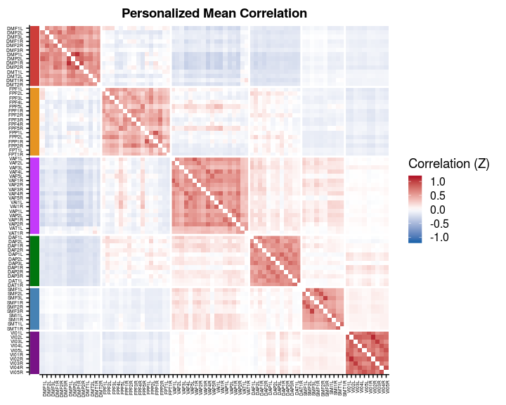<!-- -->

```r
mean_cors %>%
  filter(vertex_type == "tvertex") %>%
  withincortical_heatmap("Surface Template Mean Correlation", mcorZ) %>%
  ggdraw()
```

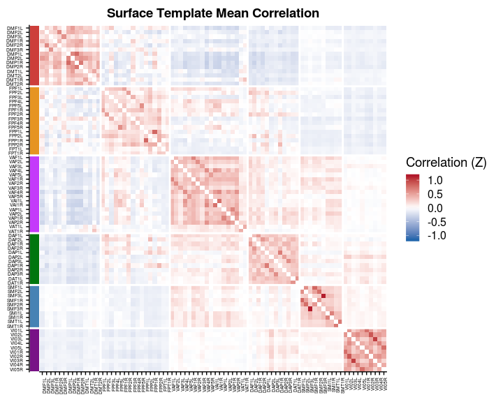<!-- -->

```r
mean_cors %>%
  filter(vertex_type == "tvolume") %>%
  withincortical_heatmap("Volume Template Mean Correlation", mcorZ) %>%
  ggdraw()
```

<!-- -->


```r
thissubject = unique(pheno$subject)[2]

results_pheno %>%
  filter(subject==thissubject,
         vertex_type == "pvertex") %>%
  withincortical_heatmap(str_c(thissubject, " Personalized Correlation")) %>%
  ggdraw()
```

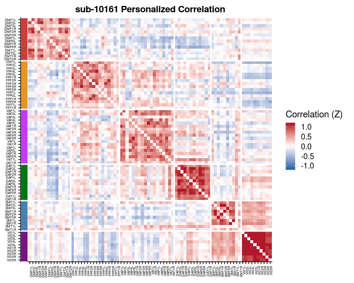<!-- -->

```r
results_pheno %>%
  filter(subject==thissubject,
         vertex_type == "tvertex") %>%
  withincortical_heatmap(str_c(thissubject, " Surface Template Correlation")) %>%
  ggdraw()
```

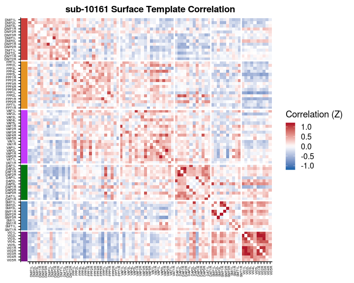<!-- -->

```r
results_pheno %>%
  filter(subject==thissubject,
         vertex_type == "tvolume") %>%
  withincortical_heatmap(str_c(thissubject, " Volume Template Correlation")) %>%
  ggdraw()
```

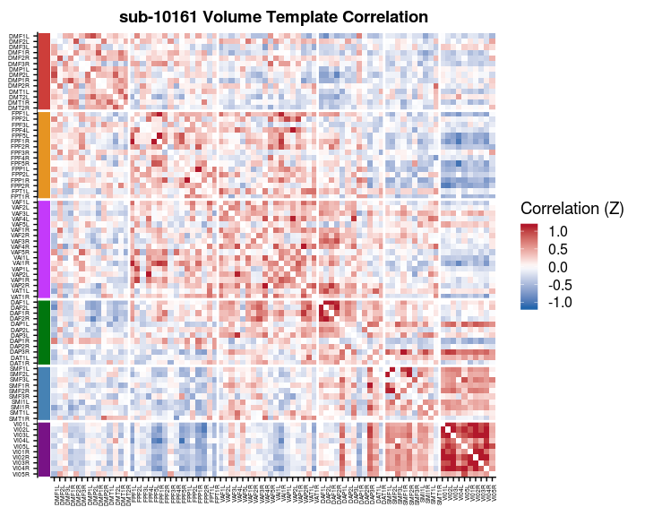<!-- -->

```r
thissubject = unique(pheno$subject)[3]

results_pheno %>%
  filter(subject==thissubject,
         vertex_type == "pvertex") %>%
  withincortical_heatmap(str_c(thissubject, " Personalized Correlation")) %>%
  ggdraw()
```

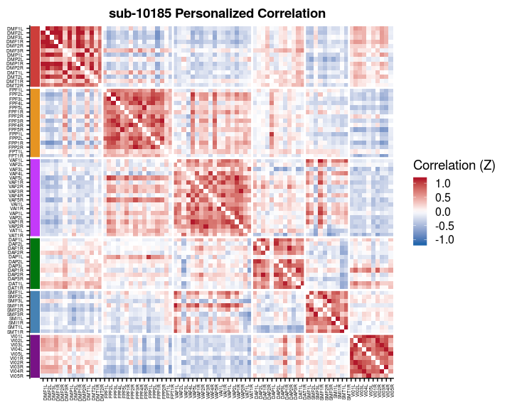<!-- -->

```r
results_pheno %>%
  filter(subject==thissubject,
         vertex_type == "tvertex") %>%
  withincortical_heatmap(str_c(thissubject, " Surface Template Correlation")) %>%
  ggdraw()
```

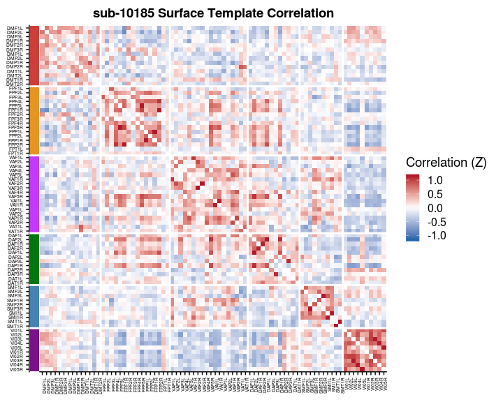<!-- -->

```r
results_pheno %>%
  filter(subject==thissubject,
         vertex_type == "tvolume") %>%
  withincortical_heatmap(str_c(thissubject, " Volume Template Correlation")) %>%
  ggdraw()
```

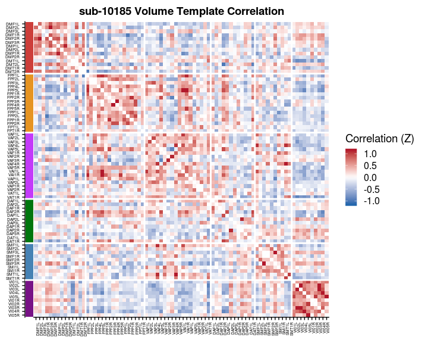<!-- -->


```r
thissubject = unique(pheno$subject)[100]

results_pheno %>%
  filter(subject==thissubject,
         vertex_type == "pvertex") %>%
  withincortical_heatmap(str_c(thissubject, " Personalized Correlation")) %>%
  ggdraw()
```

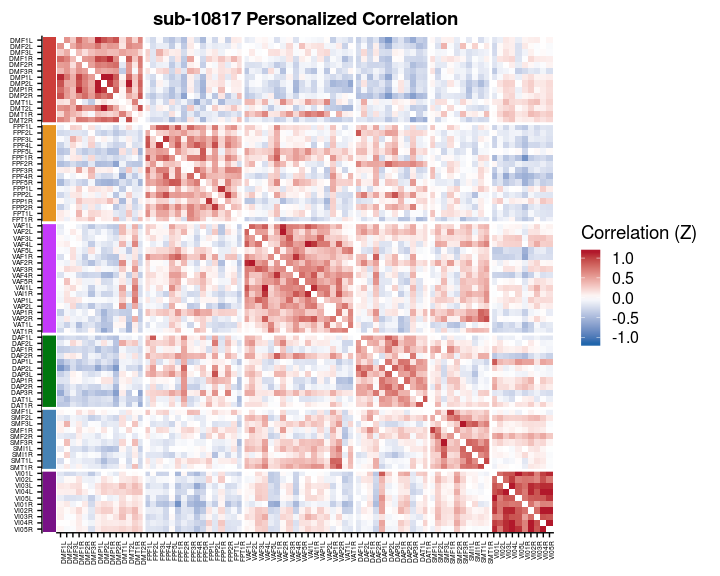<!-- -->

```r
results_pheno %>%
  filter(subject==thissubject,
         vertex_type == "tvertex") %>%
  withincortical_heatmap(str_c(thissubject, " Surface Template Correlation")) %>%
  ggdraw()
```

<!-- -->

```r
results_pheno %>%
  filter(subject==thissubject,
         vertex_type == "tvolume") %>%
  withincortical_heatmap(str_c(thissubject, " Volume Template Correlation")) %>%
  ggdraw()
```

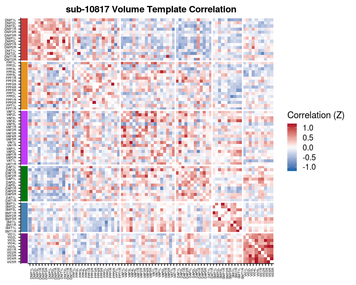<!-- -->
