# Sub-cortical Cortical Stats

# Sub-cortical Cortical Stats

This analysis tries to combine timeseries data from PINT outputs with subcortical timeseries to ask two questions

1. "External" validation of PINT. If PINT is indeed helping us better target meaningful resting state networks than we should see "cleaner" patterns of between the PINT output cortical ROIs and parcels of the subcortical structure that have been associated with these networks in literature.
   + i.e. connectivity of the cortical ROIS with "expected" subcortical parcel should increae and correlation with other parcels should decrease after PINT.
   
2. To interograte SSD related differences in Cortical-Subcortical connectivity - and to see if they persist after PINT.


```r
library(tidyverse)
library(broom)
library(knitr)
library(tableone)
library(cowplot)
```


## The paths to data


```r
pint_outputs <- '../data/PINT_outputs_s8_6-6-12/'
subcortical_outputs_dir <- '/KIMEL/tigrlab/projects/dmiranda/subcortical/output_ts/'

Yeo7_2011_80verts <- read_csv("../templates/Yeo7_2011_80verts.csv",
                              col_types = c(
                                hemi = col_character(),
                                tvertex = col_integer(),
                                LRpairs = col_integer(),
                                roiidx = col_integer(),
                                NETWORK = col_integer(),
                                LOBE = col_character(),
                                SHORTNAME = col_character(),
                                x = col_integer(),
                                y = col_integer(),
                                z = col_integer()
                              ))
```

# read and mangle the phenotypic data


```r
## reading in the qced_sublists csv to get the sublists
pheno <- read_csv("../phenotypic/subjects_not_sexmatched_20180507.csv", 
                  col_types = c(
  subid = col_character(),
  name = col_character(),
  Site = col_character(),
  DX = col_character(),
  age = col_integer(),
  Sex = col_character(),
  Edu = col_double(),
  mean_fd = col_double(),
  X.bad_fd = col_double(),
  global_corr = col_double(),
  mean_snfr = col_double()
))
```

## adding transformed variables 


```r
transform_to_normal <- function(X) {
  # calculate the best exponent using powerTransform:
  pT <- car::powerTransform(X)
  # apply the power transform and save the result to a new variable
  X_pT <- X^pT$lambda ## note ^ is exponent in r
  return(X_pT)
}

pheno <- pheno %>%
  mutate(Age_pt = transform_to_normal(age),
         mean_fd_pt = transform_to_normal(mean_fd),
         Edu_std = scale(Edu)[,1],
         Age_std = scale(age)[,1])
```


# Code for reading in all the timeseries..

## searching for the meants files


```r
pint_outputlist <- tibble("filepath" = list.files(pint_outputs, 
                                                      recursive = T,
                                                      pattern = "_summary.csv")) %>%
  separate(filepath, into = c("subid", "summary_file"), sep = '/')

subcort_outputlist <- tibble("subid" = list.files(subcortical_outputs_dir, 
                                                      recursive = F))

pint_outputlist <- inner_join(pint_outputlist, subcort_outputlist, by = "subid")
```

A table that describes the current expected subortical files


```r
# a tibble table to specify the subcortical meants files that were generated
YeoNet_subcort_list <- c('VI','SM','DA','VA', 'LI','FP','DM')
```

These functions are for reading timeseries files


```r
#' read a meants file generated by PINT of ciftify_meants
#'
#' @param filepath the full path to the file
#'
#' @return a dataframe where rows are rois and colums are timepoints
read_meants_csv <- function(filepath) {
   meants <-read_csv(filepath, 
                     col_names = FALSE,
                     col_types = c(.default = col_double()))
   return(meants)
}

#' Read the contents of a subcortical csv
#'
#' @param subid The subject identifier
#' @param subregion region "thalamus", "stiatum", "cerebellum"
#' @param pint_outputs the basepath of the pint outputs
#'
#' @return a dataframe of the _meants.csv contents
read_subcortical_meants <- function(subid, subregion, subcortical_outputs_dir) {
  expected_filepath <- file.path(subcortical_outputs_dir, subid, 
                           str_c(subid, '_s0_rsn_', subregion, '_7networks_networks_MWfix.dlabel_meants.csv'))
  meants = read_meants_csv(expected_filepath)
  return(meants)
}

#' Read the contents of a csv generated by PINT
#'
#' @param subid The subject identifier
#' @param vertex_type "ivertex" or "tvertex"
#' @param pint_outputs the basepath of the pint outputs
#'
#' @return a dataframe of the _meants.csv contents
read_pint_meants <- function(subid, vertex_type, pint_outputs) {
  expected_filepath <- file.path(pint_outputs, subid, 
                           str_c(subid, '_', vertex_type, '_meants.csv'))
  meants = read_meants_csv(expected_filepath)
  return(meants)
}
```


This reads all files and generate PINT to subcortical correlation values for a given subject


```r
#' read all fMRI timeseries data for one subject and correlates PINT ROIs with subcortex
#'
#' @param subid the subject id
#' @param pint_outputs the path to the pint output directory
#' @param subcortical_outputs_dir the path to the subcortical timeseries directory
#' @param Yeo7_2011_80verts as data frame describing the PINT ROIs 
#'
#' @return a dataframe (graph style) of PINT ROI to subcortical correlations
subject_subcort_corrs <- function(subid, pint_outputs, subcortical_outputs_dir,
                                  Yeo7_2011_80verts) {
  
  # read the pint meants files
  ivertex_meants <- read_pint_meants(subid, 'ivertex', pint_outputs)
  tvertex_meants <- read_pint_meants(subid, 'tvertex', pint_outputs)
  
  # read the subcortical meants files
  thalamus_meants <- read_subcortical_meants(subid, "thalamus", subcortical_outputs_dir)
  striatum_meants <- read_subcortical_meants(subid, "striatum", subcortical_outputs_dir)
  cerebellum_meants <- read_subcortical_meants(subid, "cerebellum", subcortical_outputs_dir)
  
  # prepare to bind
  subcort_meants <- bind_rows(thalamus_meants, striatum_meants, cerebellum_meants)
  subcort_region_list <- c(rep("thalamus", nrow(thalamus_meants)), 
                           rep("striatum", nrow(striatum_meants)),
                           rep("cerebellum", nrow(cerebellum_meants)))
  subcort_net_list <- rep(c('VI','SM','DA','VA', 'LI','FP','DM'),3)
  
  # correlate the ivertex timeseries with the subcortical data
  ivertex_subcortcorr <- as.data.frame(cor(t(subcort_meants), t(ivertex_meants)))
  names(ivertex_subcortcorr) <- Yeo7_2011_80verts$SHORTNAME
  ivertex_result <- ivertex_subcortcorr %>%
    mutate(subcort_ROI = subcort_region_list,
           subcort_NET = subcort_net_list) %>%
    gather(PINT_ROI, ivertex_corr, -subcort_ROI, -subcort_NET)
  
  # correlated the tvertex timeseries with the subcortical data
  tvertex_subcortcorr <- as.data.frame(cor(t(subcort_meants), t(tvertex_meants)))
  names(tvertex_subcortcorr) <- Yeo7_2011_80verts$SHORTNAME
  tvertex_result <- tvertex_subcortcorr %>%
    mutate(subcort_ROI = subcort_region_list,
           subcort_NET = subcort_net_list) %>%
    gather(PINT_ROI, tvertex_corr, -subcort_ROI, -subcort_NET)
  
  # combine ivertex and tvertex and return
  subresult <- ivertex_result %>%
    inner_join(tvertex_result, by = c("PINT_ROI", "subcort_ROI", "subcort_NET"))
  return(subresult)
}
```


### This reads all the subcortical files it can find


```r
run_read_subject_subcort_corrs <- function(subid) {
  df <-subject_subcort_corrs(subid, pint_outputs, subcortical_outputs_dir,
                                  Yeo7_2011_80verts)
  return(df)
}


all_subcort_results <- pint_outputlist %>%
  mutate(subcort_corrs = map(subid, ~run_read_subject_subcort_corrs(.x)))
```


### merge with the phenotypic data


```r
results_pheno <- all_subcort_results %>%
  inner_join(pheno, by = "subid") %>%
  unnest() %>%
  mutate(YeoNet = str_sub(PINT_ROI, 1,2),
         hemisphere = str_sub(PINT_ROI, 5,5)) %>%
  mutate(conn_type = if_else(YeoNet == subcort_NET, "same_net", "diff_net"),
         YeoNet = factor(YeoNet, levels = c("VI", "SM", "DA", "VA", "FP", "DM")),
         subcort_NET = factor(subcort_NET, levels = c("VI", "SM", "DA", "VA", "FP", "DM", "LI"))) %>%
  #       ) %>%
  select(subid, PINT_ROI, subcort_ROI, subcort_NET,
         ivertex_corr, tvertex_corr, 
         DX, Edu, Sex, mean_fd, age, Site,
         Age_pt, mean_fd_pt, Edu_std, Age_std, 
         YeoNet, hemisphere, conn_type) 
```


## make a subject table from resuts pheno


```r
library(tableone)
therealtable1 <- CreateTableOne(
  strata = c("Site", "DX"),
  vars = c("age", "Edu", "Sex"),
  data = filter(results_pheno, PINT_ROI=="DMP1L",subcort_ROI=="thalamus", subcort_NET=="VA")
)

print(therealtable1)
```

```
##                  Stratified by Site:DX
##                   CMH:Ctrl      COBRE:Ctrl    ZHH:Ctrl      CMH:SSD      
##   n                  66            53           104           105        
##   age (mean (sd)) 27.41 (7.79)  33.47 (9.46)  26.53 (6.19)  31.22 (8.47) 
##   Edu (mean (sd)) 15.91 (1.92)  14.41 (1.51)  14.82 (1.93)  13.69 (2.11) 
##   Sex = M (%)        32 (48.5)     36 (67.9)     50 (48.1)     64 (61.0) 
##                  Stratified by Site:DX
##                   COBRE:SSD     ZHH:SSD       p      test
##   n                  25            74                    
##   age (mean (sd)) 26.36 (5.68)  26.92 (7.89)  <0.001     
##   Edu (mean (sd)) 13.15 (1.72)  12.74 (2.00)  <0.001     
##   Sex = M (%)        21 (84.0)     54 (73.0)  <0.001
```

# Is PINT "focusing" cortical subcortical connectivity


```r
table1 <- results_pheno %>%
  mutate(corr_diff = ivertex_corr - tvertex_corr) %>%
  gather(corr_type, rval, ivertex_corr, tvertex_corr) %>%
  group_by(corr_type, YeoNet, subcort_ROI, subcort_NET) %>%
  summarise(n = n(),
            Mean = mean(rval),
            SD = sd(rval)) 
  
ggplot(table1, aes(y = YeoNet, x = subcort_NET, fill = Mean)) + 
  geom_tile() +
  scale_fill_gradient2(breaks = c(-0.5,0.5)) +
  theme(axis.text.x = element_text(angle = 90, hjust = 1)) +
  facet_grid(subcort_ROI~corr_type) 
```

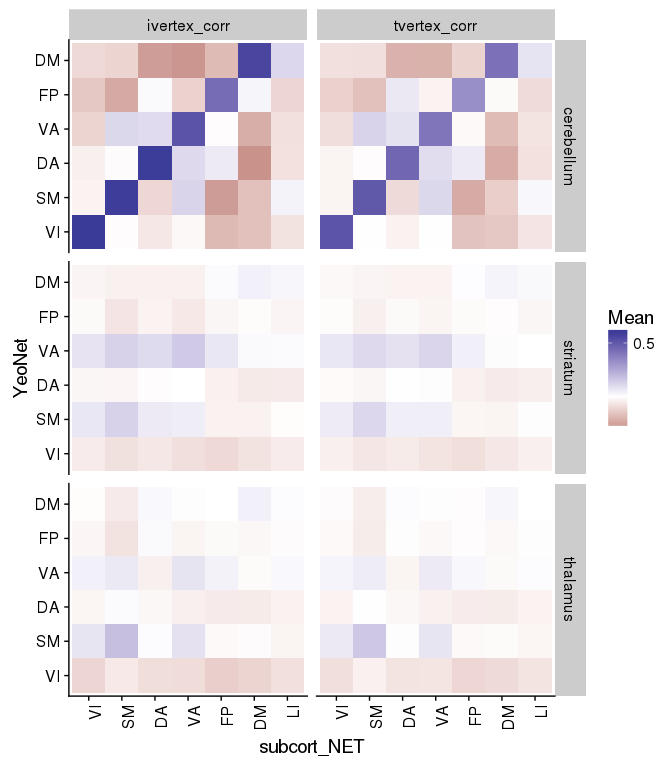<!-- -->

We see in the above figure that the Yeo 7 Network connectivity strongly shows the expected pattern in the cerebeullum. 

Lower evidence is seen in the striatum and thalamus, although there is a faint increase across the diagonal for the SM, VA and DM especially


```r
net_means <- results_pheno %>%
  mutate(corr_diff = ivertex_corr - tvertex_corr) %>%
  group_by(YeoNet, subcort_ROI, subcort_NET, conn_type, subid) %>%
  summarise(netmean_ivertex = mean(ivertex_corr),
            netmean_tvertex = mean(tvertex_corr)) %>%
  ungroup()

net_means_pint_t <- net_means %>%
  group_by(YeoNet, subcort_ROI, subcort_NET) %>%
  do(tidy(t.test(.$netmean_ivertex, .$netmean_tvertex, paired = TRUE)))

net_means_pint_t %>%
  ungroup() %>%
  mutate(sig = if_else(p.value < 0.005, '*', NA_character_) ) %>%
ggplot(aes(x = YeoNet, y = subcort_NET, fill = statistic)) + 
  geom_tile(color = "black", na.rm = TRUE) +
  geom_point(aes(shape = sig), na.rm = TRUE) +
  scale_fill_gradient2() +
  theme(axis.text.x = element_text(angle = 90, hjust = 1)) +
  facet_wrap(~subcort_ROI)
```

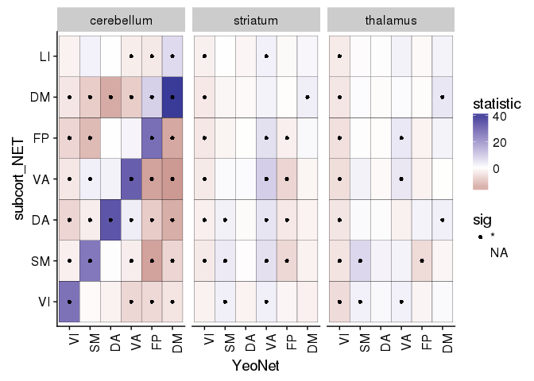<!-- -->
Here we plot the paired t-stat camparing personalized to template, we see a very strong increase in correlation along the diagonal (i.e. with the hypothesized regions) and decreases on the off-dignonal (i.e. decreased connectivity with the other network's parcels)


# trying to calculate an vs off diagonal term


```r
net_focus <- net_means %>%
  ungroup() %>%
  mutate(pint_diff = netmean_ivertex - netmean_tvertex) %>%
  group_by(subid, subcort_ROI, YeoNet, conn_type) %>%
  summarise(nets_avg = mean(pint_diff)) %>%
  ungroup() %>%
  spread(conn_type, nets_avg) %>%
  mutate(focus_effect = same_net - diff_net)

net_focus %>%
  ungroup() %>%
  group_by(subcort_ROI, YeoNet) %>%
  do(tidy(t.test(.$focus_effect)))
```

```
## # A tibble: 18 x 10
## # Groups:   subcort_ROI, YeoNet [18]
##    subcort_ROI YeoNet      estimate   statistic       p.value parameter
##          <chr> <fctr>         <dbl>       <dbl>         <dbl>     <dbl>
##  1  cerebellum     VI  1.082988e-01 31.07542495 1.432541e-111       426
##  2  cerebellum     SM  1.024854e-01 28.82104545 4.052796e-102       426
##  3  cerebellum     DA  1.554301e-01 37.11025290 1.491352e-135       426
##  4  cerebellum     VA  1.240746e-01 38.13483969 1.986125e-139       426
##  5  cerebellum     FP  1.466737e-01 32.77357708 1.619207e-118       426
##  6  cerebellum     DM  1.821777e-01 41.97680688 1.843780e-153       426
##  7    striatum     VI  4.733616e-03  1.79438658  7.346039e-02       426
##  8    striatum     SM  1.372810e-02  5.00438321  8.214284e-07       426
##  9    striatum     DA  9.321365e-05  0.02835876  9.773893e-01       426
## 10    striatum     VA  1.711290e-02  7.50629089  3.589422e-13       426
## 11    striatum     FP  3.173099e-03  1.17315181  2.413905e-01       426
## 12    striatum     DM  1.562905e-02  5.35598465  1.395118e-07       426
## 13    thalamus     VI -8.148746e-03 -4.84713383  1.757894e-06       426
## 14    thalamus     SM  2.452276e-02  8.35925893  9.037945e-16       426
## 15    thalamus     DA  1.725329e-03  0.53967775  5.897013e-01       426
## 16    thalamus     VA  1.126171e-02  4.43096761  1.194498e-05       426
## 17    thalamus     FP -1.496571e-03 -0.55385019  5.799720e-01       426
## 18    thalamus     DM  1.358297e-02  5.86028896  9.261757e-09       426
## # ... with 4 more variables: conf.low <dbl>, conf.high <dbl>,
## #   method <fctr>, alternative <fctr>
```

In the above table to calcuculated the "focussing" effect as the change (in on person) between in connectivity with the expected parcel subtracted by the change in connectivity from other regions.

Below we plot these values against zero


```r
net_focus %>%
  ungroup() %>%
  ggplot(aes(x = YeoNet, y = focus_effect)) +
  geom_violin() +
  geom_jitter(alpha = 0.1) +
  geom_hline(yintercept = 0) +
  facet_wrap(~ subcort_ROI)
```

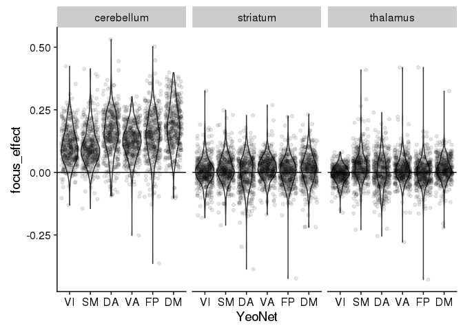<!-- -->

Recreating the DM plot from the poster to double check


```r
net_means <- results_pheno %>%
  ungroup() %>%
  group_by(YeoNet, subcort_ROI, subcort_NET, subid) %>%
  summarise(netmean_ivertex = mean(ivertex_corr),
            netmean_tvertex = mean(tvertex_corr),
            pint_diff = netmean_ivertex - netmean_tvertex) 

pint_diff_sub_DM <- net_means %>%
  ungroup() %>% 
  filter(YeoNet == "DM", subcort_ROI == "striatum") %>%
  select(subid, subcort_NET, pint_diff) %>%
  spread(subcort_NET, pint_diff) %>%
  mutate(overall_pint_diff = DM - (SM + VA + FP)/3,
         x_val = '') %>%
  select(subid, overall_pint_diff, x_val) %>%
  ggplot(aes(y = overall_pint_diff, x = x_val)) +
    geom_boxplot(outlier.shape = NA) +
    geom_jitter(alpha = 0.3, color = '#cd3e4e', fill = "grey") +
    geom_hline(yintercept = 0) + 
    labs(y = "Change in correlation after PINT", x = "Striatum DM - Others") +
  scale_y_continuous(limits = c(-0.3, 0.3))

DM_submeans_plot <- net_means %>%
  mutate(is_DM = if_else(subcort_NET == 'DM', TRUE, FALSE)) %>%
  filter(YeoNet == "DM", 
         subcort_ROI == "striatum",
         subcort_NET %in% c('SM', "VA", "DM", 'FP')) %>%
  ggplot(aes(y = pint_diff, x = subcort_NET, color = is_DM)) +
  geom_boxplot(color = "black") + 
  geom_jitter(alpha = 0.3) +
  geom_hline(yintercept = 0) +
  scale_color_manual(values = c('black','#cd3e4e')) +
  labs(y = "Change in correlation after PINT", color = NULL, x = "Subregion of Striatum") +
  theme(legend.position = "none") +
  scale_y_continuous(limits = c(-0.3, 0.3))

# DM_brain_pic <- ggdraw + draw_image('DM_striatum_pic.png')

plot_grid(pint_diff_sub_DM, DM_submeans_plot, rel_widths = c(1,2.5))
```

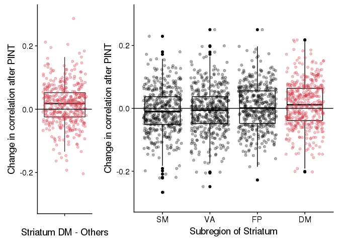<!-- -->

Also the VA Striatum one


```r
pint_diff_sub_VA <- net_means %>%
  ungroup %>% 
  filter(YeoNet == "VA", subcort_ROI == "striatum") %>%
  select(subid, subcort_NET, pint_diff) %>%
  spread(subcort_NET, pint_diff) %>%
  mutate(overall_pint_diff = VA - (SM + DM + FP)/3,
         x_val = '') %>%
  select(subid, overall_pint_diff, x_val) %>%
  ggplot(aes(y = overall_pint_diff, x = x_val)) +
    geom_boxplot() +
    geom_jitter(alpha = 0.3, color = '#c43afa', fill = "grey") +
    geom_hline(yintercept = 0) + 
    labs(y = "Change in correlation after PINT", x = "Striatum VA - Others") +
  scale_y_continuous(limits = c(-0.3, 0.3))

VA_submeans_plot <- net_means %>%
  mutate(is_VA = if_else(subcort_NET == 'VA', TRUE, FALSE),
          SubCort_ROI = factor(subcort_NET, 
                               levels = c("VA", 'SM', 'FP', "DM"))) %>%
  filter(YeoNet == "VA", 
         subcort_ROI == "striatum",
         subcort_NET %in% c('SM', "VA", "DM", 'FP')) %>%
  ggplot(aes(y = pint_diff, x = SubCort_ROI, color = is_VA)) +
  geom_boxplot(color = "black") + 
  geom_jitter(alpha = 0.3) +
  geom_hline(yintercept = 0) +
  scale_color_manual(values = c('black','#c43afa')) +
  labs(y = "Change in correlation after PINT", color = NULL, x = "Subregion of Striatum") +
  theme(legend.position = "none") +
  scale_y_continuous(limits = c(-0.3, 0.3))

# DM_brain_pic <- ggdraw + draw_image('DM_striatum_pic.png')

plot_grid(pint_diff_sub_VA, VA_submeans_plot, rel_widths = c(1,2.5))
```

```
## Warning: Removed 4 rows containing non-finite values (stat_boxplot).
```

```
## Warning: Removed 4 rows containing missing values (geom_point).
```

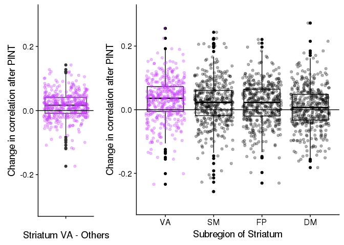<!-- -->
## Plotting the PINT effect separately in SSD and controls

Note that the circle denotes an uncorrected p<0.05


```r
net_means_byDX <- results_pheno %>%
  mutate(corr_diff = ivertex_corr - tvertex_corr) %>%
  group_by(YeoNet, subcort_ROI, subcort_NET, subid, DX) %>%
  summarise(netmean_ivertex = mean(ivertex_corr),
            netmean_tvertex = mean(tvertex_corr)) %>%
  ungroup() %>%
  group_by(YeoNet, subcort_ROI, subcort_NET, DX) %>%
  do(tidy(t.test(.$netmean_ivertex, .$netmean_tvertex, paired = TRUE)))

net_means_byDX %>%
  ungroup() %>%
  mutate(sig = if_else(p.value < 0.005, '*', NA_character_) ) %>%
ggplot(aes(x = YeoNet, y = subcort_NET, fill = statistic)) + 
  geom_tile(color = "black", na.rm = TRUE) +
  geom_point(aes(shape = sig), na.rm = TRUE) +
  scale_fill_gradient2() +
  theme(axis.text.x = element_text(angle = 90, hjust = 1)) +
  facet_grid(subcort_ROI ~ DX)
```

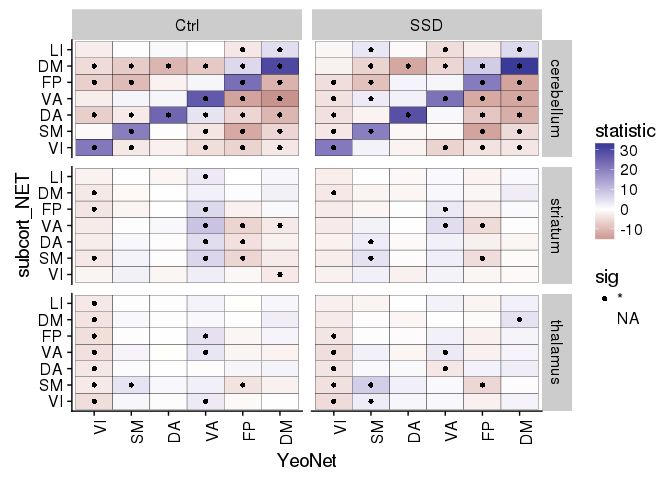<!-- -->


```r
results_pheno %>%
  group_by(YeoNet, subcort_ROI, subcort_NET, subid, DX, age) %>%
  summarise(netmean_ivertex = mean(ivertex_corr),
            netmean_tvertex = mean(tvertex_corr)) %>%
  gather(vertex_type, netmean_corZ, netmean_ivertex, netmean_tvertex) %>%
  filter(age > 17, age < 51) %>%
  ggplot(aes(x = YeoNet, y=subcort_NET, fill = netmean_corZ)) +
  geom_tile(color = "black") +
  scale_fill_gradient2(breaks = c(-0.5,0.5)) +
  facet_grid(subcort_ROI ~ DX*vertex_type)
```

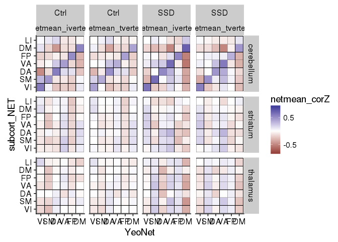<!-- -->

## running model again with sex interaction


```r
library(knitr)

DX_lm_model <- results_pheno %>%
  gather(vertex_type, corZ, ivertex_corr, tvertex_corr) %>%
  filter(age > 17, age < 51) %>%
  group_by(vertex_type, subcort_ROI, subcort_NET, PINT_ROI) %>%
  do(tidy(lm(corZ ~ DX + Sex + mean_fd_pt + poly(Age_std,2) + Edu_std + Site,.))) %>%
  select(vertex_type, subcort_ROI, subcort_NET, PINT_ROI, term, statistic, p.value) %>%
  ungroup() %>%
  group_by(term) %>%
  mutate(p_FDR = p.adjust(p.value, method = "fdr")) %>%
  arrange(p.value)

DX_lm_model %>% 
  filter(term %in% c("DXSSD", "SexM")) %>%
  filter(p.value < 0.1) 
```

```
## # A tibble: 1,322 x 8
## # Groups:   term [2]
##     vertex_type subcort_ROI subcort_NET PINT_ROI  term statistic
##           <chr>       <chr>      <fctr>    <chr> <chr>     <dbl>
##  1 ivertex_corr    thalamus          SM    SMI1R DXSSD  5.582403
##  2 ivertex_corr    thalamus          SM    SMF1R DXSSD  4.517097
##  3 ivertex_corr    thalamus          SM    SMI1L DXSSD  4.496493
##  4 tvertex_corr  cerebellum          VI    VI04R DXSSD -4.408996
##  5 ivertex_corr  cerebellum          LI    VAP2R DXSSD -4.405017
##  6 tvertex_corr  cerebellum          LI    VAI1R DXSSD -4.385389
##  7 ivertex_corr    striatum          VA    VAF1R DXSSD -4.346744
##  8 ivertex_corr    thalamus          SM    SMF3R DXSSD  4.335110
##  9 ivertex_corr    thalamus          VI    SMI1R DXSSD  4.218134
## 10 tvertex_corr  cerebellum          DA    VAF2L DXSSD  4.200467
## # ... with 1,312 more rows, and 2 more variables: p.value <dbl>,
## #   p_FDR <dbl>
```


```r
DX_lm_model <- results_pheno %>%
  group_by(YeoNet, subcort_ROI, subcort_NET, hemisphere, 
           subid, DX, Age_std, Sex, Site, Edu_std, mean_fd_pt) %>%
  summarise(netmean_ivertex = mean(ivertex_corr),
            netmean_tvertex = mean(tvertex_corr)) %>%
  gather(vertex_type, netmean_corZ, netmean_ivertex, netmean_tvertex) %>%
  group_by(vertex_type, subcort_ROI, subcort_NET, YeoNet) %>%
  do(tidy(lm(netmean_corZ ~ DX + Sex + mean_fd_pt + poly(Age_std,2) + Edu_std + Site,.))) %>%
  select(vertex_type, subcort_ROI, YeoNet, term, statistic, p.value) %>%
  ungroup() %>%
  group_by(term) %>%
  mutate(p_FDR = p.adjust(p.value, method = "fdr")) %>%
  arrange(p.value)
```

```
## Adding missing grouping variables: `subcort_NET`
```

```r
kable(DX_lm_model %>% filter(term %in% c("DXSSD"), p.value < 0.06))
```


subcort_NET   vertex_type       subcort_ROI   YeoNet   term     statistic     p.value       p_FDR
------------  ----------------  ------------  -------  ------  ----------  ----------  ----------
SM            netmean_ivertex   thalamus      SM       DXSSD     6.541415   0.0000000   0.0000000
SM            netmean_tvertex   thalamus      SM       DXSSD     5.890276   0.0000000   0.0000007
LI            netmean_ivertex   cerebellum    VA       DXSSD    -5.268703   0.0000002   0.0000147
VI            netmean_ivertex   cerebellum    SM       DXSSD     5.068282   0.0000005   0.0000311
VA            netmean_tvertex   striatum      VA       DXSSD    -4.978616   0.0000008   0.0000332
SM            netmean_tvertex   striatum      VA       DXSSD    -4.950272   0.0000009   0.0000332
VA            netmean_ivertex   striatum      VA       DXSSD    -4.921674   0.0000010   0.0000332
DA            netmean_ivertex   thalamus      VA       DXSSD    -4.876944   0.0000013   0.0000332
DA            netmean_tvertex   thalamus      VA       DXSSD    -4.873796   0.0000013   0.0000332
LI            netmean_tvertex   cerebellum    VA       DXSSD    -4.872398   0.0000013   0.0000332
SM            netmean_ivertex   striatum      VA       DXSSD    -4.773909   0.0000021   0.0000488
DA            netmean_ivertex   cerebellum    DM       DXSSD    -4.703928   0.0000030   0.0000626
DA            netmean_tvertex   cerebellum    DM       DXSSD    -4.631037   0.0000042   0.0000775
SM            netmean_tvertex   cerebellum    VI       DXSSD     4.626428   0.0000043   0.0000775
VI            netmean_tvertex   cerebellum    SM       DXSSD     4.185082   0.0000315   0.0005291
VA            netmean_ivertex   striatum      DM       DXSSD     4.137192   0.0000387   0.0006091
VI            netmean_ivertex   cerebellum    VI       DXSSD    -4.066431   0.0000522   0.0007738
DM            netmean_tvertex   thalamus      VA       DXSSD    -4.025989   0.0000618   0.0008657
DA            netmean_ivertex   cerebellum    SM       DXSSD     4.002905   0.0000681   0.0008786
DM            netmean_tvertex   cerebellum    VA       DXSSD    -3.997092   0.0000697   0.0008786
DM            netmean_tvertex   thalamus      DM       DXSSD     3.951544   0.0000841   0.0009718
VI            netmean_tvertex   cerebellum    VI       DXSSD    -3.949501   0.0000848   0.0009718
DA            netmean_tvertex   cerebellum    SM       DXSSD     3.938263   0.0000888   0.0009734
VI            netmean_ivertex   thalamus      SM       DXSSD     3.905955   0.0001013   0.0010641
DM            netmean_ivertex   cerebellum    DA       DXSSD    -3.768115   0.0001759   0.0017619
DM            netmean_tvertex   striatum      SM       DXSSD     3.759761   0.0001818   0.0017619
LI            netmean_tvertex   thalamus      FP       DXSSD    -3.740713   0.0001959   0.0017797
SM            netmean_ivertex   cerebellum    VA       DXSSD     3.738302   0.0001977   0.0017797
DM            netmean_ivertex   cerebellum    DM       DXSSD     3.705201   0.0002250   0.0019015
VA            netmean_tvertex   striatum      DM       DXSSD     3.703596   0.0002264   0.0019015
DA            netmean_ivertex   striatum      VA       DXSSD    -3.655131   0.0002729   0.0022186
DM            netmean_tvertex   cerebellum    DA       DXSSD    -3.618289   0.0003142   0.0024741
DM            netmean_tvertex   striatum      DA       DXSSD    -3.536323   0.0004278   0.0032670
VI            netmean_tvertex   thalamus      SM       DXSSD     3.501907   0.0004862   0.0036033
LI            netmean_ivertex   thalamus      FP       DXSSD    -3.493422   0.0005016   0.0036118
DM            netmean_tvertex   thalamus      FP       DXSSD    -3.466279   0.0005543   0.0038710
SM            netmean_ivertex   cerebellum    VI       DXSSD     3.459453   0.0005684   0.0038710
VA            netmean_tvertex   thalamus      FP       DXSSD    -3.435509   0.0006203   0.0041134
SM            netmean_tvertex   cerebellum    DA       DXSSD     3.373365   0.0007763   0.0050163
DM            netmean_ivertex   striatum      FP       DXSSD    -3.346889   0.0008533   0.0053650
VI            netmean_tvertex   thalamus      FP       DXSSD    -3.340524   0.0008729   0.0053650
VA            netmean_ivertex   thalamus      DM       DXSSD     3.331040   0.0009028   0.0054165
VI            netmean_ivertex   thalamus      FP       DXSSD    -3.281227   0.0010759   0.0059677
FP            netmean_ivertex   cerebellum    DM       DXSSD    -3.279458   0.0010826   0.0059677
DM            netmean_ivertex   thalamus      VA       DXSSD    -3.276998   0.0010920   0.0059677
DM            netmean_ivertex   cerebellum    VA       DXSSD    -3.276951   0.0010921   0.0059677
VA            netmean_ivertex   striatum      SM       DXSSD     3.271532   0.0011130   0.0059677
DM            netmean_ivertex   thalamus      DM       DXSSD     3.247010   0.0012122   0.0063121
DA            netmean_tvertex   cerebellum    VA       DXSSD     3.237206   0.0012541   0.0063121
LI            netmean_tvertex   thalamus      DA       DXSSD    -3.235434   0.0012618   0.0063121
VI            netmean_tvertex   cerebellum    DA       DXSSD     3.231873   0.0012774   0.0063121
FP            netmean_tvertex   striatum      SM       DXSSD     3.224740   0.0013093   0.0063450
DA            netmean_tvertex   striatum      VA       DXSSD    -3.205524   0.0013988   0.0066509
DM            netmean_tvertex   thalamus      DA       DXSSD    -3.144231   0.0017234   0.0080427
FP            netmean_ivertex   thalamus      FP       DXSSD    -3.134479   0.0017811   0.0081605
DM            netmean_ivertex   striatum      SM       DXSSD     3.121193   0.0018624   0.0082224
SM            netmean_ivertex   striatum      DM       DXSSD     3.116086   0.0018946   0.0082224
FP            netmean_ivertex   striatum      FP       DXSSD    -3.107864   0.0019475   0.0082224
VA            netmean_tvertex   cerebellum    VA       DXSSD     3.107399   0.0019505   0.0082224
DM            netmean_ivertex   thalamus      DA       DXSSD    -3.105266   0.0019645   0.0082224
VA            netmean_ivertex   thalamus      FP       DXSSD    -3.099988   0.0019994   0.0082224
FP            netmean_tvertex   thalamus      FP       DXSSD    -3.095397   0.0020303   0.0082224
SM            netmean_ivertex   thalamus      FP       DXSSD    -3.091680   0.0020556   0.0082224
FP            netmean_tvertex   striatum      FP       DXSSD    -3.020298   0.0026013   0.0102426
DM            netmean_tvertex   striatum      DM       DXSSD     3.003669   0.0027461   0.0106466
DM            netmean_ivertex   thalamus      FP       DXSSD    -2.993981   0.0028339   0.0108203
DM            netmean_tvertex   striatum      FP       DXSSD    -2.977071   0.0029932   0.0111475
FP            netmean_ivertex   striatum      SM       DXSSD     2.975542   0.0030081   0.0111475
VA            netmean_tvertex   thalamus      DM       DXSSD     2.966489   0.0030971   0.0113111
VA            netmean_tvertex   striatum      SM       DXSSD     2.957043   0.0031925   0.0114931
FP            netmean_tvertex   thalamus      DM       DXSSD     2.933645   0.0034407   0.0122120
SM            netmean_tvertex   striatum      DM       DXSSD     2.929248   0.0034892   0.0122123
VA            netmean_tvertex   thalamus      SM       DXSSD     2.878577   0.0040955   0.0141380
VA            netmean_ivertex   thalamus      SM       DXSSD     2.852111   0.0044489   0.0150776
SM            netmean_tvertex   thalamus      FP       DXSSD    -2.848602   0.0044978   0.0150776
DA            netmean_tvertex   thalamus      DM       DXSSD     2.845091   0.0045472   0.0150776
VI            netmean_ivertex   cerebellum    DA       DXSSD     2.829351   0.0047748   0.0156265
VA            netmean_ivertex   cerebellum    VA       DXSSD     2.770301   0.0057233   0.0184908
FP            netmean_tvertex   striatum      DA       DXSSD    -2.719377   0.0066747   0.0212914
VI            netmean_tvertex   cerebellum    VA       DXSSD     2.694174   0.0071963   0.0226684
FP            netmean_tvertex   thalamus      SM       DXSSD     2.670286   0.0077243   0.0240311
DM            netmean_tvertex   cerebellum    DM       DXSSD     2.657552   0.0080197   0.0241842
DM            netmean_ivertex   striatum      DA       DXSSD    -2.656725   0.0080392   0.0241842
FP            netmean_ivertex   striatum      VA       DXSSD    -2.655788   0.0080614   0.0241842
VA            netmean_tvertex   cerebellum    DM       DXSSD    -2.648062   0.0082464   0.0244210
SM            netmean_tvertex   striatum      VI       DXSSD     2.644451   0.0083341   0.0244210
SM            netmean_ivertex   striatum      VI       DXSSD     2.627230   0.0087643   0.0252076
VI            netmean_tvertex   thalamus      DM       DXSSD     2.625732   0.0088027   0.0252076
VA            netmean_tvertex   striatum      FP       DXSSD    -2.591736   0.0097141   0.0275051
FP            netmean_tvertex   cerebellum    DM       DXSSD    -2.580386   0.0100367   0.0279339
SM            netmean_tvertex   cerebellum    VA       DXSSD     2.578637   0.0100872   0.0279339
FP            netmean_tvertex   striatum      VA       DXSSD    -2.526649   0.0116972   0.0320401
DM            netmean_ivertex   striatum      DM       DXSSD     2.521894   0.0118553   0.0321239
LI            netmean_tvertex   cerebellum    SM       DXSSD    -2.478639   0.0133827   0.0358769
SM            netmean_tvertex   thalamus      VI       DXSSD     2.473589   0.0135719   0.0360013
LI            netmean_ivertex   thalamus      VI       DXSSD     2.447080   0.0146046   0.0383370
LI            netmean_tvertex   thalamus      DM       DXSSD     2.421814   0.0156528   0.0406650
VI            netmean_ivertex   thalamus      DM       DXSSD     2.403712   0.0164440   0.0422846
DA            netmean_ivertex   thalamus      DM       DXSSD     2.388100   0.0171545   0.0436659
LI            netmean_tvertex   thalamus      VI       DXSSD     2.374427   0.0177987   0.0448527
FP            netmean_ivertex   thalamus      VA       DXSSD    -2.354865   0.0187573   0.0468004
VA            netmean_ivertex   striatum      FP       DXSSD    -2.342881   0.0193666   0.0478469
DM            netmean_tvertex   cerebellum    FP       DXSSD    -2.326025   0.0202530   0.0495510
FP            netmean_tvertex   thalamus      VA       DXSSD    -2.322284   0.0204545   0.0495627
LI            netmean_tvertex   thalamus      VA       DXSSD    -2.304987   0.0214088   0.0513812
LI            netmean_ivertex   thalamus      DA       DXSSD    -2.258028   0.0241983   0.0568355
VA            netmean_ivertex   cerebellum    SM       DXSSD     2.257424   0.0242361   0.0568355
FP            netmean_ivertex   thalamus      SM       DXSSD     2.255483   0.0243581   0.0568355
FP            netmean_tvertex   striatum      DM       DXSSD     2.249289   0.0247509   0.0572223
DA            netmean_ivertex   cerebellum    DA       DXSSD     2.237596   0.0255073   0.0584350
LI            netmean_ivertex   thalamus      VA       DXSSD    -2.140753   0.0325796   0.0739644
FP            netmean_ivertex   thalamus      DM       DXSSD     2.060195   0.0396856   0.0892925
SM            netmean_ivertex   cerebellum    DA       DXSSD     2.032552   0.0424101   0.0945782
LI            netmean_ivertex   thalamus      DM       DXSSD     2.015892   0.0441273   0.0975446
VA            netmean_tvertex   cerebellum    DA       DXSSD     2.007179   0.0450487   0.0987154
VA            netmean_tvertex   striatum      DA       DXSSD    -2.002572   0.0455423   0.0989367
VI            netmean_tvertex   thalamus      VI       DXSSD     1.988889   0.0470356   0.1004843
VA            netmean_ivertex   cerebellum    DM       DXSSD    -1.988739   0.0470522   0.1004843
SM            netmean_tvertex   thalamus      DM       DXSSD     1.959219   0.0504156   0.1067625
VI            netmean_ivertex   striatum      VA       DXSSD    -1.941222   0.0525635   0.1103834
VA            netmean_ivertex   cerebellum    DA       DXSSD     1.922887   0.0548301   0.1141916
FP            netmean_tvertex   cerebellum    FP       DXSSD     1.901210   0.0576144   0.1190069

```r
DX_lm_model %>%
  filter(term == "DXSSD") %>%
  select(subcort_ROI, subcort_NET, vertex_type, YeoNet, statistic) %>%
  spread(vertex_type, statistic) %>%
  ggplot(aes(x = netmean_ivertex, y = netmean_tvertex)) +
  geom_point(aes(color=YeoNet)) +
  geom_abline(slope = 1, intercept =0) +
  facet_wrap(~subcort_NET)
```

```
## Adding missing grouping variables: `term`
```

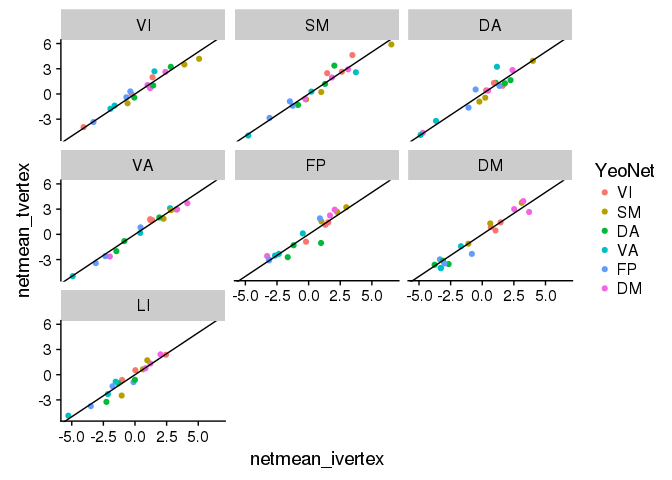<!-- -->


```r
DX_lm_model %>%
  mutate(matchnet = if_else(as.character(subcort_NET)==as.character(YeoNet), TRUE, FALSE)) %>%
  filter(term == "DXSSD",
         matchnet==TRUE) %>%
  select(subcort_ROI, subcort_NET, vertex_type, YeoNet, statistic, term) %>%
  spread(vertex_type, statistic) %>%
  ggplot(aes(x = netmean_ivertex, y = netmean_tvertex)) +
  geom_point(aes(color=subcort_NET)) +
  geom_abline(slope = 1, intercept = 0)
```

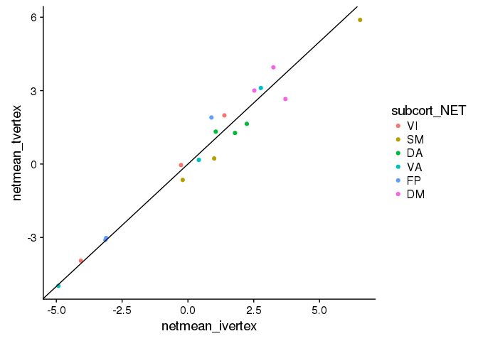<!-- -->


##################################### Edit from Here! ################################################################


```r
DX_lm_model %>%
  filter(term == "DXSSD") %>%
ggplot(aes(x = YeoNet, y=subcort_NET, fill = statistic)) +
  geom_tile(color = "black") +
  scale_fill_gradient2(breaks = c(-4.5,-4.5)) +
  facet_grid(subcort_ROI~ vertex_type)
```

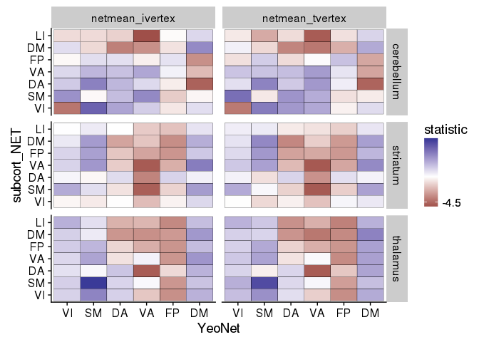<!-- -->


```r
fig1 <- results_pheno %>%
  group_by(YeoNet, subcort_ROI, subcort_NET, 
           subid, DX, Age_std, Sex, Site, Edu_std, mean_fd_pt) %>%
  summarise(Personalized = mean(ivertex_corr),
            Template = mean(tvertex_corr)) %>%
  gather(vertex_type, netmean_corZ, Personalized, Template) %>%
  filter(YeoNet == "VA", subcort_NET == "VA") %>%
  ggplot(aes(y = netmean_corZ, x = DX, color = DX)) + 
  geom_boxplot(outlier.shape = NA) + 
  geom_dotplot(aes(fill = Sex), 
               binaxis = 'y', stackdir = 'center', binwidth = 0.025, alpha = 0.5) +
  scale_color_brewer(palette = "Dark2") +
  facet_grid(subcort_ROI ~ Site*vertex_type) +
  labs(y = "Striatum- Cortex Resting State Correlation (Z)")

#ggsave(fig1, filename = 'VA_results.png',height = 8, width = 5)

fig1
```

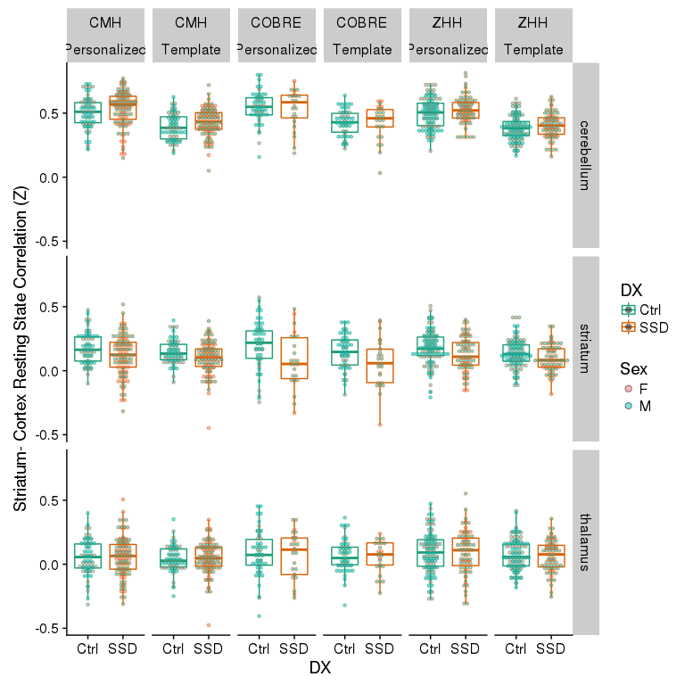<!-- -->

```r
fig2 <- results_pheno %>%
  group_by(YeoNet, subcort_ROI, subcort_NET,
           subid, DX, Age_std, Sex, Site, Edu_std, mean_fd_pt) %>%
  summarise(Personalized = mean(ivertex_corr),
            Template = mean(tvertex_corr)) %>%
  gather(vertex_type, netmean_corZ, Personalized, Template) %>%
  filter(YeoNet == "DM", subcort_NET == "DM") %>%
  ggplot(aes(y = netmean_corZ, x = DX, color = DX)) + 
  geom_boxplot(outlier.shape = NA) +  
  geom_dotplot(aes(fill = Sex), 
               binaxis = 'y', stackdir = 'center', binwidth = 0.025, alpha = 0.5) +
  scale_color_brewer(palette = "Dark2") +
  facet_grid(subcort_ROI ~ Site*vertex_type) +
  labs(y = "Striatum- Cortex Resting State Correlation (Z)")

#ggsave(fig2, filename = 'DM_results.png',height = 8, width = 5)

fig2
```

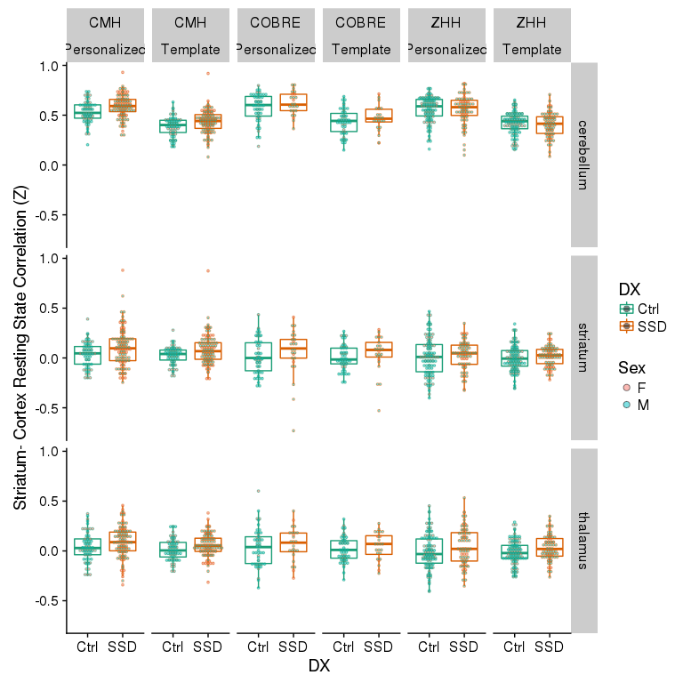<!-- -->


