# Sub-cortical Cortical Stats Split by Hemisphere

# Sub-cortical Cortical Stats Left and Right

This analysis tries to combine timeseries data from PINT outputs with subcortical timeseries to ask two questions

1. "External" validation of PINT. If PINT is indeed helping us better target meaningful resting state networks than we should see "cleaner" patterns of between the PINT output cortical ROIs and parcels of the subcortical structure that have been associated with these networks in literature.
   + i.e. connectivity of the cortical ROIS with "expected" subcortical parcel should increae and correlation with other parcels should decrease after PINT.
   
2. To interograte SSD related differences in Cortical-Subcortical connectivity - and to see if they persist after PINT.

Some work Ji (in prep) kinda suggests that there might be differences between left and right subcortical structures. AND spliting the left and right seemed to make more sense for whole brain correlations (because our cortical nodes have a hemisphere). So in this analysis have separate left and right ROIs


```r
library(tidyverse)
library(broom)
library(knitr)
library(tableone)
library(cowplot)
```


## The paths to data


```r
pint_outputs <- '../data/PINT_outputs_s8_6-6-12/'
subcortical_outputs_dir <- '/KIMEL/tigrlab/projects/dmiranda/subcortical_split_LR/output_ts'

Yeo7_2011_80verts <- read_csv("../templates/Yeo7_2011_80verts.csv",
                              col_types = c(
                                hemi = col_character(),
                                tvertex = col_integer(),
                                LRpairs = col_integer(),
                                roiidx = col_integer(),
                                NETWORK = col_integer(),
                                LOBE = col_character(),
                                SHORTNAME = col_character(),
                                x = col_integer(),
                                y = col_integer(),
                                z = col_integer()
                              ))
```

# read and mangle the phenotypic data


```r
## reading in the qced_sublists csv to get the sublists
pheno <- read_csv("../phenotypic/subjects_not_sexmatched_20180507.csv", 
                  col_types = c(
  subid = col_character(),
  name = col_character(),
  Site = col_character(),
  DX = col_character(),
  age = col_integer(),
  Sex = col_character(),
  Edu = col_double(),
  mean_fd = col_double(),
  X.bad_fd = col_double(),
  global_corr = col_double(),
  mean_snfr = col_double()
))
```

## adding transformed variables 


```r
transform_to_normal <- function(X) {
  # calculate the best exponent using powerTransform:
  pT <- car::powerTransform(X)
  # apply the power transform and save the result to a new variable
  X_pT <- X^pT$lambda ## note ^ is exponent in r
  return(X_pT)
}

pheno <- pheno %>%
  mutate(Age_pt = transform_to_normal(age),
         mean_fd_pt = transform_to_normal(mean_fd),
         Edu_std = scale(Edu)[,1],
         Age_std = scale(age)[,1])
```


# Code for reading in all the timeseries..

## searching for the meants files


```r
pint_outputlist <- tibble("filepath" = list.files(pint_outputs, 
                                                      recursive = T,
                                                      pattern = "_summary.csv")) %>%
  separate(filepath, into = c("subid", "summary_file"), sep = '/')

subcort_outputlist <- tibble("subid" = list.files(subcortical_outputs_dir, 
                                                      recursive = F))

pint_outputlist <- inner_join(pint_outputlist, subcort_outputlist, by = "subid")
```


```r
list.files(file.path(subcortical_outputs_dir, subcort_outputlist$subid[1]))
```

```
## [1] "ASDD_CMH_HEF003_01_s0_L_rsn_cerebellum_7networks_networks_MWfix.dlabel_meants.csv"
## [2] "ASDD_CMH_HEF003_01_s0_L_rsn_striatum_7networks_networks_MWfix.dlabel_meants.csv"  
## [3] "ASDD_CMH_HEF003_01_s0_L_rsn_thalamus_7networks_networks_MWfix.dlabel_meants.csv"  
## [4] "ASDD_CMH_HEF003_01_s0_R_rsn_cerebellum_7networks_networks_MWfix.dlabel_meants.csv"
## [5] "ASDD_CMH_HEF003_01_s0_R_rsn_striatum_7networks_networks_MWfix.dlabel_meants.csv"  
## [6] "ASDD_CMH_HEF003_01_s0_R_rsn_thalamus_7networks_networks_MWfix.dlabel_meants.csv"
```


A table that describes the current expected subortical files


```r
# a tibble table to specify the subcortical meants files that were generated
YeoNet_subcort_list <- c('VI','SM','DA','VA', 'LI','FP','DM')
```

These functions are for reading timeseries files


```r
#' read a meants file generated by PINT of ciftify_meants
#'
#' @param filepath the full path to the file
#'
#' @return a dataframe where rows are rois and colums are timepoints
read_meants_csv <- function(filepath) {
   meants <-read_csv(filepath, 
                     col_names = FALSE,
                     col_types = c(.default = col_double()))
   return(meants)
}

#' Read the contents of a subcortical csv
#' expample file path is ASDD_CMH_HEF003_01_s0_L_rsn_cerebellum_7networks_networks_MWfix.dlabel_meants.csv
#'
#' @param subid The subject identifier
#' @param hemi The hemisphere "L" or "R"
#' @param subregion region "thalamus", "stiatum", "cerebellum"
#' @param pint_outputs the basepath of the pint outputs
#'
#' @return a dataframe of the _meants.csv contents
read_subcortical_hemi_meants <- function(subid, hemi, subregion, subcortical_outputs_dir) {
  expected_filepath <- file.path(subcortical_outputs_dir, subid, 
                           str_c(subid, '_s0_', hemi, '_rsn_', subregion, '_7networks_networks_MWfix.dlabel_meants.csv'))
  meants = read_meants_csv(expected_filepath)
  return(meants)
}

#' Read the contents of a csv generated by PINT
#'
#' @param subid The subject identifier
#' @param vertex_type "ivertex" or "tvertex"
#' @param pint_outputs the basepath of the pint outputs
#'
#' @return a dataframe of the _meants.csv contents
read_pint_meants <- function(subid, vertex_type, pint_outputs) {
  expected_filepath <- file.path(pint_outputs, subid, 
                           str_c(subid, '_', vertex_type, '_meants.csv'))
  meants = read_meants_csv(expected_filepath)
  return(meants)
}
```


This reads all files and generate PINT to subcortical correlation values for a given subject


```r
the_subcortical_guide <- tribble(
 ~subcort_hemi, ~subcort_ROI, ~subcort_NET,
 "L", "thalamus", c('VI','SM','DA','VA', 'FP','DM'),
 "L", "striatum", c('SM','DA','VA', 'LI','FP','DM'),
 "L", "cerebellum", c('VI','SM','DA','VA', 'LI','FP','DM'),
 "R", "thalamus", c('VI','SM','DA','VA', 'LI','FP','DM'),
 "R", "striatum", c('VI','SM','DA','VA', 'LI','FP','DM'),
 "R", "cerebellum", c('VI','SM','DA','VA', 'LI','FP','DM')) %>%
  unnest()


#' read all fMRI timeseries data for one subject and correlates PINT ROIs with subcortex
#'
#' @param subid the subject id
#' @param pint_outputs the path to the pint output directory
#' @param subcortical_outputs_dir the path to the subcortical timeseries directory
#' @param Yeo7_2011_80verts as data frame describing the PINT ROIs 
#'
#' @return a dataframe (graph style) of PINT ROI to subcortical correlations
subject_subcort_corrs <- function(subid, pint_outputs, subcortical_outputs_dir,
                                  Yeo7_2011_80verts) {
  
  # read the pint meants files
  ivertex_meants <- read_pint_meants(subid, 'ivertex', pint_outputs)
  tvertex_meants <- read_pint_meants(subid, 'tvertex', pint_outputs)
  
  # read the subcortical meants files
  thalamus_L_meants <- read_subcortical_hemi_meants(subid, "L","thalamus", subcortical_outputs_dir)
  striatum_L_meants <- read_subcortical_hemi_meants(subid, "L","striatum", subcortical_outputs_dir)
  cerebellum_L_meants <- read_subcortical_hemi_meants(subid, "L", "cerebellum", subcortical_outputs_dir)
  thalamus_R_meants <- read_subcortical_hemi_meants(subid, "R","thalamus", subcortical_outputs_dir)
  striatum_R_meants <- read_subcortical_hemi_meants(subid, "R","striatum", subcortical_outputs_dir)
  cerebellum_R_meants <- read_subcortical_hemi_meants(subid, "R", "cerebellum", subcortical_outputs_dir)
  
  # prepare to bind
  subcort_meants <- bind_rows(thalamus_L_meants, striatum_L_meants, cerebellum_L_meants,
                              thalamus_R_meants, striatum_R_meants, cerebellum_R_meants)
  
  # correlate the ivertex timeseries with the subcortical data
  ivertex_subcortcorr <- as.data.frame(cor(t(subcort_meants), t(ivertex_meants)))
  names(ivertex_subcortcorr) <- Yeo7_2011_80verts$SHORTNAME
  ivertex_result <- the_subcortical_guide %>% 
    bind_cols(ivertex_subcortcorr) %>%
    gather(PINT_ROI, ivertex_corr, -subcort_ROI, -subcort_NET, -subcort_hemi)
  
  # correlated the tvertex timeseries with the subcortical data
  tvertex_subcortcorr <- as.data.frame(cor(t(subcort_meants), t(tvertex_meants)))
  names(tvertex_subcortcorr) <- Yeo7_2011_80verts$SHORTNAME
  tvertex_result <- the_subcortical_guide %>% 
    bind_cols(tvertex_subcortcorr) %>%
    gather(PINT_ROI, tvertex_corr, -subcort_ROI, -subcort_NET, -subcort_hemi)
  
  # combine ivertex and tvertex and return
  subresult <- ivertex_result %>%
    inner_join(tvertex_result, by = c("PINT_ROI", "subcort_ROI", "subcort_NET", "subcort_hemi"))
  return(subresult)
}

run_read_subject_subcort_corrs <- function(subid) {
  df <-subject_subcort_corrs(subid, pint_outputs, subcortical_outputs_dir,
                                  Yeo7_2011_80verts)
  return(df)
}

# run_read_subject_subcort_corrs(subcort_outputlist$subid[1])
```


### This reads all the subcortical files it can find


```r
all_subcort_results <- pint_outputlist %>%
  mutate(subcort_corrs = map(subid, ~run_read_subject_subcort_corrs(.x)))
```


### merge with the phenotypic data


```r
results_pheno <- all_subcort_results %>%
  inner_join(pheno, by = "subid") %>%
  unnest() %>%
  mutate(YeoNet = str_sub(PINT_ROI, 1,2),
         hemisphere = str_sub(PINT_ROI, 5,5)) %>%
  mutate(conn_type = if_else(YeoNet == subcort_NET, "same_net", "diff_net"),
         YeoNet = factor(YeoNet, levels = c("VI", "SM", "DA", "VA", "FP", "DM")),
         subcort_NET = factor(subcort_NET, levels = c("VI", "SM", "DA", "VA", "FP", "DM", "LI"))) %>%
  #       ) %>%
  select(subid, PINT_ROI, subcort_ROI, subcort_NET,subcort_hemi, 
         ivertex_corr, tvertex_corr, 
         DX, Edu, Sex, mean_fd, age, Site,
         Age_pt, mean_fd_pt, Edu_std, Age_std, 
         YeoNet, hemisphere, conn_type) 
```


## make a subject table from resuts pheno


```r
library(tableone)
therealtable1 <- CreateTableOne(
  strata = c("Site", "DX"),
  vars = c("age", "Edu", "Sex"),
  data = filter(results_pheno, PINT_ROI=="DMP1L",subcort_ROI=="thalamus", subcort_NET=="VA", subcort_hemi == "L")
)

print(therealtable1)
```

```
##                  Stratified by Site:DX
##                   CMH:Ctrl      COBRE:Ctrl    ZHH:Ctrl      CMH:SSD      
##   n                  66            53           104           105        
##   age (mean (sd)) 27.41 (7.79)  33.47 (9.46)  26.53 (6.19)  31.22 (8.47) 
##   Edu (mean (sd)) 15.91 (1.92)  14.41 (1.51)  14.82 (1.93)  13.69 (2.11) 
##   Sex = M (%)        32 (48.5)     36 (67.9)     50 (48.1)     64 (61.0) 
##                  Stratified by Site:DX
##                   COBRE:SSD     ZHH:SSD       p      test
##   n                  25            74                    
##   age (mean (sd)) 26.36 (5.68)  26.92 (7.89)  <0.001     
##   Edu (mean (sd)) 13.15 (1.72)  12.74 (2.00)  <0.001     
##   Sex = M (%)        21 (84.0)     54 (73.0)  <0.001
```

# Is PINT "focusing" cortical subcortical connectivity


```r
table1 <- results_pheno %>%
  mutate(corr_diff = ivertex_corr - tvertex_corr) %>%
  gather(corr_type, rval, ivertex_corr, tvertex_corr) %>%
  group_by(corr_type, YeoNet, subcort_ROI, subcort_NET) %>%
  summarise(n = n(),
            Mean = mean(rval),
            SD = sd(rval)) 
  
ggplot(table1, aes(y = YeoNet, x = subcort_NET, fill = Mean)) + 
  geom_tile() +
  scale_fill_gradient2(breaks = c(-0.5,0.5)) +
  theme(axis.text.x = element_text(angle = 90, hjust = 1)) +
  facet_grid(subcort_ROI~corr_type) 
```

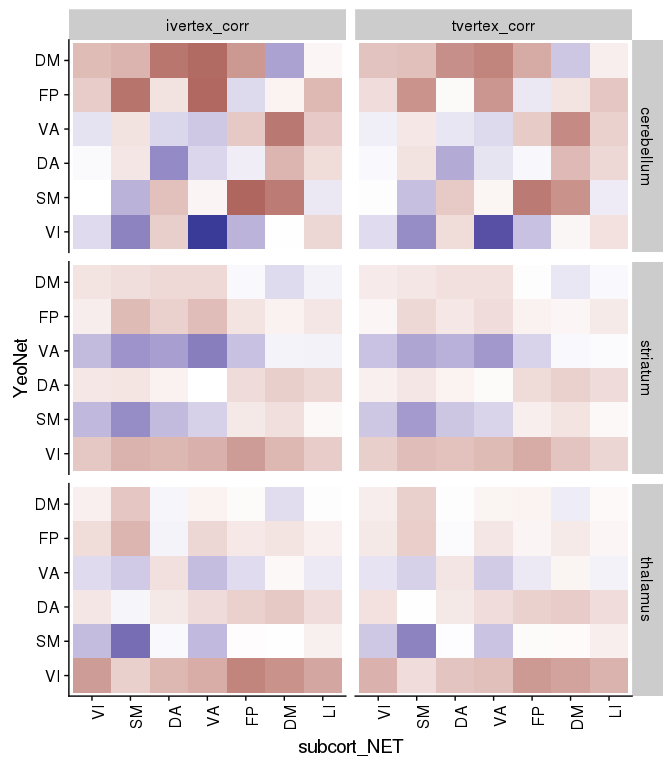<!-- -->


```r
table1 <- results_pheno %>%
  mutate(corr_diff = ivertex_corr - tvertex_corr) %>%
  gather(corr_type, rval, ivertex_corr, tvertex_corr) %>%
  group_by(corr_type, YeoNet, hemisphere, subcort_ROI, subcort_NET, subcort_hemi) %>%
  summarise(n = n(),
            Mean = mean(rval),
            SD = sd(rval)) 
  
ggplot(table1, aes(y = YeoNet, x = subcort_NET, fill = Mean)) + 
  geom_tile() +
  scale_fill_gradient2(breaks = c(-0.5,0.5)) +
  theme(axis.text.x = element_text(angle = 90, hjust = 1)) +
  facet_grid(subcort_ROI*subcort_hemi~corr_type*hemisphere) 
```

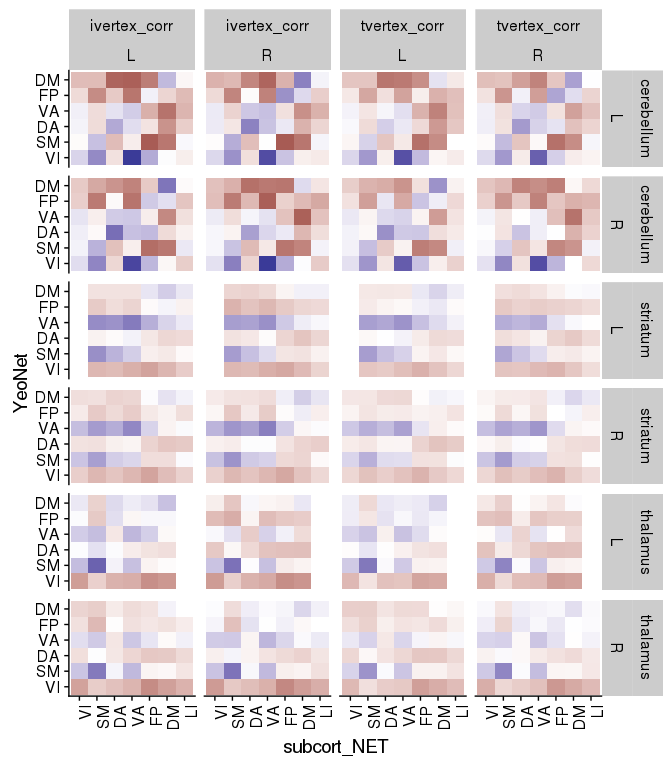<!-- -->

We see in the above figure that the Yeo 7 Network connectivity strongly shows the expected pattern in the cerebeullum. 

Lower evidence is seen in the striatum and thalamus, although there is a faint increase across the diagonal for the SM, VA and DM especially


```r
net_means <- results_pheno %>%
  mutate(corr_diff = ivertex_corr - tvertex_corr) %>%
  group_by(YeoNet, subcort_ROI, subcort_NET, conn_type, subid) %>%
  summarise(netmean_ivertex = mean(ivertex_corr),
            netmean_tvertex = mean(tvertex_corr)) %>%
  ungroup()

net_means_pint_t <- net_means %>%
  group_by(YeoNet, subcort_ROI, subcort_NET) %>%
  do(tidy(t.test(.$netmean_ivertex, .$netmean_tvertex, paired = TRUE)))

net_means_pint_t %>%
  ungroup() %>%
  mutate(sig = if_else(p.value < 0.005, '*', NA_character_) ) %>%
ggplot(aes(x = YeoNet, y = subcort_NET, fill = statistic)) + 
  geom_tile(color = "black", na.rm = TRUE) +
  geom_point(aes(shape = sig), na.rm = TRUE) +
  scale_fill_gradient2() +
  theme(axis.text.x = element_text(angle = 90, hjust = 1)) +
  facet_wrap(~subcort_ROI)
```

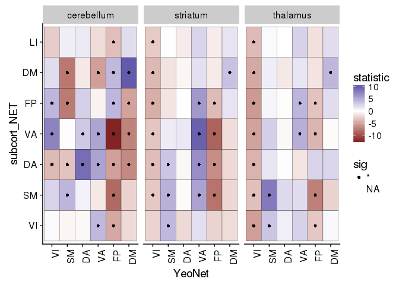<!-- -->
Here we plot the paired t-stat camparing personalized to template, we see a very strong increase in correlation along the diagonal (i.e. with the hypothesized regions) and decreases on the off-dignonal (i.e. decreased connectivity with the other network's parcels)


# trying to calculate an vs off diagonal term


```r
net_focus <- net_means %>%
  ungroup() %>%
  mutate(pint_diff = netmean_ivertex - netmean_tvertex) %>%
  group_by(subid, subcort_ROI, YeoNet, conn_type) %>%
  summarise(nets_avg = mean(pint_diff)) %>%
  ungroup() %>%
  spread(conn_type, nets_avg) %>%
  mutate(focus_effect = same_net - diff_net)

net_focus %>%
  ungroup() %>%
  group_by(subcort_ROI, YeoNet) %>%
  do(tidy(t.test(.$focus_effect)))
```

```
## # A tibble: 18 x 10
## # Groups:   subcort_ROI, YeoNet [18]
##    subcort_ROI YeoNet      estimate  statistic      p.value parameter
##          <chr> <fctr>         <dbl>      <dbl>        <dbl>     <dbl>
##  1  cerebellum     VI -0.0047659275 -1.6132537 1.074299e-01       426
##  2  cerebellum     SM  0.0240744216  8.0340693 9.339774e-15       426
##  3  cerebellum     DA  0.0321199148  9.8185688 1.197763e-20       426
##  4  cerebellum     VA  0.0180189209  7.0265286 8.442477e-12       426
##  5  cerebellum     FP  0.0335569689 11.6594005 1.870876e-27       426
##  6  cerebellum     DM  0.0545063624 15.4075859 6.843483e-43       426
##  7    striatum     VI  0.0043009880  1.6122104 1.076567e-01       426
##  8    striatum     SM  0.0125332101  5.0477420 6.636478e-07       426
##  9    striatum     DA  0.0003754275  0.1465070 8.835905e-01       426
## 10    striatum     VA  0.0151891344  7.5942047 1.979151e-13       426
## 11    striatum     FP  0.0029248501  1.1863331 2.361520e-01       426
## 12    striatum     DM  0.0148824400  5.5008976 6.529981e-08       426
## 13    thalamus     VI -0.0076831266 -4.7642069 2.604573e-06       426
## 14    thalamus     SM  0.0218735418  8.3455226 9.988035e-16       426
## 15    thalamus     DA  0.0006009782  0.2178849 8.276231e-01       426
## 16    thalamus     VA  0.0099186422  4.3878527 1.444955e-05       426
## 17    thalamus     FP -0.0013679467 -0.5526557 5.807891e-01       426
## 18    thalamus     DM  0.0128934344  6.4617382 2.833624e-10       426
## # ... with 4 more variables: conf.low <dbl>, conf.high <dbl>,
## #   method <fctr>, alternative <fctr>
```

In the above table to calcuculated the "focussing" effect as the change (in on person) between in connectivity with the expected parcel subtracted by the change in connectivity from other regions.

Below we plot these values against zero


```r
net_focus %>%
  ungroup() %>%
  ggplot(aes(x = YeoNet, y = focus_effect)) +
  geom_violin() +
  geom_jitter(alpha = 0.1) +
  geom_hline(yintercept = 0) +
  facet_wrap(~ subcort_ROI)
```

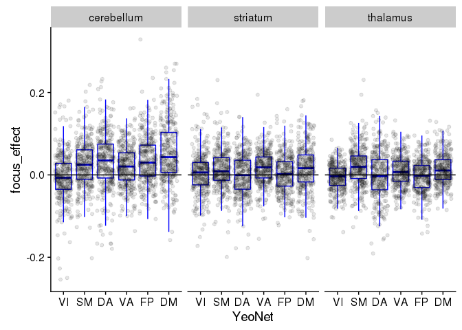<!-- -->

Recreating the DM plot from the poster to double check


```r
net_means <- results_pheno %>%
  ungroup() %>%
  group_by(YeoNet, subcort_ROI, subcort_NET, subid) %>%
  summarise(netmean_ivertex = mean(ivertex_corr),
            netmean_tvertex = mean(tvertex_corr),
            pint_diff = netmean_ivertex - netmean_tvertex) 

pint_diff_sub_DM <- net_means %>%
  ungroup() %>% 
  filter(YeoNet == "DM", subcort_ROI == "striatum") %>%
  select(subid, subcort_NET, pint_diff) %>%
  spread(subcort_NET, pint_diff) %>%
  mutate(overall_pint_diff = DM - (SM + VA + FP)/3,
         x_val = '') %>%
  select(subid, overall_pint_diff, x_val) %>%
  ggplot(aes(y = overall_pint_diff, x = x_val)) +
    geom_boxplot(outlier.shape = NA) +
    geom_jitter(alpha = 0.3, color = '#cd3e4e', fill = "grey") +
    geom_hline(yintercept = 0) + 
    labs(y = "Change in correlation after PINT", x = "Striatum DM - Others") +
  scale_y_continuous(limits = c(-0.3, 0.3))

DM_submeans_plot <- net_means %>%
  mutate(is_DM = if_else(subcort_NET == 'DM', TRUE, FALSE)) %>%
  filter(YeoNet == "DM", 
         subcort_ROI == "striatum",
         subcort_NET %in% c('SM', "VA", "DM", 'FP')) %>%
  ggplot(aes(y = pint_diff, x = subcort_NET, color = is_DM)) +
  geom_boxplot(color = "black") + 
  geom_jitter(alpha = 0.3) +
  geom_hline(yintercept = 0) +
  scale_color_manual(values = c('black','#cd3e4e')) +
  labs(y = "Change in correlation after PINT", color = NULL, x = "Subregion of Striatum") +
  theme(legend.position = "none") +
  scale_y_continuous(limits = c(-0.3, 0.3))

# DM_brain_pic <- ggdraw + draw_image('DM_striatum_pic.png')

plot_grid(pint_diff_sub_DM, DM_submeans_plot, rel_widths = c(1,2.5))
```

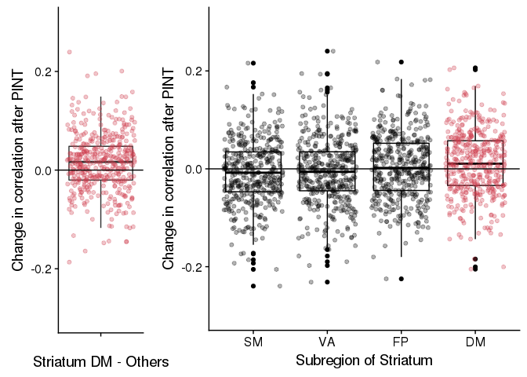<!-- -->

Also the VA Striatum one


```r
pint_diff_sub_VA <- net_means %>%
  ungroup %>% 
  filter(YeoNet == "VA", subcort_ROI == "striatum") %>%
  select(subid, subcort_NET, pint_diff) %>%
  spread(subcort_NET, pint_diff) %>%
  mutate(overall_pint_diff = VA - (SM + DM + FP)/3,
         x_val = '') %>%
  select(subid, overall_pint_diff, x_val) %>%
  ggplot(aes(y = overall_pint_diff, x = x_val)) +
    geom_boxplot() +
    geom_jitter(alpha = 0.3, color = '#c43afa', fill = "grey") +
    geom_hline(yintercept = 0) + 
    labs(y = "Change in correlation after PINT", x = "Striatum VA - Others") +
  scale_y_continuous(limits = c(-0.3, 0.3))

VA_submeans_plot <- net_means %>%
  mutate(is_VA = if_else(subcort_NET == 'VA', TRUE, FALSE),
          SubCort_ROI = factor(subcort_NET, 
                               levels = c("VA", 'SM', 'FP', "DM"))) %>%
  filter(YeoNet == "VA", 
         subcort_ROI == "striatum",
         subcort_NET %in% c('SM', "VA", "DM", 'FP')) %>%
  ggplot(aes(y = pint_diff, x = SubCort_ROI, color = is_VA)) +
  geom_boxplot(color = "black") + 
  geom_jitter(alpha = 0.3) +
  geom_hline(yintercept = 0) +
  scale_color_manual(values = c('black','#c43afa')) +
  labs(y = "Change in correlation after PINT", color = NULL, x = "Subregion of Striatum") +
  theme(legend.position = "none") +
  scale_y_continuous(limits = c(-0.3, 0.3))

# DM_brain_pic <- ggdraw + draw_image('DM_striatum_pic.png')

plot_grid(pint_diff_sub_VA, VA_submeans_plot, rel_widths = c(1,2.5))
```

```
## Warning: Removed 2 rows containing non-finite values (stat_boxplot).
```

```
## Warning: Removed 2 rows containing missing values (geom_point).
```

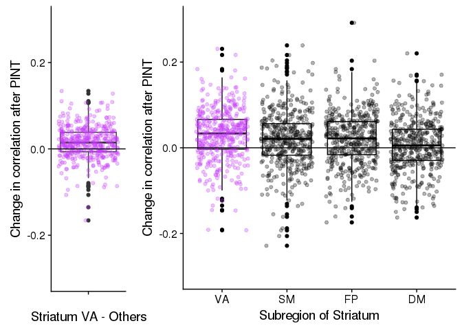<!-- -->
## Plotting the PINT effect separately in SSD and controls

Note that the circle denotes an uncorrected p<0.05


```r
net_means_byDX <- results_pheno %>%
  mutate(corr_diff = ivertex_corr - tvertex_corr) %>%
  group_by(YeoNet, subcort_ROI, subcort_NET, subid, DX) %>%
  summarise(netmean_ivertex = mean(ivertex_corr),
            netmean_tvertex = mean(tvertex_corr)) %>%
  ungroup() %>%
  group_by(YeoNet, subcort_ROI, subcort_NET, DX) %>%
  do(tidy(t.test(.$netmean_ivertex, .$netmean_tvertex, paired = TRUE)))

net_means_byDX %>%
  ungroup() %>%
  mutate(sig = if_else(p.value < 0.005, '*', NA_character_) ) %>%
ggplot(aes(x = YeoNet, y = subcort_NET, fill = statistic)) + 
  geom_tile(color = "black", na.rm = TRUE) +
  geom_point(aes(shape = sig), na.rm = TRUE) +
  scale_fill_gradient2() +
  theme(axis.text.x = element_text(angle = 90, hjust = 1)) +
  facet_grid(subcort_ROI ~ DX)
```

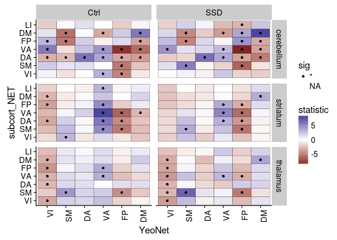<!-- -->


```r
results_pheno %>%
  group_by(YeoNet, subcort_ROI, subcort_NET, subid, DX, age) %>%
  summarise(netmean_ivertex = mean(ivertex_corr),
            netmean_tvertex = mean(tvertex_corr)) %>%
  gather(vertex_type, netmean_corZ, netmean_ivertex, netmean_tvertex) %>%
  filter(age > 17, age < 51) %>%
  ggplot(aes(x = YeoNet, y=subcort_NET, fill = netmean_corZ)) +
  geom_tile(color = "black") +
  scale_fill_gradient2(breaks = c(-0.5,0.5)) +
  facet_grid(subcort_ROI ~ DX*vertex_type)
```

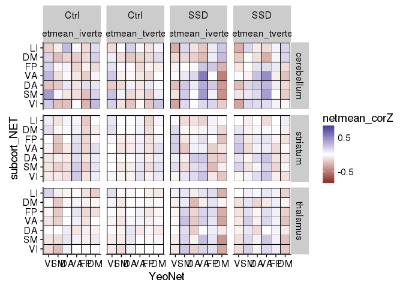<!-- -->

## running model again with sex interaction


```r
library(knitr)

DX_lm_model <- results_pheno %>%
  gather(vertex_type, corZ, ivertex_corr, tvertex_corr) %>%
  filter(age > 17, age < 51) %>%
  group_by(vertex_type, subcort_ROI, subcort_NET, PINT_ROI) %>%
  do(tidy(lm(corZ ~ DX + Sex + mean_fd_pt + poly(Age_std,2) + Edu_std + Site,.))) %>%
  select(vertex_type, subcort_ROI, subcort_NET, PINT_ROI, term, statistic, p.value) %>%
  ungroup() %>%
  group_by(term) %>%
  mutate(p_FDR = p.adjust(p.value, method = "fdr")) %>%
  arrange(p.value)

DX_lm_model %>% 
  filter(term %in% c("DXSSD", "SexM")) %>%
  filter(p.value < 0.1) 
```

```
## # A tibble: 2,038 x 8
## # Groups:   term [2]
##     vertex_type subcort_ROI subcort_NET PINT_ROI  term statistic
##           <chr>       <chr>      <fctr>    <chr> <chr>     <dbl>
##  1 ivertex_corr    thalamus          SM    SMI1R DXSSD  7.104822
##  2 ivertex_corr  cerebellum          VA    SMT1R DXSSD  5.903000
##  3 ivertex_corr    thalamus          SM    SMF1R DXSSD  5.872352
##  4 ivertex_corr  cerebellum          VA    SMF3R DXSSD  5.866917
##  5 ivertex_corr    thalamus          VI    SMI1R DXSSD  5.750574
##  6 ivertex_corr    striatum          VA    VAF1R DXSSD -5.744484
##  7 ivertex_corr    thalamus          SM    SMI1L DXSSD  5.624849
##  8 ivertex_corr    thalamus          SM    SMF3R DXSSD  5.603653
##  9 ivertex_corr  cerebellum          VA    SMF2L DXSSD  5.503323
## 10 ivertex_corr    striatum          VA    VAF1L DXSSD -5.337655
## # ... with 2,028 more rows, and 2 more variables: p.value <dbl>,
## #   p_FDR <dbl>
```


```r
DX_lm_model <- results_pheno %>%
  group_by(YeoNet, subcort_ROI, subcort_NET, hemisphere, subcort_hemi, 
           subid, DX, Age_std, Sex, Site, Edu_std, mean_fd_pt) %>%
  summarise(netmean_ivertex = mean(ivertex_corr),
            netmean_tvertex = mean(tvertex_corr)) %>%
  gather(vertex_type, netmean_corZ, netmean_ivertex, netmean_tvertex) %>%
  group_by(vertex_type, subcort_ROI, subcort_NET, YeoNet, hemisphere, subcort_hemi) %>%
  do(tidy(lm(netmean_corZ ~ DX + Sex + mean_fd_pt + poly(Age_std,2) + Edu_std + Site,.))) %>%
  select(vertex_type, subcort_ROI, YeoNet, term, statistic, p.value) %>%
  ungroup() %>%
  group_by(term) %>%
  mutate(p_FDR = p.adjust(p.value, method = "fdr")) %>%
  arrange(p.value)
```

```
## Adding missing grouping variables: `subcort_NET`, `hemisphere`, `subcort_hemi`
```

```r
kable(DX_lm_model %>% filter(term %in% c("DXSSD"), p.value < 0.06))
```


subcort_NET   hemisphere   subcort_hemi   vertex_type       subcort_ROI   YeoNet   term     statistic     p.value       p_FDR
------------  -----------  -------------  ----------------  ------------  -------  ------  ----------  ----------  ----------
SM            R            L              netmean_ivertex   thalamus      SM       DXSSD     5.377733   0.0000001   0.0000887
VA            R            R              netmean_ivertex   cerebellum    SM       DXSSD     5.303315   0.0000002   0.0000887
VA            R            R              netmean_tvertex   cerebellum    SM       DXSSD     5.036960   0.0000007   0.0002256
VA            L            R              netmean_ivertex   cerebellum    SM       DXSSD     4.808126   0.0000021   0.0005110
VA            L            R              netmean_tvertex   cerebellum    SM       DXSSD     4.615487   0.0000052   0.0008841
SM            R            L              netmean_tvertex   thalamus      SM       DXSSD     4.603281   0.0000055   0.0008841
SM            R            R              netmean_ivertex   cerebellum    SM       DXSSD     4.295285   0.0000217   0.0029784
DM            L            L              netmean_ivertex   cerebellum    DA       DXSSD    -4.233486   0.0000283   0.0033546
SM            L            R              netmean_ivertex   cerebellum    SM       DXSSD     4.208786   0.0000314   0.0033546
SM            R            R              netmean_ivertex   thalamus      SM       DXSSD     4.178158   0.0000358   0.0034369
SM            L            R              netmean_tvertex   cerebellum    SM       DXSSD     3.958909   0.0000885   0.0077216
DM            R            L              netmean_tvertex   cerebellum    DM       DXSSD     3.921619   0.0001028   0.0078041
DM            R            L              netmean_ivertex   cerebellum    DM       DXSSD     3.914661   0.0001057   0.0078041
SM            R            R              netmean_tvertex   thalamus      SM       DXSSD     3.887917   0.0001176   0.0080618
SM            L            L              netmean_ivertex   thalamus      SM       DXSSD     3.864623   0.0001289   0.0082523
VA            R            L              netmean_ivertex   cerebellum    SM       DXSSD     3.740762   0.0002091   0.0125442
VA            R            L              netmean_tvertex   cerebellum    VA       DXSSD     3.678310   0.0002654   0.0149898
VI            R            L              netmean_ivertex   thalamus      SM       DXSSD     3.648942   0.0002966   0.0150211
SM            L            R              netmean_tvertex   striatum      VA       DXSSD    -3.635165   0.0003124   0.0150211
VA            L            L              netmean_tvertex   striatum      VA       DXSSD    -3.634736   0.0003129   0.0150211
DM            L            L              netmean_tvertex   cerebellum    DA       DXSSD    -3.617843   0.0003334   0.0152418
VA            R            L              netmean_tvertex   thalamus      FP       DXSSD    -3.576791   0.0003885   0.0169543
VA            L            L              netmean_ivertex   cerebellum    SM       DXSSD     3.475424   0.0005634   0.0232148
VA            L            L              netmean_tvertex   cerebellum    VA       DXSSD     3.440158   0.0006398   0.0232148
VA            R            L              netmean_ivertex   striatum      VA       DXSSD    -3.434235   0.0006536   0.0232148
DA            L            L              netmean_tvertex   thalamus      VA       DXSSD    -3.432416   0.0006579   0.0232148
VA            R            L              netmean_ivertex   thalamus      SM       DXSSD     3.429902   0.0006638   0.0232148
DM            L            L              netmean_tvertex   thalamus      DM       DXSSD     3.416156   0.0006973   0.0232148
VA            R            R              netmean_ivertex   striatum      VA       DXSSD    -3.414558   0.0007013   0.0232148
DA            R            R              netmean_ivertex   cerebellum    SM       DXSSD     3.388542   0.0007693   0.0246182
SM            R            R              netmean_tvertex   cerebellum    SM       DXSSD     3.370656   0.0008196   0.0253814
VA            L            R              netmean_tvertex   striatum      VA       DXSSD    -3.311301   0.0010093   0.0302785
VA            L            L              netmean_tvertex   cerebellum    SM       DXSSD     3.284240   0.0011086   0.0322516
VA            L            L              netmean_tvertex   thalamus      DM       DXSSD     3.249375   0.0012501   0.0344783
VI            R            L              netmean_tvertex   thalamus      FP       DXSSD    -3.247755   0.0012570   0.0344783
VA            R            R              netmean_tvertex   striatum      VA       DXSSD    -3.235090   0.0013127   0.0350050
SM            R            R              netmean_ivertex   cerebellum    VI       DXSSD    -3.212890   0.0014158   0.0367343
DM            L            L              netmean_ivertex   cerebellum    DM       DXSSD     3.204670   0.0014558   0.0367793
SM            L            L              netmean_tvertex   thalamus      SM       DXSSD     3.191650   0.0015214   0.0367918
DA            R            R              netmean_tvertex   cerebellum    SM       DXSSD     3.189409   0.0015330   0.0367918
DA            R            L              netmean_tvertex   thalamus      VA       DXSSD    -3.174580   0.0016116   0.0377339
VA            R            L              netmean_tvertex   cerebellum    SM       DXSSD     3.143862   0.0017863   0.0389834
SM            R            R              netmean_tvertex   striatum      VA       DXSSD    -3.143551   0.0017881   0.0389834
DM            L            R              netmean_tvertex   cerebellum    DM       DXSSD     3.140997   0.0018034   0.0389834
DA            R            L              netmean_ivertex   thalamus      VA       DXSSD    -3.129491   0.0018738   0.0389834
SM            L            R              netmean_ivertex   thalamus      SM       DXSSD     3.126579   0.0018921   0.0389834
VA            L            L              netmean_ivertex   striatum      VA       DXSSD    -3.111125   0.0019915   0.0389834
SM            L            R              netmean_ivertex   striatum      VA       DXSSD    -3.109223   0.0020041   0.0389834
FP            R            L              netmean_tvertex   thalamus      FP       DXSSD    -3.107001   0.0020189   0.0389834
SM            L            R              netmean_tvertex   thalamus      SM       DXSSD     3.105283   0.0020304   0.0389834
DA            L            L              netmean_ivertex   thalamus      VA       DXSSD    -3.096025   0.0020934   0.0394046
SM            R            R              netmean_ivertex   striatum      VA       DXSSD    -3.086412   0.0021607   0.0398892
SM            L            L              netmean_tvertex   striatum      VA       DXSSD    -3.059952   0.0023563   0.0426808
SM            R            R              netmean_tvertex   cerebellum    VI       DXSSD    -3.042566   0.0024936   0.0443311
VA            R            L              netmean_ivertex   cerebellum    VA       DXSSD     3.036908   0.0025399   0.0443323
LI            R            R              netmean_tvertex   thalamus      FP       DXSSD    -3.019849   0.0026841   0.0452433
VI            R            L              netmean_tvertex   thalamus      SM       DXSSD     3.017791   0.0027020   0.0452433
FP            R            R              netmean_tvertex   cerebellum    SM       DXSSD     3.014203   0.0027334   0.0452433
VA            L            R              netmean_tvertex   cerebellum    VA       DXSSD     2.984986   0.0030024   0.0488534
VA            R            L              netmean_tvertex   thalamus      SM       DXSSD     2.978837   0.0030621   0.0489928
SM            R            L              netmean_ivertex   striatum      VA       DXSSD    -2.973335   0.0031163   0.0490435
VA            R            L              netmean_tvertex   striatum      VA       DXSSD    -2.954167   0.0033123   0.0512868
VA            L            L              netmean_ivertex   striatum      DM       DXSSD     2.943592   0.0034251   0.0520439
VA            L            R              netmean_ivertex   striatum      VA       DXSSD    -2.935365   0.0035154   0.0520439
VA            R            L              netmean_ivertex   striatum      SM       DXSSD     2.934607   0.0035238   0.0520439
VA            L            L              netmean_ivertex   thalamus      DM       DXSSD     2.925545   0.0036259   0.0522833
SM            L            L              netmean_ivertex   striatum      VA       DXSSD    -2.923534   0.0036489   0.0522833
DM            R            L              netmean_tvertex   thalamus      DM       DXSSD     2.910059   0.0038067   0.0532713
DA            L            R              netmean_tvertex   cerebellum    SM       DXSSD     2.908206   0.0038289   0.0532713
FP            L            R              netmean_tvertex   cerebellum    VA       DXSSD     2.898002   0.0039531   0.0542139
DM            R            L              netmean_ivertex   cerebellum    DA       DXSSD    -2.890185   0.0040507   0.0547704
FP            R            R              netmean_tvertex   striatum      FP       DXSSD    -2.880224   0.0041783   0.0557112
DA            L            R              netmean_ivertex   cerebellum    SM       DXSSD     2.869966   0.0043136   0.0565346
DA            L            R              netmean_ivertex   thalamus      VA       DXSSD    -2.866668   0.0043579   0.0565346
VA            R            L              netmean_tvertex   striatum      FP       DXSSD    -2.859215   0.0044595   0.0570822
FP            L            L              netmean_tvertex   thalamus      DM       DXSSD     2.846998   0.0046309   0.0584953
VA            R            R              netmean_ivertex   cerebellum    FP       DXSSD    -2.840951   0.0047179   0.0588202
DM            L            R              netmean_ivertex   cerebellum    DM       DXSSD     2.828483   0.0049019   0.0596614
DM            L            R              netmean_tvertex   striatum      DA       DXSSD    -2.822137   0.0049981   0.0596614
DA            L            R              netmean_tvertex   cerebellum    VA       DXSSD     2.821800   0.0050033   0.0596614
DM            R            L              netmean_tvertex   striatum      SM       DXSSD     2.816761   0.0050809   0.0596614
VA            L            L              netmean_tvertex   striatum      DM       DXSSD     2.815787   0.0050961   0.0596614
VA            R            L              netmean_ivertex   striatum      DM       DXSSD     2.784975   0.0055965   0.0647309
DM            R            L              netmean_tvertex   thalamus      VA       DXSSD    -2.775013   0.0057676   0.0659155
FP            L            R              netmean_ivertex   cerebellum    VA       DXSSD     2.743840   0.0063339   0.0715363
DM            R            R              netmean_tvertex   cerebellum    DA       DXSSD    -2.734157   0.0065198   0.0727794
DA            L            R              netmean_ivertex   cerebellum    VA       DXSSD     2.729993   0.0066013   0.0728414
FP            R            L              netmean_tvertex   striatum      SM       DXSSD     2.721760   0.0067650   0.0737997
VA            R            L              netmean_ivertex   thalamus      FP       DXSSD    -2.709356   0.0070186   0.0757058
SM            R            R              netmean_tvertex   thalamus      FP       DXSSD    -2.687396   0.0074886   0.0790155
FP            R            R              netmean_ivertex   cerebellum    SM       DXSSD     2.683545   0.0075739   0.0790155
DM            L            L              netmean_ivertex   thalamus      DM       DXSSD     2.681020   0.0076303   0.0790155
DA            L            L              netmean_ivertex   striatum      VA       DXSSD    -2.679187   0.0076715   0.0790155
SM            R            L              netmean_ivertex   cerebellum    SM       DXSSD     2.676290   0.0077369   0.0790155
SM            R            L              netmean_tvertex   striatum      VA       DXSSD    -2.669634   0.0078893   0.0797234
DA            L            L              netmean_tvertex   striatum      VA       DXSSD    -2.656982   0.0081864   0.0803542
DM            L            L              netmean_tvertex   cerebellum    VA       DXSSD    -2.656519   0.0081974   0.0803542
VA            L            L              netmean_ivertex   cerebellum    VA       DXSSD     2.654459   0.0082468   0.0803542
DM            R            L              netmean_tvertex   cerebellum    DA       DXSSD    -2.652809   0.0082865   0.0803542
DM            R            R              netmean_tvertex   striatum      SM       DXSSD     2.636709   0.0086834   0.0826728
VA            R            R              netmean_tvertex   cerebellum    FP       DXSSD    -2.636133   0.0086979   0.0826728
DM            R            R              netmean_tvertex   thalamus      VA       DXSSD    -2.621882   0.0090638   0.0844774
FP            L            L              netmean_tvertex   cerebellum    DA       DXSSD    -2.615286   0.0092378   0.0844774
VA            R            L              netmean_tvertex   thalamus      DM       DXSSD     2.607156   0.0094564   0.0844774
DM            L            L              netmean_ivertex   cerebellum    VA       DXSSD    -2.606713   0.0094684   0.0844774
VA            L            L              netmean_ivertex   thalamus      FP       DXSSD    -2.604466   0.0095297   0.0844774
VI            R            L              netmean_ivertex   thalamus      FP       DXSSD    -2.603440   0.0095578   0.0844774
VI            L            L              netmean_tvertex   thalamus      DM       DXSSD     2.599971   0.0096534   0.0844774
VA            R            R              netmean_tvertex   cerebellum    VA       DXSSD     2.598085   0.0097057   0.0844774
LI            R            R              netmean_ivertex   thalamus      FP       DXSSD    -2.593636   0.0098301   0.0844774
SM            L            R              netmean_ivertex   striatum      DM       DXSSD     2.593290   0.0098399   0.0844774
DM            R            L              netmean_ivertex   thalamus      DM       DXSSD     2.592728   0.0098557   0.0844774
FP            L            R              netmean_tvertex   striatum      DA       DXSSD    -2.575859   0.0103416   0.0878582
DA            R            R              netmean_ivertex   striatum      VA       DXSSD    -2.567240   0.0105981   0.0892471
FP            R            L              netmean_ivertex   thalamus      FP       DXSSD    -2.558409   0.0108667   0.0899375
DA            R            R              netmean_tvertex   cerebellum    VA       DXSSD     2.558385   0.0108675   0.0899375
DM            L            L              netmean_tvertex   cerebellum    DM       DXSSD     2.547969   0.0111921   0.0911641
VA            R            R              netmean_ivertex   striatum      SM       DXSSD     2.545302   0.0112766   0.0911641
DM            L            L              netmean_tvertex   striatum      DA       DXSSD    -2.544550   0.0113005   0.0911641
DA            R            R              netmean_ivertex   cerebellum    FP       DXSSD    -2.529561   0.0117871   0.0942967
VA            R            L              netmean_ivertex   thalamus      DM       DXSSD     2.517977   0.0121758   0.0958410
DM            R            R              netmean_ivertex   cerebellum    DM       DXSSD     2.515584   0.0122575   0.0958410
DM            R            R              netmean_tvertex   cerebellum    DM       DXSSD     2.511189   0.0124088   0.0958410
SM            L            L              netmean_tvertex   cerebellum    SM       DXSSD     2.509326   0.0124734   0.0958410
DA            L            R              netmean_ivertex   striatum      VA       DXSSD    -2.506983   0.0125552   0.0958410
SM            L            L              netmean_ivertex   cerebellum    SM       DXSSD     2.506298   0.0125791   0.0958410
VI            R            R              netmean_ivertex   thalamus      SM       DXSSD     2.495089   0.0129774   0.0977508
DM            L            R              netmean_tvertex   thalamus      VA       DXSSD    -2.493537   0.0130334   0.0977508
VA            R            L              netmean_tvertex   striatum      SM       DXSSD     2.486926   0.0132745   0.0987866
VA            L            L              netmean_tvertex   thalamus      FP       DXSSD    -2.483654   0.0133952   0.0989183
SM            L            R              netmean_ivertex   cerebellum    VI       DXSSD    -2.477764   0.0136150   0.0993760
DM            L            R              netmean_tvertex   striatum      SM       DXSSD     2.476457   0.0136642   0.0993760
SM            L            R              netmean_tvertex   striatum      DM       DXSSD     2.473446   0.0137782   0.0994515
SM            L            R              netmean_tvertex   cerebellum    VI       DXSSD    -2.460278   0.0142865   0.1023513
DM            R            R              netmean_tvertex   thalamus      FP       DXSSD    -2.444543   0.0149158   0.1056630
DM            L            L              netmean_tvertex   thalamus      VA       DXSSD    -2.443240   0.0149689   0.1056630
VI            L            L              netmean_ivertex   thalamus      SM       DXSSD     2.431093   0.0154728   0.1084228
FP            R            R              netmean_ivertex   striatum      FP       DXSSD    -2.419495   0.0159679   0.1110812
VI            L            R              netmean_ivertex   thalamus      FP       DXSSD    -2.411464   0.0163189   0.1127060
DM            L            R              netmean_ivertex   thalamus      VA       DXSSD    -2.403926   0.0166545   0.1142022
FP            R            L              netmean_ivertex   striatum      SM       DXSSD     2.400027   0.0168304   0.1145902
SM            R            L              netmean_ivertex   cerebellum    VI       DXSSD    -2.374452   0.0180257   0.1214579
VA            L            R              netmean_ivertex   cerebellum    VA       DXSSD     2.373074   0.0180922   0.1214579
DM            R            L              netmean_ivertex   striatum      SM       DXSSD     2.365902   0.0184416   0.1229442
DM            R            L              netmean_tvertex   thalamus      FP       DXSSD    -2.362264   0.0186211   0.1232847
LI            L            R              netmean_tvertex   thalamus      DA       DXSSD    -2.357001   0.0188835   0.1241658
FP            L            R              netmean_tvertex   striatum      SM       DXSSD     2.349074   0.0192849   0.1259419
VA            L            R              netmean_tvertex   striatum      DM       DXSSD     2.345866   0.0194494   0.1261585
FP            R            R              netmean_tvertex   cerebellum    VA       DXSSD     2.341605   0.0196699   0.1267322
LI            L            R              netmean_ivertex   thalamus      FP       DXSSD    -2.339020   0.0198047   0.1267501
SM            L            L              netmean_ivertex   cerebellum    VI       DXSSD    -2.326443   0.0204722   0.1298101
VI            L            L              netmean_tvertex   thalamus      SM       DXSSD     2.323418   0.0206356   0.1298101
DM            R            L              netmean_ivertex   striatum      FP       DXSSD    -2.322445   0.0206885   0.1298101
VA            L            R              netmean_ivertex   striatum      DM       DXSSD     2.313712   0.0211678   0.1319553
DM            R            L              netmean_tvertex   striatum      FP       DXSSD    -2.310097   0.0213691   0.1323503
DA            L            R              netmean_tvertex   thalamus      VA       DXSSD    -2.304960   0.0216580   0.1332797
FP            L            R              netmean_ivertex   thalamus      FP       DXSSD    -2.285303   0.0227951   0.1391118
DM            R            L              netmean_ivertex   thalamus      VA       DXSSD    -2.281886   0.0229980   0.1391118
SM            R            R              netmean_tvertex   cerebellum    FP       DXSSD    -2.281175   0.0230404   0.1391118
DA            L            R              netmean_tvertex   striatum      VA       DXSSD    -2.275609   0.0233748   0.1391920
VA            L            L              netmean_ivertex   thalamus      SM       DXSSD     2.272764   0.0235473   0.1391920
DA            L            L              netmean_tvertex   cerebellum    VA       DXSSD     2.271178   0.0236440   0.1391920
VA            R            R              netmean_ivertex   striatum      DM       DXSSD     2.269558   0.0237431   0.1391920
LI            L            R              netmean_tvertex   thalamus      FP       DXSSD    -2.268814   0.0237887   0.1391920
DM            L            L              netmean_tvertex   thalamus      FP       DXSSD    -2.266622   0.0239236   0.1391920
FP            R            L              netmean_tvertex   thalamus      SM       DXSSD     2.262942   0.0241516   0.1396720
SM            L            L              netmean_tvertex   striatum      DM       DXSSD     2.246392   0.0252003   0.1441907
FP            R            L              netmean_ivertex   thalamus      SM       DXSSD     2.245880   0.0252334   0.1441907
FP            R            R              netmean_tvertex   cerebellum    FP       DXSSD    -2.228937   0.0263490   0.1496747
VA            R            R              netmean_tvertex   striatum      SM       DXSSD     2.220400   0.0269272   0.1520595
DM            L            L              netmean_ivertex   striatum      FP       DXSSD    -2.217726   0.0271105   0.1521713
FP            L            L              netmean_tvertex   striatum      VA       DXSSD    -2.215499   0.0272640   0.1521713
SM            L            R              netmean_tvertex   cerebellum    VA       DXSSD     2.209345   0.0276922   0.1536066
LI            R            R              netmean_tvertex   thalamus      DA       DXSSD    -2.207222   0.0278412   0.1536066
DM            L            L              netmean_ivertex   thalamus      DA       DXSSD    -2.203605   0.0280967   0.1541306
LI            L            R              netmean_ivertex   cerebellum    FP       DXSSD    -2.198512   0.0284600   0.1546763
SM            L            R              netmean_ivertex   thalamus      FP       DXSSD    -2.197698   0.0285184   0.1546763
SM            R            L              netmean_tvertex   cerebellum    VI       DXSSD    -2.192197   0.0289161   0.1555020
DA            R            L              netmean_ivertex   striatum      VA       DXSSD    -2.190209   0.0290609   0.1555020
SM            R            L              netmean_tvertex   thalamus      FP       DXSSD    -2.188900   0.0291566   0.1555020
VA            R            L              netmean_ivertex   cerebellum    VI       DXSSD    -2.182386   0.0296371   0.1569647
DM            R            R              netmean_ivertex   striatum      DA       DXSSD    -2.179490   0.0298528   0.1569647
DA            R            R              netmean_tvertex   striatum      VA       DXSSD    -2.177796   0.0299797   0.1569647
DM            L            R              netmean_tvertex   thalamus      DA       DXSSD    -2.176395   0.0300849   0.1569647
DM            L            R              netmean_tvertex   cerebellum    VI       DXSSD    -2.167540   0.0307576   0.1591942
VI            L            L              netmean_ivertex   thalamus      DM       DXSSD     2.166416   0.0308439   0.1591942
VA            R            R              netmean_ivertex   cerebellum    VI       DXSSD    -2.156724   0.0315967   0.1616856
DM            R            R              netmean_ivertex   thalamus      VA       DXSSD    -2.155875   0.0316634   0.1616856
DM            R            R              netmean_ivertex   striatum      FP       DXSSD    -2.149901   0.0321362   0.1632315
DM            R            L              netmean_ivertex   thalamus      FP       DXSSD    -2.145270   0.0325068   0.1642450
DM            L            L              netmean_ivertex   thalamus      FP       DXSSD    -2.135045   0.0333382   0.1667102
FP            R            R              netmean_ivertex   striatum      SM       DXSSD     2.134999   0.0333420   0.1667102
FP            L            R              netmean_tvertex   cerebellum    SM       DXSSD     2.130984   0.0336734   0.1674948
FP            R            L              netmean_ivertex   striatum      VA       DXSSD    -2.126170   0.0340746   0.1684382
VA            R            R              netmean_tvertex   thalamus      FP       DXSSD    -2.124508   0.0342140   0.1684382
DM            R            R              netmean_tvertex   striatum      FP       DXSSD    -2.120511   0.0345513   0.1685590
DM            R            R              netmean_ivertex   thalamus      FP       DXSSD    -2.120058   0.0345897   0.1685590
SM            R            L              netmean_tvertex   cerebellum    FP       DXSSD    -2.115368   0.0349896   0.1696464
VA            L            L              netmean_tvertex   cerebellum    VI       DXSSD    -2.111660   0.0353085   0.1697863
SM            L            R              netmean_ivertex   cerebellum    FP       DXSSD    -2.110623   0.0353981   0.1697863
DA            R            L              netmean_tvertex   thalamus      DM       DXSSD     2.108882   0.0355490   0.1697863
DM            L            R              netmean_tvertex   thalamus      FP       DXSSD    -2.106395   0.0357656   0.1699752
SM            L            L              netmean_tvertex   cerebellum    VI       DXSSD    -2.103341   0.0360330   0.1704025
DM            R            L              netmean_ivertex   thalamus      DA       DXSSD    -2.100744   0.0362618   0.1706438
VA            R            L              netmean_ivertex   striatum      FP       DXSSD    -2.094989   0.0367733   0.1714156
DM            R            L              netmean_tvertex   thalamus      DA       DXSSD    -2.094881   0.0367829   0.1714156
DM            R            R              netmean_tvertex   striatum      DA       DXSSD    -2.077021   0.0384098   0.1760453
VI            L            R              netmean_tvertex   cerebellum    VA       DXSSD     2.076563   0.0384524   0.1760453
DA            R            R              netmean_ivertex   cerebellum    DM       DXSSD    -2.076019   0.0385029   0.1760453
LI            R            R              netmean_tvertex   cerebellum    FP       DXSSD    -2.075654   0.0385368   0.1760453
DA            R            R              netmean_tvertex   cerebellum    FP       DXSSD    -2.073976   0.0386933   0.1760453
LI            R            R              netmean_ivertex   cerebellum    FP       DXSSD    -2.071895   0.0388880   0.1760966
SM            L            L              netmean_ivertex   striatum      DM       DXSSD     2.069607   0.0391030   0.1762389
FP            R            L              netmean_tvertex   striatum      FP       DXSSD    -2.066705   0.0393773   0.1766457
DM            R            R              netmean_ivertex   cerebellum    DA       DXSSD    -2.061782   0.0398461   0.1775751
DA            L            R              netmean_ivertex   cerebellum    DM       DXSSD    -2.060653   0.0399544   0.1775751
VA            L            L              netmean_ivertex   cerebellum    VI       DXSSD    -2.055928   0.0404100   0.1780379
FP            L            R              netmean_ivertex   cerebellum    SM       DXSSD     2.055727   0.0404294   0.1780379
SM            L            L              netmean_tvertex   cerebellum    VA       DXSSD     2.046638   0.0413185   0.1787666
LI            L            R              netmean_tvertex   thalamus      DM       DXSSD     2.046085   0.0413732   0.1787666
VA            L            L              netmean_ivertex   striatum      FP       DXSSD    -2.045308   0.0414501   0.1787666
FP            R            R              netmean_tvertex   striatum      SM       DXSSD     2.042020   0.0417767   0.1787666
VI            R            R              netmean_tvertex   thalamus      FP       DXSSD    -2.041344   0.0418441   0.1787666
VA            L            L              netmean_ivertex   cerebellum    FP       DXSSD    -2.041151   0.0418634   0.1787666
FP            R            R              netmean_ivertex   cerebellum    VA       DXSSD     2.038072   0.0421717   0.1787666
SM            L            L              netmean_tvertex   thalamus      DM       DXSSD     2.036875   0.0422922   0.1787666
VA            L            R              netmean_ivertex   thalamus      DM       DXSSD     2.034980   0.0424834   0.1787666
FP            R            L              netmean_ivertex   striatum      FP       DXSSD    -2.033363   0.0426471   0.1787666
SM            L            L              netmean_tvertex   cerebellum    DA       DXSSD     2.031244   0.0428625   0.1787666
DM            L            L              netmean_tvertex   thalamus      DA       DXSSD    -2.031132   0.0428739   0.1787666
SM            R            R              netmean_tvertex   cerebellum    DM       DXSSD     2.029742   0.0430157   0.1787666
FP            R            R              netmean_ivertex   cerebellum    FP       DXSSD    -2.025903   0.0434094   0.1796252
DA            R            R              netmean_tvertex   thalamus      VA       DXSSD    -2.013772   0.0446737   0.1840635
DM            R            R              netmean_tvertex   cerebellum    FP       DXSSD    -2.002978   0.0458248   0.1873949
SM            R            L              netmean_tvertex   cerebellum    SM       DXSSD     2.001547   0.0459793   0.1873949
VA            R            L              netmean_tvertex   striatum      DM       DXSSD     1.998888   0.0462675   0.1873949
SM            R            R              netmean_ivertex   thalamus      FP       DXSSD    -1.994787   0.0467150   0.1873949
DM            R            L              netmean_tvertex   striatum      DM       DXSSD     1.994254   0.0467734   0.1873949
DM            L            R              netmean_tvertex   thalamus      DM       DXSSD     1.992694   0.0469448   0.1873949
VA            L            L              netmean_tvertex   thalamus      SM       DXSSD     1.992103   0.0470098   0.1873949
DM            R            R              netmean_tvertex   cerebellum    VI       DXSSD    -1.991794   0.0470439   0.1873949
FP            L            L              netmean_tvertex   cerebellum    VI       DXSSD    -1.984080   0.0479006   0.1900188
LI            R            L              netmean_tvertex   cerebellum    VA       DXSSD    -1.980033   0.0483553   0.1902605
VI            R            R              netmean_tvertex   thalamus      SM       DXSSD     1.980009   0.0483579   0.1902605
DM            L            L              netmean_ivertex   striatum      SM       DXSSD     1.976344   0.0487728   0.1911096
DM            R            R              netmean_tvertex   striatum      DM       DXSSD     1.971736   0.0492988   0.1923854
DM            L            L              netmean_tvertex   striatum      FP       DXSSD    -1.969345   0.0495735   0.1926745
VA            R            L              netmean_tvertex   cerebellum    VI       DXSSD    -1.966562   0.0498949   0.1930029
DM            L            L              netmean_tvertex   striatum      SM       DXSSD     1.965138   0.0500601   0.1930029
VA            L            R              netmean_ivertex   cerebellum    FP       DXSSD    -1.960486   0.0506028   0.1943149
VI            L            L              netmean_ivertex   cerebellum    SM       DXSSD     1.950622   0.0517700   0.1965291
LI            R            L              netmean_ivertex   cerebellum    VA       DXSSD    -1.950600   0.0517725   0.1965291
VA            R            R              netmean_tvertex   striatum      DM       DXSSD     1.950424   0.0517936   0.1965291
FP            L            R              netmean_tvertex   cerebellum    VI       DXSSD    -1.938190   0.0532730   0.1998090
DM            R            R              netmean_ivertex   thalamus      DM       DXSSD     1.938181   0.0532741   0.1998090
VA            L            L              netmean_tvertex   thalamus      VI       DXSSD     1.933769   0.0538163   0.1998090
DM            L            R              netmean_tvertex   striatum      DM       DXSSD     1.933482   0.0538517   0.1998090
DM            R            L              netmean_tvertex   cerebellum    VA       DXSSD    -1.932773   0.0539393   0.1998090
VI            L            L              netmean_ivertex   thalamus      FP       DXSSD    -1.930511   0.0542196   0.1998090
VI            L            R              netmean_tvertex   thalamus      SM       DXSSD     1.929782   0.0543102   0.1998090
DM            R            R              netmean_tvertex   thalamus      DM       DXSSD     1.928168   0.0545112   0.1998090
DA            L            L              netmean_ivertex   cerebellum    SM       DXSSD     1.928008   0.0545312   0.1998090
DM            R            L              netmean_ivertex   striatum      DM       DXSSD     1.925133   0.0548909   0.2002843
SM            R            R              netmean_ivertex   cerebellum    FP       DXSSD    -1.923643   0.0550782   0.2002843
FP            R            R              netmean_tvertex   thalamus      FP       DXSSD    -1.919427   0.0556107   0.2009547
DA            R            R              netmean_ivertex   thalamus      VA       DXSSD    -1.918872   0.0556812   0.2009547
DA            R            L              netmean_ivertex   cerebellum    DM       DXSSD    -1.913449   0.0563734   0.2026909
SM            R            L              netmean_ivertex   striatum      VI       DXSSD     1.911573   0.0566145   0.2027981
DM            R            R              netmean_ivertex   striatum      SM       DXSSD     1.902300   0.0578190   0.2063428
SM            R            L              netmean_tvertex   striatum      VI       DXSSD     1.899929   0.0581303   0.2066856
LI            R            R              netmean_ivertex   thalamus      DM       DXSSD     1.892178   0.0591581   0.2087944
SM            L            L              netmean_ivertex   cerebellum    FP       DXSSD    -1.892175   0.0591584   0.2087944
VI            L            R              netmean_tvertex   thalamus      FP       DXSSD    -1.890365   0.0594006   0.2088813
VA            L            L              netmean_tvertex   striatum      FP       DXSSD    -1.887458   0.0597913   0.2094877

```r
DX_lm_model %>%
  filter(term == "DXSSD") %>%
  select(subcort_ROI, subcort_NET, vertex_type, YeoNet, statistic, subcort_hemi, hemisphere) %>%
  spread(vertex_type, statistic) %>%
  ggplot(aes(x = netmean_ivertex, y = netmean_tvertex)) +
  geom_point(aes(color=YeoNet)) +
  geom_smooth(method = "lm") +
  geom_abline(slope = 1, intercept =0) +
  facet_wrap(~subcort_NET)
```

```
## Adding missing grouping variables: `term`
```

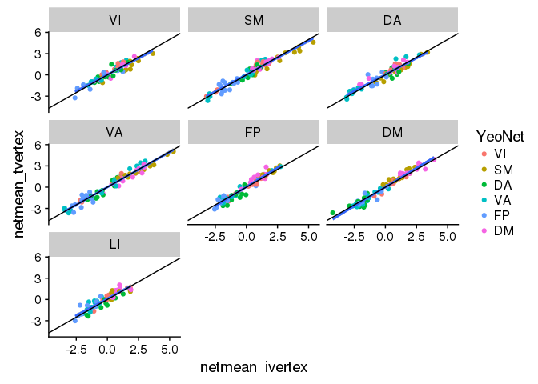<!-- -->


```r
DX_lm_model %>%
  mutate(matchnet = if_else(as.character(subcort_NET)==as.character(YeoNet), TRUE, FALSE)) %>%
  filter(term == "DXSSD",
         matchnet==TRUE) %>%
  select(subcort_ROI, subcort_NET, vertex_type, YeoNet, statistic, term, hemisphere, subcort_hemi) %>%
  spread(vertex_type, statistic) %>%
  ggplot(aes(x = netmean_ivertex, y = netmean_tvertex)) +
  geom_point(aes(color=subcort_NET)) +
  geom_abline(slope = 1, intercept = 0)
```

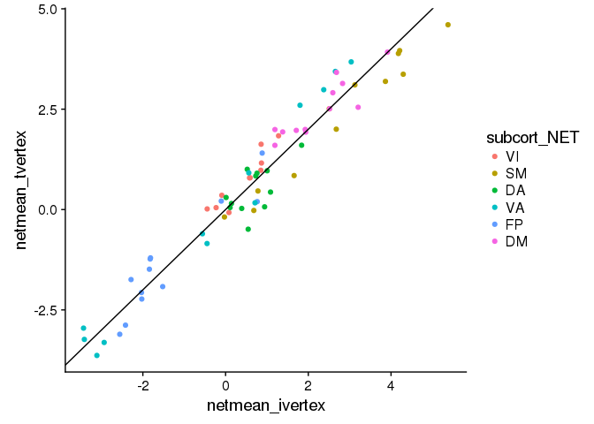<!-- -->


##################################### Edit from Here! ################################################################


```r
DX_lm_model %>%
  filter(term == "DXSSD") %>%
ggplot(aes(x = YeoNet, y=subcort_NET, fill = statistic)) +
  geom_tile(color = "black") +
  scale_fill_gradient2(breaks = c(-4.5,-4.5)) +
  facet_grid(subcort_ROI~ vertex_type)
```

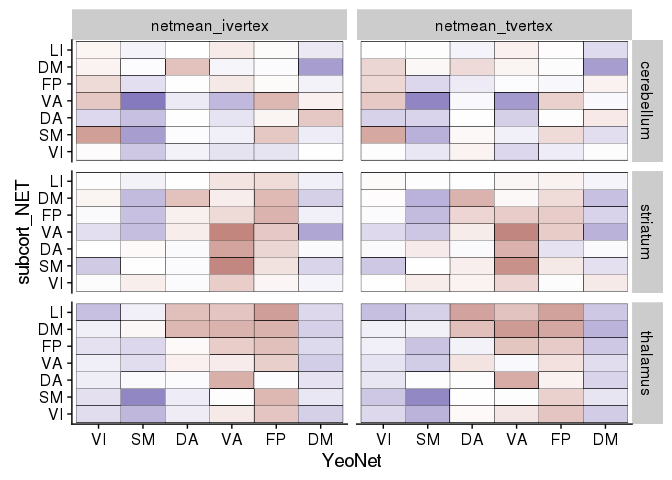<!-- -->


```r
fig1 <- results_pheno %>%
  group_by(YeoNet, subcort_ROI, subcort_NET, 
           subid, DX, Age_std, Sex, Site, Edu_std, mean_fd_pt) %>%
  summarise(Personalized = mean(ivertex_corr),
            Template = mean(tvertex_corr)) %>%
  gather(vertex_type, netmean_corZ, Personalized, Template) %>%
  filter(YeoNet == "VA", subcort_NET == "VA") %>%
  ggplot(aes(y = netmean_corZ, x = DX, color = DX)) + 
  geom_boxplot(outlier.shape = NA) + 
  geom_dotplot(aes(fill = Sex), 
               binaxis = 'y', stackdir = 'center', binwidth = 0.025, alpha = 0.5) +
  scale_color_brewer(palette = "Dark2") +
  facet_grid(subcort_ROI ~ Site*vertex_type) +
  labs(y = "Striatum- Cortex Resting State Correlation (Z)")

#ggsave(fig1, filename = 'VA_results.png',height = 8, width = 5)

fig1
```

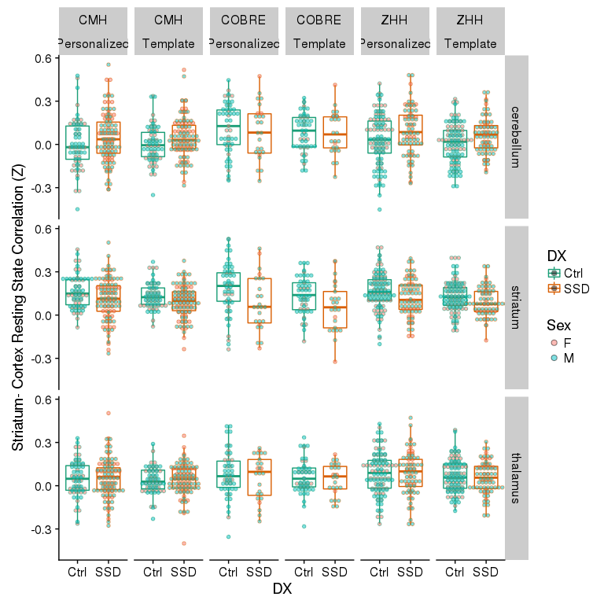<!-- -->

```r
fig2 <- results_pheno %>%
  group_by(YeoNet, subcort_ROI, subcort_NET,
           subid, DX, Age_std, Sex, Site, Edu_std, mean_fd_pt) %>%
  summarise(Personalized = mean(ivertex_corr),
            Template = mean(tvertex_corr)) %>%
  gather(vertex_type, netmean_corZ, Personalized, Template) %>%
  filter(YeoNet == "DM", subcort_NET == "DM") %>%
  ggplot(aes(y = netmean_corZ, x = DX, color = DX)) + 
  geom_boxplot(outlier.shape = NA) +  
  geom_dotplot(aes(fill = Sex), 
               binaxis = 'y', stackdir = 'center', binwidth = 0.025, alpha = 0.5) +
  scale_color_brewer(palette = "Dark2") +
  facet_grid(subcort_ROI ~ Site*vertex_type) +
  labs(y = "Striatum- Cortex Resting State Correlation (Z)")

#ggsave(fig2, filename = 'DM_results.png',height = 8, width = 5)

fig2
```

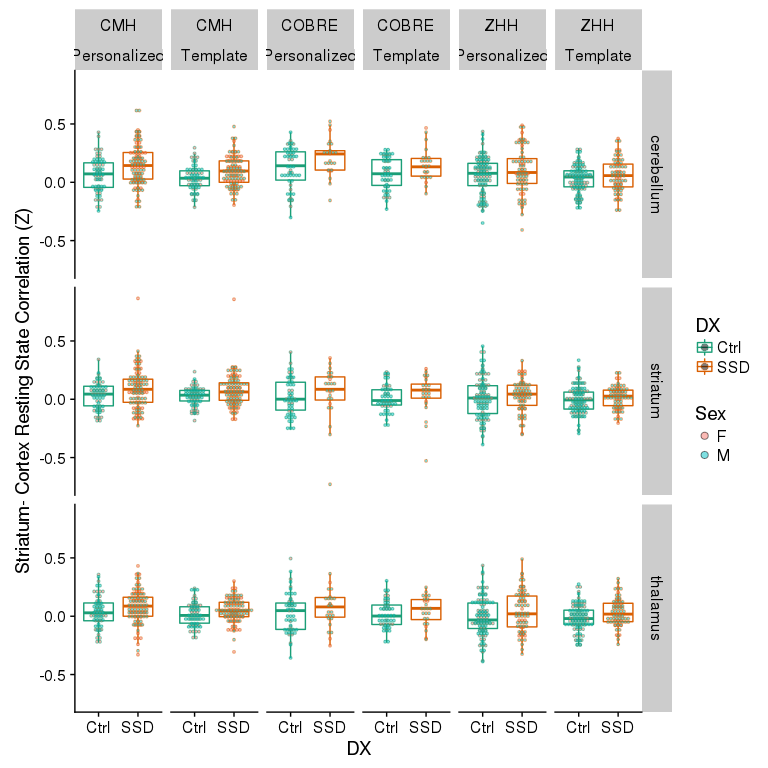<!-- -->


