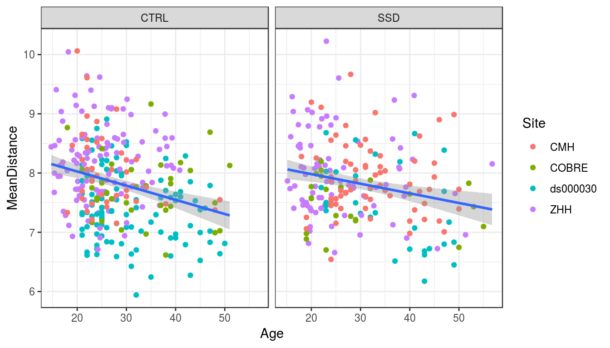
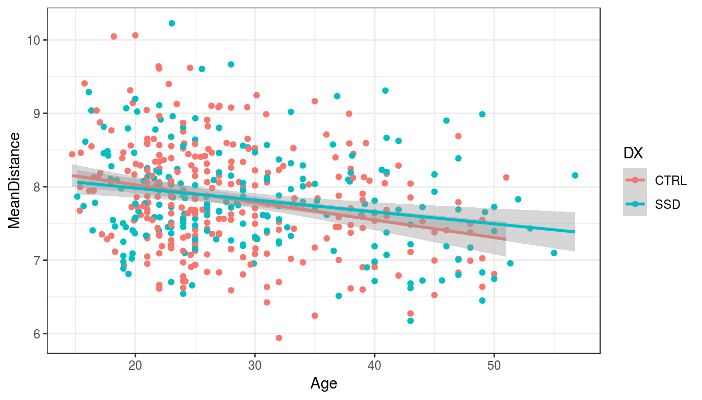
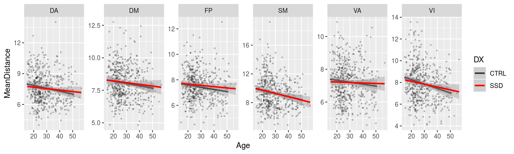

# Stats on the PINT summary displacement values


```r
library(tidyverse)
```

```
## ── Attaching packages ──────────────────────────────────────────────────────────────────────────────────────────────────────────────────── tidyverse 1.2.1 ──
```

```
## ✔ ggplot2 3.1.0       ✔ purrr   0.2.5  
## ✔ tibble  2.0.1       ✔ dplyr   0.8.0.1
## ✔ tidyr   0.8.2       ✔ stringr 1.3.1  
## ✔ readr   1.3.0       ✔ forcats 0.3.0
```

```
## ── Conflicts ─────────────────────────────────────────────────────────────────────────────────────────────────────────────────────── tidyverse_conflicts() ──
## ✖ dplyr::filter() masks stats::filter()
## ✖ dplyr::lag()    masks stats::lag()
```

```r
library(broom)
library(here)
```

```
## here() starts at /mnt/tigrlab/projects/edickie/code/SZ_PINT
```


## The paths to data


```r
source(here('code/R/settings_helpers.R'))

Yeo7_2011_80verts <- read_Yeo72011_template()

YeoNet_colours = define_Yeo7_colours()

## adding a subid that matches what the concatenation script adds..
pheno <- read_pheno_file() %>%
  mutate(subid = str_replace(filename, '_summary.csv','')) %>%
  drop_na(DX)
```

```
## Parsed with column specification:
## cols(
##   .default = col_double(),
##   dataset = col_character(),
##   subject_id = col_character(),
##   session_id = col_character(),
##   task_id = col_character(),
##   run_id = col_character(),
##   acq_id = col_character(),
##   subject = col_character(),
##   session = col_character(),
##   cmh_session_id = col_character(),
##   DX = col_character(),
##   Sex = col_character(),
##   Site = col_character(),
##   Scanner = col_character(),
##   isFEP = col_character(),
##   ghost_NoGhost = col_character(),
##   filename = col_character()
## )
```

```
## See spec(...) for full column specifications.
```

```r
pint_concat <- read_csv(file.path(output_base,'postPINT1_concat_all_qa_passes.csv'))
```

```
## Parsed with column specification:
## cols(
##   subid = col_character(),
##   hemi = col_character(),
##   NETWORK = col_double(),
##   roiidx = col_double(),
##   tvertex = col_double(),
##   pvertex = col_double(),
##   dist_49 = col_double(),
##   vertex_48 = col_double(),
##   std_distance = col_double()
## )
```


```r
pheno %>%  
  select(subject, dataset) %>%
  distinct() %>%
  count()
```

```
## # A tibble: 1 x 1
##       n
##   <int>
## 1   497
```

```r
ana_data <- pheno %>%
  inner_join(pint_concat, by = "subid") %>%
  inner_join(Yeo7_2011_80verts, by = "roiidx") %>%
  mutate(network = str_sub(SHORTNAME, 1,2))
```


## run for the whole head


```r
dist_by_total <- pint_concat %>%
  group_by(subid) %>%
  summarise(MeanDistance = mean(std_distance)) %>%
  ungroup() %>%
  inner_join(pheno, by = "subid")  

dist_by_total %>%
  ungroup() %>%
  do(tidy(lm(MeanDistance ~ DX + Age_pt + Sex + fd_mean_pt + Site + SurfArea_pt,.))) %>%
  mutate(p_bonf = p.value*6) %>%
  knitr::kable()
```


term              estimate   std.error    statistic     p.value      p_bonf
-------------  -----------  ----------  -----------  ----------  ----------
(Intercept)     10.4934545   2.0347512    5.1571192   0.0000004   0.0000022
DXSSD           -0.1466062   0.0627130   -2.3377333   0.0198068   0.1188408
Age_pt           4.2418153   1.0972011    3.8660326   0.0001257   0.0007541
SexM             0.0596993   0.0713062    0.8372247   0.4028786   2.4172716
fd_mean_pt       1.0963997   1.5419903    0.7110290   0.4774081   2.8644486
SiteCOBRE       -0.3464107   0.1108145   -3.1260409   0.0018781   0.0112685
Siteds000030    -0.5501351   0.0872879   -6.3025326   0.0000000   0.0000000
SiteZHH          0.0722012   0.0787317    0.9170533   0.3595705   2.1574230
SurfArea_pt     -0.2728473   0.0921273   -2.9616328   0.0032102   0.0192614


```r
dist_by_total %>%
  ggplot(aes(y = MeanDistance, x = Age)) +
  geom_point(aes(color = Site)) + 
  geom_smooth(method = "lm")+
  facet_wrap(~DX) +
  theme_bw()
```




```r
dist_by_total %>%
  ggplot(aes(y = MeanDistance, x = Age, color = DX)) +
  geom_point() + 
  geom_smooth(method = "lm")+
  theme_bw()
```




```r
dist_by_network <- pint_concat %>%
  inner_join(Yeo7_2011_80verts, by = "roiidx") %>%
  mutate(network = str_sub(SHORTNAME, 1,2)) %>%
  group_by(subid, network) %>%
  summarise(MeanDistance = mean(std_distance)) %>%
  ungroup() %>%
  inner_join(pheno, by = "subid")  

dist_by_network %>%
  ungroup() %>% group_by(network) %>%
  do(tidy(aov(lm(MeanDistance ~ DX + Age_pt + Sex + fd_mean_pt + Scanner + SurfArea_pt,.)))) %>%
  mutate(p_bonf = p.value*6) %>%
  filter(!(term %in% c('Intercept', 'ScannerCOBRE', 'Scannerds00003035343', 'ScannerZHH', 'Scannerds00003035426'))) %>%
  select(network, term, df, statistic, p.value, p_bonf) %>%
  knitr::kable()
```


network   term            df    statistic     p.value      p_bonf
--------  ------------  ----  -----------  ----------  ----------
DA        DX               1    0.3532816   0.5525391   3.3152346
DA        Age_pt           1   12.0217421   0.0005727   0.0034363
DA        Sex              1    0.0000806   0.9928397   5.9570381
DA        fd_mean_pt       1    0.3414558   0.5592624   3.3555743
DA        Scanner          4    5.5705136   0.0002167   0.0013004
DA        SurfArea_pt      1    1.7744287   0.1834618   1.1007710
DA        Residuals      484           NA          NA          NA
DM        DX               1    0.1061633   0.7446959   4.4681757
DM        Age_pt           1    5.1586493   0.0235692   0.1414152
DM        Sex              1    6.0387566   0.0143448   0.0860689
DM        fd_mean_pt       1    3.0434880   0.0816963   0.4901779
DM        Scanner          4    5.7903617   0.0001473   0.0008839
DM        SurfArea_pt      1    1.0292682   0.3108375   1.8650250
DM        Residuals      484           NA          NA          NA
FP        DX               1    1.2293379   0.2680865   1.6085188
FP        Age_pt           1    4.2182044   0.0405291   0.2431747
FP        Sex              1    1.0228033   0.3123603   1.8741617
FP        fd_mean_pt       1    3.6095802   0.0580417   0.3482502
FP        Scanner          4    1.5177324   0.1957679   1.1746074
FP        SurfArea_pt      1   14.1124915   0.0001932   0.0011591
FP        Residuals      484           NA          NA          NA
SM        DX               1    0.0869153   0.7682624   4.6095742
SM        Age_pt           1   16.5226128   0.0000561   0.0003366
SM        Sex              1    0.0125257   0.9109344   5.4656067
SM        fd_mean_pt       1    1.8318356   0.1765426   1.0592558
SM        Scanner          4    5.0117573   0.0005766   0.0034598
SM        SurfArea_pt      1    0.3107575   0.5774735   3.4648408
SM        Residuals      484           NA          NA          NA
VA        DX               1    0.1441132   0.7043922   4.2263530
VA        Age_pt           1    1.8970876   0.1690413   1.0142476
VA        Sex              1    0.4108716   0.5218308   3.1309850
VA        fd_mean_pt       1    0.1003183   0.7515846   4.5095074
VA        Scanner          4    6.6816251   0.0000307   0.0001840
VA        SurfArea_pt      1    2.7537042   0.0976772   0.5860630
VA        Residuals      484           NA          NA          NA
VI        DX               1    0.3137753   0.5756319   3.4537911
VI        Age_pt           1   16.3660012   0.0000608   0.0003646
VI        Sex              1    1.3560252   0.2448012   1.4688072
VI        fd_mean_pt       1    0.8478563   0.3576182   2.1457092
VI        Scanner          4    6.0907240   0.0000869   0.0005211
VI        SurfArea_pt      1    0.9719647   0.3246833   1.9480996
VI        Residuals      484           NA          NA          NA


```r
dist_by_network %>%
  ggplot(aes(y = MeanDistance, x = Age)) +
  geom_point(alpha = 0.2, size = 0.5) + 
  geom_smooth(aes(color = DX), method = "lm") +
  facet_wrap(~network, scales = "free", nrow = 1) +
  scale_color_manual(values = c("grey20","red"))
```




## run linear model per edge


```r
roi_dx_lm <- ana_data %>%
  ungroup() %>% group_by(SHORTNAME) %>%
  do(tidy(lm(std_distance ~ DX + Sex + fd_mean_pt + Age_pt + Scanner,.))) %>%
  ungroup() %>% group_by(term) %>%
  mutate(p_fdr  = p.adjust(p.value, method = 'fdr'))

roi_dx_lm %>%
  filter(term == "Age_pt") %>%
  filter(p_fdr < 0.1)
```

```
## # A tibble: 1 x 7
## # Groups:   term [1]
##   SHORTNAME term   estimate std.error statistic   p.value   p_fdr
##   <chr>     <chr>     <dbl>     <dbl>     <dbl>     <dbl>   <dbl>
## 1 VI03L     Age_pt     34.5      8.58      4.02 0.0000662 0.00530
```
