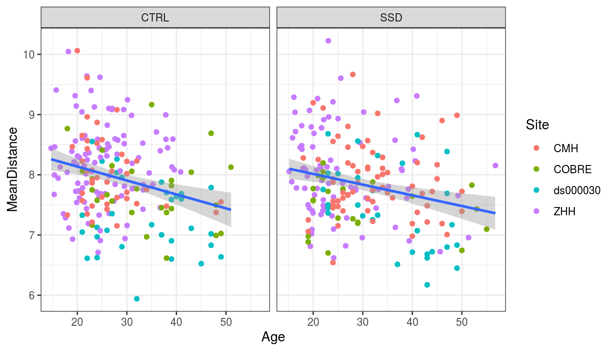

# Stats on the PINT summary displacement values


```r
library(tidyverse)
```

```
## ── Attaching packages ──────────────────────────────────────────────────────────────────────── tidyverse 1.3.0 ──
```

```
## ✓ ggplot2 3.3.1     ✓ purrr   0.3.4
## ✓ tibble  3.0.1     ✓ dplyr   1.0.0
## ✓ tidyr   1.1.0     ✓ stringr 1.4.0
## ✓ readr   1.3.1     ✓ forcats 0.5.0
```

```
## ── Conflicts ─────────────────────────────────────────────────────────────────────────── tidyverse_conflicts() ──
## x dplyr::filter() masks stats::filter()
## x dplyr::lag()    masks stats::lag()
```

```r
library(broom)
library(here)
```

```
## here() starts at /mnt/tigrlab/projects/edickie/code/SZ_PINT
```


## The paths to data


```r
source(here('code/R/settings_helpers.R'))

Yeo7_2011_80verts <- read_Yeo72011_template()

YeoNet_colours = define_Yeo7_colours()

## adding a subid that matches what the concatenation script adds..
pheno <- read_pheno_file() %>%
  mutate(subid = str_replace(filename, '_summary.csv','')) %>%
  drop_na(DX) %>%
  drop_na(Age_match) # dropping un-matched subjects
```

```
## Parsed with column specification:
## cols(
##   .default = col_double(),
##   dataset = col_character(),
##   subject_id = col_character(),
##   session_id = col_character(),
##   task_id = col_character(),
##   run_id = col_character(),
##   acq_id = col_character(),
##   subject = col_character(),
##   session = col_character(),
##   DX = col_character(),
##   Site = col_character(),
##   filename = col_character(),
##   cmh_session_id = col_character(),
##   Sex = col_character(),
##   Scanner = col_character(),
##   isFEP = col_character(),
##   zhh_chosen_sess = col_logical(),
##   ghost_NoGhost = col_character(),
##   in_matched_sample = col_logical()
## )
```

```
## See spec(...) for full column specifications.
```

```r
#pint_concat <- read_csv(file.path(output_base,'postPINT1_concat_all_qa_passes.csv'))
pint_concat <- read_csv(here("data","processed","mri",
              "all_clinicalplusqa_group", "postPINT",
              "postPINT1_concat_all_qa_passes.csv"))
```

```
## Parsed with column specification:
## cols(
##   subid = col_character(),
##   hemi = col_character(),
##   NETWORK = col_double(),
##   roiidx = col_double(),
##   tvertex = col_double(),
##   pvertex = col_double(),
##   dist_49 = col_double(),
##   vertex_48 = col_double(),
##   std_distance = col_double()
## )
```

```r
lm_predictors <- "DX + Age_match_pt + Sex + fd_mean_match_pt + Site + SurfArea_match_pt"
lm_covars <- "Sex + fd_mean_match_pt + Site + SurfArea_match_pt"
```


```r
library(modelr)
```

```
## 
## Attaching package: 'modelr'
```

```
## The following object is masked from 'package:broom':
## 
##     bootstrap
```

```r
df_plus_resids <- function(df, outcome, covars) { 
m1 <- lm(formula(paste(outcome, '~', paste(covars, collapse = " + "))),
         data = df)
result <-df %>% 
  add_residuals(m1) 
return(result)
}
```


```r
ana_data <- pheno %>%
  inner_join(pint_concat, by = "subid") %>%
  inner_join(Yeo7_2011_80verts, by = "roiidx") %>%
  mutate(network = str_sub(SHORTNAME, 1,2),
         network = factor(network, levels = names(YeoNet_colours)))
```


## run for the whole head


```r
dist_by_total <- ana_data %>%
  group_by(subid) %>%
  summarise(MeanDistance = mean(std_distance)) %>%
  ungroup() %>%
  inner_join(pheno, by = "subid") 
```

```
## `summarise()` ungrouping output (override with `.groups` argument)
```

```r
dist_by_total_fit <- dist_by_total %>%
  ungroup() %>%
  do(tidy(lm(formula(paste("MeanDistance ~", lm_predictors)),.)))

dist_by_total_fit %>%knitr::kable()
```


term                   estimate   std.error    statistic     p.value
------------------  -----------  ----------  -----------  ----------
(Intercept)           7.9123671   0.1537307   51.4690092   0.0000000
DXSSD                -0.1383787   0.0675476   -2.0486101   0.0411573
Age_match_pt          0.5741340   0.1634885    3.5117706   0.0004963
SexM                  0.0492648   0.0836917    0.5886459   0.5564336
fd_mean_match_pt      0.3198708   0.2080922    1.5371587   0.1250510
SiteCOBRE            -0.3676564   0.1215226   -3.0254157   0.0026445
Siteds000030         -0.5622250   0.1093387   -5.1420482   0.0000004
SiteZHH               0.0764913   0.0821198    0.9314596   0.3521820
SurfArea_match_pt    -0.5926052   0.2320469   -2.5538165   0.0110277


```r
dist_by_total %>%
  ggplot(aes(y = MeanDistance, x = Age)) +
  geom_point(aes(color = Site)) + 
  geom_smooth(method = "lm")+
  facet_wrap(~DX) +
  theme_bw()
```

```
## `geom_smooth()` using formula 'y ~ x'
```




```r
p1 <- dist_by_total %>%
  ggplot(aes(y = MeanDistance, x = DX, color = DX)) + 
  geom_boxplot(outlier.shape = NA) + 
  geom_dotplot(binaxis = 'y', stackdir = 'center', binwidth = 0.08, alpha = 0.5) +
  scale_color_manual(values = c("grey20","red")) +
  facet_wrap( ~ Site, ncol = 4) +
  labs(x = NULL, color = NULL) +
  theme_minimal() +
  labs(y = "PINT mean distance (mm)") +
  theme(legend.position = "none")
```


```r
p2 <- dist_by_total %>%
  df_plus_resids("MeanDistance", lm_covars) %>%
  ggplot(aes(y = resid, x = Age, color = DX)) +
  geom_point(alpha = 0.2) + 
  geom_smooth(method = "lm")+
  scale_color_manual(values = c("grey20","red")) +
  theme_bw() +
  labs(y = "PINT distance residuals") 
```


```r
dist_by_network <- ana_data %>%
  group_by(subid, network) %>%
  summarise(MeanDistance = mean(std_distance)) %>%
  ungroup() %>%
  inner_join(pheno, by = "subid")  
```

```
## `summarise()` regrouping output by 'subid' (override with `.groups` argument)
```

```r
dist_by_network_lmfit <- dist_by_network %>%
  ungroup() %>% group_by(network) %>%
  do(tidy(lm(formula(paste("MeanDistance ~", lm_predictors)),.))) %>%
  mutate(p_bonf = p.value*6)

dist_by_network_lmfit %>%
  filter(!(term %in% c('(Intercept)', 'SiteCOBRE', 'Siteds000030', 'SiteZHH'))) %>%
  #select(network, term, df, statistic, p.value, p_bonf) %>%
  arrange(term, network) %>%
  knitr::kable()
```


network   term                   estimate   std.error    statistic     p.value      p_bonf
--------  ------------------  -----------  ----------  -----------  ----------  ----------
VI        Age_match_pt          1.1366964   0.4098716    2.7732985   0.0058108   0.0348648
SM        Age_match_pt          1.6257206   0.5414940    3.0022873   0.0028490   0.0170941
DA        Age_match_pt          0.6887221   0.3784455    1.8198713   0.0695315   0.4171893
VA        Age_match_pt          0.0539861   0.2885697    0.1870817   0.8516922   5.1101530
DM        Age_match_pt          0.0223583   0.3315875    0.0674281   0.9462748   5.6776490
FP        Age_match_pt          0.5473200   0.2875183    1.9036004   0.0576851   0.3461107
VI        DXSSD                -0.3441888   0.1693443   -2.0324793   0.0427703   0.2566215
SM        DXSSD                -0.1908120   0.2237259   -0.8528828   0.3942386   2.3654314
DA        DXSSD                -0.2102749   0.1563601   -1.3448117   0.1794538   1.0767229
VA        DXSSD                -0.1610808   0.1192267   -1.3510464   0.1774500   1.0647002
DM        DXSSD                -0.0645531   0.1370001   -0.4711901   0.6377638   3.8265830
FP        DXSSD                 0.0378881   0.1187923    0.3189445   0.7499363   4.4996180
VI        fd_mean_match_pt      0.4222965   0.5216948    0.8094703   0.4187296   2.5123774
SM        fd_mean_match_pt      1.5855820   0.6892271    2.3005219   0.0219364   0.1316182
DA        fd_mean_match_pt      0.4860387   0.4816949    1.0090178   0.3135807   1.8814841
VA        fd_mean_match_pt      0.0296406   0.3672987    0.0806990   0.9357220   5.6143319
DM        fd_mean_match_pt     -0.0342583   0.4220528   -0.0811707   0.9353471   5.6120826
FP        fd_mean_match_pt     -0.0234690   0.3659605   -0.0641298   0.9488992   5.6933949
VI        SexM                  0.1056483   0.2098182    0.5035232   0.6148758   3.6892545
SM        SexM                 -0.2269101   0.2771973   -0.8185870   0.4135131   2.4810789
DA        SexM                  0.0403942   0.1937308    0.2085067   0.8349403   5.0096416
VA        SexM                  0.2196289   0.1477223    1.4867684   0.1378697   0.8272183
DM        SexM                 -0.1941668   0.1697436   -1.1438825   0.2533616   1.5201697
FP        SexM                  0.2146303   0.1471841    1.4582441   0.1455639   0.8733835
VI        SurfArea_match_pt    -1.2264312   0.5817501   -2.1081753   0.0356420   0.2138519
SM        SurfArea_match_pt     0.8309689   0.7685679    1.0811913   0.2802684   1.6816102
DA        SurfArea_match_pt    -0.3447443   0.5371455   -0.6418080   0.5213683   3.1282096
VA        SurfArea_match_pt    -0.4979558   0.4095806   -1.2157701   0.2247949   1.3487697
DM        SurfArea_match_pt    -0.4369830   0.4706377   -0.9284912   0.3537170   2.1223021
FP        SurfArea_match_pt    -1.5147434   0.4080883   -3.7118028   0.0002352   0.0014111


```r
p3 <- dist_by_network %>%
  group_by(network) %>%
  nest() %>%
  mutate(result = map(data, ~df_plus_resids(.x, "MeanDistance", lm_covars))) %>%
  unnest(result) %>%
  ggplot(aes(y = resid, x = Age)) +
  geom_point(aes(color = DX),alpha = 0.2, size = 0.5) +
  geom_smooth(aes(color = DX), method = "lm") +
  facet_wrap(~network, scales = "free", nrow = 1) +
  scale_color_manual(values = c("grey20","red"))+
  theme_minimal() +
  labs(y = "PINT distance residuals") +
  theme(legend.position = "none")
```


```r
report_model_beta_t <- function(tidy_model, this_term, p_value_col = p.value) {
  p_value_col = enquo(p_value_col)
  tidy_model %>%
    filter(term == this_term) %>%
    mutate(
      beta = specify_decimal(estimate,2),
      beta_se = specify_decimal(std.error,2),
      t_stat = specify_decimal(statistic,2),
      pval_str = ifelse(!!p_value_col < 0.001, 
                           format(!!p_value_col, scientific = TRUE, digits = 2),
                           specify_decimal(!!p_value_col,3)),
      pval_str = ifelse(!!p_value_col > 0.10, "ns", pval_str),
      report_str = str_glue("beta(SE)={beta}({beta_se}), t={t_stat}, p={pval_str}")) %>%
    pull(report_str)
}
report_model_beta_t(dist_by_network_lmfit %>% filter(network == "SM"), "Age_match_pt", p_value_col = p_bonf)
```

```
## beta(SE)=1.63(0.54), t=3.00, p=0.017
```


We investigated the mean of the distance that ROIs travelled during hte PINT algorithm as a measure of variability in intrinsic network topography, using linear models with SSD diagnosis and Age as predictors, and covariates of Sex, Site, total surface area and movement during the fMRI scan (mean framewise displacement). For mean distance travelled, across all 80 ROIs, We observe a small effect of SSD diagnosis, such that participants wiht SSD had a smaller distance travelled healthy controls (beta(SE)=-0.14(0.07), t=-2.05, p=0.041). Moreover, observed a linear effect of age of RSN network location variability, where older adults were more similar to the template than younger adults.  (beta(SE)=0.57(0.16), t=3.51, p=5e-04, see Supplemental Figure 2). When we tested mean distance travelled separately for each intrinsic network, a significant effect of SSD diagnosis was not observed in any individual network after bonferonni correction for the 6 networks tested. The negative linear effect of age was observed for the visual (beta(SE)=1.14(0.41), t=2.77, p=0.035) and sensory motor networks (beta(SE)=1.63(0.54), t=3.00, p=0.017).

## double check that model/plot look right without COBRE and ds00030


```r
library(cowplot)
```

```
## 
## ********************************************************
```

```
## Note: As of version 1.0.0, cowplot does not change the
```

```
##   default ggplot2 theme anymore. To recover the previous
```

```
##   behavior, execute:
##   theme_set(theme_cowplot())
```

```
## ********************************************************
```

```r
top_row <- plot_grid(p1, p2, labels = c('A', 'B'), label_size = 12)
```

```
## `geom_smooth()` using formula 'y ~ x'
```

```r
plot_grid(top_row, p3, labels = c("", 'C'), label_size = 12, ncol = 1)
```

```
## `geom_smooth()` using formula 'y ~ x'
```


## run linear model per edge (not reported)


```r
roi_dx_lm <- ana_data %>%
  ungroup() %>% group_by(SHORTNAME) %>%
  do(tidy(lm(formula(paste("std_distance ~", lm_predictors)),.))) %>%
  ungroup() %>% group_by(term) %>%
  mutate(p_fdr  = p.adjust(p.value, method = 'fdr'))

roi_dx_lm %>%
  filter(term %in% c("DXSSD")) %>%
  filter(p_fdr < 0.1)
```

```
## # A tibble: 0 x 7
## # Groups:   term [0]
## # … with 7 variables: SHORTNAME <chr>, term <chr>, estimate <dbl>,
## #   std.error <dbl>, statistic <dbl>, p.value <dbl>, p_fdr <dbl>
```

```r
roi_dx_lm %>%
  filter(term %in% c("Age_match_pt")) %>%
  filter(p_fdr < 0.1)
```

```
## # A tibble: 1 x 7
## # Groups:   term [1]
##   SHORTNAME term         estimate std.error statistic   p.value   p_fdr
##   <chr>     <chr>           <dbl>     <dbl>     <dbl>     <dbl>   <dbl>
## 1 VI03L     Age_match_pt     5.24      1.26      4.15 0.0000403 0.00322
```

