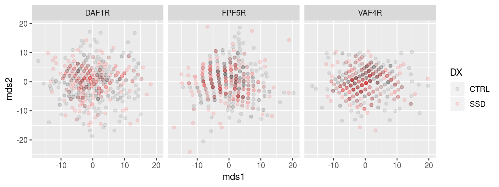

# Multi-Dimensional Scaling Stats on PINT ROI locations


```r
library(tidyverse)
```

```
## ── Attaching packages ──────────────────────────────────────────────────────────────────────────────────────────────────────────────────── tidyverse 1.2.1 ──
```

```
## ✔ ggplot2 3.1.0       ✔ purrr   0.2.5  
## ✔ tibble  2.0.1       ✔ dplyr   0.8.0.1
## ✔ tidyr   0.8.2       ✔ stringr 1.3.1  
## ✔ readr   1.3.0       ✔ forcats 0.3.0
```

```
## ── Conflicts ─────────────────────────────────────────────────────────────────────────────────────────────────────────────────────── tidyverse_conflicts() ──
## ✖ dplyr::filter() masks stats::filter()
## ✖ dplyr::lag()    masks stats::lag()
```

```r
library(broom)
library(igraph)
```

```
## 
## Attaching package: 'igraph'
```

```
## The following objects are masked from 'package:dplyr':
## 
##     as_data_frame, groups, union
```

```
## The following objects are masked from 'package:purrr':
## 
##     compose, simplify
```

```
## The following object is masked from 'package:tidyr':
## 
##     crossing
```

```
## The following object is masked from 'package:tibble':
## 
##     as_data_frame
```

```
## The following objects are masked from 'package:stats':
## 
##     decompose, spectrum
```

```
## The following object is masked from 'package:base':
## 
##     union
```

```r
library(here)
```

```
## here() starts at /mnt/tigrlab/projects/edickie/code/SZ_PINT
```


```r
source(here('code/R/settings_helpers.R'))

Yeo7_2011_80verts <- read_Yeo72011_template()

YeoNet_colours = define_Yeo7_colours()

pheno <- read_pheno_file() %>%  drop_na(DX)
```

```
## Parsed with column specification:
## cols(
##   .default = col_double(),
##   dataset = col_character(),
##   subject_id = col_character(),
##   session_id = col_character(),
##   task_id = col_character(),
##   run_id = col_character(),
##   acq_id = col_character(),
##   subject = col_character(),
##   session = col_character(),
##   cmh_session_id = col_character(),
##   DX = col_character(),
##   Sex = col_character(),
##   Site = col_character(),
##   Scanner = col_character(),
##   isFEP = col_character(),
##   ghost_NoGhost = col_character(),
##   filename = col_character()
## )
```

```
## See spec(...) for full column specifications.
```

```r
subsub <- read_csv(file.path(output_base,'postPINT2_sub2sub_all_qa_passes.csv'))
```

```
## Parsed with column specification:
## cols(
##   subid1 = col_character(),
##   subid2 = col_character(),
##   roiidx = col_double(),
##   distance = col_double()
## )
```


```r
mds_sub2sub <- function(data) {
  ## filter allsub2sub distances to only include the qced subids
  ## then run multidimensional scaling to resolve the sub2sub distances to a 2D plane
  distout <- data %>%
  graph_from_data_frame() %>%
  get.adjacency(attr = "distance") %>%
  as.matrix() %>%
  cmdscale(k=2) %>%
  as.data.frame()
  
  
  names(distout) <- c('mds1','mds2')
  distout$src_file <- row.names(distout)
  
  distout <- as.tibble(distout) %>%
    select(src_file, mds1, mds2)
  
  return(as.tibble(distout))
}
```


```r
subsub %>%
  filter(roiidx == 1) %>%
  select(subid1, subid2, distance) %>%
  mds_sub2sub()
```

```
## Warning: `as.tibble()` is deprecated, use `as_tibble()` (but mind the new semantics).
## This warning is displayed once per session.
```

```
## # A tibble: 494 x 3
##    src_file                                           mds1  mds2
##    <chr>                                             <dbl> <dbl>
##  1 sub-10159_task-rest_bold_desc-clean_bold         -8.90   6.21
##  2 sub-10161_ses-03_task-rest_bold_desc-clean_bold -12.4   -6.73
##  3 sub-10185_ses-03_task-rest_bold_desc-clean_bold -16.8    2.83
##  4 sub-10186_ses-02_task-rest_bold_desc-clean_bold   2.30  -6.17
##  5 sub-10206_task-rest_bold_desc-clean_bold          6.98  -6.90
##  6 sub-10217_task-rest_bold_desc-clean_bold          0.334  5.22
##  7 sub-10225_task-rest_bold_desc-clean_bold         -5.33  -2.67
##  8 sub-10227_task-rest_bold_desc-clean_bold         -1.44   7.06
##  9 sub-10228_task-rest_bold_desc-clean_bold         -2.86  -3.21
## 10 sub-10235_task-rest_bold_desc-clean_bold          3.24   1.98
## # … with 484 more rows
```


```r
mds_results <- subsub %>%
  group_by(roiidx) %>%
  nest() %>%
  mutate(sdist = map(data, ~mds_sub2sub(.x))) %>%
  select(roiidx, sdist) %>%
  unnest()
```


```r
mds_pheno <- pheno %>%
  mutate(src_file = str_replace(filename, '_summary.csv','')) %>%
  inner_join(mds_results, by = "src_file") %>%
  inner_join(Yeo7_2011_80verts, by = "roiidx") 
```


```r
sdist_manova <- mds_pheno %>%
  group_by(SHORTNAME) %>%
  do(tidy(manova(cbind(mds1, mds2) ~ DX*Age_pt + Sex + fd_mean_pt + Scanner + SurfArea_pt,.))) %>%
  ungroup() %>%
  group_by(term) %>%
  mutate(p_FDR  = p.adjust(p.value, method = "fdr"))
```


```r
sdist_manova %>% filter(p_FDR < 0.1) %>% knitr::kable()
```


SHORTNAME   term           df      pillai   statistic   num.df   den.df     p.value       p_FDR
----------  ------------  ---  ----------  ----------  -------  -------  ----------  ----------
DAF1R       Age_pt          1   0.0333245    8.308063        2      482   0.0002836   0.0226852
DAF2R       Scanner         4   0.0521536    3.233081        8      966   0.0012275   0.0245509
DAP3L       SurfArea_pt     1   0.0373781    9.357897        2      482   0.0001030   0.0082400
DAT1R       Scanner         4   0.0419300    2.585731        8      966   0.0085038   0.0606834
DMF2L       Scanner         4   0.0500795    3.101205        8      966   0.0018362   0.0270478
DMP1L       Scanner         4   0.0444748    2.746233        8      966   0.0053180   0.0425443
DMT1L       Scanner         4   0.0488459    3.022896        8      966   0.0023280   0.0270478
DMT2R       Scanner         4   0.0487598    3.017440        8      966   0.0023667   0.0270478
FPF4L       SurfArea_pt     1   0.0240749    5.945181        2      482   0.0028143   0.0750485
FPF5R       Age_pt          1   0.0277014    6.866231        2      482   0.0011474   0.0458968
FPF5R       Scanner         4   0.0920534    5.825870        8      966   0.0000003   0.0000221
FPP1L       Scanner         4   0.0380182    2.339828        8      966   0.0171699   0.0879449
FPP2R       Scanner         4   0.0412005    2.539798        8      966   0.0097119   0.0606834
SMF2R       fd_mean_pt      1   0.0302949    7.529166        2      482   0.0006028   0.0482228
SMI1L       Scanner         4   0.0371739    2.286882        8      966   0.0199159   0.0937220
VAF2R       Scanner         4   0.0458917    2.835783        8      966   0.0040793   0.0407933
VAF4R       Age_pt          1   0.0231541    5.712415        2      482   0.0035324   0.0941985
VAI1R       Scanner         4   0.0831686    5.239172        8      966   0.0000019   0.0000780
VAP1L       Scanner         4   0.0378815    2.331250        8      966   0.0175890   0.0879449
VAP2L       Scanner         4   0.0397492    2.448523        8      966   0.0126192   0.0721098
VI01R       SurfArea_pt     1   0.0241456    5.963079        2      482   0.0027656   0.0750485
VI02L       Scanner         4   0.0558513    3.468893        8      966   0.0005922   0.0157924
VI03L       Scanner         4   0.0411165    2.534513        8      966   0.0098611   0.0606834
VI05R       Scanner         4   0.0445311    2.749793        8      966   0.0052625   0.0425443


```r
mds_pheno %>%
  filter(SHORTNAME %in% c("DAF1R", "FPF5R", "VAF4R")) %>%
  ggplot(aes(x = mds1, y = mds2, color = DX)) +
  geom_point(alpha = 0.1) +
  scale_color_manual(values = c("grey20","red")) +
  facet_wrap(~SHORTNAME, ncol = 5)
```



```r
mds_pheno %>%
  filter(SHORTNAME %in% c("DAF1R", "FPF5R", "VAF4R")) %>%
  ggplot(aes(x = mds1, y = mds2, color = Age)) +
  geom_point(alpha = 0.2) +
  scale_color_viridis_c() +
  facet_wrap(~SHORTNAME, ncol = 5)
```


```r
mds_pheno %>%  
  mutate(Age_coarse = case_when(Age < 25 ~ "young adult",
                                Age > 35 ~ "middle age")) %>%
  drop_na(Age_coarse) %>%
  filter(SHORTNAME %in% c("DAF1R")) %>%
  ggplot(aes(x = mds1, y = mds2)) +
  stat_density_2d(aes(fill = stat(level)), bins = 8, geom = "polygon") +
  geom_point(alpha = 0.5, size = 0.5) +
  scale_fill_viridis_c() +
  geom_hline(yintercept = 0) + geom_vline(xintercept = 0) +
  facet_grid(Age_coarse ~ Site)
```


