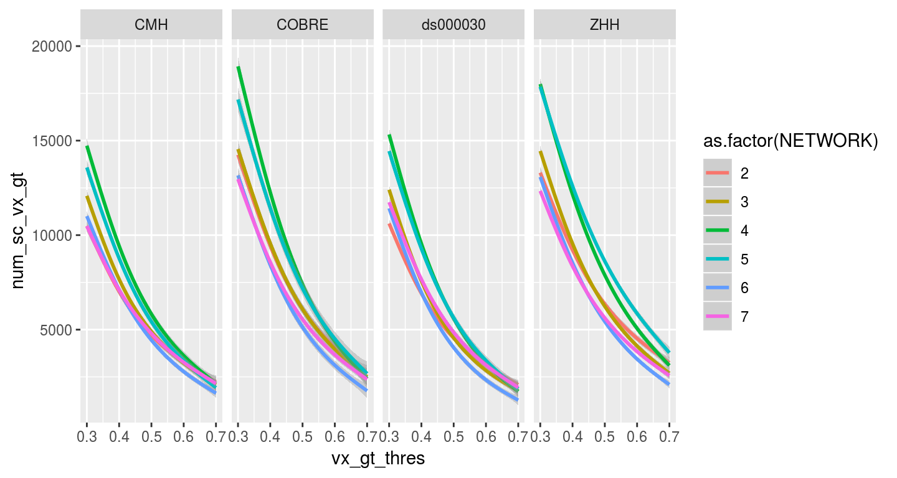
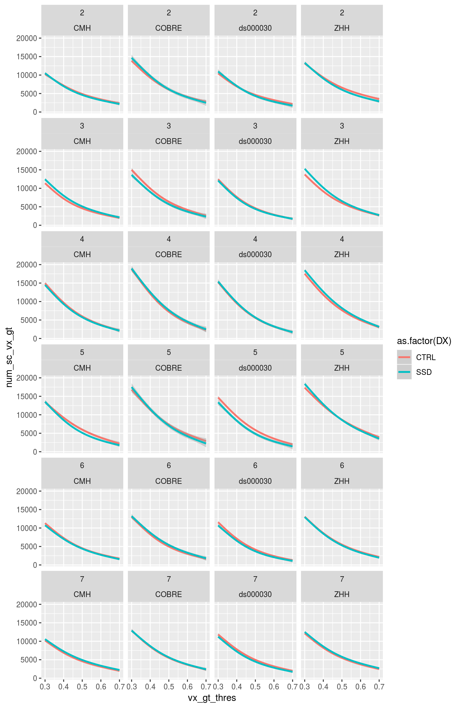
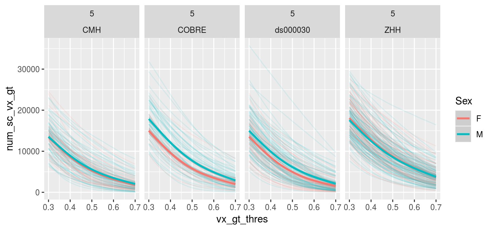
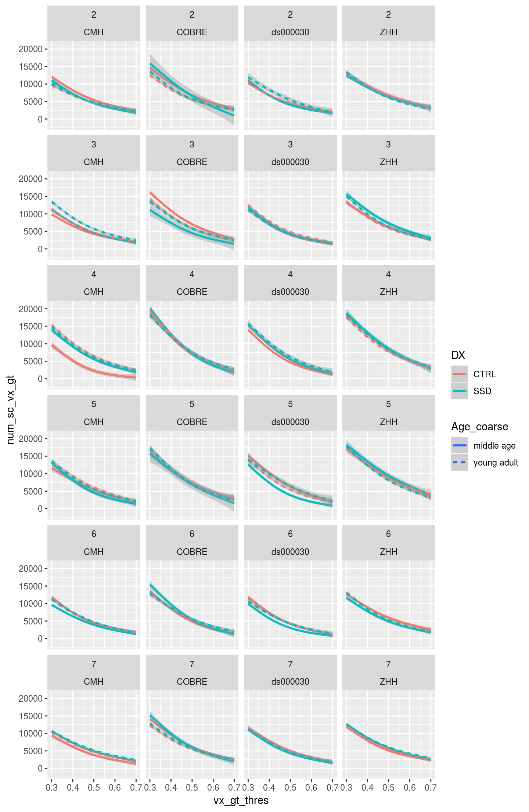
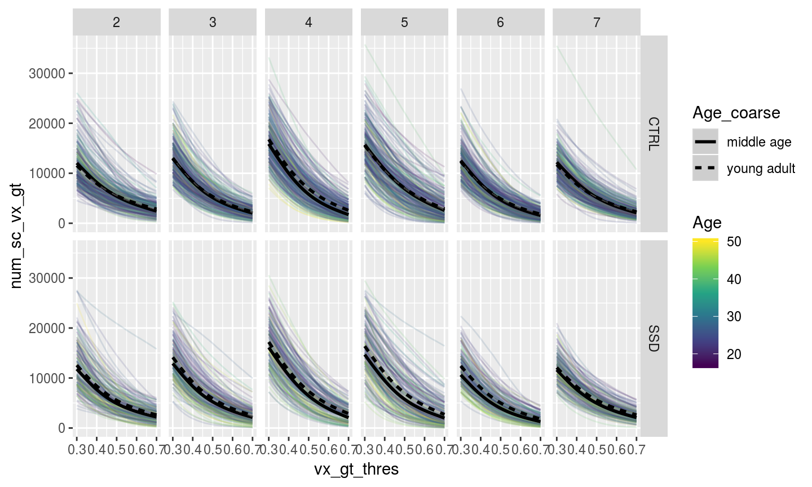
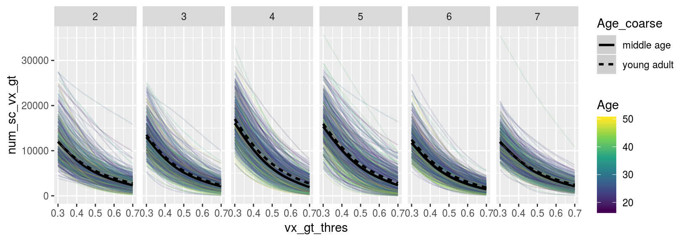
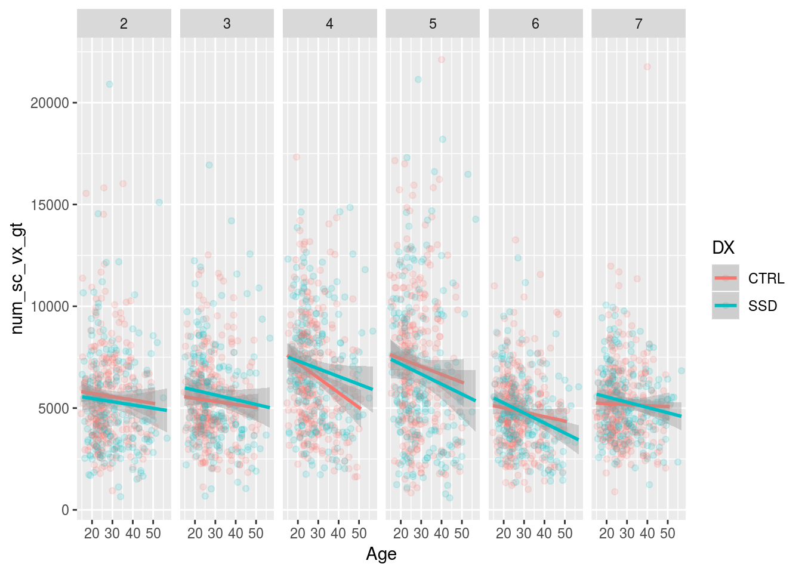

# Seedcorr Area Stats


```r
library(tidyverse)
```

```
## ── Attaching packages ──────────────────────────────────────────────────────────────────────────────────────────────────────────────────── tidyverse 1.2.1 ──
```

```
## ✔ ggplot2 3.1.0       ✔ purrr   0.2.5  
## ✔ tibble  2.0.1       ✔ dplyr   0.8.0.1
## ✔ tidyr   0.8.2       ✔ stringr 1.3.1  
## ✔ readr   1.3.0       ✔ forcats 0.3.0
```

```
## ── Conflicts ─────────────────────────────────────────────────────────────────────────────────────────────────────────────────────── tidyverse_conflicts() ──
## ✖ dplyr::filter() masks stats::filter()
## ✖ dplyr::lag()    masks stats::lag()
```

```r
library(broom)
library(here)
```

```
## here() starts at /mnt/tigrlab/projects/edickie/code/SZ_PINT
```

## The paths to data


```r
source(here('code/R/settings_helpers.R'))

Yeo7_2011_80verts <- read_Yeo72011_template()
YeoNet_colours = define_Yeo7_colours()
pheno <- read_pheno_file() %>%  drop_na(DX)
```

```
## Parsed with column specification:
## cols(
##   .default = col_double(),
##   dataset = col_character(),
##   subject_id = col_character(),
##   session_id = col_character(),
##   task_id = col_character(),
##   run_id = col_character(),
##   acq_id = col_character(),
##   subject = col_character(),
##   session = col_character(),
##   cmh_session_id = col_character(),
##   DX = col_character(),
##   Sex = col_character(),
##   Site = col_character(),
##   Scanner = col_character(),
##   isFEP = col_character(),
##   ghost_NoGhost = col_character(),
##   filename = col_character()
## )
```

```
## See spec(...) for full column specifications.
```

```r
pint_sc <- read_csv(file.path(output_base, 'qa_passes_seedcor_counts_20181116.csv'))
```

```
## Warning: Missing column names filled in: 'X1' [1]
```

```
## Warning: Duplicated column names deduplicated: 'index' => 'index_1' [7]
```

```
## Parsed with column specification:
## cols(
##   .default = col_double(),
##   dataset = col_character(),
##   subject = col_character(),
##   session = col_character(),
##   filename = col_character()
## )
## See spec(...) for full column specifications.
```


```r
pint_sc %>%
  anti_join(pheno, by = c("subject", "dataset"))
```

```
## # A tibble: 12 x 29
##       X1 index dataset subject session filename index_1 NETWORK gt_0.30
##    <dbl> <dbl> <chr>   <chr>   <chr>   <chr>      <dbl>   <dbl>   <dbl>
##  1  2292   382 COBRE   sub-A0… ses-20… sub-A00…    2292       2   15241
##  2  2293   382 COBRE   sub-A0… ses-20… sub-A00…    2293       3   10223
##  3  2294   382 COBRE   sub-A0… ses-20… sub-A00…    2294       4   16854
##  4  2295   382 COBRE   sub-A0… ses-20… sub-A00…    2295       5   18930
##  5  2296   382 COBRE   sub-A0… ses-20… sub-A00…    2296       6   15772
##  6  2297   382 COBRE   sub-A0… ses-20… sub-A00…    2297       7   13304
##  7  2298   383 COBRE   sub-A0… ses-20… sub-A00…    2298       2   12894
##  8  2299   383 COBRE   sub-A0… ses-20… sub-A00…    2299       3   19799
##  9  2300   383 COBRE   sub-A0… ses-20… sub-A00…    2300       4   16902
## 10  2301   383 COBRE   sub-A0… ses-20… sub-A00…    2301       5   20600
## 11  2302   383 COBRE   sub-A0… ses-20… sub-A00…    2302       6   19045
## 12  2303   383 COBRE   sub-A0… ses-20… sub-A00…    2303       7   19976
## # … with 20 more variables: gt_0.32 <dbl>, gt_0.34 <dbl>, gt_0.36 <dbl>,
## #   gt_0.38 <dbl>, gt_0.40 <dbl>, gt_0.42 <dbl>, gt_0.44 <dbl>,
## #   gt_0.46 <dbl>, gt_0.48 <dbl>, gt_0.50 <dbl>, gt_0.52 <dbl>,
## #   gt_0.54 <dbl>, gt_0.56 <dbl>, gt_0.58 <dbl>, gt_0.60 <dbl>,
## #   gt_0.62 <dbl>, gt_0.64 <dbl>, gt_0.66 <dbl>, gt_0.68 <dbl>,
## #   gt_0.70 <dbl>
```


```r
pheno %>%
  anti_join(pint_sc, by = c("subject", "dataset"))
```

```
## # A tibble: 3 x 37
##   dataset subject_id session_id task_id run_id acq_id fd_mean fd_num
##   <chr>   <chr>      <chr>      <chr>   <chr>  <chr>    <dbl>  <dbl>
## 1 ds0000… 10365      <NA>       rest    <NA>   <NA>     0.118     17
## 2 ZHH     10523      01         rest    <NA>   <NA>     0.127     11
## 3 ds0000… 10570      <NA>       rest    <NA>   <NA>     0.178     48
## # … with 29 more variables: fd_perc <dbl>, size_t <dbl>, size_z <dbl>,
## #   spacing_tr <dbl>, spacing_z <dbl>, subject <chr>, session <chr>,
## #   num_rest <dbl>, num_t1w <dbl>, num_scans <dbl>, cmh_session_id <chr>,
## #   DX <chr>, Age <dbl>, Sex <chr>, Site <chr>, Scanner <chr>, GRID <dbl>,
## #   zhh_session_id <dbl>, MRI_Date <dbl>, Edu <dbl>, isFEP <chr>,
## #   ghost_NoGhost <chr>, LSurfArea <dbl>, RSurfArea <dbl>, SurfArea <dbl>,
## #   filename <chr>, Age_pt <dbl>, fd_mean_pt <dbl>, SurfArea_pt <dbl>
```

Write a func_base and outputprefix cols into the pheno file for the file reading step


```r
combined_df <- pheno %>%
  inner_join(pint_sc, by = c("dataset", "subject", "session")) %>%
  gather(gt_name, num_sc_vx_gt, starts_with('gt_')) %>%
  mutate(vx_gt_thres = gt_name %>% str_replace('gt_','') %>% parse_double()) %>%
  drop_na(num_sc_vx_gt)

combined_df %>% count(subject) %>% nrow()
```

```
## [1] 492
```

## Known issues

Looks like two people might need to be reprocessed if this works out.


```r
combined_df %>%
  drop_na(DX) %>%
  group_by(NETWORK, vx_gt_thres) %>%
  filter(Age > 17, Age < 51) %>%
  filter(vx_gt_thres < 0.6) %>%
  do(tidy(aov(lm(num_sc_vx_gt ~ DX*Age_pt + Sex + fd_mean_pt + Scanner + SurfArea_pt,.)))) %>%
  ungroup() %>% group_by(term) %>%
  mutate(p_FDR = p.adjust(p.value, method = "fdr")) %>%
  filter(term != "(Intercept)", term != "Scanner", p_FDR < 0.06) %>%
  arrange(NETWORK, term) 
```

```
## # A tibble: 43 x 9
## # Groups:   term [1]
##    NETWORK vx_gt_thres term      df  sumsq meansq statistic p.value   p_FDR
##      <dbl>       <dbl> <chr>  <dbl>  <dbl>  <dbl>     <dbl>   <dbl>   <dbl>
##  1       4        0.3  Age_pt     1 1.53e8 1.53e8      8.86 3.07e-3 1.11e-2
##  2       4        0.32 Age_pt     1 1.60e8 1.60e8      9.96 1.70e-3 8.06e-3
##  3       4        0.34 Age_pt     1 1.68e8 1.68e8     11.2  8.65e-4 5.19e-3
##  4       4        0.36 Age_pt     1 1.72e8 1.72e8     12.5  4.59e-4 3.45e-3
##  5       4        0.38 Age_pt     1 1.74e8 1.74e8     13.8  2.30e-4 1.88e-3
##  6       4        0.4  Age_pt     1 1.76e8 1.76e8     15.3  1.04e-4 9.33e-4
##  7       4        0.42 Age_pt     1 1.74e8 1.74e8     16.8  4.83e-5 4.83e-4
##  8       4        0.44 Age_pt     1 1.72e8 1.72e8     18.5  2.13e-5 2.39e-4
##  9       4        0.46 Age_pt     1 1.68e8 1.68e8     20.1  9.17e-6 1.18e-4
## 10       4        0.48 Age_pt     1 1.62e8 1.62e8     21.9  3.75e-6 5.63e-5
## # … with 33 more rows
```

```r
combined_df %>%
  drop_na(DX) %>%
ggplot(aes(y = num_sc_vx_gt, x = vx_gt_thres, color = as.factor(NETWORK))) +
  # geom_line(aes(group = subject), alpha = 0.1) + 
  geom_smooth() +
  facet_wrap(~Site, ncol = 4)
```

```
## `geom_smooth()` using method = 'gam' and formula 'y ~ s(x, bs = "cs")'
```




```r
combined_df %>%
  drop_na(DX) %>%
ggplot(aes(y = num_sc_vx_gt, x = vx_gt_thres, color = as.factor(DX))) +
  # geom_line(aes(group = subject), alpha = 0.1) + 
  geom_smooth() +
  facet_wrap(~NETWORK*Site, ncol = 4)
```

```
## `geom_smooth()` using method = 'gam' and formula 'y ~ s(x, bs = "cs")'
```




```r
combined_df %>%
  drop_na(DX) %>%
  filter(NETWORK == 5) %>%
ggplot(aes(y = num_sc_vx_gt, x = vx_gt_thres, color = Sex)) +
  geom_line(aes(group = subject), alpha = 0.1) + 
  geom_smooth() +
  facet_wrap(~NETWORK*Site, ncol = 4)
```

```
## `geom_smooth()` using method = 'gam' and formula 'y ~ s(x, bs = "cs")'
```



```r
combined_df %>% 
  filter(Age > 17, Age < 51) %>%
  mutate(Age_decade = case_when(Age < 20 ~ '17-20',
                               Age >= 20 & Age < 30 ~ '20-30',
                               Age >= 30 & Age < 40 ~ '30-40',
                               Age >= 40 & Age < 50 ~ '40-50',
                               Age > 50 ~ "50 above")) %>%
  mutate(Age_coarse = case_when(Age < 30 ~ "young adult",
                                Age > 35 ~ "middle age")) %>%
  drop_na(DX, Age_coarse) %>%
ggplot(aes(y = num_sc_vx_gt, x = vx_gt_thres, color = DX)) +
  #geom_line(aes(group = subject), alpha = 0.1) + 
  geom_smooth(aes(linetype = Age_coarse)) +
  facet_wrap(~NETWORK*Site, ncol = 4)  
```

```
## `geom_smooth()` using method = 'gam' and formula 'y ~ s(x, bs = "cs")'
```



```r
combined_df %>% 
  filter(Age > 17, Age < 51) %>%
  mutate(Age_decade = case_when(Age < 20 ~ '17-20',
                               Age >= 20 & Age < 30 ~ '20-30',
                               Age >= 30 & Age < 40 ~ '30-40',
                               Age >= 40 & Age < 50 ~ '40-50',
                               Age > 50 ~ "50 above")) %>%
  mutate(Age_coarse = case_when(Age < 30 ~ "young adult",
                                Age > 35 ~ "middle age")) %>%
  drop_na(DX, Age_coarse) %>%
ggplot(aes(y = num_sc_vx_gt, x = vx_gt_thres)) +
  geom_line(aes(group = subject, color = Age), alpha = 0.15) + 
  geom_smooth(aes(linetype = Age_coarse), color = "black") +
  scale_color_viridis_c(option = "D") +
  facet_grid(DX~NETWORK)  
```

```
## `geom_smooth()` using method = 'gam' and formula 'y ~ s(x, bs = "cs")'
```



```r
combined_df %>% 
  filter(Age > 17, Age < 51) %>%
  mutate(Age_decade = case_when(Age < 20 ~ '17-20',
                               Age >= 20 & Age < 30 ~ '20-30',
                               Age >= 30 & Age < 40 ~ '30-40',
                               Age >= 40 & Age < 50 ~ '40-50',
                               Age > 50 ~ "50 above")) %>%
  mutate(Age_coarse = case_when(Age < 30 ~ "young adult",
                                Age > 35 ~ "middle age")) %>%
  drop_na(DX, Age_coarse) %>%
ggplot(aes(y = num_sc_vx_gt, x = vx_gt_thres)) +
  geom_line(aes(group = subject, color = Age), alpha = 0.15) + 
  geom_smooth(aes(linetype = Age_coarse), color = "black") +
  scale_color_viridis_c(option = "D") +
  facet_grid(~NETWORK)  
```

```
## `geom_smooth()` using method = 'gam' and formula 'y ~ s(x, bs = "cs")'
```




```r
combined_df %>% 
  filter(vx_gt_thres == "0.5") %>%
  mutate(Age_decade = case_when(Age < 20 ~ '17-20',
                               Age >= 20 & Age < 30 ~ '20-30',
                               Age >= 30 & Age < 40 ~ '30-40',
                               Age >= 40 & Age < 50 ~ '40-50',
                               Age > 50 ~ "50 above")) %>%
  mutate(Age_coarse = case_when(Age < 30 ~ "young adult",
                                Age > 35 ~ "middle age")) %>%
  drop_na(DX) %>%
ggplot(aes(y = num_sc_vx_gt, x = Age, color = DX)) +
  geom_point(alpha = 0.15) + 
  geom_smooth(method = lm) +
  facet_grid(~NETWORK) 
```




```r
combined_df %>% 
  filter(Age > 17, Age < 51) %>%
  mutate(Age_decade = case_when(Age < 20 ~ '17-20',
                               Age >= 20 & Age < 30 ~ '20-30',
                               Age >= 30 & Age < 40 ~ '30-40',
                               Age >= 40 & Age < 50 ~ '40-50',
                               Age > 50 ~ "50 above")) %>%
  mutate(Age_coarse = case_when(Age < 30 ~ "young adult",
                                Age > 35 ~ "middle age")) %>%
  filter(NETWORK == 5, vx_gt_thres ==0.5) %>%
  count(DX, Site, Age_coarse)
```

```
## # A tibble: 24 x 4
##    DX    Site     Age_coarse      n
##    <chr> <chr>    <chr>       <int>
##  1 CTRL  CMH      <NA>            7
##  2 CTRL  CMH      middle age      3
##  3 CTRL  CMH      young adult    30
##  4 CTRL  COBRE    <NA>            7
##  5 CTRL  COBRE    middle age     13
##  6 CTRL  COBRE    young adult    14
##  7 CTRL  ds000030 <NA>           14
##  8 CTRL  ds000030 middle age     30
##  9 CTRL  ds000030 young adult    61
## 10 CTRL  ZHH      <NA>           12
## # … with 14 more rows
```

