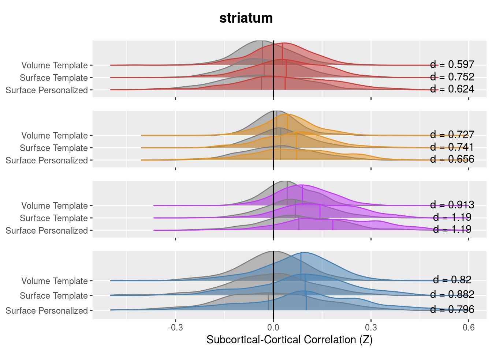

# Sub-cortical Cortical Stats Left and Right

This analysis tries to combine timeseries data from PINT outputs with subcortical timeseries to ask two questions

1. "External" validation of PINT. If PINT is indeed helping us better target meaningful resting state networks than we should see "cleaner" patterns of between the PINT output cortical ROIs and parcels of the subcortical structure that have been associated with these networks in literature.
   + i.e. connectivity of the cortical ROIS with "expected" subcortical parcel should increae and correlation with other parcels should decrease after PINT.
   
2. To interograte SSD related differences in Cortical-Subcortical connectivity - and to see if they persist after PINT.

Some work Ji (in prep) kinda suggests that there might be differences between left and right subcortical structures. AND spliting the left and right seemed to make more sense for whole brain correlations (because our cortical nodes have a hemisphere). So in this analysis have separate left and right ROIs


```r
library(tidyverse)
```

```
## ── Attaching packages ──────────────────────────────────────────────────────────────────────── tidyverse 1.3.0 ──
```

```
## ✓ ggplot2 3.3.1     ✓ purrr   0.3.4
## ✓ tibble  3.0.1     ✓ dplyr   1.0.0
## ✓ tidyr   1.1.0     ✓ stringr 1.4.0
## ✓ readr   1.3.1     ✓ forcats 0.5.0
```

```
## ── Conflicts ─────────────────────────────────────────────────────────────────────────── tidyverse_conflicts() ──
## x dplyr::filter() masks stats::filter()
## x dplyr::lag()    masks stats::lag()
```

```r
library(broom)
library(knitr)
library(tableone)
library(cowplot)
```

```
## 
## ********************************************************
```

```
## Note: As of version 1.0.0, cowplot does not change the
```

```
##   default ggplot2 theme anymore. To recover the previous
```

```
##   behavior, execute:
##   theme_set(theme_cowplot())
```

```
## ********************************************************
```

```r
library(ggridges)
library(here)
```

```
## here() starts at /mnt/tigrlab/projects/edickie/code/SZ_PINT
```


```r
knitr::opts_chunk$set(dev = "png", dev.args = list(type = "cairo-png"))
```
## The paths to data


```r
source(here('code/R/settings_helpers.R'))
pheno <- read_pheno_file() %>%
  drop_na(DX) %>%
  drop_na(Age_match) # dropping un-matched subjects
```

```
## Parsed with column specification:
## cols(
##   .default = col_double(),
##   dataset = col_character(),
##   subject_id = col_character(),
##   session_id = col_character(),
##   task_id = col_character(),
##   run_id = col_character(),
##   acq_id = col_character(),
##   subject = col_character(),
##   session = col_character(),
##   DX = col_character(),
##   Site = col_character(),
##   filename = col_character(),
##   cmh_session_id = col_character(),
##   Sex = col_character(),
##   Scanner = col_character(),
##   isFEP = col_character(),
##   zhh_chosen_sess = col_logical(),
##   ghost_NoGhost = col_character(),
##   in_matched_sample = col_logical()
## )
```

```
## See spec(...) for full column specifications.
```

```r
YeoNet_colours <- define_Yeo7_colours()
Yeo7_2011_80verts <- read_Yeo72011_template()
the_subcortical_guide <- get_subcortical_guide()
```

```
## Warning: `cols` is now required when using unnest().
## Please use `cols = c(subcort_NET)`
```

```
## Parsed with column specification:
## cols(
##   subcort_hemi = col_character(),
##   subcort_ROI = col_character(),
##   numvx = col_double(),
##   network = col_character()
## )
```

```r
node_annotations <- get_node_annotations(Yeo7_2011_80verts, the_subcortical_guide)

source(here('code/R/custom_plot_helpers.R'))

source(here('code/R/file_reading_helpers.R'))

lm_predictor_cols <- c("DX",
                        "Age_match_pt", 
                        "Sex",
                        "fd_mean_match_pt",
                        "Site")
```


This reads all files and generate PINT to subcortical correlation values for a given subject


### This reads all the subcortical files it can find

Write a func_base and outputprefix cols into the pheno file for the file reading step


```r
pheno <- pheno %>%
  mutate(func_base = get_func_base_from_pint_summary_filename(filename,subject, session), 
         outputprefix = construct_output_prefix(subject, session, func_base)) 
```

a litle chunck I use to test if test if the reader is working...


```r
all_corZ_results <- pheno %>%
  select(subject, outputprefix, dataset) %>%
  mutate(the_corrs = map2(.$outputprefix, .$dataset,
                              ~run_read_all_subject_timeseries_and_wholebrain_corZ(.x, .y)))
```


```r
save(all_corZ_results, file = file.path(output_base, "all_clinicalplusqa_group", "Rdata_cache", "06_wholebrain_results_cache.Rdata"))
```


```r
run_read_all_subject_timeseries_and_subcortcort_corZ(pheno$outputprefix[1], pheno$dataset[1])
```


```r
all_subcort_results <- pheno %>%
  select(subject, outputprefix, dataset) %>%
  mutate(subcort_corrs = map2(outputprefix, dataset,
                              ~run_read_all_subject_timeseries_and_subcortcort_corZ(.x, .y)))
```


```r
all_corZ_results <- readRDS(file = file.path(output_base, "all_clinicalplusqa_group", "Rdata_cache", "06_wholebrain_FC_cache.rds"))
```

### reduce data from the whole brain data to only include the subcortical cortical connections 


```r
## go from the whole matrix to only the subcortical-cortical and annotate
all_subcort_results <- all_corZ_results %>%
  unnest(cols = c(the_corrs)) %>%
  filter(!(from %in% the_subcortical_guide$combined_name)) %>%
  inner_join(the_subcortical_guide, by = c("to"="combined_name")) %>%
  mutate(PINT_ROI = from,
         YeoNet = str_sub(PINT_ROI, 1,2),
         hemisphere = str_sub(PINT_ROI, 5,5)) %>%
  mutate(conn_type = if_else(YeoNet == subcort_NET, "same_net", "diff_net"),
         YeoNet = factor(YeoNet, levels = c("VI", "SM", "DA", "VA", "FP", "DM")),
         subcort_NET = factor(subcort_NET, levels = c("VI", "SM", "DA", "VA", "FP", "DM", "LI")))
```


### merge with the phenotypic data


```r
results_pheno <- all_subcort_results %>%
  inner_join(pheno, by = c("subject", "dataset")) %>%
  select(subject, dataset, rval = weight,
         YeoNet, hemisphere, conn_type, 
         PINT_ROI, subcort_ROI, subcort_NET, subcort_hemi, 
         vertex_type, Age, Site, Scanner, fd_mean, fd_perc,
         one_of(lm_predictor_cols),
         in_matched_sample) 
```


## make a subject table from resuts pheno


```r
library(tableone)
therealtable1 <- CreateTableOne(
  strata = c("DX", "Site"),
  vars = c("Age", "Sex", "fd_mean", "fd_perc"),
  data = filter(results_pheno, PINT_ROI=="DMP1L",subcort_ROI=="thalamus", subcort_NET=="VA", subcort_hemi == "L", vertex_type == "pvertex")
)
tabMat <- print(therealtable1, quote = FALSE, noSpaces = TRUE, printToggle = FALSE)
kable(tabMat)
```

                      CTRL:CMH       SSD:CMH        CTRL:COBRE      SSD:COBRE       CTRL:ds000030   SSD:ds000030    CTRL:ZHH        SSD:ZHH         p        test 
--------------------  -------------  -------------  --------------  --------------  --------------  --------------  --------------  --------------  -------  -----
n                     41             67             27              22              31              31              104             83                            
Age (mean (SD))       26.37 (6.67)   32.19 (8.47)   33.93 (9.66)    29.55 (12.14)   33.77 (8.94)    35.23 (9.32)    25.42 (6.33)    25.86 (9.01)    <0.001        
Sex = M (%)           22 (53.7)      40 (59.7)      23 (85.2)       19 (86.4)       26 (83.9)       24 (77.4)       47 (45.2)       63 (75.9)       <0.001        
fd_mean (mean (SD))   0.10 (0.04)    0.12 (0.06)    0.18 (0.04)     0.21 (0.08)     0.15 (0.08)     0.18 (0.07)     0.12 (0.04)     0.13 (0.06)     <0.001        
fd_perc (mean (SD))   6.56 (6.72)    11.08 (9.85)   28.47 (14.14)   26.60 (11.93)   19.61 (17.01)   28.26 (16.54)   12.74 (13.67)   13.33 (13.11)   <0.001        


```r
library(tableone)
therealtable1 <- CreateTableOne(
  vars = c("Age", "Sex", "DX", "fd_mean", "fd_perc"),
  data = filter(results_pheno, PINT_ROI=="DMP1L",subcort_ROI=="thalamus", subcort_NET=="VA", subcort_hemi == "L", vertex_type == "pvertex")
)
tabMat <- print(therealtable1, quote = FALSE, noSpaces = TRUE, printToggle = FALSE)
kable(tabMat)
```

                      Overall       
--------------------  --------------
n                     406           
Age (mean (SD))       28.90 (9.09)  
Sex = M (%)           264 (65.0)    
DX = SSD (%)          203 (50.0)    
fd_mean (mean (SD))   0.14 (0.06)   
fd_perc (mean (SD))   15.47 (14.51) 


# Is PINT "focusing" cortical subcortical connectivity


```r
table1 <- results_pheno %>%
  group_by(vertex_type, YeoNet, subcort_ROI, subcort_NET) %>%
  summarise(n = n(),
            Mean = mean(rval),
            SD = sd(rval)) 
```

```
## `summarise()` regrouping output by 'vertex_type', 'YeoNet', 'subcort_ROI' (override with `.groups` argument)
```

```r
ggplot(table1, aes(y = YeoNet, x = subcort_NET, fill = Mean)) + 
  geom_tile() +
  scale_fill_distiller(breaks = c(-0.5,0.5), type = "div", palette = 5) +
  theme(axis.text.x = element_text(angle = 90, hjust = 1)) +
  facet_grid(subcort_ROI~vertex_type) 
```


functions to help re-annotated the function axes


```r
#' sets some the main variables to factors to more descriptive labels
add_corrtype_and_subcortROI_columns <- function(data) {
  result <- data %>%
    mutate(corrtype = factor(vertex_type, levels = c('tvolume','tvertex','pvertex'),
                           labels = c("Volume Template", "Surface Template", "Surface Personalized")),
         subcortROI = factor(subcort_ROI, 
                             levels = c("striatum", "thalamus", "cerebellum"),
                             labels = c("Striatum", "Thalamus", "Cerebellum"))) 
  return(result)
}

#'drop VI DA and LI network from resutls
drop_VI_DA_LI <- function(data) {
  result <- data %>%
    filter(subcort_NET != "VI",
         subcort_NET != "DA",
         subcort_NET != "LI",
         YeoNet != "VI",
         YeoNet != "DA") 
  return(result)
}
```


```r
table1 %>%
  drop_VI_DA_LI() %>%
  add_corrtype_and_subcortROI_columns() %>%
ggplot(aes(y = YeoNet, x = subcort_NET, fill = Mean)) + 
  geom_tile() +
  geom_text(aes(label = sprintf('%3.2f',Mean))) +
  scale_fill_distiller(breaks = c(-0.5,0.5), type = "div", palette = 5) +
  theme(axis.text.x = element_text(angle = 90, hjust = 1)) +
  facet_grid(corrtype~subcortROI) +
  labs(y = "Cortical RSN Network", x = "Subcortical Subregion")
```


```r
table1 <- results_pheno %>%
  group_by(vertex_type, YeoNet, hemisphere, subcort_ROI, subcort_NET, subcort_hemi) %>%
  summarise(n = n(),
            Mean = mean(rval),
            SD = sd(rval)) 
```

```
## `summarise()` regrouping output by 'vertex_type', 'YeoNet', 'hemisphere', 'subcort_ROI', 'subcort_NET' (override with `.groups` argument)
```

```r
table1 %>%
  drop_VI_DA_LI() %>%
  add_corrtype_and_subcortROI_columns() %>%
ggplot(aes(y = YeoNet, x = subcort_NET, fill = Mean)) + 
  geom_tile() +
  geom_text(aes(label = sprintf('%3.2f',Mean))) +
  scale_fill_distiller(breaks = c(-0.5,0.5), type = "div", palette = 5) +
  theme(axis.text.x = element_text(angle = 90, hjust = 1)) +
  facet_grid(subcortROI*subcort_hemi~corrtype*hemisphere) +
  labs(y = "Cortical RSN Network", x = "Subcortical Subregion")  
```


We see in the above figure that the Yeo 7 Network connectivity strongly shows the expected pattern in the cerebeullum. 

Lower evidence is seen in the striatum and thalamus, although there is a faint increase across the diagonal for the SM, VA and DM especially


```r
net_means <- results_pheno %>%
  drop_VI_DA_LI() %>%
  group_by(YeoNet, subcort_ROI, subcort_NET, conn_type, subject, dataset, vertex_type) %>%
  summarise(netmean = mean(rval)) %>%
  ungroup() 
```

```
## `summarise()` regrouping output by 'YeoNet', 'subcort_ROI', 'subcort_NET', 'conn_type', 'subject', 'dataset' (override with `.groups` argument)
```


```r
subject_focus <- net_means %>%
  drop_VI_DA_LI() %>%
  group_by(subject, dataset, subcort_ROI, YeoNet, vertex_type, conn_type) %>%
  summarise(nets_type_avg = mean(netmean)) %>%
  spread(conn_type, nets_type_avg) # %>%
```

```
## `summarise()` regrouping output by 'subject', 'dataset', 'subcort_ROI', 'YeoNet', 'vertex_type' (override with `.groups` argument)
```

```r
  # ungroup() %>%
  # mutate(focus_effect = same_net - diff_net)
```


```r
subject_focus %>%
  ungroup() %>%
  group_by(subcort_ROI, YeoNet, vertex_type) %>%
  do(tidy(t.test(.$same_net, .$diff_net, paired = TRUE))) %>%
  mutate(cohenD = statistic/sqrt(parameter + 1)) %>%
  kable()
```


subcort_ROI   YeoNet   vertex_type     estimate   statistic   p.value   parameter    conf.low   conf.high  method          alternative       cohenD
------------  -------  ------------  ----------  ----------  --------  ----------  ----------  ----------  --------------  ------------  ----------
cerebellum    SM       pvertex        0.2509370    32.79637         0         405   0.2358956   0.2659783  Paired t-test   two.sided      1.6276567
cerebellum    SM       tvertex        0.2169637    33.29947         0         405   0.2041552   0.2297722  Paired t-test   two.sided      1.6526250
cerebellum    SM       tvolume        0.1449559    30.41125         0         405   0.1355857   0.1543261  Paired t-test   two.sided      1.5092851
cerebellum    VA       pvertex        0.2439763    31.09638         0         405   0.2285527   0.2593999  Paired t-test   two.sided      1.5432875
cerebellum    VA       tvertex        0.2009076    31.79134         0         405   0.1884844   0.2133309  Paired t-test   two.sided      1.5777775
cerebellum    VA       tvolume        0.1241032    29.82652         0         405   0.1159237   0.1322827  Paired t-test   two.sided      1.4802655
cerebellum    FP       pvertex        0.1951463    35.93027         0         405   0.1844693   0.2058233  Paired t-test   two.sided      1.7831891
cerebellum    FP       tvertex        0.1484289    36.99876         0         405   0.1405425   0.1563153  Paired t-test   two.sided      1.8362175
cerebellum    FP       tvolume        0.1050624    33.83044         0         405   0.0989574   0.1111674  Paired t-test   two.sided      1.6789766
cerebellum    DM       pvertex        0.3156742    37.62450         0         405   0.2991806   0.3321678  Paired t-test   two.sided      1.8672725
cerebellum    DM       tvertex        0.2535391    37.36094         0         405   0.2401985   0.2668797  Paired t-test   two.sided      1.8541922
cerebellum    DM       tvolume        0.1826252    35.64842         0         405   0.1725543   0.1926961  Paired t-test   two.sided      1.7692013
striatum      SM       pvertex        0.1109963    16.03850         0         405   0.0973914   0.1246011  Paired t-test   two.sided      0.7959773
striatum      SM       tvertex        0.1023066    17.77211         0         405   0.0909901   0.1136232  Paired t-test   two.sided      0.8820152
striatum      SM       tvolume        0.0772217    16.51277         0         405   0.0680285   0.0864149  Paired t-test   two.sided      0.8195149
striatum      VA       pvertex        0.1015677    24.03184         0         405   0.0932593   0.1098761  Paired t-test   two.sided      1.1926804
striatum      VA       tvertex        0.0812200    24.03456         0         405   0.0745768   0.0878631  Paired t-test   two.sided      1.1928150
striatum      VA       tvolume        0.0468493    18.40508         0         405   0.0418453   0.0518532  Paired t-test   two.sided      0.9134290
striatum      FP       pvertex        0.0510051    13.22495         0         405   0.0434234   0.0585868  Paired t-test   two.sided      0.6563435
striatum      FP       tvertex        0.0430208    14.93332         0         405   0.0373575   0.0486841  Paired t-test   two.sided      0.7411284
striatum      FP       tvolume        0.0342699    14.65305         0         405   0.0296723   0.0388675  Paired t-test   two.sided      0.7272189
striatum      DM       pvertex        0.0758314    12.57094         0         405   0.0639729   0.0876898  Paired t-test   two.sided      0.6238855
striatum      DM       tvertex        0.0687229    15.15420         0         405   0.0598080   0.0776378  Paired t-test   two.sided      0.7520903
striatum      DM       tvolume        0.0500223    12.02385         0         405   0.0418439   0.0582007  Paired t-test   two.sided      0.5967339
thalamus      SM       pvertex        0.2544642    28.19933         0         405   0.2367249   0.2722035  Paired t-test   two.sided      1.3995093
thalamus      SM       tvertex        0.2204035    29.09559         0         405   0.2055119   0.2352950  Paired t-test   two.sided      1.4439901
thalamus      SM       tvolume        0.1408673    27.37653         0         405   0.1307520   0.1509826  Paired t-test   two.sided      1.3586746
thalamus      VA       pvertex        0.0608091    13.53099         0         405   0.0519745   0.0696436  Paired t-test   two.sided      0.6715316
thalamus      VA       tvertex        0.0470749    13.17317         0         405   0.0400499   0.0540999  Paired t-test   two.sided      0.6537736
thalamus      VA       tvolume        0.0319912    12.36880         0         405   0.0269067   0.0370757  Paired t-test   two.sided      0.6138533
thalamus      FP       pvertex        0.0928243    19.34700         0         405   0.0833925   0.1022561  Paired t-test   two.sided      0.9601755
thalamus      FP       tvertex        0.0797281    21.65148         0         405   0.0724892   0.0869669  Paired t-test   two.sided      1.0745447
thalamus      FP       tvolume        0.0532868    18.38452         0         405   0.0475889   0.0589847  Paired t-test   two.sided      0.9124085
thalamus      DM       pvertex        0.1120022    19.13990         0         405   0.1004986   0.1235058  Paired t-test   two.sided      0.9498971
thalamus      DM       tvertex        0.0956365    21.25110         0         405   0.0867897   0.1044834  Paired t-test   two.sided      1.0546743
thalamus      DM       tvolume        0.0700509    17.89502         0         405   0.0623555   0.0777463  Paired t-test   two.sided      0.8881148

```r
YeoNet7 <- tribble(
  ~network, ~hexcode,
  "VI", "#781286",
  "SM", "#4682B4",
  "DA", "#00760E",
  "VA", "#C43AFA",
  "FP", "#E69422",
  "DM", "#CD3E3A",
  "LI", "#dcf8a4")

#' Left section of the raincload plots used in sub-cortical cortical change reporting
samediff_subcort_raincloud <- function(data, this_subcort_ROI, this_YeoNet, no_ticks = TRUE) {
  eff_size_df <- data %>%
    ungroup() %>%
    mutate(corrtype = factor(vertex_type, levels = c('pvertex', 'tvertex', 'tvolume'),
                             labels = c("Surface Personalized", "Surface Template", "Volume Template"))) %>%
    filter(subcort_ROI == this_subcort_ROI, YeoNet == this_YeoNet) %>%
    group_by(subcort_ROI, YeoNet, corrtype) %>%
    do(tidy(t.test(.$same_net, .$diff_net, paired = TRUE))) %>%
    mutate(cohenD = statistic/sqrt(parameter + 1),
           cohenD_str = str_c("d = ", format(cohenD, digits = 3))) 
    
  
  plt <- data %>%
    mutate(corrtype = factor(vertex_type, levels = c('pvertex', 'tvertex', 'tvolume'),
                             labels = c("Surface Personalized", "Surface Template", "Volume Template"))) %>%
    gather(nettype, gvalue, diff_net, same_net) %>%
    filter(subcort_ROI == this_subcort_ROI, YeoNet == this_YeoNet) %>% 
    ungroup() %>%
    ggplot(aes(y = corrtype, x = gvalue)) +
    geom_density_ridges(aes(fill = nettype, colour = nettype),
      #jittered_points = TRUE, position = "raincloud",
      alpha = 0.5, scale = 2,
      quantile_lines = TRUE, quantiles = 2
    ) +
    geom_text(aes(y = corrtype, label = cohenD_str), 
              x = 0.55, 
              nudge_y = 0.1, data = eff_size_df) +
    geom_vline(xintercept = 0) +
    scale_colour_manual(values = c("#808080", YeoNet7 %>% filter(network==this_YeoNet) %>% pull(hexcode))) +
    scale_fill_manual(values = c("#808080", YeoNet7 %>% filter(network==this_YeoNet) %>% pull(hexcode))) +
    scale_x_continuous(limits = c(-0.5, 0.6)) +
    labs(y = NULL,
         x = NULL) +
    theme(legend.position='none')
  if (no_ticks==TRUE) {
    plt <- plt + theme(axis.title.x=element_blank(),
                       axis.text.x=element_blank())
  } else {
    plt <- plt + labs(x = "Subcortical-Cortical Correlation (Z)")
  }
  return(plt)
  
}

subcortical_rainclouds <- function(subject_focus, this_subcort) {
  DM <- samediff_subcort_raincloud(subject_focus, this_subcort, "DM")
  FP <- samediff_subcort_raincloud(subject_focus,this_subcort, "FP")
  VA <- samediff_subcort_raincloud(subject_focus,this_subcort, "VA")
  SM <- samediff_subcort_raincloud(subject_focus,this_subcort, "SM", no_ticks = FALSE)
  title <- ggdraw() + draw_label(this_subcort, fontface='bold')
  plt <- plot_grid(title, DM, FP, VA, SM, ncol = 1, rel_heights = c(0.5, 1, 1, 1, 1.5))
  return(plt)
}
```


```r
subcortical_rainclouds(subject_focus, "striatum")
```

```
## Picking joint bandwidth of 0.0296
```

```
## Picking joint bandwidth of 0.0251
```

```
## Picking joint bandwidth of 0.028
```

```
## Warning: Removed 1 rows containing non-finite values (stat_density_ridges).
```

```
## Picking joint bandwidth of 0.035
```

```
## Warning: Removed 16 rows containing non-finite values (stat_density_ridges).
```




```r
subcortical_rainclouds(subject_focus, "thalamus")
```

```
## Picking joint bandwidth of 0.0267
```

```
## Picking joint bandwidth of 0.0224
```

```
## Picking joint bandwidth of 0.0236
```

```
## Picking joint bandwidth of 0.0336
```

```
## Warning: Removed 11 rows containing non-finite values (stat_density_ridges).
```


```r
subcortical_rainclouds(subject_focus, "cerebellum")
```

```
## Picking joint bandwidth of 0.0289
```

```
## Warning: Removed 5 rows containing non-finite values (stat_density_ridges).
```

```
## Picking joint bandwidth of 0.0248
```

```
## Picking joint bandwidth of 0.029
```

```
## Warning: Removed 1 rows containing non-finite values (stat_density_ridges).
```

```
## Picking joint bandwidth of 0.0335
```

```
## Warning: Removed 17 rows containing non-finite values (stat_density_ridges).
```


```r
subcortical_raincloud(subject_focus, "cerebellum")
```

```
## Picking joint bandwidth of 0.0289
```

```
## Warning: Removed 5 rows containing non-finite values (stat_density_ridges).
```

```
## Picking joint bandwidth of 0.0339
```

```
## Warning: Removed 27 rows containing non-finite values (stat_density_ridges).
```

```
## Picking joint bandwidth of 0.0248
```

```
## Picking joint bandwidth of 0.0219
```

```
## Warning: Removed 1 rows containing non-finite values (stat_density_ridges).
```

```
## Picking joint bandwidth of 0.029
```

```
## Warning: Removed 1 rows containing non-finite values (stat_density_ridges).
```

```
## Picking joint bandwidth of 0.032
```

```
## Warning: Removed 9 rows containing non-finite values (stat_density_ridges).
```

```
## Picking joint bandwidth of 0.0335
```

```
## Warning: Removed 17 rows containing non-finite values (stat_density_ridges).
```

```
## Picking joint bandwidth of 0.0327
```

```
## Warning: Removed 13 rows containing non-finite values (stat_density_ridges).
```


```r
subcortical_raincloud(subject_focus, "striatum")
```

```
## Picking joint bandwidth of 0.0296
```

```
## Picking joint bandwidth of 0.0259
```

```
## Picking joint bandwidth of 0.0251
```

```
## Picking joint bandwidth of 0.0158
```

```
## Picking joint bandwidth of 0.028
```

```
## Warning: Removed 1 rows containing non-finite values (stat_density_ridges).
```

```
## Picking joint bandwidth of 0.0169
```

```
## Picking joint bandwidth of 0.035
```

```
## Warning: Removed 16 rows containing non-finite values (stat_density_ridges).
```

```
## Picking joint bandwidth of 0.0299
```

```
## Warning: Removed 2 rows containing non-finite values (stat_density_ridges).
```


```r
subcortical_raincloud(subject_focus, "thalamus")
```

```
## Picking joint bandwidth of 0.0267
```

```
## Picking joint bandwidth of 0.0251
```

```
## Picking joint bandwidth of 0.0224
```

```
## Picking joint bandwidth of 0.0194
```

```
## Picking joint bandwidth of 0.0236
```

```
## Picking joint bandwidth of 0.0182
```

```
## Warning: Removed 1 rows containing non-finite values (stat_density_ridges).
```

```
## Picking joint bandwidth of 0.0336
```

```
## Warning: Removed 11 rows containing non-finite values (stat_density_ridges).
```

```
## Picking joint bandwidth of 0.0364
```

```
## Warning: Removed 25 rows containing non-finite values (stat_density_ridges).
```


```r
# note that the bonferronni corrective factor are 4 network times 3 subregions = 12
bonf_cor_factor = 4*3

subject_focus_wrgl <- subject_focus %>%
  ungroup() %>% 
  mutate(focus_effect = same_net - diff_net) %>%
  group_by(subject, dataset, subcort_ROI, YeoNet) %>%
  gather(conntype, netmean, same_net, diff_net, focus_effect) %>% 
  spread(vertex_type, netmean) %>%
  ungroup()

pvertex_vs_tvertex <- subject_focus_wrgl %>%
  group_by(subcort_ROI, YeoNet, conntype) %>%
  do(tidy(t.test(.$pvertex, .$tvertex, paired = TRUE))) %>%
  mutate(cohenD = statistic/sqrt(parameter + 1),
         p_bonf = p.value*bonf_cor_factor)

tvertex_vs_tvolume <- subject_focus_wrgl %>%
  group_by(subcort_ROI, YeoNet, conntype) %>%
  do(tidy(t.test(.$tvertex, .$tvolume, paired = TRUE))) %>%
  mutate(cohenD = statistic/sqrt(parameter + 1),
         p_bonf = p.value*bonf_cor_factor) 

focus_results <- bind_rows(pvertex_vs_tvertex = pvertex_vs_tvertex,
                           tvertex_vs_tvolume = tvertex_vs_tvolume,
                           .id = "test_vars")
```

```r
focus_results %>%
  mutate(pval_str = ifelse(p_bonf < 0.001, 
                           format(p.value, scientific = TRUE, digits = 2),
                           specify_decimal(p_bonf,3))) %>%
  mutate(report_str = str_c("d = ", specify_decimal(cohenD, 2),
                            ", t(",parameter, ') =', 
                            specify_decimal(statistic, 2),
                            ', p=', pval_str)) %>%
  select(test_vars, conntype, subcort_ROI, YeoNet, report_str) %>%
  spread(conntype, report_str) %>%
  select(test_vars, subcort_ROI, YeoNet, same_net, diff_net, focus_effect) %>%
  ungroup() %>%
  mutate(test_vars = factor(test_vars, levels = c("tvertex_vs_tvolume","pvertex_vs_tvertex")),
         subcort_ROI = factor(subcort_ROI, levels = c("cerebellum", "thalamus", "striatum")),
         YeoNet = factor(YeoNet, levels = c("DM", "FP", "VA", "SM"))) %>%
  arrange(test_vars, desc(subcort_ROI), YeoNet) %>%
  knitr::kable()
```


test_vars            subcort_ROI   YeoNet   same_net                             diff_net                               focus_effect                       
-------------------  ------------  -------  -----------------------------------  -------------------------------------  -----------------------------------
tvertex_vs_tvolume   striatum      DM       d = 0.32, t(405) =6.37, p=5.2e-10    d = 0.05, t(405) =1.06, p=3.465        d = 0.31, t(405) =6.24, p=1.1e-09  
tvertex_vs_tvolume   striatum      FP       d = 0.27, t(405) =5.47, p=7.9e-08    d = 0.20, t(405) =4.13, p=4.5e-05      d = 0.22, t(405) =4.40, p=1.4e-05  
tvertex_vs_tvolume   striatum      VA       d = 0.75, t(405) =15.14, p=2.5e-41   d = 0.36, t(405) =7.32, p=1.3e-12      d = 0.74, t(405) =14.94, p=1.7e-40 
tvertex_vs_tvolume   striatum      SM       d = 0.17, t(405) =3.50, p=0.006      d = -0.09, t(405) =-1.78, p=0.910      d = 0.35, t(405) =7.01, p=9.9e-12  
tvertex_vs_tvolume   thalamus      DM       d = 0.29, t(405) =5.76, p=1.7e-08    d = -0.08, t(405) =-1.54, p=1.493      d = 0.41, t(405) =8.19, p=3.5e-15  
tvertex_vs_tvolume   thalamus      FP       d = 0.47, t(405) =9.39, p=4.4e-19    d = 0.14, t(405) =2.86, p=0.054        d = 0.51, t(405) =10.21, p=6.4e-22 
tvertex_vs_tvolume   thalamus      VA       d = 0.41, t(405) =8.30, p=1.6e-15    d = 0.22, t(405) =4.52, p=8.0e-06      d = 0.29, t(405) =5.94, p=6.0e-09  
tvertex_vs_tvolume   thalamus      SM       d = 0.89, t(405) =17.93, p=2.3e-53   d = 0.04, t(405) =0.72, p=5.636        d = 0.82, t(405) =16.61, p=1.2e-47 
tvertex_vs_tvolume   cerebellum    DM       d = 0.46, t(405) =9.32, p=7.4e-19    d = -0.51, t(405) =-10.23, p=5.2e-22   d = 0.84, t(405) =16.92, p=5.7e-49 
tvertex_vs_tvolume   cerebellum    FP       d = 0.38, t(405) =7.66, p=1.4e-13    d = -0.28, t(405) =-5.72, p=2.0e-08    d = 0.80, t(405) =16.15, p=1.2e-45 
tvertex_vs_tvolume   cerebellum    VA       d = 0.43, t(405) =8.64, p=1.3e-16    d = -0.69, t(405) =-13.86, p=5.0e-36   d = 0.99, t(405) =20.03, p=1.6e-62 
tvertex_vs_tvolume   cerebellum    SM       d = 0.04, t(405) =0.81, p=5.011      d = -0.84, t(405) =-17.03, p=2e-49     d = 0.78, t(405) =15.62, p=2.2e-43 
pvertex_vs_tvertex   striatum      DM       d = -0.05, t(405) =-0.93, p=4.261    d = -0.19, t(405) =-3.86, p=0.002      d = 0.14, t(405) =2.72, p=0.081    
pvertex_vs_tvertex   striatum      FP       d = 0.07, t(405) =1.32, p=2.262      d = -0.07, t(405) =-1.51, p=1.595      d = 0.22, t(405) =4.35, p=1.7e-05  
pvertex_vs_tvertex   striatum      VA       d = 0.64, t(405) =12.81, p=9.3e-32   d = 0.28, t(405) =5.66, p=2.8e-08      d = 0.65, t(405) =13.04, p=1.0e-32 
pvertex_vs_tvertex   striatum      SM       d = 0.05, t(405) =1.04, p=3.602      d = -0.09, t(405) =-1.77, p=0.932      d = 0.18, t(405) =3.58, p=0.005    
pvertex_vs_tvertex   thalamus      DM       d = 0.07, t(405) =1.37, p=2.075      d = -0.22, t(405) =-4.49, p=9.4e-06    d = 0.33, t(405) =6.74, p=5.3e-11  
pvertex_vs_tvertex   thalamus      FP       d = 0.21, t(405) =4.27, p=2.4e-05    d = -0.01, t(405) =-0.16, p=10.512     d = 0.29, t(405) =5.84, p=1.1e-08  
pvertex_vs_tvertex   thalamus      VA       d = 0.42, t(405) =8.46, p=4.9e-16    d = 0.19, t(405) =3.87, p=0.001        d = 0.38, t(405) =7.63, p=1.7e-13  
pvertex_vs_tvertex   thalamus      SM       d = 0.52, t(405) =10.53, p=4.5e-23   d = -0.03, t(405) =-0.54, p=7.075      d = 0.55, t(405) =11.06, p=5.0e-25 
pvertex_vs_tvertex   cerebellum    DM       d = 0.31, t(405) =6.19, p=1.5e-09    d = -0.74, t(405) =-14.92, p=2.0e-40   d = 0.96, t(405) =19.35, p=1.5e-59 
pvertex_vs_tvertex   cerebellum    FP       d = 0.42, t(405) =8.44, p=5.9e-16    d = -0.41, t(405) =-8.35, p=1.1e-15    d = 0.87, t(405) =17.51, p=1.7e-51 
pvertex_vs_tvertex   cerebellum    VA       d = 0.33, t(405) =6.67, p=8.2e-11    d = -0.53, t(405) =-10.59, p=2.8e-23   d = 0.80, t(405) =16.03, p=3.9e-45 
pvertex_vs_tvertex   cerebellum    SM       d = 0.00, t(405) =-0.02, p=11.771    d = -0.66, t(405) =-13.31, p=9e-34     d = 0.60, t(405) =12.04, p=9.9e-29 


```r
focus_results_ranges <- focus_results %>% 
  ungroup() %>%
  group_by(test_vars, conntype) %>%
  summarise(d_min = specify_decimal(min(cohenD),2),
            d_max = specify_decimal(max(cohenD),2),
            d_str = str_glue('{d_min}-{d_max}'))
```

```
## `summarise()` regrouping output by 'test_vars' (override with `.groups` argument)
```

```r
focus_results_ranges %>% filter(test_vars=="pvertex_vs_tvertex", conntype=="focus_effect")  %>% pull(d_str)
```

```
## 0.14-0.96
```

```r
pvertex_vs_tvolume <- subject_focus_wrgl %>%
  group_by(subcort_ROI, YeoNet, conntype) %>%
  do(tidy(t.test(.$pvertex, .$tvolume, paired = TRUE))) %>%
  mutate(cohenD = statistic/sqrt(parameter + 1))

pvertex_vs_tvolume_ranges <- pvertex_vs_tvolume %>% filter(conntype == "same_net") %>%
    ungroup() %>%
    summarise(est_min = specify_decimal(min(estimate),2),
            est_max = specify_decimal(max(estimate),2), 
            est_str = str_glue('{est_min}-{est_max}'),
            d_min = specify_decimal(min(cohenD),2),
            d_max = specify_decimal(max(cohenD),2),
            d_str = str_glue('{d_min}-{d_max}'))
```

While subcortical-cortical correlations are noticeably weaker than the cortical-cortical correlations plotted in Figure 1, for all cortical-timeseries extraction methods, for all four networks, we observed that the correlation to the expected subregions of the striatum, thalamus and striatum are positive, and greater than the correlations of these cortical networks to other subregions. Moreover, we observed that this expected pattern is strengthened when using a surface-based cortical timeseries extraction approach, as compared to the volume-based approach (cohen D (min-max) = 0.22-0.99). The pattern is again strengthened when using PINT, the personalized surface-based approach, as opposed to the template surface-based approach (cohen D (min-max) = 0.14-0.96). In total, moving from a volume-based cortical timeseries extract methods to PINT increased the correlation with the expected cortical subregions by an effect size of 0.03-0.99, across the four cortical networks and subregions tested (see suppl Table 3). 


