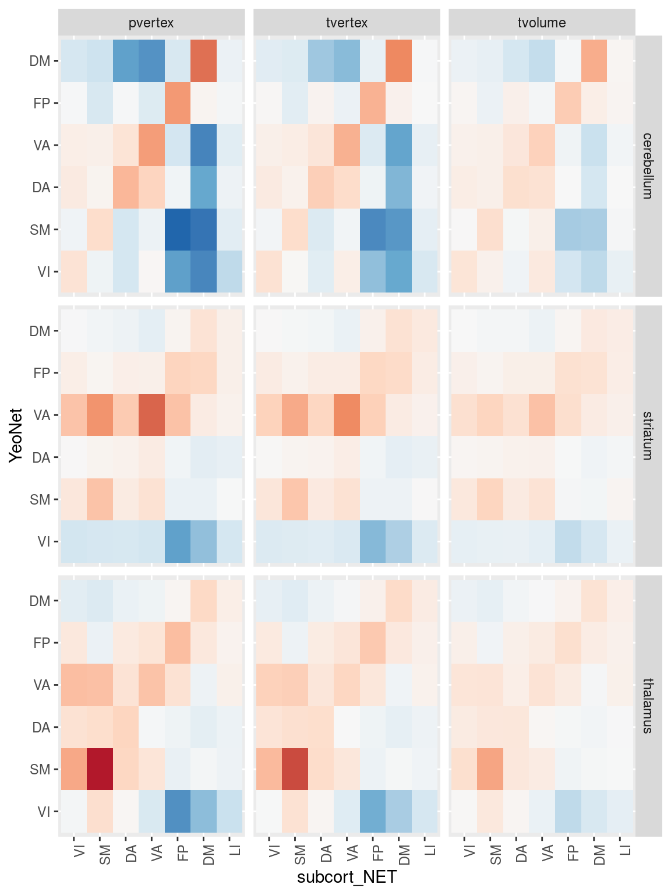
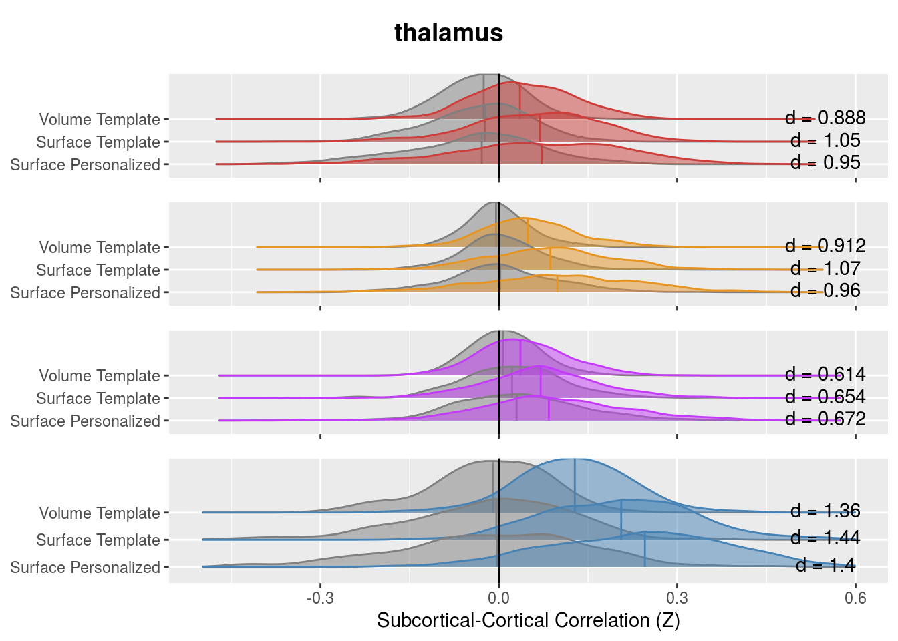

# Sub-cortical Cortical Stats Left and Right

This analysis tries to combine timeseries data from PINT outputs with subcortical timeseries to ask two questions

1. "External" validation of PINT. If PINT is indeed helping us better target meaningful resting state networks than we should see "cleaner" patterns of between the PINT output cortical ROIs and parcels of the subcortical structure that have been associated with these networks in literature.
   + i.e. connectivity of the cortical ROIS with "expected" subcortical parcel should increae and correlation with other parcels should decrease after PINT.
   
2. To interograte SSD related differences in Cortical-Subcortical connectivity - and to see if they persist after PINT.

Some work Ji (in prep) kinda suggests that there might be differences between left and right subcortical structures. AND spliting the left and right seemed to make more sense for whole brain correlations (because our cortical nodes have a hemisphere). So in this analysis have separate left and right ROIs


```r
library(tidyverse)
```

```
## ── Attaching packages ──────────────────────────────────────────────────────────────────────────────────────────────────────────────────── tidyverse 1.2.1 ──
```

```
## ✔ ggplot2 3.1.0       ✔ purrr   0.2.5  
## ✔ tibble  2.0.1       ✔ dplyr   0.8.0.1
## ✔ tidyr   0.8.2       ✔ stringr 1.3.1  
## ✔ readr   1.3.0       ✔ forcats 0.3.0
```

```
## ── Conflicts ─────────────────────────────────────────────────────────────────────────────────────────────────────────────────────── tidyverse_conflicts() ──
## ✖ dplyr::filter() masks stats::filter()
## ✖ dplyr::lag()    masks stats::lag()
```

```r
library(broom)
library(knitr)
library(tableone)
library(cowplot)
```

```
## 
## Attaching package: 'cowplot'
```

```
## The following object is masked from 'package:ggplot2':
## 
##     ggsave
```

```r
library(ggridges)
```

```
## 
## Attaching package: 'ggridges'
```

```
## The following object is masked from 'package:ggplot2':
## 
##     scale_discrete_manual
```

```r
library(here)
```

```
## here() starts at /mnt/tigrlab/projects/edickie/code/SZ_PINT
```


## The paths to data


```r
source(here('code/R/settings_helpers.R'))
pheno <- read_pheno_file()
```

```
## Parsed with column specification:
## cols(
##   .default = col_double(),
##   dataset = col_character(),
##   subject_id = col_character(),
##   session_id = col_character(),
##   task_id = col_character(),
##   run_id = col_character(),
##   acq_id = col_character(),
##   subject = col_character(),
##   session = col_character(),
##   cmh_session_id = col_character(),
##   DX = col_character(),
##   Sex = col_character(),
##   Site = col_character(),
##   Scanner = col_character(),
##   isFEP = col_character(),
##   ghost_NoGhost = col_character(),
##   filename = col_character()
## )
```

```
## See spec(...) for full column specifications.
```

```r
YeoNet_colours <- define_Yeo7_colours()
Yeo7_2011_80verts <- read_Yeo72011_template()
the_subcortical_guide <- get_subcortical_guide()
```

```
## Parsed with column specification:
## cols(
##   subcort_hemi = col_character(),
##   subcort_ROI = col_character(),
##   numvx = col_double(),
##   network = col_character()
## )
```

```r
node_annotations <- get_node_annotations(Yeo7_2011_80verts, the_subcortical_guide)
source(here('code/R/custom_plot_helpers.R'))

source(here('code/R/file_reading_helpers.R'))
```


This reads all files and generate PINT to subcortical correlation values for a given subject


### This reads all the subcortical files it can find

Write a func_base and outputprefix cols into the pheno file for the file reading step


```r
pheno <- pheno %>%
  mutate(func_base = get_func_base_from_pint_summary_filename(filename,subject, session), 
         outputprefix = construct_output_prefix(subject, session, func_base)) 
```

a litle chunck I use to test if test if the reader is working...


```r
run_read_all_subject_timeseries_and_subcortcort_corZ(pheno$outputprefix[1], pheno$dataset[1])
```


```r
all_subcort_results <- pheno %>%
  select(subject, outputprefix, dataset) %>%
  mutate(subcort_corrs = map2(outputprefix, dataset,
                              ~run_read_all_subject_timeseries_and_subcortcort_corZ(.x, .y)))
```


```r
save(all_subcort_results, file = here("data/processed/Rdata_cache/03_subcort_results_cache.Rdata"))
```


```r
load(here("data/processed/Rdata_cache/03_subcort_results_cache.Rdata"))
```


### merge with the phenotypic data


```r
results_pheno <- all_subcort_results %>%
  inner_join(pheno, by = c("subject", "dataset")) %>%
  unnest() %>%
  inner_join(the_subcortical_guide, by = c("combined_name")) %>%
  mutate(YeoNet = str_sub(PINT_ROI, 1,2),
         hemisphere = str_sub(PINT_ROI, 5,5)) %>%
  mutate(conn_type = if_else(YeoNet == subcort_NET, "same_net", "diff_net"),
         YeoNet = factor(YeoNet, levels = c("VI", "SM", "DA", "VA", "FP", "DM")),
         subcort_NET = factor(subcort_NET, levels = c("VI", "SM", "DA", "VA", "FP", "DM", "LI"))) %>%
  select(subject, dataset, PINT_ROI, subcort_ROI, subcort_NET,subcort_hemi, 
         pvertex_corr, tvertex_corr, tvolume_corr,
         DX, Sex, fd_mean, Age, Site, Scanner, Age_pt, fd_mean_pt,  
         YeoNet, hemisphere, conn_type) 
```


## make a subject table from resuts pheno


```r
library(tableone)
therealtable1 <- CreateTableOne(
  strata = c("DX", "Site"),
  vars = c("Age", "Sex", "fd_mean", "fd_perc"),
  data = filter(results_pheno, PINT_ROI=="DMP1L",subcort_ROI=="thalamus", subcort_NET=="VA", subcort_hemi == "L")
)
```

```
## Warning in ModuleReturnVarsExist(vars, data): The data frame does not have:
## fd_perc Dropped
```

```r
tabMat <- print(therealtable1, quote = FALSE, noSpaces = TRUE, printToggle = FALSE)
kable(tabMat)
```

                      CTRL:CMH       SSD:CMH        CTRL:COBRE     SSD:COBRE       CTRL:ds000030   SSD:ds000030   CTRL:ZHH       SSD:ZHH        p        test 
--------------------  -------------  -------------  -------------  --------------  --------------  -------------  -------------  -------------  -------  -----
n                     41             67             35             22              107             31             111            83                           
Age (mean (SD))       26.37 (6.67)   32.19 (8.47)   33.17 (9.01)   29.55 (12.14)   30.42 (8.14)    35.23 (9.32)   25.07 (6.55)   25.83 (8.98)   <0.001        
Sex = M (%)           22 (53.7)      40 (59.7)      23 (65.7)      19 (86.4)       55 (51.4)       24 (77.4)      48 (43.2)      63 (75.9)      <0.001        
fd_mean (mean (SD))   0.10 (0.04)    0.12 (0.06)    0.18 (0.04)    0.21 (0.08)     0.14 (0.07)     0.18 (0.07)    0.12 (0.04)    0.12 (0.06)    <0.001        


```r
library(tableone)
therealtable1 <- CreateTableOne(
  vars = c("Age", "Sex", "DX", "fd_mean", "fd_perc"),
  data = filter(results_pheno, PINT_ROI=="DMP1L",subcort_ROI=="thalamus", subcort_NET=="VA", subcort_hemi == "L")
)
```

```
## Warning in ModuleReturnVarsExist(vars, data): The data frame does not have:
## fd_perc Dropped
```

```r
tabMat <- print(therealtable1, quote = FALSE, noSpaces = TRUE, printToggle = FALSE)
kable(tabMat)
```

                      Overall      
--------------------  -------------
n                     497          
Age (mean (SD))       28.82 (8.85) 
Sex = M (%)           294 (59.2)   
DX = SSD (%)          203 (40.8)   
fd_mean (mean (SD))   0.14 (0.06)  


# Is PINT "focusing" cortical subcortical connectivity


```r
table1 <- results_pheno %>%
  mutate(corr_diff = pvertex_corr - tvertex_corr) %>%
  gather(corr_type, rval, pvertex_corr, tvertex_corr, tvolume_corr) %>%
  group_by(corr_type, YeoNet, subcort_ROI, subcort_NET) %>%
  summarise(n = n(),
            Mean = mean(rval),
            SD = sd(rval)) 
  
ggplot(table1, aes(y = YeoNet, x = subcort_NET, fill = Mean)) + 
  geom_tile() +
  scale_fill_distiller(breaks = c(-0.5,0.5), type = "div", palette = 5) +
  theme(axis.text.x = element_text(angle = 90, hjust = 1)) +
  facet_grid(subcort_ROI~corr_type) 
```


functions to help re-annotated the function axes


```r
#' sets some the main variables to factors to more descriptive labels
add_corrtype_and_subcortROI_columns <- function(data) {
  result <- data %>%
    mutate(corrtype = factor(corr_type, levels = c('tvolume_corr','tvertex_corr','pvertex_corr'),
                           labels = c("Volume Template", "Surface Template", "Surface Personalized")),
         subcortROI = factor(subcort_ROI, 
                             levels = c("striatum", "thalamus", "cerebellum"),
                             labels = c("Striatum", "Thalamus", "Cerebellum"))) 
  return(result)
}

#'drop VI DA and LI network from resutls
drop_VI_DA_LI <- function(data) {
  result <- data %>%
    filter(subcort_NET != "VI",
         subcort_NET != "DA",
         subcort_NET != "LI",
         YeoNet != "VI",
         YeoNet != "DA") 
  return(result)
}
```


```r
table1 %>%
  drop_VI_DA_LI() %>%
  add_corrtype_and_subcortROI_columns() %>%
ggplot(aes(y = YeoNet, x = subcort_NET, fill = Mean)) + 
  geom_tile() +
  geom_text(aes(label = sprintf('%3.2f',Mean))) +
  scale_fill_distiller(breaks = c(-0.5,0.5), type = "div", palette = 5) +
  theme(axis.text.x = element_text(angle = 90, hjust = 1)) +
  facet_grid(corrtype~subcortROI) +
  labs(y = "Cortical RSN Network", x = "Subcortical Subregion")
```


```r
table1 <- results_pheno %>%
  mutate(corr_diff = pvertex_corr - tvertex_corr) %>%
  gather(corr_type, rval, pvertex_corr, tvertex_corr, tvolume_corr) %>%
  group_by(corr_type, YeoNet, hemisphere, subcort_ROI, subcort_NET, subcort_hemi) %>%
  summarise(n = n(),
            Mean = mean(rval),
            SD = sd(rval)) 

table1 %>%
  drop_VI_DA_LI() %>%
  add_corrtype_and_subcortROI_columns() %>%
ggplot(aes(y = YeoNet, x = subcort_NET, fill = Mean)) + 
  geom_tile() +
  geom_text(aes(label = sprintf('%3.2f',Mean))) +
  scale_fill_distiller(breaks = c(-0.5,0.5), type = "div", palette = 5) +
  theme(axis.text.x = element_text(angle = 90, hjust = 1)) +
  facet_grid(subcortROI*subcort_hemi~corrtype*hemisphere) +
  labs(y = "Cortical RSN Network", x = "Subcortical Subregion")  
```


We see in the above figure that the Yeo 7 Network connectivity strongly shows the expected pattern in the cerebeullum. 

Lower evidence is seen in the striatum and thalamus, although there is a faint increase across the diagonal for the SM, VA and DM especially


```r
net_means <- results_pheno %>%
  mutate(corr_diff = pvertex_corr - tvertex_corr) %>%
  group_by(YeoNet, subcort_ROI, subcort_NET, conn_type, subject) %>%
  summarise(netmean_pvertex = mean(pvertex_corr),
            netmean_tvertex = mean(tvertex_corr),
            netmean_tvolume = mean(tvolume_corr)) %>%
  ungroup()

net_means_pint_t <- net_means %>%
  group_by(YeoNet, subcort_ROI, subcort_NET) %>%
  do(tidy(t.test(.$netmean_pvertex, .$netmean_tvertex, paired = TRUE))) %>%
  ungroup() %>% mutate(p_FDR = p.adjust(p.value, method = "fdr"))

net_means_pint_t %>%
  ungroup() %>%
  mutate(sig = if_else(p_FDR < 0.05, '*', NA_character_) ) %>%
  drop_VI_DA_LI() %>%
  mutate(subcortROI = factor(subcort_ROI, 
                           levels = c("striatum", "thalamus", "cerebellum"),
                           labels = c("Striatum", "Thalamus", "Cerebellum"))) %>%
ggplot(aes(x = YeoNet, y = subcort_NET, fill = statistic)) + 
  geom_tile(color = "black", na.rm = TRUE) +
  geom_point(aes(shape = sig), na.rm = TRUE) +
  scale_fill_distiller(breaks = c(-10,10), type = "div", palette = 5) +
  theme(axis.text.x = element_text(angle = 90, hjust = 1)) +
  facet_wrap(~subcortROI)
```


Here we plot the paired t-stat camparing personalized to template, we see a very strong increase in correlation along the diagonal (i.e. with the hypothesized regions) and decreases on the off-dignonal (i.e. decreased connectivity with the other network's parcels)


```r
net_means_vpint_t <- net_means %>%
  group_by(YeoNet, subcort_ROI, subcort_NET) %>%
  do(tidy(t.test(.$netmean_pvertex, .$netmean_tvolume, paired = TRUE))) %>%
  ungroup() %>% mutate(p_FDR = p.adjust(p.value, method = "fdr"))

net_means_vpint_t %>%
  ungroup() %>%
  mutate(sig = if_else(p_FDR < 0.05, '*', NA_character_) ) %>%
  drop_VI_DA_LI() %>%
  mutate(subcortROI = factor(subcort_ROI, 
                           levels = c("striatum", "thalamus", "cerebellum"),
                           labels = c("Striatum", "Thalamus", "Cerebellum"))) %>%
ggplot(aes(x = YeoNet, y = subcort_NET, fill = statistic)) + 
  geom_tile(color = "black", na.rm = TRUE) +
  geom_point(aes(shape = sig), na.rm = TRUE) +
  scale_fill_distiller(breaks = c(-10,10), type = "div", palette = 5) +
  theme(axis.text.x = element_text(angle = 90, hjust = 1)) +
  facet_wrap(~subcortROI)
```


# trying to calculate an vs off diagonal term

In the above table to calcuculated the "focussing" effect as the change (in on person) between in connectivity with the expected parcel subtracted by the change in connectivity from other regions.

Below we plot these values against zero


```r
net_focus <- net_means %>%
  ungroup() %>%
  mutate(pint_diff = netmean_pvertex - netmean_tvertex,
         vpint_diff = netmean_pvertex - netmean_tvolume,
         surf_diff = netmean_tvertex - netmean_tvolume) %>%
  group_by(subject, subcort_ROI, YeoNet, conn_type) %>%
  summarise(nets_avg_pint_diff = mean(pint_diff),
            nets_avg_vpint_diff = mean(vpint_diff),
            nets_avg_surf_diff = mean(surf_diff)
            ) %>%
  ungroup() %>%
  gather(comparison, nets_avg, nets_avg_pint_diff, nets_avg_vpint_diff, nets_avg_surf_diff) %>%
  spread(conn_type, nets_avg) %>%
  mutate(focus_effect = same_net - diff_net)

net_focus %>%
  ungroup() %>%
  group_by(subcort_ROI, YeoNet, comparison) %>%
  do(tidy(t.test(.$focus_effect))) %>%
  kable()
```


subcort_ROI   YeoNet   comparison              estimate    statistic     p.value   parameter     conf.low   conf.high  method              alternative 
------------  -------  --------------------  ----------  -----------  ----------  ----------  -----------  ----------  ------------------  ------------
cerebellum    VI       nets_avg_pint_diff     0.0274058   11.6427697   0.0000000         493    0.0227809   0.0320307  One Sample t-test   two.sided   
cerebellum    VI       nets_avg_surf_diff     0.0414541   10.8475696   0.0000000         493    0.0339456   0.0489625  One Sample t-test   two.sided   
cerebellum    VI       nets_avg_vpint_diff    0.0688599   14.1640353   0.0000000         493    0.0593079   0.0784119  One Sample t-test   two.sided   
cerebellum    SM       nets_avg_pint_diff     0.0205586    9.4833067   0.0000000         493    0.0162992   0.0248181  One Sample t-test   two.sided   
cerebellum    SM       nets_avg_surf_diff     0.0518569   15.4654578   0.0000000         493    0.0452688   0.0584450  One Sample t-test   two.sided   
cerebellum    SM       nets_avg_vpint_diff    0.0724155   17.4516048   0.0000000         493    0.0642626   0.0805684  One Sample t-test   two.sided   
cerebellum    DA       nets_avg_pint_diff     0.0287201   12.9214762   0.0000000         493    0.0243531   0.0330872  One Sample t-test   two.sided   
cerebellum    DA       nets_avg_surf_diff     0.0418660   13.7824757   0.0000000         493    0.0358977   0.0478343  One Sample t-test   two.sided   
cerebellum    DA       nets_avg_vpint_diff    0.0705861   17.1307845   0.0000000         493    0.0624904   0.0786819  One Sample t-test   two.sided   
cerebellum    VA       nets_avg_pint_diff     0.0333369   16.8287593   0.0000000         493    0.0294448   0.0372291  One Sample t-test   two.sided   
cerebellum    VA       nets_avg_surf_diff     0.0560229   19.6440835   0.0000000         493    0.0504195   0.0616263  One Sample t-test   two.sided   
cerebellum    VA       nets_avg_vpint_diff    0.0893598   22.4772273   0.0000000         493    0.0815487   0.0971710  One Sample t-test   two.sided   
cerebellum    FP       nets_avg_pint_diff     0.0418528   18.7746195   0.0000000         493    0.0374728   0.0462327  One Sample t-test   two.sided   
cerebellum    FP       nets_avg_surf_diff     0.0367357   15.3459008   0.0000000         493    0.0320323   0.0414391  One Sample t-test   two.sided   
cerebellum    FP       nets_avg_vpint_diff    0.0785885   22.6607390   0.0000000         493    0.0717745   0.0854025  One Sample t-test   two.sided   
cerebellum    DM       nets_avg_pint_diff     0.0537150   21.0774329   0.0000000         493    0.0487078   0.0587222  One Sample t-test   two.sided   
cerebellum    DM       nets_avg_surf_diff     0.0609553   17.7505429   0.0000000         493    0.0542082   0.0677024  One Sample t-test   two.sided   
cerebellum    DM       nets_avg_vpint_diff    0.1146703   25.1856622   0.0000000         493    0.1057247   0.1236160  One Sample t-test   two.sided   
striatum      VI       nets_avg_pint_diff     0.0009511    0.4219322   0.6732584         493   -0.0034778   0.0053801  One Sample t-test   two.sided   
striatum      VI       nets_avg_surf_diff     0.0089229    2.5173188   0.0121412         493    0.0019585   0.0158873  One Sample t-test   two.sided   
striatum      VI       nets_avg_vpint_diff    0.0098740    2.2471214   0.0250738         493    0.0012406   0.0185074  One Sample t-test   two.sided   
striatum      SM       nets_avg_pint_diff     0.0094129    5.1440821   0.0000004         493    0.0058176   0.0130081  One Sample t-test   two.sided   
striatum      SM       nets_avg_surf_diff     0.0200427    7.3152876   0.0000000         493    0.0146595   0.0254258  One Sample t-test   two.sided   
striatum      SM       nets_avg_vpint_diff    0.0294555    8.3944137   0.0000000         493    0.0225612   0.0363498  One Sample t-test   two.sided   
striatum      DA       nets_avg_pint_diff     0.0050523    2.8423068   0.0046645         493    0.0015598   0.0085448  One Sample t-test   two.sided   
striatum      DA       nets_avg_surf_diff     0.0079077    3.6956109   0.0002439         493    0.0037036   0.0121119  One Sample t-test   two.sided   
striatum      DA       nets_avg_vpint_diff    0.0129600    4.2216095   0.0000289         493    0.0069283   0.0189918  One Sample t-test   two.sided   
striatum      VA       nets_avg_pint_diff     0.0211444   14.7052079   0.0000000         493    0.0183193   0.0239696  One Sample t-test   two.sided   
striatum      VA       nets_avg_surf_diff     0.0362259   17.2538786   0.0000000         493    0.0321007   0.0403512  One Sample t-test   two.sided   
striatum      VA       nets_avg_vpint_diff    0.0573704   20.8643397   0.0000000         493    0.0519678   0.0627729  One Sample t-test   two.sided   
striatum      FP       nets_avg_pint_diff     0.0092542    5.0349801   0.0000007         493    0.0056430   0.0128654  One Sample t-test   two.sided   
striatum      FP       nets_avg_surf_diff     0.0121264    6.3329143   0.0000000         493    0.0083642   0.0158886  One Sample t-test   two.sided   
striatum      FP       nets_avg_vpint_diff    0.0213806    7.5728809   0.0000000         493    0.0158334   0.0269278  One Sample t-test   two.sided   
striatum      DM       nets_avg_pint_diff     0.0097812    4.7171291   0.0000031         493    0.0057071   0.0138552  One Sample t-test   two.sided   
striatum      DM       nets_avg_surf_diff     0.0176855    7.2184575   0.0000000         493    0.0128717   0.0224993  One Sample t-test   two.sided   
striatum      DM       nets_avg_vpint_diff    0.0274667    8.1032250   0.0000000         493    0.0208069   0.0341265  One Sample t-test   two.sided   
thalamus      VI       nets_avg_pint_diff     0.0066896    4.0687435   0.0000550         493    0.0034592   0.0099200  One Sample t-test   two.sided   
thalamus      VI       nets_avg_surf_diff     0.0171712    7.4188092   0.0000000         493    0.0126236   0.0217188  One Sample t-test   two.sided   
thalamus      VI       nets_avg_vpint_diff    0.0238608    7.9818600   0.0000000         493    0.0179873   0.0297343  One Sample t-test   two.sided   
thalamus      SM       nets_avg_pint_diff     0.0286083   12.8286466   0.0000000         493    0.0242267   0.0329898  One Sample t-test   two.sided   
thalamus      SM       nets_avg_surf_diff     0.0603081   17.7481689   0.0000000         493    0.0536317   0.0669844  One Sample t-test   two.sided   
thalamus      SM       nets_avg_vpint_diff    0.0889163   20.5025373   0.0000000         493    0.0803954   0.0974373  One Sample t-test   two.sided   
thalamus      DA       nets_avg_pint_diff     0.0151436    7.9828345   0.0000000         493    0.0114163   0.0188708  One Sample t-test   two.sided   
thalamus      DA       nets_avg_surf_diff     0.0288789   11.1873927   0.0000000         493    0.0238070   0.0339507  One Sample t-test   two.sided   
thalamus      DA       nets_avg_vpint_diff    0.0440224   12.3863970   0.0000000         493    0.0370394   0.0510055  One Sample t-test   two.sided   
thalamus      VA       nets_avg_pint_diff     0.0113488    7.2527919   0.0000000         493    0.0082744   0.0144231  One Sample t-test   two.sided   
thalamus      VA       nets_avg_surf_diff     0.0150747    6.5191917   0.0000000         493    0.0105314   0.0196180  One Sample t-test   two.sided   
thalamus      VA       nets_avg_vpint_diff    0.0264234    8.5697441   0.0000000         493    0.0203653   0.0324815  One Sample t-test   two.sided   
thalamus      FP       nets_avg_pint_diff     0.0119887    6.6019451   0.0000000         493    0.0084208   0.0155567  One Sample t-test   two.sided   
thalamus      FP       nets_avg_surf_diff     0.0248535   11.0328590   0.0000000         493    0.0204275   0.0292796  One Sample t-test   two.sided   
thalamus      FP       nets_avg_vpint_diff    0.0368423   11.7443622   0.0000000         493    0.0306787   0.0430058  One Sample t-test   two.sided   
thalamus      DM       nets_avg_pint_diff     0.0159898    8.4683314   0.0000000         493    0.0122799   0.0196997  One Sample t-test   two.sided   
thalamus      DM       nets_avg_surf_diff     0.0223480    9.0617516   0.0000000         493    0.0175025   0.0271936  One Sample t-test   two.sided   
thalamus      DM       nets_avg_vpint_diff    0.0383378   11.4373011   0.0000000         493    0.0317519   0.0449238  One Sample t-test   two.sided   

Another (maybe better) way to test this is to show calculate the "focusing" value in individual subjects THAN compute how this number changes with PINT. Let try that..


```r
subject_focus <- net_means %>%
  drop_VI_DA_LI() %>%
  gather(vertex_type, nets_avg, netmean_pvertex, netmean_tvertex, netmean_tvolume) %>%
  ungroup(subcort_NET) %>%
  group_by(subject, subcort_ROI, YeoNet, vertex_type, conn_type) %>%
  summarise(nets_type_avg = mean(nets_avg)) %>%
  spread(conn_type, nets_type_avg) # %>%
  # ungroup() %>%
  # mutate(focus_effect = same_net - diff_net)

subject_focus %>%
  ungroup() %>%
  group_by(subcort_ROI, YeoNet, vertex_type) %>%
  do(tidy(t.test(.$same_net, .$diff_net, paired = TRUE))) %>%
  mutate(cohenD = statistic/sqrt(parameter + 1)) %>%
  kable()
```


subcort_ROI   YeoNet   vertex_type         estimate   statistic   p.value   parameter    conf.low   conf.high  method          alternative       cohenD
------------  -------  ----------------  ----------  ----------  --------  ----------  ----------  ----------  --------------  ------------  ----------
cerebellum    SM       netmean_pvertex    0.2399467    36.70593         0         493   0.2271029   0.2527905  Paired t-test   two.sided      1.6514780
cerebellum    SM       netmean_tvertex    0.2084729    37.71938         0         493   0.1976137   0.2193322  Paired t-test   two.sided      1.6970749
cerebellum    SM       netmean_tvolume    0.1431050    33.82311         0         493   0.1347920   0.1514180  Paired t-test   two.sided      1.5217737
cerebellum    VA       netmean_pvertex    0.2412299    36.30497         0         493   0.2281748   0.2542850  Paired t-test   two.sided      1.6334377
cerebellum    VA       netmean_tvertex    0.1985123    36.86791         0         493   0.1879331   0.2090916  Paired t-test   two.sided      1.6587658
cerebellum    VA       netmean_tvolume    0.1258778    33.72861         0         493   0.1185450   0.1332105  Paired t-test   two.sided      1.5175218
cerebellum    FP       netmean_pvertex    0.1872801    39.61782         0         493   0.1779922   0.1965680  Paired t-test   two.sided      1.7824899
cerebellum    FP       netmean_tvertex    0.1425105    40.63385         0         493   0.1356197   0.1494014  Paired t-test   two.sided      1.8282034
cerebellum    FP       netmean_tvolume    0.1024950    38.22818         0         493   0.0972271   0.1077629  Paired t-test   two.sided      1.7199671
cerebellum    DM       netmean_pvertex    0.2977314    41.69784         0         493   0.2837024   0.3117604  Paired t-test   two.sided      1.8760745
cerebellum    DM       netmean_tvertex    0.2405480    40.98858         0         493   0.2290173   0.2520786  Paired t-test   two.sided      1.8441635
cerebellum    DM       netmean_tvolume    0.1790535    38.59262         0         493   0.1699378   0.1881693  Paired t-test   two.sided      1.7363642
striatum      SM       netmean_pvertex    0.1077970    18.24899         0         493   0.0961910   0.1194030  Paired t-test   two.sided      0.8210609
striatum      SM       netmean_tvertex    0.0962070    19.48143         0         493   0.0865041   0.1059099  Paired t-test   two.sided      0.8765110
striatum      SM       netmean_tvolume    0.0724419    17.79229         0         493   0.0644422   0.0804416  Paired t-test   two.sided      0.8005130
striatum      VA       netmean_pvertex    0.0996744    27.38295         0         493   0.0925226   0.1068263  Paired t-test   two.sided      1.2320172
striatum      VA       netmean_tvertex    0.0801373    27.68073         0         493   0.0744491   0.0858255  Paired t-test   two.sided      1.2454151
striatum      VA       netmean_tvolume    0.0478839    21.51229         0         493   0.0435105   0.0522573  Paired t-test   two.sided      0.9678838
striatum      FP       netmean_pvertex    0.0489004    14.43359         0         493   0.0422438   0.0555571  Paired t-test   two.sided      0.6493980
striatum      FP       netmean_tvertex    0.0413781    16.76016         0         493   0.0365274   0.0462288  Paired t-test   two.sided      0.7540750
striatum      FP       netmean_tvolume    0.0313351    15.48405         0         493   0.0273589   0.0353112  Paired t-test   two.sided      0.6966604
striatum      DM       netmean_pvertex    0.0798067    15.31447         0         493   0.0695678   0.0900456  Paired t-test   two.sided      0.6890306
striatum      DM       netmean_tvertex    0.0706844    18.07803         0         493   0.0630022   0.0783667  Paired t-test   two.sided      0.8133688
striatum      DM       netmean_tvolume    0.0529355    14.67428         0         493   0.0458478   0.0600232  Paired t-test   two.sided      0.6602272
thalamus      SM       netmean_pvertex    0.2350851    32.39511         0         493   0.2208270   0.2493431  Paired t-test   two.sided      1.4575250
thalamus      SM       netmean_tvertex    0.2021965    33.02133         0         493   0.1901657   0.2142273  Paired t-test   two.sided      1.4856999
thalamus      SM       netmean_tvolume    0.1358514    30.44286         0         493   0.1270835   0.1446193  Paired t-test   two.sided      1.3696888
thalamus      VA       netmean_pvertex    0.0603700    14.93815         0         493   0.0524297   0.0683104  Paired t-test   two.sided      0.6720992
thalamus      VA       netmean_tvertex    0.0473139    14.86396         0         493   0.0410598   0.0535681  Paired t-test   two.sided      0.6687610
thalamus      VA       netmean_tvolume    0.0300578    12.36652         0         493   0.0252823   0.0348334  Paired t-test   two.sided      0.5563961
thalamus      FP       netmean_pvertex    0.0902495    21.08280         0         493   0.0818388   0.0986602  Paired t-test   two.sided      0.9485600
thalamus      FP       netmean_tvertex    0.0774761    23.60518         0         493   0.0710274   0.0839249  Paired t-test   two.sided      1.0620471
thalamus      FP       netmean_tvolume    0.0512406    20.50364         0         493   0.0463304   0.0561508  Paired t-test   two.sided      0.9225024
thalamus      DM       netmean_pvertex    0.1107613    21.42708         0         493   0.1006049   0.1209178  Paired t-test   two.sided      0.9640500
thalamus      DM       netmean_tvertex    0.0931132    23.53542         0         493   0.0853399   0.1008865  Paired t-test   two.sided      1.0589084
thalamus      DM       netmean_tvolume    0.0704012    20.23685         0         493   0.0635659   0.0772364  Paired t-test   two.sided      0.9104988


```r
subcortical_raincloud(subject_focus, "striatum")
```

```
## Picking joint bandwidth of 0.0269
```

```
## Picking joint bandwidth of 0.024
```

```
## Picking joint bandwidth of 0.0236
```

```
## Picking joint bandwidth of 0.0142
```

```
## Picking joint bandwidth of 0.0252
```

```
## Picking joint bandwidth of 0.0157
```

```
## Picking joint bandwidth of 0.0334
```

```
## Warning: Removed 7 rows containing non-finite values (stat_density_ridges).
```

```
## Picking joint bandwidth of 0.0276
```


```r
subcortical_raincloud(subject_focus, "thalamus")
```

```
## Picking joint bandwidth of 0.0237
## Picking joint bandwidth of 0.0237
```

```
## Picking joint bandwidth of 0.0207
```

```
## Picking joint bandwidth of 0.0184
```

```
## Picking joint bandwidth of 0.0221
```

```
## Picking joint bandwidth of 0.0179
```

```
## Picking joint bandwidth of 0.0307
```

```
## Warning: Removed 2 rows containing non-finite values (stat_density_ridges).
```

```
## Picking joint bandwidth of 0.033
```

```
## Warning: Removed 14 rows containing non-finite values
## (stat_density_ridges).
```



```r
subcortical_raincloud(subject_focus, "cerebellum")
```

```
## Picking joint bandwidth of 0.0264
```

```
## Warning: Removed 1 rows containing non-finite values (stat_density_ridges).
```

```
## Picking joint bandwidth of 0.0322
```

```
## Warning: Removed 24 rows containing non-finite values
## (stat_density_ridges).
```

```
## Picking joint bandwidth of 0.0217
```

```
## Picking joint bandwidth of 0.0201
```

```
## Warning: Removed 1 rows containing non-finite values (stat_density_ridges).
```

```
## Picking joint bandwidth of 0.0265
```

```
## Picking joint bandwidth of 0.0299
```

```
## Warning: Removed 5 rows containing non-finite values (stat_density_ridges).
```

```
## Picking joint bandwidth of 0.0312
```

```
## Warning: Removed 11 rows containing non-finite values
## (stat_density_ridges).
```

```
## Picking joint bandwidth of 0.0305
```

```
## Warning: Removed 8 rows containing non-finite values (stat_density_ridges).
```


```r
subject_focus %>%
  ungroup() %>% 
  mutate(focus_effect = same_net - diff_net) %>%
  select(subject, YeoNet, vertex_type, subcort_ROI, focus_effect) %>%
  spread(vertex_type, focus_effect) %>%
  group_by(subcort_ROI, YeoNet) %>%
  do(tidy(t.test(.$netmean_pvertex, .$netmean_tvertex, paired = TRUE))) %>%
  mutate(cohenD = statistic/sqrt(parameter + 1)) %>%
  kable()
```


subcort_ROI   YeoNet     estimate   statistic    p.value   parameter    conf.low   conf.high  method          alternative       cohenD
------------  -------  ----------  ----------  ---------  ----------  ----------  ----------  --------------  ------------  ----------
cerebellum    SM        0.0314738   12.942459   0.00e+00         493   0.0266958   0.0362518  Paired t-test   two.sided      0.5823087
cerebellum    VA        0.0427176   18.918221   0.00e+00         493   0.0382811   0.0471541  Paired t-test   two.sided      0.8511710
cerebellum    FP        0.0447695   19.684122   0.00e+00         493   0.0403008   0.0492383  Paired t-test   two.sided      0.8856305
cerebellum    DM        0.0571834   21.356022   0.00e+00         493   0.0519225   0.0624444  Paired t-test   two.sided      0.9608528
striatum      SM        0.0115900    5.681061   0.00e+00         493   0.0075816   0.0155984  Paired t-test   two.sided      0.2556030
striatum      VA        0.0195371   14.215170   0.00e+00         493   0.0168368   0.0222375  Paired t-test   two.sided      0.6395707
striatum      FP        0.0075224    4.428089   1.17e-05         493   0.0041846   0.0108601  Paired t-test   two.sided      0.1992292
striatum      DM        0.0091223    4.078587   5.28e-05         493   0.0047278   0.0135168  Paired t-test   two.sided      0.1835043
thalamus      SM        0.0328886   13.004730   0.00e+00         493   0.0279197   0.0378574  Paired t-test   two.sided      0.5851105
thalamus      VA        0.0130561    8.122775   0.00e+00         493   0.0098980   0.0162142  Paired t-test   two.sided      0.3654609
thalamus      FP        0.0127733    6.525782   0.00e+00         493   0.0089275   0.0166191  Paired t-test   two.sided      0.2936088
thalamus      DM        0.0176481    8.295198   0.00e+00         493   0.0134680   0.0218282  Paired t-test   two.sided      0.3732186

```r
subject_focus %>%
  ungroup() %>% 
  mutate(focus_effect = same_net - diff_net) %>%
  select(subject, YeoNet, vertex_type, subcort_ROI, focus_effect) %>%
  spread(vertex_type, focus_effect) %>%
  group_by(subcort_ROI, YeoNet) %>%
  do(tidy(t.test(.$netmean_tvertex, .$netmean_tvolume, paired = TRUE))) %>%
  mutate(cohenD = statistic/sqrt(parameter + 1)) %>%
  kable()
```


subcort_ROI   YeoNet     estimate   statistic   p.value   parameter    conf.low   conf.high  method          alternative       cohenD
------------  -------  ----------  ----------  --------  ----------  ----------  ----------  --------------  ------------  ----------
cerebellum    SM        0.0653679   17.070999         0         493   0.0578444   0.0728914  Paired t-test   two.sided      0.7680606
cerebellum    VA        0.0726345   22.352361         0         493   0.0662499   0.0790192  Paired t-test   two.sided      1.0056802
cerebellum    FP        0.0400155   16.819785         0         493   0.0353412   0.0446899  Paired t-test   two.sided      0.7567579
cerebellum    DM        0.0614944   17.149929         0         493   0.0544493   0.0685395  Paired t-test   two.sided      0.7716118
striatum      SM        0.0237651    7.654866         0         493   0.0176653   0.0298649  Paired t-test   two.sided      0.3444087
striatum      VA        0.0322534   16.388022         0         493   0.0283865   0.0361203  Paired t-test   two.sided      0.7373320
striatum      FP        0.0100430    6.037727         0         493   0.0067748   0.0133112  Paired t-test   two.sided      0.2716502
striatum      DM        0.0177489    6.702068         0         493   0.0125456   0.0229522  Paired t-test   two.sided      0.3015403
thalamus      SM        0.0663451   17.281675         0         493   0.0588022   0.0738880  Paired t-test   two.sided      0.7775393
thalamus      VA        0.0172561    7.433846         0         493   0.0126953   0.0218169  Paired t-test   two.sided      0.3344646
thalamus      FP        0.0262355   11.161747         0         493   0.0216173   0.0308537  Paired t-test   two.sided      0.5021908
thalamus      DM        0.0227120    8.125153         0         493   0.0172199   0.0282042  Paired t-test   two.sided      0.3655679


Recreating the DM plot from the poster to double check


```r
net_means <- results_pheno %>%
  ungroup() %>%
  group_by(YeoNet, subcort_ROI, subcort_NET, subject) %>%
  summarise(netmean_pvertex = mean(pvertex_corr),
            netmean_tvertex = mean(tvertex_corr),
            pint_diff = netmean_pvertex - netmean_tvertex) 

pint_diff_sub_DM <- net_means %>%
  ungroup() %>% 
  filter(YeoNet == "DM", subcort_ROI == "cerebellum") %>%
  select(subject, subcort_NET, pint_diff) %>%
  spread(subcort_NET, pint_diff) %>%
  mutate(overall_pint_diff = DM - (SM + VA + FP + DA)/4,
         x_val = '') %>%
  select(subject, overall_pint_diff, x_val) %>%
  ggplot(aes(y = overall_pint_diff, x = x_val)) +
    geom_boxplot(outlier.shape = NA) +
    geom_jitter(alpha = 0.3, color = YeoNet_colours$DM, fill = "grey") +
    geom_hline(yintercept = 0) + 
    labs(y = "Change in correlation after PINT", x = "Cerebellum DM - Others") +
  scale_y_continuous(limits = c(-0.3, 0.3))

DM_submeans_plot <- net_means %>%
  mutate(is_DM = if_else(subcort_NET == 'DM', TRUE, FALSE),
         SubCortNET = factor(subcort_NET, levels = c("DM", "SM", "DA", "VA", "FP"))) %>%
  filter(subcort_ROI == "cerebellum", !is.na(SubCortNET), YeoNet == "DM") %>%
  ggplot(aes(y = pint_diff, x = SubCortNET, color = is_DM)) +
  geom_boxplot(color = "black", outlier.shape = NA) + 
  geom_jitter(alpha = 0.3) +
  geom_hline(yintercept = 0) +
  scale_color_manual(values = c('black',YeoNet_colours$DM)) +
  labs(y = "Change in correlation after PINT", color = NULL, x = "Subregion of Cerebellum") +
  theme(legend.position = "none") +
  scale_y_continuous(limits = c(-0.3, 0.3))

# DM_brain_pic <- ggdraw + draw_image('DM_striatum_pic.png')

plot_grid(pint_diff_sub_DM, DM_submeans_plot, rel_widths = c(1,2.5))
```


