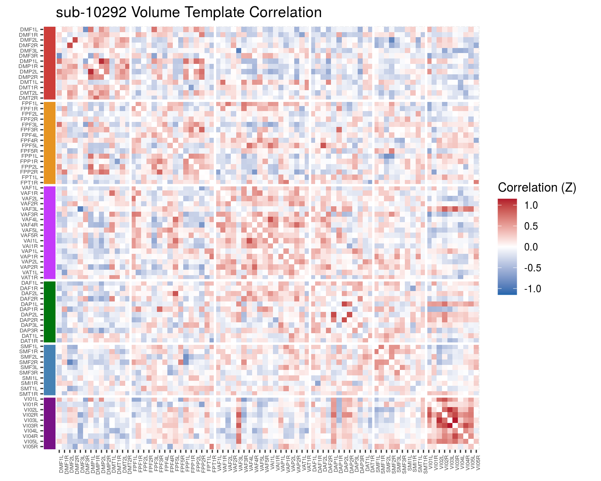
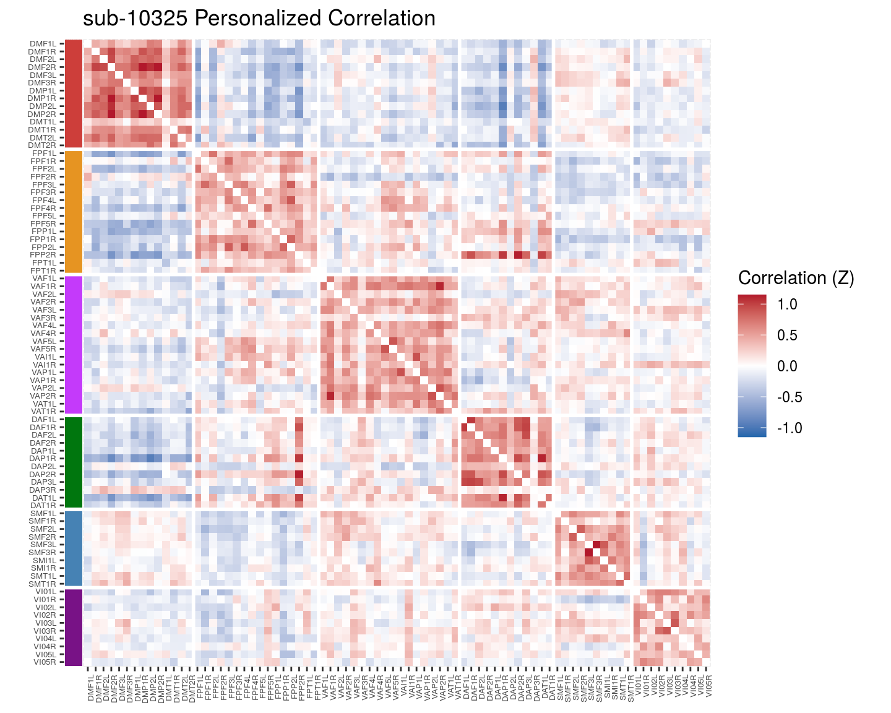
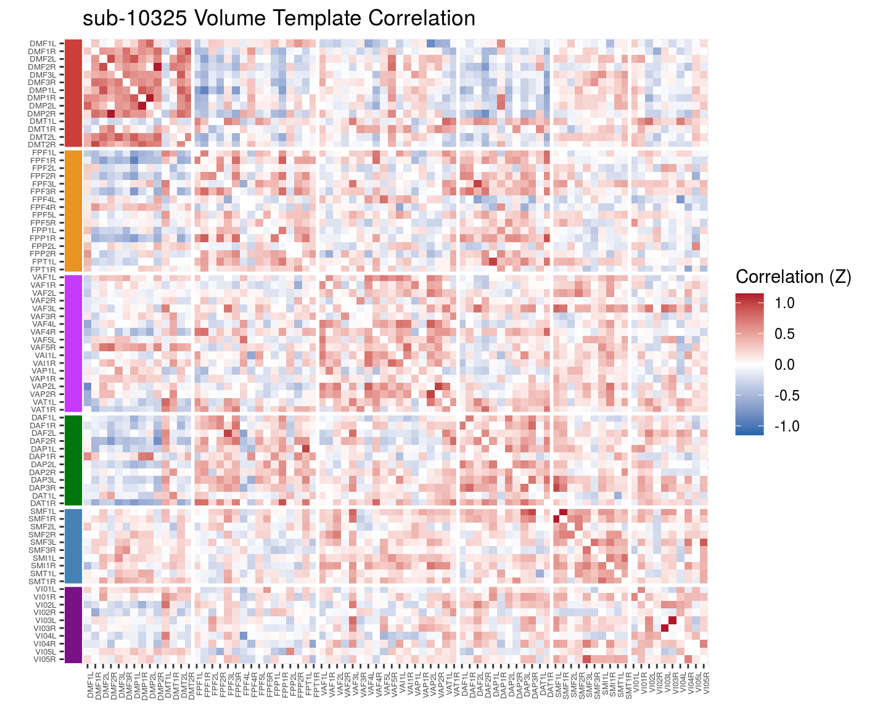
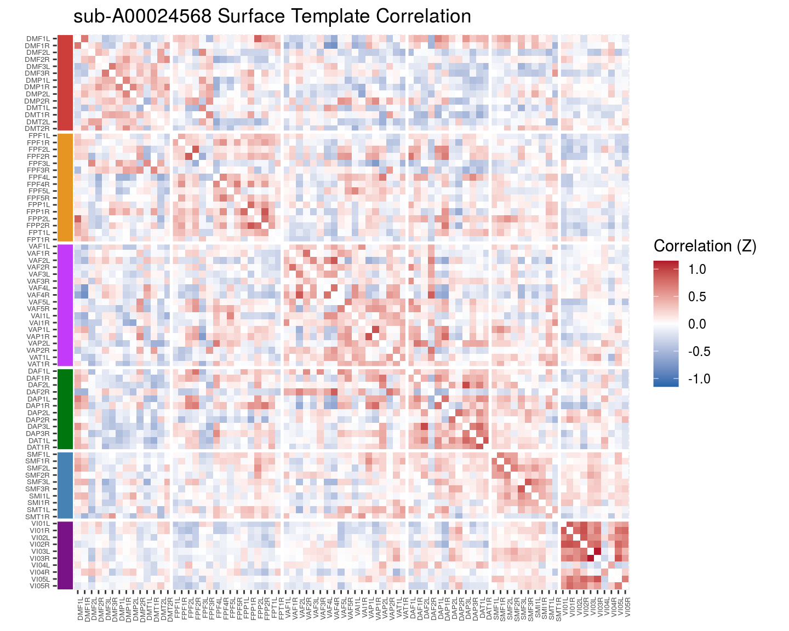
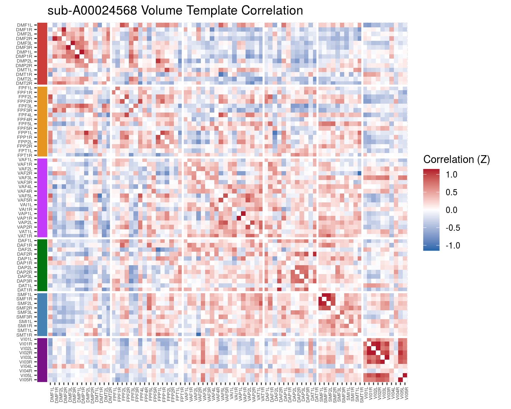

# Cortical-cortical results

Checking how the cortical-cortical stats change with adding surfaced based analyses and PINT


```r
library(tidyverse)
```

```
## ── Attaching packages ──────────────────────────────────────────────────────────────────────── tidyverse 1.3.0 ──
```

```
## ✓ ggplot2 3.3.1     ✓ purrr   0.3.4
## ✓ tibble  3.0.1     ✓ dplyr   1.0.0
## ✓ tidyr   1.1.0     ✓ stringr 1.4.0
## ✓ readr   1.3.1     ✓ forcats 0.5.0
```

```
## ── Conflicts ─────────────────────────────────────────────────────────────────────────── tidyverse_conflicts() ──
## x dplyr::filter() masks stats::filter()
## x dplyr::lag()    masks stats::lag()
```

```r
library(broom)
library(knitr)
library(cowplot)
```

```
## 
## ********************************************************
```

```
## Note: As of version 1.0.0, cowplot does not change the
```

```
##   default ggplot2 theme anymore. To recover the previous
```

```
##   behavior, execute:
##   theme_set(theme_cowplot())
```

```
## ********************************************************
```

```r
library(ggridges)
library(igraph)
```

```
## 
## Attaching package: 'igraph'
```

```
## The following objects are masked from 'package:dplyr':
## 
##     as_data_frame, groups, union
```

```
## The following objects are masked from 'package:purrr':
## 
##     compose, simplify
```

```
## The following object is masked from 'package:tidyr':
## 
##     crossing
```

```
## The following object is masked from 'package:tibble':
## 
##     as_data_frame
```

```
## The following objects are masked from 'package:stats':
## 
##     decompose, spectrum
```

```
## The following object is masked from 'package:base':
## 
##     union
```

```r
library(here)
```

```
## here() starts at /mnt/tigrlab/projects/edickie/code/SZ_PINT
```


```r
knitr::opts_chunk$set(dev = "png", dev.args = list(type = "cairo-png"))
```


```r
source(here('code/R/settings_helpers.R'))
pheno <- read_pheno_file() %>%
    drop_na(DX) %>%
    drop_na(Age_match) # dropping un-matched subjects
```

```
## Parsed with column specification:
## cols(
##   .default = col_double(),
##   dataset = col_character(),
##   subject_id = col_character(),
##   session_id = col_character(),
##   task_id = col_character(),
##   run_id = col_character(),
##   acq_id = col_character(),
##   subject = col_character(),
##   session = col_character(),
##   DX = col_character(),
##   Site = col_character(),
##   filename = col_character(),
##   cmh_session_id = col_character(),
##   Sex = col_character(),
##   Scanner = col_character(),
##   isFEP = col_character(),
##   zhh_chosen_sess = col_logical(),
##   ghost_NoGhost = col_character(),
##   in_matched_sample = col_logical()
## )
```

```
## See spec(...) for full column specifications.
```

```r
#YeoNet_colours <- define_YeoN7_colours()
Yeo7_2011_80verts <- read_Yeo72011_template()
#the_subcortical_guide <- get_subcortical_guide()
node_annotations <- get_node_annotations(read_Yeo72011_template(), get_subcortical_guide())
```

```
## Warning: `cols` is now required when using unnest().
## Please use `cols = c(subcort_NET)`
```

```
## Parsed with column specification:
## cols(
##   subcort_hemi = col_character(),
##   subcort_ROI = col_character(),
##   numvx = col_double(),
##   network = col_character()
## )
```

```r
source(here('code/R/file_reading_helpers.R'))
source(here('code/R/custom_plot_helpers.R'))
```


```r
pheno <- pheno %>%
  mutate(func_base = get_func_base_from_pint_summary_filename(filename,subject, session), 
         outputprefix = construct_output_prefix(subject, session, func_base)) 
```


```r
map2(pheno$outputprefix[1], pheno$dataset[1],
                              ~run_read_all_subject_timeseries_and_cortcort_corZ(.x, .y))
```


```r
all_corZ_cort_results <- pheno %>%
  select(subject, outputprefix, dataset) %>%
  mutate(the_corrs = map2(.$outputprefix, .$dataset,
                              ~run_read_all_subject_timeseries_and_cortcort_corZ(.x, .y)))
```

--- use the cache to load the data


```r
all_corZ_results <- readRDS(file = file.path(output_base, "all_clinicalplusqa_group", "Rdata_cache", "06_wholebrain_FC_cache.rds"))

all_corZ_cort_results <- all_corZ_results %>%
  semi_join(pheno, by = c("subject", "dataset")) %>%
  unnest(cols = c(the_corrs)) %>%
  filter(from %in% Yeo7_2011_80verts$SHORTNAME) %>%
  filter(to %in% Yeo7_2011_80verts$SHORTNAME) %>%
  group_by(subject, dataset, outputprefix) %>%
  nest(the_corrs = c(vertex_type, from, to, weight))

rm(all_corZ_results)
```


```r
#' go uppertri data to full dataframe for geom_tile
uppertri_df_to_full <- function(graph_df) {
  # converts from three col graph df to adjacency matrix
  uppertri_df_to_agjmat <- function(graph_df) {
    
    names(graph_df) <- c('to', 'from', 'myattr')
    matrix_out <- graph_df %>%
      graph_from_data_frame(.,directed = F) %>%
      get.adjacency(., type = "both", attr = "myattr") %>%
      as.matrix() 
    return(matrix_out)
  }
  
  result <- graph_df %>%
    uppertri_df_to_agjmat() %>%
    as.data.frame() %>%
    mutate(to = row.names(.)) %>%
    gather(from, value, -to) 
  return(result)
}
```


```r
mean_cors <- all_corZ_cort_results %>%
  unnest(cols = c(the_corrs)) %>%
  group_by(vertex_type, to, from) %>%
  summarise(mcorZ = mean(weight)) %>%
  ungroup()
```

```
## `summarise()` regrouping output by 'vertex_type', 'to' (override with `.groups` argument)
```


```r
# build the full heatmap plot object
withincortical_heatmap <- function(data, plt_title = "", 
                                   fillvar = "weight") {

  fillvar <- enquo(fillvar)
  max_fill <- 1.15
  
  ## filter the node_annotations to take only cortical edges
  cortical_annotations <- node_annotations %>%
    filter(etype == "Cort") %>%
    mutate(network = factor(network, levels = YeoNet7$network[1:6])) %>%
    arrange(desc(network), node_name)
  
  # figure out where the white lines goes
  hgrid_beaks <-  cortical_annotations %>%
      arrange(network, node_name) %>%
      mutate(netnum = as.numeric(network),
      diffnet = (netnum -lag(netnum))*80:1) %>%
      filter(diffnet > 0) %>%
      pull(diffnet)
  
  # make the Yeo 6 network color bar for the axis
  network_bar <- cortical_annotations %>%
    mutate(to_lab = factor(node_name, levels = rev(cortical_annotations$node_name))) %>%
    ggplot(aes(x=1, y=to_lab, fill = network)) +
    geom_tile() +
    geom_hline(yintercept= 80.5-hgrid_beaks, color='white', size=1) +
    scale_fill_manual(values = YeoNet7$hexcode[1:6]) +
    coord_fixed(ratio = 0.75)
  
  network_top_bar <- cortical_annotations %>%
    mutate(from_lab = factor(node_name, levels = node_annotations$node_name)) %>%
    ggplot(aes(x=from_lab, y=1, fill = network)) +
    geom_tile() +
    geom_vline(xintercept= hgrid_beaks + 0.5, color='white', size=1) +
    scale_fill_manual(values = rev(YeoNet7$hexcode[1:6])) +
    coord_fixed(ratio = 0.75)

  plt <- data %>%
    filter(to %in% cortical_annotations$node_name) %>%
    filter(from %in% cortical_annotations$node_name) %>%
    ungroup() %>%
    select(to, from, !!fillvar) %>%
    uppertri_df_to_full() %>%
    mutate(to_lab = factor(to, levels = cortical_annotations$node_name), 
           from_lab = factor(from, levels = rev(cortical_annotations$node_name)),
           value = if_else(value > max_fill, max_fill, value)) %>%
    ggplot(aes(x=to_lab, y=from_lab, fill=value)) + 
    geom_tile() +
    geom_hline(yintercept= 80.5-hgrid_beaks, color='white', size=1) +
    geom_vline(xintercept= hgrid_beaks + 0.5, color='white', size=1) +
    scale_fill_gradient2(high = "#b2182b", mid = "white", low = "#2166ac", 
                         midpoint = 0, limits = c(-(max_fill), max_fill)) +
    theme(axis.text.x = element_text(angle = 90, hjust = 1, size = 5),
          axis.text = element_text(size = 5)) +
      #    panel.border = element_rect(linetype = "solid", color = "black")) +
    coord_fixed() +
    labs(title = plt_title,
         x = NULL, y = NULL, fill = "Correlation (Z)")
  #p1<- insert_yaxis_grob(plt, network_top_bar, grid::unit(.03, "null"), position = "bottom")
  p2<- insert_yaxis_grob(plt, network_bar, grid::unit(.03, "null"), position = "left")
  
  return(p2)
}
```


```r
mean_cors %>%
  filter(vertex_type == "pvertex") %>%
  withincortical_heatmap("Personalized Mean Correlation", fillvar = "mcorZ") %>%
  ggdraw()
```


```r
mean_cors %>%
  filter(vertex_type == "tvertex") %>%
  withincortical_heatmap("Surface Template Mean Correlation", mcorZ) %>%
  ggdraw()
```


```r
mean_cors %>%
  filter(vertex_type == "tvolume") %>%
  withincortical_heatmap("Volume Template Mean Correlation", mcorZ) %>%
  ggdraw()
```


```r
thissubject = unique(pheno$subject)[2]

this_results_pheno <- all_corZ_cort_results %>%
  filter(subject==thissubject) %>%
  unnest()
```

```
## Warning: `cols` is now required when using unnest().
## Please use `cols = c(the_corrs)`
```

```r
this_results_pheno %>%
  filter(vertex_type == "pvertex") %>%
  withincortical_heatmap(str_c(thissubject, " Personalized Correlation")) %>%
  ggdraw()
```


```r
this_results_pheno %>%
  filter(vertex_type == "tvertex") %>%
  withincortical_heatmap(str_c(thissubject, " Surface Template Correlation")) %>%
  ggdraw()
```


```r
this_results_pheno %>%
  filter(vertex_type == "tvolume") %>%
  withincortical_heatmap(str_c(thissubject, " Volume Template Correlation")) %>%
  ggdraw()
```




```r
thissubject = unique(pheno$subject)[3]

this_results_pheno <- all_corZ_cort_results %>%
  filter(subject==thissubject) %>%
  unnest()
```

```
## Warning: `cols` is now required when using unnest().
## Please use `cols = c(the_corrs)`
```

```r
this_results_pheno %>%
  filter(vertex_type == "pvertex") %>%
  withincortical_heatmap(str_c(thissubject, " Personalized Correlation")) %>%
  ggdraw()
```



```r
this_results_pheno %>%
  filter(vertex_type == "tvertex") %>%
  withincortical_heatmap(str_c(thissubject, " Surface Template Correlation")) %>%
  ggdraw()
```


```r
this_results_pheno %>%
  filter(vertex_type == "tvolume") %>%
  withincortical_heatmap(str_c(thissubject, " Volume Template Correlation")) %>%
  ggdraw()
```




```r
thissubject = unique(pheno$subject)[100]

this_results_pheno <- all_corZ_cort_results %>%
  filter(subject==thissubject) %>%
  unnest()
```

```
## Warning: `cols` is now required when using unnest().
## Please use `cols = c(the_corrs)`
```

```r
this_results_pheno %>%
  filter(vertex_type == "pvertex") %>%
  withincortical_heatmap(str_c(thissubject, " Personalized Correlation")) %>%
  ggdraw()
```


```r
this_results_pheno %>%
  filter(vertex_type == "tvertex") %>%
  withincortical_heatmap(str_c(thissubject, " Surface Template Correlation")) %>%
  ggdraw()
```



```r
this_results_pheno %>%
  filter(vertex_type == "tvolume") %>%
  withincortical_heatmap(str_c(thissubject, " Volume Template Correlation")) %>%
  ggdraw()
```



## To do - rainclouds for withing between changes in cortical cortical??


Need to start by calculating indvididual subject same and diff means by network


```r
calc_wtn_and_cross_network_means <- function(graph_df, node_list) { 
  result <- graph_df %>%
    # setup the data by switching from upper-tri to full
    filter(to %in% node_list) %>%
    filter(from %in% node_list) %>%
    ungroup() %>%
    select(to, from, weight) %>%
    uppertri_df_to_full() %>%
    
    # add columns we need to do the computation based on YeoNet7 naming convention..
    mutate(to_network = str_sub(to, 1,2),
           wtn_or_cross = if_else(to_network == str_sub(from,1,2), 
                                  "within", "cross")) %>%
    # remove the same-edge bits
    filter(to != from) %>%
    
    # group_by and compute the means
    group_by(to_network, wtn_or_cross) %>%
    summarise(net_mean = mean(value))
  
  return(result)
}


# define a vector of the cortical rois
cortical_rois <- node_annotations %>%
    filter(etype == "Cort") %>%
    pull(node_name)

# calculate all the subject-wise within and cross edge means
all_subject_wtn_cross_means <-  all_corZ_cort_results %>%
  # slice(1) %>%
  ungroup() %>%
  unnest(cols = c(the_corrs)) %>%
  select(vertex_type, subject, dataset, to, from, weight) %>%
  ungroup() %>%
  group_by(vertex_type, subject, dataset) %>%
  nest() %>%
  mutate(net_means_res = map(data, 
                             ~calc_wtn_and_cross_network_means(
                               .x, cortical_rois))) %>%
  
  unnest(net_means_res) %>%
  select(vertex_type, subject, dataset, to_network, wtn_or_cross, net_mean)
```

```
## `summarise()` regrouping output by 'to_network' (override with `.groups` argument)
## `summarise()` regrouping output by 'to_network' (override with `.groups` argument)
## `summarise()` regrouping output by 'to_network' (override with `.groups` argument)
## `summarise()` regrouping output by 'to_network' (override with `.groups` argument)
## `summarise()` regrouping output by 'to_network' (override with `.groups` argument)
## `summarise()` regrouping output by 'to_network' (override with `.groups` argument)
## `summarise()` regrouping output by 'to_network' (override with `.groups` argument)
## `summarise()` regrouping output by 'to_network' (override with `.groups` argument)
## `summarise()` regrouping output by 'to_network' (override with `.groups` argument)
## `summarise()` regrouping output by 'to_network' (override with `.groups` argument)
## `summarise()` regrouping output by 'to_network' (override with `.groups` argument)
## `summarise()` regrouping output by 'to_network' (override with `.groups` argument)
## `summarise()` regrouping output by 'to_network' (override with `.groups` argument)
## `summarise()` regrouping output by 'to_network' (override with `.groups` argument)
## `summarise()` regrouping output by 'to_network' (override with `.groups` argument)
## `summarise()` regrouping output by 'to_network' (override with `.groups` argument)
## `summarise()` regrouping output by 'to_network' (override with `.groups` argument)
## `summarise()` regrouping output by 'to_network' (override with `.groups` argument)
## `summarise()` regrouping output by 'to_network' (override with `.groups` argument)
## `summarise()` regrouping output by 'to_network' (override with `.groups` argument)
## `summarise()` regrouping output by 'to_network' (override with `.groups` argument)
## `summarise()` regrouping output by 'to_network' (override with `.groups` argument)
## `summarise()` regrouping output by 'to_network' (override with `.groups` argument)
## `summarise()` regrouping output by 'to_network' (override with `.groups` argument)
## `summarise()` regrouping output by 'to_network' (override with `.groups` argument)
## `summarise()` regrouping output by 'to_network' (override with `.groups` argument)
## `summarise()` regrouping output by 'to_network' (override with `.groups` argument)
## `summarise()` regrouping output by 'to_network' (override with `.groups` argument)
## `summarise()` regrouping output by 'to_network' (override with `.groups` argument)
## `summarise()` regrouping output by 'to_network' (override with `.groups` argument)
## `summarise()` regrouping output by 'to_network' (override with `.groups` argument)
## `summarise()` regrouping output by 'to_network' (override with `.groups` argument)
## `summarise()` regrouping output by 'to_network' (override with `.groups` argument)
## `summarise()` regrouping output by 'to_network' (override with `.groups` argument)
## `summarise()` regrouping output by 'to_network' (override with `.groups` argument)
## `summarise()` regrouping output by 'to_network' (override with `.groups` argument)
## `summarise()` regrouping output by 'to_network' (override with `.groups` argument)
## `summarise()` regrouping output by 'to_network' (override with `.groups` argument)
## `summarise()` regrouping output by 'to_network' (override with `.groups` argument)
## `summarise()` regrouping output by 'to_network' (override with `.groups` argument)
## `summarise()` regrouping output by 'to_network' (override with `.groups` argument)
## `summarise()` regrouping output by 'to_network' (override with `.groups` argument)
## `summarise()` regrouping output by 'to_network' (override with `.groups` argument)
## `summarise()` regrouping output by 'to_network' (override with `.groups` argument)
## `summarise()` regrouping output by 'to_network' (override with `.groups` argument)
## `summarise()` regrouping output by 'to_network' (override with `.groups` argument)
## `summarise()` regrouping output by 'to_network' (override with `.groups` argument)
## `summarise()` regrouping output by 'to_network' (override with `.groups` argument)
## `summarise()` regrouping output by 'to_network' (override with `.groups` argument)
## `summarise()` regrouping output by 'to_network' (override with `.groups` argument)
## `summarise()` regrouping output by 'to_network' (override with `.groups` argument)
## `summarise()` regrouping output by 'to_network' (override with `.groups` argument)
## `summarise()` regrouping output by 'to_network' (override with `.groups` argument)
## `summarise()` regrouping output by 'to_network' (override with `.groups` argument)
## `summarise()` regrouping output by 'to_network' (override with `.groups` argument)
## `summarise()` regrouping output by 'to_network' (override with `.groups` argument)
## `summarise()` regrouping output by 'to_network' (override with `.groups` argument)
## `summarise()` regrouping output by 'to_network' (override with `.groups` argument)
## `summarise()` regrouping output by 'to_network' (override with `.groups` argument)
## `summarise()` regrouping output by 'to_network' (override with `.groups` argument)
## `summarise()` regrouping output by 'to_network' (override with `.groups` argument)
## `summarise()` regrouping output by 'to_network' (override with `.groups` argument)
## `summarise()` regrouping output by 'to_network' (override with `.groups` argument)
## `summarise()` regrouping output by 'to_network' (override with `.groups` argument)
## `summarise()` regrouping output by 'to_network' (override with `.groups` argument)
## `summarise()` regrouping output by 'to_network' (override with `.groups` argument)
## `summarise()` regrouping output by 'to_network' (override with `.groups` argument)
## `summarise()` regrouping output by 'to_network' (override with `.groups` argument)
## `summarise()` regrouping output by 'to_network' (override with `.groups` argument)
## `summarise()` regrouping output by 'to_network' (override with `.groups` argument)
## `summarise()` regrouping output by 'to_network' (override with `.groups` argument)
## `summarise()` regrouping output by 'to_network' (override with `.groups` argument)
## `summarise()` regrouping output by 'to_network' (override with `.groups` argument)
## `summarise()` regrouping output by 'to_network' (override with `.groups` argument)
## `summarise()` regrouping output by 'to_network' (override with `.groups` argument)
## `summarise()` regrouping output by 'to_network' (override with `.groups` argument)
## `summarise()` regrouping output by 'to_network' (override with `.groups` argument)
## `summarise()` regrouping output by 'to_network' (override with `.groups` argument)
## `summarise()` regrouping output by 'to_network' (override with `.groups` argument)
## `summarise()` regrouping output by 'to_network' (override with `.groups` argument)
## `summarise()` regrouping output by 'to_network' (override with `.groups` argument)
## `summarise()` regrouping output by 'to_network' (override with `.groups` argument)
## `summarise()` regrouping output by 'to_network' (override with `.groups` argument)
## `summarise()` regrouping output by 'to_network' (override with `.groups` argument)
## `summarise()` regrouping output by 'to_network' (override with `.groups` argument)
## `summarise()` regrouping output by 'to_network' (override with `.groups` argument)
## `summarise()` regrouping output by 'to_network' (override with `.groups` argument)
## `summarise()` regrouping output by 'to_network' (override with `.groups` argument)
## `summarise()` regrouping output by 'to_network' (override with `.groups` argument)
## `summarise()` regrouping output by 'to_network' (override with `.groups` argument)
## `summarise()` regrouping output by 'to_network' (override with `.groups` argument)
## `summarise()` regrouping output by 'to_network' (override with `.groups` argument)
## `summarise()` regrouping output by 'to_network' (override with `.groups` argument)
## `summarise()` regrouping output by 'to_network' (override with `.groups` argument)
## `summarise()` regrouping output by 'to_network' (override with `.groups` argument)
## `summarise()` regrouping output by 'to_network' (override with `.groups` argument)
## `summarise()` regrouping output by 'to_network' (override with `.groups` argument)
## `summarise()` regrouping output by 'to_network' (override with `.groups` argument)
## `summarise()` regrouping output by 'to_network' (override with `.groups` argument)
## `summarise()` regrouping output by 'to_network' (override with `.groups` argument)
## `summarise()` regrouping output by 'to_network' (override with `.groups` argument)
## `summarise()` regrouping output by 'to_network' (override with `.groups` argument)
## `summarise()` regrouping output by 'to_network' (override with `.groups` argument)
## `summarise()` regrouping output by 'to_network' (override with `.groups` argument)
## `summarise()` regrouping output by 'to_network' (override with `.groups` argument)
## `summarise()` regrouping output by 'to_network' (override with `.groups` argument)
## `summarise()` regrouping output by 'to_network' (override with `.groups` argument)
## `summarise()` regrouping output by 'to_network' (override with `.groups` argument)
## `summarise()` regrouping output by 'to_network' (override with `.groups` argument)
## `summarise()` regrouping output by 'to_network' (override with `.groups` argument)
## `summarise()` regrouping output by 'to_network' (override with `.groups` argument)
## `summarise()` regrouping output by 'to_network' (override with `.groups` argument)
## `summarise()` regrouping output by 'to_network' (override with `.groups` argument)
## `summarise()` regrouping output by 'to_network' (override with `.groups` argument)
## `summarise()` regrouping output by 'to_network' (override with `.groups` argument)
## `summarise()` regrouping output by 'to_network' (override with `.groups` argument)
## `summarise()` regrouping output by 'to_network' (override with `.groups` argument)
## `summarise()` regrouping output by 'to_network' (override with `.groups` argument)
## `summarise()` regrouping output by 'to_network' (override with `.groups` argument)
## `summarise()` regrouping output by 'to_network' (override with `.groups` argument)
## `summarise()` regrouping output by 'to_network' (override with `.groups` argument)
## `summarise()` regrouping output by 'to_network' (override with `.groups` argument)
## `summarise()` regrouping output by 'to_network' (override with `.groups` argument)
## `summarise()` regrouping output by 'to_network' (override with `.groups` argument)
## `summarise()` regrouping output by 'to_network' (override with `.groups` argument)
## `summarise()` regrouping output by 'to_network' (override with `.groups` argument)
## `summarise()` regrouping output by 'to_network' (override with `.groups` argument)
## `summarise()` regrouping output by 'to_network' (override with `.groups` argument)
## `summarise()` regrouping output by 'to_network' (override with `.groups` argument)
## `summarise()` regrouping output by 'to_network' (override with `.groups` argument)
## `summarise()` regrouping output by 'to_network' (override with `.groups` argument)
## `summarise()` regrouping output by 'to_network' (override with `.groups` argument)
## `summarise()` regrouping output by 'to_network' (override with `.groups` argument)
## `summarise()` regrouping output by 'to_network' (override with `.groups` argument)
## `summarise()` regrouping output by 'to_network' (override with `.groups` argument)
## `summarise()` regrouping output by 'to_network' (override with `.groups` argument)
## `summarise()` regrouping output by 'to_network' (override with `.groups` argument)
## `summarise()` regrouping output by 'to_network' (override with `.groups` argument)
## `summarise()` regrouping output by 'to_network' (override with `.groups` argument)
## `summarise()` regrouping output by 'to_network' (override with `.groups` argument)
## `summarise()` regrouping output by 'to_network' (override with `.groups` argument)
## `summarise()` regrouping output by 'to_network' (override with `.groups` argument)
## `summarise()` regrouping output by 'to_network' (override with `.groups` argument)
## `summarise()` regrouping output by 'to_network' (override with `.groups` argument)
## `summarise()` regrouping output by 'to_network' (override with `.groups` argument)
## `summarise()` regrouping output by 'to_network' (override with `.groups` argument)
## `summarise()` regrouping output by 'to_network' (override with `.groups` argument)
## `summarise()` regrouping output by 'to_network' (override with `.groups` argument)
## `summarise()` regrouping output by 'to_network' (override with `.groups` argument)
## `summarise()` regrouping output by 'to_network' (override with `.groups` argument)
## `summarise()` regrouping output by 'to_network' (override with `.groups` argument)
## `summarise()` regrouping output by 'to_network' (override with `.groups` argument)
## `summarise()` regrouping output by 'to_network' (override with `.groups` argument)
## `summarise()` regrouping output by 'to_network' (override with `.groups` argument)
## `summarise()` regrouping output by 'to_network' (override with `.groups` argument)
## `summarise()` regrouping output by 'to_network' (override with `.groups` argument)
## `summarise()` regrouping output by 'to_network' (override with `.groups` argument)
## `summarise()` regrouping output by 'to_network' (override with `.groups` argument)
## `summarise()` regrouping output by 'to_network' (override with `.groups` argument)
## `summarise()` regrouping output by 'to_network' (override with `.groups` argument)
## `summarise()` regrouping output by 'to_network' (override with `.groups` argument)
## `summarise()` regrouping output by 'to_network' (override with `.groups` argument)
## `summarise()` regrouping output by 'to_network' (override with `.groups` argument)
## `summarise()` regrouping output by 'to_network' (override with `.groups` argument)
## `summarise()` regrouping output by 'to_network' (override with `.groups` argument)
## `summarise()` regrouping output by 'to_network' (override with `.groups` argument)
## `summarise()` regrouping output by 'to_network' (override with `.groups` argument)
## `summarise()` regrouping output by 'to_network' (override with `.groups` argument)
## `summarise()` regrouping output by 'to_network' (override with `.groups` argument)
## `summarise()` regrouping output by 'to_network' (override with `.groups` argument)
## `summarise()` regrouping output by 'to_network' (override with `.groups` argument)
## `summarise()` regrouping output by 'to_network' (override with `.groups` argument)
## `summarise()` regrouping output by 'to_network' (override with `.groups` argument)
## `summarise()` regrouping output by 'to_network' (override with `.groups` argument)
## `summarise()` regrouping output by 'to_network' (override with `.groups` argument)
## `summarise()` regrouping output by 'to_network' (override with `.groups` argument)
## `summarise()` regrouping output by 'to_network' (override with `.groups` argument)
## `summarise()` regrouping output by 'to_network' (override with `.groups` argument)
## `summarise()` regrouping output by 'to_network' (override with `.groups` argument)
## `summarise()` regrouping output by 'to_network' (override with `.groups` argument)
## `summarise()` regrouping output by 'to_network' (override with `.groups` argument)
## `summarise()` regrouping output by 'to_network' (override with `.groups` argument)
## `summarise()` regrouping output by 'to_network' (override with `.groups` argument)
## `summarise()` regrouping output by 'to_network' (override with `.groups` argument)
## `summarise()` regrouping output by 'to_network' (override with `.groups` argument)
## `summarise()` regrouping output by 'to_network' (override with `.groups` argument)
## `summarise()` regrouping output by 'to_network' (override with `.groups` argument)
## `summarise()` regrouping output by 'to_network' (override with `.groups` argument)
## `summarise()` regrouping output by 'to_network' (override with `.groups` argument)
## `summarise()` regrouping output by 'to_network' (override with `.groups` argument)
## `summarise()` regrouping output by 'to_network' (override with `.groups` argument)
## `summarise()` regrouping output by 'to_network' (override with `.groups` argument)
## `summarise()` regrouping output by 'to_network' (override with `.groups` argument)
## `summarise()` regrouping output by 'to_network' (override with `.groups` argument)
## `summarise()` regrouping output by 'to_network' (override with `.groups` argument)
## `summarise()` regrouping output by 'to_network' (override with `.groups` argument)
## `summarise()` regrouping output by 'to_network' (override with `.groups` argument)
## `summarise()` regrouping output by 'to_network' (override with `.groups` argument)
## `summarise()` regrouping output by 'to_network' (override with `.groups` argument)
## `summarise()` regrouping output by 'to_network' (override with `.groups` argument)
## `summarise()` regrouping output by 'to_network' (override with `.groups` argument)
## `summarise()` regrouping output by 'to_network' (override with `.groups` argument)
## `summarise()` regrouping output by 'to_network' (override with `.groups` argument)
## `summarise()` regrouping output by 'to_network' (override with `.groups` argument)
## `summarise()` regrouping output by 'to_network' (override with `.groups` argument)
## `summarise()` regrouping output by 'to_network' (override with `.groups` argument)
## `summarise()` regrouping output by 'to_network' (override with `.groups` argument)
## `summarise()` regrouping output by 'to_network' (override with `.groups` argument)
## `summarise()` regrouping output by 'to_network' (override with `.groups` argument)
## `summarise()` regrouping output by 'to_network' (override with `.groups` argument)
## `summarise()` regrouping output by 'to_network' (override with `.groups` argument)
## `summarise()` regrouping output by 'to_network' (override with `.groups` argument)
## `summarise()` regrouping output by 'to_network' (override with `.groups` argument)
## `summarise()` regrouping output by 'to_network' (override with `.groups` argument)
## `summarise()` regrouping output by 'to_network' (override with `.groups` argument)
## `summarise()` regrouping output by 'to_network' (override with `.groups` argument)
## `summarise()` regrouping output by 'to_network' (override with `.groups` argument)
## `summarise()` regrouping output by 'to_network' (override with `.groups` argument)
## `summarise()` regrouping output by 'to_network' (override with `.groups` argument)
## `summarise()` regrouping output by 'to_network' (override with `.groups` argument)
## `summarise()` regrouping output by 'to_network' (override with `.groups` argument)
## `summarise()` regrouping output by 'to_network' (override with `.groups` argument)
## `summarise()` regrouping output by 'to_network' (override with `.groups` argument)
## `summarise()` regrouping output by 'to_network' (override with `.groups` argument)
## `summarise()` regrouping output by 'to_network' (override with `.groups` argument)
## `summarise()` regrouping output by 'to_network' (override with `.groups` argument)
## `summarise()` regrouping output by 'to_network' (override with `.groups` argument)
## `summarise()` regrouping output by 'to_network' (override with `.groups` argument)
## `summarise()` regrouping output by 'to_network' (override with `.groups` argument)
## `summarise()` regrouping output by 'to_network' (override with `.groups` argument)
## `summarise()` regrouping output by 'to_network' (override with `.groups` argument)
## `summarise()` regrouping output by 'to_network' (override with `.groups` argument)
## `summarise()` regrouping output by 'to_network' (override with `.groups` argument)
## `summarise()` regrouping output by 'to_network' (override with `.groups` argument)
## `summarise()` regrouping output by 'to_network' (override with `.groups` argument)
## `summarise()` regrouping output by 'to_network' (override with `.groups` argument)
## `summarise()` regrouping output by 'to_network' (override with `.groups` argument)
## `summarise()` regrouping output by 'to_network' (override with `.groups` argument)
## `summarise()` regrouping output by 'to_network' (override with `.groups` argument)
## `summarise()` regrouping output by 'to_network' (override with `.groups` argument)
## `summarise()` regrouping output by 'to_network' (override with `.groups` argument)
## `summarise()` regrouping output by 'to_network' (override with `.groups` argument)
## `summarise()` regrouping output by 'to_network' (override with `.groups` argument)
## `summarise()` regrouping output by 'to_network' (override with `.groups` argument)
## `summarise()` regrouping output by 'to_network' (override with `.groups` argument)
## `summarise()` regrouping output by 'to_network' (override with `.groups` argument)
## `summarise()` regrouping output by 'to_network' (override with `.groups` argument)
## `summarise()` regrouping output by 'to_network' (override with `.groups` argument)
## `summarise()` regrouping output by 'to_network' (override with `.groups` argument)
## `summarise()` regrouping output by 'to_network' (override with `.groups` argument)
## `summarise()` regrouping output by 'to_network' (override with `.groups` argument)
## `summarise()` regrouping output by 'to_network' (override with `.groups` argument)
## `summarise()` regrouping output by 'to_network' (override with `.groups` argument)
## `summarise()` regrouping output by 'to_network' (override with `.groups` argument)
## `summarise()` regrouping output by 'to_network' (override with `.groups` argument)
## `summarise()` regrouping output by 'to_network' (override with `.groups` argument)
## `summarise()` regrouping output by 'to_network' (override with `.groups` argument)
## `summarise()` regrouping output by 'to_network' (override with `.groups` argument)
## `summarise()` regrouping output by 'to_network' (override with `.groups` argument)
## `summarise()` regrouping output by 'to_network' (override with `.groups` argument)
## `summarise()` regrouping output by 'to_network' (override with `.groups` argument)
## `summarise()` regrouping output by 'to_network' (override with `.groups` argument)
## `summarise()` regrouping output by 'to_network' (override with `.groups` argument)
## `summarise()` regrouping output by 'to_network' (override with `.groups` argument)
## `summarise()` regrouping output by 'to_network' (override with `.groups` argument)
## `summarise()` regrouping output by 'to_network' (override with `.groups` argument)
## `summarise()` regrouping output by 'to_network' (override with `.groups` argument)
## `summarise()` regrouping output by 'to_network' (override with `.groups` argument)
## `summarise()` regrouping output by 'to_network' (override with `.groups` argument)
## `summarise()` regrouping output by 'to_network' (override with `.groups` argument)
## `summarise()` regrouping output by 'to_network' (override with `.groups` argument)
## `summarise()` regrouping output by 'to_network' (override with `.groups` argument)
## `summarise()` regrouping output by 'to_network' (override with `.groups` argument)
## `summarise()` regrouping output by 'to_network' (override with `.groups` argument)
## `summarise()` regrouping output by 'to_network' (override with `.groups` argument)
## `summarise()` regrouping output by 'to_network' (override with `.groups` argument)
## `summarise()` regrouping output by 'to_network' (override with `.groups` argument)
## `summarise()` regrouping output by 'to_network' (override with `.groups` argument)
## `summarise()` regrouping output by 'to_network' (override with `.groups` argument)
## `summarise()` regrouping output by 'to_network' (override with `.groups` argument)
## `summarise()` regrouping output by 'to_network' (override with `.groups` argument)
## `summarise()` regrouping output by 'to_network' (override with `.groups` argument)
## `summarise()` regrouping output by 'to_network' (override with `.groups` argument)
## `summarise()` regrouping output by 'to_network' (override with `.groups` argument)
## `summarise()` regrouping output by 'to_network' (override with `.groups` argument)
## `summarise()` regrouping output by 'to_network' (override with `.groups` argument)
## `summarise()` regrouping output by 'to_network' (override with `.groups` argument)
## `summarise()` regrouping output by 'to_network' (override with `.groups` argument)
## `summarise()` regrouping output by 'to_network' (override with `.groups` argument)
## `summarise()` regrouping output by 'to_network' (override with `.groups` argument)
## `summarise()` regrouping output by 'to_network' (override with `.groups` argument)
## `summarise()` regrouping output by 'to_network' (override with `.groups` argument)
## `summarise()` regrouping output by 'to_network' (override with `.groups` argument)
## `summarise()` regrouping output by 'to_network' (override with `.groups` argument)
## `summarise()` regrouping output by 'to_network' (override with `.groups` argument)
## `summarise()` regrouping output by 'to_network' (override with `.groups` argument)
## `summarise()` regrouping output by 'to_network' (override with `.groups` argument)
## `summarise()` regrouping output by 'to_network' (override with `.groups` argument)
## `summarise()` regrouping output by 'to_network' (override with `.groups` argument)
## `summarise()` regrouping output by 'to_network' (override with `.groups` argument)
## `summarise()` regrouping output by 'to_network' (override with `.groups` argument)
## `summarise()` regrouping output by 'to_network' (override with `.groups` argument)
## `summarise()` regrouping output by 'to_network' (override with `.groups` argument)
## `summarise()` regrouping output by 'to_network' (override with `.groups` argument)
## `summarise()` regrouping output by 'to_network' (override with `.groups` argument)
## `summarise()` regrouping output by 'to_network' (override with `.groups` argument)
## `summarise()` regrouping output by 'to_network' (override with `.groups` argument)
## `summarise()` regrouping output by 'to_network' (override with `.groups` argument)
## `summarise()` regrouping output by 'to_network' (override with `.groups` argument)
## `summarise()` regrouping output by 'to_network' (override with `.groups` argument)
## `summarise()` regrouping output by 'to_network' (override with `.groups` argument)
## `summarise()` regrouping output by 'to_network' (override with `.groups` argument)
## `summarise()` regrouping output by 'to_network' (override with `.groups` argument)
## `summarise()` regrouping output by 'to_network' (override with `.groups` argument)
## `summarise()` regrouping output by 'to_network' (override with `.groups` argument)
## `summarise()` regrouping output by 'to_network' (override with `.groups` argument)
## `summarise()` regrouping output by 'to_network' (override with `.groups` argument)
## `summarise()` regrouping output by 'to_network' (override with `.groups` argument)
## `summarise()` regrouping output by 'to_network' (override with `.groups` argument)
## `summarise()` regrouping output by 'to_network' (override with `.groups` argument)
## `summarise()` regrouping output by 'to_network' (override with `.groups` argument)
## `summarise()` regrouping output by 'to_network' (override with `.groups` argument)
## `summarise()` regrouping output by 'to_network' (override with `.groups` argument)
## `summarise()` regrouping output by 'to_network' (override with `.groups` argument)
## `summarise()` regrouping output by 'to_network' (override with `.groups` argument)
## `summarise()` regrouping output by 'to_network' (override with `.groups` argument)
## `summarise()` regrouping output by 'to_network' (override with `.groups` argument)
## `summarise()` regrouping output by 'to_network' (override with `.groups` argument)
## `summarise()` regrouping output by 'to_network' (override with `.groups` argument)
## `summarise()` regrouping output by 'to_network' (override with `.groups` argument)
## `summarise()` regrouping output by 'to_network' (override with `.groups` argument)
## `summarise()` regrouping output by 'to_network' (override with `.groups` argument)
## `summarise()` regrouping output by 'to_network' (override with `.groups` argument)
## `summarise()` regrouping output by 'to_network' (override with `.groups` argument)
## `summarise()` regrouping output by 'to_network' (override with `.groups` argument)
## `summarise()` regrouping output by 'to_network' (override with `.groups` argument)
## `summarise()` regrouping output by 'to_network' (override with `.groups` argument)
## `summarise()` regrouping output by 'to_network' (override with `.groups` argument)
## `summarise()` regrouping output by 'to_network' (override with `.groups` argument)
## `summarise()` regrouping output by 'to_network' (override with `.groups` argument)
## `summarise()` regrouping output by 'to_network' (override with `.groups` argument)
## `summarise()` regrouping output by 'to_network' (override with `.groups` argument)
## `summarise()` regrouping output by 'to_network' (override with `.groups` argument)
## `summarise()` regrouping output by 'to_network' (override with `.groups` argument)
## `summarise()` regrouping output by 'to_network' (override with `.groups` argument)
## `summarise()` regrouping output by 'to_network' (override with `.groups` argument)
## `summarise()` regrouping output by 'to_network' (override with `.groups` argument)
## `summarise()` regrouping output by 'to_network' (override with `.groups` argument)
## `summarise()` regrouping output by 'to_network' (override with `.groups` argument)
## `summarise()` regrouping output by 'to_network' (override with `.groups` argument)
## `summarise()` regrouping output by 'to_network' (override with `.groups` argument)
## `summarise()` regrouping output by 'to_network' (override with `.groups` argument)
## `summarise()` regrouping output by 'to_network' (override with `.groups` argument)
## `summarise()` regrouping output by 'to_network' (override with `.groups` argument)
## `summarise()` regrouping output by 'to_network' (override with `.groups` argument)
## `summarise()` regrouping output by 'to_network' (override with `.groups` argument)
## `summarise()` regrouping output by 'to_network' (override with `.groups` argument)
## `summarise()` regrouping output by 'to_network' (override with `.groups` argument)
## `summarise()` regrouping output by 'to_network' (override with `.groups` argument)
## `summarise()` regrouping output by 'to_network' (override with `.groups` argument)
## `summarise()` regrouping output by 'to_network' (override with `.groups` argument)
## `summarise()` regrouping output by 'to_network' (override with `.groups` argument)
## `summarise()` regrouping output by 'to_network' (override with `.groups` argument)
## `summarise()` regrouping output by 'to_network' (override with `.groups` argument)
## `summarise()` regrouping output by 'to_network' (override with `.groups` argument)
## `summarise()` regrouping output by 'to_network' (override with `.groups` argument)
## `summarise()` regrouping output by 'to_network' (override with `.groups` argument)
## `summarise()` regrouping output by 'to_network' (override with `.groups` argument)
## `summarise()` regrouping output by 'to_network' (override with `.groups` argument)
## `summarise()` regrouping output by 'to_network' (override with `.groups` argument)
## `summarise()` regrouping output by 'to_network' (override with `.groups` argument)
## `summarise()` regrouping output by 'to_network' (override with `.groups` argument)
## `summarise()` regrouping output by 'to_network' (override with `.groups` argument)
## `summarise()` regrouping output by 'to_network' (override with `.groups` argument)
## `summarise()` regrouping output by 'to_network' (override with `.groups` argument)
## `summarise()` regrouping output by 'to_network' (override with `.groups` argument)
## `summarise()` regrouping output by 'to_network' (override with `.groups` argument)
## `summarise()` regrouping output by 'to_network' (override with `.groups` argument)
## `summarise()` regrouping output by 'to_network' (override with `.groups` argument)
## `summarise()` regrouping output by 'to_network' (override with `.groups` argument)
## `summarise()` regrouping output by 'to_network' (override with `.groups` argument)
## `summarise()` regrouping output by 'to_network' (override with `.groups` argument)
## `summarise()` regrouping output by 'to_network' (override with `.groups` argument)
## `summarise()` regrouping output by 'to_network' (override with `.groups` argument)
## `summarise()` regrouping output by 'to_network' (override with `.groups` argument)
## `summarise()` regrouping output by 'to_network' (override with `.groups` argument)
## `summarise()` regrouping output by 'to_network' (override with `.groups` argument)
## `summarise()` regrouping output by 'to_network' (override with `.groups` argument)
## `summarise()` regrouping output by 'to_network' (override with `.groups` argument)
## `summarise()` regrouping output by 'to_network' (override with `.groups` argument)
## `summarise()` regrouping output by 'to_network' (override with `.groups` argument)
## `summarise()` regrouping output by 'to_network' (override with `.groups` argument)
## `summarise()` regrouping output by 'to_network' (override with `.groups` argument)
## `summarise()` regrouping output by 'to_network' (override with `.groups` argument)
## `summarise()` regrouping output by 'to_network' (override with `.groups` argument)
## `summarise()` regrouping output by 'to_network' (override with `.groups` argument)
## `summarise()` regrouping output by 'to_network' (override with `.groups` argument)
## `summarise()` regrouping output by 'to_network' (override with `.groups` argument)
## `summarise()` regrouping output by 'to_network' (override with `.groups` argument)
## `summarise()` regrouping output by 'to_network' (override with `.groups` argument)
## `summarise()` regrouping output by 'to_network' (override with `.groups` argument)
## `summarise()` regrouping output by 'to_network' (override with `.groups` argument)
## `summarise()` regrouping output by 'to_network' (override with `.groups` argument)
## `summarise()` regrouping output by 'to_network' (override with `.groups` argument)
## `summarise()` regrouping output by 'to_network' (override with `.groups` argument)
## `summarise()` regrouping output by 'to_network' (override with `.groups` argument)
## `summarise()` regrouping output by 'to_network' (override with `.groups` argument)
## `summarise()` regrouping output by 'to_network' (override with `.groups` argument)
## `summarise()` regrouping output by 'to_network' (override with `.groups` argument)
## `summarise()` regrouping output by 'to_network' (override with `.groups` argument)
## `summarise()` regrouping output by 'to_network' (override with `.groups` argument)
## `summarise()` regrouping output by 'to_network' (override with `.groups` argument)
## `summarise()` regrouping output by 'to_network' (override with `.groups` argument)
## `summarise()` regrouping output by 'to_network' (override with `.groups` argument)
## `summarise()` regrouping output by 'to_network' (override with `.groups` argument)
## `summarise()` regrouping output by 'to_network' (override with `.groups` argument)
## `summarise()` regrouping output by 'to_network' (override with `.groups` argument)
## `summarise()` regrouping output by 'to_network' (override with `.groups` argument)
## `summarise()` regrouping output by 'to_network' (override with `.groups` argument)
## `summarise()` regrouping output by 'to_network' (override with `.groups` argument)
## `summarise()` regrouping output by 'to_network' (override with `.groups` argument)
## `summarise()` regrouping output by 'to_network' (override with `.groups` argument)
## `summarise()` regrouping output by 'to_network' (override with `.groups` argument)
## `summarise()` regrouping output by 'to_network' (override with `.groups` argument)
## `summarise()` regrouping output by 'to_network' (override with `.groups` argument)
## `summarise()` regrouping output by 'to_network' (override with `.groups` argument)
## `summarise()` regrouping output by 'to_network' (override with `.groups` argument)
## `summarise()` regrouping output by 'to_network' (override with `.groups` argument)
## `summarise()` regrouping output by 'to_network' (override with `.groups` argument)
## `summarise()` regrouping output by 'to_network' (override with `.groups` argument)
## `summarise()` regrouping output by 'to_network' (override with `.groups` argument)
## `summarise()` regrouping output by 'to_network' (override with `.groups` argument)
## `summarise()` regrouping output by 'to_network' (override with `.groups` argument)
## `summarise()` regrouping output by 'to_network' (override with `.groups` argument)
## `summarise()` regrouping output by 'to_network' (override with `.groups` argument)
## `summarise()` regrouping output by 'to_network' (override with `.groups` argument)
## `summarise()` regrouping output by 'to_network' (override with `.groups` argument)
## `summarise()` regrouping output by 'to_network' (override with `.groups` argument)
## `summarise()` regrouping output by 'to_network' (override with `.groups` argument)
## `summarise()` regrouping output by 'to_network' (override with `.groups` argument)
## `summarise()` regrouping output by 'to_network' (override with `.groups` argument)
## `summarise()` regrouping output by 'to_network' (override with `.groups` argument)
## `summarise()` regrouping output by 'to_network' (override with `.groups` argument)
## `summarise()` regrouping output by 'to_network' (override with `.groups` argument)
## `summarise()` regrouping output by 'to_network' (override with `.groups` argument)
## `summarise()` regrouping output by 'to_network' (override with `.groups` argument)
## `summarise()` regrouping output by 'to_network' (override with `.groups` argument)
## `summarise()` regrouping output by 'to_network' (override with `.groups` argument)
## `summarise()` regrouping output by 'to_network' (override with `.groups` argument)
## `summarise()` regrouping output by 'to_network' (override with `.groups` argument)
## `summarise()` regrouping output by 'to_network' (override with `.groups` argument)
## `summarise()` regrouping output by 'to_network' (override with `.groups` argument)
## `summarise()` regrouping output by 'to_network' (override with `.groups` argument)
## `summarise()` regrouping output by 'to_network' (override with `.groups` argument)
## `summarise()` regrouping output by 'to_network' (override with `.groups` argument)
## `summarise()` regrouping output by 'to_network' (override with `.groups` argument)
## `summarise()` regrouping output by 'to_network' (override with `.groups` argument)
## `summarise()` regrouping output by 'to_network' (override with `.groups` argument)
## `summarise()` regrouping output by 'to_network' (override with `.groups` argument)
## `summarise()` regrouping output by 'to_network' (override with `.groups` argument)
## `summarise()` regrouping output by 'to_network' (override with `.groups` argument)
## `summarise()` regrouping output by 'to_network' (override with `.groups` argument)
## `summarise()` regrouping output by 'to_network' (override with `.groups` argument)
## `summarise()` regrouping output by 'to_network' (override with `.groups` argument)
## `summarise()` regrouping output by 'to_network' (override with `.groups` argument)
## `summarise()` regrouping output by 'to_network' (override with `.groups` argument)
## `summarise()` regrouping output by 'to_network' (override with `.groups` argument)
## `summarise()` regrouping output by 'to_network' (override with `.groups` argument)
## `summarise()` regrouping output by 'to_network' (override with `.groups` argument)
## `summarise()` regrouping output by 'to_network' (override with `.groups` argument)
## `summarise()` regrouping output by 'to_network' (override with `.groups` argument)
## `summarise()` regrouping output by 'to_network' (override with `.groups` argument)
## `summarise()` regrouping output by 'to_network' (override with `.groups` argument)
## `summarise()` regrouping output by 'to_network' (override with `.groups` argument)
## `summarise()` regrouping output by 'to_network' (override with `.groups` argument)
## `summarise()` regrouping output by 'to_network' (override with `.groups` argument)
## `summarise()` regrouping output by 'to_network' (override with `.groups` argument)
## `summarise()` regrouping output by 'to_network' (override with `.groups` argument)
## `summarise()` regrouping output by 'to_network' (override with `.groups` argument)
## `summarise()` regrouping output by 'to_network' (override with `.groups` argument)
## `summarise()` regrouping output by 'to_network' (override with `.groups` argument)
## `summarise()` regrouping output by 'to_network' (override with `.groups` argument)
## `summarise()` regrouping output by 'to_network' (override with `.groups` argument)
## `summarise()` regrouping output by 'to_network' (override with `.groups` argument)
## `summarise()` regrouping output by 'to_network' (override with `.groups` argument)
## `summarise()` regrouping output by 'to_network' (override with `.groups` argument)
## `summarise()` regrouping output by 'to_network' (override with `.groups` argument)
## `summarise()` regrouping output by 'to_network' (override with `.groups` argument)
## `summarise()` regrouping output by 'to_network' (override with `.groups` argument)
## `summarise()` regrouping output by 'to_network' (override with `.groups` argument)
## `summarise()` regrouping output by 'to_network' (override with `.groups` argument)
## `summarise()` regrouping output by 'to_network' (override with `.groups` argument)
## `summarise()` regrouping output by 'to_network' (override with `.groups` argument)
## `summarise()` regrouping output by 'to_network' (override with `.groups` argument)
## `summarise()` regrouping output by 'to_network' (override with `.groups` argument)
## `summarise()` regrouping output by 'to_network' (override with `.groups` argument)
## `summarise()` regrouping output by 'to_network' (override with `.groups` argument)
## `summarise()` regrouping output by 'to_network' (override with `.groups` argument)
## `summarise()` regrouping output by 'to_network' (override with `.groups` argument)
## `summarise()` regrouping output by 'to_network' (override with `.groups` argument)
## `summarise()` regrouping output by 'to_network' (override with `.groups` argument)
## `summarise()` regrouping output by 'to_network' (override with `.groups` argument)
## `summarise()` regrouping output by 'to_network' (override with `.groups` argument)
## `summarise()` regrouping output by 'to_network' (override with `.groups` argument)
## `summarise()` regrouping output by 'to_network' (override with `.groups` argument)
## `summarise()` regrouping output by 'to_network' (override with `.groups` argument)
## `summarise()` regrouping output by 'to_network' (override with `.groups` argument)
## `summarise()` regrouping output by 'to_network' (override with `.groups` argument)
## `summarise()` regrouping output by 'to_network' (override with `.groups` argument)
## `summarise()` regrouping output by 'to_network' (override with `.groups` argument)
## `summarise()` regrouping output by 'to_network' (override with `.groups` argument)
## `summarise()` regrouping output by 'to_network' (override with `.groups` argument)
## `summarise()` regrouping output by 'to_network' (override with `.groups` argument)
## `summarise()` regrouping output by 'to_network' (override with `.groups` argument)
## `summarise()` regrouping output by 'to_network' (override with `.groups` argument)
## `summarise()` regrouping output by 'to_network' (override with `.groups` argument)
## `summarise()` regrouping output by 'to_network' (override with `.groups` argument)
## `summarise()` regrouping output by 'to_network' (override with `.groups` argument)
## `summarise()` regrouping output by 'to_network' (override with `.groups` argument)
## `summarise()` regrouping output by 'to_network' (override with `.groups` argument)
## `summarise()` regrouping output by 'to_network' (override with `.groups` argument)
## `summarise()` regrouping output by 'to_network' (override with `.groups` argument)
## `summarise()` regrouping output by 'to_network' (override with `.groups` argument)
## `summarise()` regrouping output by 'to_network' (override with `.groups` argument)
## `summarise()` regrouping output by 'to_network' (override with `.groups` argument)
## `summarise()` regrouping output by 'to_network' (override with `.groups` argument)
## `summarise()` regrouping output by 'to_network' (override with `.groups` argument)
## `summarise()` regrouping output by 'to_network' (override with `.groups` argument)
## `summarise()` regrouping output by 'to_network' (override with `.groups` argument)
## `summarise()` regrouping output by 'to_network' (override with `.groups` argument)
## `summarise()` regrouping output by 'to_network' (override with `.groups` argument)
## `summarise()` regrouping output by 'to_network' (override with `.groups` argument)
## `summarise()` regrouping output by 'to_network' (override with `.groups` argument)
## `summarise()` regrouping output by 'to_network' (override with `.groups` argument)
## `summarise()` regrouping output by 'to_network' (override with `.groups` argument)
## `summarise()` regrouping output by 'to_network' (override with `.groups` argument)
## `summarise()` regrouping output by 'to_network' (override with `.groups` argument)
## `summarise()` regrouping output by 'to_network' (override with `.groups` argument)
## `summarise()` regrouping output by 'to_network' (override with `.groups` argument)
## `summarise()` regrouping output by 'to_network' (override with `.groups` argument)
## `summarise()` regrouping output by 'to_network' (override with `.groups` argument)
## `summarise()` regrouping output by 'to_network' (override with `.groups` argument)
## `summarise()` regrouping output by 'to_network' (override with `.groups` argument)
## `summarise()` regrouping output by 'to_network' (override with `.groups` argument)
## `summarise()` regrouping output by 'to_network' (override with `.groups` argument)
## `summarise()` regrouping output by 'to_network' (override with `.groups` argument)
## `summarise()` regrouping output by 'to_network' (override with `.groups` argument)
## `summarise()` regrouping output by 'to_network' (override with `.groups` argument)
## `summarise()` regrouping output by 'to_network' (override with `.groups` argument)
## `summarise()` regrouping output by 'to_network' (override with `.groups` argument)
## `summarise()` regrouping output by 'to_network' (override with `.groups` argument)
## `summarise()` regrouping output by 'to_network' (override with `.groups` argument)
## `summarise()` regrouping output by 'to_network' (override with `.groups` argument)
## `summarise()` regrouping output by 'to_network' (override with `.groups` argument)
## `summarise()` regrouping output by 'to_network' (override with `.groups` argument)
## `summarise()` regrouping output by 'to_network' (override with `.groups` argument)
## `summarise()` regrouping output by 'to_network' (override with `.groups` argument)
## `summarise()` regrouping output by 'to_network' (override with `.groups` argument)
## `summarise()` regrouping output by 'to_network' (override with `.groups` argument)
## `summarise()` regrouping output by 'to_network' (override with `.groups` argument)
## `summarise()` regrouping output by 'to_network' (override with `.groups` argument)
## `summarise()` regrouping output by 'to_network' (override with `.groups` argument)
## `summarise()` regrouping output by 'to_network' (override with `.groups` argument)
## `summarise()` regrouping output by 'to_network' (override with `.groups` argument)
## `summarise()` regrouping output by 'to_network' (override with `.groups` argument)
## `summarise()` regrouping output by 'to_network' (override with `.groups` argument)
## `summarise()` regrouping output by 'to_network' (override with `.groups` argument)
## `summarise()` regrouping output by 'to_network' (override with `.groups` argument)
## `summarise()` regrouping output by 'to_network' (override with `.groups` argument)
## `summarise()` regrouping output by 'to_network' (override with `.groups` argument)
## `summarise()` regrouping output by 'to_network' (override with `.groups` argument)
## `summarise()` regrouping output by 'to_network' (override with `.groups` argument)
## `summarise()` regrouping output by 'to_network' (override with `.groups` argument)
## `summarise()` regrouping output by 'to_network' (override with `.groups` argument)
## `summarise()` regrouping output by 'to_network' (override with `.groups` argument)
## `summarise()` regrouping output by 'to_network' (override with `.groups` argument)
## `summarise()` regrouping output by 'to_network' (override with `.groups` argument)
## `summarise()` regrouping output by 'to_network' (override with `.groups` argument)
## `summarise()` regrouping output by 'to_network' (override with `.groups` argument)
## `summarise()` regrouping output by 'to_network' (override with `.groups` argument)
## `summarise()` regrouping output by 'to_network' (override with `.groups` argument)
## `summarise()` regrouping output by 'to_network' (override with `.groups` argument)
## `summarise()` regrouping output by 'to_network' (override with `.groups` argument)
## `summarise()` regrouping output by 'to_network' (override with `.groups` argument)
## `summarise()` regrouping output by 'to_network' (override with `.groups` argument)
## `summarise()` regrouping output by 'to_network' (override with `.groups` argument)
## `summarise()` regrouping output by 'to_network' (override with `.groups` argument)
## `summarise()` regrouping output by 'to_network' (override with `.groups` argument)
## `summarise()` regrouping output by 'to_network' (override with `.groups` argument)
## `summarise()` regrouping output by 'to_network' (override with `.groups` argument)
## `summarise()` regrouping output by 'to_network' (override with `.groups` argument)
## `summarise()` regrouping output by 'to_network' (override with `.groups` argument)
## `summarise()` regrouping output by 'to_network' (override with `.groups` argument)
## `summarise()` regrouping output by 'to_network' (override with `.groups` argument)
## `summarise()` regrouping output by 'to_network' (override with `.groups` argument)
## `summarise()` regrouping output by 'to_network' (override with `.groups` argument)
## `summarise()` regrouping output by 'to_network' (override with `.groups` argument)
## `summarise()` regrouping output by 'to_network' (override with `.groups` argument)
## `summarise()` regrouping output by 'to_network' (override with `.groups` argument)
## `summarise()` regrouping output by 'to_network' (override with `.groups` argument)
## `summarise()` regrouping output by 'to_network' (override with `.groups` argument)
## `summarise()` regrouping output by 'to_network' (override with `.groups` argument)
## `summarise()` regrouping output by 'to_network' (override with `.groups` argument)
## `summarise()` regrouping output by 'to_network' (override with `.groups` argument)
## `summarise()` regrouping output by 'to_network' (override with `.groups` argument)
## `summarise()` regrouping output by 'to_network' (override with `.groups` argument)
## `summarise()` regrouping output by 'to_network' (override with `.groups` argument)
## `summarise()` regrouping output by 'to_network' (override with `.groups` argument)
## `summarise()` regrouping output by 'to_network' (override with `.groups` argument)
## `summarise()` regrouping output by 'to_network' (override with `.groups` argument)
## `summarise()` regrouping output by 'to_network' (override with `.groups` argument)
## `summarise()` regrouping output by 'to_network' (override with `.groups` argument)
## `summarise()` regrouping output by 'to_network' (override with `.groups` argument)
## `summarise()` regrouping output by 'to_network' (override with `.groups` argument)
## `summarise()` regrouping output by 'to_network' (override with `.groups` argument)
## `summarise()` regrouping output by 'to_network' (override with `.groups` argument)
## `summarise()` regrouping output by 'to_network' (override with `.groups` argument)
## `summarise()` regrouping output by 'to_network' (override with `.groups` argument)
## `summarise()` regrouping output by 'to_network' (override with `.groups` argument)
## `summarise()` regrouping output by 'to_network' (override with `.groups` argument)
## `summarise()` regrouping output by 'to_network' (override with `.groups` argument)
## `summarise()` regrouping output by 'to_network' (override with `.groups` argument)
## `summarise()` regrouping output by 'to_network' (override with `.groups` argument)
## `summarise()` regrouping output by 'to_network' (override with `.groups` argument)
## `summarise()` regrouping output by 'to_network' (override with `.groups` argument)
## `summarise()` regrouping output by 'to_network' (override with `.groups` argument)
## `summarise()` regrouping output by 'to_network' (override with `.groups` argument)
## `summarise()` regrouping output by 'to_network' (override with `.groups` argument)
## `summarise()` regrouping output by 'to_network' (override with `.groups` argument)
## `summarise()` regrouping output by 'to_network' (override with `.groups` argument)
## `summarise()` regrouping output by 'to_network' (override with `.groups` argument)
## `summarise()` regrouping output by 'to_network' (override with `.groups` argument)
## `summarise()` regrouping output by 'to_network' (override with `.groups` argument)
## `summarise()` regrouping output by 'to_network' (override with `.groups` argument)
## `summarise()` regrouping output by 'to_network' (override with `.groups` argument)
## `summarise()` regrouping output by 'to_network' (override with `.groups` argument)
## `summarise()` regrouping output by 'to_network' (override with `.groups` argument)
## `summarise()` regrouping output by 'to_network' (override with `.groups` argument)
## `summarise()` regrouping output by 'to_network' (override with `.groups` argument)
## `summarise()` regrouping output by 'to_network' (override with `.groups` argument)
## `summarise()` regrouping output by 'to_network' (override with `.groups` argument)
## `summarise()` regrouping output by 'to_network' (override with `.groups` argument)
## `summarise()` regrouping output by 'to_network' (override with `.groups` argument)
## `summarise()` regrouping output by 'to_network' (override with `.groups` argument)
## `summarise()` regrouping output by 'to_network' (override with `.groups` argument)
## `summarise()` regrouping output by 'to_network' (override with `.groups` argument)
## `summarise()` regrouping output by 'to_network' (override with `.groups` argument)
## `summarise()` regrouping output by 'to_network' (override with `.groups` argument)
## `summarise()` regrouping output by 'to_network' (override with `.groups` argument)
## `summarise()` regrouping output by 'to_network' (override with `.groups` argument)
## `summarise()` regrouping output by 'to_network' (override with `.groups` argument)
## `summarise()` regrouping output by 'to_network' (override with `.groups` argument)
## `summarise()` regrouping output by 'to_network' (override with `.groups` argument)
## `summarise()` regrouping output by 'to_network' (override with `.groups` argument)
## `summarise()` regrouping output by 'to_network' (override with `.groups` argument)
## `summarise()` regrouping output by 'to_network' (override with `.groups` argument)
## `summarise()` regrouping output by 'to_network' (override with `.groups` argument)
## `summarise()` regrouping output by 'to_network' (override with `.groups` argument)
## `summarise()` regrouping output by 'to_network' (override with `.groups` argument)
## `summarise()` regrouping output by 'to_network' (override with `.groups` argument)
## `summarise()` regrouping output by 'to_network' (override with `.groups` argument)
## `summarise()` regrouping output by 'to_network' (override with `.groups` argument)
## `summarise()` regrouping output by 'to_network' (override with `.groups` argument)
## `summarise()` regrouping output by 'to_network' (override with `.groups` argument)
## `summarise()` regrouping output by 'to_network' (override with `.groups` argument)
## `summarise()` regrouping output by 'to_network' (override with `.groups` argument)
## `summarise()` regrouping output by 'to_network' (override with `.groups` argument)
## `summarise()` regrouping output by 'to_network' (override with `.groups` argument)
## `summarise()` regrouping output by 'to_network' (override with `.groups` argument)
## `summarise()` regrouping output by 'to_network' (override with `.groups` argument)
## `summarise()` regrouping output by 'to_network' (override with `.groups` argument)
## `summarise()` regrouping output by 'to_network' (override with `.groups` argument)
## `summarise()` regrouping output by 'to_network' (override with `.groups` argument)
## `summarise()` regrouping output by 'to_network' (override with `.groups` argument)
## `summarise()` regrouping output by 'to_network' (override with `.groups` argument)
## `summarise()` regrouping output by 'to_network' (override with `.groups` argument)
## `summarise()` regrouping output by 'to_network' (override with `.groups` argument)
## `summarise()` regrouping output by 'to_network' (override with `.groups` argument)
## `summarise()` regrouping output by 'to_network' (override with `.groups` argument)
## `summarise()` regrouping output by 'to_network' (override with `.groups` argument)
## `summarise()` regrouping output by 'to_network' (override with `.groups` argument)
## `summarise()` regrouping output by 'to_network' (override with `.groups` argument)
## `summarise()` regrouping output by 'to_network' (override with `.groups` argument)
## `summarise()` regrouping output by 'to_network' (override with `.groups` argument)
## `summarise()` regrouping output by 'to_network' (override with `.groups` argument)
## `summarise()` regrouping output by 'to_network' (override with `.groups` argument)
## `summarise()` regrouping output by 'to_network' (override with `.groups` argument)
## `summarise()` regrouping output by 'to_network' (override with `.groups` argument)
## `summarise()` regrouping output by 'to_network' (override with `.groups` argument)
## `summarise()` regrouping output by 'to_network' (override with `.groups` argument)
## `summarise()` regrouping output by 'to_network' (override with `.groups` argument)
## `summarise()` regrouping output by 'to_network' (override with `.groups` argument)
## `summarise()` regrouping output by 'to_network' (override with `.groups` argument)
## `summarise()` regrouping output by 'to_network' (override with `.groups` argument)
## `summarise()` regrouping output by 'to_network' (override with `.groups` argument)
## `summarise()` regrouping output by 'to_network' (override with `.groups` argument)
## `summarise()` regrouping output by 'to_network' (override with `.groups` argument)
## `summarise()` regrouping output by 'to_network' (override with `.groups` argument)
## `summarise()` regrouping output by 'to_network' (override with `.groups` argument)
## `summarise()` regrouping output by 'to_network' (override with `.groups` argument)
## `summarise()` regrouping output by 'to_network' (override with `.groups` argument)
## `summarise()` regrouping output by 'to_network' (override with `.groups` argument)
## `summarise()` regrouping output by 'to_network' (override with `.groups` argument)
## `summarise()` regrouping output by 'to_network' (override with `.groups` argument)
## `summarise()` regrouping output by 'to_network' (override with `.groups` argument)
## `summarise()` regrouping output by 'to_network' (override with `.groups` argument)
## `summarise()` regrouping output by 'to_network' (override with `.groups` argument)
## `summarise()` regrouping output by 'to_network' (override with `.groups` argument)
## `summarise()` regrouping output by 'to_network' (override with `.groups` argument)
## `summarise()` regrouping output by 'to_network' (override with `.groups` argument)
## `summarise()` regrouping output by 'to_network' (override with `.groups` argument)
## `summarise()` regrouping output by 'to_network' (override with `.groups` argument)
## `summarise()` regrouping output by 'to_network' (override with `.groups` argument)
## `summarise()` regrouping output by 'to_network' (override with `.groups` argument)
## `summarise()` regrouping output by 'to_network' (override with `.groups` argument)
## `summarise()` regrouping output by 'to_network' (override with `.groups` argument)
## `summarise()` regrouping output by 'to_network' (override with `.groups` argument)
## `summarise()` regrouping output by 'to_network' (override with `.groups` argument)
## `summarise()` regrouping output by 'to_network' (override with `.groups` argument)
## `summarise()` regrouping output by 'to_network' (override with `.groups` argument)
## `summarise()` regrouping output by 'to_network' (override with `.groups` argument)
## `summarise()` regrouping output by 'to_network' (override with `.groups` argument)
## `summarise()` regrouping output by 'to_network' (override with `.groups` argument)
## `summarise()` regrouping output by 'to_network' (override with `.groups` argument)
## `summarise()` regrouping output by 'to_network' (override with `.groups` argument)
## `summarise()` regrouping output by 'to_network' (override with `.groups` argument)
## `summarise()` regrouping output by 'to_network' (override with `.groups` argument)
## `summarise()` regrouping output by 'to_network' (override with `.groups` argument)
## `summarise()` regrouping output by 'to_network' (override with `.groups` argument)
## `summarise()` regrouping output by 'to_network' (override with `.groups` argument)
## `summarise()` regrouping output by 'to_network' (override with `.groups` argument)
## `summarise()` regrouping output by 'to_network' (override with `.groups` argument)
## `summarise()` regrouping output by 'to_network' (override with `.groups` argument)
## `summarise()` regrouping output by 'to_network' (override with `.groups` argument)
## `summarise()` regrouping output by 'to_network' (override with `.groups` argument)
## `summarise()` regrouping output by 'to_network' (override with `.groups` argument)
## `summarise()` regrouping output by 'to_network' (override with `.groups` argument)
## `summarise()` regrouping output by 'to_network' (override with `.groups` argument)
## `summarise()` regrouping output by 'to_network' (override with `.groups` argument)
## `summarise()` regrouping output by 'to_network' (override with `.groups` argument)
## `summarise()` regrouping output by 'to_network' (override with `.groups` argument)
## `summarise()` regrouping output by 'to_network' (override with `.groups` argument)
## `summarise()` regrouping output by 'to_network' (override with `.groups` argument)
## `summarise()` regrouping output by 'to_network' (override with `.groups` argument)
## `summarise()` regrouping output by 'to_network' (override with `.groups` argument)
## `summarise()` regrouping output by 'to_network' (override with `.groups` argument)
## `summarise()` regrouping output by 'to_network' (override with `.groups` argument)
## `summarise()` regrouping output by 'to_network' (override with `.groups` argument)
## `summarise()` regrouping output by 'to_network' (override with `.groups` argument)
## `summarise()` regrouping output by 'to_network' (override with `.groups` argument)
## `summarise()` regrouping output by 'to_network' (override with `.groups` argument)
## `summarise()` regrouping output by 'to_network' (override with `.groups` argument)
## `summarise()` regrouping output by 'to_network' (override with `.groups` argument)
## `summarise()` regrouping output by 'to_network' (override with `.groups` argument)
## `summarise()` regrouping output by 'to_network' (override with `.groups` argument)
## `summarise()` regrouping output by 'to_network' (override with `.groups` argument)
## `summarise()` regrouping output by 'to_network' (override with `.groups` argument)
## `summarise()` regrouping output by 'to_network' (override with `.groups` argument)
## `summarise()` regrouping output by 'to_network' (override with `.groups` argument)
## `summarise()` regrouping output by 'to_network' (override with `.groups` argument)
## `summarise()` regrouping output by 'to_network' (override with `.groups` argument)
## `summarise()` regrouping output by 'to_network' (override with `.groups` argument)
## `summarise()` regrouping output by 'to_network' (override with `.groups` argument)
## `summarise()` regrouping output by 'to_network' (override with `.groups` argument)
## `summarise()` regrouping output by 'to_network' (override with `.groups` argument)
## `summarise()` regrouping output by 'to_network' (override with `.groups` argument)
## `summarise()` regrouping output by 'to_network' (override with `.groups` argument)
## `summarise()` regrouping output by 'to_network' (override with `.groups` argument)
## `summarise()` regrouping output by 'to_network' (override with `.groups` argument)
## `summarise()` regrouping output by 'to_network' (override with `.groups` argument)
## `summarise()` regrouping output by 'to_network' (override with `.groups` argument)
## `summarise()` regrouping output by 'to_network' (override with `.groups` argument)
## `summarise()` regrouping output by 'to_network' (override with `.groups` argument)
## `summarise()` regrouping output by 'to_network' (override with `.groups` argument)
## `summarise()` regrouping output by 'to_network' (override with `.groups` argument)
## `summarise()` regrouping output by 'to_network' (override with `.groups` argument)
## `summarise()` regrouping output by 'to_network' (override with `.groups` argument)
## `summarise()` regrouping output by 'to_network' (override with `.groups` argument)
## `summarise()` regrouping output by 'to_network' (override with `.groups` argument)
## `summarise()` regrouping output by 'to_network' (override with `.groups` argument)
## `summarise()` regrouping output by 'to_network' (override with `.groups` argument)
## `summarise()` regrouping output by 'to_network' (override with `.groups` argument)
## `summarise()` regrouping output by 'to_network' (override with `.groups` argument)
## `summarise()` regrouping output by 'to_network' (override with `.groups` argument)
## `summarise()` regrouping output by 'to_network' (override with `.groups` argument)
## `summarise()` regrouping output by 'to_network' (override with `.groups` argument)
## `summarise()` regrouping output by 'to_network' (override with `.groups` argument)
## `summarise()` regrouping output by 'to_network' (override with `.groups` argument)
## `summarise()` regrouping output by 'to_network' (override with `.groups` argument)
## `summarise()` regrouping output by 'to_network' (override with `.groups` argument)
## `summarise()` regrouping output by 'to_network' (override with `.groups` argument)
## `summarise()` regrouping output by 'to_network' (override with `.groups` argument)
## `summarise()` regrouping output by 'to_network' (override with `.groups` argument)
## `summarise()` regrouping output by 'to_network' (override with `.groups` argument)
## `summarise()` regrouping output by 'to_network' (override with `.groups` argument)
## `summarise()` regrouping output by 'to_network' (override with `.groups` argument)
## `summarise()` regrouping output by 'to_network' (override with `.groups` argument)
## `summarise()` regrouping output by 'to_network' (override with `.groups` argument)
## `summarise()` regrouping output by 'to_network' (override with `.groups` argument)
## `summarise()` regrouping output by 'to_network' (override with `.groups` argument)
## `summarise()` regrouping output by 'to_network' (override with `.groups` argument)
## `summarise()` regrouping output by 'to_network' (override with `.groups` argument)
## `summarise()` regrouping output by 'to_network' (override with `.groups` argument)
## `summarise()` regrouping output by 'to_network' (override with `.groups` argument)
## `summarise()` regrouping output by 'to_network' (override with `.groups` argument)
## `summarise()` regrouping output by 'to_network' (override with `.groups` argument)
## `summarise()` regrouping output by 'to_network' (override with `.groups` argument)
## `summarise()` regrouping output by 'to_network' (override with `.groups` argument)
## `summarise()` regrouping output by 'to_network' (override with `.groups` argument)
## `summarise()` regrouping output by 'to_network' (override with `.groups` argument)
## `summarise()` regrouping output by 'to_network' (override with `.groups` argument)
## `summarise()` regrouping output by 'to_network' (override with `.groups` argument)
## `summarise()` regrouping output by 'to_network' (override with `.groups` argument)
## `summarise()` regrouping output by 'to_network' (override with `.groups` argument)
## `summarise()` regrouping output by 'to_network' (override with `.groups` argument)
## `summarise()` regrouping output by 'to_network' (override with `.groups` argument)
## `summarise()` regrouping output by 'to_network' (override with `.groups` argument)
## `summarise()` regrouping output by 'to_network' (override with `.groups` argument)
## `summarise()` regrouping output by 'to_network' (override with `.groups` argument)
## `summarise()` regrouping output by 'to_network' (override with `.groups` argument)
## `summarise()` regrouping output by 'to_network' (override with `.groups` argument)
## `summarise()` regrouping output by 'to_network' (override with `.groups` argument)
## `summarise()` regrouping output by 'to_network' (override with `.groups` argument)
## `summarise()` regrouping output by 'to_network' (override with `.groups` argument)
## `summarise()` regrouping output by 'to_network' (override with `.groups` argument)
## `summarise()` regrouping output by 'to_network' (override with `.groups` argument)
## `summarise()` regrouping output by 'to_network' (override with `.groups` argument)
## `summarise()` regrouping output by 'to_network' (override with `.groups` argument)
## `summarise()` regrouping output by 'to_network' (override with `.groups` argument)
## `summarise()` regrouping output by 'to_network' (override with `.groups` argument)
## `summarise()` regrouping output by 'to_network' (override with `.groups` argument)
## `summarise()` regrouping output by 'to_network' (override with `.groups` argument)
## `summarise()` regrouping output by 'to_network' (override with `.groups` argument)
## `summarise()` regrouping output by 'to_network' (override with `.groups` argument)
## `summarise()` regrouping output by 'to_network' (override with `.groups` argument)
## `summarise()` regrouping output by 'to_network' (override with `.groups` argument)
## `summarise()` regrouping output by 'to_network' (override with `.groups` argument)
## `summarise()` regrouping output by 'to_network' (override with `.groups` argument)
## `summarise()` regrouping output by 'to_network' (override with `.groups` argument)
## `summarise()` regrouping output by 'to_network' (override with `.groups` argument)
## `summarise()` regrouping output by 'to_network' (override with `.groups` argument)
## `summarise()` regrouping output by 'to_network' (override with `.groups` argument)
## `summarise()` regrouping output by 'to_network' (override with `.groups` argument)
## `summarise()` regrouping output by 'to_network' (override with `.groups` argument)
## `summarise()` regrouping output by 'to_network' (override with `.groups` argument)
## `summarise()` regrouping output by 'to_network' (override with `.groups` argument)
## `summarise()` regrouping output by 'to_network' (override with `.groups` argument)
## `summarise()` regrouping output by 'to_network' (override with `.groups` argument)
## `summarise()` regrouping output by 'to_network' (override with `.groups` argument)
## `summarise()` regrouping output by 'to_network' (override with `.groups` argument)
## `summarise()` regrouping output by 'to_network' (override with `.groups` argument)
## `summarise()` regrouping output by 'to_network' (override with `.groups` argument)
## `summarise()` regrouping output by 'to_network' (override with `.groups` argument)
## `summarise()` regrouping output by 'to_network' (override with `.groups` argument)
## `summarise()` regrouping output by 'to_network' (override with `.groups` argument)
## `summarise()` regrouping output by 'to_network' (override with `.groups` argument)
## `summarise()` regrouping output by 'to_network' (override with `.groups` argument)
## `summarise()` regrouping output by 'to_network' (override with `.groups` argument)
## `summarise()` regrouping output by 'to_network' (override with `.groups` argument)
## `summarise()` regrouping output by 'to_network' (override with `.groups` argument)
## `summarise()` regrouping output by 'to_network' (override with `.groups` argument)
## `summarise()` regrouping output by 'to_network' (override with `.groups` argument)
## `summarise()` regrouping output by 'to_network' (override with `.groups` argument)
## `summarise()` regrouping output by 'to_network' (override with `.groups` argument)
## `summarise()` regrouping output by 'to_network' (override with `.groups` argument)
## `summarise()` regrouping output by 'to_network' (override with `.groups` argument)
## `summarise()` regrouping output by 'to_network' (override with `.groups` argument)
## `summarise()` regrouping output by 'to_network' (override with `.groups` argument)
## `summarise()` regrouping output by 'to_network' (override with `.groups` argument)
## `summarise()` regrouping output by 'to_network' (override with `.groups` argument)
## `summarise()` regrouping output by 'to_network' (override with `.groups` argument)
## `summarise()` regrouping output by 'to_network' (override with `.groups` argument)
## `summarise()` regrouping output by 'to_network' (override with `.groups` argument)
## `summarise()` regrouping output by 'to_network' (override with `.groups` argument)
## `summarise()` regrouping output by 'to_network' (override with `.groups` argument)
## `summarise()` regrouping output by 'to_network' (override with `.groups` argument)
## `summarise()` regrouping output by 'to_network' (override with `.groups` argument)
## `summarise()` regrouping output by 'to_network' (override with `.groups` argument)
## `summarise()` regrouping output by 'to_network' (override with `.groups` argument)
## `summarise()` regrouping output by 'to_network' (override with `.groups` argument)
## `summarise()` regrouping output by 'to_network' (override with `.groups` argument)
## `summarise()` regrouping output by 'to_network' (override with `.groups` argument)
## `summarise()` regrouping output by 'to_network' (override with `.groups` argument)
## `summarise()` regrouping output by 'to_network' (override with `.groups` argument)
## `summarise()` regrouping output by 'to_network' (override with `.groups` argument)
## `summarise()` regrouping output by 'to_network' (override with `.groups` argument)
## `summarise()` regrouping output by 'to_network' (override with `.groups` argument)
## `summarise()` regrouping output by 'to_network' (override with `.groups` argument)
## `summarise()` regrouping output by 'to_network' (override with `.groups` argument)
## `summarise()` regrouping output by 'to_network' (override with `.groups` argument)
## `summarise()` regrouping output by 'to_network' (override with `.groups` argument)
## `summarise()` regrouping output by 'to_network' (override with `.groups` argument)
## `summarise()` regrouping output by 'to_network' (override with `.groups` argument)
## `summarise()` regrouping output by 'to_network' (override with `.groups` argument)
## `summarise()` regrouping output by 'to_network' (override with `.groups` argument)
## `summarise()` regrouping output by 'to_network' (override with `.groups` argument)
## `summarise()` regrouping output by 'to_network' (override with `.groups` argument)
## `summarise()` regrouping output by 'to_network' (override with `.groups` argument)
## `summarise()` regrouping output by 'to_network' (override with `.groups` argument)
## `summarise()` regrouping output by 'to_network' (override with `.groups` argument)
## `summarise()` regrouping output by 'to_network' (override with `.groups` argument)
## `summarise()` regrouping output by 'to_network' (override with `.groups` argument)
## `summarise()` regrouping output by 'to_network' (override with `.groups` argument)
## `summarise()` regrouping output by 'to_network' (override with `.groups` argument)
## `summarise()` regrouping output by 'to_network' (override with `.groups` argument)
## `summarise()` regrouping output by 'to_network' (override with `.groups` argument)
## `summarise()` regrouping output by 'to_network' (override with `.groups` argument)
## `summarise()` regrouping output by 'to_network' (override with `.groups` argument)
## `summarise()` regrouping output by 'to_network' (override with `.groups` argument)
## `summarise()` regrouping output by 'to_network' (override with `.groups` argument)
## `summarise()` regrouping output by 'to_network' (override with `.groups` argument)
## `summarise()` regrouping output by 'to_network' (override with `.groups` argument)
## `summarise()` regrouping output by 'to_network' (override with `.groups` argument)
## `summarise()` regrouping output by 'to_network' (override with `.groups` argument)
## `summarise()` regrouping output by 'to_network' (override with `.groups` argument)
## `summarise()` regrouping output by 'to_network' (override with `.groups` argument)
## `summarise()` regrouping output by 'to_network' (override with `.groups` argument)
## `summarise()` regrouping output by 'to_network' (override with `.groups` argument)
## `summarise()` regrouping output by 'to_network' (override with `.groups` argument)
## `summarise()` regrouping output by 'to_network' (override with `.groups` argument)
## `summarise()` regrouping output by 'to_network' (override with `.groups` argument)
## `summarise()` regrouping output by 'to_network' (override with `.groups` argument)
## `summarise()` regrouping output by 'to_network' (override with `.groups` argument)
## `summarise()` regrouping output by 'to_network' (override with `.groups` argument)
## `summarise()` regrouping output by 'to_network' (override with `.groups` argument)
## `summarise()` regrouping output by 'to_network' (override with `.groups` argument)
## `summarise()` regrouping output by 'to_network' (override with `.groups` argument)
## `summarise()` regrouping output by 'to_network' (override with `.groups` argument)
## `summarise()` regrouping output by 'to_network' (override with `.groups` argument)
## `summarise()` regrouping output by 'to_network' (override with `.groups` argument)
## `summarise()` regrouping output by 'to_network' (override with `.groups` argument)
## `summarise()` regrouping output by 'to_network' (override with `.groups` argument)
## `summarise()` regrouping output by 'to_network' (override with `.groups` argument)
## `summarise()` regrouping output by 'to_network' (override with `.groups` argument)
## `summarise()` regrouping output by 'to_network' (override with `.groups` argument)
## `summarise()` regrouping output by 'to_network' (override with `.groups` argument)
## `summarise()` regrouping output by 'to_network' (override with `.groups` argument)
## `summarise()` regrouping output by 'to_network' (override with `.groups` argument)
## `summarise()` regrouping output by 'to_network' (override with `.groups` argument)
## `summarise()` regrouping output by 'to_network' (override with `.groups` argument)
## `summarise()` regrouping output by 'to_network' (override with `.groups` argument)
## `summarise()` regrouping output by 'to_network' (override with `.groups` argument)
## `summarise()` regrouping output by 'to_network' (override with `.groups` argument)
## `summarise()` regrouping output by 'to_network' (override with `.groups` argument)
## `summarise()` regrouping output by 'to_network' (override with `.groups` argument)
## `summarise()` regrouping output by 'to_network' (override with `.groups` argument)
## `summarise()` regrouping output by 'to_network' (override with `.groups` argument)
## `summarise()` regrouping output by 'to_network' (override with `.groups` argument)
## `summarise()` regrouping output by 'to_network' (override with `.groups` argument)
## `summarise()` regrouping output by 'to_network' (override with `.groups` argument)
## `summarise()` regrouping output by 'to_network' (override with `.groups` argument)
## `summarise()` regrouping output by 'to_network' (override with `.groups` argument)
## `summarise()` regrouping output by 'to_network' (override with `.groups` argument)
## `summarise()` regrouping output by 'to_network' (override with `.groups` argument)
## `summarise()` regrouping output by 'to_network' (override with `.groups` argument)
## `summarise()` regrouping output by 'to_network' (override with `.groups` argument)
## `summarise()` regrouping output by 'to_network' (override with `.groups` argument)
## `summarise()` regrouping output by 'to_network' (override with `.groups` argument)
## `summarise()` regrouping output by 'to_network' (override with `.groups` argument)
## `summarise()` regrouping output by 'to_network' (override with `.groups` argument)
## `summarise()` regrouping output by 'to_network' (override with `.groups` argument)
## `summarise()` regrouping output by 'to_network' (override with `.groups` argument)
## `summarise()` regrouping output by 'to_network' (override with `.groups` argument)
## `summarise()` regrouping output by 'to_network' (override with `.groups` argument)
## `summarise()` regrouping output by 'to_network' (override with `.groups` argument)
## `summarise()` regrouping output by 'to_network' (override with `.groups` argument)
## `summarise()` regrouping output by 'to_network' (override with `.groups` argument)
## `summarise()` regrouping output by 'to_network' (override with `.groups` argument)
## `summarise()` regrouping output by 'to_network' (override with `.groups` argument)
## `summarise()` regrouping output by 'to_network' (override with `.groups` argument)
## `summarise()` regrouping output by 'to_network' (override with `.groups` argument)
## `summarise()` regrouping output by 'to_network' (override with `.groups` argument)
## `summarise()` regrouping output by 'to_network' (override with `.groups` argument)
## `summarise()` regrouping output by 'to_network' (override with `.groups` argument)
## `summarise()` regrouping output by 'to_network' (override with `.groups` argument)
## `summarise()` regrouping output by 'to_network' (override with `.groups` argument)
## `summarise()` regrouping output by 'to_network' (override with `.groups` argument)
## `summarise()` regrouping output by 'to_network' (override with `.groups` argument)
## `summarise()` regrouping output by 'to_network' (override with `.groups` argument)
## `summarise()` regrouping output by 'to_network' (override with `.groups` argument)
## `summarise()` regrouping output by 'to_network' (override with `.groups` argument)
## `summarise()` regrouping output by 'to_network' (override with `.groups` argument)
## `summarise()` regrouping output by 'to_network' (override with `.groups` argument)
## `summarise()` regrouping output by 'to_network' (override with `.groups` argument)
## `summarise()` regrouping output by 'to_network' (override with `.groups` argument)
## `summarise()` regrouping output by 'to_network' (override with `.groups` argument)
## `summarise()` regrouping output by 'to_network' (override with `.groups` argument)
## `summarise()` regrouping output by 'to_network' (override with `.groups` argument)
## `summarise()` regrouping output by 'to_network' (override with `.groups` argument)
## `summarise()` regrouping output by 'to_network' (override with `.groups` argument)
## `summarise()` regrouping output by 'to_network' (override with `.groups` argument)
## `summarise()` regrouping output by 'to_network' (override with `.groups` argument)
## `summarise()` regrouping output by 'to_network' (override with `.groups` argument)
## `summarise()` regrouping output by 'to_network' (override with `.groups` argument)
## `summarise()` regrouping output by 'to_network' (override with `.groups` argument)
## `summarise()` regrouping output by 'to_network' (override with `.groups` argument)
## `summarise()` regrouping output by 'to_network' (override with `.groups` argument)
## `summarise()` regrouping output by 'to_network' (override with `.groups` argument)
## `summarise()` regrouping output by 'to_network' (override with `.groups` argument)
## `summarise()` regrouping output by 'to_network' (override with `.groups` argument)
## `summarise()` regrouping output by 'to_network' (override with `.groups` argument)
## `summarise()` regrouping output by 'to_network' (override with `.groups` argument)
## `summarise()` regrouping output by 'to_network' (override with `.groups` argument)
## `summarise()` regrouping output by 'to_network' (override with `.groups` argument)
## `summarise()` regrouping output by 'to_network' (override with `.groups` argument)
## `summarise()` regrouping output by 'to_network' (override with `.groups` argument)
## `summarise()` regrouping output by 'to_network' (override with `.groups` argument)
## `summarise()` regrouping output by 'to_network' (override with `.groups` argument)
## `summarise()` regrouping output by 'to_network' (override with `.groups` argument)
## `summarise()` regrouping output by 'to_network' (override with `.groups` argument)
## `summarise()` regrouping output by 'to_network' (override with `.groups` argument)
## `summarise()` regrouping output by 'to_network' (override with `.groups` argument)
## `summarise()` regrouping output by 'to_network' (override with `.groups` argument)
## `summarise()` regrouping output by 'to_network' (override with `.groups` argument)
## `summarise()` regrouping output by 'to_network' (override with `.groups` argument)
## `summarise()` regrouping output by 'to_network' (override with `.groups` argument)
## `summarise()` regrouping output by 'to_network' (override with `.groups` argument)
## `summarise()` regrouping output by 'to_network' (override with `.groups` argument)
## `summarise()` regrouping output by 'to_network' (override with `.groups` argument)
## `summarise()` regrouping output by 'to_network' (override with `.groups` argument)
## `summarise()` regrouping output by 'to_network' (override with `.groups` argument)
## `summarise()` regrouping output by 'to_network' (override with `.groups` argument)
## `summarise()` regrouping output by 'to_network' (override with `.groups` argument)
## `summarise()` regrouping output by 'to_network' (override with `.groups` argument)
## `summarise()` regrouping output by 'to_network' (override with `.groups` argument)
## `summarise()` regrouping output by 'to_network' (override with `.groups` argument)
## `summarise()` regrouping output by 'to_network' (override with `.groups` argument)
## `summarise()` regrouping output by 'to_network' (override with `.groups` argument)
## `summarise()` regrouping output by 'to_network' (override with `.groups` argument)
## `summarise()` regrouping output by 'to_network' (override with `.groups` argument)
## `summarise()` regrouping output by 'to_network' (override with `.groups` argument)
## `summarise()` regrouping output by 'to_network' (override with `.groups` argument)
## `summarise()` regrouping output by 'to_network' (override with `.groups` argument)
## `summarise()` regrouping output by 'to_network' (override with `.groups` argument)
## `summarise()` regrouping output by 'to_network' (override with `.groups` argument)
## `summarise()` regrouping output by 'to_network' (override with `.groups` argument)
## `summarise()` regrouping output by 'to_network' (override with `.groups` argument)
## `summarise()` regrouping output by 'to_network' (override with `.groups` argument)
## `summarise()` regrouping output by 'to_network' (override with `.groups` argument)
## `summarise()` regrouping output by 'to_network' (override with `.groups` argument)
## `summarise()` regrouping output by 'to_network' (override with `.groups` argument)
## `summarise()` regrouping output by 'to_network' (override with `.groups` argument)
## `summarise()` regrouping output by 'to_network' (override with `.groups` argument)
## `summarise()` regrouping output by 'to_network' (override with `.groups` argument)
## `summarise()` regrouping output by 'to_network' (override with `.groups` argument)
## `summarise()` regrouping output by 'to_network' (override with `.groups` argument)
## `summarise()` regrouping output by 'to_network' (override with `.groups` argument)
## `summarise()` regrouping output by 'to_network' (override with `.groups` argument)
## `summarise()` regrouping output by 'to_network' (override with `.groups` argument)
## `summarise()` regrouping output by 'to_network' (override with `.groups` argument)
## `summarise()` regrouping output by 'to_network' (override with `.groups` argument)
## `summarise()` regrouping output by 'to_network' (override with `.groups` argument)
## `summarise()` regrouping output by 'to_network' (override with `.groups` argument)
## `summarise()` regrouping output by 'to_network' (override with `.groups` argument)
## `summarise()` regrouping output by 'to_network' (override with `.groups` argument)
## `summarise()` regrouping output by 'to_network' (override with `.groups` argument)
## `summarise()` regrouping output by 'to_network' (override with `.groups` argument)
## `summarise()` regrouping output by 'to_network' (override with `.groups` argument)
## `summarise()` regrouping output by 'to_network' (override with `.groups` argument)
## `summarise()` regrouping output by 'to_network' (override with `.groups` argument)
## `summarise()` regrouping output by 'to_network' (override with `.groups` argument)
## `summarise()` regrouping output by 'to_network' (override with `.groups` argument)
## `summarise()` regrouping output by 'to_network' (override with `.groups` argument)
## `summarise()` regrouping output by 'to_network' (override with `.groups` argument)
## `summarise()` regrouping output by 'to_network' (override with `.groups` argument)
## `summarise()` regrouping output by 'to_network' (override with `.groups` argument)
## `summarise()` regrouping output by 'to_network' (override with `.groups` argument)
## `summarise()` regrouping output by 'to_network' (override with `.groups` argument)
## `summarise()` regrouping output by 'to_network' (override with `.groups` argument)
## `summarise()` regrouping output by 'to_network' (override with `.groups` argument)
## `summarise()` regrouping output by 'to_network' (override with `.groups` argument)
## `summarise()` regrouping output by 'to_network' (override with `.groups` argument)
## `summarise()` regrouping output by 'to_network' (override with `.groups` argument)
## `summarise()` regrouping output by 'to_network' (override with `.groups` argument)
## `summarise()` regrouping output by 'to_network' (override with `.groups` argument)
## `summarise()` regrouping output by 'to_network' (override with `.groups` argument)
## `summarise()` regrouping output by 'to_network' (override with `.groups` argument)
## `summarise()` regrouping output by 'to_network' (override with `.groups` argument)
## `summarise()` regrouping output by 'to_network' (override with `.groups` argument)
## `summarise()` regrouping output by 'to_network' (override with `.groups` argument)
## `summarise()` regrouping output by 'to_network' (override with `.groups` argument)
## `summarise()` regrouping output by 'to_network' (override with `.groups` argument)
## `summarise()` regrouping output by 'to_network' (override with `.groups` argument)
## `summarise()` regrouping output by 'to_network' (override with `.groups` argument)
## `summarise()` regrouping output by 'to_network' (override with `.groups` argument)
## `summarise()` regrouping output by 'to_network' (override with `.groups` argument)
## `summarise()` regrouping output by 'to_network' (override with `.groups` argument)
## `summarise()` regrouping output by 'to_network' (override with `.groups` argument)
## `summarise()` regrouping output by 'to_network' (override with `.groups` argument)
## `summarise()` regrouping output by 'to_network' (override with `.groups` argument)
## `summarise()` regrouping output by 'to_network' (override with `.groups` argument)
## `summarise()` regrouping output by 'to_network' (override with `.groups` argument)
## `summarise()` regrouping output by 'to_network' (override with `.groups` argument)
## `summarise()` regrouping output by 'to_network' (override with `.groups` argument)
## `summarise()` regrouping output by 'to_network' (override with `.groups` argument)
## `summarise()` regrouping output by 'to_network' (override with `.groups` argument)
## `summarise()` regrouping output by 'to_network' (override with `.groups` argument)
## `summarise()` regrouping output by 'to_network' (override with `.groups` argument)
## `summarise()` regrouping output by 'to_network' (override with `.groups` argument)
## `summarise()` regrouping output by 'to_network' (override with `.groups` argument)
## `summarise()` regrouping output by 'to_network' (override with `.groups` argument)
## `summarise()` regrouping output by 'to_network' (override with `.groups` argument)
## `summarise()` regrouping output by 'to_network' (override with `.groups` argument)
## `summarise()` regrouping output by 'to_network' (override with `.groups` argument)
## `summarise()` regrouping output by 'to_network' (override with `.groups` argument)
## `summarise()` regrouping output by 'to_network' (override with `.groups` argument)
## `summarise()` regrouping output by 'to_network' (override with `.groups` argument)
## `summarise()` regrouping output by 'to_network' (override with `.groups` argument)
## `summarise()` regrouping output by 'to_network' (override with `.groups` argument)
## `summarise()` regrouping output by 'to_network' (override with `.groups` argument)
## `summarise()` regrouping output by 'to_network' (override with `.groups` argument)
## `summarise()` regrouping output by 'to_network' (override with `.groups` argument)
## `summarise()` regrouping output by 'to_network' (override with `.groups` argument)
## `summarise()` regrouping output by 'to_network' (override with `.groups` argument)
## `summarise()` regrouping output by 'to_network' (override with `.groups` argument)
## `summarise()` regrouping output by 'to_network' (override with `.groups` argument)
## `summarise()` regrouping output by 'to_network' (override with `.groups` argument)
## `summarise()` regrouping output by 'to_network' (override with `.groups` argument)
## `summarise()` regrouping output by 'to_network' (override with `.groups` argument)
## `summarise()` regrouping output by 'to_network' (override with `.groups` argument)
## `summarise()` regrouping output by 'to_network' (override with `.groups` argument)
## `summarise()` regrouping output by 'to_network' (override with `.groups` argument)
## `summarise()` regrouping output by 'to_network' (override with `.groups` argument)
## `summarise()` regrouping output by 'to_network' (override with `.groups` argument)
## `summarise()` regrouping output by 'to_network' (override with `.groups` argument)
## `summarise()` regrouping output by 'to_network' (override with `.groups` argument)
## `summarise()` regrouping output by 'to_network' (override with `.groups` argument)
## `summarise()` regrouping output by 'to_network' (override with `.groups` argument)
## `summarise()` regrouping output by 'to_network' (override with `.groups` argument)
## `summarise()` regrouping output by 'to_network' (override with `.groups` argument)
## `summarise()` regrouping output by 'to_network' (override with `.groups` argument)
## `summarise()` regrouping output by 'to_network' (override with `.groups` argument)
## `summarise()` regrouping output by 'to_network' (override with `.groups` argument)
## `summarise()` regrouping output by 'to_network' (override with `.groups` argument)
## `summarise()` regrouping output by 'to_network' (override with `.groups` argument)
## `summarise()` regrouping output by 'to_network' (override with `.groups` argument)
## `summarise()` regrouping output by 'to_network' (override with `.groups` argument)
## `summarise()` regrouping output by 'to_network' (override with `.groups` argument)
## `summarise()` regrouping output by 'to_network' (override with `.groups` argument)
## `summarise()` regrouping output by 'to_network' (override with `.groups` argument)
## `summarise()` regrouping output by 'to_network' (override with `.groups` argument)
## `summarise()` regrouping output by 'to_network' (override with `.groups` argument)
## `summarise()` regrouping output by 'to_network' (override with `.groups` argument)
## `summarise()` regrouping output by 'to_network' (override with `.groups` argument)
## `summarise()` regrouping output by 'to_network' (override with `.groups` argument)
## `summarise()` regrouping output by 'to_network' (override with `.groups` argument)
## `summarise()` regrouping output by 'to_network' (override with `.groups` argument)
## `summarise()` regrouping output by 'to_network' (override with `.groups` argument)
## `summarise()` regrouping output by 'to_network' (override with `.groups` argument)
## `summarise()` regrouping output by 'to_network' (override with `.groups` argument)
## `summarise()` regrouping output by 'to_network' (override with `.groups` argument)
## `summarise()` regrouping output by 'to_network' (override with `.groups` argument)
## `summarise()` regrouping output by 'to_network' (override with `.groups` argument)
## `summarise()` regrouping output by 'to_network' (override with `.groups` argument)
## `summarise()` regrouping output by 'to_network' (override with `.groups` argument)
## `summarise()` regrouping output by 'to_network' (override with `.groups` argument)
## `summarise()` regrouping output by 'to_network' (override with `.groups` argument)
## `summarise()` regrouping output by 'to_network' (override with `.groups` argument)
## `summarise()` regrouping output by 'to_network' (override with `.groups` argument)
## `summarise()` regrouping output by 'to_network' (override with `.groups` argument)
## `summarise()` regrouping output by 'to_network' (override with `.groups` argument)
## `summarise()` regrouping output by 'to_network' (override with `.groups` argument)
## `summarise()` regrouping output by 'to_network' (override with `.groups` argument)
## `summarise()` regrouping output by 'to_network' (override with `.groups` argument)
## `summarise()` regrouping output by 'to_network' (override with `.groups` argument)
## `summarise()` regrouping output by 'to_network' (override with `.groups` argument)
## `summarise()` regrouping output by 'to_network' (override with `.groups` argument)
## `summarise()` regrouping output by 'to_network' (override with `.groups` argument)
## `summarise()` regrouping output by 'to_network' (override with `.groups` argument)
## `summarise()` regrouping output by 'to_network' (override with `.groups` argument)
## `summarise()` regrouping output by 'to_network' (override with `.groups` argument)
## `summarise()` regrouping output by 'to_network' (override with `.groups` argument)
## `summarise()` regrouping output by 'to_network' (override with `.groups` argument)
## `summarise()` regrouping output by 'to_network' (override with `.groups` argument)
## `summarise()` regrouping output by 'to_network' (override with `.groups` argument)
## `summarise()` regrouping output by 'to_network' (override with `.groups` argument)
## `summarise()` regrouping output by 'to_network' (override with `.groups` argument)
## `summarise()` regrouping output by 'to_network' (override with `.groups` argument)
## `summarise()` regrouping output by 'to_network' (override with `.groups` argument)
## `summarise()` regrouping output by 'to_network' (override with `.groups` argument)
## `summarise()` regrouping output by 'to_network' (override with `.groups` argument)
## `summarise()` regrouping output by 'to_network' (override with `.groups` argument)
## `summarise()` regrouping output by 'to_network' (override with `.groups` argument)
## `summarise()` regrouping output by 'to_network' (override with `.groups` argument)
## `summarise()` regrouping output by 'to_network' (override with `.groups` argument)
## `summarise()` regrouping output by 'to_network' (override with `.groups` argument)
## `summarise()` regrouping output by 'to_network' (override with `.groups` argument)
## `summarise()` regrouping output by 'to_network' (override with `.groups` argument)
## `summarise()` regrouping output by 'to_network' (override with `.groups` argument)
## `summarise()` regrouping output by 'to_network' (override with `.groups` argument)
## `summarise()` regrouping output by 'to_network' (override with `.groups` argument)
## `summarise()` regrouping output by 'to_network' (override with `.groups` argument)
## `summarise()` regrouping output by 'to_network' (override with `.groups` argument)
## `summarise()` regrouping output by 'to_network' (override with `.groups` argument)
## `summarise()` regrouping output by 'to_network' (override with `.groups` argument)
## `summarise()` regrouping output by 'to_network' (override with `.groups` argument)
## `summarise()` regrouping output by 'to_network' (override with `.groups` argument)
## `summarise()` regrouping output by 'to_network' (override with `.groups` argument)
## `summarise()` regrouping output by 'to_network' (override with `.groups` argument)
## `summarise()` regrouping output by 'to_network' (override with `.groups` argument)
## `summarise()` regrouping output by 'to_network' (override with `.groups` argument)
## `summarise()` regrouping output by 'to_network' (override with `.groups` argument)
## `summarise()` regrouping output by 'to_network' (override with `.groups` argument)
## `summarise()` regrouping output by 'to_network' (override with `.groups` argument)
## `summarise()` regrouping output by 'to_network' (override with `.groups` argument)
## `summarise()` regrouping output by 'to_network' (override with `.groups` argument)
## `summarise()` regrouping output by 'to_network' (override with `.groups` argument)
## `summarise()` regrouping output by 'to_network' (override with `.groups` argument)
## `summarise()` regrouping output by 'to_network' (override with `.groups` argument)
## `summarise()` regrouping output by 'to_network' (override with `.groups` argument)
## `summarise()` regrouping output by 'to_network' (override with `.groups` argument)
## `summarise()` regrouping output by 'to_network' (override with `.groups` argument)
## `summarise()` regrouping output by 'to_network' (override with `.groups` argument)
## `summarise()` regrouping output by 'to_network' (override with `.groups` argument)
## `summarise()` regrouping output by 'to_network' (override with `.groups` argument)
## `summarise()` regrouping output by 'to_network' (override with `.groups` argument)
## `summarise()` regrouping output by 'to_network' (override with `.groups` argument)
## `summarise()` regrouping output by 'to_network' (override with `.groups` argument)
```


```r
#' Left section of the raincload plots used in sub-cortical cortical change reporting
samediff_cortcort_raincloud <- function(data, this_YeoNet, no_ticks = TRUE) {
  
  ## grab the color
  this_YeoNet_color = YeoNet7 %>% filter(network==this_YeoNet) %>% pull(hexcode)
  
  ## label plot data
  plt_data <- data %>%
    ungroup() %>%
    mutate(corrtype = factor(vertex_type, levels = c('pvertex', 'tvertex', 'tvolume'),
                             labels = c("Surface Personalized", "Surface Template", "Volume Template"))) %>%
    filter(to_network == this_YeoNet) 
  
  ## calculate effect sizes
    eff_size_df <- plt_data %>%
      ungroup() %>%
      group_by(subject, dataset, to_network, corrtype) %>%
      spread(wtn_or_cross, net_mean) %>%
      ungroup() %>%
      group_by(to_network, corrtype) %>%
      do(tidy(t.test(.$within, .$cross, paired = TRUE))) %>%
      mutate(cohenD = statistic/sqrt(parameter + 1),
           cohenD_str = str_c("d = ", format(cohenD, digits = 3, nsmall=1)))
    
  ## make the plot
  plt <- plt_data %>%  
    ungroup() %>%
    ggplot(aes(y = corrtype, x = net_mean)) +
    geom_density_ridges(aes(fill = wtn_or_cross, colour = wtn_or_cross),
      #jittered_points = TRUE, position = "raincloud",
      alpha = 0.5, scale = 2,
      quantile_lines = TRUE, quantiles = 2
    ) +
    geom_text(aes(y = corrtype, label = cohenD_str), 
              x = 1.25, label.size = 0.18,
              nudge_y = 0.4, data = eff_size_df) +
    geom_vline(xintercept = 0) +
    scale_colour_manual(values = c("#808080", this_YeoNet_color)) +
    scale_fill_manual(values = c("#808080", this_YeoNet_color)) +
    scale_x_continuous(limits = c(-0.5, 1.5)) +
    labs(y = NULL,
         x = NULL) +
    theme(legend.position='none')
  if (no_ticks==TRUE) {
    plt <- plt + theme(axis.title.x=element_blank(),
                       axis.text.x=element_blank())
  } else {
    plt <- plt + labs(x = "Correlation (Z)")
  }
  return(plt)
  
}


#' Combined subcortical-cortical correlation rainclouds for one subcortical structure
cortical_raincloud <- function(subject_focus, YeoNet7) {
  DM <- samediff_cortcort_raincloud(subject_focus, "DM")
  FP <- samediff_cortcort_raincloud(subject_focus, "FP")
  VA <- samediff_cortcort_raincloud(subject_focus, "VA")
  DA <- samediff_cortcort_raincloud(subject_focus, "DA")
  SM <- samediff_cortcort_raincloud(subject_focus, "SM")
  VI <- samediff_cortcort_raincloud(subject_focus, "VI", no_ticks = FALSE)
  title <- ggdraw() + draw_label("Within Cortical", fontface='bold')
  plt <- plot_grid(title, DM, FP, VA, DA, SM, VI,
                   ncol = 1, rel_heights = c(0.5, 1, 1, 1, 1, 1, 1.5))
  return(plt)
}
```


```r
cortical_raincloud(all_subject_wtn_cross_means, YeoNet7)
```

```
## Warning: Ignoring unknown parameters: label.size

## Warning: Ignoring unknown parameters: label.size

## Warning: Ignoring unknown parameters: label.size

## Warning: Ignoring unknown parameters: label.size

## Warning: Ignoring unknown parameters: label.size

## Warning: Ignoring unknown parameters: label.size
```

```
## Picking joint bandwidth of 0.0218
```

```
## Picking joint bandwidth of 0.0177
```

```
## Picking joint bandwidth of 0.0192
```

```
## Warning: Removed 1 rows containing non-finite values (stat_density_ridges).
```

```
## Picking joint bandwidth of 0.0204
```

```
## Warning: Removed 1 rows containing non-finite values (stat_density_ridges).
```

```
## Picking joint bandwidth of 0.0246
```

```
## Warning: Removed 2 rows containing non-finite values (stat_density_ridges).
```

```
## Picking joint bandwidth of 0.0322
```

```
## Warning: Removed 3 rows containing non-finite values (stat_density_ridges).
```


```r
specify_decimal <- function(x, k) trimws(format(round(x, k), nsmall=k))

report_ds <- all_subject_wtn_cross_means %>%
      ungroup() %>%
      mutate(corrtype = factor(vertex_type, levels = c('pvertex', 'tvertex', 'tvolume'),
                             labels = c("Surface Personalized", "Surface Template", "Volume Template"))) %>%
      group_by(subject, dataset, to_network, corrtype) %>%
      spread(wtn_or_cross, net_mean) %>%
      ungroup() %>%
      group_by(to_network, corrtype) %>%
      do(tidy(t.test(.$within, .$cross, paired = TRUE))) %>%
      mutate(cohenD = statistic/sqrt(parameter + 1),
           cohenD_str = str_c("d = ", specify_decimal(cohenD, 2)))

report_ds
```

```
## # A tibble: 18 x 12
## # Groups:   to_network, corrtype [18]
##    to_network corrtype estimate statistic   p.value parameter conf.low conf.high
##    <chr>      <fct>       <dbl>     <dbl>     <dbl>     <dbl>    <dbl>     <dbl>
##  1 DA         Surface…    0.584      74.6 1.07e-238       405    0.568     0.599
##  2 DA         Surface…    0.285      50.5 9.08e-177       405    0.274     0.296
##  3 DA         Volume …    0.209      41.7 1.09e-148       405    0.199     0.219
##  4 DM         Surface…    0.696      77.6 3.14e-245       405    0.678     0.713
##  5 DM         Surface…    0.376      55.6 1.20e-191       405    0.362     0.389
##  6 DM         Volume …    0.396      56.5 2.65e-194       405    0.383     0.410
##  7 FP         Surface…    0.464      70.0 1.89e-228       405    0.451     0.477
##  8 FP         Surface…    0.217      45.7 4.57e-162       405    0.208     0.226
##  9 FP         Volume …    0.216      43.6 5.51e-155       405    0.207     0.226
## 10 SM         Surface…    0.541      71.3 2.55e-231       405    0.526     0.556
## 11 SM         Surface…    0.340      50.1 9.28e-176       405    0.327     0.353
## 12 SM         Volume …    0.375      53.3 3.34e-185       405    0.361     0.388
## 13 VA         Surface…    0.517      75.1 8.91e-240       405    0.504     0.531
## 14 VA         Surface…    0.283      53.4 1.95e-185       405    0.273     0.294
## 15 VA         Volume …    0.239      49.9 3.48e-175       405    0.230     0.249
## 16 VI         Surface…    0.818      71.0 1.40e-230       405    0.795     0.840
## 17 VI         Surface…    0.498      51.1 9.01e-179       405    0.479     0.517
## 18 VI         Volume …    0.571      58.0 2.10e-198       405    0.552     0.590
## # … with 4 more variables: method <chr>, alternative <chr>, cohenD <dbl>,
## #   cohenD_str <chr>
```


```r
# bonfferoni correct for the number of networks
bonf_cor_factor = 6

subject_focus_wrgl <- all_subject_wtn_cross_means %>%
  ungroup() %>%
  group_by(subject, dataset, to_network, vertex_type) %>%
  spread(wtn_or_cross, net_mean) %>%
  ungroup() %>%
  mutate(focus_effect = within - cross) %>%
  group_by(subject, dataset, to_network) %>%
  gather(conntype, netmean, within, cross, focus_effect) %>% 
  spread(vertex_type, netmean) %>%
  ungroup()

pvertex_vs_tvertex <- subject_focus_wrgl %>%
  group_by(to_network, conntype) %>%
  do(tidy(t.test(.$pvertex, .$tvertex, paired = TRUE))) %>%
  mutate(cohenD = statistic/sqrt(parameter + 1),
         p_bonf = p.value*bonf_cor_factor)

tvertex_vs_tvolume <- subject_focus_wrgl %>%
  group_by(to_network, conntype) %>%
  do(tidy(t.test(.$tvertex, .$tvolume, paired = TRUE))) %>%
  mutate(cohenD = statistic/sqrt(parameter + 1),
         p_bonf = p.value*bonf_cor_factor)

focus_results <- bind_rows(pvertex_vs_tvertex = pvertex_vs_tvertex,
                           tvertex_vs_tvolume = tvertex_vs_tvolume,
                           .id = "test_vars")
```

```r
focus_results %>%
  mutate(pval_str = ifelse(p_bonf < 0.001, 
                           format(p_bonf, scientific = TRUE, digits = 2),
                           specify_decimal(p_bonf,3)),
         pval_str = ifelse(p_bonf > 0.10, "ns", pval_str)) %>%
  mutate(report_str = str_c("d = ", specify_decimal(cohenD, 2),
                            ", t(",parameter, ') =', 
                            specify_decimal(statistic, 2),
                            ', p=', pval_str)) %>%
  select(test_vars, conntype, to_network, report_str) %>%
  spread(conntype, report_str) %>%
  select(test_vars, to_network, within, cross, focus_effect) %>%
  ungroup() %>%
  mutate(test_vars = factor(test_vars, levels = c("tvertex_vs_tvolume","pvertex_vs_tvertex")),
         to_network = factor(to_network, levels = c("DM", "FP", "VA", "DA", "SM", "VI"))) %>%
  arrange(test_vars, to_network) %>%
  knitr::kable()
```


test_vars            to_network   within                                  cross                                  focus_effect                          
-------------------  -----------  --------------------------------------  -------------------------------------  --------------------------------------
tvertex_vs_tvolume   DM           d = -0.46, t(405) =-9.24, p= 8.6e-18    d = -0.29, t(405) =-5.80, p=8.0e-08    d = -0.20, t(405) =-3.96, p= 5.3e-04  
tvertex_vs_tvolume   FP           d = -0.29, t(405) =-5.84, p= 6.5e-08    d = -0.32, t(405) =-6.35, p=3.5e-09    d = 0.01, t(405) =0.13, p=ns          
tvertex_vs_tvolume   VA           d = 0.09, t(405) =1.88, p=ns            d = -0.34, t(405) =-6.92, p=1.1e-10    d = 0.57, t(405) =11.50, p= 6.9e-26   
tvertex_vs_tvolume   DA           d = 0.32, t(405) =6.42, p= 2.3e-09      d = -0.36, t(405) =-7.26, p=1.2e-11    d = 0.86, t(405) =17.35, p= 5.0e-50   
tvertex_vs_tvolume   SM           d = -0.52, t(405) =-10.42, p= 6.6e-22   d = -0.31, t(405) =-6.35, p=3.5e-09    d = -0.40, t(405) =-8.10, p= 3.8e-14  
tvertex_vs_tvolume   VI           d = -0.75, t(405) =-15.04, p= 3.6e-40   d = -0.28, t(405) =-5.54, p=3.2e-07    d = -0.57, t(405) =-11.54, p= 4.8e-26 
pvertex_vs_tvertex   DM           d = 3.26, t(405) =65.75, p=1.9e-217     d = -0.97, t(405) =-19.46, p=3.1e-59   d = 3.10, t(405) =62.51, p=2.3e-209   
pvertex_vs_tvertex   FP           d = 3.13, t(405) =63.14, p=6.1e-211     d = -0.54, t(405) =-10.90, p=1.1e-23   d = 2.84, t(405) =57.15, p=3.4e-195   
pvertex_vs_tvertex   VA           d = 3.04, t(405) =61.22, p=4.9e-206     d = -0.22, t(405) =-4.45, p=6.6e-05    d = 2.89, t(405) =58.24, p=3.8e-198   
pvertex_vs_tvertex   DA           d = 2.86, t(405) =57.63, p=1.7e-196     d = -0.13, t(405) =-2.65, p=0.049      d = 2.72, t(405) =54.80, p=1.2e-188   
pvertex_vs_tvertex   SM           d = 2.56, t(405) =51.60, p=2.2e-179     d = 0.11, t(405) =2.20, p=ns           d = 2.41, t(405) =48.61, p=2.4e-170   
pvertex_vs_tvertex   VI           d = 2.73, t(405) =54.97, p=4.1e-189     d = -0.08, t(405) =-1.58, p=ns         d = 2.70, t(405) =54.48, p=9.9e-188   

```r
report_ds_by_corrtype <- report_ds %>%
  ungroup() %>%
  group_by(corrtype) %>%
  summarise(d_min = specify_decimal(min(cohenD),2),
            d_max = specify_decimal(max(cohenD),2),
            d_str = str_glue('{d_min}-{d_max}'))
```

```
## `summarise()` ungrouping output (override with `.groups` argument)
```


```r
library(glue)
```

```
## 
## Attaching package: 'glue'
```

```
## The following object is masked from 'package:dplyr':
## 
##     collapse
```

```r
focus_results_ranges <- focus_results %>% 
  ungroup() %>%
  group_by(test_vars, conntype) %>%
  summarise(d_min = specify_decimal(min(cohenD),2),
            d_max = specify_decimal(max(cohenD),2),
            d_str = str_glue('{d_min}-{d_max}'))
```

```
## `summarise()` regrouping output by 'test_vars' (override with `.groups` argument)
```


The sample mean cortical-cortical correlation matrixes were calculated after fMRI timeseries were extracted using a volume-based, surface-based and personalized surface-based approach are plotted in Figure 1. Within network correlations are higher than between network correlations, evidence of a resting-state network structure, were observed for all networks tested, for the volume-based approach (Cohen's D 2.07-2.88), as well as for the surface-based approach (Cohen's D 2.27-2.76) and the personalized surface approach (Cohen's D 3.48-3.85)(see Figure 1H). Using a surface-based approach, as opposed to a volume-based approach has a mixed effect on this witin-to-between network differences according to instrinsic network (see Supple Table 2): increases these within to between network correlation difference increases in the Dorsal and Ventral Attentional Network, but decreases for the Default Mode, Sensory Motor and Visual Networks. Using PINT increases within network correlations again further for all networks (Surface Template vs PINT cohen D 2.41-3.10, see Suppl Table 2). Note that this change from Surface Template and Surface Personalized is not surprising given that the PINT algorithm was designed to increase within network correlations. 


