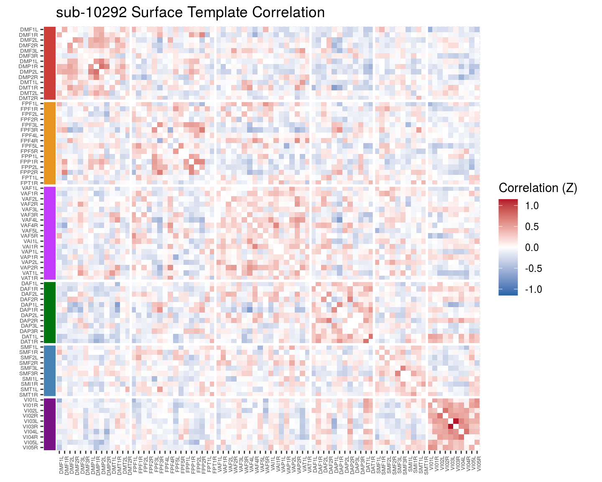

# Cortical-cortical results

Checking how the cortical-cortical stats change with adding surfaced based analyses and PINT


```r
library(tidyverse)
```

```
## ── Attaching packages ──────────────────────────────────────────────────────────────────────────────────────────────────────────────────── tidyverse 1.2.1 ──
```

```
## ✔ ggplot2 3.1.0       ✔ purrr   0.2.5  
## ✔ tibble  2.0.1       ✔ dplyr   0.8.0.1
## ✔ tidyr   0.8.2       ✔ stringr 1.3.1  
## ✔ readr   1.3.0       ✔ forcats 0.3.0
```

```
## ── Conflicts ─────────────────────────────────────────────────────────────────────────────────────────────────────────────────────── tidyverse_conflicts() ──
## ✖ dplyr::filter() masks stats::filter()
## ✖ dplyr::lag()    masks stats::lag()
```

```r
library(broom)
library(knitr)
library(cowplot)
```

```
## 
## Attaching package: 'cowplot'
```

```
## The following object is masked from 'package:ggplot2':
## 
##     ggsave
```

```r
library(ggridges)
```

```
## 
## Attaching package: 'ggridges'
```

```
## The following object is masked from 'package:ggplot2':
## 
##     scale_discrete_manual
```

```r
library(igraph)
```

```
## 
## Attaching package: 'igraph'
```

```
## The following objects are masked from 'package:dplyr':
## 
##     as_data_frame, groups, union
```

```
## The following objects are masked from 'package:purrr':
## 
##     compose, simplify
```

```
## The following object is masked from 'package:tidyr':
## 
##     crossing
```

```
## The following object is masked from 'package:tibble':
## 
##     as_data_frame
```

```
## The following objects are masked from 'package:stats':
## 
##     decompose, spectrum
```

```
## The following object is masked from 'package:base':
## 
##     union
```

```r
library(here)
```

```
## here() starts at /mnt/tigrlab/projects/edickie/code/SZ_PINT
```


```r
source(here('code/R/settings_helpers.R'))
pheno <- read_pheno_file()
```

```
## Parsed with column specification:
## cols(
##   .default = col_double(),
##   dataset = col_character(),
##   subject_id = col_character(),
##   session_id = col_character(),
##   task_id = col_character(),
##   run_id = col_character(),
##   acq_id = col_character(),
##   subject = col_character(),
##   session = col_character(),
##   cmh_session_id = col_character(),
##   DX = col_character(),
##   Sex = col_character(),
##   Site = col_character(),
##   Scanner = col_character(),
##   isFEP = col_character(),
##   ghost_NoGhost = col_character(),
##   filename = col_character()
## )
```

```
## See spec(...) for full column specifications.
```

```r
#YeoNet_colours <- define_YeoN7_colours()
Yeo7_2011_80verts <- read_Yeo72011_template()
#the_subcortical_guide <- get_subcortical_guide()
node_annotations <- get_node_annotations(read_Yeo72011_template(), get_subcortical_guide())
```

```
## Parsed with column specification:
## cols(
##   subcort_hemi = col_character(),
##   subcort_ROI = col_character(),
##   numvx = col_double(),
##   network = col_character()
## )
```

```r
source(here('code/R/file_reading_helpers.R'))
source(here('code/R/custom_plot_helpers.R'))
```


```r
pheno <- pheno %>%
  mutate(func_base = get_func_base_from_pint_summary_filename(filename,subject, session), 
         outputprefix = construct_output_prefix(subject, session, func_base)) 
```


```r
map2(pheno$outputprefix[1], pheno$dataset[1],
                              ~run_read_all_subject_timeseries_and_cortcort_corZ(.x, .y))
```


```r
all_corZ_results <- pheno %>%
  select(subject, outputprefix, dataset) %>%
  mutate(the_corrs = map2(.$outputprefix, .$dataset,
                              ~run_read_all_subject_timeseries_and_cortcort_corZ(.x, .y)))
```


```r
#' go uppertri data to full dataframe for geom_tile
uppertri_df_to_full <- function(graph_df) {
  # converts from three col graph df to adjacency matrix
  uppertri_df_to_agjmat <- function(graph_df) {
    
    names(graph_df) <- c('to', 'from', 'myattr')
    matrix_out <- graph_df %>%
      graph_from_data_frame(.,directed = F) %>%
      get.adjacency(., type = "both", attr = "myattr") %>%
      as.matrix() 
    return(matrix_out)
  }
  
  result <- graph_df %>%
    uppertri_df_to_agjmat() %>%
    as.data.frame() %>%
    mutate(to = row.names(.)) %>%
    gather(from, value, -to) 
  return(result)
}
```


```r
mean_cors <- all_corZ_results %>%
  unnest() %>%
  group_by(vertex_type, to, from) %>%
  summarise(mcorZ = mean(weight))
```


```r
mean_cors %>%
  filter(vertex_type == "pvertex") %>%
  withincortical_heatmap("Personalized Mean Correlation", mcorZ) %>%
  ggdraw()
```

```
## Warning in as.numeric(network) %>% diff() * 1:80: longer object length is
## not a multiple of shorter object length
```


```r
mean_cors %>%
  filter(vertex_type == "tvertex") %>%
  withincortical_heatmap("Surface Template Mean Correlation", mcorZ) %>%
  ggdraw()
```

```
## Warning in as.numeric(network) %>% diff() * 1:80: longer object length is
## not a multiple of shorter object length
```


```r
mean_cors %>%
  filter(vertex_type == "tvolume") %>%
  withincortical_heatmap("Volume Template Mean Correlation", mcorZ) %>%
  ggdraw()
```

```
## Warning in as.numeric(network) %>% diff() * 1:80: longer object length is
## not a multiple of shorter object length
```


```r
thissubject = unique(pheno$subject)[2]

this_results_pheno <- all_corZ_results %>%
  filter(subject==thissubject) %>%
  unnest()

this_results_pheno %>%
  filter(vertex_type == "pvertex") %>%
  withincortical_heatmap(str_c(thissubject, " Personalized Correlation")) %>%
  ggdraw()
```

```
## Warning in as.numeric(network) %>% diff() * 1:80: longer object length is
## not a multiple of shorter object length
```


```r
this_results_pheno %>%
  filter(vertex_type == "tvertex") %>%
  withincortical_heatmap(str_c(thissubject, " Surface Template Correlation")) %>%
  ggdraw()
```

```
## Warning in as.numeric(network) %>% diff() * 1:80: longer object length is
## not a multiple of shorter object length
```



```r
this_results_pheno %>%
  filter(vertex_type == "tvolume") %>%
  withincortical_heatmap(str_c(thissubject, " Volume Template Correlation")) %>%
  ggdraw()
```

```
## Warning in as.numeric(network) %>% diff() * 1:80: longer object length is
## not a multiple of shorter object length
```


```r
thissubject = unique(pheno$subject)[3]

this_results_pheno <- all_corZ_results %>%
  filter(subject==thissubject) %>%
  unnest()

this_results_pheno %>%
  filter(vertex_type == "pvertex") %>%
  withincortical_heatmap(str_c(thissubject, " Personalized Correlation")) %>%
  ggdraw()
```

```
## Warning in as.numeric(network) %>% diff() * 1:80: longer object length is
## not a multiple of shorter object length
```


```r
this_results_pheno %>%
  filter(vertex_type == "tvertex") %>%
  withincortical_heatmap(str_c(thissubject, " Surface Template Correlation")) %>%
  ggdraw()
```

```
## Warning in as.numeric(network) %>% diff() * 1:80: longer object length is
## not a multiple of shorter object length
```


```r
this_results_pheno %>%
  filter(vertex_type == "tvolume") %>%
  withincortical_heatmap(str_c(thissubject, " Volume Template Correlation")) %>%
  ggdraw()
```

```
## Warning in as.numeric(network) %>% diff() * 1:80: longer object length is
## not a multiple of shorter object length
```


```r
thissubject = unique(pheno$subject)[100]

this_results_pheno <- all_corZ_results %>%
  filter(subject==thissubject) %>%
  unnest()

this_results_pheno %>%
  filter(vertex_type == "pvertex") %>%
  withincortical_heatmap(str_c(thissubject, " Personalized Correlation")) %>%
  ggdraw()
```

```
## Warning in as.numeric(network) %>% diff() * 1:80: longer object length is
## not a multiple of shorter object length
```


```r
this_results_pheno %>%
  filter(vertex_type == "tvertex") %>%
  withincortical_heatmap(str_c(thissubject, " Surface Template Correlation")) %>%
  ggdraw()
```

```
## Warning in as.numeric(network) %>% diff() * 1:80: longer object length is
## not a multiple of shorter object length
```


```r
this_results_pheno %>%
  filter(vertex_type == "tvolume") %>%
  withincortical_heatmap(str_c(thissubject, " Volume Template Correlation")) %>%
  ggdraw()
```

```
## Warning in as.numeric(network) %>% diff() * 1:80: longer object length is
## not a multiple of shorter object length
```


## To do - rainclouds for withing between changes in cortical cortical??


Need to start by calculating indvididual subject same and diff means by network


```r
calc_wtn_and_cross_network_means <- function(graph_df, node_list) { 
  result <- graph_df %>%
    # setup the data by switching from upper-tri to full
    filter(to %in% node_list) %>%
    filter(from %in% node_list) %>%
    ungroup() %>%
    select(to, from, weight) %>%
    uppertri_df_to_full() %>%
    
    # add columns we need to do the computation based on YeoNet7 naming convention..
    mutate(to_network = str_sub(to, 1,2),
           wtn_or_cross = if_else(to_network == str_sub(from,1,2), 
                                  "within", "cross")) %>%
    # remove the same-edge bits
    filter(to != from) %>%
    
    # group_by and compute the means
    group_by(to_network, wtn_or_cross) %>%
    summarise(net_mean = mean(value))
  
  return(result)
}


# define a vector of the cortical rois
cortical_rois <- node_annotations %>%
    filter(etype == "Cort") %>%
    pull(node_name)

# calculate all the subject-wise within and cross edge means
all_subject_wtn_cross_means <-  all_corZ_results %>%
  # slice(1) %>%
  unnest() %>%
  select(vertex_type, subject, dataset, to, from, weight) %>%
  ungroup() %>%
  group_by(vertex_type, subject, dataset) %>%
  nest() %>%
  mutate(net_means_res = map(data, 
                             ~calc_wtn_and_cross_network_means(
                               .x, cortical_rois))) %>%
  
  unnest(net_means_res) 
```


```r
#' Left section of the raincload plots used in sub-cortical cortical change reporting
samediff_cortcort_raincloud <- function(data, this_YeoNet, no_ticks = TRUE) {
  ## grab the color
  this_YeoNet_color = YeoNet7 %>% filter(network==this_YeoNet) %>% pull(hexcode)
  
  ## make the plot
  plt <- data %>%
    mutate(corrtype = factor(vertex_type, levels = c('pvertex', 'tvertex', 'tvolume'),
                             labels = c("Surface Personalized", "Surface Template", "Volume Template"))) %>%
    filter(to_network == this_YeoNet) %>% 
    ungroup() %>%
    ggplot(aes(y = corrtype, x = net_mean, fill = wtn_or_cross, colour = wtn_or_cross)) +
    geom_density_ridges(
      #jittered_points = TRUE, position = "raincloud",
      alpha = 0.5, scale = 2,
      quantile_lines = TRUE, quantiles = 2
    ) +
    geom_vline(xintercept = 0) +
    scale_colour_manual(values = c("#808080", this_YeoNet_color)) +
    scale_fill_manual(values = c("#808080", this_YeoNet_color)) +
    scale_x_continuous(limits = c(-0.5, 1.5)) +
    labs(y = NULL,
         x = NULL) +
    theme(legend.position='none')
  if (no_ticks==TRUE) {
    plt <- plt + theme(axis.title.x=element_blank(),
                       axis.text.x=element_blank())
  } else {
    plt <- plt + labs(x = "Correlation (Z)")
  }
  return(plt)
  
}


#' Combined subcortical-cortical correlation rainclouds for one subcortical structure
cortical_raincloud <- function(subject_focus, YeoNet7) {
  DM <- samediff_cortcort_raincloud(subject_focus, "DM")
  FP <- samediff_cortcort_raincloud(subject_focus, "FP")
  VA <- samediff_cortcort_raincloud(subject_focus, "VA")
  DA <- samediff_cortcort_raincloud(subject_focus, "DA")
  SM <- samediff_cortcort_raincloud(subject_focus, "SM")
  VI <- samediff_cortcort_raincloud(subject_focus, "VI", no_ticks = FALSE)
  title <- ggdraw() + draw_label("Within Cortical", fontface='bold')
  plt <- plot_grid(title, DM, FP, VA, DA, SM, VI,
                   ncol = 1, rel_heights = c(0.5, 1, 1, 1, 1, 1, 1.5))
  return(plt)
}
```


```r
cortical_raincloud(all_subject_wtn_cross_means, YeoNet7)
```

```
## Picking joint bandwidth of 0.0214
```

```
## Picking joint bandwidth of 0.017
```

```
## Picking joint bandwidth of 0.0184
```

```
## Warning: Removed 1 rows containing non-finite values (stat_density_ridges).
```

```
## Picking joint bandwidth of 0.0198
```

```
## Warning: Removed 1 rows containing non-finite values (stat_density_ridges).
```

```
## Picking joint bandwidth of 0.0239
```

```
## Warning: Removed 2 rows containing non-finite values (stat_density_ridges).
```

```
## Picking joint bandwidth of 0.0309
```

```
## Warning: Removed 3 rows containing non-finite values (stat_density_ridges).
```


