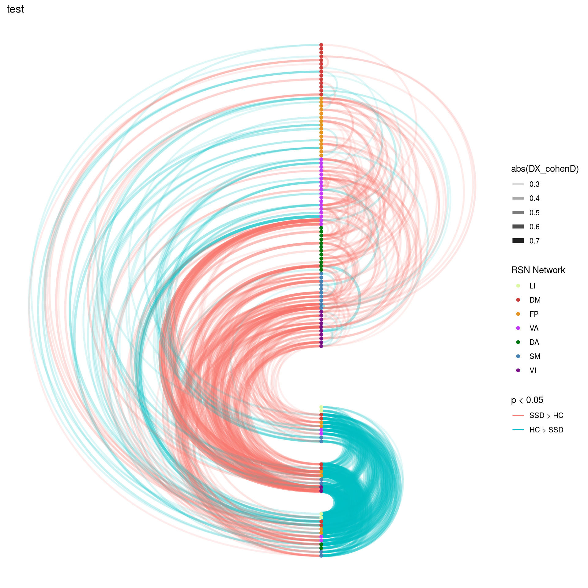
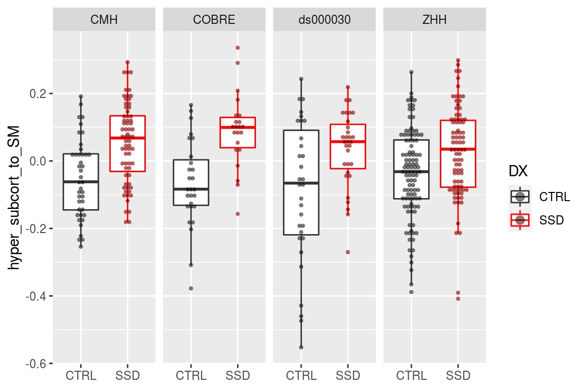

# Whole Connectome Results

We are now going to see if there is anything in cortical-cortical connectivity by running the matrix of all possible connections instead of just subcortical-cortical stats. 


```r
library(tidygraph)
library(tidyverse)
library(broom)
library(knitr)
library(cowplot)
library(igraph)
library(ggraph)
library(here)
```

## The paths to data


```r
# These functions are for reading timeseries files
source(here('code/R/settings_helpers.R'))
source(here('code/R/file_reading_helpers.R'))

pheno <- read_pheno_file()%>%
  drop_na(DX)
```

```
## Parsed with column specification:
## cols(
##   .default = col_double(),
##   dataset = col_character(),
##   subject_id = col_character(),
##   session_id = col_character(),
##   task_id = col_character(),
##   run_id = col_character(),
##   acq_id = col_character(),
##   subject = col_character(),
##   session = col_character(),
##   cmh_session_id = col_character(),
##   DX = col_character(),
##   Sex = col_character(),
##   Site = col_character(),
##   Scanner = col_character(),
##   isFEP = col_character(),
##   ghost_NoGhost = col_character(),
##   filename = col_character()
## )
```

```
## See spec(...) for full column specifications.
```

```r
YeoNet_colours <- define_Yeo7_colours()
Yeo7_2011_80verts <- read_Yeo72011_template()  
```

# Code for reading in all the timeseries..


A table that describes the current expected subortical files


These functions are for reading timeseries files


This reads all files and generate PINT to subcortical correlation values for a given subject


```r
the_subcortical_guide <- get_subcortical_guide()
```

```
## Parsed with column specification:
## cols(
##   subcort_hemi = col_character(),
##   subcort_ROI = col_character(),
##   numvx = col_double(),
##   network = col_character()
## )
```

```r
#run_read_subject_subcort_corrs(subcort_outputlist$subid[1])
```

## This was run once in order to detemine the too small subcortical ROIs


```r
read_vx_count <- function(filepath) {
  read_csv(filepath, col_names = FALSE) %>%
    mutate(network = c('VI','SM','DA','VA', 'LI','FP','DM')) 
}

vx_counts <- the_subcortical_guide %>%
  select(subcort_hemi, subcort_ROI) %>%
  distinct() %>%
  mutate(vx_count = str_c(output_base,'/ZHH/out/ciftify_meants/templates/7RSN_roi-',subcort_hemi, subcort_ROI,'_vxcount.txt')) %>%
mutate(vxnum = map(vx_count, ~read_vx_count(.x))) %>%
  unnest() %>%
  select(subcort_hemi, subcort_ROI, X1, network) %>%
  rename(numvx = X1)

write_csv(vx_counts, '../templates/subcort_vxcounts.csv')
```


```r
node_annotations <- get_node_annotations(Yeo7_2011_80verts, the_subcortical_guide)
```


### This reads all the subcortical files it can find

Write a func_base and outputprefix cols into the pheno file for the file reading step


```r
pheno <- pheno %>%
  mutate(func_base = get_func_base_from_pint_summary_filename(filename,subject, session), 
         outputprefix = construct_output_prefix(subject, session, func_base)) 
```


```r
map2(pheno$outputprefix[1], pheno$dataset[1],
                              ~run_read_all_subject_timeseries_and_wholebrain_corZ(.x, .y))
```


```r
all_corZ_results <- pheno %>%
  select(subject, outputprefix, dataset) %>%
  mutate(the_corrs = map2(.$outputprefix, .$dataset,
                              ~run_read_all_subject_timeseries_and_wholebrain_corZ(.x, .y)))
```


```r
save(all_corZ_results, file = file.path(output_base, "all_qa_passes_group", "Rdata_cache", "06_wholebrain_results_cache.Rdata"))
```


```r
load(file.path(output_base, "all_qa_passes_group", "Rdata_cache", "06_wholebrain_results_cache.Rdata"))
```


### merge with the phenotypic data


```r
results_pheno <- all_corZ_results %>%
  inner_join(pheno, by = c("subject", "dataset")) %>%
  unnest()  
```


```r
results_pheno
```


```r
DX_lm_model_full <- results_pheno %>%
  semi_join(node_annotations, by = c("to"="node_name")) %>%
  semi_join(node_annotations, by = c("from"="node_name")) %>%
  mutate(corZ = weight) %>%
  group_by(vertex_type, to, from) %>%
  do(tidy(lm(corZ ~ DX + Age_pt + Sex + fd_mean_pt + Scanner,.))) 
```


```r
annotated_graph_edges <- DX_lm_model_full %>%
  ungroup() %>%
  select(to, from) %>%
  distinct() %>%
  inner_join(node_annotations, by = c("to"="node_name")) %>%
  inner_join(node_annotations, by = c("from"="node_name"), suffix = c('_to','_from')) %>%
  unite(from_to_type, etype_from, etype_to) %>%
  unite(hemis, hemi_from, hemi_to, sep = "") %>%
  unite(networks, network_from, network_to, sep = "", remove = FALSE) %>%
  mutate(from_to_type = recode(from_to_type, "Cort_SubCort" = "SubCort_Cort")) %>%
  mutate(hemis = recode(hemis, "RL" = "LR")) 
```

## filters out some unwanted edges before FDR correction


```r
DX_lm_model <- DX_lm_model_full %>%
  ungroup() %>%
  inner_join(annotated_graph_edges, by = c("to", "from")) %>%
  mutate(withinsubcort = if_else((from_to_type == "SubCort_SubCort") & (subcort_ROI_from == subcort_ROI_to), "drop", "keep")) %>%
  filter(withinsubcort == "keep") %>%
  select(vertex_type, to, from, term, statistic, p.value) %>%
  ungroup() %>%
  group_by(term) %>%
  mutate(p_FDR = p.adjust(p.value, method = "fdr")) %>%
  arrange(p.value)
```

## Make co


```r
source(here('code/R/swirly_plot_helpers.R'))
DX_lm_model %>%
  ungroup() %>%
  ## filtering steps
  filter(term == "DXSSD") %>%
  filter(vertex_type == "pvertex") %>%
  
  ## make a pretty plot
  make_swirly_results_plot(pos_label = "SSD > HC", 
                      neg_label = "HC > SSD",
                      plot_title = "Personalized",
                      node_annotations = node_annotations)
```


```r
DX_lm_model %>%
  ungroup() %>%
  filter(term == "DXSSD") %>%
  filter(vertex_type == "tvertex") %>%
  make_swirly_results_plot(pos_label = "SSD > HC", 
                      neg_label = "HC > SSD",
                      plot_title = "Template",
                      node_annotations = node_annotations)
```


```r
DX_lm_model %>%
  ungroup() %>%
  filter(term == "DXSSD") %>%
  filter(vertex_type == "tvolume") %>%
  make_swirly_results_plot(pos_label = "SSD > HC", 
                      neg_label = "HC > SSD",
                      plot_title = "Volume",
                      node_annotations = node_annotations)
```


## make table FDR corrected Edges that survive correction


```r
DX_lm_model %>%
  inner_join(annotated_graph_edges, by = c("to", "from")) %>%
  mutate(sig_edge = if_else(p_FDR < 0.05, "sig", "ns"),
         stat_pos = if_else(statistic > 0, "pos", "neg")) %>%
  filter(term == "DXSSD") %>% 
  count(vertex_type, from_to_type, sig_edge) %>%
  spread(sig_edge, n) %>%
  mutate(perc_sig = sig/(ns + sig)*100)
```

```
## # A tibble: 9 x 6
## # Groups:   term [1]
##   term  vertex_type from_to_type       ns   sig perc_sig
##   <chr> <chr>       <chr>           <int> <int>    <dbl>
## 1 DXSSD pvertex     Cort_Cort        2944   216     6.84
## 2 DXSSD pvertex     SubCort_Cort     2663   537    16.8 
## 3 DXSSD pvertex     SubCort_SubCort   260   273    51.2 
## 4 DXSSD tvertex     Cort_Cort        2936   224     7.09
## 5 DXSSD tvertex     SubCort_Cort     2734   466    14.6 
## 6 DXSSD tvertex     SubCort_SubCort   260   273    51.2 
## 7 DXSSD tvolume     Cort_Cort        3034   126     3.99
## 8 DXSSD tvolume     SubCort_Cort     2883   317     9.91
## 9 DXSSD tvolume     SubCort_SubCort   260   273    51.2
```


```r
#' convert from three col graph df to adjacency matrix
uppertri_df_to_agjmat <- function(graph_df) {
  
names(graph_df) <- c('to', 'from', 'myattr')
matrix_out <- graph_df %>%
  graph_from_data_frame(.,directed = F) %>%
  get.adjacency(., type = "both", attr = "myattr") %>%
  as.matrix() 
return(matrix_out)
}

#' go uppertri data to full dataframe for geom_tile
uppertri_df_to_full <- function(graph_df) {
result <- graph_df %>%
  uppertri_df_to_agjmat() %>%
  as.data.frame() %>%
  mutate(to = row.names(.)) %>%
  gather(from, value, -to) 
return(result)
}
```


```r
DX_lm_model %>%
  filter(term == "DXSSD") %>%
  mutate(t_filtered = if_else(p_FDR < 0.1, statistic, 0)) %>%
  ungroup() %>%
  select(vertex_type, to, from, t_filtered) %>%
  group_by(vertex_type) %>%
  nest() %>%
  mutate(uptri = map(data, uppertri_df_to_full)) %>%
  unnest(uptri) %>%
  mutate(to_lab = factor(to, levels = (node_annotations %>% arrange(subcort_ROI, network))$node_name),
         from_lab = factor(from, levels = (node_annotations %>% arrange(subcort_ROI, network))$node_name)) %>%
  ggplot(aes(x=to_lab, y=from_lab, fill=value)) + 
  geom_tile(color = "white") +
  scale_fill_gradient2(high = "#b2182b", mid = "white", low = "#2166ac") +
  theme(axis.text.x = element_text(angle = 90, hjust = 1)) +
  facet_wrap(~vertex_type, ncol = 1) +
  labs(title = "T statistic for effect of DX (thesholded)",
       x = NULL, y = NULL, fill = "T statistic for DX")
```


`


```r
full_DX_mat <- DX_lm_model %>%
  filter(term == "DXSSD", vertex_type == "pvertex") %>%
  ungroup() %>%
  select(to, from, statistic) %>%
  uppertri_df_to_full() 

full_DX_mat %>%
  mutate(to_lab = factor(to, levels = node_annotations$node_name), 
         from_lab = factor(from, levels = node_annotations$node_name)) %>%
  ggplot(aes(x=to_lab, y=from_lab, fill=value)) + 
  geom_tile(color = "white") +
  scale_fill_gradient2(high = "#b2182b", mid = "white", low = "#2166ac") +
  theme(axis.text.x = element_text(angle = 90, hjust = 1)) +
  labs(title = "T statistic for effect of DX",
       x = NULL, y = NULL, fill = "T statistic for DX")
```


```r
calc_fc_weights <- function(lm_df, t_threshold) {
  
    full_DX_mat <- lm_df %>%
      ungroup() %>%
      select(to, from, statistic) %>%
      uppertri_df_to_full() %>%
      inner_join(node_annotations, by = c("to"="node_name")) %>%
      inner_join(node_annotations, by = c("from"="node_name")) 
    
hypo_cerebullum_to_striatum <- full_DX_mat %>%
    filter(subcort_ROI.x == "cerebellum") %>%
    filter(subcort_ROI.y == "striatum") %>%
    filter(value < -t_threshold) %>%
    select(to, from, value) 

hyper_subcort_to_SM <- full_DX_mat %>%
    filter(etype.x == "SubCort") %>%
    filter(etype.y == "Cort") %>%
    filter(as.character(network.y) %in% c("SM")) %>%
    filter(value > t_threshold) %>%
    select(to, from, value)

hyper_subcort_to_VI <- full_DX_mat %>%
    filter(etype.x == "SubCort") %>%
    filter(etype.y == "Cort") %>%
    filter(as.character(network.y) %in% c("VI")) %>%
    filter(value > t_threshold) %>%
    select(to, from, value)

hyper_subcort_to_DM <- full_DX_mat %>%
    filter(etype.x == "SubCort") %>%
    filter(etype.y == "Cort") %>%
    filter(as.character(network.y) %in% c("DM")) %>%
    filter(value > t_threshold) %>%
    select(to, from, value)

hypo_subcort_to_FP <- full_DX_mat %>%
    filter(etype.x == "SubCort") %>%
    filter(etype.y == "Cort") %>%
    filter(as.character(network.y) %in% c("FP")) %>%
    filter(value < -t_threshold) %>%
    select(to, from, value)

hypo_subcort_to_VA <- full_DX_mat %>%
    filter(etype.x == "SubCort") %>%
    filter(etype.y == "Cort") %>%
    filter(as.character(network.y) %in% c("VA")) %>%
    filter(value < -t_threshold) %>%
    select(to, from, value)

hyper_cortSMVI_to_rest <- full_DX_mat %>%
    filter(etype.x == "Cort") %>%
    filter(etype.y == "Cort") %>%
    filter(as.character(network.x) %in% c("SM", "VI")) %>%
    filter(as.character(network.y) %in% c("FP","DA", "VA", "DM")) %>%
    filter(value > t_threshold) %>%
    select(to, from, value)

hyper_cortVA_to_DA <- full_DX_mat %>%
    filter(etype.x == "Cort") %>%
    filter(etype.y == "Cort") %>%
    filter(as.character(network.x) %in% c("VA")) %>%
    filter(as.character(network.y) %in% c("DA")) %>%
    filter(value > t_threshold) %>%
    select(to, from, value)

hypo_cortDM_to_rest <- full_DX_mat %>%
    filter(etype.x == "Cort") %>%
    filter(etype.y == "Cort") %>%
    filter(as.character(network.x) %in% c("DM")) %>%
    filter(!(as.character(network.y) %in% c("DM"))) %>%
    filter(value < -t_threshold) %>%
    select(to, from, value)

Fz_weigths <-bind_rows(hypo_cortDM_to_rest = hypo_cortDM_to_rest,
                       hyper_cortSMVI_to_rest = hyper_cortSMVI_to_rest,
                       hyper_cortVA_to_DA = hyper_cortVA_to_DA,
                       hyper_subcort_to_DM = hyper_subcort_to_DM,
                       hypo_subcort_to_FP = hypo_subcort_to_FP,
                       hypo_subcort_to_VA = hypo_subcort_to_VA,
                       hyper_subcort_to_SM = hyper_subcort_to_SM,
                       hyper_subcort_to_VI = hyper_subcort_to_VI,
                       hypo_cerebullum_to_striatum = hypo_cerebullum_to_striatum,
                       .id = "direction_edge_group") %>%
  separate(direction_edge_group, into = c("effect_direction", "edge_group"), extra = "merge") %>%
  rename(edge_FC_weight = value)

  return(Fz_weigths)

}
```


```r
t_threshold = 1.1

Fz_DXweigths_pvertex <- DX_lm_model %>%
  filter(term == "DXSSD", vertex_type == "pvertex") %>%
  ungroup() %>%
  calc_fc_weights(.,t_threshold)

Fz_DXweigths_tvertex <- DX_lm_model %>%
  filter(term == "DXSSD", vertex_type == "tvertex") %>%
  ungroup() %>%
  calc_fc_weights(.,t_threshold)

Fz_DXweigths_tvolume <- DX_lm_model %>%
  filter(term == "DXSSD", vertex_type == "tvolume") %>%
  ungroup() %>%
  calc_fc_weights(.,t_threshold)

Fz_DXweigths <- bind_rows(pvertex = Fz_DXweigths_pvertex,
                     tvertex = Fz_DXweigths_tvertex,
                     tvolume = Fz_DXweigths_tvolume,
                     .id = "vertex_type") 
Fz_DXweigths %>% 
  group_by(vertex_type, edge_group, effect_direction) %>%
  summarise(median_weight = median(edge_FC_weight)) %>%
  ggplot(aes(y = abs(median_weight), x = vertex_type, color = edge_group)) +
    geom_point() +
    geom_line(aes(group = edge_group))
```



```r
Fz_DXweigths %>% 
  count(edge_group, vertex_type, effect_direction) %>%
  spread(vertex_type, n)
```

```
## # A tibble: 9 x 5
##   edge_group             effect_direction pvertex tvertex tvolume
##   <chr>                  <chr>              <int>   <int>   <int>
## 1 cerebullum_to_striatum hypo                 162     162     162
## 2 cortDM_to_rest         hypo                 402     369     204
## 3 cortSMVI_to_rest       hyper                419     405     403
## 4 cortVA_to_DA           hyper                147     139     124
## 5 subcort_to_DM          hyper                270     225     119
## 6 subcort_to_FP          hypo                 340     311     299
## 7 subcort_to_SM          hyper                287     260     256
## 8 subcort_to_VA          hypo                 218     216     239
## 9 subcort_to_VI          hyper                371     344     267
```

```r
Fz_DXweigths %>% 
  group_by(vertex_type, edge_group, effect_direction) %>%
  summarise(median_weight = median(edge_FC_weight)) %>%
  spread(vertex_type, median_weight)
```

```
## # A tibble: 9 x 5
## # Groups:   edge_group [9]
##   edge_group             effect_direction pvertex tvertex tvolume
##   <chr>                  <chr>              <dbl>   <dbl>   <dbl>
## 1 cerebullum_to_striatum hypo               -2.85   -2.85   -2.85
## 2 cortDM_to_rest         hypo               -2.03   -1.88   -1.55
## 3 cortSMVI_to_rest       hyper               1.71    1.78    1.75
## 4 cortVA_to_DA           hyper               1.96    2.01    1.88
## 5 subcort_to_DM          hyper               2.05    1.82    1.62
## 6 subcort_to_FP          hypo               -2.00   -1.91   -1.87
## 7 subcort_to_SM          hyper               2.42    2.40    2.23
## 8 subcort_to_VA          hypo               -1.72   -1.89   -1.80
## 9 subcort_to_VI          hyper               3.00    2.79    2.27
```

```r
write_csv(Fz_DXweigths_pvertex, file.path(output_base, "all_qa_passes_group", "weighted_subject_FC_weigths", "SSD4cohorts_DXtweigths_pvertex.csv"))
write_csv(Fz_DXweigths_tvertex, file.path(output_base, "all_qa_passes_group", "weighted_subject_FC_weigths", "SSD4cohorts_DXtweigths_tvertex.csv"))
write_csv(Fz_DXweigths_tvolume, file.path(output_base, "all_qa_passes_group", "weighted_subject_FC_weigths", "SSD4cohorts_DXtweigths_tvolume.csv"))
```


```r
#' calculates a subjects weigthed FC score from their edgewise values
#'
#' @param subject_edges_df tibble with columns subject, to, from, and weight
#' @param edge_weights tibble with columns effect_direction, edge_group, to, from, and edge_FC_weight
#'
#' @return tibble with columns subject, dataset, effect_direction, edge_group, FC_subtype and wFC_score
#'
#' @examples
calc_subjects_wFC_score <- function(subject_edges_df, edge_weights) {
  result <- subject_edges_df %>%
  ungroup() %>%
  group_by(subject, dataset) %>%
  nest() %>%
  mutate(uptri = map(data, uppertri_df_to_full)) %>%
  unnest(uptri) %>%
  inner_join(edge_weights, by = c("to", "from")) %>%
  ungroup() %>%
  mutate(wcorZ = abs(edge_FC_weight) * value) %>%
  group_by(subject, dataset, effect_direction, edge_group) %>%
  summarise(wFC_score = sum(wcorZ)/sum(abs(edge_FC_weight)),
            mFC_score = mean(value)) %>%
  ungroup()
  return(result)
}
```


```r
pvertex_subject_FC_scores <- results_pheno %>%
  ungroup() %>%
  filter(vertex_type == "pvertex") %>%
  select(subject, dataset, to, from, weight) %>%
  calc_subjects_wFC_score(Fz_DXweigths_pvertex)

tvertex_subject_FC_scores <- results_pheno %>%
  ungroup() %>%
  filter(vertex_type == "tvertex") %>%
  select(subject, dataset, to, from, weight) %>%
  calc_subjects_wFC_score(Fz_DXweigths_tvertex)

tvolume_subject_FC_scores <- results_pheno %>%
  ungroup() %>%
  filter(vertex_type == "tvolume") %>%
  select(subject, dataset, to, from, weight) %>%
  calc_subjects_wFC_score(Fz_DXweigths_tvolume)

FC_scores_together <- bind_rows(
  pvertex = pvertex_subject_FC_scores,
  tvertex = tvertex_subject_FC_scores,
  tvolume = tvolume_subject_FC_scores,
  .id = "vertex_type"
)

write_csv(FC_scores_together, file.path(output_base, 
                                        "all_qa_passes_group", 
                                        "weighted_subject_FC_scores",
                                        "SSD4cohorts_DXweighted_subject_scores.csv"))
```


```r
FC_scores_lmfit <- FC_scores_together %>%
  inner_join(pheno, by = c("subject", "dataset")) %>%
  ungroup() %>%
  group_by(edge_group, effect_direction, vertex_type) %>%
  do(tidy(lm(wFC_score ~ DX + Age_pt + Sex + fd_mean_pt + Site,.))) 

FC_scores_lmfit %>%
  select(edge_group, effect_direction, term, statistic, p.value) %>%
  filter(term == "DXSSD") %>%
  knitr::kable()
```

```
## Adding missing grouping variables: `vertex_type`
```


vertex_type   edge_group               effect_direction   term     statistic   p.value
------------  -----------------------  -----------------  ------  ----------  --------
pvertex       cerebullum_to_striatum   hypo               DXSSD    -5.981823     0e+00
tvertex       cerebullum_to_striatum   hypo               DXSSD    -5.981823     0e+00
tvolume       cerebullum_to_striatum   hypo               DXSSD    -5.981823     0e+00
pvertex       cortDM_to_rest           hypo               DXSSD    -6.713980     0e+00
tvertex       cortDM_to_rest           hypo               DXSSD    -8.129964     0e+00
tvolume       cortDM_to_rest           hypo               DXSSD    -5.009878     8e-07
pvertex       cortSMVI_to_rest         hyper              DXSSD     8.110019     0e+00
tvertex       cortSMVI_to_rest         hyper              DXSSD    10.064882     0e+00
tvolume       cortSMVI_to_rest         hyper              DXSSD     5.681912     0e+00
pvertex       cortVA_to_DA             hyper              DXSSD     4.615709     5e-06
tvertex       cortVA_to_DA             hyper              DXSSD     6.636692     0e+00
tvolume       cortVA_to_DA             hyper              DXSSD     5.064163     6e-07
pvertex       subcort_to_DM            hyper              DXSSD     5.711771     0e+00
tvertex       subcort_to_DM            hyper              DXSSD     6.359039     0e+00
tvolume       subcort_to_DM            hyper              DXSSD     6.566259     0e+00
pvertex       subcort_to_FP            hypo               DXSSD    -6.368152     0e+00
tvertex       subcort_to_FP            hypo               DXSSD    -7.222145     0e+00
tvolume       subcort_to_FP            hypo               DXSSD    -7.764750     0e+00
pvertex       subcort_to_SM            hyper              DXSSD     6.349540     0e+00
tvertex       subcort_to_SM            hyper              DXSSD     7.285989     0e+00
tvolume       subcort_to_SM            hyper              DXSSD     7.277427     0e+00
pvertex       subcort_to_VA            hypo               DXSSD    -5.577413     0e+00
tvertex       subcort_to_VA            hypo               DXSSD    -6.477915     0e+00
tvolume       subcort_to_VA            hypo               DXSSD    -7.797026     0e+00
pvertex       subcort_to_VI            hyper              DXSSD     7.487524     0e+00
tvertex       subcort_to_VI            hyper              DXSSD     7.809095     0e+00
tvolume       subcort_to_VI            hyper              DXSSD     6.697116     0e+00

```r
FC_scores_lmfit %>% 
  group_by(vertex_type, edge_group, effect_direction) %>%
  filter(term == "DXSSD",
         str_detect(edge_group,"subcort")) %>%
  ggplot(aes(y = abs(statistic), x = rev(vertex_type), color = edge_group)) +
    geom_point() +
    geom_line(aes(group = edge_group))
```


```r
FC_scores_lmfit <- FC_scores_together %>%
  inner_join(pheno, by = c("subject", "dataset")) %>%
  ungroup() %>%
  group_by(edge_group, vertex_type,  effect_direction, Site) %>%
  do(tidy(lm(wFC_score ~ DX + Age_pt + Sex + fd_mean_pt,.))) 

FC_scores_lmfit %>%
  select(edge_group, vertex_type, Site, term, statistic, p.value) %>%
  filter(term == "DXSSD") %>%
  knitr::kable()
```

```
## Adding missing grouping variables: `effect_direction`
```


effect_direction   edge_group               vertex_type   Site       term      statistic     p.value
-----------------  -----------------------  ------------  ---------  ------  -----------  ----------
hypo               cerebullum_to_striatum   pvertex       CMH        DXSSD    -3.3534825   0.0011175
hypo               cerebullum_to_striatum   pvertex       COBRE      DXSSD    -1.8857567   0.0649193
hypo               cerebullum_to_striatum   pvertex       ds000030   DXSSD    -3.0826534   0.0024948
hypo               cerebullum_to_striatum   pvertex       ZHH        DXSSD    -2.9882418   0.0031784
hypo               cerebullum_to_striatum   tvertex       CMH        DXSSD    -3.3534825   0.0011175
hypo               cerebullum_to_striatum   tvertex       COBRE      DXSSD    -1.8857567   0.0649193
hypo               cerebullum_to_striatum   tvertex       ds000030   DXSSD    -3.0826534   0.0024948
hypo               cerebullum_to_striatum   tvertex       ZHH        DXSSD    -2.9882418   0.0031784
hypo               cerebullum_to_striatum   tvolume       CMH        DXSSD    -3.3534825   0.0011175
hypo               cerebullum_to_striatum   tvolume       COBRE      DXSSD    -1.8857567   0.0649193
hypo               cerebullum_to_striatum   tvolume       ds000030   DXSSD    -3.0826534   0.0024948
hypo               cerebullum_to_striatum   tvolume       ZHH        DXSSD    -2.9882418   0.0031784
hypo               cortDM_to_rest           pvertex       CMH        DXSSD    -3.1173421   0.0023657
hypo               cortDM_to_rest           pvertex       COBRE      DXSSD    -1.7195664   0.0914590
hypo               cortDM_to_rest           pvertex       ds000030   DXSSD    -3.7485854   0.0002642
hypo               cortDM_to_rest           pvertex       ZHH        DXSSD    -4.2714684   0.0000307
hypo               cortDM_to_rest           tvertex       CMH        DXSSD    -4.1848601   0.0000602
hypo               cortDM_to_rest           tvertex       COBRE      DXSSD    -1.9559975   0.0558472
hypo               cortDM_to_rest           tvertex       ds000030   DXSSD    -3.8287460   0.0001975
hypo               cortDM_to_rest           tvertex       ZHH        DXSSD    -5.2842366   0.0000003
hypo               cortDM_to_rest           tvolume       CMH        DXSSD    -3.9681343   0.0001342
hypo               cortDM_to_rest           tvolume       COBRE      DXSSD    -3.9463211   0.0002392
hypo               cortDM_to_rest           tvolume       ds000030   DXSSD    -3.1181371   0.0022313
hypo               cortDM_to_rest           tvolume       ZHH        DXSSD    -1.6065369   0.1098254
hyper              cortSMVI_to_rest         pvertex       CMH        DXSSD     4.2021722   0.0000564
hyper              cortSMVI_to_rest         pvertex       COBRE      DXSSD     2.3769126   0.0211731
hyper              cortSMVI_to_rest         pvertex       ds000030   DXSSD     3.0984617   0.0023741
hyper              cortSMVI_to_rest         pvertex       ZHH        DXSSD     5.6380243   0.0000001
hyper              cortSMVI_to_rest         tvertex       CMH        DXSSD     5.7126595   0.0000001
hyper              cortSMVI_to_rest         tvertex       COBRE      DXSSD     2.9479669   0.0047813
hyper              cortSMVI_to_rest         tvertex       ds000030   DXSSD     4.2606756   0.0000383
hyper              cortSMVI_to_rest         tvertex       ZHH        DXSSD     6.2016302   0.0000000
hyper              cortSMVI_to_rest         tvolume       CMH        DXSSD     2.8437881   0.0053776
hyper              cortSMVI_to_rest         tvolume       COBRE      DXSSD     1.3465369   0.1839696
hyper              cortSMVI_to_rest         tvolume       ds000030   DXSSD     3.1568781   0.0019732
hyper              cortSMVI_to_rest         tvolume       ZHH        DXSSD     4.0110159   0.0000870
hyper              cortVA_to_DA             pvertex       CMH        DXSSD     0.4867116   0.6274968
hyper              cortVA_to_DA             pvertex       COBRE      DXSSD     0.9264011   0.3585174
hyper              cortVA_to_DA             pvertex       ds000030   DXSSD     2.7689037   0.0064283
hyper              cortVA_to_DA             pvertex       ZHH        DXSSD     4.2230614   0.0000374
hyper              cortVA_to_DA             tvertex       CMH        DXSSD     1.5957401   0.1136106
hyper              cortVA_to_DA             tvertex       COBRE      DXSSD     2.0860644   0.0418955
hyper              cortVA_to_DA             tvertex       ds000030   DXSSD     2.5497868   0.0119129
hyper              cortVA_to_DA             tvertex       ZHH        DXSSD     5.9690723   0.0000000
hyper              cortVA_to_DA             tvolume       CMH        DXSSD     0.9331152   0.3529428
hyper              cortVA_to_DA             tvolume       COBRE      DXSSD     1.1336427   0.2621440
hyper              cortVA_to_DA             tvolume       ds000030   DXSSD     2.3626140   0.0195959
hyper              cortVA_to_DA             tvolume       ZHH        DXSSD     4.3826699   0.0000194
hyper              subcort_to_DM            pvertex       CMH        DXSSD     1.4445725   0.1516132
hyper              subcort_to_DM            pvertex       COBRE      DXSSD     2.3510397   0.0225471
hyper              subcort_to_DM            pvertex       ds000030   DXSSD     3.4960804   0.0006422
hyper              subcort_to_DM            pvertex       ZHH        DXSSD     3.5391379   0.0005053
hyper              subcort_to_DM            tvertex       CMH        DXSSD     2.1918853   0.0306399
hyper              subcort_to_DM            tvertex       COBRE      DXSSD     2.0905878   0.0414705
hyper              subcort_to_DM            tvertex       ds000030   DXSSD     3.2093325   0.0016677
hyper              subcort_to_DM            tvertex       ZHH        DXSSD     3.9494379   0.0001105
hyper              subcort_to_DM            tvolume       CMH        DXSSD     2.8144136   0.0058550
hyper              subcort_to_DM            tvolume       COBRE      DXSSD     1.4072821   0.1652933
hyper              subcort_to_DM            tvolume       ds000030   DXSSD     3.9477105   0.0001272
hyper              subcort_to_DM            tvolume       ZHH        DXSSD     3.8866662   0.0001406
hypo               subcort_to_FP            pvertex       CMH        DXSSD    -2.8303580   0.0055912
hypo               subcort_to_FP            pvertex       COBRE      DXSSD    -2.6990373   0.0093582
hypo               subcort_to_FP            pvertex       ds000030   DXSSD    -2.4055277   0.0175248
hypo               subcort_to_FP            pvertex       ZHH        DXSSD    -3.8678523   0.0001510
hypo               subcort_to_FP            tvertex       CMH        DXSSD    -3.1923633   0.0018717
hypo               subcort_to_FP            tvertex       COBRE      DXSSD    -2.8376839   0.0064650
hypo               subcort_to_FP            tvertex       ds000030   DXSSD    -2.8696921   0.0047812
hypo               subcort_to_FP            tvertex       ZHH        DXSSD    -4.5553544   0.0000094
hypo               subcort_to_FP            tvolume       CMH        DXSSD    -3.5647322   0.0005538
hypo               subcort_to_FP            tvolume       COBRE      DXSSD    -2.5661304   0.0132045
hypo               subcort_to_FP            tvolume       ds000030   DXSSD    -2.7864546   0.0061087
hypo               subcort_to_FP            tvolume       ZHH        DXSSD    -5.8464794   0.0000000
hyper              subcort_to_SM            pvertex       CMH        DXSSD     3.2832951   0.0014020
hyper              subcort_to_SM            pvertex       COBRE      DXSSD     3.7221124   0.0004864
hyper              subcort_to_SM            pvertex       ds000030   DXSSD     2.5036323   0.0135025
hyper              subcort_to_SM            pvertex       ZHH        DXSSD     3.7145795   0.0002679
hyper              subcort_to_SM            tvertex       CMH        DXSSD     3.7828435   0.0002605
hyper              subcort_to_SM            tvertex       COBRE      DXSSD     4.5806882   0.0000293
hyper              subcort_to_SM            tvertex       ds000030   DXSSD     3.0852984   0.0024742
hyper              subcort_to_SM            tvertex       ZHH        DXSSD     4.0849576   0.0000651
hyper              subcort_to_SM            tvolume       CMH        DXSSD     3.9120423   0.0001644
hyper              subcort_to_SM            tvolume       COBRE      DXSSD     3.2959631   0.0017714
hyper              subcort_to_SM            tvolume       ds000030   DXSSD     3.1862816   0.0017961
hyper              subcort_to_SM            tvolume       ZHH        DXSSD     4.5618417   0.0000091
hypo               subcort_to_VA            pvertex       CMH        DXSSD    -2.7211124   0.0076400
hypo               subcort_to_VA            pvertex       COBRE      DXSSD    -2.8067964   0.0070267
hypo               subcort_to_VA            pvertex       ds000030   DXSSD    -1.6293917   0.1055964
hypo               subcort_to_VA            pvertex       ZHH        DXSSD    -3.7591648   0.0002271
hypo               subcort_to_VA            tvertex       CMH        DXSSD    -3.2278705   0.0016731
hypo               subcort_to_VA            tvertex       COBRE      DXSSD    -2.0675986   0.0436703
hypo               subcort_to_VA            tvertex       ds000030   DXSSD    -2.2925071   0.0234464
hypo               subcort_to_VA            tvertex       ZHH        DXSSD    -4.4932262   0.0000122
hypo               subcort_to_VA            tvolume       CMH        DXSSD    -4.0176713   0.0001120
hypo               subcort_to_VA            tvolume       COBRE      DXSSD    -2.1588428   0.0354984
hypo               subcort_to_VA            tvolume       ds000030   DXSSD    -3.5319065   0.0005677
hypo               subcort_to_VA            tvolume       ZHH        DXSSD    -5.1371911   0.0000007
hyper              subcort_to_VI            pvertex       CMH        DXSSD     3.1767145   0.0019660
hyper              subcort_to_VI            pvertex       COBRE      DXSSD     3.2543432   0.0020010
hyper              subcort_to_VI            pvertex       ds000030   DXSSD     2.8334297   0.0053232
hyper              subcort_to_VI            pvertex       ZHH        DXSSD     4.7891657   0.0000034
hyper              subcort_to_VI            tvertex       CMH        DXSSD     3.7818884   0.0002614
hyper              subcort_to_VI            tvertex       COBRE      DXSSD     3.2256365   0.0021754
hyper              subcort_to_VI            tvertex       ds000030   DXSSD     2.4553657   0.0153650
hyper              subcort_to_VI            tvertex       ZHH        DXSSD     5.0612146   0.0000010
hyper              subcort_to_VI            tvolume       CMH        DXSSD     3.3615692   0.0010885
hyper              subcort_to_VI            tvolume       COBRE      DXSSD     3.2342248   0.0021218
hyper              subcort_to_VI            tvolume       ds000030   DXSSD     1.3793930   0.1700886
hyper              subcort_to_VI            tvolume       ZHH        DXSSD     4.4290350   0.0000160

```r
FC_scores_lmfit %>% 
  filter(term == "DXSSD",
         str_detect(edge_group,"subcort")) %>%
  ggplot(aes(y = abs(statistic), x = rev(vertex_type), color = edge_group)) +
    geom_point() +
    geom_line(aes(group = edge_group)) +
  facet_wrap(~Site, nrow = 1)
```


```r
SSD_cors <- FC_scores_together %>%
  inner_join(pheno, by = c("subject", "dataset")) %>%
  ungroup() %>%
  filter(DX == "SSD", vertex_type == "pvertex") %>%
  select(subject, dataset, edge_group, wFC_score) %>%
  spread(edge_group, wFC_score) %>%
  select(-subject, -dataset) %>%
  cor(.) 

heatmap(abs(SSD_cors))
```


```r
HC_cors <- FC_scores_together %>%
    inner_join(pheno, by = c("subject", "dataset")) %>%
  ungroup() %>%
  filter(DX == "CTRL", vertex_type == "pvertex") %>%
  select(subject, dataset, edge_group, wFC_score) %>%
  spread(edge_group, wFC_score) %>%
  select(-subject, -dataset) %>%
  cor(.) 

heatmap(abs(HC_cors))
```


```r
# Marginal densities along x axis
plot_DX_scatter_elipsed <- function(df, x, y) {
  #the tidy eval ness
  xvar <- enquo(x)
  yvar <- enquo(y)
  # make the main scatte bit using above
  main_scatter <-  ggplot(data = df, 
               aes(x = !!xvar, y = !!yvar, color = DX)) +
  geom_point(alpha = 0.7, size = 0.7) +
  stat_ellipse() +
  scale_color_manual(values = c("grey20","red"))

  xdens <- axis_canvas(main_scatter, axis = "x")+
    geom_density(data = df, aes(x = !!xvar, fill = DX),
              alpha = 0.5, size = 0.2) +
    scale_fill_manual(values = c("grey20","red"))

  ydens <- axis_canvas(main_scatter, axis = "y", coord_flip = TRUE)+
    geom_density(data = df, aes(x = !!yvar, fill = DX),
                alpha = 0.5, size = 0.2) +
  scale_fill_manual(values = c("grey20","red")) +
  coord_flip()
  
  #putting the peices together
  p1 <- insert_xaxis_grob(main_scatter, xdens, grid::unit(.2, "null"), position = "top")
  p2<- insert_yaxis_grob(p1, ydens, grid::unit(.2, "null"), position = "right")
  return(p2)
}
```


```r
library(cowplot)
fplot <- FC_scores_together %>%
  inner_join(pheno, by = c("subject", "dataset")) %>%
  ungroup() %>%
  filter(vertex_type == "pvertex") %>%
  unite(directed_edge_group, effect_direction, edge_group) %>%
  unite(dat_sub, dataset, subject) %>%  
  select(dat_sub, Site, DX, directed_edge_group, wFC_score) %>%
  spread(directed_edge_group, wFC_score) 
```


```r
ggdraw(plot_DX_scatter_elipsed(fplot, x = hyper_subcort_to_VI, y = hypo_cerebullum_to_striatum))
```


```r
ggdraw(plot_DX_scatter_elipsed(fplot, x = hyper_subcort_to_SM, y = hypo_cerebullum_to_striatum))
```


```r
fig1 <- fplot %>%
  ggplot(aes(y = hypo_subcort_to_FP, x = DX, color = DX)) + 
  geom_boxplot(outlier.shape = NA) + 
  geom_dotplot(binaxis = 'y', stackdir = 'center', binwidth = 0.01, alpha = 0.5) +
  scale_color_manual(values = c("grey20","red")) +
  facet_wrap( ~ Site, ncol = 4) +
  labs(x = NULL)

#ggsave(fig1, filename = 'VA_results.png',height = 8, width = 5)

fig1
```


```r
fig1 <- fplot %>%
  ggplot(aes(y = hyper_subcort_to_SM, x = DX, color = DX)) + 
  geom_boxplot(outlier.shape = NA) + 
  geom_dotplot(binaxis = 'y', stackdir = 'center', binwidth = 0.01, alpha = 0.5) +
  scale_color_manual(values = c("grey20","red")) +
  facet_wrap( ~ Site, ncol = 4) +
  labs(x = NULL)

#ggsave(fig1, filename = 'VA_results.png',height = 8, width = 5)

fig1
```


# calculate weighted subject scores by chopping up the matrix


```r
YeoNet7 <- define_YeoNet7_colours()
node_annotations1 <- node_annotations %>%
  mutate(node_grouping  = if_else(etype == "Cort",
                                  str_c("Cort", cort_NET),
                                  as.character(subcort_ROI))) 

node_groupings <- factor(1:9, 
                         levels = c(1:9),
                         labels = c(levels(node_annotations$subcort_ROI),
                                    str_c("Cort",YeoNet7$network[1:6])))
edge_grouping_guide <- matrix(1, 
                  nrow = length(node_groupings),
                  ncol = length(node_groupings),
                  dimnames = list(node_groupings,
                                  node_groupings)) %>%
    graph_from_adjacency_matrix(mode="upper", 
                                weighted=T, diag=T) %>%
    as_data_frame() %>%
  filter(!(from %in% c("striatum", "thalamus", "cerebellum") & to == from)) %>%
  select(to, from)
```


```r
t_threshold = 1.1
define_hypohyper_weights <- function(lm_df, t_threshold, node_annotations, edge_guide) {
full_DX_mat <- lm_df %>%
      ungroup() %>%
      select(to, from, statistic) %>%
      uppertri_df_to_full() %>%
      inner_join(node_annotations, by = c("to"="node_name")) %>%
      inner_join(node_annotations, by = c("from"="node_name")) 
    
pos_weights <- full_DX_mat %>%
    filter(value > t_threshold) %>%
    semi_join(edge_grouping_guide, by = c("node_grouping.x" = "to",
                                          "node_grouping.y" = "from")) %>%
    unite(edge_group, node_grouping.x, node_grouping.y) %>%
    select(edge_group, to, from, value)

neg_weights <- full_DX_mat %>%
    filter(value < -t_threshold) %>%
    semi_join(edge_grouping_guide, by = c("node_grouping.x" = "to",
                                          "node_grouping.y" = "from")) %>%
    unite(edge_group, node_grouping.x, node_grouping.y) %>%
    select(edge_group, to, from, value)

all_weights <- bind_rows(hyper = pos_weights,
                        hypo = neg_weights,
                        .id = "effect_direction")
return(all_weights)
}

define_vertex_hypohyper_weights <- function(lm_df, v_type, t_threshold) {
  groupwise_weights <- lm_df %>%
  filter(term == "DXSSD", 
         vertex_type == v_type) %>%
  ungroup() %>%
  define_hypohyper_weights(., t_threshold,
                           node_annotations = node_annotations1,
                           edge_guide = edge_guide)
  return(groupwise_weights)
}

groupwise_weights <- tibble(vertex_type = c("pvertex", "tvertex", "tvolume")) %>%
  mutate(result = map(vertex_type, 
                      ~ define_vertex_hypohyper_weights(DX_lm_model, .x, t_threshold))) %>%
  unnest()
```


```r
size_threshold = 30

groupwise_weights_table <- groupwise_weights %>%
  count(vertex_type, effect_direction, edge_group) %>%
  spread(effect_direction, n, fill = 0) %>%
  group_by(edge_group) %>%
  mutate(hyperhypo_diff = (hyper - hypo)/(hyper + hypo),
         use_hypo = max(hyperhypo_diff) < 0.1 & min(hypo) > size_threshold,
         use_hyper = min(hyperhypo_diff) > -0.1 & min(hyper) > size_threshold,
         num = use_hypo + use_hyper) %>%
  select(num, use_hypo, use_hyper, everything()) %>%
  arrange(num, edge_group, vertex_type) 
  # ungroup() %>%
  # select(vertex_type, edge_group, hyperhypo_diff, max_size) %>%
  # gather(tmp_col, tmp_vals, hyperhypo_diff, max_size) %>%
  # unite(vertex_meas, tmp_col, vertex_type) %>%
  # spread(vertex_meas, tmp_vals) %>%
  # arrange(-abs(hyperhypo_diff_tvolume))
```


```r
edge_groups_to_use <- groupwise_weights_table %>%
  ungroup() %>%
  select(use_hypo, use_hyper, edge_group) %>%
  distinct() %>%
  filter(use_hypo | use_hyper)
```


```r
hyper_edgegroups <- edge_groups_to_use %>% filter(use_hyper) %>% pull(edge_group)
hypo_edgegroups <- edge_groups_to_use %>% filter(use_hypo) %>% pull(edge_group)
groupwise_weights_hyper <- groupwise_weights %>%
  filter(edge_group %in% hyper_edgegroups,
         effect_direction == "hyper")

groupwise_weights_hypo <- groupwise_weights %>%
  filter(edge_group %in% hypo_edgegroups,
         effect_direction == "hypo")

groupwise_weights_both <- bind_rows(
  groupwise_weights_hypo,
  groupwise_weights_hyper
) %>%
  rename(edge_FC_weight = value)

groupwise_weights_both %>%
  count(vertex_type, effect_direction, edge_group) %>%
  ggplot(aes(y = n, x = vertex_type, color = edge_group)) +
  geom_point() +
  geom_line(aes(group = edge_group)) +
  facet_wrap(~effect_direction)
```


```r
file.path(output_base, 
                                        "all_qa_passes_group", 
                                        "weighted_subject_FC_weigths",
                                        'SSD4cohorts_DXweighted_moregroups_subject_weights.csv')
```

```
## [1] "/mnt/tigrlab/projects/edickie/code/SZ_PINT/data/processed/mri//all_qa_passes_group/weighted_subject_FC_weigths/SSD4cohorts_DXweighted_moregroups_subject_weights.csv"
```


```r
groupwise_weights_both %>%
  mutate(node_class = if_else(str_detect(edge_group,'_Cort'), 
                 "Within_Cortical",
                 "Subcortical_to")) %>%
  group_by(vertex_type, effect_direction, edge_group, node_class) %>%
  summarise(median_t = median(edge_FC_weight)) %>%
  ggplot(aes(y = abs(median_t), x = vertex_type, color = edge_group)) +
  geom_point() +
  geom_line(aes(group = edge_group)) +
  facet_wrap(~effect_direction*node_class)
```


```r
write_csv(groupwise_weights_both, file.path(output_base, 
                                        "all_qa_passes_group", 
                                        "weighted_subject_FC_weigths",
                                        'SSD4cohorts_DXweighted_moregroups_subject_weights.csv'))
```


```r
all_subject_FC_weights_by_vertex <- function(results_data, edge_weights, vtype) {
result <- results_data %>%
  ungroup() %>%
  filter(vertex_type == vtype) %>%
  select(subject, dataset, to, from, weight) %>%
  calc_subjects_wFC_score(edge_weights %>% filter(vertex_type == vtype))
return(result)
}

all_subject_FC_weights <- tibble(vertex_type = c("pvertex", "tvertex", "tvolume")) %>%
  mutate(result = map(vertex_type, 
                      ~all_subject_FC_weights_by_vertex(results_pheno, groupwise_weights_both, .x))) %>%
  unnest()
```


```r
write_csv(all_subject_FC_weights, file.path(output_base, 
                                        "all_qa_passes_group", 
                                        "weighted_subject_FC_scores",
                                        'SSD4cohorts_DXweighted_moregroups_subject_scores.csv'))
```


```r
FC_gscores_lmfit <- all_subject_FC_weights %>%
  inner_join(pheno, by = c("subject", "dataset")) %>%
  ungroup() %>%
  group_by(effect_direction, edge_group, vertex_type) %>%
  do(tidy(lm(wFC_score ~ DX + Age_pt + Sex + fd_mean_pt + Site,.))) 

FC_gscores_lmfit %>%
  select(effect_direction, edge_group, vertex_type, term, statistic, p.value) %>%
  filter(term == "DXSSD") %>%
  knitr::kable()
```


effect_direction   edge_group            vertex_type   term     statistic     p.value
-----------------  --------------------  ------------  ------  ----------  ----------
hyper              CortDA_cerebellum     pvertex       DXSSD     3.237451   0.0012879
hyper              CortDA_cerebellum     tvertex       DXSSD     4.150463   0.0000391
hyper              CortDA_cerebellum     tvolume       DXSSD     4.879937   0.0000014
hyper              CortDA_CortSM         pvertex       DXSSD     5.017406   0.0000007
hyper              CortDA_CortSM         tvertex       DXSSD     5.800263   0.0000000
hyper              CortDA_CortSM         tvolume       DXSSD     4.430104   0.0000116
hyper              CortDA_thalamus       pvertex       DXSSD     4.542757   0.0000070
hyper              CortDA_thalamus       tvertex       DXSSD     5.881766   0.0000000
hyper              CortDA_thalamus       tvolume       DXSSD     6.389888   0.0000000
hyper              CortDM_cerebellum     pvertex       DXSSD     4.642349   0.0000044
hyper              CortDM_cerebellum     tvertex       DXSSD     5.302022   0.0000002
hyper              CortDM_cerebellum     tvolume       DXSSD     5.423749   0.0000001
hyper              CortDM_CortDM         pvertex       DXSSD     3.750295   0.0001978
hyper              CortDM_CortDM         tvertex       DXSSD     4.945778   0.0000010
hyper              CortDM_CortDM         tvolume       DXSSD     3.402300   0.0007230
hyper              CortDM_striatum       pvertex       DXSSD     4.491751   0.0000088
hyper              CortDM_striatum       tvertex       DXSSD     4.785079   0.0000023
hyper              CortDM_striatum       tvolume       DXSSD     3.504970   0.0004987
hyper              CortDM_thalamus       pvertex       DXSSD     3.988825   0.0000766
hyper              CortDM_thalamus       tvertex       DXSSD     4.454424   0.0000104
hyper              CortDM_thalamus       tvolume       DXSSD     4.215423   0.0000297
hyper              CortFP_CortDA         pvertex       DXSSD     3.926352   0.0000986
hyper              CortFP_CortDA         tvertex       DXSSD     5.826878   0.0000000
hyper              CortFP_CortDA         tvolume       DXSSD     4.514464   0.0000080
hyper              CortFP_CortSM         pvertex       DXSSD     4.670951   0.0000039
hyper              CortFP_CortSM         tvertex       DXSSD     5.814223   0.0000000
hyper              CortFP_CortSM         tvolume       DXSSD     4.476600   0.0000094
hyper              CortFP_CortVA         pvertex       DXSSD     4.342411   0.0000171
hyper              CortFP_CortVA         tvertex       DXSSD     5.919580   0.0000000
hyper              CortFP_CortVA         tvolume       DXSSD     4.544195   0.0000070
hyper              CortSM_cerebellum     pvertex       DXSSD     5.222505   0.0000003
hyper              CortSM_cerebellum     tvertex       DXSSD     6.206560   0.0000000
hyper              CortSM_cerebellum     tvolume       DXSSD     5.283414   0.0000002
hyper              CortSM_CortVI         pvertex       DXSSD     3.316109   0.0009807
hyper              CortSM_CortVI         tvertex       DXSSD     4.409429   0.0000128
hyper              CortSM_CortVI         tvolume       DXSSD     3.778039   0.0001776
hyper              CortSM_striatum       pvertex       DXSSD     3.039343   0.0024979
hyper              CortSM_striatum       tvertex       DXSSD     3.332670   0.0009254
hyper              CortSM_striatum       tvolume       DXSSD     4.223272   0.0000287
hyper              CortSM_thalamus       pvertex       DXSSD     5.780605   0.0000000
hyper              CortSM_thalamus       tvertex       DXSSD     6.355291   0.0000000
hyper              CortSM_thalamus       tvolume       DXSSD     6.332004   0.0000000
hyper              CortVA_CortDA         pvertex       DXSSD     4.615709   0.0000050
hyper              CortVA_CortDA         tvertex       DXSSD     6.636692   0.0000000
hyper              CortVA_CortDA         tvolume       DXSSD     5.064163   0.0000006
hyper              CortVA_CortSM         pvertex       DXSSD     4.341260   0.0000172
hyper              CortVA_CortSM         tvertex       DXSSD     5.873598   0.0000000
hyper              CortVA_CortSM         tvolume       DXSSD     4.571869   0.0000061
hyper              CortVA_CortVA         pvertex       DXSSD     3.574728   0.0003854
hyper              CortVA_CortVA         tvertex       DXSSD     4.631029   0.0000047
hyper              CortVA_CortVA         tvolume       DXSSD     4.976830   0.0000009
hyper              CortVA_CortVI         pvertex       DXSSD     3.312321   0.0009938
hyper              CortVA_CortVI         tvertex       DXSSD     4.771213   0.0000024
hyper              CortVA_CortVI         tvolume       DXSSD     3.905806   0.0001071
hyper              CortVI_cerebellum     pvertex       DXSSD     4.773760   0.0000024
hyper              CortVI_cerebellum     tvertex       DXSSD     5.095417   0.0000005
hyper              CortVI_cerebellum     tvolume       DXSSD     4.229329   0.0000280
hyper              CortVI_striatum       pvertex       DXSSD     4.508477   0.0000082
hyper              CortVI_striatum       tvertex       DXSSD     4.704747   0.0000033
hyper              CortVI_striatum       tvolume       DXSSD     3.967064   0.0000837
hyper              CortVI_thalamus       pvertex       DXSSD     7.513960   0.0000000
hyper              CortVI_thalamus       tvertex       DXSSD     7.897544   0.0000000
hyper              CortVI_thalamus       tvolume       DXSSD     6.078778   0.0000000
hypo               cerebellum_striatum   pvertex       DXSSD    -5.981823   0.0000000
hypo               cerebellum_striatum   tvertex       DXSSD    -5.981823   0.0000000
hypo               cerebellum_striatum   tvolume       DXSSD    -5.981823   0.0000000
hypo               cerebellum_thalamus   pvertex       DXSSD    -7.824828   0.0000000
hypo               cerebellum_thalamus   tvertex       DXSSD    -7.824828   0.0000000
hypo               cerebellum_thalamus   tvolume       DXSSD    -7.824828   0.0000000
hypo               CortDM_CortDA         pvertex       DXSSD    -4.648709   0.0000043
hypo               CortDM_CortDA         tvertex       DXSSD    -5.247558   0.0000002
hypo               CortDM_CortDA         tvolume       DXSSD    -3.254804   0.0012133
hypo               CortDM_CortSM         pvertex       DXSSD    -5.392256   0.0000001
hypo               CortDM_CortSM         tvertex       DXSSD    -6.231482   0.0000000
hypo               CortDM_CortSM         tvolume       DXSSD    -3.624750   0.0003195
hypo               CortDM_CortVA         pvertex       DXSSD    -4.368380   0.0000153
hypo               CortDM_CortVA         tvertex       DXSSD    -6.127277   0.0000000
hypo               CortDM_CortVA         tvolume       DXSSD    -4.228984   0.0000280
hypo               CortFP_cerebellum     pvertex       DXSSD    -5.345261   0.0000001
hypo               CortFP_cerebellum     tvertex       DXSSD    -6.405003   0.0000000
hypo               CortFP_cerebellum     tvolume       DXSSD    -6.184458   0.0000000
hypo               CortFP_CortFP         pvertex       DXSSD    -4.037718   0.0000626
hypo               CortFP_CortFP         tvertex       DXSSD    -5.144663   0.0000004
hypo               CortFP_CortFP         tvolume       DXSSD    -4.181040   0.0000344
hypo               CortFP_striatum       pvertex       DXSSD    -3.927768   0.0000981
hypo               CortFP_striatum       tvertex       DXSSD    -4.862426   0.0000016
hypo               CortFP_striatum       tvolume       DXSSD    -4.882349   0.0000014
hypo               CortFP_thalamus       pvertex       DXSSD    -4.750162   0.0000027
hypo               CortFP_thalamus       tvertex       DXSSD    -5.530944   0.0000001
hypo               CortFP_thalamus       tvolume       DXSSD    -6.159073   0.0000000
hypo               CortSM_CortSM         pvertex       DXSSD    -4.606963   0.0000052
hypo               CortSM_CortSM         tvertex       DXSSD    -4.957989   0.0000010
hypo               CortSM_CortSM         tvolume       DXSSD    -4.339779   0.0000173
hypo               CortVA_cerebellum     pvertex       DXSSD    -4.735371   0.0000029
hypo               CortVA_cerebellum     tvertex       DXSSD    -5.513551   0.0000001
hypo               CortVA_cerebellum     tvolume       DXSSD    -5.950585   0.0000000
hypo               CortVA_striatum       pvertex       DXSSD    -3.993228   0.0000752
hypo               CortVA_striatum       tvertex       DXSSD    -4.671661   0.0000039
hypo               CortVA_striatum       tvolume       DXSSD    -5.332617   0.0000001
hypo               CortVI_CortVI         pvertex       DXSSD    -5.322826   0.0000002
hypo               CortVI_CortVI         tvertex       DXSSD    -5.840072   0.0000000
hypo               CortVI_CortVI         tvolume       DXSSD    -3.991611   0.0000757
hypo               thalamus_striatum     pvertex       DXSSD    -5.655035   0.0000000
hypo               thalamus_striatum     tvertex       DXSSD    -5.655035   0.0000000
hypo               thalamus_striatum     tvolume       DXSSD    -5.655035   0.0000000

```r
FC_gscores_lmfit %>% 
  mutate(node_class = if_else(str_detect(edge_group,'_Cort'), 
                 "Within_Cortical",
                 "Subcortical_to")) %>%
  group_by(vertex_type, effect_direction, edge_group, node_class) %>%
  filter(term == "DXSSD") %>%
  ggplot(aes(y = abs(statistic), x = rev(vertex_type), color = edge_group)) +
    geom_point() +
    geom_line(aes(group = edge_group)) +
  facet_wrap(~effect_direction*node_class)
```


```r
FC_gscores_lmfitbySite <- all_subject_FC_weights %>%
  inner_join(pheno, by = c("subject", "dataset")) %>%
  ungroup() %>%
  group_by(effect_direction, edge_group, vertex_type, Site) %>%
  do(tidy(lm(wFC_score ~ DX + Age_pt + Sex + fd_mean_pt,.))) 

FC_gscores_lmfitbySite %>%
  select(effect_direction, edge_group, Site, vertex_type, term, statistic, p.value) %>%
  filter(term == "DXSSD") %>%
  knitr::kable()
```


effect_direction   edge_group            Site       vertex_type   term      statistic     p.value
-----------------  --------------------  ---------  ------------  ------  -----------  ----------
hyper              CortDA_cerebellum     CMH        pvertex       DXSSD     1.7374955   0.0852888
hyper              CortDA_cerebellum     COBRE      pvertex       DXSSD     2.0368488   0.0467709
hyper              CortDA_cerebellum     ds000030   pvertex       DXSSD     1.0867583   0.2791093
hyper              CortDA_cerebellum     ZHH        pvertex       DXSSD     2.4154261   0.0166689
hyper              CortDA_cerebellum     CMH        tvertex       DXSSD     2.2540640   0.0263098
hyper              CortDA_cerebellum     COBRE      tvertex       DXSSD     2.4082091   0.0196118
hyper              CortDA_cerebellum     ds000030   tvertex       DXSSD     2.1546596   0.0329901
hyper              CortDA_cerebellum     ZHH        tvertex       DXSSD     2.5439867   0.0117596
hyper              CortDA_cerebellum     CMH        tvolume       DXSSD     3.3266046   0.0012194
hyper              CortDA_cerebellum     COBRE      tvolume       DXSSD     2.9415289   0.0048671
hyper              CortDA_cerebellum     ds000030   tvolume       DXSSD     2.3512449   0.0201796
hyper              CortDA_cerebellum     ZHH        tvolume       DXSSD     2.1505617   0.0327809
hyper              CortDA_CortSM         CMH        pvertex       DXSSD     3.1666252   0.0020292
hyper              CortDA_CortSM         COBRE      pvertex       DXSSD     0.8392285   0.4051828
hyper              CortDA_CortSM         ds000030   pvertex       DXSSD    -0.4757464   0.6350355
hyper              CortDA_CortSM         ZHH        pvertex       DXSSD     4.8711478   0.0000023
hyper              CortDA_CortSM         CMH        tvertex       DXSSD     3.8014589   0.0002439
hyper              CortDA_CortSM         COBRE      tvertex       DXSSD     0.1848932   0.8540321
hyper              CortDA_CortSM         ds000030   tvertex       DXSSD    -0.4474403   0.6552851
hyper              CortDA_CortSM         ZHH        tvertex       DXSSD     5.7625283   0.0000000
hyper              CortDA_CortSM         CMH        tvolume       DXSSD     1.5773010   0.1177928
hyper              CortDA_CortSM         COBRE      tvolume       DXSSD     0.1115481   0.9116112
hyper              CortDA_CortSM         ds000030   tvolume       DXSSD     1.1764293   0.2415247
hyper              CortDA_CortSM         ZHH        tvolume       DXSSD     4.1865347   0.0000434
hyper              CortDA_thalamus       CMH        pvertex       DXSSD     2.7625395   0.0067938
hyper              CortDA_thalamus       COBRE      pvertex       DXSSD     1.5366846   0.1304336
hyper              CortDA_thalamus       ds000030   pvertex       DXSSD     1.6499348   0.1013160
hyper              CortDA_thalamus       ZHH        pvertex       DXSSD     2.8448237   0.0049334
hyper              CortDA_thalamus       CMH        tvertex       DXSSD     3.0948300   0.0025360
hyper              CortDA_thalamus       COBRE      tvertex       DXSSD     2.9207419   0.0051541
hyper              CortDA_thalamus       ds000030   tvertex       DXSSD     2.0023558   0.0472800
hyper              CortDA_thalamus       ZHH        tvertex       DXSSD     3.7253037   0.0002575
hyper              CortDA_thalamus       CMH        tvolume       DXSSD     4.2073878   0.0000553
hyper              CortDA_thalamus       COBRE      tvolume       DXSSD     2.4303981   0.0185684
hyper              CortDA_thalamus       ds000030   tvolume       DXSSD     2.9111664   0.0042235
hyper              CortDA_thalamus       ZHH        tvolume       DXSSD     2.9711563   0.0033522
hyper              CortDM_cerebellum     CMH        pvertex       DXSSD     1.2073842   0.2300495
hyper              CortDM_cerebellum     COBRE      pvertex       DXSSD     1.9354767   0.0583780
hyper              CortDM_cerebellum     ds000030   pvertex       DXSSD     2.6694634   0.0085440
hyper              CortDM_cerebellum     ZHH        pvertex       DXSSD     2.6196498   0.0095169
hyper              CortDM_cerebellum     CMH        tvertex       DXSSD     2.4207076   0.0172404
hyper              CortDM_cerebellum     COBRE      tvertex       DXSSD     1.6594706   0.1030410
hyper              CortDM_cerebellum     ds000030   tvertex       DXSSD     2.6741752   0.0084310
hyper              CortDM_cerebellum     ZHH        tvertex       DXSSD     3.0567941   0.0025612
hyper              CortDM_cerebellum     CMH        tvolume       DXSSD     2.6408227   0.0095579
hyper              CortDM_cerebellum     COBRE      tvolume       DXSSD     0.9471332   0.3479517
hyper              CortDM_cerebellum     ds000030   tvolume       DXSSD     3.4609494   0.0007241
hyper              CortDM_cerebellum     ZHH        tvolume       DXSSD     3.0573898   0.0025564
hyper              CortDM_CortDM         CMH        pvertex       DXSSD     3.6218486   0.0004559
hyper              CortDM_CortDM         COBRE      pvertex       DXSSD     0.5076200   0.6138663
hyper              CortDM_CortDM         ds000030   pvertex       DXSSD     1.2080836   0.2291588
hyper              CortDM_CortDM         ZHH        pvertex       DXSSD     2.4368557   0.0157419
hyper              CortDM_CortDM         CMH        tvertex       DXSSD     3.3903875   0.0009906
hyper              CortDM_CortDM         COBRE      tvertex       DXSSD     0.4172288   0.6782286
hyper              CortDM_CortDM         ds000030   tvertex       DXSSD     1.7701311   0.0789966
hyper              CortDM_CortDM         ZHH        tvertex       DXSSD     3.8835592   0.0001422
hyper              CortDM_CortDM         CMH        tvolume       DXSSD     3.1889257   0.0018921
hyper              CortDM_CortDM         COBRE      tvolume       DXSSD     0.1336728   0.8941773
hyper              CortDM_CortDM         ds000030   tvolume       DXSSD     1.2156566   0.2262692
hyper              CortDM_CortDM         ZHH        tvolume       DXSSD     2.5854593   0.0104778
hyper              CortDM_striatum       CMH        pvertex       DXSSD     1.2588212   0.2109405
hyper              CortDM_striatum       COBRE      pvertex       DXSSD     1.3408207   0.1858068
hyper              CortDM_striatum       ds000030   pvertex       DXSSD     3.4442708   0.0007663
hyper              CortDM_striatum       ZHH        pvertex       DXSSD     2.7812883   0.0059629
hyper              CortDM_striatum       CMH        tvertex       DXSSD     1.4534348   0.1491432
hyper              CortDM_striatum       COBRE      tvertex       DXSSD     1.5266770   0.1329014
hyper              CortDM_striatum       ds000030   tvertex       DXSSD     3.1938050   0.0017532
hyper              CortDM_striatum       ZHH        tvertex       DXSSD     2.6951939   0.0076690
hyper              CortDM_striatum       CMH        tvolume       DXSSD     1.9924327   0.0489696
hyper              CortDM_striatum       COBRE      tvolume       DXSSD     0.1977576   0.8440058
hyper              CortDM_striatum       ds000030   tvolume       DXSSD     2.0784043   0.0395943
hyper              CortDM_striatum       ZHH        tvolume       DXSSD     2.1482781   0.0329643
hyper              CortDM_thalamus       CMH        pvertex       DXSSD     0.6980543   0.4867162
hyper              CortDM_thalamus       COBRE      pvertex       DXSSD     2.1287211   0.0380341
hyper              CortDM_thalamus       ds000030   pvertex       DXSSD     1.5188205   0.1311813
hyper              CortDM_thalamus       ZHH        pvertex       DXSSD     2.8328728   0.0051137
hyper              CortDM_thalamus       CMH        tvertex       DXSSD     1.3427008   0.1823205
hyper              CortDM_thalamus       COBRE      tvertex       DXSSD     1.4029312   0.1665802
hyper              CortDM_thalamus       ds000030   tvertex       DXSSD     1.1398627   0.2563921
hyper              CortDM_thalamus       ZHH        tvertex       DXSSD     3.5166679   0.0005472
hyper              CortDM_thalamus       CMH        tvolume       DXSSD     1.0764402   0.2842453
hyper              CortDM_thalamus       COBRE      tvolume       DXSSD     1.6172346   0.1118787
hyper              CortDM_thalamus       ds000030   tvolume       DXSSD     2.2088500   0.0288971
hyper              CortDM_thalamus       ZHH        tvolume       DXSSD     2.7313841   0.0069043
hyper              CortFP_CortDA         CMH        pvertex       DXSSD     0.4739461   0.6365415
hyper              CortFP_CortDA         COBRE      pvertex       DXSSD     1.2766115   0.2074113
hyper              CortFP_CortDA         ds000030   pvertex       DXSSD     2.1372678   0.0344059
hyper              CortFP_CortDA         ZHH        pvertex       DXSSD     2.7887667   0.0058323
hyper              CortFP_CortDA         CMH        tvertex       DXSSD     3.2183070   0.0017246
hyper              CortFP_CortDA         COBRE      tvertex       DXSSD     2.2702908   0.0273617
hyper              CortFP_CortDA         ds000030   tvertex       DXSSD     3.3143712   0.0011837
hyper              CortFP_CortDA         ZHH        tvertex       DXSSD     2.9780209   0.0032814
hyper              CortFP_CortDA         CMH        tvolume       DXSSD     3.4504564   0.0008126
hyper              CortFP_CortDA         COBRE      tvolume       DXSSD     0.1150147   0.9088765
hyper              CortFP_CortDA         ds000030   tvolume       DXSSD     2.8103822   0.0056963
hyper              CortFP_CortDA         ZHH        tvolume       DXSSD     3.0149363   0.0029234
hyper              CortFP_CortSM         CMH        pvertex       DXSSD     3.6579939   0.0004026
hyper              CortFP_CortSM         COBRE      pvertex       DXSSD     1.5205593   0.1344283
hyper              CortFP_CortSM         ds000030   pvertex       DXSSD     2.0378379   0.0435490
hyper              CortFP_CortSM         ZHH        pvertex       DXSSD     2.8871218   0.0043409
hyper              CortFP_CortSM         CMH        tvertex       DXSSD     3.8936310   0.0001756
hyper              CortFP_CortSM         COBRE      tvertex       DXSSD     2.1433045   0.0367873
hyper              CortFP_CortSM         ds000030   tvertex       DXSSD     1.9911145   0.0485174
hyper              CortFP_CortSM         ZHH        tvertex       DXSSD     3.5910133   0.0004198
hyper              CortFP_CortSM         CMH        tvolume       DXSSD     2.2914994   0.0239700
hyper              CortFP_CortSM         COBRE      tvolume       DXSSD     1.2746075   0.2081146
hyper              CortFP_CortSM         ds000030   tvolume       DXSSD     2.6951162   0.0079450
hyper              CortFP_CortSM         ZHH        tvolume       DXSSD     2.8607653   0.0047019
hyper              CortFP_CortVA         CMH        pvertex       DXSSD     2.1659714   0.0326204
hyper              CortFP_CortVA         COBRE      pvertex       DXSSD     2.1032304   0.0403023
hyper              CortFP_CortVA         ds000030   pvertex       DXSSD     0.8537622   0.3947718
hyper              CortFP_CortVA         ZHH        pvertex       DXSSD     3.0700193   0.0024557
hyper              CortFP_CortVA         CMH        tvertex       DXSSD     2.8808808   0.0048257
hyper              CortFP_CortVA         COBRE      tvertex       DXSSD     1.3092248   0.1962141
hyper              CortFP_CortVA         ds000030   tvertex       DXSSD     1.9448699   0.0539008
hyper              CortFP_CortVA         ZHH        tvertex       DXSSD     4.6022378   0.0000077
hyper              CortFP_CortVA         CMH        tvolume       DXSSD     3.0539564   0.0028747
hyper              CortFP_CortVA         COBRE      tvolume       DXSSD     0.3615991   0.7191169
hyper              CortFP_CortVA         ds000030   tvolume       DXSSD     2.5101161   0.0132683
hyper              CortFP_CortVA         ZHH        tvolume       DXSSD     3.3625878   0.0009346
hyper              CortSM_cerebellum     CMH        pvertex       DXSSD     2.7097284   0.0078887
hyper              CortSM_cerebellum     COBRE      pvertex       DXSSD     2.4608729   0.0172167
hyper              CortSM_cerebellum     ds000030   pvertex       DXSSD     1.7704973   0.0789353
hyper              CortSM_cerebellum     ZHH        pvertex       DXSSD     3.3630039   0.0009333
hyper              CortSM_cerebellum     CMH        tvertex       DXSSD     3.0749305   0.0026960
hyper              CortSM_cerebellum     COBRE      tvertex       DXSSD     3.2319968   0.0021356
hyper              CortSM_cerebellum     ds000030   tvertex       DXSSD     2.4685865   0.0148333
hyper              CortSM_cerebellum     ZHH        tvertex       DXSSD     3.7132928   0.0002691
hyper              CortSM_cerebellum     CMH        tvolume       DXSSD     2.9567847   0.0038549
hyper              CortSM_cerebellum     COBRE      tvolume       DXSSD     1.7609999   0.0841179
hyper              CortSM_cerebellum     ds000030   tvolume       DXSSD     1.3854590   0.1682312
hyper              CortSM_cerebellum     ZHH        tvolume       DXSSD     3.9578911   0.0001069
hyper              CortSM_CortVI         CMH        pvertex       DXSSD     0.2748946   0.7839478
hyper              CortSM_CortVI         COBRE      pvertex       DXSSD     1.2831689   0.2051224
hyper              CortSM_CortVI         ds000030   pvertex       DXSSD     2.1673428   0.0319896
hyper              CortSM_CortVI         ZHH        pvertex       DXSSD     1.9774422   0.0494454
hyper              CortSM_CortVI         CMH        tvertex       DXSSD     0.7953483   0.4282400
hyper              CortSM_CortVI         COBRE      tvertex       DXSSD     2.3736459   0.0213424
hyper              CortSM_CortVI         ds000030   tvertex       DXSSD     2.3158044   0.0220989
hyper              CortSM_CortVI         ZHH        tvertex       DXSSD     2.4796313   0.0140271
hyper              CortSM_CortVI         CMH        tvolume       DXSSD    -0.4698862   0.6394296
hyper              CortSM_CortVI         COBRE      tvolume       DXSSD     1.7822755   0.0805432
hyper              CortSM_CortVI         ds000030   tvolume       DXSSD     1.6065827   0.1105176
hyper              CortSM_CortVI         ZHH        tvolume       DXSSD     2.9016271   0.0041531
hyper              CortSM_striatum       CMH        pvertex       DXSSD     0.2605506   0.7949593
hyper              CortSM_striatum       COBRE      pvertex       DXSSD     2.0792960   0.0425386
hyper              CortSM_striatum       ds000030   pvertex       DXSSD     1.5600102   0.1211338
hyper              CortSM_striatum       ZHH        pvertex       DXSSD     1.8768436   0.0620805
hyper              CortSM_striatum       CMH        tvertex       DXSSD     0.7297645   0.4671906
hyper              CortSM_striatum       COBRE      tvertex       DXSSD     2.4573623   0.0173678
hyper              CortSM_striatum       ds000030   tvertex       DXSSD     1.8377888   0.0683251
hyper              CortSM_striatum       ZHH        tvertex       DXSSD     1.3934623   0.1651165
hyper              CortSM_striatum       CMH        tvolume       DXSSD     1.7636093   0.0807631
hyper              CortSM_striatum       COBRE      tvolume       DXSSD     1.8952572   0.0636233
hyper              CortSM_striatum       ds000030   tvolume       DXSSD     2.1861582   0.0305539
hyper              CortSM_striatum       ZHH        tvolume       DXSSD     2.5127614   0.0128153
hyper              CortSM_thalamus       CMH        pvertex       DXSSD     3.2240339   0.0016936
hyper              CortSM_thalamus       COBRE      pvertex       DXSSD     3.8921296   0.0002844
hyper              CortSM_thalamus       ds000030   pvertex       DXSSD     2.6918354   0.0080195
hyper              CortSM_thalamus       ZHH        pvertex       DXSSD     2.7661609   0.0062351
hyper              CortSM_thalamus       CMH        tvertex       DXSSD     3.5457285   0.0005906
hyper              CortSM_thalamus       COBRE      tvertex       DXSSD     4.6013756   0.0000273
hyper              CortSM_thalamus       ds000030   tvertex       DXSSD     3.0360294   0.0028849
hyper              CortSM_thalamus       ZHH        tvertex       DXSSD     3.1868185   0.0016833
hyper              CortSM_thalamus       CMH        tvolume       DXSSD     3.5640151   0.0005552
hyper              CortSM_thalamus       COBRE      tvolume       DXSSD     3.3040196   0.0017299
hyper              CortSM_thalamus       ds000030   tvolume       DXSSD     3.5341170   0.0005633
hyper              CortSM_thalamus       ZHH        tvolume       DXSSD     3.2628326   0.0013090
hyper              CortVA_CortDA         CMH        pvertex       DXSSD     0.4867116   0.6274968
hyper              CortVA_CortDA         COBRE      pvertex       DXSSD     0.9264011   0.3585174
hyper              CortVA_CortDA         ds000030   pvertex       DXSSD     2.7689037   0.0064283
hyper              CortVA_CortDA         ZHH        pvertex       DXSSD     4.2230614   0.0000374
hyper              CortVA_CortDA         CMH        tvertex       DXSSD     1.5957401   0.1136106
hyper              CortVA_CortDA         COBRE      tvertex       DXSSD     2.0860644   0.0418955
hyper              CortVA_CortDA         ds000030   tvertex       DXSSD     2.5497868   0.0119129
hyper              CortVA_CortDA         ZHH        tvertex       DXSSD     5.9690723   0.0000000
hyper              CortVA_CortDA         CMH        tvolume       DXSSD     0.9331152   0.3529428
hyper              CortVA_CortDA         COBRE      tvolume       DXSSD     1.1336427   0.2621440
hyper              CortVA_CortDA         ds000030   tvolume       DXSSD     2.3626140   0.0195959
hyper              CortVA_CortDA         ZHH        tvolume       DXSSD     4.3826699   0.0000194
hyper              CortVA_CortSM         CMH        pvertex       DXSSD     1.7004253   0.0920686
hyper              CortVA_CortSM         COBRE      pvertex       DXSSD     1.7117271   0.0929059
hyper              CortVA_CortSM         ds000030   pvertex       DXSSD     1.5442871   0.1248949
hyper              CortVA_CortSM         ZHH        pvertex       DXSSD     2.7057896   0.0074375
hyper              CortVA_CortSM         CMH        tvertex       DXSSD     2.3799190   0.0191564
hyper              CortVA_CortSM         COBRE      tvertex       DXSSD     2.6437329   0.0108131
hyper              CortVA_CortSM         ds000030   tvertex       DXSSD     2.5649526   0.0114285
hyper              CortVA_CortSM         ZHH        tvertex       DXSSD     3.2635612   0.0013058
hyper              CortVA_CortSM         CMH        tvolume       DXSSD     2.3936387   0.0184918
hyper              CortVA_CortSM         COBRE      tvolume       DXSSD     1.2925540   0.2018795
hyper              CortVA_CortSM         ds000030   tvolume       DXSSD     2.4583595   0.0152431
hyper              CortVA_CortSM         ZHH        tvolume       DXSSD     2.9379051   0.0037157
hyper              CortVA_CortVA         CMH        pvertex       DXSSD     2.2446942   0.0269258
hyper              CortVA_CortVA         COBRE      pvertex       DXSSD     0.4157504   0.6793034
hyper              CortVA_CortVA         ds000030   pvertex       DXSSD     1.2632100   0.2087237
hyper              CortVA_CortVA         ZHH        pvertex       DXSSD     2.1254765   0.0348455
hyper              CortVA_CortVA         CMH        tvertex       DXSSD     2.5747693   0.0114515
hyper              CortVA_CortVA         COBRE      tvertex       DXSSD     1.1572436   0.2524612
hyper              CortVA_CortVA         ds000030   tvertex       DXSSD     1.9914933   0.0484752
hyper              CortVA_CortVA         ZHH        tvertex       DXSSD     2.3198560   0.0214169
hyper              CortVA_CortVA         CMH        tvolume       DXSSD     3.4113668   0.0009246
hyper              CortVA_CortVA         COBRE      tvolume       DXSSD     1.0612296   0.2934897
hyper              CortVA_CortVA         ds000030   tvolume       DXSSD     2.1138136   0.0363983
hyper              CortVA_CortVA         ZHH        tvolume       DXSSD     2.9146407   0.0039911
hyper              CortVA_CortVI         CMH        pvertex       DXSSD     0.6827189   0.4963172
hyper              CortVA_CortVI         COBRE      pvertex       DXSSD     1.0229561   0.3110642
hyper              CortVA_CortVI         ds000030   pvertex       DXSSD     3.0727475   0.0025734
hyper              CortVA_CortVI         ZHH        pvertex       DXSSD     1.4801113   0.1405085
hyper              CortVA_CortVI         CMH        tvertex       DXSSD     2.3272312   0.0219094
hyper              CortVA_CortVI         COBRE      tvertex       DXSSD     1.5395771   0.1297271
hyper              CortVA_CortVI         ds000030   tvertex       DXSSD     3.1374473   0.0020990
hyper              CortVA_CortVI         ZHH        tvertex       DXSSD     2.0133353   0.0454980
hyper              CortVA_CortVI         CMH        tvolume       DXSSD     0.9426892   0.3480458
hyper              CortVA_CortVI         COBRE      tvolume       DXSSD     1.2794436   0.2064204
hyper              CortVA_CortVI         ds000030   tvolume       DXSSD     2.7831883   0.0061670
hyper              CortVA_CortVI         ZHH        tvolume       DXSSD     2.5564101   0.0113616
hyper              CortVI_cerebellum     CMH        pvertex       DXSSD     2.3291219   0.0218049
hyper              CortVI_cerebellum     COBRE      pvertex       DXSSD     1.7264770   0.0901990
hyper              CortVI_cerebellum     ds000030   pvertex       DXSSD     2.0342402   0.0439154
hyper              CortVI_cerebellum     ZHH        pvertex       DXSSD     2.8879322   0.0043302
hyper              CortVI_cerebellum     CMH        tvertex       DXSSD     2.7441493   0.0071583
hyper              CortVI_cerebellum     COBRE      tvertex       DXSSD     2.5276532   0.0145605
hyper              CortVI_cerebellum     ds000030   tvertex       DXSSD     1.6914522   0.0930923
hyper              CortVI_cerebellum     ZHH        tvertex       DXSSD     2.9203600   0.0039217
hyper              CortVI_cerebellum     CMH        tvolume       DXSSD     2.3218663   0.0222085
hyper              CortVI_cerebellum     COBRE      tvolume       DXSSD     2.6037537   0.0119907
hyper              CortVI_cerebellum     ds000030   tvolume       DXSSD     0.8117156   0.4184052
hyper              CortVI_cerebellum     ZHH        tvolume       DXSSD     2.3819988   0.0182115
hyper              CortVI_striatum       CMH        pvertex       DXSSD     2.3460921   0.0208862
hyper              CortVI_striatum       COBRE      pvertex       DXSSD     2.2465321   0.0289424
hyper              CortVI_striatum       ds000030   pvertex       DXSSD     0.8743826   0.3834861
hyper              CortVI_striatum       ZHH        pvertex       DXSSD     3.2016581   0.0016032
hyper              CortVI_striatum       CMH        tvertex       DXSSD     2.7377926   0.0072884
hyper              CortVI_striatum       COBRE      tvertex       DXSSD     1.8191165   0.0746536
hyper              CortVI_striatum       ds000030   tvertex       DXSSD     0.5196227   0.6041903
hyper              CortVI_striatum       ZHH        tvertex       DXSSD     3.7396555   0.0002442
hyper              CortVI_striatum       CMH        tvolume       DXSSD     2.5462371   0.0123692
hyper              CortVI_striatum       COBRE      tvolume       DXSSD     2.0086668   0.0497782
hyper              CortVI_striatum       ds000030   tvolume       DXSSD    -0.1318823   0.8952767
hyper              CortVI_striatum       ZHH        tvolume       DXSSD     3.2819638   0.0012278
hyper              CortVI_thalamus       CMH        pvertex       DXSSD     2.8024509   0.0060603
hyper              CortVI_thalamus       COBRE      pvertex       DXSSD     3.5012716   0.0009597
hyper              CortVI_thalamus       ds000030   pvertex       DXSSD     3.2299200   0.0015603
hyper              CortVI_thalamus       ZHH        pvertex       DXSSD     4.6652957   0.0000058
hyper              CortVI_thalamus       CMH        tvertex       DXSSD     3.5579995   0.0005666
hyper              CortVI_thalamus       COBRE      tvertex       DXSSD     3.2452837   0.0020546
hyper              CortVI_thalamus       ds000030   tvertex       DXSSD     3.0461158   0.0027961
hyper              CortVI_thalamus       ZHH        tvertex       DXSSD     4.8417975   0.0000027
hyper              CortVI_thalamus       CMH        tvolume       DXSSD     2.8411209   0.0054194
hyper              CortVI_thalamus       COBRE      tvolume       DXSSD     2.6973117   0.0094007
hyper              CortVI_thalamus       ds000030   tvolume       DXSSD     1.8616563   0.0648588
hyper              CortVI_thalamus       ZHH        tvolume       DXSSD     3.8032763   0.0001926
hypo               cerebellum_striatum   CMH        pvertex       DXSSD    -3.3534825   0.0011175
hypo               cerebellum_striatum   COBRE      pvertex       DXSSD    -1.8857567   0.0649193
hypo               cerebellum_striatum   ds000030   pvertex       DXSSD    -3.0826534   0.0024948
hypo               cerebellum_striatum   ZHH        pvertex       DXSSD    -2.9882418   0.0031784
hypo               cerebellum_striatum   CMH        tvertex       DXSSD    -3.3534825   0.0011175
hypo               cerebellum_striatum   COBRE      tvertex       DXSSD    -1.8857567   0.0649193
hypo               cerebellum_striatum   ds000030   tvertex       DXSSD    -3.0826534   0.0024948
hypo               cerebellum_striatum   ZHH        tvertex       DXSSD    -2.9882418   0.0031784
hypo               cerebellum_striatum   CMH        tvolume       DXSSD    -3.3534825   0.0011175
hypo               cerebellum_striatum   COBRE      tvolume       DXSSD    -1.8857567   0.0649193
hypo               cerebellum_striatum   ds000030   tvolume       DXSSD    -3.0826534   0.0024948
hypo               cerebellum_striatum   ZHH        tvolume       DXSSD    -2.9882418   0.0031784
hypo               cerebellum_thalamus   CMH        pvertex       DXSSD    -4.6024851   0.0000119
hypo               cerebellum_thalamus   COBRE      pvertex       DXSSD    -2.8289252   0.0066199
hypo               cerebellum_thalamus   ds000030   pvertex       DXSSD    -4.9577759   0.0000021
hypo               cerebellum_thalamus   ZHH        pvertex       DXSSD    -3.7733609   0.0002154
hypo               cerebellum_thalamus   CMH        tvertex       DXSSD    -4.6024851   0.0000119
hypo               cerebellum_thalamus   COBRE      tvertex       DXSSD    -2.8289252   0.0066199
hypo               cerebellum_thalamus   ds000030   tvertex       DXSSD    -4.9577759   0.0000021
hypo               cerebellum_thalamus   ZHH        tvertex       DXSSD    -3.7733609   0.0002154
hypo               cerebellum_thalamus   CMH        tvolume       DXSSD    -4.6024851   0.0000119
hypo               cerebellum_thalamus   COBRE      tvolume       DXSSD    -2.8289252   0.0066199
hypo               cerebellum_thalamus   ds000030   tvolume       DXSSD    -4.9577759   0.0000021
hypo               cerebellum_thalamus   ZHH        tvolume       DXSSD    -3.7733609   0.0002154
hypo               CortDM_CortDA         CMH        pvertex       DXSSD    -2.2560244   0.0261824
hypo               CortDM_CortDA         COBRE      pvertex       DXSSD    -0.7232765   0.4727510
hypo               CortDM_CortDA         ds000030   pvertex       DXSSD    -2.7361472   0.0070657
hypo               CortDM_CortDA         ZHH        pvertex       DXSSD    -3.2630661   0.0013080
hypo               CortDM_CortDA         CMH        tvertex       DXSSD    -3.2087983   0.0017772
hypo               CortDM_CortDA         COBRE      tvertex       DXSSD    -0.8824291   0.3816060
hypo               CortDM_CortDA         ds000030   tvertex       DXSSD    -2.5106685   0.0132485
hypo               CortDM_CortDA         ZHH        tvertex       DXSSD    -3.5920062   0.0004184
hypo               CortDM_CortDA         CMH        tvolume       DXSSD    -2.7317537   0.0074139
hypo               CortDM_CortDA         COBRE      tvolume       DXSSD    -2.9493650   0.0047628
hypo               CortDM_CortDA         ds000030   tvolume       DXSSD    -2.3452434   0.0204939
hypo               CortDM_CortDA         ZHH        tvolume       DXSSD    -0.7233457   0.4703618
hypo               CortDM_CortSM         CMH        pvertex       DXSSD    -1.6708763   0.0977820
hypo               CortDM_CortSM         COBRE      pvertex       DXSSD    -1.8643502   0.0679217
hypo               CortDM_CortSM         ds000030   pvertex       DXSSD    -2.4701625   0.0147710
hypo               CortDM_CortSM         ZHH        pvertex       DXSSD    -3.5514958   0.0004836
hypo               CortDM_CortSM         CMH        tvertex       DXSSD    -2.0927402   0.0388295
hypo               CortDM_CortSM         COBRE      tvertex       DXSSD    -2.3346725   0.0234569
hypo               CortDM_CortSM         ds000030   tvertex       DXSSD    -2.6706946   0.0085143
hypo               CortDM_CortSM         ZHH        tvertex       DXSSD    -4.1580278   0.0000486
hypo               CortDM_CortSM         CMH        tvolume       DXSSD    -1.9151804   0.0582433
hypo               CortDM_CortSM         COBRE      tvolume       DXSSD    -2.4764216   0.0165619
hypo               CortDM_CortSM         ds000030   tvolume       DXSSD    -2.6177976   0.0098757
hypo               CortDM_CortSM         ZHH        tvolume       DXSSD    -1.0103370   0.3136256
hypo               CortDM_CortVA         CMH        pvertex       DXSSD    -1.6035013   0.1118862
hypo               CortDM_CortVA         COBRE      pvertex       DXSSD    -1.5698577   0.1225139
hypo               CortDM_CortVA         ds000030   pvertex       DXSSD    -2.4962652   0.0137730
hypo               CortDM_CortVA         ZHH        pvertex       DXSSD    -2.8406146   0.0049963
hypo               CortDM_CortVA         CMH        tvertex       DXSSD    -3.2815291   0.0014100
hypo               CortDM_CortVA         COBRE      tvertex       DXSSD    -1.7197909   0.0914178
hypo               CortDM_CortVA         ds000030   tvertex       DXSSD    -2.7096517   0.0076228
hypo               CortDM_CortVA         ZHH        tvertex       DXSSD    -3.8675047   0.0001512
hypo               CortDM_CortVA         CMH        tvolume       DXSSD    -2.6409976   0.0095533
hypo               CortDM_CortVA         COBRE      tvolume       DXSSD    -2.7658202   0.0078416
hypo               CortDM_CortVA         ds000030   tvolume       DXSSD    -2.4337400   0.0162712
hypo               CortDM_CortVA         ZHH        tvolume       DXSSD    -1.7772463   0.0771360
hypo               CortFP_cerebellum     CMH        pvertex       DXSSD    -2.0611873   0.0418041
hypo               CortFP_cerebellum     COBRE      pvertex       DXSSD    -2.6783097   0.0098810
hypo               CortFP_cerebellum     ds000030   pvertex       DXSSD    -2.4186495   0.0169315
hypo               CortFP_cerebellum     ZHH        pvertex       DXSSD    -3.2013339   0.0016049
hypo               CortFP_cerebellum     CMH        tvertex       DXSSD    -2.5642201   0.0117834
hypo               CortFP_cerebellum     COBRE      tvertex       DXSSD    -2.5212974   0.0147963
hypo               CortFP_cerebellum     ds000030   tvertex       DXSSD    -3.2085835   0.0016717
hypo               CortFP_cerebellum     ZHH        tvertex       DXSSD    -3.9994997   0.0000910
hypo               CortFP_cerebellum     CMH        tvolume       DXSSD    -3.1366145   0.0022283
hypo               CortFP_cerebellum     COBRE      tvolume       DXSSD    -2.0075902   0.0498963
hypo               CortFP_cerebellum     ds000030   tvolume       DXSSD    -1.8831489   0.0618641
hypo               CortFP_cerebellum     ZHH        tvolume       DXSSD    -4.3608235   0.0000213
hypo               CortFP_CortFP         CMH        pvertex       DXSSD    -1.6915318   0.0937588
hypo               CortFP_CortFP         COBRE      pvertex       DXSSD     0.3130960   0.7554601
hypo               CortFP_CortFP         ds000030   pvertex       DXSSD    -0.8235043   0.4116955
hypo               CortFP_CortFP         ZHH        pvertex       DXSSD    -3.9265666   0.0001207
hypo               CortFP_CortFP         CMH        tvertex       DXSSD    -2.0442120   0.0434839
hypo               CortFP_CortFP         COBRE      tvertex       DXSSD    -0.2785650   0.7816835
hypo               CortFP_CortFP         ds000030   tvertex       DXSSD    -2.9344840   0.0039368
hypo               CortFP_CortFP         ZHH        tvertex       DXSSD    -3.4516558   0.0006874
hypo               CortFP_CortFP         CMH        tvolume       DXSSD    -3.3975298   0.0009676
hypo               CortFP_CortFP         COBRE      tvolume       DXSSD    -2.5915232   0.0123736
hypo               CortFP_CortFP         ds000030   tvolume       DXSSD    -2.2421766   0.0266058
hypo               CortFP_CortFP         ZHH        tvolume       DXSSD    -1.1529933   0.2503692
hypo               CortFP_striatum       CMH        pvertex       DXSSD    -2.4958565   0.0141523
hypo               CortFP_striatum       COBRE      pvertex       DXSSD    -1.8768745   0.0661511
hypo               CortFP_striatum       ds000030   pvertex       DXSSD    -1.1323177   0.2595382
hypo               CortFP_striatum       ZHH        pvertex       DXSSD    -2.4527895   0.0150825
hypo               CortFP_striatum       CMH        tvertex       DXSSD    -2.8189633   0.0057786
hypo               CortFP_striatum       COBRE      tvertex       DXSSD    -1.7196722   0.0914396
hypo               CortFP_striatum       ds000030   tvertex       DXSSD    -1.5722287   0.1182735
hypo               CortFP_striatum       ZHH        tvertex       DXSSD    -3.2542404   0.0013470
hypo               CortFP_striatum       CMH        tvolume       DXSSD    -2.8009796   0.0060860
hypo               CortFP_striatum       COBRE      tvolume       DXSSD    -1.7085801   0.0934921
hypo               CortFP_striatum       ds000030   tvolume       DXSSD    -1.9181856   0.0572307
hypo               CortFP_striatum       ZHH        tvolume       DXSSD    -3.6339907   0.0003596
hypo               CortFP_thalamus       CMH        pvertex       DXSSD    -1.9924583   0.0489668
hypo               CortFP_thalamus       COBRE      pvertex       DXSSD    -0.9842972   0.3295272
hypo               CortFP_thalamus       ds000030   pvertex       DXSSD    -2.0337942   0.0439611
hypo               CortFP_thalamus       ZHH        pvertex       DXSSD    -2.7048828   0.0074571
hypo               CortFP_thalamus       CMH        tvertex       DXSSD    -2.5178522   0.0133473
hypo               CortFP_thalamus       COBRE      tvertex       DXSSD    -1.6657624   0.1017747
hypo               CortFP_thalamus       ds000030   tvertex       DXSSD    -2.1166318   0.0361538
hypo               CortFP_thalamus       ZHH        tvertex       DXSSD    -3.2395004   0.0014147
hypo               CortFP_thalamus       CMH        tvolume       DXSSD    -2.4395410   0.0164148
hypo               CortFP_thalamus       COBRE      tvolume       DXSSD    -1.9211782   0.0601989
hypo               CortFP_thalamus       ds000030   tvolume       DXSSD    -2.5837349   0.0108531
hypo               CortFP_thalamus       ZHH        tvolume       DXSSD    -4.4500637   0.0000146
hypo               CortSM_CortSM         CMH        pvertex       DXSSD    -1.0792849   0.2829816
hypo               CortSM_CortSM         COBRE      pvertex       DXSSD    -2.4624976   0.0171472
hypo               CortSM_CortSM         ds000030   pvertex       DXSSD    -1.4053967   0.1622350
hypo               CortSM_CortSM         ZHH        pvertex       DXSSD    -3.7111175   0.0002713
hypo               CortSM_CortSM         CMH        tvertex       DXSSD    -1.6756740   0.0968353
hypo               CortSM_CortSM         COBRE      tvertex       DXSSD    -1.9099844   0.0616579
hypo               CortSM_CortSM         ds000030   tvertex       DXSSD    -1.5081278   0.1338936
hypo               CortSM_CortSM         ZHH        tvertex       DXSSD    -4.1196315   0.0000567
hypo               CortSM_CortSM         CMH        tvolume       DXSSD    -1.3175041   0.1905929
hypo               CortSM_CortSM         COBRE      tvolume       DXSSD    -3.0980951   0.0031385
hypo               CortSM_CortSM         ds000030   tvolume       DXSSD    -1.0759209   0.2839105
hypo               CortSM_CortSM         ZHH        tvolume       DXSSD    -3.3632274   0.0009326
hypo               CortVA_cerebellum     CMH        pvertex       DXSSD    -2.1805853   0.0314902
hypo               CortVA_cerebellum     COBRE      pvertex       DXSSD    -1.6948023   0.0960944
hypo               CortVA_cerebellum     ds000030   pvertex       DXSSD    -0.6561597   0.5128549
hypo               CortVA_cerebellum     ZHH        pvertex       DXSSD    -3.5240046   0.0005331
hypo               CortVA_cerebellum     CMH        tvertex       DXSSD    -2.8364141   0.0054939
hypo               CortVA_cerebellum     COBRE      tvertex       DXSSD    -1.5944892   0.1168872
hypo               CortVA_cerebellum     ds000030   tvertex       DXSSD    -1.3520364   0.1786583
hypo               CortVA_cerebellum     ZHH        tvertex       DXSSD    -3.6982713   0.0002844
hypo               CortVA_cerebellum     CMH        tvolume       DXSSD    -3.0873916   0.0025947
hypo               CortVA_cerebellum     COBRE      tvolume       DXSSD    -1.8899284   0.0643475
hypo               CortVA_cerebellum     ds000030   tvolume       DXSSD    -1.6743326   0.0964153
hypo               CortVA_cerebellum     ZHH        tvolume       DXSSD    -3.6838911   0.0002998
hypo               CortVA_striatum       CMH        pvertex       DXSSD    -1.3904505   0.1673893
hypo               CortVA_striatum       COBRE      pvertex       DXSSD    -2.0138762   0.0492100
hypo               CortVA_striatum       ds000030   pvertex       DXSSD    -1.6663945   0.0979883
hypo               CortVA_striatum       ZHH        pvertex       DXSSD    -2.9101121   0.0040468
hypo               CortVA_striatum       CMH        tvertex       DXSSD    -1.6748020   0.0970068
hypo               CortVA_striatum       COBRE      tvertex       DXSSD    -1.2826641   0.2052980
hypo               CortVA_striatum       ds000030   tvertex       DXSSD    -1.9587146   0.0522386
hypo               CortVA_striatum       ZHH        tvertex       DXSSD    -3.7770492   0.0002125
hypo               CortVA_striatum       CMH        tvolume       DXSSD    -2.1824223   0.0313506
hypo               CortVA_striatum       COBRE      tvolume       DXSSD    -1.6669464   0.1015378
hypo               CortVA_striatum       ds000030   tvolume       DXSSD    -2.6448294   0.0091572
hypo               CortVA_striatum       ZHH        tvolume       DXSSD    -4.3120516   0.0000260
hypo               CortVI_CortVI         CMH        pvertex       DXSSD    -1.7902389   0.0763536
hypo               CortVI_CortVI         COBRE      pvertex       DXSSD    -2.1977459   0.0324439
hypo               CortVI_CortVI         ds000030   pvertex       DXSSD    -0.6445396   0.5203357
hypo               CortVI_CortVI         ZHH        pvertex       DXSSD    -4.3359015   0.0000236
hypo               CortVI_CortVI         CMH        tvertex       DXSSD    -2.8328820   0.0055505
hypo               CortVI_CortVI         COBRE      tvertex       DXSSD    -1.8373925   0.0718690
hypo               CortVI_CortVI         ds000030   tvertex       DXSSD    -0.9048920   0.3671588
hypo               CortVI_CortVI         ZHH        tvertex       DXSSD    -4.4533176   0.0000144
hypo               CortVI_CortVI         CMH        tvolume       DXSSD    -1.5788484   0.1174371
hypo               CortVI_CortVI         COBRE      tvolume       DXSSD    -3.0631002   0.0034657
hypo               CortVI_CortVI         ds000030   tvolume       DXSSD    -0.9038517   0.3677082
hypo               CortVI_CortVI         ZHH        tvolume       DXSSD    -2.5580468   0.0113101
hypo               thalamus_striatum     CMH        pvertex       DXSSD    -1.3411883   0.1828093
hypo               thalamus_striatum     COBRE      pvertex       DXSSD    -1.8400302   0.0714744
hypo               thalamus_striatum     ds000030   pvertex       DXSSD    -3.1958438   0.0017418
hypo               thalamus_striatum     ZHH        pvertex       DXSSD    -4.3307761   0.0000241
hypo               thalamus_striatum     CMH        tvertex       DXSSD    -1.3411883   0.1828093
hypo               thalamus_striatum     COBRE      tvertex       DXSSD    -1.8400302   0.0714744
hypo               thalamus_striatum     ds000030   tvertex       DXSSD    -3.1958438   0.0017418
hypo               thalamus_striatum     ZHH        tvertex       DXSSD    -4.3307761   0.0000241
hypo               thalamus_striatum     CMH        tvolume       DXSSD    -1.3411883   0.1828093
hypo               thalamus_striatum     COBRE      tvolume       DXSSD    -1.8400302   0.0714744
hypo               thalamus_striatum     ds000030   tvolume       DXSSD    -3.1958438   0.0017418
hypo               thalamus_striatum     ZHH        tvolume       DXSSD    -4.3307761   0.0000241

```r
FC_gscores_lmfitbySite %>% 
  mutate(node_class = if_else(str_detect(edge_group,'_Cort'), 
                 "Within_Cortical",
                 "Subcortical_to")) %>%
  filter(term == "DXSSD",
         node_class == "Subcortical_to") %>%
  ggplot(aes(y = abs(statistic), x = rev(vertex_type), color = effect_direction)) +
    geom_point() +
    geom_line(aes(group = edge_group)) +
  facet_wrap(~Site)
```




```r
FC_gscores_lmfitbySite_mFC <- all_subject_FC_weights %>%
  inner_join(pheno, by = c("subject", "dataset")) %>%
  ungroup() %>%
  group_by(effect_direction, edge_group, vertex_type, Site) %>%
  do(tidy(lm(mFC_score ~ DX + Age_pt + Sex + fd_mean_pt,.))) 

FC_gscores_lmfitbySite_mFC %>%
  select(effect_direction, edge_group, Site, vertex_type, term, statistic, p.value) %>%
  filter(term == "DXSSD") %>%
  knitr::kable()
```


effect_direction   edge_group            Site       vertex_type   term      statistic     p.value
-----------------  --------------------  ---------  ------------  ------  -----------  ----------
hyper              CortDA_cerebellum     CMH        pvertex       DXSSD     1.7041489   0.0913683
hyper              CortDA_cerebellum     COBRE      pvertex       DXSSD     2.1395474   0.0371050
hyper              CortDA_cerebellum     ds000030   pvertex       DXSSD     0.9890094   0.3244544
hyper              CortDA_cerebellum     ZHH        pvertex       DXSSD     2.2281242   0.0270513
hyper              CortDA_cerebellum     CMH        tvertex       DXSSD     2.2320632   0.0277763
hyper              CortDA_cerebellum     COBRE      tvertex       DXSSD     2.5145384   0.0150508
hyper              CortDA_cerebellum     ds000030   tvertex       DXSSD     2.0079366   0.0466757
hyper              CortDA_cerebellum     ZHH        tvertex       DXSSD     2.3232617   0.0212292
hyper              CortDA_cerebellum     CMH        tvolume       DXSSD     3.0511193   0.0028997
hyper              CortDA_cerebellum     COBRE      tvolume       DXSSD     2.8725457   0.0058811
hyper              CortDA_cerebellum     ds000030   tvolume       DXSSD     2.3824032   0.0186154
hyper              CortDA_cerebellum     ZHH        tvolume       DXSSD     1.8972552   0.0593190
hyper              CortDA_CortSM         CMH        pvertex       DXSSD     2.9083298   0.0044513
hyper              CortDA_CortSM         COBRE      pvertex       DXSSD     0.5528093   0.5827628
hyper              CortDA_CortSM         ds000030   pvertex       DXSSD    -0.5840160   0.5601987
hyper              CortDA_CortSM         ZHH        pvertex       DXSSD     4.2892733   0.0000286
hyper              CortDA_CortSM         CMH        tvertex       DXSSD     3.3633193   0.0010823
hyper              CortDA_CortSM         COBRE      tvertex       DXSSD    -0.0353173   0.9719619
hyper              CortDA_CortSM         ds000030   tvertex       DXSSD    -0.6547818   0.5137391
hyper              CortDA_CortSM         ZHH        tvertex       DXSSD     5.1700251   0.0000006
hyper              CortDA_CortSM         CMH        tvolume       DXSSD     1.4324888   0.1550320
hyper              CortDA_CortSM         COBRE      tvolume       DXSSD    -0.1983390   0.8435532
hyper              CortDA_CortSM         ds000030   tvolume       DXSSD     0.9367734   0.3505730
hyper              CortDA_CortSM         ZHH        tvolume       DXSSD     3.8500636   0.0001615
hyper              CortDA_thalamus       CMH        pvertex       DXSSD     2.6159763   0.0102342
hyper              CortDA_thalamus       COBRE      pvertex       DXSSD     1.5772290   0.1208076
hyper              CortDA_thalamus       ds000030   pvertex       DXSSD     1.4869712   0.1393893
hyper              CortDA_thalamus       ZHH        pvertex       DXSSD     2.5956016   0.0101841
hyper              CortDA_thalamus       CMH        tvertex       DXSSD     2.9061504   0.0044800
hyper              CortDA_thalamus       COBRE      tvertex       DXSSD     2.8304850   0.0065921
hyper              CortDA_thalamus       ds000030   tvertex       DXSSD     1.8233346   0.0704982
hyper              CortDA_thalamus       ZHH        tvertex       DXSSD     3.4192867   0.0007691
hyper              CortDA_thalamus       CMH        tvolume       DXSSD     3.7832142   0.0002601
hyper              CortDA_thalamus       COBRE      tvolume       DXSSD     2.3478947   0.0227194
hyper              CortDA_thalamus       ds000030   tvolume       DXSSD     2.6468036   0.0091066
hyper              CortDA_thalamus       ZHH        tvolume       DXSSD     2.6664642   0.0083297
hyper              CortDM_cerebellum     CMH        pvertex       DXSSD     0.8170876   0.4157643
hyper              CortDM_cerebellum     COBRE      pvertex       DXSSD     1.7048081   0.0941987
hyper              CortDM_cerebellum     ds000030   pvertex       DXSSD     2.3324496   0.0211783
hyper              CortDM_cerebellum     ZHH        pvertex       DXSSD     2.3694880   0.0188205
hyper              CortDM_cerebellum     CMH        tvertex       DXSSD     2.1814384   0.0314253
hyper              CortDM_cerebellum     COBRE      tvertex       DXSSD     1.6177444   0.1117684
hyper              CortDM_cerebellum     ds000030   tvertex       DXSSD     2.5412822   0.0121926
hyper              CortDM_cerebellum     ZHH        tvertex       DXSSD     2.7987352   0.0056623
hyper              CortDM_cerebellum     CMH        tvolume       DXSSD     2.3391471   0.0212579
hyper              CortDM_cerebellum     COBRE      tvolume       DXSSD     0.6609114   0.5115868
hyper              CortDM_cerebellum     ds000030   tvolume       DXSSD     3.3090747   0.0012046
hyper              CortDM_cerebellum     ZHH        tvolume       DXSSD     2.9722361   0.0033410
hyper              CortDM_CortDM         CMH        pvertex       DXSSD     3.8929815   0.0001760
hyper              CortDM_CortDM         COBRE      pvertex       DXSSD     0.5552437   0.5811089
hyper              CortDM_CortDM         ds000030   pvertex       DXSSD     1.1203390   0.2645883
hyper              CortDM_CortDM         ZHH        pvertex       DXSSD     2.0961342   0.0374016
hyper              CortDM_CortDM         CMH        tvertex       DXSSD     3.3524537   0.0011212
hyper              CortDM_CortDM         COBRE      tvertex       DXSSD     0.3368415   0.7375921
hyper              CortDM_CortDM         ds000030   tvertex       DXSSD     1.5735263   0.1179729
hyper              CortDM_CortDM         ZHH        tvertex       DXSSD     3.6010417   0.0004050
hyper              CortDM_CortDM         CMH        tvolume       DXSSD     3.2322586   0.0016500
hyper              CortDM_CortDM         COBRE      tvolume       DXSSD     0.2014585   0.8411261
hyper              CortDM_CortDM         ds000030   tvolume       DXSSD     1.2329240   0.2197789
hyper              CortDM_CortDM         ZHH        tvolume       DXSSD     2.3464214   0.0199905
hyper              CortDM_striatum       CMH        pvertex       DXSSD     1.0813133   0.2820830
hyper              CortDM_striatum       COBRE      pvertex       DXSSD     1.2410348   0.2201626
hyper              CortDM_striatum       ds000030   pvertex       DXSSD     3.1544829   0.0019883
hyper              CortDM_striatum       ZHH        pvertex       DXSSD     2.5193329   0.0125863
hyper              CortDM_striatum       CMH        tvertex       DXSSD     1.2675873   0.2078036
hyper              CortDM_striatum       COBRE      tvertex       DXSSD     1.4313427   0.1583150
hyper              CortDM_striatum       ds000030   tvertex       DXSSD     3.0308128   0.0029319
hyper              CortDM_striatum       ZHH        tvertex       DXSSD     2.3925341   0.0177123
hyper              CortDM_striatum       CMH        tvolume       DXSSD     1.8250408   0.0708930
hyper              CortDM_striatum       COBRE      tvolume       DXSSD     0.2286594   0.8200306
hyper              CortDM_striatum       ds000030   tvolume       DXSSD     2.0820081   0.0392583
hyper              CortDM_striatum       ZHH        tvolume       DXSSD     1.9960242   0.0473670
hyper              CortDM_thalamus       CMH        pvertex       DXSSD     0.4847816   0.6288607
hyper              CortDM_thalamus       COBRE      pvertex       DXSSD     2.1641338   0.0350687
hyper              CortDM_thalamus       ds000030   pvertex       DXSSD     1.2192904   0.2248920
hyper              CortDM_thalamus       ZHH        pvertex       DXSSD     2.4376350   0.0157091
hyper              CortDM_thalamus       CMH        tvertex       DXSSD     1.2820041   0.2027193
hyper              CortDM_thalamus       COBRE      tvertex       DXSSD     1.3627677   0.1788285
hyper              CortDM_thalamus       ds000030   tvertex       DXSSD     1.0094589   0.3145876
hyper              CortDM_thalamus       ZHH        tvertex       DXSSD     3.1291867   0.0020308
hyper              CortDM_thalamus       CMH        tvolume       DXSSD     0.8775881   0.3822097
hyper              CortDM_thalamus       COBRE      tvolume       DXSSD     1.5011162   0.1393737
hyper              CortDM_thalamus       ds000030   tvolume       DXSSD     1.8781654   0.0625479
hyper              CortDM_thalamus       ZHH        tvolume       DXSSD     2.5308566   0.0121936
hyper              CortFP_CortDA         CMH        pvertex       DXSSD     0.4616531   0.6453037
hyper              CortFP_CortDA         COBRE      pvertex       DXSSD     1.0229568   0.3110638
hyper              CortFP_CortDA         ds000030   pvertex       DXSSD     2.0106942   0.0463796
hyper              CortFP_CortDA         ZHH        pvertex       DXSSD     2.7985529   0.0056654
hyper              CortFP_CortDA         CMH        tvertex       DXSSD     3.1137101   0.0023924
hyper              CortFP_CortDA         COBRE      tvertex       DXSSD     2.1501901   0.0362112
hyper              CortFP_CortDA         ds000030   tvertex       DXSSD     3.1495313   0.0020199
hyper              CortFP_CortDA         ZHH        tvertex       DXSSD     2.7952415   0.0057214
hyper              CortFP_CortDA         CMH        tvolume       DXSSD     3.3445116   0.0011506
hyper              CortFP_CortDA         COBRE      tvolume       DXSSD     0.0210175   0.9833121
hyper              CortFP_CortDA         ds000030   tvolume       DXSSD     2.6877596   0.0081128
hyper              CortFP_CortDA         ZHH        tvolume       DXSSD     2.7009063   0.0075434
hyper              CortFP_CortSM         CMH        pvertex       DXSSD     3.5763655   0.0005324
hyper              CortFP_CortSM         COBRE      pvertex       DXSSD     1.2446850   0.2188282
hyper              CortFP_CortSM         ds000030   pvertex       DXSSD     1.9618571   0.0518674
hyper              CortFP_CortSM         ZHH        pvertex       DXSSD     2.7230303   0.0070744
hyper              CortFP_CortSM         CMH        tvertex       DXSSD     3.7277787   0.0003160
hyper              CortFP_CortSM         COBRE      tvertex       DXSSD     1.8950435   0.0636523
hyper              CortFP_CortSM         ds000030   tvertex       DXSSD     2.0572553   0.0416158
hyper              CortFP_CortSM         ZHH        tvertex       DXSSD     3.3585673   0.0009475
hyper              CortFP_CortSM         CMH        tvolume       DXSSD     2.0388116   0.0440303
hyper              CortFP_CortSM         COBRE      tvolume       DXSSD     1.1769423   0.2445779
hyper              CortFP_CortSM         ds000030   tvolume       DXSSD     2.4926174   0.0139088
hyper              CortFP_CortSM         ZHH        tvolume       DXSSD     2.7335373   0.0068610
hyper              CortFP_CortVA         CMH        pvertex       DXSSD     2.1044432   0.0377735
hyper              CortFP_CortVA         COBRE      pvertex       DXSSD     1.9183948   0.0605589
hyper              CortFP_CortVA         ds000030   pvertex       DXSSD     0.7690444   0.4432305
hyper              CortFP_CortVA         ZHH        pvertex       DXSSD     2.9605383   0.0034646
hyper              CortFP_CortVA         CMH        tvertex       DXSSD     2.7047406   0.0080000
hyper              CortFP_CortVA         COBRE      tvertex       DXSSD     1.1854063   0.2412458
hyper              CortFP_CortVA         ds000030   tvertex       DXSSD     1.7129179   0.0890578
hyper              CortFP_CortVA         ZHH        tvertex       DXSSD     4.4590389   0.0000141
hyper              CortFP_CortVA         CMH        tvolume       DXSSD     3.1257076   0.0023051
hyper              CortFP_CortVA         COBRE      tvolume       DXSSD     0.1984910   0.8434350
hyper              CortFP_CortVA         ds000030   tvolume       DXSSD     2.5108790   0.0132410
hyper              CortFP_CortVA         ZHH        tvolume       DXSSD     3.0580249   0.0025512
hyper              CortSM_cerebellum     CMH        pvertex       DXSSD     2.5168336   0.0133836
hyper              CortSM_cerebellum     COBRE      pvertex       DXSSD     2.3488196   0.0226686
hyper              CortSM_cerebellum     ds000030   pvertex       DXSSD     1.6179033   0.1080526
hyper              CortSM_cerebellum     ZHH        pvertex       DXSSD     2.9934868   0.0031268
hyper              CortSM_cerebellum     CMH        tvertex       DXSSD     3.0012296   0.0033735
hyper              CortSM_cerebellum     COBRE      tvertex       DXSSD     2.9672189   0.0045330
hyper              CortSM_cerebellum     ds000030   tvertex       DXSSD     2.1594854   0.0326063
hyper              CortSM_cerebellum     ZHH        tvertex       DXSSD     3.1946879   0.0016404
hyper              CortSM_cerebellum     CMH        tvolume       DXSSD     3.0292771   0.0030990
hyper              CortSM_cerebellum     COBRE      tvolume       DXSSD     1.5340527   0.1310790
hyper              CortSM_cerebellum     ds000030   tvolume       DXSSD     1.0567099   0.2925596
hyper              CortSM_cerebellum     ZHH        tvolume       DXSSD     3.5761318   0.0004429
hyper              CortSM_CortVI         CMH        pvertex       DXSSD     0.1622000   0.8714662
hyper              CortSM_CortVI         COBRE      pvertex       DXSSD     1.1996311   0.2357202
hyper              CortSM_CortVI         ds000030   pvertex       DXSSD     2.1939221   0.0299780
hyper              CortSM_CortVI         ZHH        pvertex       DXSSD     1.7874050   0.0754744
hyper              CortSM_CortVI         CMH        tvertex       DXSSD     0.5529251   0.5815128
hyper              CortSM_CortVI         COBRE      tvertex       DXSSD     2.1926653   0.0328292
hyper              CortSM_CortVI         ds000030   tvertex       DXSSD     2.2097029   0.0288364
hyper              CortSM_CortVI         ZHH        tvertex       DXSSD     2.3184187   0.0214965
hyper              CortSM_CortVI         CMH        tvolume       DXSSD    -0.6370507   0.5255052
hyper              CortSM_CortVI         COBRE      tvolume       DXSSD     1.6373859   0.1075882
hyper              CortSM_CortVI         ds000030   tvolume       DXSSD     1.4749940   0.1425775
hyper              CortSM_CortVI         ZHH        tvolume       DXSSD     2.8060374   0.0055407
hyper              CortSM_striatum       CMH        pvertex       DXSSD     0.2805678   0.7796047
hyper              CortSM_striatum       COBRE      pvertex       DXSSD     2.0612353   0.0442969
hyper              CortSM_striatum       ds000030   pvertex       DXSSD     1.5191265   0.1311043
hyper              CortSM_striatum       ZHH        pvertex       DXSSD     1.6142919   0.1081324
hyper              CortSM_striatum       CMH        tvertex       DXSSD     0.8057249   0.4222577
hyper              CortSM_striatum       COBRE      tvertex       DXSSD     2.4593275   0.0172831
hyper              CortSM_striatum       ds000030   tvertex       DXSSD     1.6918035   0.0930251
hyper              CortSM_striatum       ZHH        tvertex       DXSSD     1.1073241   0.2695611
hyper              CortSM_striatum       CMH        tvolume       DXSSD     1.7364706   0.0854706
hyper              CortSM_striatum       COBRE      tvolume       DXSSD     1.7723448   0.0821956
hyper              CortSM_striatum       ds000030   tvolume       DXSSD     1.8941231   0.0603802
hyper              CortSM_striatum       ZHH        tvolume       DXSSD     2.1569819   0.0322697
hyper              CortSM_thalamus       CMH        pvertex       DXSSD     3.2193583   0.0017188
hyper              CortSM_thalamus       COBRE      pvertex       DXSSD     3.6747241   0.0005637
hyper              CortSM_thalamus       ds000030   pvertex       DXSSD     2.5636935   0.0114680
hyper              CortSM_thalamus       ZHH        pvertex       DXSSD     2.5502237   0.0115583
hyper              CortSM_thalamus       CMH        tvertex       DXSSD     3.3136582   0.0012715
hyper              CortSM_thalamus       COBRE      tvertex       DXSSD     4.2908063   0.0000777
hyper              CortSM_thalamus       ds000030   tvertex       DXSSD     2.9539752   0.0037109
hyper              CortSM_thalamus       ZHH        tvertex       DXSSD     3.0493966   0.0026220
hyper              CortSM_thalamus       CMH        tvolume       DXSSD     3.3051020   0.0013071
hyper              CortSM_thalamus       COBRE      tvolume       DXSSD     3.2857460   0.0018253
hyper              CortSM_thalamus       ds000030   tvolume       DXSSD     3.3652661   0.0009997
hyper              CortSM_thalamus       ZHH        tvolume       DXSSD     2.8726849   0.0045354
hyper              CortVA_CortDA         CMH        pvertex       DXSSD     0.2992271   0.7653697
hyper              CortVA_CortDA         COBRE      pvertex       DXSSD     0.8381811   0.4057653
hyper              CortVA_CortDA         ds000030   pvertex       DXSSD     2.5048433   0.0134585
hyper              CortVA_CortDA         ZHH        pvertex       DXSSD     3.9970354   0.0000919
hyper              CortVA_CortDA         CMH        tvertex       DXSSD     1.3019324   0.1958436
hyper              CortVA_CortDA         COBRE      tvertex       DXSSD     1.9580026   0.0556051
hyper              CortVA_CortDA         ds000030   tvertex       DXSSD     2.3108891   0.0223774
hyper              CortVA_CortDA         ZHH        tvertex       DXSSD     5.5386799   0.0000001
hyper              CortVA_CortDA         CMH        tvolume       DXSSD     0.5892500   0.5569838
hyper              CortVA_CortDA         COBRE      tvolume       DXSSD     1.0102980   0.3170306
hyper              CortVA_CortDA         ds000030   tvolume       DXSSD     2.1326851   0.0347876
hyper              CortVA_CortDA         ZHH        tvolume       DXSSD     4.1205387   0.0000565
hyper              CortVA_CortSM         CMH        pvertex       DXSSD     1.6153599   0.1092919
hyper              CortVA_CortSM         COBRE      pvertex       DXSSD     1.5024253   0.1390363
hyper              CortVA_CortSM         ds000030   pvertex       DXSSD     1.3767705   0.1708964
hyper              CortVA_CortSM         ZHH        pvertex       DXSSD     2.6075617   0.0098472
hyper              CortVA_CortSM         CMH        tvertex       DXSSD     2.2490751   0.0266362
hyper              CortVA_CortSM         COBRE      tvertex       DXSSD     2.1582143   0.0355498
hyper              CortVA_CortSM         ds000030   tvertex       DXSSD     1.9500228   0.0532770
hyper              CortVA_CortSM         ZHH        tvertex       DXSSD     3.1850716   0.0016930
hyper              CortVA_CortSM         CMH        tvolume       DXSSD     2.0241833   0.0455400
hyper              CortVA_CortSM         COBRE      tvolume       DXSSD     1.0814293   0.2844960
hyper              CortVA_CortSM         ds000030   tvolume       DXSSD     2.3857152   0.0184556
hyper              CortVA_CortSM         ZHH        tvolume       DXSSD     2.7749333   0.0060759
hyper              CortVA_CortVA         CMH        pvertex       DXSSD     2.1372824   0.0349418
hyper              CortVA_CortVA         COBRE      pvertex       DXSSD     0.3699214   0.7129434
hyper              CortVA_CortVA         ds000030   pvertex       DXSSD     1.3116572   0.1918955
hyper              CortVA_CortVA         ZHH        pvertex       DXSSD     1.8901839   0.0602638
hyper              CortVA_CortVA         CMH        tvertex       DXSSD     2.4551448   0.0157576
hyper              CortVA_CortVA         COBRE      tvertex       DXSSD     1.1507836   0.2550857
hyper              CortVA_CortVA         ds000030   tvertex       DXSSD     1.9664282   0.0513315
hyper              CortVA_CortVA         ZHH        tvertex       DXSSD     2.1283381   0.0346044
hyper              CortVA_CortVA         CMH        tvolume       DXSSD     3.2968060   0.0013424
hyper              CortVA_CortVA         COBRE      tvolume       DXSSD     0.9239841   0.3597625
hyper              CortVA_CortVA         ds000030   tvolume       DXSSD     1.9892648   0.0487236
hyper              CortVA_CortVA         ZHH        tvolume       DXSSD     2.7604507   0.0063408
hyper              CortVA_CortVI         CMH        pvertex       DXSSD     0.5588492   0.5774776
hyper              CortVA_CortVI         COBRE      pvertex       DXSSD     0.9161408   0.3638223
hyper              CortVA_CortVI         ds000030   pvertex       DXSSD     2.9314519   0.0039730
hyper              CortVA_CortVI         ZHH        pvertex       DXSSD     1.3241213   0.1870619
hyper              CortVA_CortVI         CMH        tvertex       DXSSD     2.0369499   0.0442201
hyper              CortVA_CortVI         COBRE      tvertex       DXSSD     1.4368822   0.1567414
hyper              CortVA_CortVI         ds000030   tvertex       DXSSD     2.9004484   0.0043616
hyper              CortVA_CortVI         ZHH        tvertex       DXSSD     1.8544161   0.0652376
hyper              CortVA_CortVI         CMH        tvolume       DXSSD     0.9415708   0.3486156
hyper              CortVA_CortVI         COBRE      tvolume       DXSSD     1.2382158   0.2211972
hyper              CortVA_CortVI         ds000030   tvolume       DXSSD     2.5586346   0.0116281
hyper              CortVA_CortVI         ZHH        tvolume       DXSSD     2.3273490   0.0210058
hyper              CortVI_cerebellum     CMH        pvertex       DXSSD     2.2787608   0.0247447
hyper              CortVI_cerebellum     COBRE      pvertex       DXSSD     1.5018198   0.1391923
hyper              CortVI_cerebellum     ds000030   pvertex       DXSSD     1.7930824   0.0752324
hyper              CortVI_cerebellum     ZHH        pvertex       DXSSD     2.5000908   0.0132673
hyper              CortVI_cerebellum     CMH        tvertex       DXSSD     2.6449713   0.0094490
hyper              CortVI_cerebellum     COBRE      tvertex       DXSSD     2.2157861   0.0311078
hyper              CortVI_cerebellum     ds000030   tvertex       DXSSD     1.4820312   0.1406975
hyper              CortVI_cerebellum     ZHH        tvertex       DXSSD     2.6113165   0.0097435
hyper              CortVI_cerebellum     CMH        tvolume       DXSSD     2.3025141   0.0233173
hyper              CortVI_cerebellum     COBRE      tvolume       DXSSD     2.5327720   0.0143731
hyper              CortVI_cerebellum     ds000030   tvolume       DXSSD     0.6903728   0.4911628
hyper              CortVI_cerebellum     ZHH        tvolume       DXSSD     2.1089153   0.0362691
hyper              CortVI_striatum       CMH        pvertex       DXSSD     2.1041169   0.0378026
hyper              CortVI_striatum       COBRE      pvertex       DXSSD     2.3129868   0.0247127
hyper              CortVI_striatum       ds000030   pvertex       DXSSD     0.8651578   0.3885100
hyper              CortVI_striatum       ZHH        pvertex       DXSSD     2.6957528   0.0076566
hyper              CortVI_striatum       CMH        tvertex       DXSSD     2.5190951   0.0133030
hyper              CortVI_striatum       COBRE      tvertex       DXSSD     1.8755302   0.0663393
hyper              CortVI_striatum       ds000030   tvertex       DXSSD     0.3711250   0.7111349
hyper              CortVI_striatum       ZHH        tvertex       DXSSD     3.3376546   0.0010175
hyper              CortVI_striatum       CMH        tvolume       DXSSD     2.4910229   0.0143349
hyper              CortVI_striatum       COBRE      tvolume       DXSSD     2.0765706   0.0428000
hyper              CortVI_striatum       ds000030   tvolume       DXSSD    -0.2333819   0.8158237
hyper              CortVI_striatum       ZHH        tvolume       DXSSD     2.9649067   0.0034179
hyper              CortVI_thalamus       CMH        pvertex       DXSSD     2.8413063   0.0054165
hyper              CortVI_thalamus       COBRE      pvertex       DXSSD     3.3199867   0.0016504
hyper              CortVI_thalamus       ds000030   pvertex       DXSSD     2.8797013   0.0046407
hyper              CortVI_thalamus       ZHH        pvertex       DXSSD     4.3317063   0.0000240
hyper              CortVI_thalamus       CMH        tvertex       DXSSD     3.5259834   0.0006313
hyper              CortVI_thalamus       COBRE      tvertex       DXSSD     2.9895612   0.0042599
hyper              CortVI_thalamus       ds000030   tvertex       DXSSD     2.5927574   0.0105861
hyper              CortVI_thalamus       ZHH        tvertex       DXSSD     4.4414525   0.0000152
hyper              CortVI_thalamus       CMH        tvolume       DXSSD     2.7877410   0.0063218
hyper              CortVI_thalamus       COBRE      tvolume       DXSSD     2.6026136   0.0120259
hyper              CortVI_thalamus       ds000030   tvolume       DXSSD     1.5882270   0.1146095
hyper              CortVI_thalamus       ZHH        tvolume       DXSSD     3.4112535   0.0007908
hypo               cerebellum_striatum   CMH        pvertex       DXSSD    -3.0963067   0.0025245
hypo               cerebellum_striatum   COBRE      pvertex       DXSSD    -1.7046852   0.0942218
hypo               cerebellum_striatum   ds000030   pvertex       DXSSD    -2.9317301   0.0039697
hypo               cerebellum_striatum   ZHH        pvertex       DXSSD    -2.6933717   0.0077095
hypo               cerebellum_striatum   CMH        tvertex       DXSSD    -3.0963067   0.0025245
hypo               cerebellum_striatum   COBRE      tvertex       DXSSD    -1.7046852   0.0942218
hypo               cerebellum_striatum   ds000030   tvertex       DXSSD    -2.9317301   0.0039697
hypo               cerebellum_striatum   ZHH        tvertex       DXSSD    -2.6933717   0.0077095
hypo               cerebellum_striatum   CMH        tvolume       DXSSD    -3.0963067   0.0025245
hypo               cerebellum_striatum   COBRE      tvolume       DXSSD    -1.7046852   0.0942218
hypo               cerebellum_striatum   ds000030   tvolume       DXSSD    -2.9317301   0.0039697
hypo               cerebellum_striatum   ZHH        tvolume       DXSSD    -2.6933717   0.0077095
hypo               cerebellum_thalamus   CMH        pvertex       DXSSD    -4.4093631   0.0000255
hypo               cerebellum_thalamus   COBRE      pvertex       DXSSD    -2.7128837   0.0090232
hypo               cerebellum_thalamus   ds000030   pvertex       DXSSD    -4.9151729   0.0000026
hypo               cerebellum_thalamus   ZHH        pvertex       DXSSD    -3.3185502   0.0010855
hypo               cerebellum_thalamus   CMH        tvertex       DXSSD    -4.4093631   0.0000255
hypo               cerebellum_thalamus   COBRE      tvertex       DXSSD    -2.7128837   0.0090232
hypo               cerebellum_thalamus   ds000030   tvertex       DXSSD    -4.9151729   0.0000026
hypo               cerebellum_thalamus   ZHH        tvertex       DXSSD    -3.3185502   0.0010855
hypo               cerebellum_thalamus   CMH        tvolume       DXSSD    -4.4093631   0.0000255
hypo               cerebellum_thalamus   COBRE      tvolume       DXSSD    -2.7128837   0.0090232
hypo               cerebellum_thalamus   ds000030   tvolume       DXSSD    -4.9151729   0.0000026
hypo               cerebellum_thalamus   ZHH        tvolume       DXSSD    -3.3185502   0.0010855
hypo               CortDM_CortDA         CMH        pvertex       DXSSD    -2.2633220   0.0257132
hypo               CortDM_CortDA         COBRE      pvertex       DXSSD    -0.5518928   0.5833860
hypo               CortDM_CortDA         ds000030   pvertex       DXSSD    -2.5942432   0.0105427
hypo               CortDM_CortDA         ZHH        pvertex       DXSSD    -3.0115844   0.0029544
hypo               CortDM_CortDA         CMH        tvertex       DXSSD    -2.9727421   0.0036752
hypo               CortDM_CortDA         COBRE      tvertex       DXSSD    -0.7169275   0.4766268
hypo               CortDM_CortDA         ds000030   tvertex       DXSSD    -2.3672312   0.0193631
hypo               CortDM_CortDA         ZHH        tvertex       DXSSD    -3.4046095   0.0008091
hypo               CortDM_CortDA         CMH        tvolume       DXSSD    -2.5547593   0.0120884
hypo               CortDM_CortDA         COBRE      tvolume       DXSSD    -2.8642430   0.0060155
hypo               CortDM_CortDA         ds000030   tvolume       DXSSD    -2.1526593   0.0331503
hypo               CortDM_CortDA         ZHH        tvolume       DXSSD    -0.7317792   0.4652097
hypo               CortDM_CortSM         CMH        pvertex       DXSSD    -1.2227402   0.2242183
hypo               CortDM_CortSM         COBRE      pvertex       DXSSD    -1.7926330   0.0788494
hypo               CortDM_CortSM         ds000030   pvertex       DXSSD    -2.4579947   0.0152579
hypo               CortDM_CortSM         ZHH        pvertex       DXSSD    -3.2721498   0.0012689
hypo               CortDM_CortSM         CMH        tvertex       DXSSD    -1.7064379   0.0909400
hypo               CortDM_CortSM         COBRE      tvertex       DXSSD    -2.4694162   0.0168541
hypo               CortDM_CortSM         ds000030   tvertex       DXSSD    -2.6823457   0.0082383
hypo               CortDM_CortSM         ZHH        tvertex       DXSSD    -3.5906619   0.0004204
hypo               CortDM_CortSM         CMH        tvolume       DXSSD    -1.8754587   0.0635618
hypo               CortDM_CortSM         COBRE      tvolume       DXSSD    -2.6711976   0.0100665
hypo               CortDM_CortSM         ds000030   tvolume       DXSSD    -2.5253502   0.0127323
hypo               CortDM_CortSM         ZHH        tvolume       DXSSD    -0.7356404   0.4628615
hypo               CortDM_CortVA         CMH        pvertex       DXSSD    -1.5536565   0.1233337
hypo               CortDM_CortVA         COBRE      pvertex       DXSSD    -1.3633770   0.1786377
hypo               CortDM_CortVA         ds000030   pvertex       DXSSD    -2.3778204   0.0188385
hypo               CortDM_CortVA         ZHH        pvertex       DXSSD    -2.5782813   0.0106903
hypo               CortDM_CortVA         CMH        tvertex       DXSSD    -3.1938009   0.0018632
hypo               CortDM_CortVA         COBRE      tvertex       DXSSD    -1.6096112   0.1135376
hypo               CortDM_CortVA         ds000030   tvertex       DXSSD    -2.5482363   0.0119635
hypo               CortDM_CortVA         ZHH        tvertex       DXSSD    -3.5584969   0.0004717
hypo               CortDM_CortVA         CMH        tvolume       DXSSD    -2.6095904   0.0104148
hypo               CortDM_CortVA         COBRE      tvolume       DXSSD    -2.6460322   0.0107487
hypo               CortDM_CortVA         ds000030   tvolume       DXSSD    -2.2605360   0.0254127
hypo               CortDM_CortVA         ZHH        tvolume       DXSSD    -1.5431111   0.1244765
hypo               CortFP_cerebellum     CMH        pvertex       DXSSD    -1.8640329   0.0651650
hypo               CortFP_cerebellum     COBRE      pvertex       DXSSD    -2.5639438   0.0132784
hypo               CortFP_cerebellum     ds000030   pvertex       DXSSD    -2.2399346   0.0267548
hypo               CortFP_cerebellum     ZHH        pvertex       DXSSD    -2.9427926   0.0036601
hypo               CortFP_cerebellum     CMH        tvertex       DXSSD    -2.2907139   0.0240171
hypo               CortFP_cerebellum     COBRE      tvertex       DXSSD    -2.4153505   0.0192704
hypo               CortFP_cerebellum     ds000030   tvertex       DXSSD    -2.8915977   0.0044787
hypo               CortFP_cerebellum     ZHH        tvertex       DXSSD    -3.6513489   0.0003376
hypo               CortFP_cerebellum     CMH        tvolume       DXSSD    -2.8755374   0.0049018
hypo               CortFP_cerebellum     COBRE      tvolume       DXSSD    -1.8974105   0.0633327
hypo               CortFP_cerebellum     ds000030   tvolume       DXSSD    -1.7251933   0.0868154
hypo               CortFP_cerebellum     ZHH        tvolume       DXSSD    -4.2257289   0.0000370
hypo               CortFP_CortFP         CMH        pvertex       DXSSD    -1.6731597   0.0973305
hypo               CortFP_CortFP         COBRE      pvertex       DXSSD     0.3493518   0.7282360
hypo               CortFP_CortFP         ds000030   pvertex       DXSSD    -0.7434515   0.4585197
hypo               CortFP_CortFP         ZHH        pvertex       DXSSD    -3.6065586   0.0003970
hypo               CortFP_CortFP         CMH        tvertex       DXSSD    -1.8360996   0.0692274
hypo               CortFP_CortFP         COBRE      tvertex       DXSSD    -0.2780994   0.7820388
hypo               CortFP_CortFP         ds000030   tvertex       DXSSD    -2.8573028   0.0049604
hypo               CortFP_CortFP         ZHH        tvertex       DXSSD    -3.0638281   0.0025046
hypo               CortFP_CortFP         CMH        tvolume       DXSSD    -3.3101909   0.0012858
hypo               CortFP_CortFP         COBRE      tvolume       DXSSD    -2.4271889   0.0187161
hypo               CortFP_CortFP         ds000030   tvolume       DXSSD    -2.3062922   0.0226406
hypo               CortFP_CortFP         ZHH        tvolume       DXSSD    -1.0110559   0.3132823
hypo               CortFP_striatum       CMH        pvertex       DXSSD    -2.4147377   0.0175098
hypo               CortFP_striatum       COBRE      pvertex       DXSSD    -1.8834410   0.0652386
hypo               CortFP_striatum       ds000030   pvertex       DXSSD    -1.1380990   0.2571251
hypo               CortFP_striatum       ZHH        pvertex       DXSSD    -2.2468438   0.0258066
hypo               CortFP_striatum       CMH        tvertex       DXSSD    -2.7568944   0.0069038
hypo               CortFP_striatum       COBRE      tvertex       DXSSD    -1.6221875   0.1108114
hypo               CortFP_striatum       ds000030   tvertex       DXSSD    -1.5316896   0.1279742
hypo               CortFP_striatum       ZHH        tvertex       DXSSD    -3.0340831   0.0027522
hypo               CortFP_striatum       CMH        tvolume       DXSSD    -2.6833867   0.0084927
hypo               CortFP_striatum       COBRE      tvolume       DXSSD    -1.7291973   0.0897069
hypo               CortFP_striatum       ds000030   tvolume       DXSSD    -1.8493262   0.0666307
hypo               CortFP_striatum       ZHH        tvolume       DXSSD    -3.4132667   0.0007853
hypo               CortFP_thalamus       CMH        pvertex       DXSSD    -1.9009225   0.0601075
hypo               CortFP_thalamus       COBRE      pvertex       DXSSD    -0.7720949   0.4435532
hypo               CortFP_thalamus       ds000030   pvertex       DXSSD    -1.9223307   0.0567024
hypo               CortFP_thalamus       ZHH        pvertex       DXSSD    -2.5039691   0.0131274
hypo               CortFP_thalamus       CMH        tvertex       DXSSD    -2.4140058   0.0175430
hypo               CortFP_thalamus       COBRE      tvertex       DXSSD    -1.5225140   0.1339389
hypo               CortFP_thalamus       ds000030   tvertex       DXSSD    -1.9850730   0.0491937
hypo               CortFP_thalamus       ZHH        tvertex       DXSSD    -2.9610832   0.0034587
hypo               CortFP_thalamus       CMH        tvolume       DXSSD    -2.2441952   0.0269590
hypo               CortFP_thalamus       COBRE      tvolume       DXSSD    -1.7469572   0.0865490
hypo               CortFP_thalamus       ds000030   tvolume       DXSSD    -2.4916303   0.0139457
hypo               CortFP_thalamus       ZHH        tvolume       DXSSD    -4.2368316   0.0000354
hypo               CortSM_CortSM         CMH        pvertex       DXSSD    -1.0052551   0.3171298
hypo               CortSM_CortSM         COBRE      pvertex       DXSSD    -2.3501482   0.0225958
hypo               CortSM_CortSM         ds000030   pvertex       DXSSD    -1.3614729   0.1756663
hypo               CortSM_CortSM         ZHH        pvertex       DXSSD    -3.5478244   0.0004899
hypo               CortSM_CortSM         CMH        tvertex       DXSSD    -1.1561610   0.2502900
hypo               CortSM_CortSM         COBRE      tvertex       DXSSD    -1.7990767   0.0778107
hypo               CortSM_CortSM         ds000030   tvertex       DXSSD    -1.4335279   0.1540537
hypo               CortSM_CortSM         ZHH        tvertex       DXSSD    -3.3772053   0.0008890
hypo               CortSM_CortSM         CMH        tvolume       DXSSD    -0.8402091   0.4027373
hypo               CortSM_CortSM         COBRE      tvolume       DXSSD    -2.9399465   0.0048884
hypo               CortSM_CortSM         ds000030   tvolume       DXSSD    -1.0223597   0.3084667
hypo               CortSM_CortSM         ZHH        tvolume       DXSSD    -2.8804466   0.0044298
hypo               CortVA_cerebellum     CMH        pvertex       DXSSD    -2.0409770   0.0438105
hypo               CortVA_cerebellum     COBRE      pvertex       DXSSD    -1.5409779   0.1293861
hypo               CortVA_cerebellum     ds000030   pvertex       DXSSD    -0.3592037   0.7200123
hypo               CortVA_cerebellum     ZHH        pvertex       DXSSD    -3.1014579   0.0022207
hypo               CortVA_cerebellum     CMH        tvertex       DXSSD    -2.6714910   0.0087790
hypo               CortVA_cerebellum     COBRE      tvertex       DXSSD    -1.5870681   0.1185601
hypo               CortVA_cerebellum     ds000030   tvertex       DXSSD    -0.9364176   0.3507555
hypo               CortVA_cerebellum     ZHH        tvertex       DXSSD    -3.3229864   0.0010693
hypo               CortVA_cerebellum     CMH        tvolume       DXSSD    -2.9829351   0.0035645
hypo               CortVA_cerebellum     COBRE      tvolume       DXSSD    -1.8215710   0.0742745
hypo               CortVA_cerebellum     ds000030   tvolume       DXSSD    -1.1524774   0.2511922
hypo               CortVA_cerebellum     ZHH        tvolume       DXSSD    -3.2275577   0.0014719
hypo               CortVA_striatum       CMH        pvertex       DXSSD    -1.4469438   0.1509492
hypo               CortVA_striatum       COBRE      pvertex       DXSSD    -1.7172511   0.0918844
hypo               CortVA_striatum       ds000030   pvertex       DXSSD    -1.6619461   0.0988788
hypo               CortVA_striatum       ZHH        pvertex       DXSSD    -2.5904398   0.0103326
hypo               CortVA_striatum       CMH        tvertex       DXSSD    -1.5609376   0.1216059
hypo               CortVA_striatum       COBRE      tvertex       DXSSD    -1.1787276   0.2438723
hypo               CortVA_striatum       ds000030   tvertex       DXSSD    -1.9159367   0.0575191
hypo               CortVA_striatum       ZHH        tvertex       DXSSD    -3.4643171   0.0006577
hypo               CortVA_striatum       CMH        tvolume       DXSSD    -2.0800496   0.0400032
hypo               CortVA_striatum       COBRE      tvolume       DXSSD    -1.6429324   0.1064310
hypo               CortVA_striatum       ds000030   tvolume       DXSSD    -2.7928557   0.0059958
hypo               CortVA_striatum       ZHH        tvolume       DXSSD    -3.9148156   0.0001262
hypo               CortVI_CortVI         CMH        pvertex       DXSSD    -1.6274546   0.1066960
hypo               CortVI_CortVI         COBRE      pvertex       DXSSD    -1.7971835   0.0781147
hypo               CortVI_CortVI         ds000030   pvertex       DXSSD    -0.6112232   0.5420951
hypo               CortVI_CortVI         ZHH        pvertex       DXSSD    -4.0672489   0.0000698
hypo               CortVI_CortVI         CMH        tvertex       DXSSD    -2.6039224   0.0105776
hypo               CortVI_CortVI         COBRE      tvertex       DXSSD    -1.5946657   0.1168477
hypo               CortVI_CortVI         ds000030   tvertex       DXSSD    -0.6962678   0.4874762
hypo               CortVI_CortVI         ZHH        tvertex       DXSSD    -4.0623396   0.0000712
hypo               CortVI_CortVI         CMH        tvolume       DXSSD    -1.3924146   0.1667957
hypo               CortVI_CortVI         COBRE      tvolume       DXSSD    -3.0038151   0.0040938
hypo               CortVI_CortVI         ds000030   tvolume       DXSSD    -0.7798490   0.4368653
hypo               CortVI_CortVI         ZHH        tvolume       DXSSD    -2.3588096   0.0193544
hypo               thalamus_striatum     CMH        pvertex       DXSSD    -1.1485601   0.2533978
hypo               thalamus_striatum     COBRE      pvertex       DXSSD    -1.7359431   0.0884964
hypo               thalamus_striatum     ds000030   pvertex       DXSSD    -3.0191939   0.0030391
hypo               thalamus_striatum     ZHH        pvertex       DXSSD    -3.8137435   0.0001852
hypo               thalamus_striatum     CMH        tvertex       DXSSD    -1.1485601   0.2533978
hypo               thalamus_striatum     COBRE      tvertex       DXSSD    -1.7359431   0.0884964
hypo               thalamus_striatum     ds000030   tvertex       DXSSD    -3.0191939   0.0030391
hypo               thalamus_striatum     ZHH        tvertex       DXSSD    -3.8137435   0.0001852
hypo               thalamus_striatum     CMH        tvolume       DXSSD    -1.1485601   0.2533978
hypo               thalamus_striatum     COBRE      tvolume       DXSSD    -1.7359431   0.0884964
hypo               thalamus_striatum     ds000030   tvolume       DXSSD    -3.0191939   0.0030391
hypo               thalamus_striatum     ZHH        tvolume       DXSSD    -3.8137435   0.0001852

```r
FC_gscores_lmfitbySite_mFC %>% 
  mutate(node_class = if_else(str_detect(edge_group,'_Cort'), 
                 "Within_Cortical",
                 "Subcortical_to")) %>%
  filter(term == "DXSSD",
         node_class == "Subcortical_to") %>%
  ggplot(aes(y = abs(statistic), x = rev(vertex_type), color = effect_direction)) +
    geom_point() +
    geom_line(aes(group = edge_group)) +
  facet_wrap(~Site)
```


```r
wFC_corrs <- all_subject_FC_weights %>%
  filter(vertex_type == "pvertex") %>%
  select(subject, dataset, edge_group, wFC_score) %>%
  spread(edge_group, wFC_score) %>%
  select(-subject, -dataset) %>%
  cor(.)
heatmap(abs(wFC_corrs))
```


