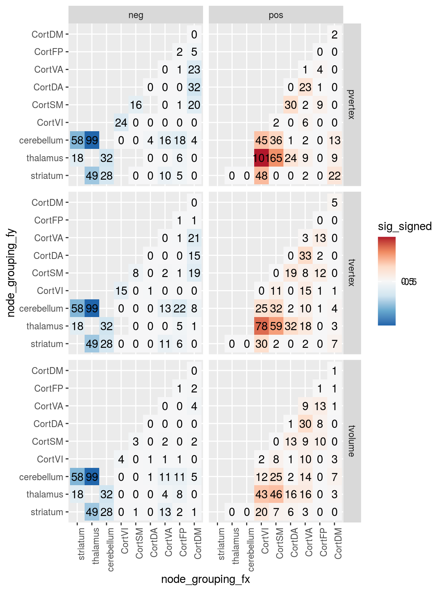
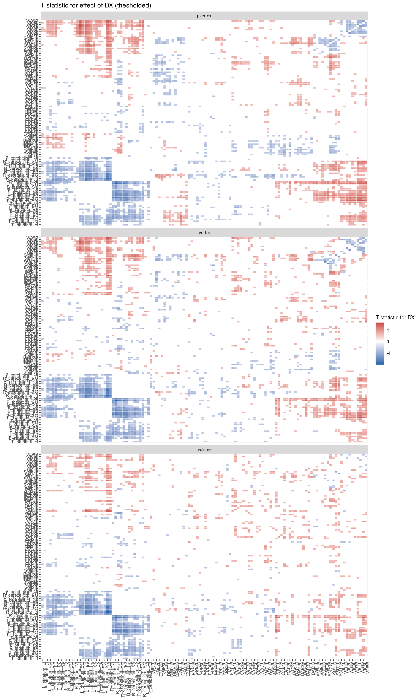
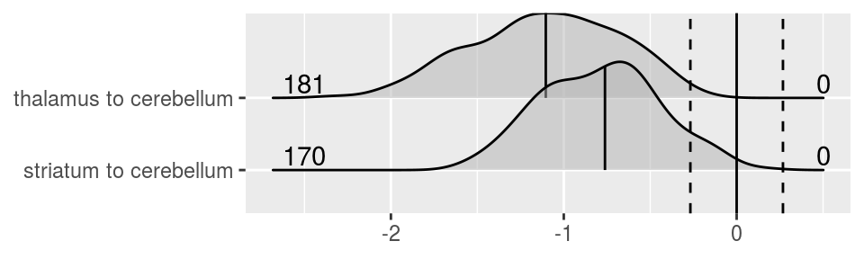
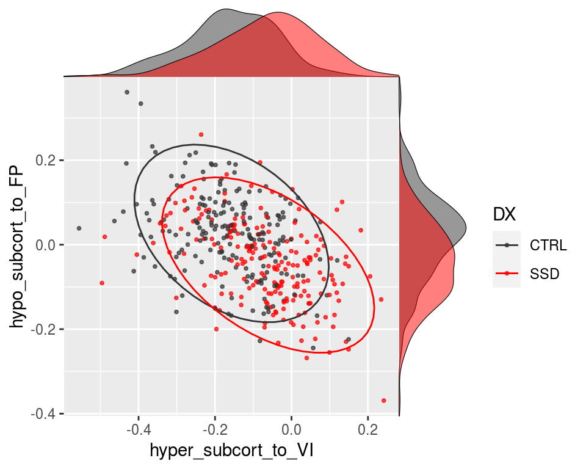
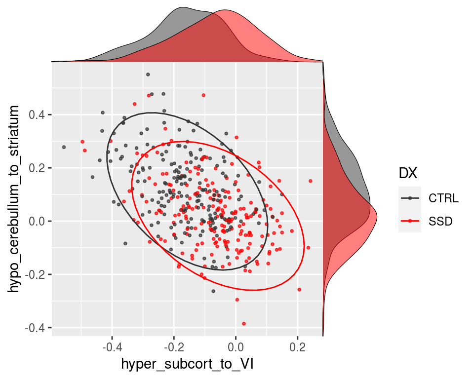
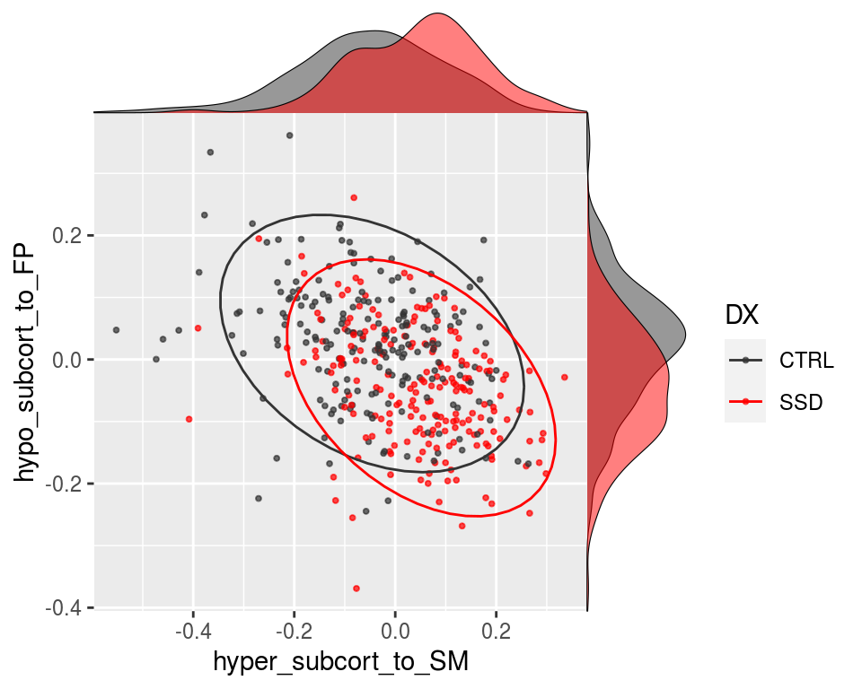
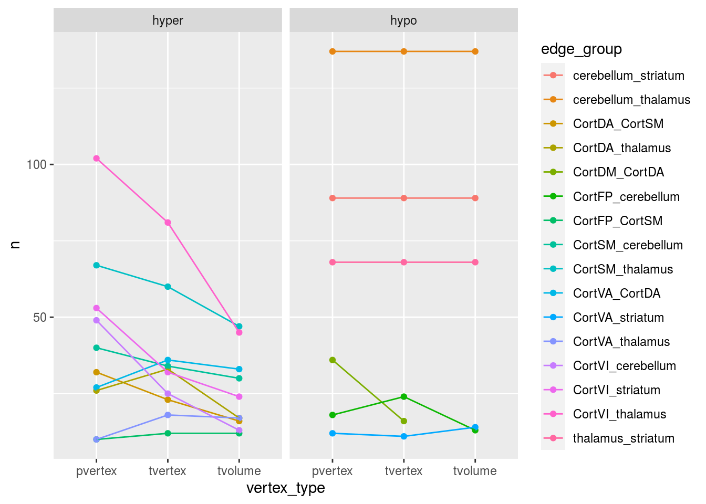
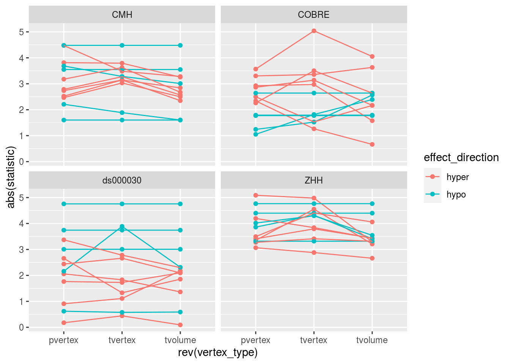

# Whole Connectome Results

We are now going to see if there is anything in cortical-cortical connectivity by running the matrix of all possible connections instead of just subcortical-cortical stats. 


```r
library(tidygraph)
library(tidyverse)
library(broom)
library(knitr)
library(cowplot)
library(igraph)
library(ggraph)
library(here)
```

## The paths to data


```r
# These functions are for reading timeseries files
source(here('code/R/settings_helpers.R'))
#

pheno <- read_pheno_file()%>%
  drop_na(DX) %>%
  filter(in_matched_sample)
```

```
## Parsed with column specification:
## cols(
##   .default = col_double(),
##   dataset = col_character(),
##   subject_id = col_character(),
##   session_id = col_character(),
##   task_id = col_character(),
##   run_id = col_character(),
##   acq_id = col_character(),
##   subject = col_character(),
##   session = col_character(),
##   DX = col_character(),
##   Site = col_character(),
##   filename = col_character(),
##   cmh_session_id = col_character(),
##   Sex = col_character(),
##   Scanner = col_character(),
##   isFEP = col_character(),
##   zhh_chosen_sess = col_logical(),
##   ghost_NoGhost = col_character(),
##   in_matched_sample = col_logical()
## )
```

```
## See spec(...) for full column specifications.
```

```r
YeoNet_colours <- define_Yeo7_colours()
Yeo7_2011_80verts <- read_Yeo72011_template() 

lm_predictor_col = c("DX")
lm_covar_cols <- c("Age_match_pt", 
                    "Sex",
                    "fd_mean_match_pt",
                    "Site")
```

# Code for reading in all the timeseries..


A table that describes the current expected subortical files


These functions are for reading timeseries files


This reads all files and generate PINT to subcortical correlation values for a given subject


```r
the_subcortical_guide <- get_subcortical_guide()
```

```
## Warning: `cols` is now required when using unnest().
## Please use `cols = c(subcort_NET)`
```

```
## Parsed with column specification:
## cols(
##   subcort_hemi = col_character(),
##   subcort_ROI = col_character(),
##   numvx = col_double(),
##   network = col_character()
## )
```

```r
#run_read_subject_subcort_corrs(subcort_outputlist$subid[1])
```

## This was run once in order to detemine the too small subcortical ROIs


```r
read_vx_count <- function(filepath) {
  read_csv(filepath, col_names = FALSE) %>%
    mutate(network = c('VI','SM','DA','VA', 'LI','FP','DM')) 
}

vx_counts <- the_subcortical_guide %>%
  select(subcort_hemi, subcort_ROI) %>%
  distinct() %>%
  mutate(vx_count = str_c(output_base,'/ZHH/out/ciftify_meants/templates/7RSN_roi-',subcort_hemi, subcort_ROI,'_vxcount.txt')) %>%
mutate(vxnum = map(vx_count, ~read_vx_count(.x))) %>%
  unnest() %>%
  select(subcort_hemi, subcort_ROI, X1, network) %>%
  rename(numvx = X1)

write_csv(vx_counts, '../templates/subcort_vxcounts.csv')
```


```r
node_annotations <- get_node_annotations(Yeo7_2011_80verts, the_subcortical_guide)
```


### This reads all the subcortical files it can find

Write a func_base and outputprefix cols into the pheno file for the file reading step


```r
source(here('code/R/file_reading_helpers.R'))
pheno <- pheno %>%
  mutate(func_base = get_func_base_from_pint_summary_filename(filename,subject, session), 
         outputprefix = construct_output_prefix(subject, session, func_base))
map2(pheno$outputprefix[1], pheno$dataset[1],
                              ~run_read_all_subject_timeseries_and_wholebrain_corZ(.x, .y))
```


```r
source(here('code/R/file_reading_helpers.R'))
pheno <- pheno %>%
  mutate(func_base = get_func_base_from_pint_summary_filename(filename,subject, session), 
         outputprefix = construct_output_prefix(subject, session, func_base))
all_corZ_results <- pheno %>%
  select(subject, outputprefix, dataset) %>%
  mutate(the_corrs = map2(.$outputprefix, .$dataset,
                              ~run_read_all_subject_timeseries_and_wholebrain_corZ(.x, .y)))

#save(all_corZ_results, file = file.path(output_base, "all_clinicalplusqa_group", "Rdata_cache", "06_wholebrain_results_cache.Rdata"))
saveRDS(all_corZ_results, file = file.path(output_base, "all_clinicalplusqa_group", "Rdata_cache", "06_wholebrain_FC_cache.rds"))
```


```r
load(file.path(output_base, "all_clinicalplusqa_group", "Rdata_cache", "06_wholebrain_results_cache.Rdata"))
```


```r
all_corZ_results <- readRDS(file = file.path(output_base, "all_clinicalplusqa_group", "Rdata_cache", "06_wholebrain_FC_cache.rds"))
```


### merge with the phenotypic data


```r
results_pheno <- all_corZ_results %>%
  inner_join(pheno, by = c("subject", "dataset")) %>%
  unnest(cols = c(the_corrs))  
```


```r
results_pheno
```

## calcualate cohen's D for Diagnosis Effect


```r
library(modelr)
```

```
## 
## Attaching package: 'modelr'
```

```
## The following object is masked from 'package:igraph':
## 
##     permute
```

```
## The following object is masked from 'package:broom':
## 
##     bootstrap
```

```r
library(effsize)


calc_DX_cohenD <- function(df, outcome, predictor, covars) { 
m1 <- lm(formula(paste(outcome, '~', paste(covars, collapse = " + "))),
         data = df)
result <-df %>% 
  add_residuals(m1) %>%
  cohen.d(formula(paste("resid ~", predictor)), data = .) %>% 
  .$estimate
return(result)
}
```

```r
rm(all_corZ_results)
```


```r
results_pheno_plus_DXd <- function(results_pheno) {
  results_pheno %>%
  semi_join(node_annotations, by = c("to"="node_name")) %>%
  semi_join(node_annotations, by = c("from"="node_name")) %>%
  mutate(corZ = weight) %>%
  group_by(vertex_type, to, from) %>%
  nest() %>%
  #slice(1:3) %>%
  mutate(DX_cohenD = map(data, ~calc_DX_cohenD(.x, 
                                               outcome = "corZ", 
                                               predictor = "DX",
                                               covars = lm_covar_cols))) %>%
  unnest(DX_cohenD) %>%
  ungroup() %>%
  select(vertex_type, to, from, DX_cohenD)
}

## had to split this by vertex because of RAM issues on laptop
pvertex_DXd <- results_pheno %>%
  filter(vertex_type == "pvertex") %>%
  results_pheno_plus_DXd()
tvertex_DXd <- results_pheno %>%
  filter(vertex_type == "tvertex") %>%
  results_pheno_plus_DXd()
tvolume_DXd <- results_pheno %>%
  filter(vertex_type == "tvolume") %>%
  results_pheno_plus_DXd()

DX_cohensD_results <- bind_rows(
  pvertex_DXd,
  tvertex_DXd,
  tvolume_DXd
) 
```


```r
DX_lm_formula <- formula(paste("corZ ~ ", lm_predictor_col, "+",
                               paste(lm_covar_cols, collapse = " + ")))

print(str_glue("fitting: lm formula {DX_lm_formula}"))
```

```
## fitting: lm formula ~
## fitting: lm formula corZ
## fitting: lm formula DX + Age_match_pt + Sex + fd_mean_match_pt + Site
```

```r
DX_lm_model_fit <- function(results_pheno) {
  results_pheno %>%
  semi_join(node_annotations, by = c("to"="node_name")) %>%
  semi_join(node_annotations, by = c("from"="node_name")) %>%
  mutate(corZ = weight) %>%
  group_by(vertex_type, to, from) %>%
  do(tidy(lm(DX_lm_formula,.))) 
}

## had to split this by vertex because of RAM issues on laptop
pvertex_DX_lm <- results_pheno %>%
  filter(vertex_type == "pvertex") %>%
  DX_lm_model_fit()
tvertex_DX_lm <- results_pheno %>%
  filter(vertex_type == "tvertex") %>%
  DX_lm_model_fit()
tvolume_DX_lm <- results_pheno %>%
  filter(vertex_type == "tvolume") %>%
  DX_lm_model_fit()

DX_lm_model_full <- bind_rows(
  pvertex_DX_lm,
  tvertex_DX_lm,
  tvolume_DX_lm
) 
```

```r
DX_lm_formula
```

```
## corZ ~ DX + Age_match_pt + Sex + fd_mean_match_pt + Site
```


```r
annotated_graph_edges <- DX_lm_model_full %>%
  ungroup() %>%
  select(to, from) %>%
  distinct() %>%
  inner_join(node_annotations, by = c("to"="node_name")) %>%
  inner_join(node_annotations, by = c("from"="node_name"), suffix = c('_to','_from')) %>%
  unite(from_to_type, etype_from, etype_to) %>%
  unite(hemis, hemi_from, hemi_to, sep = "") %>%
  unite(networks, network_from, network_to, sep = "", remove = FALSE) %>%
  mutate(from_to_type = recode(from_to_type, "Cort_SubCort" = "SubCort_Cort")) %>%
  mutate(hemis = recode(hemis, "RL" = "LR")) 
```

## filters out some unwanted edges before FDR correction


```r
DX_lm_model <- DX_lm_model_full %>%
  ungroup() %>%
  inner_join(annotated_graph_edges, by = c("to", "from")) %>%
  mutate(withinsubcort = if_else((from_to_type == "SubCort_SubCort") & (subcort_ROI_from == subcort_ROI_to), "drop", "keep")) %>%
  filter(withinsubcort == "keep") %>%
  select(vertex_type, to, from, term, statistic, p.value) %>%
  ungroup() %>%
  group_by(term) %>%
  mutate(p_FDR = p.adjust(p.value, method = "fdr")) %>%
  arrange(p.value)
```


```r
DX_lm_model_DXcohenD <- DX_lm_model %>%
  filter(term == "DXSSD") %>%
  inner_join(DX_cohensD_results, by = c("vertex_type", "to", "from")) %>%
  mutate(cohenD_DX_tstatdir = -1 * DX_cohenD)
DX_lm_model_DXcohenD %>%
  ggplot(aes(cohenD_DX_tstatdir, statistic, color = (p_FDR < 0.05))) +
  geom_point()
```


```r
DX_lm_model_DXcohenD %>%
  filter(p_FDR < 0.05) %>%
  arrange(desc(p.value)) %>%
  slice(1:5)
```

```
## # A tibble: 5 x 9
## # Groups:   term [1]
##   vertex_type to    from  term  statistic p.value  p_FDR DX_cohenD
##   <chr>       <chr> <chr> <chr>     <dbl>   <dbl>  <dbl>     <dbl>
## 1 tvertex     DMT1L DAP3R DXSSD     -2.76 0.00603 0.0500     0.268
## 2 tvolume     VAT1L VAF1L DXSSD      2.76 0.00603 0.0500    -0.268
## 3 pvertex     R_ce… VAF3L DXSSD      2.76 0.00602 0.0499    -0.268
## 4 tvolume     L_ce… FPP2R DXSSD     -2.76 0.00601 0.0499     0.268
## 5 tvolume     L_th… VI01L DXSSD      2.76 0.00600 0.0499    -0.268
## # … with 1 more variable: cohenD_DX_tstatdir <dbl>
```


```r
saveRDS(DX_lm_model_DXcohenD, file = file.path(output_base, "all_clinicalplusqa_group", "Rdata_cache", "06_wholebrain_FC_DXlmfits.rds"))
```

can get the model fit back from here..


```r
DX_lm_model_DXcohenD <- readRDS(file = file.path(output_base, "all_clinicalplusqa_group", "Rdata_cache", "06_wholebrain_FC_DXlmfits.rds"))
```


## Make co


```r
source(here('code/R/swirly_plot_helpers.R'))
DX_lm_model_DXcohenD %>%
  ungroup() %>%
  ## filtering steps
  filter(term == "DXSSD") %>%
  filter(vertex_type == "pvertex") %>%
  
  ## make a pretty plot
  make_swirly_results_plot(pos_label = "SSD > HC", 
                      neg_label = "HC > SSD",
                      plot_title = "Personalized",
                      node_annotations = node_annotations)
```


```r
DX_lm_model_DXcohenD %>%
  ungroup() %>%
  filter(term == "DXSSD") %>%
  filter(vertex_type == "tvertex") %>%
  make_swirly_results_plot(pos_label = "SSD > HC", 
                      neg_label = "HC > SSD",
                      plot_title = "Template",
                      node_annotations = node_annotations)
```


```r
DX_lm_model_DXcohenD %>%
  ungroup() %>%
  filter(term == "DXSSD") %>%
  filter(vertex_type == "tvolume") %>%
  make_swirly_results_plot(pos_label = "SSD > HC", 
                      neg_label = "HC > SSD",
                      plot_title = "Volume",
                      node_annotations = node_annotations)
```


## make table FDR corrected Edges that survive correction


```r
DX_lm_model_DXcohenD %>%
  inner_join(annotated_graph_edges, by = c("to", "from")) %>%
  mutate(sig_edge = if_else(p_FDR < 0.05, "sig", "ns"),
         stat_pos = if_else(statistic > 0, "pos", "neg")) %>%
  filter(term == "DXSSD") %>% 
  count(vertex_type, from_to_type, sig_edge) %>%
  spread(sig_edge, n) %>%
  mutate(perc_sig = sig/(ns + sig)*100)
```

```
## # A tibble: 9 x 6
## # Groups:   term [1]
##   term  vertex_type from_to_type       ns   sig perc_sig
##   <chr> <chr>       <chr>           <int> <int>    <dbl>
## 1 DXSSD pvertex     Cort_Cort        2956   204     6.46
## 2 DXSSD pvertex     SubCort_Cort     2760   440    13.8 
## 3 DXSSD pvertex     SubCort_SubCort   249   284    53.3 
## 4 DXSSD tvertex     Cort_Cort        2952   208     6.58
## 5 DXSSD tvertex     SubCort_Cort     2829   371    11.6 
## 6 DXSSD tvertex     SubCort_SubCort   249   284    53.3 
## 7 DXSSD tvolume     Cort_Cort        3018   142     4.49
## 8 DXSSD tvolume     SubCort_Cort     2923   277     8.66
## 9 DXSSD tvolume     SubCort_SubCort   249   284    53.3
```


```r
DX_sig_edge_table <- DX_lm_model_DXcohenD %>%
  inner_join(annotated_graph_edges, by = c("to", "from")) %>%
  mutate(sig_edge = if_else(p_FDR < 0.05, "sig", "ns"),
         stat_pos = if_else(statistic > 0, "pos", "neg")) %>%
  filter(term == "DXSSD", from_to_type != "SubCort_SubCort") %>% 
  count(vertex_type,  sig_edge) %>%
  spread(sig_edge, n) %>%
  mutate(perc_sig = sig/(ns + sig)*100)

DX_sig_edge_table
```

```
## # A tibble: 3 x 5
## # Groups:   term [1]
##   term  vertex_type    ns   sig perc_sig
##   <chr> <chr>       <int> <int>    <dbl>
## 1 DXSSD pvertex      5716   644    10.1 
## 2 DXSSD tvertex      5781   579     9.10
## 3 DXSSD tvolume      5941   419     6.59
```


```r
YeoNet7 <- define_YeoNet7_colours()
node_annotations1 <- node_annotations %>%
  mutate(node_grouping  = if_else(etype == "Cort",
                                  str_c("Cort", cort_NET),
                                  as.character(subcort_ROI))) 

node_groupings <- factor(1:9, 
                         levels = c(1:9),
                         labels = c(levels(node_annotations$subcort_ROI),
                                    str_c("Cort",YeoNet7$network[1:6])))
edge_grouping_guide <- matrix(1, 
                  nrow = length(node_groupings),
                  ncol = length(node_groupings),
                  dimnames = list(node_groupings,
                                  node_groupings)) %>%
    graph_from_adjacency_matrix(mode="upper", 
                                weighted=T, diag=T) %>%
    as_data_frame() %>%
  filter(!(from %in% c("striatum", "thalamus", "cerebellum") & to == from)) %>%
  select(to, from)
```


```r
DX_lm_model_DXcohenD %>%
      ungroup() %>%
      inner_join(node_annotations1, by = c("from"="node_name")) %>%
      inner_join(node_annotations1, by = c("to"="node_name")) %>%
      mutate(sig_edge = if_else(p_FDR < 0.05, "sig", "ns"),
      stat_pos = if_else(statistic > 0, "pos", "neg")) %>%
      filter(term == "DXSSD") %>% 
      count(vertex_type, node_grouping.x, node_grouping.y, stat_pos, sig_edge) %>%
      group_by(vertex_type, node_grouping.x, node_grouping.y, stat_pos) %>%
      spread(sig_edge, n, fill = 0) %>%
      mutate(sig_signed = if_else(stat_pos == "pos", sig, sig*-1),
             node_grouping_x = factor(node_grouping.x, levels = node_groupings),
             node_grouping_y = factor(node_grouping.y, levels = node_groupings)) %>%
      mutate(node_grouping_fx = if_else(node_grouping_x == "CortDA" & node_grouping_y %in% c("CortVA", "CortFP", "CortDM"), 
                                        node_grouping_y, node_grouping_x),
             node_grouping_fy = if_else(node_grouping_x == "CortDA" & node_grouping_y %in% c("CortVA", "CortFP", "CortDM"), 
                                        node_grouping_x, node_grouping_y)) %>%
  ggplot(aes(x = node_grouping_fx, y = node_grouping_fy, fill = sig_signed)) +
  geom_tile() +
  geom_text(aes(label = sig)) +
  scale_fill_distiller(breaks = c(-0.5,0.5), type = "div", palette = 5) +
  theme(axis.text.x = element_text(angle = 90, hjust = 1)) +
  facet_grid(vertex_type ~ stat_pos)
```




```r
#' convert from three col graph df to adjacency matrix
uppertri_df_to_agjmat <- function(graph_df) {
  
names(graph_df) <- c('to', 'from', 'myattr')
matrix_out <- graph_df %>%
  graph_from_data_frame(.,directed = F) %>%
  get.adjacency(., type = "both", attr = "myattr") %>%
  as.matrix() 
return(matrix_out)
}

#' go uppertri data to full dataframe for geom_tile
uppertri_df_to_full <- function(graph_df) {
result <- graph_df %>%
  uppertri_df_to_agjmat() %>%
  as.data.frame() %>%
  mutate(to = row.names(.)) %>%
  gather(from, value, -to) 
return(result)
}
```


```r
DX_lm_model_DXcohenD %>%
  filter(term == "DXSSD") %>%
  mutate(t_filtered = if_else(p_FDR < 0.1, statistic, 0)) %>%
  ungroup() %>%
  select(vertex_type, to, from, t_filtered) %>%
  group_by(vertex_type) %>%
  nest() %>%
  mutate(uptri = map(data, uppertri_df_to_full)) %>%
  unnest(uptri) %>%
  mutate(to_lab = factor(to, levels = (node_annotations %>% arrange(subcort_ROI, network))$node_name),
         from_lab = factor(from, levels = (node_annotations %>% arrange(subcort_ROI, network))$node_name)) %>%
  ggplot(aes(x=to_lab, y=from_lab, fill=value)) + 
  geom_tile(color = "white") +
  scale_fill_gradient2(high = "#b2182b", mid = "white", low = "#2166ac") +
  theme(axis.text.x = element_text(angle = 90, hjust = 1)) +
  facet_wrap(~vertex_type, ncol = 1) +
  labs(title = "T statistic for effect of DX (thesholded)",
       x = NULL, y = NULL, fill = "T statistic for DX")
```



`


```r
full_DX_mat <- DX_lm_model_DXcohenD %>%
  filter(term == "DXSSD", vertex_type == "pvertex") %>%
  ungroup() %>%
  select(to, from, statistic) %>%
  uppertri_df_to_full() 

full_DX_mat %>%
  mutate(to_lab = factor(to, levels = node_annotations$node_name), 
         from_lab = factor(from, levels = node_annotations$node_name)) %>%
  ggplot(aes(x=to_lab, y=from_lab, fill=value)) + 
  geom_tile(color = "white") +
  scale_fill_gradient2(high = "#b2182b", mid = "white", low = "#2166ac") +
  theme(axis.text.x = element_text(angle = 90, hjust = 1)) +
  labs(title = "T statistic for effect of DX",
       x = NULL, y = NULL, fill = "T statistic for DX")
```


### trying to plot edges in subgroups

Plotting Subcortical to Cortical Edges


```r
library(ggridges)

make_subcortcort_edges_raincloud <- function(data,D_threshold) {

get_subcort_net_edges <- function(data, this_YeoNet, D_threshold) {
      data %>%
      ungroup() %>%
      select(to, from, cohenD_DX_tstatdir) %>%
      uppertri_df_to_full() %>%
      inner_join(node_annotations, by = c("to"="node_name")) %>%
      inner_join(node_annotations, by = c("from"="node_name")) %>%
      filter(etype.x == "SubCort") %>%
      filter(etype.y == "Cort")
      
}

DXweigths_pvertex <- data %>%
  filter(term == "DXSSD", vertex_type == "pvertex") %>%
  ungroup() %>%
  get_subcort_net_edges(.,this_YeoNet) 

DXweigths_tvertex <- data %>%
  filter(term == "DXSSD", vertex_type == "tvertex") %>%
  ungroup() %>%
  get_subcort_net_edges(.,this_YeoNet)

DXweigths_tvolume <- data %>%
  filter(term == "DXSSD", vertex_type == "tvolume") %>%
  ungroup() %>%
  get_subcort_net_edges(.,this_YeoNet)

Fz_DXweigths <- bind_rows(pvertex = DXweigths_pvertex,
                     tvertex = DXweigths_tvertex,
                     tvolume = DXweigths_tvolume,
                     .id = "vertex_type") %>%
      mutate(corrtype = factor(vertex_type, levels = c('pvertex', 'tvertex', 'tvolume'),
                             labels = c("Surface Personalized", 
                                        "Surface Template", 
                                        "Volume Template")),
           hyper_hypo = case_when(value < -D_threshold ~ "hypo",
                                  value > D_threshold ~ "hyper",
                                  TRUE ~ "notsig"))

plt_counts <- Fz_DXweigths %>%
  count(corrtype, network.y, hyper_hypo) %>%
  spread(hyper_hypo, n, fill = 0)


make_one_net_ridgelines <- function(plt_data, plt_counts, this_YeoNet, D_threshold, no_ticks = TRUE) {
    plt <- plt_data %>%
    filter(as.character(network.y) %in% c(this_YeoNet)) %>%
    ggplot(aes(y = corrtype, x = value)) +
    geom_density_ridges(
      #jittered_points = TRUE, position = "raincloud",
      alpha = 0.5, scale = 2,
      quantile_lines = TRUE, quantiles = 2,
      color = YeoNet7 %>% filter(network==this_YeoNet) %>% pull(hexcode)
    ) +
    geom_text(aes(y = corrtype, label = hyper), 
          x = 0.5, 
          nudge_y = 0.2, data = plt_counts %>% filter(as.character(network.y) %in% c(this_YeoNet))) +
    geom_text(aes(y = corrtype, label = hypo), 
          x = -0.5, 
          nudge_y = 0.2, data = plt_counts %>% filter(as.character(network.y) %in% c(this_YeoNet))) +
    geom_vline(xintercept = 0) +
    geom_vline(xintercept = D_threshold, linetype = "dashed") +
    geom_vline(xintercept = -D_threshold, linetype = "dashed") +
    scale_colour_manual(values = c(YeoNet7 %>% filter(network==this_YeoNet) %>% pull(hexcode))) +
    scale_x_continuous(limits = c(-0.5, 0.6)) +
    labs(y = NULL,
         x = NULL) +
    theme(legend.position='none')

if (no_ticks==TRUE) {
    plt <- plt + theme(axis.title.x=element_blank(),
                       axis.text.x=element_blank())
  } else {
    plt <- plt + labs(x = "Subcortical to Cortical Edges")
  }
  return(plt)
  
}


  DM <- make_one_net_ridgelines(Fz_DXweigths, plt_counts, "DM", D_threshold)
  FP <- make_one_net_ridgelines(Fz_DXweigths, plt_counts, "FP", D_threshold)
  VA <- make_one_net_ridgelines(Fz_DXweigths, plt_counts, "VA", D_threshold)
  DA <- make_one_net_ridgelines(Fz_DXweigths, plt_counts, "DA", D_threshold)
  SM <- make_one_net_ridgelines(Fz_DXweigths, plt_counts, "SM", D_threshold)
  VI <- make_one_net_ridgelines(Fz_DXweigths, plt_counts, "VI", D_threshold, no_ticks = FALSE)

  title <- ggdraw() + draw_label("Subcortical to Cortical", fontface='bold')
  full_plt <- plot_grid(title, DM, FP, VA, DA, SM, VI,
                   ncol = 1, rel_heights = c(0.5, 1, 1, 1, 1, 1, 1.5))
  return(full_plt)
}


make_subcortcort_edges_raincloud(DX_lm_model_DXcohenD,D_threshold = 0.2678)
```

```
## Picking joint bandwidth of 0.0335
```

```
## Picking joint bandwidth of 0.0277
```

```
## Picking joint bandwidth of 0.0346
```

```
## Picking joint bandwidth of 0.0324
```

```
## Picking joint bandwidth of 0.0376
```

```
## Picking joint bandwidth of 0.0308
```

```
## Warning: Removed 4 rows containing non-finite values (stat_density_ridges).
```


```r
library(ggridges)

make_cortcort_edges_raincloud <- function(data,D_threshold) {

get_cortcort_net_edges <- function(data) {
      data %>%
      ungroup() %>%
      select(to, from, cohenD_DX_tstatdir) %>%
      uppertri_df_to_full() %>%
      inner_join(node_annotations, by = c("to"="node_name")) %>%
      inner_join(node_annotations, by = c("from"="node_name")) %>%
      filter(etype.x == "Cort") %>%
      filter(etype.y == "Cort")
      
}

DXweigths_pvertex <- data %>%
  filter(term == "DXSSD", vertex_type == "pvertex") %>%
  ungroup() %>%
  get_cortcort_net_edges() 

DXweigths_tvertex <- data %>%
  filter(term == "DXSSD", vertex_type == "tvertex") %>%
  ungroup() %>%
  get_cortcort_net_edges()

DXweigths_tvolume <- data %>%
  filter(term == "DXSSD", vertex_type == "tvolume") %>%
  ungroup() %>%
  get_cortcort_net_edges()

Fz_DXweigths <- bind_rows(pvertex = DXweigths_pvertex,
                     tvertex = DXweigths_tvertex,
                     tvolume = DXweigths_tvolume,
                     .id = "vertex_type") %>%
      mutate(corrtype = factor(vertex_type, levels = c('pvertex', 'tvertex', 'tvolume'),
                             labels = c("Surface Personalized", 
                                        "Surface Template", 
                                        "Volume Template")),
           hyper_hypo = case_when(value < -D_threshold ~ "hypo",
                                  value > D_threshold ~ "hyper",
                                  TRUE ~ "notsig"))

all_plt_counts <- Fz_DXweigths %>%
  count(corrtype, network.y, network.x, hyper_hypo) %>%
  spread(hyper_hypo, n, fill = 0)


make_two_net_ridgelines <- function(plt_data, all_plt_counts, network_x, network_y, D_threshold, no_ticks = TRUE) {
    plt_counts <- all_plt_counts %>%
      filter(as.character(network.x)== network_x,
           as.character(network.y)== network_y,)
  
    plt <- plt_data %>%
    filter(as.character(network.x)== network_x,
           as.character(network.y)== network_y,) %>%
    ggplot(aes(y = corrtype, x = value)) +
    geom_density_ridges(
      #jittered_points = TRUE, position = "raincloud",
      alpha = 0.5, scale = 2,
      quantile_lines = TRUE, quantiles = 2,
      color = YeoNet7 %>% filter(network==network_x) %>% pull(hexcode),
      fill = YeoNet7 %>% filter(network==network_y) %>% pull(hexcode)
    ) +
    geom_text(aes(y = corrtype, label = hyper), 
          x = 0.5, 
          nudge_y = 0.2, data = plt_counts) +
    geom_text(aes(y = corrtype, label = hypo), 
          x = -0.5, 
          nudge_y = 0.2, data = plt_counts) +
    geom_vline(xintercept = 0) +
    geom_vline(xintercept = D_threshold, linetype = "dashed") +
    geom_vline(xintercept = -D_threshold, linetype = "dashed") +
    scale_x_continuous(limits = c(-0.5, 0.6)) +
    labs(y = NULL,
         x = NULL) +
    theme(legend.position='none')

if (no_ticks==TRUE) {
    plt <- plt + theme(axis.title.x=element_blank(),
                       axis.text.x=element_blank())
  } else {
    plt <- plt + labs(x = "Cortical to Cortical Edges")
  }
  return(plt)
  
}

  DM_DA <- make_two_net_ridgelines(Fz_DXweigths, all_plt_counts, "DM", "DA", D_threshold)
  DM_VA <- make_two_net_ridgelines(Fz_DXweigths, all_plt_counts, "DM", "VA", D_threshold)
  DM_SM <- make_two_net_ridgelines(Fz_DXweigths, all_plt_counts, "DM", "SM", D_threshold)
  FP_SM <- make_two_net_ridgelines(Fz_DXweigths, all_plt_counts, "FP", "SM", D_threshold)
  VA_DA <- make_two_net_ridgelines(Fz_DXweigths, all_plt_counts, "DA", "VA", D_threshold)
  DA_SM <- make_two_net_ridgelines(Fz_DXweigths, all_plt_counts, "DA", "SM", D_threshold)
  VI_VI <- make_two_net_ridgelines(Fz_DXweigths, all_plt_counts, "VI", "VI", D_threshold, no_ticks = FALSE)

  title <- ggdraw() + draw_label("Subcortical to Cortical", fontface='bold')
  full_plt <- plot_grid(title, DM_DA, DM_VA, FP_SM, VA_DA, DA_SM, VI_VI,
                   ncol = 1, rel_heights = c(0.5, 1,  1, 1, 1, 1,1.5))
  return(full_plt)
}


make_cortcort_edges_raincloud(DX_lm_model_DXcohenD,D_threshold = 0.2678)
```

```
## Picking joint bandwidth of 0.0307
```

```
## Picking joint bandwidth of 0.0297
```

```
## Picking joint bandwidth of 0.0366
```

```
## Picking joint bandwidth of 0.031
```

```
## Picking joint bandwidth of 0.0329
```

```
## Picking joint bandwidth of 0.0497
```

```
## Warning: Removed 2 rows containing non-finite values (stat_density_ridges).
```


```r
D_threshold = 0.2678
hypo_cerebullum_to <- DX_lm_model_DXcohenD %>%
      ungroup() %>%
      select(to, from, cohenD_DX_tstatdir) %>%
      uppertri_df_to_full() %>%
      inner_join(node_annotations, by = c("to"="node_name")) %>%
      inner_join(node_annotations, by = c("from"="node_name")) %>% 
    filter(subcort_ROI.x == "cerebellum") %>%
    filter(subcort_ROI.y %in% c("striatum", "thalamus")) %>%
    mutate(hyper_hypo = case_when(value < -D_threshold ~ "hypo",
                                  value > D_threshold ~ "hyper",
                                  TRUE ~ "notsig"),
           corrtype = str_c(subcort_ROI.y, " to cerebellum"))

plt_counts <- hypo_cerebullum_to %>%
  count(corrtype, hyper_hypo) %>%
  spread(hyper_hypo, n, fill = 0) %>%
  mutate(hyper = 0) # note this only works because there is no hyper

hypo_cerebullum_to %>%
    ggplot(aes(y = corrtype, x = value)) +
    geom_density_ridges(
      #jittered_points = TRUE, position = "raincloud",
      alpha = 0.5, scale = 1.5,
      quantile_lines = TRUE, quantiles = 2
    ) +
    geom_text(aes(y = corrtype, label = hyper), 
          x = 0.5, 
          nudge_y = 0.2, data = plt_counts) +
    geom_text(aes(y = corrtype, label = hypo), 
          x = -2.5, 
          nudge_y = 0.2, data = plt_counts) +
    geom_vline(xintercept = 0) +
    geom_vline(xintercept = D_threshold, linetype = "dashed") +
    geom_vline(xintercept = -D_threshold, linetype = "dashed") +
    labs(y = NULL,
         x = NULL) +
    theme(legend.position='none')
```

```
## Picking joint bandwidth of 0.121
```




```r
calc_fc_weights <- function(lm_df, t_threshold) {
  
    full_DX_mat <- lm_df %>%
      ungroup() %>%
      select(to, from, cohenD_DX_tstatdir) %>%
      uppertri_df_to_full() %>%
      inner_join(node_annotations, by = c("to"="node_name")) %>%
      inner_join(node_annotations, by = c("from"="node_name")) 
    
hypo_cerebullum_to_striatum <- full_DX_mat %>%
    filter(subcort_ROI.x == "cerebellum") %>%
    filter(subcort_ROI.y == "striatum") %>%
    filter(value < -t_threshold) %>%
    select(to, from, value) 

hypo_cerebullum_to_thalamus <- full_DX_mat %>%
    filter(subcort_ROI.x == "cerebellum") %>%
    filter(subcort_ROI.y == "thalamus") %>%
    filter(value < -t_threshold) %>%
    select(to, from, value)

hyper_subcort_to_SM <- full_DX_mat %>%
    filter(etype.x == "SubCort") %>%
    filter(etype.y == "Cort") %>%
    filter(as.character(network.y) %in% c("SM")) %>%
    filter(value > t_threshold) %>%
    select(to, from, value)

hyper_subcort_to_VI <- full_DX_mat %>%
    filter(etype.x == "SubCort") %>%
    filter(etype.y == "Cort") %>%
    filter(as.character(network.y) %in% c("VI")) %>%
    filter(value > t_threshold) %>%
    select(to, from, value)

hyper_subcort_to_DA <- full_DX_mat %>%
    filter(etype.x == "SubCort") %>%
    filter(etype.y == "Cort") %>%
    filter(as.character(network.y) %in% c("DA")) %>%
    filter(value > t_threshold) %>%
    select(to, from, value)

hyper_subcort_to_DM <- full_DX_mat %>%
    filter(etype.x == "SubCort") %>%
    filter(etype.y == "Cort") %>%
    filter(as.character(network.y) %in% c("DM")) %>%
    filter(value > t_threshold) %>%
    select(to, from, value)

hypo_subcort_to_FP <- full_DX_mat %>%
    filter(etype.x == "SubCort") %>%
    filter(etype.y == "Cort") %>%
    filter(as.character(network.y) %in% c("FP")) %>%
    filter(value < -t_threshold) %>%
    select(to, from, value)

hypo_subcort_to_VA <- full_DX_mat %>%
    filter(etype.x == "SubCort") %>%
    filter(etype.y == "Cort") %>%
    filter(as.character(network.y) %in% c("VA")) %>%
    filter(value < -t_threshold) %>%
    select(to, from, value)

hyper_cortDA_to_SM <- full_DX_mat %>%
    filter(etype.x == "Cort") %>%
    filter(etype.y == "Cort") %>%
    filter(as.character(network.x) %in% c("DA")) %>%
    filter(as.character(network.y) %in% c("SM")) %>%
    filter(value > t_threshold) %>%
    select(to, from, value)

hyper_cortVA_to_DA <- full_DX_mat %>%
    filter(etype.x == "Cort") %>%
    filter(etype.y == "Cort") %>%
    filter(as.character(network.x) %in% c("VA")) %>%
    filter(as.character(network.y) %in% c("DA")) %>%
    filter(value > t_threshold) %>%
    select(to, from, value)

hyper_cortFP_to_SM <- full_DX_mat %>%
    filter(etype.x == "Cort") %>%
    filter(etype.y == "Cort") %>%
    filter(as.character(network.x) %in% c("FP")) %>%
    filter(as.character(network.y) %in% c("SM")) %>%
    filter(value > t_threshold) %>%
    select(to, from, value)

hypo_cortDM_to_DA <- full_DX_mat %>%
    filter(etype.x == "Cort") %>%
    filter(etype.y == "Cort") %>%
    filter(as.character(network.x) %in% c("DM")) %>%
    filter(as.character(network.y) %in% c("DA")) %>%
    filter(value < -t_threshold) %>%
    select(to, from, value)

hypo_cortDM_to_VA <- full_DX_mat %>%
    filter(etype.x == "Cort") %>%
    filter(etype.y == "Cort") %>%
    filter(as.character(network.x) %in% c("DM")) %>%
    filter(as.character(network.y) %in% c("VA")) %>%
    filter(value < -t_threshold) %>%
    select(to, from, value)

hypo_cortVI_to_VI <- full_DX_mat %>%
    filter(etype.x == "Cort") %>%
    filter(etype.y == "Cort") %>%
    filter(as.character(network.x) %in% c("VI")) %>%
    filter(as.character(network.y) %in% c("VI")) %>%
    filter(value < -t_threshold) %>%
    select(to, from, value)

Fz_weigths <-bind_rows(hyper_cortDA_to_SM = hyper_cortDA_to_SM,
                       hyper_cortFP_to_SM = hyper_cortFP_to_SM,
                       hyper_cortVA_to_DA = hyper_cortVA_to_DA,
                       hypo_cortDM_to_DA = hypo_cortDM_to_DA,
                       hypo_cortDM_to_VA = hypo_cortDM_to_VA,
                       hypo_cortVI_to_VI = hypo_cortVI_to_VI,
                       hyper_subcort_to_DM = hyper_subcort_to_DM,
                       hypo_subcort_to_FP = hypo_subcort_to_FP,
                       hypo_subcort_to_VA = hypo_subcort_to_VA,
                       hyper_subcort_to_DA = hyper_subcort_to_DA,
                       hyper_subcort_to_SM = hyper_subcort_to_SM,
                       hyper_subcort_to_VI = hyper_subcort_to_VI,
                       hypo_cerebullum_to_striatum = hypo_cerebullum_to_striatum,
                       hypo_cerebullum_to_thalamus = hypo_cerebullum_to_thalamus,
                       .id = "direction_edge_group") %>%
  separate(direction_edge_group, into = c("effect_direction", "edge_group"), extra = "merge") %>%
  rename(edge_FC_weight = value)

  return(Fz_weigths)

}
```

### calculated extract edge weights for per participant scores


```r
cohenD_threshold = 0.2678
cohenD_thresname = "pFDR"

Fz_DXweigths_pvertex <- DX_lm_model_DXcohenD %>%
  filter(term == "DXSSD", vertex_type == "pvertex") %>%
  ungroup() %>%
  calc_fc_weights(.,cohenD_threshold)

Fz_DXweigths_tvertex <- DX_lm_model_DXcohenD %>%
  filter(term == "DXSSD", vertex_type == "tvertex") %>%
  ungroup() %>%
  calc_fc_weights(.,cohenD_threshold)

Fz_DXweigths_tvolume <- DX_lm_model_DXcohenD %>%
  filter(term == "DXSSD", vertex_type == "tvolume") %>%
  ungroup() %>%
  calc_fc_weights(.,cohenD_threshold)

Fz_DXweigths <- bind_rows(pvertex = Fz_DXweigths_pvertex,
                     tvertex = Fz_DXweigths_tvertex,
                     tvolume = Fz_DXweigths_tvolume,
                     .id = "vertex_type") 

write_csv(Fz_DXweigths, file.path(output_base, 
                                  "all_clinicalplusqa_group", 
                                  "weighted_subject_FC_weigths",
                                  str_c("SSD4cohorts_DXtweigths_", 
                                        cohenD_thresname, ".csv")))
```

```r
Fz_DXweigths %>% 
  count(edge_group, vertex_type, effect_direction) %>%
  spread(vertex_type, n)
```

```
##                edge_group effect_direction pvertex tvertex tvolume
## 1  cerebullum_to_striatum             hypo      86      86      86
## 2  cerebullum_to_thalamus             hypo     131     131     131
## 3            cortDA_to_SM            hyper      30      19      13
## 4            cortDM_to_DA             hypo      32      15      NA
## 5            cortDM_to_VA             hypo      23      21       4
## 6            cortFP_to_SM            hyper       9      12      10
## 7            cortVA_to_DA            hyper      23      33      30
## 8            cortVI_to_VI             hypo      48      30       8
## 9           subcort_to_DA            hyper      25      34      24
## 10          subcort_to_DM            hyper      44      14      10
## 11          subcort_to_FP             hypo      29      33      21
## 12          subcort_to_SM            hyper     101      93      78
## 13          subcort_to_VA             hypo      26      24      28
## 14          subcort_to_VI            hyper     194     133      75
```
### calculated scores per participant


```r
#' calculates a subjects weigthed FC score from their edgewise values
#'
#' @param subject_edges_df tibble with columns subject, to, from, and weight
#' @param edge_weights tibble with columns effect_direction, edge_group, to, from, and edge_FC_weight
#'
#' @return tibble with columns subject, dataset, effect_direction, edge_group, FC_subtype and wFC_score
#'
#' @examples
calc_subjects_wFC_score <- function(subject_edges_df, edge_weights) {
  result <- subject_edges_df %>%
  ungroup() %>%
  group_by(subject, dataset) %>%
  nest() %>%
  mutate(uptri = map(data, uppertri_df_to_full)) %>%
  unnest(uptri) %>%
  inner_join(edge_weights, by = c("to", "from")) %>%
  ungroup() %>%
  group_by(subject, dataset, effect_direction, edge_group) %>%
  summarise(wFC_score = weighted.mean(value, w = edge_FC_weight),
            mFC_score = mean(value)) %>%
  ungroup()
  return(result)
}
```


```r
pvertex_subject_FC_scores <- results_pheno %>%
  ungroup() %>%
  filter(vertex_type == "pvertex") %>%
  select(subject, dataset, to, from, weight) %>%
  calc_subjects_wFC_score(Fz_DXweigths_pvertex)
```

```
## `summarise()` regrouping output by 'subject', 'dataset', 'effect_direction' (override with `.groups` argument)
```

```r
tvertex_subject_FC_scores <- results_pheno %>%
  ungroup() %>%
  filter(vertex_type == "tvertex") %>%
  select(subject, dataset, to, from, weight) %>%
  calc_subjects_wFC_score(Fz_DXweigths_tvertex)
```

```
## `summarise()` regrouping output by 'subject', 'dataset', 'effect_direction' (override with `.groups` argument)
```

```r
tvolume_subject_FC_scores <- results_pheno %>%
  ungroup() %>%
  filter(vertex_type == "tvolume") %>%
  select(subject, dataset, to, from, weight) %>%
  calc_subjects_wFC_score(Fz_DXweigths_tvolume)
```

```
## `summarise()` regrouping output by 'subject', 'dataset', 'effect_direction' (override with `.groups` argument)
```

```r
FC_scores_together <- bind_rows(
  pvertex = pvertex_subject_FC_scores,
  tvertex = tvertex_subject_FC_scores,
  tvolume = tvolume_subject_FC_scores,
  .id = "vertex_type"
)

write_csv(FC_scores_together, file.path(output_base, 
                                        "all_clinicalplusqa_group", 
                                        "weighted_subject_FC_scores",
                                        "SSD4cohorts_DXweighted_subject_scores.csv"))
```


```r
DX_sig_edge_table %>% filter(vertex_type == "pvertex") %>% pull(sig)
```

```
## [1] 644
```


## write up to this point..

We observed robust patterns of dysconnectivity that were strengthened using a surface-based approach and PINT (Number of differing pairwise-correlations: volume: {419}, surface: {579},  PINT: {644}, FDR corrected). Moreover, patterns of dyscnnectivity became more interpretable in terms of individual resting state networks and cortical heirarchy (see Supplemental Figure 2 for breakdown by cortical network). Overall, regardless of cortical mapping approach, hypoconnectivity, that is decreased connectivity in participants with schizophrenia relative to controls as observed for edges connecting subcortical regions to the fronto-parietal network. Hyperconnectivity, or increased connectivity in participants with SSD relative to controls was observed for subcortical connections to those visual, somatomor, and dorsal attention networks, which increased when moving from volume-to-surface, and again from surface-to-PINT. Additional patterns of hypoconnectivity where observed between the cortical default-mode network and the dorsal and ventral attention netoworks, as well as within visual network edges. Cortical hyperconnectivity was observed between the dorsal and ventral attenetion networks, as well as the frontoparietal network to the somatomotor network. Moreover, hypoconnectivity was observed for nearly half of edges connecting the cerebellum to the striatum and the cerebellum to the thalamus.

To investigate these patterns further, sub-scored for these groups of edges were calculated to for each participants by taking the weighted-mean of all edges with that survived FDR corretion (Cohen's D threshold = {0.2678}, means were weighted by the SSD diagnosis effect size).


```r
FC_scores_lmfit <- FC_scores_together %>%
  inner_join(pheno, by = c("subject", "dataset")) %>%
  ungroup() %>%
  group_by(edge_group, effect_direction, vertex_type) %>%
  do(tidy(lm(wFC_score ~ DX + Age_pt + Sex + fd_mean_pt + Scanner,.))) 

FC_scores_lmfit %>%
  select(edge_group, effect_direction, term, statistic, p.value) %>%
  filter(term == "DXSSD") %>%
  knitr::kable()
```

```
## Adding missing grouping variables: `vertex_type`
```


vertex_type   edge_group               effect_direction   term     statistic    p.value
------------  -----------------------  -----------------  ------  ----------  ---------
pvertex       cerebullum_to_striatum   hypo               DXSSD    -6.186413   0.00e+00
tvertex       cerebullum_to_striatum   hypo               DXSSD    -6.186413   0.00e+00
tvolume       cerebullum_to_striatum   hypo               DXSSD    -6.186413   0.00e+00
pvertex       cerebullum_to_thalamus   hypo               DXSSD    -8.126418   0.00e+00
tvertex       cerebullum_to_thalamus   hypo               DXSSD    -8.126418   0.00e+00
tvolume       cerebullum_to_thalamus   hypo               DXSSD    -8.126418   0.00e+00
pvertex       cortDA_to_SM             hyper              DXSSD     5.925091   0.00e+00
tvertex       cortDA_to_SM             hyper              DXSSD     6.876098   0.00e+00
tvolume       cortDA_to_SM             hyper              DXSSD     5.721400   0.00e+00
pvertex       cortDM_to_DA             hypo               DXSSD    -5.773509   0.00e+00
tvertex       cortDM_to_DA             hypo               DXSSD    -6.564210   0.00e+00
pvertex       cortDM_to_VA             hypo               DXSSD    -5.298831   2.00e-07
tvertex       cortDM_to_VA             hypo               DXSSD    -6.852014   0.00e+00
tvolume       cortDM_to_VA             hypo               DXSSD    -5.362809   1.00e-07
pvertex       cortFP_to_SM             hyper              DXSSD     4.699304   3.60e-06
tvertex       cortFP_to_SM             hyper              DXSSD     5.919053   0.00e+00
tvolume       cortFP_to_SM             hyper              DXSSD     5.098214   5.00e-07
pvertex       cortVA_to_DA             hyper              DXSSD     5.480320   1.00e-07
tvertex       cortVA_to_DA             hyper              DXSSD     7.651558   0.00e+00
tvolume       cortVA_to_DA             hyper              DXSSD     6.389303   0.00e+00
pvertex       cortVI_to_VI             hypo               DXSSD    -5.483734   1.00e-07
tvertex       cortVI_to_VI             hypo               DXSSD    -6.393396   0.00e+00
tvolume       cortVI_to_VI             hypo               DXSSD    -4.216663   3.07e-05
pvertex       subcort_to_DA            hyper              DXSSD     5.273220   2.00e-07
tvertex       subcort_to_DA            hyper              DXSSD     7.083454   0.00e+00
tvolume       subcort_to_DA            hyper              DXSSD     7.089347   0.00e+00
pvertex       subcort_to_DM            hyper              DXSSD     7.142738   0.00e+00
tvertex       subcort_to_DM            hyper              DXSSD     6.982997   0.00e+00
tvolume       subcort_to_DM            hyper              DXSSD     6.298543   0.00e+00
pvertex       subcort_to_FP            hypo               DXSSD    -6.772180   0.00e+00
tvertex       subcort_to_FP            hypo               DXSSD    -7.289079   0.00e+00
tvolume       subcort_to_FP            hypo               DXSSD    -7.321904   0.00e+00
pvertex       subcort_to_SM            hyper              DXSSD     6.820810   0.00e+00
tvertex       subcort_to_SM            hyper              DXSSD     7.841656   0.00e+00
tvolume       subcort_to_SM            hyper              DXSSD     7.641352   0.00e+00
pvertex       subcort_to_VA            hypo               DXSSD    -6.451742   0.00e+00
tvertex       subcort_to_VA            hypo               DXSSD    -7.155871   0.00e+00
tvolume       subcort_to_VA            hypo               DXSSD    -8.220291   0.00e+00
pvertex       subcort_to_VI            hyper              DXSSD     7.338969   0.00e+00
tvertex       subcort_to_VI            hyper              DXSSD     7.818418   0.00e+00
tvolume       subcort_to_VI            hyper              DXSSD     7.078653   0.00e+00

```r
FC_scores_lmfit %>% 
  group_by(vertex_type, edge_group, effect_direction) %>%
  filter(term == "DXSSD",
         str_detect(edge_group,"subcort")) %>%
  ggplot(aes(y = abs(statistic), x = rev(vertex_type), color = edge_group)) +
    geom_point() +
    geom_line(aes(group = edge_group))
```


```r
FC_scores_lmfit <- FC_scores_together %>%
  inner_join(pheno, by = c("subject", "dataset")) %>%
  ungroup() %>%
  group_by(edge_group, vertex_type,  effect_direction, Site) %>%
  do(tidy(lm(wFC_score ~ DX + Age_pt + Sex + fd_mean_pt,.))) 

FC_scores_lmfit %>%
  select(edge_group, vertex_type, Site, term, statistic, p.value) %>%
  filter(term == "DXSSD") %>%
  knitr::kable()
```

```
## Adding missing grouping variables: `effect_direction`
```


effect_direction   edge_group               vertex_type   Site       term      statistic     p.value
-----------------  -----------------------  ------------  ---------  ------  -----------  ----------
hypo               cerebullum_to_striatum   pvertex       CMH        DXSSD    -3.5738171   0.0005370
hypo               cerebullum_to_striatum   pvertex       COBRE      DXSSD    -1.8151375   0.0763226
hypo               cerebullum_to_striatum   pvertex       ds000030   DXSSD    -2.9588712   0.0044903
hypo               cerebullum_to_striatum   pvertex       ZHH        DXSSD    -3.4056876   0.0008121
hypo               cerebullum_to_striatum   tvertex       CMH        DXSSD    -3.5738171   0.0005370
hypo               cerebullum_to_striatum   tvertex       COBRE      DXSSD    -1.8151375   0.0763226
hypo               cerebullum_to_striatum   tvertex       ds000030   DXSSD    -2.9588712   0.0044903
hypo               cerebullum_to_striatum   tvertex       ZHH        DXSSD    -3.4056876   0.0008121
hypo               cerebullum_to_striatum   tvolume       CMH        DXSSD    -3.5738171   0.0005370
hypo               cerebullum_to_striatum   tvolume       COBRE      DXSSD    -1.8151375   0.0763226
hypo               cerebullum_to_striatum   tvolume       ds000030   DXSSD    -2.9588712   0.0044903
hypo               cerebullum_to_striatum   tvolume       ZHH        DXSSD    -3.4056876   0.0008121
hypo               cerebullum_to_thalamus   pvertex       CMH        DXSSD    -4.6172504   0.0000113
hypo               cerebullum_to_thalamus   pvertex       COBRE      DXSSD    -2.6686483   0.0106237
hypo               cerebullum_to_thalamus   pvertex       ds000030   DXSSD    -4.7326351   0.0000151
hypo               cerebullum_to_thalamus   pvertex       ZHH        DXSSD    -4.6160245   0.0000074
hypo               cerebullum_to_thalamus   tvertex       CMH        DXSSD    -4.6172504   0.0000113
hypo               cerebullum_to_thalamus   tvertex       COBRE      DXSSD    -2.6686483   0.0106237
hypo               cerebullum_to_thalamus   tvertex       ds000030   DXSSD    -4.7326351   0.0000151
hypo               cerebullum_to_thalamus   tvertex       ZHH        DXSSD    -4.6160245   0.0000074
hypo               cerebullum_to_thalamus   tvolume       CMH        DXSSD    -4.6172504   0.0000113
hypo               cerebullum_to_thalamus   tvolume       COBRE      DXSSD    -2.6686483   0.0106237
hypo               cerebullum_to_thalamus   tvolume       ds000030   DXSSD    -4.7326351   0.0000151
hypo               cerebullum_to_thalamus   tvolume       ZHH        DXSSD    -4.6160245   0.0000074
hyper              cortDA_to_SM             pvertex       CMH        DXSSD     3.4605247   0.0007858
hyper              cortDA_to_SM             pvertex       COBRE      DXSSD     1.5883789   0.1193616
hyper              cortDA_to_SM             pvertex       ds000030   DXSSD     0.8064763   0.4233205
hyper              cortDA_to_SM             pvertex       ZHH        DXSSD     4.9424312   0.0000017
hyper              cortDA_to_SM             tvertex       CMH        DXSSD     3.9659463   0.0001352
hyper              cortDA_to_SM             tvertex       COBRE      DXSSD     0.7514483   0.4563836
hyper              cortDA_to_SM             tvertex       ds000030   DXSSD     1.0769629   0.2860339
hyper              cortDA_to_SM             tvertex       ZHH        DXSSD     6.0713815   0.0000000
hyper              cortDA_to_SM             tvolume       CMH        DXSSD     1.6539474   0.1011828
hyper              cortDA_to_SM             tvolume       COBRE      DXSSD     1.2962903   0.2016335
hyper              cortDA_to_SM             tvolume       ds000030   DXSSD     1.8397476   0.0710145
hyper              cortDA_to_SM             tvolume       ZHH        DXSSD     4.8696484   0.0000024
hypo               cortDM_to_DA             pvertex       CMH        DXSSD    -2.2488685   0.0266498
hypo               cortDM_to_DA             pvertex       COBRE      DXSSD    -1.0690117   0.2908942
hypo               cortDM_to_DA             pvertex       ds000030   DXSSD    -2.5656064   0.0129545
hypo               cortDM_to_DA             pvertex       ZHH        DXSSD    -4.6052396   0.0000077
hypo               cortDM_to_DA             tvertex       CMH        DXSSD    -3.6694130   0.0003870
hypo               cortDM_to_DA             tvertex       COBRE      DXSSD    -1.6055266   0.1155322
hypo               cortDM_to_DA             tvertex       ds000030   DXSSD    -2.9133422   0.0050995
hypo               cortDM_to_DA             tvertex       ZHH        DXSSD    -4.0026889   0.0000911
hypo               cortDM_to_VA             pvertex       CMH        DXSSD    -1.5776234   0.1177186
hypo               cortDM_to_VA             pvertex       COBRE      DXSSD    -2.7644023   0.0082990
hypo               cortDM_to_VA             pvertex       ds000030   DXSSD    -2.6464987   0.0104955
hypo               cortDM_to_VA             pvertex       ZHH        DXSSD    -3.6651190   0.0003242
hypo               cortDM_to_VA             tvertex       CMH        DXSSD    -3.2282384   0.0016711
hypo               cortDM_to_VA             tvertex       COBRE      DXSSD    -2.1184270   0.0398222
hypo               cortDM_to_VA             tvertex       ds000030   DXSSD    -2.2714493   0.0269136
hypo               cortDM_to_VA             tvertex       ZHH        DXSSD    -5.1196647   0.0000008
hypo               cortDM_to_VA             tvolume       CMH        DXSSD    -2.6572843   0.0091324
hypo               cortDM_to_VA             tvolume       COBRE      DXSSD    -3.2498433   0.0022164
hypo               cortDM_to_VA             tvolume       ds000030   DXSSD    -2.3938342   0.0199868
hypo               cortDM_to_VA             tvolume       ZHH        DXSSD    -2.8874987   0.0043538
hyper              cortFP_to_SM             pvertex       CMH        DXSSD     3.2998736   0.0013292
hyper              cortFP_to_SM             pvertex       COBRE      DXSSD     2.1723407   0.0352600
hyper              cortFP_to_SM             pvertex       ds000030   DXSSD     1.1024222   0.2749112
hyper              cortFP_to_SM             pvertex       ZHH        DXSSD     3.2467171   0.0013898
hyper              cortFP_to_SM             tvertex       CMH        DXSSD     3.0989110   0.0025043
hyper              cortFP_to_SM             tvertex       COBRE      DXSSD     2.5247079   0.0152600
hyper              cortFP_to_SM             tvertex       ds000030   DXSSD     2.1271389   0.0377484
hyper              cortFP_to_SM             tvertex       ZHH        DXSSD     3.9391567   0.0001164
hyper              cortFP_to_SM             tvolume       CMH        DXSSD     2.4541891   0.0157972
hyper              cortFP_to_SM             tvolume       COBRE      DXSSD     1.1820165   0.2435480
hyper              cortFP_to_SM             tvolume       ds000030   DXSSD     3.5398854   0.0008050
hyper              cortFP_to_SM             tvolume       ZHH        DXSSD     3.2232928   0.0015019
hyper              cortVA_to_DA             pvertex       CMH        DXSSD     1.2679338   0.2076803
hyper              cortVA_to_DA             pvertex       COBRE      DXSSD     1.4393562   0.1571264
hyper              cortVA_to_DA             pvertex       ds000030   DXSSD     4.6224661   0.0000222
hyper              cortVA_to_DA             pvertex       ZHH        DXSSD     4.6879048   0.0000054
hyper              cortVA_to_DA             tvertex       CMH        DXSSD     2.4925742   0.0142760
hyper              cortVA_to_DA             tvertex       COBRE      DXSSD     1.6653818   0.1029422
hyper              cortVA_to_DA             tvertex       ds000030   DXSSD     2.7111927   0.0088442
hyper              cortVA_to_DA             tvertex       ZHH        DXSSD     6.8510870   0.0000000
hyper              cortVA_to_DA             tvolume       CMH        DXSSD     1.8850650   0.0622396
hyper              cortVA_to_DA             tvolume       COBRE      DXSSD     1.7460976   0.0877732
hyper              cortVA_to_DA             tvolume       ds000030   DXSSD     2.2095616   0.0311682
hyper              cortVA_to_DA             tvolume       ZHH        DXSSD     5.5822563   0.0000001
hypo               cortVI_to_VI             pvertex       CMH        DXSSD    -2.1605105   0.0330516
hypo               cortVI_to_VI             pvertex       COBRE      DXSSD    -2.7408364   0.0088229
hypo               cortVI_to_VI             pvertex       ds000030   DXSSD    -0.6228427   0.5358720
hypo               cortVI_to_VI             pvertex       ZHH        DXSSD    -4.2541813   0.0000335
hypo               cortVI_to_VI             tvertex       CMH        DXSSD    -3.0887756   0.0025837
hypo               cortVI_to_VI             tvertex       COBRE      DXSSD    -2.0818537   0.0432047
hypo               cortVI_to_VI             tvertex       ds000030   DXSSD    -1.1142761   0.2698372
hypo               cortVI_to_VI             tvertex       ZHH        DXSSD    -4.6517386   0.0000063
hypo               cortVI_to_VI             tvolume       CMH        DXSSD    -1.9895495   0.0492917
hypo               cortVI_to_VI             tvolume       COBRE      DXSSD    -2.3873398   0.0213328
hypo               cortVI_to_VI             tvolume       ds000030   DXSSD    -1.3446992   0.1840491
hypo               cortVI_to_VI             tvolume       ZHH        DXSSD    -2.7534151   0.0064958
hyper              subcort_to_DA            pvertex       CMH        DXSSD     3.3982361   0.0009654
hyper              subcort_to_DA            pvertex       COBRE      DXSSD     1.5352888   0.1318731
hyper              subcort_to_DA            pvertex       ds000030   DXSSD     1.2337519   0.2223585
hyper              subcort_to_DA            pvertex       ZHH        DXSSD     3.4420805   0.0007161
hyper              subcort_to_DA            tvertex       CMH        DXSSD     3.5642111   0.0005548
hyper              subcort_to_DA            tvertex       COBRE      DXSSD     2.9049097   0.0057281
hyper              subcort_to_DA            tvertex       ds000030   DXSSD     1.9537523   0.0556441
hyper              subcort_to_DA            tvertex       ZHH        DXSSD     4.7147109   0.0000048
hyper              subcort_to_DA            tvolume       CMH        DXSSD     4.6478503   0.0000100
hyper              subcort_to_DA            tvolume       COBRE      DXSSD     3.6634652   0.0006651
hyper              subcort_to_DA            tvolume       ds000030   DXSSD     1.6065518   0.1136790
hyper              subcort_to_DA            tvolume       ZHH        DXSSD     4.3301197   0.0000246
hyper              subcort_to_DM            pvertex       CMH        DXSSD     2.4335530   0.0166734
hyper              subcort_to_DM            pvertex       COBRE      DXSSD     2.4001209   0.0206874
hyper              subcort_to_DM            pvertex       ds000030   DXSSD     4.0462588   0.0001584
hyper              subcort_to_DM            pvertex       ZHH        DXSSD     5.0852633   0.0000009
hyper              subcort_to_DM            tvertex       CMH        DXSSD     3.7330010   0.0003103
hyper              subcort_to_DM            tvertex       COBRE      DXSSD     1.7385244   0.0891124
hyper              subcort_to_DM            tvertex       ds000030   DXSSD     2.8775910   0.0056306
hyper              subcort_to_DM            tvertex       ZHH        DXSSD     4.9203213   0.0000019
hyper              subcort_to_DM            tvolume       CMH        DXSSD     3.1692934   0.0020123
hyper              subcort_to_DM            tvolume       COBRE      DXSSD     2.3938993   0.0209993
hyper              subcort_to_DM            tvolume       ds000030   DXSSD     4.3655518   0.0000540
hyper              subcort_to_DM            tvolume       ZHH        DXSSD     3.1015981   0.0022315
hypo               subcort_to_FP            pvertex       CMH        DXSSD    -3.5016798   0.0006850
hypo               subcort_to_FP            pvertex       COBRE      DXSSD    -3.0043103   0.0043812
hypo               subcort_to_FP            pvertex       ds000030   DXSSD    -1.8414043   0.0707679
hypo               subcort_to_FP            pvertex       ZHH        DXSSD    -4.4278006   0.0000164
hypo               subcort_to_FP            tvertex       CMH        DXSSD    -3.4612544   0.0007839
hypo               subcort_to_FP            tvertex       COBRE      DXSSD    -2.6722293   0.0105269
hypo               subcort_to_FP            tvertex       ds000030   DXSSD    -3.1792338   0.0023876
hypo               subcort_to_FP            tvertex       ZHH        DXSSD    -4.7722615   0.0000037
hypo               subcort_to_FP            tvolume       CMH        DXSSD    -4.1782391   0.0000617
hypo               subcort_to_FP            tvolume       COBRE      DXSSD    -2.2207510   0.0315632
hypo               subcort_to_FP            tvolume       ds000030   DXSSD    -2.2644789   0.0273656
hypo               subcort_to_FP            tvolume       ZHH        DXSSD    -4.6832571   0.0000055
hyper              subcort_to_SM            pvertex       CMH        DXSSD     3.7383364   0.0003046
hyper              subcort_to_SM            pvertex       COBRE      DXSSD     4.2077278   0.0001250
hyper              subcort_to_SM            pvertex       ds000030   DXSSD     2.5269281   0.0143061
hyper              subcort_to_SM            pvertex       ZHH        DXSSD     3.6518668   0.0003402
hyper              subcort_to_SM            tvertex       CMH        DXSSD     4.3676777   0.0000300
hyper              subcort_to_SM            tvertex       COBRE      DXSSD     5.2941126   0.0000036
hyper              subcort_to_SM            tvertex       ds000030   DXSSD     3.0764450   0.0032160
hyper              subcort_to_SM            tvertex       ZHH        DXSSD     4.0931594   0.0000639
hyper              subcort_to_SM            tvolume       CMH        DXSSD     4.0651540   0.0000940
hyper              subcort_to_SM            tvolume       COBRE      DXSSD     3.6926647   0.0006095
hyper              subcort_to_SM            tvolume       ds000030   DXSSD     3.8141038   0.0003383
hyper              subcort_to_SM            tvolume       ZHH        DXSSD     4.3247986   0.0000251
hypo               subcort_to_VA            pvertex       CMH        DXSSD    -2.4042660   0.0179912
hypo               subcort_to_VA            pvertex       COBRE      DXSSD    -2.9739368   0.0047575
hypo               subcort_to_VA            pvertex       ds000030   DXSSD    -1.6334286   0.1078912
hypo               subcort_to_VA            pvertex       ZHH        DXSSD    -4.8313921   0.0000029
hypo               subcort_to_VA            tvertex       CMH        DXSSD    -3.3339234   0.0011908
hypo               subcort_to_VA            tvertex       COBRE      DXSSD    -2.4325199   0.0191295
hypo               subcort_to_VA            tvertex       ds000030   DXSSD    -1.8442373   0.0703477
hypo               subcort_to_VA            tvertex       ZHH        DXSSD    -5.3522347   0.0000003
hypo               subcort_to_VA            tvolume       CMH        DXSSD    -4.0091401   0.0001155
hypo               subcort_to_VA            tvolume       COBRE      DXSSD    -2.0180347   0.0497105
hypo               subcort_to_VA            tvolume       ds000030   DXSSD    -3.2329145   0.0020392
hypo               subcort_to_VA            tvolume       ZHH        DXSSD    -6.0844455   0.0000000
hyper              subcort_to_VI            pvertex       CMH        DXSSD     3.2258252   0.0016840
hyper              subcort_to_VI            pvertex       COBRE      DXSSD     3.7500601   0.0005129
hyper              subcort_to_VI            pvertex       ds000030   DXSSD     2.3222757   0.0238129
hyper              subcort_to_VI            pvertex       ZHH        DXSSD     4.8046872   0.0000032
hyper              subcort_to_VI            tvertex       CMH        DXSSD     4.0500090   0.0000994
hyper              subcort_to_VI            tvertex       COBRE      DXSSD     3.6023035   0.0007979
hyper              subcort_to_VI            tvertex       ds000030   DXSSD     1.7488386   0.0857023
hyper              subcort_to_VI            tvertex       ZHH        DXSSD     5.0786023   0.0000009
hyper              subcort_to_VI            tvolume       CMH        DXSSD     3.7015792   0.0003462
hyper              subcort_to_VI            tvolume       COBRE      DXSSD     3.7992718   0.0004420
hyper              subcort_to_VI            tvolume       ds000030   DXSSD     1.8780589   0.0654918
hyper              subcort_to_VI            tvolume       ZHH        DXSSD     4.4637685   0.0000141

```r
FC_scores_lmfit %>% 
  filter(term == "DXSSD",
         str_detect(edge_group,"subcort")) %>%
  ggplot(aes(y = abs(statistic), x = rev(vertex_type), color = edge_group)) +
    geom_point() +
    geom_line(aes(group = edge_group)) +
  facet_wrap(~Site, nrow = 1)
```


```r
SSD_cors <- FC_scores_together %>%
  inner_join(pheno, by = c("subject", "dataset")) %>%
  ungroup() %>%
  filter(DX == "SSD", vertex_type == "pvertex") %>%
  select(subject, dataset, edge_group, wFC_score) %>%
  spread(edge_group, wFC_score) %>%
  select(-subject, -dataset) %>%
  cor(.) 

heatmap(abs(SSD_cors))
```


```r
HC_cors <- FC_scores_together %>%
    inner_join(pheno, by = c("subject", "dataset")) %>%
  ungroup() %>%
  filter(DX == "CTRL", vertex_type == "pvertex") %>%
  select(subject, dataset, edge_group, wFC_score) %>%
  spread(edge_group, wFC_score) %>%
  select(-subject, -dataset) %>%
  cor(.) 

heatmap(abs(HC_cors))
```


```r
# Marginal densities along x axis
plot_DX_scatter_elipsed <- function(df, x, y) {
  #the tidy eval ness
  xvar <- enquo(x)
  yvar <- enquo(y)
  # make the main scatte bit using above
  main_scatter <-  ggplot(data = df, 
               aes(x = !!xvar, y = !!yvar, color = DX)) +
  geom_point(alpha = 0.7, size = 0.7) +
  stat_ellipse() +
  scale_color_manual(values = c("grey20","red"))

  xdens <- axis_canvas(main_scatter, axis = "x")+
    geom_density(data = df, aes(x = !!xvar, fill = DX),
              alpha = 0.5, size = 0.2) +
    scale_fill_manual(values = c("grey20","red"))

  ydens <- axis_canvas(main_scatter, axis = "y", coord_flip = TRUE)+
    geom_density(data = df, aes(x = !!yvar, fill = DX),
                alpha = 0.5, size = 0.2) +
  scale_fill_manual(values = c("grey20","red")) +
  coord_flip()
  
  #putting the peices together
  p1 <- insert_xaxis_grob(main_scatter, xdens, grid::unit(.2, "null"), position = "top")
  p2<- insert_yaxis_grob(p1, ydens, grid::unit(.2, "null"), position = "right")
  return(p2)
}
```


```r
library(cowplot)
fplot <- FC_scores_together %>%
  inner_join(pheno, by = c("subject", "dataset")) %>%
  ungroup() %>%
  filter(vertex_type == "pvertex") %>%
  unite(directed_edge_group, effect_direction, edge_group) %>%
  unite(dat_sub, dataset, subject) %>%  
  select(dat_sub, Site, DX, directed_edge_group, wFC_score) %>%
  spread(directed_edge_group, wFC_score) 
```


```r
ggdraw(plot_DX_scatter_elipsed(fplot, x = hyper_subcort_to_VI, y = hypo_subcort_to_FP))
```




```r
ggdraw(plot_DX_scatter_elipsed(fplot, x = hyper_subcort_to_VI, y = hypo_cerebullum_to_striatum))
```



```r
ggdraw(plot_DX_scatter_elipsed(fplot, x = hyper_subcort_to_SM, y = hypo_subcort_to_FP))
```




```r
fig1 <- fplot %>%
  ggplot(aes(y = hypo_subcort_to_FP, x = DX, color = DX)) + 
  geom_boxplot(outlier.shape = NA) + 
  geom_dotplot(binaxis = 'y', stackdir = 'center', binwidth = 0.01, alpha = 0.5) +
  scale_color_manual(values = c("grey20","red")) +
  facet_wrap( ~ Site, ncol = 4) +
  labs(x = NULL)

#ggsave(fig1, filename = 'VA_results.png',height = 8, width = 5)

fig1
```


```r
fig1 <- fplot %>%
  ggplot(aes(y = hyper_subcort_to_SM, x = DX, color = DX)) + 
  geom_boxplot(outlier.shape = NA) + 
  geom_dotplot(binaxis = 'y', stackdir = 'center', binwidth = 0.01, alpha = 0.5) +
  scale_color_manual(values = c("grey20","red")) +
  facet_wrap( ~ Site, ncol = 4) +
  labs(x = NULL)

#ggsave(fig1, filename = 'VA_results.png',height = 8, width = 5)

fig1
```


# calculate weighted subject scores by chopping up the matrix


```r
define_hypohyper_weights <- function(lm_df, cohenD_threshold, node_annotations, edge_guide) {
full_DX_mat <- lm_df %>%
      ungroup() %>%
      select(to, from, cohenD_DX_tstatdir) %>%
      uppertri_df_to_full() %>%
      inner_join(node_annotations, by = c("to"="node_name")) %>%
      inner_join(node_annotations, by = c("from"="node_name")) 
    
pos_weights <- full_DX_mat %>%
    filter(value > cohenD_threshold) %>%
    semi_join(edge_grouping_guide, by = c("node_grouping.x" = "to",
                                          "node_grouping.y" = "from")) %>%
    unite(edge_group, node_grouping.x, node_grouping.y) %>%
    select(edge_group, to, from, value)

neg_weights <- full_DX_mat %>%
    filter(value < -cohenD_threshold) %>%
    semi_join(edge_grouping_guide, by = c("node_grouping.x" = "to",
                                          "node_grouping.y" = "from")) %>%
    unite(edge_group, node_grouping.x, node_grouping.y) %>%
    select(edge_group, to, from, value)

all_weights <- bind_rows(hyper = pos_weights,
                        hypo = neg_weights,
                        .id = "effect_direction")
return(all_weights)
}

define_vertex_hypohyper_weights <- function(lm_df, v_type, cohenD_threshold) {
  groupwise_weights <- lm_df %>%
  filter(term == "DXSSD", 
         vertex_type == v_type) %>%
  ungroup() %>%
  define_hypohyper_weights(., cohenD_threshold,
                           node_annotations = node_annotations1,
                           edge_guide = edge_guide)
  return(groupwise_weights)
}
```


```r
size_threshold = 8
cohenD_threshold = 0.26

groupwise_weights <- tibble(vertex_type = c("pvertex", "tvertex", "tvolume")) %>%
  mutate(result = map(vertex_type, 
                      ~ define_vertex_hypohyper_weights(DX_lm_model_DXcohenD, 
                                                        .x, 
                                                        cohenD_threshold))) %>%
  unnest(cols = c(result))

groupwise_weights_table <- groupwise_weights %>%
  count(vertex_type, effect_direction, edge_group) %>%
  spread(effect_direction, n, fill = 0) %>%
  group_by(edge_group) %>%
  mutate(hyperhypo_diff = (hyper - hypo)/(hyper + hypo),
         use_hypo = max(hyperhypo_diff) < 0.1 & min(hypo) > size_threshold,
         use_hyper = min(hyperhypo_diff) > -0.1 & min(hyper) > size_threshold,
         num = use_hypo + use_hyper) %>%
  select(num, use_hypo, use_hyper, everything()) %>%
  arrange(num, edge_group, vertex_type) 
  # ungroup() %>%
  # select(vertex_type, edge_group, hyperhypo_diff, max_size) %>%
  # gather(tmp_col, tmp_vals, hyperhypo_diff, max_size) %>%
  # unite(vertex_meas, tmp_col, vertex_type) %>%
  # spread(vertex_meas, tmp_vals) %>%
  # arrange(-abs(hyperhypo_diff_tvolume))
groupwise_weights_table
```

```
## # A tibble: 118 x 8
## # Groups:   edge_group [42]
##      num use_hypo use_hyper vertex_type edge_group    hyper  hypo hyperhypo_diff
##    <int> <lgl>    <lgl>     <chr>       <chr>         <dbl> <dbl>          <dbl>
##  1     0 FALSE    FALSE     pvertex     CortDA_cereb…     2     4         -0.333
##  2     0 FALSE    FALSE     tvertex     CortDA_cereb…     4     1          0.6  
##  3     0 FALSE    FALSE     tvolume     CortDA_cereb…     2     2          0    
##  4     0 FALSE    FALSE     tvolume     CortDA_CortDA     2     0          1    
##  5     0 FALSE    FALSE     pvertex     CortDA_CortVI     1     0          1    
##  6     0 FALSE    FALSE     tvertex     CortDA_CortVI     0     1         -1    
##  7     0 FALSE    FALSE     tvolume     CortDA_CortVI     1     1          0    
##  8     0 FALSE    FALSE     tvolume     CortDA_stria…     6     0          1    
##  9     0 FALSE    FALSE     pvertex     CortDM_cereb…    14     5          0.474
## 10     0 FALSE    FALSE     tvertex     CortDM_cereb…     4    10         -0.429
## # … with 108 more rows
```


```r
edge_groups_to_use <- groupwise_weights_table %>%
  ungroup() %>%
  select(use_hypo, use_hyper, edge_group) %>%
  distinct() %>%
  filter(use_hypo | use_hyper)

edge_groups_to_use
```

```
## # A tibble: 16 x 3
##    use_hypo use_hyper edge_group         
##    <lgl>    <lgl>     <chr>              
##  1 TRUE     FALSE     cerebellum_striatum
##  2 TRUE     FALSE     cerebellum_thalamus
##  3 FALSE    TRUE      CortDA_CortSM      
##  4 FALSE    TRUE      CortDA_thalamus    
##  5 TRUE     FALSE     CortDM_CortDA      
##  6 TRUE     FALSE     CortFP_cerebellum  
##  7 FALSE    TRUE      CortFP_CortSM      
##  8 FALSE    TRUE      CortSM_cerebellum  
##  9 FALSE    TRUE      CortSM_thalamus    
## 10 FALSE    TRUE      CortVA_CortDA      
## 11 TRUE     FALSE     CortVA_striatum    
## 12 FALSE    TRUE      CortVA_thalamus    
## 13 FALSE    TRUE      CortVI_cerebellum  
## 14 FALSE    TRUE      CortVI_striatum    
## 15 FALSE    TRUE      CortVI_thalamus    
## 16 TRUE     FALSE     thalamus_striatum
```


```r
hyper_edgegroups <- edge_groups_to_use %>% filter(use_hyper) %>% pull(edge_group)
hypo_edgegroups <- edge_groups_to_use %>% filter(use_hypo) %>% pull(edge_group)
groupwise_weights_hyper <- groupwise_weights %>%
  filter(edge_group %in% hyper_edgegroups,
         effect_direction == "hyper")

groupwise_weights_hypo <- groupwise_weights %>%
  filter(edge_group %in% hypo_edgegroups,
         effect_direction == "hypo")

groupwise_weights_both <- bind_rows(
  groupwise_weights_hypo,
  groupwise_weights_hyper
) %>%
  rename(edge_FC_weight = value)

groupwise_weights_both %>%
  count(vertex_type, effect_direction, edge_group) %>%
  ggplot(aes(y = n, x = vertex_type, color = edge_group)) +
  geom_point() +
  geom_line(aes(group = edge_group)) +
  facet_wrap(~effect_direction)
```




```r
groupwise_weights_both %>%
  mutate(node_class = if_else(str_detect(edge_group,'_Cort'), 
                 "Within_Cortical",
                 "Subcortical_to")) %>%
  group_by(vertex_type, effect_direction, edge_group, node_class) %>%
  summarise(median_t = median(edge_FC_weight)) %>%
  ggplot(aes(y = abs(median_t), x = vertex_type, color = edge_group)) +
  geom_point() +
  geom_line(aes(group = edge_group)) +
  facet_wrap(~effect_direction*node_class)
```

```
## `summarise()` regrouping output by 'vertex_type', 'effect_direction', 'edge_group' (override with `.groups` argument)
```


```r
write_csv(groupwise_weights_both, file.path(output_base, 
                                        "all_clinicalplusqa_group", 
                                        "weighted_subject_FC_weigths",
                                        'SSD4cohorts_DXweighted_moregroups_subject_weights.csv'))
```


```r
all_subject_FC_weights_by_vertex <- function(results_data, edge_weights, vtype) {
result <- results_data %>%
  ungroup() %>%
  filter(vertex_type == vtype) %>%
  select(subject, dataset, to, from, weight) %>%
  calc_subjects_wFC_score(edge_weights %>% filter(vertex_type == vtype))
return(result)
}

all_subject_FC_weights <- tibble(vertex_type = c("pvertex", "tvertex", "tvolume")) %>%
  mutate(result = map(vertex_type, 
                      ~all_subject_FC_weights_by_vertex(results_pheno, groupwise_weights_both, .x))) %>%
  unnest(cols = c(result))
```

```
## `summarise()` regrouping output by 'subject', 'dataset', 'effect_direction' (override with `.groups` argument)
## `summarise()` regrouping output by 'subject', 'dataset', 'effect_direction' (override with `.groups` argument)
## `summarise()` regrouping output by 'subject', 'dataset', 'effect_direction' (override with `.groups` argument)
```


```r
write_csv(all_subject_FC_weights, file.path(output_base, 
                                        "all_clinicalplusqa_group", 
                                        "weighted_subject_FC_scores",
                                    'SSD4cohorts_DXweighted_edgegroupwise_subject_scores.csv'))
```


```r
FC_gscores_lmfit <- all_subject_FC_weights %>%
  inner_join(pheno, by = c("subject", "dataset")) %>%
  ungroup() %>%
  group_by(effect_direction, edge_group, vertex_type) %>%
  do(tidy(lm(wFC_score ~ DX + Age_pt + Sex + fd_mean_pt + Site,.))) 

FC_gscores_lmfit %>%
  select(effect_direction, edge_group, vertex_type, term, statistic, p.value) %>%
  filter(term == "DXSSD") %>%
  knitr::kable()
```


effect_direction   edge_group            vertex_type   term     statistic    p.value
-----------------  --------------------  ------------  ------  ----------  ---------
hyper              CortDA_CortSM         pvertex       DXSSD     5.845282   0.00e+00
hyper              CortDA_CortSM         tvertex       DXSSD     6.776400   0.00e+00
hyper              CortDA_CortSM         tvolume       DXSSD     5.671978   0.00e+00
hyper              CortDA_thalamus       pvertex       DXSSD     5.196846   3.00e-07
hyper              CortDA_thalamus       tvertex       DXSSD     6.969710   0.00e+00
hyper              CortDA_thalamus       tvolume       DXSSD     6.589500   0.00e+00
hyper              CortFP_CortSM         pvertex       DXSSD     4.828552   2.00e-06
hyper              CortFP_CortSM         tvertex       DXSSD     5.966246   0.00e+00
hyper              CortFP_CortSM         tvolume       DXSSD     5.252345   2.00e-07
hyper              CortSM_cerebellum     pvertex       DXSSD     5.640554   0.00e+00
hyper              CortSM_cerebellum     tvertex       DXSSD     6.534012   0.00e+00
hyper              CortSM_cerebellum     tvolume       DXSSD     5.840569   0.00e+00
hyper              CortSM_thalamus       pvertex       DXSSD     5.884949   0.00e+00
hyper              CortSM_thalamus       tvertex       DXSSD     6.571101   0.00e+00
hyper              CortSM_thalamus       tvolume       DXSSD     6.559769   0.00e+00
hyper              CortVA_CortDA         pvertex       DXSSD     5.557345   1.00e-07
hyper              CortVA_CortDA         tvertex       DXSSD     7.656908   0.00e+00
hyper              CortVA_CortDA         tvolume       DXSSD     6.425023   0.00e+00
hyper              CortVA_thalamus       pvertex       DXSSD     4.221236   3.01e-05
hyper              CortVA_thalamus       tvertex       DXSSD     6.121716   0.00e+00
hyper              CortVA_thalamus       tvolume       DXSSD     7.025053   0.00e+00
hyper              CortVI_cerebellum     pvertex       DXSSD     5.260644   2.00e-07
hyper              CortVI_cerebellum     tvertex       DXSSD     5.600676   0.00e+00
hyper              CortVI_cerebellum     tvolume       DXSSD     4.854027   1.70e-06
hyper              CortVI_striatum       pvertex       DXSSD     4.662483   4.30e-06
hyper              CortVI_striatum       tvertex       DXSSD     4.798883   2.30e-06
hyper              CortVI_striatum       tvolume       DXSSD     4.632696   4.90e-06
hyper              CortVI_thalamus       pvertex       DXSSD     6.659482   0.00e+00
hyper              CortVI_thalamus       tvertex       DXSSD     7.237281   0.00e+00
hyper              CortVI_thalamus       tvolume       DXSSD     6.049776   0.00e+00
hypo               cerebellum_striatum   pvertex       DXSSD    -6.215017   0.00e+00
hypo               cerebellum_striatum   tvertex       DXSSD    -6.215017   0.00e+00
hypo               cerebellum_striatum   tvolume       DXSSD    -6.215017   0.00e+00
hypo               cerebellum_thalamus   pvertex       DXSSD    -8.142185   0.00e+00
hypo               cerebellum_thalamus   tvertex       DXSSD    -8.142185   0.00e+00
hypo               cerebellum_thalamus   tvolume       DXSSD    -8.142185   0.00e+00
hypo               CortDM_CortDA         pvertex       DXSSD    -5.750990   0.00e+00
hypo               CortDM_CortDA         tvertex       DXSSD    -6.724222   0.00e+00
hypo               CortFP_cerebellum     pvertex       DXSSD    -5.734453   0.00e+00
hypo               CortFP_cerebellum     tvertex       DXSSD    -6.925592   0.00e+00
hypo               CortFP_cerebellum     tvolume       DXSSD    -5.936426   0.00e+00
hypo               CortVA_striatum       pvertex       DXSSD    -4.234918   2.84e-05
hypo               CortVA_striatum       tvertex       DXSSD    -4.595880   5.80e-06
hypo               CortVA_striatum       tvolume       DXSSD    -4.558391   6.90e-06
hypo               thalamus_striatum     pvertex       DXSSD    -5.839593   0.00e+00
hypo               thalamus_striatum     tvertex       DXSSD    -5.839593   0.00e+00
hypo               thalamus_striatum     tvolume       DXSSD    -5.839593   0.00e+00

```r
FC_gscores_lmfit %>% 
  mutate(node_class = if_else(str_detect(edge_group,'_Cort'), 
                 "Within_Cortical",
                 "Subcortical_to")) %>%
  group_by(vertex_type, effect_direction, edge_group, node_class) %>%
  filter(term == "DXSSD") %>%
  ggplot(aes(y = abs(statistic), x = rev(vertex_type), color = edge_group)) +
    geom_point() +
    geom_line(aes(group = edge_group)) +
  facet_wrap(~effect_direction*node_class)
```


```r
FC_gscores_lmfitbySite <- all_subject_FC_weights %>%
  inner_join(pheno, by = c("subject", "dataset")) %>%
  ungroup() %>%
  group_by(effect_direction, edge_group, vertex_type, Site) %>%
  do(tidy(lm(wFC_score ~ DX + Age_pt + Sex + fd_mean_pt,.))) 

FC_gscores_lmfitbySite %>%
  select(effect_direction, edge_group, Site, vertex_type, term, statistic, p.value) %>%
  filter(term == "DXSSD") %>%
  knitr::kable()
```


effect_direction   edge_group            Site       vertex_type   term      statistic     p.value
-----------------  --------------------  ---------  ------------  ------  -----------  ----------
hyper              CortDA_CortSM         CMH        pvertex       DXSSD     3.4344896   0.0008567
hyper              CortDA_CortSM         COBRE      pvertex       DXSSD     1.5512773   0.1279991
hyper              CortDA_CortSM         ds000030   pvertex       DXSSD     0.8355214   0.4069129
hyper              CortDA_CortSM         ZHH        pvertex       DXSSD     4.9413579   0.0000018
hyper              CortDA_CortSM         CMH        tvertex       DXSSD     4.0828814   0.0000881
hyper              CortDA_CortSM         COBRE      tvertex       DXSSD     0.5466634   0.5873718
hyper              CortDA_CortSM         ds000030   tvertex       DXSSD     1.1560392   0.2524877
hyper              CortDA_CortSM         ZHH        tvertex       DXSSD     6.0846098   0.0000000
hyper              CortDA_CortSM         CMH        tvolume       DXSSD     2.0362326   0.0442933
hyper              CortDA_CortSM         COBRE      tvolume       DXSSD     1.1798602   0.2443957
hyper              CortDA_CortSM         ds000030   tvolume       DXSSD     1.8918418   0.0635959
hyper              CortDA_CortSM         ZHH        tvolume       DXSSD     4.7461613   0.0000042
hyper              CortDA_thalamus       CMH        pvertex       DXSSD     3.3563766   0.0011070
hyper              CortDA_thalamus       COBRE      pvertex       DXSSD     1.5344736   0.1320732
hyper              CortDA_thalamus       ds000030   pvertex       DXSSD     1.3263653   0.1900088
hyper              CortDA_thalamus       ZHH        pvertex       DXSSD     3.2899980   0.0012030
hyper              CortDA_thalamus       CMH        tvertex       DXSSD     3.5460097   0.0005901
hyper              CortDA_thalamus       COBRE      tvertex       DXSSD     2.9370505   0.0052552
hyper              CortDA_thalamus       ds000030   tvertex       DXSSD     1.8103877   0.0755076
hyper              CortDA_thalamus       ZHH        tvertex       DXSSD     4.5593559   0.0000094
hyper              CortDA_thalamus       CMH        tvolume       DXSSD     4.5482130   0.0000148
hyper              CortDA_thalamus       COBRE      tvolume       DXSSD     2.9873379   0.0045879
hyper              CortDA_thalamus       ds000030   tvolume       DXSSD     2.1713130   0.0340847
hyper              CortDA_thalamus       ZHH        tvolume       DXSSD     3.4018269   0.0008229
hyper              CortFP_CortSM         CMH        pvertex       DXSSD     3.3184448   0.0012520
hyper              CortFP_CortSM         COBRE      pvertex       DXSSD     2.1281709   0.0389612
hyper              CortFP_CortSM         ds000030   pvertex       DXSSD     1.3250661   0.1904366
hyper              CortFP_CortSM         ZHH        pvertex       DXSSD     3.2848092   0.0012241
hyper              CortFP_CortSM         CMH        tvertex       DXSSD     3.0989110   0.0025043
hyper              CortFP_CortSM         COBRE      tvertex       DXSSD     2.5247079   0.0152600
hyper              CortFP_CortSM         ds000030   tvertex       DXSSD     2.1271389   0.0377484
hyper              CortFP_CortSM         ZHH        tvertex       DXSSD     3.9391567   0.0001164
hyper              CortFP_CortSM         CMH        tvolume       DXSSD     2.5880489   0.0110456
hyper              CortFP_CortSM         COBRE      tvolume       DXSSD     1.1398047   0.2605346
hyper              CortFP_CortSM         ds000030   tvolume       DXSSD     3.4509512   0.0010587
hyper              CortFP_CortSM         ZHH        tvolume       DXSSD     3.3432662   0.0010052
hyper              CortSM_cerebellum     CMH        pvertex       DXSSD     2.8530052   0.0052353
hyper              CortSM_cerebellum     COBRE      pvertex       DXSSD     2.6343940   0.0115915
hyper              CortSM_cerebellum     ds000030   pvertex       DXSSD     2.1377744   0.0368362
hyper              CortSM_cerebellum     ZHH        pvertex       DXSSD     3.5767739   0.0004457
hyper              CortSM_cerebellum     CMH        tvertex       DXSSD     3.0642189   0.0027859
hyper              CortSM_cerebellum     COBRE      tvertex       DXSSD     3.5177224   0.0010240
hyper              CortSM_cerebellum     ds000030   tvertex       DXSSD     2.7013132   0.0090799
hyper              CortSM_cerebellum     ZHH        tvertex       DXSSD     3.9495271   0.0001118
hyper              CortSM_cerebellum     CMH        tvolume       DXSSD     2.7271361   0.0075112
hyper              CortSM_cerebellum     COBRE      tvolume       DXSSD     2.2549213   0.0291650
hyper              CortSM_cerebellum     ds000030   tvolume       DXSSD     2.4511537   0.0173297
hyper              CortSM_cerebellum     ZHH        tvolume       DXSSD     4.2348927   0.0000363
hyper              CortSM_thalamus       CMH        pvertex       DXSSD     3.2647429   0.0014878
hyper              CortSM_thalamus       COBRE      pvertex       DXSSD     4.0880853   0.0001818
hyper              CortSM_thalamus       ds000030   pvertex       DXSSD     2.3518344   0.0221596
hyper              CortSM_thalamus       ZHH        pvertex       DXSSD     2.7078940   0.0074167
hyper              CortSM_thalamus       CMH        tvertex       DXSSD     3.8683176   0.0001923
hyper              CortSM_thalamus       COBRE      tvertex       DXSSD     5.0883117   0.0000072
hyper              CortSM_thalamus       ds000030   tvertex       DXSSD     2.7376128   0.0082412
hyper              CortSM_thalamus       ZHH        tvertex       DXSSD     2.9532402   0.0035596
hyper              CortSM_thalamus       CMH        tvolume       DXSSD     3.8441078   0.0002096
hyper              CortSM_thalamus       COBRE      tvolume       DXSSD     3.4946287   0.0010957
hyper              CortSM_thalamus       ds000030   tvolume       DXSSD     3.3985227   0.0012420
hyper              CortSM_thalamus       ZHH        tvolume       DXSSD     3.1167000   0.0021258
hyper              CortVA_CortDA         CMH        pvertex       DXSSD     1.2350005   0.2196401
hyper              CortVA_CortDA         COBRE      pvertex       DXSSD     1.4682423   0.1491515
hyper              CortVA_CortDA         ds000030   pvertex       DXSSD     4.6806422   0.0000181
hyper              CortVA_CortDA         ZHH        pvertex       DXSSD     4.7349298   0.0000044
hyper              CortVA_CortDA         CMH        tvertex       DXSSD     2.4541491   0.0157989
hyper              CortVA_CortDA         COBRE      tvertex       DXSSD     1.7526491   0.0866283
hyper              CortVA_CortDA         ds000030   tvertex       DXSSD     2.6914350   0.0093213
hyper              CortVA_CortDA         ZHH        tvertex       DXSSD     6.7740919   0.0000000
hyper              CortVA_CortDA         CMH        tvolume       DXSSD     1.8739505   0.0637715
hyper              CortVA_CortDA         COBRE      tvolume       DXSSD     1.4976249   0.1413709
hyper              CortVA_CortDA         ds000030   tvolume       DXSSD     2.0857786   0.0414860
hyper              CortVA_CortDA         ZHH        tvolume       DXSSD     5.6883141   0.0000001
hyper              CortVA_thalamus       CMH        pvertex       DXSSD     2.3601089   0.0201533
hyper              CortVA_thalamus       COBRE      pvertex       DXSSD     0.6577569   0.5141210
hyper              CortVA_thalamus       ds000030   pvertex       DXSSD     1.9176334   0.0601731
hyper              CortVA_thalamus       ZHH        pvertex       DXSSD     3.3143369   0.0011085
hyper              CortVA_thalamus       CMH        tvertex       DXSSD     3.1683196   0.0020184
hyper              CortVA_thalamus       COBRE      tvertex       DXSSD     1.3026996   0.1994545
hyper              CortVA_thalamus       ds000030   tvertex       DXSSD     1.3776201   0.1737058
hyper              CortVA_thalamus       ZHH        tvertex       DXSSD     4.9695406   0.0000015
hyper              CortVA_thalamus       CMH        tvolume       DXSSD     2.6689238   0.0088419
hyper              CortVA_thalamus       COBRE      tvolume       DXSSD     2.6159512   0.0121455
hyper              CortVA_thalamus       ds000030   tvolume       DXSSD     2.9280756   0.0048944
hyper              CortVA_thalamus       ZHH        tvolume       DXSSD     5.1325790   0.0000007
hyper              CortVI_cerebellum     CMH        pvertex       DXSSD     2.5059463   0.0137777
hyper              CortVI_cerebellum     COBRE      pvertex       DXSSD     2.2640232   0.0285542
hyper              CortVI_cerebellum     ds000030   pvertex       DXSSD     2.2382208   0.0291293
hyper              CortVI_cerebellum     ZHH        pvertex       DXSSD     3.3906721   0.0008551
hyper              CortVI_cerebellum     CMH        tvertex       DXSSD     3.0193319   0.0031939
hyper              CortVI_cerebellum     COBRE      tvertex       DXSSD     3.2432960   0.0022578
hyper              CortVI_cerebellum     ds000030   tvertex       DXSSD     1.1326796   0.2620910
hyper              CortVI_cerebellum     ZHH        tvertex       DXSSD     3.4705313   0.0006486
hyper              CortVI_cerebellum     CMH        tvolume       DXSSD     2.4872823   0.0144776
hyper              CortVI_cerebellum     COBRE      tvolume       DXSSD     2.8430943   0.0067510
hyper              CortVI_cerebellum     ds000030   tvolume       DXSSD     0.9611283   0.3405472
hyper              CortVI_cerebellum     ZHH        tvolume       DXSSD     3.2230787   0.0015029
hyper              CortVI_striatum       CMH        pvertex       DXSSD     2.6426214   0.0095105
hyper              CortVI_striatum       COBRE      pvertex       DXSSD     2.1283515   0.0389454
hyper              CortVI_striatum       ds000030   pvertex       DXSSD     0.0498187   0.9604410
hyper              CortVI_striatum       ZHH        pvertex       DXSSD     3.4868579   0.0006126
hyper              CortVI_striatum       CMH        tvertex       DXSSD     3.2838928   0.0013993
hyper              CortVI_striatum       COBRE      tvertex       DXSSD     1.5306756   0.1330083
hyper              CortVI_striatum       ds000030   tvertex       DXSSD    -0.4477015   0.6560656
hyper              CortVI_striatum       ZHH        tvertex       DXSSD     3.7865589   0.0002073
hyper              CortVI_striatum       CMH        tvolume       DXSSD     2.7896505   0.0062873
hyper              CortVI_striatum       COBRE      tvolume       DXSSD     2.5025433   0.0161190
hyper              CortVI_striatum       ds000030   tvolume       DXSSD     0.1800368   0.8577622
hyper              CortVI_striatum       ZHH        tvolume       DXSSD     3.4075568   0.0008069
hyper              CortVI_thalamus       CMH        pvertex       DXSSD     2.6853600   0.0084461
hyper              CortVI_thalamus       COBRE      pvertex       DXSSD     3.6812734   0.0006306
hyper              CortVI_thalamus       ds000030   pvertex       DXSSD     2.2409145   0.0289439
hyper              CortVI_thalamus       ZHH        pvertex       DXSSD     4.2162657   0.0000391
hyper              CortVI_thalamus       CMH        tvertex       DXSSD     3.6256455   0.0004500
hyper              CortVI_thalamus       COBRE      tvertex       DXSSD     3.4204297   0.0013599
hyper              CortVI_thalamus       ds000030   tvertex       DXSSD     1.9176961   0.0601650
hyper              CortVI_thalamus       ZHH        tvertex       DXSSD     4.5426685   0.0000101
hyper              CortVI_thalamus       CMH        tvolume       DXSSD     3.1809944   0.0019398
hyper              CortVI_thalamus       COBRE      tvolume       DXSSD     3.3324263   0.0017522
hyper              CortVI_thalamus       ds000030   tvolume       DXSSD     1.8220013   0.0737026
hyper              CortVI_thalamus       ZHH        tvolume       DXSSD     3.5645743   0.0004656
hypo               cerebellum_striatum   CMH        pvertex       DXSSD    -3.5999616   0.0004913
hypo               cerebellum_striatum   COBRE      pvertex       DXSSD    -1.8077813   0.0774795
hypo               cerebellum_striatum   ds000030   pvertex       DXSSD    -2.9621033   0.0044498
hypo               cerebellum_striatum   ZHH        pvertex       DXSSD    -3.3963618   0.0008385
hypo               cerebellum_striatum   CMH        tvertex       DXSSD    -3.5999616   0.0004913
hypo               cerebellum_striatum   COBRE      tvertex       DXSSD    -1.8077813   0.0774795
hypo               cerebellum_striatum   ds000030   tvertex       DXSSD    -2.9621033   0.0044498
hypo               cerebellum_striatum   ZHH        tvertex       DXSSD    -3.3963618   0.0008385
hypo               cerebellum_striatum   CMH        tvolume       DXSSD    -3.5999616   0.0004913
hypo               cerebellum_striatum   COBRE      tvolume       DXSSD    -1.8077813   0.0774795
hypo               cerebellum_striatum   ds000030   tvolume       DXSSD    -2.9621033   0.0044498
hypo               cerebellum_striatum   ZHH        tvolume       DXSSD    -3.3963618   0.0008385
hypo               cerebellum_thalamus   CMH        pvertex       DXSSD    -4.6015074   0.0000120
hypo               cerebellum_thalamus   COBRE      pvertex       DXSSD    -2.6812577   0.0102866
hypo               cerebellum_thalamus   ds000030   pvertex       DXSSD    -4.7403172   0.0000147
hypo               cerebellum_thalamus   ZHH        pvertex       DXSSD    -4.5891934   0.0000083
hypo               cerebellum_thalamus   CMH        tvertex       DXSSD    -4.6015074   0.0000120
hypo               cerebellum_thalamus   COBRE      tvertex       DXSSD    -2.6812577   0.0102866
hypo               cerebellum_thalamus   ds000030   tvertex       DXSSD    -4.7403172   0.0000147
hypo               cerebellum_thalamus   ZHH        tvertex       DXSSD    -4.5891934   0.0000083
hypo               cerebellum_thalamus   CMH        tvolume       DXSSD    -4.6015074   0.0000120
hypo               cerebellum_thalamus   COBRE      tvolume       DXSSD    -2.6812577   0.0102866
hypo               cerebellum_thalamus   ds000030   tvolume       DXSSD    -4.7403172   0.0000147
hypo               cerebellum_thalamus   ZHH        tvolume       DXSSD    -4.5891934   0.0000083
hypo               CortDM_CortDA         CMH        pvertex       DXSSD    -2.2385297   0.0273380
hypo               CortDM_CortDA         COBRE      pvertex       DXSSD    -1.1462114   0.2579032
hypo               CortDM_CortDA         ds000030   pvertex       DXSSD    -2.5832313   0.0123780
hypo               CortDM_CortDA         ZHH        pvertex       DXSSD    -4.4924489   0.0000125
hypo               CortDM_CortDA         CMH        tvertex       DXSSD    -3.7948583   0.0002497
hypo               CortDM_CortDA         COBRE      tvertex       DXSSD    -1.6071827   0.1151678
hypo               CortDM_CortDA         ds000030   tvertex       DXSSD    -2.8753738   0.0056652
hypo               CortDM_CortDA         ZHH        tvertex       DXSSD    -4.1312970   0.0000549
hypo               CortFP_cerebellum     CMH        pvertex       DXSSD    -3.0274325   0.0031164
hypo               CortFP_cerebellum     COBRE      pvertex       DXSSD    -2.4144515   0.0199847
hypo               CortFP_cerebellum     ds000030   pvertex       DXSSD    -2.2988879   0.0251978
hypo               CortFP_cerebellum     ZHH        pvertex       DXSSD    -3.4484459   0.0007005
hypo               CortFP_cerebellum     CMH        tvertex       DXSSD    -3.2782075   0.0014250
hypo               CortFP_cerebellum     COBRE      tvertex       DXSSD    -1.8266465   0.0745419
hypo               CortFP_cerebellum     ds000030   tvertex       DXSSD    -3.9203669   0.0002397
hypo               CortFP_cerebellum     ZHH        tvertex       DXSSD    -4.3649517   0.0000213
hypo               CortFP_cerebellum     CMH        tvolume       DXSSD    -3.7529968   0.0002893
hypo               CortFP_cerebellum     COBRE      tvolume       DXSSD    -1.0983332   0.2780330
hypo               CortFP_cerebellum     ds000030   tvolume       DXSSD    -2.1921521   0.0324673
hypo               CortFP_cerebellum     ZHH        tvolume       DXSSD    -3.9193496   0.0001256
hypo               CortVA_striatum       CMH        pvertex       DXSSD    -1.5934447   0.1141247
hypo               CortVA_striatum       COBRE      pvertex       DXSSD    -2.5633210   0.0138624
hypo               CortVA_striatum       ds000030   pvertex       DXSSD    -0.5908363   0.5569657
hypo               CortVA_striatum       ZHH        pvertex       DXSSD    -3.5838948   0.0004345
hypo               CortVA_striatum       CMH        tvertex       DXSSD    -1.8999148   0.0602411
hypo               CortVA_striatum       COBRE      tvertex       DXSSD    -1.5178655   0.1362013
hypo               CortVA_striatum       ds000030   tvertex       DXSSD    -0.5884030   0.5585863
hypo               CortVA_striatum       ZHH        tvertex       DXSSD    -4.2883953   0.0000292
hypo               CortVA_striatum       CMH        tvolume       DXSSD    -2.2259698   0.0281950
hypo               CortVA_striatum       COBRE      tvolume       DXSSD    -1.2274397   0.2261841
hypo               CortVA_striatum       ds000030   tvolume       DXSSD    -0.7110836   0.4799323
hypo               CortVA_striatum       ZHH        tvolume       DXSSD    -4.0229863   0.0000842
hypo               thalamus_striatum     CMH        pvertex       DXSSD    -1.6761060   0.0967504
hypo               thalamus_striatum     COBRE      pvertex       DXSSD    -1.7888432   0.0805259
hypo               thalamus_striatum     ds000030   pvertex       DXSSD    -3.8062880   0.0003469
hypo               thalamus_striatum     ZHH        pvertex       DXSSD    -4.7618743   0.0000039
hypo               thalamus_striatum     CMH        tvertex       DXSSD    -1.6761060   0.0967504
hypo               thalamus_striatum     COBRE      tvertex       DXSSD    -1.7888432   0.0805259
hypo               thalamus_striatum     ds000030   tvertex       DXSSD    -3.8062880   0.0003469
hypo               thalamus_striatum     ZHH        tvertex       DXSSD    -4.7618743   0.0000039
hypo               thalamus_striatum     CMH        tvolume       DXSSD    -1.6761060   0.0967504
hypo               thalamus_striatum     COBRE      tvolume       DXSSD    -1.7888432   0.0805259
hypo               thalamus_striatum     ds000030   tvolume       DXSSD    -3.8062880   0.0003469
hypo               thalamus_striatum     ZHH        tvolume       DXSSD    -4.7618743   0.0000039

```r
FC_gscores_lmfitbySite %>% 
  mutate(node_class = if_else(str_detect(edge_group,'_Cort'), 
                 "Within_Cortical",
                 "Subcortical_to")) %>%
  filter(term == "DXSSD",
         node_class == "Subcortical_to") %>%
  ggplot(aes(y = abs(statistic), x = rev(vertex_type), color = effect_direction)) +
    geom_point() +
    geom_line(aes(group = edge_group)) +
  facet_wrap(~Site)
```


```r
FC_gscores_lmfitbySite_mFC <- all_subject_FC_weights %>%
  inner_join(pheno, by = c("subject", "dataset")) %>%
  ungroup() %>%
  group_by(effect_direction, edge_group, vertex_type, Site) %>%
  do(tidy(lm(mFC_score ~ DX + Age_pt + Sex + fd_mean_pt,.))) 

FC_gscores_lmfitbySite_mFC %>%
  select(effect_direction, edge_group, Site, vertex_type, term, statistic, p.value) %>%
  filter(term == "DXSSD") %>%
  knitr::kable()
```


effect_direction   edge_group            Site       vertex_type   term      statistic     p.value
-----------------  --------------------  ---------  ------------  ------  -----------  ----------
hyper              CortDA_CortSM         CMH        pvertex       DXSSD     3.4307831   0.0008673
hyper              CortDA_CortSM         COBRE      pvertex       DXSSD     1.4297202   0.1598599
hyper              CortDA_CortSM         ds000030   pvertex       DXSSD     0.8898616   0.3772807
hyper              CortDA_CortSM         ZHH        pvertex       DXSSD     4.8705102   0.0000024
hyper              CortDA_CortSM         CMH        tvertex       DXSSD     4.0865458   0.0000869
hyper              CortDA_CortSM         COBRE      tvertex       DXSSD     0.4606818   0.6472958
hyper              CortDA_CortSM         ds000030   tvertex       DXSSD     1.3658362   0.1773557
hyper              CortDA_CortSM         ZHH        tvertex       DXSSD     5.9353567   0.0000000
hyper              CortDA_CortSM         CMH        tvolume       DXSSD     2.1163903   0.0367212
hyper              CortDA_CortSM         COBRE      tvolume       DXSSD     1.1158132   0.2705591
hyper              CortDA_CortSM         ds000030   tvolume       DXSSD     1.8909728   0.0637141
hyper              CortDA_CortSM         ZHH        tvolume       DXSSD     4.6916826   0.0000053
hyper              CortDA_thalamus       CMH        pvertex       DXSSD     3.2795216   0.0014191
hyper              CortDA_thalamus       COBRE      pvertex       DXSSD     1.5761312   0.1221592
hyper              CortDA_thalamus       ds000030   pvertex       DXSSD     1.3630007   0.1782426
hyper              CortDA_thalamus       ZHH        pvertex       DXSSD     3.2095767   0.0015713
hyper              CortDA_thalamus       CMH        tvertex       DXSSD     3.4832581   0.0007285
hyper              CortDA_thalamus       COBRE      tvertex       DXSSD     2.9730426   0.0047690
hyper              CortDA_thalamus       ds000030   tvertex       DXSSD     1.8303839   0.0724224
hyper              CortDA_thalamus       ZHH        tvertex       DXSSD     4.5539688   0.0000096
hyper              CortDA_thalamus       CMH        tvolume       DXSSD     4.4753669   0.0000197
hyper              CortDA_thalamus       COBRE      tvolume       DXSSD     2.9252450   0.0054245
hyper              CortDA_thalamus       ds000030   tvolume       DXSSD     2.0558319   0.0443891
hyper              CortDA_thalamus       ZHH        tvolume       DXSSD     3.3514208   0.0009777
hyper              CortFP_CortSM         CMH        pvertex       DXSSD     3.2950360   0.0013501
hyper              CortFP_CortSM         COBRE      pvertex       DXSSD     2.1243536   0.0392965
hyper              CortFP_CortSM         ds000030   pvertex       DXSSD     1.3545793   0.1808968
hyper              CortFP_CortSM         ZHH        pvertex       DXSSD     3.3034184   0.0011500
hyper              CortFP_CortSM         CMH        tvertex       DXSSD     3.0923611   0.0025554
hyper              CortFP_CortSM         COBRE      tvertex       DXSSD     2.4394421   0.0188107
hyper              CortFP_CortSM         ds000030   tvertex       DXSSD     2.1964282   0.0321439
hyper              CortFP_CortSM         ZHH        tvertex       DXSSD     3.8966111   0.0001370
hyper              CortFP_CortSM         CMH        tvolume       DXSSD     2.5811025   0.0112563
hyper              CortFP_CortSM         COBRE      tvolume       DXSSD     1.0987144   0.2778685
hyper              CortFP_CortSM         ds000030   tvolume       DXSSD     3.3993770   0.0012388
hyper              CortFP_CortSM         ZHH        tvolume       DXSSD     3.3354669   0.0010321
hyper              CortSM_cerebellum     CMH        pvertex       DXSSD     2.8419054   0.0054071
hyper              CortSM_cerebellum     COBRE      pvertex       DXSSD     2.6414208   0.0113866
hyper              CortSM_cerebellum     ds000030   pvertex       DXSSD     2.0966782   0.0404710
hyper              CortSM_cerebellum     ZHH        pvertex       DXSSD     3.4324427   0.0007404
hyper              CortSM_cerebellum     CMH        tvertex       DXSSD     3.1435967   0.0021804
hyper              CortSM_cerebellum     COBRE      tvertex       DXSSD     3.5036518   0.0010671
hyper              CortSM_cerebellum     ds000030   tvertex       DXSSD     2.6616182   0.0100861
hyper              CortSM_cerebellum     ZHH        tvertex       DXSSD     3.8410350   0.0001690
hyper              CortSM_cerebellum     CMH        tvolume       DXSSD     2.7356209   0.0073333
hyper              CortSM_cerebellum     COBRE      tvolume       DXSSD     2.2608830   0.0287636
hyper              CortSM_cerebellum     ds000030   tvolume       DXSSD     2.4384035   0.0178917
hyper              CortSM_cerebellum     ZHH        tvolume       DXSSD     4.1944266   0.0000427
hyper              CortSM_thalamus       CMH        pvertex       DXSSD     3.2567289   0.0015264
hyper              CortSM_thalamus       COBRE      pvertex       DXSSD     4.0523578   0.0002032
hyper              CortSM_thalamus       ds000030   pvertex       DXSSD     2.2998461   0.0251397
hyper              CortSM_thalamus       ZHH        pvertex       DXSSD     2.6609259   0.0084891
hyper              CortSM_thalamus       CMH        tvertex       DXSSD     3.7932260   0.0002511
hyper              CortSM_thalamus       COBRE      tvertex       DXSSD     5.0398104   0.0000085
hyper              CortSM_thalamus       ds000030   tvertex       DXSSD     2.7801334   0.0073495
hyper              CortSM_thalamus       ZHH        tvertex       DXSSD     2.8791553   0.0044654
hyper              CortSM_thalamus       CMH        tvolume       DXSSD     3.8139460   0.0002334
hyper              CortSM_thalamus       COBRE      tvolume       DXSSD     3.5671379   0.0008854
hyper              CortSM_thalamus       ds000030   tvolume       DXSSD     3.3706408   0.0013514
hyper              CortSM_thalamus       ZHH        tvolume       DXSSD     3.0662577   0.0024979
hyper              CortVA_CortDA         CMH        pvertex       DXSSD     1.1942827   0.2351105
hyper              CortVA_CortDA         COBRE      pvertex       DXSSD     1.4891082   0.1435922
hyper              CortVA_CortDA         ds000030   pvertex       DXSSD     4.6235019   0.0000221
hyper              CortVA_CortDA         ZHH        pvertex       DXSSD     4.7363092   0.0000044
hyper              CortVA_CortDA         CMH        tvertex       DXSSD     2.4500596   0.0159692
hyper              CortVA_CortDA         COBRE      tvertex       DXSSD     1.6777851   0.1004796
hyper              CortVA_CortDA         ds000030   tvertex       DXSSD     2.6399326   0.0106779
hyper              CortVA_CortDA         ZHH        tvertex       DXSSD     6.6943833   0.0000000
hyper              CortVA_CortDA         CMH        tvolume       DXSSD     1.8291741   0.0702667
hyper              CortVA_CortDA         COBRE      tvolume       DXSSD     1.4308434   0.1595394
hyper              CortVA_CortDA         ds000030   tvolume       DXSSD     2.0456072   0.0454198
hyper              CortVA_CortDA         ZHH        tvolume       DXSSD     5.6784223   0.0000001
hyper              CortVA_thalamus       CMH        pvertex       DXSSD     2.3485462   0.0207562
hyper              CortVA_thalamus       COBRE      pvertex       DXSSD     0.6636740   0.5103617
hyper              CortVA_thalamus       ds000030   pvertex       DXSSD     1.8543685   0.0688623
hyper              CortVA_thalamus       ZHH        pvertex       DXSSD     3.2957164   0.0011801
hyper              CortVA_thalamus       CMH        tvertex       DXSSD     3.1460918   0.0021636
hyper              CortVA_thalamus       COBRE      tvertex       DXSSD     1.2630874   0.2132102
hyper              CortVA_thalamus       ds000030   tvertex       DXSSD     1.3294243   0.1890044
hyper              CortVA_thalamus       ZHH        tvertex       DXSSD     4.9802654   0.0000015
hyper              CortVA_thalamus       CMH        tvolume       DXSSD     2.5225142   0.0131820
hyper              CortVA_thalamus       COBRE      tvolume       DXSSD     2.3386630   0.0239600
hyper              CortVA_thalamus       ds000030   tvolume       DXSSD     2.6567961   0.0102151
hyper              CortVA_thalamus       ZHH        tvolume       DXSSD     5.0876035   0.0000009
hyper              CortVI_cerebellum     CMH        pvertex       DXSSD     2.4981919   0.0140648
hyper              CortVI_cerebellum     COBRE      pvertex       DXSSD     2.1699284   0.0354538
hyper              CortVI_cerebellum     ds000030   pvertex       DXSSD     2.1798312   0.0334152
hyper              CortVI_cerebellum     ZHH        pvertex       DXSSD     3.3174170   0.0010970
hyper              CortVI_cerebellum     CMH        tvertex       DXSSD     3.0308620   0.0030841
hyper              CortVI_cerebellum     COBRE      tvertex       DXSSD     3.1381458   0.0030319
hyper              CortVI_cerebellum     ds000030   tvertex       DXSSD     1.1098774   0.2717123
hyper              CortVI_cerebellum     ZHH        tvertex       DXSSD     3.4115696   0.0007958
hyper              CortVI_cerebellum     CMH        tvolume       DXSSD     2.4663823   0.0152990
hyper              CortVI_cerebellum     COBRE      tvolume       DXSSD     2.8672746   0.0063321
hyper              CortVI_cerebellum     ds000030   tvolume       DXSSD     0.9070202   0.3682147
hyper              CortVI_cerebellum     ZHH        tvolume       DXSSD     3.2739764   0.0012693
hyper              CortVI_striatum       CMH        pvertex       DXSSD     2.5667714   0.0117023
hyper              CortVI_striatum       COBRE      pvertex       DXSSD     2.1634478   0.0359792
hyper              CortVI_striatum       ds000030   pvertex       DXSSD     0.0924687   0.9266499
hyper              CortVI_striatum       ZHH        pvertex       DXSSD     3.4364916   0.0007301
hyper              CortVI_striatum       CMH        tvertex       DXSSD     3.2722167   0.0014527
hyper              CortVI_striatum       COBRE      tvertex       DXSSD     1.5308306   0.1329700
hyper              CortVI_striatum       ds000030   tvertex       DXSSD    -0.4409396   0.6609247
hyper              CortVI_striatum       ZHH        tvertex       DXSSD     3.7933874   0.0002021
hyper              CortVI_striatum       CMH        tvolume       DXSSD     2.7862641   0.0063486
hyper              CortVI_striatum       COBRE      tvolume       DXSSD     2.4982614   0.0162900
hyper              CortVI_striatum       ds000030   tvolume       DXSSD     0.1752642   0.8614931
hyper              CortVI_striatum       ZHH        tvolume       DXSSD     3.4117737   0.0007952
hyper              CortVI_thalamus       CMH        pvertex       DXSSD     2.6740456   0.0087168
hyper              CortVI_thalamus       COBRE      pvertex       DXSSD     3.6308895   0.0007329
hyper              CortVI_thalamus       ds000030   pvertex       DXSSD     2.0990152   0.0402563
hyper              CortVI_thalamus       ZHH        pvertex       DXSSD     4.0590252   0.0000731
hyper              CortVI_thalamus       CMH        tvertex       DXSSD     3.6254324   0.0004503
hyper              CortVI_thalamus       COBRE      tvertex       DXSSD     3.3566622   0.0016346
hyper              CortVI_thalamus       ds000030   tvertex       DXSSD     1.7281902   0.0893685
hyper              CortVI_thalamus       ZHH        tvertex       DXSSD     4.4057593   0.0000180
hyper              CortVI_thalamus       CMH        tvolume       DXSSD     3.1768236   0.0019654
hyper              CortVI_thalamus       COBRE      tvolume       DXSSD     3.3028490   0.0019067
hyper              CortVI_thalamus       ds000030   tvolume       DXSSD     1.7634136   0.0831903
hyper              CortVI_thalamus       ZHH        tvolume       DXSSD     3.4954138   0.0005945
hypo               cerebellum_striatum   CMH        pvertex       DXSSD    -3.5490765   0.0005840
hypo               cerebellum_striatum   COBRE      pvertex       DXSSD    -1.7904138   0.0802695
hypo               cerebellum_striatum   ds000030   pvertex       DXSSD    -3.0064730   0.0039263
hypo               cerebellum_striatum   ZHH        pvertex       DXSSD    -3.3182648   0.0010939
hypo               cerebellum_striatum   CMH        tvertex       DXSSD    -3.5490765   0.0005840
hypo               cerebellum_striatum   COBRE      tvertex       DXSSD    -1.7904138   0.0802695
hypo               cerebellum_striatum   ds000030   tvertex       DXSSD    -3.0064730   0.0039263
hypo               cerebellum_striatum   ZHH        tvertex       DXSSD    -3.3182648   0.0010939
hypo               cerebellum_striatum   CMH        tvolume       DXSSD    -3.5490765   0.0005840
hypo               cerebellum_striatum   COBRE      tvolume       DXSSD    -1.7904138   0.0802695
hypo               cerebellum_striatum   ds000030   tvolume       DXSSD    -3.0064730   0.0039263
hypo               cerebellum_striatum   ZHH        tvolume       DXSSD    -3.3182648   0.0010939
hypo               cerebellum_thalamus   CMH        pvertex       DXSSD    -4.4808819   0.0000193
hypo               cerebellum_thalamus   COBRE      pvertex       DXSSD    -2.6415968   0.0113815
hypo               cerebellum_thalamus   ds000030   pvertex       DXSSD    -4.7561742   0.0000139
hypo               cerebellum_thalamus   ZHH        pvertex       DXSSD    -4.3983000   0.0000185
hypo               cerebellum_thalamus   CMH        tvertex       DXSSD    -4.4808819   0.0000193
hypo               cerebellum_thalamus   COBRE      tvertex       DXSSD    -2.6415968   0.0113815
hypo               cerebellum_thalamus   ds000030   tvertex       DXSSD    -4.7561742   0.0000139
hypo               cerebellum_thalamus   ZHH        tvertex       DXSSD    -4.3983000   0.0000185
hypo               cerebellum_thalamus   CMH        tvolume       DXSSD    -4.4808819   0.0000193
hypo               cerebellum_thalamus   COBRE      tvolume       DXSSD    -2.6415968   0.0113815
hypo               cerebellum_thalamus   ds000030   tvolume       DXSSD    -4.7561742   0.0000139
hypo               cerebellum_thalamus   ZHH        tvolume       DXSSD    -4.3983000   0.0000185
hypo               CortDM_CortDA         CMH        pvertex       DXSSD    -2.2907244   0.0240165
hypo               CortDM_CortDA         COBRE      pvertex       DXSSD    -1.1158494   0.2705437
hypo               CortDM_CortDA         ds000030   pvertex       DXSSD    -2.5383652   0.0138937
hypo               CortDM_CortDA         ZHH        pvertex       DXSSD    -4.4192219   0.0000170
hypo               CortDM_CortDA         CMH        tvertex       DXSSD    -3.8260644   0.0002235
hypo               CortDM_CortDA         COBRE      tvertex       DXSSD    -1.5936059   0.1181836
hypo               CortDM_CortDA         ds000030   tvertex       DXSSD    -2.7716795   0.0075194
hypo               CortDM_CortDA         ZHH        tvertex       DXSSD    -4.1358070   0.0000540
hypo               CortFP_cerebellum     CMH        pvertex       DXSSD    -3.0094475   0.0032909
hypo               CortFP_cerebellum     COBRE      pvertex       DXSSD    -2.3914417   0.0211237
hypo               CortFP_cerebellum     ds000030   pvertex       DXSSD    -2.3131727   0.0243437
hypo               CortFP_cerebellum     ZHH        pvertex       DXSSD    -3.4109787   0.0007974
hypo               CortFP_cerebellum     CMH        tvertex       DXSSD    -3.2831654   0.0014026
hypo               CortFP_cerebellum     COBRE      tvertex       DXSSD    -1.8163214   0.0761378
hypo               CortFP_cerebellum     ds000030   tvertex       DXSSD    -3.8897813   0.0002648
hypo               CortFP_cerebellum     ZHH        tvertex       DXSSD    -4.3185329   0.0000258
hypo               CortFP_cerebellum     CMH        tvolume       DXSSD    -3.6847034   0.0003671
hypo               CortFP_cerebellum     COBRE      tvolume       DXSSD    -1.0513869   0.2988212
hypo               CortFP_cerebellum     ds000030   tvolume       DXSSD    -2.1598294   0.0350058
hypo               CortFP_cerebellum     ZHH        tvolume       DXSSD    -3.8614994   0.0001565
hypo               CortVA_striatum       CMH        pvertex       DXSSD    -1.6023847   0.1121330
hypo               CortVA_striatum       COBRE      pvertex       DXSSD    -2.5671704   0.0137297
hypo               CortVA_striatum       ds000030   pvertex       DXSSD    -0.5883299   0.5586350
hypo               CortVA_striatum       ZHH        pvertex       DXSSD    -3.5439397   0.0005010
hypo               CortVA_striatum       CMH        tvertex       DXSSD    -1.8872077   0.0619478
hypo               CortVA_striatum       COBRE      tvertex       DXSSD    -1.5217461   0.1352276
hypo               CortVA_striatum       ds000030   tvertex       DXSSD    -0.5752787   0.5673669
hypo               CortVA_striatum       ZHH        tvertex       DXSSD    -4.2976545   0.0000281
hypo               CortVA_striatum       CMH        tvolume       DXSSD    -2.2087906   0.0294051
hypo               CortVA_striatum       COBRE      tvolume       DXSSD    -1.2424386   0.2206559
hypo               CortVA_striatum       ds000030   tvolume       DXSSD    -0.6187080   0.5385735
hypo               CortVA_striatum       ZHH        tvolume       DXSSD    -4.0171254   0.0000861
hypo               thalamus_striatum     CMH        pvertex       DXSSD    -1.6019709   0.1122246
hypo               thalamus_striatum     COBRE      pvertex       DXSSD    -1.7722924   0.0832701
hypo               thalamus_striatum     ds000030   pvertex       DXSSD    -3.7438324   0.0004237
hypo               thalamus_striatum     ZHH        pvertex       DXSSD    -4.7647254   0.0000039
hypo               thalamus_striatum     CMH        tvertex       DXSSD    -1.6019709   0.1122246
hypo               thalamus_striatum     COBRE      tvertex       DXSSD    -1.7722924   0.0832701
hypo               thalamus_striatum     ds000030   tvertex       DXSSD    -3.7438324   0.0004237
hypo               thalamus_striatum     ZHH        tvertex       DXSSD    -4.7647254   0.0000039
hypo               thalamus_striatum     CMH        tvolume       DXSSD    -1.6019709   0.1122246
hypo               thalamus_striatum     COBRE      tvolume       DXSSD    -1.7722924   0.0832701
hypo               thalamus_striatum     ds000030   tvolume       DXSSD    -3.7438324   0.0004237
hypo               thalamus_striatum     ZHH        tvolume       DXSSD    -4.7647254   0.0000039

```r
FC_gscores_lmfitbySite_mFC %>% 
  mutate(node_class = if_else(str_detect(edge_group,'_Cort'), 
                 "Within_Cortical",
                 "Subcortical_to")) %>%
  filter(term == "DXSSD",
         node_class == "Subcortical_to") %>%
  ggplot(aes(y = abs(statistic), x = rev(vertex_type), color = effect_direction)) +
    geom_point() +
    geom_line(aes(group = edge_group)) +
  facet_wrap(~Site)
```




```r
wFC_corrs <- all_subject_FC_weights %>%
  filter(vertex_type == "tvertex") %>%
  select(subject, dataset, edge_group, wFC_score) %>%
  spread(edge_group, wFC_score) %>%
  select(-subject, -dataset) %>%
  cor(.)
heatmap(abs(wFC_corrs))
```


