```r
knitr::opts_chunk$set(dev = "png", dev.args = list(type = "cairo-png"))
```


```r
library(tidyverse)
```

```
## ── Attaching packages ──────────────────────────────────────────────────────────────────────── tidyverse 1.3.0 ──
```

```
## ✓ ggplot2 3.3.1     ✓ purrr   0.3.4
## ✓ tibble  3.0.1     ✓ dplyr   1.0.0
## ✓ tidyr   1.1.0     ✓ stringr 1.4.0
## ✓ readr   1.3.1     ✓ forcats 0.5.0
```

```
## ── Conflicts ─────────────────────────────────────────────────────────────────────────── tidyverse_conflicts() ──
## x dplyr::filter() masks stats::filter()
## x dplyr::lag()    masks stats::lag()
```

```r
library(here)
```

```
## here() starts at /mnt/tigrlab/projects/edickie/code/SZ_PINT
```

```r
library(broom)
```

```r
knitr::opts_chunk$set(dev = "png", dev.args = list(type = "cairo-png"))
```

Note: to self (as of April - the one thing that is coming out is wtar wiht VI to thalamus)


## The paths to data


```r
# These functions are for reading timeseries files
source(here('code/R/settings_helpers.R'))
#source(here('code/R/file_reading_helpers.R'))

pheno <- read_pheno_file()%>%
  drop_na(DX)
```

```
## Parsed with column specification:
## cols(
##   .default = col_double(),
##   dataset = col_character(),
##   subject_id = col_character(),
##   session_id = col_character(),
##   task_id = col_character(),
##   run_id = col_character(),
##   acq_id = col_character(),
##   subject = col_character(),
##   session = col_character(),
##   DX = col_character(),
##   Site = col_character(),
##   filename = col_character(),
##   cmh_session_id = col_character(),
##   Sex = col_character(),
##   Scanner = col_character(),
##   isFEP = col_character(),
##   zhh_chosen_sess = col_logical(),
##   ghost_NoGhost = col_character(),
##   in_matched_sample = col_logical()
## )
```

```
## See spec(...) for full column specifications.
```

```r
YeoNet_colours <- define_Yeo7_colours()
Yeo7_2011_80verts <- read_Yeo72011_template()  
```


```r
pheno_extended <- read_csv(here("data/processed/pheno/qa_pheno_compiled_2020_mar02.csv")) %>%
  mutate(subject = str_c("sub-",sub_id))
```

```
## Warning: Missing column names filled in: 'X1' [1]
```

```
## Parsed with column specification:
## cols(
##   X1 = col_double(),
##   sub_id = col_character(),
##   SessNo = col_double(),
##   dataset = col_character(),
##   sex = col_character(),
##   dx = col_character(),
##   age = col_double(),
##   Site = col_character(),
##   isFEP = col_character(),
##   panss_total_calc = col_double(),
##   panss_positive_total_calc = col_double(),
##   panss_negative_total_calc = col_double(),
##   panss_general_total_calc = col_double(),
##   sans_G_total = col_double(),
##   wtar_raw = col_double(),
##   wtar_std = col_double(),
##   merge_sub_id = col_character(),
##   Edu = col_double()
## )
```


```r
weighted_subject_scores <- read_csv(here("data/processed/mri/all_clinicalplusqa_group/weighted_subject_FC_scores/SSD4cohorts_DXweighted_subject_scores.csv"))
```

```
## Parsed with column specification:
## cols(
##   vertex_type = col_character(),
##   subject = col_character(),
##   dataset = col_character(),
##   effect_direction = col_character(),
##   edge_group = col_character(),
##   wFC_score = col_double(),
##   mFC_score = col_double()
## )
```


```r
weighted_subject_scores <- weighted_subject_scores%>%
  group_by(vertex_type, edge_group, effect_direction) %>%
  mutate(upper_wFC = mean(wFC_score) + 3*sd(wFC_score),
         lower_wFC = mean(wFC_score) - 3*sd(wFC_score),
         upper_out = upper_wFC < wFC_score,
         lower_out = lower_wFC > wFC_score,
         wFC_score_cliped = if_else(upper_out, upper_wFC, wFC_score),
         wFC_score_cliped = if_else(lower_out, lower_wFC, wFC_score_cliped)) 
#  facet_grid(edge_group ~ vertex_type, scales = "free")
```


```r
inner_join(pheno, pheno_extended, by = c("subject", "dataset")) %>%
  select(subject, dataset) %>%
  distinct()
```

```
## # A tibble: 496 x 2
##    subject   dataset        
##    <chr>     <chr>          
##  1 sub-10159 ds000030_R1.0.5
##  2 sub-10206 ds000030_R1.0.5
##  3 sub-10217 ds000030_R1.0.5
##  4 sub-10225 ds000030_R1.0.5
##  5 sub-10227 ds000030_R1.0.5
##  6 sub-10228 ds000030_R1.0.5
##  7 sub-10235 ds000030_R1.0.5
##  8 sub-10249 ds000030_R1.0.5
##  9 sub-10273 ds000030_R1.0.5
## 10 sub-10274 ds000030_R1.0.5
## # … with 486 more rows
```

```r
pheno_extended %>%
  count(sub_id, dataset) %>%
  filter(n > 1) 
```

```
## # A tibble: 0 x 3
## # … with 3 variables: sub_id <chr>, dataset <chr>, n <int>
```

```r
pheno_extended %>%
  names()
```

```
##  [1] "X1"                        "sub_id"                   
##  [3] "SessNo"                    "dataset"                  
##  [5] "sex"                       "dx"                       
##  [7] "age"                       "Site"                     
##  [9] "isFEP"                     "panss_total_calc"         
## [11] "panss_positive_total_calc" "panss_negative_total_calc"
## [13] "panss_general_total_calc"  "sans_G_total"             
## [15] "wtar_raw"                  "wtar_std"                 
## [17] "merge_sub_id"              "Edu"                      
## [19] "subject"
```

```r
pheno_extended %>%
  gather(clinical_measure, clinical_score, 
         starts_with("panss"), 
         starts_with("sans"),
         starts_with("wtar"),
         "Edu") %>%
  group_by(Site, dx, clinical_measure) %>%
  summarise(n = sum(!is.na(clinical_score))) %>%
  spread(clinical_measure, n)
```

```
## `summarise()` regrouping output by 'Site', 'dx' (override with `.groups` argument)
```

```
## # A tibble: 8 x 10
## # Groups:   Site, dx [8]
##   Site  dx      Edu panss_general_t… panss_negative_… panss_positive_…
##   <chr> <chr> <int>            <int>            <int>            <int>
## 1 CMH   CTRL     41                6                6                6
## 2 CMH   SSD      66               16               16               16
## 3 COBRE CTRL     28                0                0                0
## 4 COBRE SSD      16               20               21               22
## 5 ds00… CTRL    107                0                0                0
## 6 ds00… SSD      31                0                0                0
## 7 ZHH   CTRL     93                0                0                0
## 8 ZHH   SSD      46                0                0                0
## # … with 4 more variables: panss_total_calc <int>, sans_G_total <int>,
## #   wtar_raw <int>, wtar_std <int>
```

```r
summary(pheno_extended$sans_G_total)
```

```
##    Min. 1st Qu.  Median    Mean 3rd Qu.    Max.    NA's 
##   0.000   5.000   7.000   7.237   9.250  15.000     420
```


```r
with_wFC1 <- weighted_subject_scores %>%
  inner_join(pheno_extended, by = c("subject", "dataset")) %>%
  drop_na(dx)
```


```r
wFC_corrs <- with_wFC1 %>%
   ungroup() %>%
  filter(vertex_type == "pvertex", 
         dx == "SSD") %>%
  select(subject, dataset, edge_group, wFC_score) %>%
  spread(edge_group, wFC_score) %>%
  select(-subject, -dataset) %>%
  cor(.)
heatmap(abs(wFC_corrs))
```

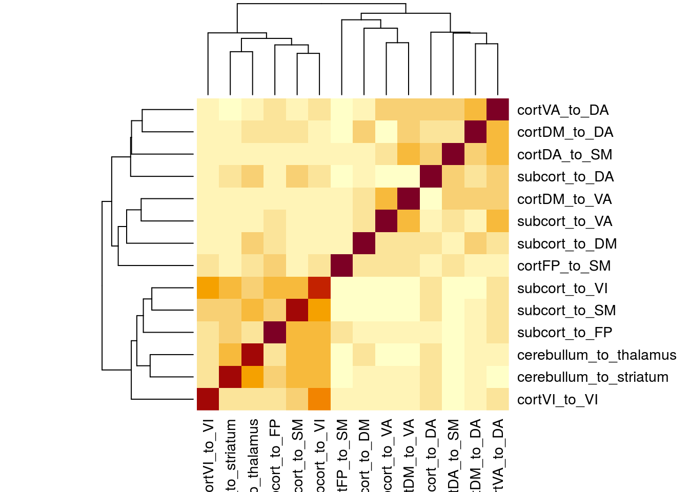

```r
wFC_corrs <- with_wFC1 %>%
   ungroup() %>%
  filter(vertex_type == "pvertex", 
         dx == "CTRL") %>%
  select(subject, dataset, edge_group, wFC_score) %>%
  spread(edge_group, wFC_score) %>%
  select(-subject, -dataset) %>%
  cor(.)
heatmap(abs(wFC_corrs))
```

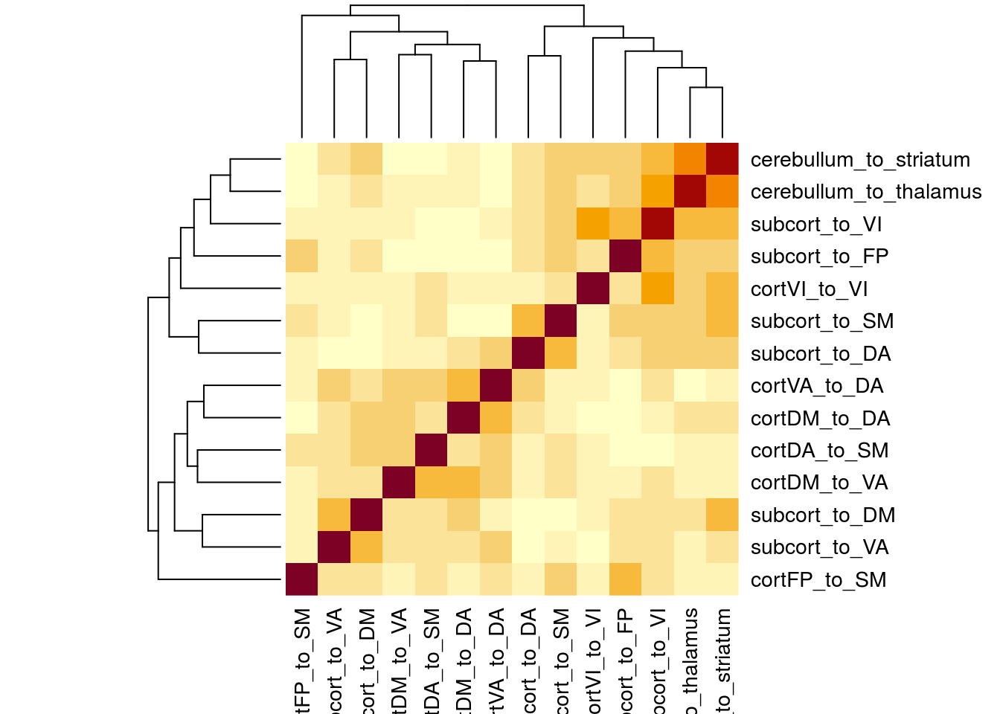


```r
wFC_corrs <- with_wFC1 %>%
   ungroup() %>%
  filter(vertex_type == "pvertex") %>%
  select(subject, dataset, edge_group, wFC_score) %>%
  spread(edge_group, wFC_score) %>%
  select(-subject, -dataset) %>%
  cor(.)
heatmap(abs(wFC_corrs))
```

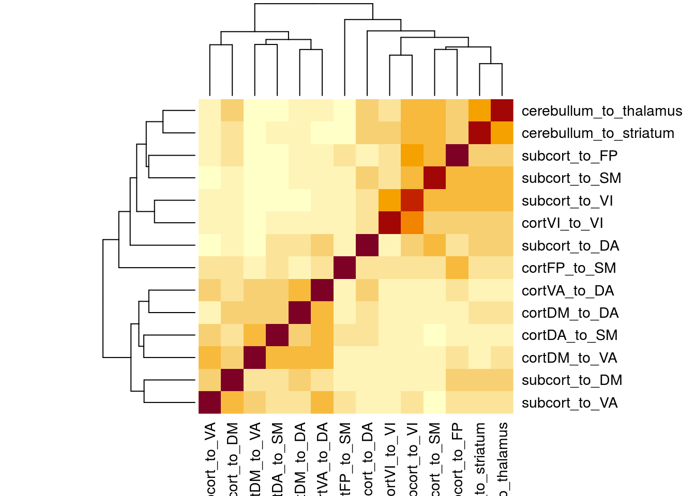


```r
wFC_corrs <- with_wFC1 %>%
   ungroup() %>%
  filter(vertex_type == "tvertex") %>%
  select(subject, dataset, edge_group, wFC_score) %>%
  spread(edge_group, wFC_score) %>%
  select(-subject, -dataset) %>%
  cor(.)
heatmap(abs(wFC_corrs))
```

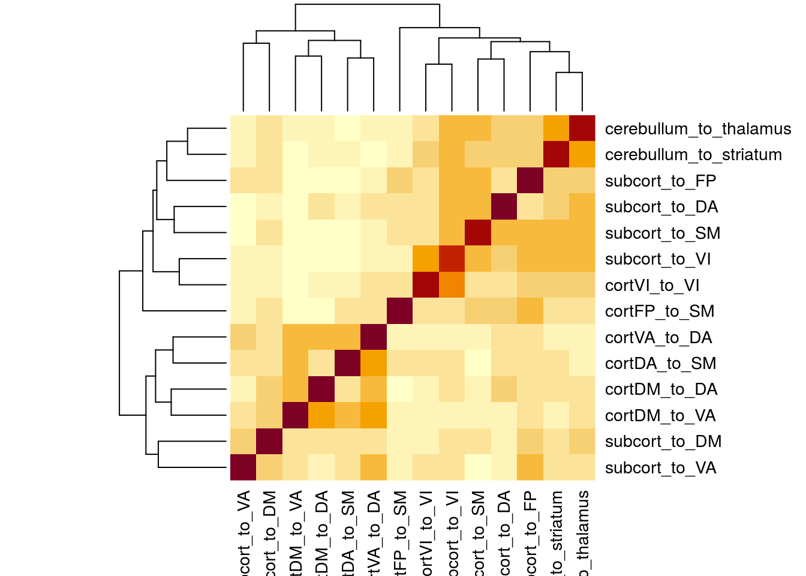


```r
wFC_corrs <- with_wFC1 %>%
   ungroup() %>%
  filter(vertex_type == "tvolume") %>%
  select(subject, dataset, edge_group, wFC_score) %>%
  spread(edge_group, wFC_score) %>%
  select(-subject, -dataset) %>%
  cor(.)
heatmap(abs(wFC_corrs))
```

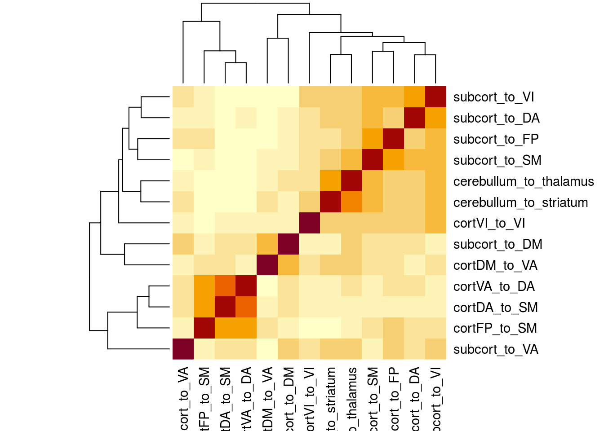


```r
library(cowplot)
```

```
## 
## ********************************************************
```

```
## Note: As of version 1.0.0, cowplot does not change the
```

```
##   default ggplot2 theme anymore. To recover the previous
```

```
##   behavior, execute:
##   theme_set(theme_cowplot())
```

```
## ********************************************************
```

```r
# Marginal densities along x axis
plot_greyred_scatter_elipsed <- function(df, x, y, color) {
  #the tidy eval ness
  xvar <- enquo(x)
  yvar <- enquo(y)
  colorvar <- enquo(color)
  # make the main scatte bit using above
  main_scatter <-  ggplot(data = df, 
               aes(x = !!xvar, y = !!yvar, color = !!colorvar)) +
  geom_point(alpha = 0.7, size = 1) +
  geom_smooth(method = "lm") +
  #stat_ellipse() +
  theme_bw() +
  scale_color_manual(values = c("grey20","red"))

  xdens <- axis_canvas(main_scatter, axis = "x")+
    geom_density(data = df, aes(x = !!xvar, fill = !!colorvar),
              alpha = 0.5, size = 0.2) +
    scale_fill_manual(values = c("grey20","red"))

  ydens <- axis_canvas(main_scatter, axis = "y", coord_flip = TRUE)+
    geom_density(data = df, aes(x = !!yvar, fill = !!colorvar),
                alpha = 0.5, size = 0.2) +
  scale_fill_manual(values = c("grey20","red")) +
  coord_flip()
  
  #putting the peices together
  p1 <- insert_xaxis_grob(main_scatter, xdens, grid::unit(.2, "null"), position = "top")
  p2<- insert_yaxis_grob(p1, ydens, grid::unit(.2, "null"), position = "right")
  return(p2)
}
```


```r
with_wFC1 %>%
  ungroup() %>%
  select(subject, dataset, dx) %>%
  distinct() %>%
  count(dx)
```

```
## # A tibble: 2 x 2
##   dx        n
##   <chr> <int>
## 1 CTRL    203
## 2 SSD     203
```


```r
plt <- with_wFC1 %>%
  ungroup() %>%
  select(subject, dataset, dx, vertex_type, edge_group, wFC_score) %>%
  filter(vertex_type=="pvertex") %>%
  spread(edge_group, wFC_score) %>%
  plot_greyred_scatter_elipsed(subcort_to_VI, subcort_to_FP, dx)
```

```
## `geom_smooth()` using formula 'y ~ x'
## `geom_smooth()` using formula 'y ~ x'
## `geom_smooth()` using formula 'y ~ x'
```

```r
ggdraw(plt)  
```

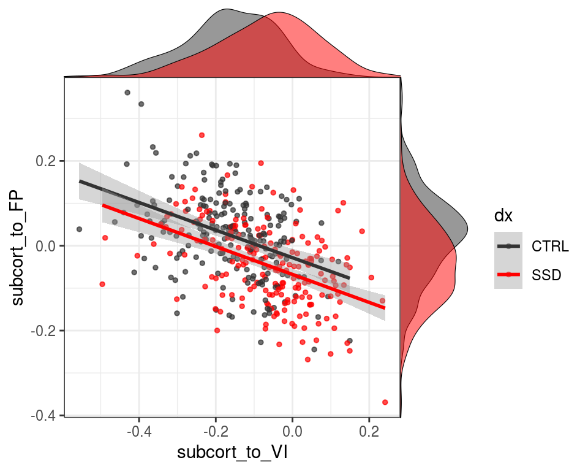

```r
plt <- with_wFC1 %>%
  ungroup() %>%
  select(subject, dataset, dx, vertex_type, edge_group, wFC_score) %>%
  filter(vertex_type=="tvertex") %>%
  spread(edge_group, wFC_score) %>%
  plot_greyred_scatter_elipsed(subcort_to_VI, subcort_to_FP, dx)
```

```
## `geom_smooth()` using formula 'y ~ x'
## `geom_smooth()` using formula 'y ~ x'
## `geom_smooth()` using formula 'y ~ x'
```

```r
ggdraw(plt)  
```

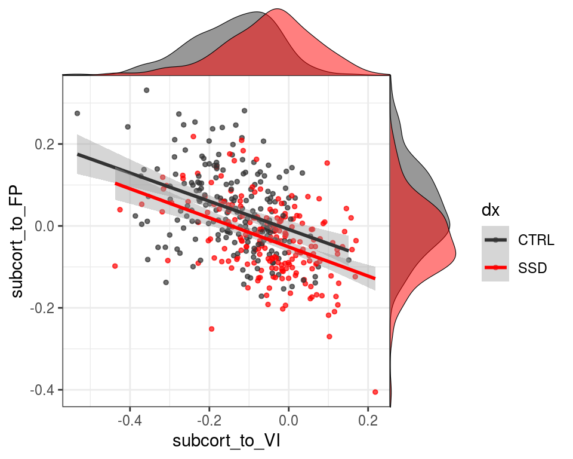


```r
plt <- with_wFC1 %>%
  ungroup() %>%
  select(subject, dataset, dx, vertex_type, edge_group, wFC_score) %>%
  filter(vertex_type=="tvolume") %>%
  spread(edge_group, wFC_score) %>%
  plot_greyred_scatter_elipsed(subcort_to_VI, subcort_to_FP, dx)
```

```
## `geom_smooth()` using formula 'y ~ x'
## `geom_smooth()` using formula 'y ~ x'
## `geom_smooth()` using formula 'y ~ x'
```

```r
ggdraw(plt)  
```

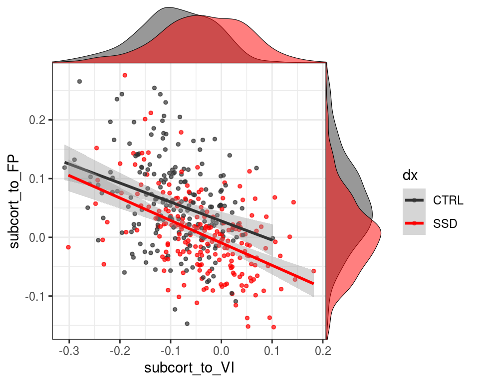


```r
with_wFC1 %>%
  filter(Site %in% c("CMH", "COBRE"),
         dx == "SSD",
         wtar_std < 900) %>%
  filter(edge_group %in% c("subcort_to_VI")) %>%
  ggplot(aes(x = wtar_std, y = wFC_score, color = Site)) +
  geom_point() +
  geom_smooth(method = "lm") +
  scale_color_manual(values = c("tomato3", "orangered3")) +
  facet_grid(edge_group~vertex_type, scales = "free_x") +
  theme_bw()
```

```
## `geom_smooth()` using formula 'y ~ x'
```

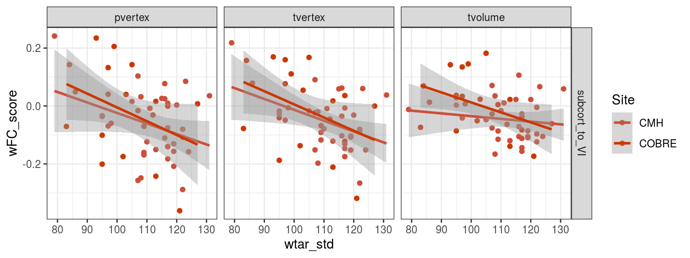

```r
with_wFC1 %>%
  filter(Site %in% c("CMH", "COBRE"),
         dx == "SSD",
         wtar_std < 900) %>%
  filter(edge_group %in% c("subcort_to_FP")) %>%
  ggplot(aes(x = wtar_std, y = wFC_score, color = Site)) +
  geom_point() +
  geom_smooth(method = "lm") +
  scale_color_manual(values = c("tomato3", "orangered3")) +
  facet_grid(edge_group~vertex_type, scales = "free_x") +
  theme_bw()
```

```
## `geom_smooth()` using formula 'y ~ x'
```

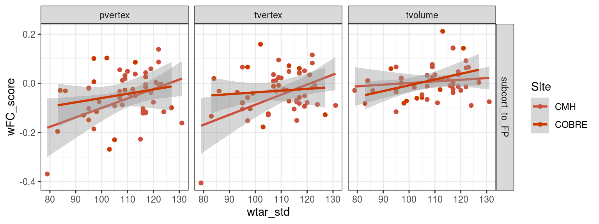

```r
with_wFC1 %>%
  filter(Site %in% c("CMH", "COBRE"),
         dx == "SSD",
         wtar_std < 900) %>%
  filter(edge_group %in% c("subcort_to_DA")) %>%
  ggplot(aes(x = wtar_std, y = wFC_score_cliped, color = Site)) +
  geom_point() +
  geom_smooth(method = "lm") +
  facet_grid(edge_group~vertex_type, scales = "free_x")
```

```
## `geom_smooth()` using formula 'y ~ x'
```

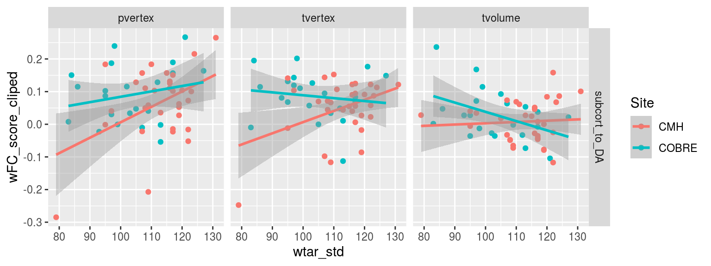


```r
with_wFC1 %>%
  filter(Site %in% c("CMH", "COBRE"),
         dx == "SSD") %>%
  filter(edge_group %in% c("subcort_to_DA")) %>%
  ggplot(aes(x = panss_total_calc, y = wFC_score, color = Site)) +
  geom_point() +
  geom_smooth(method = "lm") +
  facet_grid(edge_group~vertex_type, scales = "free_x")
```

```
## `geom_smooth()` using formula 'y ~ x'
```

```
## Warning: Removed 159 rows containing non-finite values (stat_smooth).
```

```
## Warning: Removed 159 rows containing missing values (geom_point).
```

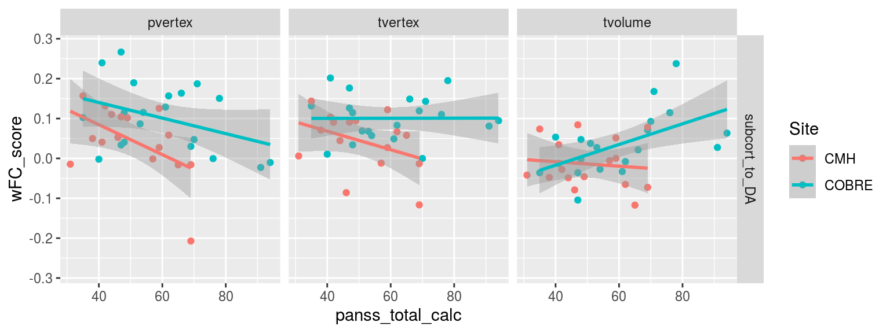


```r
wf1_edgegroup_num <- unique(with_wFC1$edge_group) %>% length()
wtar_panss_models_lm_glance <- with_wFC1 %>%
  filter(Site %in% c("CMH", "COBRE"),
         dx == "SSD") %>%
  gather(clinical_measure, clinical_score, wtar_std, panss_total_calc) %>%
  filter(clinical_score < 900) %>%
  group_by(edge_group, effect_direction, vertex_type, clinical_measure) %>%
  do(glance(lm(wFC_score_cliped ~ clinical_score + Site, data = .))) 

wtar_panss_models_tidylm <- with_wFC1 %>%
  filter(Site %in% c("CMH", "COBRE"),
         dx == "SSD") %>%
  gather(clinical_measure, clinical_score, wtar_std, panss_total_calc) %>%
  filter(clinical_score < 900) %>%
  group_by(edge_group, effect_direction, vertex_type, clinical_measure) %>%
  do(tidy(lm(wFC_score_cliped ~ clinical_score + Site, data = .))) %>%
  filter(term == "clinical_score") %>%
  mutate(p_bonf = p.value*wf1_edgegroup_num)
  
wtar_panss_models_tidylm %>% 
  arrange(p.value) %>%
  select(vertex_type, clinical_measure, edge_group, statistic, p.value, p_bonf) %>% knitr::kable()
```

```
## Adding missing grouping variables: `effect_direction`
```


effect_direction   vertex_type   clinical_measure   edge_group                 statistic     p.value       p_bonf
-----------------  ------------  -----------------  -----------------------  -----------  ----------  -----------
hyper              tvertex       wtar_std           subcort_to_VI             -3.1666703   0.0026030    0.0364423
hyper              tvertex       wtar_std           cortVA_to_DA              -2.7271116   0.0087387    0.1223415
hyper              pvertex       wtar_std           subcort_to_DM              2.7247498   0.0087933    0.1231059
hyper              tvolume       wtar_std           subcort_to_SM             -2.7138753   0.0090488    0.1266826
hyper              pvertex       wtar_std           subcort_to_VI             -2.6713339   0.0101151    0.1416114
hyper              pvertex       wtar_std           subcort_to_DA              2.6704410   0.0101387    0.1419414
hyper              pvertex       panss_total_calc   subcort_to_DA             -2.7194728   0.0103458    0.1448417
hyper              tvertex       wtar_std           subcort_to_SM             -2.3729272   0.0214552    0.3003727
hyper              pvertex       panss_total_calc   subcort_to_VI              2.4033245   0.0220260    0.3083640
hyper              pvertex       panss_total_calc   subcort_to_DM             -2.2245533   0.0330643    0.4629003
hypo               pvertex       wtar_std           subcort_to_FP              2.1834932   0.0336255    0.4707566
hyper              tvertex       panss_total_calc   subcort_to_VI              2.1724716   0.0371039    0.5194548
hyper              tvolume       wtar_std           subcort_to_VI             -2.1309866   0.0379324    0.5310541
hyper              tvolume       panss_total_calc   subcort_to_DA              2.0936723   0.0440523    0.6167321
hypo               tvertex       wtar_std           subcort_to_FP              1.8638952   0.0680978    0.9533697
hypo               tvolume       wtar_std           subcort_to_FP              1.8384031   0.0718299    1.0056182
hyper              pvertex       wtar_std           cortVA_to_DA              -1.8105945   0.0760963    1.0653481
hyper              tvolume       wtar_std           subcort_to_DM              1.7720684   0.0823569    1.1529971
hypo               tvertex       panss_total_calc   cortDM_to_VA               1.7005000   0.0984442    1.3782194
hyper              tvolume       panss_total_calc   subcort_to_VI              1.6829983   0.1018147    1.4254057
hyper              tvolume       wtar_std           cortFP_to_SM               1.5617584   0.1245295    1.7434125
hypo               tvertex       panss_total_calc   subcort_to_FP              1.5318168   0.1350992    1.8913885
hyper              pvertex       panss_total_calc   subcort_to_SM              1.5178764   0.1385684    1.9399580
hyper              pvertex       wtar_std           subcort_to_SM             -1.4834436   0.1441106    2.0175490
hyper              tvolume       panss_total_calc   subcort_to_DM             -1.4172511   0.1657824    2.3209532
hyper              tvertex       wtar_std           subcort_to_DA              1.3467294   0.1840219    2.5763065
hyper              tvertex       panss_total_calc   subcort_to_SM              1.3500186   0.1861977    2.6067679
hyper              tvolume       wtar_std           subcort_to_DA             -1.3216427   0.1921853    2.6905949
hypo               tvertex       wtar_std           cortVI_to_VI               1.3077243   0.1968312    2.7556372
hypo               tvertex       wtar_std           cortDM_to_VA               1.2841926   0.2048778    2.8682896
hypo               pvertex       wtar_std           cerebullum_to_thalamus    -1.2381911   0.2213147    3.0984060
hypo               tvertex       wtar_std           cerebullum_to_thalamus    -1.2381911   0.2213147    3.0984060
hypo               tvolume       wtar_std           cerebullum_to_thalamus    -1.2381911   0.2213147    3.0984060
hypo               pvertex       panss_total_calc   subcort_to_FP              1.2290254   0.2277544    3.1885616
hyper              tvertex       panss_total_calc   cortFP_to_SM               1.2251834   0.2291793    3.2085099
hypo               pvertex       panss_total_calc   cerebullum_to_thalamus     1.2121707   0.2340546    3.2767646
hypo               tvertex       panss_total_calc   cerebullum_to_thalamus     1.2121707   0.2340546    3.2767646
hypo               tvolume       panss_total_calc   cerebullum_to_thalamus     1.2121707   0.2340546    3.2767646
hyper              pvertex       panss_total_calc   cortFP_to_SM               1.1883428   0.2431805    3.4045265
hyper              tvertex       panss_total_calc   subcort_to_DM             -1.1601095   0.2543288    3.5606036
hyper              tvertex       wtar_std           subcort_to_DM             -1.0710948   0.2891696    4.0483740
hypo               pvertex       wtar_std           cortDM_to_VA               1.0635149   0.2925583    4.0958166
hyper              tvolume       panss_total_calc   cortFP_to_SM               1.0660013   0.2941605    4.1182467
hyper              tvolume       wtar_std           cortDA_to_SM               1.0439642   0.3014252    4.2199533
hypo               pvertex       wtar_std           cortVI_to_VI               1.0118550   0.3163840    4.4293763
hypo               tvolume       panss_total_calc   cortVI_to_VI              -0.9645574   0.3417822    4.7849505
hyper              pvertex       panss_total_calc   cortDA_to_SM              -0.9363104   0.3559154    4.9828156
hyper              tvertex       panss_total_calc   subcort_to_DA             -0.9195921   0.3644594    5.1024316
hypo               tvertex       wtar_std           subcort_to_VA              0.8735671   0.3864489    5.4102845
hypo               pvertex       panss_total_calc   cortDM_to_VA               0.8685183   0.3913834    5.4793683
hypo               tvolume       panss_total_calc   subcort_to_FP              0.8104418   0.4234926    5.9288964
hypo               tvertex       panss_total_calc   cortDM_to_DA               0.8052312   0.4264503    5.9703043
hypo               tvertex       panss_total_calc   cortVI_to_VI              -0.7721785   0.4455038    6.2370535
hypo               tvolume       panss_total_calc   subcort_to_VA              0.7461782   0.4608426    6.4517971
hypo               tvolume       wtar_std           cortVI_to_VI               0.7122753   0.4795403    6.7135645
hypo               pvertex       panss_total_calc   cortDM_to_DA               0.6819499   0.5000294    7.0004115
hypo               tvolume       panss_total_calc   cortDM_to_VA               0.6783945   0.5022514    7.0315198
hyper              tvertex       panss_total_calc   cortVA_to_DA              -0.6705380   0.5071809    7.1005325
hypo               tvolume       wtar_std           cortDM_to_VA              -0.6490472   0.5192202    7.2690827
hyper              tvertex       panss_total_calc   cortDA_to_SM              -0.6384402   0.5275935    7.3863086
hyper              tvolume       panss_total_calc   cortDA_to_SM               0.6175770   0.5410928    7.5752989
hypo               pvertex       panss_total_calc   subcort_to_VA              0.6151627   0.5426665    7.5973310
hyper              tvolume       panss_total_calc   subcort_to_SM              0.5555273   0.5822809    8.1519328
hyper              tvolume       panss_total_calc   cortVA_to_DA               0.5414143   0.5918588    8.2860236
hypo               pvertex       wtar_std           subcort_to_VA              0.5247893   0.6020036    8.4280498
hypo               tvertex       wtar_std           cortDM_to_DA               0.5112138   0.6114076    8.5597060
hyper              pvertex       panss_total_calc   cortVA_to_DA               0.5112853   0.6125554    8.5757760
hypo               pvertex       panss_total_calc   cortVI_to_VI              -0.5004723   0.6200641    8.6808975
hyper              pvertex       wtar_std           cortFP_to_SM               0.4582548   0.6487161    9.0820259
hyper              pvertex       wtar_std           cortDA_to_SM              -0.4547267   0.6512356    9.1172981
hypo               tvolume       wtar_std           subcort_to_VA              0.4040479   0.6878669    9.6301365
hypo               pvertex       wtar_std           cerebullum_to_striatum    -0.3960070   0.6937518    9.7125256
hypo               tvertex       wtar_std           cerebullum_to_striatum    -0.3960070   0.6937518    9.7125256
hypo               tvolume       wtar_std           cerebullum_to_striatum    -0.3960070   0.6937518    9.7125256
hyper              tvertex       wtar_std           cortFP_to_SM              -0.3005344   0.7649913   10.7098782
hyper              tvolume       wtar_std           cortVA_to_DA              -0.2783227   0.7818900   10.9464594
hypo               tvertex       panss_total_calc   subcort_to_VA             -0.2423695   0.8099939   11.3399145
hypo               pvertex       wtar_std           cortDM_to_DA              -0.2363828   0.8140825   11.3971550
hypo               pvertex       panss_total_calc   cerebullum_to_striatum     0.0468992   0.9628762   13.4802670
hypo               tvertex       panss_total_calc   cerebullum_to_striatum     0.0468992   0.9628762   13.4802670
hypo               tvolume       panss_total_calc   cerebullum_to_striatum     0.0468992   0.9628762   13.4802670
hyper              tvertex       wtar_std           cortDA_to_SM              -0.0163268   0.9870374   13.8185235


```r
with_wFC1 %>%
  filter(Site %in% c("CMH", "ds000030_R1.0.5", "ZHH"),
         dx == "SSD") %>%
  gather(clinical_measure, clinical_score, starts_with("sans")) %>%
  group_by(edge_group, effect_direction, clinical_measure, vertex_type) %>%
  do(tidy(lm(wFC_score_cliped ~ clinical_score + Site, data = .))) %>%
  filter(term == "clinical_score") %>%
  mutate(p_bonf = p.value*wf1_edgegroup_num) %>%
  arrange(p.value) %>%
  select(clinical_measure, edge_group, statistic, p.value, p_bonf) %>%
  knitr::kable()
```

```
## Adding missing grouping variables: `effect_direction`, `vertex_type`
```


effect_direction   vertex_type   clinical_measure   edge_group                 statistic     p.value       p_bonf
-----------------  ------------  -----------------  -----------------------  -----------  ----------  -----------
hyper              tvolume       sans_G_total       subcort_to_SM              2.4875045   0.0151812    0.2125373
hyper              tvertex       sans_G_total       subcort_to_VI              1.9361643   0.0567734    0.7948275
hyper              tvolume       sans_G_total       subcort_to_VI              1.6589897   0.1014682    1.4205543
hypo               pvertex       sans_G_total       subcort_to_FP             -1.5420567   0.1274438    1.7842127
hyper              pvertex       sans_G_total       subcort_to_VI              1.4954325   0.1391720    1.9484085
hypo               tvertex       sans_G_total       subcort_to_FP             -1.3845077   0.1704790    2.3867056
hypo               pvertex       sans_G_total       cortDM_to_DA               1.3566622   0.1791272    2.5077802
hyper              tvertex       sans_G_total       subcort_to_SM              1.3213395   0.1905718    2.6680056
hypo               pvertex       sans_G_total       cerebullum_to_striatum    -1.2631091   0.2106251    2.9487514
hypo               tvertex       sans_G_total       cerebullum_to_striatum    -1.2631091   0.2106251    2.9487514
hypo               tvolume       sans_G_total       cerebullum_to_striatum    -1.2631091   0.2106251    2.9487514
hyper              tvolume       sans_G_total       subcort_to_DM             -1.2564700   0.2130070    2.9820980
hyper              pvertex       sans_G_total       subcort_to_SM              1.1152238   0.2684631    3.7584831
hypo               tvertex       sans_G_total       cortDM_to_VA               1.0769370   0.2851036    3.9914506
hypo               pvertex       sans_G_total       cortDM_to_VA               0.9085618   0.3666127    5.1325774
hypo               tvolume       sans_G_total       cortVI_to_VI              -0.8494696   0.3984358    5.5781011
hypo               tvolume       sans_G_total       cortDM_to_VA               0.8469926   0.3998059    5.5972821
hyper              tvertex       sans_G_total       subcort_to_DA              0.8406224   0.4033425    5.6467952
hypo               tvertex       sans_G_total       cortDM_to_DA               0.7515310   0.4547827    6.3669579
hyper              tvolume       sans_G_total       cortDA_to_SM              -0.6656902   0.5077362    7.1083072
hyper              tvertex       sans_G_total       subcort_to_DM             -0.6173409   0.5389574    7.5454041
hyper              tvolume       sans_G_total       cortVA_to_DA               0.5886788   0.5579191    7.8108669
hyper              tvertex       sans_G_total       cortFP_to_SM               0.5866619   0.5592658    7.8297209
hypo               tvolume       sans_G_total       subcort_to_FP             -0.5531700   0.5818606    8.1460489
hyper              pvertex       sans_G_total       subcort_to_DM             -0.5513937   0.5830710    8.1629947
hypo               pvertex       sans_G_total       cerebullum_to_thalamus    -0.4918904   0.6242932    8.7401049
hypo               tvertex       sans_G_total       cerebullum_to_thalamus    -0.4918904   0.6242932    8.7401049
hypo               tvolume       sans_G_total       cerebullum_to_thalamus    -0.4918904   0.6242932    8.7401049
hyper              tvolume       sans_G_total       subcort_to_DA              0.4639754   0.6440652    9.0169122
hyper              tvolume       sans_G_total       cortFP_to_SM               0.3917039   0.6964340    9.7500756
hypo               tvertex       sans_G_total       cortVI_to_VI              -0.3713528   0.7114653    9.9605141
hypo               tvertex       sans_G_total       subcort_to_VA             -0.3607271   0.7193597   10.0710353
hyper              pvertex       sans_G_total       cortVA_to_DA              -0.2835217   0.7775906   10.8862682
hyper              tvertex       sans_G_total       cortDA_to_SM              -0.2763748   0.7830520   10.9627283
hyper              tvertex       sans_G_total       cortVA_to_DA              -0.2570921   0.7978410   11.1697734
hypo               tvolume       sans_G_total       subcort_to_VA              0.2160165   0.8295857   11.6141998
hyper              pvertex       sans_G_total       cortDA_to_SM               0.0771662   0.9387054   13.1418755
hypo               pvertex       sans_G_total       cortVI_to_VI               0.0623462   0.9504599   13.3064390
hypo               pvertex       sans_G_total       subcort_to_VA              0.0336562   0.9732445   13.6254223
hyper              pvertex       sans_G_total       cortFP_to_SM              -0.0058626   0.9953386   13.9347401
hyper              pvertex       sans_G_total       subcort_to_DA              0.0003958   0.9996853   13.9955939


```r
with_wFC1 %>%
  filter(Site %in% c("CMH", "ds000030_R1.0.5", "ZHH"),
         dx == "SSD") %>%
  filter(edge_group %in% c("cortDA_to_SM")) %>%
  ggplot(aes(x = sans_G_total, y = wFC_score_cliped, color = Site)) +
  geom_point() +
  geom_smooth(method = "lm") +
  facet_grid(edge_group~vertex_type, scales = "free_y")
```

```
## `geom_smooth()` using formula 'y ~ x'
```

```
## Warning: Removed 315 rows containing non-finite values (stat_smooth).
```

```
## Warning: Removed 315 rows containing missing values (geom_point).
```

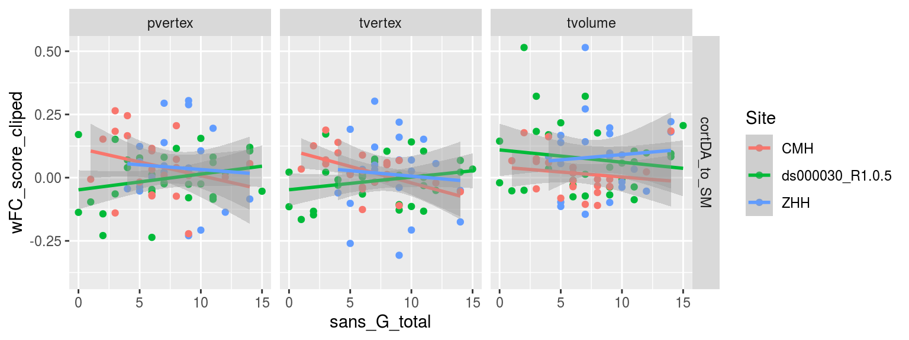


```r
weighted_subject_scores %>%
  inner_join(pheno, by = c("subject", "dataset")) %>%
  filter(Site == "ZHH") %>%
  filter(effect_direction == "hypo") %>% 
  drop_na(isFEP) %>%
  ggplot(aes(x = isFEP, y = wFC_score)) +
  geom_boxplot() +
  geom_jitter(alpha = 0.3) +
  facet_grid(vertex_type~edge_group, scales = "free_y")
```

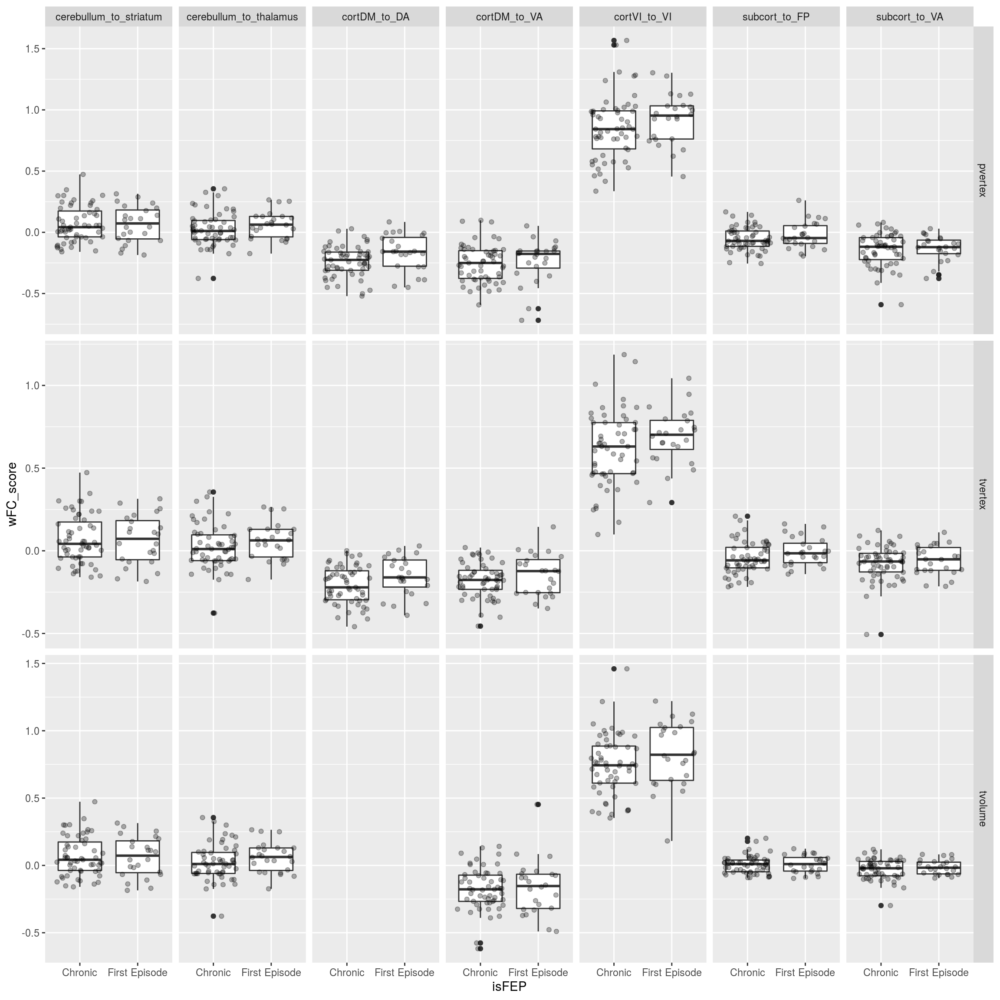


```r
with_wFC1 %>%
  filter(Site == "ZHH") %>%
  drop_na(isFEP) %>%
  group_by(edge_group, vertex_type) %>%
  do(tidy(lm(wFC_score ~ isFEP, data = .))) %>%
  mutate(p_bonf = p.value*wf1_edgegroup_num) %>%
  arrange(p.value) %>%
  filter(term != "(Intercept)") %>%
  select(term, statistic, p.value, p_bonf) %>%
  knitr::kable()
```

```
## Adding missing grouping variables: `edge_group`, `vertex_type`
```


edge_group               vertex_type   term                   statistic     p.value       p_bonf
-----------------------  ------------  -------------------  -----------  ----------  -----------
subcort_to_SM            tvertex       isFEPFirst Episode    -2.6405907   0.0100164    0.1402297
cortDM_to_DA             pvertex       isFEPFirst Episode     2.2511570   0.0272276    0.3811862
cortVA_to_DA             tvertex       isFEPFirst Episode    -2.1895579   0.0315849    0.4421887
subcort_to_DA            tvolume       isFEPFirst Episode    -2.0129989   0.0476103    0.6665440
cortDM_to_DA             tvertex       isFEPFirst Episode     2.0123142   0.0476840    0.6675762
subcort_to_SM            tvolume       isFEPFirst Episode    -1.9971661   0.0493404    0.6907651
subcort_to_SM            pvertex       isFEPFirst Episode    -1.8311440   0.0709473    0.9932626
cortDA_to_SM             tvertex       isFEPFirst Episode    -1.7232492   0.0888571    1.2440000
subcort_to_FP            tvertex       isFEPFirst Episode     1.7153858   0.0902962    1.2641469
cortVI_to_VI             tvertex       isFEPFirst Episode     1.4329237   0.1559274    2.1829832
cortVI_to_VI             tvolume       isFEPFirst Episode     1.3887084   0.1689254    2.3649560
cortVA_to_DA             pvertex       isFEPFirst Episode    -1.3827028   0.1707530    2.3905427
subcort_to_FP            pvertex       isFEPFirst Episode     1.3797789   0.1716483    2.4030763
cortDM_to_VA             tvertex       isFEPFirst Episode     1.2644526   0.2098816    2.9383423
cortFP_to_SM             tvolume       isFEPFirst Episode     1.2363413   0.2200897    3.0812565
cortVI_to_VI             pvertex       isFEPFirst Episode     1.1626214   0.2485738    3.4800332
cortDA_to_SM             tvolume       isFEPFirst Episode     1.1427171   0.2566968    3.5937547
cerebullum_to_thalamus   pvertex       isFEPFirst Episode     1.1146888   0.2684509    3.7583132
cerebullum_to_thalamus   tvertex       isFEPFirst Episode     1.1146888   0.2684509    3.7583132
cerebullum_to_thalamus   tvolume       isFEPFirst Episode     1.1146888   0.2684509    3.7583132
subcort_to_DM            tvolume       isFEPFirst Episode    -1.0782146   0.2843042    3.9802588
subcort_to_VA            tvolume       isFEPFirst Episode     0.8923195   0.3750018    5.2500259
cortVA_to_DA             tvolume       isFEPFirst Episode     0.8826961   0.3801480    5.3220716
subcort_to_VI            pvertex       isFEPFirst Episode    -0.8662518   0.3890433    5.4466062
subcort_to_DM            tvertex       isFEPFirst Episode    -0.8029066   0.4245001    5.9430019
subcort_to_VI            tvertex       isFEPFirst Episode    -0.7936549   0.4298354    6.0176954
subcort_to_VA            tvertex       isFEPFirst Episode     0.7446093   0.4587745    6.4228429
subcort_to_DM            pvertex       isFEPFirst Episode    -0.6751904   0.5015774    7.0220830
cortFP_to_SM             tvertex       isFEPFirst Episode     0.6617081   0.5101337    7.1418718
cortDA_to_SM             pvertex       isFEPFirst Episode    -0.6299691   0.5305798    7.4281176
subcort_to_VI            tvolume       isFEPFirst Episode    -0.5730642   0.5682711    7.9557948
cortDM_to_VA             pvertex       isFEPFirst Episode     0.4415407   0.6600591    9.2408276
subcort_to_VA            pvertex       isFEPFirst Episode     0.3116628   0.7561391   10.5859477
cortFP_to_SM             pvertex       isFEPFirst Episode     0.3103486   0.7571343   10.5998804
subcort_to_DA            pvertex       isFEPFirst Episode     0.3072207   0.7595047   10.6330663
cortDM_to_VA             tvolume       isFEPFirst Episode     0.2816198   0.7789905   10.9058671
subcort_to_FP            tvolume       isFEPFirst Episode     0.2156699   0.8298154   11.6174149
subcort_to_DA            tvertex       isFEPFirst Episode    -0.1936623   0.8469503   11.8573037
cerebullum_to_striatum   pvertex       isFEPFirst Episode    -0.1021152   0.9189307   12.8650294
cerebullum_to_striatum   tvertex       isFEPFirst Episode    -0.1021152   0.9189307   12.8650294
cerebullum_to_striatum   tvolume       isFEPFirst Episode    -0.1021152   0.9189307   12.8650294

### refit the models with Education included


```r
refit_w_edu_pooled_glance <- with_wFC1 %>%
  inner_join(pheno, by = c("subject","dataset")) %>%
  filter(in_matched_sample) %>%
  group_by(edge_group, vertex_type) %>%
  do(glance(lm(wFC_score ~ DX + Age_match_pt + Sex + fd_mean_match_pt + Site.x + Edu, data = .))) %>%
  select(edge_group, vertex_type, df.residual) %>%
  distinct()

refit_w_edu_pooled_tidy <- with_wFC1 %>%
  inner_join(pheno, by = c("subject","dataset")) %>%
  filter(in_matched_sample) %>%
  group_by(edge_group, vertex_type) %>%
  do(tidy(lm(wFC_score ~ DX + Age_match_pt + Sex + fd_mean_match_pt + Site.x + Edu, data = .))) %>%
  mutate(p_bonf = p.value*wf1_edgegroup_num) 

refit_w_edu_pooled <- refit_w_edu_pooled_glance %>% 
  select(edge_group, vertex_type, `df.residual`) %>%
  distinct() %>%
  inner_join(refit_w_edu_pooled_tidy, by = c("vertex_type", "edge_group")) %>%
  mutate(Site = "pooled") %>%
  mutate(
      beta = specify_decimal(estimate,2),
      beta_se = specify_decimal(std.error,2),
      t_stat = specify_decimal(statistic,2),
      pval_str = ifelse(p_bonf < 0.001, 
                           format(p_bonf, scientific = TRUE, digits = 2),
                           specify_decimal(p_bonf,3)),
      pval_str = ifelse(p_bonf > 0.10, "ns", pval_str),
      report_str = str_glue("beta(SE)={beta}({beta_se}), t({df.residual})={t_stat}, p={pval_str}")) %>%
    filter(term == "DXSSD") %>%
    select(edge_group, vertex_type, report_str) %>%
    spread(vertex_type, report_str)

refit_w_edu_pooled %>% knitr::kable()
```


edge_group               pvertex                                         tvertex                                         tvolume                                       
-----------------------  ----------------------------------------------  ----------------------------------------------  ----------------------------------------------
cerebullum_to_striatum   beta(SE)=-0.08(0.02), t(336)=-4.78, p=3.7e-05   beta(SE)=-0.08(0.02), t(336)=-4.78, p=3.7e-05   beta(SE)=-0.08(0.02), t(336)=-4.78, p=3.7e-05 
cerebullum_to_thalamus   beta(SE)=-0.11(0.02), t(336)=-6.47, p=4.9e-09   beta(SE)=-0.11(0.02), t(336)=-6.47, p=4.9e-09   beta(SE)=-0.11(0.02), t(336)=-6.47, p=4.9e-09 
cortDA_to_SM             beta(SE)=0.10(0.02), t(336)=5.54, p=8.3e-07     beta(SE)=0.09(0.02), t(336)=5.92, p=1.1e-07     beta(SE)=0.09(0.02), t(336)=4.30, p=3.2e-04   
cortDM_to_DA             beta(SE)=-0.08(0.02), t(336)=-5.03, p=1.1e-05   beta(SE)=-0.08(0.01), t(336)=-5.84, p=1.7e-07   NA                                            
cortDM_to_VA             beta(SE)=-0.11(0.02), t(336)=-5.67, p=4.4e-07   beta(SE)=-0.10(0.01), t(336)=-7.04, p=1.5e-10   beta(SE)=-0.13(0.02), t(336)=-6.16, p=2.9e-08 
cortFP_to_SM             beta(SE)=0.08(0.02), t(336)=4.33, p=2.8e-04     beta(SE)=0.08(0.01), t(336)=5.14, p=6.4e-06     beta(SE)=0.09(0.02), t(336)=4.01, p=0.001     
cortVA_to_DA             beta(SE)=0.09(0.02), t(336)=4.70, p=5.4e-05     beta(SE)=0.09(0.01), t(336)=6.60, p=2.2e-09     beta(SE)=0.09(0.02), t(336)=5.17, p=5.7e-06   
cortVI_to_VI             beta(SE)=-0.13(0.03), t(336)=-5.01, p=1.2e-05   beta(SE)=-0.12(0.02), t(336)=-5.24, p=4.0e-06   beta(SE)=-0.10(0.03), t(336)=-3.57, p=0.006   
subcort_to_DA            beta(SE)=0.07(0.02), t(336)=3.94, p=0.001       beta(SE)=0.07(0.01), t(336)=4.91, p=2.0e-05     beta(SE)=0.05(0.01), t(336)=4.98, p=1.4e-05   
subcort_to_DM            beta(SE)=0.08(0.01), t(336)=5.39, p=1.9e-06     beta(SE)=0.07(0.01), t(336)=5.31, p=2.8e-06     beta(SE)=0.06(0.01), t(336)=5.23, p=4.2e-06   
subcort_to_FP            beta(SE)=-0.08(0.01), t(336)=-6.26, p=1.6e-08   beta(SE)=-0.08(0.01), t(336)=-6.09, p=4.4e-08   beta(SE)=-0.06(0.01), t(336)=-6.09, p=4.4e-08 
subcort_to_SM            beta(SE)=0.09(0.02), t(336)=5.42, p=1.6e-06     beta(SE)=0.09(0.01), t(336)=6.23, p=1.9e-08     beta(SE)=0.07(0.01), t(336)=6.60, p=2.3e-09   
subcort_to_VA            beta(SE)=-0.08(0.01), t(336)=-5.45, p=1.4e-06   beta(SE)=-0.07(0.01), t(336)=-6.15, p=3.1e-08   beta(SE)=-0.06(0.01), t(336)=-6.73, p=1.0e-09 
subcort_to_VI            beta(SE)=0.09(0.02), t(336)=5.63, p=5.4e-07     beta(SE)=0.08(0.01), t(336)=6.07, p=4.9e-08     beta(SE)=0.06(0.01), t(336)=5.58, p=7.1e-07   

The Site-wise version


```r
refit_w_edu_sitewise_glance <- with_wFC1 %>%
  inner_join(pheno, by = c("subject","dataset")) %>%
  filter(in_matched_sample) %>%
  group_by(edge_group, vertex_type, Site.x) %>%
  do(glance(lm(wFC_score ~ DX + Age_match_pt + Sex + fd_mean_match_pt, data = .))) %>%
  select(edge_group, vertex_type, Site.x, df.residual) %>%
  distinct()

refit_w_edu_sitewise_tidy <- with_wFC1 %>%
  inner_join(pheno, by = c("subject","dataset")) %>%
  filter(in_matched_sample) %>%
  group_by(edge_group, vertex_type, Site.x) %>%
  do(tidy(lm(wFC_score ~ DX + Age_match_pt + Sex + fd_mean_match_pt, data = .))) %>%
  mutate(p_bonf = p.value*wf1_edgegroup_num) 

refit_w_edu_sitewise <- refit_w_edu_sitewise_glance %>% 
  select(edge_group, vertex_type, Site.x, `df.residual`) %>%
  distinct() %>%
  inner_join(refit_w_edu_sitewise_tidy, by = c("vertex_type", "edge_group", "Site.x")) %>%
  mutate(
      beta = specify_decimal(estimate,2),
      beta_se = specify_decimal(std.error,2),
      t_stat = specify_decimal(statistic,2),
      pval_str = ifelse(p_bonf < 0.001, 
                           format(p_bonf, scientific = TRUE, digits = 2),
                           specify_decimal(p_bonf,3)),
      pval_str = ifelse(p_bonf > 0.10, "ns", pval_str),
      report_str = str_glue("beta(SE)={beta}({beta_se}), t({df.residual})={t_stat}, p={pval_str}")) %>%
    filter(term == "DXSSD") %>%
    select(edge_group, vertex_type, Site.x, report_str) %>%
    spread(vertex_type, report_str)

refit_w_edu_sitewise  %>% knitr::kable()
```


edge_group               Site.x            pvertex                                         tvertex                                         tvolume                                       
-----------------------  ----------------  ----------------------------------------------  ----------------------------------------------  ----------------------------------------------
cerebullum_to_striatum   CMH               beta(SE)=-0.10(0.03), t(103)=-3.57, p=0.008     beta(SE)=-0.10(0.03), t(103)=-3.57, p=0.008     beta(SE)=-0.10(0.03), t(103)=-3.57, p=0.008   
cerebullum_to_striatum   COBRE             beta(SE)=-0.08(0.04), t(44)=-1.82, p=ns         beta(SE)=-0.08(0.04), t(44)=-1.82, p=ns         beta(SE)=-0.08(0.04), t(44)=-1.82, p=ns       
cerebullum_to_striatum   ds000030_R1.0.5   beta(SE)=-0.09(0.03), t(57)=-2.96, p=0.062      beta(SE)=-0.09(0.03), t(57)=-2.96, p=0.062      beta(SE)=-0.09(0.03), t(57)=-2.96, p=0.062    
cerebullum_to_striatum   ZHH               beta(SE)=-0.08(0.02), t(182)=-3.40, p=0.011     beta(SE)=-0.08(0.02), t(182)=-3.40, p=0.011     beta(SE)=-0.08(0.02), t(182)=-3.40, p=0.011   
cerebullum_to_thalamus   CMH               beta(SE)=-0.13(0.03), t(103)=-4.62, p=1.6e-04   beta(SE)=-0.13(0.03), t(103)=-4.62, p=1.6e-04   beta(SE)=-0.13(0.03), t(103)=-4.62, p=1.6e-04 
cerebullum_to_thalamus   COBRE             beta(SE)=-0.11(0.04), t(44)=-2.67, p=ns         beta(SE)=-0.11(0.04), t(44)=-2.67, p=ns         beta(SE)=-0.11(0.04), t(44)=-2.67, p=ns       
cerebullum_to_thalamus   ds000030_R1.0.5   beta(SE)=-0.15(0.03), t(57)=-4.73, p=2.1e-04    beta(SE)=-0.15(0.03), t(57)=-4.73, p=2.1e-04    beta(SE)=-0.15(0.03), t(57)=-4.73, p=2.1e-04  
cerebullum_to_thalamus   ZHH               beta(SE)=-0.10(0.02), t(182)=-4.61, p=1.0e-04   beta(SE)=-0.10(0.02), t(182)=-4.61, p=1.0e-04   beta(SE)=-0.10(0.02), t(182)=-4.61, p=1.0e-04 
cortDA_to_SM             CMH               beta(SE)=0.08(0.02), t(103)=3.46, p=0.011       beta(SE)=0.07(0.02), t(103)=3.97, p=0.002       beta(SE)=0.03(0.02), t(103)=1.65, p=ns        
cortDA_to_SM             COBRE             beta(SE)=0.06(0.04), t(44)=1.59, p=ns           beta(SE)=0.03(0.04), t(44)=0.75, p=ns           beta(SE)=0.05(0.04), t(44)=1.29, p=ns         
cortDA_to_SM             ds000030_R1.0.5   beta(SE)=0.02(0.03), t(57)=0.81, p=ns           beta(SE)=0.03(0.02), t(57)=1.08, p=ns           beta(SE)=0.07(0.04), t(57)=1.84, p=ns         
cortDA_to_SM             ZHH               beta(SE)=0.12(0.02), t(182)=4.95, p=2.4e-05     beta(SE)=0.13(0.02), t(182)=6.08, p=9.9e-08     beta(SE)=0.15(0.03), t(182)=4.87, p=3.3e-05   
cortDM_to_DA             CMH               beta(SE)=-0.06(0.03), t(103)=-2.25, p=ns        beta(SE)=-0.08(0.02), t(103)=-3.67, p=0.005     NA                                            
cortDM_to_DA             COBRE             beta(SE)=-0.05(0.05), t(44)=-1.07, p=ns         beta(SE)=-0.07(0.04), t(44)=-1.61, p=ns         NA                                            
cortDM_to_DA             ds000030_R1.0.5   beta(SE)=-0.07(0.03), t(57)=-2.57, p=ns         beta(SE)=-0.07(0.02), t(57)=-2.92, p=0.071      NA                                            
cortDM_to_DA             ZHH               beta(SE)=-0.09(0.02), t(182)=-4.61, p=1.1e-04   beta(SE)=-0.07(0.02), t(182)=-4.01, p=0.001     NA                                            
cortDM_to_VA             CMH               beta(SE)=-0.04(0.03), t(103)=-1.58, p=ns        beta(SE)=-0.07(0.02), t(103)=-3.23, p=0.023     beta(SE)=-0.09(0.03), t(103)=-2.66, p=ns      
cortDM_to_VA             COBRE             beta(SE)=-0.13(0.05), t(44)=-2.76, p=ns         beta(SE)=-0.08(0.04), t(44)=-2.12, p=ns         beta(SE)=-0.16(0.05), t(44)=-3.25, p=0.031    
cortDM_to_VA             ds000030_R1.0.5   beta(SE)=-0.10(0.04), t(57)=-2.65, p=ns         beta(SE)=-0.06(0.03), t(57)=-2.28, p=ns         beta(SE)=-0.12(0.05), t(57)=-2.40, p=ns       
cortDM_to_VA             ZHH               beta(SE)=-0.09(0.02), t(182)=-3.67, p=0.004     beta(SE)=-0.08(0.02), t(182)=-5.13, p=1.0e-05   beta(SE)=-0.07(0.03), t(182)=-2.89, p=0.060   
cortFP_to_SM             CMH               beta(SE)=0.08(0.03), t(103)=3.30, p=0.019       beta(SE)=0.06(0.02), t(103)=3.10, p=0.035       beta(SE)=0.06(0.02), t(103)=2.45, p=ns        
cortFP_to_SM             COBRE             beta(SE)=0.11(0.05), t(44)=2.17, p=ns           beta(SE)=0.10(0.04), t(44)=2.52, p=ns           beta(SE)=0.04(0.04), t(44)=1.18, p=ns         
cortFP_to_SM             ds000030_R1.0.5   beta(SE)=0.04(0.04), t(57)=1.10, p=ns           beta(SE)=0.06(0.03), t(57)=2.12, p=ns           beta(SE)=0.14(0.04), t(57)=3.54, p=0.011      
cortFP_to_SM             ZHH               beta(SE)=0.08(0.02), t(182)=3.25, p=0.019       beta(SE)=0.07(0.02), t(182)=3.94, p=0.002       beta(SE)=0.10(0.03), t(182)=3.22, p=0.021     
cortVA_to_DA             CMH               beta(SE)=0.04(0.03), t(103)=1.27, p=ns          beta(SE)=0.05(0.02), t(103)=2.49, p=ns          beta(SE)=0.04(0.02), t(103)=1.88, p=ns        
cortVA_to_DA             COBRE             beta(SE)=0.06(0.04), t(44)=1.44, p=ns           beta(SE)=0.05(0.03), t(44)=1.67, p=ns           beta(SE)=0.06(0.03), t(44)=1.75, p=ns         
cortVA_to_DA             ds000030_R1.0.5   beta(SE)=0.11(0.02), t(57)=4.63, p=3.0e-04      beta(SE)=0.06(0.02), t(57)=2.71, p=ns           beta(SE)=0.09(0.04), t(57)=2.21, p=ns         
cortVA_to_DA             ZHH               beta(SE)=0.12(0.03), t(182)=4.69, p=7.5e-05     beta(SE)=0.12(0.02), t(182)=6.86, p=1.5e-09     beta(SE)=0.14(0.02), t(182)=5.58, p=1.2e-06   
cortVI_to_VI             CMH               beta(SE)=-0.09(0.04), t(103)=-2.16, p=ns        beta(SE)=-0.12(0.04), t(103)=-3.09, p=0.036     beta(SE)=-0.08(0.04), t(103)=-1.99, p=ns      
cortVI_to_VI             COBRE             beta(SE)=-0.14(0.05), t(44)=-2.74, p=ns         beta(SE)=-0.11(0.05), t(44)=-2.08, p=ns         beta(SE)=-0.14(0.06), t(44)=-2.39, p=ns       
cortVI_to_VI             ds000030_R1.0.5   beta(SE)=-0.03(0.05), t(57)=-0.62, p=ns         beta(SE)=-0.05(0.04), t(57)=-1.11, p=ns         beta(SE)=-0.08(0.06), t(57)=-1.35, p=ns       
cortVI_to_VI             ZHH               beta(SE)=-0.15(0.03), t(182)=-4.26, p=4.7e-04   beta(SE)=-0.15(0.03), t(182)=-4.65, p=8.8e-05   beta(SE)=-0.10(0.03), t(182)=-2.75, p=0.091   
subcort_to_DA            CMH               beta(SE)=0.08(0.02), t(103)=3.40, p=0.014       beta(SE)=0.07(0.02), t(103)=3.56, p=0.008       beta(SE)=0.08(0.02), t(103)=4.65, p=1.4e-04   
subcort_to_DA            COBRE             beta(SE)=0.07(0.04), t(44)=1.54, p=ns           beta(SE)=0.11(0.04), t(44)=2.91, p=0.080        beta(SE)=0.08(0.02), t(44)=3.66, p=0.009      
subcort_to_DA            ds000030_R1.0.5   beta(SE)=0.04(0.03), t(57)=1.23, p=ns           beta(SE)=0.04(0.02), t(57)=1.95, p=ns           beta(SE)=0.03(0.02), t(57)=1.61, p=ns         
subcort_to_DA            ZHH               beta(SE)=0.08(0.02), t(182)=3.44, p=0.010       beta(SE)=0.08(0.02), t(182)=4.71, p=6.8e-05     beta(SE)=0.06(0.01), t(182)=4.33, p=3.4e-04   
subcort_to_DM            CMH               beta(SE)=0.05(0.02), t(103)=2.44, p=ns          beta(SE)=0.07(0.02), t(103)=3.73, p=0.004       beta(SE)=0.05(0.02), t(103)=3.17, p=0.028     
subcort_to_DM            COBRE             beta(SE)=0.07(0.03), t(44)=2.40, p=ns           beta(SE)=0.05(0.03), t(44)=1.74, p=ns           beta(SE)=0.05(0.02), t(44)=2.39, p=ns         
subcort_to_DM            ds000030_R1.0.5   beta(SE)=0.11(0.03), t(57)=4.05, p=0.002        beta(SE)=0.08(0.03), t(57)=2.87, p=0.080        beta(SE)=0.09(0.02), t(57)=4.37, p=7.4e-04    
subcort_to_DM            ZHH               beta(SE)=0.09(0.02), t(182)=5.09, p=1.3e-05     beta(SE)=0.07(0.01), t(182)=4.92, p=2.7e-05     beta(SE)=0.04(0.01), t(182)=3.11, p=0.031     
subcort_to_FP            CMH               beta(SE)=-0.07(0.02), t(103)=-3.50, p=0.010     beta(SE)=-0.07(0.02), t(103)=-3.46, p=0.011     beta(SE)=-0.07(0.02), t(103)=-4.18, p=8.7e-04 
subcort_to_FP            COBRE             beta(SE)=-0.09(0.03), t(44)=-3.00, p=0.061      beta(SE)=-0.07(0.03), t(44)=-2.67, p=ns         beta(SE)=-0.04(0.02), t(44)=-2.22, p=ns       
subcort_to_FP            ds000030_R1.0.5   beta(SE)=-0.04(0.02), t(57)=-1.84, p=ns         beta(SE)=-0.08(0.02), t(57)=-3.18, p=0.033      beta(SE)=-0.04(0.02), t(57)=-2.26, p=ns       
subcort_to_FP            ZHH               beta(SE)=-0.07(0.02), t(182)=-4.43, p=2.3e-04   beta(SE)=-0.07(0.02), t(182)=-4.77, p=5.2e-05   beta(SE)=-0.05(0.01), t(182)=-4.68, p=7.8e-05 
subcort_to_SM            CMH               beta(SE)=0.09(0.02), t(103)=3.74, p=0.004       beta(SE)=0.09(0.02), t(103)=4.37, p=4.2e-04     beta(SE)=0.07(0.02), t(103)=4.06, p=0.001     
subcort_to_SM            COBRE             beta(SE)=0.16(0.04), t(44)=4.20, p=0.002        beta(SE)=0.15(0.03), t(44)=5.29, p=5.1e-05      beta(SE)=0.08(0.02), t(44)=3.69, p=0.009      
subcort_to_SM            ds000030_R1.0.5   beta(SE)=0.11(0.05), t(57)=2.53, p=ns           beta(SE)=0.11(0.04), t(57)=3.08, p=0.045        beta(SE)=0.09(0.02), t(57)=3.81, p=0.005      
subcort_to_SM            ZHH               beta(SE)=0.07(0.02), t(182)=3.65, p=0.005       beta(SE)=0.07(0.02), t(182)=4.09, p=9.0e-04     beta(SE)=0.05(0.01), t(182)=4.32, p=3.6e-04   
subcort_to_VA            CMH               beta(SE)=-0.05(0.02), t(103)=-2.40, p=ns        beta(SE)=-0.06(0.02), t(103)=-3.33, p=0.017     beta(SE)=-0.06(0.01), t(103)=-4.01, p=0.002   
subcort_to_VA            COBRE             beta(SE)=-0.10(0.03), t(44)=-2.97, p=0.067      beta(SE)=-0.06(0.03), t(44)=-2.43, p=ns         beta(SE)=-0.04(0.02), t(44)=-2.02, p=ns       
subcort_to_VA            ds000030_R1.0.5   beta(SE)=-0.05(0.03), t(57)=-1.63, p=ns         beta(SE)=-0.04(0.02), t(57)=-1.84, p=ns         beta(SE)=-0.04(0.01), t(57)=-3.23, p=0.029    
subcort_to_VA            ZHH               beta(SE)=-0.09(0.02), t(182)=-4.83, p=4.0e-05   beta(SE)=-0.08(0.02), t(182)=-5.35, p=3.6e-06   beta(SE)=-0.06(0.01), t(182)=-6.08, p=9.5e-08 
subcort_to_VI            CMH               beta(SE)=0.08(0.03), t(103)=3.22, p=0.024       beta(SE)=0.08(0.02), t(103)=4.05, p=0.001       beta(SE)=0.06(0.02), t(103)=3.70, p=0.005     
subcort_to_VI            COBRE             beta(SE)=0.14(0.04), t(44)=3.75, p=0.007        beta(SE)=0.12(0.03), t(44)=3.60, p=0.011        beta(SE)=0.09(0.02), t(44)=3.79, p=0.006      
subcort_to_VI            ds000030_R1.0.5   beta(SE)=0.05(0.02), t(57)=2.32, p=ns           beta(SE)=0.03(0.02), t(57)=1.75, p=ns           beta(SE)=0.03(0.02), t(57)=1.88, p=ns         
subcort_to_VI            ZHH               beta(SE)=0.10(0.02), t(182)=4.81, p=4.5e-05     beta(SE)=0.10(0.02), t(182)=5.08, p=1.3e-05     beta(SE)=0.06(0.01), t(182)=4.46, p=2.0e-04   


```r
report_model_beta_t_wdf <- function(tidy_model, glance_models, this_term, p_value_col = p.value, ...) {
  p_value_col = enquo(p_value_col)
  the_df <- glance_models %>% 
    filter(...) %>%
    pull(df.residual) %>% unique()
  tidy_model %>% 
    filter(...) %>%
    filter(term == this_term) %>%
    mutate(
      beta = specify_decimal(estimate,2),
      beta_se = specify_decimal(std.error,2),
      t_stat = specify_decimal(statistic,2),
      pval_str = ifelse(!!p_value_col < 0.001, 
                           format(!!p_value_col, scientific = TRUE, digits = 2),
                           specify_decimal(!!p_value_col,3)),
      pval_str = ifelse(!!p_value_col > 0.10, "ns", pval_str),
      report_str = str_glue("beta(SE)={beta}({beta_se}), t({the_df})={t_stat}, p={pval_str}")) %>%
    pull(report_str)
}


report_model_beta_t_wdf(wtar_panss_models_tidylm,                         wtar_panss_models_lm_glance,"clinical_score", p_value_col = p_bonf,                         vertex_type == "pvertex", clinical_measure=="wtar_std", edge_group == "subcort_to_VI")
```

```
## beta(SE)=0.00(0.00), t(51)=-2.67, p=ns
```


```r
report_wtar_model_t <- function(this_edgegroup, this_vertextype) {
  report_model_beta_t_wdf(
      wtar_panss_models_tidylm,   
      wtar_panss_models_lm_glance,
      "clinical_score", 
      p_value_col = p_bonf,                         
      vertex_type == this_vertextype, 
      clinical_measure=="wtar_std", 
      edge_group == this_edgegroup)
  
  }

report_wtar_model_t("subcort_to_VI", "tvolume")
```

```
## beta(SE)=0.00(0.00), t(51)=-2.13, p=ns
```


### The results write-up

A significant main effect of SSD diagnosis was also observed when models were refitted with an additional covariate of years of Education (see Supplemental Table 4 for all model fits).  When models were fit separately for each site all model fits remained significant for the two larger cohort ZHH and CAMH sample, with more variability observed in the COBRE and UCLA cohorts. 
Interestingly, hypoconnectivity between the subcortical areas and the frontal-partietal network was negatively correlated with hyperconnectivity between subcortical areas and the visual networks (see Figure 4a). These dysconnectivity patterns were also associated with verbal intelligence (WTAR scores) within participants with SSD from the COBRE and CAMH cohorts (subcortical to VI: template volume beta(SE)=0.00(0.00), t(51)=-2.13, p=ns , template surface beta(SE)=0.00(0.00), t(51)=-3.17, p=0.036, PINT beta(SE)=0.00(0.00), t(51)=-2.67, p=ns ; subcortical to FP: template volume beta(SE)=0.00(0.00), t(51)=1.84, p=ns template surface beta(SE)=0.00(0.00), t(51)=1.86, p=ns, PINT beta(SE)=0.00(0.00), t(51)=2.18, p=ns)see Figure 4b). Clinical scores (SANS for CMH, UCLA, ZHH cohorts) nor PANSS total scores (in CAMH and COBRE), were not correlated with any FC weighted scores after correction for multiple comparisons. In the ZHH sample, no significant differences between first episode and chronic SSD participants in FC scores were observed after correction for multiple comparisons ().

