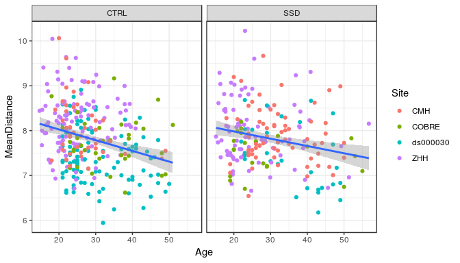
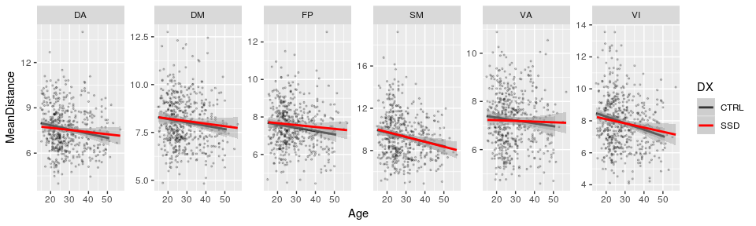

# Stats on the PINT summary displacement values


```r
library(tidyverse)
```

```
## ── Attaching packages ────────────────────────────────────────────────────────────────────────────────────────────── tidyverse 1.2.1 ──
```

```
## ✔ ggplot2 3.1.0       ✔ purrr   0.2.5  
## ✔ tibble  2.0.1       ✔ dplyr   0.8.0.1
## ✔ tidyr   0.8.2       ✔ stringr 1.3.1  
## ✔ readr   1.3.0       ✔ forcats 0.3.0
```

```
## ── Conflicts ───────────────────────────────────────────────────────────────────────────────────────────────── tidyverse_conflicts() ──
## ✖ dplyr::filter() masks stats::filter()
## ✖ dplyr::lag()    masks stats::lag()
```

```r
library(broom)
```


## The paths to data


```r
output_base <- '../data/ciftify_fmriprep/'

Yeo7_2011_80verts <- read_csv("../templates/Yeo7_2011_80verts.csv",
                              col_types = c(
                                hemi = col_character(),
                                tvertex = col_integer(),
                                LRpairs = col_integer(),
                                roiidx = col_integer(),
                                NETWORK = col_integer(),
                                LOBE = col_character(),
                                SHORTNAME = col_character(),
                                x = col_integer(),
                                y = col_integer(),
                                z = col_integer()
                              ))

YeoNet_colours = list("VI" = "#781286",
                      "SM" = "#4682B4",
                      "DA" = "#00760E", 
                      "VA" = "#C43AFA",
                      "DM" = "#CD3E3A", 
                      "FP" = "#E69422")

## adding a subid that matches what the concatenation script adds..
pheno <- read_csv('../phenotypic/20190301_pheno_qapass.csv') %>%
  mutate(subid = str_replace(filename, '_summary.csv','')) %>%
  drop_na(DX)
```

```
## Parsed with column specification:
## cols(
##   .default = col_double(),
##   dataset = col_character(),
##   subject_id.x = col_character(),
##   session_id = col_character(),
##   task_id.x = col_character(),
##   run_id = col_character(),
##   acq_id = col_character(),
##   subject = col_character(),
##   session = col_character(),
##   studyname = col_character(),
##   subject_id.y = col_character(),
##   task_id.y = col_character(),
##   cmh_session_id = col_character(),
##   DX = col_character(),
##   Sex = col_character(),
##   Site = col_character(),
##   Scanner = col_character(),
##   isFEP = col_character(),
##   ghost_NoGhost = col_character(),
##   filename = col_character()
## )
```

```
## See spec(...) for full column specifications.
```

```r
pint_concat <- read_csv('../data/ciftify_fmriprep/postPINT1_concat_all_qa_passes.csv')
```

```
## Parsed with column specification:
## cols(
##   subid = col_character(),
##   hemi = col_character(),
##   NETWORK = col_double(),
##   roiidx = col_double(),
##   tvertex = col_double(),
##   pvertex = col_double(),
##   dist_49 = col_double(),
##   vertex_48 = col_double(),
##   std_distance = col_double()
## )
```


```r
pheno %>%  
  select(subject) %>%
  distinct() %>%
  count()
```

<div data-pagedtable="false">
  <script data-pagedtable-source type="application/json">
{"columns":[{"label":["n"],"name":[1],"type":["int"],"align":["right"]}],"data":[{"1":"494"}],"options":{"columns":{"min":{},"max":[10]},"rows":{"min":[10],"max":[10]},"pages":{}}}
  </script>
</div>

```r
ana_data <- pheno %>%
  inner_join(pint_concat, by = "subid") %>%
  inner_join(Yeo7_2011_80verts, by = "roiidx") %>%
  mutate(network = str_sub(SHORTNAME, 1,2))
```


## run for the whole head


```r
dist_by_total <- pint_concat %>%
  group_by(subid) %>%
  summarise(MeanDistance = mean(std_distance)) %>%
  ungroup() %>%
  inner_join(pheno, by = "subid")  

dist_by_total %>%
  ungroup() %>%
  do(tidy(lm(MeanDistance ~ DX + Age_pt + Sex + fd_mean_pt + Site + SurfArea_pt,.))) %>%
  mutate(p_bonf = p.value*6) %>%
  knitr::kable()
```


term              estimate   std.error    statistic     p.value      p_bonf
-------------  -----------  ----------  -----------  ----------  ----------
(Intercept)     10.5073735   2.1177696    4.9615280   0.0000010   0.0000058
DXSSD           -0.1465822   0.0627210   -2.3370511   0.0198426   0.1190554
Age_pt           4.2183991   1.0907267    3.8675123   0.0001249   0.0007497
SexM             0.0594256   0.0712997    0.8334623   0.4049943   2.4299659
fd_mean_pt       1.1648289   1.6254428    0.7166225   0.4739520   2.8437120
SiteCOBRE       -0.3465891   0.1108130   -3.1276945   0.0018678   0.0112066
Siteds000030    -0.5502831   0.0872851   -6.3044319   0.0000000   0.0000000
SiteZHH          0.0721468   0.0787300    0.9163819   0.3599220   2.1595322
SurfArea_pt     -0.2965363   0.1003265   -2.9557117   0.0032714   0.0196283


```r
dist_by_total %>%
  ggplot(aes(y = MeanDistance, x = Age)) +
  geom_point(aes(color = Site)) + 
  geom_smooth(method = "lm")+
  facet_wrap(~DX) +
  theme_bw()
```

<!-- -->


```r
dist_by_network <- pint_concat %>%
  inner_join(Yeo7_2011_80verts, by = "roiidx") %>%
  mutate(network = str_sub(SHORTNAME, 1,2)) %>%
  group_by(subid, network) %>%
  summarise(MeanDistance = mean(std_distance)) %>%
  ungroup() %>%
  inner_join(pheno, by = "subid")  

dist_by_network %>%
  ungroup() %>% group_by(network) %>%
  do(tidy(aov(lm(MeanDistance ~ DX + Age_pt + Sex + fd_mean_pt + Scanner + SurfArea_pt,.)))) %>%
  mutate(p_bonf = p.value*6) %>%
  filter(!(term %in% c('Intercept', 'ScannerCOBRE', 'Scannerds00003035343', 'ScannerZHH', 'Scannerds00003035426'))) %>%
  select(network, term, df, statistic, p.value, p_bonf) %>%
  knitr::kable()
```


network   term            df    statistic     p.value      p_bonf
--------  ------------  ----  -----------  ----------  ----------
DA        DX               1    0.3533544   0.5524982   3.3149890
DA        Age_pt           1   12.0084677   0.0005767   0.0034602
DA        Sex              1    0.0000742   0.9931286   5.9587713
DA        fd_mean_pt       1    0.3418707   0.5590238   3.3541431
DA        Scanner          4    5.5732168   0.0002157   0.0012943
DA        SurfArea_pt      1    1.8837658   0.1705424   1.0232545
DA        Residuals      484           NA          NA          NA
DM        DX               1    0.1061563   0.7447041   4.4682246
DM        Age_pt           1    5.1601214   0.0235494   0.1412967
DM        Sex              1    6.0387218   0.0143451   0.0860706
DM        fd_mean_pt       1    3.0454678   0.0815974   0.4895846
DM        Scanner          4    5.7892610   0.0001476   0.0008856
DM        SurfArea_pt      1    0.9956544   0.3188629   1.9131774
DM        Residuals      484           NA          NA          NA
FP        DX               1    1.2295183   0.2680514   1.6083084
FP        Age_pt           1    4.2251445   0.0403652   0.2421911
FP        Sex              1    1.0229062   0.3123360   1.8740158
FP        fd_mean_pt       1    3.6056215   0.0581790   0.3490738
FP        Scanner          4    1.5180615   0.1956721   1.1740326
FP        SurfArea_pt      1   14.1833799   0.0001862   0.0011174
FP        Residuals      484           NA          NA          NA
SM        DX               1    0.0869099   0.7682693   4.6096160
SM        Age_pt           1   16.5332397   0.0000558   0.0003348
SM        Sex              1    0.0125041   0.9110113   5.4660677
SM        fd_mean_pt       1    1.8339822   0.1762898   1.0577389
SM        Scanner          4    5.0107769   0.0005776   0.0034658
SM        SurfArea_pt      1    0.2695495   0.6038715   3.6232287
SM        Residuals      484           NA          NA          NA
VA        DX               1    0.1440460   0.7044579   4.2267475
VA        Age_pt           1    1.8945128   0.1693302   1.0159814
VA        Sex              1    0.4105216   0.5220081   3.1320488
VA        fd_mean_pt       1    0.1006596   0.7511764   4.5070581
VA        Scanner          4    6.6788595   0.0000308   0.0001849
VA        SurfArea_pt      1    2.5264689   0.1126035   0.6756207
VA        Residuals      484           NA          NA          NA
VI        DX               1    0.3137604   0.5756409   3.4538455
VI        Age_pt           1   16.3704029   0.0000606   0.0003637
VI        Sex              1    1.3563137   0.2447511   1.4685064
VI        fd_mean_pt       1    0.8481366   0.3575388   2.1452329
VI        Scanner          4    6.0898007   0.0000870   0.0005220
VI        SurfArea_pt      1    0.9456076   0.3313256   1.9879536
VI        Residuals      484           NA          NA          NA


```r
dist_by_network %>%
  ggplot(aes(y = MeanDistance, x = Age)) +
  geom_point(alpha = 0.2, size = 0.5) + 
  geom_smooth(aes(color = DX), method = "lm") +
  facet_wrap(~network, scales = "free", nrow = 1) +
  scale_color_manual(values = c("grey20","red"))
```

<!-- -->


## run linear model per edge


```r
roi_dx_lm <- ana_data %>%
  ungroup() %>% group_by(SHORTNAME) %>%
  do(tidy(lm(std_distance ~ DX + Sex + fd_mean_pt + Age_pt + Scanner,.))) %>%
  ungroup() %>% group_by(term) %>%
  mutate(p_fdr  = p.adjust(p.value, method = 'fdr'))

roi_dx_lm %>%
  filter(term == "Age_pt") %>%
  filter(p_fdr < 0.1)
```

<div data-pagedtable="false">
  <script data-pagedtable-source type="application/json">
{"columns":[{"label":["SHORTNAME"],"name":[1],"type":["chr"],"align":["left"]},{"label":["term"],"name":[2],"type":["chr"],"align":["left"]},{"label":["estimate"],"name":[3],"type":["dbl"],"align":["right"]},{"label":["std.error"],"name":[4],"type":["dbl"],"align":["right"]},{"label":["statistic"],"name":[5],"type":["dbl"],"align":["right"]},{"label":["p.value"],"name":[6],"type":["dbl"],"align":["right"]},{"label":["p_fdr"],"name":[7],"type":["dbl"],"align":["right"]}],"data":[{"1":"VI03L","2":"Age_pt","3":"34.32246","4":"8.529899","5":"4.023783","6":"6.642394e-05","7":"0.005313915"}],"options":{"columns":{"min":{},"max":[10]},"rows":{"min":[10],"max":[10]},"pages":{}}}
  </script>
</div>
