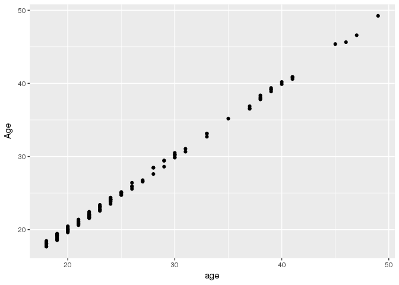
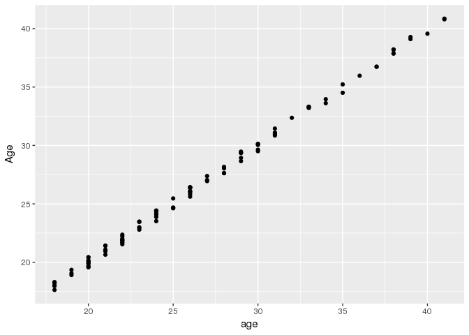
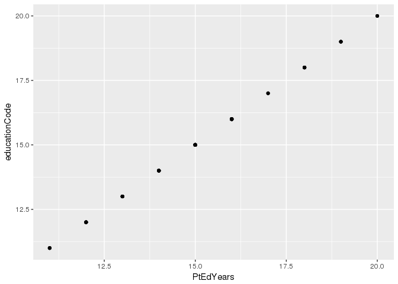
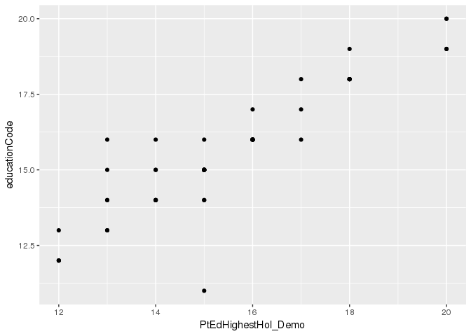
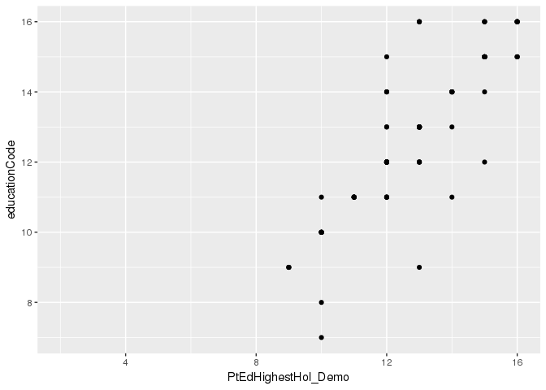

# Double Check Clinical vars

This calculations were run (on a kimel lab machine) to double check the coding of cases and controls and Sex in our phenotypic file.

While most things are fine. Two issues were identified:

1. Two participants in COBRE are coded as Controls, but appear to be cases
2. 30 (SSD) participants from ZHH look like they might be repeated. 


```r
library(tidyverse)
library(knitr)
```

## Reading Saba's clinical data page


```r
## reading in the qced_sublists csv to get the sublists
qced_sublists <- read_csv("../phenotypic/NEWallSubjects_completeData3_DM_not_sexmatched.csv",
                          col_types = c(
                            X1 = col_integer(),
                            name = col_character(),
                            subid = col_character(),
                            DX_GROUP = col_integer(),
                            mean_fd = col_double(),
                            age = col_integer(),
                            sex.x = col_integer(),
                            educationCode = col_double(),
                            site = col_integer(),
                            sex.y = col_integer(),
                            X.bad_fd = col_double(),
                            global_corr = col_double(),
                            mean_snfr = col_double()
                          )) 
```

```
## Warning: Missing column names filled in: 'X1' [1]
```

```r
pheno_pre <- qced_sublists %>%
  mutate(Site = factor(site, levels = c(1,2,3),
                       labels = c("CMH","ZHH","COBRE")) ,
         DX = factor(DX_GROUP, level = c(1,2), labels = c('SSD', 'Ctrl')),
         Sex = factor(sex.x, levels = c(1,2), labels = c('M','F')),
         Edu = if_else(is.na(educationCode), 
                       true = mean(educationCode, na.rm = T), 
                       false = educationCode))
```

## Reading some extra info about scan quality

We noticed that our algoritms seemed to be censoring in a weird way (leaving short scans)
So we have going to add stronger censoring criteria before subsampling ZHH (at the end).


```r
## we created a list of files that are super short after censoring..
number_tr1 <- read_table2("../data/data/number_tr.txt", 
    col_names = c('num_TR','path')) %>%
    separate(path, into = c('project', 'hcp', 'subid','therest'), sep = .Platform$file.sep, extra = "merge") %>%
    select(num_TR, subid)
```

```
## Parsed with column specification:
## cols(
##   num_TR = col_integer(),
##   path = col_character()
## )
```

```r
number_tr2 <- read_table2("../data/data/cobre_numtr.txt",
                      col_names = c('num_TR','path')) %>%
  separate(path, into = c('subid','therest'), sep = .Platform$file.sep, extra = "merge") %>%
  select(num_TR, subid)
```

```
## Parsed with column specification:
## cols(
##   num_TR = col_integer(),
##   path = col_character()
## )
```

```r
num_tr = bind_rows(number_tr1, number_tr2)


pheno <- inner_join(num_tr, pheno_pre, by = "subid") %>%
  filter(num_TR > 100, X.bad_fd < 0.5) 
```

## reading the COBRE demographics page


```r
schizconnect_COBRE_assessmentData_3125 <- read_csv("/KIMEL/tigrlab/external/SchizConnect/COBRE/schizconnect_COBRE_assessmentData_3125.csv",
                                                   col_types = c(
  source = col_character(),
  study = col_character(),
  site = col_character(),
  subjectid = col_character(),
  visit = col_character(),
  assessment = col_character(),
  assessment_description = col_character(),
  question_id = col_character(),
  question_value = col_character()
)) %>%
  mutate(subid = str_c('COBRE_', subjectid, '_SESS01'))
```


```r
cobre_check <- inner_join(schizconnect_COBRE_assessmentData_3125, pheno, by = "subid")
```


```r
cobre_check %>%
  filter(question_id == "CODEM_2") %>%
  select(sex.x, question_value) %>%
  ftable()
```

```
##       question_value Female Male
## sex.x                           
## 1                         0   32
## 2                        12    0
```


```r
cobre_check %>%
  filter(question_id == "CODEM_17") %>%
  select(DX_GROUP, question_value) %>%
  ftable()
```

```
##          question_value 14 15 16 17 18 19 21 22 24 9999 md N/A
## DX_GROUP                                                      
## 1                        1  1  1  3  4  1  2  1  1    0  0   0
## 2                        0  0  0  0  0  0  0  0  0    7  1   9
```


```r
cobre_weird <- cobre_check %>%
  filter(question_id == "CODEM_17",
         question_value %in% c("13", "20")) %>%
  select(subid)

inner_join(cobre_weird, cobre_check, by = "subid") %>%
  select(question_id, question_value, age, Sex, Edu, DX)
```

```
## # A tibble: 0 x 6
## # ... with 6 variables: question_id <chr>, question_value <chr>,
## #   age <int>, Sex <fctr>, Edu <dbl>, DX <fctr>
```
Conclusion: These two participants are NOT Controls...(they also got excluded for motion..so oh well)

COBRE_A00028189_SESS01				
COBRE_A00035836_SESS01


```r
pheno_corrected <- pheno
for (badsub in cobre_weird$subid) {
  pheno_corrected$DX[pheno_corrected$subid == badsub] <- 'SSD'
  pheno_corrected$DX_GROUP[pheno_corrected$subid == badsub] <- 1
}

cobre_recheck <- inner_join(schizconnect_COBRE_assessmentData_3125, pheno_corrected, by = "subid")

cobre_recheck %>%
  filter(question_id == "CODEM_17") %>%
  select(DX_GROUP, question_value) %>%
  ftable()
```

```
##          question_value 14 15 16 17 18 19 21 22 24 9999 md N/A
## DX_GROUP                                                      
## 1                        1  1  1  3  4  1  2  1  1    0  0   0
## 2                        0  0  0  0  0  0  0  0  0    7  1   9
```


## Now looking at ZHH data


```r
library(readxl)
qrySZ_Sess_Miklos <- read_excel("/KIMEL/tigrlab/external/miklos/demographics/qrySZ_Sess_Miklos.xlsx")
qryHC_Sess_Miklos <- read_excel("/KIMEL/tigrlab/external/miklos/demographics/qryHC_NewResting_15-40.xlsx")
```


```r
pheno %>% filter(Site == "ZHH") %>% select(subid) %>% slice(1:5)
```

```
## # A tibble: 5 x 1
##              subid
##              <chr>
## 1 EXP_21359_SESS01
## 2 EXP_21362_SESS01
## 3 EXP_21367_SESS01
## 4 EXP_21368_SESS01
## 5 EXP_21370_SESS01
```


```r
ZHH_HC <- qryHC_Sess_Miklos %>%
  mutate(subid = str_c('EXP_',SessNo, '_SESS01')) %>%
  inner_join(qced_sublists, by = "subid")
```


```r
ZHH_HC %>%
  select(sex, sex.x) %>%
  ftable
```

```
##     sex.x  1  2
## sex            
## 1         50  0
## 2          0 54
```

```r
ZHH_HC %>%
  select(sex, DX_GROUP) %>%
  ftable
```

```
##     DX_GROUP  2
## sex            
## 1            50
## 2            54
```


```r
ZHH_SZ <- qrySZ_Sess_Miklos %>%
  mutate(subid = str_c('EXP_',SessNo, '_SESS01')) %>%
  inner_join(qced_sublists, by = "subid")
```


```r
ZHH_SZ %>%
  select(sex, DX_GROUP) %>%
  ftable
```

```
##     DX_GROUP   1
## sex             
## 1            100
## 2             31
```


```r
ZHH_SZ %>%
  select(sex, sex.x) %>%
  ftable
```

```
##     sex.x   1   2
## sex              
## 1         100   0
## 2           0  31
```


```r
ZHH_SZ %>%
  select(sex, DX_GROUP) %>%
  ftable
```

```
##     DX_GROUP   1
## sex             
## 1            100
## 2             31
```


```r
repeated_SZ_subjects <- ZHH_SZ %>%
 count(grid) %>%
 filter(n > 1)

repeated_SZ_subjects
```

```
## # A tibble: 30 x 2
##     grid     n
##    <dbl> <int>
##  1  7231     3
##  2  7985     2
##  3  8158     2
##  4  8484     4
##  5  8723     4
##  6  8736     3
##  7  8872     4
##  8  8984     4
##  9  9073     2
## 10  9275     2
## # ... with 20 more rows
```


```r
repeated_HC_subjects <- ZHH_HC %>%
 count(GRID) %>%
 filter(n > 1)
```


```r
ggplot(ZHH_SZ, aes(x = age, y = Age)) + geom_point()
```

<!-- -->


```r
ggplot(ZHH_HC, aes(x = age, y = Age)) + geom_point()
```

<!-- -->


```r
ggplot(ZHH_HC, aes(x = PtEdYears, y = educationCode)) + geom_point()
```

```
## Warning: Removed 31 rows containing missing values (geom_point).
```

<!-- -->


```r
ggplot(ZHH_HC, aes(x = PtEdHighestHol_Demo, y = educationCode)) + geom_point()
```

```
## Warning: Removed 42 rows containing missing values (geom_point).
```

<!-- -->


```r
ggplot(ZHH_SZ, aes(x = PtEdYears_NI, y = educationCode)) + geom_point()
```

```
## Warning: Removed 14 rows containing missing values (geom_point).
```

<!-- -->


```r
ggplot(ZHH_SZ, aes(x = PtEdHighestHol_Demo, y = educationCode)) + geom_point()
```

```
## Warning: Removed 26 rows containing missing values (geom_point).
```

<!-- -->


```r
set.seed(14)
ZHH_SZ_subsampled <- qrySZ_Sess_Miklos %>%
  mutate(subid = str_c('EXP_',SessNo, '_SESS01')) %>%
  ungroup() %>% 
  group_by(grid) %>%
  sample_n(1) %>%
  select(subid) %>%
  ungroup()
```

```
## Adding missing grouping variables: `grid`
```

```r
to_drop <- ZHH_SZ %>%
  anti_join(ZHH_SZ_subsampled, by = "subid")

pheno_corrected1 <- pheno_corrected %>%
  anti_join(to_drop, by = "subid")
```
## Now for SPINS


```r
spins_demographics <- read_csv("/KIMEL/tigrlab/archive/data-2.0/SPINS/data/clinical/demographics.csv") %>%
  mutate(subid  = str_c(record_id, '_01'))
```

```
## Parsed with column specification:
## cols(
##   record_id = col_character(),
##   group = col_character(),
##   sex = col_integer(),
##   age = col_integer(),
##   education = col_integer(),
##   terminated = col_integer()
## )
```

```r
spins_check <- inner_join(spins_demographics, qced_sublists, by = "subid")

spins_demographics$subid[1:5]
```

```
## [1] "SPN01_CMH_0001_01" "SPN01_CMH_0002_01" "SPN01_CMH_0003_01"
## [4] "SPN01_CMH_0004_01" "SPN01_CMH_0005_01"
```


```r
spins_check %>%
  select(group, DX_GROUP) %>%
  ftable()
```

```
##               DX_GROUP  1  2
## group                       
## case_arm_2             40  0
## control_arm_1           0 27
```


```r
spins_check %>%
  select(sex, sex.x, group) %>%
  ftable()
```

```
##           group case_arm_2 control_arm_1
## sex sex.x                               
## 1   1                    0             0
##     2                   14            14
## 2   1                   26            13
##     2                    0             0
```

# Finally writting results from corrected version back to csv


```r
names(pheno_corrected1)
```

```
##  [1] "num_TR"        "subid"         "X1"            "name"         
##  [5] "DX_GROUP"      "mean_fd"       "age"           "sex.x"        
##  [9] "educationCode" "site"          "sex.y"         "X.bad_fd"     
## [13] "global_corr"   "mean_snfr"     "Site"          "DX"           
## [17] "Sex"           "Edu"
```


```r
pheno_corrected1 %>%
  select(subid, name, Site, DX, age, Sex, Edu, mean_fd, X.bad_fd, global_corr, mean_snfr) %>%
  write_csv('../phenotypic/subjects_not_sexmatched_20180620.csv')
```


