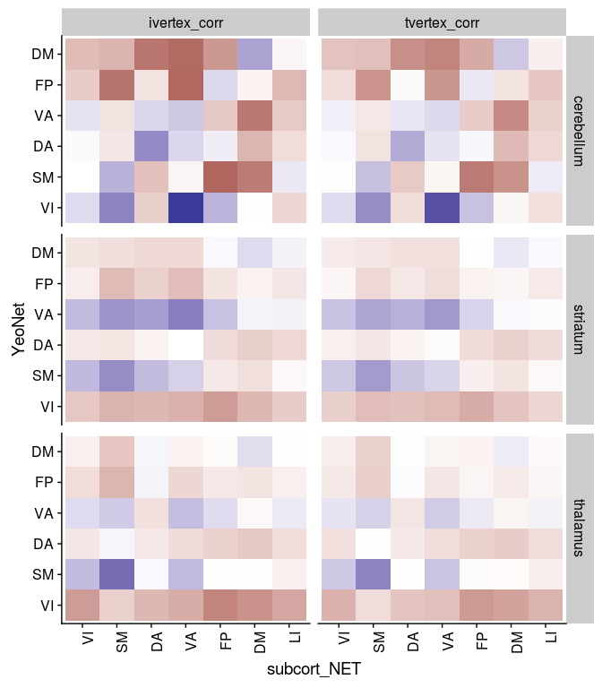
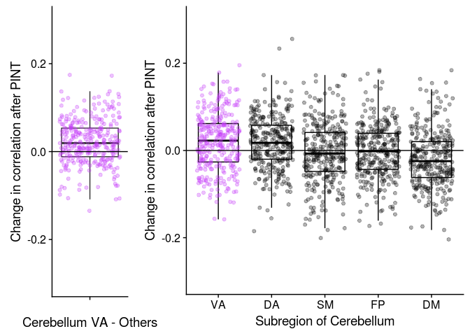

# Sub-cortical Cortical Stats Left and Right

This analysis tries to combine timeseries data from PINT outputs with subcortical timeseries to ask two questions

1. "External" validation of PINT. If PINT is indeed helping us better target meaningful resting state networks than we should see "cleaner" patterns of between the PINT output cortical ROIs and parcels of the subcortical structure that have been associated with these networks in literature.
   + i.e. connectivity of the cortical ROIS with "expected" subcortical parcel should increae and correlation with other parcels should decrease after PINT.
   
2. To interograte SSD related differences in Cortical-Subcortical connectivity - and to see if they persist after PINT.

Some work Ji (in prep) kinda suggests that there might be differences between left and right subcortical structures. AND spliting the left and right seemed to make more sense for whole brain correlations (because our cortical nodes have a hemisphere). So in this analysis have separate left and right ROIs


```r
library(tidyverse)
library(broom)
library(knitr)
library(tableone)
library(cowplot)
```


## The paths to data


```r
pint_outputs <- '../data/PINT_outputs_s8_6-6-12/'
subcortical_outputs_dir <- '/projects/dmiranda/subcortical_split_LR/output_ts'

Yeo7_2011_80verts <- read_csv("../templates/Yeo7_2011_80verts.csv",
                              col_types = c(
                                hemi = col_character(),
                                tvertex = col_integer(),
                                LRpairs = col_integer(),
                                roiidx = col_integer(),
                                NETWORK = col_integer(),
                                LOBE = col_character(),
                                SHORTNAME = col_character(),
                                x = col_integer(),
                                y = col_integer(),
                                z = col_integer()
                              ))
```

# read and mangle the phenotypic data


```r
## reading in the qced_sublists csv to get the sublists
pheno <- read_csv("../phenotypic/subjects_not_sexmatched_20180620.csv", 
                  col_types = c(
  subid = col_character(),
  name = col_character(),
  Site = col_character(),
  DX = col_character(),
  age = col_integer(),
  Sex = col_character(),
  Edu = col_double(),
  mean_fd = col_double(),
  X.bad_fd = col_double(),
  global_corr = col_double(),
  mean_snfr = col_double()
))
```

## adding transformed variables 


```r
transform_to_normal <- function(X) {
  # calculate the best exponent using powerTransform:
  pT <- car::powerTransform(X)
  # apply the power transform and save the result to a new variable
  X_pT <- X^pT$lambda ## note ^ is exponent in r
  return(X_pT)
}

pheno <- pheno %>%
  mutate(Age_pt = transform_to_normal(age),
         mean_fd_pt = transform_to_normal(mean_fd),
         Edu_std = scale(Edu)[,1],
         Age_std = scale(age)[,1])
```


# Code for reading in all the timeseries..

## searching for the meants files


```r
pint_outputlist <- tibble("filepath" = list.files(pint_outputs, 
                                                      recursive = T,
                                                      pattern = "_summary.csv")) %>%
  separate(filepath, into = c("subid", "summary_file"), sep = '/')

subcort_outputlist <- tibble("subid" = list.files(subcortical_outputs_dir, 
                                                      recursive = F))

pint_outputlist <- inner_join(pint_outputlist, subcort_outputlist, by = "subid")
```


```r
list.files(file.path(subcortical_outputs_dir, subcort_outputlist$subid[1]))
```

```
## [1] "ASDD_CMH_HEF003_01_s0_L_rsn_cerebellum_7networks_networks_MWfix.dlabel_meants.csv"
## [2] "ASDD_CMH_HEF003_01_s0_L_rsn_striatum_7networks_networks_MWfix.dlabel_meants.csv"  
## [3] "ASDD_CMH_HEF003_01_s0_L_rsn_thalamus_7networks_networks_MWfix.dlabel_meants.csv"  
## [4] "ASDD_CMH_HEF003_01_s0_R_rsn_cerebellum_7networks_networks_MWfix.dlabel_meants.csv"
## [5] "ASDD_CMH_HEF003_01_s0_R_rsn_striatum_7networks_networks_MWfix.dlabel_meants.csv"  
## [6] "ASDD_CMH_HEF003_01_s0_R_rsn_thalamus_7networks_networks_MWfix.dlabel_meants.csv"
```


A table that describes the current expected subortical files


```r
# a tibble table to specify the subcortical meants files that were generated
YeoNet_subcort_list <- c('VI','SM','DA','VA', 'LI','FP','DM')
```

These functions are for reading timeseries files


```r
#' read a meants file generated by PINT of ciftify_meants
#'
#' @param filepath the full path to the file
#'
#' @return a dataframe where rows are rois and colums are timepoints
read_meants_csv <- function(filepath) {
   meants <-read_csv(filepath, 
                     col_names = FALSE,
                     col_types = c(.default = col_double()))
   return(meants)
}

#' Read the contents of a subcortical csv
#' expample file path is ASDD_CMH_HEF003_01_s0_L_rsn_cerebellum_7networks_networks_MWfix.dlabel_meants.csv
#'
#' @param subid The subject identifier
#' @param hemi The hemisphere "L" or "R"
#' @param subregion region "thalamus", "stiatum", "cerebellum"
#' @param pint_outputs the basepath of the pint outputs
#'
#' @return a dataframe of the _meants.csv contents
read_subcortical_hemi_meants <- function(subid, hemi, subregion, subcortical_outputs_dir) {
  expected_filepath <- file.path(subcortical_outputs_dir, subid, 
                           str_c(subid, '_s0_', hemi, '_rsn_', subregion, '_7networks_networks_MWfix.dlabel_meants.csv'))
  meants = read_meants_csv(expected_filepath)
  return(meants)
}

#' Read the contents of a csv generated by PINT
#'
#' @param subid The subject identifier
#' @param vertex_type "ivertex" or "tvertex"
#' @param pint_outputs the basepath of the pint outputs
#'
#' @return a dataframe of the _meants.csv contents
read_pint_meants <- function(subid, vertex_type, pint_outputs) {
  expected_filepath <- file.path(pint_outputs, subid, 
                           str_c(subid, '_', vertex_type, '_meants.csv'))
  meants = read_meants_csv(expected_filepath)
  return(meants)
}
```


This reads all files and generate PINT to subcortical correlation values for a given subject


```r
the_subcortical_guide <- tribble(
 ~subcort_hemi, ~subcort_ROI, ~subcort_NET,
 "L", "thalamus", c('VI','SM','DA','VA', 'FP','DM'),
 "L", "striatum", c('SM','DA','VA', 'LI','FP','DM'),
 "L", "cerebellum", c('VI','SM','DA','VA', 'LI','FP','DM'),
 "R", "thalamus", c('VI','SM','DA','VA', 'LI','FP','DM'),
 "R", "striatum", c('VI','SM','DA','VA', 'LI','FP','DM'),
 "R", "cerebellum", c('VI','SM','DA','VA', 'LI','FP','DM')) %>%
  unnest()


#' read all fMRI timeseries data for one subject and correlates PINT ROIs with subcortex
#'
#' @param subid the subject id
#' @param pint_outputs the path to the pint output directory
#' @param subcortical_outputs_dir the path to the subcortical timeseries directory
#' @param Yeo7_2011_80verts as data frame describing the PINT ROIs 
#'
#' @return a dataframe (graph style) of PINT ROI to subcortical correlations
subject_subcort_corrs <- function(subid, pint_outputs, subcortical_outputs_dir,
                                  Yeo7_2011_80verts) {
  
  # read the pint meants files
  ivertex_meants <- read_pint_meants(subid, 'ivertex', pint_outputs)
  tvertex_meants <- read_pint_meants(subid, 'tvertex', pint_outputs)
  
  # read the subcortical meants files
  thalamus_L_meants <- read_subcortical_hemi_meants(subid, "L","thalamus", subcortical_outputs_dir)
  striatum_L_meants <- read_subcortical_hemi_meants(subid, "L","striatum", subcortical_outputs_dir)
  cerebellum_L_meants <- read_subcortical_hemi_meants(subid, "L", "cerebellum", subcortical_outputs_dir)
  thalamus_R_meants <- read_subcortical_hemi_meants(subid, "R","thalamus", subcortical_outputs_dir)
  striatum_R_meants <- read_subcortical_hemi_meants(subid, "R","striatum", subcortical_outputs_dir)
  cerebellum_R_meants <- read_subcortical_hemi_meants(subid, "R", "cerebellum", subcortical_outputs_dir)
  
  # prepare to bind
  subcort_meants <- bind_rows(thalamus_L_meants, striatum_L_meants, cerebellum_L_meants,
                              thalamus_R_meants, striatum_R_meants, cerebellum_R_meants)
  
  # correlate the ivertex timeseries with the subcortical data
  ivertex_subcortcorr <- as.data.frame(cor(t(subcort_meants), t(ivertex_meants)))
  names(ivertex_subcortcorr) <- Yeo7_2011_80verts$SHORTNAME
  ivertex_result <- the_subcortical_guide %>% 
    bind_cols(ivertex_subcortcorr) %>%
    gather(PINT_ROI, ivertex_corr, -subcort_ROI, -subcort_NET, -subcort_hemi)
  
  # correlated the tvertex timeseries with the subcortical data
  tvertex_subcortcorr <- as.data.frame(cor(t(subcort_meants), t(tvertex_meants)))
  names(tvertex_subcortcorr) <- Yeo7_2011_80verts$SHORTNAME
  tvertex_result <- the_subcortical_guide %>% 
    bind_cols(tvertex_subcortcorr) %>%
    gather(PINT_ROI, tvertex_corr, -subcort_ROI, -subcort_NET, -subcort_hemi)
  
  # combine ivertex and tvertex and return
  subresult <- ivertex_result %>%
    inner_join(tvertex_result, by = c("PINT_ROI", "subcort_ROI", "subcort_NET", "subcort_hemi"))
  return(subresult)
}

run_read_subject_subcort_corrs <- function(subid) {
  df <-subject_subcort_corrs(subid, pint_outputs, subcortical_outputs_dir,
                                  Yeo7_2011_80verts)
  return(df)
}

# run_read_subject_subcort_corrs(subcort_outputlist$subid[1])
```


### This reads all the subcortical files it can find


```r
all_subcort_results <- pint_outputlist %>%
  mutate(subcort_corrs = map(subid, ~run_read_subject_subcort_corrs(.x)))
```


### merge with the phenotypic data


```r
results_pheno <- all_subcort_results %>%
  inner_join(pheno, by = "subid") %>%
  unnest() %>%
  mutate(YeoNet = str_sub(PINT_ROI, 1,2),
         hemisphere = str_sub(PINT_ROI, 5,5)) %>%
  mutate(conn_type = if_else(YeoNet == subcort_NET, "same_net", "diff_net"),
         YeoNet = factor(YeoNet, levels = c("VI", "SM", "DA", "VA", "FP", "DM")),
         subcort_NET = factor(subcort_NET, levels = c("VI", "SM", "DA", "VA", "FP", "DM", "LI"))) %>%
  #       ) %>%
  select(subid, PINT_ROI, subcort_ROI, subcort_NET,subcort_hemi, 
         ivertex_corr, tvertex_corr, 
         DX, Edu, Sex, mean_fd, age, Site,
         Age_pt, mean_fd_pt, Edu_std, Age_std, 
         YeoNet, hemisphere, conn_type) 
```


## make a subject table from resuts pheno


```r
library(tableone)
therealtable1 <- CreateTableOne(
  strata = c("Site", "DX"),
  vars = c("age", "Edu", "Sex"),
  data = filter(results_pheno, PINT_ROI=="DMP1L",subcort_ROI=="thalamus", subcort_NET=="VA", subcort_hemi == "L")
)
tabMat <- print(therealtable1, quote = FALSE, noSpaces = TRUE, printToggle = FALSE)
kable(tabMat)
```

                  CMH:Ctrl       COBRE:Ctrl      ZHH:Ctrl       CMH:SSD        COBRE:SSD      ZHH:SSD        p        test 
----------------  -------------  --------------  -------------  -------------  -------------  -------------  -------  -----
n                 41             29              94             66             15             66                           
age (mean (sd))   26.37 (6.67)   33.21 (10.07)   26.46 (6.04)   32.38 (8.40)   24.87 (5.69)   26.47 (7.92)   <0.001        
Edu (mean (sd))   15.95 (1.95)   14.54 (1.76)    14.89 (1.94)   13.68 (2.04)   13.22 (1.47)   12.73 (1.91)   <0.001        
Sex = M (%)       22 (53.7)      19 (65.5)       43 (45.7)      39 (59.1)      13 (86.7)      50 (75.8)      0.001         

# Is PINT "focusing" cortical subcortical connectivity


```r
table1 <- results_pheno %>%
  mutate(corr_diff = ivertex_corr - tvertex_corr) %>%
  gather(corr_type, rval, ivertex_corr, tvertex_corr) %>%
  group_by(corr_type, YeoNet, subcort_ROI, subcort_NET) %>%
  summarise(n = n(),
            Mean = mean(rval),
            SD = sd(rval)) 
  
ggplot(table1, aes(y = YeoNet, x = subcort_NET, fill = Mean)) + 
  geom_tile() +
  scale_fill_gradient2(breaks = c(-0.5,0.5)) +
  theme(axis.text.x = element_text(angle = 90, hjust = 1)) +
  facet_grid(subcort_ROI~corr_type) 
```

<!-- -->


```r
table1 <- results_pheno %>%
  mutate(corr_diff = ivertex_corr - tvertex_corr) %>%
  gather(corr_type, rval, ivertex_corr, tvertex_corr) %>%
  group_by(corr_type, YeoNet, hemisphere, subcort_ROI, subcort_NET, subcort_hemi) %>%
  summarise(n = n(),
            Mean = mean(rval),
            SD = sd(rval)) 
  
ggplot(table1, aes(y = YeoNet, x = subcort_NET, fill = Mean)) + 
  geom_tile() +
  scale_fill_gradient2(breaks = c(-0.5,0.5)) +
  theme(axis.text.x = element_text(angle = 90, hjust = 1)) +
  facet_grid(subcort_ROI*subcort_hemi~corr_type*hemisphere) 
```

<!-- -->

We see in the above figure that the Yeo 7 Network connectivity strongly shows the expected pattern in the cerebeullum. 

Lower evidence is seen in the striatum and thalamus, although there is a faint increase across the diagonal for the SM, VA and DM especially


```r
net_means <- results_pheno %>%
  mutate(corr_diff = ivertex_corr - tvertex_corr) %>%
  group_by(YeoNet, subcort_ROI, subcort_NET, conn_type, subid) %>%
  summarise(netmean_ivertex = mean(ivertex_corr),
            netmean_tvertex = mean(tvertex_corr)) %>%
  ungroup()

net_means_pint_t <- net_means %>%
  group_by(YeoNet, subcort_ROI, subcort_NET) %>%
  do(tidy(t.test(.$netmean_ivertex, .$netmean_tvertex, paired = TRUE)))

net_means_pint_t %>%
  ungroup() %>%
  mutate(sig = if_else(p.value < 0.005, '*', NA_character_) ) %>%
ggplot(aes(x = YeoNet, y = subcort_NET, fill = statistic)) + 
  geom_tile(color = "black", na.rm = TRUE) +
  geom_point(aes(shape = sig), na.rm = TRUE) +
  scale_fill_gradient2() +
  theme(axis.text.x = element_text(angle = 90, hjust = 1)) +
  facet_wrap(~subcort_ROI)
```

<!-- -->
Here we plot the paired t-stat camparing personalized to template, we see a very strong increase in correlation along the diagonal (i.e. with the hypothesized regions) and decreases on the off-dignonal (i.e. decreased connectivity with the other network's parcels)


# trying to calculate an vs off diagonal term

In the above table to calcuculated the "focussing" effect as the change (in on person) between in connectivity with the expected parcel subtracted by the change in connectivity from other regions.

Below we plot these values against zero


```r
library(knitr)
net_focus <- net_means %>%
  ungroup() %>%
  mutate(pint_diff = netmean_ivertex - netmean_tvertex) %>%
  group_by(subid, subcort_ROI, YeoNet, conn_type) %>%
  summarise(nets_avg = mean(pint_diff)) %>%
  ungroup() %>%
  spread(conn_type, nets_avg) %>%
  mutate(focus_effect = same_net - diff_net)

net_focus %>%
  ungroup() %>%
  group_by(subcort_ROI, YeoNet) %>%
  do(tidy(t.test(.$focus_effect))) %>%
  kable()
```


subcort_ROI   YeoNet      estimate    statistic     p.value   parameter     conf.low    conf.high  method              alternative 
------------  -------  -----------  -----------  ----------  ----------  -----------  -----------  ------------------  ------------
cerebellum    VI        -0.0056020   -1.6617780   0.0975681         310   -0.0122350    0.0010311  One Sample t-test   two.sided   
cerebellum    SM         0.0248301    7.8833070   0.0000000         310    0.0186326    0.0310276  One Sample t-test   two.sided   
cerebellum    DA         0.0331754    8.5798912   0.0000000         310    0.0255672    0.0407835  One Sample t-test   two.sided   
cerebellum    VA         0.0200726    7.1535375   0.0000000         310    0.0145515    0.0255938  One Sample t-test   two.sided   
cerebellum    FP         0.0365122   11.0189207   0.0000000         310    0.0299922    0.0430322  One Sample t-test   two.sided   
cerebellum    DM         0.0554577   13.1926824   0.0000000         310    0.0471864    0.0637291  One Sample t-test   two.sided   
striatum      VI         0.0042508    1.4721512   0.1419945         310   -0.0014307    0.0099323  One Sample t-test   two.sided   
striatum      SM         0.0138407    5.0377001   0.0000008         310    0.0084348    0.0192467  One Sample t-test   two.sided   
striatum      DA         0.0000596    0.0211064   0.9831744         310   -0.0054926    0.0056117  One Sample t-test   two.sided   
striatum      VA         0.0177143    7.7655902   0.0000000         310    0.0132259    0.0222028  One Sample t-test   two.sided   
striatum      FP         0.0030234    1.1674092   0.2439423         310   -0.0020725    0.0081192  One Sample t-test   two.sided   
striatum      DM         0.0164641    5.2545347   0.0000003         310    0.0102988    0.0226293  One Sample t-test   two.sided   
thalamus      VI        -0.0056547   -3.0607112   0.0024012         310   -0.0092899   -0.0020194  One Sample t-test   two.sided   
thalamus      SM         0.0208287    7.9647925   0.0000000         310    0.0156831    0.0259743  One Sample t-test   two.sided   
thalamus      DA        -0.0008565   -0.2622161   0.7933290         310   -0.0072833    0.0055704  One Sample t-test   two.sided   
thalamus      VA         0.0088638    4.2006026   0.0000348         310    0.0047118    0.0130157  One Sample t-test   two.sided   
thalamus      FP        -0.0028173   -1.2304410   0.2194649         310   -0.0073226    0.0016880  One Sample t-test   two.sided   
thalamus      DM         0.0135618    6.4355506   0.0000000         310    0.0094153    0.0177082  One Sample t-test   two.sided   

Another (maybe better) way to test this is to show calculate the "focusing" value in individual subjects THAN compute how this number changes with PINT. Let try that..


```r
subject_focus <- net_means %>%
  gather(vertex_type, nets_avg, netmean_ivertex, netmean_tvertex) %>%
  ungroup(subcort_NET) %>%
  group_by(subid, subcort_ROI, YeoNet, vertex_type, conn_type) %>%
  summarise(nets_type_avg = mean(nets_avg)) %>%
  spread(conn_type, nets_type_avg) %>%
  ungroup() %>%
  mutate(focus_effect = same_net - diff_net)

subject_focus %>%
  ungroup() %>%
  group_by(subcort_ROI, YeoNet, vertex_type) %>%
  do(tidy(t.test(.$focus_effect))) %>%
  kable()
```


subcort_ROI   YeoNet   vertex_type          estimate   statistic     p.value   parameter     conf.low    conf.high  method              alternative 
------------  -------  ----------------  -----------  ----------  ----------  ----------  -----------  -----------  ------------------  ------------
cerebellum    VI       netmean_ivertex    -0.0212084   -2.086619   0.0377395         310   -0.0412075   -0.0012092  One Sample t-test   two.sided   
cerebellum    VI       netmean_tvertex    -0.0156064   -1.850905   0.0651343         310   -0.0321972    0.0009843  One Sample t-test   two.sided   
cerebellum    SM       netmean_ivertex     0.1436215   17.256690   0.0000000         310    0.1272454    0.1599975  One Sample t-test   two.sided   
cerebellum    SM       netmean_tvertex     0.1187914   16.755890   0.0000000         310    0.1048417    0.1327410  One Sample t-test   two.sided   
cerebellum    DA       netmean_ivertex     0.1426181   17.813542   0.0000000         310    0.1268648    0.1583714  One Sample t-test   two.sided   
cerebellum    DA       netmean_tvertex     0.1094427   18.328500   0.0000000         310    0.0976936    0.1211919  One Sample t-test   two.sided   
cerebellum    VA       netmean_ivertex     0.0942653   12.271992   0.0000000         310    0.0791512    0.1093795  One Sample t-test   two.sided   
cerebellum    VA       netmean_tvertex     0.0741927   12.330404   0.0000000         310    0.0623533    0.0860321  One Sample t-test   two.sided   
cerebellum    FP       netmean_ivertex     0.1190105   18.078935   0.0000000         310    0.1060578    0.1319631  One Sample t-test   two.sided   
cerebellum    FP       netmean_tvertex     0.0824982   17.681504   0.0000000         310    0.0733176    0.0916789  One Sample t-test   two.sided   
cerebellum    DM       netmean_ivertex     0.1967373   19.333497   0.0000000         310    0.1767145    0.2167600  One Sample t-test   two.sided   
cerebellum    DM       netmean_tvertex     0.1412795   18.914122   0.0000000         310    0.1265822    0.1559769  One Sample t-test   two.sided   
striatum      VI       netmean_ivertex     0.0201597    2.431884   0.0155866         310    0.0038484    0.0364711  One Sample t-test   two.sided   
striatum      VI       netmean_tvertex     0.0159089    2.279439   0.0233203         310    0.0021761    0.0296418  One Sample t-test   two.sided   
striatum      SM       netmean_ivertex     0.1058732   15.859620   0.0000000         310    0.0927379    0.1190085  One Sample t-test   two.sided   
striatum      SM       netmean_tvertex     0.0920325   17.879233   0.0000000         310    0.0819041    0.1021608  One Sample t-test   two.sided   
striatum      DA       netmean_ivertex     0.0155706    2.740187   0.0064963         310    0.0043898    0.0267514  One Sample t-test   two.sided   
striatum      DA       netmean_tvertex     0.0155110    3.883694   0.0001258         310    0.0076525    0.0233696  One Sample t-test   two.sided   
striatum      VA       netmean_ivertex     0.0801377   16.061444   0.0000000         310    0.0703203    0.0899552  One Sample t-test   two.sided   
striatum      VA       netmean_tvertex     0.0624234   16.409161   0.0000000         310    0.0549381    0.0699087  One Sample t-test   two.sided   
striatum      FP       netmean_ivertex     0.0129082    2.575473   0.0104735         310    0.0030464    0.0227699  One Sample t-test   two.sided   
striatum      FP       netmean_tvertex     0.0098848    2.886765   0.0041657         310    0.0031472    0.0166224  One Sample t-test   two.sided   
striatum      DM       netmean_ivertex     0.0588633    8.525342   0.0000000         310    0.0452777    0.0724489  One Sample t-test   two.sided   
striatum      DM       netmean_tvertex     0.0423992    8.618095   0.0000000         310    0.0327188    0.0520796  One Sample t-test   two.sided   
thalamus      VI       netmean_ivertex    -0.0128991   -2.789138   0.0056118         310   -0.0219991   -0.0037992  One Sample t-test   two.sided   
thalamus      VI       netmean_tvertex    -0.0072445   -1.941758   0.0530722         310   -0.0145855    0.0000966  One Sample t-test   two.sided   
thalamus      SM       netmean_ivertex     0.1437634   19.693599   0.0000000         310    0.1293996    0.1581272  One Sample t-test   two.sided   
thalamus      SM       netmean_tvertex     0.1229347   19.907526   0.0000000         310    0.1107840    0.1350855  One Sample t-test   two.sided   
thalamus      DA       netmean_ivertex     0.0092460    1.440892   0.1506244         310   -0.0033801    0.0218722  One Sample t-test   two.sided   
thalamus      DA       netmean_tvertex     0.0101025    2.259100   0.0245716         310    0.0013034    0.0189017  One Sample t-test   two.sided   
thalamus      VA       netmean_ivertex     0.0518305    9.921649   0.0000000         310    0.0415515    0.0621094  One Sample t-test   two.sided   
thalamus      VA       netmean_tvertex     0.0429667   10.955187   0.0000000         310    0.0352495    0.0506839  One Sample t-test   two.sided   
thalamus      FP       netmean_ivertex     0.0071725    1.474913   0.1412508         310   -0.0023962    0.0167412  One Sample t-test   two.sided   
thalamus      FP       netmean_tvertex     0.0099898    2.908645   0.0038923         310    0.0032319    0.0167478  One Sample t-test   two.sided   
thalamus      DM       netmean_ivertex     0.0497655    9.714702   0.0000000         310    0.0396858    0.0598451  One Sample t-test   two.sided   
thalamus      DM       netmean_tvertex     0.0362037    9.744295   0.0000000         310    0.0288931    0.0435142  One Sample t-test   two.sided   

```r
subject_focus %>%
  ungroup() %>% group_by(subid, YeoNet, subcort_ROI) %>%
  select(subid, YeoNet, vertex_type, subcort_ROI, focus_effect) %>%
  spread(vertex_type, focus_effect) %>%
  group_by(subcort_ROI, YeoNet) %>%
  do(tidy(t.test(.$netmean_ivertex, .$netmean_tvertex, paired = TRUE))) %>%
  kable()
```


subcort_ROI   YeoNet      estimate    statistic     p.value   parameter     conf.low    conf.high  method          alternative 
------------  -------  -----------  -----------  ----------  ----------  -----------  -----------  --------------  ------------
cerebellum    VI        -0.0056020   -1.6617780   0.0975681         310   -0.0122350    0.0010311  Paired t-test   two.sided   
cerebellum    SM         0.0248301    7.8833070   0.0000000         310    0.0186326    0.0310276  Paired t-test   two.sided   
cerebellum    DA         0.0331754    8.5798912   0.0000000         310    0.0255672    0.0407835  Paired t-test   two.sided   
cerebellum    VA         0.0200726    7.1535375   0.0000000         310    0.0145515    0.0255938  Paired t-test   two.sided   
cerebellum    FP         0.0365122   11.0189207   0.0000000         310    0.0299922    0.0430322  Paired t-test   two.sided   
cerebellum    DM         0.0554577   13.1926824   0.0000000         310    0.0471864    0.0637291  Paired t-test   two.sided   
striatum      VI         0.0042508    1.4721512   0.1419945         310   -0.0014307    0.0099323  Paired t-test   two.sided   
striatum      SM         0.0138407    5.0377001   0.0000008         310    0.0084348    0.0192467  Paired t-test   two.sided   
striatum      DA         0.0000596    0.0211064   0.9831744         310   -0.0054926    0.0056117  Paired t-test   two.sided   
striatum      VA         0.0177143    7.7655902   0.0000000         310    0.0132259    0.0222028  Paired t-test   two.sided   
striatum      FP         0.0030234    1.1674092   0.2439423         310   -0.0020725    0.0081192  Paired t-test   two.sided   
striatum      DM         0.0164641    5.2545347   0.0000003         310    0.0102988    0.0226293  Paired t-test   two.sided   
thalamus      VI        -0.0056547   -3.0607112   0.0024012         310   -0.0092899   -0.0020194  Paired t-test   two.sided   
thalamus      SM         0.0208287    7.9647925   0.0000000         310    0.0156831    0.0259743  Paired t-test   two.sided   
thalamus      DA        -0.0008565   -0.2622161   0.7933290         310   -0.0072833    0.0055704  Paired t-test   two.sided   
thalamus      VA         0.0088638    4.2006026   0.0000348         310    0.0047118    0.0130157  Paired t-test   two.sided   
thalamus      FP        -0.0028173   -1.2304410   0.2194649         310   -0.0073226    0.0016880  Paired t-test   two.sided   
thalamus      DM         0.0135618    6.4355506   0.0000000         310    0.0094153    0.0177082  Paired t-test   two.sided   


```r
net_focus %>%
  ungroup() %>%
  ggplot(aes(x = YeoNet, y = focus_effect)) +
  geom_boxplot(color = "blue", outlier.shape = NA) +
  geom_jitter(alpha = 0.1) +
  geom_hline(yintercept = 0) +
  facet_wrap(~ subcort_ROI)
```

<!-- -->

Recreating the DM plot from the poster to double check


```r
net_means <- results_pheno %>%
  ungroup() %>%
  group_by(YeoNet, subcort_ROI, subcort_NET, subid) %>%
  summarise(netmean_ivertex = mean(ivertex_corr),
            netmean_tvertex = mean(tvertex_corr),
            pint_diff = netmean_ivertex - netmean_tvertex) 

pint_diff_sub_DM <- net_means %>%
  ungroup() %>% 
  filter(YeoNet == "DM", subcort_ROI == "cerebellum") %>%
  select(subid, subcort_NET, pint_diff) %>%
  spread(subcort_NET, pint_diff) %>%
  mutate(overall_pint_diff = DM - (SM + VA + FP + DA)/4,
         x_val = '') %>%
  select(subid, overall_pint_diff, x_val) %>%
  ggplot(aes(y = overall_pint_diff, x = x_val)) +
    geom_boxplot(outlier.shape = NA) +
    geom_jitter(alpha = 0.3, color = '#cd3e4e', fill = "grey") +
    geom_hline(yintercept = 0) + 
    labs(y = "Change in correlation after PINT", x = "Cerebellum DM - Others") +
  scale_y_continuous(limits = c(-0.3, 0.3))

DM_submeans_plot <- net_means %>%
  mutate(is_DM = if_else(subcort_NET == 'DM', TRUE, FALSE),
         SubCortNET = factor(subcort_NET, levels = c("DM", "SM", "DA", "VA", "FP"))) %>%
  filter(subcort_ROI == "cerebellum", !is.na(SubCortNET), YeoNet == "DM") %>%
  ggplot(aes(y = pint_diff, x = SubCortNET, color = is_DM)) +
  geom_boxplot(color = "black", outlier.shape = NA) + 
  geom_jitter(alpha = 0.3) +
  geom_hline(yintercept = 0) +
  scale_color_manual(values = c('black','#cd3e4e')) +
  labs(y = "Change in correlation after PINT", color = NULL, x = "Subregion of Cerebellum") +
  theme(legend.position = "none") +
  scale_y_continuous(limits = c(-0.3, 0.3))

# DM_brain_pic <- ggdraw + draw_image('DM_striatum_pic.png')

plot_grid(pint_diff_sub_DM, DM_submeans_plot, rel_widths = c(1,2.5))
```

```
## Warning: Removed 1 rows containing non-finite values (stat_boxplot).
```

```
## Warning: Removed 1 rows containing missing values (geom_point).
```

<!-- -->

Also the VA Striatum one


```r
pint_diff_sub_VA <- net_means %>%
  ungroup %>% 
  filter(YeoNet == "VA", subcort_ROI == "cerebellum") %>%
  select(subid, subcort_NET, pint_diff) %>%
  spread(subcort_NET, pint_diff) %>%
  mutate(overall_pint_diff = VA - (SM + DM + FP + DA)/4,
         x_val = '') %>%
  select(subid, overall_pint_diff, x_val) %>%
  ggplot(aes(y = overall_pint_diff, x = x_val)) +
    geom_boxplot(outlier.shape = NA) +
    geom_jitter(alpha = 0.3, color = '#c43afa', fill = "grey") +
    geom_hline(yintercept = 0) + 
    labs(y = "Change in correlation after PINT", x = "Cerebellum VA - Others") +
  scale_y_continuous(limits = c(-0.3, 0.3))

VA_submeans_plot <- net_means %>%
  mutate(is_VA = if_else(subcort_NET == 'VA', TRUE, FALSE),
          SubCort_ROI = factor(subcort_NET, 
                               levels = c("VA", "DA", 'SM', 'FP', "DM"))) %>%
  filter(YeoNet == "VA", 
         subcort_ROI == "cerebellum",
         subcort_NET %in% c('SM', "VA", "DM", 'FP', "DA")) %>%
  ggplot(aes(y = pint_diff, x = SubCort_ROI, color = is_VA)) +
  geom_boxplot(color = "black", outlier.shape = NA) + 
  geom_jitter(alpha = 0.3) +
  geom_hline(yintercept = 0) +
  scale_color_manual(values = c('black','#c43afa')) +
  labs(y = "Change in correlation after PINT", color = NULL, x = "Subregion of Cerebellum") +
  theme(legend.position = "none") +
  scale_y_continuous(limits = c(-0.3, 0.3))

# DM_brain_pic <- ggdraw + draw_image('DM_striatum_pic.png')

plot_grid(pint_diff_sub_VA, VA_submeans_plot, rel_widths = c(1,2.5))
```

<!-- -->


```r
pint_diff_sub_VA <- net_means %>%
  ungroup %>% 
  filter(YeoNet == "VA", subcort_ROI == "striatum") %>%
  select(subid, subcort_NET, pint_diff) %>%
  spread(subcort_NET, pint_diff) %>%
  mutate(overall_pint_diff = VA - (SM + DM + FP)/3,
         x_val = '') %>%
  select(subid, overall_pint_diff, x_val) %>%
  ggplot(aes(y = overall_pint_diff, x = x_val)) +
    geom_boxplot(outlier.shape = NA) +
    geom_jitter(alpha = 0.3, color = '#c43afa', fill = "grey") +
    geom_hline(yintercept = 0) + 
    labs(y = "Change in correlation after PINT", x = "Striatum VA - Others") +
  scale_y_continuous(limits = c(-0.3, 0.3))

VA_submeans_plot <- net_means %>%
  mutate(is_VA = if_else(subcort_NET == 'VA', TRUE, FALSE),
          SubCort_ROI = factor(subcort_NET, 
                               levels = c("VA", 'SM', 'FP', "DM"))) %>%
  filter(YeoNet == "VA", 
         subcort_ROI == "striatum",
         subcort_NET %in% c('SM', "VA", "DM", 'FP')) %>%
  ggplot(aes(y = pint_diff, x = SubCort_ROI, color = is_VA)) +
  geom_boxplot(color = "black", outlier.shape = NA) + 
  geom_jitter(alpha = 0.3) +
  geom_hline(yintercept = 0) +
  scale_color_manual(values = c('black','#c43afa')) +
  labs(y = "Change in correlation after PINT", color = NULL, x = "Subregion of Striatum") +
  theme(legend.position = "none") +
  scale_y_continuous(limits = c(-0.3, 0.3))

# DM_brain_pic <- ggdraw + draw_image('DM_striatum_pic.png')

plot_grid(pint_diff_sub_VA, VA_submeans_plot, rel_widths = c(1,2.5))
```

<!-- -->

```r
pint_diff_sub_SM <- net_means %>%
  ungroup %>% 
  filter(YeoNet == "SM", subcort_ROI == "thalamus") %>%
  select(subid, subcort_NET, pint_diff) %>%
  spread(subcort_NET, pint_diff) %>%
  mutate(overall_pint_diff = SM - (VA + DM + FP + DA)/4,
         x_val = '') %>%
  select(subid, overall_pint_diff, x_val) %>%
  ggplot(aes(y = overall_pint_diff, x = x_val)) +
    geom_boxplot(outlier.shape = NA) +
    geom_jitter(alpha = 0.3, color = 'blue', fill = "grey") +
    geom_hline(yintercept = 0) + 
    labs(y = "Change in correlation after PINT", x = "Striatum VA - Others") +
  scale_y_continuous(limits = c(-0.3, 0.3))

SM_submeans_plot <- net_means %>%
  mutate(is_SM = if_else(subcort_NET == 'SM', TRUE, FALSE),
          SubCort_ROI = factor(subcort_NET, 
                               levels = c("SM", "VA", "DA",'FP', "DM"))) %>%
  filter(YeoNet == "SM", 
         subcort_ROI == "thalamus",
         subcort_NET %in% c('SM', "VA", "DA","DM", 'FP')) %>%
  ggplot(aes(y = pint_diff, x = SubCort_ROI, color = is_SM)) +
  geom_boxplot(color = "black", outlier.shape = NA) + 
  geom_jitter(alpha = 0.3) +
  geom_hline(yintercept = 0) +
  scale_color_manual(values = c('black','blue')) +
  labs(y = "Change in correlation after PINT", color = NULL, x = "Subregion of Thalamus") +
  theme(legend.position = "none") +
  scale_y_continuous(limits = c(-0.3, 0.3))

# DM_brain_pic <- ggdraw + draw_image('DM_striatum_pic.png')

plot_grid(pint_diff_sub_SM, SM_submeans_plot, rel_widths = c(1,2.5))
```

<!-- -->


## Plotting the PINT effect separately in SSD and controls

Note that the circle denotes an uncorrected p<0.05


```r
net_means_byDX <- results_pheno %>%
  mutate(corr_diff = ivertex_corr - tvertex_corr) %>%
  group_by(YeoNet, subcort_ROI, subcort_NET, subid, DX) %>%
  summarise(netmean_ivertex = mean(ivertex_corr),
            netmean_tvertex = mean(tvertex_corr)) %>%
  ungroup() %>%
  group_by(YeoNet, subcort_ROI, subcort_NET, DX) %>%
  do(tidy(t.test(.$netmean_ivertex, .$netmean_tvertex, paired = TRUE)))

net_means_byDX %>%
  ungroup() %>%
  mutate(sig = if_else(p.value < 0.005, '*', NA_character_) ) %>%
ggplot(aes(x = YeoNet, y = subcort_NET, fill = statistic)) + 
  geom_tile(color = "black", na.rm = TRUE) +
  geom_point(aes(shape = sig), na.rm = TRUE) +
  scale_fill_gradient2() +
  theme(axis.text.x = element_text(angle = 90, hjust = 1)) +
  facet_grid(subcort_ROI ~ DX)
```

<!-- -->


```r
results_pheno %>%
  group_by(YeoNet, subcort_ROI, subcort_NET, subid, DX, age) %>%
  summarise(netmean_ivertex = mean(ivertex_corr),
            netmean_tvertex = mean(tvertex_corr)) %>%
  gather(vertex_type, netmean_corZ, netmean_ivertex, netmean_tvertex) %>%
  filter(age > 17, age < 51) %>%
  ggplot(aes(x = YeoNet, y=subcort_NET, fill = netmean_corZ)) +
  geom_tile(color = "black") +
  scale_fill_gradient2(breaks = c(-0.5,0.5)) +
  facet_grid(subcort_ROI ~ DX*vertex_type)
```

<!-- -->

## running model again with sex interaction


```r
library(knitr)

DX_lm_model <- results_pheno %>%
  gather(vertex_type, corZ, ivertex_corr, tvertex_corr) %>%
  filter(age > 17, age < 51) %>%
  group_by(vertex_type, subcort_ROI, subcort_NET, PINT_ROI) %>%
  do(tidy(lm(corZ ~ DX + Sex + mean_fd_pt + poly(Age_std,2) + Edu_std + Site,.))) %>%
  select(vertex_type, subcort_ROI, subcort_NET, PINT_ROI, term, statistic, p.value) %>%
  ungroup() %>%
  group_by(term) %>%
  mutate(p_FDR = p.adjust(p.value, method = "fdr")) %>%
  arrange(p.value)

DX_lm_model %>% 
  filter(term %in% c("DXSSD")) %>%
  filter(p_FDR < 0.1) %>%
  kable()
```


vertex_type    subcort_ROI   subcort_NET   PINT_ROI   term     statistic     p.value       p_FDR
-------------  ------------  ------------  ---------  ------  ----------  ----------  ----------
ivertex_corr   thalamus      SM            SMI1R      DXSSD     6.591924   0.0000000   0.0000003
ivertex_corr   cerebellum    VA            SMF2L      DXSSD     5.662245   0.0000000   0.0000386
tvertex_corr   cerebellum    VA            VI05L      DXSSD    -5.325661   0.0000001   0.0001584
tvertex_corr   cerebellum    VA            SMT1R      DXSSD     5.218532   0.0000002   0.0001679
ivertex_corr   cerebellum    VA            VI05L      DXSSD    -5.216442   0.0000002   0.0001679
ivertex_corr   cerebellum    VA            SMT1R      DXSSD     5.125934   0.0000004   0.0002226
tvertex_corr   thalamus      DM            DMT2L      DXSSD     5.087629   0.0000005   0.0002317
tvertex_corr   cerebellum    VA            DMF1L      DXSSD    -4.993534   0.0000008   0.0003086
ivertex_corr   cerebellum    SM            SMT1R      DXSSD     4.980303   0.0000008   0.0003086
ivertex_corr   thalamus      VI            SMI1R      DXSSD     4.957021   0.0000009   0.0003117
tvertex_corr   striatum      VA            SMT1R      DXSSD     4.889138   0.0000013   0.0003956
tvertex_corr   cerebellum    VA            VI02R      DXSSD    -4.848985   0.0000016   0.0004396
tvertex_corr   thalamus      VI            DMT2L      DXSSD     4.826393   0.0000018   0.0004396
tvertex_corr   cerebellum    SM            SMT1L      DXSSD     4.810528   0.0000019   0.0004396
tvertex_corr   thalamus      DM            VAF2L      DXSSD    -4.803491   0.0000020   0.0004396
tvertex_corr   cerebellum    DA            DMF1R      DXSSD    -4.769097   0.0000023   0.0004771
tvertex_corr   cerebellum    FP            VI05L      DXSSD    -4.760316   0.0000024   0.0004771
ivertex_corr   thalamus      SM            SMI1L      DXSSD     4.735463   0.0000027   0.0005010
ivertex_corr   striatum      VA            DMF2R      DXSSD     4.726712   0.0000028   0.0005010
ivertex_corr   thalamus      DM            VAF2L      DXSSD    -4.686981   0.0000034   0.0005554
ivertex_corr   striatum      VA            VAF1R      DXSSD    -4.676766   0.0000036   0.0005554
tvertex_corr   thalamus      FP            DMT2L      DXSSD     4.673894   0.0000036   0.0005554
tvertex_corr   thalamus      SM            SMI1R      DXSSD     4.606564   0.0000050   0.0006980
tvertex_corr   cerebellum    VA            SMT1L      DXSSD     4.606371   0.0000050   0.0006980
tvertex_corr   cerebellum    VI            FPF5R      DXSSD     4.588686   0.0000054   0.0007164
tvertex_corr   cerebellum    DM            DMT1R      DXSSD     4.583495   0.0000055   0.0007164
ivertex_corr   cerebellum    VA            VI05R      DXSSD    -4.575171   0.0000058   0.0007169
ivertex_corr   cerebellum    SM            SMI1R      DXSSD     4.528419   0.0000071   0.0008571
ivertex_corr   thalamus      DA            VAF2L      DXSSD    -4.512338   0.0000077   0.0008751
tvertex_corr   striatum      VA            FPP1L      DXSSD    -4.505972   0.0000079   0.0008751
ivertex_corr   striatum      VA            DMF2L      DXSSD     4.494655   0.0000083   0.0008751
tvertex_corr   cerebellum    VA            SMI1L      DXSSD     4.494606   0.0000083   0.0008751
ivertex_corr   striatum      VA            SMI1R      DXSSD     4.481970   0.0000088   0.0008864
tvertex_corr   striatum      FP            SMT1R      DXSSD     4.478427   0.0000090   0.0008864
ivertex_corr   cerebellum    VI            FPF5L      DXSSD     4.448394   0.0000103   0.0009864
ivertex_corr   striatum      SM            DMF2L      DXSSD     4.439353   0.0000107   0.0009988
tvertex_corr   cerebellum    VA            SMI1R      DXSSD     4.424249   0.0000115   0.0010401
ivertex_corr   cerebellum    SM            SMT1L      DXSSD     4.389361   0.0000134   0.0011837
ivertex_corr   thalamus      SM            SMF3R      DXSSD     4.374262   0.0000143   0.0012335
ivertex_corr   cerebellum    DA            DMF1R      DXSSD    -4.357363   0.0000154   0.0012964
tvertex_corr   thalamus      SM            SMF1R      DXSSD     4.324749   0.0000178   0.0014279
ivertex_corr   thalamus      SM            VAT1R      DXSSD     4.324429   0.0000178   0.0014279
ivertex_corr   cerebellum    SM            SMF3R      DXSSD     4.316118   0.0000185   0.0014466
ivertex_corr   thalamus      SM            SMF1R      DXSSD     4.287257   0.0000210   0.0015973
ivertex_corr   cerebellum    VA            SMF2R      DXSSD     4.283110   0.0000214   0.0015973
ivertex_corr   thalamus      VA            SMI1R      DXSSD     4.253759   0.0000243   0.0017754
ivertex_corr   striatum      DM            DAP3L      DXSSD    -4.225839   0.0000274   0.0019241
ivertex_corr   thalamus      DM            VAP2R      DXSSD    -4.225335   0.0000275   0.0019241
tvertex_corr   cerebellum    DM            DMT2L      DXSSD     4.214445   0.0000288   0.0019755
ivertex_corr   striatum      VA            VAF1L      DXSSD    -4.199691   0.0000307   0.0020258
ivertex_corr   thalamus      FP            SMI1R      DXSSD     4.199278   0.0000307   0.0020258
tvertex_corr   striatum      DM            DAP3L      DXSSD    -4.191458   0.0000318   0.0020517
ivertex_corr   thalamus      DA            VAF4L      DXSSD    -4.187348   0.0000324   0.0020517
ivertex_corr   cerebellum    VA            SMI1L      DXSSD     4.176488   0.0000339   0.0021094
tvertex_corr   striatum      DM            SMT1R      DXSSD     4.158384   0.0000366   0.0022168
tvertex_corr   thalamus      SM            VI04R      DXSSD     4.154463   0.0000372   0.0022168
ivertex_corr   striatum      VA            FPP1R      DXSSD    -4.152148   0.0000376   0.0022168
tvertex_corr   cerebellum    DM            DMP1R      DXSSD     4.101713   0.0000465   0.0026965
ivertex_corr   cerebellum    VA            VI02R      DXSSD    -4.097485   0.0000474   0.0026983
ivertex_corr   striatum      VA            VAP1L      DXSSD    -4.081385   0.0000507   0.0028388
ivertex_corr   cerebellum    SM            SMF2L      DXSSD     4.069330   0.0000533   0.0028965
ivertex_corr   striatum      SM            VAF1L      DXSSD    -4.067461   0.0000537   0.0028965
ivertex_corr   cerebellum    VA            SMF3R      DXSSD     4.064906   0.0000543   0.0028965
tvertex_corr   cerebellum    SM            SMI1R      DXSSD     4.058725   0.0000557   0.0029257
ivertex_corr   thalamus      VI            VAT1R      DXSSD     4.028938   0.0000631   0.0032603
ivertex_corr   thalamus      DM            VAP1L      DXSSD    -4.023017   0.0000646   0.0032906
ivertex_corr   thalamus      FP            DAP3L      DXSSD    -4.010537   0.0000681   0.0034130
ivertex_corr   cerebellum    VA            VI03R      DXSSD    -4.002307   0.0000704   0.0034789
ivertex_corr   striatum      FP            FPP1R      DXSSD    -3.994979   0.0000726   0.0035183
ivertex_corr   cerebellum    VA            SMF1R      DXSSD     3.992529   0.0000733   0.0035183
tvertex_corr   cerebellum    VA            SMF2R      DXSSD     3.983413   0.0000761   0.0035653
ivertex_corr   cerebellum    DM            DMP1R      DXSSD     3.982439   0.0000764   0.0035653
ivertex_corr   thalamus      DM            DMT2L      DXSSD     3.967898   0.0000811   0.0037208
tvertex_corr   striatum      VA            SMI1R      DXSSD     3.965318   0.0000819   0.0037208
tvertex_corr   cerebellum    SM            DMT2L      DXSSD     3.956336   0.0000850   0.0038084
ivertex_corr   cerebellum    FP            VI05L      DXSSD    -3.934646   0.0000929   0.0040642
ivertex_corr   cerebellum    VA            VAF4R      DXSSD     3.931979   0.0000939   0.0040642
ivertex_corr   thalamus      SM            SMF1L      DXSSD     3.929522   0.0000948   0.0040642
ivertex_corr   cerebellum    DA            DMF2L      DXSSD    -3.927569   0.0000956   0.0040642
tvertex_corr   cerebellum    VA            VAF3R      DXSSD     3.923908   0.0000970   0.0040734
ivertex_corr   thalamus      DM            DAF1R      DXSSD    -3.905003   0.0001047   0.0043426
ivertex_corr   striatum      DA            VAF1R      DXSSD    -3.896894   0.0001082   0.0044322
ivertex_corr   striatum      SM            DMF2R      DXSSD     3.885186   0.0001134   0.0045630
ivertex_corr   cerebellum    VA            VI04R      DXSSD    -3.883670   0.0001141   0.0045630
tvertex_corr   cerebellum    VA            VI05R      DXSSD    -3.875975   0.0001177   0.0046405
ivertex_corr   cerebellum    SM            SMF1L      DXSSD     3.873605   0.0001188   0.0046405
ivertex_corr   cerebellum    DM            DMT2L      DXSSD     3.870168   0.0001204   0.0046507
tvertex_corr   cerebellum    VA            VI04R      DXSSD    -3.853988   0.0001285   0.0049050
ivertex_corr   thalamus      DM            DMT2R      DXSSD     3.849177   0.0001310   0.0049438
ivertex_corr   cerebellum    VA            SMI1R      DXSSD     3.840664   0.0001355   0.0050562
tvertex_corr   thalamus      SM            DMT1L      DXSSD     3.837948   0.0001369   0.0050562
tvertex_corr   thalamus      DA            DMT2L      DXSSD     3.823158   0.0001452   0.0053035
ivertex_corr   striatum      SM            VAF1R      DXSSD    -3.801467   0.0001582   0.0057162
tvertex_corr   striatum      VA            FPF2R      DXSSD    -3.785752   0.0001683   0.0060163
tvertex_corr   cerebellum    LI            DMT2R      DXSSD     3.779141   0.0001727   0.0060882
ivertex_corr   thalamus      DM            DAP3R      DXSSD    -3.777359   0.0001739   0.0060882
ivertex_corr   striatum      VA            DMF3L      DXSSD     3.772647   0.0001772   0.0061378
ivertex_corr   cerebellum    DM            DMP2L      DXSSD     3.761097   0.0001854   0.0062753
tvertex_corr   thalamus      VA            DMT2L      DXSSD     3.759765   0.0001864   0.0062753
ivertex_corr   cerebellum    SM            VI03R      DXSSD    -3.759198   0.0001868   0.0062753
tvertex_corr   thalamus      SM            VI01L      DXSSD     3.752231   0.0001919   0.0063844
tvertex_corr   cerebellum    LI            VAP2R      DXSSD    -3.746195   0.0001965   0.0064723
tvertex_corr   cerebellum    DM            VI05L      DXSSD    -3.737353   0.0002034   0.0065935
tvertex_corr   cerebellum    SM            VI02R      DXSSD    -3.736434   0.0002041   0.0065935
ivertex_corr   striatum      VA            DAF2R      DXSSD    -3.733508   0.0002064   0.0066054
ivertex_corr   striatum      VA            DMP1L      DXSSD     3.727580   0.0002112   0.0066953
tvertex_corr   thalamus      DM            VAF1R      DXSSD    -3.714239   0.0002224   0.0068664
tvertex_corr   thalamus      VI            SMI1R      DXSSD     3.711511   0.0002248   0.0068664
tvertex_corr   thalamus      DA            VAF1L      DXSSD    -3.708580   0.0002273   0.0068664
ivertex_corr   cerebellum    SM            VI02R      DXSSD    -3.707508   0.0002283   0.0068664
ivertex_corr   cerebellum    VA            VAF1L      DXSSD     3.706946   0.0002288   0.0068664
ivertex_corr   cerebellum    SM            SMF1R      DXSSD     3.706828   0.0002289   0.0068664
ivertex_corr   striatum      SM            VAF2L      DXSSD    -3.696963   0.0002378   0.0070694
tvertex_corr   striatum      VA            VAP1L      DXSSD    -3.691889   0.0002424   0.0071170
ivertex_corr   cerebellum    SM            VI03L      DXSSD    -3.687598   0.0002465   0.0071170
ivertex_corr   cerebellum    VA            SMF1L      DXSSD     3.685393   0.0002486   0.0071170
ivertex_corr   cerebellum    VA            VAF3L      DXSSD     3.684012   0.0002499   0.0071170
tvertex_corr   thalamus      DA            VAF3R      DXSSD    -3.683959   0.0002499   0.0071170
tvertex_corr   striatum      VA            FPP2R      DXSSD    -3.659339   0.0002747   0.0077487
tvertex_corr   striatum      VA            FPP1R      DXSSD    -3.654920   0.0002793   0.0077487
tvertex_corr   thalamus      SM            VAT1R      DXSSD     3.653190   0.0002812   0.0077487
tvertex_corr   cerebellum    VA            VAF1L      DXSSD     3.652103   0.0002823   0.0077487
ivertex_corr   cerebellum    DM            VI05L      DXSSD    -3.648360   0.0002864   0.0077487
ivertex_corr   striatum      DA            VAF2L      DXSSD    -3.647251   0.0002876   0.0077487
tvertex_corr   thalamus      DA            VAF2L      DXSSD    -3.646642   0.0002883   0.0077487
ivertex_corr   cerebellum    DM            DAT1R      DXSSD    -3.643736   0.0002915   0.0077688
tvertex_corr   thalamus      DM            DMT1R      DXSSD     3.639702   0.0002960   0.0077688
ivertex_corr   striatum      FP            SMI1R      DXSSD     3.637961   0.0002979   0.0077688
tvertex_corr   striatum      VA            SMF3L      DXSSD     3.637679   0.0002983   0.0077688
ivertex_corr   striatum      LI            FPF4L      DXSSD    -3.634579   0.0003018   0.0078003
ivertex_corr   striatum      VA            VAF2L      DXSSD    -3.631487   0.0003054   0.0078321
ivertex_corr   striatum      VA            SMF3R      DXSSD     3.620204   0.0003187   0.0080501
ivertex_corr   thalamus      DM            DAP3L      DXSSD    -3.617689   0.0003217   0.0080501
ivertex_corr   thalamus      DM            VAI1L      DXSSD    -3.617011   0.0003226   0.0080501
ivertex_corr   striatum      DM            FPF4R      DXSSD    -3.616294   0.0003234   0.0080501
tvertex_corr   cerebellum    SM            SMT1R      DXSSD     3.610370   0.0003308   0.0081262
ivertex_corr   thalamus      DA            VAF1R      DXSSD    -3.609910   0.0003313   0.0081262
tvertex_corr   thalamus      DM            DAP3L      DXSSD    -3.603911   0.0003389   0.0082520
ivertex_corr   cerebellum    SM            VI05L      DXSSD    -3.586822   0.0003614   0.0087365
ivertex_corr   cerebellum    SM            VI04R      DXSSD    -3.582759   0.0003670   0.0088074
tvertex_corr   thalamus      FP            DAP3L      DXSSD    -3.576742   0.0003753   0.0089443
ivertex_corr   striatum      SM            VI04R      DXSSD     3.570292   0.0003845   0.0090785
ivertex_corr   cerebellum    DM            DAT1L      DXSSD    -3.567694   0.0003883   0.0090785
ivertex_corr   thalamus      SM            SMF2R      DXSSD     3.567133   0.0003891   0.0090785
tvertex_corr   cerebellum    DM            VAF3L      DXSSD    -3.564550   0.0003929   0.0091033
tvertex_corr   cerebellum    SM            SMI1L      DXSSD     3.558135   0.0004024   0.0092183
ivertex_corr   cerebellum    SM            SMI1L      DXSSD     3.557226   0.0004037   0.0092183
tvertex_corr   thalamus      DA            VAF4L      DXSSD    -3.553879   0.0004088   0.0092183
tvertex_corr   cerebellum    VA            DMF1R      DXSSD    -3.552863   0.0004104   0.0092183
ivertex_corr   thalamus      DM            VAF2R      DXSSD    -3.552093   0.0004115   0.0092183
tvertex_corr   striatum      DM            DAP3R      DXSSD    -3.543546   0.0004248   0.0094323
tvertex_corr   cerebellum    SM            VI03R      DXSSD    -3.542359   0.0004267   0.0094323
tvertex_corr   striatum      FP            FPP2R      DXSSD    -3.534393   0.0004395   0.0096518
tvertex_corr   striatum      VA            VAF1R      DXSSD    -3.524700   0.0004556   0.0099397
ivertex_corr   cerebellum    DM            DMT2R      DXSSD     3.517843   0.0004673   0.0100919
ivertex_corr   thalamus      DA            VAF2R      DXSSD    -3.517096   0.0004686   0.0100919
ivertex_corr   thalamus      VI            SMI1L      DXSSD     3.514479   0.0004731   0.0101249
ivertex_corr   cerebellum    DM            DMP2R      DXSSD     3.508469   0.0004837   0.0102720
tvertex_corr   striatum      SM            VAF1L      DXSSD    -3.505770   0.0004885   0.0102720
ivertex_corr   thalamus      DM            FPF2R      DXSSD    -3.505431   0.0004891   0.0102720
ivertex_corr   striatum      DA            VAF1L      DXSSD    -3.498264   0.0005022   0.0104810
tvertex_corr   cerebellum    DM            DMT2R      DXSSD     3.488240   0.0005210   0.0108067
ivertex_corr   cerebellum    SM            SMF2R      DXSSD     3.485890   0.0005255   0.0108334
ivertex_corr   thalamus      DM            VAP2L      DXSSD    -3.480998   0.0005350   0.0109620
tvertex_corr   striatum      VA            VAF1L      DXSSD    -3.477006   0.0005429   0.0110513
tvertex_corr   thalamus      SM            DMT2L      DXSSD     3.475057   0.0005468   0.0110513
tvertex_corr   thalamus      FP            DMT1R      DXSSD     3.472503   0.0005519   0.0110513
tvertex_corr   striatum      DM            DMP1R      DXSSD     3.472187   0.0005526   0.0110513
ivertex_corr   cerebellum    VA            VAI1R      DXSSD     3.468050   0.0005610   0.0111532
ivertex_corr   thalamus      DA            VAF1L      DXSSD    -3.463340   0.0005707   0.0112796
ivertex_corr   striatum      VA            SMF3L      DXSSD     3.459234   0.0005793   0.0113827
ivertex_corr   striatum      VA            FPP1L      DXSSD    -3.455732   0.0005867   0.0114617
ivertex_corr   thalamus      VA            SMI1L      DXSSD     3.450058   0.0005990   0.0115778
tvertex_corr   striatum      SM            FPP1L      DXSSD    -3.449778   0.0005996   0.0115778
tvertex_corr   thalamus      DA            VAF2R      DXSSD    -3.444489   0.0006112   0.0116966
tvertex_corr   cerebellum    DA            VAF4R      DXSSD     3.443820   0.0006127   0.0116966
ivertex_corr   striatum      SM            DMP1L      DXSSD     3.441154   0.0006186   0.0117434
tvertex_corr   thalamus      FP            SMI1R      DXSSD     3.438251   0.0006252   0.0118010
tvertex_corr   striatum      VA            VAF2L      DXSSD    -3.431049   0.0006417   0.0120247
ivertex_corr   striatum      SM            DMT1L      DXSSD     3.429973   0.0006442   0.0120247
ivertex_corr   striatum      SM            VAI1L      DXSSD    -3.426152   0.0006531   0.0121246
ivertex_corr   striatum      SM            DAF2R      DXSSD    -3.415621   0.0006784   0.0125249
ivertex_corr   cerebellum    VA            VAT1R      DXSSD     3.412197   0.0006868   0.0125659
ivertex_corr   thalamus      VA            VAT1R      DXSSD     3.410835   0.0006902   0.0125659
tvertex_corr   cerebellum    SM            DMT2R      DXSSD     3.408406   0.0006963   0.0125659
ivertex_corr   striatum      FP            FPP2L      DXSSD    -3.407095   0.0006996   0.0125659
tvertex_corr   cerebellum    DM            VI01L      DXSSD    -3.406420   0.0007013   0.0125659
tvertex_corr   thalamus      LI            FPP2L      DXSSD    -3.423708   0.0007031   0.0125659
ivertex_corr   striatum      DM            DAF2R      DXSSD    -3.401064   0.0007149   0.0127092
tvertex_corr   thalamus      VI            FPF1R      DXSSD    -3.389682   0.0007447   0.0131688
tvertex_corr   striatum      SM            VAF2R      DXSSD    -3.386575   0.0007530   0.0132463
tvertex_corr   striatum      FP            DMF3R      DXSSD     3.382449   0.0007642   0.0133731
tvertex_corr   thalamus      DA            DMP2R      DXSSD     3.372008   0.0007932   0.0137662
tvertex_corr   striatum      DA            VAF2L      DXSSD    -3.371428   0.0007948   0.0137662
tvertex_corr   cerebellum    VI            FPF5L      DXSSD     3.369580   0.0008001   0.0137860
tvertex_corr   striatum      DA            VAF1R      DXSSD    -3.368041   0.0008045   0.0137911
ivertex_corr   striatum      SM            DMF1R      DXSSD     3.363047   0.0008189   0.0139671
tvertex_corr   cerebellum    DM            DAP3L      DXSSD    -3.358707   0.0008316   0.0141126
ivertex_corr   cerebellum    SM            VI05R      DXSSD    -3.355877   0.0008400   0.0141835
tvertex_corr   striatum      SM            FPF2R      DXSSD    -3.350972   0.0008548   0.0143603
tvertex_corr   striatum      SM            VAF2L      DXSSD    -3.344216   0.0008755   0.0145905
ivertex_corr   thalamus      DA            VAI1L      DXSSD    -3.343673   0.0008772   0.0145905
tvertex_corr   cerebellum    DA            VAP2L      DXSSD     3.329894   0.0009209   0.0152429
ivertex_corr   cerebellum    DM            DMT1R      DXSSD     3.326838   0.0009309   0.0152819
tvertex_corr   striatum      VA            SMF3R      DXSSD     3.325465   0.0009354   0.0152819
ivertex_corr   thalamus      FP            DAP3R      DXSSD    -3.325007   0.0009369   0.0152819
ivertex_corr   cerebellum    VA            SMT1L      DXSSD     3.317811   0.0009610   0.0154605
ivertex_corr   cerebellum    FP            FPF5L      DXSSD     3.317402   0.0009623   0.0154605
tvertex_corr   thalamus      SM            FPF1R      DXSSD    -3.316734   0.0009646   0.0154605
tvertex_corr   striatum      SM            DMF2R      DXSSD     3.316240   0.0009663   0.0154605
ivertex_corr   thalamus      DM            DAT1L      DXSSD    -3.312176   0.0009802   0.0156085
ivertex_corr   striatum      SM            VAF2R      DXSSD    -3.306572   0.0009996   0.0158433
tvertex_corr   thalamus      SM            DMT1R      DXSSD     3.304521   0.0010069   0.0158827
tvertex_corr   cerebellum    DA            SMT1R      DXSSD     3.300840   0.0010199   0.0160136
tvertex_corr   cerebellum    SM            VI04R      DXSSD    -3.297131   0.0010332   0.0161474
tvertex_corr   cerebellum    VA            FPF3R      DXSSD    -3.291826   0.0010526   0.0163735
ivertex_corr   cerebellum    DM            DMT1L      DXSSD     3.289383   0.0010616   0.0164270
tvertex_corr   thalamus      DM            FPF1R      DXSSD    -3.287101   0.0010701   0.0164270
ivertex_corr   cerebellum    VI            FPF5R      DXSSD     3.286941   0.0010707   0.0164270
tvertex_corr   cerebellum    VA            VAF2L      DXSSD     3.284440   0.0010801   0.0164955
tvertex_corr   thalamus      VA            SMI1R      DXSSD     3.280917   0.0010934   0.0165876
ivertex_corr   cerebellum    VA            DMT2R      DXSSD     3.279018   0.0011007   0.0165876
ivertex_corr   thalamus      FP            DMT2R      DXSSD     3.278955   0.0011009   0.0165876
tvertex_corr   striatum      FP            DMF3L      DXSSD     3.271106   0.0011314   0.0169707
ivertex_corr   thalamus      DA            DMP2R      DXSSD     3.265464   0.0011538   0.0171398
ivertex_corr   cerebellum    VA            VI03L      DXSSD    -3.264553   0.0011574   0.0171398
tvertex_corr   thalamus      DM            VAF1L      DXSSD    -3.264143   0.0011591   0.0171398
tvertex_corr   cerebellum    LI            VAF5R      DXSSD    -3.262129   0.0011672   0.0171398
ivertex_corr   striatum      FP            DAF2R      DXSSD    -3.261888   0.0011682   0.0171398
tvertex_corr   cerebellum    DM            DAT1R      DXSSD    -3.253826   0.0012012   0.0175485
ivertex_corr   striatum      DM            SMI1R      DXSSD     3.249341   0.0012200   0.0177455
tvertex_corr   thalamus      DM            VAF3R      DXSSD    -3.237806   0.0012695   0.0183738
tvertex_corr   thalamus      SM            DAT1R      DXSSD     3.236757   0.0012741   0.0183738
tvertex_corr   striatum      FP            FPF3R      DXSSD    -3.234482   0.0012842   0.0184392
ivertex_corr   cerebellum    FP            VI03L      DXSSD    -3.229894   0.0013046   0.0185255
ivertex_corr   striatum      SM            DMF3L      DXSSD     3.229683   0.0013055   0.0185255
tvertex_corr   striatum      SM            VI05R      DXSSD     3.229422   0.0013067   0.0185255
ivertex_corr   cerebellum    DM            DMP1L      DXSSD     3.222557   0.0013379   0.0188879
ivertex_corr   striatum      VA            DMF1R      DXSSD     3.220499   0.0013474   0.0189206
tvertex_corr   cerebellum    VA            VAF3L      DXSSD     3.219613   0.0013515   0.0189206
tvertex_corr   cerebellum    FP            VI01L      DXSSD    -3.218075   0.0013586   0.0189417
tvertex_corr   thalamus      DM            VAP1R      DXSSD    -3.215804   0.0013692   0.0190108
tvertex_corr   cerebellum    SM            VI05R      DXSSD    -3.209883   0.0013973   0.0193203
tvertex_corr   striatum      FP            DAP3L      DXSSD    -3.207957   0.0014065   0.0193682
tvertex_corr   thalamus      SM            VAF3L      DXSSD     3.200595   0.0014423   0.0197804
ivertex_corr   striatum      DM            DMP1R      DXSSD     3.192867   0.0014808   0.0202259
ivertex_corr   striatum      DM            DMP2R      DXSSD     3.185288   0.0015195   0.0206702
tvertex_corr   cerebellum    SM            FPT1R      DXSSD    -3.181901   0.0015371   0.0207459
tvertex_corr   striatum      VA            DMT1L      DXSSD     3.180355   0.0015452   0.0207459
tvertex_corr   thalamus      LI            DAP3L      DXSSD    -3.195108   0.0015456   0.0207459
ivertex_corr   cerebellum    FP            VI04L      DXSSD    -3.178641   0.0015542   0.0207459
ivertex_corr   cerebellum    LI            VAP2R      DXSSD    -3.178310   0.0015559   0.0207459
ivertex_corr   cerebellum    SM            VAF3L      DXSSD     3.173641   0.0015808   0.0209936
ivertex_corr   cerebellum    SM            FPF1R      DXSSD    -3.168998   0.0016058   0.0212423
ivertex_corr   striatum      VA            FPP2L      DXSSD    -3.166427   0.0016199   0.0213439
ivertex_corr   striatum      VA            VAF2R      DXSSD    -3.162215   0.0016431   0.0215654
tvertex_corr   striatum      SM            VAP1L      DXSSD    -3.147131   0.0017288   0.0226023
ivertex_corr   striatum      SM            DMT2L      DXSSD     3.137115   0.0017880   0.0232855
tvertex_corr   thalamus      DM            DMF3L      DXSSD     3.131925   0.0018194   0.0235669
tvertex_corr   striatum      FP            VAF1R      DXSSD    -3.131230   0.0018236   0.0235669
ivertex_corr   striatum      DM            DAP3R      DXSSD    -3.125178   0.0018610   0.0239572
ivertex_corr   thalamus      SM            VI04R      DXSSD     3.123143   0.0018737   0.0240288
tvertex_corr   striatum      FP            FPP1R      DXSSD    -3.117762   0.0019077   0.0243717
tvertex_corr   cerebellum    DM            DMP2L      DXSSD     3.114803   0.0019266   0.0245204
tvertex_corr   cerebellum    SM            VAF1L      DXSSD     3.109807   0.0019590   0.0248345
ivertex_corr   striatum      LI            VAP2R      DXSSD    -3.108721   0.0019661   0.0248345
ivertex_corr   thalamus      DM            FPF4L      DXSSD    -3.106741   0.0019791   0.0248923
tvertex_corr   striatum      VA            VAF2R      DXSSD    -3.104780   0.0019920   0.0248923
tvertex_corr   thalamus      DM            FPF2R      DXSSD    -3.104654   0.0019929   0.0248923
tvertex_corr   striatum      FP            FPP2L      DXSSD    -3.103429   0.0020010   0.0249014
ivertex_corr   thalamus      FP            VAP1L      DXSSD    -3.096921   0.0020448   0.0252976
ivertex_corr   striatum      FP            FPF3L      DXSSD    -3.096459   0.0020479   0.0252976
ivertex_corr   cerebellum    FP            DAT1L      DXSSD    -3.093787   0.0020661   0.0253881
ivertex_corr   striatum      VA            DAP1R      DXSSD    -3.093175   0.0020703   0.0253881
tvertex_corr   thalamus      LI            FPF3R      DXSSD    -3.105370   0.0020808   0.0254231
tvertex_corr   thalamus      VA            VI04L      DXSSD     3.086074   0.0021196   0.0258044
ivertex_corr   cerebellum    VA            VAF3R      DXSSD     3.083681   0.0021365   0.0259157
tvertex_corr   cerebellum    VA            DMT2L      DXSSD     3.078609   0.0021726   0.0262228
ivertex_corr   striatum      SM            VAP1L      DXSSD    -3.077942   0.0021774   0.0262228
ivertex_corr   thalamus      VI            DMT2L      DXSSD     3.075935   0.0021919   0.0263030
ivertex_corr   cerebellum    DM            VAF5R      DXSSD    -3.074790   0.0022002   0.0263086
ivertex_corr   striatum      VA            DMT2R      DXSSD     3.068773   0.0022443   0.0267408
ivertex_corr   thalamus      VA            DMT1R      DXSSD     3.062442   0.0022916   0.0272076
tvertex_corr   thalamus      DM            VAF2R      DXSSD    -3.047583   0.0024062   0.0284675
tvertex_corr   thalamus      VI            VAT1R      DXSSD     3.044755   0.0024286   0.0286316
ivertex_corr   cerebellum    DA            DMT1L      DXSSD    -3.041777   0.0024524   0.0288110
ivertex_corr   thalamus      DA            VAF4R      DXSSD    -3.038398   0.0024796   0.0290297
tvertex_corr   striatum      SM            DMF2L      DXSSD     3.031978   0.0025322   0.0295418
tvertex_corr   thalamus      SM            SMF3R      DXSSD     3.027149   0.0025724   0.0299069
ivertex_corr   striatum      DA            VAF2R      DXSSD    -3.026005   0.0025820   0.0299151
ivertex_corr   cerebellum    VA            SMF3L      DXSSD     3.022322   0.0026131   0.0300907
ivertex_corr   thalamus      FP            DAF1R      DXSSD    -3.022097   0.0026150   0.0300907
tvertex_corr   cerebellum    DA            SMT1L      DXSSD     3.020132   0.0026318   0.0301804
tvertex_corr   thalamus      FP            SMI1L      DXSSD     3.013500   0.0026891   0.0305796
tvertex_corr   cerebellum    FP            DMT1R      DXSSD     3.013051   0.0026931   0.0305796
ivertex_corr   cerebellum    DA            DMP1L      DXSSD    -3.011601   0.0027058   0.0305796
ivertex_corr   thalamus      DM            VAF4L      DXSSD    -3.011092   0.0027102   0.0305796
tvertex_corr   cerebellum    SM            VI03L      DXSSD    -3.010878   0.0027121   0.0305796
tvertex_corr   striatum      FP            SMI1R      DXSSD     3.004140   0.0027720   0.0311503
ivertex_corr   striatum      VA            DMT1L      DXSSD     2.988877   0.0029122   0.0326163
ivertex_corr   striatum      DM            FPF4L      DXSSD    -2.984256   0.0029559   0.0328744
ivertex_corr   thalamus      DM            DMP2R      DXSSD     2.983698   0.0029612   0.0328744
tvertex_corr   thalamus      DA            FPT1L      DXSSD     2.982663   0.0029711   0.0328744
ivertex_corr   cerebellum    SM            FPP2L      DXSSD    -2.982320   0.0029744   0.0328744
tvertex_corr   cerebellum    FP            VI04R      DXSSD    -2.978655   0.0030096   0.0331302
tvertex_corr   thalamus      VI            FPP1R      DXSSD    -2.977476   0.0030211   0.0331302
tvertex_corr   striatum      SM            VAP2L      DXSSD    -2.976858   0.0030271   0.0331302
tvertex_corr   thalamus      DM            VAP2L      DXSSD    -2.970950   0.0030851   0.0336553
ivertex_corr   thalamus      FP            FPP1R      DXSSD    -2.969319   0.0031013   0.0336963
ivertex_corr   striatum      DM            DMF2R      DXSSD     2.968553   0.0031089   0.0336963
ivertex_corr   cerebellum    LI            VAP1R      DXSSD    -2.967376   0.0031206   0.0337150
ivertex_corr   striatum      DM            DMT2R      DXSSD     2.966100   0.0031334   0.0337446
tvertex_corr   striatum      VA            FPP2L      DXSSD    -2.963575   0.0031589   0.0339100
ivertex_corr   cerebellum    SM            FPF2L      DXSSD    -2.960482   0.0031903   0.0341383
ivertex_corr   thalamus      DM            DMT1L      DXSSD     2.954485   0.0032521   0.0346107
ivertex_corr   cerebellum    FP            VAF4R      DXSSD     2.953282   0.0032646   0.0346107
ivertex_corr   thalamus      DM            VAF1R      DXSSD    -2.953209   0.0032654   0.0346107
ivertex_corr   thalamus      SM            DMT1L      DXSSD     2.950128   0.0032976   0.0348429
ivertex_corr   cerebellum    FP            VI01L      DXSSD    -2.947051   0.0033301   0.0350762
ivertex_corr   striatum      VA            FPP2R      DXSSD    -2.942108   0.0033830   0.0353559
tvertex_corr   cerebellum    VA            FPP1L      DXSSD    -2.941852   0.0033858   0.0353559
ivertex_corr   striatum      FP            DAP3L      DXSSD    -2.941346   0.0033912   0.0353559
tvertex_corr   striatum      DM            DMP1L      DXSSD     2.940645   0.0033988   0.0353559
tvertex_corr   cerebellum    VI            VAF2R      DXSSD    -2.937201   0.0034362   0.0356351
ivertex_corr   striatum      VA            SMT1R      DXSSD     2.930541   0.0035097   0.0362344
ivertex_corr   thalamus      LI            FPF2R      DXSSD    -2.940562   0.0035294   0.0362344
tvertex_corr   cerebellum    DM            VAP1R      DXSSD    -2.928653   0.0035308   0.0362344
tvertex_corr   striatum      DM            FPP2L      DXSSD    -2.927388   0.0035450   0.0362344
tvertex_corr   cerebellum    VA            SMF3R      DXSSD     2.927124   0.0035480   0.0362344
tvertex_corr   cerebellum    SM            VI05L      DXSSD    -2.926145   0.0035590   0.0362369
ivertex_corr   cerebellum    LI            DMT2R      DXSSD     2.924000   0.0035833   0.0363738
tvertex_corr   striatum      SM            VAF1R      DXSSD    -2.919903   0.0036300   0.0367377
ivertex_corr   cerebellum    VA            VI02L      DXSSD    -2.916178   0.0036730   0.0369793
ivertex_corr   cerebellum    DM            DMF2R      DXSSD     2.915931   0.0036759   0.0369793
tvertex_corr   thalamus      VI            VI04L      DXSSD     2.910714   0.0037370   0.0374814
ivertex_corr   striatum      SM            VAI1R      DXSSD    -2.909359   0.0037530   0.0375181
tvertex_corr   cerebellum    LI            DMT2L      DXSSD     2.907973   0.0037694   0.0375181
tvertex_corr   cerebellum    VA            FPF3L      DXSSD    -2.906296   0.0037894   0.0375181
ivertex_corr   striatum      VA            VAP1R      DXSSD    -2.905993   0.0037930   0.0375181
ivertex_corr   striatum      DM            DMT2L      DXSSD     2.904780   0.0038076   0.0375181
tvertex_corr   thalamus      DM            VAF5L      DXSSD    -2.904774   0.0038076   0.0375181
ivertex_corr   cerebellum    VA            VI04L      DXSSD    -2.897074   0.0039011   0.0383261
tvertex_corr   thalamus      VA            DMT1R      DXSSD     2.895206   0.0039240   0.0384393
ivertex_corr   cerebellum    LI            VAF5R      DXSSD    -2.893883   0.0039404   0.0384873
tvertex_corr   cerebellum    LI            VAF2R      DXSSD    -2.890076   0.0039877   0.0386859
ivertex_corr   striatum      SM            VI04L      DXSSD     2.888926   0.0040022   0.0386859
ivertex_corr   thalamus      VI            FPP1R      DXSSD    -2.888088   0.0040127   0.0386859
tvertex_corr   striatum      DM            DAF2L      DXSSD    -2.887746   0.0040170   0.0386859
ivertex_corr   cerebellum    FP            VI05R      DXSSD    -2.887645   0.0040183   0.0386859
tvertex_corr   cerebellum    VA            SMF2L      DXSSD     2.884216   0.0040617   0.0388905
ivertex_corr   thalamus      DA            VAP1L      DXSSD    -2.884138   0.0040627   0.0388905
ivertex_corr   thalamus      DM            VAF4R      DXSSD    -2.881905   0.0040912   0.0390522
ivertex_corr   thalamus      DA            VAP2L      DXSSD    -2.875274   0.0041769   0.0397575
ivertex_corr   cerebellum    FP            FPF5R      DXSSD     2.873919   0.0041946   0.0398134
ivertex_corr   striatum      FP            FPF2R      DXSSD    -2.872473   0.0042136   0.0398777
tvertex_corr   cerebellum    DM            DMP1L      DXSSD     2.871598   0.0042251   0.0398777
ivertex_corr   cerebellum    SM            SMF3L      DXSSD     2.869338   0.0042550   0.0400474
tvertex_corr   striatum      FP            SMI1L      DXSSD     2.868436   0.0042670   0.0400481
tvertex_corr   cerebellum    DA            DMF2L      DXSSD    -2.865828   0.0043019   0.0402625
tvertex_corr   thalamus      DA            VAP2R      DXSSD    -2.862021   0.0043532   0.0406098
ivertex_corr   thalamus      DM            DMP2L      DXSSD     2.861042   0.0043665   0.0406098
ivertex_corr   thalamus      DA            DMT2R      DXSSD     2.860397   0.0043752   0.0406098
ivertex_corr   thalamus      DA            VAP2R      DXSSD    -2.852157   0.0044887   0.0415485
ivertex_corr   thalamus      SM            VI05L      DXSSD     2.848331   0.0045423   0.0419291
ivertex_corr   striatum      DM            FPP2L      DXSSD    -2.846543   0.0045676   0.0419438
ivertex_corr   thalamus      SM            SMT1R      DXSSD     2.846380   0.0045699   0.0419438
ivertex_corr   striatum      VA            VAP2L      DXSSD    -2.845570   0.0045814   0.0419438
tvertex_corr   thalamus      VA            VAT1R      DXSSD     2.843862   0.0046057   0.0419725
ivertex_corr   thalamus      SM            VI01L      DXSSD     2.843594   0.0046095   0.0419725
tvertex_corr   thalamus      FP            DMF2R      DXSSD     2.838685   0.0046800   0.0424998
tvertex_corr   thalamus      FP            SMT1R      DXSSD     2.832555   0.0047695   0.0431956
ivertex_corr   striatum      VA            DMT2L      DXSSD     2.829838   0.0048097   0.0434422
tvertex_corr   thalamus      LI            DMT2L      DXSSD     2.836089   0.0048755   0.0439188
ivertex_corr   thalamus      SM            DMT1R      DXSSD     2.812401   0.0050748   0.0454602
tvertex_corr   striatum      SM            DMT2L      DXSSD     2.811677   0.0050860   0.0454602
ivertex_corr   striatum      SM            FPF5R      DXSSD    -2.811602   0.0050872   0.0454602
tvertex_corr   thalamus      SM            VI05R      DXSSD     2.809018   0.0051277   0.0457004
ivertex_corr   striatum      DM            FPP1R      DXSSD    -2.808078   0.0051425   0.0457110
ivertex_corr   cerebellum    DA            SMI1L      DXSSD     2.807174   0.0051568   0.0457169
ivertex_corr   cerebellum    SM            VI02L      DXSSD    -2.805328   0.0051860   0.0458551
ivertex_corr   thalamus      VA            DMT2L      DXSSD     2.804113   0.0052053   0.0459054
tvertex_corr   striatum      DM            VAP1R      DXSSD    -2.800548   0.0052624   0.0462874
tvertex_corr   thalamus      DM            DMF3R      DXSSD     2.799520   0.0052790   0.0463118
ivertex_corr   striatum      SM            FPF4L      DXSSD    -2.797312   0.0053147   0.0465040
tvertex_corr   thalamus      FP            FPP1R      DXSSD    -2.794408   0.0053621   0.0467965
ivertex_corr   cerebellum    DA            VAF4R      DXSSD     2.792797   0.0053885   0.0468940
ivertex_corr   striatum      FP            FPP1L      DXSSD    -2.792029   0.0054012   0.0468940
ivertex_corr   thalamus      LI            FPT1L      DXSSD    -2.798095   0.0054709   0.0473769
ivertex_corr   striatum      DM            VAF1R      DXSSD    -2.785317   0.0055128   0.0476172
tvertex_corr   cerebellum    VA            VAF4R      DXSSD     2.784371   0.0055287   0.0476320
ivertex_corr   thalamus      FP            DAT1L      DXSSD    -2.782357   0.0055627   0.0478024
ivertex_corr   striatum      VA            SMI1L      DXSSD     2.772075   0.0057392   0.0490693
tvertex_corr   striatum      SM            VAI1R      DXSSD    -2.770988   0.0057582   0.0490693
tvertex_corr   striatum      VA            SMI1L      DXSSD     2.770819   0.0057611   0.0490693
tvertex_corr   thalamus      VA            DAT1R      DXSSD     2.770123   0.0057733   0.0490693
tvertex_corr   thalamus      DA            VAF1R      DXSSD    -2.769191   0.0057896   0.0490693
ivertex_corr   thalamus      DM            DAF2L      DXSSD    -2.767940   0.0058116   0.0490693
ivertex_corr   cerebellum    VA            FPF3R      DXSSD    -2.767897   0.0058124   0.0490693
tvertex_corr   striatum      VA            DMF2R      DXSSD     2.761423   0.0059274   0.0499148
tvertex_corr   cerebellum    VA            VAF1R      DXSSD     2.760502   0.0059439   0.0499289
ivertex_corr   cerebellum    DM            DAP3R      DXSSD    -2.757726   0.0059940   0.0502240
tvertex_corr   cerebellum    FP            VI02R      DXSSD    -2.756829   0.0060103   0.0502350
tvertex_corr   thalamus      DM            VAF4L      DXSSD    -2.753475   0.0060714   0.0505718
ivertex_corr   striatum      LI            DAP3L      DXSSD    -2.752970   0.0060807   0.0505718
tvertex_corr   thalamus      SM            SMF3L      DXSSD     2.752123   0.0060962   0.0505760
tvertex_corr   thalamus      LI            FPF2R      DXSSD    -2.759550   0.0061416   0.0507979
tvertex_corr   thalamus      DM            DAT1L      DXSSD    -2.748581   0.0061617   0.0507979
tvertex_corr   striatum      VA            DAF1R      DXSSD    -2.748222   0.0061683   0.0507979
tvertex_corr   thalamus      DM            VAP1L      DXSSD    -2.746816   0.0061945   0.0508887
ivertex_corr   striatum      DM            VAP2R      DXSSD    -2.745893   0.0062117   0.0509060
tvertex_corr   cerebellum    DA            VAF4L      DXSSD     2.742494   0.0062756   0.0513040
tvertex_corr   cerebellum    DM            VI01R      DXSSD    -2.736860   0.0063827   0.0520533
ivertex_corr   striatum      DM            DAF1R      DXSSD    -2.731848   0.0064794   0.0527141
tvertex_corr   thalamus      VI            VI01L      DXSSD     2.730030   0.0065148   0.0528739
ivertex_corr   thalamus      DM            DAF1L      DXSSD    -2.727795   0.0065586   0.0530650
ivertex_corr   cerebellum    DA            SMT1R      DXSSD     2.726435   0.0065854   0.0530650
ivertex_corr   cerebellum    VA            VAF2L      DXSSD     2.726415   0.0065857   0.0530650
ivertex_corr   cerebellum    DM            VAF3L      DXSSD    -2.722833   0.0066567   0.0535083
tvertex_corr   cerebellum    VI            DAF2L      DXSSD     2.718465   0.0067441   0.0540394
ivertex_corr   cerebellum    LI            FPF1L      DXSSD    -2.717319   0.0067673   0.0540394
ivertex_corr   thalamus      SM            VI04L      DXSSD     2.717133   0.0067710   0.0540394
ivertex_corr   striatum      VA            VAP2R      DXSSD    -2.713756   0.0068396   0.0543153
tvertex_corr   thalamus      FP            VAF2L      DXSSD    -2.713084   0.0068533   0.0543153
tvertex_corr   cerebellum    VA            VAI1R      DXSSD     2.713046   0.0068541   0.0543153
tvertex_corr   cerebellum    FP            VI04L      DXSSD    -2.711856   0.0068784   0.0543589
ivertex_corr   cerebellum    VA            VAF1R      DXSSD     2.711198   0.0068919   0.0543589
ivertex_corr   thalamus      VI            FPF4L      DXSSD    -2.708187   0.0069540   0.0547200
ivertex_corr   striatum      VA            FPF1R      DXSSD    -2.706149   0.0069963   0.0549244
tvertex_corr   striatum      VA            DMF2L      DXSSD     2.698896   0.0071488   0.0559904
tvertex_corr   thalamus      DA            VAI1R      DXSSD    -2.692991   0.0072751   0.0568472
tvertex_corr   striatum      VA            DMT2R      DXSSD     2.687547   0.0073933   0.0576190
tvertex_corr   thalamus      SM            VAP1L      DXSSD    -2.686167   0.0074236   0.0576190
tvertex_corr   striatum      VA            FPF1R      DXSSD    -2.686087   0.0074253   0.0576190
tvertex_corr   cerebellum    VA            VAF4L      DXSSD     2.684373   0.0074630   0.0577391
ivertex_corr   thalamus      DM            VAF1L      DXSSD    -2.683332   0.0074860   0.0577391
tvertex_corr   thalamus      DM            FPF1L      DXSSD    -2.682804   0.0074977   0.0577391
ivertex_corr   cerebellum    VA            FPP2L      DXSSD    -2.681691   0.0075224   0.0577391
ivertex_corr   cerebellum    SM            VI04L      DXSSD    -2.681498   0.0075267   0.0577391
tvertex_corr   cerebellum    DM            FPF3L      DXSSD     2.677341   0.0076196   0.0583189
ivertex_corr   striatum      DM            DMP1L      DXSSD     2.676107   0.0076474   0.0583984
tvertex_corr   thalamus      VA            FPP1R      DXSSD    -2.675134   0.0076694   0.0584333
tvertex_corr   striatum      DM            DMF2R      DXSSD     2.673269   0.0077117   0.0586225
ivertex_corr   thalamus      VI            SMF3R      DXSSD     2.671110   0.0077608   0.0586637
ivertex_corr   thalamus      FP            VAP2R      DXSSD    -2.670966   0.0077641   0.0586637
ivertex_corr   thalamus      DA            VAF3L      DXSSD    -2.670733   0.0077694   0.0586637
tvertex_corr   thalamus      VA            DMF2R      DXSSD     2.667320   0.0078479   0.0590903
tvertex_corr   thalamus      DA            VAI1L      DXSSD    -2.666632   0.0078638   0.0590903
tvertex_corr   cerebellum    DM            DMT1L      DXSSD     2.664891   0.0079041   0.0590903
tvertex_corr   cerebellum    DM            DMP2R      DXSSD     2.664069   0.0079232   0.0590903
tvertex_corr   cerebellum    DM            DAT1L      DXSSD    -2.664020   0.0079244   0.0590903
tvertex_corr   cerebellum    VA            VI02L      DXSSD    -2.663716   0.0079315   0.0590903
ivertex_corr   striatum      SM            VAP2L      DXSSD    -2.662928   0.0079498   0.0590960
ivertex_corr   cerebellum    VI            FPF2L      DXSSD     2.654368   0.0081520   0.0604649
tvertex_corr   striatum      VA            DMT2L      DXSSD     2.653482   0.0081731   0.0604885
ivertex_corr   thalamus      FP            VAT1R      DXSSD     2.646964   0.0083305   0.0615177
ivertex_corr   striatum      SM            VI01L      DXSSD     2.642556   0.0084385   0.0621783
tvertex_corr   striatum      FP            DMT2L      DXSSD     2.641161   0.0084729   0.0622953
tvertex_corr   cerebellum    DM            VAP1L      DXSSD    -2.636868   0.0085796   0.0629422
ivertex_corr   cerebellum    LI            VAF5L      DXSSD    -2.635535   0.0086130   0.0630495
ivertex_corr   thalamus      VA            FPF3L      DXSSD    -2.631970   0.0087029   0.0634272
ivertex_corr   thalamus      DM            VAF5R      DXSSD    -2.631529   0.0087141   0.0634272
ivertex_corr   cerebellum    DM            VI01L      DXSSD    -2.631246   0.0087212   0.0634272
tvertex_corr   thalamus      DM            DMF2R      DXSSD     2.630077   0.0087509   0.0635058
tvertex_corr   striatum      DM            FPP2R      DXSSD    -2.625358   0.0088718   0.0642438
ivertex_corr   striatum      SM            VI01R      DXSSD     2.622889   0.0089356   0.0644793
ivertex_corr   thalamus      DM            VAI1R      DXSSD    -2.622616   0.0089427   0.0644793
tvertex_corr   thalamus      SM            VI04L      DXSSD     2.620627   0.0089944   0.0646295
ivertex_corr   cerebellum    VA            FPF3L      DXSSD    -2.620338   0.0090020   0.0646295
ivertex_corr   cerebellum    VI            DMF1R      DXSSD    -2.613992   0.0091690   0.0656561
ivertex_corr   striatum      SM            SMI1R      DXSSD     2.613351   0.0091860   0.0656561
tvertex_corr   cerebellum    VA            VAT1R      DXSSD     2.612129   0.0092185   0.0656561
ivertex_corr   thalamus      DM            DMT1R      DXSSD     2.611956   0.0092231   0.0656561
tvertex_corr   thalamus      FP            VAP1L      DXSSD    -2.609446   0.0092903   0.0659945
ivertex_corr   thalamus      SM            FPF1R      DXSSD    -2.607223   0.0093501   0.0662353
tvertex_corr   thalamus      VA            FPF1R      DXSSD    -2.606618   0.0093665   0.0662353
tvertex_corr   striatum      VA            VAP1R      DXSSD    -2.605603   0.0093940   0.0662353
ivertex_corr   cerebellum    DM            VI01R      DXSSD    -2.605269   0.0094031   0.0662353
ivertex_corr   thalamus      DA            VAI1R      DXSSD    -2.600674   0.0095285   0.0669786
tvertex_corr   striatum      FP            FPP1L      DXSSD    -2.597470   0.0096169   0.0674251
tvertex_corr   cerebellum    VI            DMF1R      DXSSD    -2.596917   0.0096322   0.0674251
tvertex_corr   striatum      DM            DMT2L      DXSSD     2.595798   0.0096633   0.0675022
tvertex_corr   cerebellum    SM            FPF1R      DXSSD    -2.593377   0.0097308   0.0678328
ivertex_corr   striatum      SM            FPP1R      DXSSD    -2.592007   0.0097692   0.0679596
ivertex_corr   thalamus      SM            SMT1L      DXSSD     2.590004   0.0098256   0.0679693
tvertex_corr   cerebellum    VA            SMF1R      DXSSD     2.589983   0.0098262   0.0679693
ivertex_corr   thalamus      FP            SMI1L      DXSSD     2.589667   0.0098351   0.0679693
ivertex_corr   thalamus      DM            FPF1L      DXSSD    -2.589087   0.0098515   0.0679693
tvertex_corr   cerebellum    SM            VI02L      DXSSD    -2.587672   0.0098916   0.0681062
ivertex_corr   cerebellum    DA            DMF3R      DXSSD    -2.586515   0.0099245   0.0681929
ivertex_corr   striatum      FP            FPF1R      DXSSD    -2.582763   0.0100319   0.0687900
tvertex_corr   thalamus      FP            DMF3L      DXSSD     2.579561   0.0101243   0.0690482
ivertex_corr   cerebellum    SM            DMT2R      DXSSD     2.579476   0.0101268   0.0690482
ivertex_corr   cerebellum    DM            VAF1L      DXSSD    -2.579325   0.0101312   0.0690482
ivertex_corr   striatum      FP            VAF2L      DXSSD    -2.576678   0.0102082   0.0693406
ivertex_corr   thalamus      DM            VAF5L      DXSSD    -2.575512   0.0102423   0.0693406
ivertex_corr   cerebellum    DM            DAF1L      DXSSD    -2.575325   0.0102478   0.0693406
ivertex_corr   thalamus      FP            VAF2L      DXSSD    -2.575006   0.0102572   0.0693406
tvertex_corr   thalamus      VA            SMF1R      DXSSD     2.574069   0.0102847   0.0693406
tvertex_corr   cerebellum    VI            VAF4L      DXSSD     2.572875   0.0103198   0.0693406
tvertex_corr   cerebellum    SM            FPF3L      DXSSD    -2.572677   0.0103257   0.0693406
tvertex_corr   thalamus      FP            VAF1R      DXSSD    -2.572220   0.0103392   0.0693406
tvertex_corr   cerebellum    FP            DAT1L      DXSSD    -2.570192   0.0103992   0.0696044
ivertex_corr   thalamus      DM            SMI1R      DXSSD     2.566952   0.0104958   0.0701113
tvertex_corr   cerebellum    SM            VAF3L      DXSSD     2.562128   0.0106412   0.0709410
tvertex_corr   cerebellum    SM            SMF3R      DXSSD     2.555644   0.0108393   0.0721189
ivertex_corr   cerebellum    DM            DAF2L      DXSSD    -2.554756   0.0108667   0.0721583
ivertex_corr   cerebellum    LI            VAF4R      DXSSD    -2.551452   0.0109692   0.0724396
ivertex_corr   thalamus      DA            DMT2L      DXSSD     2.551050   0.0109817   0.0724396
ivertex_corr   cerebellum    VI            DAP2R      DXSSD    -2.550423   0.0110012   0.0724396
tvertex_corr   thalamus      SM            SMT1R      DXSSD     2.550027   0.0110136   0.0724396
ivertex_corr   striatum      SM            VI03L      DXSSD     2.549923   0.0110169   0.0724396
tvertex_corr   thalamus      LI            VAF5L      DXSSD    -2.555567   0.0110913   0.0727863
tvertex_corr   thalamus      SM            SMI1L      DXSSD     2.545614   0.0111523   0.0730443
ivertex_corr   striatum      LI            VAP1L      DXSSD    -2.544818   0.0111775   0.0730668
tvertex_corr   striatum      SM            DMT1L      DXSSD     2.543963   0.0112046   0.0731017
ivertex_corr   thalamus      VA            DMT1L      DXSSD     2.536897   0.0114308   0.0744333
ivertex_corr   cerebellum    FP            DAT1R      DXSSD    -2.535220   0.0114851   0.0746421
tvertex_corr   thalamus      VI            DMT1R      DXSSD     2.533654   0.0115360   0.0748281
ivertex_corr   thalamus      VI            DMT2R      DXSSD     2.532364   0.0115781   0.0749565
tvertex_corr   cerebellum    FP            VI01R      DXSSD    -2.530719   0.0116319   0.0751108
tvertex_corr   striatum      DM            VAF1R      DXSSD    -2.530088   0.0116527   0.0751108
ivertex_corr   striatum      SM            VI05L      DXSSD     2.529591   0.0116690   0.0751108
tvertex_corr   cerebellum    VA            SMF1L      DXSSD     2.528462   0.0117062   0.0751944
ivertex_corr   cerebellum    FP            VI02L      DXSSD    -2.527840   0.0117267   0.0751944
tvertex_corr   thalamus      FP            FPF1R      DXSSD    -2.522629   0.0119001   0.0761605
ivertex_corr   thalamus      VA            FPP2L      DXSSD    -2.519350   0.0120103   0.0767198
ivertex_corr   striatum      FP            VAF1L      DXSSD    -2.516545   0.0121053   0.0771801
tvertex_corr   striatum      DA            DMF1L      DXSSD     2.512030   0.0122597   0.0778859
ivertex_corr   cerebellum    DA            DMP2R      DXSSD    -2.511473   0.0122788   0.0778859
tvertex_corr   thalamus      DM            VAP2R      DXSSD    -2.511277   0.0122856   0.0778859
tvertex_corr   thalamus      VA            FPP1L      DXSSD    -2.509966   0.0123308   0.0780255
ivertex_corr   striatum      LI            VAT1R      DXSSD    -2.509188   0.0123577   0.0780489
ivertex_corr   thalamus      LI            DAP3L      DXSSD    -2.514896   0.0124260   0.0783329
tvertex_corr   striatum      SM            DMF1L      DXSSD     2.506184   0.0124621   0.0784135
tvertex_corr   striatum      VA            VAI1R      DXSSD    -2.505383   0.0124901   0.0784425
tvertex_corr   striatum      DM            SMI1R      DXSSD     2.501694   0.0126196   0.0791081
ivertex_corr   cerebellum    FP            VI02R      DXSSD    -2.499002   0.0127149   0.0794332
tvertex_corr   thalamus      VI            VI05L      DXSSD     2.498499   0.0127328   0.0794332
ivertex_corr   thalamus      DA            VAF3R      DXSSD    -2.498048   0.0127488   0.0794332
tvertex_corr   striatum      VA            VI05R      DXSSD     2.497564   0.0127660   0.0794332
tvertex_corr   thalamus      FP            FPF3R      DXSSD    -2.496223   0.0128139   0.0795836
ivertex_corr   striatum      FP            VAF1R      DXSSD    -2.495333   0.0128458   0.0796342
ivertex_corr   thalamus      DA            FPF4L      DXSSD    -2.493094   0.0129262   0.0799273
tvertex_corr   thalamus      DA            DMT2R      DXSSD     2.492118   0.0129614   0.0799273
ivertex_corr   striatum      SM            FPF1L      DXSSD    -2.492036   0.0129644   0.0799273
tvertex_corr   striatum      SM            VAP1R      DXSSD    -2.490084   0.0130351   0.0800642
tvertex_corr   thalamus      FP            FPP2L      DXSSD    -2.489650   0.0130509   0.0800642
ivertex_corr   thalamus      VI            SMF2R      DXSSD     2.489450   0.0130581   0.0800642
ivertex_corr   striatum      DM            SMF1L      DXSSD     2.488557   0.0130906   0.0801173
ivertex_corr   thalamus      DM            FPP1R      DXSSD    -2.486707   0.0131582   0.0802674
tvertex_corr   striatum      DM            DAT1L      DXSSD    -2.486578   0.0131629   0.0802674
ivertex_corr   striatum      VA            DAP2R      DXSSD    -2.485667   0.0131963   0.0803252
tvertex_corr   striatum      DA            FPP1L      DXSSD    -2.483112   0.0132904   0.0806211
tvertex_corr   thalamus      VI            DMT2R      DXSSD     2.482430   0.0133156   0.0806211
tvertex_corr   striatum      DA            FPF4R      DXSSD     2.482394   0.0133169   0.0806211
tvertex_corr   thalamus      SM            VI05L      DXSSD     2.478342   0.0134676   0.0811198
tvertex_corr   striatum      FP            DAF2L      DXSSD    -2.478333   0.0134679   0.0811198
ivertex_corr   cerebellum    VA            FPF1R      DXSSD    -2.478231   0.0134717   0.0811198
ivertex_corr   cerebellum    DM            DAP2R      DXSSD    -2.477528   0.0134980   0.0811328
tvertex_corr   cerebellum    SM            FPF3R      DXSSD    -2.476829   0.0135242   0.0811450
ivertex_corr   cerebellum    FP            SMF2L      DXSSD     2.476100   0.0135516   0.0811644
ivertex_corr   thalamus      FP            SMT1R      DXSSD     2.474386   0.0136161   0.0812234
tvertex_corr   thalamus      VI            DAT1R      DXSSD     2.474185   0.0136237   0.0812234
ivertex_corr   cerebellum    VI            FPP2R      DXSSD     2.473914   0.0136339   0.0812234
ivertex_corr   thalamus      SM            VI05R      DXSSD     2.472382   0.0136919   0.0814243
ivertex_corr   cerebellum    DM            VI04L      DXSSD    -2.468280   0.0138482   0.0822085
tvertex_corr   cerebellum    LI            DMP1R      DXSSD     2.464942   0.0139766   0.0827224
ivertex_corr   cerebellum    LI            VAF4L      DXSSD    -2.464749   0.0139840   0.0827224
ivertex_corr   cerebellum    DM            DAP3L      DXSSD    -2.462938   0.0140542   0.0829912
ivertex_corr   thalamus      VA            FPP1R      DXSSD    -2.451593   0.0145005   0.0854767
ivertex_corr   cerebellum    VA            FPF5L      DXSSD     2.449668   0.0145775   0.0857800
tvertex_corr   thalamus      SM            SMF1L      DXSSD     2.446527   0.0147039   0.0862408
ivertex_corr   thalamus      VA            FPP1L      DXSSD    -2.446446   0.0147071   0.0862408
ivertex_corr   thalamus      LI            VAF5L      DXSSD    -2.449518   0.0148726   0.0870118
ivertex_corr   cerebellum    VI            FPF4L      DXSSD     2.441934   0.0148904   0.0870118
ivertex_corr   striatum      VA            DMT1R      DXSSD     2.440147   0.0149635   0.0872872
ivertex_corr   cerebellum    DM            VI05R      DXSSD    -2.438365   0.0150368   0.0875625
ivertex_corr   cerebellum    DA            SMF1R      DXSSD     2.435189   0.0151681   0.0881035
tvertex_corr   cerebellum    DA            FPT1R      DXSSD    -2.434651   0.0151904   0.0881035
ivertex_corr   thalamus      VA            DMT2R      DXSSD     2.434221   0.0152083   0.0881035
tvertex_corr   thalamus      DM            DAF1L      DXSSD    -2.433252   0.0152487   0.0881852
ivertex_corr   striatum      FP            VI01R      DXSSD     2.431870   0.0153064   0.0883670
ivertex_corr   striatum      FP            DMF3L      DXSSD     2.424655   0.0156110   0.0899707
ivertex_corr   thalamus      VA            VI05L      DXSSD     2.423247   0.0156710   0.0901620
ivertex_corr   striatum      DM            DAP2L      DXSSD    -2.422405   0.0157070   0.0902146
ivertex_corr   cerebellum    FP            FPF4L      DXSSD     2.421382   0.0157509   0.0902344
tvertex_corr   thalamus      DM            SMI1R      DXSSD     2.421072   0.0157642   0.0902344
ivertex_corr   cerebellum    DM            VI03L      DXSSD    -2.419937   0.0158130   0.0902444
tvertex_corr   striatum      FP            DAP1R      DXSSD    -2.419715   0.0158225   0.0902444
tvertex_corr   thalamus      VA            VI05L      DXSSD     2.419160   0.0158465   0.0902444
tvertex_corr   cerebellum    VI            DAF1R      DXSSD    -2.406263   0.0164116   0.0933044
ivertex_corr   striatum      FP            FPP2R      DXSSD    -2.405638   0.0164394   0.0933049
tvertex_corr   thalamus      LI            DAF2L      DXSSD    -2.411692   0.0164751   0.0933498
ivertex_corr   thalamus      VA            SMF1L      DXSSD     2.403832   0.0165201   0.0934469
tvertex_corr   striatum      LI            DAF2L      DXSSD    -2.401800   0.0166112   0.0936576
tvertex_corr   cerebellum    VA            DMT2R      DXSSD     2.401759   0.0166131   0.0936576
tvertex_corr   striatum      LI            VAF5L      DXSSD    -2.399041   0.0167357   0.0941910
tvertex_corr   thalamus      SM            DMT2R      DXSSD     2.396572   0.0168478   0.0946631
ivertex_corr   striatum      FP            SMT1R      DXSSD     2.392020   0.0170562   0.0956742
tvertex_corr   striatum      VA            VAP2L      DXSSD    -2.387321   0.0172737   0.0966340
tvertex_corr   cerebellum    DM            VAF3R      DXSSD    -2.386576   0.0173084   0.0966340
ivertex_corr   striatum      SM            FPF2R      DXSSD    -2.386052   0.0173329   0.0966340
tvertex_corr   thalamus      SM            FPP1L      DXSSD    -2.385597   0.0173541   0.0966340
tvertex_corr   cerebellum    DM            VI04L      DXSSD    -2.384659   0.0173980   0.0966340
tvertex_corr   thalamus      VI            FPP1L      DXSSD    -2.384593   0.0174011   0.0966340
ivertex_corr   thalamus      VI            FPF3L      DXSSD    -2.383751   0.0174406   0.0966340
ivertex_corr   striatum      SM            VI05R      DXSSD     2.383393   0.0174574   0.0966340
ivertex_corr   cerebellum    FP            VI01R      DXSSD    -2.381725   0.0175359   0.0969089
ivertex_corr   striatum      VA            VAI1L      DXSSD    -2.380966   0.0175718   0.0969476
ivertex_corr   thalamus      DA            DMP2L      DXSSD     2.377995   0.0177126   0.0975646
tvertex_corr   thalamus      DM            VAF4R      DXSSD    -2.375937   0.0178108   0.0979449
tvertex_corr   striatum      FP            VAF2L      DXSSD    -2.371659   0.0180164   0.0989135
ivertex_corr   thalamus      VI            FPP2L      DXSSD    -2.369337   0.0181288   0.0993686
ivertex_corr   thalamus      VI            VI05L      DXSSD     2.367979   0.0181949   0.0995682

```r
DX_lm_model %>% 
  filter(term %in% c("DXSSD"), vertex_type == "ivertex_corr") %>%
  filter(p_FDR < 0.05) %>%
  summarise(n())
```

```
## # A tibble: 1 x 2
##   term  `n()`
##   <chr> <int>
## 1 DXSSD   220
```


```r
DX_lm_model %>% 
  filter(term %in% c("DXSSD"), vertex_type == "tvertex_corr") %>%
  filter(p_FDR < 0.05) %>%
  summarise(n())
```

```
## # A tibble: 1 x 2
##   term  `n()`
##   <chr> <int>
## 1 DXSSD   180
```


```r
DX_lm_model %>%
  filter(term %in% c("DXSSD")) %>%
  select(vertex_type, subcort_ROI, subcort_NET, PINT_ROI, statistic) %>%
  spread(vertex_type, statistic) %>%
  ggplot(aes(x = ivertex_corr, y = tvertex_corr)) +
  geom_point() +
  geom_smooth(method = "lm", color = "blue") +
  geom_abline(slope = 1, intercept = 0) +
  labs(x = "Personalized (after)", y = "Template (before)",
       title = "Effect of SSD Diagnosis (t-tstat)")
```

```
## Adding missing grouping variables: `term`
```

<!-- -->

```r
DX_lm_model %>%
  filter(term %in% c("DXSSD")) %>%
  select(vertex_type, subcort_ROI, subcort_NET, PINT_ROI, statistic) %>%
  spread(vertex_type, statistic) %>%
  mutate(YeoNet = substr(PINT_ROI, 1,2)) %>%
  ggplot(aes(x = ivertex_corr, y = tvertex_corr)) +
  geom_point(aes(color=subcort_NET)) +
  geom_smooth(method = "lm", color = "blue") +
  geom_abline(slope = 1, intercept = 0) +
  facet_wrap(~YeoNet)
```

```
## Adding missing grouping variables: `term`
```

<!-- -->


```r
DX_lm_model %>%
  filter(term %in% c("DXSSD")) %>%
  select(vertex_type, subcort_ROI, subcort_NET, PINT_ROI, statistic) %>%
  spread(vertex_type, statistic) %>%
  mutate(YeoNet = substr(PINT_ROI, 1,2)) %>%
  ggplot(aes(x = ivertex_corr, y = tvertex_corr)) +
  geom_point(aes(color=YeoNet)) +
  geom_smooth(method = "lm", color = "blue") +
  geom_abline(slope = 1, intercept = 0) +
  facet_wrap(~subcort_NET)
```

```
## Adding missing grouping variables: `term`
```

<!-- -->


```r
DX_lm_model <- results_pheno %>%
  group_by(YeoNet, subcort_ROI, subcort_NET, hemisphere, subcort_hemi, 
           subid, DX, Age_std, Sex, Site, Edu_std, mean_fd_pt, age) %>%
  summarise(netmean_ivertex = mean(ivertex_corr),
            netmean_tvertex = mean(tvertex_corr)) %>%
  gather(vertex_type, netmean_corZ, netmean_ivertex, netmean_tvertex) %>%
  filter(age > 17, age < 51) %>%
  group_by(vertex_type, subcort_ROI, subcort_NET, YeoNet) %>%
  do(tidy(lm(netmean_corZ ~ DX + Sex + mean_fd_pt + poly(Age_std,2) + Edu_std + Site,.))) %>%
  select(vertex_type, subcort_ROI, YeoNet, term, statistic, p.value) %>%
  ungroup() %>%
  group_by(term) %>%
  mutate(p_FDR = p.adjust(p.value, method = "fdr")) %>%
  arrange(p.value)
```

```
## Adding missing grouping variables: `subcort_NET`
```

```r
kable(DX_lm_model %>% filter(term %in% c("DXSSD"), p.value < 0.06))
```


subcort_NET   vertex_type       subcort_ROI   YeoNet   term     statistic     p.value       p_FDR
------------  ----------------  ------------  -------  ------  ----------  ----------  ----------
VA            netmean_ivertex   cerebellum    SM       DXSSD     7.497695   0.0000000   0.0000000
VA            netmean_tvertex   cerebellum    SM       DXSSD     7.496612   0.0000000   0.0000000
SM            netmean_ivertex   cerebellum    SM       DXSSD     7.144889   0.0000000   0.0000000
SM            netmean_ivertex   thalamus      SM       DXSSD     6.812503   0.0000000   0.0000000
DM            netmean_tvertex   thalamus      VA       DXSSD    -6.575236   0.0000000   0.0000000
SM            netmean_tvertex   thalamus      SM       DXSSD     6.156103   0.0000000   0.0000000
SM            netmean_tvertex   cerebellum    SM       DXSSD     5.952070   0.0000000   0.0000001
VA            netmean_ivertex   cerebellum    VI       DXSSD    -5.660865   0.0000000   0.0000006
DM            netmean_ivertex   thalamus      VA       DXSSD    -5.485135   0.0000001   0.0000012
VA            netmean_tvertex   cerebellum    VI       DXSSD    -5.474900   0.0000001   0.0000012
VA            netmean_ivertex   striatum      DM       DXSSD     5.469664   0.0000001   0.0000012
DA            netmean_tvertex   thalamus      VA       DXSSD    -5.419876   0.0000001   0.0000015
DM            netmean_ivertex   cerebellum    DM       DXSSD     5.164659   0.0000003   0.0000054
DM            netmean_tvertex   cerebellum    DM       DXSSD     5.148955   0.0000003   0.0000055
DM            netmean_tvertex   striatum      DA       DXSSD    -5.126194   0.0000003   0.0000058
DM            netmean_tvertex   thalamus      DM       DXSSD     5.075129   0.0000004   0.0000070
DA            netmean_ivertex   thalamus      VA       DXSSD    -5.002903   0.0000006   0.0000096
SM            netmean_ivertex   cerebellum    VI       DXSSD    -4.984822   0.0000007   0.0000099
VA            netmean_tvertex   cerebellum    VA       DXSSD     4.871002   0.0000013   0.0000166
SM            netmean_tvertex   cerebellum    VI       DXSSD    -4.737375   0.0000024   0.0000298
DM            netmean_ivertex   thalamus      DA       DXSSD    -4.731518   0.0000025   0.0000298
SM            netmean_ivertex   striatum      DM       DXSSD     4.657080   0.0000036   0.0000407
FP            netmean_tvertex   cerebellum    VI       DXSSD    -4.637245   0.0000039   0.0000428
DM            netmean_ivertex   cerebellum    DA       DXSSD    -4.582585   0.0000051   0.0000531
FP            netmean_ivertex   cerebellum    VI       DXSSD    -4.484341   0.0000080   0.0000806
VA            netmean_tvertex   striatum      DM       DXSSD     4.469912   0.0000085   0.0000828
DA            netmean_ivertex   cerebellum    DM       DXSSD    -4.407428   0.0000114   0.0001061
SM            netmean_ivertex   striatum      VA       DXSSD    -4.393226   0.0000121   0.0001091
SM            netmean_tvertex   striatum      VA       DXSSD    -4.362560   0.0000139   0.0001176
DM            netmean_tvertex   cerebellum    DA       DXSSD    -4.361392   0.0000140   0.0001176
VA            netmean_ivertex   striatum      VA       DXSSD    -4.301080   0.0000183   0.0001491
VA            netmean_ivertex   cerebellum    VA       DXSSD     4.257684   0.0000222   0.0001750
DM            netmean_tvertex   striatum      DM       DXSSD     4.165583   0.0000332   0.0002496
DM            netmean_ivertex   thalamus      DM       DXSSD     4.162356   0.0000337   0.0002496
SM            netmean_tvertex   striatum      DM       DXSSD     4.154245   0.0000349   0.0002511
DM            netmean_ivertex   striatum      DA       DXSSD    -4.112640   0.0000417   0.0002914
FP            netmean_ivertex   striatum      FP       DXSSD    -4.106669   0.0000428   0.0002914
SM            netmean_tvertex   thalamus      VI       DXSSD     4.070544   0.0000499   0.0003308
VA            netmean_tvertex   striatum      VA       DXSSD    -4.030957   0.0000589   0.0003809
VI            netmean_ivertex   thalamus      SM       DXSSD     4.018477   0.0000621   0.0003913
SM            netmean_ivertex   striatum      VI       DXSSD     4.011067   0.0000641   0.0003938
DM            netmean_tvertex   cerebellum    VI       DXSSD    -3.975998   0.0000742   0.0004449
VA            netmean_tvertex   striatum      FP       DXSSD    -3.949390   0.0000828   0.0004851
VA            netmean_ivertex   striatum      FP       DXSSD    -3.798032   0.0001529   0.0008759
DM            netmean_tvertex   thalamus      FP       DXSSD    -3.745625   0.0001882   0.0010243
LI            netmean_ivertex   cerebellum    VA       DXSSD    -3.743011   0.0001902   0.0010243
DA            netmean_tvertex   thalamus      DM       DXSSD     3.741629   0.0001912   0.0010243
DM            netmean_tvertex   thalamus      DA       DXSSD    -3.736524   0.0001951   0.0010243
SM            netmean_tvertex   striatum      VI       DXSSD     3.707184   0.0002189   0.0011256
VA            netmean_ivertex   thalamus      SM       DXSSD     3.681945   0.0002415   0.0012169
VA            netmean_tvertex   striatum      SM       DXSSD     3.670478   0.0002524   0.0012473
DM            netmean_tvertex   cerebellum    VA       DXSSD    -3.662374   0.0002605   0.0012622
VA            netmean_ivertex   striatum      SM       DXSSD     3.632445   0.0002923   0.0013793
DM            netmean_ivertex   striatum      DM       DXSSD     3.629521   0.0002956   0.0013793
DM            netmean_ivertex   thalamus      FP       DXSSD    -3.585881   0.0003491   0.0015993
VA            netmean_ivertex   striatum      DA       DXSSD    -3.553196   0.0003949   0.0017772
DM            netmean_ivertex   cerebellum    VI       DXSSD    -3.528140   0.0004339   0.0018997
FP            netmean_ivertex   thalamus      DA       DXSSD    -3.526068   0.0004372   0.0018997
VA            netmean_tvertex   striatum      DA       DXSSD    -3.516326   0.0004534   0.0019367
FP            netmean_tvertex   striatum      FP       DXSSD    -3.491922   0.0004965   0.0020853
FP            netmean_tvertex   thalamus      DM       DXSSD     3.476697   0.0005253   0.0021699
LI            netmean_tvertex   thalamus      FP       DXSSD    -3.431245   0.0006412   0.0026063
LI            netmean_ivertex   striatum      VA       DXSSD    -3.401802   0.0006908   0.0027634
VI            netmean_tvertex   thalamus      SM       DXSSD     3.371367   0.0007711   0.0030362
LI            netmean_ivertex   thalamus      FP       DXSSD    -3.369915   0.0007991   0.0030982
LI            netmean_tvertex   cerebellum    VA       DXSSD    -3.312213   0.0009524   0.0036364
VI            netmean_ivertex   cerebellum    FP       DXSSD     3.278261   0.0010736   0.0040379
DA            netmean_ivertex   cerebellum    SM       DXSSD     3.270344   0.0011038   0.0040906
DA            netmean_ivertex   striatum      VA       DXSSD    -3.264904   0.0011250   0.0041013
DA            netmean_ivertex   thalamus      DM       DXSSD     3.261316   0.0011393   0.0041013
DM            netmean_ivertex   striatum      FP       DXSSD    -3.256577   0.0011583   0.0041111
VI            netmean_ivertex   thalamus      FP       DXSSD    -3.248247   0.0011924   0.0041735
DM            netmean_ivertex   striatum      VA       DXSSD    -3.226318   0.0012868   0.0044422
DA            netmean_tvertex   cerebellum    DM       DXSSD    -3.203630   0.0013917   0.0047395
SM            netmean_ivertex   striatum      FP       DXSSD    -3.142498   0.0017150   0.0057623
VA            netmean_tvertex   thalamus      SM       DXSSD     3.111001   0.0019073   0.0063241
DM            netmean_tvertex   striatum      SM       DXSSD     3.097978   0.0019924   0.0065207
LI            netmean_tvertex   cerebellum    DM       DXSSD     3.087439   0.0020639   0.0066679
SM            netmean_ivertex   cerebellum    FP       DXSSD    -3.068534   0.0021980   0.0070047
SM            netmean_tvertex   cerebellum    FP       DXSSD    -3.065025   0.0022237   0.0070047
FP            netmean_ivertex   thalamus      FP       DXSSD    -3.059189   0.0022672   0.0070534
LI            netmean_tvertex   thalamus      VA       DXSSD    -3.051588   0.0023748   0.0072981
VA            netmean_ivertex   thalamus      FP       DXSSD    -3.020729   0.0025735   0.0078135
VA            netmean_tvertex   thalamus      FP       DXSSD    -2.998638   0.0027662   0.0082985
VA            netmean_ivertex   thalamus      DM       DXSSD     2.978440   0.0029537   0.0087570
VI            netmean_tvertex   thalamus      FP       DXSSD    -2.951212   0.0032250   0.0094501
VI            netmean_tvertex   thalamus      DM       DXSSD     2.944563   0.0032946   0.0095431
FP            netmean_tvertex   cerebellum    SM       DXSSD     2.936575   0.0033801   0.0096793
VI            netmean_tvertex   thalamus      VI       DXSSD     2.906373   0.0037217   0.0105378
SM            netmean_ivertex   thalamus      FP       DXSSD    -2.899142   0.0038080   0.0106625
DM            netmean_ivertex   cerebellum    VA       DXSSD    -2.883844   0.0039967   0.0110677
FP            netmean_tvertex   thalamus      FP       DXSSD    -2.831663   0.0047058   0.0128898
SM            netmean_ivertex   thalamus      VI       DXSSD     2.814873   0.0049571   0.0134323
VA            netmean_tvertex   thalamus      VI       DXSSD     2.768588   0.0057142   0.0153189
FP            netmean_ivertex   thalamus      SM       DXSSD     2.741918   0.0061964   0.0164367
SM            netmean_tvertex   striatum      FP       DXSSD    -2.729041   0.0064421   0.0169104
FP            netmean_tvertex   thalamus      SM       DXSSD     2.713766   0.0067449   0.0175228
SM            netmean_tvertex   thalamus      FP       DXSSD    -2.709928   0.0068229   0.0175447
DA            netmean_tvertex   cerebellum    SM       DXSSD     2.691752   0.0072038   0.0183369
VA            netmean_tvertex   thalamus      DM       DXSSD     2.671478   0.0076511   0.0191571
FP            netmean_tvertex   striatum      DA       DXSSD    -2.670291   0.0076780   0.0191571
VI            netmean_ivertex   thalamus      DM       DXSSD     2.661406   0.0078824   0.0194743
DA            netmean_tvertex   striatum      VA       DXSSD    -2.634761   0.0085250   0.0207249
SM            netmean_tvertex   striatum      DA       DXSSD    -2.633637   0.0085531   0.0207249
FP            netmean_tvertex   thalamus      VA       DXSSD    -2.628206   0.0086901   0.0208563
DM            netmean_tvertex   striatum      FP       DXSSD    -2.611904   0.0091132   0.0216652
DM            netmean_ivertex   striatum      SM       DXSSD     2.597246   0.0095092   0.0223954
LI            netmean_ivertex   cerebellum    FP       DXSSD    -2.547872   0.0109585   0.0255699
FP            netmean_ivertex   striatum      VI       DXSSD     2.535178   0.0113616   0.0262671
VA            netmean_ivertex   striatum      VI       DXSSD     2.519118   0.0118903   0.0272397
LI            netmean_ivertex   thalamus      VA       DXSSD    -2.504837   0.0125092   0.0283992
SM            netmean_ivertex   striatum      DA       DXSSD    -2.476957   0.0133839   0.0301137
DA            netmean_tvertex   thalamus      VI       DXSSD     2.432499   0.0151363   0.0337553
LI            netmean_ivertex   cerebellum    DM       DXSSD     2.421299   0.0156085   0.0345030
VI            netmean_tvertex   cerebellum    FP       DXSSD     2.394306   0.0168002   0.0366267
LI            netmean_tvertex   thalamus      DA       DXSSD    -2.396306   0.0168599   0.0366267
FP            netmean_ivertex   cerebellum    SM       DXSSD     2.377015   0.0176050   0.0377541
FP            netmean_ivertex   thalamus      VA       DXSSD    -2.375471   0.0176785   0.0377541
FP            netmean_tvertex   striatum      SM       DXSSD     2.368444   0.0180163   0.0381522
DA            netmean_tvertex   cerebellum    VA       DXSSD     2.360536   0.0184033   0.0386469
FP            netmean_ivertex   cerebellum    FP       DXSSD     2.318715   0.0205731   0.0428465
VA            netmean_tvertex   striatum      VI       DXSSD     2.307852   0.0211720   0.0437324
VA            netmean_ivertex   cerebellum    FP       DXSSD    -2.262671   0.0238291   0.0488205
DM            netmean_tvertex   striatum      VA       DXSSD    -2.256702   0.0242009   0.0491825
FP            netmean_ivertex   thalamus      DM       DXSSD     2.225895   0.0262012   0.0528215
VA            netmean_tvertex   cerebellum    FP       DXSSD    -2.221113   0.0265241   0.0530482
LI            netmean_tvertex   thalamus      DM       DXSSD     2.175857   0.0299472   0.0594227
FP            netmean_ivertex   striatum      DA       DXSSD    -2.158044   0.0311167   0.0612610
FP            netmean_ivertex   striatum      SM       DXSSD     2.142857   0.0323196   0.0631359
DA            netmean_ivertex   striatum      DM       DXSSD     2.117265   0.0344368   0.0667544
LI            netmean_ivertex   thalamus      DA       DXSSD    -2.088782   0.0371393   0.0714435
FP            netmean_tvertex   cerebellum    DA       DXSSD    -2.073774   0.0383071   0.0731318
FP            netmean_tvertex   striatum      VI       DXSSD     2.038865   0.0416761   0.0779719
FP            netmean_ivertex   cerebellum    DA       DXSSD    -2.037934   0.0417693   0.0779719
SM            netmean_tvertex   thalamus      DM       DXSSD     2.037920   0.0417706   0.0779719
FP            netmean_tvertex   thalamus      DA       DXSSD    -2.026422   0.0429361   0.0795581
SM            netmean_ivertex   thalamus      DM       DXSSD     2.014878   0.0441338   0.0811804
VA            netmean_ivertex   thalamus      DA       DXSSD    -2.007813   0.0448806   0.0819559
VI            netmean_ivertex   thalamus      VI       DXSSD     1.986608   0.0471865   0.0855468
FP            netmean_tvertex   striatum      DM       DXSSD     1.961209   0.0500790   0.0901423
VI            netmean_tvertex   cerebellum    DM       DXSSD    -1.955948   0.0506965   0.0906064
SM            netmean_tvertex   cerebellum    DM       DXSSD     1.935949   0.0531019   0.0942371
LI            netmean_ivertex   striatum      DM       DXSSD     1.930864   0.0537285   0.0946824
LI            netmean_tvertex   striatum      VA       DXSSD    -1.912678   0.0560204   0.0978765
FP            netmean_tvertex   cerebellum    VA       DXSSD     1.908689   0.0565339   0.0978765
DA            netmean_ivertex   striatum      VI       DXSSD     1.907356   0.0567062   0.0978765


```r
DX_lm_model_bySite <- results_pheno %>%
  group_by(YeoNet, subcort_ROI, subcort_NET,  
           subid, DX, Age_std, Sex, Site, Edu_std, mean_fd_pt, age) %>%
  summarise(netmean_ivertex = mean(ivertex_corr),
            netmean_tvertex = mean(tvertex_corr)) %>%
  gather(vertex_type, netmean_corZ, netmean_ivertex, netmean_tvertex) %>%
  filter(age > 17, age < 51) %>%
  group_by(vertex_type, subcort_ROI, subcort_NET, YeoNet, Site) %>%
  do(tidy(lm(netmean_corZ ~ DX + Sex + mean_fd_pt + poly(Age_std,2) + Edu_std,.))) %>%
  select(vertex_type, subcort_ROI, Site, YeoNet, term, statistic, p.value) %>%
  ungroup() %>%
  group_by(term) %>%
  mutate(p_FDR = p.adjust(p.value, method = "fdr")) %>%
  arrange(p.value)
```

```
## Adding missing grouping variables: `subcort_NET`
```

```r
kable(DX_lm_model_bySite %>% filter(term %in% c("DXSSD"), 
                                    subcort_NET == "SM", YeoNet == "SM",
                                    vertex_type == "netmean_ivertex"))
```


subcort_NET   vertex_type       subcort_ROI   Site    YeoNet   term      statistic     p.value       p_FDR
------------  ----------------  ------------  ------  -------  ------  -----------  ----------  ----------
SM            netmean_ivertex   cerebellum    ZHH     SM       DXSSD     3.9360436   0.0001254   0.0403347
SM            netmean_ivertex   thalamus      ZHH     SM       DXSSD     2.5575299   0.0115142   0.3318799
SM            netmean_ivertex   thalamus      CMH     SM       DXSSD     2.2204212   0.0286474   0.3927914
SM            netmean_ivertex   striatum      COBRE   SM       DXSSD     1.4110090   0.1665954   0.5895059
SM            netmean_ivertex   cerebellum    CMH     SM       DXSSD     1.0889634   0.2787874   0.6505039
SM            netmean_ivertex   striatum      CMH     SM       DXSSD    -0.8422194   0.4016749   0.7530676
SM            netmean_ivertex   cerebellum    COBRE   SM       DXSSD     0.7342602   0.4674181   0.7870114
SM            netmean_ivertex   thalamus      COBRE   SM       DXSSD     0.5496716   0.5858474   0.8612031
SM            netmean_ivertex   striatum      ZHH     SM       DXSSD     0.1677825   0.8669760   0.9461740

```r
kable(DX_lm_model_bySite %>% filter(term %in% c("DXSSD"), 
                                    subcort_NET == "VA", YeoNet == "VA",
                                    vertex_type == "netmean_ivertex"))
```


subcort_NET   vertex_type       subcort_ROI   Site    YeoNet   term      statistic     p.value       p_FDR
------------  ----------------  ------------  ------  -------  ------  -----------  ----------  ----------
VA            netmean_ivertex   cerebellum    ZHH     VA       DXSSD     3.0818342   0.0024405   0.1981474
VA            netmean_ivertex   striatum      ZHH     VA       DXSSD    -2.3620322   0.0194338   0.3665870
VA            netmean_ivertex   striatum      COBRE   VA       DXSSD    -2.2134639   0.0331117   0.4172072
VA            netmean_ivertex   cerebellum    CMH     VA       DXSSD     0.5015749   0.6170690   0.8676243
VA            netmean_ivertex   thalamus      CMH     VA       DXSSD    -0.4987320   0.6190635   0.8676243
VA            netmean_ivertex   striatum      CMH     VA       DXSSD    -0.4143411   0.6795117   0.8891379
VA            netmean_ivertex   thalamus      COBRE   VA       DXSSD    -0.2911583   0.7725563   0.9214861
VA            netmean_ivertex   cerebellum    COBRE   VA       DXSSD     0.0612875   0.9514601   0.9788523
VA            netmean_ivertex   thalamus      ZHH     VA       DXSSD     0.0528365   0.9579311   0.9788523

```r
kable(DX_lm_model_bySite %>% filter(term %in% c("DXSSD"), 
                                    subcort_NET == "DM", YeoNet == "DM",
                                    vertex_type == "netmean_ivertex"))
```


subcort_NET   vertex_type       subcort_ROI   Site    YeoNet   term      statistic     p.value       p_FDR
------------  ----------------  ------------  ------  -------  ------  -----------  ----------  ----------
DM            netmean_ivertex   striatum      CMH     DM       DXSSD     2.5894044   0.0110478   0.3318799
DM            netmean_ivertex   striatum      COBRE   DM       DXSSD     2.0736280   0.0451294   0.4212076
DM            netmean_ivertex   cerebellum    CMH     DM       DXSSD     1.9979559   0.0484371   0.4296309
DM            netmean_ivertex   cerebellum    ZHH     DM       DXSSD     1.7833328   0.0765147   0.4840975
DM            netmean_ivertex   thalamus      CMH     DM       DXSSD     1.5567922   0.1226791   0.5553618
DM            netmean_ivertex   thalamus      COBRE   DM       DXSSD     1.2532137   0.2179899   0.6376426
DM            netmean_ivertex   cerebellum    COBRE   DM       DXSSD     1.1540775   0.2558686   0.6400505
DM            netmean_ivertex   thalamus      ZHH     DM       DXSSD     1.1064353   0.2702748   0.6505039
DM            netmean_ivertex   striatum      ZHH     DM       DXSSD    -0.2396847   0.8108955   0.9316672


##################################### Edit from Here! ################################################################


```r
fig1 <- results_pheno %>%
  group_by(YeoNet, subcort_ROI, subcort_NET, 
           subid, DX, Age_std, Sex, Site, Edu_std, mean_fd_pt) %>%
  summarise(Personalized = mean(ivertex_corr),
            Template = mean(tvertex_corr)) %>%
  filter(YeoNet == "VA", subcort_NET == "VA", subcort_ROI == "striatum") %>%
  ggplot(aes(y = Personalized, x = DX, color = DX)) + 
  geom_boxplot(outlier.shape = NA) + 
  geom_dotplot(binaxis = 'y', stackdir = 'center', binwidth = 0.01, alpha = 0.5) +
  scale_color_brewer(palette = "Dark2") +
  facet_wrap( ~ Site) +
  labs(y = "Striatum- Cortex Resting State Correlation (Z)",
       title="Striatum-Cortical VA Network")

#ggsave(fig1, filename = 'VA_results.png',height = 8, width = 5)

fig1
```

<!-- -->

```r
fig1 <- results_pheno %>%
  group_by(YeoNet, subcort_ROI, subcort_NET, 
           subid, DX, Age_std, Sex, Site, Edu_std, mean_fd_pt) %>%
  summarise(Personalized = mean(ivertex_corr),
            Template = mean(tvertex_corr)) %>%
  filter(YeoNet == "SM", subcort_NET == "SM", subcort_ROI == "thalamus") %>%
  ggplot(aes(y = Personalized, x = DX, color = DX)) + 
  geom_boxplot(outlier.shape = NA) + 
  geom_dotplot(binaxis = 'y', stackdir = 'center', binwidth = 0.01, alpha = 0.5) +
  scale_color_brewer(palette = "Dark2") +
  facet_wrap( ~ Site) +
  labs(y = "Thalamus- Cortex Resting State Correlation (Z)",
       title="Thalamus-Cortical SM Network")

#ggsave(fig1, filename = 'VA_results.png',height = 8, width = 5)

fig1
```

<!-- -->

```r
fig1 <- results_pheno %>%
  group_by(YeoNet, subcort_ROI, subcort_NET, 
           subid, DX, Age_std, Sex, Site, Edu_std, mean_fd_pt) %>%
  summarise(Personalized = mean(ivertex_corr),
            Template = mean(tvertex_corr)) %>%
  filter(YeoNet == "DM", subcort_NET == "DM", subcort_ROI == "cerebellum") %>%
  ggplot(aes(y = Personalized, x = DX, color = DX)) + 
  geom_boxplot(outlier.shape = NA) + 
  geom_dotplot(binaxis = 'y', stackdir = 'center', binwidth = 0.01, alpha = 0.5) +
  scale_color_brewer(palette = "Dark2") +
  facet_wrap( ~ Site) +
  labs(y = "Cerebellum - Cortex Resting State Correlation (Z)",
       title="Cerebellum - Cortical DM Network")

#ggsave(fig1, filename = 'VA_results.png',height = 8, width = 5)

fig1
```

<!-- -->
